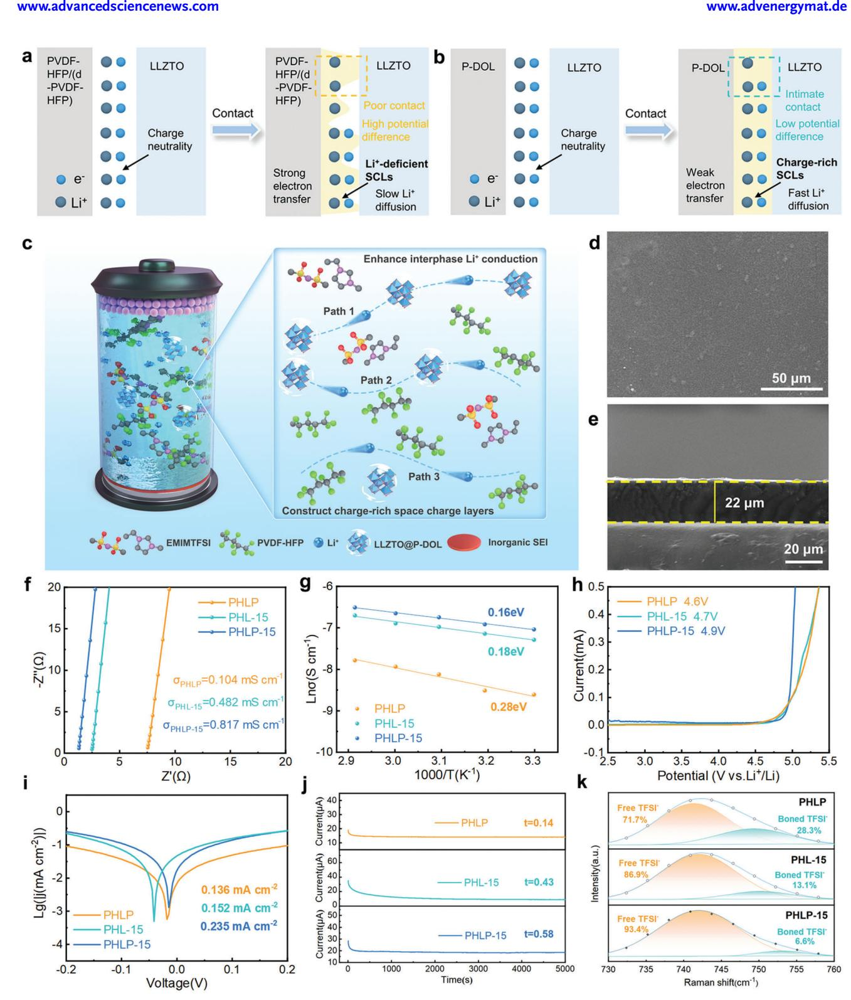
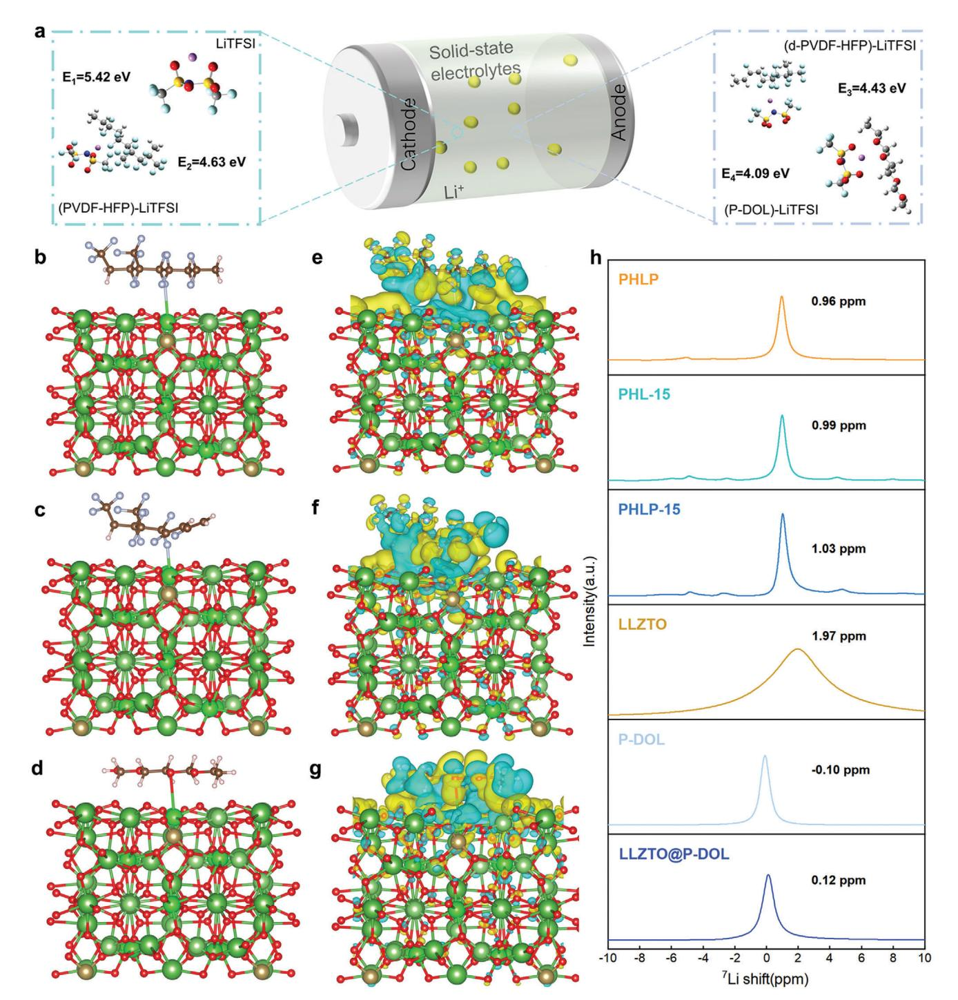
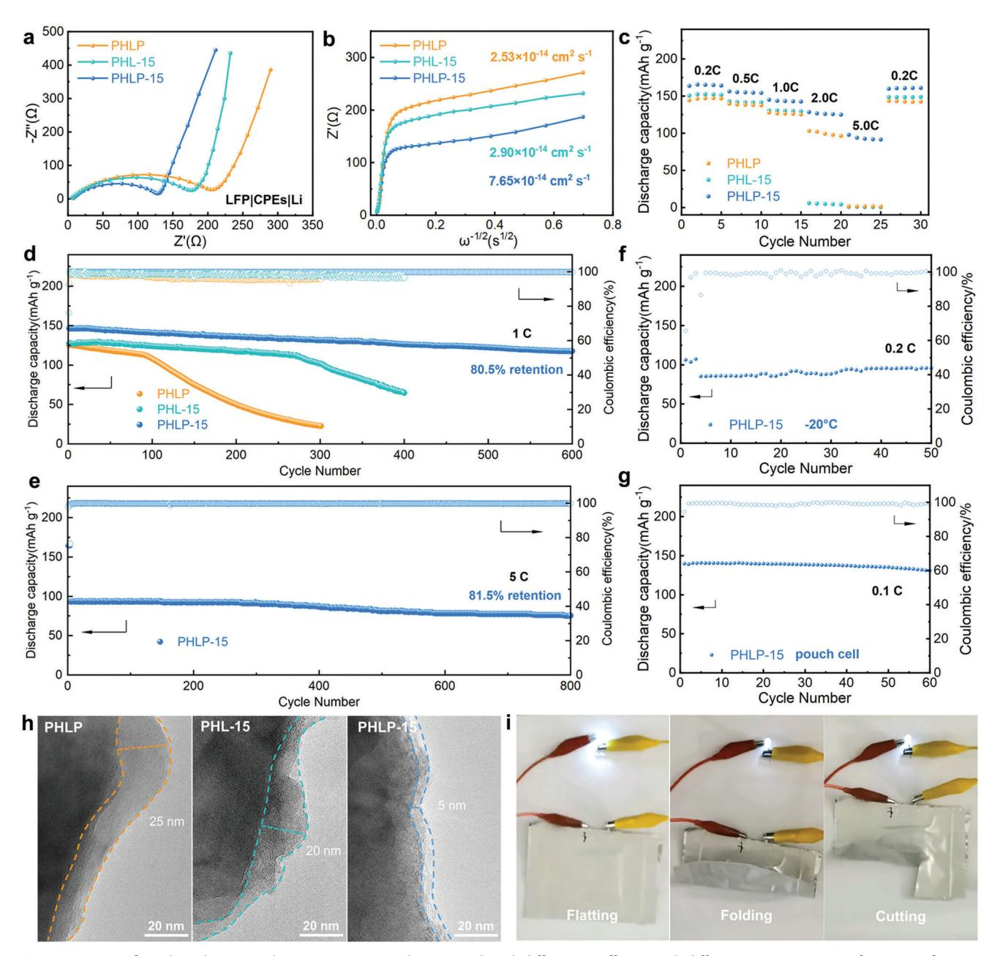
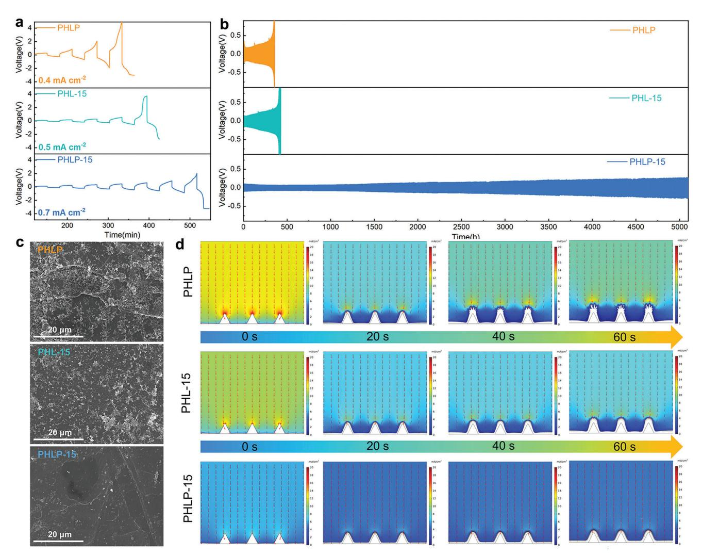
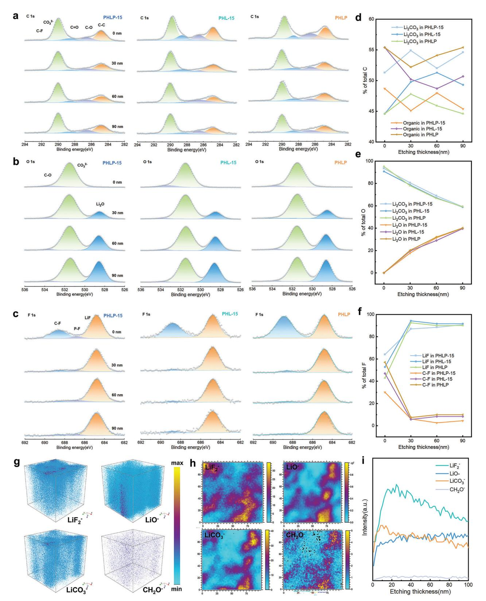
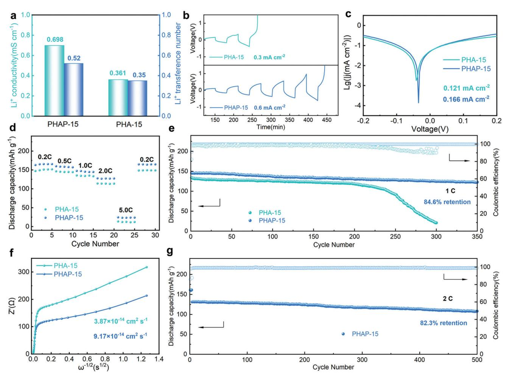

# **Enhanced Interphase Ion Transport via Charge-Rich Space Charge Layers for Ultra-Stable Solid-State Lithium Metal Batteries**

*Jin Li, Junjie Chen, Xiaosa Xu, Zhenyu Wang, Jiadong Shen, Jing Sun,\* Baoling Huang,\* and Tianshou Zhao\**

**The significant interfacial resistance between solid electrolyte-electrode interfaces is a major bottleneck for the practical application of solid-state lithium batteries. This resistance is primarily caused by the formation of space charge layers (SCLs), resulting from the redistribution of ionic carriers at the interface between dissimilar materials with varying chemical potentials, which lead to insufficient carriers and sluggish lithium-ion transport. In this study, a conjugated structure polymer is constructed through in situ polymerization onto the oxide electrolyte, forming charge-rich SCLs on the organic/inorganic interface, and enabling the interfacial layer to maintain superior ion transfer and contact. The Li solid NMR spectra and computational study suggest that optimized SCLs offer effective pathways for Li+ conduction in the electrolyte, thereby enhancing the interfacial conduction. Furthermore, the designed electrolyte induces the formation of an inorganic-rich interphase layer on the lithium anode, enabling rapid lithium-ion transport and uniform Li deposition. Consequently, the lithium symmetric cell with this electrolyte operates for more than 5100 h, while LiFePO4/Li solid-state batteries can stably cycle up to 800 times at 5 C. This interfacial modification strategy provides a new perspective for the rational design of the charge-rich SCLs and advances the understanding of the SCLs inside the electrolyte.**

#### **1. Introduction**

Solid-state lithium metal batteries (SSLMBs) with high safety and energy density are promising candidates to replace commercial

J. Li, J. Chen, X. Xu, Z. Wang, J. Shen, J. Sun, B. Huang, T. Zhao Department of Mechanical and Aerospace Engineering The Hong Kong University of Science and Technology Clear Water Bay, Kowloon, Hong Kong SAR 999077, China E-mail: [jsunav@connect.ust.hk;](mailto:jsunav@connect.ust.hk) [mebhuang@ust.hk;](mailto:mebhuang@ust.hk) [zhaots@sustech.edu.cn](mailto:zhaots@sustech.edu.cn)

T. Zhao Department of Mechanical and Energy Engineering Southern University of Science and Technology Shenzhen 518055, China

The ORCID identification number(s) for the author(s) of this article can be found under <https://doi.org/10.1002/aenm.202402746>

© 2024 The Author(s). Advanced Energy Materials published by Wiley-VCH GmbH. This is an open access article under the terms of the [Creative Commons Attribution-NonCommercial](http://creativecommons.org/licenses/by-nc/4.0/) License, which permits use, distribution and reproduction in any medium, provided the original work is properly cited and is not used for commercial purposes.

#### **DOI: 10.1002/aenm.202402746**

lithium-ion batteries with liquid electrolytes.[\[1\]](#page-10-0) Over the past few years, there have been the development of solid-state electrolytes with high ionic conductivities in the range of 10−3– 10−2 S cm−1, which are comparable to liquid electrolytes.[\[2\]](#page-10-0) However, their practical application is still limited by the inferior performance, resulting from sluggish lithium-ion transport across the solid electrode/electrolyte interface.[\[3\]](#page-10-0) The interfacial ion transport is affected by space charge layers (SCLs), ionically resistive products, and poor physical contact, among which the influence of SCLs cannot be neglected.[\[4\]](#page-10-0) When two materials with different chemical potentials are in contact, the positive charge carriers near the interface of the high-potential material are driven toward the material with the lower chemical potential, resulting in an increase in vacancy concentration and a decrease in interstitial concentration on highpotential side.[\[5\]](#page-10-0) To balance the chemical potential, electrons migrate from the

low-potential material to the high-potential material to establish local charge neutrality, thus forming a SCL.[\[6\]](#page-10-0) SCLs form especially at the electrolyte/cathode interface, electrolyte/anode interface, and oxide/polymer interface in composite polymer electrolytes (CPEs).[\[7\]](#page-10-0) Particularly, there are not enough charge carriers (Li+) in SCLs for efficient ion transport, which increases interfacial resistance and polarization, leading to poor performance.[\[8\]](#page-10-0) Introducing an intermediate layer between the two phases with high ion-conductive properties can be effective in increasing the interfacial ion transport.[\[9\]](#page-10-0) With the introduction of the intermediate layer, the potential difference between the two materials in contact is greatly alleviated, resulting in a reduction in the transfer of Li+ from the high-potential material. SCLs between electrolytes and electrodes have been extensively studied especially for sulfide electrolytes and oxide cathode materials.[\[10\]](#page-10-0) For example, Li4Ti5O12, [\[11\]](#page-10-0) LiNbO3, [\[12\]](#page-10-0) and LiTaO3 [\[13\]](#page-10-0) are proposed to act as intermediate layers between sulfides and oxides, resulting in reduced interfacial impedance and increased power density in solid-state batteries. However, SCLs formed between polymers and inorganic materials in CPEs have been rarely explored.

CPEs are a promising candidate for high-performance SSLMBs due to their combination of high ionic conductivity of solid inorganic electrolytes and excellent mechanical strength of solid polymer electrolytes.[14] Previous studies have demonstrated the enhancement of ion transport in CPEs by incorporating inorganic oxide fillers (such as Li2S6, Li7La3Zr2O12 (LLZO),[15] Li1.5Al0.5Ti1.5(PO4)3 (LATP)),[16] which demonstrated excellent electrochemical performances in SSLMBs. Zheng et al. used solid-state nuclear magnetic resonance (NMR) techniques to trace the Li+ transportation pathway in LLZO-based CPEs and concluded that Li+ mainly transports through LLZO fillers rather than the PEO-LLZO interface or PEO.[17] The addition of inorganic fillers leads to the decrease of the glass transition temperature  $(T_a)$  of the polymer and promotes the dissociation of lithium salt, thus increasing the ionic conductivity of CPEs.[18] However, the interfacial incompatibility between filler and polymer matrix results in Li+-deficient SCLs due to the high potential difference and strong electron transfer, which hinder the transport of Li+ in CPEs and limit the improvement of ionic conductivity.[19] To solve the above problems, the Fan's team reported that the  $\text{Li}_{10}\text{GeP}_2\text{S}_{12}$  (LGPS) filler and PEO polymer formed solid chemical bonds through an in situ coupling reaction, which promoted the uniform dispersion of the filler and acted as a bridge to enhance Li+ transport along the polymer-filler interface.[20] However, the effect of SCLs on interfacial Li+ transportation remains unclear due to the lack of direct experimental evidence of interfacial charge distribution. In addition, according to Ma et al. group, the presence of Li-excess in SCLs and the accommodation of additional Li+ can promote lithium-ion transport.[21] Therefore, the construction of advantageous SCLs and Li+ transport pathways in CPEs is crucial for extending the service life of SSLMBs.

This study introduces a simple and scalable method for designing CPEs with advantageous SCLs to improve the conductivity of electrolytes effectively. CPEs based on PVDF-HFP (poly(vinylidene fluoride-co-hexafluoropropylene)) and LLZTO  $(\rm{Li}_{6.4} \rm{La}_{3} \rm{Z} \rm{r}_{1.4} \rm{Ta}_{0.6} \rm{O}_{12})$  have been reasonably explored owing to their good membrane-forming capability, excellent mechanical strength, as well as wide electrochemical window. However, there is a large potential difference between PVDF-HFP and LLZTO, which leads to increased amount of electron transfer. During cell operation, more lithium ions are consumed to establish local charge neutrality when passing through the PVDF-HFP/LLZTO interface, forming Li+-deficient SCLs and slow Li+ diffusion (Figure 1a). In contrast, the conjugated structure polymer (P-DOL) coating on LLZTO forms intimate contact which consumes few Li+, leading to charge-rich SCLs and fast Li+ diffusion. Therefore, the transfer of lithium ions at the internal interface of the electrolyte is improved (Figure 1b). The enhanced interphase ion transport mechanism was verified through simulation, solid-state NMR, and various electrochemical characterizations. Additionally, the designed electrolyte promotes the dissociation of lithium salts, improves ion transport, and forms a stable inorganic-rich interface to inhibit the growth of lithium dendrites. The symmetric cell operates stably for 5100 h at 0.1 mA cm $-2$ , and the LiFePO4/Li cell delivers excellent cycling stability of more than 800 cycles at 5 C, with a capacity decay of only 0.037% per cycle. In addition, by applying the same interfacial modification method, we prepare LAGP-based

 $(Li1.5Al0.5Ge1.5(PO4)3)$  electrolytes with both high ionic conductivity and interfacial stability.

#### **2. Results and Discussion**

Although the addition of LLZTO improves lithium-ion conduction in CPEs, the La atom of LLZTO forms complexation with the N atom/ $C=0$  group in the solvent. This leads to the electron accumulation on the N atom, which acts as a Lewis base and induces PVDF-HFP dehydrofluorination and electrolyte yellowing, resulting in a decrease in the mechanical properties of the electrolyte and the compatibility of the electrodes (Figure S1, Supporting Information).[22] To address this issue, we construct a CPE (referred to as PHLP-15) with charge-rich SCLs by incorporating P-DOL-coated LLZTO (named as LLZTO@P-DOL) particles with PVDF-HFP polymer electrolyte, which achieves rapid ion migration through a variety of  $Li^+$  migration pathways. Here, for a detailed description of the experimental procedure for LLZTO@P-DOL particles synthesis, please refer to the supporting information. The P-DOL layer with favorable wettability improves the contact of LLZTO/PVDF-HFP interface, inhibit the dehydrofluorination of PVDF-HFP (referred to as d-PVDF-HFP), and greatly promote the transport of lithium ions at the interface. As illustrated in Figure 1c, the novel design of PHLP-15 allows for the transportation of Li+ ions through three main pathways: 1) neighboring LLZTO@P-DOL particles, 2) through both LLZTO@P-DOL particles and PVDF-HFP based polymer electrolyte, and 3) the soft and continuous PVDF-HFP based polymer electrolyte medium. The PHLP-15 not only solves the contact problem between filler and polymer matrix in CPEs but also significantly increases the conductivity and transfer number of ions.

As depicted in Figure S2a,b (Supporting Information) in the TEM image, LLZTO particles are surrounded by non-uniform P-DOL nanolayers which are formed by in situ polymerization as can be confirmed from highly homogeneous distribution of C, N, S, P, and F elements. Figure 1d and Figure S3 (Supporting Information) show that the surface of PHLP-15 films is smooth and clear, and energy dispersive spectroscopy (EDS) mapping indicates that the characteristic elements are highly uniformly distributed, implying the homogeneous dispersion of LLZTO@P-DOL particles in PHLP-15. In addition, the thin thickness of  $\approx$ 22 µm for the PHLP-15 (Figure 1e) would benefit the high energy density SSLMBs. The composition of the electrolyte is optimized by adjusting the relative content of LLZTO@P-DOL to achieve the highest ionic conductivity ( $\sigma_{i+}$ ) as shown in Table **S1** (Supporting Information). Electrochemical impedance spectroscopy (EIS) was employed to measure the ionic conductivity of CPEs at room temperature (Figure S4, Supporting Information). The results indicate that PHLP-15 containing 15 wt.% LLZTO@P-DOL exhibits the highest conductivity at room temperature. The decrease in room temperature conductivity of CPEs with concentrations exceeding 15 wt.% can be attributed to the inevitable agglomeration and increased crystallinity of the electrolyte due to excessive filler content. In comparison, electrolytes without P-DOL nanolayers was referred to as PHL-15, while electrolytes without LLZTO referred to as PHLP.

As shown in Figure 1f, the  $\sigma_{Li^+}$  of PHLP-15 is measured to be 0.817 mS cm $-1$ , higher than those of PHL-15 (0.482 mS cm $-1$ )

**Figure 1.** a,b) Schematic illustration of Li+ transport and SCLs interfacial evolution in SSLMBs with different CPEs. c) Schematic illustration of the preparation of PHLP-15 films. Proposed Li+ transport mechanism in PHLP-15. Three kinds of transport pathways: 1) transport via neighboring LLZTO@P-DOL particles, 2) transport via both LLZTO@P-DOL particles and PVDF-HFP based polymer electrolyte. 3) transport via PVDF-HFP-based polymer electrolyte. d) SEM images of PHLP-15 membranes. e) Cross section morphology of PHLP-15 films. f) EIS test with PHLP, PHL-15, and PHLP-15. g) Arrhenius plot. h) Electrochemical stability windows. i) Tafel plots. j) The chronoamperometry profiles of symmetric lithium metal battery with PHLP, PHL-15, and PHLP-15. k) Raman spectra curves.

and PHLP (0.104 mS cm−1). The improved conductivity of PHLP-15 can be attributed to the formation of increased ion conduction pathways within the polymer/inorganic hybrid network. Arrhenius diagram shows that the activation energy (Ea) of ion transport is reduced from 0.28 to 0.16 eV (Figure [1g\)](#page-2-0), owing to the ion-regulating role of SCLs and enhanced electrolyte/electrode wettability in the PHLP-15. The high-voltage electrochemical stability of electrolytes is a critical characteristic for practical cell applications. Figure [1h](#page-2-0) illustrates the linear sweep voltammetry (LSV) tests conducted with three types of electrolytes. Compared to PHLP and PHL-15, PHLP-15 demonstrates enhanced electrochemical stability of up to 4.9 V due to the strong antioxidant capability of LLZTO@P-DOL, making it suitable for pair with most high-voltage cathodes. To further investigate the crystallization characteristics in different electrolyte systems, differential scanning calorimetry (DSC) tests were conducted (Figure S5, Supporting Information). The PHLP-15 exhibits a significantly lower Tg in comparison to PHLP and PHL-15. This result shows that the incorporation of LLZTO@P-DOL significantly reduced the crystallinity of the PVDF-HFP matrix, mainly due to the interaction between LLZTO@P-DOL and the polymer matrix, which produced more amorphous regions in the polymer. Furthermore, the thermal stability of different electrolytes was evaluated by thermogravimetric analysis (TGA). As depicted in Figure S6a,b (Supporting Information), evaporation of water and solvent may result in slight weightlessness of CPEs below 200 °C. The degradation temperatures of PHLP, PHL-15 and PHLP-15 were 386.8 °C, 394.7 °C, and 416.4 °C, much higher than the operating temperature of SSLMBs (generally below 150 °C), ensuring high thermal safety.

Moreover, the exchange current density (ECD) of Li|PHLP-15|Li is measured to be 0.235 mA cm−2, indicating enhanced ion transport kinetics in the solid electrolyte interphase (SEI) (Figure [1i\)](#page-2-0). Moreover, the Li+ transference number (*tLi*+ ) simulation was calculated using the Bruce-Vincent-Evans equation (Figure [1j;](#page-2-0) Figure S7, Supporting Information). The results demonstrates that PHLP-15 exhibited a significantly higher *tLi*+ value of 0.58 compared to PHLP (0.14) and PHL-15 (0.43). The improved Li+ transport kinetics in electrolytes with LLZTO@P-DOL confirms the construction of more efficient transport pathways. The Gaussian Lorentz model is used to deconvolve the Raman spectra of PHLP, PHL-15 and PHLP-15 to study the coordination environment of TFSI- and Li+. As shown in Figure [1k,](#page-2-0) the peak observed at 736 – 744 cm−1 belongs to the freely uncoordinated TFSI−, while the peak detected at 745 – 755 cm−1 belongs to the TFSI- aggregates.[\[23\]](#page-11-0) The results show that the content of free TFSI- in PHLP-15 is 93.4%, which is much higher than that in PHLP (86.9%) and PHL-15 (71.7%), indicating that the bound TFSI- is greatly reduced. This behavior implies that the introduction of LLZTO@P-DOL facilitates LiTFSI dissociation. In a word, charge-rich SCLs facilitate the formation of a regulated Li coordination environment, increase the amount of free Li+, and provide a continuous Li+ migration pathway. To validate this hypothesis and identify the enhanced interphase transport mechanism of lithium ions, ex situ 7Li NMR and DFT analyses were performed in the subsequent section.

To obtain more insights into the effects of P-DOL on the dissociation of LiTFSI, DFT calculations and 7Li solid-state NMR were adopted to characterize the interaction between LiTFSI and different polymers. As shown in **Figure [2](#page-4-0)**a and Table S2 (Supporting Information), the dissociation energy of bare LiTFSI into Li+ and TFSI- is 5.42 eV. In comparison, in the three different electrolytes, the dissociation energies of LiTFSI in PVDF-HFP, d-PVDF-HFP, P-DOL are 4.63, 4.43, and 4.09 eV, respectively. The smaller energies mean easier dissociation of LiTFSI in the electrolytes. Particularly, P-DOL is beneficial for the release of more free lithium ions and improves ion transport kinetics, which is consistent with the measured Li+ conductivity in Figure [1e.](#page-2-0) Figure [2b–g](#page-4-0) shows the interactions and electron distributions at different LLZTO/polymer interfaces from DFT calculations, where the binding energies of LLZTO/PVDF-HFP and LLZTO/d-PVDF-HFP and LLZTO/P-DOL are −0.43, −0.26, and −1.14 eV, respectively (see Figure S8, Supporting Information for molecular model), indicating that the interaction between P-DOL and LLZTO is enhanced. The calculated charge difference distribution (CDD) reveals significant electron accumulation and depletion at the LLZTO/PVDF-HFP and LLZTO/d-PVDF-HFP interfaces than at the LLZTO/P-DOL interfaces. The electron accumulation and depletion (electron localization) will lead to Li+ clusters on LLZTO surfaces, which may grow into lithium metal dendrites.[\[24\]](#page-11-0) The Bader charge results shows that the electron transfer on the LLZTO/P-DOL (+0.0045 e) interface is weaker than that on the LLZTO/PVDF-HFP (−0.0993 e) and LLZTO/d-PVDF-HFP (−0.1352 e) interfaces, suggesting the lower potential difference in LLZTO/P-DOL interface. In addition, the charges in the SCLs are no longer neutral, and the separation of the charge will create an internal electric field at the boundary. According to Cheng's research, the formation of SCLs may be detrimental to interfacial ion transfer.[\[3a\]](#page-10-0) However, once a conjugated structure appears on the polymer side of the SCLs, lithium ions tend to reside more in the charge-rich SCLs than in the chargedeficient SCLs, as the latter may lead to electrostatic interactions and charge compensation is weakened. Moreover, LLZTO@P-DOL can effectively slow down potential difference, form a beneficial SCLs, and provide a continuous channel for Li+ migration due to electron delocalization, further improving the ion transport of CPEs. The charge atmosphere of Li+ was further characterized using 7Li solid-state NMR (Figure [2h\)](#page-4-0). Compared with PHLP, the down-field shift of the 7Li peak of PHL-15 and PHLP-15 electrolytes indicates that the electronic environment around Li+ is more dilute, resulting in the release of free Li+, which is beneficial for Li+ transport.[\[25\]](#page-11-0) Notably, the significant 7Li NMR signal appears once inorganic oxide is introduced into the CPEs, due to a decrease in the crystalline region of the PVDF-HFP polymer. Weaker electron transfer at the LLZTO/P-DOL interface promotes interfacial lithium-ion exchange, which is consistent with solid-state NMR data.

The electrochemical performance of LMBs with the three CPEs pairing with LFP-based (LiFePO4) cathodes was studied. The Li+ and electron transfer resistance were characterized using EIS (**Figure 3**[a\)](#page-5-0). It is found that the cell with PHLP-15 exhibits a smaller charge transfer resistance compared to the cells with PHLP and PHL-15, which is mainly due to the enhancement of component compatibility and the increase of Li+ migration channels caused by the P-DOL coating on LLZTO particle surface. In addition, the Li+ diffusion coefficients in PHLP, PHL-15, and PHLP-15 electrolytes were calculated to be 7.65 × 10−14, 2.90 × 10−14, and 2.53 × 10−14 cm2 s−1, respectively, as shown

**Figure 2.** a) Illustration of the interaction between PVDF-HFP, d-PVDF-HFP, P-DOL, and LiTFSI in the as-prepared PHLP, PHL-15, and PHLP-15. Interphase structure of the LLZTO (001) surface interacted with polymer in different CPEs and calculated CDD at the heterointerface of LLZTO/polymer. Yellow and blue isosurface represent electron accumulation and depletion regions, respectively. b,e) LLZTO/PVDF-HFP in PHLP; c,f) LLZTO/d-PVDF-HFP in PHL-15; d,g) LLZTO/P-DOL in PHLP-15. h) 7Li solid-state NMR spectra of PHLP, PHL-15, PHLP-15, P-DOL electrolytes, LLZTO, and LLZTO@P-DOL particles.

**Figure 3.** a) EIS of LFP-based LMBs with PHLP, PHL-15, and PHLP-15. b) Li+ diffusion coefficient with different CPEs. c) Rate performances from 0.2 C to 5.0 C at 30 °C. d,e) Long cycling performances of LFP batteries with different CPEs under different current rates at 30 °C. f) Cycling performance of the LFP|PHLP-15|Li cell at 0.2 C and −20 °C. g) Cycling performance of the LFP|PHLP-15|Li pouch cell at 0.1 C and 30 °C. h) TEM images of cycled LFP particles exposed with PHLP, PHL-15, and PHLP-15 electrolytes. i) Photographs of LFP|PHLP-15|Li pouch cell lighting LEDs under different bending angles of 0° and 90°, and under cutting.

in Figure 3b. The higher Li+ diffusion coefficient of PHLP-15 promotes the transportation of lithium ions within the batteries, thereby improving the discharge capacity and rate performance of SSLMBs. As shown in Figure 3c and Figure S9 (Supporting Information), the cell with PHLP-15 achieves specific discharge capacities of 164.2, 154.5, 142.8, 125.2, and 91.9 mAh g−1 at 0.2, 0.5, 1.0, 2.0, and 5.0 C, respectively, demonstrating satisfactory discharge capacities. The cycling performance of LFP/Li batteries with PHLP-15 is superior to those with PHLP and PHL-15 with an initial discharge capacity of 146.8 mAh g−1at 1 C. They can maintain 118.2 mAh g−1 even after 600 cycles, yielding a capacity retention rate of 80.5% (Figure 3d). During the cycling period, the Coulomb efficiency (CE) was always higher than 99.0%, implying that both the electrode/electrolyte interface and the bulk electrolyte are relatively stable. In comparison, the discharge capacities of LFP|PHLP|Li and LFP|PHL-15|Li batteries declined rapidly after ≈100 and 270 cycles, respectively, possibly due to an unstable CE and poor contact between CPEs and electrodes. Even at higher current rates of 5 C, the cell with PHLP-15 offers a high initial specific capacity of 93.6 mAh g−1 with an average capacity decay rate of only 0.037% even after undergoing 800 cycles and exhibits exceptional stability in terms of CE (Figure [3e\)](#page-5-0). Furthermore, it is found that the LFP|PHLP-15|Li batteries with high loading of LFP (Figure S10, Supporting Information) can also demonstrate superior reversible capacity and stable cycling performance. For example, with an active material loading of 5.3 mg cm−2, the cell demonstrates an initial discharge capacity of 152.4 mAh g−1 and stably cycles for over 100 cycles at 0.2 C. Moreover, the PHLP-15-based SSLMBs were tested at − 20 °C to evaluate the application potential at low temperatures. Figure [3f](#page-5-0) shows that the LFP|PHLP-15|Li cell was first activated with three cycles at 0.1 C with the specific capacity of the first cycle being 106.2 mAh g−1. The initial discharge capacity at 0.2 C cycling was 85.2 mAh g−1, and maintained cyclic stability over 47 cycles, indicating an excellent low-temperature performance that may be attributed to the relatively high ionic conductivity and stable interface contact. Additionally, a pouch cell containing PHLP-15, lithium metal anode, and LFP cathode was assembled to evaluate the potential for scale-up (Figure [3g\)](#page-5-0). The results demonstrate that the pouch cells with PHLP-15 exhibit stable cycling performance for over 60 cycles at 0.1 C at 30 °C while maintaining an excellent specific capacity with rare decay.

The LFP cathodes of cells with PHLP, PHL-15, and PHLP-15 after 20 cycles at 0.2 C were studied using a transmission electron microscope (TEM) (Figure [3h\)](#page-5-0). Thick and uneven cathode– electrolyte interphase (CEI) layers formed on the surface of the cycled LFP using PHLP and PHL-15 were obviously observed and the local thicknesses were measured to be 25 and 20 nm, respectively. In sharp contrast, the LFP cathode surface in the cell with PHLP-15 was coated with an amorphous and uniform CEI layer (≈5 nm), verifying the capability of PHLP-15 to form stable CEI in LMBs. More significantly, the solid-state LFP pouch cell can still tenaciously light up the white light-emitting diode (LED) under extreme conditions such as folding and cutting, as shown in Figure [3i,](#page-5-0) representing the electrochemical performance of pouch cells is high stability which are exposed to mechanical damage and suggesting the promising practical application of PHLP-15. Moreover, the pouch cell operates well lighting the LED device and bending over 200 times without any flame and explosion, suggesting high safety of the LFP|PHLP-15|Li pouch cell.

To assess the stability of the interface between CPEs and lithium metal anode, the stripping/plating behavior of lithium were tested in symmetric cells of Li|PHLP|Li, Li|PHL-15|Li, and Li|PHLP-15|Li. The critical current density (CCD) of the three cells was evaluated by conducting stepwise increasing constant current charge-discharge tests, as shown from the voltage-time curves in **Figure 4**[a.](#page-7-0) It can be observed that the Li|PHLP-15|Li cell exhibits a significantly higher CCD of 0.7 mA cm−2 compared to the 0.4 and 0.5 mA cm−2 for cells with PHLP and PHL-15, respectively. The voltage-time curves of three symmetric cells cycled at a current density of 0.1 mA cm−2 are depicted in Figure [4b.](#page-7-0) It is evidenced that the Li|PHLP|Li and Li|PHL-15|Li cells exhibit an exceptionally high initial overpotential and significant voltage fluctuations, which might be attributed to the large concentration polarization due to lower Li+ transfer number. In addition, due to the continuous increase in polarization voltage, cells with PHLP and PHL-15 can only stably cycle for 330 and 400 h, which could be attributed to uneven lithium deposition and unstable SEI. In contrast, the Li|PHLP-15|Li cell shows excellent cycling stability for 5100 h, with an initial polarization voltage of only ≈0.11 V and a maintained low polarization voltage of 0.27 V even after 5100 h. Figure S11 (Supporting Information) illustrates that the Li|PHLP-15|Li cell exhibited a flat voltage plateau during a selected cycle, indicating an enhanced interface compatibility between PHLP-15 and lithium metal anode. In addition, the cycled lithium metal anode shows significantly uneven dendritic lithium deposition in the Li|PHLP|Li and Li|PHL-15|Li cells after 100 h of cycling, as shown from the SEM image in Figure [4c.](#page-7-0) However, the lithium anode in the Li|PHLP-15|Li cell exhibits a dense and smooth lithium dendrite-free deposition layer after long-term cycling. This favorable deposition characteristic can be attributed to excellent mechanical properties and compatibility of PHLP-15 with the Li metal anode, together with the increased *tLi*+ .

To further explain the effect of LLZTO@P-DOL on the high interfacial stability of PHLP-15/Li, the finite element method using COMSOL Multiphysics software was employed to simulate the electric field (Figure S12a, Supporting Information), lithiumion concentration (Figure S12b, Supporting Information), and electrolyte current density distribution (Figure [4d\)](#page-7-0) at different time for PHLP/Li, PHL-15/Li, and PHLP-15/Li interfaces.[\[26\]](#page-11-0) The simulation results show an uneven distribution of Li+ flux in PHLP and PHL-15 systems, particularly at the protruding tip. The tips are the most active area for reaction and exhibits larger concentration gradients that lead to dendritic growth of lithium deposition. During the lithium plating stage, the Li/PHLP-15 interphase exhibits a uniform electric field distribution, a smaller gradient of lithium-ion concentration, and an even current density distribution, implying that it can homogenize Li+ flux and inhibit the high reaction activity at the protrusion, which leads to the uniform Li anode surface that is consistent with the observations from SEM images The plating/stripping processes in PHLP and PHL-15 were characterized by a significant concentration gradient of lithium ions, which could be attributed to the low lithium migration number, significantly increasing lithium dendrites. We hypothesize that the uniform Li+ transport of Li|PHLP-15|Li may also be due to the SEI layer with advantageous composition that results in low exchange current density and surface energy. To prove the above hypothesis and to identify specific key components, ex situ etching depth X-ray Photoelectron Spectroscopy (XPS) and Time-of-Flight Secondary Ion Mass Spectrometry (TOF-SIMS) analyses were performed in the next section.

In order to reveal the relationship between SEI and lithium storage behavior, the structure and composition of SEI on the lithium anode of Li|CPEs|Li battery after 20 cycles at different etching depths were studied by XPS. The high-resolution C 1s spectra depicted in **Figure [5](#page-8-0)**a exhibits characteristic peaks at 284.8, 286.5, 288.6, 289.9, and 292.6 eV, corresponding to C─C, C─O, C═O, CO3 2-, and C─F bonds respectively. Also, the highresolution O 1s and F 1s spectra in Figure [5b,c](#page-8-0) displays characteristic peaks at 528.6 eV (Li2O), 531.5 eV (CO3 2-), 533.5 eV (C─O), and 684.8 eV (LiF), 686.8 eV (P-F), and 688.6 eV (C─F). The LiF signal peak can be attributed to the efficient decomposition of lithium salts, while the P-F signal peak may be due to the existence of residual LiPF6 salts in the P-DOL layer. In addition, the C─O signal can be detected in the O 1s spectrum, but

www.advancedsciencenews.com

**Figure 4.** a) Critical current densities with different CPEs. b) galvanostatic cycling curves at 0.1 mA cm-2, 0.05 mAh cm-2 of Li|CPEs|Li. c) SEM images of lithium metal surface with PHLP, PHL-15, and PHLP-15 after 100 h. d) Evolution snapshots at different time steps from the phase-field simulation of current density within PHLP, PHL-15, and PHLP-15 cells.

disappears after sputtering, indicating that these C-O signals come from the adsorbed  $CH2O-$ anion. With the increase of sputtering depth, the proportion of inorganic components ( $Li_2CO_3$ ) of SEI in the cell with PHLP-15 is generally higher than that in cells with PHLP and PHL-15 (Figure 5d), indicating that inorganic components dominate the inner layer of SEI in PHLP-15. Besides, the  $Li_2O$  content in the electrolyte is increased with increased depth on the anode surface, which is conducive to achieving high CE in SSLMBs[27] (Figure 5e). Notably, more LiF and less organic components were observed along with the sputtering depth in the SEI in PHLP-15, indicating that SEI with rich inorganic components is helpful for improved cell stability and excellent cycle performance[28] (Figure 5f). The coexistence of  $\text{Li}_2\text{CO}_3$ , LiF, and  $Li_2O$  in the SEI plays an important role in preventing electron tunneling, ensuring that lithium ions nucleate at the Li/SEI interface, rather than inside the SEI. In addition, the high interfacial energy between these inorganics and the lithium anode also allows  $Li^+$  to diffuse faster during the plating process, ensuring uniform Li deposition.

TOF-SIMS analyses were performed to investigate the distribution of components in the SEI. As shown in Figure  $5g-i$ , atomic fragments associated with inorganic components including inorganic components such as LiF2, LiO, and LiCO3, and organic compounds such as CH2O- fragments. Notably, the intensity of LiF2, LiO, and LiCO3 in the SEI of PHLP-15 is much stronger than that of the organic fragments, indicating an inorganic-rich SEI structure. Moreover, the strength of  $LiF_2$  remained high throughout the sputtering process, representing. As displayed in 3D TOF-SIMS diagram, a SEI with abundant inorganics is demonstrated, suggesting that PHLP-15 has a favorable inhibitory effect on lithium dendrite growth, consistent with the XPS results. In summary, the inorganic-rich SEI mainly composed of Li2O and LiF has a lower surface diffusion barrier to Li+, which reduces the nucleation overpotential, accelerates the migration kinetics of interfacial Li+, leading to excellent electrochemical performances.

We further verified the concept of constructing charge-rich SCLs to improve the Li ion transport with other inorganic

**Figure 5.** a–c) XPS spectra of C 1s, O 1s, and F 1 s for Li anode in cells with PHLP, PHL-15, and PHLP-15 at 0, 30, 60, 90 nm (from top to bottom). d–f) The proportion of SEI components calculated from the C 1s, O 1s, and F 1s spectra. g) 3D TOF-SIMS visual maps showing the distribution of inorganic and organic species in the SEI of PHLP-15 anodes. h) 2D surface scanning of the distribution. i) TOF-SIMS negative ion depth profiles on the cycled Li electrode disassembled from Li|PHLP-15|Li cells.

**Figure 6.** a) Comparisons of *Li*+ and *tLi*+ between PHA-15 and PHAP-15. b) Critical current densities in symmetric cells with PHA-15 and PHAP-15. c) Tafel plots. d) Rate performance of the LMBs. e) Long-term charge and discharge cycling of the LMBs with PHA-15 and PHAP-15 under 1.0 C at 30 °C. f) The calculation of Li+ diffusion coefficient with different CPEs. g) Long cycling performances of LFP batteries with PHAP-15 at 2.0 C.

oxides, such as LAGP. The electrolyte is constructed using a similar preparation process. The resulting integrated electrolytes were named PHAP-15 and PHA-15 for LAGP with and without P-DOL coating, respectively. Although LAGP does not lead to dehydrofluorination in PVDF-HFP-based electrolytes, the interfacial side reaction between LAGP and Li anode will cause electrolyte volume expansion that impedes ion diffusion and increases the interfacial impedance. The P-DOL coated LAGP (LAGP@P-DOL) not only solves the contact problem at the electrode interface, but also helps suppress the formation of SCLs with electron aggregation between the LAGP and PVDF-HFP phases. Therefore, modifying the LAGP particles in PVDF-HFP based electrolytes is essential to improve the interface compatibility and ionic conductivity of solid-state batteries. As displayed in Figure S13a,b (Supporting Information) and **Figure 6**a, PHAP-15 exhibited a significantly higher*tLi*+ value of 0.52 compared to 0.35 for PHA-15. Li+ conductivities were calculated to be 0.361 and 0.698 mS cm−1 at 25 °C for PHA-15 and PHAP-15, respectively. The high value of PHAP-15 can be attributed to the fast lithiumion transport at the LAGP/P-DOL interface and the formation of charge-rich SCLs. Moreover, compared to the PHA-15 assembled lithium symmetry battery, which exhibits a larger polarization voltage at 0.3 mA cm−2, the PHAP-15 cell shows a higher CCD (0.6 mA cm−2). The ECD is measured at 0.121 mA cm−2 in the cell with PHA-15, and that value is remarkedly increased to 0.166 mA cm−2 in the cell with PHAP-15, showing the generation of fast Li+ transport in LAGP@P-DOL and the abundant supply of Li+ (Figure 6c).

To further determine the role of charge-rich SCLs in simultaneously improving ion conductivity and interfacial compatibility, PHA-15 and PHAP-15 were incorporated into LFP/Li cells that were charged and discharged at 0.2 C – 5.0 C (Figure 6d). A low discharge capacity is observed in LFP|PHA-15|Li cells. In comparison, the cell employing PHAP-15 demonstrates a high capacity of 165.7 mAh g−1 at 0.2 C and worked well at a high rate of 2.0 C. Its excellent reversibility can be attributed to the high ionic conductivity and excellent *tLi*+ of PHAP-15. The LFP|PHA-15|Li cell exhibited a remarkably high cycling stability at 1 C, and 84.6% of its original capacity (145.9 mAh g−1) was maintained after 350 cycles (Figure 6e). Such a behavior far exceeds the cell with PHA-15 that show a capacity retention of 15.6% after 300 cycles and only operate stable 200 cycles. The enhanced Li+ diffusion should be due to enhanced electrode/electrolyte affinity and reduced SEI resistance, resulting in improved rate performance in SSLMBs (Figure [6f;](#page-9-0) Figure S14, Supporting Information). Even at a high current density of 2 C, the battery capacity retention remains 82.3% (from 130.2 to 107.2 mAh g−1) after 500 cycles (Figure [6g\)](#page-9-0). The excellent cycling performance may be related to the enhanced ion motion in SCLs in PHAP-15, which is also helpful for alleviating the interfacial polarization.

In summary, the excellent electrochemical performances may come from four aspects: 1) Conjugated structural in LLZTO@P-DOL enables weaker electron transfer and lower potential difference, which are conducive to the fast transport of lithium ions in the charge-rich SCLs; 2) The internal interface with advantageous SCLs in the electrolyte provides a continuous channel due to electron delocalization, which leads to the enhancement of ionic conductivity; 3) The lithium metal anode is in close contact with the PHLP-15, and the formation of inorganic-rich SEIs can limit the formation of lithium dendrites; 4) The designed CPEs exhibit superior CEI layer in cathode and safety with pouch cell.

#### **3. Conclusion**

In conclusion, we constructed high-conductive and ultra-stable CPEs by incorporating P-DOL-coated LLZTO particles with PVDF-HFP polymer. The conjugated structure of the P-DOL layer and LLZTO not only triggers the dissociation of Li salts and generates more mobile Li+, but also forms a charge-rich SCLs, which efficiently transports the dissociated Li+. The electrolyte enables a high Li+ ion conductivity of as high as 0.817 mS cm−1 at 25 °C and the formation of an inorganic-rich SEI layer. As a result, the integrated CPE ensures stable plating/stripping of symmetric lithium batteries at 0.1 mA cm−2 for 5100 h. In addition, the CPEs exhibit stable interfacial stability with both LFP cathode and Li metal anodes, leading to the solid-state LFP/Li batteries to be stably cycled for over 800 cycles with ultra-stable stability at 5 C. This study offers an in-depth understanding of the influence of SCLs on the Li+ transport in oxide-polymer composite electrolytes, providing a theoretical basis for the rational design of high-performance solid electrolytes and internal interfacial layers of various types of alkali metal batteries.

## **Supporting Information**

Supporting Information is available from the Wiley Online Library or from the author.

#### **Acknowledgements**

This work was fully supported by grant from the Research Grants Council of the Hong Kong Special Administrative Region, China (No. R6005- 20), Guangdong Major Project of Basic and Applied Basic Research (No. 2023B0303000002), and Foshan-HKUST "University-Industry Cooperation Program" (No. FSNH22EG07). The authors would like to acknowledge Prof. Khalil Amine for providing valuable suggestions and advice on the characterization of the solid-solid interface.

#### **Conflict of Interest**

The authors declare no conflict of interest.

# **Data Availability Statement**

The data that support the findings of this study are available from the corresponding author upon reasonable request.

## **Keywords**

interfacial conduction, lithium metal batteries, solid-state electrolytes, space charge layers

> Received: June 24, 2024 Revised: August 22, 2024 Published online: September 9, 2024

- [1] a) J. Janek, W. G. Zeier, *Nat. Energy.* **2023**, *8*, 230; b) L. Z. Fan, H. C. He, C. W. Nan, *Nat. Rev. Mater.* **2021**, *6*, 1003; c) K. Yoon, S. Lee, K. Oh, K. Kang, *Adv. Mater.* **2022**, *34*, 2104666; d) B. J. He, F. Zhang, Y. Xin, C. Xu, X. Hu, X. Wu, Y. Yang, H. J. Tian, *Nat. Rev. Chem.* **2023**, *7*, 826.
- [2] a) P. Adeli, J. D. Bazak, K. H. Park, I. Kochetkov, A. Huq, G. R. Goward, L. F. Nazar, *Angew. Chem., Int. Ed.* **2019**, *58*, 8681. b) Z. Y. Wang, C. Z. Zhao, S. Sun, Y. K. Liu, Z. X. Wang, S. Li, R. Zhang, H. Yuan, J. Q. Huang, *Matter.* **2023**, *6*, 1096; c) W. Xia, Y. Zhao, F. P. Zhao, K. G. Adair, R. Zhao, S. Li, R. Q. Zou, Y. S. Zhao, X. L. Sun, *Chem. Rev.* **2022**, *122*, 3763.
- [3] a) Z. Cheng, M. Liu, S. Ganapathy, C. Li, Z. L. Li, X. Y. Zhang, P. He, H. S. Zhou, M. Wagemaker, *Joule.* **2020**, *4*, 1311; b) T. Famprikis, P. Canepa, J. A. Dawson, M. S. Islam, C. Masquelier, *Nat. Mater.* **2019**, *18*, 1278; c) J. Zhang, C. Zheng, L. J. Li, Y. Xia, H. Huang, Y. P. Gan, C. Liang, X. P. He, X. Y. Tao, W. K. Zhang, *Adv. Energy Mater.* **2020**, *10*, 1903311.
- [4] a) J. Li, Y. J. Cai, Y. Y. Cui, H. Wu, H. R. Da, Y. J. Yang, H. T. Zhang, S. J. Zhang, *Nano Energy.* **2022**, *95*, 107027; b) J. F. Wu, X. Guo, *Phys. Chem. Chem. Phys.* **2017**, *19*, 5880.
- [5] a) J. Maier, *Nat. Mater.* **2005**, *4*, 805; b) S. S. Shinde, N. K. Wagh, S. H. Kim, J. H. Lee, *Adv. Sci.* **2023**, *10*, 2304235.
- [6] a) L. L. Wang, R. C. Xie, B. B. Chen, X. R. Yu, J. Ma, C. Li, Z. W. Hu, X. W. Sun, C. J. Xu, S. M. Dong, T. S. Chan, J. Luo, G. L. Cui, L. Q. Chen, *Nat. Commun.* **2020**, *11*, 5889; b) K. Takada, T. Ohno, N. Ohta, T. Ohnishi, Y. Tanaka, *ACS Energy Lett.* **2018**, *3*, 98.
- [7] Y. Nomura, K. Yamamoto, T. Hirayama, S. Ouchi, E. Igaki, K. Saitoh, *Angew. Chem., Int. Ed.* **2019**, *58*, 5292.
- [8] S. Sasano, R. Ishikawa, G. Sánchez-Santolino, H. Ohta, N. Shibata, Y. Ikuhara, *Nano Lett.* **2021**, *21*, 6282.
- [9] Y. Seino, K. Takada, B. C. Kim, L. Q. Zhang, N. Ohta, H. Wada, M. Osada, T. Sasaki, *Solid State Ionics.* **2005**, *176*, 2389.
- [10] a) J. Haruyama, K. Sodeyama, L. Y. Han, K. Takada, Y. Tateyama, *Chem. Mater.* **2014**, *26*, 4248. b) Y. Chen, L. Huang, D. L. Zhou, X. Gao, T. F. Hu, Z. Y. Zhang, Z. Zhen, X. D. Chen, L. F. Cui, G. X. Wang, *Adv. Energy Mater.* **2024**, *14*, 2304443.
- [11] N. Ohta, K. Takada, L. Q. Zhang, R. Z. Ma, M. Osada, T. Sasaki, *Adv. Mater.* **2006**, *18*, 2226.
- [12] N. Ohta, K. Takada, I. Sakaguchi, L. Q. Zhang, R. Z. Ma, K. Fukuda, M. Osada, T. Sasaki, *Electrochem. Commun.* **2007**, *9*, 1486.
- [13] K. Takada, N. Ohta, L. Q. Zhang, K. Fukuda, I. Sakaguchi, R. Ma, M. Osada, T. Sasaki, *Solid State Ionics.* **2008**, *179*, 1333.
- [14] a) Y. D. Fu, K. Yang, S. D. Xue, W. H. Li, S. M. Chen, Y. L. Song, Z. B. Song, W. G. Zhao, Y. L. Zhao, F. Pan, L. Y. Yang, X. L. Sun, *Adv. Funct. Mater.* **2023**, *33*, 2210845; b) J. Li, Y. J. Cai, F. J. Zhang, Y. Y. Cui, W. H. Fang, H. Da, H. T. Zhang, S. J. Zhang, *Nano Energy.* **2023**, *118*, 108985; c) S. Wang, Q. F. Sun, Q. Zhang, C. Li, C. R. Xu, Y. Ma, X. X. Shi, H. Z. Zhang, D. W. Song, L. Q. Zhang, *Adv. Energy Mater.* **2023**,

*13*, 2204036; d) W. P. Chen, H. Duan, J. L. Shi, Y. M. Qian, J. Wan, X. D. Zhang, H. Sheng, B. Guan, R. Wen, Y. X. Yin, S. Xin, Y. G. Guo, L. J. Wan, *J. Am. Chem. Soc.* **2021**, *143*, 5717.

- [15] H. Mao, W. Yu, Z. Y. Cai, G. X. Liu, L. M. Liu, R. Wen, Y. Q. Su, H. R. Kou, K. Xi, B. Q. Li, H. Y. Zhao, X. Y. Da, H. Wu, W. Yan, S. J. Ding, *Angew. Chem., Int. Ed.* **2021**, *60*, 19306.
- [16] K. Zhang, G. H. Lee, M. Park, W. J. Li, Y. M. Kang, *Adv. Energy Mater.* **2016**, *6*, 1600811.
- [17] a) J. Zheng, H. Dang, X. Y. Feng, P. H. Chien, Y. Y. Hu, *J. Mater. Chem. A.* **2017**, *5*, 18457; b) J. Zheng, M. X. Tang, Y. Y. Hu, *Angew. Chem., Int. Ed.* **2016**, *55*, 12538.
- [18] a) C. L. Shen, M. Y. Yan, X. B. Liao, R. Q. Xu, H. Wang, W. C. Feng, W. Yang, Y. Li, C. Zhou, H. X. Wang, X. Xu, L. Q. Mai, *ACS Nano.* **2024**, *18*, 5068; b) N. Yang, Y. J. Cui, H. Su, J. Y. Peng, Y. Z. Shi, J. Niu, F. Wang, *Angew. Chem., Int. Ed.* **2023**, *62*, 202304339; c) X. W. Yu, A. Manthiram, *Energy Storage Mater.* **2021**, *34*, 282.
- [19] M. N. Shen, Z. Y. Wang, D. M. Cheng, H. Cheng, H. H. Xu, Y. H. Huang, *Etransportation.* **2023**, *18*, 100264.
- [20] H. Liu, P. G. He, G. X. Wang, Y. H. Liang, C. Wang, L. Z. Fan, *Chem. Eng. J.* **2022**, *430*, 132991.
- [21] Z. Q. Gu, J. L. Ma, F. Zhu, T. Liu, K. Wang, C. W. Nan, Z. Y. Li, C. Ma, *Nat. Commun.* **2023**, *14*, 1632.

- [22] X. Zhang, T. Liu, S. F. Zhang, X. Huang, B. Q. Xu, Y. H. Lin, B. Xu, L. L. Li, C. W. Nan, Y. Shen, *J. Am. Chem. Soc.* **2017**, *139*, 13779.
- [23] a) N. Chen, Y. J. Dai, Y. Xing, L. L. Wang, C. Guo, R. J. Chen, S. J. Guo, F. Wu, *Energy Environ. Sci.* **2017**, *10*, 1660; b) M. Yao, Q. Q. Ruan, T. H. Yu, H. T. Zhang, S. J. Zhang, *Energy Storage Mater.* **2022**, *44*, 93.
- [24] C. L. Shen, W. C. Feng, Y. K. Yu, H. X. Wang, Y. Cheng, C. X. Dong, J. P. Gu, A. Q. Zheng, X. B. Liao, X. Xu, L. Q. Mai, *Adv. Energy Mater.* **2024**, *14*, 2304511.
- [25] K. H. Wen, C. Z. Xin, S. D. Guan, X. B. Wu, S. He, C. A. J. Xue, S. J. Liu, Y. Shen, L. L. Li, C. W. Nan, *Adv. Mater.* **2022**, *34*, 2202143.
- [26] J. J. Li, H. M. Hu, W. H. Fang, J. W. Ding, D. Yuan, S. J. Luo, H. T. Zhang, X. Y. Ji, *Adv. Funct. Mater.* **2023**, *33*, 2303718.
- [27] a) H. P. Zeng, K. Yu, J. W. Li, M. M. Yuan, J. J. Wang, Q. R. Wang, A. J. Lai, Y. D. Jiang, X. Yan, G. Z. Zhang, H. L. Xu, J. Wang, W. Huang, C. Y. Wang, Y. H. Deng, S. S. Chi, *ACS Nano.* **2024**, *18*, 1969; b) G. M. Hobold, C. Z. Wang, K. Steinberg, Y. Z. Li, B. M. Gallant, *Nat. Energy.* **2024**, *9*, 580.
- [28] a) X. B. Cheng, S. J. Yang, Z. C. Liu, J. X. Guo, F. N. Jiang, F. Jiang, X. S. Xiong, W. B. Tang, H. Yuan, J. Q. Huang, Y. P. Wu, Q. Zhang, *Adv. Mater.* **2024**, *36*, 2307370; b) Z. J. Sun, J. L. Yang, H. F. Xu, C. L. Jiang, Y. X. Niu, X. Lian, Y. Liu, R. Q. Su, D. Y. Liu, Y. Long, M. Wang, J. Y. Mao, H. T. Yang, B. H. Cui, Y. K. Xiao, G. W. Chen, Q. Zhang, Z. X. Xing, J. S. Pan, G. Wu, W. Chen, *Nano-Micro Lett.* **2024**, *16*, 141.