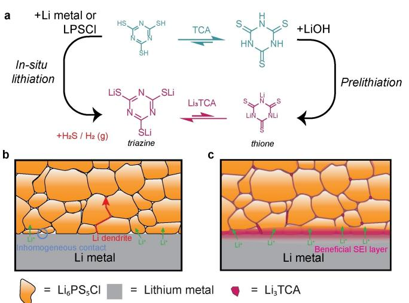
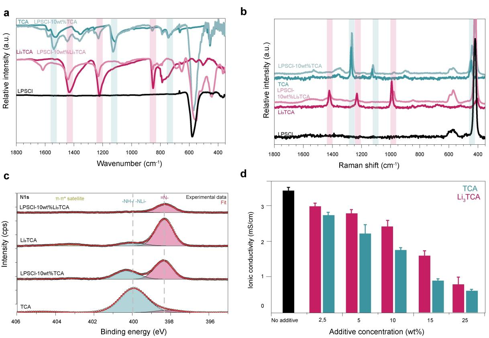
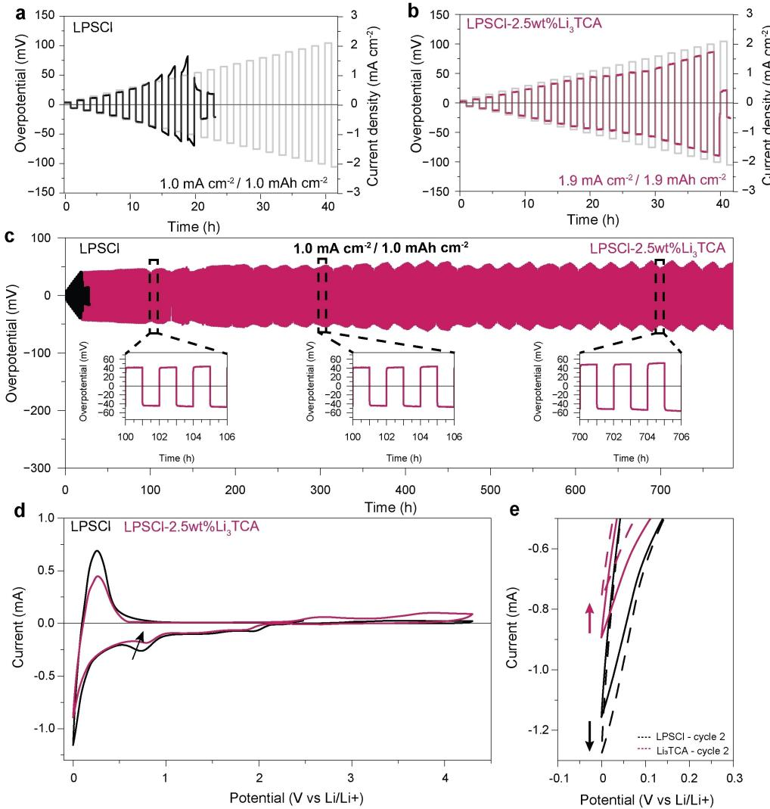
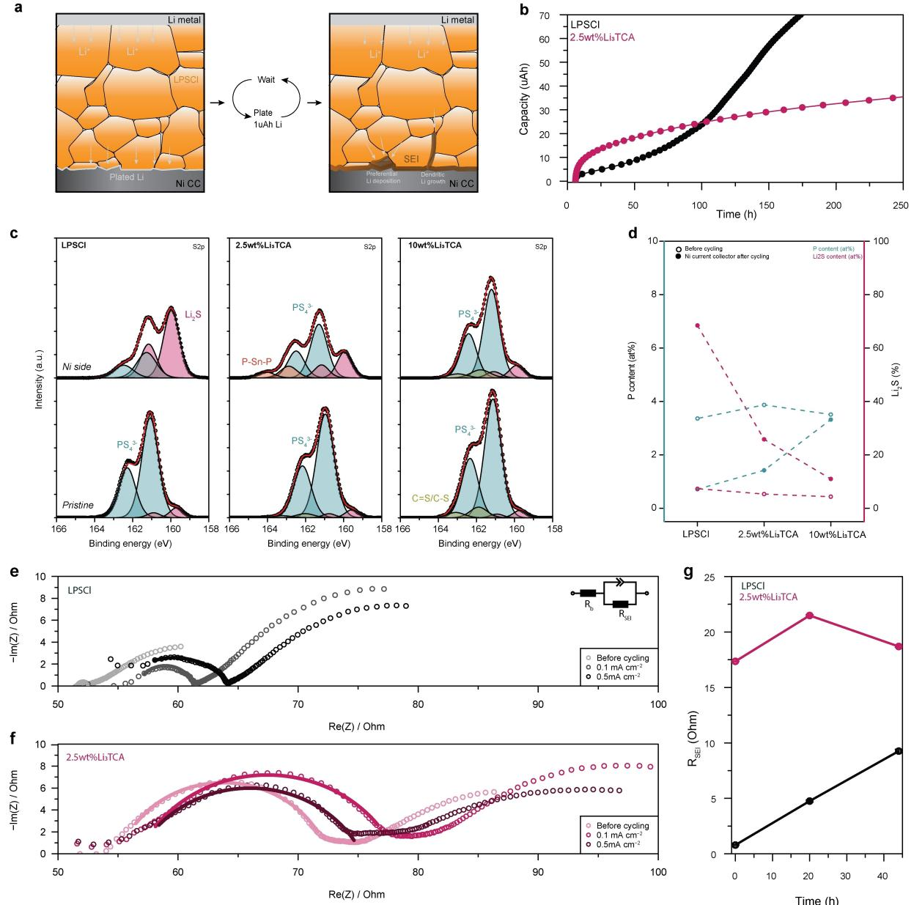
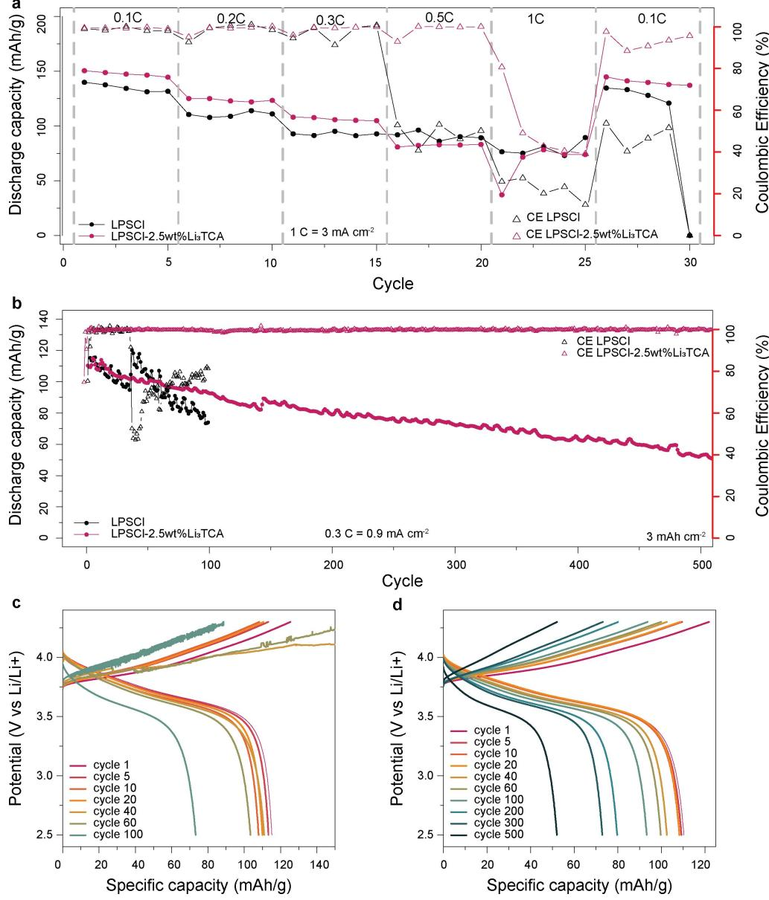

*Angewandte Chemie* www.angewandte.org

# *Solid-state Li Batteries*

Zitierweise: *Angew. Chem. Int. Ed.* **2024**, *63*, e202408238 [doi.org/10.1002/anie.202408238](https://doi.org/10.1002/anie.202408238)

# **Interfacial Stabilization by Prelithiated Trithiocyanuric Acid as an Organic Additive in Sulfide-Based All-Solid-State Lithium Metal Batteries**

*[Leonie](http://orcid.org/0000-0003-0651-1576) Braks, [Jinsong](http://orcid.org/0009-0001-8259-3318) Zhang, [Alexander](http://orcid.org/0000-0001-7101-6411) Forster, [Patrick](http://orcid.org/0000-0003-4609-6573) Fritz, [Jihoon](http://orcid.org/0000-0002-3603-6975) Oh, [Mario](http://orcid.org/0000-0003-2975-0481) El Kazzi, Jang [Wook](http://orcid.org/0000-0001-8783-0901) Choi,\* and Ali [Coskun\\*](http://orcid.org/0000-0002-4760-1546)*

**Abstract:** Sulfide-based all-solid-state battery (ASSB) with a lithium metal anode (LMA) is a promising candidate to surpass conventional Li-ion batteries owing to their inherent safety against fire hazards and potential to achieve a higher energy density. However, the narrow electrochemical stability window and chemical reactivity of the sulfide solid electrolyte towards the LMA results in interfacial degradation and poor electrochemical performance. In this direction, we introduce an organic additive approach, that is the mixing of prelithiated trithiocyanuric acid, Li3TCA, with Li6PS5Cl, to establish a stable interface while preserving high ionic conductivity. Including 2.5 wt% Li3TCA alleviates the decomposition of the electrolyte on the lithium metal interface, decreasing the Li2S content in the solid-electrolyte interface (SEI) thus forming a more stable interface. In LijLi symmetric cells, this strategy enables a rise in the critical current density from 1.0 to 1.9 mAcm 2 and stable cycling for over 750 hours at a high current density of 1.0 mAcm 2 . This approach also enables Lij NbO-NCM811 full cell to operate more than 500 cycles at 0.3 C.

# *Introduction*

Conventional lithium-ion batteries (LIBs), despite showcasing numerous advantages such as long cycle life and high energy density, enabling rapid integration into various modern societal applications, are nearing their theoretical limits in achievable specific energy density and continue to face safety concerns.[1] To further enhance their energy density, there is a compelling need to replace conventional graphite anodes with thin lithium metal anode (LMA), which offers the highest theoretical capacity of 3860 mAhg 1 . However, the formation of detrimental lithium dendrites, stemming from inhomogeneous plating/ stripping of Li, leads to poor cycling stability and safety issues.[2] Solid electrolytes (SEs) hold promise in mitigating these challenges due to their mechanical properties that impede Li dendrite growth.[3] Among the solid electrolytes, sulfide-based all-solid-state batteries (ASSBs) stand out because of their high ionic conductivity, favorable mechanical properties, and processability. Notably, argyrodite-type sulfide solid electrolytes (SSE) such as Li6PS5Cl (LPSCl) have garnered significant attention due to their ionic conductivity values surpassing 1 mScm 1 at room temperature and ease of processability. Despite these advantages, SSEs still suffer from narrow electrochemical stability windows as well as from the formation of a non-beneficial solid-electrolyte interface (SEI) composed of Li2S, and LiCl on the LMA surface, with high interfacial impedance.[4]

In order to stabilize the interface between sulfide-based SSEs and LMA, protection of the LMA surface with an artificial SEI and/or modification of the SSE composition have been actively pursued.[5] SSE modification often involves incorporating various metals into the argyrodite crystal structure, such as copper,[6] yttrium,[7] antimony,[8,9] or magnesium,[10] to enhance both ionic conductivity and stability toward lithium metal. Alternatively, halides can also replace sulfur in SSEs, increasing ionic conductivity and widening the electrochemical stability window.[11–13]

In conventional LIBs using liquid electrolytes, incorporating organic/inorganic additives is proven to be effective in

| [*] L. Braks, A. Forster, P. Fritz, Prof. A. Coskun | J. Oh, Prof. J. W. Choi                                                                                                                                                                                             |
|-----------------------------------------------------|---------------------------------------------------------------------------------------------------------------------------------------------------------------------------------------------------------------------|
| Department of Chemistry                             | School of Chemical and Biological Engineering and Institute of                                                                                                                                                      |
| University of Fribourg                              | Chemical Process                                                                                                                                                                                                    |
| Chemin de Musee 9, Fribourg 1700                    | Seoul National University                                                                                                                                                                                           |
| E-mail: ali.coskun@unifr.ch                         | 1 Gwanak-ro, Gwanak-gu, Seoul 08826, Republic of Korea                                                                                                                                                              |
| J. Zhang, Prof. M. El Kazzi                         | E-mail: jangwookchoi@snu.ac.kr                                                                                                                                                                                      |
| Electrochemistry Laboratory                         | © 2024 The Author(s). Angewandte Chemie published by Wiley                                                                                                                                                          |
| Paul Scherrer Institut                              | VCH GmbH. This is an open access article under the terms of the                                                                                                                                                     |
| Villigen 5232, Switzerland                          | Creative Commons Attribution Non-Commercial License, which permits use, distribution and reproduction in any medium, provided the original work is properly cited and is not used for commercial purposes. |

*Angew. Chem.* **2024**, *136*, e202408238 (1 of 8) © 2024 The Author(s). Angewandte Chemie published by Wiley-VCH GmbH

enhancing the formation of a uniform, inorganic-rich SEI layer, thus enabling a significant improvement in cycling performance.[14] In this context, organothiols such as arylthiols[15,16] and trithiocyanuric acid (TCA)[17] have emerged as an intriguing group of organic additives to realize a stable SEI on the LMA. Recently, we have also demonstrated the use of a covalent triazine framework[18] as an artificial SEI layer on the LMA surface to harness the lithiophilicity of the triazine moiety in order to promote uniform Li-ion flux. While these findings hold promise for LIBs, the use of organic additives in ASSBs remains unexplored. As such, here, we report (Scheme 1) the first example of organic additives in ASSBs. The addition of only 2.5 wt% of prelithiated TCA (Li3TCA) significantly enhances the stability of the LPSCl/Li interface, increasing the critical current density up to 1.9 mAcm 2 without sacrificing ionic conductivity (3.6 mScm 1 at room temperature). This modification results in a stable cycling performance, exceeding 750 hours in Li/Li symmetric cells at a current density of 1.0 mAcm 2 and 1.0 mAhcm 2 using thin (50 μm) Li metal. XPS study of the formed SEI showed reduced Li2S and increased P-contents, indicating the formation of a stable interface. The corresponding full cell, using LiNi0.8Co0.1Mn0.1O2 (NCM811), exhibits 80% capacity retention after 115 cycles at a 0.3 C charge and discharge rate and also demonstrates stable cycling for over 500 cycles.

# *Results and Discussion*

LPSCl with varying weight percentages of the organic additives was prepared by mortaring the LPSCl with either TCA or Li3TCA under an inert atmosphere. As LPSCl with 2.5 wt% of additives showed a very low signal intensity (Figure S1 and S2, respectively) in both Raman and Fourier-

*Scheme 1.* a) Trithiocyanuric acid (TCA) can be converted to lithiated trithiocyanuric (Li3TCA) in situ or by prelithiation in a LiOH solution. b) The issues with sulfide-based all-solid-state batteries and c) presence of Li3TCA additives creates a more P-rich, Li2S-poor SEI layer allowing more homogeneous Li flux.

transform infrared (FTIR) spectroscopy analyses, we performed the analysis using their 10 wt% counterparts (Figure 1a and b). While at low additive amounts of 2.5 wt%, no significant peak shifts in the P S vibrations were observed at 428 and 570 cm 1 , at 10 wt% of Li3TCA in FTIR, we observed a shift in the peak maximums towards lower wavenumbers, suggesting an interaction between LPSCl and Li3TCA. The powder X-ray diffraction (PXRD) pattern exhibited (Figure S3a) no shifts in the diffractions of the LPSCl phases, showing only a small additional diffraction corresponding to TCA at 26.6° (Figure S3b). The FT-IR spectrum displayed three characteristic vibrational peaks for the non-aromatic trithione form of TCA at 1528, 1116, and 744 cm 1 , as reported in the literature.[19,20] Conversely, prelithiated trithiocyanuric acid exhibited characteristic peaks for the aromatic trithiol at 1434, 1225 and 851 cm 1 . This result indicates the preference for the aromatic form upon lithiation of the TCA. Moreover, the peaks corresponding to the triazine and thione stretching bands at 1528 and 1116 cm 1 blue-shifted by 11 and 13 cm 1 , respectively (Table S1, Supporting Information), indicating a lower degree of conjugation of the aromatic ring, possibly due to the formation of coordination bonds with Li+ in the sulfide electrolyte. New peaks matching with the aromatic triazine core appear at 1446, 1230, and 856 cm 1 , indicating that part of the added TCA is in situ converted to Li3TCA upon mixing with the sulfide electrolyte, without any external triggers such as heat and electrochemical potential, most likely facilitated by aromatic stabilization. The conversion of TCA to its lithiated analog was also observed (Figure S4) at elevated temperatures or by exposure to humid air. This indicates the abstraction of Li+ from LPSCl and potential side reactions during the conversion.

Upon mixing LPSCl with TCA, the corresponding Raman spectra showed (Figure 1b) red-shifts of the peaks at 1362, 1272, and 1127 cm 1 by 10, 8, and 8 cm 1 , respectively. The typical Li3TCA bonding, as observed in FTIR, was not clearly visible due to the significantly lower Raman intensity of the lithiated species. For Li3TCA, the peak at 992 cm 1 , corresponding to the triazine ring stretching, is significantly red-shifted by 13 cm 1 due to the formation of Li+ · · ·N coordination bonds.[19] The peak maxima and shifts of the most important peaks for FTIR and Raman are summarized in Tables S1 and S2, respectively.

X-ray photoelectron spectroscopy (XPS) analysis (Figure 1c), using 10 wt% of organic additives, further confirmed the structural transformation of TCA upon contact with LPSCl (survey spectra are provided in Figure S5, 2.5 wt% in Figure S6). The N1s spectrum of TCA showed a main contribution at 400.0 eV, accounting for 89% of the signal intensity (Table S3) assigned to the trithione form,[21] with a minor contribution of the aromatic triazine form at 398.1 eV. Consistent with the Raman and FTIR results, Li3TCA displayed a more prominent triazine environment at 398.4 eV constituting 79%. Mixing TCA with LPSCl thus revealed a clear interconversion of the majority of TCA to its lithiated form, evidenced by the shift of the main peak from 400.0 eV to 398.3 eV. The lithium in this case can only be provided by the LPSCl. The native triazine form under-

*Angew. Chem.* **2024**, *136*, e202408238 (2 of 8) © 2024 The Author(s). Angewandte Chemie published by Wiley-VCH GmbH

*Figure 1.* Characterization of LPSCl, LPSCl-TCA, LPSCl-Li3TCA in different weight percentages. a) FTIR spectra b) Raman spectra c) XPS and d) ionic conductivity.

goes a shift of approximately 0.3 eV upon lithiation with either LiOH or LPSCl (Table S3), providing direct evidence of the decrease in electron density on the N atoms upon binding with Li.[17] Furthermore, the deconvoluted S 2p spectra (Figure S7) and the fitting parameters (Table S4) provided proof for the conversion of large fractions of PS4 3 to other forms for TCA-modified samples.

We also measured the ionic conductivities as a function of the varying amounts of the organic additives at room temperature. For the 2.5 wt% additive, TCA and Li3TCA exhibited ionic conductivity values of 2.7 and 3.0 mScm 1 , respectively. In the case of Li3TCA, the lithiation step mitigated the impact on the ionic conductivity at higher weight percentages of Li3TCA. For TCA at higher weight percentages, the TCA-LPSCl grain boundaries were captured in the impedance analysis, as evidenced by the appearance of a semicircle in the high-frequency regime in the Nyquist plots (Figure S8). The retention of conductivity is surprising as organic additives, such as polymers dramatically decrease the ionic conductivity, even at low weight percentages (Table S5). While the bulk conductivity of the LPSCl fraction is thought to be unaffected, the grain boundary resistance is usually significantly increased. However, in the case of Li3TCA additive, this effect cannot be seen, suggesting that the small molecule can assist to some extent in Li-ion transport along the grain boundaries. This is further confirmed by testing the influence of similar molecular additives, namely trithiol benzene (TTB) and its lithiated analog (Li3TTB) (Figure S9). In this case, the conductivity decrease is more significant, indicating there is a strong effect of the triazine moiety through its interaction with Li ions.

Additionally, pressure-dependent EIS measurements were performed, and the resulting ionic conductivities are shown in Figure S10. At an operating pressure of 20 MPa, TCA and Li3TCA additives allow for higher ionic conductivity values closer to the maximum conductivity obtained in the pelletized form. At 20 MPa, whereas pristine LPSCl has only 25% of its maximum ionic conductivity, the addition of only 2.5 wt% Li3TCA increases that to 36%. Increasing the additive concentration further to 10 wt% allows for even more intimate interparticle contacts in the electrolyte layer, reaching 49% of the maximum conductivity. As described previously in the literature,[22–24] a good combination of particle size and narrow distribution of SE particles is known to play a key role in the formation of good Li+ -conductive pathways. In this case, the addition of Li3TCA appears to provide a similar effect. SEM images of the pellet surface after pressing further confirm the mechanical influence of the additive. We observed (Figure S11) a more homogeneous surface and fewer cracks for the LPSCl with the organic additive. Additionally, when comparing the nitrogen energy dispersive X-ray (EDX) mapping images of TCA and Li3TCA additive, a more homogeneous distribu-

*Angew. Chem.* **2024**, *136*, e202408238 (3 of 8) © 2024 The Author(s). Angewandte Chemie published by Wiley-VCH GmbH

tion can be seen for Li3TCA, possibly due to better dispersion of Li3TCA compared to TCA.

Considering the good ionic conductivity of Li3TCA and its beneficial effects on the interface properties, this additive was chosen for further analysis. To probe the impact of the organic additive, we conducted (Figure 2a and b) critical current density (CCD) measurement with 2.5 wt% Li3TCA and compared it with that of pristine LPSCl. The irreversible drop of the overpotential at 1.0 mAcm 2 for LPSCl suggests Li dendrite growth because of the unstable Li/LPSCl interface, resulting in short circuits. In contrast, with 2.5 wt% of Li3TCA, the CCD significantly increases to 1.9 mAcm 2 , indicating inhibition of Li dendrite growth by the organic additive. In the CCD experiments of symmetric cells using different amounts of Li3TCA (Figure S12), only the 2.5 wt% additive gives a significant enhancement in the CCD and cut-off capacity compared to bare LPSCl, demonstrating increased interfacial stability, while maintaining decent ionic conductivity.

Long-term Li plating and stripping at a high current density of 1.0 mAcm 2 and an areal capacity of 1.0 mAhcm 2 were tested. Stable interface formation was ensured by a stepwise increase of the current and capacity from 0.1 mA(h) cm 2 to 1.0 mA(h) cm 2 . The Li/Li symmetric cells with the organic additive showed (Figure 2c) excellent cycling stability for over 700 h, surpassing the performance observed in most comparable studies conducted on LPSCl (Table S6), owing to the enhanced interfacial stability. Insets in Figure 2c confirm a very stable voltage profile, despite the temperature fluctuations during long-term cycling. Li/Li symmetric cells with the organic additive, tested at 0.5 mAcm 2 /0.5 mAhcm 2 , also exhibited (Figure S13) more stable cycling compared to pristine LPSCl. To study the effect of Li3TCA on LPSCl, cyclic voltammogram (CV) curves of Li/LPSCl/(70%LPSCl-30%

*Figure 2.* Stability of LPSCl electrolyte with and without additive with the Li metal. Critical current density of a) Li/LPSCl/Li cells and b) Li/LPSCl-2.5wt%Li3TCA/Li cells at room temperature. c) Li plating and stripping at 1.0 mAcm 2 and 1.0 mAhcm 2 symmetrical cells. d) Cyclic voltammetry profile of Li/LPSCl/LPSCl+VGCF and Li/LPSCl-2.5 wt%/LPSCl+VGCF and e) Enlarged view of the reduction peaks in the first and second cycles.

*Angew. Chem.* **2024**, *136*, e202408238 (4 of 8) © 2024 The Author(s). Angewandte Chemie published by Wiley-VCH GmbH

VGCF) with and without the additive were recorded (Figure 2d,e). Most notably, the reduction current peak at 0 V is significantly reduced from 1.16 mA to 0.89 mA in the first cycle demonstrating the protective effect of the interfacial layer formed by the additive in contact with metallic Li. In the second cycle, a stable interface formation is further confirmed by a 14% decrease in the reduction current while that of LPSCl increases by 10%. Detailed analysis of the CV data (Figure S14) reveals a decrease in the intensity of the two reduction peaks of LPSCl[25] at 1.9 V and 0.75 V in the first cycle after adding the additive, indicating that the degradation pathway of LPSCl is blocked to some extent. Increasing the weight percentage of the additive (Figure S15) leads to a further decrease in the reduction current at 0 and 1.9 V. Additionally, the redox behavior of Li3TCA becomes more prominent at higher additive amounts with reversible peaks at 1.65 / 2.7 V, which are consistent with the potentials reported in previous literature, confirming the electrochemical activity.[19]

To understand the reason behind the improved cycling data and the decreased decomposition of LPSCl in the presence of the additive, we attempted to separate the Limetal from the sulfide pellet. However, despite numerous attempts using physical or chemical approaches, this proved to be highly challenging due to the force applied (20 MPa) and the thin Li-metal foil (50 um). Based on a recent report by Janek and co-workers,[26] we employed coulometric titration time analysis (CTTA) to investigate the SEI formation in a Li/LPSCl/Ni cell. By continuously plating 1μAh and waiting until the complete consumption of the Li into SEI (Figure 3a), the speed of SEI formation can be quantified. While this system exaggerates the SEI growth compared to symmetrical or full cells as new SEI is continuously formed, it serves as a model system enabling post-mortem characterization on the current collector side. From the voltage profiles (Figure S16), the accumulated charge consumption over time can be calculated (Figure 3b). Initially, Li consumption is significantly faster in the presence of the additive, indicating its substantial role in SEI formation even at low concentrations. After approximately 20 h, this initial SEI formation decelerates, suggesting the formation of a stable interface. In contrast, for pristine LPSCl, a significant acceleration of Li consumption is observed after 50 hours, attributed to dendritic Li growth, exposing a larger surface area of Li to non-reacted LPSCl and leading to faster lithium consumption.

After 200 hours of cycling, the cells were opened for post-mortem analysis. SEM analysis did not reveal significant morphological differences (Figure S17). XPS analysis was performed on pristine pellets, both on the current collector (Ni) and the pellet side after the CTTA experiment, where the Ni side is considered representative of the SEI composition. Survey scans are presented in Figure S18. For pristine LPSCl, S 2p spectra for the Ni side displayed excessive Li2S formation (Figure 3c and S19). Upon the addition of Li3TCA, the Li2S content is significantly reduced on the SEI side, as summarized in Figure 3d. Li2S, a degradation product of LPSCl, is often deemed a nonbeneficial SEI component due to its non-conductive properties,[4,26] and its absence suggests that Li3TCA alleviates the decomposition of LPSCl. This corresponds with the decrease in intensity of the reduction peaks in the CV typically assigned to LPSCl decomposition. Li1s spectra (Figure S20) further confirm the reduced Li2S formation. Due to the low amount of nitrogen present in the samples, it is hard to draw strong conclusions from the N1s spectra (Figure S21). However, there does seem to be a lower level of nitrogen present in SEI compared to the pellet, which could indicate the active involvement of the additive in the formation of the SEI.

Furthermore, compositional analysis based on the P spectra indicates exceptionally low phosphorus content in the SEI for pristine LPSCl, consistent with previous observations by Janek et al. (Figure 3d). A phosphorus-rich SEI is associated with a mechanically robust SEI, where Li3P forms a flexible network. In the presence of Li3TCA, phosphorus content recovers to expected percentages based on the pristine pellet, indicating its role in phosphorus retention and preventing its degradation into gaseous products.

EIS analysis also confirms the initial fast SEI formation, as evidenced by the presence of a high-frequency semicircle immediately upon assembly of the Li/Li symmetrical cells (Figure 3e). Upon cycling for 10 h at 0.1 mAcm 2 and subsequently at 0.5 mAcm 2 (Figure S23), EIS spectra are recorded and the Nyquist plots are shown, where the first semicircle is fitted with an equivalent circuit. Whereas the continuous growth of the RSEI can be observed for pristine LPSCl, only minor further growth of the SEI can be seen in the presence of the additive, suggesting that upon cycling a stable interface is formed (Figure 3g). Figure S24 shows cross-sectional SEM images of these cells, where pristine LPSCl shows varying Li/LPSCl interfaces with at some places excessive Li growth and very uneven thickness, while at other places there is complete contact loss. On the other hand, for samples with the additive, there was no contact loss and Li thickness was more uniform.

Based on the LMA compatibility of LPSCl modified with Li3TCA additive, LMA paired with LiNbO3-coated NCM811 positive electrode was evaluated. Two formation cycles at 0.05 C charge and 0.1 C discharge were adopted to form stable interphases. Rate capability tests under 0.1 C charge and various discharge rates (Figure S25) reveal very similar behaviors for the cells with and without the additive, with only differences at a high rate of 1 C. Long-term cycling stability at 0.1 C is also similar between these two conditions (Figure S26). Figure 4a shows the rate capability test performed under more challenging conditions with both charge and discharge at increasing rates. At 0.3 C, Li dendrites start to form on the bare LPSCl pellet, evidenced by the drop in Coulombic efficiency (CE) and the fluctuating charging profiles (Figure S27). On the contrary, LPSCl with Li3TCA keeps a stable charging profile up to 0.5 C. Additionally, the additive enables to recover a CE of 93.2% when returning to 0.1 C, while bare LPSCl has a low CE of only 48.1%.

At a charge and discharge rate of 0.3 C (Figure 4b), the difference in cycling performance of the full cells with and

*Forschungsartikel*

*Angewandte Chemie*

*Figure 3.* SEI characterization via CTTA. a) Schematic visualization of CTTA experiment, b) sum of accumulated capacity over time c) S 2p spectra for reference pellets before cycling and Ni current collector side after 200 h of CTTA experiment for LPSCl and LPSCl with 2.5 and 10 wt% of Li3TCA and d) the evolution of phosphor (blue) and Li2S contents (pink) with respect to the additive amount. Nyquist plots and fits before and after 10 cycles at 0.1 mAcm 2 and 0.5 mAcm 2 for e) Li/LPSCl/Li and f) Li/LPSCl-2.5wt%Li3TCA/Li and g) evolution of the resistance of the SEI based on EIS measurements.

without the additive is evident. At a loading of 15 mgcm 2 and 0.3 C, equivalent to a Li plating and stripping current of about 0.9 mAcm 2 , near the limit of bare LPSCl, the LMA interface exhibits greater stability in the presence of Li3TCA additive. The significant drops in CE for bare LPSCl even after a few cycles, indicate unstable Li stripping and dendrite formation, despite maintaining decent discharge capacity due to excess Li present in the anode. A detailed examination of the charge–discharge curves (Figure 4c) shows significant fluctuations in the absence of the additive, thus indicating that the LMA-SE interface is not stable and cannot maintain these challenging conditions. Conversely, with the organic additive, a stable interface is evident through stable charging curves (Figure 4d) and a high average CE of 99.8% with a capacity retention of 80% after 115 cycles. After 500 cycles, the cells still cycle stably with an average CE of 99.7%, validating that a completely stable interface has formed. However, it is noteworthy that the cathode capacity gradually decreases due to cathode stability issues, not addressed within the scope of this paper, with the remaining capacity at 47% after 500 cycles. Table S7 shows a comparison with full cell data obtained by other recent

*Forschungsartikel*

*Figure 4.* ASSB performances for Li/LPSCl( additive)/NCM811 cells with an active material loading of 15 mg cm 2 . a) Rate capability test at increasing charge and discharge rates. b) Cycling performance at 0.3 C charge and discharge and the corresponding charge–discharge curves for c) LPSCl and d) LPSCl-2.5wt%Li3TCA.

papers aimed at Li metal stabilization. These results underscore the potential of the organic additive approach to improve the cycling and rate performance of sulfide-based ASSBs owing to the formation of a stable interface with LMA.

#### *Conclusions*

In summary, we have introduced an organic additive approach to augment the stability of electrolyte-electrolyte and electrolyte-Li metal anode interfaces in sulfide-based ASSBs. Through this facile approach, which involves the mixing of a commercially available solid electrolyte with an inexpensive organic additive, a substantial enhancement in the stability of the lithium metal interface and electrochemical performance is realized. Analysis of the SEI showed decreased Li2S and increased P-content compared to pristine LPSCl, proving the power of molecular additives to tune the SEI composition in solid-state batteries. We anticipate that the large variety and tunability of small organic molecules will facilitate numerous functionalization strategies, addressing diverse challenges in sulfide-based ASSBs and propelling the technology closer to commercialization.

*Angew. Chem.* **2024**, *136*, e202408238 (7 of 8) © 2024 The Author(s). Angewandte Chemie published by Wiley-VCH GmbH

#### *Acknowledgements*

A.C. M.K. and J.W.C. acknowledge support from the Swiss National Science Foundation (SNSF) (grant No. Sinergia CRSII5\_202296). Open Access funding provided by Université de Fribourg.

# *Conflict of Interest*

Patent application describing the results presented in the manuscript has been jointly filed by University of Fribourg and Seoul National University

# *Data Availability Statement*

The data that support the findings of this study are openly available in Zenodo at [https://doi.org/10.5281/zenodo.](https://doi.org/10.5281/zenodo.11630869) [11630869](https://doi.org/10.5281/zenodo.11630869), reference number zenodo.11630868.

**Keywords:** Sulfide Solid Electrolyte **·** Interfacial Stability **·** Organic Additive **·** Stable SEI **·** All-Solid-State Li metal battery

- [1] Y. Nishi, *J. Power Sources* **2001**, *100*, [101–106.](https://doi.org/10.1016/S0378-7753(01)00887-4)
- [2] W. Xu, J. Wang, F. Ding, X. Chen, E. Nasybulin, Y. Zhang, J.- G. Zhang, *Energy [Environ.](https://doi.org/10.1039/C3EE40795K) Sci.* **2014**, *7*, 513–537.
- [3] F. Zheng, M. Kotobuki, S. Song, M. O. Lai, L. Lu, *J. [Power](https://doi.org/10.1016/j.jpowsour.2018.04.022) Sources* **2018**, *389*, [198–213.](https://doi.org/10.1016/j.jpowsour.2018.04.022)
- [4] S. Wenzel, S. J. Sedlmaier, C. Dietrich, W. G. Zeier, J. Janek, *Solid State Ionics* **2018**, *318*, [102–112.](https://doi.org/10.1016/j.ssi.2017.07.005)
- [5] J. Li, J. Luo, X. Li, Y. Fu, J. Zhu, X. Zhuang, *EcoMat* **2023**, e12383.
- [6] B. W. Taklu, W. N. Su, Y. Nikodimos, K. Lakshmanan, N. T. Temesgen, P. X. Lin, S. K. Jiang, C. J. Huang, D. Y. Wang, H. S. Sheu, S. H. Wu, B. J. Hwang, *Nano [Energy](https://doi.org/10.1016/j.nanoen.2021.106542)* **2021**, *90*, [106542.](https://doi.org/10.1016/j.nanoen.2021.106542)
- [7] Y. Xia, J. Li, J. Zhang, X. Zhou, H. Huang, X. He, Y. Gan, Z. Xiao, W. Zhang, *J. Power [Sources](https://doi.org/10.1016/j.jpowsour.2022.231846)* **2022**, *543*, 231846.
- [8] L. Zhou, A. Assoud, Q. Zhang, X. Wu, L. F. Nazar, *J. [Am.](https://doi.org/10.1021/jacs.9b08357) Chem. Soc.* **2019**, *141*, [19002–19013](https://doi.org/10.1021/jacs.9b08357).
- [9] H. Liu, Q. Zhu, Y. Liang, C. Wang, D. Li, X. Zhao, L. Gao, L.- Z. Fan, *J. Chem. Eng.* **2023**, *462*, [142183](https://doi.org/10.1016/j.cej.2023.142183).
- [10] C. Liu, B. Chen, T. Zhang, J. Zhang, R. Wang, J. Zheng, Q. Mao, X. Liu, C. Liu, B. Chen, T. Zhang, J. Zhang, R. Wang, J. Zheng, Q. Mao, X. Liu, *Angew. Chem. Int. Ed.* **2023**, e202302655.
- [11] Z. Zhang, Y. Tian, G. Liu, M. Wu, H. He, X. Yao, *[J.](https://doi.org/10.1149/1945-7111/ac67b4) [Electrochem.](https://doi.org/10.1149/1945-7111/ac67b4) Soc.* **2022**, *169*, 040553.
- [12] F. Zhao, Q. Sun, C. Yu, S. Zhang, K. Adair, S. Wang, Y. Liu, Y. Zhao, J. Liang, C. Wang, X. Li, X. Li, W. Xia, R. Li, H. Huang, L. Zhang, S. Zhao, S. Lu, X. Sun, *ACS [Energy](https://doi.org/10.1021/acsenergylett.0c00207) Lett.* **2020**, *5*, [1035–1043](https://doi.org/10.1021/acsenergylett.0c00207).
- [13] Y. Lee, J. Jeong, H.-D. Lim, S.-O. Kim, H.-G. Jung, K. Y. Chung, S. Yu, *ACS [Sustainable](https://doi.org/10.1021/acssuschemeng.0c05549) Chem. Eng.* **2021**, *9*, 120–128.
- [14] L. Li, H. Dai, C. Wang, *Nano Select* **2021**, *2*, [16–36](https://doi.org/10.1002/nano.202000164).
- [15] W. Guo, W. Zhang, Y. Si, D. Wang, Y. Fu, A. Manthiram, *Nat. Commun.* **2021**, *12*, 3031, DOI: [10.1038/S41467-021-23155-3](https://doi.org/10.1038/S41467-021-23155-3).
- [16] T. Zhou, Y. Zhao, P. W. Fritz, T. Ashirov, D. Baster, M. El Kazzi, A. Coskun, *Chem. Commun.* **2023**, *59*, [8286–8289](https://doi.org/10.1039/D3CC01179H) .
- [17] T. Zhou, Y. Zhao, J. W. Choi, A. Coskun, *[Angew.](https://doi.org/10.1002/anie.201908513) Chem. Int. Ed.* **2019**, *58*, [16795–16799.](https://doi.org/10.1002/anie.201908513)
- [18] C. Shi, S. Shao, C. Zong, J. Gu, Z. Huang, B. Hong, M. Wang, Z. Zhang, Y. Lai, J. Li, *J. Chem. Eng.* **2022**, *448*, [137552](https://doi.org/10.1016/j.cej.2022.137552).
- [19] Z. Yang, F. Wang, Z. Hu, J. Chu, H. Zhan, X. Ai, Z. Song, *Adv. Energy Mater.* **2021**, *11*, 2102962 DOI [10.1002/](https://doi.org/10.1002/aenm.202102962) [aenm.202102962](https://doi.org/10.1002/aenm.202102962).
- [20] D. Ko, J. S. Lee, H. A. Patel, M. H. Jakobsen, Y. Hwang, C. T. Yavuz, H. Chr. B. Hansen, H. R. Andersen, *J. [Hazard.](https://doi.org/10.1016/j.jhazmat.2017.03.007) Mater.* **2017**, *332*, [140–148](https://doi.org/10.1016/j.jhazmat.2017.03.007).
- [21] P. Drożdżewski, M. Malik, P. Kopel, D. C. Bieńko, *Polyhedron* **2022**, *220*, 115819.
- [22] E. Schlautmann, A. Weiß, O. Maus, L. Ketter, M. Rana, S. Puls, V. Nickel, C. Gabbey, C. Hartnig, A. Bielefeld, W. G. Zeier, *Adv Energy Mater* **2023**, *13*, 2302309.
- [23] C. Schneider, C. P. Schmidt, A. Neumann, M. Clausnitzer, M. Sadowski, S. Harm, C. Meier, T. Danner, K. Albe, A. Latz, W. A. Wall, B. V. Lotsch, *Adv. Energy Mater.* **2023**, *13*, 2203873.
- [24] J.-M. Doux, Y. Yang, D. H. S. Tan, H. Nguyen, E. A. Wu, X. Wang, A. Banerjee, Y. S. Meng, *J [Mater](https://doi.org/10.1039/C9TA12889A) Chem A Mater* **2020**, *8*, [5049–5055](https://doi.org/10.1039/C9TA12889A).
- [25] D. H. S. Tan, E. A. Wu, H. Nguyen, Z. Chen, M. A. T. Marple, J.-M. Doux, X. Wang, H. Yang, A. Banerjee, Y. S. Meng, *[ACS](https://doi.org/10.1021/acsenergylett.9b01693) Energy Lett.* **2019**, *4*, [2418–2427](https://doi.org/10.1021/acsenergylett.9b01693).
- [26] B. Aktekin, L. M. Riegger, S. K. Otto, T. Fuchs, A. Henss, J. Janek, *Nat. Comm.* **2023**, *14*, 1–14.

Manuscript received: April 30, 2024

- Accepted manuscript online: June 11, 2024
- Version of record online: July 25, 2024