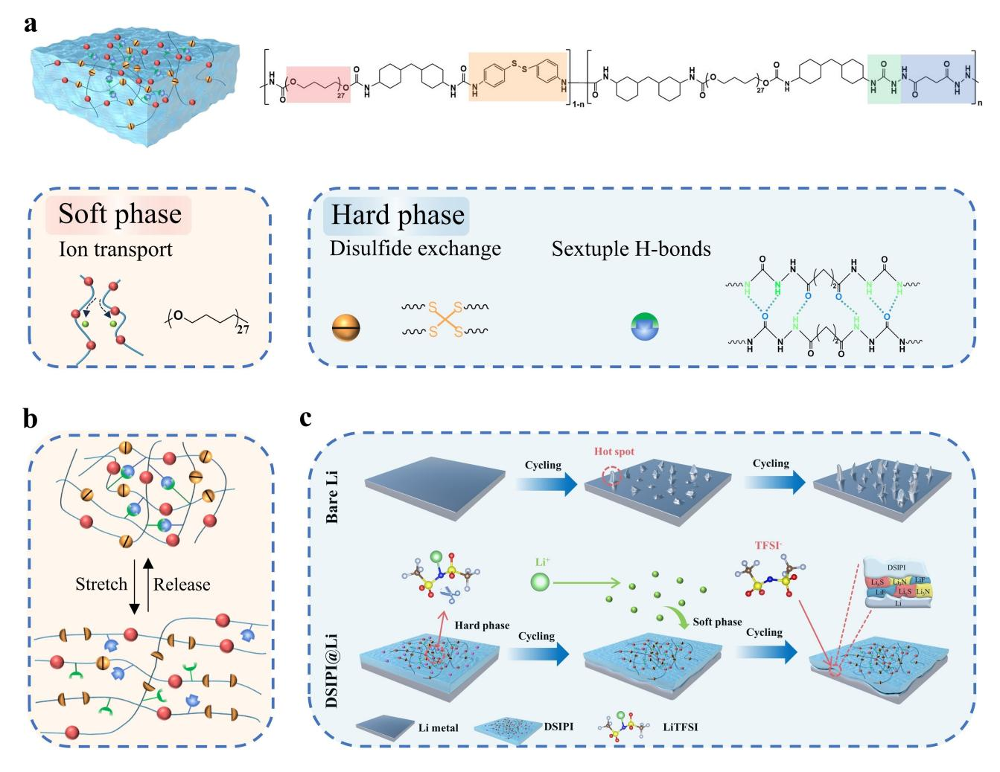
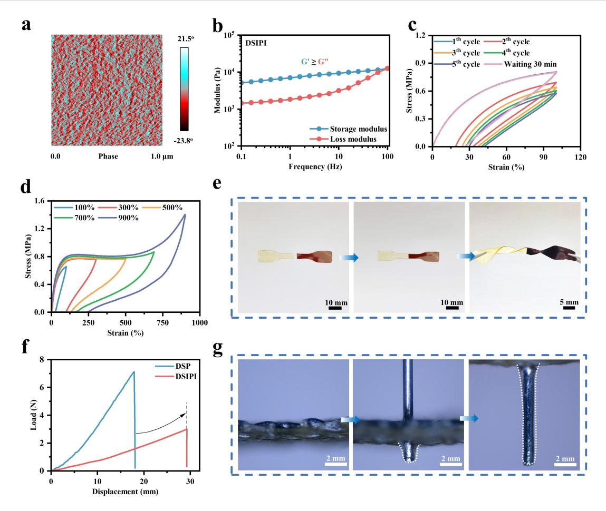
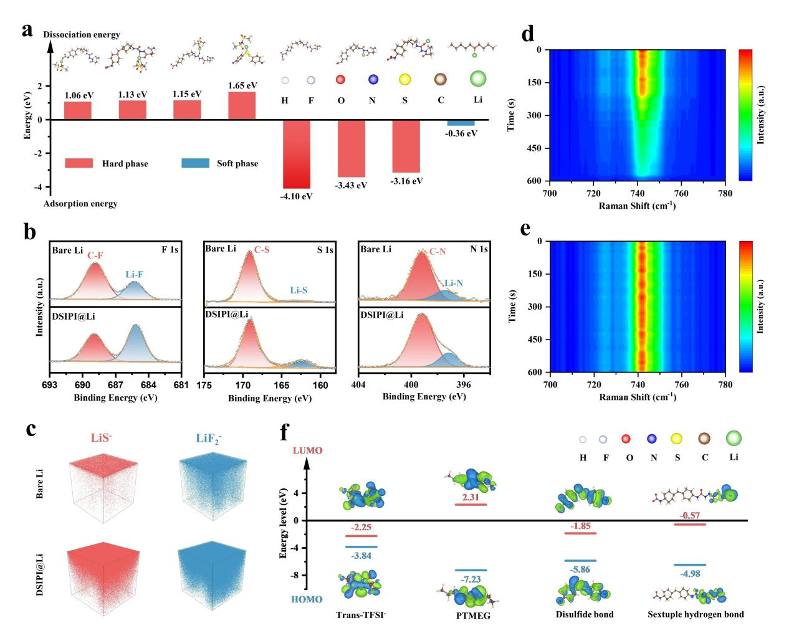
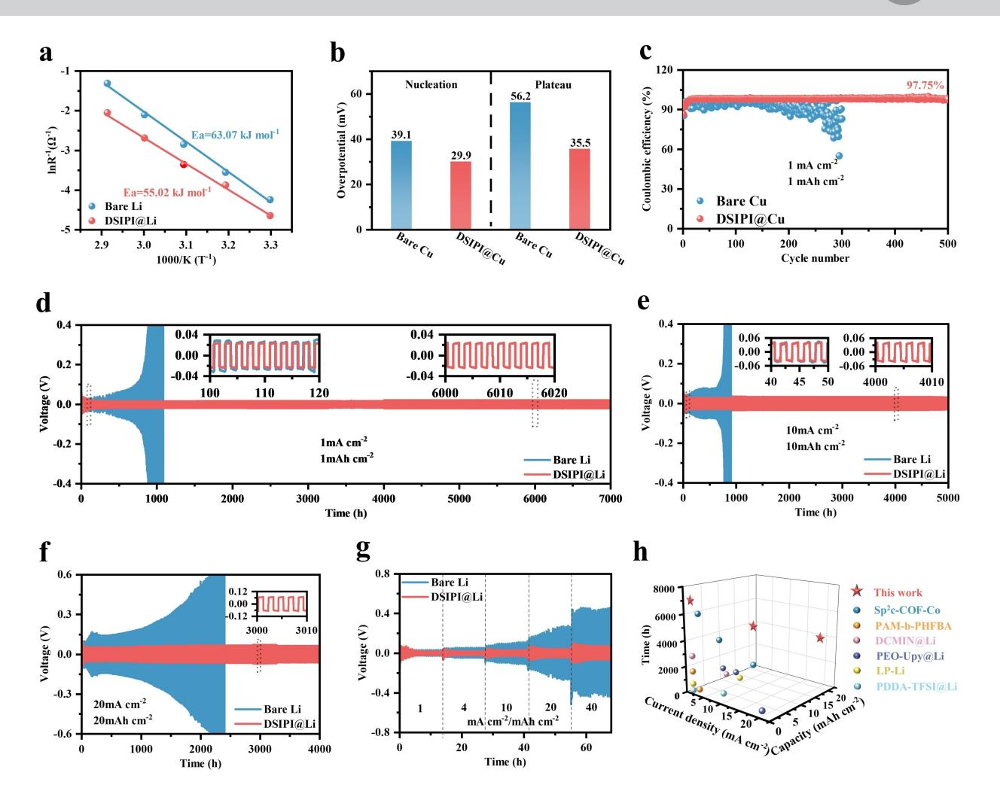
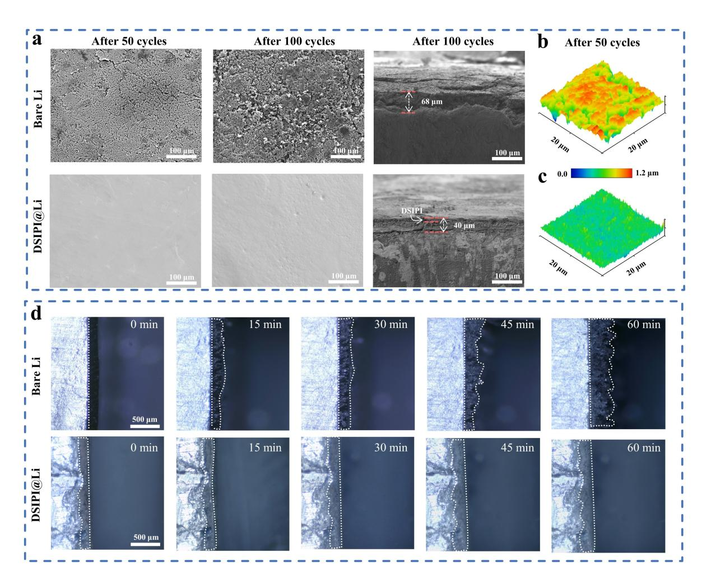
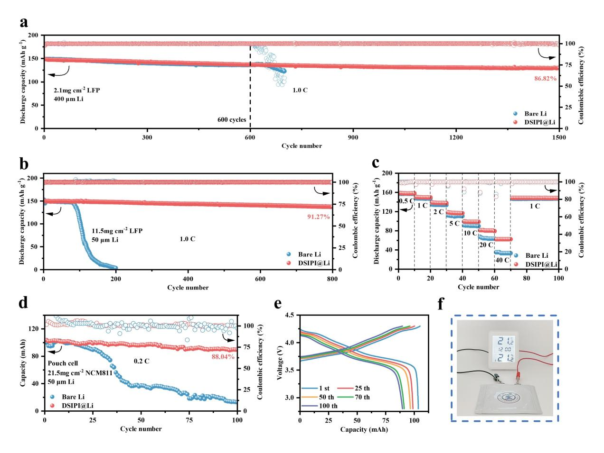

*Forschungsartikel*

*Angewandte Chemie* www.angewandte.org

## *Lithium Metal Batteries*

Zitierweise: *Angew. Chem. Int. Ed.* **2025**, *64*, e202414599 [doi.org/10.1002/anie.202414599](https://doi.org/10.1002/anie.202414599)

# **Ultra-Tough Dynamic Supramolecular Ion-Conducting Elastomer Induced Uniform Li**+ **Transport and Stabilizes Interphase Ensures Dendrite-Free Lithium Metal Anodes**

*Hong Liu, Fengxu Zhen, Xiangkai Yin, Yingbin Wu, Kailiang Yu, Xiangpeng Kong, [Shujiang](http://orcid.org/0000-0002-5683-0973) Ding,\* and [Wei](http://orcid.org/0000-0001-8935-4689) Yu\**

**Abstract:** Artificial polymer solid electrolyte interphases (SEIs) with microphase-separated structures provide promising solutions to the inhomogeneity and cracking issues of natural SEIs in lithium metal batteries (LMBs). However, achieving homogeneous ionic conductivity, excellent mechanical properties, and superior interfacial stability remains challenging due to interference from hard-phase domains in ion transport and solid-solid interface issues with lithium metal. Herein, we present a dynamic supramolecular ion-conducting poly (urethane-urea) interphase (DSIPI) that achieves these three properties through modulating the hard-phase domains and constructing a composite SEI in situ. The soft-phase polytetrahydrofuran backbone, featuring loose Li+ O coordinating interactions, ensures uniform Li+ transport. Concurrently, sextuple hydrogen bonds in the hard phase dissipate strain energy through sequential bond cleavage, thereby imparting exceptional mechanical properties. Moreover, enriched bis (trifluoromethanesulfonyl) imide anion (TFSI ) in DSIPI promotes the in situ formation of a stable polymer-inorganic composite SEI during cycling. Consequently, the DSIPI-protected lithium anode (DSIPI@Li) enables symmetric cells with exceptional cyclability exceeding 4,000 hours at an ultra-high current density of 20 mAcm 2 , thereby demonstrating excellent cycling stability. Furthermore, DSIPI@Li facilitates stable operation of the pouch cells under the constraints of a high-loading LiNi0.8Co0.1Mn0.1O2 cathode and low negative/positive capacity (N/P) ratio. This work presents a powerful strategy for designing artificial SEIs and high-performance LMBs.

## *Introduction*

The lithium (Li) metal anode is regarded as the most promising next-generation anode material due to its ultrahigh theoretical specific capacity (3860 mAhg 1 ) and exceptionally low redox potential ( 3.04 V vs. standard hydrogen electrode).[1–3] However, the natural solid electrolyte interphases (SEIs) formed by reactive Li and electrolytes typically contain localized "hotspots," for faster Li ion (Li+) conduction,[4,5] and uneven Li+ fluxes cause rapid growth of Li-dendrites.[6,7] Additionally, the Li plating/stripping reaction is accompanied by significant volume changes and mechanical strains, leads to continuous cracking of the fragile static SEIs.[8,9] This ongoing damage results in the depletion of active Li and electrolyte, ultimately leading to rapid failure of lithium metal batteries (LMBs).[10] Artificial polymer SEIs (APSEIs) are considered to be a promising

E-mail: dingsj@xjtu.edu.cn

yuwei2019@mail.xjtu.edu.cn

Research and Development Center, Hunan Desay Battery Co., Ltd Changsha, Hunan 410000 (P. R. China)

*Angew. Chem.* **2025**, *137*, e202414599 (1 of 11) © 2024 Wiley-VCH GmbH

solution to these problems due to their highly tunable molecular chain structures, which replace natural SEIs.[11,12] However, it is well known that there is an inherent contradiction between the ionic conductivity and mechanical properties of polymers.[13] In addition, the introduction of APSEIs needs to be considered for the stability of its contact with the Li solid-solid interface, another important issue affecting the cycle life of LMBs.[14,15]

To address these issues, APSEIs with microphaseseparated structures (APSEI-MS) have been considered.[16–18] APSEI-MS can form regions with distinct chemical and physical properties that stabilize ion transport channels, disperse stress, and provide chemically inert areas, thereby enhancing the homogeneous conductivity, mechanical properties, and interfacial stability.[19–21] For instance, Xiong et al.[22] applied a copolymer containing urea pyrimidinone (UPy) to Li surfaces, ensuring enhanced interfacial stability through the strong binding force of UPy groups. Wang et al.[23] developed a highly conductive adaptive supramolecular polymer (PFPE EG I), where ethylene glycol (EG) segments facilitate uniform ion transport and hydrogen bonding units improve interfacial stability. However, current studies on APSEI-MS reveal two inherent trade-offs among uniform conductivity, mechanical properties, and interfacial stability, making it challenging to enhance all three properties simultaneously. One trade-off involves uniform conductivity and mechanical strength.[24] Mechanical properties are generally improved by enlarging

[\*] H. Liu, F. Zhen, X. Yin, Y. Wu, K. Yu, S. Ding, W. Yu School of Chemistry, Xi'an Jiaotong University, Engineering Research Center of Energy Storage Materials and Devices, Ministry of Education, State Key Laboratory of Electrical Insulation and Power Equipment Xi'an 710049 (P.R. China)

X. Kong

the hard phase region, resulting in greater microphase separation and crystallinity, thus hindering uniform ion transport.[25,26] Another trade-off concerns mechanical properties and interfacial stability.[27] It is well-known that permanently cross-linked, highly ductile APSEI-MS with strong covalent bonds struggle to form a stable interface in close contact with Li surfaces, thus various breakable or dynamic bonds are introduced to enhance elasticity for interfacial contact stability.[28] If these weak bonds are integrated into APSEI-MS, they often react with the highly active Li anode during cycling, damaging the polymer structure and thus impairing mechanical properties.[29,30] Therefore, compromises are crucial to balance these required properties for practical APSEI-MS applications, necessitating meticulous molecular-level structural design.

In this work, we effectively develop a dynamic supramolecular ion-conducting poly(urethane-urea) interphase (DSIPI). Benefiting from the modulation of hardphase domain, on one hand, the strong polarity of sextuple hydrogen bonds within hard phase rapidly dissociates lithium bis(trifluoromethanesulphonyl)imide (LiTFSI) within DSIPI. The dissociated Li+ is then uniformly transported through loose Li+ O coordination interactions within the soft phase polytetrahydrofuran backbone. On the other hand, the sextuple hydrogen bonds enhance mechanical properties and dissipate strain energy produced by significant volume changes through sequential bond-breaking. Moreover, the strong interactions of the hydrogen bonds prevent the hard-phase domains from expanding and help maintain homogeneity on the microscopic scale, thereby improving mechanical properties without compromising the capacity for uniform ion transport. Additionally, the dissociated bis(trifluoromethanesulfonyl)imide anions (TFSI ), having a lower lowest unoccupied molecular orbital (LUMO) energy level than reversible bonds, preferentially dissociate and promote the in situ formation of a polymerinorganic composite SEI enriched with LiF, Li3N, and LixS. The high-modulus inorganic component enhances mechanical properties and induces rapid Li+ deposition. Ultimately, enhancements in both mechanical properties and interfacial stability are achieved simultaneously, without compromising the polymer structure. With these desirable properties, the DSIPI-coated Li anode (DSIPI@Li) could cycle for 4000 hours at an ultra-high current density of 20 mAcm 2 in a symmetrical cell with uniform Li plating/stripping. The DSIPI@Lij jNCM811 pouch cell with ultra-thin Li foil (50 μm) and a high area loading of LiNi0.8Co0.1Mn0.1O2 (NCM811, 21.5 mgcm 2 ) retained 88% capacity over 100 cycles. Consequently, this work provides effective guidance for the development of high-performance LMBs.

## *Results and Discussion*

## *Polymer Molecular Design for DSP and DSIPI*

The design of multifunctional polymer materials is essential for the construction of APSEIs. The dynamic supramolecular poly (urethane-urea) (DSP) was synthesized

*Angew. Chem.* **2025**, *137*, e202414599 (2 of 11) © 2024 Wiley-VCH GmbH

in two steps via prepolymer polycondensation, with the preparation process depicted in Figure S1. Based on meticulous molecular structure design, poly (tetramethylene ether glycol) (PTMEG) was used in the soft phase to dissociate/ complex Li+ through loosely coordinated Li+ O interactions. 4,4'-dithiodianiline (DTDA) and butanedioyl dihydrazide (BD) were selected for the hard phase, with the disulfide bond (S S) in DTDA primarily providing selfrepairing ability, and the sextuple hydrogen bonds in BD responsible for mechanical enhancement. In order to endow the DSP with ionic conductivity, LiTFSI was selected. This salt, known for its high ionic conductivity, excellent solubility, and both its electrochemical and thermodynamic stability, serves as the conductive electrolyte salt.[31]

We developed a series of DSP-n to determine the optimal percentage of chain extender, where 'n' represents the percentage of BD in 1 mmol of chain extender (Figure S2a). Figure 1a presents a schematic diagram of the synthesized DSP polymers. The N=C=O stretching band at 2260 cm 1 in Fourier transform infrared (FTIR) spectroscopy disappeared, indicating that the reaction was fully completed (Figure S2b). The characteristic proton peak of the benzene ring at 6.55 ppm in the liquid nuclear magnetic resonance hydrogen spectrum ( 1 H NMR) gradually diminished with the reduction in DTDA content, further confirming the successful synthesis of DSP-n (Figure S3). The mechanical properties of the DSP-n materials were assessed using unidirectional tensile testing at room temperature, and Figure S4a illustrates the tensile stress-strain curve for the DSP-n samples. Among them, DSP-7.5 exhibited the most superior mechanical properties with tensile strength and strain rate of 64.8 MPa and 1130%, respectively. Toughness was obtained by integrating the area of the stress-strain curve,[32] as shown in Figure S4b, and DSP-7.5 has the highest toughness of 250.8 MJm 3 .

To further determine the optimal electrolyte salt content, various mass fractions of LiTFSI were dissolved in DSP-n and cast into thin films. The ionic conductivity was subsequently assessed using electrochemical impedance spectroscopy (EIS) at 30 °C (Figure S5 and Table S1). Figure S6 shows minimal variation in ionic conductivity among DSP-n samples with identical LiTFSI concentrations, and the ionic conductivity peaks at 30 wt% LiTFSI content. Ionic conductivity stabilizes when the LiTFSI content exceeds 30 wt%, since Li+ transport in DSP-n is primarily driven by Li+ O coordination interactions in the soft phase, which reach a saturation limit, thus ensuring ionic conductivity remains stable with a fixed soft phase content. The DSP-7.5 was chosen as the material for subsequent applications and renamed DSP. DSP containing the optimal concentration of 30 wt% LiTFSI is termed DSIPI. Unless otherwise indicated, all studies in this work concentrate on this chain extender ratio and concentration.

Based on a deliberate structural design, DSIPI as an APSEI for Li anodes exhibits excellent performance that can be attributed to three key factors: i). The cleavage of hard-phase dynamic bonds endows DSIPI with excellent mechanical properties (Figure 1b). ii). The soft and hard phases are evenly distributed, with the hard phase capable

*Forschungsartikel*

*Figure 1.* (a) Structural design and mechanism diagram of DSP-n featuring high toughness, self-healing capabilities, and stretchability. (b) Schematic diagram illustrating the movement of polymer chain segments during the stretching process. (c) Schematic of Li plating /stripping on bare Li and DSIPI@Li anodes, revealing the mechanism of action of DSIPI for a dendrite-free and efficient Li metal anode.

of rapidly dissociating LiTFSI and the soft phase uniformly conducting Li+. iii). During the cycling process, TFSI enriched in DSIPI decomposes, yielding a polymer-inorganic composite SEI, which enhances interfacial stability (Figure 1c).

#### *Ultra-Tough Mechanical Properties of DSIPI*

The microphase separation structure of DSIPI was characterized using small angle X-ray scattering (SAXS) and atomic force microscopy (AFM). A single broad peak indicative of a microphase separation size of 9.943 nm was observed in the SAXS curve (Figure S7). The microphase separation structure of DSIPI can be visualized in the AFM image. From Figure 2a, it is apparent that the microstructural separation between the soft phase (PTMEG, dark red region) and hard phase (DTDA and BD, light blue) is uniform.

The static thermodynamic behavior of DSIPI was analyzed using differential scanning calorimetry (DSC) and

*Angew. Chem.* **2025**, *137*, e202414599 (3 of 11) © 2024 Wiley-VCH GmbH

thermogravimetric analysis (TGA). According to the DSC curve (Figure S8), the glass transition temperature (Tg) of DSIPI was recorded at 72.8°C. This demonstrates that DSIPI can maintain a highly elastic state over a wide temperature range, benefiting ion transport. Moreover, the solvent-free DSIPI exhibits thermal stability up to 238 °C, as confirmed by TGA (Figure S9). To further explore the dynamic thermodynamic behavior of DSIPI, rheological testing was conducted at 25 °C. Figure 2b shows that the energy storage modulus (G') is consistently higher than the loss modulus (G'') throughout the frequency range, indicating a dominance of the elastic behavior of DSIPI.

In addition, the mechanical properties of DSIPI were assessed through uniaxial tensile testing (Figure S10). The addition of LiTFSI led to improved elastic behavior in DSIPI, as the dissociated large-sized TFSI impeded the buildup of polymer chains, thus reducing aggregation in the hard-phase domains. The tensile strength and strain rate reached 7.61 MPa and 2054% respectively, while the toughness attained 49.89 MJm 3 . Further cyclic tensile tests were conducted to investigate the resilient behavior of DSIPI.

*Forschungsartikel*

*Figure 2.* (a) AFM phase diagram of DSIPI. (b) Rheological results of DSIPI across a frequency range of 0.1 to 100 Hz. (c) Continuous cyclic tensile testing of a DSIPI sample at 100% strain. (d) Cyclic tensile curves of a DSIPI sample ranging from 100% to 900% strain. (e) Optical photographs demonstrating the self-healing properties of DSIPI samples. (f) Puncture load-displacement curve that reflects the puncture resistance of DSP and DSIPI. (g) Photomicrograph of DSIPI samples taken during puncture strength testing.

Five consecutive cyclic tensile experiments were carried out on DSIPI, maintaining a constant tensile strain at 100%. The cyclic curves demonstrated a significant hysteresis return line and a final residual of 41.8% (Figure 2c). However, after 30 minutes of relaxation, continued cyclic stretching revealed that the cyclic curve overlapped with the initial cyclic curve. This demonstrates that the broken reversible bonds in the DSIPI are gradually and completely recovered over time, without external intervention. Moreover, additional cyclic tensile tests were conducted, and Figure 2d displays the stress-strain plots at different tensile strains. With increasing tensile strain, the area of the hysteresis return line gradually increases. Clearly, DSIPI exhibits excellent toughness and resilience in the hysteresis return line, suggesting it can effectively adapt to the volume change of the Li anode during cycling.

In addition to the excellent mechanical properties, the self-healing properties of DSIPI are impressive and can contribute to crack repair in APSEIs (Figure 2e). By cutting a dumbbell-shaped DSIPI sample into two pieces and staining them separately, followed by manually touching the fractured surfaces and maintaining them at room temperature for 30 minutes, the samples re-bonded and withstood free twisting operations. This action of reversible dynamic bonding permitted the exchange and reorganization of polymer chain segments at the breaks, facilitating dynamic bonding. Additionally, DSIPI exhibits strong adhesion to Li. As shown in Figure S11a, a Li sheet laminated with DSIPI can easily lift a 100-gram weight. This strong adhesion primarily results from the robust interfacial interactions between the polar sextuple hydrogen bonds and the Li metal. In addition, by bending the Li sheet, DSIPI demonstrates the capacity for adaptive deformation on the Li metal surface (Figure S11b and c). To evaluate the puncture resistance of DSIPI films against Li dendrites, films with a thickness of approximately 2 mm were affixed to a steel mesh and penetrated using a fine needle of 1 mm diameter. Figure 2f shows that DSIPI possesses superior elasticity compared to DSP. Furthermore, optical photographs during the puncture process show that DSIPI is highly stretchable, even under the large local strain caused by the high aspect ratio steel needle (Figure 2g). These observations confirm that DSIPI possesses excellent puncture resistance.

The surface of DSIPI@Li electrodes was analyzed using scanning electron microscopy (SEM). Top view and crosssectional SEM images of the DSIPI@Li electrode (Fig-

ure S12) revealed that DSIPI, measuring approximately 3 μm in thickness, exhibited a uniform distribution on the Li sheet. Furthermore, the Derjaguin-Müller-Toporov (DMT) modulus was measured using AFM to determine the mechanical stability of DSIPI@Li. The average Young's modulus of the ultrathin DSIPI was measured at 2.2 GPa (Figure S13), reaching a maximum of 5.0 GPa, effectively inhibiting Li dendrites growth.

#### *Mechanistic Analysis of DSIPI as APSEI*

To demonstrate the rapid dissociation of LiTFSI and the homogeneous conduction of Li+ by DSIPI, the interaction of LiTFSI with various sites was assessed using density functional theory (DFT) calculations. To simplify the DSIPI structure for modeling, a short chain comprising carbamate, amide, urea, disulfide bonding, and PTMEG chain was selected. As shown in Figure 3a, the dissociation energies for LiTFSI of these units are significantly lower than those for LiTFSI (5.66 eV, Figure S14), indicating that DSIPI effectively promotes the dissociation of LiTFSI. Furthermore, a comparison of the binding energies of Li+ at various DSIPI sites revealed that the PTMEG chain segments exhibit a higher Li+ binding energy ( 0.36 eV) than the other units, suggesting that Li+ transport in DSIPI predominantly relies on the soft phase. Given the uniform distribution of soft and hard phases in DSIPI, uniform Li+ conduction is exhibited. Raman spectroscopic analysis was conducted on DSIPI to further assess the degree of effective LiTFSI dissociation. As depicted in Figure S15, the TFSI in the range of 725–765 cm 1 yielded three conformational isomers: cis-TFSI , trans-TFSI , and TFSI coordinated to Li+ (Figure S16). Integration of the Gaussian fitting curve showed that the degree of LiTFSI dissociation was 87.55%. These findings suggest that DSIPI effectively promotes the dissociation of LiTFSI, with most of the dissociated TFSI existing in the trans conformation. This result aligns well with the calculations.

*Figure 3.* (a) Calculated dissociation energy of DSIPI for LiTFSI and adsorption energy of Li+ on oxygen-containing groups were analyzed. (b) XPS spectra analyses of F 1s, S 1s, and N 1s for bare Li and DSIPI@Li anode symmetric cells after 50 cycles, conducted at 1 mAcm 2 /1 mAhcm 2 . (c) TOF-SIMS 3D rendering depicted LiS and LiF2 ion fragments sputtered for 900 seconds on the Li metal surfaces after 50 cycles of bare Li and DSIPI@Li, at 1 mAcm 2 /1 mAhcm 2 . In-operando Raman spectroscopy displayed characteristic TFSI peaks in (d) the bare Li system and (e) the DSIPI@Li system, tested at 0.2 mAcm 2 . (f) Visualization of HOMO and LUMO isosurfaces for various units within the hard phase.

*Angew. Chem.* **2025**, *137*, e202414599 (5 of 11) © 2024 Wiley-VCH GmbH

By gently and repeatedly scraping off the DSIPI layer with a thin surgical blade in the glove box, we characterized the SEI's composition formed during the cycling process using X-ray Photoelectron Spectroscopy (XPS). Figure 3b reveals that in the ether electrolyte, compared to bare Li, DSIPI@Li shows stronger LiF, Li3N and LixS characteristic peaks. It is confirmed that DSIPI@Li forms a dynamically evolving polymer-inorganic composite SEI, leading to a more stable interphase. The internal inorganic component exhibits low diffusion energy, high surface energy, and fast Li+ transport capability, favorable for regulating the uniform deposition of Li+ flux, while the external polymer contributes to the improvement of mechanical strength. Furthermore, time-of-flight secondary ion mass spectrometry (TOF-SIMS) was employed to further investigate the inorganic matter content and spatial distribution within the SEI. Figure S17 illustrates that DSIPI@Li exhibited more intense LiF2 , LiS , and Li3N signals compared to bare Li. TOF-SIMS also delineated the three-dimensional spatial distribution of these components (Figures 3c and S18), confirming the formation of a polymer-inorganic composite SEI. This finding closely aligns with the XPS results.

To investigate the generation mechanisms of the inorganic component of DSIPI@Li, LiTFSI within DSIPI was substituted with lithium bis (oxalato) borate (LBOB), and the Li anode was subsequently modified (DSIPI-LBO-B@Li). Figure S19 displays that DSIPI-LBOB@Li lacks any characteristic peaks. Comparison with Figure 3b demonstrates that the inorganic components originate from the decomposition of TFSI within DSIPI. To further elucidate the decomposition sequence of various units within TFSI and polymer chain segments, molecular orbitals were calculated using DFT simulations. Figure 3f illustrates that TFSI has a lower LUMO ( 2.25 eV) than the polymer segment element. This indicates that the TFSI is more readily reduced by Li, while the polymer layer contributes to chemical stability. Additionally, swelling tests and liquid nuclear magnetic resonance fluorine spectroscopy ( 19F NMR ) analyses were conducted to illustrate the swelling of DSIPI in the electrolyte and the dissolution of electrolyte salts. The results further confirm the stability of the polymer layer in the electrolyte (Figure S20 and Table S2).

In-operando Raman observations were conducted to demonstrate the role of TFSI in DSIPI as a stable source of inorganic components. Symmetric cells featuring bare Li and DSIPI@Li were assembled in the electrolytic cell, with observations focused on the Li surface. As shown in Figures 3d and e, the intensity of the TFSI related Raman characteristic peaks (ranging from 738–746 cm 1 ) varies on the Li side. On the bare Li surface, the signal of TFSI exhibits a significant shift around 215 seconds, while it remains stable on the Li surface of DSIPI@Li for up to 600 seconds. For bare Li, the decomposition of TFSI results in a rapid decrease in anion concentrations. However, the high concentration of TFSI in DSIPI ensures that the decomposition of surface anions does not significantly alter the overall concentration, and depleted anions at the interface are quickly replenished. The stable concentration of TFSI facilitates the formation of stable polymer-inorganic composite SEI.

#### *Electrochemical Properties of DSIPI@Li*

A linear scanning voltammetry (LSV) test was conducted to evaluate the electrochemical stabilization window of the DSIPI layer in the ester electrolyte. As illustrated in Figure S21, DSIPI exhibits a wide electrochemical stabilization window of up to 4.9 V, indicating that DSIPI is oxidation-resistant and can remain stable under high-voltage cathode materials. Furthermore, as depicted by the Tafel curve (Figure S22), the DSIPI@Li electrode demonstrates a higher exchange current density than the bare Li electrode, suggesting that DSIPI@Li possesses enhanced Li+ charge transfer kinetics. Additionally, EIS experiments were conducted for symmetric cells with bare Li and DSIPI@Li electrodes across a temperature range of 30–70 °C, and the charge transfer resistance (RSEI) was analyzed using the Arrhenius equation (Figure S23). As indicated in Figure 4a, the activation energy (*E*a) of the DSIPI@Li electrode (55.02 kJmol 1 ) is lower than that of the bare Li electrode (63.07 kJmol 1 ), demonstrating that DSIPI significantly reduces the desolation barriers for faster Li+ transfer. Chronoamperometric EIS testing was carried out to calculate the magnitude of the Li+ migration number (tLi+) on various electrode surfaces (Figure S24). The tLi+ value increased from 0.48 to 0.57, an enhancement attributable to the rapid and uniform conduction of Li+ through the soft phase.

The behavior of Li+ deposition on the electrode surface was investigated using a Lij jCu asymmetric cell. Figure S25 shows the voltage curves of the asymmetric cell with bare Cu and DSIPI@Cu electrodes at the first cycle numbers. The nucleation overpotential and the potential of the mass transfer control plateau of the DSIPI@Cu electrode were lower than those of the bare Cu electrode (Figure 4b and Figure S26). This reduction can be attributed to the low nucleation barrier and rapid charge transfer capability of the DSIPI@Cu electrode. Cycling coulombic efficiency (CE) is utilized to assess the reversible effect of Li plating/stripping on anode during cycling, determined by the ratio of the amount of Li stripped from the Cu electrode to the amount of Li plated during each cycle. As shown in Figure 4c, the DSIPI@Cu electrode maintained a high CE (97.75%) over 500 cycles, while the bare Cu electrode exhibited significant fluctuations in CE after 150 cycles. The CE of Lij j DSIPI@Cu with varying thicknesses was further evaluated. The results indicated that both 1 μm and 5 μm DSIPI exhibited a gradual decay followed by significant fluctuations in CE after 150 cycles, establishing 3 μm as the optimal DSIPI thickness (Figure S27). Such a high and stable CE suggests that DSIPI effectively promotes uniform Li plating/ stripping and suppresses side reactions between Li and the electrolyte during long-term cycling.

Long-term interfacial stability of DSIPI@Li anodes was evaluated using assembled symmetric cells tested under constant current conditions. As shown in Figure 4d, at *Forschungsartikel*

*Figure 4.* (a) Arrhenius fitting curves of bare Li and DSIPI@Li. (b) Nucleation overpotentials and plateau potentials of bare Cu and DSIPI@Cu. (c) Coulombic efficiencies of bare Cu and DSIPI@Cu asymmetric cells cycling at 1 mAcm 2 /1 mAhcm 2 . Cycling performance of symmetric cells with bare Li and DSIPI@Li at (d) 1 mAcm 2 /1 mAhcm 2 , (e) 10 mAcm 2 /10 mAhcm 2 , and (f) 20 mAcm 2 /20 mAhcm 2 . (g) Rate performance of symmetric cells of bare Li and DSIPI@Li. (h) Cycle time comparison of DSIPI@Li with various previously reported APSEIs.

1 mAcm 2 and 1 mAhcm 2 , cells with DSIPI@Li anode exhibited a very stable voltage plateau over 7000 hours (over 9 months), while those with bare Li anodes showed a gradual increase in polarization voltage, culminating in an internal short circuit leading to a sudden drop in voltage after 1100 hours. The superiority of DSIPI@Li is more evident when the current and capacity are increased to 10 mAcm 2 /10 mAhcm 2 (Figure 4e). With the DSIPI@Li, observations included stable and reversible Li plating/ stripping for up to 5000 hours. Even under very high current and capacity of 20 mAcm 2 /20 mAhcm 2 , the DSIPI@Li significantly outperformed the bare Li, exhibiting an exceptionally long cycle stabilization time of at least 4,000 hours (Figure 4f). In Figure 4g, the overpotentials of bare Li and DSIPI@Li anodes at different current densities and areal capacities densities are compared. The DSIPI@Li demonstrates low and stable overpotentials, which are attributed to the favorable Li+ migration kinetics and excellent interfacial stability of DSIPI@Li during cycling. In contrast, the bare Li displays an unstable voltage response and larger overpotentials. As shown in Figure 4h and Table S3, this work

*Angew. Chem.* **2025**, *137*, e202414599 (7 of 11) © 2024 Wiley-VCH GmbH

exhibits excellent cumulative plating capacity (CPC) and ultra-long cycling stability, surpassing various other recently reported APSEIs for Li anodes.[22, 33-37]

Initially, in the cycling of the symmetric cells, the overpotential of the bare Li anode was less than that of DSIPI@Li. As cycling progressed, the overpotential of the bare Li anode gradually increased and soon exceeded that of DSIPI@Li. This phenomenon is further explained by subsequent EIS testing. Figure S28 depicts the EIS curves of the symmetric cell after various cycles. During cycling, the RSEI value of the DSIPI@Li anode decreases, whereas that of the bare Li anode increases. This increase in RSEI is primarily due to the repeated rupture of SEI and formation of inactive Li during cycling. In contrast, the DSIPI@Li anode develops a more stable interface during cycling, which leads to an ultra-long cycling stability performance.

*Angewandte*

*Chemie*

#### *Lithium Dendrite Inhibition Behaviour of DSIPI*

The inhibition efficiency of DSIPI on Li dendrites is visually demonstrated through combined characterizations using scanning electron microscopy (SEM), AFM, and in-operando optical microscopy (OM). As shown in Figure 5a, after 50 cycles, the SEM image reveals the bare Li anode with a rough and porous surface, featuring typical dendritic morphology. In sharp contrast, DSIPI@Li exhibits a uniform and dense Li plating morphology, devoid of obvious Li dendrites. Furthermore, after 100 cycles, the bare Li developed a severe powder layer, while the surface of DSIPI@Li remained homogeneous and dense. The profile shows that the thickness of the porous structure on the surface of the bare Li measures approximately 68 μm, attributed to the growth of dendrites and the buildup of inactive Li. In contrast, the profile of the DSIPI@Li anode reveals a threelayer structure. The deposited Li has a thickness of approximately 37 μm, and the DSIPI layer maintains a thickness of about 3 μm, demonstrating that DSIPI remains stable in the electrolyte during the cycling process and effectively induces uniform Li plating beneath it. Further analysis of SEM images at different area capacities following the first cycle shows that DSIPI@Li exhibits uniform and flat lithium deposition morphology, suggesting that DSIPI can induce uniform Li+ deposition (Figure S29). In addition, the chemical structure and properties of DSIPI were found to be stable before and after cycling, as confirmed by FTIR spectroscopy (Figure S30).

The AFM images reveal that the surface morphology of the DSIPI@Li anode after 50 cycles is smoother than that of bare Li (Figure 5b, c). Analysis and processing show that the roughness of the DSIPI@Li anode measures 57.07 nm, significantly lower than that of the bare Li anode (203.4 nm). Additionally, in-operando OM was employed to observe Li plating behavior in real time. As illustrated in Figure 5d, both the bare Li and DSIPI@Li anodes displayed smooth surfaces before Li plating began. Subsequently, uneven Li plating emerged on the surface of bare Li after 15 minutes, eventually evolving into numerous Li dendrites over time. In contrast, the DSIPI@Li anode retained a flat and smooth surface throughout the entire 60-minute Li plating process. These results demonstrate that the DSIPI@-

*Figure 5.* (a) Top view and cross-section SEM images of bare Li and DSIPI@Li anodes captured after various durations of Li plating/stripping at 1 mAcm 2 /1 mAhcm 2 . AFM images of surface morphology after 50 cycles of (b) bare Li and (c) DSIPI@Li anodes. (d) In-operando optical microscopy of Li plating processes on bare Li and DSIPI@Li anodes at 0.3 mAcm 2 over various time periods.

*Angew. Chem.* **2025**, *137*, e202414599 (8 of 11) © 2024 Wiley-VCH GmbH

Li anode effectively prevents the growth of Li dendrites during the cycling process.

### *Performance of DSIPI@Li Anode in Full Cells*

To further evaluate the feasibility of the DSIPI@Li anode in practical applications, full cells were assembled with LiFe-PO4 (LFP) and LiNi0.8Co0.1Mn0.1O2 (NCM811) cathodes, respectively. A button cell employing LFP with a mass loading of approximately 2.1 mgcm 2 and a Li thickness of 400 μm was utilized. As shown in Figure 6a, the capacity of the bare Lij jLFP cell markedly decreases after 600 cycles at a current rate of 1 C, while the DSIPI@Lij jLFP cell sustains an excellent capacity retention rate of 86.62% after 1500 cycles. Furthermore, the capacity of the bare Li anode rapidly declines as the current rate increases from 0.5 C to 40 C, while the capacity reduction in the DSIPI@Li anode is more stable. This evidence demonstrates that the DSIPI@Li anode demonstrates excellent rate performance (Figure 6c). According to the charging/discharging voltage curves (Figure S31), the polarization voltage of the bare Li anode during cycling is notably higher than that of DSIPI@Li, indicating that the DSIPI@Li anode significantly enhances interfacial charge transport kinetics. Additional testing was conducted on a button cell assembled with a commercial LFP cathode (approximately 11.5 mg cm 2 ) and Li foil (50 μm, based on Cu current collector). As demonstrated in Figure 6b, the capacity retention of DSIPI@Lij jLFP was 91.27% after 800 cycles at a rate of 1 C, compared to the cell with a bare Li anode, which experienced significant capacity degradation after 80 cycles and failed after 200 cycles (Table S4).

Additionally, to further investigate the DSIPI@Li anode's significant potential under challenging commercial pouch cell conditions, NCM811 with a mass loading of about 21.5 mgcm 2 and 50 μm thick Li foil were assembled to form a pouch cell with a N/P ratio of about 3.2 for cycling stability testing. As shown in Figure 6d and e, the DSIPI@Lij j NCM811 demonstrates a high initial capacity of 190 mAhg 1 at 0.2 C and maintains a capacity retention of 88.04% after 100 cycles at this multiplicity, which is markedly better than that of the bare Lij jNCM811. In order to illustrate the practical application scenario of DSIPI@Lij jNCM811, the pouch cell was monitored (Figure 6f).

*Figure 6.* (a) Long-term cycling performance and (c) rate performance comparisons of Lij jLFP button cell with bare Li and DSIPI@Li anodes. (b) Cycling performance of Lij jLFP button cells with bare Li and DSIPI@Li anodes, featuring commercial LFP. (d) Cycling performance and (e) corresponding charge–discharge curves of pouch cells assembled with bare Li and DSIPI@Li anodes. (f) Photograph of DSIPI@Lij jNCM811 pouch cell powering a humidity thermometer operating normally.

*Angew. Chem.* **2025**, *137*, e202414599 (9 of 11) © 2024 Wiley-VCH GmbH

## *Conclusions*

In summary, we developed a supramolecular polymer, DSIPI, which features excellent mechanical properties, homogeneous ionic conductivity, and robust interfacial stability, serving as an effective APSEI for dendrite-free and efficient Li anodes in LMBs. Benefiting from the uniformly distributed microphase-separated structure of the soft and hard phases, the soft-phase PTMEG backbone, featuring loose Li+ O coordination interactions, facilitates homogeneous ion transport. The mechanical properties are enhanced by the sextuple hydrogen bonds in the hard phase, which dissipate strain energy caused by the repeated protrusion of Li dendrites through fracture and reorganization. Additionally, the enrichment of TFSI within DSIPI promotes the in situ construction of LiF, Li3N, and LixSenriched inner layers during cycling, forming a more stable polymer-inorganic composite SEI. This contributes to rapid and uniform Li+ deposition, achieving superior long-term cycling stability. Consequently, the symmetric cell incorporating the DSIPI@Li anode exhibits outstanding cycling stability under high current and capacity conditions, with durations of 7000 hours at 1 mAcm 2 /1 mAhcm 2 , 5000 hours at 10 mAcm 2 /10 mAhcm 2 , and 4000 hours at 20 mAcm 2 /20 mAhcm 2 . The DSIPI@Li anode demonstrated compatibility with cathode materials such as LFP and NCM811, delivering excellent cycling and rate performance for the full cell. We anticipate that this work will provide valuable insights into the design of polymer molecules for use in APSEIs, suggesting a promising strategy for advanced LMBs development.

## *Acknowledgements*

This research was supported in part by the National Natural Science Foundation of China (No. 52105587), The National Natural Science Foundation of China (No. 52433002), General Program of the National Natural Science Foundation of China (No. 52273081), Basic Strengthening Program (No. 2022-JCJQ-JJ-0278). Supercomputing facilities were provided by Hefei Advanced Computing Center. The authors deeply acknowledge teachers at Instrumental Analysis Center of Xi'an Jiaotong University, including Mr. Zijun Ren, Chao Li for the assistance with SEM, Ms. Jia Liu for the assistance with in situ Raman test, and Ms. Yan Liang for the assistance with TOF-SIMS test. Beijing Scistar Technology Co., Ltd is acknowledged for providing the in situ optical microscope.

## *Conflict of Interest*

The authors declare no conflict of interest.

## *Data Availability Statement*

The data that support the findings of this study are available from the corresponding author upon reasonable request.

**Keywords:** Dendrite-Free **·** Dynamic supramolecular ion-conducting poly(urethane-urea) interphase **·** Lithium metal anode **·** Stabilizes interphase **·** Ultra-tough

- [1] H. Wang, Z. Yu, X. Kong, S. C. Kim, D. T. Boyle, J. Qin, Z. Bao, Y. Cui, *Joule* **2022**, *6*, [588–616](https://doi.org/10.1016/j.joule.2021.12.018).
- [2] H. Yuan, X. Ding, T. Liu, J. Nai, Y. Wang, Y. Liu, C. Liu, X. Tao, *Mater. Today* **2022**, *53*, [173–196](https://doi.org/10.1016/j.mattod.2022.01.015).
- [3] Y. Zhang, T.-T. Zuo, J. Popovic, K. Lim, Y.-X. Yin, J. Maier, Y.-G. Guo, *[Mater.](https://doi.org/10.1016/j.mattod.2019.09.018) Today* **2020**, *33*, 56–74.
- [4] H. Wu, H. Jia, C. Wang, J. G. Zhang, W. Xu, *Adv. Energy Mater.* **2020**, *11*, 2003092.
- [5] Q. Zhao, S. Stalin, L. A. Archer, *Joule* **2021**, *5*, [1119–1142](https://doi.org/10.1016/j.joule.2021.03.024).
- [6] D. H. Liu, Z. Bai, M. Li, A. Yu, D. Luo, W. Liu, L. Yang, J. Lu, K. Amine, Z. Chen, *Chem. Soc. Rev.* **2020**, *49*, [5407–5445.](https://doi.org/10.1039/C9CS00636B)
- [7] W. Liu, P. Liu, D. Mitlin, *Chem. Soc. Rev.* **2020**, *49*, [7284–7300.](https://doi.org/10.1039/D0CS00867B)
- [8] C. Chang, Y. Yao, R. Li, Z. H. Guo, L. Li, C. Pan, W. Hu, X. Pu, *Nano [Energy](https://doi.org/10.1016/j.nanoen.2021.106871)* **2022**, *93*, 106871.
- [9] J. Zhao, M. Hong, Z. Ju, X. Yan, Y. Gai, Z. Liang, *Angew. Chem. Int. Ed.* **2022**, *61*, e202214386.
- [10] P. Zhai, L. Liu, X. Gu, T. Wang, Y. Gong, *Adv. Energy Mater.* **2020**, *10*, 2001257.
- [11] Z. Yu, Y. Cui, Z. Bao, *Cell Reports [Physical](https://doi.org/10.1016/j.xcrp.2020.100119) Science* **2020**, *1*, [100119](https://doi.org/10.1016/j.xcrp.2020.100119).
- [12] Y. Sun, J. Li, S. Xu, H. Zhou, S. Guo, *Adv. Mater.* **2024**, *36*, 2311687.
- [13] Y. Shi, N. Yang, J. Niu, S. Yang, F. Wang, *Adv. Sci.* **2022**, *9*, 2200553.
- [14] P. Ding, Z. Lin, X. Guo, L. Wu, Y. Wang, H. Guo, L. Li, H. Yu, *Mater. Today* **2021**, *51*, [449–474](https://doi.org/10.1016/j.mattod.2021.08.005).
- [15] T. Chen, H. Wu, J. Wan, M. Li, Y. Zhang, L. Sun, Y. Liu, L. Chen, R. Wen, C. Wang, *J. Energy Chem.* **2021**, *62*, [172–178](https://doi.org/10.1016/j.jechem.2021.03.018).
- [16] P. Hu, W. Chen, Y. Wang, T. Chen, X. Qian, W. Li, J. Chen, J. Fu, *ACS Nano* **2023**, *17*, [16239–16251.](https://doi.org/10.1021/acsnano.3c06171)
- [17] X. Qian, L. Li, Y. Wang, Z. Tian, H. Zhong, W. Chen, T. Chen, J. Fu, *Energy Storage Mater.* **2023**, *58*, [204–214.](https://doi.org/10.1016/j.ensm.2023.03.029)
- [18] C. Zhang, X. Qian, D. Wang, C. Chen, Y. Chen, T. Chen, J. Fu, *ACS Appl. Mater. Interfaces* **2023**, *15*, [48185–48195](https://doi.org/10.1021/acsami.3c10154).
- [19] X. Wang, S. Huang, X. Sun, Y. Chen, J. Zheng, S. Zhang, S. Li, *Energy [Storage](https://doi.org/10.1016/j.ensm.2024.103526) Mater.* **2024**, *70*, 103526.
- [20] M. Zhang, R. Yu, X. Tao, Y. He, X. Li, F. Tian, X. Chen, W. Huang, *Adv. Funct. Mater.* **2023**, *33*, 2208083.
- [21] C. Fu, X. Zhang, H. Huo, J. Zhu, H. Xu, L. Wang, Y. Ma, Y. Gao, G. Yin, P. Zuo, J. Lu, *Adv. Funct. Mater.* **2024**, *34*, 2312187.
- [22] G. Wang, C. Chen, Y. Chen, X. Kang, C. Yang, F. Wang, Y. Liu, X. Xiong, *Angew. Chem. Int. Ed.* **2020**, *59*, [2055–2060.](https://doi.org/10.1002/anie.201913351)
- [23] T. Chen, B. Qin, Y. Liu, Z. Jin, H. Wu, C. Wang, X. Zhang, *CCS Chemistry* **2024**, *6*, [1157–1164.](https://doi.org/10.31635/ccschem.023.202303380)
- [24] S. A. Chopade, J. G. Au, Z. Li, P. W. Schmidt, M. A. Hillmyer, T. P. Lodge, *ACS Appl. Mater. Interfaces* **2017**, *9*, [14561–14565.](https://doi.org/10.1021/acsami.7b02514)
- [25] A. J. Butzelaar, P. Röring, T. P. Mach, M. Hoffmann, F. Jeschull, M. Wilhelm, M. Winter, G. Brunklaus, P. Théato, *ACS Appl. Mater. Interfaces* **2021**, *13*, [39257–39270.](https://doi.org/10.1021/acsami.1c08841)
- [26] Y. Wang, R. Ma, H. Li, S. Hu, Y. Gao, L. Liu, X. Zhao, L. Zhang, *Soft Matter* **2022**, *18*, [4090–4101.](https://doi.org/10.1039/D2SM00463A)
- [27] Y. Ma, J. Wan, Y. Yang, Y. Ye, X. Xiao, D. T. Boyle, W. Burke, Z. Huang, H. Chen, Y. Cui, Z. Yu, S. T. Oyakhire, Y. Cui, *Adv. Energy Mater.* **2022**, *12*, 2103720.

- [28] K. Liu, A. Pei, H. R. Lee, B. Kong, N. Liu, D. Lin, Y. Liu, C. Liu, P. C. Hsu, Z. Bao, Y. Cui, J *ournal of the American Chemical Society* **2017**, *139*, 4815–4820.
- [29] Y. Gao, Z. Yan, J. L. Gray, X. He, D. Wang, T. Chen, Q. Huang, Y. C. Li, H. Wang, S. H. Kim, T. E. Mallouk, D. Wang, *Nat. Mater.* **2019**, *18*, [384–389](https://doi.org/10.1038/s41563-019-0305-8).
- [30] J. Song, H. Lee, M.-J. Choo, J.-K. Park, H.-T. Kim, *Sci. Rep.* **2015**, *5*, 14458.
- [31] J. Chen, Y. Gao, L. Shi, W. Yu, Z. Sun, Y. Zhou, S. Liu, H. Mao, D. Zhang, T. Lu, Q. Chen, D. Yu, S. Ding, *Nat. Commun.* **2022**, *13*, 4868.
- [32] N. Tang, Y. Jiang, K. Wei, Z. Zheng, H. Zhang, J. Hu, *Adv. Mater.* **2023**, *36*, 2309576.
- [33] Y. Yu, S. Wang, J. Zhang, W. Qian, N. Zhang, G. Shao, H. Bian, Y. Liu, L. Zhang, *Carbon Energy* **2023**, *6*, e383.
- [34] J. Luo, Q. Huang, D. Shi, Y. Qiu, X. Zheng, S. Yang, B. Li, J. Weng, M. Wu, Z. Liu, Y. Yu, C. Yang, *Adv. Funct. Mater.* **2024**, *n/a*, 2403021.
- [35] Z. Shi, Y. Wang, X. Yue, J. Zhao, M. Fang, J. Liu, Y. Chen, Y. Dong, X. Yan, Z. Liang, *Adv. Mater.* **2024**, *36*, 2401711.
- [36] F. Xiao, Q. Bao, C. Sun, Y. Li, D. Cui, Q. Wang, F. Dang, H. Yu, G. Lian, *Adv. Energy Mater.* **2024**, *14*, 2303766.
- [37] J. Wu, Z. Rao, X. Liu, Y. Shen, C. Fang, L. Yuan, Z. Li, W. Zhang, X. Xie, Y. Huang, *Adv. Mater.* **2021**, *33*, e2007428.

Manuscript received: August 1, 2024 Accepted manuscript online: October 11, 2024 Version of record online: November 11, 2024