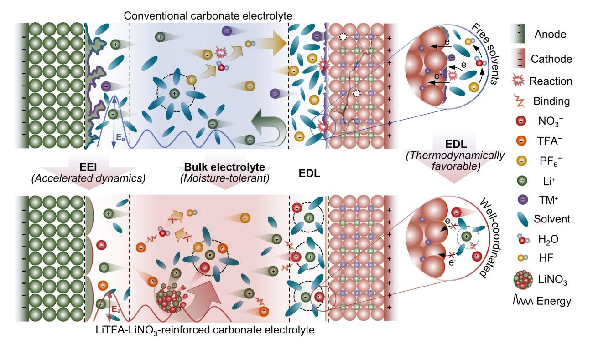
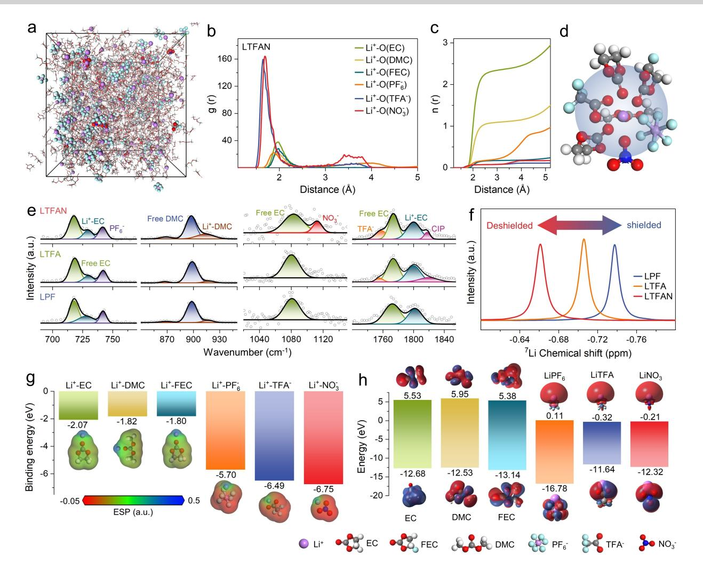
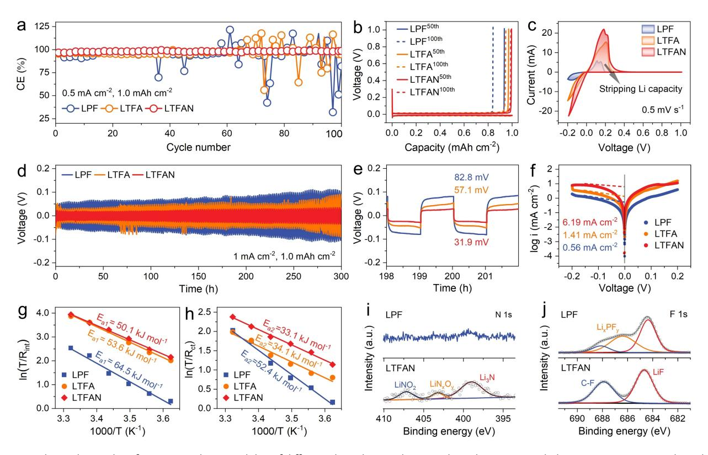
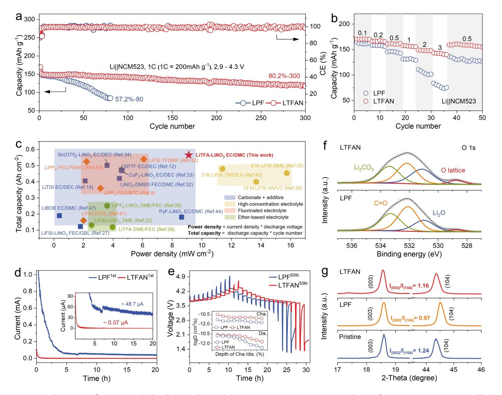
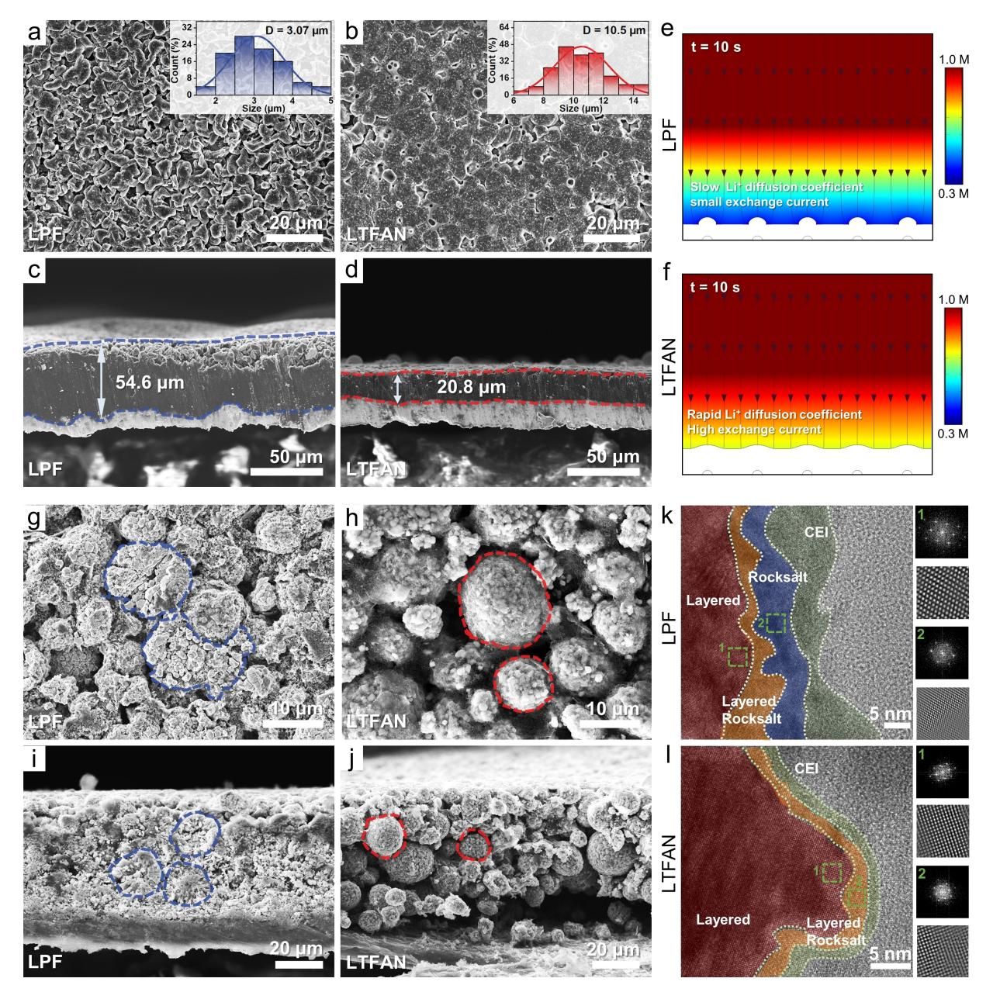
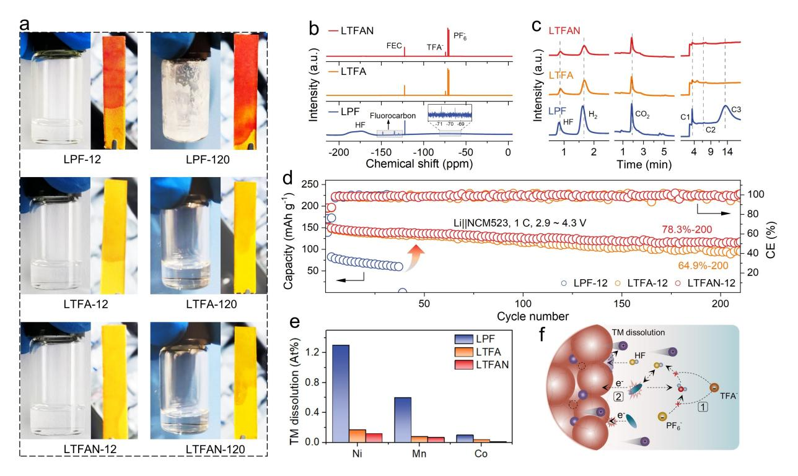
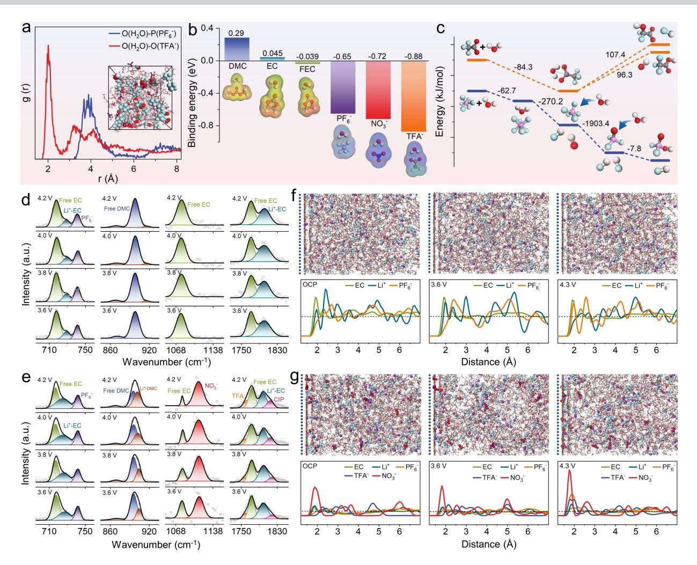

*Angewandte Chemie* www.angewandte.org

## *Lithium Metal Batteries*

How to cite: *Angew. Chem. Int. Ed.* **2024**, *63*, e202314876 [doi.org/10.1002/anie.202314876](https://doi.org/10.1002/anie.202314876)

# **Dual-Salt Electrolyte Additive Enables High Moisture Tolerance and Favorable Electric Double Layer for Lithium Metal Battery**

*Zuxin Wen, Wenqiang Fang, Fenglin Wang, Hong Kang, Shuoqing Zhao, [Shaojun](http://orcid.org/0000-0003-4427-6837) Guo,\* and Gen Chen\**

**Abstract:** The carbonate electrolyte chemistry is a primary determinant for the development of highvoltage lithium metal batteries (LMBs). Unfortunately, their implementation is greatly plagued by sluggish electrode interfacial dynamics and insufficient electrolyte thermodynamic stability. Herein, lithium trifluoroacetate-lithium nitrate (LiTFA LiNO3) dual-salt additive-reinforced carbonate electrolyte (LTFAN) is proposed for stabilizing high-voltage LMBs. We reveal that 1) the in situ generated inorganic-rich electrodeelectrolyte interphase (EEI) enables rapid interfacial dynamics, 2) TFA preferentially interacts with moisture over PF6 to strengthen the moisture tolerance of designed electrolyte, and 3) NO3 is found to be noticeably enriched at the cathode interface on charging, thus constructing Li+-enriched, solvent-coordinated, thermodynamically favorable electric double layer (EDL). The superior moisture tolerance of LTFAN and the thermodynamically stable EDL constructed at cathode interface play a decisive role in upgrading the compatibility of carbonate electrolyte with high-voltage cathode. The LMBs with LTFAN realize 4.3 V-NCM523/4.4 V-NCM622 superior cycling reversibility and excellent rate capability, which is the leading level of documented records for carbonate electrode.

## *Introduction*

Lithium metal battery (LMB) coupled of metallic Li and high-voltage layered transition metal oxide (LTMO) has been regarded as one of the most promising high-energydensity battery systems.[1] Its rapid development, however, highly relies on the advanced electrolyte chemistry. The exploitation of novel electrolytes that compatible with both Li anode and LTMO cathodes is the key to the commercialization of LMBs. In such a scenario, as the conventional electrolyte for lithium-ion battery, the state-of-the-art ethylene carbonate (EC)-centric electrolytes are not fully qualified because they undergo severe reductive decomposition on Li metal at low potential (�1.2 V *vs.* Li+/Li) and oxidative decomposition on the surface of delithiated LTMO cathode at high potential (�4.3 V *vs.* Li+/Li).[2] As a result, lithium dendrite grows continuously, leading to irreversible consumption of both the Li metal anode and electrolyte. Meanwhile, the cathode counterpart is subjected to detrimental structure distortion/reconstruction, transition metal (TM) dissolution and final cathode-anode crossover effect.[3] Moreover, the common lithium hexafluorophosphate (LiPF6) produces highly corrosive by-product hydrofluoric acid (HF) through violent hydrolysis reaction with trace water from ambient moisture or chemical oxidation reaction between the released singlet oxygen from deeply delithiated cathode and electrolyte solvents,[4] which exacerbates the aforementioned challenges.[5]

Considerable efforts, mainly including electrolyte solvent optimization,[6] functional additive,[7] water scavenging,[8] and so forth have been devoted to improving the compatibility of commercial carbonate electrolytes with Li metal anode and LTMO cathodes. The commonality of these strategies is to pursue a passive electrode-electrolyte interface (EEI) by modulating the Li+ solvation structure.[9] However, there seems to be some inherent controversies for this longstanding electrolyte design guideline.[10] 1) The thermodynamic/dynamic function of EEI, a general term for solid electrolyte interphase (SEI, anode) and cathode-electrolyte interphase (CEI, cathode), still remains to be contentious in scientific community.[11] 2) The classical theory holds that the components of the first solvation shell can enter the electric double layer (EDL) and preferentially undergo redox decomposition.[12] Unfortunately, in the interfacial EDL region between electrode and electrolyte, the spatial distribution of solutes and solvents and electronic density are highly inhomogeneous and differ greatly from the bulk electrolyte.[13]

Lithium nitrate (LiNO3) has long been regarded as the one of most effective additives to improve the interfacial stability of Li metal anode. Recent research reveals that the LiNO3 can also engineer a passivating EDL to enhance the oxidative stability of ether electrolyte with high-voltage LTMO cathodes.[14] However, the application of LiNO3 in conventional carbonate electrolyte has been limited by extremely low solubility (*<*0.01 mg mL 1 ).[15] Herein, hygroscopic lithium trifluoroacetate (LiTFA) was exploited as a

[\*] Z. Wen, W. Fang, F. Wang, H. Kang, Prof. G. Chen School of Materials Science and Engineering, Key Laboratory of Electronic Packaging and Advanced Functional Materials of Hunan Province, Central South University, Changsha 410083, P. R. China E-mail: geenchen@csu.edu.cn

S. Zhao, Prof. S. Guo

School of Materials Science & Engineering and BIC-ESAT, College of Engineering, Peking University, Beijing 100871, P. R. China E-mail: guosj@pku.edu.cn

*Angew. Chem. Int. Ed.* **2024**, *63*, e202314876 (1 of 11) © 2024 Wiley-VCH GmbH

bi-functional additive to inhibit the hydrolysis of LiPF6 and promote the dissolution of LiNO3 in carbonate electrolyte. Compared to previous report using LiBF4 or Mg(TFSI)2 salt as a solubilizer,[16] the proposed LiTFA LiNO3 dual-salt additive significantly accelerates interfacial reaction dynamics and greatly upgrades the thermodynamic compatibility of carbonate electrolyte with high-voltage LTMO cathode by building moisture-tolerant bulk electrolyte and thermodynamically favorable EDL at high-voltage cathode interface (Figure 1). In terms of dynamics, the in situ generated nitrogenous and fluoride-rich EEI using LiTFA LiNO3 dual-salt additive-reinforced carbonate electrolyte can reduce the Li+ interfacial diffusion energy barrier. Moreover, it is revealed that TFA is outperformed by PF6 in the competition to interact with moisture, remarkably reducing the moisture sensitivity of LiPF6-based carbonate electrolyte. Furthermore, experiment and molecular dynamics (MD) simulation demonstrate that TFA and NO3 , especially NO3 , exhibit distinct voltage response effect, i.e., they will be enriched at the cathode interface once the cathode is charged, thus forming Li+-enriched, thermodynamically favorable EDL with solvent molecules well-coordinated. In terms of thermodynamics, we find that the stability of the exclusive bulk electrolyte and EDL plays an even more decisive role in inhibiting electrolyte decomposition and active capacity loss. Consequently, LMBs with the LiTFA LiNO3 dual-salt additive-reinforced carbonate electrolyte exhibit excellent cycling performance even though operating at cut-off voltage beyond the electrochemical oxidation limitation of carbonate electrolyte. Moreover, even exposed to humid air for 12 hours, the proposed moisture-tolerant carbonate electrolyte can still achieve very high capacity retention of 78.3% after 200 cycles in Lij j NCM523 cells, outperforming the documented records for carbonate electrolyte.

### *Results and Discussions*

#### *Bulk electrolyte property*

The optimization of the additive concentration in reference electrolyte (1 M LiPF6 in EC/DMC/FEC, 10: 10 :1 by volume, LPF) was firstly carried out. As shown in Figure S1, LiTFA has a high solubility up to 2 M and the solubility of LiNO3 could be promoted in the presence of LiTFA, forming a clear electrolyte. The CE significantly increases when the concentration of LiTFA and LiNO3 both increases to 0.1 M. Therefore, to upgrade conventional carbonate electrolyte, 0.1 M LiTFA single-salt additive or 0.1 M LiTFA and 0.1 M LiNO3 dual-salt additive were dissolved in the LPF, denoted as LTFA and LTFAN, respectively. Notably, LiNO3 is almost insoluble in LPF (Figure S2, Supporting Information), but the introduction of LiTFA facilitate the dissolution of LiNO3. The basic ionic conductivity and viscosity just vary slightly after the addition of dual salts (Figure S3, Supporting Information). Classical MD simulations were conducted to elucidate the effect of additives on bulk electrolyte solvation structure (Figure 2a– d and Figure S4, Supporting Information). The radial distribution functions (RDF, g(r)) of Li+ O(TFA ) and Li+ O(NO3 ) are much stronger and closer to Li+ (around 1.65 Å) than that of solvent molecules (Figure 2b), indicating that both TFA and NO3 have a stronger tendency to

*Figure 1.* Schematic illustration of the reinforced mechanism of the LiTFA LiNO3 dual-salt additive on conventional carbonate electrolyte.

*Angew. Chem. Int. Ed.* **2024**, *63*, e202314876 (2 of 11) © 2024 Wiley-VCH GmbH

*Research Articles*

*Angewandte Chemie*

*Figure 2.* Theoretical calculations and experimental characterizations of the solvation behavior in different electrolytes. (a) The snapshot of the MD amorphous cell in steady state (30 ps) in LTFAN electrolytes. (b) The RDF (g(r)), (c) coordination number (n(r)) and (d) schematic diagram of representative Li+-solvation structure in LTFAN electrolytes obtained from MD. (e) Raman spectra and (f) 7 Li NMR spectra of different electrolytes with various additives. (g) The binding energy and electrostatic potential of the Li+-solvent/anion complex. (h) The energy level of frontier orbital of the solvents and Li salts used to prepare the electrolyte.

coordinate with Li+ than solvents in the innermost solvation shell. In LTFAN electrolyte, the calculated coordination numbers for EC, DMC, FEC, PF6 , TFA and NO3 are 2.312, 1.077, 0.171, 0.177, 0.077 and 0.082 (Figure 2c and Table S2, Supporting Information), and the representative Li+ solvation structure is illustrated in Figure 2d. Although MD simulations demonstrate that NO3 and TFA do participate in the solvation sheath, the primary Li+ solvation sheath in bulk electrolyte are still dominated by solvent molecules.

Different characterization techniques were also carried out to further study the bulk electrolyte property. The Raman spectrum of LTFAN emerges two new peaks at around 1113 cm 1 and 1757 cm 1 , assigned to the asymmetric stretch of NO3 [17] and TFA , [18] respectively (Figure 2e), which can be also revealed by attenuated total reflection-Fourier-transform infrared (ATR-FTIR) spectroscopy (Figure S5, Supporting Information). Both Raman and ATR-FTIR spectroscopy exhibit intense free solvent peaks, lyte. With the sequential addition of LiTFA and LiNO3, 7 nuclear magnetic resonance (NMR) spectra gradually migrate to low field with higher chemical shift value (Figure 2f). The de-shielding effect in 7 Li NMR is caused by the strong binding energy of NO3 and TFA with Li+ (Figure 2g and Figure S6, Supporting Information) and the formation of a small number of solvation clusters such as contact ion pairs (CIP, 1817 cm 1 in Figure 2e). Furthermore, the frontier molecular orbital theory is implemented to preliminarily estimate the redox reaction activity of individual components. As shown in Figure 2h, both LiNO3 and LiTFA have relatively low lowest unoccupied molecular orbital (LUMO) and relatively high highest occupied molecular orbital (HOMO) compared with other solvent molecules and LiPF6, meaning that NO3 and TFA should

demonstrating that even though LiNO3 and LiTFA are well dissolved, uncoordinated free solvent molecules are still the basic form of this moderate-concentration carbonate electro-

Li

*Angewandte Chemie*

be more inclined to undergo preferential redox decomposition before other components.[19]

#### *Electrode compatibility*

The Li plating/stripping efficiency was preliminarily evaluated by Lij jCu cells. The baseline electrolyte (LPF) displays obvious fluctuation after only 35 cycles, and exhibits low average CE (~94.3%) within initial 35 cycles (Figure 3a). Improved CE (~96.4% within 60 cycles) and delayed fluctuation (after 60 cycles) can be obtained in LTFA, indicating that LiTFA itself can also function as an effective additive and a benign LiNO3 solubilizer, in contrast to the harmful LiNO3 solubilizers with high Gutmann donor number[20] or Lewis acid sites.[21] After the introduction of LiNO3, LTFAN offers an impressive average CE of ~98.2% over 100 cycles without obvious fluctuation. The improved Li anode compatibility of LTFAN was also verified by the voltage-capacity profiles (Figure 3b) and the anodic cyclic voltammetry (CV, Figure 3c), showing that a large amount of active Li capacity is lost in LPF while better reversibility can be successfully realized in LTFAN. Moreover, in Lij jLi symmetric cells, the overpotential with LTFAN is dramatically decreased, and remains almost constant over 300 h (Figure 3d). Even after 200 h, the overpotential is just only 31.9 mV, almost one-third of conventional LPF (82.8 mV, Figure 3e). The decline in the overpotential implies accelerated reaction dynamics, which is closely related to the interfacial chemistry between LTFAN and Li metal anode. In addition, the in situ optical microscope characterization of lithium deposition behavior was conducted in Lij jLi symmetrical battery at current density of 5 mAcm 2 with a fixed deposition capacity of 5 mAhcm 2 (Figure S7, Supporting Information). The deposition morphology in LPF is fluffy and porous, which would cause severe electrolyte decomposition and low lithium metal utilization efficiency. In stark contrast, Lij jLi symmetric battery with LTFAN exhibits a very compact and flat lithium deposition, demonstrating the feasibility of the proposed LiTFA LiNO3 dualsalt additive strategy.

To understand the superior compatibility between LTFAN and Li metal, anode-side interfacial kinetics were investigated. As shown in Figure 3f, Tafel plots display that the exchange current density (*i*0) in LTFAN (6.19 mAcm 2 ) is almost ten times larger than that of LPF (0.56 mAcm 2 ) and four times larger than LTFA (1.41 mAcm 2 ), indicating LiTFA LiNO3 dual-salt additive significantly accelerates the interfacial transfer kinetics. Moreover, the temperaturedependent electrochemical impedance spectroscopy (EIS)

*Figure 3.* Electrochemical performance and compatibility of different electrolytes with Li metal anode. (a) Li metal plating/stripping CEs evaluated by Lij jCu half cells at 0.5 mAcm 2 with a fixed discharge capacity of 1.0 mAhcm 2 . (b) Corresponding voltage-capacity profiles at 50th and 100th cycles using different electrolytes. (c) CVs of Lij jCu half cells within the voltage range from 1.0 V to 0.2 V at 0.5 mV s 1 . (d) Cyclic stability of Lij jLi symmetric cells at 1.0 mAcm 2 with a fixed capacity of 1.0 mAhcm 2 and (e) corresponding partial enlarged profiles from 198 h to 202 h. (f) Tafel plots of Li plating/stripping in various electrolytes obtained from Lij j Li symmetric cells. (h) The activation energies for (g) Li+ transport across SEI and (h) Li+ desolvation at the anode interface. The XPS analysis at (i) N 1s and (j) F 1s for Li metal anodes cycled in different electrolytes for 12 cycles.

*Angew. Chem. Int. Ed.* **2024**, *63*, e202314876 (4 of 11) © 2024 Wiley-VCH GmbH

and the fitting results (Figure S8 and Figure S9, Supporting Information) reveal that Ea1 (energy for Li+ transport through the SEI) and Ea2 (energy for Li+ desolvation) in LTFAN (50.1 kJmol 1 and 33.1 kJmol 1 ) are reduced by 22.3% and 36.8%, respectively, compared with that of LPF (64.6 kJmol 1 and 52.4 kJmol 1 ) (Figure 3g,h). To comprehend the accelerated interfacial kinetics, X-ray photoelectron spectroscopy (XPS) was employed to probe the EEI components. Since Li+ must pass through electrically insulating EEI to receive electrons at the bottom, EEI is at least critical for Li+ interfacial transport kinetics.[22] N 1s and F 1s spectra exhibit the pronounced difference between LPF and LTFAN. Stronger nitrogenous and fluoride signals are detected in LTFAN (Figure 3i,j and Figure S10, Supporting Information) due to the decomposition of LiNO3 and LiTFA with lower LUMO energy level. Nitrogenous and fluoride-rich EEI have long been thought to be beneficial in accelerating Li+ interfacial diffusion.[23] The remarkable effect of EEI on interface dynamics was uncovered, and whether EEI can thermodynamically inhibit the decomposition of electrolytes will be discussed in detail in the following.

Systematic electrochemical tests and characterizations were implemented to further evaluate the compatibility between this dual-salt additive-reinforced electrolyte and LTMO cathode. Lij jNCM523 cell with LTFAN delivers high capacity retention of 80.2% after 300 cycles and high average CE of 99.4% at 1 C with a cut-off voltage of 4.3 V, while the capacity drops rapidly after 50 cycles for LPF (Figure 4a and Figure S11, Supporting Information). Even operating at higher cut-off voltage of 4.4 V and with higher-Ni-content NCM622 cathode, LTFAN still exerts significantly better cycling performance than LPF (Figure S12, Supporting Information). Moreover, Lij jNCM523 cell with LTFAN also provides excellent rate capability, maintaining rather high capacity of 142 mAhg 1 even at 3 C (Figure 4b). However, the capacity with LPF precipitously drops with the increase of the rate. The well-performed long-term cycling performance and rate capability demonstrate that the thermodynamic stability of carbonate electrolyte and

*Figure 4.* Electrochemical performance and related electrochemical characterizations. (a) Long-term cycling performance in Lij jNCM523 cells at 1 C. (b) Rate performance in Lij jNCM523 cells. (c) The comparison of electrochemical performance in Lij jNCM cells with LTFAN and typical electrolytes used in previous literature. (d) Leakage current during 4.3 V constant-voltage floating test of the NCM523 cathodes in the first cycle. (e) Charge-discharge voltage profiles of GITT technique measurements after 50 cycles and corresponding logDLi+ of NCM523 cathode in different electrolytes. (f) XPS and (g) XRD analysis for NCM523 cathodes after 100 cycles.

*Angew. Chem. Int. Ed.* **2024**, *63*, e202314876 (5 of 11) © 2024 Wiley-VCH GmbH

interfacial reaction kinetics are greatly improved by the LiTFA LiNO3 dual-salt additive. The electrochemical performance of Lij jNCM cells with LTFAN and typical electrolytes used in previous literature is compared in detail in Figure 4c. The proposed LiTFA LiNO3 dual-salt additive-reinforced carbonate electrolyte exhibits significantly superior performance among the additive-modified carbonate electrolytes and is not even inferior to some newly developed electrolytes, such as high-concentration electrolyte[24] and fluorinated electrolyte.[25] The aggressive 4.3 V-constant-voltage floating tests deliver smaller leakage current density (~0.07 μA) in Lij jNCM523 cell with LTFAN than that with LPF (~48.7 μA), demonstrating that the active Li capacity loss and side reactions between electrolyte and the delithiated NCM523 cathode are significantly suppressed in LTFAN (Figure 4d and Figure S13, Supporting Information). Galvanostatic intermittent titration (GITT) and the calculated Li-ion diffusion coefficient (DLi+) results present much smaller charge–discharge overpotential and remarkably higher DLi+ for the cathode cycled in LTFAN (Figure 4e), confirming the accelerated interfacial diffusion kinetics and enhanced structural stability in LTFAN.[26]

XPS was conducted to characterize the interphase of the cycled cathodes collected from Lij jNCM523 cells after 100 cycles. Likewise, prominent nitrogenous and fluoride are detected on the cathode surface (Figure S14, Supporting Information) due to the narrow electrochemical window of LiNO3 and LiTFA (Figure 2h), which facilitates the fast diffusion kinetics. Moreover, the signal strength of O-lattice (528.8 eV, Figure 4f), Ni 2p, Co 2p and Mn 2p (Figure S15, Supporting Information) attenuates seriously for the cathodes cycled in LPF; while the one cycled in LTFAN is almost comparable to the pristine cathode, indicating the severe oxidative decomposition of carbonate electrolyte on the cathode surface is inhibited considerably.[27] Furthermore, X-ray diffraction (XRD) pattern shows crystalline structure change where the peak intensity ratio I(003)/I(104) decreases from pristine 1.24 to 0.97 for the cathode cycled in LPF (Figure 4g), indicating that the side reaction in LPF destroys the well-ordered layered structure and causes the Li/TM mixing.[28] Taken together, the proposed LiTFA LiNO3 dual-salt additive can remarkably improve the compatibility of carbonate electrolyte with Li anode and LTMO cathode and the in situ formed EEI facilitates rapid Li+ interfacial diffusion in terms of dynamics.

Li deposition morphology is critical for hindering the formation of inactive Li and improving LMBs reversibility.[29] The top and cross-sectional views of SEM images for the electrodeposited Li in LPF and LTFAN at 0.5 mAcm 2 and 3 mAhcm 2 are presented in Figure 5a–d. The dendrite-like Li deposition with high porosity and a largish thickness of 54.6 μm can be observed in LPF. In contrast, planar, dough-like (10.5 μm in diameter) and compact (only 20.8 μm thick, close to the theoretical thickness of 15 μm) morphology was obtained in LTFAN. The finite element simulations of lithium deposition behavior under different interfacial kinetic parameters were implemented by electrodeposition module and tertiary current distribution in COMSOL Multiphysics. According to the results of the interfacial dynamics analysis of Figure 3f–h, two parameters of built-in current density and the diffusion coefficient of Li+ were mainly controlled in this module. Specifically, the exchange current density of LTFAN was set to 10 times that of LPF, and the Li+ diffusion coefficient was set to 1.3 times that of LPF. The finite element analysis demonstrates that the interface with rapid Li-ion diffusion coefficient and high exchange current density can effectively inhibit the formation of interfacial Li+ concentration gradient and space charge region, thus suppressing the protuberances of Li deposition (Figure 5e,f).[30] Moreover, the cathode secondary particles cycled in LTFAN still remain intact without serious cracking and pulverized disintegration observed in LPF (Figure 5g–j) due to the improved thermodynamic stability.

Transmission electron microscopy (TEM) was implemented to further disclose the surface phase transition. The inevitable layered-rocksalt mixed phase and CEI are thinner and more uniform on the surface of the cathode cycled in LTFAN than that of LPF (Figure 5k,l). Moreover, resistive NiO-like rocksalt phase[26b,27] can be only detected on the cathode with reference electrolyte, which is associated with constant corrosive side reactions and consistent with degraded electrochemical performance. The same characterization was also conducted on electrodes cycled in LiTFA single-salt-additive LTFA. Although the enhancement effect of single-salt additive cannot be completely compared with double-salt additive, LiTFA does also optimize the Li deposition morphology and mitigate the cathode microstructure degradation (Figure S16, Supporting Information). Especially, TM dissolution-redeposition was analyzed using energy dispersive X-ray spectrum (EDS) on the cycled Li anodes. The results reveal that TM elemental signals are attenuated greatly in both LTFA and LTFAN (Figure S17 and Figure S18, Supporting Information), indicating both LiTFA and LiNO3 could dramatically suppress the corrosion of the cathode by side reactions during electrochemical cycling.

The above analyses demonstrate that LiTFA LiNO3 dual-salt additive can simultaneously improve the compatibility of carbonate electrolyte with Li anode and NCM523/ 622 cathodes and the formed EEI can realize rapid Li+ interfacial transport kinetics. However, in term of thermodynamics, we do not arbitrarily attribute the improved compatibility to the formation of nitrogenous and fluoriderich EEI, long regarded as admirable passivation layer that can thermodynamically suppress the notorious side reaction. Instead, the SEI-formed Li anodes and CEI-formed cathodes were carefully disassembled after 2 cycles at 0.1 C in LTFAN and reassembled into Lij jNCM523 cells with LPF as electrolyte. Unfortunately, there is no noticeable improvement gain (Figure S19, Supporting Information). The cycling performance is comparable to the previous tests without pretreated electrodes in Figure 4a, indicating that the thermodynamic stability of the electrolyte itself and the exclusive electric double layer, an inevitable interfacial region between electrode and bulk electrolyte, play a decisive role in inhibiting electrolyte decomposition and

# *Research Articles*

*Figure 5.* The morphology and structure characterization of cycled electrodes. SEM images illustrating the (a, b) surface morphology and (c, d) cross-section view of the electrodeposited Li at 0.5 mAcm 2 and 3 mAhcm 2 on Cu foil in different electrolytes. (e, f) Finite element analysis simulates the Li deposition evolution with different interfaces. SEM images of (g, h) top view and (i, j) cross-section view of NCM523 cathodes collected from Lij jNCM523 cells with the investigated electrolytes after 100 cycles. TEM images of the collected NCM523 cathodes cycled in (k) LPF and (l) LTFAN and corresponding FFT and inverse FFT patterns grabbed from the selective regions.

active capacity loss. Taking the cathode side as an example, the thermodynamic mechanism behind electrochemical performance improvement is studied in the next section.

#### *Moisture tolerance*

Inspired by the ability of LiTFA to suppress TM dissolution (Figure S17 and Figure S18, Supporting Information) and its strong hygroscopicity,[31] LiTFA may be effective in inhibiting LiPF6 hydrolysis and the production of HF, which is

*Angew. Chem. Int. Ed.* **2024**, *63*, e202314876 (7 of 11) © 2024 Wiley-VCH GmbH

responsible for TM dissolution.[4] Amplification experiments by exposing the investigated electrolytes to air with 50% humidity for 12 or 120 h (denoted as "electrolyte-12/120") were carried out to validate this assumption. After air exposure, the reference electrolyte exhibits significant acidity and even gelation, but none of these phenomena occur in LiTFA-reinforced carbonate electrolyte (Figure 6a and Figure S20, Supporting Information). In 19F NMR spectra, the signal of high-moisture-sensitive LiPF6 almost vanish while clear HF and fluorocarbon signals emerge in LPF-12 (Figure 6b). On the contrary, intense PF6 signal remains and *Research Articles*

*Figure 6.* (a) The photographs of the investigated electrolytes and corresponding pH indicator papers after 12 h or 120 h of exposure to air with 50% humidity. (b) 19F NMR spectra of various electrolyte-12. (c) GC results for 2% H2O-containing electrolytes. (d) Long-term cycling performance at 1 C in Lij jNCM523 cells with electrolyte-12 and the Li anodes were collected after 30 cycles for (e) further EDS analysis. (f) Schematic diagram of two pathways for TM dissolution.

almost no F-containing impurities are detected in LiTFAadded electrolytes, which verifies that LiTFA can block the hydrolysis reaction between H2O and LiPF6. Gas chromatography (GC) was further deployed to detect gas production after adding 2% H2O into carbonate electrolyte. Less gas production also corroborates the 19F NMR conclusion and reinforces the function of LiTFA (Figure 6c).

To assess the practicability of LiTFA, the investigated electrolyte-12 was used to evaluate the cycling performance in Lij jNCM523 cells. Both LTFA-12 and LTFAN-12 still exhibit relatively stable cycling with capacity retention of 78.3% for LTFAN-12 and 64.9% for LTFA-12 after 200 cycles (Figure 6d). In striking contrast, remarkable capacity decay (~68.04 mAhg 1 within 20 cycles) and premature cell failure after only 38 cycles appear in LPF-12 (Figure 6d and Figure S21, Supporting Information). Furthermore, with the participation of water, TM dissolutionredeposition is seriously intensified in LPF-12 (Figure 6e), and the primary particles of the cathodes cycled in LPF-12 are severely eroded by corrosive HF (Figure S22 and Figure S23, Supporting Information). By contrast, the primary and secondary particles are well preserved, and TM dissolution is controlled in a small amount with LiTFAcontaining electrolytes. As depicted in Figure 6f, LiTFA can remarkably impede the hydrolysis of LiPF6 with H2O (from ambient air or oxidation decomposition of solvent) and the production of corrosive HF, constructing moisture-tolerant, electrode-compatible bulk electrolyte.

To explore the interaction of H2O molecule with electrolyte components, MD simulation was carried out in H2Ocontaining carbonate electrolyte. According to the intensity and distance in RDF (Figure 7a and Figure S24, Supporting Information), TFA is outperformed by PF6 in the competition to interact with H2O, which is well consistent with the higher (more negative) TFA H2O binding energy than that of PF6 H2O (Figure 7b). The possible hydrolysis pathways and corresponding energy barriers are shown in Figure 7c. It is obvious that the hydrolytic defluorination of PF6 with the participation of H2O to form PF5, POF3 and HPO2F2 is thermodynamically permitting. However, for TFA H2O, both defluorination and hydrolysis need to surmount relatively high energy barriers, which explains why LiTFA can effectively inhibit TM dissolution and acidity rise.

#### *Electric double layer*

As an inevitable region on the electrode surface, EDL plays a crucial role in the process of electrochemical reaction. Raman spectroscopy was applied to detect the dynamic changes of electrolyte components on the cathode surface at different charging voltage. Compared with PF6 and TFA , NO3 has a significant voltage response effect (Figure 7d,e). And with the enrichment of NO3 on the delithiated cathode, free solvent molecules are decreasing, accompanied by the emergence of CIP and Li+-solvent complexes (Figure S25, Supporting Information). The above experimental

## *Research Articles*

*Figure 7.* (a) RDF g(r) of H2O with TFA (red) and PF6 (blue). The *inset* is the MD simulation snapshot for H2O-containin electrolyte. (b) Optimized structures and binding energy of H2O-solvent/anion complex. (c) The relative energy profile for the reaction between H2O with PF6 or TFA . Raman spectra of the cathode surface layer under different voltages in (d) LPF and (e) LTFAN. MD simulation snapshots and component distribution plots near to cathode surface in (f) LPF and (g) LTFAN at different voltages (from left to right: open-circuit voltage, 3.6 V and 4.3 V). The dashed lines in component distribution plots indicate an even distribution.

observations are also well corroborated by MD simulations. As the potential applied to the cathode increases, PF6 anions enrich slightly while Li+ cations gradually deplete in the EDL of LPF due to electrostatic force of electric field (Figure 7f). However, in LTFAN, the voltage response of NO3 is remarkably quicker and stronger than TFA and PF6 , which is related to ion size and ionic charge density (Figure 7g).[14] Moreover, the Li+ concentration does not decline sharply, but rather a Li+-enriched EDL forms at high voltage. The simulation snapshots cleaved from the cathode surface show that the surroundings of each NO3 are usually accompanied by Li+ (Figure S26, Supporting Information), mainly because the strong binding energy between NO3 and Li+ enables NO3 enough ability to overcome the electrostatic repulsive force and seize Li+. Thus, the solvent molecules in this Li+-enriched EDL formed in LTFAN are well-coordinated (marked in red) while the ones in LPF are mainly in free state (Figure S25, Supporting Information). As revealed by the calculated oxidation potential after single-electron transfer and the experimental result of in situ differential electrochemical mass spectrometry (Figure S27 and Figure S28, Supporting Information), well-coordinated solvents can significantly improve the oxidation stability and inhibit the ceaseless decomposition of the carbonate electrolyte on the surface of delithiated cathode at high voltage. Overall, the introduction of NO3 can construct a thermodynamically favorable and Li+-rich EDL with solvent well-coordinated, where the solvation structure is completely different from the bulk electrolyte but somewhat similar to that of high-concentration electrolyte.[32]

### *Conclusion*

In summary, a LiTFA LiNO3 dual-salt additive strategy was developed to improve the compatibility of carbonate electrolyte with Li anode and high-voltage NCM cathode

*Angew. Chem. Int. Ed.* **2024**, *63*, e202314876 (9 of 11) © 2024 Wiley-VCH GmbH

simultaneously. It is proved that the in situ generated nitrogenous and fluoride-rich EEI with LTFAN vastly accelerates the interfacial reaction dynamics. In addition, the LiTFA LiNO3 dual-salt additive notably strengthens the moisture tolerance of LiPF6-based carbonate electrolyte and construct a Li+-rich, solvent-coordinated, thermodynamically favorable EDL at charged cathode interface. With the LiTFA LiNO3 dual-salt additive-reinforced carbonate electrolyte, the issues of Li dendrite growth, TM dissolutionredeposition and electrode structure degradation can be well resolved. Therefore, stable long-term cycling performance (80.2% capacity retention for 4.3 V-NCM523 and 72.5% for 4.4 V-NCM622 after 300 cycles at 1 C) and excellent rate capability were finally achieved. Most importantly, the superior moisture tolerance reduces the hydrolysis of moisture-sensitive LiPF6 and the production of corrosive HF, endowing the Lij jNCM523 cell with considerable capacity retention of 78.3% after 200 cycles even with the additive-reinforced carbonate electrolyte exposed to humid air for 12 hours.

## *Supporting Information*

Supporting Information is available from the Wiley Online Library or from the author.

## *Author contributions*

Z.W. and W.F. contributed equally to this work. G.C. and Z.W. conceived the concept. Z.W. and W.F. designed and carried out the experiments. Z.W. conducted the theoretical calculations. F.W. and H.K. assisted with carrying out the experiments and analyzing the data. Z.W. and G.C. wrote the manuscript. S.G. reviewed and revised the manuscript. G.C. and S.G. supervised the whole project. All authors contributed to the discussion of the manuscript.

## *Acknowledgements*

The authors acknowledge the financial support by National Natural Science Foundation of China (22379166) and Natural Science Foundation for Distinguished Young Scholars of Hunan Province (2022JJ10089) and Central South University Innovation-Driven Research Programme (2023CXQD034). This work was supported in part by the High-Performance Computing Center of Central South University.

## *Conflicts of Interest*

The author declare no conflict of interest.

## *Data Availability Statement*

The data that support the findings of this study are available from the corresponding author upon reasonable request.

**Keywords:** Dual-salt additive **·** Moisture tolerance **·** Electric double layer **·** Lithium metal battery

- [1] a) J. Xiang, L. Yang, L. Yuan, K. Yuan, Y. Zhang, Y. Huang, J. Lin, F. Pan, Y. Huang, *[Joule](https://doi.org/10.1016/j.joule.2019.07.027)* **2019**, *3*, 2334; b) W. Lee, J. Kim, S. Yun, W. Choi, H. Kim, W.-S. Yoon, *Energy [Environ.](https://doi.org/10.1039/D0EE01277G) Sci.* **2020**, *13*, [4406.](https://doi.org/10.1039/D0EE01277G)
- [2] K. Xu, *[Chem.](https://doi.org/10.1021/cr030203g) Rev.* **2004**, *104*, 4303.
- [3] a) T. Liu, J. Liu, L. Li, L. Yu, J. Diao, T. Zhou, S. Li, A. Dai, W. Zhao, S. Xu, Y. Ren, L. Wang, T. Wu, R. Qi, Y. Xiao, J. Zheng, W. Cha, R. Harder, I. Robinson, J. Wen, J. Lu, F. Pan, K. Amine, *[Nature](https://doi.org/10.1038/s41586-022-04689-y)* **2022**, *606*, 305; b) D. Aurbach, E. Markevich, G. Salitra, *J. Am. [Chem.](https://doi.org/10.1021/jacs.1c11315) Soc.* **2021**, *143*, 21161; c) L. Yang, K. Yang, J. Zheng, K. Xu, K. Amine, F. Pan, *[Chem.](https://doi.org/10.1039/D0CS00137F) Soc. Rev.* **[2020](https://doi.org/10.1039/D0CS00137F)**, *49*, 4667.
- [4] B. L. D. Rinkel, J. P. Vivek, N. Garcia-Araez, C. P. Grey, *Energy [Environ.](https://doi.org/10.1039/D1EE04053G) Sci.* **2022**, *15*, 3416.
- [5] M. Liu, J. Vatamanu, X. Chen, L. Xing, K. Xu, W. Li, *[ACS](https://doi.org/10.1021/acsenergylett.1c00707) [Energy](https://doi.org/10.1021/acsenergylett.1c00707) Lett.* **2021**, *6*, 2096.
- [6] a) P. Xiao, Y. Zhao, Z. Piao, B. Li, G. Zhou, H.-M. Cheng, *Energy [Environ.](https://doi.org/10.1039/D1EE02959B) Sci.* **2022**, *15*, 2435; b) X. Fan, C. Wang, *[Chem.](https://doi.org/10.1039/D1CS00450F) Soc. Rev.* **2021**, *50*, 10486.
- [7] a) S. Tan, Z. Shadike, J. Li, X. Wang, Y. Yang, R. Lin, A. Cresce, J. Hu, A. Hunt, I. Waluyo, L. Ma, F. Monaco, P. Cloetens, J. Xiao, Y. Liu, X.-Q. Yang, K. Xu, E. Hu, *[Nat.](https://doi.org/10.1038/s41560-022-01020-x) [Energy](https://doi.org/10.1038/s41560-022-01020-x)* **2022**, *7*, 484; b) Y. Yan, S. Weng, A. Fu, H. Zhang, J. Chen, Q. Zheng, B. Zhang, S. Zhou, H. Yan, C.-W. Wang, Y. Tang, H. Luo, B.-W. Mao, J. Zheng, X. Wang, Y. Qiao, Y. Yang, S.-G. Sun, *ACS [Energy](https://doi.org/10.1021/acsenergylett.2c01433) Lett.* **2022**, *7*, 2677.
- [8] a) D. Lu, X. Lei, S. Weng, R. Li, J. Li, L. Lv, H. Zhang, Y. Huang, J. Zhang, S. Zhang, L. Fan, X. Wang, L. Chen, G. Cui, D. Su, X. Fan, *Energy [Environ.](https://doi.org/10.1039/D2EE00483F) Sci.* **2022**, *15*, 3331; b) C. Xu, S. Renault, M. Ebadi, Z. Wang, E. Björklund, D. Guyomard, D. Brandell, K. Edström, T. Gustafsson, *Chem. [Mater.](https://doi.org/10.1021/acs.chemmater.6b05247)* **2017**, *29*, [2254](https://doi.org/10.1021/acs.chemmater.6b05247).
- [9] H. Cheng, Q. Sun, L. Li, Y. Zou, Y. Wang, T. Cai, F. Zhao, G. Liu, Z. Ma, W. Wahyudi, Q. Li, J. Ming, *ACS [Energy](https://doi.org/10.1021/acsenergylett.1c02425) Lett.* **[2022](https://doi.org/10.1021/acsenergylett.1c02425)**, *7*, 490.
- [10] W. Song, E. S. Scholtis, P. C. Sherrell, D. K. H. Tsang, J. Ngiam, J. Lischner, S. Fearn, V. Bemmer, C. Mattevi, N. Klein, F. Xie, D. J. Riley, *Energy [Environ.](https://doi.org/10.1039/D0EE01825B) Sci.* **2020**, *13*, 4977.
- [11] a) J. Tan, J. Matz, P. Dong, J. Shen, M. Ye, *Adv. Energy Mater.* **2021**, *11*, 2100046; b) W. Huang, H. Wang, D. T. Boyle, Y. Li, Y. Cui, *ACS [Energy](https://doi.org/10.1021/acsenergylett.0c00194) Lett.* **2020**, *5*, 1128; c) Y. Zhou, M. Su, X. Yu, Y. Zhang, J.-G. Wang, X. Ren, R. Cao, W. Xu, D. R. Baer, Y. Du, O. Borodin, Y. Wang, X.-L. Wang, K. Xu, Z. Xu, C. Wang, Z. Zhu, *Nat. [Nanotechnol.](https://doi.org/10.1038/s41565-019-0618-4)* **2020**, *15*, 224; d) T. Liu, L. Lin, X. Bi, L. Tian, K. Yang, J. Liu, M. Li, Z. Chen, J. Lu, K. Amine, K. Xu, F. Pan, *Nat. [Nanotechnol.](https://doi.org/10.1038/s41565-018-0284-y)* **2019**, *14*, 50; e) R. Guo, K.-H. Kim, B. M. Gallant, *J. [Electrochem.](https://doi.org/10.1149/1945-7111/ac98e3) Soc.* **2022**, *169*, [100523](https://doi.org/10.1149/1945-7111/ac98e3).
- [12] C. Yan, H. R. Li, X. Chen, X. Q. Zhang, X. B. Cheng, R. Xu, J. Q. Huang, Q. Zhang, *J. Am. [Chem.](https://doi.org/10.1021/jacs.9b05029) Soc.* **2019**, *141*, 9422.
- [13] a) L. Zeng, T. Wu, T. Ye, T. Mo, R. Qiao, G. Feng, *[Nat.](https://doi.org/10.1038/s43588-021-00153-5) [Comput.](https://doi.org/10.1038/s43588-021-00153-5) Sci.* **2021**, *1*, 725; b) G. Feng, S. Li, V. Presser, P. T. Cummings, *J. Phys. [Chem.](https://doi.org/10.1021/jz4014163) Lett.* **2013**, *4*, 3367.
- [14] W. Zhang, Y. Lu, L. Wan, P. Zhou, Y. Xia, S. Yan, X. Chen, H. Zhou, H. Dong, K. Liu, *Nat. Commun.* **2022**, *13*, 2029.

*Angew. Chem. Int. Ed.* **2024**, *63*, e202314876 (10 of 11) © 2024 Wiley-VCH GmbH

- [15] N. Piao, S. Liu, B. Zhang, X. Ji, X. Fan, L. Wang, P.-F. Wang, T. Jin, S.-C. Liou, H. Yang, J. Jiang, K. Xu, M. A. Schroeder, X. He, C. Wang, *ACS [Energy](https://doi.org/10.1021/acsenergylett.1c00365) Lett.* **2021**, *6*, 1839.
- [16] a) X. Wang, S. Li, W. Zhang, D. Wang, Z. Shen, J. Zheng, H. L. Zhuang, Y. He, Y. Lu, *Nano [Energy](https://doi.org/10.1016/j.nanoen.2021.106353)* **2021**, *89*, 106353; b) S. Liu, J. Xia, W. Zhang, H. Wan, J. Zhang, J. Xu, J. Rao, T. Deng, S. Hou, B. Nan, C. Wang, *Angew. Chem. Int. Ed.* **2022**, *61*, e202210522.
- [17] a) Y. Jie, X. Liu, Z. Lei, S. Wang, Y. Chen, F. Huang, R. Cao, G. Zhang, S. Jiao, *[Angew.](https://doi.org/10.1002/anie.201914250) Chem. Int. Ed.* **2020**, *59*, 3505; b) X. Wang, S. Wang, H. Wang, W. Tu, Y. Zhao, S. Li, Q. Liu, J. Wu, Y. Fu, C. Han, F. Kang, B. Li, *Adv. Mater.* **2021**, *33*, 2007945.
- [18] Z. Wang, F. Qi, L. Yin, Y. Shi, C. Sun, B. An, H.-M. Cheng, F. Li, *Adv. Energy Mater.* **2020**, *10*, 1903843.
- [19] X. Chen, H. Li, X. Shen, Q. Zhang, *[Angew.](https://doi.org/10.1002/anie.201809203) Chem. Int. Ed.* **2018**, *57*, [16643](https://doi.org/10.1002/anie.201809203).
- [20] a) Z. Piao, P. Xiao, R. Luo, J. Ma, R. Gao, C. Li, J. Tan, K. Yu, G. Zhou, H.-M. Cheng, *Adv. Mater.* **2022**, *34*, 2108400; b) S. Liu, X. Ji, N. Piao, J. Chen, N. Eidson, J. Xu, P. Wang, L. Chen, J. Zhang, T. Deng, S. Hou, T. Jin, H. Wan, J. Li, J. Tu, C. Wang, *[Angew.](https://doi.org/10.1002/anie.202012005) Chem. Int. Ed.* **2021**, *60*, 3661.
- [21] a) C. Yan, Y. Yao, X. Chen, X. Cheng, X. Zhang, J. Huang, Q. Zhang, *[Angew.](https://doi.org/10.1002/anie.201807034) Chem. Int. Ed.* **2018**, *57*, 14055; b) W. Zhang, Q. Wu, J. Huang, L. Fan, Z. Shen, Y. He, Q. Feng, G. Zhu, Y. Lu, *Adv. Mater.* **2020**, *32*, 2001740.
- [22] S. Zhang, R. Li, N. Hu, T. Deng, S. Weng, Z. Wu, D. Lu, H. Zhang, J. Zhang, X. Wang, L. Chen, L. Fan, X. Fan, *Nat. Commun.* **2022**, *13*, 5431.
- [23] a) N. Kamaya, K. Homma, Y. Yamakawa, M. Hirayama, R. Kanno, M. Yonemura, T. Kamiyama, Y. Kato, S. Hama, K. Kawamoto, A. Mitsui, *Nat. [Mater.](https://doi.org/10.1038/nmat3066)* **2011**, *10*, 682; b) Y. Liu, X. Tao, Y. Wang, C. Jiang, C. Ma, O. Sheng, G. Lu, X. W. Lou, *[Science](https://doi.org/10.1126/science.abn1818)* **2022**, *375*, 739; c) X. Fan, X. Ji, F. Han, J. Yue, J. Chen, L. Chen, T. Deng, J. Jiang, C. Wang, *Sci. Adv.* **2018**, *4*, eaau9245.
- [24] a) Z. Peng, X. Cao, P. Gao, H. Jia, X. Ren, S. Roy, Z. Li, Y. Zhu, W. Xie, D. Liu, Q. Li, D. Wang, W. Xu, J.-G. Zhang, *Adv. Funct. Mater.* **2020**, *30*, 2001285; b) S. Lin, H. Hua, P. Lai, J. Zhao, *Adv. Energy Mater.* **2021**, *11*, 2101775.
- [25] a) Y. Zhao, T. Zhou, T. Ashirov, M. E. Kazzi, C. Cancellieri, L. P. H. Jeurgens, J. W. Choi, A. Coskun, *Nat. Commun.* **2022**, *13*, 2575; b) Y. Zhao, T. Zhou, M. Mensi, J. W. Choi, A. Coskun, *Nat. Commun.* **2023**, *14*, 299; c) C.-C. Su, M. He, R. Amine, T. Rojas, L. Cheng, A. T. Ngo, K. Amine, *[Energy](https://doi.org/10.1039/C9EE00141G) [Environ.](https://doi.org/10.1039/C9EE00141G) Sci.* **2019**, *12*, 1249.
- [26] a) W. Fang, Z. Wen, L. Chen, Z. Qin, J. Li, Z. Zheng, Z. Weng, G. Wu, N. Zhang, X. Liu, X. Yuan, G. Chen, *[Nano](https://doi.org/10.1016/j.nanoen.2022.107881) [Energy](https://doi.org/10.1016/j.nanoen.2022.107881)* **2022**, *104*, 107881; b) W. Xue, M. Huang, Y. Li, Y. G. Zhu, R. Gao, X. Xiao, W. Zhang, S. Li, G. Xu, Y. Yu, P. Li, J. Lopez, D. Yu, Y. Dong, W. Fan, Z. Shi, R. Xiong, C.-J. Sun, I. Hwang, W.-K. Lee, Y. Shao-Horn, J. A. Johnson, J. Li, *[Nat.](https://doi.org/10.1038/s41560-021-00792-y) [Energy](https://doi.org/10.1038/s41560-021-00792-y)* **2021**, *6*, 495.
- [27] Y. Zou, Z. Cao, J. Zhang, W. Wahyudi, Y. Wu, G. Liu, Q. Li, H. Cheng, D. Zhang, G.-T. Park, L. Cavallo, T. D. Anthopoulos, L. Wang, Y.-K. Sun, J. Ming, *Adv. Mater.* **2021**, *33*, 2102964.
- [28] a) Y. Li, W. Li, R. Shimizu, D. Cheng, H. Nguyen, J. Paulsen, S. Kumakura, M. Zhang, Y. S. Meng, *Adv. Energy Mater.* **2022**, *12*, 2103033; b) J. Zhang, P.-F. Wang, P. Bai, H. Wan, S. Liu, S. Hou, X. Pu, J. Xia, W. Zhang, Z. Wang, B. Nan, X. Zhang, J. Xu, C. Wang, *Adv. Mater.* **2022**, *34*, 2108353.
- [29] C. Fang, J. Li, M. Zhang, Y. Zhang, F. Yang, J. Z. Lee, M.-H. Lee, J. Alvarado, M. A. Schroeder, Y. Yang, B. Lu, N. Williams, M. Ceja, L. Yang, M. Cai, J. Gu, K. Xu, X. Wang, Y. S. Meng, *[Nature](https://doi.org/10.1038/s41586-019-1481-z)* **2019**, *572*, 511.
- [30] Y. Yan, C. Shu, R. Zheng, M. Li, Z. Ran, M. He, A. Hu, T. Zeng, H. Xu, Y. Zeng, *[Nano](https://doi.org/10.1007/s12274-021-3872-3) Res.* **2022**, *15*, 3150.
- [31] Y. Lu, L. Liu, A. Ning, G. Yang, Y. Liu, T. Kurtén, H. Vehkamäki, X. Zhang, L. Wang, *Geophys. Res. Lett.* **2020**, *47*, e2019GL085627.
- [32] Y. Yamada, J. Wang, S. Ko, E. Watanabe, A. Yamada, *[Nat.](https://doi.org/10.1038/s41560-019-0336-z) [Energy](https://doi.org/10.1038/s41560-019-0336-z)* **2019**, *4*, 269.

Manuscript received: October 4, 2023 Accepted manuscript online: February 2, 2024 Version of record online: February 20, 2024