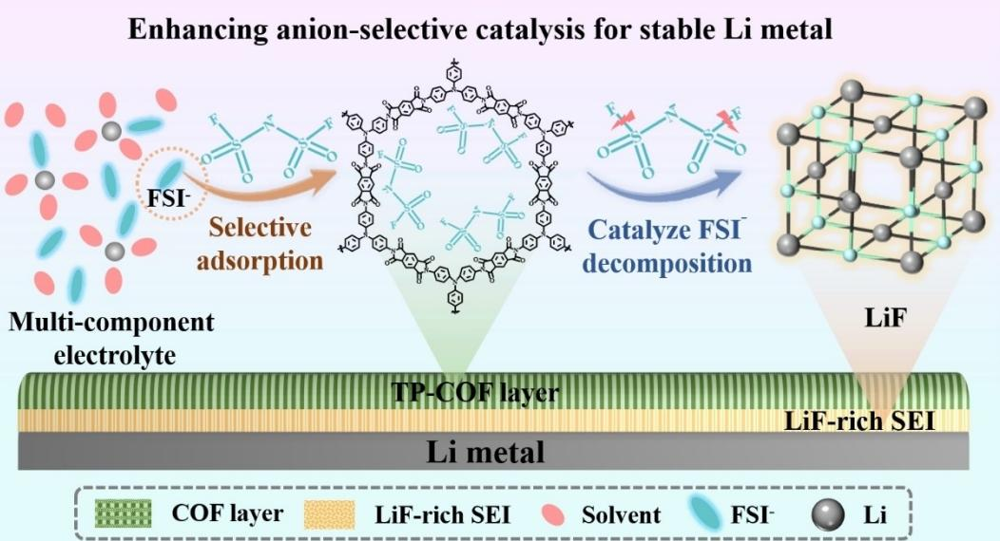
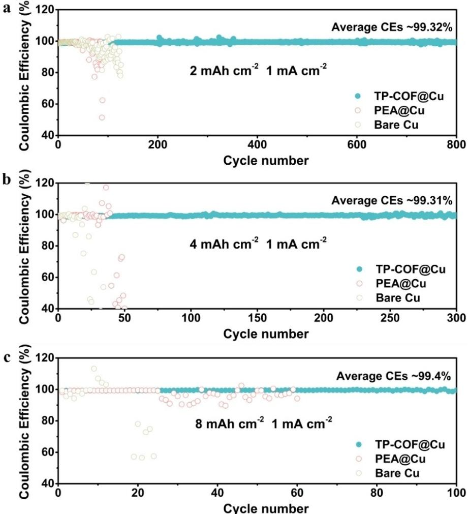
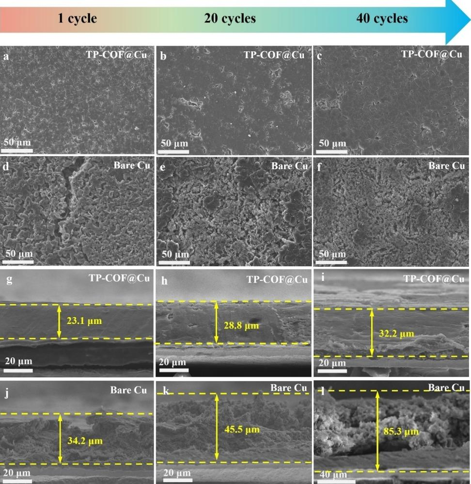
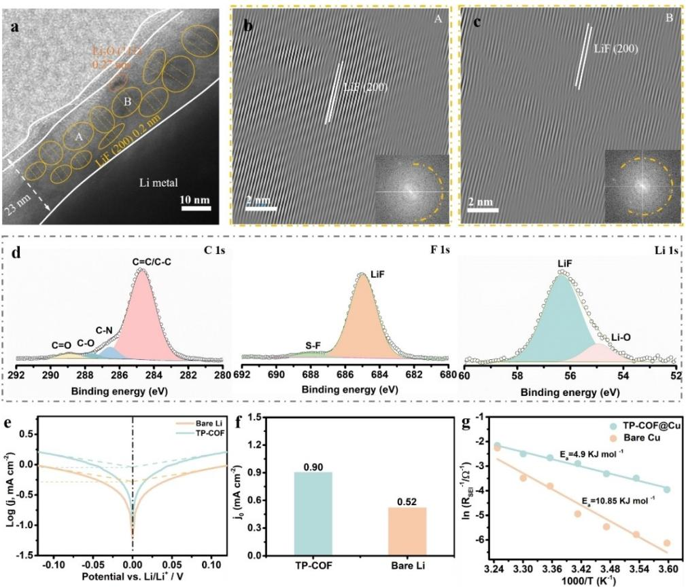

*Li Metal Batteries*

How to cite: *Angew. Chem. Int. Ed.* **2024**, *63*, e202317016 [doi.org/10.1002/anie.202317016](https://doi.org/10.1002/anie.202317016)

# **Enhancing Anion-Selective Catalysis for Stable Lithium Metal Pouch Cells through Charge Separated COF Interlayer**

*Peiyu Zhao+ , Yanhua Zhang+ , Baoyu Sun, Rui Qiao, Chao Li, Pengqi Hai, Yingche Wang, Feng Liu, and [Jiangxuan](http://orcid.org/0000-0001-6046-0760) Song\**

**Abstract:** Regulating the composition of solid-electrolyte-interphase (SEI) is the key to construct high-energy density lithium metal batteries. Here we report a selective catalysis anionic decomposition strategy to achieve a lithium fluoride (LiF)-rich SEI for stable lithium metal batteries. To accomplish this, the tris(4 aminophenyl) amine-pyromeletic dianhydride covalent organic frameworks (TP-COF) was adopted as an interlayer on lithium metal anode. The strong donoracceptor unit structure of TP-COF induces local charge separation, resulting in electron depletion and thus boosting its affinity to FSI . The strong interaction between TP-COF and FSI lowers the lowest unoccupied molecular orbital (LUMO) energy level of FSI , accelerating the decomposition of FSI and generating a stable LiF-rich SEI. This feature facilitates rapid Li+ transfer and suppresses dendritic Li growth. Notably, we demonstrate a 6.5 Ah LiNi0.8Co0.1Mn0.1O2 jTP-COF@Li pouch cell with high energy density (473.4 Whkg 1 ) and excellent cycling stability (97.4%, 95 cycles) under lean electrolyte 1.39 gAh 1 , high areal capacity 5.7 mAhcm 2 , and high current density 2.7 mAcm 2 . Our selective catalysis strategy opens a promising avenue toward the practical applications of high energy-density rechargeable batteries.

# *1. Introduction*

The rapidly growing consumer electronics and electric vehicle markets require rechargeable batteries with high energy density.[1–5] Lithium metal batteries (LMBs) have emerged as promising contenders in this pursuit, primarily owing to high theoretical specific capacity of 3860 mAhg 1 and low electrochemical potential ( 3.04 V vs. SHE) of Li metal anode.[6–8] Solid electrolyte interphase (SEI) on Li metal anode is a crucial component in LMBs, which is responsible for not only impeding the continuous parasitic reactions between the electrolyte and Li electrode, but also influencing the deposition and stripping behaviors of Li.[9–11] Therefore, constructing a stable SEI on Li-metal anode is necessary to promote practical applications of LMBs.

SEI is formed between Li metal phase and electrolyte phase by spontaneously chemical reactions and electrochemical reductions of the electrolyte, which consists of a mixture of inorganic and organic components.[12–17] The inorganic components comprise of Li2CO3, Li2O, LiF, and etc.[18–21] In particular, LiF has been validated as a key component in regulating the Li+ uniform diffusion and suppressing dendritic Li growth due to its excellent electronic insulator (~10 13 to 10 14 Scm 1 ),[22–25] high electrochemical window (6.2 V vs. Li/Li+) [26] and low energy barriers (~0.16 eV) for Li+ diffusion.[13,27] Thus, a LiF-rich SEI is effective for achieving high-performance LMBs.

The primary source of LiF in the SEI typically arises from the decomposition of lithium salts containing fluorine, such as lithium bis(trifluoromethanesulfonyl)imide (LiTF-SI), lithium bis(fluorosulfonyl)imide (LiFSI), and lithium hexafluorophosphate (LiPF6).[28–29] To further boost the LiF content within the SEI, extensive efforts have been focused on the electrolyte engineering, incorporating fluorine-containing additives and solvents.[30–31] These species possess suitable lowest unoccupied molecular orbital (LUMO) energy levels, allowing them to decompose during subsequent electrochemical reduction processes and augment the LiF content. However, electrolytes, typically composed of a variety of solvents and salts, are desirable to strike a balance between factors like ionic conductivity, viscosity, and the electrochemical window. The introduction of these fluorinecontaining species often lead to a decline in conductivity of electrolytes. Moreover, these fluorine-rich electrolytes tend to be more expensive, consequently increasing the overall cost of battery production.[32] In addition, the co-decomposition of solvents and salts forms a conventional SEI consisting of a high proportion of organic components, which is not conducive to inhibit the side reactions between Li metal and electrolytes upon cycling.[33–34] How to effectively utilize fluorine-containing components to build dense and LiF-rich SEI, mitigate the corrosive effects of electrolytes on Li metal anodes is necessary but challenging,

[\*] Dr. P. Zhao,+ Y. Zhang,+ Dr. B. Sun, R. Qiao, P. Hai, Prof. F. Liu, Prof. J. Song State Key Laboratory for Mechanical Behavior of Materials, Shaanxi International Research Center for Soft Matter, Xi'an Jiaotong University, 710049 Xi'an, China E-mail: songjx@xjtu.edu.cn Dr. C. Li Instrumental Analysis Center, Xi'an Jiaotong University, 710049 Xi'an, China Y. Wang Xi'an Institute of Electromechanical Information Technology, 710065 Xi'an, China [ +] Thses anthors contributed equally to this work. *Angew. Chem. Int. Ed.* **2024**, *63*, e202317016 (1 of 9) © 2024 Wiley-VCH GmbH

which is critical to the advancement of high-performance LMBs.

Herein, unlike conventional LiF-rich SEI architectures formation, we reported a selective catalysis anionic decomposition strategy to regulate the composition and structure of SEI for lithium metal anode through charge-separated covalent organic frameworks (tris(4-aminophenyl) aminepyromeletic dianhydride, TP-COF) interface (Figure 1). Key to this novel interlayer is the strong donor-acceptor unit structure of the TP-COF that enables local charge separation and thus strong interaction to FSI . This results in a significant reduction in the LUMO of FSI and expedites its decomposition, facilitating the formation of LiF-rich SEI. Accordingly, the 6.5 Ah NCM811 jTP-COF@Li pouch cell, applying lean electrolytes (1.39 gAh 1 ) and high-loading cathode (5.7 mAhcm 2 ), exhibits an ultrahigh energy density of 473.4 Whkg 1 .

## *2. Results and Discussion*

The TP-COF was synthesized via a polycondensation reaction between tris(4-aminophenyl) amine (TAPA) and pyromellitic dianhydride (PMDA, Figure S1).[35] The structure of TP-COF was identified by X-ray diffraction (XRD) and Fourier-transform infrared spectroscopy (FTIR) (Figure S2–3). Thereupon, the TP-COF was evaluated as function layer with a controllable thickness of ~2.1 μm (Figure S4–5). The uniform distribution of C, N and O elements further confirms the TP-COF evenly covers on the copper foil (Figure S6). The curve of TP-COF shows a typical I isotherms and has a rapid uptake below P/P0=0.01, indicating the presence of micropores. The specific surface area calculated with the BET model is 127.88 m2 g 1 . Based on nonlocal density functional theory (NLDFT), the evaluated pore size distribution plots of TP-COF show a distinct peak at about 1.3 nm (Figure S7).

DFT calculations were employed to scrutinize the molecular interactions between TP-COF and LiFSI. Within the TP-COF molecule, there exist two distinctive units: TAPA and PMDA. Interestingly, the LUMO level of TAPA ( 4.55 eV) was found to be higher than that of PMDA ( 5.57 eV), thus manifesting the TP-COF unit as a robust donor-acceptor structure (Figure S8). This structural arrangement facilitates the transfer of charges from TAPA to PMDA, thereby inducing charge separation. As shown in Figure S9, the yellow region (+0.0025 a.u.) signifies areas of electron density aggregation, while the blue region ( 0.0025 a.u.) indicates zones of electron density depletion. This substantiates the evident spatial charge separation. Consequently, TP-COF effectively functions as an anion receptor, primarily attracting FSI through dipole-dipole interactions between the electron-deficient TAPA and the electron-rich anions.

Strong FSI absorption by TP-COF was observed using UV absorption spectra, as shown in Figure 2a. The characteristic absorption band, centered at approximately 216 nm, corresponds to the n-π\* transition of FSI . Notably, this absorption band maintains its wavelength irrespective of the FSI concentration. Upon comparing the intensity of the absorption peaks, it was evident that the intensity of the absorption peak in the electrolyte containing TP-COF decreases from 100% to 67.6% relative to the electrolyte without TP-COF. This indicates that TP-COF absorbed approximately 32.4% of the FSI . Additionally, the binding energy (1.18 eV, Figure S10) calculated by DFT serves to confirm the strong adsorption interaction between FSI and TP-COF. Moreover, the adsorbed FSI exhibits a lower LUMO energy level ( 0.66 eV) in comparison to free FSI ( 0.53 eV, Figure 2b). This suggests that FSI adsorbed on the TP-COF@Cu anode is more susceptible to reduction.

*Figure 1.* Schematic illustrations of the SEI formation on lithium metal anode.

*Angew. Chem. Int. Ed.* **2024**, *63*, e202317016 (2 of 9) © 2024 Wiley-VCH GmbH

*Figure 2.* The analysis of adsorption and catalysis of FSI on TP-COF. (a) UV absorption spectra of the electrolyte before and after the immersion of TP-COF. (b) LUMO energy level changes of FSI before and after interacting with TP-COF. (c) Linear sweep voltammetry (LSV) curves of LijCu half-cell over the potential range from 0 V to 2 V at a scan rate of 0.1 mVs 1 . (d) Calibration curve of FSI peak area (717 cm 1 ) versus the electrolyte concentration. (e) Raman spectra of electrolyte at different concentrations.

Figure 2c demonstrates the significant difference in FSI decomposition between the LijCu cell with a TP-COF@Cu anode and a bare Cu anode. A sharp FSI decomposition peak is evident in the former, whereas the latter exhibits a relatively weak peak. This observation underscores the enhancement of FSI decomposition kinetics facilitated by TP-COF, allowing for more efficient reduction of FSI . Importantly, the increase in the reduction potential of FSI (from 1.5 V to 1.59 V) indicates its enhanced reduction performance, expediting the FSI decomposition process.

To further quantitatively assess the decomposition amount of FSI , Raman spectra was also employed using Lij Cu cells. Specifically, we obtained the calibration curve by correlating the area of FSI bend peak (717 cm 1 ) with the concentrations from 0.25 M to 1 M (Figure 2d). Furthermore, we choosed an initial concentration of 0.5 M for the test by diluting the electrolyte for 8 times (from 4 M to 0.5 M). After the first cycle, the electrolyte concentration in the LijCu cell precisely matched to 0.4 M, indicating that the FSI was reduced by approximately 0.1 M during cycling. Notably, in the LijTP-COF@Cu cell, the electrolyte concentration was decreased to 0.3 M from 0.5 M (Figure 2d–e), meaning that FSI was reduced by twice as much as that in the LijCu cells. This provides further confirmation of the crucial role of TP-COF in catalyzing FSI decomposition.

Asymmetric LijCu cells were assembled and evaluated with different deposition capacities to investigate the cycling stability of TP-COF on lithium metal anode (Figure 3). It can be observed that the LijTP-COF@Cu cells exhibited average CEs of 99.32% over 800 cycles at 2 mAh cm 2 (Figure 3a). With the capacity increased to 4 mAh cm 2 (Figure 3b), 6 mAh cm 2 (Figure S11) and 8 mAh cm 2 (Figure 3c), the average CEs reached to 99.31%, 99.4% and

*Figure 3.* Electrochemical performance of asymmetric LijCu cells. Coulombic efficiency comparison of LijBare Cu, LijPEA@Cu and LijTP-COF@Cu asymmetric cells with various capacities of (a) 2 mAhcm 2 , (b) 4 mAhcm 2 and (c) 8 mAhcm 2 at 1 mAcm 2 .

99.4% over 300 cycles, 160 cycles and 100 cycles, respectively. In contrast, the LijBare Cu cells revealed deteriorative cycling performance within 100 cycles at the same deposition capacity. Moreover, when the current density raised to 2 mAcm 2 , the LijTP-COF@Cu cells presented excellent cycle performance for 480 cycles with a high average CE of 99.41% at 2 mAhcm 2 (Figure S12) and 200 cycles with average CE of 99.1% at 4 mAhcm 2 (Figure S13).

The LijTP-COF@Cu cell shows an initial overpotential of 105 mV, which decreases to 50 mV at the 50th cycle (Figure S14). This demonstrates a remarkable long-term stable performance in the stripping/plating process with low hysteresis. In contrast, the LijBare Cu cell experiences more visible voltage fluctuations, ranging from 101 mV in the initial cycle to 144 mV in the 5th cycle (Figure S15). To further examine the interfacial stability of Li anodes during cycling, we performed the electrochemical impedance spectroscopy (EIS) test for Li anodes. The result of the EIS spectra in Figure S16 presents that the interfacial resistance

*Angew. Chem. Int. Ed.* **2024**, *63*, e202317016 (4 of 9) © 2024 Wiley-VCH GmbH

of the bare Cu anode increases gradually with the number of cycles (from 27 Ω to 56 Ω), whereas the impedance of the TP-COF@Cu anode only slightly increases from 10 Ω to 19 Ω.

The lithium deposition morphology of LijCu asymmetric cells were shown in Figure S17. For the TP-COF@Cu anode, a scaly structure was observed in the early stage of electrodeposits (1 mAhcm 2 , Figure S17a). In contrast, the bare Cu anode showed filamentous dendritic structure at 1 mAhcm 2 (Figure S17e). For practical applications, there remains a challenge in achieving high areal capacity (*>*4 mAhcm 2 ) to enhance the energy density of LMB. As shown in Figure 4a, a flat Li metal anode with nodule-like structure was observed after first cycle at 4 mAhcm 2 for TP-COF@Cu anode. The lithium metal electrode maintained a smooth morphology after 20 cycles (Figure 4b), and exhibited a flat and dense morphology even extending the lifetime to 40 cycles (Figure 4c). For bare Cu anode, the deposited Li showed a mossy dendritic structure at first cycle (Figure 4d) and generated significant fragmentation after consecutive

*Figure 4.* The lithium deposition morphology for TP-COF@Cu and bare Cu electrodes. Top-view and cross-sectional SEM images of deposited Li on Cu electrode (a–c, g–i) with and (d–f, j–l) without TP-COF at 4 mAhcm 2 after different cycles.

20 cycles (Figure 4e). More fragment was formed on bare Cu anode after 40 cycles (Figure 4f), resulting in loose porous dendritic structure. As the deposition capacity increased to 6 mAhcm 2 (Figure S17b, c) and 10 mAhcm 2 (Figure S17d), the TP-COF@Cu anode still maintained a smooth and intact platting morphology. In contrast, the filamentous dendrites gradually grow longer and thicker (Figure S17f–h), leading to a loose and porous deposition morphology for bare Cu anode. After stripping, there was negligible lithium residues on the TP-COF@Cu anodes (Figure S18a–c). In comparison, plenty of "dead lithium" were discovered on the bare Cu anodes (Figure S18d–f), suggesting poor stripping/plating reversibility of lithium without TP-COF protection.

As shown in Figure 4g, the cross-sectional morphology of deposited Li on TP-COF@Cu anode was smooth and dense with thickness of only 23.1 μm, approaching to the theoretical value of 20 μm for 4 mAhcm 2 . After 20 cycles, the thickness grew to 28.8 μm (Figure 4h). Even after 40 cycles, the TP-COF@Cu still enabled the compact and dendrite-free morphology deposition (Figure 4i). By conthickness up to 34.2 μm (Figure 4j), far exceeding theoretical value for 4 mAhcm 2 . The thickness of deposited Li increased sharply to 45.5 μm after 20 cycles (Figure 4k). After 40 cycles, bare Cu was almost completely covered by loose and porous lithium with a thickness of 85.3 μm (Figure 4l), almost 2.5 times that of the TP-COF@Cu anode. As shown in Figure S19, the plated Li on TP-COF@Cu anode exhibited thickness of 31.6 μm and 57.4 μm at areal capacity of 6 mAhcm 2 and 10 mAhcm 2 , respectively. In contrast, the deposited Li on bare Cu anode showed a much higher thickness of 40.1 μm and 113.9 μm at same conditions (Figure S20). The thickness of plated Li on TP-COF@Cu anode experienced a reduction of over 60% in comparison to that of the reference samples.

trast, the bare Cu anode was occupied by Li dendrite with

We employed the Cryo-transmission electron microscopy (Cryo-TEM) technique to directly visualize the microstructure of SEI. As shown in Figure 5a, the SEI formed on TP-COF@Cu exhibited a classical multilayer-type structure that consists of an amorphous phase outer layer and inner layer rich in LiF nanocrystals with a thickness of about

*Figure 5.* Cryo-TEM visualization of the SEI nanostructures. (a) SEI nanostructures of Li plated on a Cu grid in presence of TP-COF. HRTEM images of (b), (c) LiF nanocrystals with long-range-ordered lattices. (d) XPS spectra of the SEI on TP-COF@Cu anode. (e) Tafel plots of Lij Li symmetric cells. (f) The calculated exchange current densities (j0). (g) Arrhenius behavior of the reciprocal RSEI and the calculation activation energy for Li+ diffusion through SEI.

23 nm. The calibrated interplanar spacings of the crystals were further identified in the corresponding fast Fourier transform images. Significant crystalline phases of LiF (Figure 5b–c) and Li2O (Figure S21) are found in the inner layer, which are confirmed by matching the long-range-ordered lattices with their known lattice planes. Specifically, the calibrated interplanar spacing of 0.20 nm and 0.27 nm well match the (200) plane of LiF and the (111) plane of Li2O, respectively. In comparison, the cryo-TEM shows that the deposited Li on the bare Cu is jagged (Figure S22). The undulating SEI layer is highly amorphous structure with little LiF ranging in the thickness from 6.6 to 24 nm. The amorphous phase structure is generally considered to be an unfavorable SEI owing to insufficient passivation. Besides, the X-ray photoelectron spectroscopy (XPS) results also indicate that the main inorganic component of the SEI is LiF (56.5 eV in the Li 1s spectrum, 685.2 eV in the F 1s spectrum) for TP-COF@Cu anode (Figure 5d and Figure S23). These results confirm the distribution and enrichment of LiF components in the TP-COF induced SEI.

The kinetics of Li plating/stripping was evaluated using symmetrical cells. Tafel plots (Figure 5e) and the corresponding exchange current density (j0, Figure 5f) demonstrate a higher j0 for TP-COF (0.9 mAcm 2 ) than those for

*Angew. Chem. Int. Ed.* **2024**, *63*, e202317016 (6 of 9) © 2024 Wiley-VCH GmbH

bare Cu (0.52 mAcm 2 ), suggesting faster kinetics at the interface by modifying with TP-COF. Furthermore, the activation energy for Li deposition was calculated from the variable-temperature-controlled RSEI values (Figure S24). By linearly fitting ln(1/R) versus 1/T (Figure 5g), the activation energies obtained from the slopes are determined to be 4.9 and 10.85 kJmol 1 for TP-COF@Cu and bare Cu, respectively, indicating that the TP-COF@Cu anode favors Li+ uniform and rapid transmission through the LiF enhanced SEI.

The rate and cycling performance of TP-COF@Li was assessed in LijLiNi0.8Co0.1Mn0.1O2 (NCM811) full cells under practical conditions, which involved using a thin Li anode and a high-areal capacity NCM811 cathode with a capacity of 4.04 mAhcm 2 . The TP-COF@LijNCM811 full cell demonstrated an enhanced rate capability, with the capacity decreasing from 4 to 3.4 mAhcm 2 (Figure S25). This improvement was further validated by the lower potential differences observed between the charge and discharge plateaus (Figure S26a). However, the discharge capacity of the LijNCM811 cell experienced a significant decline from 4 to 2.6 mAhcm 2 as the current density increased (Figure S26b). In addition, the TP-COF@LijNCM811 cell can be cycled steadily over 170 cycles with a capacity retention

*Research Article*

*Figure 6.* Cycling performance of Li metal pouch cells. (a) Electrochemical performance of LijNCM811 coin cell at 1 C. (b) Schematic diagram and weight distribution of all cell components for the TP-COF@LijNCM811 pouch cell. (c) Schematic diagram of the cross section with detail parameters in our fabricated 6.5 Ah pouch cell. The energy density discussed in this work is delivered from the whole pouch cell, including the weight of all active and inactive components. (d) Long-term cycling performances of the pouch cell at 0.5 C (2.7 mAcm 2 ) with lean electrolytes and high-areal-capacity cathode. (e) Voltage profiles of (d) TP-COF@LijNCM811 at different cycles. (f) Radar plots for the comparison of this work and related references on the vital parameters of practical Li metal pouch cells.

of 89.9% at 1 C (~4 mAcm 2 , Figure 6a). In contrast, the LijNCM811 cell suffered a rapid capacity degradation with a capacity retention above 46% after 100 cycles at 1 C. The stability was also evident in the voltage curves of different cycles. Specifically, the voltage polarization of the TP-COF@LijNCM811 cell underwent minimal changes, indicating its excellent cycling stability. Conversely, the discharge capacity of LijNCM811 cell decreased significantly (Figure S27).

To further demonstrate the possibilities for practical application, the TP-COF@Li anode was further evaluated in a high-energy LijNCM811 pouch cell under extremely low electrolyte to capacity (E/C) ratio of 1.39 gAh 1 . In the meantime, the pouch cell comprises a high-areal-capacity NCM811 cathode (5.7 mAhcm 2 ) and a thin Li anode (100 μm thick/10 mAhcm 2 on each side), giving a low negative to positive electrode capacity (N/P) ratio of 1.75 (Figure 6b–c). Even under such harsh conditions, the TP-COF@LijNCM811 pouch cell delivered a high initial capacity of 6.5 Ah and exhibited an ultra-high energy density of 473.4 Whkg 1 based on the mass of all components, including active and inactive materials (cathode, anode, electrolyte, packaging and label, the cell parameters are listed in Table S1). Surprisingly, the TP-COF@Lij NCM811 pouch cell can work stably within 95 cycles at 0.1 C charge/0.5 C discharge based on 97.4% capacity retention (Figure 6d). In contrast, the LijNCM811 pouch cell showed a similar initially capacity (6.42 Ah) as the TP-COF@Lij NCM811, but the capacity faded rapidly to a much lower capacity of 5.55 Ah after 45 cycles. The cycling stability of pouch cell was further reflected in the voltage profiles of different cycles (Figure 6e), where the voltage polarization of the TP-COF@LijNCM811 was almost constant, while the bare LijNCM811 pouch cell displayed significant voltage polarization within 40 cycles (Figure S28). What's more, the mass ratio of each part of the pouch cell was displayed in Figure S29. Compared with current Li-ion batteries, the mass ratio of the electrolyte is comparable (17 wt%), and the mass ratio of the anode (8 wt%, ~12 wt% for Li-ion batteries) is greatly reduced. Notably, the excellent cycling stability of 0.027% decay/cycle and a high cell-level energy density of 473.4 Whkg 1 of TP-COF@LijNCM811 pouch cell outperforms most of reported values for the Li metal pouch cells even under practical conditions (Figure 6f),[36–45] demonstrating the effectiveness of selective catalysis strategy with high practical value.

#### *3. Conclusions*

In conclusion, a stable LiF-rich SEI was constructed by selective catalysis anionic decomposition strategy using charge-separated TP-COF. The electron-deficient portion of TP-COF (TAPA) can adsorb FSI and promote the decomposition of more FSI . Therefore, the LiF-rich SEI is formed, which prevents side reactions with the electrolyte, significantly inhibits the formation of lithium dendrites, and extends the cycling life of the lithium anode. With these merits, the LijTP-COF@Cu asymmetric cell has a high

*Angew. Chem. Int. Ed.* **2024**, *63*, e202317016 (8 of 9) © 2024 Wiley-VCH GmbH

average CE of 99.4% at a high areal capacity of 8 mAhcm 2 after 100 cycles (~1600 h). Moreover, a high-energy NCM811 jTP-COF@Li pouch cell exhibits a high capacity of 6.5 Ah and an ultra-high energy density of 473.4 Whkg 1 with 97.4% capacity retention after 95 cycles. Achieving such high energy densities at the pouch cell level may open the way to designing more practical lithium metal battery architectures.

#### *4. Supporting Information*

Supporting Information is available from the Wiley Online Library or from the author.

#### *Author Contributions*

P. Y. Z. and Y. H. Z. contributed equally to the work. J. X. S. conceived the idea, designed the experiments, and supervised the project. P. Y. Z., Y. H. Z. R. Q. prepared the materials and carried out experiments. P. Q. H. performed simulations and calculations. J. X. S., P. Y. Z. and Y. H. Z. wrote the paper. All authors discussed the results and commented on the manuscript.

## *Acknowledgements*

The authors acknowledge funding support from the National Natural Science Foundation of China (21875181) and Natural Science Basic Research Program of Shaanxi (No. 2019JLP-13). The authors would like to thank Wei Wang, Jiamin Tong, and Chenyu Liang at Xi'an Jiaotong University for their help in materials characterization.

#### *Conflict of Interest*

The authors declare no conflict of interest.

#### *Data Availability Statement*

Research data are not shared.

**Keywords:** Li metal batteries **·** catalysis anionic decomposition **·** solid electrolyte interphase **·** high-energy-density **·** pouch cell

[3] X. Ren, L. Zou, X. Cao, M. H. Engelhard, W. Liu, S. D. Burton, H. Lee, C. Niu, B. E. Matthews, Z. Zhu, C. Wang,

[1] B. Han, D. Xu, S. S. Chi, D. He, Z. Zhang, L. Du, M. Gu, C. Wang, H. Meng, K. Xu, Z. Zheng, Y. Deng, *Adv. Mater.* **2020**, *32*, e2004793.

[2] C. Niu, H. Lee, S. Chen, Q. Li, J. Du, W. Xu, J.-G. Zhang, M. S. Whittingham, J. Xiao, J. Liu, *Nat. [Energy](https://doi.org/10.1038/s41560-019-0390-6)* **2019**, *4*, 551– [559](https://doi.org/10.1038/s41560-019-0390-6).

B. W. Arey, J. Xiao, J. Liu, J.-G. Zhang, W. Xu, *[Joule](https://doi.org/10.1016/j.joule.2019.05.006)* **2019**, *3*, [1662–1676.](https://doi.org/10.1016/j.joule.2019.05.006)

- [4] M. Ue, K. Uosaki, *Curr. Opin. [Electrochem.](https://doi.org/10.1016/j.coelec.2019.05.001)* **2019**, *17*, 106–113. [5] J. Wu, Z. Ju, X. Zhang, A. C. Marschilok, K. J. Takeuchi, H.
- Wang, E. S. Takeuchi, G. Yu, *Adv. Mater.* **2022**, *2022*, 2202780. [6] S. Park, S. Y. Jeong, T. K. Lee, M. W. Park, H. Y. Lim, J. Sung, J. Cho, S. K. Kwak, S. Y. Hong, N. S. Choi, *Nat. Commun.*
- **2021**, *12*, 838. [7] V. Viswanathan, A. H. Epstein, Y.-M. Chiang, E. Takeuchi, M. Bradley, J. Langford, M. Winter, *Nature* **2022**, *601*, [519–525](https://doi.org/10.1038/s41586-021-04139-1).
- [8] W. Xue, M. Huang, Y. Li, Y. G. Zhu, R. Gao, X. Xiao, W. Zhang, S. Li, G. Xu, Y. Yu, P. Li, J. Lopez, D. Yu, Y. Dong, W. Fan, Z. Shi, R. Xiong, C.-J. Sun, I. Hwang, W.-K. Lee, Y. Shao-Horn, J. A. Johnson, J. Li, *Nat. Energy* **2021**, *6*, [495–505.](https://doi.org/10.1038/s41560-021-00792-y)
- [9] S. Chen, F. Dai, M. Cai, *ACS Energy Lett.* **2020**, *5*, [3140–3151.](https://doi.org/10.1021/acsenergylett.0c01545)
- [10] W. Deng, W. Dai, X. Zhou, Q. Han, W. Fang, N. Dong, B. He, Z. Liu, *ACS Energy Lett.* **2020**, *6*, 115–123.
- [11] Y. Feng, C. Zhang, X. Jiao, Z. Zhou, J. Song, *Energy [Storage](https://doi.org/10.1016/j.ensm.2019.10.017) Mater.* **2020**, *25*, [172–179.](https://doi.org/10.1016/j.ensm.2019.10.017)
- [12] Z. Ju, J. Nai, Y. Wang, T. Liu, J. Zheng, H. Yuan, O. Sheng, C. Jin, W. Zhang, Z. Jin, H. Tian, Y. Liu, X. Tao, *Nat. Commun.* **2020**, *11*, 488.
- [13] Y. J. Liu, X. Y. Tao, Y. Wang, C. Jiang, C. Ma, O. W. Sheng, G. X. Lu, X. W. Lou, *Science* **2022**, *375*, [739–745](https://doi.org/10.1126/science.abn1818).
- [14] Z. Shen, W. Zhang, S. Li, S. Mao, X. Wang, F. Chen, Y. Lu, *Nano Lett.* **2020**, *20*, [6606–6613](https://doi.org/10.1021/acs.nanolett.0c02371).
- [15] S. Stalin, M. Tikekar, P. Biswal, G. Li, H. E. N. Johnson, Y. Deng, Q. Zhao, D. Vu, G. W. Coates, L. A. Archer, *[Nano](https://doi.org/10.1021/acs.nanolett.0c01501) Lett.* **2020**, *20*, [5749–5758](https://doi.org/10.1021/acs.nanolett.0c01501).
- [16] T. Wang, Y. Li, J. Zhang, K. Yan, P. Jaumaux, J. Yang, C. Wang, D. Shanmukaraj, B. Sun, M. Armand, Y. Cui, G. Wang, *Nat. Commun.* **2020**, *11*, 5429.
- [17] P. Zhai, Y. Wei, J. Xiao, W. Liu, J. Zuo, X. Gu, W. Yang, S. Cui, B. Li, S. Yang, Y. Gong, *Adv. Energy Mater.* **2020**, *10*, 1903339.
- [18] A. J. Louli, A. Eldesoky, R. Weber, M. Genovese, M. Coon, J. deGooyer, Z. Deng, R. T. White, J. Lee, T. Rodgers, R. Petibon, S. Hy, S. J. H. Cheng, J. R. Dahn, *Nat. [Energy](https://doi.org/10.1038/s41560-020-0668-8)* **2020**, *5*, [693–702.](https://doi.org/10.1038/s41560-020-0668-8)
- [19] L. Sheng, Q. Wang, X. Liu, H. Cui, X. Wang, Y. Xu, Z. Li, L. Wang, Z. Chen, G. L. Xu, J. Wang, Y. Tang, K. Amine, H. Xu, X. He, *Nat. Commun.* **2022**, *13*, 172.
- [20] C. Yan, R. Xu, Y. Xiao, J. F. Ding, L. Xu, B. Q. Li, J. Q. Huang, *Adv. Funct. Mater.* **2020**, *30*, 1909887.
- [21] Z. Yu, H. Wang, X. Kong, W. Huang, Y. Tsao, D. G. Mackanic, K. Wang, X. Wang, W. Huang, S. Choudhury, Y. Zheng, C. V. Amanchukwu, S. T. Hung, Y. Ma, E. G. Lomeli, J. Qin, Y. Cui, Z. Bao, *Nat. Energy* **2020**, *5*, [526–533](https://doi.org/10.1038/s41560-020-0634-5).
- [22] J. Li, P. Zou, S. W. Chiang, W. Yao, Y. Wang, P. Liu, C. Liang, F. Kang, C. Yang, *Energy Storage Mater.* **2020**, *24*, [700–706](https://doi.org/10.1016/j.ensm.2019.06.019).
- [23] K. Lin, T. Li, S. W. Chiang, M. Liu, X. Qin, X. Xu, L. Zhang, F. Kang, G. Chen, B. Li, *Small* **2020**, *16*, e2001784.
- [24] T. S. Wang, X. Liu, X. Zhao, P. He, C. W. Nan, L. Z. Fan, *Adv. Funct. Mater.* **2020**, *30*, 2000786.
- [25] Q. Xu, X. Yang, M. Rao, D. Lin, K. Yan, R. Du, J. Xu, Y. Zhang, D. Ye, S. Yang, G. Zhou, Y. Lu, Y. Qiu, *[Energy](https://doi.org/10.1016/j.ensm.2019.12.028) [Storage](https://doi.org/10.1016/j.ensm.2019.12.028) Mater.* **2020**, *26*, 73–82.
- [26] W. Cao, J. Lu, K. Zhou, G. Sun, J. Zheng, Z. Geng, H. Li, *Nano [Energy](https://doi.org/10.1016/j.nanoen.2022.106983)* **2022**, *95*, 106983.
- [27] P. Zhao, G. Kuang, R. Qiao, K. Liu, F. Boorboor Ajdari, K. Sun, C. Bao, M. Niasari, J. Song, *ACS Appl. [Energ.](https://doi.org/10.1021/acsaem.2c01873) Mater.* **2022**, *5*, [10141–10148](https://doi.org/10.1021/acsaem.2c01873).
- [28] M. Mao, X. Ji, Q. Wang, Z. Lin, M. Li, T. Liu, C. Wang, Y.-S. Hu, H. Li, X. Huang, L. Chen, L. Suo, *Nat. Commun.* **2023**, *14*, 1082.
- [29] Y. Zhao, T. Zhou, M. Mensi, J. W. Choi, A. Coskun, *Nat. Commun.* **2023**, *14*, 299.
- [30] J. Holoubek, M. Yu, S. Yu, M. Li, Z. Wu, D. Xia, P. Bhaladhare, M. S. Gonzalez, T. A. Pascal, P. Liu, Z. Chen, *ACS Energy Lett.* **2020**, *5*, [1438–1447.](https://doi.org/10.1021/acsenergylett.0c00643)
- [31] H. Wang, Z. Yu, X. Kong, W. Huang, Z. Zhang, D. G. Mackanic, X. Huang, J. Qin, Z. Bao, Y. Cui, *Adv. Mater.* **2021**, *33*, 2008619.
- [32] J. Moon, D. O. Kim, L. Bekaert, M. Song, J. Chung, D. Lee, A. Hubin, J. Lim, *Nat. Commun.* **2022**, *13*, 4538.
- [33] J. Tan, J. Matz, P. Dong, J. Shen, M. Ye, *Adv. Energy Mater.* **2021**, *11*, 2100046.
- [34] H. Wu, H. Jia, C. Wang, J. G. Zhang, W. Xu, *Adv. Energy Mater.* **2020**, *11*, 2003092.
- [35] Z. Zhao, W. Chen, S. Impeng, M. Li, R. Wang, Y. Liu, L. Zhang, L. Dong, J. Unruangsri, C. Peng, C. Wang, S. Namuangruk, S.-Y. Lee, Y. Wang, H. Lu, J. Guo, *J. [Mater.](https://doi.org/10.1039/C9TA13384D) [Chem.](https://doi.org/10.1039/C9TA13384D) A* **2020**, *8*, 3459.
- [36] Q.-K. Zhang, X.-Q. Zhang, J. Wan, N. Yao, T.-L. Song, J. Xie, L.-P. Hou, M.-Y. Zhou, X. Chen, B.-Q. Li, R. Wen, H.-J. Peng, Q. Zhang, J.-Q. Huang, *Nat. Energy* **2023**, *8*, [725–735](https://doi.org/10.1038/s41560-023-01275-y).
- [37] G. Zhang, J. Chang, L. Wang, J. Li, C. Wang, R. Wang, G. Shi, K. Yu, W. Huang, H. Zheng, T. Wu, Y. Deng, J. Lu, *Nat. Commun.* **2023**, *14*, 1081.
- [38] Y. Qiao, H. Yang, Z. Chang, H. Deng, X. Li, H. Zhou, *[Nat.](https://doi.org/10.1038/s41560-021-00839-0) Energy* **2021**, *6*, [653–662](https://doi.org/10.1038/s41560-021-00839-0).
- [39] C. Niu, H. Lee, S. Chen, Q. Li, J. Du, W. Xu, J.-G. Zhang, M. S. Whittingham, J. Xiao, J. Liu, *Nat. [Energy](https://doi.org/10.1038/s41560-019-0390-6)* **2019**, *4*, 551– [559](https://doi.org/10.1038/s41560-019-0390-6).
- [40] S. Zhang, F. Sun, X. Du, X. Zhang, L. Huang, J. Ma, S. Dong, A. Hilger, I. Manke, L. Li, B. Xie, J. Li, Z. Hu, A. C. Komarek, H.-J. Lin, C.-Y. Kuo, C.-T. Chen, P. Han, G. Xu, Z. Cui, G. Cui, *Energy Environ. Sci.* **2023**, *16*, [2591–2602](https://doi.org/10.1039/D3EE00558E).
- [41] Y. Zhang, P. Zhao, Q. Nie, Y. Li, R. Guo, Y. Hong, J. Deng, J. Song, *Adv. Mater.* **2023**, *35*, 2211032.
- [42] M. Zhang, K. Liu, Y. Gan, H. Wang, F. Liu, M. Bai, X. Tang, Z. Wang, S. Li, A. Shao, K. Zhou, T. Wang, Z. Wang, S. Yuan, Y. Ma, *Adv. Energy Mater.* **2022**, *12*, 2201390.
- [43] P. Zhao, Y. Li, S. Chen, H. Fan, Y. Feng, L. Hu, Y. Zhang, Q. Nie, H. Pei, C. Yang, et al., *Adv. Energy Mater.* **2022**, *12*, 2200568.
- [44] X. Q. Zhang, T. Li, B. Q. Li, R. Zhang, P. Shi, C. Yan, J. Q. Huang, Q. Zhang, *Angew. Chem. Int. Ed.* **2020**, *59*, [3252–3257.](https://doi.org/10.1002/anie.201911724)
- [45] W. Deng, W. Dai, X. Zhou, Q. Han, W. Fang, N. Dong, B. He, Z. Liu, *ACS Energy Lett.* **2020**, *6*, 115–123.

Manuscript received: November 9, 2023 Version of record online: September 6, 2024