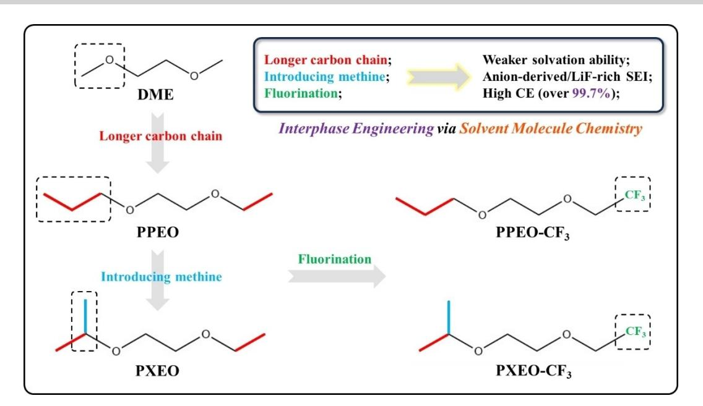
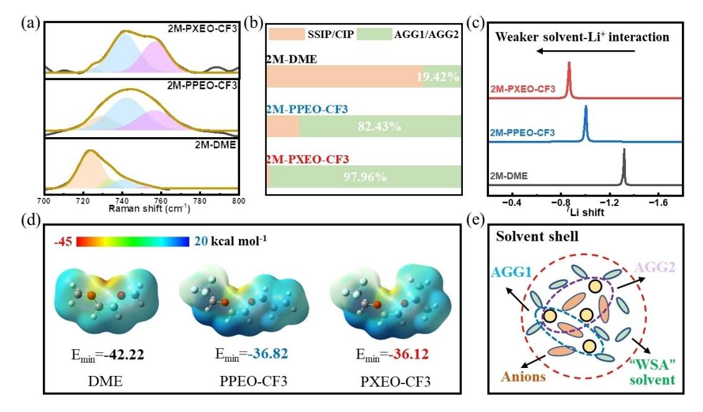
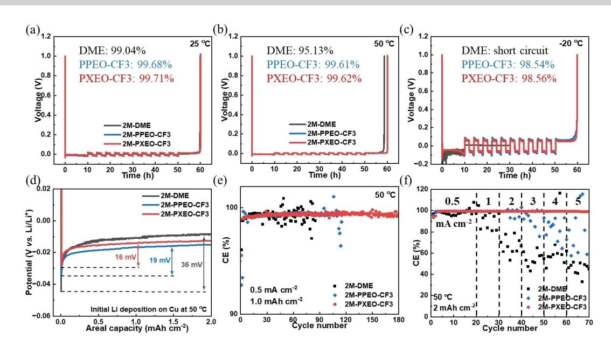
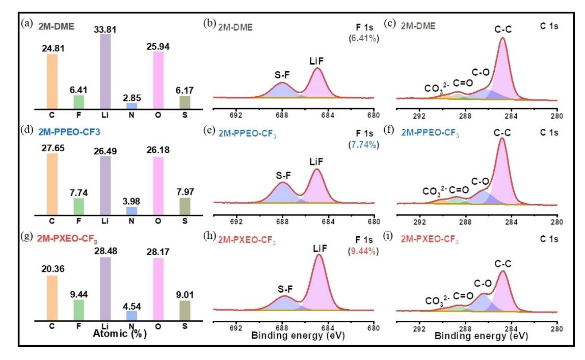
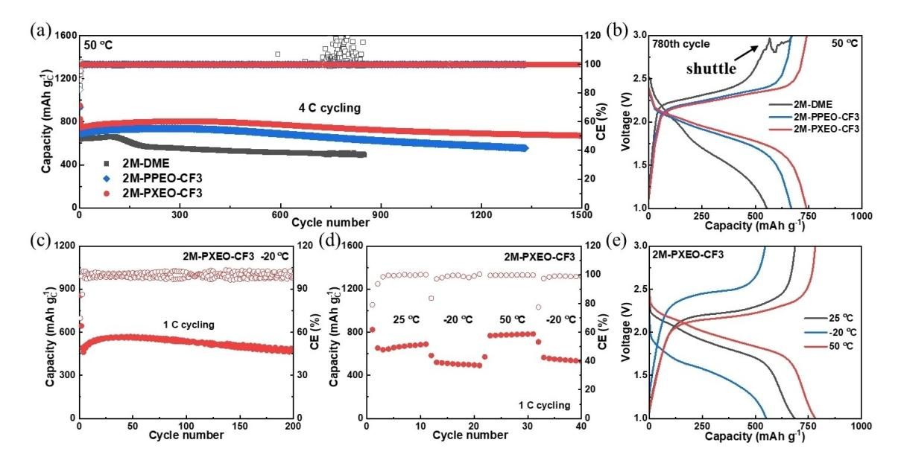
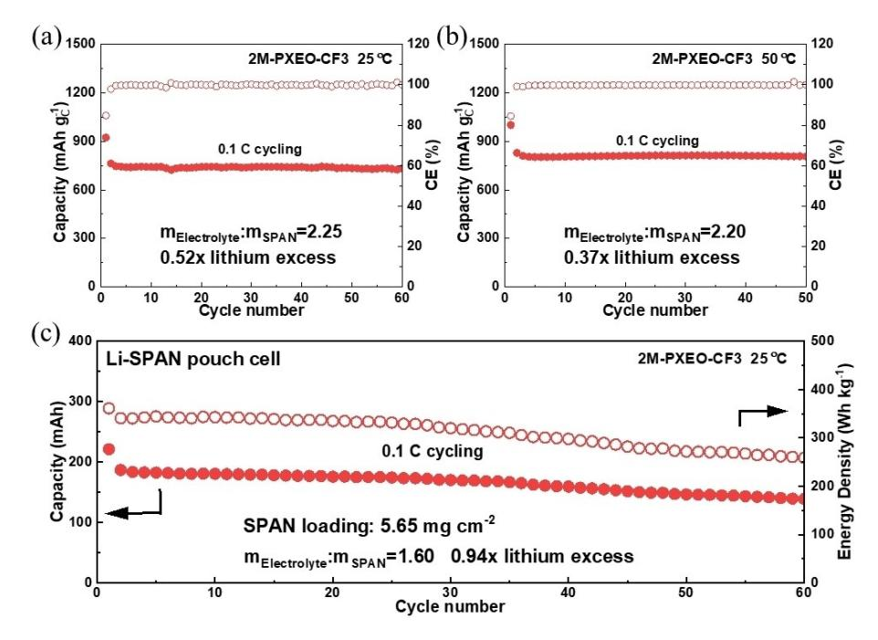
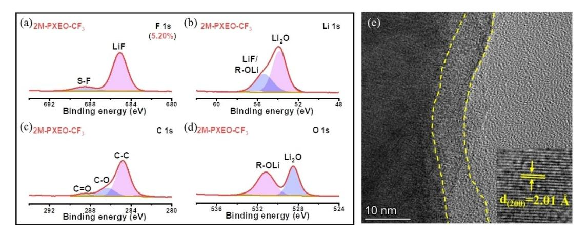

*Angewandte Chemie* www.angewandte.org

## *Lithium Metal Batteries*

How to cite: *Angew. Chem. Int. Ed.* **2024**, *63*, e202317923 [doi.org/10.1002/anie.202317923](https://doi.org/10.1002/anie.202317923)

# **Interphase Engineering via Solvent Molecule Chemistry for Stable Lithium Metal Batteries**

*Jiahang Chen+ , Huichao Lu+ , Xirui Kong, Jian Liu, Jiqiong Liu, Jun Yang, Yanna Nuli, and Jiulin [Wang](http://orcid.org/0000-0001-8165-0096)\**

**Abstract:** Lithium metal battery has been regarded as promising next-generation battery system aiming for higher energy density. However, the lithium metal anode suffers severe side-reaction and dendrite issues. Its electrochemical performance is significantly dependant on the electrolyte components and solvation structure. Herein, a series of fluorinated ethers are synthesized with weak-solvation ability owing to the duple steric effect derived from the designed longer carbon chain and methine group. The electrolyte solvation structure rich in AGGs (97.96%) enables remarkable CE of 99.71% (25°C) as well as high CE of 98.56% even at 20 °C. Moreover, the lithium-sulfur battery exhibits excellent performance in a wide temperature range ( 20 to 50°C) ascribed to the modified interphase rich in LiF/LiO2. Furthermore, the pouch cell delivers superior energy density of 344.4 Whkg 1 and maintains 80% capacity retention after 50 cycles. The novel solvent design via molecule chemistry provides alternative strategy to adjust solvation structure and thus favors high-energy density lithium metal batteries.

#### *1. Introduction*

The rapid development of lithium-ion batteries has gradually reached the theoretical energy density. Recently, lithium metal battery attracts intensive attention owing to the high theoretical capacity (3860 mAhg 1 ), the lowest redox potential ( 3.04 V vs. standard hydrogen electrode) and low density of lithium.[1] However, lithium metal anode suffers severe side-reaction because of its high electrochemical

sity, Shanghai 200240, P. R. China

Dr. X. Kong, Dr. J. Liu, Prof. J. Wang

State Key Laboratory of Chemistry and Utilization of Carbon-Based Energy Resources; College of Chemistry, Xinjiang University, Urumqi, 830046 Xinjiang, P. R. China Prof. J. Wang Sichuan Research Institute, Shanghai Jiao Tong University, Chengdu

610218, P. R. China Corresponding Author: Jiulin Wang E-mail: wangjiulin@sjtu.edu.cn

[ +] The authors contributed equal to this work.

*Angew. Chem. Int. Ed.* **2024**, *63*, e202317923 (1 of 8) © 2024 Wiley-VCH GmbH

reactivity, which leads to fast battery failure and low Coulombic efficiency (CE). Moreover, the unordered Li+ flux renders dendrite growth, which is easy to pierce separator and causes short circuit.[2]

Electrolyte plays a determined role in the performance of lithium metal anode since the electrolyte components will react with lithium to form solid electrolyte interphase (SEI). In common "1 M" dilute electrolyte, the Li+ coordinates with solvents to form solvent-separated ion pairs (SSIPs), thus rendering solvent-derived SEI which mainly consists of organic components. The thick SEI with inferior Li+ diffusion ability causes adverse side-reaction and dendrite growth.[3] Recently, high-concentration electrolytes (HCEs) were reported via simply increasing salt concentration.[4] The high salt/solvent molar ratio intelligently favors anions to enter solvation sheath to generate contact ion pairs (CIPs) and aggregates (AGGs), where anions can preferentially reduce into SEI rich in inorganic species. It enables dendrite-free cycling of lithium metal anode with high CE over 99.0%. Furthermore, considering the high viscosity, cost and low ionic conductivity of HCEs, inert solvents, such as hydrofloroethers (HFEs), are introduced as diluent which not only remain the solvation structure, but also decrease the viscosity of electrolyte.[5] However, the large proportion of HFEs also increases the electrolyte cost and density, which hinders its practical application.

Based on the deeper understanding on the relationship between solvent structure and solvent-Li+ interaction, the concept of solvents with weak-solvation ability (WSA) was proposed, which can maintain similar solvation structure with HCEs even at moderate salt concentration.[6] Several constructed works have been reported to design "WSA" solvents via molecule chemistry based on 1,2-Dimethoxyethane (DME).[7] For example, Cui et al. proposed ethylene glycol diethyl ether (DEE) with longer carbon chain compared with DME, which reveals decreased solvation ability.[8] Furthermore, a family of fluorinated-DEE molecules were designed to render LiF-rich SEI.[9] Additionally, the introduction of methine proposed by Jang Wook Choi can also reduce the solvent-Li+ interaction via steric effect.[10,11]

Inspired by above-mentioned works, herein we synthesized a series of fluorinated ethers with longer carbon chain and further introduced methine group to realize duple steric effect (Figure 1). The electrolyte at moderate salt concentration consists of 97.96% AGGs and enables remarkable CE of 99.71% as well as high CE of 98.56% even at 20 °C ascribed to the LiF-rich SEI derived from FSI anion and

[\*] Dr. J. Chen,+ Dr. H. Lu,+ Dr. J. Liu, Prof. J. Yang, Prof. Y. Nuli, Prof. J. Wang Department of Chemical Engineering, Shanghai Jiao Tong Univer-

*Research Articles*

*Figure 1.* The molecular structures of fluorinated ethers and the functional mechanism in this work.

fluorinated solvent. Coupled with sulfurized pyrolyzed poly(acrylonitrile) (SPAN) cathode, the modified cathode interphase rich in LiF/LiO2 favors superior performance in a wide temperature range ( 20 to 50°C). Moreover, the Li-SPAN pouch cell delivers benign energy density of 344.4 Whkg 1 and maintains 80% capacity retention after 50 cycles.

#### *2. Results and Discussion*

The synthesis route of ethylene glycol (2,2,2-trifluoroethyln-propyl) ether (PPEO-CF3) and ethylene glycol (2,2,2 trifluoroethyl-i-propyl) ether (PXEO-CF3) is displayed in Figure S1 and analyzed via nuclear magnetic resonance (NMR) test as shown in Figure S2 and S3. The physicochemical properties of different electrolytes are firstly compared as shown in Table S1. Compared with the low density of 2 M-DME electrolyte (1.08 g cm 3 ), both the fluorinated electrolytes maintain slightly higher density, of which the density of 2 M-PPEO-CF3 is 1.15 gcm 3 while the density of 2 M-PXEO-CF3 is 1.13 gcm 3 . Besides, the viscosity and ionic conductivity of different electrolyte are tested at 25 and 50 °C, respectively. The 2 M-DME electrolyte exhibits low viscosity of 3.30 mPa·s and remarkable ionic conductivity of 8.95 mScm 1 at 50 °C. The 2 M-PPEO-CF3 electrolyte reveals increased viscosity whereas the 2 M-PXEO-CF3 electrolyte exhibits lower viscosity ascribed to the spatial effect of the isopropyl groups. Both the fluorinated electrolytes display relatively low ionic conductivity (*>*1 mScm 1 ) because of the weak solvation ability of designed solvents and slow mobility of AGGs. It is worth noting that the 2 M-PXEO-CF3 electrolyte maintains benign ionic conductivity (0.47 mScm 1 ) even at 20°C owing to the low viscosity and melting point of PXEO-CF3. Further-

*Angew. Chem. Int. Ed.* **2024**, *63*, e202317923 (2 of 8) © 2024 Wiley-VCH GmbH

more, the wetting ability on separator is compared via contact angle test as shown in Figure S4. Compared with the poor wetting ability of 2 M-DME (33.3°) and 2 M-PPEO-CF3 (33.7°) electrolytes, the 2 M-PXEO-CF3 electrolyte shows the lowest contact angle of 10.2° ascribed to superior affinity of isopropyl groups towards separator and can rapidly disperses throughout the separator.

*Angewandte*

*Chemie*

The solvation structures of different electrolytes are further explored via Raman characterization. As shown in Figure 2a and S5, the 2 M-DME electrolyte reveals obvious peaks at 723 and 733 cm 1 corresponding to free FSI and coordinated FSI , which indicates abundant SSIP and CIP.[12] In the 2 M-PPEO-CF3 electrolyte, the proportion of SSIP/CIP declines while the proportion of AGG1/AGG2 remarkably increases to 82.43%, whose characteristic peaks locate at 741 cm 1 and 754 cm 1 . [3] Moreover, it is worth noting that the 2 M-PXEO-CF3 electrolyte maintains the highest proportion of AGG1/AGG2 up to 97.96% ascribed to the prolonged carbon chain of 2 M-PXEO-CF3 as well as the steric effect of its isopropyl groups (Figure 2b). Furthermore, the Fourier transform infrared spectroscopy (FTIR) test is also conducted as shown in Figure S6. In the 2 M-DME electrolyte, the peaks at 1364.4 cm 1 and 1382.0 cm 1 correspond to free FSI and coordinated FSI , respectively.[13] In contrast, higher content of coordinated FSI exist in the proposed fluorinated electrolytes with weak solvation ability, which is coincident with the Raman results. Moreover, the proposed electrolytes consist of lower-content solvated solvents, which demonstrate the weak solvation ability of PPEO-CF3 and PXEO-CF3. Additionally, the 7 Li NMR test can directly confirm the Li+ coordination state with different solvents (Figure 2c).[8,14] The 2 M-PPEO-CF3 electrolyte displays a down-field displacement ( 1.00 ppm) compared with that of 2 M-DME ( 1.32 ppm) while the 2 M-PXEO-CF3 electrolyte exhibits the most

*Figure 2.* (a) Raman characterization of different electrolytes. (b) Composition in solvation structure. (c) 7 Li NMR characterization of different electrolytes. (d) ESP of different solvents. (e) Solvation structure of electrolyte consisting of "WSA" solvent.

positive shift at 0.86 ppm, indicting the weakest solvent-Li+ interaction.

The solvation ability of different solvents is also compared via electrostatic potential (ESP) calculations, where the negative parts on the isopotential surfaces are easier to coordinate with Li+. [15] As shown in Figure 2d, the value of Emin of both PPEO-CF3 ( 36.82 kcalmol 1 ) and PXEO-CF3 ( 36.12 kcalmol 1 ) is higher than that of DME ( 42.22 kcalmol 1 ), which demonstrate the weak solvation ability of two fluorinated electrolytes. Thereby, we successfully tuned the unique solvation structure consisting of abundant AGG1/AGG2 via synthesizing fluorinated solvents with weak solvation ability. Moreover, compared with PPEO-CF3, the introduced methine group of PXEO-CF3 not only further lowers the coordination ability of the neighboring oxygen atom, but also renders steric crowding around the first solvation shell, thus forming higher proportion of AGGs.

The average CE was calculated in a wide temperature range via previously reported protocol to evaluate the reversibility of lithium plating/stripping.[16] As shown in Figure 3a, the 2 M-DME electrolyte enables a benign CE of 99.04% at 25 °C attributed to the increased salt concentration. In contrast, the CE increases to remarkable 99.68% in the 2 M-PPEO-CF3 electrolyte while the 2 M-PXEO-CF3 electrolyte realizes a ultrahigh CE of 99.71% ascribed to the unique solvation structure with AGG1/AGG2, revealing significant superiority compared with the reported works on "WSA" electrolyte (Table S2). Moreover, the proposed electrolytes maintain a high CE over 99.60% even under elevated temperature of 50 °C, which is superior than that of 2 M-DME electrolyte (95.13%), indicating prominently improved interfacial stability. In addition, the lithium behavior at extremely low temperature was also evaluated

*Angew. Chem. Int. Ed.* **2024**, *63*, e202317923 (3 of 8) © 2024 Wiley-VCH GmbH

using different electrolytes (Figure 3c). The 2 M DME electrolyte exhibits waving profile in initial discharge and then suffers short circuit. In contrast, both the proposed fluorinated electrolytes enable high CE over 98.5% even at 20 °C owing to moderate ionic conductivity and low melting point.

Besides, the electrochemical behavior at 50 °C was further investigated in detail. The Figure 3d displays the voltage-capacity curves of initial Li deposition on Cu substrate. Compared with the large nucleation and growth overpotential of 36 mV in 2 M-DME electrolyte, the 2 M-PPEO-CF3 electrolyte enables lower overpotential of 19 mV while the 2 M-PXEO-CF3 electrolyte realizes a remarkable 16 mV, demonstrating the fast interfacial ion diffusion with low barrier. The electrochemical impedance spectroscopy (EIS) results of Li Cu also provide strong evidence as shown in Figure S7. The cells cycled in proposed electrolyte reveal extremely lower interfacial impendence (*<*5 Ωcm 2 ) than that in 2 M-DME electrolyte (nearly 30 Ωcm 2 ). The interfacial ion-transfer kinetics was also compared via measuring the exchange current density (Figure S8). Compared with the 2 M-DME electrolyte (0.137 mAcm 2 ), both the proposed electrolyte exhibits enhanced exchange current density of 0.202 mAcm 2 , indicating the promoted interphase with promoted ion-transfer ability.

The long-term CE was also tested to evaluate the cycling stability of lithium metal anode (Figure 3e). The CE in 2 M-DME electrolyte becomes waving after 30 cycles whereas the 2 M-PPEO-CF3 electrolyte prolongs the lifespan over 100 cycles. Moreover, the Li Cu cell using 2 M-PXEO-CF3 electrolyte exhibits superior cycling stability with average CE of 99.40% over 180 cycles. Furthermore, the rate performance was investigated as shown in Figure 3f. Under increased areal capacity (2 mAhcm 2 ), the CE in 2 M-DME *Research Articles*

*Figure 3.* (a–c) The CE test of Li Cu cells using different electrolytes at 25 °C (a), 50 °C (b) and 20 °C (c). (d) The voltage-capacity curves of initial Li deposition in different electrolytes. (e) The long-term CE using different electrolytes at 50 °C. (f) The CE test under different rates at 50 °C.

electrolyte rapidly declines to 95.0% even at low current density of 0.5 mAcm 2 . The 2 M-PPEO-CF3 electrolyte could deliver benign CE of 99.4% under higher current density (1 mAcm 2 ). In contrast, the 2 M-PXEO-CF3 electrolyte exhibits favorable endurance towards large current density, which ensures CE of 99.2% even under 5 mAcm 2 .

The lithium stability was also evaluated in Li Li symmetric cells as shown in Figure S9. Under 1 mAcm 2 , the cell using 2 M-DME electrolyte suffers quick short circuit less in 400 h while the short circuit also occurs after 585 h cycling in 2 M-PPEO-CF3 electrolyte. In contrast, the 2 M-PXEO-CF3 electrolyte exhibits excellent lithium stability over 800 h with low overpotential (30 mV). Thus, the cell using 2 M-PXEO-CF3 electrolyte was further tested under higher current density (Figure S10). It delivers stable cycling with overpotential of 100 mV even under a harsh 10 mAcm 2 . The lithium morphology was observed via scanning electron microscopy (SEM) as show in Figure S11. Severe dendrite growth and lithium pulverization could be observed after 200 h cycling in 2 M-DME electrolyte. In 2 M-PPEO-CF3 electrolyte, it reveals micro-size rodlike deposition which can effectively decline the possibility of short circuit. Notably, the 2 M-PXEO-CF3 electrolyte realizes large bulk deposition (nearly 10 μm) because the unique solvation structure successfully constructs stable interphase and then effectively hinders side-reaction.

The lithium interphase was analyzed by X-ray photoelectron spectroscopy (XPS). As shown in Figure 4, the interphase in 2 M-PXEO-CF3 electrolyte consists of higher proportion of inorganic species derived the unique solvation structure with AGG. In detail, both the S F (688.0 eV) and LiF (684.8 eV) derives from the reduction of FSI in 2 M-DME electrolyte.[17,18] In contrast, the proposed electrolytes enable higher F content because the fluorinated solvents may generate LiF. The N 1s and S 2p spectrums (Figure S12) also give strong evidence that 2 M-PXEO-CF3 electrolyte is easier to construct anion-derived SEI than 2 M-DME electrolyte.[11,19] Besides, in the C 1s spectrum, 2 M-PXEO-CF3 electrolyte renders higher proportion of C O (286.2 eV) than C=O (288.6 eV) and CO3 2 (290.1 eV) species, indicating that the organic components in SEI mainly consist of polyether, which not only enables superior Li+ diffusion ability, but also effectively prevents the sidereaction between lithium metal anode and electrolyte.[20] It is further proven in O 1s spectrum, where large peak (533 eV) corresponding to C O C can be observed.[21] Notably, compared with the 2 M PPEO-CF3 electrolyte, the 2 M PXEO-CF3 electrolyte enables richer inorganic species owing to the higher proportion of AGGs derived from the duple steric effect. Moreover, it also renders higher polyether content in the SEI since the �-H in the methine of PXEO-CF3 maintains higher reactivity than that in the methylene of PPEO-CF3, which may tend to rupture to form polyether according to our previous report.[22] The in-depth XPS was further conducted to highlight the superiority of 2 M PXEO-CF3 electrolyte as shown in Figure S13. The F 1s spectrum indicates that the 2 M PXEO-CF3 electrolyte enables richer LiF throughout the interphase compared with the 2 M PPEO-CF3 electrolyte. It is worth noting that abundant R-OLi can be observed below the SEI surface instead of C O C and the Li2O peak gradually increases in the 2 M PXEO-CF3 electrolyte, which maintains fast Li+ diffusion ability. Additionally, the C 1s spectrum reveals that the proposed electrolytes render SEI consisting of polyether-rich outer layer and LiF-dominated inner layer, which accords with the results in O 1s spectrum.

Sulfur-based cathode was adopted to construct Li S battery in this work owing to the high theoretical capacity and natural abundance of sulfur.[23] The electrochemical window of proposed electrolyte is enough for battery cycling

**Figure 4.** XPS characterization on lithium metal anode interphase in 2 M-DME (a–c), 2 M-PPEO-CF3 (d–f) and 2 M-PXEO-CF3 (g–i) electrolyte: (a, d, g) Molar ratio of different elements; (b, e, h) F 1s spectrum and (c, f, i) C 1s spectrum.

(Figure S14). However, the reported sulfur-based cathodes, no matter common sulfur@carbon composites or SPAN material, suffer shuttle effect in conventional ether-based electrolyte, leading to poor cycling stability and low capacity.[24] As shown in Figure 5a, the Li-SPAN battery using 2 M-DME electrolyte exhibits fast capacity loss ( $< 500$  mAh gC-1, normalized in SPAN composite) after 120 cycles and typical shuttle occurs in 780 cycles (Figure 5b). In contrast, we intelligently designed the fluorinated solvents with increased C/O molar ratio and weak solvation ability, thus lowering the solubility of lithium polysulfide. The 2 M-PPEO- $CF_3$  electrolyte enables high capacity of 737.3 mAh  $g_C^{-1}$  and maintains 83.3 % capacity retention after 1200 cycles without shuttle effect. Moreover, the Li-SPAN battery using 2 M-PXEO-CF3 electrolyte exhibits the best performance with remarkable capacity of 803.3 mAh  $g_C^{-1}$ , corresponding to high sulfur utilization of 98.1%. It delivers stable cycling over 1500 cycles with capacity retention of

**Figure 5.** (a, b) Long-term cycling stability of Li-SPAN batteries at 50 $^{\circ}$ C (a) and voltage-capacity profiles at 780th cycle using different electrolytes (b). (c) Cycling performance using 2 M-PXEO-CF3 electrolyte at  $-20$  °C. (d, e) Cycling performance at various temperature (d) and the voltagecapacity profiles (e).

Angew. Chem. Int. Ed. 2024, 63, e202317923 (5 of 8)

© 2024 Wiley-VCH GmbH

89.8% and the lowest overpotential, which indicates effectively restrained shuttle effect and side-reaction even at elevated temperature. Furthermore, the polysulfide dissolving experiment was conducted to directly compare the solubleness in different solvents (Figure S15). After adding 1 M Li2S6 in DME, the solution becomes dark brown quickly, indicting high polysulfide solubility in DME. In contrast, both the proposed fluorinated electrolytes exhibit low solubility towards polysulfide owing to the weak solvation ability, thus effectively hindering the shuttle effect. Additionally, a special procedure was designed which rest the cell at different discharged state for 48 h as shown in Figure S16. The totally recovered capacity indicates no selfdischarge and excellent electrolyte stability ascribed to the solid-solid conversion mechanism without polysulfide shuttle.[25]

Moreover, ascribed to the superior compatibility with lithium under low temperature, the performance under 20 °C was further evaluated as shown in Figure 5c and S17. The battery using 2 M-DME electrolyte suffers rapid failure after 2 cycles while the 2 M-PPEO-CF3 electrolyte exhibits significant cycling performance with slight capacity loss. In contrast, even with increased overpotential (Figure 5e), the Li-SPAN battery using 2 M-PXEO-CF3 electrolyte still enables benign capacity of 568.4 mAhgC 1 after activation and stable performance over 200 cycles, indicating excellent compatibility towards both lithium anode and SPAN cathode. Furthermore, the battery was cycled under wide temperature range from 20 to 50 °C, which performs stable cycling and quick capacity recovery (Figure 5d).

To explore the potential towards practical application, we simulated the cycling condition of limited lithium and lean electrolyte. As shown in Figure 6a, even under 0.52x lithium excess and mElectrolyte:mSPAN =2.25, the Li-SPAN battery realizes high sulfur utilization of 92.8% (763.5 mAhgC 1 ) and remains at 732.3 mAhgC 1 after 60 cycles. The voltage-capacity curve indicates negligible polarization increases during cycling (Figure S18a). Besides, elevated temperature renders lower polarization and higher capacity. The battery at 50°C exhibits remarkable capacity of 828.4 mAhgC 1 corresponding to sulfur utilization nearly 100% under extremely low lithium excess (0.37) and electrolyte amount (mElectrolyte:mSPAN =2.20). Even after 50 cycles, the sulfur utilization remains at 98%.

Furthermore, Li-SPAN pouch cell was assembled and the key parameter was listed in Table S3. Considering the excellent wetting ability of electrolyte, the electrolyte amount (mElectrolyte:mSPAN) was controlled in 1.60, which still accounts main proportion of 40.5% (Figure S19). As shown in Figure 6c, the pouch cell reveals high capacity of 769.0 mAhgC 1 and delivers energy density of 344.4 Whkg 1 (based on cathode, anode, separator, electrolyte and current collector) after activation. It exhibits stable cycles over 50 cycles with benign capacity retention of 80%, which shows great superiority compared with reported Li S pouch cell listed in Table S4. However, it suffers slow but continued decline and remains 75% capacity retention after 60 cycles. Although the side reaction occurred on both lithium anode and SPAN cathode has been greatly hindered via the electrolyte design and interphase engineering, it still exists and irreversibly consumes electrolyte as well as renders increased polarization. Thereby, the electrolyte systems require further exploration and more works including lithium metal anode protection and separate modifica-

*Figure 6.* (a) Cycling performance of Li-SPAN batteries using 2 M-PXEO-CF3 electrolytes under 0.52× lithium excess and mElectrolyte:mSPAN=2.25 at 25 °C. (b) Cycling performance under 0.37× lithium excess and mElectrolyte:mSPAN=2.20 at 50°C. (c) Cycling performance of pouch Li-SPAN batteries under 0.94x lithium excess and mElectrolyte:mSPAN=1.60 at 25 °C.

*Angew. Chem. Int. Ed.* **2024**, *63*, e202317923 (6 of 8) © 2024 Wiley-VCH GmbH

*Figure 7.* The XPS (a–d): F 1s spectrum (a); Li 1s spectrum (b); C 1s spectrum (c); O 1s spectrum (d) and TEM (e) analysis of SPAN cathode interphase cycled in the 2 M-PXEO-CF3 electrolyte.

tion should be combined, which synergistically impel the practical application of Li S battery.

The SPAN cathode interphase was also analyzed via XPS as shown in Figure 7. Rich LiF can be observed which mainly originates from the LiFSI salt owing to the solvation structure with abundant AGGs.[26] The C 1s spectrum reveals higher content of C O than C=O species, indicating the formation of polyether, which may ascribe to the active �-H in the methine of PXEO-CF3 according to our previous work.[22] Moreover, the Li 1s spectrum displays two peaks at 53.9 and 55.4 eV respectively, corresponding to Li2O and LiF/R-OLi.[18,27] The interphase rich in Li2O is also demonstrated via O 1s spectrum. The organic C C/R-OLi and inorganic Li2O come from the PXEO-CF3 solvent.[28] In addition, transmission electron microscope (TEM) is further conducted to investigate the SPAN interphase. The Figure 6e shows uniform and thin interphase (nearly 8 nm) coated on SPAN and clear lattice fringes with spacings of 2.01 Å corresponds to plane (200) of LiF.[29] The XPS and TEM results demonstrate that the 2 M-PPEO-CF3 electrolyte contributes to cathode interphase rich in LiF and Li2O, thus promoting fast reaction kinetics and suppress sidereaction.

#### *3. Conclusions*

In summary, we synthesize a series of fluorinated solvents with weak solvation ability via molecular design. The proposed electrolyte maintains unique solvation structure with high AGGs (97.96%), thus constructing anion-derived interphase rich in LiF/LiO2. The lithium metal anode exhibits ultrahigh CE of 97.1% and excellent reversibility even at 20 °C with CE of 98.56%. Moreover, the rationally designed solvents effectively address the shuttle issues in Li S battery, enabling prolonged lifespan over 1500 cycles as well as superior performance under low temperature. The pouch cell using extremely low lithium and electrolyte delivers remarkable energy density of 344.4 Whkg 1 . This work sheds a light on novel solvent design and shows great potential towards practical Li S battery.

#### *Acknowledgements*

This work was financially supported by the National Key R&D Program of China (2021YFB2400300), National Natural Science Foundation of China (22339001, 22179083), Program of Shanghai Academic Research Leader (20XD1401900).

### *Conflict of Interest*

The authors declare no conflict of interest.

#### *Data Availability Statement*

The data that support the findings of this study are available from the corresponding author upon reasonable request.

**Keywords:** interphase engineering **·** molecule chemistry **·** solvation structure **·** wide temperature range **·** lithium metal battery

[2] H. Yang, C. Guo, A. Naveed, J. Lei, J. Yang, Y. Nuli, J. Wang, *Energy [Storage](https://doi.org/10.1016/j.ensm.2018.03.001) Mater.* **2018**, *14*, 199; C. Fang, J. Li, M. Zhang, Y. Zhang, F. Yang, J. Z. Lee, M.-H. Lee, J. Alvarado, M. A. Schroeder, Y. Yang, B. Lu, N. Williams, M. Ceja, L. Yang, M. Cai, J. Gu, K. Xu, X. Wang, Y. S. Meng, *[Nature](https://doi.org/10.1038/s41586-019-1481-z)* **2019**, *572*, 511.

[1] W. Xu, J. Wang, F. Ding, X. Chen, E. Nasybulin, Y. Zhang, J.- G. Zhang, *Energy [Environ.](https://doi.org/10.1039/C3EE40795K) Sci.* **2014**, *7*, 513; X.-B. Cheng, R. Zhang, C.-Z. Zhao, Q. Zhang, *[Chemical](https://doi.org/10.1021/acs.chemrev.7b00115) Reviews* **2017**, *117*, [10403](https://doi.org/10.1021/acs.chemrev.7b00115); Y. Guo, H. Li, T. Zhai, *Adv. Mater.* **2017**, *29*, 1700007; D.-H. Liu, Z. Bai, M. Li, A. Yu, D. Luo, W. Liu, L. Yang, J. Lu, K. Amine, Z. Chen, *[Chemical](https://doi.org/10.1039/C9CS00636B) Society Reviews* **2020**, *49*, [5407](https://doi.org/10.1039/C9CS00636B); J.-G. Zhang, W. Xu, J. Xiao, X. Cao, J. Liu, *[Chemical](https://doi.org/10.1021/acs.chemrev.0c00275) [Reviews](https://doi.org/10.1021/acs.chemrev.0c00275)* **2020**, *120*, 13312.

- [3] J. Wang, Y. Yamada, K. Sodeyama, C. H. Chiang, Y. Tateyama, A. Yamada, *Nat. Commun.* **2016**, *7*, 12032.
- [4] L. Suo, Y.-S. Hu, H. Li, M. Armand, L. Chen, *Nat. Commun.* **2013**, *4*, 1481; B. Liu, W. Xu, P. Yan, X. Sun, M. E. Bowden, J. Read, J. Qian, D. Mei, C.-M. Wang, J.-G. Zhang, *Adv. [Funct.](https://doi.org/10.1002/adfm.201503697) [Mater.](https://doi.org/10.1002/adfm.201503697)* **2016**, *26*, 605; J. Zheng, J. A. Lochala, A. Kwok, Z. D. Deng, J. Xiao, *Adv. Sci.* **2017**, *4*, 1700032; O. Borodin, J. Self, K. A. Persson, C. Wang, K. Xu, *[Joule](https://doi.org/10.1016/j.joule.2019.12.007)* **2020**, *4*, 69.
- [5] J. Qian, W. A. Henderson, W. Xu, P. Bhattacharya, M. Engelhard, O. Borodin, J.-G. Zhang, *Nat. Commun.* **2015**, *6*, 6362; J. Chen, H. Yang, X. Zhang, J. Lei, H. Zhang, H. Yuan, J. Yang, Y. Nuli, J. Wang, *ACS Appl. Mater. [Interfaces](https://doi.org/10.1021/acsami.9b09215)* **2019**, *11*, [33419](https://doi.org/10.1021/acsami.9b09215); Z. Jiang, Z. Zeng, X. Liang, L. Yang, W. Hu, C. Zhang, Z. Han, J. Feng, J. Xie, *Adv. Funct. Mater.* **2021**, *31*, 2005991; Z. Jiang, Z. Zeng, W. Hu, Z. Han, S. Cheng, J. Xie, *Energy [Storage](https://doi.org/10.1016/j.ensm.2021.01.008) Mater.* **2021**, *36*, 333.
- [6] Y.-X. Yao, X. Chen, C. Yan, X.-Q. Zhang, W.-L. Cai, J.-Q. Huang, Q. Zhang, *[Angew.](https://doi.org/10.1002/anie.202011482) Chem. Int. Ed.* **2021**, *60*, 4090; J. Shi, C. Xu, J. Lai, Z. Li, Y. Zhang, Y. Liu, K. Ding, Y.-P. Cai, R. Shang, Q. Zheng, *Angew. Chem. Int. Ed.* **2023**, *62*, e202218151; G. Cai, J. Holoubek, M. Li, H. Gao, Y. Yin, S. Yu, H. Liu, T. A. Pascal, P. Liu, Z. Chen, *Proc. Natl. Acad. Sci. USA* **2022**, *119*, e2200392119.
- [7] P. Ma, P. Mirmira, C. V. Amanchukwu, *ACS [Cent.](https://doi.org/10.1021/acscentsci.1c00503) Sci.* **2021**, *7*, [1232.](https://doi.org/10.1021/acscentsci.1c00503)
- [8] Y. Chen, Z. Yu, P. Rudnicki, H. Gong, Z. Huang, S. C. Kim, J.-C. Lai, X. Kong, J. Qin, Y. Cui, Z. Bao, *J. Am. [Chem.](https://doi.org/10.1021/jacs.1c09006) Soc.* **2021**, *143*, [18703](https://doi.org/10.1021/jacs.1c09006).
- [9] Z. Yu, P. E. Rudnicki, Z. Zhang, Z. Huang, H. Celik, S. T. Oyakhire, Y. Chen, X. Kong, S. C. Kim, X. Xiao, H. Wang, Y. Zheng, G. A. Kamat, M. S. Kim, S. F. Bent, J. Qin, Y. Cui, Z. Bao, *Nat. [Energy](https://doi.org/10.1038/s41560-021-00962-y)* **2022**, *7*, 94.
- [10] E. Park, J. Park, K. Lee, Y. Zhao, T. Zhou, G. Park, M.-G. Jeong, M. Choi, D.-J. Yoo, H.-G. Jung, A. Coskun, J. W. Choi, *ACS [Energy](https://doi.org/10.1021/acsenergylett.2c02003) Lett.* **2023**, *8*, 179.
- [11] Y. Zhao, T. Zhou, M. Mensi, J. W. Choi, A. Coskun, *Nat. Commun.* **2023**, *14*, 299.
- [12] J.-F. Ding, R. Xu, N. Yao, X. Chen, Y. Xiao, Y.-X. Yao, C. Yan, J. Xie, J.-Q. Huang, *[Angew.](https://doi.org/10.1002/anie.202101627) Chem. Int. Ed.* **2021**, *60*, [11442.](https://doi.org/10.1002/anie.202101627)
- [13] Z. Yu, H. Wang, X. Kong, W. Huang, Y. Tsao, D. G. Mackanic, K. Wang, X. Wang, W. Huang, S. Choudhury, Y. Zheng, C. V. Amanchukwu, S. T. Hung, Y. Ma, E. G. Lomeli, J. Qin, Y. Cui, Z. Bao, *Nat. [Energy](https://doi.org/10.1038/s41560-020-0634-5)* **2020**, *5*, 526.
- [14] H. Lu, Q. Wang, J. Chen, H. Zhang, J. Ding, Y. Nuli, J. Yang, J. Wang, *Energy [Storage](https://doi.org/10.1016/j.ensm.2023.102994) Mater.* **2023**, *63*, 102994.
- [15] C. Zhu, C. Sun, R. Li, S. Weng, L. Fan, X. Wang, L. Chen, M. Noked, X. Fan, *ACS [Energy](https://doi.org/10.1021/acsenergylett.2c00232) Letters* **2022**, *7*, 1338; J. Chen, Y. Zhang, H. Lu, J. Ding, X. Wang, Y. Huang, H. Ma, J. Wang, *[eScience](https://doi.org/10.1016/j.esci.2023.100135)* **2023**, *3*, 100135.
- [16] B. D. Adams, J. Zheng, X. Ren, W. Xu, J.-G. Zhang, *Adv. Energy Mater.* **2018**, *8*, 1702097.

- [17] H. Kim, F. Wu, J. T. Lee, N. Nitta, H.-T. Lin, M. Oschatz, W. I. Cho, S. Kaskel, O. Borodin, G. Yushin, *Adv. Energy Mater.* **2015**, *5*, 1401792.
- [18] Y. Zhao, T. Zhou, L. P. H. Jeurgens, X. Kong, J. W. Choi, A. Coskun, *[Chem](https://doi.org/10.1016/j.chempr.2022.12.005)* **2023**, *9*, 682.
- [19] G. Zhang, J. Chang, L. Wang, J. Li, C. Wang, R. Wang, G. Shi, K. Yu, W. Huang, H. Zheng, T. Wu, Y. Deng, J. Lu, *Nat. Commun.* **2023**, *14*, 1081.
- [20] J. Zheng, M. H. Engelhard, D. Mei, S. Jiao, B. J. Polzin, J.-G. Zhang, W. Xu, *Nat. Energy* **2017**, *2*, 17012.
- [21] G. Yang, S. Frisco, R. Tao, N. Philip, T. H. Bennett, C. Stetson, J.-G. Zhang, S.-D. Han, G. Teeter, S. P. Harvey, Y. Zhang, G. M. Veith, J. Nanda, *ACS [Energy](https://doi.org/10.1021/acsenergylett.0c02629) Lett.* **2021**, *6*, 1684; S. Jiao, J. Zheng, Q. Li, X. Li, M. H. Engelhard, R. Cao, J.-G. Zhang, W. Xu, *[Joule](https://doi.org/10.1016/j.joule.2017.10.007)* **2018**, *2*, 110.
- [22] J. Chen, H. Lu, X. Zhang, Y. Zhang, J. Yang, Y. Nuli, Y. Huang, J. Wang, *Energy [Storage](https://doi.org/10.1016/j.ensm.2022.05.044) Mater.* **2022**, *50*, 387.
- [23] J. Wang, Y.-S. He, J. Yang, *Adv. [Mater.](https://doi.org/10.1002/adma.201402569)* **2015**, *27*, 569; G. Zhou, H. Chen, Y. Cui, *Nat. [Energy](https://doi.org/10.1038/s41560-022-01001-0)* **2022**, *7*, 312; J. Chen, Y. Zhang, J. Yang, Y. Nuli, J. Wang, *Science China Chemistry* **2022**.
- [24] H. Yang, J. Chen, J. Yang, J. Wang, *[Angew.](https://doi.org/10.1002/anie.201913540) Chem. Int. Ed.* **2020**, *59*, [7306;](https://doi.org/10.1002/anie.201913540) Z. Wu, S.-M. Bak, Z. Shadike, S. Yu, E. Hu, X. Xing, Y. Du, X.-Q. Yang, H. Liu, P. Liu, *ACS Appl. [Mater.](https://doi.org/10.1021/acsami.1c07903) [Interfaces](https://doi.org/10.1021/acsami.1c07903)* **2021**, *13*, 31733.
- [25] H. Yang, Y. Qiao, Z. Chang, P. He, H. Zhou, *[Angew.](https://doi.org/10.1002/anie.202106788) Chem. Int. Ed.* **2021**, *60*, [17726;](https://doi.org/10.1002/anie.202106788) X. Gao, Z. Yu, J. Wang, X. Zheng, Y. Ye, H. Gong, X. Xiao, Y. Yang, Y. Chen, S. E. Bone, L. C. Greenburg, P. Zhang, H. Su, J. Affeld, Z. Bao, Y. Cui, *Proc. Natl. Acad. Sci. USA* **2023**, *120*, e2301260120.
- [26] G.-L. Xu, H. Sun, C. Luo, L. Estevez, M. Zhuang, H. Gao, R. Amine, H. Wang, X. Zhang, C.-J. Sun, Y. Liu, Y. Ren, S. M. Heald, C. Wang, Z. Chen, K. Amine, *Adv. Energy Mater.* **2019**, *9*, 1802235.
- [27] J. Guo, X. Du, X. Zhang, F. Zhang, J. Liu, *Adv. Mater.* **2017**, *29*, 1700273; L. Wang, Y. Lin, S. DeCarlo, Y. Wang, K. Leung, Y. Qi, K. Xu, C. Wang, B. W. Eichhorn, *[Chem.](https://doi.org/10.1021/acs.chemmater.9b05027) Mater.* **2020**, *32*, [3765](https://doi.org/10.1021/acs.chemmater.9b05027).
- [28] X. Chen, H. Ji, Z. Rao, L. Yuan, Y. Shen, H. Xu, Z. Li, Y. Huang, *Adv. Energy Mater.* **2022**, *12*, 2102774.
- [29] J. Du, W. Wang, A. Y. Sheng Eng, X. Liu, M. Wan, Z. W. Seh, Y. Sun, *[Nano](https://doi.org/10.1021/acs.nanolett.9b04278) Lett.* **2020**, *20*, 546; Y.-H. Tan, G.-X. Lu, J.-H. Zheng, F. Zhou, M. Chen, T. Ma, L.-L. Lu, Y.-H. Song, Y. Guan, J. Wang, Z. Liang, W.-S. Xu, Y. Zhang, X. Tao, H.-B. Yao, *Adv. Mater.* **2021**, *33*, 2102134.

Manuscript received: November 23, 2023 Accepted manuscript online: March 27, 2024 Version of record online: April 30, 2024