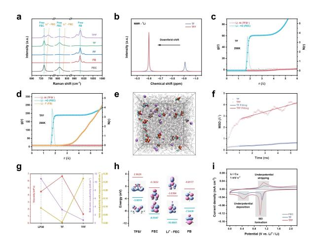
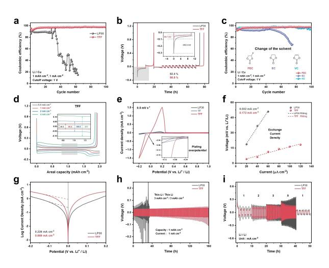
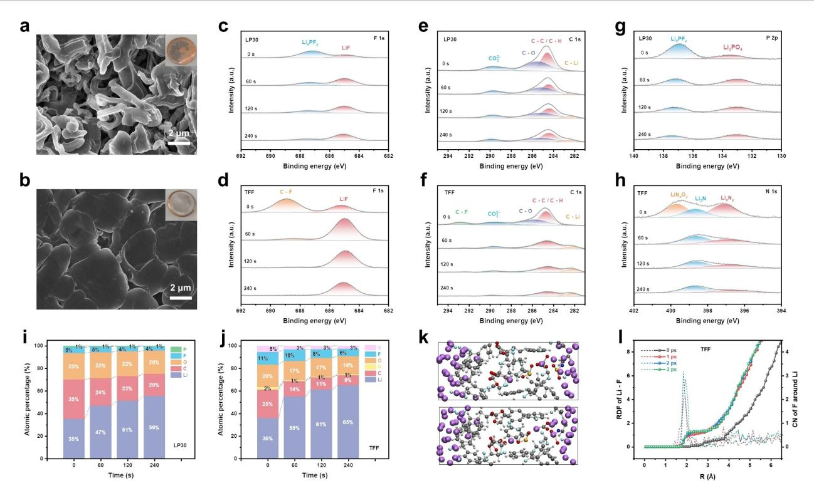
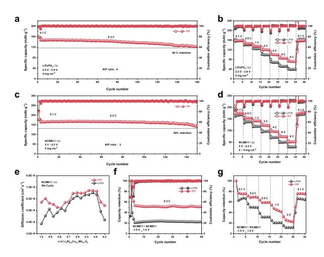
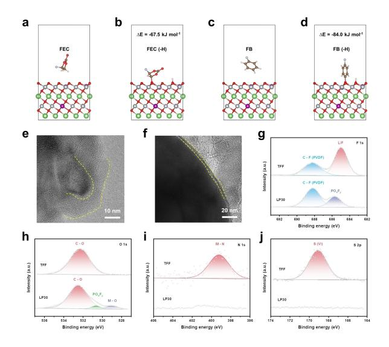
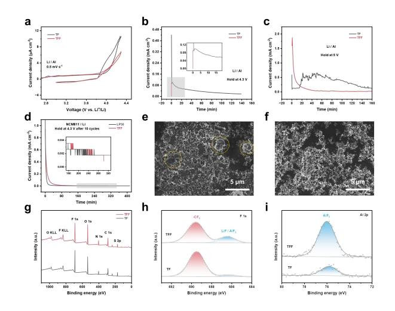

## *Li Metal Batteries*

How to cite: *Angew. Chem. Int. Ed.* **2024**, *63*, e202319090 [doi.org/10.1002/anie.202319090](https://doi.org/10.1002/anie.202319090)

# **Localized Medium Concentration Electrolyte with Fast Kinetics for Lithium Metal Batteries**

*Pengcheng Li, Zhiqing Zhang, Ziwei Zhao, Xuzi Zhang, Hao Zhang,\* and [Ge](http://orcid.org/0000-0002-1978-2976) Li\**

**Abstract:** Localized high-concentration electrolyte is widely acknowledged as a cutting-edge electrolyte for the lithium metal anode. However, the high fluorine content, either from high-concentration salts or from highly fluorinated diluents, results in significantly higher production costs and an increased environmental burden. Here, we have developed a novel electrolyte termed "Localized Medium-Concentration Electrolyte" (LMCE) to effectively address these issues. This LMCE is designed and produced by diluting a medium concentration (0.5 M–1.5 M) electrolyte which is incompatible with lithium metal anode before diluting. It has ultralow concentration (0.1 M) and demonstrates remarkable compatibility with lithium metal anode. Surprisingly, our LMCE, despite having an ultralow concentration (0.1 M), exhibits excellent kinetics in Li/Cu, Li/Li, LiFe-PO4/Li, and NCM811/Li batteries. Additionally, LMCE effectively inhibits the corrosion of the Al current collector caused by LiTFSI salt under high voltage (*>*4 V) conditions. This groundbreaking LMCE design transforms the seemingly "incompatible" into the "compatible", opening up new avenues for exploring various electrolyte formulations, including all liquid electrolytebased batteries.

## *Introduction*

Current lithium-ion batteries, which rely on intercalation chemistry, have nearly attained their theoretical energy density of approximately 250 Whkg 1 . [1] However, the demand for even higher energy density, such as 500 Whkg 1 , remains persistent, particularly for electric vehicles and aircraft.[2] One potential approach to achieve this goal involves replacing graphite with metallic lithium as the anode, which would increase the theoretical capacity from 372 mAhg 1 to an impressive 3860 mAhg 1 . Notably, metallic lithium boasts the lowest operating voltage ( 3.04 V vs. standard hydrogen electrode), thus maximizing the energy density on the anode side.[3] Despite these advantages, the practical application of lithium metal as an anode faces challenges due to safety concerns, such as fires and explosions, as well as poor reversibility.[4]

Electrolyte engineering offers a promising approach to enhance the stability of metallic lithium anodes.[5] Currently, one of the most successful electrolyte systems for lithium metal anodes is localized high-concentration electrolytes (LHCE).[6] The LHCE, derived by diluting high concentration (*>*4 M) electrolyte (HCE) which is compatible with lithium metal anodes, inherits the advantages of HCE while reducing the concentration, cost, and viscosity.[7] However, the drawbacks of high fluorine content in LHCE results in heightened environmental concerns and production costs.[8] Continuing along this line of inquiry, reducing the concentration even further may represent a promising future direction for exploration. Recently, we successfully developed a low-concentration (0.25 M) electrolyte for highvoltage lithium metal batteries by strategically designing the anode-electrolyte interphase and cathode-electrolyte interphase.[9] Nonetheless, we must acknowledge that the rate performance is not entirely satisfactory. Achieving rapid kinetics represents the final piece of the puzzle in advancing the development of low-concentration electrolytes.

LiPF6 currently dominates as the primary salt used in commercial lithium-ion batteries due to its optimal balance of various properties.[10] However, when considering its application in lithium metal anodes, a re-evaluation of the salt selection becomes necessary.[11] LiTFSI, being a salt with nearly the highest solubility, superior thermal stability, and exceptional chemical inertness, presents itself as a compelling alternative.[10] However, a significant drawback of LiTFSI as the salt is its tendency to induce aluminum corrosion under high voltage conditions, and this issue becomes particularly severe when the concentration of LiTFSI is low.[12] Although certain strategies such as increasing the concentration,[13] incorporating co-salts[14] or salt-type additives,[15] and altering solvents[16] have been explored to mitigate the corrosion of the aluminum current collector induced by LiTFSI, successful research outcomes

[\*] P. Li, Z. Zhang, Z. Zhao, X. Zhang, Prof. G. Li Department of Mechanical Engineering, University of Alberta 9211-116 Street NW, Edmonton, Alberta T6G 1H9 (Canada) E-mail: ge.li@ualberta.ca Prof. H. Zhang Department of Chemical and Materials Engineering, University of Alberta 9211-116 Street NW, Edmonton, Alberta T6G 2H5 (Canada) E-mail: hao.zhang@ualberta.ca

© 2024 The Authors. Angewandte Chemie International Edition published by Wiley-VCH GmbH. This is an open access article under the terms of the Creative Commons Attribution Non-Commercial NoDerivs License, which permits use and distribution in any medium, provided the original work is properly cited, the use is noncommercial and no modifications or adaptations are made.

have been limited when dealing with low or ultralow concentrations of LiTFSI.

In this study, we have successfully developed a novel electrolyte termed "Localized Medium Concentration Electrolyte" (LMCE) by diluting a medium concentration (0.5 M–1.5 M) electrolyte, which was initially incompatible with lithium metal. Surprisingly, LMCE was found to be fully compatible with lithium metal. Notably, with an actual overall concentration of 0.1 M, LMCE exhibits exceptional kinetics, outperforming the commercial LP30 (1 M LiPF6 in EC-DMC, 1: 1 by volume) electrolyte in terms of rate performance (low polarization overpotential, high capacity retention under high current) for Li/Cu, Li/Li, LiFePO4/Li, and NCM811/Li batteries. Additionally, in LMCE, the LiTFSI used as the sole salt effectively prevents corrosion of the aluminum current collector under high voltage conditions. This LMCE design thus transforms the seemingly "impossible" into the "possible," paving the way for further exploration of diverse electrolyte formulations, applicable to various liquid electrolyte-based batteries.

#### *Results and Discussion*

Localized high concentration electrolyte (LHCE), developed by PNNL (Pacific Northwest National Laboratory), is widely recognized as one of the cutting-edge electrolytes for the lithium metal anode due to its impressive properties.[6a–e] By diluting the high concentration electrolyte (HCE) with diluents, LHCE not only inherits the advantages of HCE, such as excellent compatibility with the lithium metal anode, but also introduces new properties, including a relatively low concentration, reduced cost, and lower viscosity.[7b] Building upon the inspiration from LHCE, we have introduced a novel concept known as localized medium concentration electrolyte. To create LMCE, we utilize diluents to dilute a medium concentration electrolyte (0.5 M–1.5 M), which was initially incompatible with the lithium metal anode, resulting in an LMCE with an ultralow overall concentration. Remarkably, this LMCE demonstrates remarkable compatibility with the lithium metal anode.

For LHCE, LiFSI emerges as the predominant choice for salt, owing to its notable solubility and harmonious interaction with lithium metal. Conversely, in LMCE, the imperative for the lithium salt to attain exceedingly high concentrations is alleviated. Consequently, a spectrum of alternative salts, including LiTFSI, LiPF6, and LiDFOB, can be judiciously contemplated for implementation. Here we deliberately selected LiTFSI as the salt due to exceptional chemical inertness. As for the solvent, fluoroethylene carbonate (FEC) was chosen as it serves as a proficient cosolvent or additive.[10] Various film-forming molecules can serve as viable solvents, expanding the repertoire beyond the conventional. Among these alternatives are glycol sulfite, 1,3-Propane sultone, and vinyl acetate, among others. This combination yielded the desired electrolyte (0.5 M LiTFSI in FEC), which we abbreviated as "TF electrolyte." Subsequently, for the localized medium concentration electrolyte, we opted for fluorobenzene (FB), a diluent we previously employed in our research. By diluting the TF electrolyte with four times the volume of FB, we created the final formula for LMCE, referred to as "0.1 M LiTFSI in FEC-FB (2 :8, by volume)," and abbreviated as "TFF electrolyte." In our investigations, we employed Raman spectroscopy to analyze the solvation structure between Li+ and other anions and molecules. To facilitate comparisons, we also tested pure FEC and FB solvents, as well as FEC-FB mixed solvents, which we conveniently abbreviated as "FF solvent" (FEC-FB, 2:8, by volume).

In Figure 1a and Figure S1, Supporting Information, the peaks observed at approximately 729 cm 1 and 906 cm 1 correspond to the ring breathing mode (*oO C O*) and ring skeletal deformation mode (b*C C*) of FEC, respectively. Notably, in TF and TFF electrolytes, the peak for the ring breathing mode shifts to 740 cm 1 and 744 cm 1 , respectively. These upshifted peaks strongly suggest a robust interaction between Li+ and FEC in both electrolytes. Coordinated FEC exhibits a higher percentage in TFF electrolyte compared to TF electrolyte. This disparity can be attributed to the repulsion caused by the substantial polarity difference between FEC and FB. A similar trend is observed for the ring skeletal deformation mode. The peak at approximately 1009 cm 1 represents the benzene ring breathing mode of FB. However, in TF and TFF electrolytes, the peak for FB's benzene ring breathing mode remains unchanged, indicating that FB does not integrate into the solvation sheath of Li+. The results obtained from FTIR analysis yield similar

*Figure 1.* Physical characterization, theoretical calculation, and simulation of electrolytes. a) Raman spectra of FEC solvent, FB solvent, FF mixed solvents (FEC and FB, 2:8 by volume), TF electrolyte (0.5 M LiTFSI in FEC), and TFF electrolyte (0.1 M LiTFSI in FEC and FB, 2 :8 by volume). b) 7 Li NMR comparison results of TF and TFF electrolytes. c,d) Radial distribution functions (g(r), dashed line) and cumulative numbers N(r), line+symbol) for Li+ in TF (c) and TFF (d) electrolytes. e) Molecular dynamics simulation snapshot for TFF electrolyte. f) Mean squared displacement (MSD) of Li+ in TF and TFF electrolytes. g) Viscosity, bulk ionic conductivity and ionic conductivity with separators for different electrolytes. h) HOMO, LUMO energy and corresponding molecular orbits for different species. i)Cyclic voltammetry (CV) curves of Li/Cu cells scanned between 0–3 V in different electrolytes at the scan rate of 1 mVs 1 .

*Angew. Chem. Int. Ed.* **2024**, *63*, e202319090 (2 of 8) © 2024 The Authors. Angewandte Chemie International Edition published by Wiley-VCH GmbH

information (Figure S2 and S3, Supporting Information). Next, nuclear magnetic resonance (NMR) is employed to analyze the solvation structure of Li+. In the 7 Li NMR spectra (Figure 1b), the chemical shift of TFF electrolyte exhibits a downfield shift compared to TF electrolyte, aligning with the observations made in other diluent-based electrolytes. The conclusions drawn from 13C NMR (Figure S4, S5, Supporting Information), 1 H NMR (Figure S6, Supporting Information) and 17F NMR (Figure S7, Supporting Information) results align with the findings mentioned above.

Molecular dynamics (MD) simulation serves as a powerful tool to investigate the solvation structure and various physical properties of liquid electrolytes.[17] As evident from Figure 1c and 1d, both electrolytes exhibit no TFSI anions entering the solvation sheath. Furthermore, FB is not present in the first solvation sheath of Li+ in TFF electrolyte, aligning well with the unchanged Raman shift for FB. The coordination number for FEC experiences a slight decrease from 3.7 in TF electrolyte to 3.2 in TFF electrolyte, consistent with the findings from Raman spectra and NMR. In Figure 1e, the snapshot of TFF electrolyte post-simulation reveals well-dissociated Li+ and TFSI- , with the salt concentration much lower than that of TF electrolyte (Figure S8, Supporting Information). The Mean Square Displacement (MSD) of Li+ is calculated for both electrolytes, as shown in Figure 1f. The steeper slope of the MSD plot for TFF electrolyte indicates faster ion transport of Li+ compared to TF electrolyte.[18] Based on the MSD results, we anticipate that an electrolyte with such a low concentration (0.1 M) can display superior kinetics compared to the medium concentration (0.5 M–1.5 M) electrolyte. Moving on, viscosity and ionic conductivity stand as vital parameters for liquid electrolytes. The viscosity of TFF electrolyte is 1.28 mPa s, which is much lower than that for LP30 (4.48 mPa s) and TF (6.68 mPas) electrolyte. And the bulk ionic conductivity for LP30, TF and TFF electrolytes are 10.83, 3.274 and 0.7236 mScm 1 , respectively (Figure 1g). Then, we employ electrochemical impedance spectroscopy (EIS) to evaluate the ionic conductivity of wet separators using different electrolytes (Figure S9). Figure 1g demonstrates that TFF electrolyte exhibits the highest ionic conductivity (0.273 mScm 1 ), significantly surpassing that of LP30 electrolyte (0.092 mScm 1 ) and TF electrolyte (0.005 mScm 1 ). Despite the concentration of TFF electrolyte being only 0.1 M, its impressive ionic conductivity can be attributed to its low viscosity and excellent separator wettability (Movie S1, S2). Lastly, quantum chemistry is utilized to calculate the Highest Occupied Molecular Orbital (HOMO) and Lowest Unoccupied Molecular Orbital (LUMO) energy of different species (Figure 1h and Figure S10, S11, Supporting Information). A lower LUMO energy indicates higher reactivity towards lithium metal.[19] Among the various species studied, the Li+-FEC complex displays the lowest LUMO energy ( 3.0364 eV), suggesting that it will be preferentially reduced in TFF electrolyte. Then, cyclic voltammetry (CV) was employed to investigate the reduction reaction of electrolyte species when in contact with lithium metal within Li/Cu cells. As illustrated in Figure 1i and Figure S12, Supporting Information, a distinct and prominent peak emerges in the range of 1.0 V to 1.1 V for both TF and TFF electrolytes. This peak is ascribed to the reduction of Li+-FEC complexes. Additionally, an observable peak centered around 0.5 V corresponds to the reduction of the solvent components. Notably, the reduction potential values deduced from the CV analysis align closely with those derived from quantum chemistry calculations, thereby establishing a congruence between experimental and theoretical findings.This peak is ascribed to the solid electrolyte interphase (SEI) formation. And the reduction peak at around 0.4 V corresponds to the Li underpotential deposition, and the oxidation peak at around 1.1 V corresponds to the Li underpotential stripping. Furthermore, TFF electrolyte exhibits the highest Li+ transference number (0.64), surpassing both LP30 electrolyte (0.46) and TF electrolyte (0.43) (Figure S13, Supporting Information). And both TFF and TF electrolytes demonstrate wide electrochemical window (Figure S14, Supporting Information).

For a novel electrolyte intended for use in lithium metal batteries, one of the primary requirements is compatibility with the lithium metal anode. The reversibility of the electrolyte is assessed using a Li/Cu half-cell. Figure 2a and Figure S15, S16, Supporting Information demonstrate that under conditions of 1 mAhcm 2 and 1 mAcm 2 , the coulombic efficiency for the commercial LP30 electrolyte is approximately 90%, and the cell can only sustain 20–30

*Figure 2.* Electrochemical performance of Li/Cu and Li/Li cells. a) Coulombic efficiency of Li/Cu cells for LP30 and TFF electrolytes. b) Aurbach coulombic efficiency of Li/Cu cells for LP30 and TFF electrolytes. The inset is the magnified view of the nucleation overpotential. c) Coulombic efficiency of Li/Cu cells for electrolytes with different solvents. d) Charge/discharge profiles at 0.5, 1.0, 2.0 and 4.0 mAcm 2 for TFF electrolyte. The inset is the magnified view of the deposition overpotential at different current densities. e) Cyclic voltammetry of Li/Cu cells for different electrolytes at the scan rate of 0.5 mVs 1 . f) Exchange current density of Li/Li cells for different electrolytes under low current densities. g) Tafel plot and exchange current density of Li/Li cells for different electrolytes under high overpotential. h) Cycling performance of thin Li/thin Li symmetric cells for LP30 and TFF electrolytes. i) Rate performance of Li/Li symmetric cells for LP30 and TFF electrolytes.

*Angew. Chem. Int. Ed.* **2024**, *63*, e202319090 (3 of 8) © 2024 The Authors. Angewandte Chemie International Edition published by Wiley-VCH GmbH

cycles. Conversely, the medium concentration electrolyte (TF electrolyte) renders the Li/Cu cell unable to complete even a single cycle (Figure S17). In contrast, the LMCE electrolyte (TFF electrolyte) exhibits high average coulombic efficiency (*>*98%) after the stabilization cycles. In terms of Aurbach CE, the TFF electrolyte achieves 98.8% efficiency, significantly higher than the LP30 electrolyte (82.4%) (Figure 2b and Table S1, Supporting Information). Moreover, the TFF electrolyte displays a lower nucleation overpotential (59.7 mV) than the LP30 electrolyte (255.6 mV). To delve into the underlying mechanism, we replaced the FEC solvent with EC and VC solvents. Figure 2c shows that VC serves a similar function to FEC, while EC does not produce the desired effect. When used in liquid electrolytes, FEC and VC both can be reduced to form a polymer called poly (VC). EC can only form lowchain lithium ethylene monocarbonate (LEMC), which cannot accommodate the infinite volume change of lithium metal. This result demonstrates that the polymer is an important component in SEI for lithium metal. From Figure S18, Supporting Information, we can see that SEI formed in VC-based electrolyte induces high and gradually increased deposition overpotential. The lower deposition overpotential for FEC-based electrolyte demonstrates that LiF is another vital component for lithium metal SEI. We posit that the hybrid solid-electrolyte interphase (SEI) formed through the integration of inorganic and polymer components holds greater advantages in facilitating the rapid kinetics of the lithium metal anode.

Having observed that the TFF electrolyte displays the highest ionic conductivity, we proceed to examine the rate performance of Li/Cu cells at various current densities. Figure 1d illustrates that the TFF electrolyte can withstand a current density of 4 mAcm 2 , with a voltage gap of 211 mV. In contrast, Li/Cu cells employing LP30 electrolyte fail to operate at 4 mAcm 2 (Figure S19, Supporting Information). Additionally, the deposition overpotential for TFF electrolyte consistently remains smaller than that for LP30 electrolyte at equivalent current densities. Further, we conduct cyclic voltammetry (CV) tests on Li/Cu cells within the potential range of 0.2 V to 1 V for the different electrolytes (Figure 2e). Notably, among all three electrolytes, the plating overpotential for TFF electrolyte exhibits the lowest values. At a potential of 0.2 V vs. Li+/Li, the cells utilizing TFF electrolyte demonstrate significantly higher current density than those using LP30 and TF electrolytes.

The exchange current density (ECD) is a critical parameter to evaluate the kinetics of an electrochemical reaction.[20] Initially, we estimate the ECD for the lithium deposition reaction at low current densities using the linear approximation form of the Butler–Volmer equation. As seen in Figure 2g and Figure S20, Supporting Information, the ECD for TFF electrolyte (0.172 mAcm 2 ) significantly exceeds that of LP30 electrolyte (0.032 mAcm 2 ). Subsequently, we employ the Tafel equation to estimate the ECD at high current densities (Figure 2g). Here, the ECD for LP30 electrolyte and TFF electrolyte amounts to 0.226 mAcm 2 and 0.869 mAcm 2 , respectively. The comprehensive electrochemical characterization of kinetics consistently demonstrates that TFF electrolyte outperforms LP30 and TF electrolytes in terms of kinetics. Finally, thin Li (3 mAhcm 2 ) symmetric cells are utilized to evaluate the electrolyte's compatibility with lithium metal. As shown in Figure 2h, cells employing commercial LP30 electrolyte can only sustain operation for less than 40 hours. In contrast, the TFF electrolyte exhibits a significantly longer cycle life, lasting for up to 160 hours. The rate performance of Li/Li cells is in good agreement with the above kinetics characterization (Figure 2i). The observed gradual decrease in deposition overpotential can be attributed to the ongoing process of SEI formation, characterized by a cyclic pattern of breakage and repair. This phenomenon underscores that the SEI developed under high current densities, such as 5 mAcm 2 , exhibits low impedance in the context of TFF electrolyte.

Scanning Electron Microscope (SEM) observations were employed to investigate the deposition behavior of lithium metal. As depicted in Figure 3a and 3b, in stark contrast to the dendrites formed in LP30 electrolyte, the deposition of lithium in TFF electrolyte appears larger, denser, and smoother. Subsequently, In-depth X-ray Photoelectron Spectroscopy (XPS) was utilized to analyze the compositions and distributions of the solid electrolyte interphase (SEI). F 1s spectra (Figure 3c and 3d) revealed that, with an increase in etching depth, LiF becomes the predominant component in both electrolytes. Notably, the intensity of LiF in the SEI for TFF electrolyte is stronger than that in LP30 electrolyte. As inorganic LiF is considered a critical component in SEI for the lithium metal anode, this observation holds significant importance. Likewise, a larger amount of inert inorganic Li2O is detected in the inner SEI formed in TFF electrolyte (Figure S21, Supporting Information).

Further analysis of C 1s spectra (Figure 3e and 3f) reveals a substantial reduction in organic carbon components (C O, C C, C H) within the SEI of TFF electrolyte. Moreover, the overall carbon intensity of SEI in TFF electrolyte is significantly lower compared to that in LP30 electrolyte. This indicates that the SEI formed in TFF electrolyte is dominated by inorganic components, which is considered more beneficial for the lithium metal anode.[21] Additionally, high ionic conductivity Li3PO4, [22] Li3N[23], and sulfur-containing species[24] were detected in LP30 electrolyte and TFF electrolyte (Figure 3g and 3h, Figure S22, Supporting Information). For the S 2p spectrum of SEI formed in TFF electrolyte, from the surface to the bottom, the intensity of Li2S and Li2S2 becomes much stronger and Li2S occupies an increasingly higher proportion. The gradient structure of Li2S and Li2S2 is more favorable for the transport of lithium ions through SEI. These compounds facilitate the transport of Li+ through the SEI. The Raman spectra exhibit similar results (Figure S23 and S24, Supporting Information). The change in atomic ratio (Figure 3i and 3j) indicates that after etching for 240 seconds, TFF electrolyte has a higher percentage of Li (65%) than LP30 electrolyte (56%). This suggests that the SEI formed in TFF electrolyte is thinner. The percentage of C in the SEI is significantly lower in TFF electrolyte compared to LP30 electrolyte, further confirming the dominance of inorganic

*Figure 3.* Characterization and computational simulation results of the anode-electrolyte interface. a,b) SEM of Li metal deposition morphologies (0.5 mAcm 2 , 3 mAhcm 2 ) in LP30 electrolyte (a) and TFF electrolyte (b). c,d) F 1s XPS depth profiles of the Li metal surface in LP30 electrolyte (c) and TFF electrolyte (d). e,f) C 1s XPS depth profiles of the Li metal surface in LP30 electrolyte (e) and TFF electrolyte (f). g) P 2p XPS depth profiles of the Li metal surface in LP30 electrolyte. h) N 1s XPS depth profiles of the Li metal surface in TFF electrolyte. i,j) The atomic ratio of detected elements on the surface of Li metal cycled in LP30 electrolyte (i) and TFF electrolyte (j). k) Snapshots of the AIMD simulation at the lithium-LP30 electrolyte interface after 1 ps (above) and 2 ps (below). l) Li-F Radial distribution functions (RDF) and coordination number (CN) evolution during the simulation process in TFF electrolyte.

components in the SEI formed in TFF electrolyte. Conversely, F displays an opposite trend. S and N in SEI enable high ionic conductivity. These results collectively demonstrate that inorganic LiF-dominated SEI is formed in TFF electrolyte, which proves beneficial for the lithium metal anode.

Subsequently, density functional theory (DFT) is employed to compute the adsorption energy between the solvent and the lithium metal surface (Figure S25 and S26, Supporting Information). The results reveal that the adsorption energy for FEC (0.640 eV) is significantly higher than for FB (0.235 eV), indicating a preference for FEC to be reduced by lithium metal. Finally, Ab Initio Molecular Dynamics (AIMD) simulations were performed to simulate the evolution of the anode-electrolyte interphase. The snapshot during the simulation for TFF electrolyte (Figure 3k) reveals that C F bonds are easily broken, leading to the formation of LiF, while no obvious C Li bonds are formed. This observation is consistent with the in-depth XPS results (Figure S27 and S29, Supporting Information, Movie S3 and S4). The Radical Distribution Function (RDF) between Li and F in TFF electrolyte (Figure 3l) indicates a strong trend of forming LiF, further corroborating the results obtained from XPS analysis (Figure S28 and S30, Supporting Information).

LiFePO4/Li (Figure S31, Supporting Information) and NCM811/Li cells were assembled to assess the compatibility of our electrolyte with the cathode. Notably, the LiFePO4/Li cell using LP30 electrolyte under a low N/P ratio failed to function. Conversely, as shown in Figure 4a, at an N/P ratio of 4, the LiFePO4/Li cell using TFF electrolyte exhibited an impressive 83.3% capacity retention after 160 cycles at 0.3 C (1 C=170 mAg 1 ) (Figure S32 and S33, Supporting Information). Surprisingly, LiFePO4/Li cells using TFF electrolyte with an overall concentration of 0.1 M demonstrated superior rate performance compared to those using the commercial 1 M LP30 electrolyte (Figure 4b and Figure S34, Supporting Information). Specifically, the discharge capacity for LiFePO4/Li cells using TFF electrolyte at different rates were 159.0, 145.9, 134.9, 120.3, 99.7, 85.3, and 71.8 mAhg 1 at 0.1, 0.5, 1, 2, 4, 6, and 8 C, respectively. In contrast, for the same cells using LP30 electrolyte, the corresponding discharge capacity at different rates were 156.7, 140.1, 123.9, 98.9, 68.0, 51.5, and 39.0 mAhg 1 , respectively (Table S3, Supporting Information).

Likewise, for full cells using NCM811 as the cathode (Figure S35, Supporting Information), NCM811/Li cells using LP30 electrolyte under a low N/P ratio faced operational challenges. However, Figure 4c illustrates that the capacity retention for NCM811/Li cells using TFF electrolyte under an N/P ratio of 3 was 85.9% after 150 cycles at *Research Articles*

*Figure 4.* Electrochemical performance of Li metal full cells. a) Cycling performance of LiFePO4/Li cells (N/P ratio: 4) in TFF electrolyte at 0.3 C (two precycles at 0.1 C). b) Rate performance of LiFePO4/Li cells in LP30 and TFF electrolytes. c) Cycling performance of NCM811/Li cells (N/P ratio: 3) in TFF electrolyte at 0.3 C (two precycles at 0.1 C). d) Rate performance of NCM811/Li cells in LP30 and TFF electrolytes. e) The diffusion coefficient of Li+ in NCM811/Li cells at the 5th cycle for LP30 and TFF electrolytes. f) Cycling performance of NCM811/ NCM811 cells in different electrolytes at 0.3 C (two precycles at 0.1 C). g) Rate performance of NCM811/NCM811 cells in different electrolytes.

0.3 C (1 C=200 mAg 1 ) (Figure S36, Supporting Information, Table S2, Supporting Information). Furthermore, the coulombic efficiency was nearly 100%, indicating excellent compatibility between TFF electrolyte and NCM811 cathode under 4.3 V. NCM811/Cu anode-free batteries also demonstrate a similar trend (Figure S39, Supporting Information). Similarly, TFF electrolyte demonstrated superior rate performance in NCM811/Li cells (Figure 4d and Figure S37, Supporting Information). The discharge capacity for NCM811/Li cells using TFF electrolyte at rates of 0.1, 0.5, 1, 2, 4, 6, and 8 C were 176.0, 153.4, 141.4, 122.4, 95.9, 73.6, and 51.3 mAhg 1 , respectively. In comparison, for LP30 electrolyte, the corresponding discharge capacity at different rates were 166.4, 137.7, 117.6, 96.5, 70.4, 49.9, and 29.5 mAhg 1 , respectively.

To gain insight into the better kinetics, the Galvanostatic Intermittent Titration Technique (GITT) was employed to determine the diffusion coefficient of Li+ through the Cathode-Electrolyte Interphase (CEI) for the NCM811 cathode (Figure 4e and Figure S38, Supporting Information). It was evident that Li+ diffuses much faster through the CEI formed in TFF electrolyte, especially at very low or very high states of charge.

Moreover, to further investigate the electrolyte's compatibility with the NCM811 cathode, NCM811/NCM811 symmetric cells were assembled and tested. As observed in Figure 4f, the initial coulombic efficiency for the cells using TFF electrolyte (68.8%) was significantly higher than that using LP30 electrolyte (33.0%), indicating substantially less irreversible capacity loss for forming CEI in TFF electrolyte. Furthermore, the high coulombic efficiency (�100%) demonstrated good compatibility with the NCM811 cathode. Consistently, the rate performance of NCM811/NCM811 symmetric cells showed higher capacity retention for TFF electrolyte compared to LP30 electrolyte at different rates, as expected.

The hydrogen transfer energy barrier from the solvent to the cathode at the fully charged state plays a crucial role in determining the anti-oxidation ability of an electrolyte.[25] As depicted in Figure 5a and 5b, the hydrogen transfer energy barrier for FEC is 67.5 kJmol 1 , while that for FB is slightly lower at 84.0 kJmol 1 (Figure 5c and 5d). However, both values are considerably higher than the hydrogen transfer energy barrier for EC ( 225 kJmol 1 ) and DME ( 269 kJmol 1 ).[8a] A higher hydrogen transfer energy barrier indicates superior anti-oxidation ability.

Subsequently, High-Resolution Transmission Electron Microscope (HRTEM) observations were employed to investigate the thickness of the Cathode-Electrolyte Interphase (CEI). From Figure 5e, it is evident that the CEI formed in LP30 electrolyte is not homogeneous, with an average thickness exceeding 10 nm. Conversely, for TFF electrolyte, the CEI appears highly uniform, with a thickness of 4 nm (Figure 5f). The XPS F 1s spectra confirmed that the CEI formed in TFF electrolyte primarily consists of inorganic LiF. Considering the ultralow concentration (0.1 M) of TFF electrolyte, LiF mainly comes from fluorinecontaining solvents (FEC and FB). In contrast, for LP30 electrolyte, POxFy, resulting from the reaction of PF6 and the NCM811 surface, dominates the CEI composition. LiF, known for its excellent inertness, effectively limits the continuous thickening of the CEI. We contend that an inorganic ceramic-electrolyte interface (CEI) primarily do-

*Figure 5.* Characterization and computational simulation results of the cathode-electrolyte interface. a,b) H-transfer calculation snapshot of FEC before H-transfer (a) and after H-transfer (b). c,d) H-transfer calculation snapshot of FB before H-transfer (c) and after H-transfer (d). e,f) HRTEM images of NCM811 cathodes collected after 100 cycles by disassembling the full-cells using LP30 (e) and TFF (f) electrolytes. g–j) F 1s (h), O 1s (h), N 1s (i) and S 2p (j) spectra of cycled NCM811 cathodes using different electrolytes.

*Angew. Chem. Int. Ed.* **2024**, *63*, e202319090 (6 of 8) © 2024 The Authors. Angewandte Chemie International Edition published by Wiley-VCH GmbH

minated by LiF is advantageous in achieving low resistance and promoting fast kinetics.

Moreover, from the O 1s spectra (Figure 5h), the peak corresponding to M (metal)-O bonds can still be detected in the CEI formed in LP30 electrolyte even after 100 cycles, indicating the continuous formation of a new fresh cathode interface. From the N 1s (Figure 5i) and S 2p (Figure 5j) spectra, M N bonds and S (VI) compounds are detected, revealing that TFSI-anions are also oxidized to form inorganic components within the CEI in TFF electrolyte. These results collectively demonstrate that TFF electrolyte exhibits superior anti-oxidation ability and facilitates the formation of a uniform and thin CEI mainly composed of inorganic LiF, which contributes to enhanced stability and performance in lithium metal batteries.

The application of LiTFSI as the lithium salt is hindered by the corrosion of the aluminum current collector under high voltage conditions. Several strategies have been reported to mitigate this issue, such as increasing the concentration, adding co-salts, and rationally designing solvents. However, the aluminum corrosion becomes more severe when the concentration of LiTFSI is ultralow, leading to rapid cell failure due to salt consumption. Nevertheless, after observing the exceptional cycling stability of NCM811/ Li full cells, we believe that the localized medium concentration electrolyte (LMCE) significantly inhibits aluminum corrosion. Initially, we utilized cyclic voltammetry (CV) to investigate the chemical reactions between LiTFSI salt and the aluminum current collector under higher voltage (Figure 6a). The corrosion current density at 4.3 V for TFF electrolyte (6.84 μAcm 2 ) was found to be smaller than that for TF electrolyte (10.63 μAcm 2 ). Next, we directly held Li/

*Figure 6.* Characterization of the inhibition of Al current collector corrosion by LiTFSI salt. a) 1st cycle CV of Li/Al cells in different electrolytes. b, c) Leakage current density of Li/Al cells using TF and TFF electrolytes at a constant applied voltage of 4.3 V (b) and 5 V (c). d) Leakage current density of NCM811/Li cells using LP30 and TFF electrolytes after 10 cycles at a constant applied voltage of 4.3 V. e,f) SEM images of Al foil collected from Li/Al cells after holding at 5 V using TF (e) and TFF (f) electrolytes. g–i) XPS full spectra, F 1s (h) and Al 2p (i) spectra of Al foil collected from Li/Al cells after holding at 5 V using different electrolytes.

Al cells at 4.3 V (Figure 6b) and 5 V (Figure 6c) to test the leakage current density. For cells using TFF electrolyte and subjected to the normal upper cutoff voltage (4.3 V) for NCM811 cathode, the current density dropped immediately to zero. In contrast, cells using TF electrolyte exhibited a slow decrease in current density, indicating continuous reaction between LiTFSI and aluminum. For Li/Al cells directly held at 5 V, the leakage current density using TFF electrolyte gradually decreased to nearly zero, despite the relatively high initial current density. However, for TF electrolyte, the leakage current density remained unstable and did not stabilize during the holding period.

*Angewandte*

*Chemie*

These results strongly suggest that LMCE, represented by TFF electrolyte, exhibits a higher resistance to aluminum corrosion and demonstrates excellent stability under higher voltage conditions, making it a promising electrolyte option for lithium metal batteries. In NCM811/Li cells, we further investigated the leakage current density using different electrolytes. Remarkably, the leakage current density dropped rapidly to zero for TFF electrolyte, similar to the cells using the commercial LP30 electrolyte.

To gain insights into the anti-corrosion behavior of TFF electrolyte, we conducted SEM observations of the aluminum foil after holding it at 5 V for both TF and TFF electrolytes. As depicted in Figure 5e, severe corrosion of the aluminum is evident in TF electrolyte, as indicated by the yellow circle. However, in TFF electrolyte, no significant corrosion was observed (Figure 5f). Moreover, XPS analysis was employed to examine the components of the aluminum foil surface (Figure 5g). The F 1s (Figure 5h) and Al 2p (Figure 5i) spectra revealed the presence of more LiF and AlF3 on the aluminum foil corroded in TFF electrolyte compared to TF electrolyte. These fluorides act as effective passivation films, effectively preventing continuous corrosion of the aluminum foil.

#### *Conclusion*

In this study, we developed a novel electrolyte, termed localized medium concentration electrolyte (LMCE), by diluting medium concentration (0.5 M–1.5 M) electrolyte, which is initially incompatible with lithium metal. Surprisingly, LMCE with an actual overall concentration of 0.1 M demonstrates excellent kinetics and is highly compatible with lithium metal. In fact, LMCE outperforms commercial LP30 electrolyte (1 M LiPF6 in EC-DMC, 1 :1 by volume) in terms of rate performance in Li/Cu, Li/Li, LiFePO4/Li, and NCM811/Li batteries. Furthermore, LMCE, with LiTFSI as the sole salt, exhibits no corrosion of the aluminum current collector under high voltage conditions. This innovative LMCE design defies conventional wisdom, transforming what was once deemed "impossible" into a "possible" reality. As a result, it opens up new avenues for exploring diverse electrolyte recipes, particularly in various types of batteries utilizing liquid electrolytes.

#### *Acknowledgements*

This work was financially supported by the Natural Sciences and Engineering Research Council of Canada (NSERC) through the Discovery Grant Program (RGPIN-2020-05184) and the Alliance-Alberta Innovates Program (ALLRP-561137-20). This research was also supported by funding from the Canada First Research Excellence Fund as part of the University of Alberta's Future Energy Systems research initiative.

### *Conflict of Interest*

The authors declare no conflict of interest.

#### *Data Availability Statement*

The data that support the findings of this study are available in the supplementary material of this article.

**Keywords:** Al Corrosion **·** Lithium Metal Anodes **·** Localized Medium Concentration Electrolyte **·** Ultralow Concentration

- [1] a) J.-M. Tarascon, M. Armand, *Nature* **2001**, *414*, [359–367;](https://doi.org/10.1038/35104644) b) M. Armand, J.-M. Tarascon, *Nature* **2008**, *451*, [652–657.](https://doi.org/10.1038/451652a)
- [2] a) V. Viswanathan, A. H. Epstein, Y.-M. Chiang, E. Takeuchi, M. Bradley, J. Langford, M. Winter, *Nature* **2022**, *601*, [519–525;](https://doi.org/10.1038/s41586-021-04139-1) b) Z. P. Cano, D. Banham, S. Ye, A. Hintennach, J. Lu, M. Fowler, Z. Chen, *Nat. Energy* **2018**, *3*, [279–289](https://doi.org/10.1038/s41560-018-0108-1).
- [3] a) X. B. Cheng, R. Zhang, C. Z. Zhao, Q. Zhang, *[Chem.](https://doi.org/10.1021/acs.chemrev.7b00115) Rev.* **2017**, *117*, [10403–10473](https://doi.org/10.1021/acs.chemrev.7b00115); b) D. Lin, Y. Liu, Y. Cui, *[Nat.](https://doi.org/10.1038/nnano.2017.16) [Nanotechnol.](https://doi.org/10.1038/nnano.2017.16)* **2017**, *12*, 194–206.
- [4] a) P. Albertus, S. Babinec, S. Litzelman, A. Newman, *[Nat.](https://doi.org/10.1038/s41560-017-0047-2) [Energy](https://doi.org/10.1038/s41560-017-0047-2)* **2017**, *3*, 16–21; b) J. Liu, Z. Bao, Y. Cui, E. J. Dufek, J. B. Goodenough, P. Khalifah, Q. Li, B. Y. Liaw, P. Liu, A. Manthiram, Y. S. Meng, V. R. Subramanian, M. F. Toney, V. V. Viswanathan, M. S. Whittingham, J. Xiao, W. Xu, J. Yang, X.-Q. Yang, J.-G. Zhang, *Nat. Energy* **2019**, *4*, [180–186;](https://doi.org/10.1038/s41560-019-0338-x) c) Q. Liu, Q. Chen, Y. Tang, H.-M. Cheng, *Electrochem. Energy Rev.* **2023**, *6*, 15.
- [5] a) K. Xu, *Chem. Rev.* **2004**, *104*, [4303–4417;](https://doi.org/10.1021/cr030203g) b) K. Xu, *[Chem.](https://doi.org/10.1021/cr500003w) Rev.* **2014**, *114*, [11503–11618;](https://doi.org/10.1021/cr500003w) c) Y. S. Meng, V. Srinivasan, K. Xu, *Science* **2022**, *378*, eabq3750; d) C.-B. Jin, N. Yao, Y. Xiao, J. Xie, Z. Li, X. Chen, B.-Q. Li, X.-Q. Zhang, J.-Q. Huang, Q. Zhang, *Adv. Mater.* **2023**, *35*, 2208340; e) H. Liang, L. Wang, L. Sheng, H. Xu, Y. Song, X. He, *Electrochem. Energy Rev.* **2022**, *5*, 23; f) H. Dai, X. Gu, J. Dong, C. Wang, C. Lai, S. Sun, *Nat. Commun.* **2020**, *11*, 643.
- [6] a) S. Chen, J. Zheng, D. Mei, K. S. Han, M. H. Engelhard, W. Zhao, W. Xu, J. Liu, J. G. Zhang, *Adv. Mater.* **2018**, *30*, 1706102; b) S. Chen, J. Zheng, L. Yu, X. Ren, M. H. Engelhard, C. Niu, H. Lee, W. Xu, J. Xiao, J. Liu, J.-G. Zhang, *Joule* **2018**, *2*, [1548–1558;](https://doi.org/10.1016/j.joule.2018.05.002) c) X. Ren, S. Chen, H. Lee, D. Mei, M. H. Engelhard, S. D. Burton, W. Zhao, J. Zheng, Q. Li, M. S. Ding, M. Schroeder, J. Alvarado, K. Xu, Y. S. Meng, J. Liu, J.-G. Zhang, W. Xu, *Chem* **2018**, *4*, [1877–1892](https://doi.org/10.1016/j.chempr.2018.05.002); d) X. Cao, X. Ren, L. Zou, M. H. Engelhard, W. Huang, H. Wang, B. E. Matthews, H. Lee, C. Niu, B. W. Arey, Y. Cui, C. Wang, J.

Xiao, J. Liu, W. Xu, J.-G. Zhang, *Nat. Energy* **2019**, *4*, [796–805;](https://doi.org/10.1038/s41560-019-0464-5) e) X. Ren, L. Zou, X. Cao, M. H. Engelhard, W. Liu, S. D. Burton, H. Lee, C. Niu, B. E. Matthews, Z. Zhu, C. Wang, B. W. Arey, J. Xiao, J. Liu, J.-G. Zhang, W. Xu, *[Joule](https://doi.org/10.1016/j.joule.2019.05.006)* **2019**, *3*, [1662–1676](https://doi.org/10.1016/j.joule.2019.05.006); f) Q.-K. Zhang, X.-Q. Zhang, J. Wan, N. Yao, T.-L. Song, J. Xie, L.-P. Hou, M.-Y. Zhou, X. Chen, B.-Q. Li, R. Wen, H.-J. Peng, Q. Zhang, J.-Q. Huang, *Nat. [Energy](https://doi.org/10.1038/s41560-023-01275-y)* **2023**, *8*, [725–735](https://doi.org/10.1038/s41560-023-01275-y).

- [7] a) X. Cao, P. Gao, X. Ren, L. Zou, H. Engelhard Mark, E. Matthews Bethany, J. Hu, C. Niu, D. Liu, W. Arey Bruce, C. Wang, J. Xiao, J. Liu, W. Xu, J.-G. Zhang, *Proc. Natl. Acad. Sci. USA* **2021**, *118*, e2020357118; b) X. Cao, H. Jia, W. Xu, J.- G. Zhang, *J. [Electrochem.](https://doi.org/10.1149/1945-7111/abd60e) Soc.* **2021**, *168*, 010522.
- [8] a) Y. Huang, R. Li, S. Weng, H. Zhang, C. Zhu, D. Lu, C. Sun, X. Huang, T. Deng, L. Fan, L. Chen, X. Wang, X. Fan, *[Energy](https://doi.org/10.1039/D2EE01756C) Environ. Sci.* **2022**, *15*, [4349–4361](https://doi.org/10.1039/D2EE01756C); b) G. Hernández, R. Mogensen, R. Younesi, J. Mindemark, *Batteries & Supercaps* **2022**, *5*, e202100373.
- [9] P. Li, H. Zhang, J. Lu, G. Li, *Angew. Chem. Int. Ed.* **2023**, *62*, e202216312.
- [10] N. von Aspern, G. V. Roschenthaler, M. Winter, I. Cekic-Laskovic, *[Angew.](https://doi.org/10.1002/anie.201901381) Chem. Int. Ed.* **2019**, *58*, 15978.
- [11] R. Younesi, G. M. Veith, P. Johansson, K. Edström, T. Vegge, *Energy Environ. Sci.* **2015**, *8*, [1905–1922](https://doi.org/10.1039/C5EE01215E).
- [12] M. Morita, T. Shibata, N. Yoshimoto, M. Ishikawa, *J. [Power](https://doi.org/10.1016/S0378-7753(03)00253-2) Sources* **2003**, *[119–121](https://doi.org/10.1016/S0378-7753(03)00253-2)*, 784–788.
- [13] K. Matsumoto, K. Inoue, K. Nakahara, R. Yuge, T. Noguchi, K. Utsugi, *J. Power Sources* **2013**, *231*, [234–238.](https://doi.org/10.1016/j.jpowsour.2012.12.028)
- [14] F. Li, Y. Gong, G. Jia, Q. Wang, Z. Peng, W. Fan, B. Bai, *[J.](https://doi.org/10.1016/j.jpowsour.2015.06.117) Power [Sources](https://doi.org/10.1016/j.jpowsour.2015.06.117)* **2015**, *295*, 47–54.
- [15] R.-S. Kühnel, M. Lübke, M. Winter, S. Passerini, A. Balducci, *J. Power Sources* **2012**, *214*, [178–184](https://doi.org/10.1016/j.jpowsour.2012.04.054).
- [16] S. Brox, S. Röser, B. Streipert, S. Hildebrand, U. Rodehorst, X. Qi, R. Wagner, M. Winter, I. Cekic-Laskovic, *[ChemElec](https://doi.org/10.1002/celc.201600610)[troChem](https://doi.org/10.1002/celc.201600610)* **2017**, *4*, 304–309.
- [17] a) N. Yao, X. Chen, Z.-H. Fu, Q. Zhang, *[Chem.](https://doi.org/10.1021/acs.chemrev.1c00904) Rev.* **2022**, *122*, [10970–11021](https://doi.org/10.1021/acs.chemrev.1c00904); b) S. Yuan, K. Ding, X. Zeng, D. Bin, Y. Zhang, P. Dong, Y. Wang, *Adv. Mater.* **2023**, *35*, 2206228.
- [18] G. Zhang, J. Chang, L. Wang, J. Li, C. Wang, R. Wang, G. Shi, K. Yu, W. Huang, H. Zheng, T. Wu, Y. Deng, J. Lu, *Nat. Commun.* **2023**, *14*, 1081.
- [19] a) J. B. Goodenough, Y. Kim, *Chem. Mater.* **2010**, *22*, [587–603;](https://doi.org/10.1021/cm901452z) b) J. B. Goodenough, K. S. Park, *J. Am. [Chem.](https://doi.org/10.1021/ja3091438) Soc.* **2013**, *135*, [1167–1176](https://doi.org/10.1021/ja3091438).
- [20] X. Wang, S. Wang, H. Wang, W. Tu, Y. Zhao, S. Li, Q. Liu, J. Wu, Y. Fu, C. Han, F. Kang, B. Li, *Adv. Mater.* **2021**, *33*, 2007945.
- [21] S. Liu, X. Ji, N. Piao, J. Chen, N. Eidson, J. Xu, P. Wang, L. Chen, J. Zhang, T. Deng, S. Hou, T. Jin, H. Wan, J. Li, J. Tu, C. Wang, *[Angew.](https://doi.org/10.1002/anie.202012005) Chem. Int. Ed.* **2021**, *60*, 3661.
- [22] N. W. Li, Y. X. Yin, C. P. Yang, Y. G. Guo, *Adv. [Mater.](https://doi.org/10.1002/adma.201504526)* **2016**, *28*, [1853–1858](https://doi.org/10.1002/adma.201504526).
- [23] U. v Alpen, *J. Solid State Chem.* **1979**, *29*, [379–392](https://doi.org/10.1016/0022-4596(79)90195-6).
- [24] H. Chen, A. Pei, D. Lin, J. Xie, A. Yang, J. Xu, K. Lin, J. Wang, H. Wang, F. Shi, D. Boyle, Y. Cui, *Adv. Energy Mater.* **2019**, *9*, 1900858.
- [25] X. Fan, L. Chen, O. Borodin, X. Ji, J. Chen, S. Hou, T. Deng, J. Zheng, C. Yang, S. C. Liou, K. Amine, K. Xu, C. Wang, *[Nat.](https://doi.org/10.1038/s41565-018-0183-2) [Nanotechnol.](https://doi.org/10.1038/s41565-018-0183-2)* **2018**, *13*, 715–722.

Manuscript received: December 11, 2023 Accepted manuscript online: January 5, 2024 Version of record online: January 17, 2024

*Angew. Chem. Int. Ed.* **2024**, *63*, e202319090 (8 of 8) © 2024 The Authors. Angewandte Chemie International Edition published by Wiley-VCH GmbH