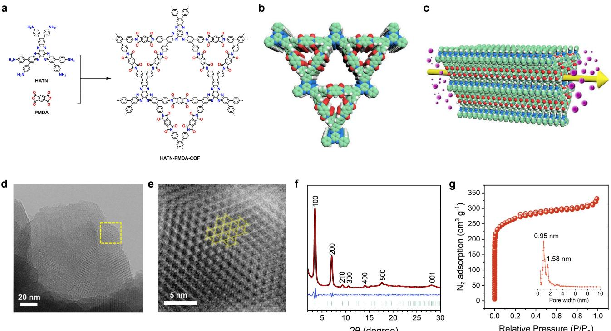
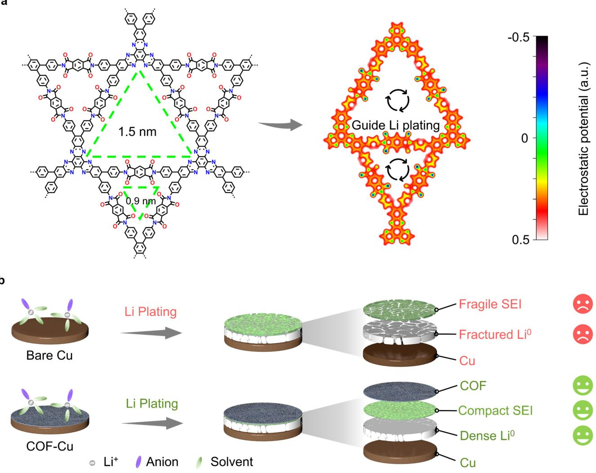
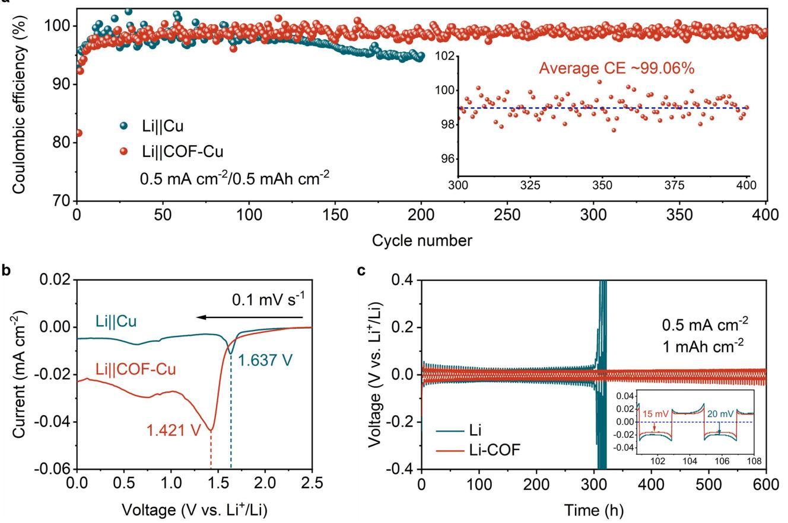
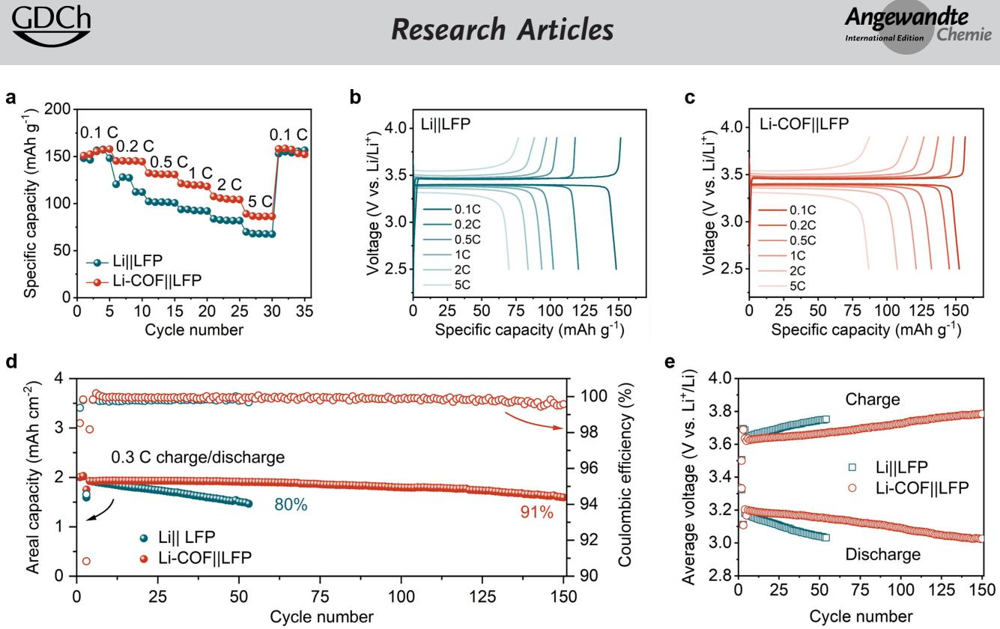

*Angewandte Chemie* www.angewandte.org

*Lithium Batteries Very Important Paper*

How to cite: *Angew. Chem. Int. Ed.* **2024**, *63*, e202319355 [doi.org/10.1002/anie.202319355](https://doi.org/10.1002/anie.202319355)

# **Lithiophilic Covalent Organic Framework as Anode Coating for High-Performance Lithium Metal Batteries**

*Xinyu Wu+ , Shuoqing Zhang+ , Xiaoyi Xu, Fuxiang Wen, Hanwen Wang, Hongzheng Chen, Xiulin Fan,\* and Ning [Huang](http://orcid.org/0000-0002-7021-8705)\**

**Abstract:** The growth of disorganized lithium dendrites and weak solid electrolyte interphase greatly impede the practical application of lithium metal batteries. Herein, we designed and synthesized a new kind of stable polyimide covalent organic frameworks (COFs), which have a high density of well-aligned lithiophilic quinoxaline and phthalimide units anchored within the uniform one-dimensional channels. The COFs can serve as an artificial solid electrolyte interphase on lithium metal anode, effectively guiding the uniform deposition of lithium ions and inhibiting the growth of lithium dendrites. The unsymmetrical Lij jCOF Cu battery exhibits a Coulombic efficiency of 99% at a current density of 0.5 mAcm 2 , which can be well retained up to 400 cycles. Meanwhile, the Li-COFj jLFP full cell shows a Coulombic efficiency over 99% at a charge of 0.3 C. And its capacity can be well maintained up to 91% even after 150 cycles. Therefore, the significant electrochemical cycling stability illustrates the feasibility of employing COFs in solving the disordered deposition of lithium ions in lithium metal batteries.

#### *Introduction*

Lithium metal batteries are widely considered as one of the most promising rechargeable energy storage devices, owing to their superhigh theoretical capacity of 3860 mAhg 1 , relatively low mass density of 0.534 gcm 3 , and low electrode potential of 3.04 V vs standard hydrogen electrode.[1] However, due to the side reaction between the highly active lithium metal and electrolytes, and the growth of lithium

*Angew. Chem. Int. Ed.* **2024**, *63*, e202319355 (1 of 7) © 2024 Wiley-VCH GmbH

dendrites during continuous lithium plating/stripping process, the efficiency and lifetime of lithium metal batteries greatly decrease.[2–4] To make matters worse, these dendrites might ultimately penetrate the separator and raise serious safety implications if extremely deteriorated by these side reactions.[5] Consequently, a series of measures, including electrolyte optimization,[6,7] construction of artificial solid electrolyte interface,[8] and separator modification,[9] have been taken to solve the above-mentioned issues. The construction of artificial solid electrolyte interphase on lithium metal surface constitutes a feasible way to achieve synergistic effects, including fast transport of lithium ion, isolation of electrolyte and lithium, avoidance of lithium dendrite growth and electrode volume expansion, to improve the performance of lithium metal batteries.[10] However, how to screen a suitable material to implement the inhibition of lithium dendrite still remains an enormous challenge.

Covalent organic frameworks (COFs) constitute a new family of highly cross-linked porous organic polymers, which are constructed by various organic building blocks with strong covalent bonds at atomic precision.[11] Owing to the high crystallinity, high surface area, low density, and strong robustness, COFs have aroused broad concern for the applications in various fields, such as gas adsorption,[12] catalysis,[13] sensing,[14] optoelectronics,[15] and energy storage.[16] Recently, several COFs with lithiophilic units have also been employed as an alternative platform for the construction of solid electrolyte interface in lithium metal batteries, including imine,[17] β-ketoen-amine,[4] olefin,[18] and boroxine linked COFs,[19] as the ordered one-dimensional (1D) channels can supply high-speed routes for lithium ion transport, subsequently inhibiting the growth of lithium dendrites, and prolonging cycling lifetime. However, the diversity and density of lithiophilic groups anchored within the 1D channels of COFs are quite low, leading to modest capacity, short cycle lifetime, and low discharge stability. To solve these issues, we developed a new type of stable polyimide COFs as an anode coating, which has a high density of ordered lithiophilic quinoxaline and phthalimide units. Moreover, the polyimide COFs exhibits high chemical stability under various conditions. The well-aligned and dense lithiophilic sites within the 1D channels of polyimide COFs are expected to supply directional transportation channels for lithium ions, thereby improving the cycling stability, safety, and service life of lithium metal batteries.

[\*] X. Wu,+ X. Xu, F. Wen, H. Wang, Prof. Dr. H. Chen, Prof. Dr. N. Huang State Key Laboratory of Silicon and Advanced Semiconductor Materials, Department of Polymer Science and Engineering Zhejiang University Hangzhou, 310058 (China) E-mail: nhuang@zju.edu.cn S. Zhang,+ Prof. Dr. X. Fan State Key Laboratory of Silicon and Advanced Semiconductor Materials, School of Materials Science and Engineering Zhejiang University Hangzhou, 310058 (China) E-mail: xlfan@zju.edu.cn

[ +] These authors contributed equally to this work.

#### *Results and Discussion*

In this work, we designed and synthesized a new kind of polyimide COFs, namely HAHATN-PMDA-COF, using hexa(*p*-anilinyl) hexaazatrinaphthalene (HAHATN) and pyromellitic dianhydride (PMDA) as building blocks under typical solvothermal conditions (Figure 1a, Figures S1–S3, and Table S1). The condensation reaction was conducted in a mixed solvent of *N*-methyl-2-pyrrolidone, mesitylene and water in the presence of isoquinoline as catalyst at 180 °C for 5 days. HAHATN-PMDA-COF was obtained as an orangebrown powder in a yield of 92% and characterized using a variety of approaches. As shown in Figure 1b, HAHATN-PMDA-COF exhibits a 2D trigonal structure with a large pore of 1.58 nm and a small pore of 0.95 nm. The uniform 1D channels of HAHATN-PMDA-COF supply a pathway for the mass transfer (Figure 1c). In Fourier transform infrared (FT-IR) spectrum, the appearance of stretching vibration peaks at 1777 and 1723 cm 1 for C=O bonds and a signal at 1377 cm 1 for C N bonds indicates the formation of diimide linkages. Meanwhile, the disappearance of peaks at 1769 cm 1 for PMDA and 3349 cm 1 for HAHATN demonstrates the complete reaction between amine and anhydride groups (Figure S4). The solid-state 13C crosspolarization magic angle spinning nuclear magnetic resonance (CP-MAS NMR) spectrum exhibits a series of chemical shift peaks at 117,141,165 ppm for the carbon atoms on PMDA, and a set of resonance signals from 130 to 144 ppm corresponding to the carbon atoms on HAHATN (Figure S5). Elemental analysis indicates that the contents of C, N and H are in good agreement with their theoretical values (Table S2). Field-emission scanning electron microscope (FE-SEM) image reveals a uniform spheroidal shape with an average diameter around 300 nm (Figure S6). Element energy dispersive spectroscopy (EDS) mapping images show the uniform distribution of C, N, and O elements in HAHATN-PMDA-COF (Figure S7). High-resolution transmission electron microscopy (HR-TEM) images exhibit a rhomboid lattice of (100) crystal faces with fringe spacing of 2.39 nm (Figures 1d,e and S8), which is consistent with the simulated result.

The crystal structure of HAHATN-PMDA-COF was resolved using powder X-ray diffraction (PXRD) combined with computational simulation. As shown in Figure 1f, HAHATN-PMDA-COF exhibits a sequence of strong PXRD diffraction peaks at 3.52°, 7.03°, 9.31°, 10.56°, and 28.14°, which can be attributable to (100), (200), (210), (300), and (001) facets, respectively. Pawley refinement reproduced a series of PXRD patterns, which exhibit high consistency and negligible difference with its experimental results. The *R*wp and *R*p values were calculated as low as 4.68% and 3.79%, respectively. The optimal simulation structure was obtained using density functional tight-binding (DFTB+) calculation (Tables S3–S6). The PXRD patterns of

*Figure 1.* a) Schematic diagram for the synthesis of polyimide linked HAHATN-PMDA-COF. b) Top view of a graphic presentation of HAHATN-PMDA-COF (nitrogen, blue; carbon, green; oxygen, red; hydrogen, white). c) Side view of a graphic presentation of HAHATN-PMDA-COF. d) HR-TEM image of HAHATN-PMDA-COF at a scale bar of 20 nm. e) HR-TEM image of HAHATN-PMDA-COF enlarged by inverse fast Fourier transform. f) PXRD profiles of HAHATN-PMDA-COF (red curve, experimental; black curve, Pawley refined; blue curve, difference; green curve, Bragg position). g) Nitrogen sorption isotherm of HAHATN-PMDA-COF measured at 77 K. The inset shows a pore size distribution curve of HAHATN-PMDA-COF.

*Angew. Chem. Int. Ed.* **2024**, *63*, e202319355 (2 of 7) © 2024 Wiley-VCH GmbH

*Research Articles*

*Figure 2.* a) Electrostatic potential and function sketch maps of HAHATN-PMDA-COF. b) The function of HAHATN-PMDA-COF coating layer during lithium growth.

AA stacking mode are highly consistent with experimental results, while the patterns of AB stacking mode deviate largely (Figures S9 and S10). A trigonal unit cell (P312) with parameters of *a*=*b*=29.6442 Å, *c*=3.8797 Å, α=β=90°, and γ=120° was deduced. The appearance of a (001) facet at 28.14° signifies a layer stacking distance of 3.1 Å, meaning that the structural order extends along the direction perpendicular to the 2D plane of HAHATN-PMDA-COF.

The porosity of HAHATN-PMDA-COF was evaluated using nitrogen sorption isotherms at 77 K (Figure 1g). This material exhibits a type I adsorption isotherm, which is the typical characteristics of microporous materials. The Brunauer–Emmett–Teller (BET) surface area and pore volume values are determined as 946.88 m2 g 1 and 0.51 cm3 g 1 , respectively. According to nonlocal density functional theory (NLDFT), HAHATN-PMDA-COF shows two types of pore sizes at 0.95 and 1.58 nm, which are close to their theoretical values. As far as we know, the pore size of HAHATN-PMDA-COF constitutes one of the smallest records among all the reported polyimide COFs (Table S7).

*Angew. Chem. Int. Ed.* **2024**, *63*, e202319355 (3 of 7) © 2024 Wiley-VCH GmbH

Furthermore, we investigated the chemical and thermal stability of HAHATN-PMDA-COF. The COF samples were soaked in several different solutions at 298 K for 5 days, including water, ethanol, dimethyl sulfoxide, *N*,*N*dimethylformamide, 1 M HCl, tetrahydrofuran and electrolyte. All of the treated samples exhibit intense PXRD patterns without significant change in position and intensity (Figure S11), illustrating that HAHATN-PMDA-COF can remain stable under these harsh conditions. The treated COF samples are collected by filtration, rinsing with water, and then dried under vacuum overnight. The FT-IR spectra of these treated samples are in high accordance with that of HAHATN-PMDA-COF (Figure S12), demonstrating that the diimde linkage are well preserved. In addition, thermogravimetric analysis result reveals that HAHATN-PMDA-COF can be stable up to 550 °C under N2 atmosphere (Figure S13). The strong robustness of HAHATN-PMDA-COF can be attributed to the high bond energy of the polyimide linkage.

*Figure 3.* a) Coulombic efficiencies of Lij jCu and Lij jCOF Cu cells tested at 0.5 mAcm 2 with the capacity of 0.5 mAhcm 2 . The inset shows the Coulombic efficiency of Lij jCOF Cu over the range from 300–400 cycles. b) Linear sweep voltammetry plots of Lij jCu and Lij jCOF Cu cells at 0.1 mVs 1 . c) Cyle performance of symmetric Lij j Li and Li-COFj j Li-COF cells.

The lithiophilic carbonyl and phenazine units are orderly arranged in the 1D channels of HAHATN-PMDA-COF, which could be conductive to the transport of lithium ions and guiding the plating of lithium, further implementing the uniform deposition of lithium ions and inhibiting the growth of lithium dendrites (Figure 2a). Compared with the bare copper electrode, the electrode coated with COF layer is expected to induce the formation of compact solid electrolyte interphase and dense lithium deposit layer (Figure 2b). To test the utilization rate of lithium ions in the plating/ stripping process, we assembled an unsymmetric Lij jCu half cell (Figures S14 and S15). The COF Cu electrode, which was prepared through coating HAHATN-PMDA-COF on bare copper foil, achieves significant performance boosts compared to the copper electrode. As shown in Figure 3a, the Coulombic efficiency of Lij jCOF Cu increased from original 92% to 99% at a current density of 0.5 mAcm 2 , which can be well retained even after 400 cycles (Table S8). A lower initial Coulombic efficiency can be attributed to the large surface area of HAHATN-PMDA-COF, which assimilates more electrolyte to build the solid electrolyte interphase layer. This phenomenon can be verified by the linear sweep voltammetry plots (Figure 3b). By contrast, the Lij jCu cell exhibited an initial

95% after 200 cycles. The result reveals that the coating of HAHATN-PMDA-COF can effectively alleviate the loss of active lithium. In addition, the Lij jCOF Cu cell showed a larger reduction peak area than that of Lij jCu cell. However, the onset reduction potential for Lij jCu shifted from 1.637 V to 1.421 V for Lij jCOF Cu, illustrating a suppressed reactivity of lithium deposits toward electrolyte. The overpotential of Lij jCOF Cu cell rapidly reached an equilibrium position after the first activation cycle (Figure S16), since HAHATN-PMDA-COF can induce the electrolyte decomposition to form a more compact solid electrolyte interphase than that on bare copper plate, thereby alleviating the continuous electrolyte consumption (Figure S17).

Coulombic efficiency of 98%, which rapidly declined to

Inspired by the high lithium utilization rate of the COF Cu electrode, we further assembled a symmetric Li-COFj jLi-COF cell (Figure S18) to evaluate its sustainability. The Li-COF electrode was prepared through depositing a fixed lithium reservoir at a capacity of 4 mAhcm 2 between COF and copper foil. The commercially available 20-μm lithium foil was employed as an electrode in the symmetric Lij jLi cell, which was selected as the control group. Both Li-COFj jLi-COF and Lij jLi cells were cycled

*Angew. Chem. Int. Ed.* **2024**, *63*, e202319355 (4 of 7) © 2024 Wiley-VCH GmbH

*Figure 4.* Electrochemical performance of Li-COF in lithium metal batteries. a) Rate capability of Lij jLFP and Li-COFj j LFP cells. Capacity-voltage profiles of b) Lij jLFP and c) Li-COFj j LFP cells. d) Long-term cycles of full cells based on pure lithium metal anode and Li-COF. e) Evolution of average charge and discharge voltage in Lij j LFP and Li-COFj j LFP cells.

at a current density of 0.5 mAcm 2 . As shown in Figure 3c, the cycle life of the Lij jLi cell was limited within 300 h, and terminated by the electrical voltage spike. In comparison, the cycle time of Li-COFj jLi-COF cell can be prolonged up to 600 h without being short-circuited by lithium dendrites. In the meanwhile, the hysteresis voltage decreased from 20 to 15 mV. The prominent enhancement of cycle stability demonstrates that the HAHATN-PMDA-COF coating can endow the lithium/electrolyte interface with high mechanical stability, alleviate the impedance accumulation (Figure S19) and inhibit the dendritic lithium growth. In addition, the porous characteristic of HAHATN-PMDA-COF network could facilitate the interfacial transfer of lithium ions. The transference number of lithium ions improves from 0.37 in Lij jLi cell to 0.70 in Li-COFj jLi-COF cell, which demonstrates that the COF coating facilitates the lithium ion transport (Figure S20).

The active inducement of HAHATN-PMDA-COF for the growth of lithium layer was investigated by using FE-SEM. A layer of lithium metal at a fixed capacity of 4 mAhcm 2 was plated on the Cu substrate at a current density of 0.5 mAcm 2 . A thin COF layer with a thickness of ~6.4 μm on copper foil can guide the growth of a compact 18.4 μm lithium deposit layer without significant structural collapse (Figures S21 and S22), which is even thinner than the theoretical one (~19.4 μm). The uniform and dense morphology indicates a low surface area of the lithium deposit layer, which can effectively mitigate the interfacial reactions between lithium and electrolyte, thereby improving the lithium plating/stripping Coulombic efficiency. However, a loose lithium deposit layer with a thickness of 33.9 μm was obtained on the bare copper substrate, which is much thicker than the theoretical value (Figure S23).

To evaluate the rate capability, a half cell Li-COFj jLFP (Figure S24) was assembled using Li-COF as anode and lithium iron phosphate (LiFePO4, LFP) as cathode. A cell without COF coating was named as Lij jLFP, which was employed as a control. As shown in Figure 4a, both cells exhibit similar specific capacities at 0.1 C. However, the Li-COFj jLFP cell delivered much higher capacities than those of Lij jLFP as the charge increases from 0.1 to 5 C. The corresponding capacity-voltage profiles were depicted in Figures 4b and c. The superior rate performance of Li-COFj jLFP can be attributed to the high porosity and ordered 1D lithiophilic channels of HAHATN-PMDA-COF, which support a larger flow capacity of lithium ions during lithium plaiting/stripping process.

The high capacity ratio between negative and positive (N/P) electrodes in traditional laboratory cells may lead to an apparently stable cycle that deviates from commercial designs and fail to show technical problems.[20] On the contrary, a lower N/P ratio not only improves the energy density but also reflects the practical value.[21] To investigate the practical feasibility of HAHATN-PMDA-COF coating in lithium metal batteries, a full cell with a low N/P ratio of 2 was assembled using 4 mAhcm 2 Li-COF anodes and 2 mAhcm 2 LFP cathodes (Figure S25). The contrast Lij j LFP cells were assembled in the same configuration without HAHATN-PMDA-COF coating. The long-term charge/ discharge cycles were conducted at 0.3 C after two formation

cycles at 0.1 C. As shown in Figure 4d, the areal capacity of the Lij jLFP cell continuously decayed within 53 cycles, which reached the capacity retention of 80%. On the contrary, the Li-COFj jLFP cell can be stably cycled up to 150 cycles with a high capacity retention of 91% (Table S9). Given that the limited lithium reservoir was used, the cycle life of lithium metal batteries is highly contingent on the Coulombic efficiency of lithium metal anode. The enhanced Coulombic efficiency by HAHATN-PMDA-COF coating is the key to extend cycle life of a full cell. Furthermore, the relation curve of average charge and discharge voltages varied with cycle numbers indicates that Li-COFj jLFP exhibits a much slower voltage polarization trend than Lij j LFP (Figure 4e). This phenomenon benefits from the passivation effects of HAHATN-PMDA-COF coating on lithium metal anode/electrolyte interface, which could significantly relieve the impedance accumulation caused by electrolyte decomposition. Therefore, HAHATN-PMDA-COF can work as an efficient coating to guide interfacial reactions, including lithium deposition and solid electrolyte interphase formation.

### *Conclusion*

In summary, we have designed and synthesized a novel polyimide COF based on a *C*3+*C*2, which exhibits high crystallinity, abundant porosity, and strong robustness. The lithiophilic building blocks, HAHATN and PMDA, render HAHATN-PMDA-COF suitable as an anode coating material in lithium metal batteries. Compared with Lij jCu, the half cell Lij jCOF Cu exhibited significantly improved lithium utilization and cycling stability. Moreover, the full cell Li-COFj jLFP also presented remarkably enhanced lithium plating/stripping stability and prominent rate capability. The HAHATN-PMDA-COF coating can effectively guide the uniform deposition of lithium, inhibiting the growth of lithium dendrites, and promote the formation of solid electrolyte interphase. Therefore, this work constitutes an important example of polyimide COFs for the utilization in lithium metal batteries, and paves the way toward the application of COFs in energy storage.

# *Acknowledgements*

This work was supported by the National Key Research and Development Program of China (2022YFE0130700), the National Natural Science Foundation of China (92163131 and 22375173), and the Fundamental Research Funds for the Central Universities (226-2023-00113).

# *Conflict of Interest*

The authors declare no conflict of interest.

## *Data Availability Statement*

The data that support the findings of this study are available from the corresponding author upon reasonable request.

**Keywords:** Covalent Organic Frameworks **·** Microporous Polymers **·** 2D Materials **·** Lithium Metal Batteries **·** Energy Storage

- [1] a) Y. Liu, X. Tao, Y. Wang, C. Jiang, C. Ma, O. Sheng, G. Lu, X. W. Lou, *[Science](https://doi.org/10.1126/science.abn1818)* **2022**, *375*, 739; b) S. Zhang, R. Li, N. Hu, T. Deng, S. Weng, Z. Wu, D. Lu, H. Zhang, J. Zhang, X. Wang, L. Chen, L. Fan, X. Fan, *Nat. Commun.* **2022**, *13*, 5431.
- [2] a) T. Kang, C. Wang, X. Zhao, Z. Guan, D. Shen, T. Song, Y. Wu, F. Zhang, Y. Tang, Z. Tong, C.-S. Lee, *Energy [Storage](https://doi.org/10.1016/j.ensm.2022.11.014) [Mater.](https://doi.org/10.1016/j.ensm.2022.11.014)* **2023**, *54*, 589; b) D. Guo, F. Ming, D. B. Shinde, L. Cao, G. Huang, C. Li, Z. Li, Y. Yuan, M. N. Hedhili, H. N. Alshareef, Z. Lai, *Adv. Funct. Mater.* **2021**, *31*, 2101194; c) S. Yao, Y. Yang, Z. Liang, J. Chen, J. Ding, F. Li, J. Liu, L. Xi, M. Zhu, J. Liu, *Adv. Funct. Mater.* **2023**, *33*, 2212466; d) J. Liu, Y. Zhang, H. Ji, J. Zhang, P. Zhou, Y. Cao, J. Zhou, C. Yan, T. Qian, *Adv. Sci.* **2022**, *9*, 2200390; e) C. Wang, W. Li, Y. Jin, J. Liu, H. Wang, Q. Zhang, *Small* **2023**, *19*, 2300023.
- [3] a) G.-H. Li, Y. Yang, J.-C. Cai, T. Wen, L.-C. Zhuang, X.-Y. Huang, Y.-P. Cai, X.-J. Hong, *ACS Appl. [Energ.](https://doi.org/10.1021/acsaem.2c02233) Mater.* **2022**, *5*, [13554;](https://doi.org/10.1021/acsaem.2c02233) b) Y. Zhang, Z. Yang, Y. Dou, W. Wang, Y. Zhang, A. Wang, X. Zhang, X. Guo, S. Qiao, *[Chem.](https://doi.org/10.1016/j.cej.2022.136155) Eng. J.* **2022**, *442*, [136155](https://doi.org/10.1016/j.cej.2022.136155); c) J. He, A. Bhargav, A. Manthiram, *Angew. Chem. Int. Ed.* **2022**, *61*, e202116586.
- [4] a) Z. Zhao, W. Chen, S. Impeng, M. Li, R. Wang, Y. Liu, L. Zhang, L. Dong, J. Unruangsri, C. Peng, C. Wang, S. Namuangruk, S.-Y. Lee, Y. Wang, H. Lu, J. Guo, *J. [Mater.](https://doi.org/10.1039/C9TA13384D) [Chem.](https://doi.org/10.1039/C9TA13384D) A* **2020**, *8*, 3459; b) Z. Li, W. Ji, T.-X. Wang, Y. Zhang, Z. Li, X. Ding, B.-H. Han, W. Feng, *ACS Appl. [Mater.](https://doi.org/10.1021/acsami.1c04517) [Interfaces](https://doi.org/10.1021/acsami.1c04517)* **2021**, *13*, 22586; c) Y. Zhang, W. Wang, M. Hou, Y. Zhang, Y. Dou, Z. Yang, X. Xu, H. Liu, S. Qiao, *[Energy](https://doi.org/10.1016/j.ensm.2022.02.029) [Storage](https://doi.org/10.1016/j.ensm.2022.02.029) Mater.* **2022**, *47*, 376; d) Y. Wen, J. Ding, Y. Yang, X. Lan, J. Liu, R. Hu, M. Zhu, *Adv. Funct. Mater.* **2022**, *32*, 2109377; e) Y. Yang, C. Zhang, G. Zhao, Q. An, Z.-y. Mei, Y. Sun, Q. Xu, X. Wang, H. Guo, *Adv. Energy Mater.* **2023**, *13*, 2300725; f) Q. An, H.-e. Wang, G. Zhao, S. Wang, L. Xu, H. Wang, Y. Fu, H. Guo, *Energy Environ. Mater.* **2023**, *6*, e12345; g) D. Chen, P. Liu, Lei Zhong, S. Wang, M. Xiao, D. Han, S. Huang, Y. Meng, *Small* **2021**, *17*, 2101496; h) Z. Li, W. Ji, T.-X. Wang, X. Ding, B.-H. Han, W. Feng, *[Chem.](https://doi.org/10.1016/j.cej.2022.135293) Eng. J.* **2022**, *437*, [135293](https://doi.org/10.1016/j.cej.2022.135293); i) K.-S. Oh, S. Park, J.-S. Kim, Y. Yao, J.-H. Kim, J. Guo, D.-H. Seo, S.-Y. Lee, *ACS [Energy](https://doi.org/10.1021/acsenergylett.3c00600) Lett.* **2023**, *8*, 2463.
- [5] Z. Li, Y. Chen, X. Yun, P. Gao, C. Zheng, P. Xiao, *Adv. Funct. Mater.* **2023**, *33*, 2300502.
- [6] a) Z. Piao, X. Wu, H.-R. Ren, G. Lu, R. Gao, G. Zhou, H.-M. Cheng, *J. Am. [Chem.](https://doi.org/10.1021/jacs.3c08733) Soc.* **2023**, *145*, 24260; b) X. Yang, F. Cheng, Z. Yang, O. Ka, L. Wen, X. Wang, S. Liu, W. Lu, L. Dai, *Nano [Energy](https://doi.org/10.1016/j.nanoen.2023.108825)* **2023**, *116*, 108825.
- [7] a) A. Hu, C. Sun, C. Li, Z. Sun, J. Fan, M. Zheng, Q. Dong, *ACS Appl. Mater. [Interfaces](https://doi.org/10.1021/acsami.3c06456)* **2023**, *15*, 35034; b) P. Ding, L. Wu, Z. Lin, C. Lou, M. Tang, X. Guo, H. Guo, Y. Wang, H. Yu, *[J.](https://doi.org/10.1021/jacs.2c06512) Am. [Chem.](https://doi.org/10.1021/jacs.2c06512) Soc.* **2023**, *145*, 1548; c) L. Tang, B. Chen, Z. Zhang, C. Ma, J. Chen, Y. Huang, F. Zhang, Q. Dong, G. Xue, D. Chen, C. Hu, S. Li, Z. Liu, Y. Shen, Q. Chen, L. Chen, *Nat. Commun.* **2023**, *14*, 2301.
- [8] a) X. Wang, J. Cai, K. V. Carballo, F. Watanabe, X. Meng, *Chem. Eng. J.* **2023**, *475*, [146156;](https://doi.org/10.1016/j.cej.2023.146156) b) T. Naren, G.-C. Kuang, R. Jiang, P. Qing, H. Yang, J. Lin, Y. Chen, W. Wei, X. Ji, L. Chen, *Angew. Chem. Int. Ed.* **2023**, *62*, e202305287.
- [9] a) Y. Deng, A. Hussain, W. Raza, L. Ao, K. Zong, J. Zhao, W. Liu, P. Ye, A. Ramiere, X. Cai, D. Liu, J. Shen, *[Chem.](https://doi.org/10.1016/j.cej.2023.145800) Eng. J.* **2023**, *474*, [145800](https://doi.org/10.1016/j.cej.2023.145800); b) P. Zhai, R. Shao, C. Zeng, S. Qu, F. Pei, Y. Li, W. Yang, *Chem. Eng. J.* **2023**, *473*, [144840.](https://doi.org/10.1016/j.cej.2023.144840)
- [10] a) X. Fan, Y. Zhang, Y. Dou, X. Li, Z. Zhao, X. Zhang, H. Wu, S. Qiao, *ACS Appl. Mater. [Interfaces](https://doi.org/10.1021/acsami.3c10533)* **2023**, *15*, 51694; b) Z. Cheng, Y. Chen, L. Shi, M. Wu, Z. Wen, *ACS Appl. [Mater.](https://doi.org/10.1021/acsami.2c18224) [Interfaces](https://doi.org/10.1021/acsami.2c18224)* **2023**, *15*, 10585; c) W. Wang, Y. Zhang, H. Jiang, R. Zhang, N. Wang, Y. Dou, Z. Zhao, X. Yang, X. Fan, X. Li, X. Guo, Q. Feng, S. Qiao, *Chem. Eng. J.* **2023**, *472*, [144888.](https://doi.org/10.1016/j.cej.2023.144888)
- [11] a) A. P. Côté, A. I. Benin, N. W. Ockwig, M. O'Keeffe, A. J. Matzger, O. M. Yaghi, *Science* **2005**, *310*,1166; b) N. Huang, P. Wang, D. Jiang, *Nat. Rev. Mater.* **2016**, *1*, 16068; c) K. T. Tan, S. Ghosh, Z. Wang, F. Wen, D. Rodríguez-San-Miguel, J. Feng, N. Huang, W. Wang, F. Zamora, X. Feng, A. Thomas, D. Jiang, *Nat. Rev. Methods Primers* **2023**, *3*, 1.
- [12] X. Xu, X. Wu, K. Xu, H. Xu, H. Chen, N. Huang, *Nat. Commun.* **2023**, *14*, 3360.
- [13] a) M. Lu, S.-B. Zhang, M.-Y. Yang, Y.-F. Liu, J.-P. Liao, P. Huang, M. Zhang, S.-L. Li, Z.-M. Su, Y.-Q. Lan, *Angew. Chem. Int. Ed.* **2023**, *62*, e202307632; b) M. Liu, S. Yang, X. Yang, C.-X. Cui, G. Liu, X. Li, J. He, G. Z. Chen, Q. Xu, G. Zeng, *Nat. Commun.* **2023**, *14*, 3800; c) Y. Yue, P. Cai, K. Xu, H. Li, H. Chen, H.-C. Zhou, N. Huang, *J. Am. [Chem.](https://doi.org/10.1021/jacs.1c06238) Soc.* **2021**, *143*, [18052](https://doi.org/10.1021/jacs.1c06238).
- [14] a) L. Wei, T. Sun, Z. Shi, Z. Xu, W. Wen, S. Jiang, Y. Zhao, Y. Ma, Y.-B. Zhang, *Nat. Commun.* **2022**, *13*, 7936; b) Y. Yue, P. Cai, X. Xu, H. Li, H. Chen, H.-C. Zhou, N. Huang, *[Angew.](https://doi.org/10.1002/anie.202100717) [Chem.](https://doi.org/10.1002/anie.202100717) Int. Ed.* **2021**, *60*, 10806.
- [15] a) J. Fang, Z. Fu, X. Chen, Y. Liu, F. Chen, Y. Wang, H. Li, Y. Yusran, K. Wang, V. Valtchev, S. Qiu, B. Zou, Q. Fang, *Angew. Chem. Int. Ed.* **2023**, *62*, e202304234; b) S. Huang, J. Y. Choi, Q. Xu, Y. Jin, J. Park, W. Zhang, *Angew. Chem. Int. Ed.* **2023**, *62*, e202303538; c) L. Zhang, S.-C. Wan, J. Zhang, M.-J. Zhang, Q.-C. Yang, B. Zhang, W.-Y. Wang, J. Sun, R. T. K. Kwok, J. W. Y. Lam, H. Deng, Z.-J. Sun, B. Z. Tang, *J. [Am.](https://doi.org/10.1021/jacs.3c04027)*

*[Chem.](https://doi.org/10.1021/jacs.3c04027) Soc.* **2023**, *145*, 17689; d) Y. Yue, H. Li, H. Chen, N. Huang, *J. Am. [Chem.](https://doi.org/10.1021/jacs.1c13012) Soc.* **2022**, *144*, 2873.

- [16] a) W. Liu, K. Wang, X. Zhan, Z. Liu, X. Yang, Y. Jin, B. Yu, L. Gong, H. Wang, D. Qi, D. Yuan, J. Jiang, *J. Am. [Chem.](https://doi.org/10.1021/jacs.3c01102) Soc.* **2023**, *145*, [8141;](https://doi.org/10.1021/jacs.3c01102) b) Y. Cao, Y. Zhang, C. Han, S. Liu, S. Zhang, X. Liu, B. Zhang, F. Pan, Jie Sun, *ACS Nano* **2023**, *17*, [22632;](https://doi.org/10.1021/acsnano.3c06826) c) C. Li, K. Yang, Z. Ma, F. Zhao, J. Li, X. Xu, X. Hao, H. Qia, Y. He, *J. [Mater.](https://doi.org/10.1039/D3TA05859J) Chem. A* **2024**, *12*, 174; d) C. Li, D.-D. Wang, G. S. H. P. Ho, Z. Zhang, J. Huang, K.-T. Bang, C. Y. Lau, S.-Y. Leu, Y. Wang, Y. Kim, *J. Am. Chem. Soc.* **2023**, *145*, 24603.
- [17] a) W. Wang, Z. Yan, Y. Zhang, A. Wang, Y. Zhang, L. Chen, Q. Li, S. Qiao, *Energy [Storage](https://doi.org/10.1016/j.ensm.2022.01.018) Mater.* **2022**, *46*, 374; b) S.-W. Ke, Y. Wang, J. Su, K. Liao, S. Lv, X. Song, T. Ma, S. Yuan, Z. Jin, J.-L. Zuo, *J. Am. [Chem.](https://doi.org/10.1021/jacs.2c01996) Soc.* **2022**, *144*, 8267; c) Y. Yang, C. Zhang, Z. Mei, Y. Sun, Q. An, Q. Jing, G. Zhao, H. Guo, *[Nano](https://doi.org/10.1007/s12274-023-5534-0) Res.* **2023**, *16*, 9289; d) Z. Li, X. Ding, W. Feng, B.-H. Han, *J. Mater. [Chem.](https://doi.org/10.1039/D2TA00119E) A* **2022**, *10*, 10474.
- [18] a) C. Zhang, Y. Yang, Y. Sun, L. Duan, Z. Mei, Q. An, Q. Jing, G. Zhao, H. Guo, *Sci. China [Mater.](https://doi.org/10.1007/s40843-022-2396-x)* **2023**, *66*, 2591; b) C. Zhang, J. Xie, C. Zhao, Y. Yang, Q. An, Z. Mei, Q. Xu, Y. Ding, G. Zhao, H. Guo, *Adv. Mater.* **2023**, 2304511; c) Z. Li, L. Sun, L. Zhai, K.-S. Oh, J.-M. Seo, C. Li, D. Han, J.-B. Baek, S.- Y. Lee, *Angew. Chem. Int. Ed.* **2023**, *62*, e202307459.
- [19] Y.-W. Song, P. Shi, B.-Q. Li, X. Chen, C.-X. Zhao, W.-J. Chen, X.-Q. Zhang, X. Chen, Q. Zhang, *[Matter](https://doi.org/10.1016/j.matt.2020.10.014)* **2021**, *4*, 253.
- [20] P. Albertus, S. Babinec, S. Litzelman, A. Newman, *Nat. Energy* **2018**, *3*, 16.
- [21] a) C. Niu, H. Pan, W. Xu, J. Xiao, J.-G. Zhang, L. Luo, C. Wang, D. Mei, J. Meng, X. Wang, Z. Liu, L. Mai, J. Liu, *[Nat.](https://doi.org/10.1038/s41565-019-0427-9) [Nanotechnol.](https://doi.org/10.1038/s41565-019-0427-9)* **2019**, *14*, 594; b) S. A. Ahad, T. E. Adegoke, K. M. Ryan, H. Geaney, *Small* **2023**, *19*, 2207902.

Manuscript received: December 15, 2023 Accepted manuscript online: January 16, 2024 Version of record online: January 30, 2024