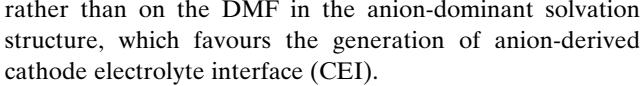
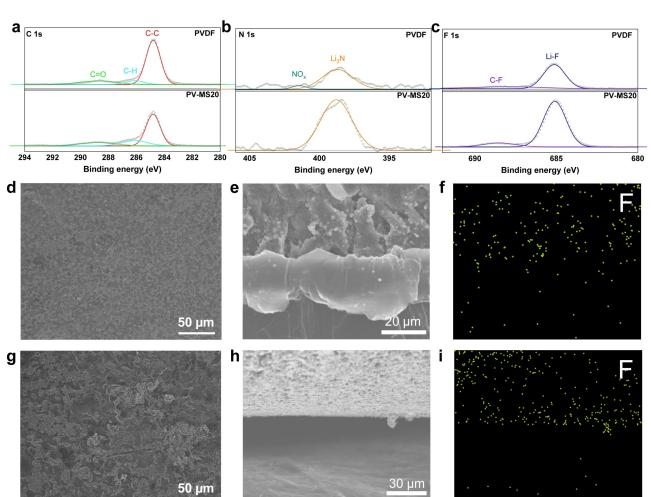
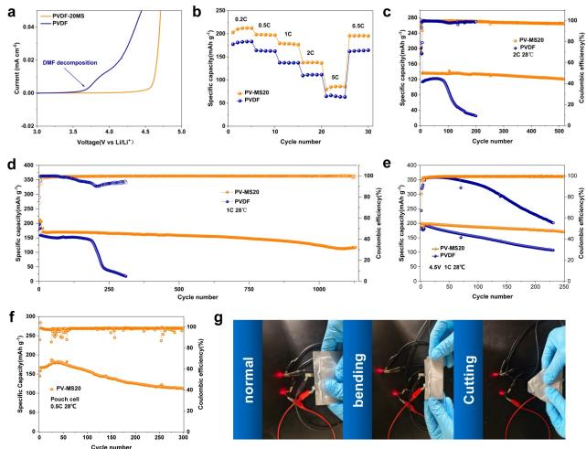
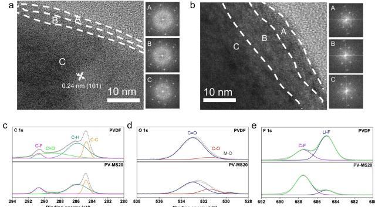

*Research Articles*

*Angewandte Chemie* www.angewandte.org

*Lithium Metal Batteries Hot Paper*

How to cite: *Angew. Chem. Int. Ed.* **2024**, *63*, e202401428 [doi.org/10.1002/anie.202401428](https://doi.org/10.1002/anie.202401428)

# **Solvation-Tailored PVDF-Based Solid-State Electrolyte for High-Voltage Lithium Metal Batteries**

*Wujie Yang, Yiwen Liu, Xinyi Sun, Zhiying He, Ping He,\* and [Haoshen](http://orcid.org/0000-0001-8112-3739) Zhou\**

**Abstract:** Poly(vinylidene fluoride) (PVDF)-based polymer electro-lytes are attracting increasing attention for high-voltage solid-state lithium metal batteries because of their high room temperature ionic conductivity, adequate mechanical strength and good thermal stability. However, the presence of highly reactive residual solvents, such as N, N-dimethylformamide (DMF), severely jeopardizes the long-term cycling stability. Herein, we propose a solvation-tailoring strategy to confine residual solvent molecules by introducing lowcost 3 Å zeolite molecular sieves as fillers. The strong interaction between DMF and the molecular sieve weakens the ability of DMF to participate in the solvation of Li+, leading to more anions being involved in solvation. Benefiting from the tailored anion-rich coordination environment, the interfacial side reactions with the lithium anode and high-voltage NCM811 cathode are effectively suppressed. As a result, the solidstate Lij jLi symmetrical cells demonstrates ultra-stable cycling over 5100 h at 0.1 mAcm 2 , and the Lij j NCM811 full cells achieve excellent cycling stability for more than 1130 and 250 cycles under the charging cutoff voltages of 4.3 V and 4.5 V, respectively. Our work is an innovative exploration to address the negative effects of residual DMF in PVDF-based solid-state electrolytes and highlights the importance of modulating the solvation structures in solid-state polymer electrolytes.

#### *Introduction*

The adoption of lithium metal and high-voltage NCM811 as anode and cathode, respectively, has become the key to the pursuit of higher energy density lithium-based batteries.[1] However, traditional carbonate electrolytes are extremely incompatible with lithium metal and pose a number of safety hazards, such as liquid leakage, combustion and even explosion.[2] Switching from traditional liquid electrolytes to

*Angew. Chem. Int. Ed.* **2024**, *63*, e202401428 (1 of 7) © 2024 Wiley-VCH GmbH

solid-state electrolytes (SEs) is expected to solve these problems. Solid-state electrolytes mainly include inorganic solid electrolytes and organic solid electrolytes.[3] Inorganic SEs generally exhibit high room-temperature ionic conductivity and mechanical strength (such as sulfide SEs and oxide SEs, etc.).[4] However, inorganic SEs commonly encounter harsh processing conditions and poor electrochemical stability, which prevent them from matching with lithium metal anodes and high-voltage NCM811 cathodes individually.[5] More unfortunately, it is challenging to work steadily for extended periods of time because of the inadequate solidsolid contact between particles.[6]

In contrast, organic SEs have satisfactory elasticity and tenacity so that they can maintain optimal interfacial contact. Moreover, these materials have excellent processing properties and are convenient for mass production.[7] Among numerous organic electrolytes, polyethylene (PEO)-based SEs have been the subject of substantial research since their initial proposal in 1970 because of their favourable solubility to lithium salts.[8] However, its low ionic conductivity at room temperature (�10 7 to 10 6 Scm 1 ) restricts its application to high temperatures (*>*60°C), greatly hindering its practical application.[9] In addition, limited by the C O segments in PEO, PEO will be oxidized at a voltage exceeding 4 V (vs Li/Li+), making them unsuitable for highvoltage cathodes (such as NCM811�4.3 V (vs Li/Li+)).[10]

In comparison with PEO-based SEs, poly(vinylidene fluoride) (PVDF)-based SEs have greater mechanical strength, excellent thermal stability, and outstanding electrochemical stability.[11] This makes PVDF-based SEs extremely attractive in high-voltage solid-state lithium-metal battery systems. However, the PVDF chain is unable to dissociate the lithium salt on its own. Therefore, tiny amounts of solvent must be retained to dissociate the lithium salt to ensure sufficient ionic conductivity (usually N,N-dimethylformamide (DMF) or N-methylpyrrolidone (NMP)) during the preparation process.[12] Unfortunately, DMF is a highly polar aprotic solvent, and the solvation structure containing DMF will undergo violent side reactions with the lithium metal anode. As a result, solid electrolyte interphase (SEI) on the lithium metal anode becomes thicker and thicker, and the interfacial impedance continues to increase, which further accelerate the growth of Li dendrites.[13] Additionally, due to the high highest occupied molecular orbital (HOMO) of DMF, continuous oxidative decomposition on the high-voltage cathode surface will occur, resulting in constant deterioration of the interface over time.[9a,14] Overall, the residual DMF solvent in the PVDF-based SEs guarantees high ionic conductivity; on the other hand, it

[\*] W. Yang, Y. Liu, X. Sun, Z. He, P. He, H. Zhou Department Center of Energy Storage Materials & Technology, College of Engineering and Applied Sciences, Jiangsu Key Laboratory of Artificial Functional Materials, National Laboratory of Solid-State Microstructures and Collaborative Innovation Center of Advanced Microstructures, Nanjing University Nanjing 210093 (P. R. China) E-mail: pinghe@nju.edu.cn hszhou@nju.edu.cn

reacts aggressively on the surface of both lithium metal and high-voltage cathodes, which ultimately results in poor battery cycle performance.

In order to solve a series of problems with PVDF-based SEs, tremendous strategies have been developed to improve their compatibility with both lithium anode and high-voltage cathodes, including optimizing the type of lithium salt,[11b] regulating the cyclic protocols,[15] and grafting functional groups.[16] In addition, the incorporation of inorganic fillers to prepare composite electrolytes is a workable method to enhance the comprehensive performance of PVDF-based SEs.[17] By introducing passive fillers, such as doublehydroxide nanosheets,[18] palygorskite nano-wires,[19] and 2D fluorinated graphene,[9a] the mechanical properties could be improved, the dissociation of lithium salts would also be promoted, and the ionic conductivity could be enhanced. A variety of ionic conductive active fillers, such as Li6.75La3Zr1.75Ta0.25O12 powders,[20] Li1.4Al0.4Ti1.6(PO4)3 nanowir-es,[14a] and Li0.33La0.56TiO3-x nanofibers,[21] have been used to improve the ionic conductivity and interfacial stability. Nevertheless, there may be some interfacial side reactions between PVDF and the active fillers, causing instability of the composite electrolytes. Even more frustrating, the synthesis process for most inorganic active fillers is complex and costly, making it challenging for them to achieve mass produce. In addition, we noted that in most studies, the role of the fillers is to promote the dissociation of lithium salts to enhance the ion conductivity.[13–14,18,22] Nonetheless, based on prior experience in liquid electrolytes, solvation structure of electrolyte has a direct bearing on how stable the electrode/ electrolyte interface is.[23] Although introducing extra fillers can improve the ionic conductivity, the solvent-dominated solvation structure derived from them is actually detrimental for the interfacial composition because it prompts the generation of an interfacial film consisting of massive organic species with poor chemical and mechanical stability.[24] In a very recent study, researchers discovered that adding LiDFOB and LiBF4 dual salts as redistributors to PVDF-based solid-state electrolytes can reinforce ion– dipole interactions between Li+ and residual solvent molecules, and lead to the encapsulation of free solvents. But since this strategy involves adding additional lithium salts to the electrolyte and both LiDFOB and LiBF4 are frequently used film-forming additives, it is tricky to pinpoint the exact mechanism underlying the improved performance.[25] Therefore, an economical and effective strategy is urgently needed to balance ion transport and interface stability.

Zeolite molecular sieves are a class of alkali metal aluminosilicates that have well-defined pore sizes.[26] Due to its size effect, zeolite has a strong adsorption effect on any molecule with a diameter smaller than its pore width and restricts entry of larger molecules; thus, zeolite is widely used in purification, drying, adsorption separation and catalysis, etc.[27] In this work, low-cost 3 Å zeolite molecular sieve powders are introduced as fillers into PVDF matrix (PV-MS) to trap the residual DMF and weaken the binding strength between lithium ions and DMF, thereby adjusting the solvation structure. The resulting anion-rich solvation structure is conducive to the formation of robust SEI rich in

*Angew. Chem. Int. Ed.* **2024**, *63*, e202401428 (2 of 7) © 2024 Wiley-VCH GmbH

inorganics with excellent migration kinetics of lithium ions, promoting uniform lithium deposition, and inhibits the oxidative decomposition of DMF on the surface of highvoltage NCM811. The Li/PV-MS20/Li symmetric cell stably cycles for more than 5100 h without short circuit at 0.1 mAcm 2 , which is much more stable than the Li/PVDF/ Li symmetric cell. The high-voltage Li/PV-MS20/NCM811 full cells also demonstrated excellent long-term cycling stability at high charging cutting-off voltages of 4.3 V and 4.5 V, cycling 1130 and 250 times, respectively. This work presents a novel and practical solvation-tailoring strategy for designing high-energy-density and safe solid-state LMBs.

#### *Results and Discussion*

3 Å zeolite molecular sieve powders were prepared from commercially viable 3 Å molecular sieve beads by ball milling and were activated at high temperature before use to remove trace amounts of moisture in the channel of zeolites. The scanning electron microscopy (SEM) image in Figure 1c shows that the diameter of the 3 Å zeolite molecular sieve powder is less than 2 μm after ball milling. The free-standing PVDF and PV-MS20 composite electrolytes were prepared by a simple solution casting method. Both the PVDF and PV-MS20 electrolytes exhibit solid-state whitening appearances and good flexibility (Figure S1). PVDF-based SEs reinforced with different concentrations (10, 20 and 30 wt%, denoted as PV-MS10, PV-MS20 and PV-MS30, respectively) of 3 Å zeolite fillers were first tested in Li/Li symmetrical cells to investigate the lithium metal anode compatibility (Figure S2). The PV-MS20 exhibited the best long-term

*Figure 1.* a) Schematic diagram of the working mechanism of solidstate NCM811/Li batteries using the PV-MS20 electrolyte. b) XRD patterns of the PVDF powders, PVDF and PV-MS20 electrolytes. c) SEM image of zeolite molecular sieve powders. d) Cross-sectional and g) surface SEM images of PVDF electrolytes. e) Cross-sectional and h) surface SEM images of the PV-MS20 electrolyte. Surface energydispersive spectroscopy (EDS) mappings of f) Al and i) F element in the PV-MS20 electrolyte.

*Angewandte Chemie*

cycling stability in Li/Li symmetrical batteries, so we next investigated the PV-MS20 electrolyte in detail.

Figure 1b displays the X-ray diffraction (XRD) patterns of the prepared electrolyte membranes. Similar to PVDF, PV-MS20 shows peaks at 18.83°, 25.59° and 39.44°, corresponding to the α, β and γ phases of PVDF, respectively.[13] The half-peak width of PV-MS20 is broadened after the introduction of molecular sieve fillers (Figure S3), suggesting a decrease in crystallinity, which is beneficial for Li+ transport along polymer chains. The surface scanning electron microscopy (SEM) image (Figure 1g–1 h) shows that PV-MS20 has a dense and smooth structure, while the pure PVDF electrolyte has a porous structure. The PV-MS20 membrane is thinner than the PVDF membrane with a thickness of approximately 100 μm (Figure 1d–1e). Energy dispersive spectroscopy (EDS) mapping revealed that the molecular sieve powders are uniformly dispersed throughout the PVDF matrix due to the good compatibility between the molecular sieve powders and PVDF (Figure 1f, 1i).

The ionic conductivities of the PVDF electrolyte and PV-MS20 electrolyte at different temperatures were measured (Figure S4). The PV-MS20 electrolyte exhibits higher room-temperature ionic conductivity of 4.5×10 4 Scm 1 , which is about 2.5 times higher than that of the pure PVDF electrolyte (1.8×10 4 Scm 1 ). In addition, the Arrhenius plots show that the activation energy (*E*a) for ion migration decreases from 0.35 to 0.26 eV with the introduction of 20 wt% zeolite powders (Figure 2a), indicating the facilitation of Li+ migration. According to thermogravimetric analysis (TGA), the residual DMF in the PVDF and PV-MS20 electrolytes was roughly 17.5 wt% and 17.1 wt%, respectively (Figure S5), suggesting that the high ionic

*Figure 2.* a) Arrhenius plots of the ionic conductivities of the PVDF and PV-MS20 electrolytes. Polarization curves as well as the initial and steady-state impedance diagrams of the b) Li/PVLN-15/Li cell and c) Li/PVDF/Li cell. d) FTIR spectra of the PV-MS20 and PVDF electrolytes. Raman spectra of the (e) PVDF and (f) PV-MS20 electrolytes. g) DFT results for adsorption energies. h) Galvanostatic cycling curves of Li/Li symmetrical cells with PVDF and PV-MS20 electrolytes at a current density of 0.1 mAcm 2 .

*Angew. Chem. Int. Ed.* **2024**, *63*, e202401428 (3 of 7) © 2024 Wiley-VCH GmbH

conductivity of PVDF-MS20 does not depend entirely on the contents of DMF. What's more, the Li transference number (tLi+) of the PV-MS20 electrolyte reaches 0.47 (Figure 2b), which is significantly higher than that of the PVDF electrolyte (0.20) (Figure 2c). The higher tLi+ of the PV-MS20 indicates that the addition of zeolite fillers can effectively reduce the free movement of FSI and promote the effective migration of Li+.

To investigate the interaction and solvation structure in both solid-state electrolytes, we performed Fourier transform infrared (FTIR) spectroscopy and Raman spectroscopy. The FTIR spectra clearly indicates that both PVDF and PV-MS20 show a band at 673 cm 1 , corresponding to the characteristic band of DMF molecules bound to Li+, and there is no band at 658 cm 1 assigned to free DMF (Figure S6).[12,14a, 20] The peaks at 1656 and 1381 cm 1 are assigned to C=O and CH3, respectively, in the DMF solvent (Figure 2d).[12] After introducing zeolite fillers, both peaks shifted to 1653.2 and 1379.8 cm 1 , indicating the strong interactions between zeolite fillers and DMF. Remarkably, PV-MS20 exhibited a stronger signal for characteristic peaks of DMF than did the PVDF electrolyte (Figure S7), suggesting that the DMF molecules are relatively weakly coordinated with Li+ in the PV-MS20 electrolyte.[28] The adsorption energy calculated by density functional theory (DFT) calculations further verified the strong adsorption effect of 3 Å zeolite molecular sieves on DMF molecules (Figure 2g). The adsorption energy of DMF molecules on 3 Å zeolite molecular sieve is 3.48 eV, which is almost 4 times higher than that on PVDF chains ( 0.83 eV, Figure S8). Besides, we believe that the strong physical adsorption effect of 3 Å molecular sieve on molecules with diameter smaller than its pore diameter (3 Å) can further enhance the anchoring effect on DMF molecules with a minimum diameter of 1.74 Å.[27,29] Subsequently, we performed Raman spectral analysis to determine the coordination state of the FSI anion (Figure 2e and 2 f). The Raman bands at 720 cm 1 , 732 cm 1 , and 746 cm 1 are from a free FSI anion (SSIP), a contact-ion pair (CIP, one FSI anion interacting with one Li+), and an aggregate (AGG, one FSI anion interacting with two or more Li+), respectively.[30] In the PVDF electrolyte, the proportions of SSIP, CIP and AGG were 6%, 49.7% and 44.3%, respectively. Notably, the peak corresponding to the SSIP disappears completely in the PV-MS20 electrolyte, and the ratio of AGGs rises to 52.9%, indicating that the interaction between Li+ and FSI is enhanced after the introduction of the molecular sieve fillers. This also confirms the strong interaction between molecular sieves and DMF, which weakens the ability of DMF to participate in the solvation, increasing the number of FSI anions that entered the solvation structure of Li+. Furthermore, we conducted DFT calculations to study the effect of the modulated solvation structures on the electrochemical stability of bulk electrolytes and the interface. As we can see from Figure S9, the LUMO and HOMO energy are both elevated as more FSI anions enter the solvated sheath of Li+. Higher LUMO level indicates better compatibility with the lithium metal anode and fewer side effects. In addition, the HOMO is distributed on the FSI anion *Research Articles*

As expected, the electrochemical stability between lithium metal and PVDF-based SEs is greatly improved by the use of molecular sieve fillers. The Li/PV-MS20/Li symmetric cell shows a lower polarization when cycling under various current densities (Figure S10). The Li Li symmetric cell with PV-MS20 SEs can stably cycle for more than 5100 h at 0.1 mAcm 2 and 0.1 mAhcm 2 with a smaller polarization voltage, while the polarization voltage of the Li/ PVDF/Li symmetric cell increases dramatically after 650 h (Figure 2h). The Li/PV-MS20/Li symmetric cell at 0.3 mAcm 2 also has a much longer cycling life (380 h) than that of PVDF (50 h) (Figure S11). Even at higher current density of 0.5 mAcm 2 and capacity of 0.5 mAhcm 2 , the Li/ PV-MS20/Li symmetric cell still delivers superior cycling life for 200 h, while that with the PVDF electrolyte cannot operate normally at this current for more than 10 hours ascribed to the aggravated side reactions at the interface (Figure S11). Moreover, the critical current density (CCD) of the Li/PV-MS20/Li cell increases from 0.6 mAcm 2 to 1.3 mAcm 2 (Figure S12), indicating that the ability to inhibit lithium dendrites is obviously enhanced. Subsequently, the ion transfer kinetics at the interface are evaluated using the exchange current density (i0) obtained by charging/discharging Li Li symmetrical cells at various currents ranging from 20 μA to 120 μA and calculated using the simplified Butler–Volmer equation (Figure S13).[31] It shows that the i0 value increases from 0.071 mA to 0.098 mA for the PV-MS20 electrolyte, proving the superior ion transport capability of the anion-rich solvated structurederived SEI.

Furthermore, we collected lithium sheets after cycling for 100 hours at 0.1 mAcm 2 and 0.1 mAhcm 2 in Li Li symmetrical cell for morphological and interfacial chemical characterization. From the SEM images (Figure 3g and Figure S14a–S14c), it can be seen a quite rough surface with obvious Li dendrites on the cycled Li metal with the PVDF electrolyte. By comparison, the cycled Li metal using the PV-MS20 electrolyte exhibited a flat and uniform morphology (Figure 3d and Figure S14d–S14f). Furthermore, from Figure 3h-3i, there is a sizable gap between the Li and PVDF electrolyte. In clear contrast, PV-MS20 and Li exhibit a very tight interfacial contact (Figure 3e–3f), which is essential for maintaining efficient Li+ transport at the interface during extended cycling. The X-ray photoelectron spectroscopy (XPS) results show that the SEI mainly consists of C-containing organic species and inorganic species (Figure 3a–3c), which are attributed to the decomposition of DMF solvent, PVDF and FSI . [13–14] In the C 1s spectra, the peaks intensities are obviously greater when using the PVDF electrolyte, especially for the C=O peak, which is mainly ascribed to the undesirable decomposition of DMF solvent.[14a] In addition, more LiF and Li3N are mainly contributed by the decomposition of FSI at the PV-MS20/Li interface, which is beneficial to prevent the formation of lithium dendrites.[13] All the XPS spectra results obtained on the lithium metal anode confirm that the

*Angew. Chem. Int. Ed.* **2024**, *63*, e202401428 (4 of 7) © 2024 Wiley-VCH GmbH

*Figure 3.* XPS spectra of a) C 1s, b) N 1s and c) F 1s collected from the cycled Li metal anode surface with PVDF and PV-MS20 electrolytes. SEM images of the cycled Li surface from d) Li/PV-MS20/Li and (g) Li/ PVDF/Li symmetric cells after 100 cycles at 0.1 mA/cm2 . SEM images of the interfaces between the Li metal anode and e) the PV-MS20 and h) PVDF electrolytes and corresponding (f, i) EDS mapping of F element after cycling.

introduction of zeolite fillers anchors the DMF molecule, inhibits its reductive decomposition, and the aggregative electro-lyte configurations result in an SEI rich in inorganic products, which is conducive to uniform lithium deposition.

Benefiting from the restriction of DMF molecules and the modulated solvation sheath, the electrochemical stability window (ESW) of the electrolyte is dramatically widened. The linear sweep voltammetry (LSV) curves in Figure 4a show that the ESW of the PV-MS20 electrolyte is extended

*Figure 4.* a) LSV curves of the PV-MS20 and PVDF electrolytes. b) Rate capacities of NCM811/Li cells with PVDF and PV-MS20 electrolytes. Long-term cycling performance of NCM811/Li cells at 2.8–4.3 V, c) 2 C and d) 1 C. e) Cycling performance of NCM811/Li cells at 2.8–4.5 V and 1 C. f) Cycling performance of the NCM811/PV-MS20/Li pouch cell at 0.5 C. g) Safety test of the pouch cell by lighting an LED under bending and cutting conditions.

from 3.7 to 4.6 V, suggesting great potential for matching well with high-voltage cathodes. The Lij jNCM811 full cells are assembled to examine the practicability of the PV-MS20. The cyclic voltammetry (CV) measurements show that the Li/PV-MS20/NCM811 cell displayed better redox reaction reversibility than the Li/PVDF/NCM811 cell during the first 5 cycles from 2.8 to 4.3 V (Figure S15), suggesting that PV-MS20 has better interfacial stability with the NCM811 cathode. The specific capacities of the Li/PV-MS20/NCM811 battery at 0.2, 0.5, 1, 2 and 5 C are 208.1, 197.0, 178.4, 138.0 and 85.9 mAhg 1 , respectively (Figure 4b and Figure S16a– S16b), which are much higher than those of the Li/PVDF/ NCM811 cell due to the higher ionic conductivity and Li+ transference number of the PV-MS20 electrolyte. In addition, when the rate returns to 0.5 C, the specific capacity returns to 195.8 mAhg 1 . The long-term cycling performances of the Li/PV-MS20/NCM811 and Li/PVDF/NCM811 cells at various rates are also examined. At the rate of 1 C, the Li/PV-MS20/NCM811 cell can be stably operated for more than 1130 cycles, and the capacity retentions after 500 and 1,130 cycles reach up to 92.7% and 68.7%, respectively (Figure 4d), with high average coulombic efficiency of 99.7%. In sharp contrast, the Li/PVDF/NCM811 cell can only stably cycle for less than 200 cycles and then rapidly decays. The capacity retention assembled with typical PVDF electrolyte after 300 cycles is only 10.8% and rapid decay of coulombic efficiency occurs after just 80 cycles. This remarkably improved CE under high voltage can be attributed to the superior electrochemical oxidative stability of the prepared PV-MS20 electrolyte. At a higher rate, the Li/PV-MS20/NCM811 cell also exhibits a higher capacity retention of 90% after 500 cycles at 2 C, while cell containing PVDF electrolyte damages after 200 cycles (Figure 4c). Even at small rates of 0.2 C and 0.5 C, which accentuate the instability at high voltage, the Li/PV-MS20/NCM811 cells still exhibit significantly better cycling stability (Figure S17a-S17b), while the discharge specific capacity of the Li/PVDF/ NCM811 cells declines rapidly. Increasing the charging cutoff voltage of the layered oxide cathode is an effective way to pursue high energy density. However, the excessive oxidative decomposition of electrolytes at higher voltages leads to continuous thickening of the CEI and accelerates structural degradation, eventually leading to rapid capacity decay. To further validate the better oxidation resistance of our PV-MS20 electrolyte, we raised the charging cut-off voltage to 4.5 V. Under a high charging cut-off voltage of 4.5 V, the Li/PV-MS20/NCM811 cell exhibits a higher initial discharge capacity of 197.56 mAhg 1 at 1 C, and could normally cycle 250 times (Figure 4e). The capacity retention is as high as 90% after 200 cycles using the PV-MS20 electrolyte, while overcharging occurs after 50 cycles for the Li/PVDF/NCM811 cell, resulting in a continuous decrease in coulombic efficiency and rapid capacity decay. Furthermore, we assembled a flexible single-layer pouch cell to demonstrate the application potential of the PV-MS20 electrolyte. The Li/PV-MS20/NCM811 pouch cell delivers a discharge capacity of 166.9 mAhg 1 in the voltage range of 2.8–4.3 V at 0.5 C and 28 °C, and the capacity retention reaches 67.3% after 300 cycles (Figure 4f). Moreover, the Li/PV-MS20/ NCM811 pouch cell can still work normally even after severe folding and cutting tests (Figure 4g), demonstrating the excellent safety performance and application feasibility of the PV-MS20 electrolyte. The electrochemical performance of our PV-MS20 electrolyte is one of best of those other recently reported PVDF-based solid-state electrolyte (Table S1).

To uncover the mechanism underlying the improved performance, we examined the structure and surface composition of the NCM811 cathodes after 100 cycles. As we can see from the images of the cells taken apart, the colour of cathode-facing side of the PVDF membrane changed significantly (Figure S18a), indicating that violent side reactions took place at the interface. In contrast, the color of PV-MS20 hardly changed and remained the original white (Figure S18b), confirming that the side reactions were greatly suppressed. During cycling, different phases will be generated from the surface to the bulk, consisting of rocksalt phase, mixed phase and pristine layered structure.[13–14] The high-resolution transmission electron microscopy (HRTEM) image of NCM811 cycling with the PVDF electrolyte shows more severe surface phase transitions (Figure 5b), in which the rock-salt phase and the mixed phase together are more than 15 nm. In a stark comparison, the irreversible phase transformation of NCM811 particles is significantly mitigated by the PV-MS20 electrolyte, and the phase transformation thickness is significantly reduced to only approximately 5 nm (Figure 5a). The higher I(003)/I(104) from the XRD results also proves suppressed Li/Ni cation mixing and limited structural fade (Figure S19).[32] This more apparent reconstruction of the NCM811 cycled within basic PVDF electrolyte is induced by the constantly electrolyte-NCM811 aggravation reactions during charging/discharging processes, which are well suppressed by assembling with the PV-MS20 electrolyte. In addition, the TEM images show that a uniform cathode electrolyte interface (CEI) with a thickness of ~3.5 nm formed on the surface of the cycled NCM811 particles with the PV-MS20 electrolyte, while an uneven CEI of ~22 nm was observed for that using the PVDF electrolyte (Figure S20). The XPS spectra results of the NCM811 cathode cycled with PV-MS20 also show fewer

*Figure 5.* a) TEM and FFT images of cycled NCM811 cathode with a) PV-MS20 and b) PVDF electrolyte. XPS spectra for c) C 1s, d) O 1s, and e) F 1s of the cycled NCM811 cathode.

*Angew. Chem. Int. Ed.* **2024**, *63*, e202401428 (5 of 7) © 2024 Wiley-VCH GmbH

organic decomposition products than did those obtained with the PVDF electrolyte due to the inhibition of DMF decomposition (Figure 5c–5e). The decrease in decomposition products means that the anion-derived CEI is robust enough to inhibit further oxidative decomposition of the electrolyte. The retention of the metal-O peaks of the cycled NCM811 cathode with PV-MS20 in the O 1s spectrum also confirmed the formation of a thinner CEI. In general, the strong interaction between the 3 Å molecular sieve and DMF solvent significantly weakens the interaction between DMF and lithium ions, resulting in more anion involved in the solvation sheath and inhibiting the decomposition of DMF on the high-voltage cathode surface. This also promotes the formation of an anion-derived, thin and compact CEI, which alleviates the structural decay of NCM811 particles, ultimately improves cycle stability. Owing to the good interface compatibility, the solid-state Li/ PV-MS20/NCM811 cells present ultra-stable cycling stability at room temperature. At last, the safety of the PV-MS20 electrolyte was determined by a firing test. The PV-MS20 electrolyte was found to be totally non-flammable throughout the test, indicating the prospect of being used in highsafety lithium metal batteries (Figure S21).

## *Conclusions*

In this work, we successfully modulate the solvation structure in PVDF-based solid-state electrolyte by introducing 3 Å zeolite molecular sieves as fillers, making it has superior interfacial stability with both lithium metal anode and the high-voltage NCM811 cathode. The strong anchoring effect of molecular sieve channels on DMF weakens its ability to participate in solvation, resulting in more anions participating in the solvation structure. The redox reactivity of DMF is significantly suppressed, which promotes the inclusion of more inorganic products in the SEI and CEI. The inorganic-rich SEI promotes uniform lithium deposition, allowing the Li Li symmetric cell presents a rather stable cycling performance for more than 5100 h. The oxidative decomposition of the electrolyte and irreversible phase transformation of the NCM811 cathode are also mitigated, which allow the solid-state Li/PV-MS20/NCM811 cells to stably cycle 1130 times and 250 times, respectively, at charging cut-off voltages of 4.3 V and 4.5 V. The stable operation of the pouch cell further demonstrates its potential for practical application. This work not only solves the issue of residual DMF in PVDF-based solid electrolytes but also provides a new strategy for regulating the solvation structure in organic polymer solid electrolytes, which opens up a new approach for designing advanced high-voltage polymer lithium metal batteries.

#### *Supporting Information*

Supporting Information includes Experimental sections, Figures and Tables.

*Angew. Chem. Int. Ed.* **2024**, *63*, e202401428 (6 of 7) © 2024 Wiley-VCH GmbH

#### *Acknowledgements*

We gratefully acknowledge support by the National Key R&D Program of China (2021YFB3800300), the National Natural Science Foundation of China (No.22239002 and No. 92372201), and the Science and Technology innovation fund for emission peak and carbon neutrality of Jiangsu province (BK20220034 and BK20231512).

### *Conflict of Interest*

The authors declare no conflict of interest.

#### *Data Availability Statement*

The data that support the findings of this study are available from the corresponding author upon reasonable request.

**Keywords:** solid-state lithium metal batteries **·** composite electrolytes **·** solvation structure **·** PVDF **·** zeolite

- [1] J. Zhang, H. Zhang, S. Weng, R. Li, D. Lu, T. Deng, S. Zhang, L. Lv, J. Qi, X. Xiao, L. Fan, S. Geng, F. Wang, L. Chen, M. Noked, X. Wang, X. Fan, *Nat. Commun.* **2023**, *14*, 2211.
- [2] a) D. Wang, W. Zhang, W. Zheng, X. Cui, T. Rojo, Q. Zhang, *Adv. Sci.* **2017**, *4*, 1600168; b) M. Yoshio, H. Wang, K. Fukuda, Y. Hara, Y. Adachi, *J. [Electrochem.](https://doi.org/10.1149/1.1393344) Soc.* **2000**, *147*, 1245.
- [3] J. Janek, W. G. Zeier, *Nat. Energy* **2016**, *1*, 16141.
- [4] B. Jiang, Y. Wei, J. Wu, H. Cheng, L. Yuan, Z. Li, H. Xu, Y. Huang, *[EnergyChem.](https://doi.org/10.1016/j.enchem.2021.100058)* **2021**, *3*, 100058.
- [5] Y. Zeng, L. Zhao, J. Zhang, Q. Li, D. Sun, Y. Ren, Y. Tang, G. Jin, H. Wang, *Small Science.* **2023**, *3*, 2300017.
- [6] Z. Jiang, H. Xie, S. Wang, X. Song, X. Yao, H. Wang, *Adv. Energy Mater.* **2018**, *8*, 1801433.
- [7] Q. Zhou, J. Ma, S. Dong, X. Li, G. Cui, *Adv. Mater.* **2019**, *31*, 1902029.
- [8] D. E. Fenton, J. M. Parker, P. V. Wright, *[Polymer.](https://doi.org/10.1016/0032-3861(73)90146-8)* **1973**, *14*, [589](https://doi.org/10.1016/0032-3861(73)90146-8).
- [9] a) P. Zhai, Z. Yang, Y. Wei, X. Guo, Y. Gong, *Adv. Energy Mater.* **2022**, *12*, 2200967; b) Z. Gadjourova, Y. G. Andreev, D. P. Tunstall, P. G. Bruce, *Nature.* **2001**, *412*, [520–523](https://doi.org/10.1038/35087538).
- [10] a) K. Nie, X. Wang, J. Qiu, Y. Wang, Q. Yang, J. Xu, X. Yu, H. Li, X. Huang, L. Chen, *ACS Energy Lett.* **2020**, *5*, [826–832;](https://doi.org/10.1021/acsenergylett.9b02739) b) J. Qiu, X. Liu, R. Chen, Q. Li, Y. Wang, P. Chen, L. Gan, S.-J. Lee, D. Nordlund, Y. Liu, X. Yu, X. Bai, H. Li, L. Chen, *Adv. Funct. Mater.* **2020**, *30*, 1909392.
- [11] a) S. W. Choi, S. M. Jo, W. S. Lee, Y.-R. Kim, *Adv. [Mater.](https://doi.org/10.1002/adma.200304617)* **2003**, *15*, [2027–2032](https://doi.org/10.1002/adma.200304617); b) X. Zhang, S. Wang, C. Xue, C. Xin, Y. Lin, Y. Shen, L. Li, C.-W. Nan, *Adv. Mater.* **2019**, *31*, 1806082.
- [12] Q. Liu, G. Yang, X. Li, S. Zhang, R. Chen, X. Wang, Y. Gao, Z. Wang, L. Chen, *Energy Storage Mater.* **2022**, *51*, [443–452.](https://doi.org/10.1016/j.ensm.2022.06.040)
- [13] L. Chen, T. Gu, J. Ma, K. Yang, P. Shi, J. Biao, J. Mi, M. Liu, W. Lv, Y.-B. He, *Nano [Energy.](https://doi.org/10.1016/j.nanoen.2022.107470)* **2022**, *100*, 107470.
- [14] a) K. Yang, L. K. Chen, J. B. Ma, C. Lai, Y. F. Huang, J. S. Mi, J. Biao, D. F. Zhang, P. R. Shi, H. Y. Xia, G. M. Zhong, F. Y. Kang, Y. B. He, *Angew. Chem. Int. Ed.* **2021**, *60*, [24668–24675;](https://doi.org/10.1002/anie.202110917) b) L. You, K. Duan, G. Zhang, W. Song, T. Yang, X. Song, S. Wang, J. Liu, *J. Phys. Chem. C* **2019**, *123*, [5942–5950](https://doi.org/10.1021/acs.jpcc.9b01387).

- [15] C. Xue, S. Guan, B. Hu, X. Wang, C. Xin, S. Liu, J. Yu, K. Wen, L. Li, C.-W. Nan, *Energy [Storage](https://doi.org/10.1016/j.ensm.2022.01.034) Mater.* **2022**, *46*, 452– [460.](https://doi.org/10.1016/j.ensm.2022.01.034)
- [16] J. Mi, J. Ma, L. Chen, C. Lai, K. Yang, J. Biao, H. Xia, X. Song, W. Lv, G. Zhong, Y.-B. He, *Energy [Storage](https://doi.org/10.1016/j.ensm.2022.02.048) Mater.* **2022**, *48*, [375–383.](https://doi.org/10.1016/j.ensm.2022.02.048)
- [17] Y. Zheng, Y. Yao, J. Ou, M. Li, D. Luo, H. Dou, Z. Li, K. Amine, A. Yu, Z. Chen, *Chem. Soc. Rev.* **2020**, *49*, [8790–8839.](https://doi.org/10.1039/D0CS00305K)
- [18] S. Xia, B. Yang, H. Zhang, J. Yang, W. Liu, S. Zheng, *Adv. Funct. Mater.* **2021**, *31*, 2101168.
- [19] P. Yao, B. Zhu, H. Zhai, X. Liao, Y. Zhu, W. Xu, Q. Cheng, C. Jayyosi, Z. Li, J. Zhu, K. M. Myers, X. Chen, Y. Yang, *[Nano](https://doi.org/10.1021/acs.nanolett.8b01421) Lett.* **2018**, *18*, [6113–6120](https://doi.org/10.1021/acs.nanolett.8b01421).
- [20] X. Zhang, T. Liu, S. Zhang, X. Huang, B. Xu, Y. Lin, B. Xu, L. Li, C.-W. Nan, Y. Shen, *J. Am. Chem. Soc.* **2017**, *139*, [13779–](https://doi.org/10.1021/jacs.7b06364) [13785.](https://doi.org/10.1021/jacs.7b06364)
- [21] S. Liu, Y. Zhao, X. Li, J. Yu, J. Yan, B. Ding, *Adv. Mater.* **2021**, *33*, 2008084.
- [22] Y. Xu, K. Wang, X. Zhang, Y. Ma, Q. Peng, Y. Gong, S. Yi, H. Guo, X. Zhang, X. Sun, H. Gao, S. Xin, Y.-G. Guo, Y. Ma, *Adv. Energy Mater.* **2023**, *13*, 2204377.
- [23] a) H.-Y. Zhou, Y. Ou, S.-S. Yan, J. Xie, P. Zhou, L. Wan, Z.- A. Xu, F.-X. Liu, W.-L. Zhang, Y.-C. Xia, K. Liu, *Angew. Chem. Int. Ed.* **2023**, *62*, e202306948; b) M. S. Kim, Z. Zhang, P. E. Rudnicki, Z. Yu, J. Wang, H. Wang, S. T. Oyakhire, Y. Chen, S. C. Kim, W. Zhang, D. T. Boyle, X. Kong, R. Xu, Z. Huang, W. Huang, S. F. Bent, L.-W. Wang, J. Qin, Z. Bao, Y.

Cui, *Nat. Mater.* **2022**, *21*, [445–454](https://doi.org/10.1038/s41563-021-01172-3); c) Z. Chang, Y. Qiao, H. Yang, X. Cao, X. Zhu, P. He, H. Zhou, *[Angew.](https://doi.org/10.1002/anie.202104124) Chem. Int. Ed.* **2021**, *60*, [15572–15581](https://doi.org/10.1002/anie.202104124).

- [24] P. Xiao, X. Yun, Y. Chen, X. Guo, P. Gao, G. Zhou, C. Zheng, *Chem. Soc. Rev.* **2023**, *52*, [5255–5316](https://doi.org/10.1039/D3CS00151B).
- [25] M. Li, H. An, Y. Song, Q. Liu, J. Wang, H. Huo, S. Lou, J. Wang, *J. Am. Chem. Soc.* **2023**, *145*, [25632–25642.](https://doi.org/10.1021/jacs.3c07482)
- [26] M. Carta, R. Malpass-Evans, M. Croad, Y. Rogan, J. C. Jansen, P. Bernardo, F. Bazzarelli, N. B. McKeown, *[Science.](https://doi.org/10.1126/science.1228032)* **2013**, *339*, [303–307](https://doi.org/10.1126/science.1228032).
- [27] M. Dusselier, M. E. Davis, *Chem. Rev.* **2018**, *118*, [5265–5329.](https://doi.org/10.1021/acs.chemrev.7b00738)
- [28] H. Kwon, H.-J. Choi, J.-k. Jang, J. Lee, J. Jung, W. Lee, Y. Roh, J. Baek, D. J. Shin, J.-H. Lee, N.-S. Choi, Y. S. Meng, H.- T. Kim, *Nat. Commun.* **2023**, *14*, 4047.
- [29] J. Tang, K. K. Sirkar, *J. Membr. Sci.* **2012**, *421–422*, [211–216.](https://doi.org/10.1016/j.memsci.2012.07.015)
- [30] Y. Yamada, M. Yaegashi, T. Abe, A. Yamada, *[Chem.](https://doi.org/10.1039/c3cc46665e) Commun.* **2013**, *49*, [11194–11196.](https://doi.org/10.1039/c3cc46665e)
- [31] J. Wu, Z. Gao, Y. Tian, Y. Zhao, Y. Lin, K. Wang, H. Guo, Y. Pan, X. Wang, F. Kang, N. Tavajohi, X. Fan, B. Li, *Adv. Mater.* **2023**, *35*, 2303347.
- [32] J. Sun, X. Cao, H. Yang, P. He, M. A. Dato, J. Cabana, H. Zhou, *Angew. Chem. Int. Ed.* **2022**, *61*, e202207225.

Manuscript received: January 20, 2024 Accepted manuscript online: March 12, 2024 Version of record online: March 27, 2024

*Angew. Chem. Int. Ed.* **2024**, *63*, e202401428 (7 of 7) © 2024 Wiley-VCH GmbH

