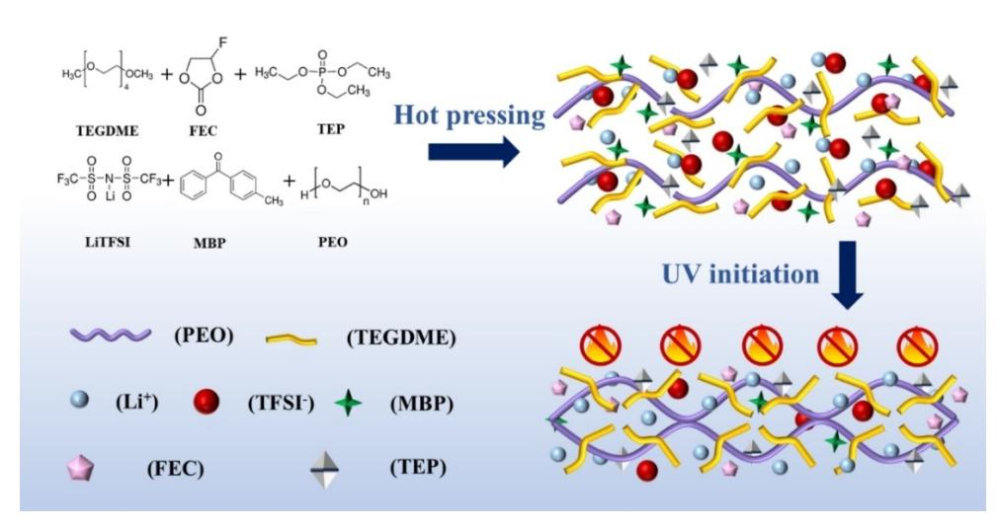
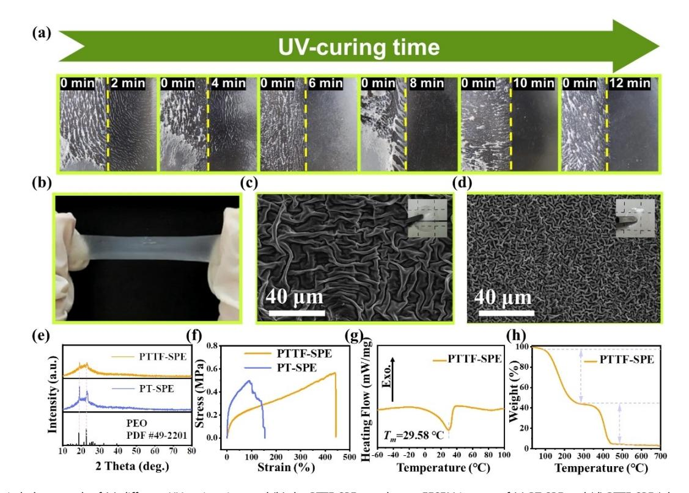
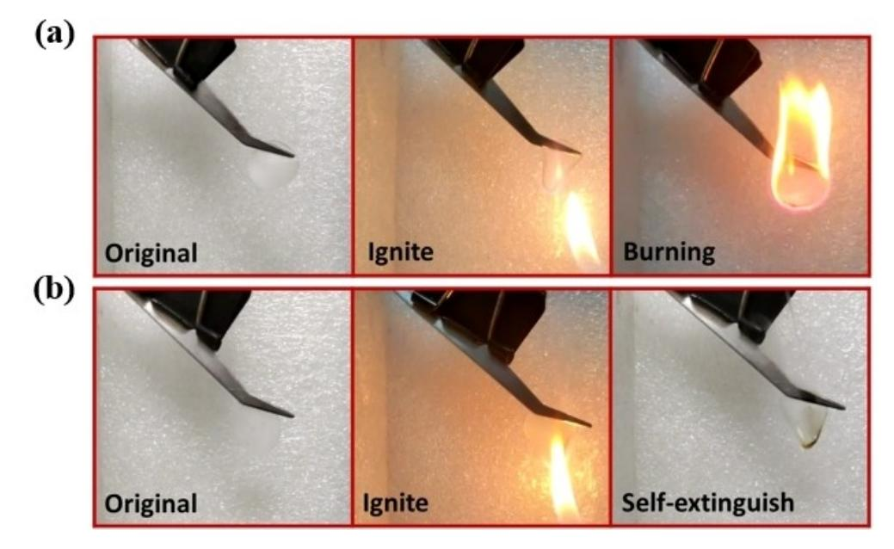
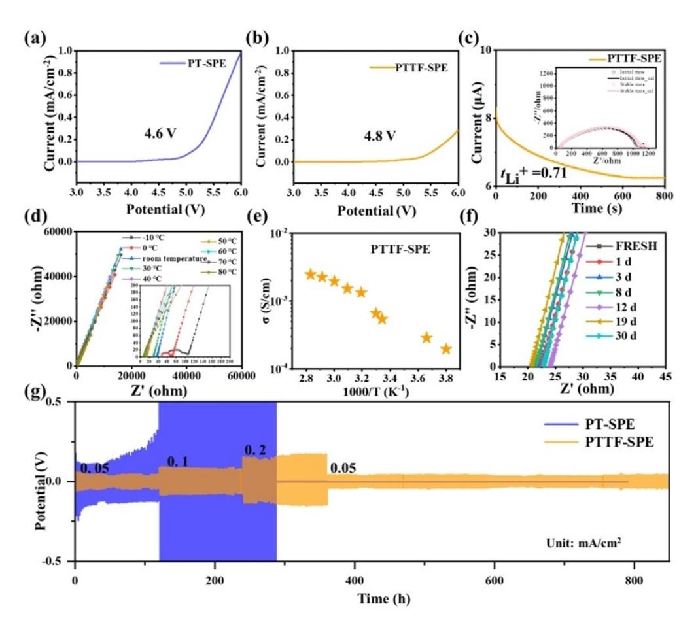
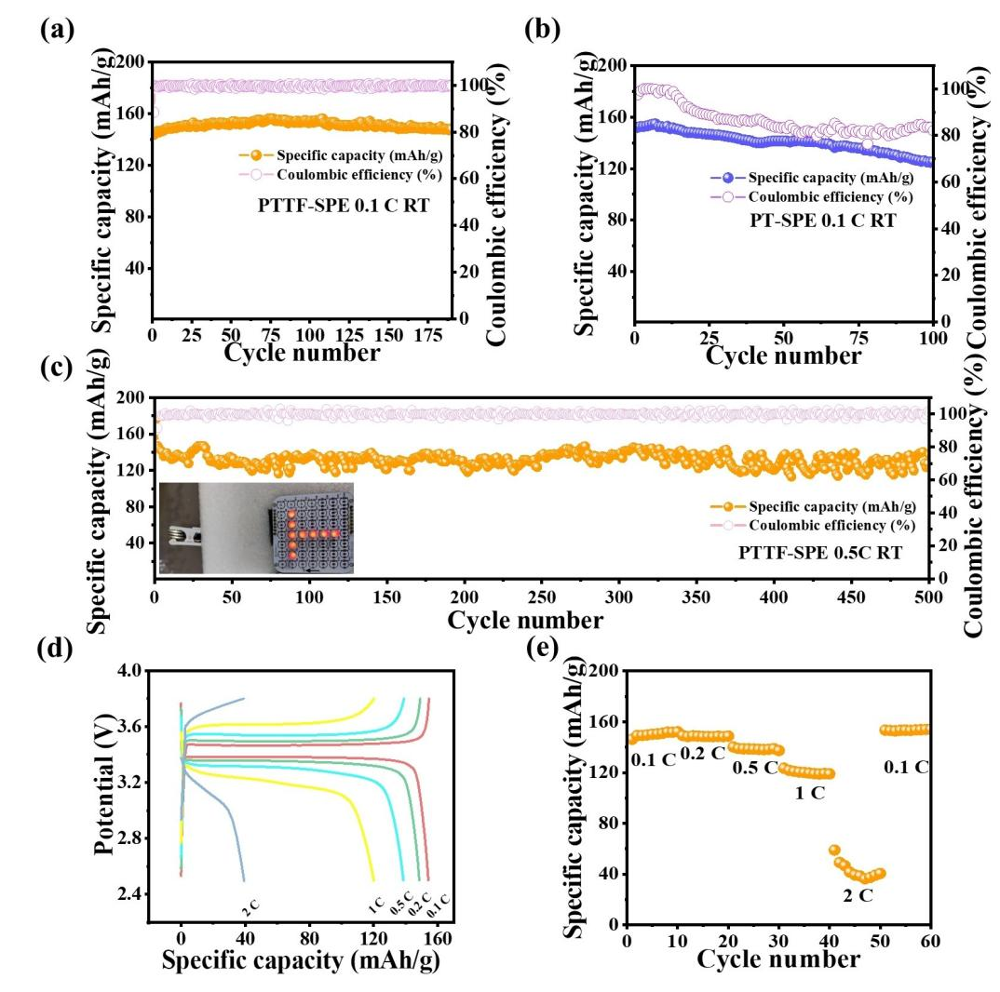
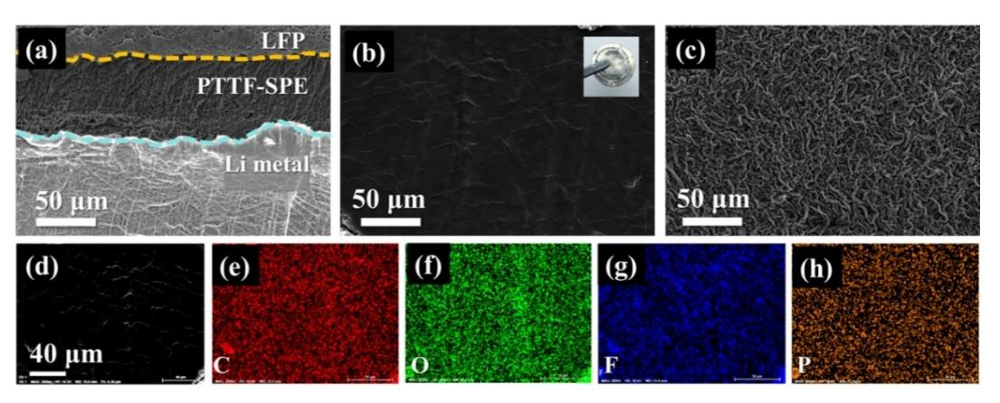
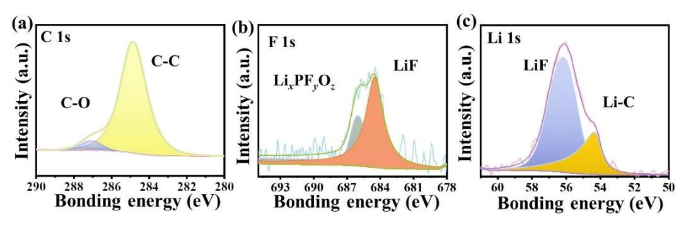

# **Self-Extinguishing and Low-Cost Quasi-Solid Polymer Electrolyte for Room Temperature Lithium Metal Batteries**

Xue-Tong Hu,[a] Shuang Chen,[a] [Peng-Fei](http://orcid.org/0000-0002-9705-3277) Wang,[a] [Yuhan](http://orcid.org/0000-0002-6288-2112) Wu,[a] [Fa-Nian](http://orcid.org/0000-0001-5057-5417) Shi,[a] and [Yu-Hang](http://orcid.org/0000-0003-1552-3376) Zhang\*[a]

Most modification strategies of polyethylene oxide (PEO)-based solid polymer electrolyte focus on improving the room temperature ionic conductivity, while disregarding its inherent flammability that poses substantial safety hazard. Herein, a selfextinguishing quasi-solid-state polymer electrolyte (PTTF-SPE), which combines excellent room temperature electrochemical properties and high safety, has been developed by introducing triethyl phosphate (TEP) as a low-cost and highly effective flame retardant. The cross-linking structure derived from CH2 CH2 O segments of tetramethylene glycol dimethyl ether (TEGDME) and PEO makes a contribution to a high amorphous state of polymer. A robust solid electrolyte inter-

# **Introduction**

In recent decades, the commercialization of lithium-ion batteries (LIBs) has significantly changed human life and become indispensable on practical application for various devices from smartphones to large energy storage.[1–4] As the demand for higher energy density advances, lithium metal batteries (LMBs) have emerged as a hot topic of research in recent years due to its attractive energy storage capacity.[5–8] However, LMBs based on liquid electrolyte poses significant safety hazards due to the major drawback of the flammability and leakage of organic components.[9–13] Therefore, the utilization of (quasi) solid-state electrolytes provides a realizable way to solve this dilemma, thus enhancing the battery safety and accessibility in use.[14–15]

Solid-state electrolytes commonly divided into three categories: inorganic solid electrolyte, solid polymer electrolyte, and their composites.[12,16–17] In general, inorganic solid electrolytes which include garnet-type LLZO and NASICON-type LATP exhibit broad electrochemical stability window, remarkable ionic conductivity (*>*10 4 S/cm), great mechanical performance and outstanding thermal stability at ambient temperature.[7,18–19] However, the rigidity of these electrolytes is plagued with a challenge in achieving close electrode-electrolyte contact, resulting in significant interface impedance that restricts their practical applications.[7,20–22]

Among the solid polymer electrolytes (SPEs), one of the prominent research areas is polyethylene oxide (PEO)-based polymer electrolytes.[12,23–24] Compared to inorganic solid elecphase (SEI) formed by preferential decomposition of fluoroethylene carbonate (FEC) that acts as a film-forming additive, which can prevent TEP from degradation at lithium metal anode. The optimized PTTF-SPE exhibits high ionic conductivity (0.54×10 3 S/cm) and lithium transference number (0.71) at room temperature. The LiFePO4 j j Li battery demonstrates excellent cycle life over 500 cycles at 0.5 C with a high average discharge capacity of 131 mAh/g. A symmetric Lij j Li battery that operating for 850 hours indicates a good compatibility of PTTF-SPE towards lithium metal. This work provides a new idea for developing high-energy-density and high-safety lithiummetal batteries (LMBs) for room temperature.

trolytes, the flexible PEO-based SPEs can offer a sufficient interfacial contact to afford transmission path for lithium ions across the interface.[25–26] However, at ambient temperature, the PEO chains prefer to arrange regularly to maintain a crystalline state, which usually prevents lithium ions from migrating resulting in a limited ionic conductivity, as well as a low lithiumion transference number.[12,27–28] Therefore, modification of the microstructure of PEO is necessary to enhance its room temperature performance, among which the fabrication of crosslinking structure is a valid way to promote the mobility of polymer chains.[12,29] Ultraviolet (UV)-derived crosslinking reaction has numerous advantages, such as environmentally friendly, high efficiency, low cost, and low energy consumption.[30–31] Previous works have reported that CH2 CH2 O ( EO ) chains can be motivated by UV irradiation to form a cross-linking structure and served as a room temperature SPE.[32–33] In spite of this, it still exists a challenge to avoid flammability issues on account of its organic ingredients. Therefore, it is imperative to enhance the safety performance while ensuring excellent electrochemical performance at ambient temperature.

Addition of flame retardants can be implemented to enhance the security of SPEs. Two commonly used types are halogen-based and phosphorus-based additive.[7,13] In a study conducted by Cui et al., decabromodiphenyl ethane (DBDPE) was introduced to prepare a flame-retardant polymer electrolyte on basis of porous polyimide (PI) skeleton, which shows outstanding cycling performance at 60°C with a specific capacity of 143 mAh/g at 0.5 C within 300 cycles. The assembled pouch cell can be able to operate normally even under flame exposure.[34] Compared with halogenbased flame retardants, phosphorus compounds have several advantages, such as low cost, significant flame retardancy, low toxicity, and good compatibility with polymers.[35] Among them,

[a] *X.-T. Hu, S. Chen, P.-F. Wang, Y. Wu, F.-N. Shi, Dr. Y.-H. Zhang School of Environmental and Chemical Engineering, Shenyang University of Technology, Shenyang 110870, China E-mail: zhangyh@sut.edu.cn*

*Batteries & Supercaps* **2024**, *7*, e202400118 (1 of 8) © 2024 Wiley-VCH GmbH

triethyl phosphate (TEP) is representative and widely used in liquid electrolyte systems.[36] However, it also suffers from a crucial drawback of poor compatibility with graphite and lithium metal during electrochemical process, leading to formation of an unstable solid electrolyte interface (SEI) layer on the anode.[9,37] Lee et al. successfully developed a non-flammable liquid electrolyte by dissolving lithium nitrate (LiNO3) in a mixed solution of TEP and fluoroethylene carbonate (FEC). This electrolyte exhibits a high electrochemical stability window, enabling the assembled Lij j Ni0.6Mn0.2Co0.2O2 (Lij jNMC622) battery to operate at 4.3 V with an average coulombic efficiency close to 100% and a capacity retention of 90% after 250 cycles.[38]

In the current work, a quasi-solid-state polymer electrolyte was developed for LMBs by incorporating TEP, tetramethylene glycol dimethyl ether (TEGDME) and FEC into PEO that combines safety and electrochemical performance. The introduction of low-cost and highly efficient TEP confers self-extinguishing properties to the polymer electrolyte, thus enhancing its safety. Furthermore, the synergistic combination of a crosslinked structure based on EO segments and the interface optimization resulting from FEC decomposition bestows the polymer electrolyte with outstanding electrochemical performance. The lithium-ion tansferance number (*t*Li+) can reach 0.71, and the ionic conductivity can rise to 0.54×10 3 S/cm. Due to the effect of FEC, a LiF-rich SEI layer is formed, enabling stable operation of the assembled Lij jLi symmetric battery at different current densities. This strategy offers a promising prospect for the development of high-energy density LMBs at room temperature.

# **Experimental Section**

#### **Materials**

Poly (ethylene oxide) (PEO, *M*w=1,000,000 g/mol), Tetraethylene glycol dimethyl ether (TEGDME, 99%), Triethyl phosphate (TEP,�99.5%), Fluoroethylene carbonate (FEC, �98%), N-methylpyrrolidone (NMP, �99.9%), Photoinitiator 4-methyldibenzophenone (MBP) were purchased from Aladdin; Lithium bis (trifluoromethanesulfonyl) imide (LiTFSI), Poly (vinylidene fluoride) (PVDF, *M*w=1,100,000 g/mol) were acquired from SOLVAY. LiFePO4 (LFP, type specification: XYLFP 10) was obtained from Jinneng Technology Co., Ltd. Acetylene carbon black was accessed from Temigao Graphite Co., Ltd. All materials were used directly without any purification.

## **Preparation of PTTF Polymer Electrolyte**

A mixture was obtained by adding PEO and TEGDME into a solution of TEP and FEC (v/v=7:3) with a mass ratio of 4:3:4 under magnetic stirring. Subsequently, a suitable amount of LiTFSI (EO:Li+ =20:1) and appropriate photoinitiator MBP (7.5 wt% of the total weight) were incorporated to get a homogeneous system. The reactants were then poured onto a poly (tetrafluoroethylene) (PTFE) plate and heated at 70°C until a transparent precursor was obtained. The precursor was hot-pressed at 2 MPa and exposed to ultraviolet (UV) light for 12 minutes, resulting in a translucent state, named PTTF-SPE. The sample of PEO-TEGDME SPE (PT-SPE) was prepared in the same way as PTTF-SPE without the solvent of TEP and FEC. The obtained polymer electrolyte should be stored in a dry environment.

### **Characterizations**

The crystallinity of the SPEs was tested using X-ray diffraction (XRD) on MiniFlex600 instrument (RIKEN, Japan) within 2*θ* range of 10°–90° by a scanning rate of 5°/min, with Cu-K*α* radiation (*λ*=0.15405 nm) at an operating voltage of 40 kV and a current of 15 mA. The morphology was revealed using field emission scanning electron microscope (FESEM) on Thermo Scientific Apreo 2 C equipped with a Bruker QUANTAX XFlash730 energy-dispersive X-ray spectroscopy (EDS). Mechanical properties were acquired by preparing 50×20 mm strips and conducted on an electronic universal testing machine (UTM5305, China). All tests were controlled by a model at a speed of 5 mm/min. Thermal stability was performed on a thermogravimetric analysis Q50 instruments (TA Instruments, USA) at a heating rate of 10°C/min from room temperature to 700°C under N2 conditions. The degree of cross-linking was obtained by soaking the electrolyte in ACN for 24 h to remove the other substance, then the solvent was removed in a vacuum oven at 60°C for 12 h, and finally calculated the mass difference of PTTF-SPE before and after soaking. Differential scanning calorimetry (DSC) measurement was carried out on DSC 214 Polyma (NETZSCH, Germany) by first scanning down to 80°C and then heating to 100°C with a ramp rate of 10°C/ min. X-ray photoelectron spectroscopy (XPS) analysis was conducted with Al-K*α* radiation on Thermo Scientific Escalab 250Xi. The samples for XPS analysis were carefully preserved in a vacuum environment in order to minimize the influence of water and oxygen on the test results.

Electrochemical stability window (ESW) was determined through linear sweep voltammetry (LSV) from OCV to 6 V at a scan rate of 1 mV/s using a LijSPEjSS battery at room temperature on CHI660E electrochemical workstation (CHI, Chenhua Shanghai). The ionic conductivity was tested and calculated through electrochemical impedance spectroscopy (EIS) within the frequency range from 1 MHz to 0.1 Hz between 10°C to 80°C.[39] The measurements were carried out by SSjSPEjSS cells on CHI660E electrochemical workstation. Lithium-ion transference number (*t*Li +) was obtained by a method combining chronoamperometry and EIS measurements before and after polarization using a Lij SPEjLi symmetric battery at room temperature.[40] To evaluate the stability of the electrolyte, SSj jSS battery was assembled and the cell impedances were monitored at different time intervals. The behavior of Li stripping/plating were determined through LijSPEjLi symmetric battery under different current densities. LiFePO4 was adopted as cathode material to assembly LiFePO4 jSPEjLi cells for measuring cell performances on the Neware battery testing system (CT-4008 T, NEWARE, China).

# **Results and Discussion**

By ultraviolet (UV) irradiation, the CH2 CH2 O ( EO ) segments can generate free radicals and link to another active site to form a crosslinking network, which will induce the rearrangement of polyethylene oxide (PEO) chains to decrease the polymer crystallinity.[32] As a result, a polymer-based solid electrolyte with high ionic conductivity can be obtained and it has no risk of leakage. However, the organic-based agent still presents a challenge to the safety of batteries due to its flammable property. As shown in Figure 1, triethyl phosphate (TEP), fluoroethylene carbonate (FEC) are introduced into a crosslinking system that composed of PEO and tetraethylene glycol dimethyl ether (TEGDME). The addition of TEP can not only inhibit flammability of electrolyte membrane, but also increase the solubility of lithium salt. However, the intrinsic instability of TEP makes it prone to decompose on Li metal.[41] Thus, FEC is introduced to suppress the adverse reactions between TEP and Li by generating a stable SEI (solid electrolyte interface) layer in

*Batteries & Supercaps* **2024**, *7*, e202400118 (2 of 8) © 2024 Wiley-VCH GmbH

**Figure 1.** Schematic diagram of the PTTF-SPE preparation process.

advance.[42] Subsequently, the prepared PTTF-SPE exhibits both good room temperature electrochemical performance and remarkable reliability.

The UV-curing time is determined by different exposure duration as displayed in Figure 2a. A short time initiation leads to an incomplete reaction and results in a sticky form of the precursor mixture. At 6 mins, it starts to build film with a limited mechanical strength due to a low degree crosslinking. The dimensional stability rises with time extension, and the final membrane-forming time was selected at 12 mins. From Figure 2b, it can be observed that the prepared PTTF-SPE exhibits a semi-transparent, uniform, and elastic state. This flexible characteristic can improve the solid-solid contact between electrode and electrolyte. The microstructure of membrane surface that represented in Figure 2c shows a nonuniform wrinkling distribution of the PT-SPE. In contrast, PTTF-SPE (Figure 2d) displays a highly disordered and dense wrinkling morphology, which indicates an enhanced amorphous state of polymer substrate.

To further confirm the crystallinity of polymer electrolytes, results can be visually detected through XRD pattern (X-ray

**Figure 2.** Digital photograph of (a) different UV-curing time and (b) the PTTF-SPE membrane. FESEM images of (c) PT-SPE and (d) PTTF-SPE (photographs inserted). (e) XRD patterns of PT-SPE and PTTF-SPE. (f) Stress-strain curves of PT-SPE and PTTF-SPE. (g) DSC and (h) TGA curves of PTTF-SPE.

diffraction). As shown in Figure 2e, two characteristic peaks appear at 2*θ*=18.9° and 23.1°correspond to PEO (JCPDS# 49–2201). The sharper XRD pattern of PT-SPE indicates a semi-crystalline state at room temperature. In comparison, the entire pattern of PTTF-SPE displays a broad peak with less pronounced peaks. This suggests that the crystallinity of PTTF-SPE is reduced at room temperature, making it easier for polymer chains to migrate.This is beneficial for the enhancement of ion conductivity. In order to reveal the mechanical strength of obtained solid polymer electrolytes (SPEs), tensile property tests of both samples were carried out. The results in Figure 2f illustrate a raised elongation rate of PTTF-SPE, which can reach an impressive value of 443%. A good flexibility can ensure tight contact between solid electrolyte and electrode interface to reduce interfacial resistance and adjust to volume change during cycling. Moreover, an excellent rigidity can suppress lithium dendrite growth, thereby preventing short circuits.

The melting point (*T*m) of PTTF-SPEwas determined through differential scanning calorimetry (DSC) test (Figure 2g). The *T*m decrease of PTTF-SPE compared with PEO (at about 60°C) implies an superior capability of segment motion in an increased area of amorphous region at room temperature. This phenomenon could be attributed to the formation of a cross-linked structure and the incorporation of liquid components. A larger free volume for polymer chains can supply a faster migraion of Li+-ions. Thermogravimetric analysis (TGA) was executed to appraise thermal stability of PTTF-SPE. From Figure 2h, it can be seen that there is a slight weight loss before 100°C, which can be attributed to trace moisture asbsorption during the preparation process. The first weight loss region occurs approximately between 100°C and 260°C, which can be attributed to the elimination of unreacted TEGDME and addtives (FEC and TEP). The second weight loss of 39% between 335°C and 455°C can be assigned to the decomposition of the cross-linked structure and LiTFSI (10 wt.%) system, which matches well with the calculated result of the cross-linking degree. The thermal analysis results manifest that a moderate addition of liquid components does not significantly adversely affect the thermal stability of the cross-linked structure.

Figure 3a illustrates a intense combustion of PT-SPE upon exposure to a fire source. In contrast, the PTTF-SPE membrane shown in Figure 3b can quickly self-extinguish after igniting. This pronounced behavior can be primarily attributed to the presence of TEP with high flame-retardant efficiency, while the inherent nonflammability of FEC can also serve to suppress the impact of organic constituents and enhance the overall safety performance.

Electrochemical properties are shown in Figure 4. The electrochemical stability window (ESW) is a crucial parameter for electrolyte, which can determine the selection of cathode material and directly influence the energy density of batteries. As shown in Figure 4a–b, PTTF-SPE can maintain stable within 4.8 V under a inert stainless steel electrode. The broadening of ESW for PTTF-SPE can be contributed to the introduction of FEC, which has excellent resistance to oxidation due to the existence of fluorine (F) element. It has been proven that F element exhibits excptionally high electronegativity and minimal polariztion resulting in lower highest occupied molecular orbital (HOMO) and lowest unoccupied molecular orbital (LUMO). The lower HOMO value of FEC leads to a stronger oxidation resistance, and a lower LUMO value induces its decomposition prior to TEP during the anode process.[43–44] A high lithium transferance number (*t*Li +) is beneficial for reducing polarization inside cells and also improving the rate performance. On the contrary, a low *t*Li + will lead to uneven deposition of Li+-ions, threatening the sercurity of batteries for long lifespan. Remarkably, the *t*Li + for PTTF-SPE can reach a value of 0.71 (Figure 4c).The reason for such a high *t*Li + can be firstly attributed to the introduction of FEC and TEP, which can facilitate the dissociation of lithium salts, thereby releasing more free Li+-ions. Secondly, FEC and TEP can coordinate with Li+-ions to assist in facilitating the lithium ion migration.[45–46] Additionally, the electronegativity of F in FEC can attract Li+-ions and prevent them from trapping by CH2 CH2 O .

**Figure 3.** The combustion experiments of (a) PT-SPE and (b) PTTF-SPE.

**Figure 4.** ESW of (a) PT-SPE and (b) PTTF-SPE. (c) Chronoamperometry curve of the symmetric LijPTTF-SPE j Li battery with a polarization potential of 10 mV at room temperature. (Inset shows the impedance response before and after chronoamperometry test). (d) Nyquist plots of PTTF-SPE in the frequency range of 1.0 MHz–0.1 Hz from 10 to 80°C. (Inset: magnified high frequency region) (e) Arrhenius plots of ionic conductivity of PTTF-SPE. (f) Nyquist plots of SS jPTTF-SPE j SS symmetric battery with time. (g) The voltage profiles of Lij j Li symmetric batteries at different current densities of PT-SPE and PTTF-SPE.

Figure 4d and Figure 4e shows the EIS impedance and Arrhenius plot of PTTF-SPE measured at different temperatures. For different region, the impedance curves differs. The arc at high frequency region, which represents to the resistance of electrolyte disappers with the increasing of temperature. This result demonstrates that the motion of polymer chains can be accelerated obviously over room temperature. At low temperature range under 0°C, the frozen polymer chains and solidified FEC solvent restrict the migraition of Li+-ions with a large resistance value. At moderate temperature around *T*m, the rigid segments loosening gradually to provide a continuous path for Li+-ions transference. When the temperature rises further, enough movement space is available for polymeric segmental relaxation, resulting in a low resistance and a high ionic conductivity. The ionic conductivity of PTTF-SPE at room temperature is 5.4×10 4 S/cm, which can satisfy the standard oprating requirement of electrolyte.

To understand the stability of PTTF-SPE itself, an SSjPTTF-SPEj SS cell was assembled and its impedance was monitored within one month (Figure 4f). It can be found that the impedance remained stable at 23�2 Ω, indicating an excellent stability of PTTF-SPE in an inert enviorment. In order to further explore the interfacial compatibility and study the behavior of Li deposition and dendrite formation, LijSPEjLi symmetric cells were assembled and characterized under different current densities. As shown in Figure 4g, the Li+ deposition and stripping potential profile of PT-SPE at a low current density of 0.05 mA/cm2 exhibits an asymmetric overpotential with time, which indicates an irreversible Li+ deposition behavior. Moreover, as the current density increases, the overpotential rapidly increases until a short circuit occurs at 287 h. The unrecoverable profile when returning to low current density manifests a serious damage of PT-SPE. In contrast, the minimal and symmetrical overpotential at different current densities demonstrates a steady operation for 850 hours. Therefore, it can be concluded that PTTF-SPE exhibits excellent compatibility with lithium metal, and its good mechanical property can restrict lithium dendrite growth and ensure a good contact.

LiFePO4 jSPEjLi full cells were assmbled and subjected to room temperature cycling tests. In Figure 5a, the cell performance of PTTF-SPE exhibits an average discharge specific capacity of 151 mAh/g at 0.1 C with a coulombic efficiency approaching 100%. No observed capacity decay occurs within 190 cycles. In contrast, the cell performance of PT-SPE displays an apparently capacity decline (Figure 5b). Long-term cycle performance of PTTF-SPE was measured at a higher rate of 0.5 C and the result is shown in Figure 5c. It can be seen that the PTTF-SPE exhibits an anverage discharge capacity of 131 mAh/g with a high coulombic efficiency

**Figure 5.** The cell performances of LiFePO4 j SPE j Li batteries tested at room temperature: Cycle performance of (a) PTTF-SPE and (b) PT-SPE tested at 0.1 C. (c) Long-term cycling performance of LiFePO4 jPTTF-SPE j Li cell at 0.5 C (inserted: The LED lights lightened by LiFePO4 jPTTF-SPE j Li cells) (d) Representative charge/discharge profiles of PTTF-SPE at different rates. (e) Rate performance of LiFePO4 jPTTF-SPE j Li cells.

allabove 96.5%. Fluctuations in discharge specific capacity is observed, which primarily due to environmental temperature changes during testing. Nevertheless, a high capacity retetion of 86% can be obtained after 500 cycles. The inserted image in Figure 5c demonstrates that an arrangement of cells in series can illume a 9 V LED lamp at ambient temperature. The representative galvanostatic charge-discharge cuves and rate performance of PTTF-SPE are presented in Figure 5d and Figure 5e, respectively. It can be seen that PTTF-SPE exhibits a less polarization and higher discharge capacity above 150 mAh/g at low rates of 0.1 and 0.2 C. With the increase of rate, the difference of potential grows because of a hysteresis for lithium ions imigration, which indicates a slow ionic conducivity of PTTF-SPE at high current densities due to the limitation of segment mobility. An available discharge capacity of 120 mAh/g can be achieved at 1 C. However, a sharp decline occurs for 2 C rate with only 40 mAh/g can be remained. When the C-rate return to 0.1 C after cycling at high current densities, the capcity can regain of a value of 153 mAh/g. The recovery demonstrates that the drop of capacity is principally due to the restricted kinetics of lithium-ion migration, rather than structural damage.

To verify the results of aforementioned tests, LiFePO4 j jLi cells and Lij jLi symmetric cells after cycling were disassembled and the microtopography for different components inside cell were revealed by field emission scanning electron microscope (FESEM) tests. The close contact and clear interfaces between PTTF-SPE and electrodes manifested in Figure 6a indicates an excellent flexibility of PTTF-SPE, which facilitate a low contact resistance of LFPjPTTF-SPEjLi cells. Figure 6b displayed the lithium metal surface of the symmetric cell after cycling, and the inset photograph demonstrates that even after 850 hours of cycling, the lithium metal surface still retains a pristine metallic luster. Morewover,it also reveals a smooth surface with no noticeable particles formed by Li+ deposition. The top view of PTTF-SPE membrane surface after cycling (Figure 6c) remains nearly identical to that of original film. It implies a continious and reversible lithium ions transfer in process, which can avoid the formation of Li dentrite to ensure the security of lithium metal batteries. Figure 6d–h presented the elemental analysis of the

**Figure 6.** FESEM images of (a) Cross section of LiFePO4 jPTTF-SPE j Li cell after 100 cycles at 0.1 C. LijPTTF-SPE j Li cell after cycles for 850 hours: (b) Li-metal; (c) PTTF-SPE. (d–h) EDS patterns of the original image and elements (C, O, F, P).

lithium metal, indicating a uniform distribution of elements and the formation of a relatively uniform SEI layer. The presence of F in EDS (Energy-dispersive X-ray Spectroscopy) results suggests the formation of an lithium fluoride (LiF)-rich SEI. Although the SEI layer contains phosphorus (P), indicating the decomposition of TEP, the experimental results suggest that the small amount of TEP decomposition byproducts did not affect the cell performance.

To further investigate the interphase at electrolyte/Li anode contact surface, XPS (X-ray Photoelectron Spectroscopy) analysis was conducted on the lithium metal surface of a symmetric cell. As shown in Figure 7. It can be observed that the SEI layer formed during the cycling process is rich in various organic and inorganic components. In particular, peaks corresponding to LiF are detected in both the F 1s and Li 1s spectra, which gives evidence of the preferential decomposition of FEC and lead to the formation of a large amount of LiF. The absence of detected detrimental decomposition products of TEP indicates that the decomposition of TEP has been effectively suppressed. This LiF-rich SEI layer facilitates uniform diffusion and deposition of lithium ions, thereby positively contributing to the cycling stability and safety of the battery.[47–48]

polymer-based electrolyte (PTTF-SPE) with combined mechanical, electrochemical, and safety properties. TEP is adapted not only as a flame retardant to enhance the safety performance, but also performed as a plasticizer to improve the dissociation of lithium salts and release more free Li+-ions. The introduction of TEGDME as a cross-linking agent can interact with PEO to form a crosslinking structure and reduce the regular arrangement of PEO chains. FEC as a film-forming additive, can react firstly to form a robust SEI layer, thus preventing TEP from decomposition. Additionally, FEC weakens the interaction between CH2 CH2 O segments and Li+ ions, thereby accelerating the fast transport of Li+ ions. Consequently, the optimized polymer electrolyte exhibits a high ionic conductivity of 0.54×10 3 S/cm at room temperature and a high lithium-ion transference number of 0.71. The assembled LiFePO4 jPTTF-SPEjLi battery demonstrates high discharge capacity (*>*150 mAh/g at 0.1 C) and long lifespan (0.5 C, 500 cycles). The symmetric LijPTTF-SPEjLi battery demonstrates stable operation for over 850 hours, indicating that the electrolyte membrane can effectively suppress the growth of lithium dendrites. This study offers a innovative method for high-energy-density and high-safety lithium-metal batteries for room temperature.

# **Conclusions**

In this study, a solvent-free and low-energy-consuming UV-derived method was used to prepare a self-extinguishing quasi-solid

**Figure 7.** The XPS of Li metal analysis of various elements after cycling: (a) C 1s. (b) F 1s. (c) Li 1s.

## *Acknowledgements*

The authors acknowledge the projects 21571132 supported by the National Natural Science Foundation of China.

## *Conflict of Interests*

The authors declare that they have no known competing financial interests or personal relationships that could have appeared to influence the work reported in this paper.

# *Data Availability Statement*

The data that support the findings of this study are available from the corresponding author upon reasonable request.

**Keywords: keywords**: lithium metal batteries, quasi-solid polymer electrolyte, UV-curing, self-extinguishing

- [1] H. Wang, C. J. Yao, H. J. Nie, K. Z. Wang, Y. W. Zhong, P. W. Chen, S. L. Mei, Q. C. Zhang, *J. Mater. Chem. A* **2020**, *8*, [11906–11922](https://doi.org/10.1039/D0TA03321A).
- [2] Y. X. Zhang, B. R. Wu, G. Mu, C. W. Ma, D. B. Mu, F. Wu, *J. [Energy](https://doi.org/10.1016/j.jechem.2021.04.013) Chem.* **2022**, *64*, [615–650.](https://doi.org/10.1016/j.jechem.2021.04.013)
- [3] J. H. Li, Y. F. Cai, H. M. Wu, Z. Yu, X. Z. Yan, Q. H. Zhang, T. D. Z. Gao, K. Liu, X. D. Jia, Z. N. Bao, *Adv. Energy Mater.* **2021**, *11*, 2003239.
- [4] M. Ye, X. Hao, J. Zeng, L. Li, P. Wang, C. Zhang, L. Liu, F. Shi, Y. Wu, *Journal of [Semiconductors](https://doi.org/10.1088/1674-4926/45/2/021801)* **2024**, *45*, 021801.
- [5] D. Wang, J. Qiu, N. Inui, R. Hagiwara, J. Hwang, K. Matsumoto, *[ACS](https://doi.org/10.1021/acsenergylett.3c02105) Energy Lett.* **2023**, *8*, [5248–5252](https://doi.org/10.1021/acsenergylett.3c02105).
- [6] S. X. Xia, C. W. Yang, Z. Y. Jiang, W. X. Fan, T. Yuan, Y. P. Pang, H. Sun, T. Q. Chen, X. Li, S. Y. Zheng, *Adv. Compos. Hybrid Mater. 2023, 6, 198*.
- [7] L. Wu, F. Pei, D. Cheng, Y. Zhang, H. Cheng, K. Huang, L. Yuan, Z. Li, H. Xu, Y. Huang, *Adv. Funct. Mater.* **2023**, *34*, 2310084.
- [8] W. Zou, J. Zhang, M. Liu, J. Li, Z. Ren, W. Zhao, Y. Zhang, Y. Shen, Y. Tang, *Adv. Mater.* **2024**, *36*, 2400537.
- [9] A. R. Pan, Z. C. Wang, F. R. Zhang, L. Wang, J. J. Xu, J. Y. Zheng, J. C. Hu, C. L. Zhao, X. D. Wu, *Nano Res.* **2023**, *16*, [8260–8268.](https://doi.org/10.1007/s12274-022-4655-1)
- [10] J. Ju, S. Dong, Y. Cui, Y. Zhang, B. Tang, F. Jiang, Z. Cui, H. Zhang, X. Du, T. Lu, L. Huang, G. Cui, L. Chen, *Angew. Chem. Int. Ed.* **2021**, *60*, [16487–](https://doi.org/10.1002/anie.202103209) [16491.](https://doi.org/10.1002/anie.202103209)
- [11] C. Ma, X. Y. Ni, Y. Q. Zhang, Q. B. Xia, L. J. Zhou, L. B. Chen, Y. G. Lai, X. B. Ji, C. L. Yan, W. F. Wei, *Matter* **2022**, *5*, [2225–2237](https://doi.org/10.1016/j.matt.2022.04.017).
- [12] G. L. Wang, X. Y. Zhu, A. Rashid, Z. L. Hu, P. F. Sun, Q. B. Zhang, L. Zhang, *J. Mater. Chem. A* **2020**, *8*, [13351–13363.](https://doi.org/10.1039/D0TA00335B)
- [13] Z. Li, S. Weng, J. Fu, X. Wang, X. Zhou, Q. Zhang, X. Wang, L. Wei, X. Guo, *Energy Storage Mater.* **2022**, *47*, [542–550](https://doi.org/10.1016/j.ensm.2022.02.045).
- [14] M. Jagan, S. P. Vijayachamundeeswari, *J. Polym. Res.* **2023**, *30*, 250.
- [15] J. Yang, Z. Cao, Y. Chen, X. Liu, Y. Xiang, Y. Yuan, C. Xin, Y. Xia, S. Huang, Z. Qiang, K. K. Fu, J. Zhang, *ACS Nano* **2023**, *17*, [19903–19913.](https://doi.org/10.1021/acsnano.3c04610)
- [16] T. Q. Yang, C. Wang, W. K. Zhang, Y. Xia, H. Huang, Y. P. Gan, X. P. He, X. H. Xia, X. Y. Tao, J. Zhang, *J. Energy Chem.* **2023**, *84*, [189–209](https://doi.org/10.1016/j.jechem.2023.05.011).
- [17] H. M. Liang, L. Wang, A. P. Wang, Y. Z. Song, Y. Z. Wu, Y. Yang, X. M. He, *Nano-Micro Lett.* **2023**, *15*, 42.
- [18] L. Z. Fan, H. C. He, C. W. Nan, *Nat. Rev. Mater.* **2021**, *6*, [1003–1019.](https://doi.org/10.1038/s41578-021-00320-0)
- [19] Y. Chen, J. Qian, L. Li, F. Wu, R. J. Chen, *Chem. Eur. J.* **2024**, *30*, e202303454.

- [20] L. Xi, D. C. Zhang, X. J. Xu, Y. W. Wu, F. K. Li, S. Y. Yao, M. Zhu, J. Liu, *ChemSusChem* **2023**, *16*, e202202158.
- [21] S. Chen, C. Yu, C. Wei, Z. Jiang, Z. Zhang, L. Peng, S. Cheng, J. Xie, *Energy Mater. Adv.* **2023**, *4*, 0019.
- [22] H. He, L. Wang, M. Al-Abbasi, C. Cao, H. Li, Z. Xu, S. Chen, W. Zhang, R. Li, Y. Lai, Y. Tang, M. Ge, *Energy Environ. Mater.* **2024**, Volume is unavailable, e12699.
- [23] W. H. Hou, Y. Ou, K. Liu, *Chem. Res. Chin. Univ.* **2022**, *38*, [735–743.](https://doi.org/10.1007/s40242-022-2065-2)
- [24] J. H. Zhang, S. Y. Li, X. Y. Wang, S. L. Mao, J. Z. Guo, Z. Y. Shen, J. L. Mao, Q. Wu, K. Shen, H. Cheng, Y. Z. Tan, Y. Y. Lu, *Adv. Energy Mater.* **2023**, *14*, 2302587.
- [25] W. Liu, G. Li, W. Yu, L. Gao, D. Shi, J. Ju, N. Deng, W. Kang, *Energy [Storage](https://doi.org/10.1016/j.ensm.2023.103005) Mater.* **2023**, *63*, [103005.](https://doi.org/10.1016/j.ensm.2023.103005)
- [26] M. Liu, S. N. Zhang, E. R. H. van Eck, C. Wang, S. Ganapathy, M. Wagemaker, *Nat. [Nanotechnol.](https://doi.org/10.1038/s41565-022-01162-9)* **2022**, *17*, 959–967.
- [27] Y. Wei, T. H. Liu, W. J. Zhou, H. Cheng, X. T. Liu, J. Kong, Y. Shen, H. H. Xu, Y. H. Huang, *Adv. Energy Mater.* **2023**, *13*, 2203547.
- [28] C. C. Wei, S. Q. Chen, C. Yu, R. Wang, Q. Y. Luo, S. Chen, Z. K. Wu, C. X. Liu, S. J. Cheng, J. Xie, *Appl. Mater. Today* **2023**, *31.* 101770.
- [29] W. Bao, Y. Zhang, L. Cao, Y. Jiang, H. Zhang, N. Zhang, Y. Liu, P. Yan, X. Wang, Y. Liu, H. Li, Y. Zhao, J. Xie, *Adv. Mater.* **2023**, *35*, 2304712.
- [30] J. R. Nair, C. Gerbaldi, M. Destro, R. Bongiovanni, N. Penazzi, *React. [Funct.](https://doi.org/10.1016/j.reactfunctpolym.2010.12.007) Polym.* **2011**, *71*, [409–416](https://doi.org/10.1016/j.reactfunctpolym.2010.12.007).
- [31] Y. H. Zhang, W. Lu, L. N. Cong, J. Liu, L. Q. Sun, A. Mauger, C. M. Julien, H. M. Xie, J. Liu, *J. Power [Sources](https://doi.org/10.1016/j.jpowsour.2019.02.090)* **2019**, *420*, 63–72.
- [32] L. Porcarelli, C. Gerbaldi, F. Bella, J. R. Nair, *Sci. Rep.* **2016**, *6*, 19892.
- [33] Y. Ji, Y. H. Zhang, F. N. Shi, L. N. Zhang, *J. Colloid [Interface](https://doi.org/10.1016/j.jcis.2022.09.089) Sci.* **2023**, *629*, [492–500](https://doi.org/10.1016/j.jcis.2022.09.089).
- [34] Y. Cui, J. Y. Wan, Y. S. Ye, K. Liu, L. Y. Chou, *Nano Lett.* **2020**, *20*, [1686–](https://doi.org/10.1021/acs.nanolett.9b04815) [1692.](https://doi.org/10.1021/acs.nanolett.9b04815)
- [35] H. Wang, L. Nie, X. Chu, H. Chen, R. Chen, T. Huang, Q. Lai, J. Zheng, *Small Methods* **2023**, Volume is unavailable, 2301104.
- [36] Z. C. Wang, R. Han, H. Y. Zhang, D. Huang, F. R. Zhang, D. S. Fu, Y. Liu, Y. M. Wei, H. Q. Song, Y. B. Shen, J. J. Xu, J. Y. Zheng, X. D. Wu, H. Li, *Adv. Funct. Mater.* **2023**, *33*, 2215065.
- [37] G. X. Jiang, J. D. Liu, Z. S. Wang, J. M. Ma, *Adv. Funct. Mater.* **2023**, *33*, 2300629.
- [38] H. Dinh Nguyen, T. Duong Pham, A. Bin Faheem, H. Min Oh, K.-K. Lee, *Batteries & Supercaps* **2023**, *6*, e202200453.
- [39] Z. Gadjourova, Y. G. Andreev, D. P. Tunstall, P. G. Bruce, *[Nature](https://doi.org/10.1038/35087538)* **2001**, *412*, [520–523.](https://doi.org/10.1038/35087538)
- [40] J. Evans, C. A. Vincent, P. G. Bruce, *Polymer* **1987**, *28*, [2324–2328.](https://doi.org/10.1016/0032-3861(87)90394-6)
- [41] K. R. Deng, Q. G. Zeng, D. Wang, Z. Liu, G. X. Wang, Z. P. Qiu, Y. F. Zhang, M. Xiao, Y. Z. Meng, *Energy Storage Mater.* **2020**, *32*, [425–447](https://doi.org/10.1016/j.ensm.2020.07.018).
- [42] C. Liao, L. F. Han, W. Wang, W. Q. Li, X. W. Mu, Y. C. Kan, J. X. Zhu, Z. Gui, X. M. He, L. Song, Y. Hu, *Adv. Funct. Mater.* **2023**, *33*, 2212605.
- [43] N. Xu, J. Shi, G. Liu, X. Yang, J. Zheng, Z. Zhang, Y. Yang, *J. Power [Sources](https://doi.org/10.1016/j.powera.2020.100043)* **2021**, *7*, [100043](https://doi.org/10.1016/j.powera.2020.100043).
- [44] J. Liu, X. W. Shen, J. Q. Zhou, M. F. Wang, C. Q. Niu, T. Qian, C. L. Yan, *ACS Appl. Mater. Interfaces* **2019**, *11*, [45048–45056](https://doi.org/10.1021/acsami.9b14147).
- [45] C. K. Fu, X. Zhang, H. Huo, J. M. Zhu, H. F. Xu, L. G. Wang, Y. L. Ma, Y. Z. Gao, G. P. Yin, P. J. Zuo, J. Lu, *Adv. Funct. Mater.* **2023**, *34*, 2312187.
- [46] T. L. Zheng, B. Y. Zhu, J. W. Xiong, T. H. Xu, C. Zhu, C. Liao, S. S. Yin, G. J. Pan, Y. X. Liang, X. T. Shi, H. B. Zhao, R. Berger, Y. J. Cheng, Y. G. Xia, P. Müller-Buschbaum, *Energy [Storage](https://doi.org/10.1016/j.ensm.2023.102782) Mater.* **2023**, *59*, 102782.
- [47] Z. Cheng, Y. Chen, L. Shi, M. Wu, Z. Wen, *ACS Appl. Mater. [Interfaces](https://doi.org/10.1021/acsami.2c18224)* **2023**, *15*, [10585–10592](https://doi.org/10.1021/acsami.2c18224).
- [48] S. Y. Sun, N. Yao, C. B. Jin, J. Xie, X. Y. Li, M. Y. Zhou, X. Chen, B. Q. Li, X. Q. Zhang, Q. Zhang, *Angew. Chem. Int. Ed.* **2022**, *61*, e202208743.

Manuscript received: February 23, 2024 Revised manuscript received: April 7, 2024 Accepted manuscript online: May 20, 2024 Version of record online: July 4, 2024