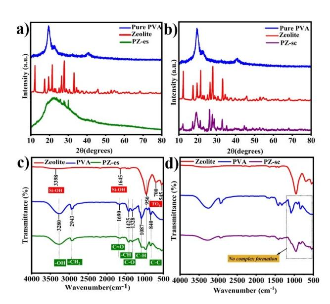
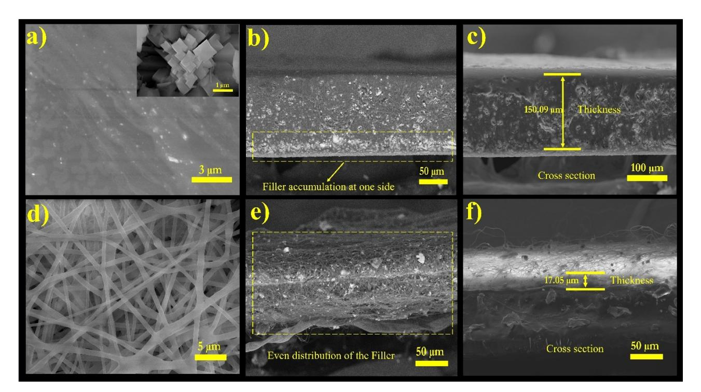
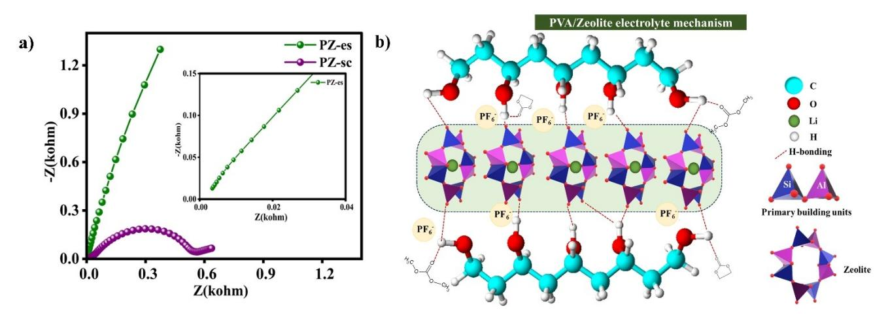
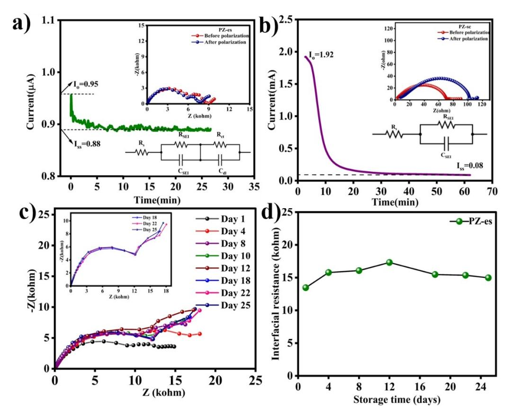
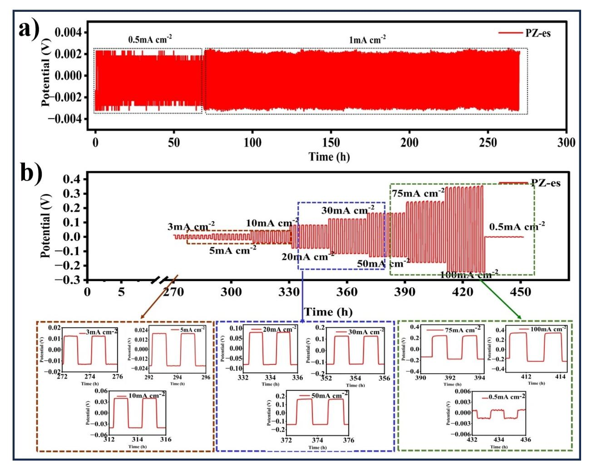
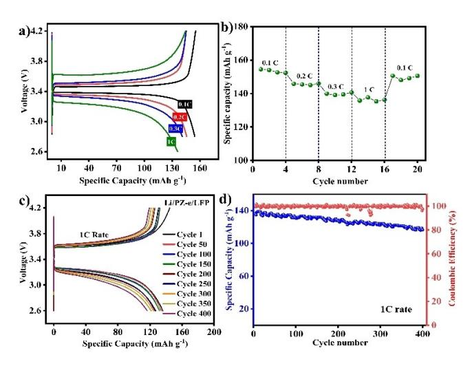
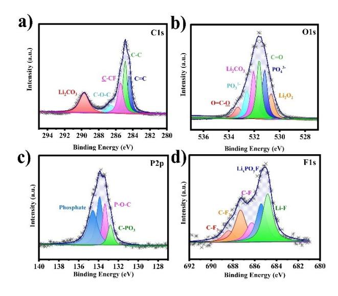

# **Electrospun Quasi-Composite Polymer Electrolyte with** Hydoxyl-Anchored Aluminosilicate Zeolitic Network for **Dendrite Free Lithium Metal Batteries**

Jenny Johnson, [a] Sajan Raj Sasirajan Littleflower, [b] Kumaran Vediappan, [b] and Helen Annal Therese\*[a]

All-solid-state lithium metal batteries have reshaped emerging safe battery technologies. However, their low metal ion transport and unstable electrode electrolyte interface make their mass production a huge question. To bridge the emerging solid state and traditional liquid electrolytes, we focus on Quasi-Composite Polymer electrolytes (QCPE). Herein, we develop QCPE with active 3D alumino-silicate zeolitic ion conduction pathways embedded in a polymer matrix using two techniquessolution casting and electrospinning. Electrospun QCPE outperforms Solution cast QCPE by achieving high amorphous behavior. Prompt elimination of solvent during electrospinning decreases bulk resistance and increases its ionic conductivity.

# **Introduction**

Since 1990, Lithium-ion batteries (LIBs) have unavoidably contributed to the market for power supplies. Due to their sound characteristics, such as high energy density, absence of memory effect, and low self-discharge rate, LIBs continue to be in high demand. This also allows them to remain competitive in the marketplace.[1,2] Liquid electrolytes in LIBs contain organic solvents, making the system lethal and flammable, resulting in it being hazardous to use.[1] Conventional separators are not safe enough for batteries, and they encourage the growth of lithium dendrites when the battery is cycled continuously for a long duration. These factors motivate research efforts to replace conventional electrolytes and separators with solid-state electrolytes (SSEs).[2,3] SSEs offer several advantages over liquid electrolytes, including less explosion risk, no leakage, improved electrochemical stability, higher thermal stability, and inflammability.[4-8] The three major classifications of SSEs are Inorganic (ceramic) electrolyte (IE), Polymer electrolyte (PE), and composite Polymer electrolyte (CPE).

The Zeolitic pathway anchored by hydroxyl groups of PVA polymer acts as a highway for  $Li^+$  ions. It exhibits highly stable platting stripping vs Li+/Li for 450 hours with low overpotential, confirming the interfacial compatibility and dendrite-free cycling at lithium metal anode. Controlled lithium-ion nucleation regulated by evenly distributed zeolitic pathway is an interesting front of this work. To test QCPE's performance in Lithium metal battery (LMB), the electrospun QCPE is used to fabricate LMB with LiFePO4 cathode. This battery system delivered a high capacity of 155 mAh  $g^{-1}$  at 0.1 C. In addition to the high performance, electrospun QCPE production is scalable at an industrial scale.

A primary concern of safety in Lithium batteries is resolved by SSEs however, they fail to provide proper electrode-electrolyte interface, and mass production of the SSEs is laborious.[9] Striking a good balance between the safety and performance of the battery, quasi-solid electrolytes (QSE), captivating very small quantities of liquid electrolytes have the benefits of both liquid and solid electrolytes while abstaining from their cons. They Provide sufficient contact with the electrodes, good ionic conductivity, flexibility, stability, and low volatility. Especially, liquid electrolytes entrapped in the nanoporous or sub-nanoporous structure show effective behavior change when compared to bulk liquid electrolytes.[10-13] A QCPE with a suitable polymer matrix along with the enhanced effect of filler can greatly impact the overall performance of the electrolyte.

Since, the first practical demonstration of ceramic fillers' influence on polymer electrolytes by Weston and Steele et al. in 1982, several inorganic fillers like  $SiO_{2}$ , [13-15]  $Al_2O_3$ , [12,16]  $CeO_{2}$ , [17] MgO,[18] Fe2O3,[19] BaTiO3,[12,13] ZrO2,[20,21] are explored.[22] Recent research notably showcases the remarkable properties of microporous materials as fillers in polymer electrolytes owing to their special characteristics like microporous structure that can be engineered, high surface area, and ability to encapsulate other components in the micropores.[23,24] MOFs are organic/inorganic frameworks whereas Zeolites are inorganic 3D  $3D$ frameworks.[25] Several groups have explored different forms of MOFs as fillers in composite electrolytes. However, Zeolites are very understudied despite their structural similarities to MOFs. Zeolites are three-dimensional aluminosilicate frameworks with an oxygen atom sharing two tetrahedra and forming a microporous crystalline structure.

[a] J. Johnson, H. Annal Therese Futuristic Energy Storage Technology Lab (FESTL), Department of Chemistry, faculty of Engineering and Technology, SRM Institute of Science and Technology, Kattankulathur 603203, India F-mail: helena@srmist.edu.in

[b] S. R. Sasirajan Littleflower, K. Vediappan Electrochemical Energy Storage and Conversion Laboratory (EESCL), Department of Chemistry, faculty of Engineering and Technology, SRM Institute of Science and Technology, Kattankulathur 603203, India

 $\Box$  Supporting information for this article is available on the WWW under https://doi.org/10.1002/batt.202400299

The International Zeolite Association Structure Commission (IZASC) lists a total of 252 zeolite frameworks with 47 naturally available zeolites.[26,27] It is previously reported that high silica SSZ-13 in a PEO matrix with LiTFSI salt has been used as a solid polymer electrolyte with an ionic conductivity of 5.34×10 2 S cm 1 at 70°C.[28] Few other types of zeolites like ZSM-5,[29] 13X[30] are previously reported for increasing porosity in separators. Zeolites possess fine porous structure which allows more feasible ion movement, large surface area, high thermal resistance, and tunable structural properties. The existence of Lewis acid sites within the structure enables potential crosslinking with the polymer, leading to enhanced mechanical strength and less crystallization.[31] Furthermore, the presence of tortuosity and porosity in Zeolites has a substantial impact on ion transportation.[32] Therefore, Zeolites are discovered to be suitable for use as fillers in composite polymer electrolytes with a compatible polymer matrix.

Several polymer hosts are chosen by researchers for their use in polymer and composite electrolytes. Ion transportation in Polyethylene Oxide (PEO), reported by Fenton et.al was the first pioneer of research in solid polymer electrolytes.[33] Several other polymers such as Polyvinylidene fluoride (PVDF),[34] Polymethyl methacrylate (PMMA),[35] Polyacrylonitrile (PAN),[36] and Polyvinyl pyrrolidine (PVP)[37] have been used as polymer hosts in polymer and composite polymer electrolytes.[38] Although these polymers perform satisfactorily to some degree, it is crucial to find a sustainable matrix material with a focus on economical, biodegradable, and efficient performance.[39] Polyvinyl alcohol (PVA), a semicrystalline, biodegradable polymer with good film-forming properties, and high mechanical and thermal stability can be a better option to produce a suitable polymer matrix. For the aforementioned reasons, PVA alone or blended with other polymers has been used as a polymer matrix.[40] Few studies in the past have been carried out with PVA to improve its ionic conductivity by adding LiClO4. [41] Kim et al used LiCF3SO3, and LiTf salts with PVA to enhance its performance as an electrolyte. In the interest of producing high-ion conducting polymer electrolytes, the amorphous property of the PVA polymer matrix should be enhanced.[42,43] Due to the polymer's semicrystalline structure and its low solubility in polar solvents, it is considered the least favorable choice for the researchers.

The preparation of QCPE can be done using several techniques. In the present study, a biodegradable PVA polymer matrix host along with Zeolite fillers was used to electrolyte. A facile hydrothermal method was utilized to synthesize zeolite fillers using Kaolin. In a way to make the most suitable QCPE, it was prepared using both the solution casting technique and the electrospinning method. The electrolyte prepared by the solution casting technique and electrospinning process are represented as PZ-sc and PZ-es, respectively. In this work, an initial comparison of the PZ-sc and PZ-es was done using primary electrolyte studies and the better performing electrolyte was further completely investigated.

### **Results and Discussion**

Figure 1 (a) and (b) indicate the X-ray diffraction patterns of pure PVA polymer, Zeolite, and PZ polymer membranes obtained by electrospinning (PZ-es) and solution casting methods (PZ-sc), respectively. For pure PVA sample, characteristic peaks at 2θ=19.6°, 22.8° and 40.8° represent (101), (200) and (102) planes, respectively. These peaks indicate the semicrystalline nature of PVA polymer.[44] The obtained diffraction peaks of Zeolite are in accordance with JCPDS 00–039-0219 (figure S3). Few impurity peaks pertaining to precursors were also detected. The crystalline and amorphous properties of the polymer membrane directly contribute to the ionic conductivity of the electrolyte. On comparing both the XRD patterns, the Electrospun PZ polymer fiber shows a broad peak around 2θ= 22°, which indicates the amorphous nature of the polymer membrane, whereas the PZ polymer membrane prepared by solution casting method shows all peaks corresponding to PVA and Zeolite with highly intense crystalline peaks. Due to uneven distribution of the zeolite fillers in the polymer, even the smaller quantity loading of the filler is detected in the XRD spectrum. The more amorphous region in PZ-es can be attributed to faster evaporation of the solvent during electrospinning and providing less time for crystallization during fiber formation.

The Fourier Transform Infrared spectrum of Zeolite, PVA and PZ polymer membranes prepared by electrospinning (PZ-es) and solution casting method (PZ-sc), ranging from 500 – 4000 cm 1 are illustrated in Figure 1 (c) and (d). The broad absorption band at 3398 cm 1 and a sharp absorption band at 1645 cm 1 denote the vibrations due to the stretching of the hydrogen bonded Si OH bond and bending of the Si-OH bond, respectively. The absorption bands at 956 cm 1 , 700 cm 1 and 545 cm 1 correspond to asymmetric stretching vibration of TO4

**Figure 1.** (a) Comparison of the XRD spectra of Pure PVA, Zeolite and PZ-es (b) Comparison of the XRD spectra of Pure PVA, Zeolite and PZ-sc (c) FTIR analysis of zeolite, PVA and PZ-es (d) FTIR analysis of zeolite, PVA and PZ-sc, respectively.

(T=Si, Al), T O bending vibration and double ring bending vibration, respectively.[45] The characteristic absorption bands of PVA recorded at 3280 cm 1 , 2493 cm 1 , 1690 cm 1 , 1425 cm 1 , 1328 cm 1 , 1087 cm 1 and 840 cm 1 , represent the stretching vibrations of the -OH in the hydroxy group, asymmetric stretching vibration of the -CH2 group, carbonyl stretch of C=O, bending vibration of -CH in CH2 group, C O stretching of an acetyl group, C H deformation vibration and C C stretching vibrations, respectively. PZ membranes show all the absorption bands of PVA and the highly intense peak of Zeolite at 956 cm 1 . [46] Comparing the FTIR spectrums of polymer membranes prepared by two different methods, the PZ-es shows the better complex formation of the polymer with filler because of its even distribution.

The HRSEM images show crystalline images of zeolite with cubic morphology (Figure S4). The solution cast polymer membranes (PZ-sc) are shown in Figure 2(a–c). The surface micrographs look plain with a little agglomeration of the fillers in polymer due to its uneven distribution and strong particle interactions. In Figure 2(b), the Backscattered Electron (BSE) cross-sectional image depicts filler agglomeration to one side of the polymer membrane. From the cross-section image in Figure 2(c), the estimated thickness of solution cast polymer was 150 μm. Figure 2(d–f) shows the fiber morphology of the electrospun polymer membrane (PZ-es). An interconnected multi-fibrous network forms a porous polymer membrane that can imbibe the liquid electrolyte and pave the way for easy ion movement. The thickness of the nanofibers is in the range of 480–530 nm. The nanofibers are produced without much bead formation. The cross-sectional BSE image in Figure 2(e) exhibits evenly distributed fillers throughout the nanofibers, leading to a smooth morphology of the fibers. In comparison with the solution casting method, dispersion of filler is more effective in electrospinning due to its shear stress and electric field which causes electrostatic repulsion in the filler and limits aggregate formation.[47] The thickness of the Electrospun polymer membrane measured in Figure 2(f) is~17 μm.

The thermal stability of PZ-es and PZ-sc were analyzed by thermogravimetric Analysis (TGA) under N2 atmosphere, starting from room temperature to 600°C. Figure S5 (a) shows the thermogram of PZ-es and PZ-sc. In both cases a three-step decomposition process takes place. In the electrospun sample (PZ-es), an initial 5% weight loss is observed around 80°C, which can be attributed to the evaporation of trace water solvents trapped inside the hydrophilic groups of the polymer matrix. The decomposition of the hydroxyl groups in the polymer matrix happens around 250°C with 57.8% weight loss. Above 350°C, the polyenes present in the matrix start to degrade. In polymer membrane, prepared by the solution casting method (PZ-sc) showed a 9% weight loss in the first stage and about 72.4% weight loss in the second stage. However, both polymer membranes do not vary much in exhibiting their degradation temperature.

The electrochemical stability window (ESW) of electrolytes turns out to be an essential factor, as better performance of high energy density materials depends on the stability of the electrolyte. A wider ESW provides opportunities for better functioning and high-voltage cathodes. ESW can be determined by the Linear sweep voltammetry technique.[22,48] Figure S5(b) shows the Linear sweep voltammogram (LSV) of solution cast

**Figure 2.** (a) HRSEM image of PZ-sc (inset: HRSEM image of the zeolite filler) (b) Cross-sectional view of BSE image of PZ-sc (c) Cross-sectional image of PZ-sc (d) HRSEM image of PZ-es (e) Cross-sectional BSE image of PZ-es (f) Cross-sectional image of PZ-es.

and electrospun polymer membranes. Both, PZ-sc and PZ-es membranes show good stability at 5.09 V and 4.92 V, respectively. The presence of strong hydrogen bonds between the polymer matrix and the electrolyte restricts its degradation at high voltage.[39] Also, the hydrogen bond between the hydroxyl groups and the anions (PF6 ) of the Lithium salt diminishes its degradation in the system. The obtained results are notably higher than the commercial liquid electrolyte with organic solvents, 1 M LiPF6 in EC/DMC (�4.2 V). The ESW of QCPEs are a step ahead when compared to the previously reported solid polymer electrolytes like PAN/ZrO2 (4.6 V),[49] PEO/LLZTO @IL (4.85 V)[50] and polymer gel electrolytes like PVDF-co-HFP/SiO2 (4.8 V),[51] PVDF-co-HFP/Al2O3 (4.8 V).[52] Due to nanoconfined solvents, that provide tightly packed solvation sheath of Li+ ions in QCPEs, it is difficult for the solvents to come out of the solvation sheath and undergo further oxidation process.[12]

To determine the ionic conductivity of the electrolytes, AC impedance spectroscopy at a frequency range of 100 kHz to 10 mHz was performed on both PZ-es and PZ-sc (Figure 3a) electrolytes at room temperature. Stainless Steel (SS) was used as a blocking electrode to restrict charge transfer reactions. High frequency region of the Nyquist plot shows the bulk resistance of PZ-es electrolyte whereas in PZ-sc electrolyte, the semicircle at high frequency infers the combination of capacitive and resistive elements, and the straight line at low frequency depicts the resistance caused by blocking SS electrodes as the possibility of charge transfer reactions are denied. The formation of the depressed semicircle in PZ-sc may be due to the semicrystalline nature of the solution cast polymer membrane at room temperature.[53] The ionic conductivity of the electrolytes is calculated using the formula (S1). The ionic conductivity values obtained for PZ-es is 0.2×10 3 S cm 1 and for PZ- sc is 1.1×10 5 S cm 1 which shows that electrolyte prepared by electrospinning method proves to be a better and more efficient operating electrolyte with inorganic fillers. On comparing similar electrospun systems with high molecular weight PEO matrix with inorganic fillers TiO2 [54] and ZnO,[54] the PZ-es shows an increased order of ionic conductivity. The reason for the results may be assigned to less polymer crystalline phase in electrospun polymer electrolyte as proved by the XRD pattern. Moreover, the high surface area and finer fiber structures reduce the bulk resistance which thereby increases the overall ionic conductivity of PZ-es system. The effect of the macromolecular Zeolitic network, through the possible mechanism (Figure 3b) especially facilitates the Li+ ion conduction in PZ-es and is explained later in detail with Lithium-ion transference number calculation. In the case of the PZ-sc system, along with crystallinity, uneven filler distribution increased the bulk resistance of the system. These are more evident from the BSE images in HRSEM.

Figures 4(a) and (b) signify the chronoamperometric studies for PZ polymer electrolytes prepared by electrospinning and solution casting methods, respectively. Though AC impedance spectroscopy is used to determine the ionic conductivity of the polymer electrolyte, it constitutes both the anionic and cationic conductivity of the system. Therefore, it is essential to determine the cation transference number which provides a better understanding of cationic movement in the electrolyte.[55] A transference number, close to unity is required for good charge-discharge profiles as it is indirectly proportional to concentration polarization of the cell.[39] The most common method to calculate Lithium-ion transference number is using the Bruce- Vincent method. A DC polarization technique was performed in a symmetric cell setup with non-blocking electrodes (Li).

The Initial and steady state currents of the electrolytes were noted from Chronoamperogram. An AC impedance spectroscopic technique was performed before and after polarization and fitted with the equivalent circuit (S6, S7). From the data obtained, using formula (S2), the Lithium-ion transference number of the PZ-sc electrolyte showed tLi + =0.4, and for the PZ-es electrolyte, tLi + =0.75. The obtained values are much better than the commercial Celgard 2730 separator (0.27).[56] In PZ-es, Zeolite macromolecules are anchored to hydroxyl groups of the PVA fibers and the carbonyl and the ester groups of liquid electrolyte are hydrogen bonded with the PVA polymer matrix. The better results of PZ-es are due to the faster migration of Lithium ions by inhibiting the movement of PF6

**Figure 3.** (a) AC impedance spectra of PZ-es and PZ-sc with SS/SS electrode at room temperature (inset: magnified EIS of PZ-es) (b) PVA/Zeolite electrolyte mechanism.

*Batteries & Supercaps* **2024**, *7*, e202400299 (4 of 9) © 2024 Wiley-VCH GmbH

**Figure 4.** (a) Chronoamperometry of PZ-es (inset; EIS before and after polarization) (b) Chronoamperometry of PZ-sc (inset; EIS before and after polarization) (c) AC impedance spectra of Li/PZ-es/Li with storage time at room temperature (inset; magnified EIS data from day 18) and (d) Interfacial resistance comparison with storage time of PZ-es.

ions. The Lewis acid sites in zeolite play a vital role in blocking the anionic movement. Also, the hydrogen bond between the hydroxyl group of the PVA matrix and the electronegative fluorine in PF6 ions facilitates enhanced dissociation of liquid electrolyte which in turn helps in transferring more Li+ ions.[39] This Good lithium ion transference number indicates that, in addition to polymer segmental motion free lithium ions travel through a more regulated Macromolecular arrangements of 3D Alumino-silicate zeolitic ion conduction pathway in two ways: Intercrystalline and Intracrystalline pores.[32] This regulates the Lithium ion flux at the electrode-electrolyte interface and ensures a stable SEI layer without dendrite formation which can be validated by continuous and stable plating stripping and charge-discharge studies. Whereas, in PZ-sc, very low Lithium ion transference is due to increased crystallization of the polymer matrix and agglomeration of zeolitic aluminosilicates, which doesn't support the dissociation of LiPF6 salt.

Though PZ-sc shows conductivity in the order of 10 5 , cation participation in the conductivity is very low and it is evident from the Li+ transference, so only PZ-es is considered for further electrochemical studies. Like electrochemical stability, the interfacial stability of the electrolyte concerning the lithium anode is another important factor that directly affects cycling performance and efficiency of the system. The PZ-es electrolyte was sandwiched between two Lithium metals in a coin cell to analyze the interfacial resistance. An AC impedancespectroscopy was performed on the same coin cell that was stored at room temperature at Open Circuit Voltage (OCV) for up to 25 days (Figure 4c). The real axis intercept at high frequency region corresponds to solution resistance due to the electrolyte which remains almost the same throughout the testing period. The semicircle forming at the medium frequency region is owing to the resistance created by the Solid Electrolyte Interface (SEI) layer forming at the anode of the cell which increases gradually up to 15 days. After 15 days there is not much difference in interfacial resistance. This is responsible for the stable SEI layer formed on the anode surface. The second consecutive semicircle is usually due to charge transfer reactions. The difference in interfacial resistance on the first day and after 25 days is much less. From the above observations, it is evident that a stable SEI layer is formed on the anode surface after a few days. Figure 4(d) shows the comparison of interfacial resistance concerning storage time. The small difference in interfacial resistance between the first day and the 25th day may be due to the passivation SEI layer that is not very thick and turns out to be good, as high activation energy is not required in such cases and it helps in easy Lithium ion transport.

Lithium plating/stripping analysis was done to estimate the overpotentials of the electrolyte during galvanostatic chargedischarge cycles. A lithium symmetric cell with PZ-es electrolyte

was fabricated for testing and the time-dependent voltage profile in Figure 5(a) illustrates the plating/stripping process. At a current density of 0.5 mAcm 2 a voltage of appx. 0.002 V was observed for the first 70 hours later the current density was raised to 1 mAcm 2 which gave a voltage of appx. 0.0022 V and the process was continued for 270 hours. As the cell exhibited very less overpotentials with a good and stable plating/ stripping process, the applied current density was increased and potentials at each current density were recorded till 450 hours (Figure 5b). Though overpotentials increased steadily with an increase in current density, it reached only a maximum of appx. 0.35 V at a very high current density of 100 mAcm 2 , which is less when compared to other liquid and solid electrolytes. The magnified plot in Figure 5(b) clearly shows that for 450 hours with varying current densities, no short circuit occurred and this contributes to the stable and durable interface formed between the electrolyte and the lithium metal which subdued the growth of lithium dendrite formation.[22,57] For PZ-es the interfacial resistance calculated from Li/Li symmetric cell is slightly higher, suggesting potential issues with appropriate cycling and the possibility of significant overpotentials. Nevertheless, in certain instances, the existence of elevated interfacial resistance can result in a more consistent plating result if a suitable and durable interface layer has been developed to counterbalance the excessive potential. So even at a high current density of 100 mAcm 2 the cell showed efficient cycling.[58]

To examine further aspects of the electrochemical properties of PZ-es electrolyte, the performance of the electrolyte at different C rates was analyzed as shown in Figure 6(a) and (b). A flat shaped voltage profiles of charge-discharge curves are observed around 3.2–3.5 V which consists of the reported two phase coexistence reaction of LFP cathode.[56] The difference in voltage between the charge and the discharge cycles at 0.1 is around 0.08 V and at 1 C the voltage difference is around 0.3 V. These differences in voltages are small when compared to the Celgard 2730.[56,59] The better profiles of PZ-es further confirm lesser polarization because of good lithium ion transference in the system. The initial cycle was run at 0.1 C rate which gave a discharge capacity of 154.6 mAhg 1 . The theoretical capacity of LiFePO4 is 170 mAhg 1 so the utilization of the cathode in the cell is only 9.4% less than the theoretical capacity. At 0.2 C, 0.3 C, 1 C the cell delivered the specific discharge capacity of 146, 140, and 136 mAhg 1 , respectively. The difference in

**Figure 5.** (a) Plating stripping analysis of Li/PZ-es/Li (b) Plating stripping analysis of Li/PZ-es/Li at various higher current densities.

**Figure 6.** (a) Initial cycling profile of the cell at different scan rates (b) C rate performance of Li/PZ-es/LFP at room temperature (c) Galvanostatic chargedischarge cycle of Li/PZ-es/LFP at 1 C rate at room temperature (d) Cycling performance of PZ-es at 1 C rate.

capacity is much less and almost 88.6% of the theoretical capacity is retained. Again at 0.1 C rate the discharge capacity obtained is 150 mAhg 1 with the capacity retention of 97%.

The cycling performance (Figure 6c) and coulombic efficiency (Figure 6d) of the electrolyte were analyzed using Li/PZes/LFP (LiFePO4) coin cell. The cycling performance was carried out at a 1 C rate for 400 cycles at a potential range of 2.6 V– 4.2 V at room temperature. Figure 6(d) shows that the cell has almost 100% coulombic efficiency. The cell showed an Initial discharge capacity of 136 mAhg 1 after which a gradual decrease in discharge capacity was observed. At the 400th cycle, the discharge capacity was reduced to 119 mAhg 1 and the capacity retention was 85%, which sounds good. Also, using GITT measurements lithium ion diffusion in the LFP cathode is obtained and the diffusion coefficient value is calculated (4.89×10 13 cm2 /s) using formula (S3). The results obtained are fairly good which ensures an overall good battery system (Figure S8).

In the case of solution cast PZ polymer electrolyte the cell (Li/PZ-sc/LFP) performance was poor and the specific capacity of the cell degraded fast within the first few cycles. It also showed instability in the capacity value. The notable performance of the PZ-es system mainly contributes to the amorphous property of the espun polymer electrolyte that effectively enhanced the encapsulation of the electrolyte and strongly hydroxyl anchored Zeolite macromolecules assisted in better lithium-ion mobility of the electrolyte. Stable cycling ability without much fading in the performance imputes stable SEI layer formation which hinders the growth of lithium dendrites.

After 400 charge-discharge cycles, the cell operation was stopped and the coin cell was disassembled inside the glovebox. The PZ-es electrolyte was washed with Ethylene Carbonate inside the glove box at Ar atmosphere (H2O, O2*<*0.1 ppm). The photograph of the PZ-es electrolyte is shown in Figure S9. Apart from slight damage in the corner of the electrolyte that happened during decrimping, there was no evident damage or destruction in the electrolyte. To ensure the quality and stability of the fibrous PZ-es electrolyte post-long cycling, it was subjected to HRSEM and EDX measurements (Figure S10). The structure of the nanofibers is slightly swollen when compared to the PZ-es before cycling. This is attributed to the electrolyte holding capacity of fibers and through continuous cycling, an increase in the diameter of fiber can take place. The EDX spectrum of before and after cycling HRSEM images clearly shows the presence of LiPF6 in the polymer matrix.

To study the SEI layer, the Li/Li symmetric cell was opened after the plating stripping reaction to examine the formation of the SEI layer on the lithium metal anode. The X-ray photoelectron spectra of C1s, O1s, P2p and F1s before Argon etching are depicted in Figure 7a–d, respectively. The XPS analysis of the C1s peak indicated the existence of C C, C=C, and C O C bonds, which can be attributed to the organic components resulting from the decomposition of solvents in the electrolyte.[60,61] The presence of Li2CO3 is indicated by the peak at 290 eV, which is likely a result of the reaction between metallic Li and the breakdown products of solvents.[61] The peak at 531.3 eV in the O1s spectrum is indicative of the presence of Li2O2. The peak identified at the C=O position in the O1s spectrum corresponds to Li2CO3. The peaks at the P2p spectrum confirm the existence of phosphate groups at energy levels of 134 and 134.5 eV.[62] The F1s spectrum shows a few minor peaks of C F bonds. The two peaks at 684.9 eV and 686.1 eV, indicate the existence of LiF and LixPOyFz, respectively.[63] The stable LiF layer over lithium metal is known to prevent lithium dendrite development and promote ion surface diffusion owing to its high interfacial energy.[64,65] Several small peaks showing C F bonds were also found.[66] The survey spectrum of the Lithium metal before and after argon etching (figure S11) is compared. The significant reduction in the intensity of the Carbon peak is due to the decrease in the solvent based organic compounds.

**Figure 7.** XPS Spectra of the Lithium metal anode after plating stripping reaction. a) C1s b) O1s c) P2p d) F1s.

*Batteries & Supercaps* **2024**, *7*, e202400299 (7 of 9) © 2024 Wiley-VCH GmbH

Whereas the fluorine and the phosphorous peaks show increased peak intensity owing to a stable SEI layer underneath.

A comparison of various electrolytes with similar types of inorganic fillers is represented in Table S1. Polymer matrix with inorganic filler is mostly prepared by solution casting method, inversion techniques and electrospinning method. For simplicity, solution casting techniques are mostly utilized. However, for a flexible, mechanically strong, and even distribution of the filler, electrospinning technique can be considered as a better option. From Table S1 it is evident that the electrochemical stability of the PZ-es holds a good position and is even slightly higher than most electrolytes. Moreover, the ionic conductivity of the electrolytes is in the order of 10 3 –10 5 S cm 1 but their lithium ion transference number is very low which inhibits Li+ mobility thereby reducing the capacity of the battery. PZ-es QCPE in the present work has good Lithium ion transference of 0.75 and this turns out to be an important reason for the good capacity and stable cycling performance. The overall Electrolyte performance of the QCPEs prepared using both the electrospinning and solution casting methods are compared in Table S2. The electrospinning technique along with the combination of the filler has proved a great advantage for the good performance of the PZ-es QCPE.

Regulation of fiber thickness, tailoring of porosity and creation of different morphologies with high surface to volume ratio improves the performance of electrospun electrolyte making it highly potential at mass production. Scalability from small-scale exploratory studies to massive industrial or commercial output is possible because of this process' versatility. However, to thrive in the field of polymer electrolytes, it requires adequate optimization of quite a few parameters at a mass level, which requires more exposure and an experimental approach to this technique.[67]

#### **Conclusions**

In Summary, the macromolecular zeolitic ion conduction pathway in electrospun PVA nanofibers enhanced the electrolyte performance thereby increasing the performance of LMB. Hydroxyl anchored aluminosilicate network in Electrospun QCPE is mainly focused on providing good metal ion conductivity, high transference number, improved interfacial compatibility, and dendrite-free anode cycling. The Zeolitic Lewis acid sites and strong hydrogen-bonded PF6 anions ensured the availability of more free metal ions through the macromolecular network providing an ionic conductivity of 2x10 4 S cm 1 and lithium ion transference number of 0.75. The stable SEI layer offers continuous plating stripping reactions with low overpotentials even at a high current density of 100 mAcm 2 thereby supporting the dendrite-free performance of electrospun QCPE. A specific capacity of 136 mAhg 1 at 1 C rate with 85% capacity retention after 400 cycles infers strong compatibility of the metal anode with the Electrospun QCPE. Therefore, in an industrial context, electrospinning polymers with a suitable filler is a straightforward, cost-effective, and exceedingly efficient technique that can surpass solution casting methods.

## *Acknowledgements*

The authors acknowledge the SRM Central Instrumentation Facility (SCIF) and Nanotechnology Research Centre (NRC), SRMIST, KTR for research facilities.

# *Conflict of Interests*

The authors declare no conflict of interest

## *Data Availability Statement*

The data that support the findings of this study are available from the corresponding author upon reasonable request.

**Keywords:** Electrospinning technique **·** Interfacial compatibility **·** Quasi-composite polymer electrolyte **·** Zeolitic ion conduction pathway

- [1] A. Arya, A. L. Sharma, *J. Mater. Sci.* **2020**, *55*, [6242–6304.](https://doi.org/10.1007/s10853-020-04434-8)
- [2] J. C. Barbosa, R. Gonçalves, C. M. Costa, S. Lanceros-Méndez, *ACS [Omega](https://doi.org/10.1021/acsomega.2c01926)* **2022**, *7*, [14457–14464](https://doi.org/10.1021/acsomega.2c01926).
- [3] A. Wang, S. Kadam, H. Li, S. Shi, Y. Qi, *npj Comput. Mater.* **2018**, *4*, 15.
- [4] S. Tang, W. Guo, Y. Fu, *Adv. Energy Mater.* **2021**, *11*, 2000802.
- [5] L. Fan, S. Wei, S. Li, Q. Li, Y. Lu, *Adv. Energy Mater.* **2018**, *8*, 1702657.
- [6] M. Armand, J. M. Tarascon, *Nature* **2008**, *451*, [652–657](https://doi.org/10.1038/451652a).
- [7] A. Manthiram, X. Yu, S. Wang, *Nat. Publ. Gr.* **2017**, *2*, 1–16.
- [8] X. Yu, A. Manthiram, *Energy Storage Mater.* **2021**, *34*, [282–300](https://doi.org/10.1016/j.ensm.2020.10.006).
- [9] X. Miao, H. Wang, R. Sun, C. Wang, Z. Zhang, Z. Li, L. Yin, *Energy [Environ.](https://doi.org/10.1039/D0EE01435D) Sci.* **2020**, *13*, [3780–3822](https://doi.org/10.1039/D0EE01435D).
- [10] Z. Zhang, Y. Shao, B. Lotsch, Y. S. Hu, H. Li, J. Janek, L. F. Nazar, C. W. Nan, J. Maier, M. Armand, L. Chen, *Energy [Environ.](https://doi.org/10.1039/C8EE01053F) Sci.* **2018**, *11*, 1945– [1976.](https://doi.org/10.1039/C8EE01053F)
- [11] X. Yang, J. Liu, N. Pei, Z. Chen, R. Li, L. Fu, P. Zhang, J. Zhao, *Nano-Micro Lett.* **2023**, *15*, 1–37.
- [12] Z. Chang, H. Yang, X. Zhu, P. He, H. Zhou, *Nat. Commun.* **2022**, *13*, 1510.
- [13] P. Raghavan, X. Zhao, J. Manuel, G. S. Chauhan, J. H. Ahn, H. S. Ryu, H. J. Ahn, K. W. Kim, C. Nah, *[Electrochim.](https://doi.org/10.1016/j.electacta.2009.05.025) Acta* **2010**, *55*, 1347–1354.
- [14] P. Raghavan, J. W. Choi, J. H. Ahn, G. Cheruvally, G. S. Chauhan, H. J. Ahn, C. Nah, *J. Power Sources* **2008**, 437–443.
- [15] J. Zhou, P. S. Fedkiw, *Solid State Ion.* **2004**, *166*, [275–293](https://doi.org/10.1016/j.ssi.2003.11.017).
- [16] Y. Lim, Y. An, N. Jo, *Nanoscale Res. Lett.* **2012**, *7*, 3–8.
- [17] A. Dey, S. Karan, *J. Phys. Chem. Solids* **2010**, *71*, [329–335](https://doi.org/10.1016/j.jpcs.2009.12.085).
- [18] E. M. Masoud, A. A. El-Bellihi, W. A. Bayoumy, E. A. Mohamed, *J. [Mol.](https://doi.org/10.1016/j.molliq.2018.03.084) Liq.* **2018**, *260*, [237–244.](https://doi.org/10.1016/j.molliq.2018.03.084)
- [19] N. S. T. Do, D. M. Schaetzl, B. Dey, A. C. Seabaugh, S. K. Fullerton-Shirey, *J. Phys. Chem. C* **2012**, *116*, [21216–21223](https://doi.org/10.1021/jp3059454).
- [20] V. Aravindan, P. Vickraman, T. Prem Kumar, *J. [Memb.](https://doi.org/10.1016/j.memsci.2007.07.044) Sci.* **2007**, *305*, [146–151](https://doi.org/10.1016/j.memsci.2007.07.044).
- [21] T. K. Lee, R. Andersson, N. A. Dzulkurnain, G. Hernández, J. Mindemark, D. Brandell, *Batter. [Supercaps](https://doi.org/10.1002/batt.202000254)* **2021**, *4*, 653–662.
- [22] M. Sasikumar, R. H. Krishna, M. Raja, H. A. Therese, N. T. M. Balakrishnan, P. Raghavan, P. Sivakumar, *J. Alloys [Compd.](https://doi.org/10.1016/j.jallcom.2021.160709)* **2021**, *882*, 160709.
- [23] T. Chen, S. Chen, Y. Chen, M. Zhao, D. Losic, S. Zhang, *[Mater.](https://doi.org/10.1039/D0QM00856G) Chem. Front.* **2021**, *5*, [1771–1794.](https://doi.org/10.1039/D0QM00856G)
- [24] E. M. Miner, M. Dincă, *Philos. Trans. A* **2019**, *377*, 20180225.
- [25] S. L. James, *Chem. Soc. Rev.* **2003**, *32*, [276–288.](https://doi.org/10.1039/b200393g)
- [26] A. Corma, *J. Catal.* **2003**, *216*, [298–312](https://doi.org/10.1016/S0021-9517(02)00132-X).
- [27] B., D. N. S. Jha, in Springer Singapore, **2016**, 5–31.

- [28] H. Jamal, F. Khan, S. Hyun, S. W. Min, J. H. Kim, *J. [Mater.](https://doi.org/10.1039/D0TA11218F) Chem. A* **2021**, *9*, [4126–4137](https://doi.org/10.1039/D0TA11218F).
- [29] Z. Xu, H. Zhao, J. Liang, Y. Wang, T. Li, Y. Luo, X. Shi, S. Lu, Z. Feng, Q. Wu, X. Sun, *Mater. Today Phys.* **2020**, *15*, 1–16.
- [30] M. Badini Pourazar, T. Mohammadi, M. R. Jafari Nasr, O. Bakhtiari, M. Javanbakht, *J. Appl. Polym. Sci.* **2020**, *137*, 1–15.
- [31] S. Malhotra, P. K. Varshney, *Int. J. Appl. Eng. Res.* **2015**, *10*, 108–112.
- [32] K. Rafiz, N. R. D. Harika, J. Y. S. Lin, *[Electrochim.](https://doi.org/10.1016/j.electacta.2023.143129) Acta* **2023**, *468*, 143129.
- [33] D. Fenton, *Polymer (Guildf).* **1973**, *14*, 589.
- [34] A. K. Arof, M. F. Aziz, M. M. Noor, M. A. Careem, L. R. A. K. Bandara, C. A. Thotawatthage, W. N. S. Rupasinghe, M. A. K. L. Dissanayake, *[Int.](https://doi.org/10.1016/j.ijhydene.2013.07.028) J. Hydrogen Energy* **2014**, *39*, [2929–2935.](https://doi.org/10.1016/j.ijhydene.2013.07.028)
- [35] C. G. Tan, W. O. Siew, W. L. Pang, Z. Osman, K. W. Chew, *Ionics (Kiel)* **2007**, *13*, 361–364.
- [36] M. Y. A. Rahman, A. Ahmad, L. H. C. Ismail, M. M. Salleh, *J. Appl. [Polym.](https://doi.org/10.1002/app.31299) Sci.* **2010**, *115*, [2144–2148](https://doi.org/10.1002/app.31299).
- [37] S. K. S. Basha, G. S. Sundari, K. V. Kumar, M. C. Rao, *[Polym.](https://doi.org/10.1007/s00289-017-2072-5) Bull.* **2018**, *75*, [925–945](https://doi.org/10.1007/s00289-017-2072-5).
- [38] J. Feng, L. Wang, Y. Chen, P. Wang, H. Zhang, X. He, *Nano Converg.* **2021**, *8*, 2.
- [39] X. Deng, Y. Huang, A. Song, B. Liu, Z. Yin, Y. Wu, Y. Lin, M. Wang, X. Li, H. Cao, *Mater. Chem. Phys.* **2019**, *229*, [232–241.](https://doi.org/10.1016/j.matchemphys.2019.03.014)
- [40] W. Xiao, L. Zhao, Y. Gong, J. Liu, C. Yan, *J. [Memb.](https://doi.org/10.1016/j.memsci.2015.04.004) Sci.* **2015**, *487*, 221– [228](https://doi.org/10.1016/j.memsci.2015.04.004).
- [41] I. Gunawan, Deswita, B. Sugeng, Sudaryanto, *IOP Conf. Ser. [Mater.](https://doi.org/10.1088/1757-899X/223/1/012039) Sci. Eng.* **2017**, *223*, [012039.](https://doi.org/10.1088/1757-899X/223/1/012039)
- [42] X. Su, X. P. Xu, Z. Q. Ji, J. Wu, F. Ma, L. Z. Fan, *Polyethylene Oxide-Based Composite Solid Electrolytes for Lithium Batteries: Current Progress, Low-Temperature and High-Voltage Limitations, and Prospects*, **2024**.
- [43] G. Hirankumar, N. Mehta, *Heliyon* **2018**, *4*, [e00992](https://doi.org/10.1016/j.heliyon.2018.e00992).
- [44] Y. N. Chen, C. Jiao, Y. Zhao, J. Zhang, H. Wang, *ACS [Omega](https://doi.org/10.1021/acsomega.8b02041)* **2018**, *3*, [11788–11795.](https://doi.org/10.1021/acsomega.8b02041)
- [45] H. Liu, S. Zeng, M. He, P. He, L. Jia, F. Dong, D. Yang, J. Gao, S. Wang, T. Zhang, L. Du, *Ionics (Kiel)* **2019**, *25*, 5131–5140.
- [46] A. Kharazmi, N. Faraji, R. M. Hussin, E. Saion, W. M. M. Yunus, K. Behzad, *Beilstein J. [Nanotechnol.](https://doi.org/10.3762/bjnano.6.55)* **2015**, *6*, 529–536.
- [47] C. Balzer, M. Armstrong, B. Shan, Y. Huang, J. Liu, B. Mu, *[Langmuir](https://doi.org/10.1021/acs.langmuir.7b03726)* **2018**, *34*, [1340–1346.](https://doi.org/10.1021/acs.langmuir.7b03726)
- [48] J. Wan, J. Xie, D. G. Mackanic, W. Burke, Z. Bao, Y. Cui, *[Mater.](https://doi.org/10.1016/j.mtnano.2018.12.003) Today [Nano](https://doi.org/10.1016/j.mtnano.2018.12.003)* **2018**, *4*, 1–16.
- [49] W. Liu, D. Lin, J. Sun, G. Zhou, Y. Cui, *ACS Nano* **2016**, *10*, [11407–11413](https://doi.org/10.1021/acsnano.6b06797).

- [50] H. Huo, N. Zhao, J. Sun, F. Du, Y. Li, X. Guo, *J. Power [Sources](https://doi.org/10.1016/j.jpowsour.2017.10.059)* **2017**, *372*, [1–7.](https://doi.org/10.1016/j.jpowsour.2017.10.059)
- [51] P. Zhang, L. C. Yang, L. L. Li, M. L. Ding, Y. P. Wu, R. Holze, *J. [Memb.](https://doi.org/10.1016/j.memsci.2011.05.043) Sci.* **2011**, *379*, [80–85.](https://doi.org/10.1016/j.memsci.2011.05.043)
- [52] P. Raghavan, X. Zhao, J. K. Kim, J. Manuel, G. S. Chauhan, J. H. Ahn, C. Nah, *[Electrochim.](https://doi.org/10.1016/j.electacta.2008.08.007) Acta* **2008**, *54*, 228–234.
- [53] F. Peters, F. Langer, N. Hillen, K. Koschek, I. Bardenhagen, J. Schwenzel, M. Busse, *[Batteries](https://doi.org/10.3390/batteries5010026)* **2019**, *5*, 26.
- [54] S. N. Banitaba, D. Semnani, E. Heydari-Soureshjani, B. Rezaei, A. A. Ensafi, *Mater. Res. Express* **2019**, *6*, [0850d6](https://doi.org/10.1088/2053-1591/ab25cd).
- [55] R. Deivanayagam, R. Shahbazian-Yassar, *Batter. [Supercaps](https://doi.org/10.1002/batt.202000221)* **2021**, *4*, 596– [606.](https://doi.org/10.1002/batt.202000221)
- [56] S. Xiao, F. Wang, Y. Yang, Z. Chang, Y. Wu, *RSC Adv.* **2014**, *4*, [76–81.](https://doi.org/10.1039/C3RA46115G)
- [57] C. Yang, L. Zhang, B. Liu, S. Xu, T. Hamann, D. McOwen, J. Dai, W. Luo, Y. Gong, E. D. Wachsman, L. Hu, *Proc. Natl. [Acad.](https://doi.org/10.1073/pnas.1719758115) Sci. U. S. A* **2018**, *115*, [3770–3775.](https://doi.org/10.1073/pnas.1719758115)
- [58] G. Bucci, J. Christensen, *J. Power Sources* **2019**, *441*, [227186.](https://doi.org/10.1016/j.jpowsour.2019.227186)
- [59] Y. Zhu, S. Xiao, Y. Shi, Y. Yang, Y. Hou, Y. Wu, *Adv. Energy Mater.* **2014**, *4*, 1–9.
- [60] H. Adenusi, G. A. Chass, S. Passerini, K. V. Tian, G. Chen, *Adv. Energy Mater.* **2023**, *13*, 2203307.
- [61] M. Jiang, Q. Zhang, D. L. Danilov, R. A. Eichel, P. H. L. Notten, *ACS [Appl.](https://doi.org/10.1021/acsaem.1c02278) Energy Mater.* **2021**, *4*, [10333–10343.](https://doi.org/10.1021/acsaem.1c02278)
- [62] K. N. Wood, G. Teeter, *ACS Appl. Energy Mater.* **2018**, *1*, [4493–4504.](https://doi.org/10.1021/acsaem.8b00406)
- [63] J. Yu, Y. Zhang, T. Gao, X. Zhang, Y. Lv, Y. Zhang, C. Zhang, W. Liu, *Chem. Eng. J.* **2024**, *487*, [150646](https://doi.org/10.1016/j.cej.2024.150646).
- [64] D. Wu, J. He, J. Liu, M. Wu, S. Qi, H. Wang, J. Huang, F. Li, D. Tang, J. Ma, *Adv. Energy Mater.* **2022**, *12*, 1–10.
- [65] T. Chen, J. You, R. Li, H. Li, Y. Wang, C. Wu, Y. Sun, L. Yang, Z. Ye, B. Zhong, Z. Wu, X. Guo, *Adv. Sci.* **2022**, *9*, 1–11.
- [66] Y. Ma, H. Yang, J. Guo, C. Sathe, A. Agui, J. Nordgren, *Appl. [Phys.](https://doi.org/10.1063/1.121601) Lett.* **1998**, *72*, [3353–3355.](https://doi.org/10.1063/1.121601)
- [67] K. Ghosal, A. Chandra, G. Praveen, S. Snigdha, S. Roy, C. Agatemor, S. Thomas, I. Provaznik, *Sci. Rep.* **2018**, *8*, 1–9.

Manuscript received: May 3, 2024 Revised manuscript received: July 16, 2024 Accepted manuscript online: July 24, 2024 Version of record online: September 12, 2024