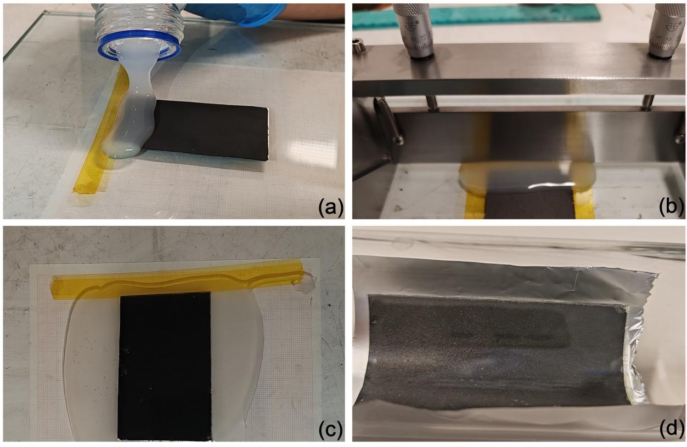
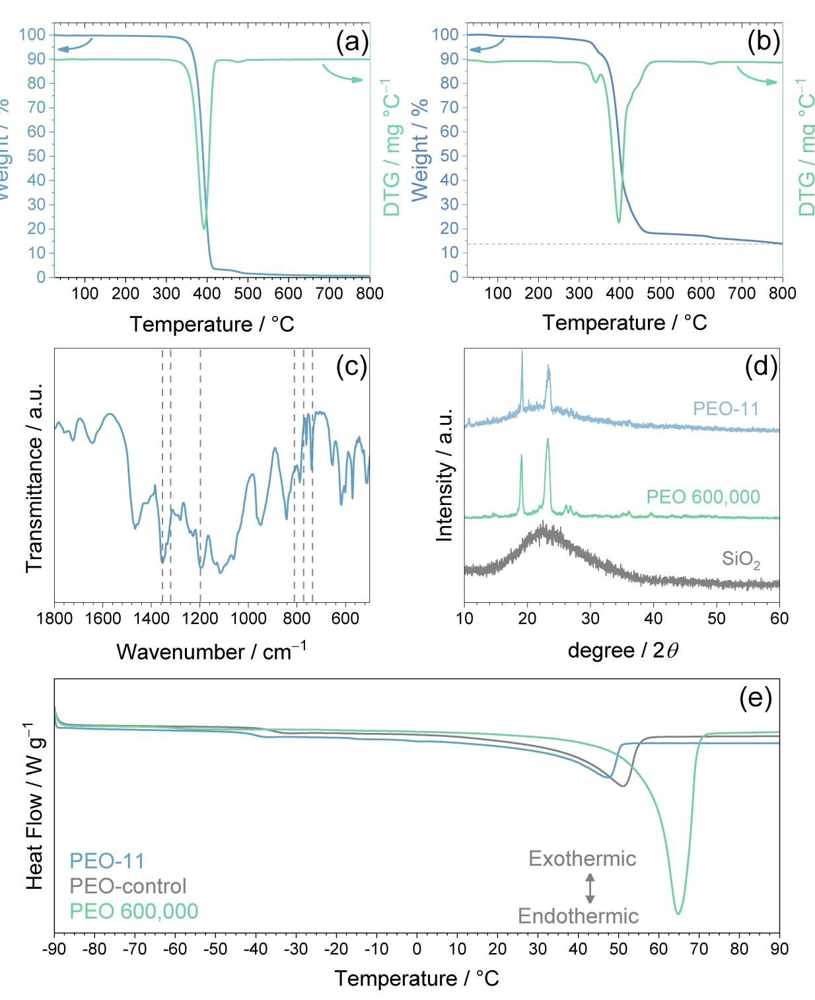
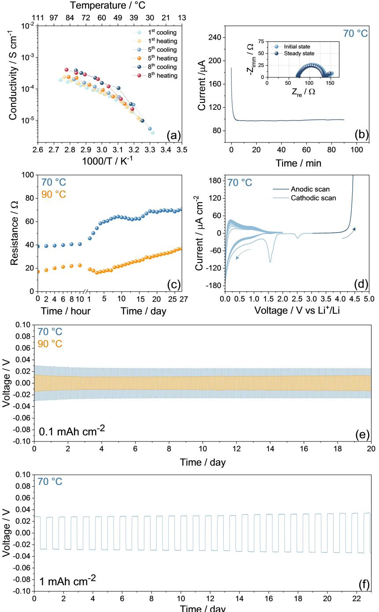
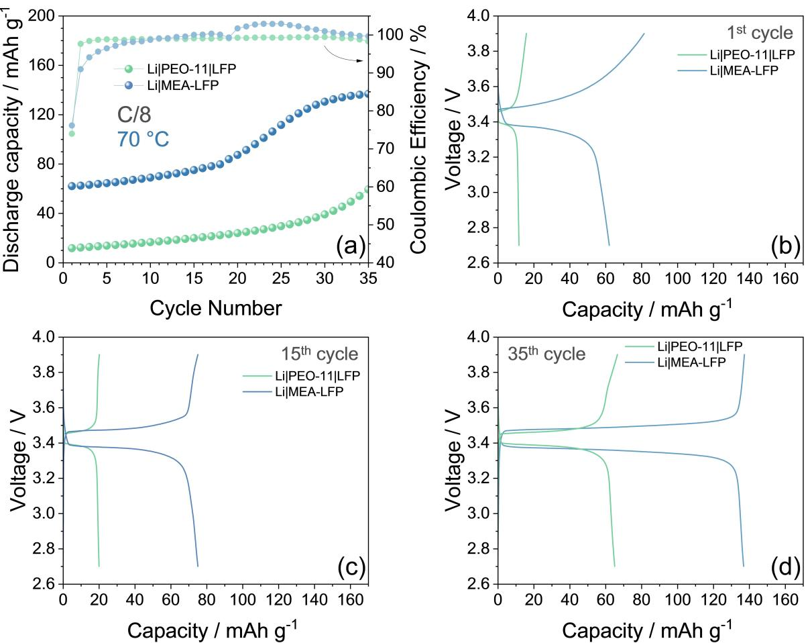
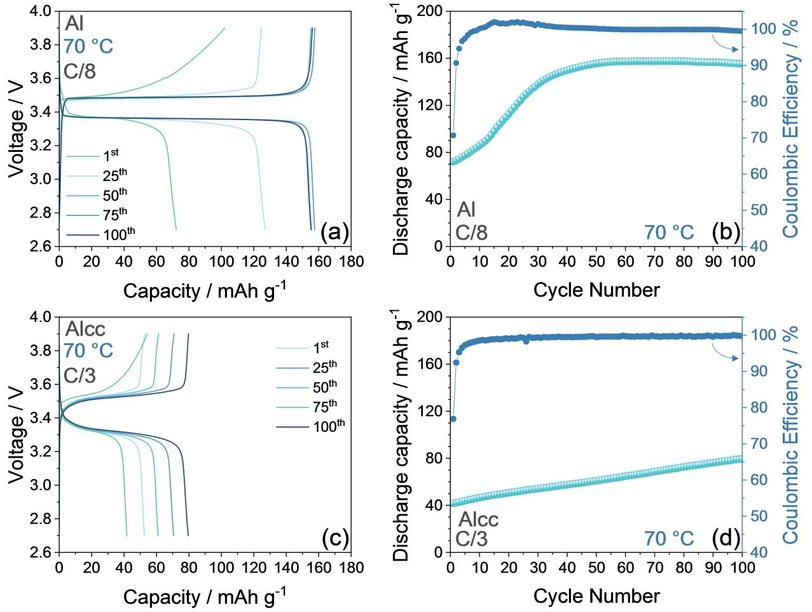

# **Polymeric Lithium Battery using Membrane Electrode Assembly**

[Edoardo](http://orcid.org/0009-0009-1432-849X) Barcaro,[a] Vittorio [Marangon](http://orcid.org/0000-0003-4722-8988),[b, c] [Dominic](http://orcid.org/0000-0001-6429-6048) Bresser,[b, c] and Jusef [Hassoun\\*](http://orcid.org/0000-0002-8218-5680)[a, d]

*In memory of Professor Bruno Scrosati (August 1937 – November 2024), who was an excellent professor and scientist, leading the electrochemistry and the battery fields worldwide.*

Alternative configuration of lithium cell exploits electrode and polymer electrolyte cast all-in-one to form a membrane electrode assembly (MEA), in analogy to fuel cell technology. The electrolyte is based on polyethylene oxide (PEO), lithium bis-trifluoromethane sulfonyl imide (LiTFSI) conducting salt, LiNO3 sacrificial film-forming agent to stabilize the lithium metal, and fumed silica (SiO2) to increase the polymer amorphous degree. The membrane has conductivity ranging from ~5×10 4 S cm 1 at 90°C to 1×10 4 S cm 1 at 50°C, lithium transference number of ~0.4, and relevant interphase stability. The MEA including LiFePO4 (LFP) cathode is cycled in polymer lithium cells operating at 3.4 V and 70°C, with specific capacity

# **1. Introduction**

Lithium battery using PEO-based solid electrolyte has been widely studied in several literature works,[1,2] and even employed in electric vehicles with cell operating at the solidpolymeric state above 70°C.[3] However, limiting factors including possible dendrite formation, weak mechanical features, restricted electrochemical stability window, and modest Li+ transference number (tLi+) hindered in part further development of this cell.[4]

On the other hand, the polymer cell can in principle allow the safe use of the lithium metal, which has a specific capacity as high as 3800 mAhg 1 and a redox potential as negative as

[a] *E. Barcaro, J. Hassoun University of Ferrara, Department of Chemical, Pharmaceutical and Agricultural Sciences, Via Fossato di Mortara 17, 44121 Ferrara, Italy*

[b] *V. Marangon, D. Bresser Helmholtz Institute Ulm (HIU), Helmholtzstrasse 11, Ulm 89081, Germany* [c] *V. Marangon, D. Bresser*

*Karlsruhe Institute of Technology (KIT), P.O. Box 3640 Karlsruhe 76021, Germany*

[d] *J. Hassoun Graphene Labs, Istituto Italiano di Tecnologia, via Morego 30, Genova 16163, Italy E-mail: jusef.hassoun@unife.it*

- *Supporting information for this article is available on the WWW under <https://doi.org/10.1002/batt.202400542>*
- *© 2024 The Author(s). Batteries & Supercaps published by Wiley-VCH GmbH. This is an open access article under the terms of the Creative Commons Attribution License, which permits use, distribution and reproduction in any medium, provided the original work is properly cited.*

of ~155 mAhg 1 (1 C=170 mAgLFP 1 ) for over 100 cycles, without signs of decay or dendrite formation. The cell exploiting the MEA shows enhanced electrochemical performance as compared with the one using simple polymeric membrane stacked between cathode and anode. Furthermore, the MEA reveals the key advantage of possible scalability and applicability in roll-toroll systems for achieving high-energy lithium metal battery, as demonstrated by pouch-cell application. These data may trigger new interest on this challenging battery exploiting the polymer configuration for achieving environmentally/economically sustainable, and safe energy storage.

 3 V vs. SHE.[3,5,6] These appealing features renewed the interest on high-energy lithium metal cells exploiting the polymer setup, and triggered the research for more stable and performing membranes.[7] In this regard, the ones using PEO with molecular weight (MW) from 600,000 to 5,000,000 Da appeared as the most promising, since they are mechanically stable at temperature ranging from 50 to 100°C[8] in particular if ceramic additives such as Al2O3, [9] ZrO2, [10] and SiO2 [11,12] are exploited. In addition, ceramics with nanometric size can promote membrane amorphization and favor by their polarity the *Grotthusstype* Li+ transport within the PEO-chains, thus lowering the operative temperature, increasing the tLi+, and promoting the alkali ions' conduction.[2] Literature works focusing on the liquid electrolyte indicated the use of additives such as LiNO3 as suitable strategy for allowing further stabilization of the solidelectrolyte-interphase (SEI) at the Li anode, and promote cell operation, in particular using a sulfur cathode.[13–16] Furthermore, soft-polymer membranes using polyethylene glycol dimethyl ether (PEGDME) and LiNO3 as film forming additive have demonstrated an excellent cycle life in lithium metal cells using both LFP[17] and sulfur cathodes.[18–20] Moreover, PEO-based membranes can certainly facilitate the system scalability due to the higher strength compared to PEGDME and allow the preparation of batteries using roll-to-roll techniques.[3] Beside these considerations, polymer electrolytes are usually considered safer than typical liquid ones,[21] thanks to their solid-state nature that can avoid electrolyte leakage from the cell case, the high melting/boiling points and/or decomposition temperature that ensure modest volatility, and the low flammability which reduces, but doesn't fully exclude, the risk of ignition.[22–24]

*jusef.hassoun@iit.it*

These aspects are really appealing, especially when highly reactive metal anodes are exploited.

In this work, we have investigated a membrane with adequate conductivity above 50°C, using a PEO with MW of 600,000 Da and the LiTFSI salt, including the LiNO3 additive. In analogy to fuel cell systems,[25–27] the membrane is included into a MEA formed by casting the polymer electrolyte onto the LFP cathode, to achieve an *all-in-one* cathode/electrolyte tape. The direct casting of the polymer electrolyte on the cathode ensures better interface contact and stacking symmetry with respect to the typical membrane-electrode alignment during cell assembly, reduces the manufacturing steps from electrode and electrolyte preparation to final Li-cell achievement, and facilitates advanced battery configurations such as the pouch-cell one thanks to the direct realization of high-surface cathode/ electrolyte tapes. In this study, electron microscopy sheds light on the remarkable contact between cathode and electrolyte, which allows shorter wetting time, higher capacity, and higher energy density with respect to the typical configuration as demonstrated by the extensive and multi-technique characterization adopted herein. The inclusion of abundant and inexpensive SiO2 in the solid electrolyte leads to the decrease of crystallinity degree and melting point of the polymeric membrane, improves thermal stability of the *all-in-one* cathode/ electrolyte tape the Li-stripping/deposition ability at various areal capacity (0.1 and 1.0 mAhcm 2 ), and enhances the Liinterphase features of the membrane, finally promoting the cell safety. Moreover, the MEA setup ensures remarkable performance in Li-metal battery even under restricted electrolyte content that matches the practical lithium-ion batteries requests, i. e., between 2.0 and 3.0 mgelectrolyte for mg of active material.[28] Repeated heating-cooling thermal cycles are proven as viable strategy to enhance the polymer charge transport proprieties as demonstrated by ionic conductivity measurements and *ad-hoc* galvanostatic cycling protocols. Finally, the *all-in-one* setup is particularly adequate for Li-metal pouch-cell with promising performance in terms of delivered capacity and cycle life. Therefore, the approach used in this work may be suitable for achieving high energy polymer battery, which is currently classified from an industrial point of view at the level of *intermediate technology readiness*, with excellent processability, good electrochemical performances, and relevant safety content.[28]

# **Experimental Section**

### **Preparation of the Solid-State Polymer Electrolyte**

The polymer electrolyte was prepared by wet-mixing and doctor blade casting as depicted in Figure S1 (Supporting Information). PEO (average MW 600,000 Da, Sigma-Aldrich), LiTFSI (LiN(SO2)2(CF3)2, 99.95% trace metals basis, Sigma-Aldrich) conducting salt, and lithium nitrate (LiNO3, 99.99% trace metals basis, Sigma-Aldrich) passivating agent were mixed into a 1 mol kgPEO 1 concentration for each salt, and fumed silica powder (SiO2, average particles size: 0.007 μm, Sigma-Aldrich) was added as 10% weight ratio with respect to the PEO-salts mixture. The components were mixed for 1 h inside a bottle by magnetic stirring, then 37.5 mL of acetonitrile (ACN, CH3CN, Sigma-Aldrich) were added into a ratio of 5 ml CAN to 1 g of PEO-salts-SiO2 mixture, and left stirring for 2 days to obtain a viscous and homogeneous slurry. A polymeric membrane was obtained by casting the slurry on a plastic foil (23- 5FEP-2-50, CS Hyde) via a doctor blade tool (MTI Corp.) set at ~1000 μm, and drying for 1 h at 50°C on a hot plate until complete solidification. All the processes were performed in ambient atmosphere (Figure S1a,b). Before employment, LiTFSI and LiNO3 were dried for 2 days under vacuum at 110 °C to avoid weigh errors due to moisture uptake. The solid-state polymer electrolyte was cut into discs with diameter of 14 mm (1.54 cm2 geometric area) with a Nogami handheld punch, dried for 24 h at 70°C under vacuum inside a Büchi oven, and stored inside an Ar-filled glovebox (MBraun, O2 and H2O contents lower than 1 ppm). Figure S1c,d reveals that the 14 mm-diameter discs retain their shape upon vacuum-drying (neither shrinking nor folding were observed), thus suggesting good processability in cell prototype. The average thickness of the dry membrane was determined through sampling various portions using a gauge, and resulted of ~50 μm. Typically, the weight of a 14 mm-diameter disc of electrolyte corresponded to ~19 mg. The electrolyte is indicated in the text as PEO-11. A control polymer electrolyte was prepared following the same procedure by excluding the addition of SiO2. This electrolyte is indicated in the text as PEO-control.

### **Physical-Chemical Characterization of the Electrolyte**

TGA was performed from 25 to 450 or 800°C using a heating rate of 5°C min 1 under dry N2 flow (50 mlmin 1 ) with a Mettler-Toledo TGA 2 instrument (Mettler-Toledo, Columbus, OH, USA). The sample weight was typically ~8–10 mg. Fourier transform infrared (FTIR) spectra were recorded via a Bruker Vertex V70 instrument set up in the transmittance mode. The structure of PEO-11, PEO 600,000, and SiO2 was investigated by X-ray diffraction (XRD) through a Bruker D8 Advance instrument equipped with a Cu K*α* radiation source (8.05 keV) scanning the 10°–60° 2*θ* range using a step size of 0.02 ° and a rate of 10 s step 1 . Differential scan calorimetry (DSC) measurements were carried out in a TA Discovery instrument under N2 atmosphere in sealed aluminum crucibles (samples weight 10– 15 mg) using a heating rate of 5°C min 1 between 90 and 90°C. Both PEO-11 and PEO-control samples were tested twice and only the second DSC run was considered.[29] Prior to the tests, the samples were equilibrated at 40°C for 15 min, and each temperature limit (i.e., 90 and 90°C) was held for 10 min.

### **Electrochemical Characterization of the Electrolyte**

The electrochemical properties of PEO-11 were studied in CR2032 coin-type cells (MTI Corp.) with various configurations assembled in an Ar-filled glovebox. The ionic conductivity was assessed by performing EIS in the 500 kHz–100 Hz frequency range through an alternate voltage signal of 10 mV on blocking-electrode stainlesssteeljPEO-11jstainless-steel symmetrical cells using one O-ring (23- 5FEP-2-50, CS Hyde, internal diameter of 10 mm) holding two 10 mm-diameter PEO-11 membranes; the membranes were chosen to fit the O-ring dimension within�2 μm. The O-ring thickness of 127 μm allowed to fix the cell constant at 0.016 cm 1 (see Supporting Information). The temperature of the cell, within a range from 29.9 up to 91.6°C, was controlled via a F 12 Julabo instrument and double-checked with a thermocouple. The tLi+ value was evaluated by applying the Bruce-Vincent-Evans method.[30] Accordingly, a symmetrical cell with LijPEO-11 j Li configuration was prepared by stacking two 14 mm-diameter lithium discs separated by one 14 mm-diameter PEO-11 membrane

and held at 70°C. A chronoamperometry test was carried out on the cell by applying a voltage (ΔV) of 30 mV for 90 min, and EIS was performed before and after polarization using the 500 kHz– 100 mHz frequency range and an alternate voltage signal of 10 mV. Voltage, current, and resistance values were used in equation (1) to get the tLi+: [30]

$$
t_{Li+} = \frac{I_{ss}}{I_0} \times \frac{(AV - R_0 I_0)}{(AV - R_{ss} I_{ss})}
$$
 (1)

where I0 and Iss are the current values at the initial and steady state, and R0 and Rss are the interphase resistance values before and after cell polarization, respectively, determined from the impedance spectra (read below for fitting method). A similar cell configuration was adopted to investigate the solid-state electrolyte stability upon aging at 70 and 90°C in contact with lithium metal, by performing EIS measurements on LijPEO-11 j Li cells every 2 h for the initial 10 h upon assembly, and subsequently every day for 27 days.

Carbon-based electrodes were prepared through doctor blade casting on either Al or Cu foils of a slurry obtained by dispersing carbon black (80%, Super P carbon, SPC, Timcal) and polyvinylidene fluoride (20%, PVDF, Solef 6020) polymer binder in *N*-methyl-2 pyrrolidone (NMP, Sigma-Aldrich). The slurries were dried on hot plates at 70°C to remove the NMP solvent, cut into discs with diameter of 14 mm and dried under vacuum at 110°C for 2 h before being transferred in an Ar-filled glovebox. The electrochemical stability window of the electrolyte was determined by cyclic voltammetry (CV) measurements on LijPEO-11 j SPC Cu cell between 0.01 and 2.0 V vs. Li+/Li at 0.1 mVs 1 and by linear sweep voltammetry (LSV) on LijPEO-11j SPC Al cell from the open circuit voltage (OCV) to 5.0 V vs. Li+/Li at 0.1 mVs 1 . The Lij SPC cells used a 14 mm-diameter lithium disc separated from a 14 mm-diameter SPC electrode by one 14 mm-diameter PEO-11 membrane. Lithium stripping/deposition tests were carried out at 70 and 90°C on Lij PEO-11j Li symmetrical cells through galvanostatic cycling measurements using a constant current of 0.1 mAcm 2 and setting a step time of either 1 h or 10 h for both charge (stripping) and discharge (deposition) processes. The cells were assembled by stacking two 14 mm-diameter lithium discs separated by one 14 mm-diameter PEO-11 membrane. All the Nyquist plots recorded by EIS were fitted through non-linear least-squares (NLLS) method with the aid of the Boukamp software,[31,32] and only fits with a χ2 value of the order of 10 4 or lower were considered appropriate. The fitting enables to describe the Nyquist spectra in terms of equivalent circuits including resistive (*R*) and constant phase elements (CPE, *Q*), in detail: *(i) Re*, which is the electrolyte resistance, is indicated by the high-frequency intercept of the plot; *(ii) (Ri Qi )* associated to the high-medium frequency semicircle; *(iii) Qw*, which is depicted by a low-frequency line and indicates the semi-infinite Warburg-type Li+ diffusion. The voltammetry and EIS tests were performed via a VersaSTAT MC Princeton Applied Research (PAR-AMETEK) instrument, placing the cells inside a Büchi oven set at the appropriate temperature (double-checked through a thermocouple), with maximum fluctuation of �0.1°C. The stripping/deposition measurements were carried out using a MACCOR series 4000 battery test system, in a chamber set at 70 or 90°C, with maximum fluctuation of �0.1°C. Note that the temperature is also reported in the corresponding panels and figure caption.

### **MEA Setup and Application in Lithium Cell**

The assembly based on LFP and PEO-11 is indicated in the text as MEA-LFP, and its preparation is depicted by the photographic images in Figure 1. Electrode tapes were prepared by casting via a doctor blade tool set at ~200 μm of slurries formed by 80% carbon-

coated LFP, having a carbon content of about 5% developed by Advanced Lithium Electrochemistry (Aleees Taiwan, model A1100),[33] 10% PVDF polymer binder, and 10% SPC electron conductor dispersed in NMP. The slurry was cast on aluminum (thickness of 15 μm, MTI Corp.) or carbon coated aluminum (Alcc, thickness of 18 μm, MTI Corp.) and dried at 70°C on a hot plate to remove the NMP solvent. The obtained tapes were calendared using an MSK-2150 Rolling Machine (MTI Corp.) at 70% with respect to their initial thickness, to achieve a final thickness of ~80 μm. Control Al and Alcc foils were employed to estimate the average loading of the cathode tapes, which corresponded to ~5.2 mgLFP cm 2 and ~7.5 mgLFP cm 2 , respectively. A polymeric membrane was applied by casting the above described PEO-11 slurry on the electrode tapes via a doctor blade tool set at ~1000 μm. The tapes were dried at 50°C on a hot-plate in ambient atmosphere for 30 min, and inside a Büchi oven under vacuum at 70°C for 24 h to achieve the MEA-LFP, which was subsequently stored inside an Ar-filled glovebox and cut into discs having a diameter of 14 mm (1.54 cm2 geometric area) using a Nogami handheld punch for cell application. Whenever the Al or the Alcc based current collectors have been employed, they have been indicated in the text and in the corresponding figure caption. The average thickness of the MEA-LFP was determined through sampling various electrodes using a gauge, and resulted to be ~140 μm. LFP control electrode was prepared using bare Al with the same procedure reported above, excluding the application of the polymeric electrolyte membrane.

The PEO-11 electrolyte was tested in CR2032 coin-type lithium cells using a 14 mm-diameter lithium metal disc as anode and different cathode-electrolyte setups, in detail: (*i*) LijPEO-11j LFP cell with one 14 mm-diameter PEO-11 disc as separator and one LFP control electrode, *(ii)* LijMEA-LFP cells with 14 mm-diameter MEA-LFP disc, *(iii)* LijMEA-LFP cells with 14 mm-diameter MEA-LFP disc and an additional 14 mm-diameter PEO-11 disc. The cells were galvanostatically cycled between 2.7 and 3.9 V at C/100, C/10, C/8, C/5, and C/3 (1 C=170 mA gLFP 1 ). The system scalability was verified by assembling LijMEA-LFP pouch cells (either 12.8 cm2 with 3.2 cm×4.0 cm or 8.0 cm2 with 3.2 cm×2.5 cm) in a dry room with a dew point below 55°C (see Supporting Information for further details). The positive electrodes for the pouch-cells were prepared following the above reported procedure (see Figure 1) by coating the LFP slurry on an Alcc foil and had an active material loading between 6.3 and 6.5 mg cm 2 (LFP content was estimated through a control Alcc foil). Prior to pouch-cell assembly, the Li foil (200 μm, MTI corp.) was laminated with Cu (10 μm thickness, MTI Corp.), while Ni and Al tabs were exploited as current collecting tabs for the negative and positive electrode, respectively. The galvanostatic cycling measurements were performed via a MACCOR series 4000 battery test system, in a chamber set at 30, 70 or 80°C with maximum fluctuation of �0.1°C. Prior to the galvanostatic tests, the cells were held for 6 h inside the chamber at the same temperature.

#### **Morphological Characterization**

The MEA-LFP morphological features were investigated by scanning electron microscopy (SEM) through a ZEISS Crossbeam XB340 operating with an accelerating voltage of 5 kV, employing a secondary electrons detector. The sample for cross-section image was obtained by physical cutting the MEA-LFP, and sticking the obtained piece to the side of the sample holder. Partial deformation of the tape components could not be excluded. To avoid external contamination, the samples were transferred from the glove box to the microscope with the aid of a sealed transfer box.

**Figure 1.** Photographic images of the MEA-LFP casting process, in details: (a) PEO-11 pouring onto a dry LFP electrode; (b) PEO-11 membrane application through doctor blade technique, (c) MEA-LFP before drying process, (d) MEA-LFP after drying process.

# **2. Results and Discussion**

Figure 2 reports the physical-chemical features of the electrolyte membrane developed in this work. The TGA and corresponding DTG in Figure 2a and b compare the thermal behavior of bare PEO 600,000 and PEO-11 membrane, respectively, and account for the nearly complete removal by evaporation of ACN and H2O during the drying process of PEO-11 cast, since a weight loss as small as 0.8% due to trapped solvent or moisture is observed up to 200°C, while extensive PEO removal is associated with the peaks at temperature between 330 and 440°C. Furthermore, the data reveal more complex shape for PEO-11 (Figure 2b) rather than PEO 600,000 (Figure 2a) since it shows a double peak instead of single one due to interactions between salts and PEO matrix which may shift the thermal loss of PEO from the electrolyte. On the other hand, these peaks exemplify how salts can influence the ionic association in the polymer matrix, which is reflected into electrolyte crystallization and characteristic thermal stability.[34,35] It is worth mentioning that additional ionic association studies may decouple experimentally the individual movements and correlations of cations, anions, and polymer chains, as well as the co-existence of multiple dynamics and transport events ruling ionic interactions, as indeed demonstrated in literature works.[36,37] The small weight losses occurring beyond 500°C for PEO-11 are associated with the LiTFSI and LiNO3 salts decomposition,[38] and the residual weight observed at 800 °C is due to the presence of the SiO2 ceramic filler.[39] Therefore, the results obtained through TGA suggest suitable thermal stability of the PEO-11 extended over 330°C, which is a key requirement for allowing safe operation of lithium-metal cells.

A brief spectroscopic investigation of the PEO-11 is given by the FTIR spectrum reported in Figure 2c. In order to verify the actual salt dissolution in the polymer matrix, which is one of the fundamental features for allowing ion conduction, the typical FTIR bands expected for pure LiTFSI, that is, at 749, 773 and 810 cm 1 related to symmetric S N S stretching, at 1200 cm 1 due to SO2 asymmetric stretching, and at 1320 and 1350 cm 1 for CF3 asymmetric stretching,[40] are also reported as dashed lines in the figure. The spectra clearly demonstrates that the LiTFSI dissociates, as indicated by the shifts in the vibrational wavenumbers of the TFSI anion from 810, 773, and 749 cm 1 to lower values.[41] Moreover, the increase of the peak intensities at 1350 and 1320 cm 1 compared to the one expected for pure LiTFSI, and the shift of the signal at 1200 cm 1 to lower wavenumbers, corroborate the complete dissociation of LiTFSI in the PEO matrix.

The structure of the polymer electrolyte has been analyzed through XRD, and the pattern between 10° and 60° is reported in Figure 2d. The figure confirms the presence of SiO2, observed as a broad band between 15 and 40°, and shows the crystallinity of the PEO-11 through two peak reflections at 19° and 24°, which are also observed in the pristine PEO 600,000 powder. It is worth noting that the intensity of these two peaks

**Figure 2.** Brief physical-chemical characterization of the PEO-11 electrolyte: (a–b) TGA (blue) and corresponding DTG (green) of (a) PEO 600,000 powder and (b) PEO-11 performed under dry N2 flow with heating rate of 5°Cmin 1 in the 25–800°C temperature range. (c) FTIR spectra of PEO-11 electrolyte; expected signals from LiTFSI are marked as dashed lines. (d) X-ray diffractograms for PEO-11 (blue), PEO 600,000 (green), and SiO2 (grey). (e) DSC curves of PEO-11 (blue), PEO-control (gray), and PEO 600,000 powder (green).

is reversed in the PEO-11 membrane compared to PEO 600,000 powder, mainly due to the presence of silica that can actually modify the structure of the polymer electrolyte by the interplay within the polymer matrix as Lewis acid/base interactions.[42] Additionally, the XRD pattern of the PEO-11 does not shows any peaks of the salts as a further evidence of their complete dissolution via complexation in the polymer matrix, in accordance with the FTIR results previously discussed.

DSC is carried out to assess the effect of SiO2 on the polymer crystallinity. In particular, DSC is performed on the PEO-11 electrolyte, on a control electrolyte indicated as PEOcontrol which includes exclusively the lithium salts (see Experimental Section for additional details), and on the PEO 600,000 powder. Thus, Figure 2e shows the DSC thermal curves, while Table 1 reports the values of the parameters obtained by the tests. Prior to measurements, the samples are equilibrated at 40°C to exclude possible effects of the corresponding thermal history (see Experimental Section for additional details on the DSC setup).[29,43] The thermograms in Figure 2e evidence in first place the decrease of melting temperature of the polymer (Tm, Table 1) as promoted by addition of the lithium salts from 65.0°C (PEO 600,000) to 51.5°C (PEO-control electrolyte), and further to 45.4°C by including the SiO2 filler (PEO-11 electrolyte). On the other hand, the effect of SiO2 in inhibiting the crystallinity degree (χcrys) within the PEO structure is estimated in Table 1 through the equation (2), that is:

$$
\chi_{\text{crys}} \approx \Delta H_{\text{m}}^{\text{sample}} / \Delta H_{\text{m}}^{\text{PEO}} \times 100 \tag{2}
$$

where the melting enthalpy of the samples (~Hm, Table 1) is determined by integration of the area subtended to the melting peak. The analyses display the decrease of χcrys from 44.7% for PEO-control to 23.9% for PEO-11, and reveal in addition a lower glass-transition temperature (Tg, Table 1) of PEO-11 with respect to PEO-control, i. e., 40.0°C and 34.1°C, respectively, which is expected to improve the flexibility of the polymer chains and promote segmental and rotational modes, thus favoring ionic transport within PEO-11.[29,36,37]

The PEO-11 electrochemical behavior is studied in Figure 3 in terms of ionic conductivity over temperature, Li+-transference number, chemical stability in lithium cell, electrochemical stability window, and overpotential during lithium stripping and deposition. The PEO-11 ionic conductivity trend over the temperature (Figure 3a) shows the typical Vogel-Tamman-Fulcher (VTF) trend. Accordingly, the conductivity sð*T*Þ is plotted using the VTF equation (3):

$$
\sigma(T) = \sigma_{\infty} \exp\left(-\frac{E_a}{k_b(T - T_0)}\right)
$$
\n(3)

where *T0* (K) is the temperature for zero configurational entropy, generally ~30 K lower than the glass transition temperature *Tg* (K) of the electrolyte,[44] s∞ (S cm 1 ) is the ionic conductivity at infinite temperature, Ea (eV) is the activation energy for ion conduction, and *kB* is the Boltzmann constant (8.62 10 5 eVK 1 ). Table 2 summarizes the results of the VTF plot for the PEO-11. The polymeric electrolyte shows a conductivity ranging from 3.8×10 6 S cm 1 at 29.9°C to 4.8×10 4 S cm 1 at 91.6°C, with

| Table 1. Parameters obtained from DSC tests of pristine PEO 600,000 powder, PEO-control and PEO-11 electrolytes. |         |                 |         |           |  |  |  |  |
|---------------------------------------------------------------------------------------------------------------------|---------|-----------------|---------|-----------|--|--|--|--|
| Sample                                                                                                              | Tg [°C] | ~Hm [J g 1 ] | Tm [°C] | χcrys [%] |  |  |  |  |
| PEO 600,000                                                                                                         | 58.2    | 135.6           | 65.0    | /         |  |  |  |  |
| PEO-control                                                                                                         | 34.1    | 60.6            | 51.5    | 44.7      |  |  |  |  |
| PEO-11                                                                                                              | 40.0    | 32.4            | 45.4    | 23.9      |  |  |  |  |

**Table 2.** Ionic conductivity at infinite temperature (σ∞), activation energy for ion conduction (Ea), and temperature of zero configurational entropy (*T0*) for the PEO-11 according to VTF equation (3) used for the conductivity trend of Figure 3a. See the Experimental Section for acronyms and further details.

| Electrolyte condition | σ∞ [S cm 1 ]   | Ea [eV]               | T0 [K]     |
|--------------------------|-------------------|-----------------------|------------|
| 1st cooling              | 1.2×10 3�2.5×10 4 | 2.9×10 4�3.3×10 4     | 221.2�4.2  |
| 1st heating              | 1.8×10 3�2.0×10 3 | 1.0×10 3�5.4×10 4     | 223.5�22.4 |
| 5th cooling              | 3.9×10 4�2.2×10 4 | 4.1×10 4�1.4×10 4     | 251.8�12.0 |
| 5th heating              | 2.6×10 4�2.4×10 4 | 2.3×10 4�1.5×10 4     | 272.7�19.0 |
| 8th cooling              | 6.5×10 4�7.5×10 4 | 3.0×10 4�2.1×10 4     | 265.4�20.9 |
| 8th heating              | 1.3×10 4�3.2×10 4 | 7.5 ×10 5�2.1×10 5 | 296.4�5.0  |

values increasing over subsequent heating-cooling cycles, as observed in similar electrolytes.[45] The ionic conductivity values are determined by NLLS fitting performed on the Nyquist plots in Figure S2 in the Supporting Information. In general, the impedance spectra show for temperatures lower than 50°C the presence of a partial semicircle at high frequency values ascribed to grain boundary phases arising from crystalline heterogeneities in the PEO structure. In these cases, the NLLS fitting is performed by using the *Re1(Re2Q)Q* equivalent circuit, and the overall electrolyte resistance is determined by addition of the high-frequency intercept (*Re1*) and the amplitude (*Re2*) of the fitted semicircle. On the other hand, the plots exhibit at temperatures �50°C the typical single tilted line profile thank to the amorphization of the PEO polymer promoted by the relevant temperature. Therefore, the electrolyte resistance is determined by the intercept of the tilted line with the Zre axis through the *ReQ* equivalent circuit exploited in the NLLS fitting (additional information on the NLLS fitting procedure is reported in the Experimental Section). The data achieved by plotting some representative conductivity trends, namely 1st, 5th, and 8th cooling/heating cycle using VTF equation (3) give raise to conductivity at infinite temperature (s∞) between 1.8×10 3 and 1.3×10 4 S cm 1 , namely one order of magnitude smaller than liquid and plasticized solid-state electrolytes.[20] The values of T0 obtained for PEO-11 (between 221.2 and 296.4 K) allow the estimation of the Tg value of the electrolyte, that evolves upon cooling/heating processes from 251 K (1st cooling run) up to 326 K (8th heating run). Despite the latter value seems to be particularly high for a PEO-based electrolyte, and likely affected by error, it appears in line with the results which indicate at the 8th heating run an electrolyte conductivity of ~10 4 S cm 1 starting from 49.0°C. It is worth noting that the Tg values estimated from the VTF fitting for PEO-11 differs of about 18 K from the Tg determined experimentally through DSC (i. e., 233 K, Table 1), likely due to approximations in the application of the VTF equation (3). Furthermore, the fitting results account for an activation energy for Li+ ions motion (Ea), progressively changing upon consecutive heating/cooling cycles of the PEO-11, from 2.9×10 4 eV (1st cooling) to 7.5×10 5 eV (8th heating). The initial value is in line with other polymer electrolytes, as indeed expected by the higher viscosity and different transport mechanism of this electrolyte compared

*Batteries & Supercaps* **2025**, *8*, e202400542 (6 of 14) © 2024 The Author(s). Batteries & Supercaps published by Wiley-VCH GmbH

**Figure 3.** Electrochemical characterization of the PEO-11 electrolyte. In detail: (a) ionic conductivity plots over temperature (see corresponding Nyquist plots in Figure S2 in Supporting Information); (b) chronoamperometry curve recorded in a Lij Li symmetrical cell (inset reports corresponding Nyquist plots acquired before and after polarization) used to evaluate the polymer Li+-transference number through Bruce-Vincent-Evans method (see equation (1) and Table 3); EIS frequency range: 500 kHz–100 mHz; alternate voltage signal: 10 mV; (c) resistance vs. time trends achieved by EIS measurements upon aging of Lij Li symmetrical cells in the 500 kHz–100 mHz frequency range, applying an alternate voltage signal of 10 mV (see corresponding Nyquist plots in Figure S3 and S4 in the Supporting Information and Tables S1 and S2 for NLLS analyses);[31,32] (d) electrochemical stability window determined either by CV between 0.01 and 2.0 V vs. Li+/Li or by LSV from cell OCV to 5.0 V vs. Li+/Li carried out in LijPEO-11j SPC cells; scan rate: 0.1 mVs 1 ; (e, f) Li stripping/deposition tests performed on LijPEO-11 j Li cells using the constant current rate of 0.1 mAcm 2 and step time of either (e) 1 h (0.1 mAhcm 2 ) or (f) 10 h (1 mAhcm 2 ). See Experimental Section for acronyms and details on assembly.

to typical liquid ones,[46–49] while the results related with the 8th run suggest a decrease of about one order of magnitude of Ea that may actually rise the ionic conductivity. The value of the tLi+ at 70°C, calculated in Figure 3b through chronoamperometry and EIS (see Nyquist plots recorded before and after cell polarization in the inset) in LijPEO-11j Li cell, are obtained by

applying the Bruce-Vincent-Evans equation (equation (1) in the Experimental Section).[30] This equation is used without any correction since the bulk resistance change appears negligible (see Nyquist plots in the inset of Figure 3b).[50] Indeed, the related data reported in Table 3 allow the determination of a tLi+ of 0.39 for PEO-11, which is lower than that of typical liquid electrolytes, but still suitable for battery and in line with other literature results.[30,51] Figure 3c shows the trend of the resistance over the aging time of the symmetrical lithium cells achieved by EIS (see corresponding Nyquist plots in Figures S3 and S4 in the Supporting Information, Tables S1 and S2 for respective NLLS analyses, and Experimental Section for fitting details). The data reveal an initial resistance value of 17 and 38 Ω at 90 and 70°C, respectively, slightly increasing to 23 and 46 Ω in 10 h. Subsequently, the interphase resistance at 90°C displays a decrease from the 1st to the 3rd day to 16 Ω, meanwhile the opposite trend is observed at 70°C since the interphase resistance reaches 54 Ω within the same time interval. Later, as the SEI is formed and consolidated, the interphase resistance at 70°C fluctuates around 70 Ω, possibly due to partial dissolution and stabilization, while the trend at 90°C shows a progressive increase up to 37 Ω after 27 days. It is worth noting that the PEO-11 is characterized by higher steady state resistance at 70°C than 90°C, however it shows a better stability over aging time at the lower temperature, thus suggesting the formation of a more effective SEI at the electrode/electrolyte interphase which can promote efficient use in lithium-metal battery. On the contrary, the behavior at 90°C can originate from a slight and progressive decomposition of the membrane at the lithium interphase promoted by the high temperature, despite detailed studies may be needed to properly assess this aspect. Furthermore, the higher electrode/ electrolyte resistance of PEO-11 at 70°C is in line with the relatively low tLi+ in this electrolyte, which could in turn partially hinder the kinetics of the charge transfer process, in particular at low temperatures.[52] The electrochemical stability window of the PEO-11 is determined by CV and LSV at 70°C using LijPEO-11j SPC cells in Figure 3d. The figure shows a peak centred at 1.5 V vs. Li+/Li related with the reduction of the LiNO3, and a broad wave around 0.75 V vs. Li+/Li ascribed to the reductive decomposition of the polymer with the formation of SEI layer.[53–55] Moreover, the test reveals reversible processes between 0.1 and 0 V vs. Li+/Li associated with the Li- (de)insertion into the SPC (CV), as well as a relevant increase of the current at about 4.0 V vs. Li+/Li (LSV) due to the complete oxidation of the PEO to carbonyl groups and volatile degradation products, thus suggesting an electrochemical stability window extending from 0 to 4.0 V.[56] It is worth mentioning that the anodic stability limit is established by taking into account an oxidative current threshold of 5 μAcm 2 , which is widely accepted and suggested as suitable value to achieve a reliable response in polymer electrolyte.[57] The Li stripping/ deposition test in Figure 3e performed in LijPEO-11j Li cell evidences a modest and stable overpotential of 0.03 V upon 480 hours (20 days) of cycling at 70°C, and a value below 0.02 V at 90°C, which is a key characteristic for allowing the proper lithium metal battery operation. Despite the polarization is lower at 90°C, the better aging-stability observed at 70°C (see Figure 3c) suggests the latter as preferrable value for the galvanostatic cycling measurements rather than the former one. On the other hand, the selected temperature can be considered also adequate in practical solid-state battery modules.[58] A further indication of the Li/electrolyte interface suitability is provided by the additional Li stripping/deposition test performed adopting challenging conditions, that is, by setting a step time between charge and discharge of 10 h to achieve a capacity of 1 mAhcm 2 . Notably, the Li/Li cell shows stable cycling over 23 days with initial polarization as low as 0.030 V that mildly increases to 0.034 V towards the final stages of the test, thus confirming the improved interphase formed by PEO-11 at the Li surface despite the intensive extraction/plating of Li.

Prior to the galvanostatic cycling testing, the polymer weight with respect to electrode and the morphological features of the MEA-LFP are determined by TGA and SEM, respectively, as reported in Figure 4. Figure 4a reports the TGA (top panel) and corresponding DTG (bottom panel) of the samples, and shows for the MEA-LFP a thermal behavior accounting for the almost total removal by evaporation of ACN and H2O during the drying process, since a weight loss as small as 0.7% is experienced up to 200°C, while the peaks at temperature corresponding to 290 and 380°C are associated with PEO loss, in partial agreement with the TGA reported in Figure 2b. Despite these peaks hold the same shape as for the bare polymer electrolyte, the loss of the PEO-11 directly cast on the electrode tapes (either on Al or Alcc foils) is observed at lower temperature. This response may be related with the incremented exposure of the surface area of the MEA-LFP compared to bare PEO-11 due to the presence of the porous LFP electrode as the support for the electrolyte casting in the former rather than the flat plastic substrate employed for the latter (see Experimental Section for details). The top panel of Figure 4a reveals for the MEA-LFP cast on Alcc a polymer content of 52% while the one exploiting bare Al is characterized by a higher polymer content of 60%. This difference may be rationalized taking into account that both tapes have almost the same final thickness (~140 μm), instead the MEA-LFP cast on Al has a lower active material loading than the one on Alcc

| Table 3. Parameters used in equation (1) according to Bruce-Vincent-Evans[30] method to calculate the PEO-11 Li+ transference number (tLi+). In detail: the  |  |  |  |  |  |  |
|--------------------------------------------------------------------------------------------------------------------------------------------------------------|--|--|--|--|--|--|
| current value detected at the beginning of polarization of the LijPEO-11j Li cell (I0) and at the steady state upon measurement (Iss), the resistance values |  |  |  |  |  |  |
| achieved by NLLS fitting[31,32] of EIS spectra, performed before polarization (R0) and at the steady state upon measurement (Rss). See Figure 2 for          |  |  |  |  |  |  |
| chronoamperometric curve and respective inset for Nyquist plots. See Experimental Section for acronyms and details.                                          |  |  |  |  |  |  |
|                                                                                                                                                              |  |  |  |  |  |  |

| Electrolyte | Initial current (I0) [A] | Steady state current (Iss) [A] | Initial resistance (R0) [Ω] | Steady state resistance (Rss) [Ω] | tLi+ |
|-------------|--------------------------|--------------------------------|-----------------------------|-----------------------------------|------|
| PEO-11      | 188.1×10 6               | 98.8×10 6                      | 32.5                        | 30.7                              | 0.39 |
|             |                          |                                |                             |                                   |      |

*Batteries & Supercaps* **2025**, *8*, e202400542 (8 of 14) © 2024 The Author(s). Batteries & Supercaps published by Wiley-VCH GmbH

**Figure 4.** (a) TGA (top panel) of the MEA-LFP tapes cast on bare Al (light blue) or Alcc (dark blue) performed under dry N2 flow with heating rate of 5°Cmin 1 from 25 to 450°C, and corresponding DTG (bottom panel). (b) SEM images of the MEA-LFP taken from top-view (inset reports higher magnification). (c) SEM image of the MEA-LFP taken from the cross-section view. See Experimental Section for acronyms and casting details.

(i. e., 5.2 and 7.5 mgLFP cm 2 , respectively), thus a higher polymer content. Repeated measurements along the membranes indicate further slight difference in thickness, which are however neglected since they are within the experimental error of the tests.

Figure 4b shows the surface morphology of the MEA-LFP cast on Alcc, instead Figure 4c reveals the cross-sectional features of the same tape taken *ad hoc* to verify the actual electrode/electrolyte stacking. Figure 4b depicts a surface fully covered by PEO-11 without any sign of exposed LFP portions, thus suggesting a uniform distribution of the electrolyte, which is a key requirement for avoiding short-circuits in the Li-cell using the MEA-LFP. Both panel and its inset, showing a higher magnification, clearly indicate the presence of bright domains possibly attributed to small clusters with enhanced amorphous degree. This setup may actually favor the efficient Li+ conduction in the electrolyte, that mainly relies on chain segmental motion within the polymer's amorphous regions promoting a fast ion transport.[59,60] Figure 4c sheds light on the lateral-morphology of the MEA-LFP tape, which gives precious information on the effectiveness of the MEA-LFP preparation process, despite a partial deformation of the stack by cutting the assembly cannot be completely excluded. The right-to-left view of the cross-section image reveals, respectively, the Alcc support with a thickness of ~20 μm roughly in line with the supplier specification, and the MEA-LFP with overall extent of ~90 μm which may be roughly divided into two portions, i. e., at the left LFP and at the right PEO-11 membrane. This stacking suggests a regular distribution of LFP and polymer electrolyte, and a uniform bulk of the membrane, notwithstanding the partially patchy aspect seen in Figure 4b. The partial active material detachment from the current collector, triggered by cutting the MEA-LFP for cross-section SEM acquisition, can be also detected between LFP and Alcc in the SEM of the MEA-LFP with a higher magnification in Figure S5 (Supporting Information). Furthermore, the grayscale of the SEM evidences the formation of a solid blend composed of LFP, SPC, PVDF (namely the slurry components), and the PEO-11 membrane, which can actually favor the operation of MEA-LFP in lithium cell.

In summary, the data reported above evidence the success of the MEA-LFP preparation process in terms of electrochemical features and suitable morphology, and suggest the applicability in lithium metal cells operating above 50°C. Relevantly, the use of the MEA-LFP may actually facilitate the cell preparation and the system setup, and promote fast blending between polymer electrolyte and working electrode to achieve cells with better performances at lower temperatures, within a shorter activation process in comparison with the typical Li-polymer cell, in which electrode and electrolyte are prepared separately, and subsequently stacked together during assembly process.[52] In addition, this setup may boost the scaling up of efficient polymer cells using the lithium metal anode.

The polymer electrolyte is used in Figure 5 either in a typical LijPEO-11j LFP or in a LijMEA-LFP cell configuration (both LFP cathodes cast on bare Al), cycled at C/8 (1 C=170 mAgLFP 1 ) between 2.7 and 3.9 V at 70 °C. The enhancement of the cell performance exploiting the *all-in-one* cathode/electrolyte tape (*i. e.* LijMEA-LFP) compared to the simple components stacking (*i. e.* LijPEO-11j LFP) is evidenced in Figure 5a, which displays the related capacity trends. The LijPEO-11j LFP cell shows an initial capacity as low as 12 mAhg 1 , with a value progressively increasing to 66 mAhg 1 upon 35 cycles. Instead, the LijMEA-LFP cell initially delivers about 62 mAhg 1 , and the capacity increases to a value as high as 136 mAhg 1 within the same cycling interval. Progressive increase of the delivered capacity has been already observed in literature for lithium cells exploiting PEO-based electrolytes and LFP electrodes including PVDF binder into their formulation.[52,61] This trend is usually ascribed to increase of the electrode/electrolyte interphase

**Figure 5.** Galvanostatic cycling performance of the PEO-11 electrolyte in lithium cell with either LijPEO-11j LFP (green) or LijMEA-LFP (blue) setup using Al current collector. In detail: (a) capacity trends comparison upon 35 charge/discharge cycles (right y-axis shows Coulombic Efficiency); comparison between the voltage profiles during (b) 1st cycle; (c) 15th cycle; (d) 35th cycle. Both cells cycled at the constant C-rate of C/8 (1 C=170 mAgLFP 1 ) between 2.7 and 3.9 V. Electrodes geometric area: 1.54 cm2 . See Experimental Section for acronyms and cell assembly details.

conductivity upon the ongoing active material wetting promoted by charge/discharge runs, with formation of a favorable blend between the polymer electrolyte and the binder, leading to faster motion of the Li+ ions than the pristine state of the cell.[52,61] Herein, this aspect is further supported by the data of the polymer electrolyte directly cast on the cathode which shows an enhancement of the cell performance, thus evidencing how the MEA setup can ensure a better contact and blending of the electrode/electrolyte components. Figure 5a also displays a Coulombic Efficiency approaching 100% at the steady state for both cell configurations. The voltage signatures of LijPEO-11j LFP and LijMEA-LFP cells in Figure 5b reveal a first cycle with more notable hampering of the electrochemical process for the former setup rather than the latter, reflected into a lower discharge capacity of the Li-cell with typical configuration compared to the one exploiting the MEA setup, namely 12 rather than 62 mAhg 1 . Subsequently, the polarization of the cells decreases and the discharge capacity increases, triggering the plateau slightly below 3.45 V related with the LiFePO4.Li+FePO4 electrochemical Li-(de)insertion reversible process, which evolves at the 15th cycle with a capacity of 20 mAhg 1 for the LijPEO-11j LFP cell and 75 mAhg 1 for the LijMEA-LFP one in Figure 5c. The capacity respectively reaches values of 66 and 136 mAhg 1 at the 35th cycle as the cells polarization further shrinks in Figure 5d, thus suggesting the MEA setup as preferential solution to facilitate the battery assembling and boost its performances when a polymeric electrolyte is exploited, in particular using relatively high active material loading.

A further improvement, especially in terms of cycling under high C-rates, may be achieved by the using Alcc rather than Al current collector. Thus, the LijMEA-LFP cell using Al is subjected to galvanostatic cycling test at C/8, instead the one using the Alcc is cycled at the higher current of C/3, concomitantly with an increased active material loading, and the results are reported in Figure 6 (active material loadings of 5.2 and 7.5 mgLFP cm 2 for LFP cast on Al or Alcc, respectively). The tests show different activation shapes for the two cells, not only driven by the choice of the current collector but also by the active material loading and employed current rate, which remarkably change the cycling trend. Indeed, the voltage profiles in Figure 6a shows at C/8 a shape analogous to the one

**Figure 6.** Galvanostatic cycling performance of the LijMEA-LFP cells. (a) Selected voltage profiles and (b) corresponding cycling trend (right *y*-axis shows Coulombic Efficiency) at C/8 (1 C=170 mAgLFP 1 ) for a cell using Al current collector. (c) Selected voltage profiles and (d) corresponding cycling trend (right *y*axis shows Coulombic Efficiency) at C/3 for a cell using Alcc current collector. Voltage range of 2.7–3.9 V. Electrodes geometric area: 1.54 cm2 . See Experimental Section for acronyms and cell assembly details.

reported above, with initial reversible capacity around 70 mAhg 1 progressively increasing and greatly stabilizing to a value 155 mAhg 1 after 50 cycles, which is remarkably held without any further profile modification over 100 charge/ discharge runs. The stable cycling is also evidenced by the plateaus at about 3.4 V during discharge and 3.5 V during charge, which are partially hampered only at the beginning of the measurements. This evolution is also reflected in the cycling trend reported in Figure 6b, where the cell displays an increase in terms of delivered capacity upon cycling and excellent cycling stability, with Coulombic Efficiency over 99.5% upon the activation stage, thus highlighting an efficient Li- (de)insertion process into the LFP olivine structure. Despite the use of Alcc, the voltage profiles of the test carried out at C/3 in Figure 6c shows the electrochemical process evolving upon cycling with a less pronounced enhancement of the voltage plateau, as likely ascribed to diffusion limits not related with the electrode/electrolyte interphase but rather with the limitation of the Li+ ions transport within the electrolyte bulk leading to notable ohmic overpotential at high currents.[52] This aspect is confirmed by the slope of the voltage profiles observed in Figure 6c at C/3, which appears more relevant compared with the ones of the test performed at C/8 (compare with Figure 6a). Nevertheless, the cycling trend depicted in Figure 6d indicates a continuous increase of the delivered capacity, expected from the improvement of the electrode/electrolyte interphase, from around 40 mAhg 1 at the 1st cycle to 80 mAhg 1 upon 100 cycles, in line with the incomplete development of discharge plateau observed in Figure 6c. The data reported above suggest possible improvement of the cycling response at high C-rates by better tuning some key parameters such as the active material to polymer ratio, internal pressure of the cell, electrode morphology (in terms of porosity and particles size), polymer viscosity, and casting process (wet or dry), to finally achieve MEAs well performing both at low and high currents.[62] Therefore, a dedicated study to address these key aspects is currently running in our laboratory, and the results will be reported in future papers. On the other hand, the promising electrochemical responses of the LijMEA-LFP cell, both in terms of delivered capacity trend and voltage signature evolution, as well as the alternative preparation process which foresees a notable processability and casting options, and offers interest-

ing preliminary insights for achieving high-performance and safe energy storage systems. In this regard, Table S3 in the Supporting Information presents a comparison of the performance achieved by the PEO-11 electrolyte and the MEA-LFP system with recent literature focused on PEO-based electrolytes in terms of ionic conductivity and steady state capacity delivered in coin-cell, including the active material loading exploited on the cathode. The table shows that the PEO-11, in spite of its simple formulation that excludes any synthesis step during preparation, has an ionic conductivity in line with similar compositions,[63] and with large part of those which foresee the use of inorganic fillers.[64–70] A more relevant improvement in conductivity, however with lower mechanical stability, can be obtained through the inclusion of ionic liquids.[71,72] The effectiveness of the MEA concept is evidenced by the comparison of capacity delivered in lithium coin-cell provided in Table S3, which reveals that our simple and straightforward approach allows performances comparable with advanced configurations of PEO-based solutions especially by taking in consideration the remarkably higher cathode material loading exploited herein (i. e.,*>*5 mgLFP cm 2 ) with respect to most of the cases reported in literature.[63–72] Despite the wide array of possible optimizations, this comparison proves the potentiality of the cathode-electrolyte direct junction proposed herein, suggesting it as a first step towards the simplification of manufacturing of lithium battery with high performance.

Possible strategies to improve the performance of the Lij MEA-LFP cell exploiting the Alcc current collector at coin-cell level are explored in Figure S6 in the Supporting Information. In particular, two cells are subjected to galvanostatic cycling tests including three formation cycles at C/10 and subsequent cycling at C/5 at 80°C. The outcomes in Figure S6 display an initial capacity approaching 70 mAhg 1 for both cells when the current rate is increased from C/10 to C/5, which is comparable to the results displayed in Figure 6b despite the higher current rate (C/5 with respect to C/8) and higher LFP loading (7.5 mgLFP cm 2 with respect to 5.2 mgLFP cm 2 ). This improvement can be ascribed to the experimental setups adopted in Figure S6, namely, formation cycles, a higher temperature, and an improved current collector (Alcc). On the other hand, a further improvement is clearly registered when one of the cells is suspended after the 20th cycle, cooled-down to room temperature for 1 h, and newly heated at 80°C for 1 h before resuming the cycling test at the same temperature. The trend of the thermally treated cell demonstrates an increase in delivered capacity of about 10 mAhg 1 at the first cycle after treatment with respect to the other cell, and of a further 15 mAhg 1 after 15 cycles. This behavior well agrees with the enhancement of conductivity of the PEO-11 electrolyte triggered by heatingcooling cycles as discussed in Figure 3a, and offers a glimpse of the possible approaches that can be applied to the proof-ofconcept MEA-LFP system proposed herein to achieve superior performances in Li-metal battery.

The scalability of the MEA-LFP system is evaluated by applying the LijMEA-LFP configuration in pouch-cells. Figure S7 in the Supporting Information shows photographic images illustrating the procedure adopted to achieve the above cells with electrode geometric area of either 12.8 or 8.0 cm2 and active material loading between 6.3 and 6.5 mgLFP cm 2 . Thus, a pouch-cell with 12.8 cm2 area and active material loading of 6.3 mgLFP cm 2 is tested at C/100 and C/10 at 30°C, and subsequently at C/10 at 70°C as reported in Figure S8 in the Supporting Information. Figure S8a and b shows the voltage profiles and cycling trend, respectively, related to the galvanostatic cycling performed at C/100 at 30°C. Despite the relevantly low C-rate adopted to achieve acceptable electrochemical activity from the polymeric cell at the lower temperature, the figure shows a delivered capacity still limited to about 50 mAhg 1 as expected by the poor conductivity of the PEO-11 electrolyte, that is, below10 5 S cm 1 at 30°C (see Figure 3). Furthermore, the subsequent voltage profile in Figure S8c, recorded at current increased to C/10 at the same temperature, depicts extremely polarized charge and discharge processes of the LFP cathode with associated capacity below 5 mAhg 1 . The performances obtained at 30°C are relevantly enhanced when the temperature is increased to 70°C, as evidenced by the selected voltage profile recorded at C/10 (Figure S8d) which reveals a capacity of 80 mAhg 1 (~0.4 mAhcm 2 ). This result further demonstrates that such temperature is sufficient to trigger a partially amorphous state of the PEO-11 electrolyte, and allow the operation of the LijMEA-LFP pouch-cell. In addition, a pouch-cell with electrode geometric area of 8.0cm2 and active material loading of 6.5 mgLFP cm 2 tested at C/5 and 80°C (Figure S8e and f) shows a life extending over 40 cycles, with stable delivered capacity around 60 mAhg 1 (~ 0.3 mAhcm 2 ) gradually increasing over operation. Despite these results indicate the need for further improvement of the delivered capacity, the cycling ability of the pouch-cells demonstrates the potentiality of the MEA-LFP concept for application in advanced and scalable Li-metal cell configurations.

### **3. Conclusion and Next Outlooks**

A polymer electrolyte indicated as PEO-11 based on PEO 600,000, LiNO3 sacrificial agent, LiTFSI conducting salt, and SiO2 ceramic filler has been successfully synthetized, investigated, and employed in lithium metal batteries operating with LFP at 70°C by adopting an alternative MEA setup. The electrolyte revealed thermal stability extending over 330°C, and a solid structure in which the SiO2 ceramic is well dispersed and the lithium salts efficiently dissolved. FTIR spectra actually showed complete dissociation of the LiTFSI salt in the PEO-11 by evidencing a shift of the vibrational wavenumbers 749, 773 and 810 cm 1 related with the symmetric S N S stretching of the TFSI anion to lower values, the increase of the relative peak intensities at 1350 and 1320 cm 1 of CF3 asymmetric stretching, and the shift of the signal at 1200 cm 1 due to SO2 groups asymmetric stretching of TFSI to lower wavenumbers. XRD confirmed the presence of SiO2 and elucidated its influence in the polymer matrix by a switch in the peak's intensity at 19° and 23° in the PEO-11 compared to the pristine powder. XRD reflection of the salts were not detected, thus supporting their

full dissolution into the PEO matrix. The polymer electrolyte has shown conductivity ranging from 4.8×10 4 to 3.8×10 6 S cm 1 , depending on temperature, tLi+ of 0.39, suitable electrode/ electrolyte interphase with resistance lower than 80 Ω either at 70 or 90°C, electrochemical stability ranging from 0 to 4.0 V *vs.* Li+/Li, and a Li stripping/deposition overvoltage lower than 0.04 and 0.02 V at 70 and 90°C, respectively. The alternative configuration of lithium polymer cell exploiting the *all-in-one* cast electrode/electrolyte process, in analogy to the MEA in fuel cell technology, revealed promising results. The MEA-LFP was characterized in terms of polymer content in the tapes through TGA, providing values ranging from 52 to 60% with respect to total electrode weight depending on the active material loading in the electrode tape and on the adopted current collector. The SEM analysis showed a uniform and homogeneous covering of the active material by the polymeric membrane, and depicted the components blending in the MEA-LFP setup. The data highlighted an interplay between the polymer and active material, which influenced the electrochemical response of the electrode. The LijMEA-LFP polymer cell tested at C/8 displayed an increase of the delivered capacity during the initial stages, which subsequently reached a steady value of ~155 mAhgLFP 1 and polarization below 0.15 V. This trend suggested efficient Li- (de)insertion process into the olivine cathode, and the enhancement of the electrode/electrolyte interphase conductivity by the progressive wetting of the electrode upon galvanostatic cycling, with the formation of an optimal blend between PEO-11 and PVDF allowing good Li+ motion. When a C-rate of C/3 was employed using an Alcc current collector rather than the typical Al concomitantly with higher active material loading, the capacity reached ~80 mAhgLFP 1 upon 100 charge/discharge cycles, with polarization between 0.2 and 0.3 V due to diffusional limits ascribed to the Li+ ions transport into the electrolyte bulk. The cell Coulombic Efficiency reached 99.5% after 8 cycles at C/8 and 30 runs at C/3, and held the latter value for the whole test over 100 cycles. The applicability of the MEA-LFP was further tested in pouch-cells, which exhibited a maximum capacity of 80 mAhg 1 at C/10 and cycle life over 40 cycles at C/5 with stable trend. Despite a wide room is still open for improvement, the facile electrode/electrolyte setup proposed herein for PEO-based electrolytes, in addition to the relevant safety content of the cell, appeared as promising feature for Li metal battery exploiting an olivine-based cathode. On the other hand, this strategy may be promising for various cathode chemistries differing by the energy density and characteristics of the electrochemical process, such as Li-(de)intercalation or conversion (e.g., layered materials or sulfur, respectively). Therefore, further research is currently ongoing in our laboratories to exploit these promising and challenging systems.

### *Acknowledgements*

Project funded under the National Recovery and Resilience Plan (NRRP), Mission 04 Component 2 Investment 1.5–NextGenerationEU, Call for tender n. 3277 dated 30/12/2021, Award Number: 0001052 dated 23/06/2022. The authors also thank the grant "Fondo di Ateneo per la Ricerca Scientifica, FAR 2023" University of Ferrara, and the project "Accordo di Collaborazione Quadro 2015" between University of Ferrara (Department of Chemical and Pharmaceutical Sciences) and Sapienza University of Rome (Department of Chemistry). Open Access publishing facilitated by Università degli Studi di Ferrara, as part of the Wiley - CRUI-CARE agreement.

### *Conflict of Interests*

The authors declare no conflict of interest.

# *Data Availability Statement*

The data that support the findings of this study are available in the supplementary material of this article.

**Keywords:** Lithium **·** LiTFSI-LiNO3 **·** Membrane Electrode Assembly **·** PEO **·** Polymers.

- [1] J. Serra Moreno, M. Armand, M. B. Berman, S. G. Greenbaum, B. Scrosati, S. Panero, *J Power Sources* **2014**, *248*, 695–702.
- [2] F. Croce, G. B. Appetecchi, L. Persi, B. Scrosati, *Nature* **1998**, *394*, 456– 458.
- [3] A. Varzi, K. Thanner, R. Scipioni, D. Di Lecce, J. Hassoun, S. Dörfler, H. Altheus, S. Kaskel, C. Prehal, S. A. Freunberger, *J Power Sources* **2020**, *480*, 228803.
- [4] G. B. Appetecchi, F. Croce, J. Hassoun, B. Scrosati, M. Salomon, F. Cassel, *J Power Sources* **2003**, *114*, 105–112.
- [5] X. Ren, L. Zou, X. Cao, M. H. Engelhard, W. Liu, S. D. Burton, H. Lee, C. Niu, B. E. Matthews, Z. Zhu, C. Wang, B. W. Arey, J. Xiao, J. Liu, J.-G. Zhang, W. Xu, *Joule* **2019**, *3*, 1662–1676.
- [6] P. K. Choubey, K. S. Chung, M. S. Kim, J. C. Lee, R. R. Srivastava, *Minerals Engineering* **2017**, *110*, 104–121.
- [7] F. Croce, M. L. Focarete, J. Hassoun, I. Meschini, B. Scrosati, *Energy Environ Sci* **2011**, *4*, 921–927.
- [8] D. Devaux, R. Bouchet, D. Glé, R. Denoyel, *Solid State Ion* **2012**, *227*, 119–127.
- [9] B. W. Zewde, S. Admassie, J. Zimmermann, C. S. Isfort, B. Scrosati, J. Hassoun, *ChemSusChem* **2013**, *6*, 1400–1405.
- [10] G. Derrien, J. Hassoun, S. Sacchetti, S. Panero, *Solid State Ion* **2009**, *180*, 1267–1271.
- [11] R. Lei, Y. Yang, C. Yu, Y. Xu, Y. Li, J. Li, *Sustain Energy Fuels* **2021**, *5*, 1538–1547.
- [12] D. Lin, W. Liu, Y. Liu, H. R. Lee, P. C. Hsu, K. Liu, Y. Cui, *Nano Lett* **2016**, *16*, 459–465.
- [13] S. S. Zhang, *J Electrochem Soc* **2012**, *159*, A920–A923.
- [14] S. S. Zhang, *J Power Sources* **2016**, *322*, 99–105.
- [15] E. Yoo, Y. Qiao, H. Zhou, *J Mater Chem A Mater* **2019**, *7*, 18318–18323.
- [16] S. Xiong, K. Xie, Y. Diao, X. Hong, *Electrochim Acta* **2012**, *83*, 78–86.
- [17] V. Marangon, Y. Tominaga, J. Hassoun, *J Power Sources* **2020**, *449*,
- 227508. [18] S. S. Jeong, Y. T. Lim, Y. J. Choi, G. B. Cho, K. W. Kim, H. J. Ahn, K. K. Cho, *J Power Sources* **2007**, *174*, 745–750.
- [19] V. Marangon, D. Di Lecce, L. Minnetti, J. Hassoun, *ChemElectroChem* **2021**, *8*, 3971–3981.
- [20] V. Marangon, L. Minnetti, E. Barcaro, J. Hassoun, *Chemistry – A European Journal* **2023**, *29*, e202301345.
- [21] H. Cavers, P. Molaiyan, M. Abdollahifar, U. Lassi, A. Kwade, *Adv Energy Mater* **2022**, *12*, 2200147.
- [22] X. Liu, C. Zhang, S. Gao, S. Cai, Q. Wang, J. Liu, Z. Liu, *Mater Chem Phys* **2020**, *239*, 122014.
- [23] H. Yang, W. Tian, X. Chen, Z. Li, P. Liu, Q. Wang, X. Nie, Q. Wang, L. Jiao, *Batter Supercaps* **2024**, DOI 10.1002/batt.202400383.

- [24] Q. Zhao, S. Stalin, C. Z. Zhao, L. A. Archer, *Nat Rev Mater* **2020**, *5*, 229– 252.
- [25] X. Cheng, Z. Shi, N. Glass, L. Zhang, J. Zhang, D. Song, Z. S. Liu, H. Wang, J. Shen, *J Power Sources* **2007**, *165*, 739–756.
- [26] F. Croce, J. Hassoun, C. Tizzani, B. Scrosati, *Electrochem commun* **2006**, *8*, 1125–1131.
- [27] J. Hassoun, F. Croce, C. Tizzani, B. Scrosati, *Electrochem commun* **2007**, *9*, 2045–2050.
- [28] J. T. Frith, M. J. Lacey, U. Ulissi, *Nat Commun* **2023**, *14*, 420.
- [29] M. Wetjen, M. A. Navarra, S. Panero, S. Passerini, B. Scrosati, J. Hassoun, *ChemSusChem* **2013**, *6*, 1037–1043.
- [30] J. Evans, C. A. Vincent, P. G. Bruce, *Polymer (Guildf)* **1987**, *28*, 2324–2328.
- [31] B. Boukamp, *Solid State Ion* **1986**, *18–19*, 136–140.
- [32] B. Boukamp, *Solid State Ion* **1986**, *20*, 31–44.
- [33] S. Brutti, J. Hassoun, B. Scrosati, C.-Y. Lin, H. Wu, H.-W. Hsieh, *J Power Sources* **2012**, *217*, 72–76.
- [34] D. A. Jokhakar, D. Puthusseri, P. Manikandan, Z. Li, J. Moon, H.-J. Weng, V. G. Pol, *Sustain Energy Fuels* **2020**, *4*, 2229–2235.
- [35] G. Abels, I. Bardenhagen, J. Schwenzel, F. Langer, *J Electrochem Soc* **2022**, *169*, 020560.
- [36] V. Bocharova, A. P. Sokolov, *Macromolecules* **2020**, *53*, 4141–4157.
- [37] A. Ghosh, S. Samanta, S. Ge, A. P. Sokolov, K. S. Schweizer, *Macromolecules* **2022**, *55*, 2345–2357.
- [38] V. Marangon, C. Hernandez-Rentero, S. Levchenko, G. Bianchini, D. Spagnolo, A. Caballero, J. Morales, J. Hassoun, *ACS Appl Energy Mater* **2020**, *3*, 12263–12275.
- [39] J. Xie, *Solid State Ion* **2004**, *175*, 755–758.
- [40] D. H. C. Wong, A. Vitale, D. Devaux, A. Taylor, A. A. Pandya, D. T. Hallinan, J. L. Thelen, S. J. Mecham, S. F. Lux, A. M. Lapides, P. R. Resnick, T. J. Meyer, R. M. Kostecki, N. P. Balsara, J. M. DeSimone, *Chem. Mater.* **2015**, *27*, 597–603.
- [41] I. Rey, J. C. Lassègues, J. Grondin, L. Servant, *Electrochim Acta* **1998**, *43*, 1505–1510.
- [42] N. Meng, X. Zhu, F. Lian, *Particuology* **2022**, *60*, 14–36.
- [43] M. Volel, M. Armand, W. Gorecki, *Macromolecules* **2004**, *37*, 8373–8380.
- [44] G. A. Elia, U. Ulissi, S. Jeong, S. Passerini, J. Hassoun, *Energy Environ Sci* **2016**, *9*, 3210–3220.
- [45] B. W. Zewde, L. Carbone, S. Greenbaum, J. Hassoun, *Solid State Ion* **2018**, *317*, 97–102.
- [46] M. Nojabaee, J. Popovic, J. Maier, *J Mater Chem A Mater* **2019**, *7*, 13331– 13338.
- [47] D. Di Lecce, V. Marangon, H.-G. Jung, Y. Tominaga, S. Greenbaum, J. Hassoun, *Green Chem.* **2022**, *24*, 1021–1048.
- [48] W. A. Henderson, *J Phys Chem B* **2006**, *110*, 13177–13183.
- [49] T. Tamura, K. Yoshida, T. Hachida, M. Tsuchiya, M. Nakamura, Y. Kazue, N. Tachikawa, K. Dokko, M. Watanabe, *Chem Lett* **2010**, *39*, 753–755.
- [50] S. Bublil, G. Peta, M. Fayena-Greenstein, H. Alon-Yehezkel, O. Raskin, Y. Elias, D. Aurbach, *J Electrochem Soc* **2022**, *169*, 110523.
- [51] J. Popovic, D. Höfler, J. P. Melchior, A. Münchinger, B. List, J. Maier, *J Phys Chem Lett* **2018**, *9*, 5116–5120.
- [52] G. B. Appetecchi, J. Hassoun, B. Scrosati, F. Croce, F. Cassel, M. Salomon, *J Power Sources* **2003**, *124*, 246–253.
- [53] S. S. Zhang, *J Power Sources* **2006**, *162*, 1379–1394.
- [54] S. S. Zhang, *Electrochim Acta* **2012**, *70*, 344–348.
- [55] A. Rosenman, R. Elazari, G. Salitra, E. Markevich, D. Aurbach, A. Garsuch, *J Electrochem Soc* **2015**, *162*, A470–A473.
- [56] S. Wei, S. Inoue, D. Di Lecce, Z. Li, Y. Tominaga, J. Hassoun, *ChemElectroChem* **2020**, *7*, 2376–2388.
- [57] L. Herbers, J. Minář, S. Stuckenberg, V. Küpers, D. Berghus, S. Nowak, M. Winter, P. Bieker, *Advanced Energy and Sustainability Research* **2023**, *4*, 2300153.
- [58] A. K. Thakur, R. Prabakaran, M. R. Elkadeem, S. W. Sharshir, M. Arıcı, C. Wang, W. Zhao, J.-Y. Hwang, R. Saidur, *J Energy Storage* **2020**, *32*, 101771.
- [59] W. A. Henderson, *Macromolecules* **2007**, *40*, 4963–4971.
- [60] Y. T. Kim, E. S. Smotkin, *Solid State Ion* **2002**, *149*, 29–37.
- [61] B. W. Zewde, G. A. Elia, S. Admassie, J. Zimmermann, M. Hagemann, C. S. Isfort, B. Scrosati, J. Hassoun, *Solid State Ion* **2014**, *268*, 174–178.
- [62] S. Pinilla, S. Ryan, L. McKeon, M. Lian, S. Vaesen, A. Roy, W. Schmitt, J. N. Coleman, V. Nicolosi, *Adv Energy Mater* **2023**, *13*, 2203747.
- [63] Y. Zhang, W. Feng, Y. Zhen, P. Zhao, X. Wang, L. Li, *Ionics (Kiel)* **2022**, *28*, 2751–2758.
- [64] L. Yang, H. Zhang, E. Xia, Y. Wu, Z. Li, *J Energy Storage* **2023**, *65*, 107283. [65] K. Liu, R. Zhang, J. Sun, M. Wu, T. Zhao, *ACS Appl Mater Interfaces* **2019**,
- *11*, 46930–46937.
- [66] W. Lyu, G. He, T. Liu, *ChemistryOpen* **2020**, *9*, 713–718.
- [67] J. Cheng, G. Hou, Q. Sun, Z. Liang, X. Xu, J. Guo, L. Dai, D. Li, X. Nie, Z. Zeng, P. Si, L. Ci, *Solid State Ion* **2020**, *345*, 115156.
- [68] L. Zhu, P. Zhu, Q. Fang, M. Jing, X. Shen, L. Yang, *Electrochim Acta* **2018**, *292*, 718–726.
- [69] J. Xu, G. Ma, N. Wang, S. Zhao, J. Zhou, *Small* **2022**, *18*, 2204163.
- [70] X. Shen, R. Li, H. Ma, L. Peng, B. Huang, P. Zhang, J. Zhao, *Solid State Ion* **2020**, *354*, 115412.
- [71] Y. Jiang, Y. Li, F. Dong, X. Chu, J. Li, H. Xie, J. Liu, *J Energy Storage* **2024**, *88*, 111558.
- [72] Y. Wu, M. Chao, C. Lu, H. Xu, K. Zeng, D. Li, R. Yang, *J Power Sources* **2024**, *599*, 234206.

Manuscript received: August 12, 2024 Revised manuscript received: October 28, 2024 Accepted manuscript online: November 5, 2024 Version of record online: November 22, 2024