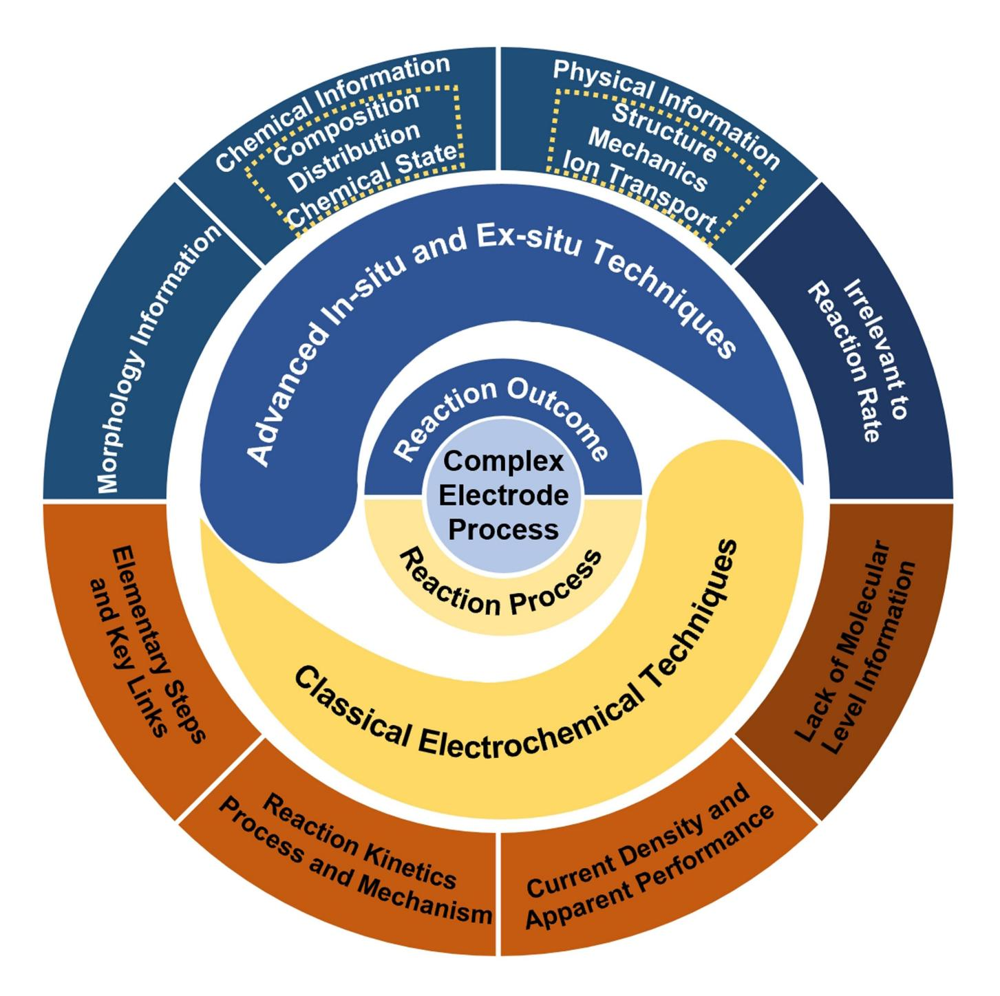
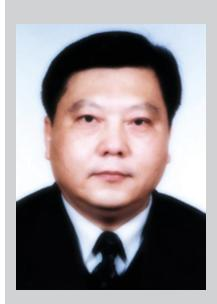
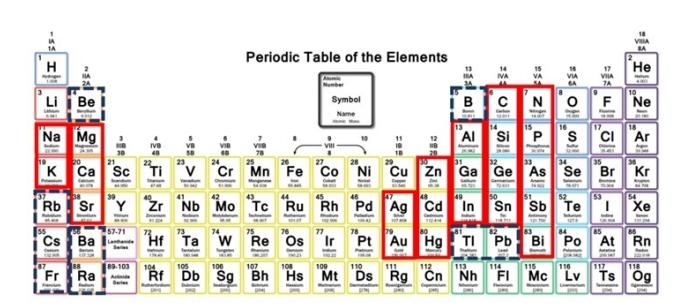
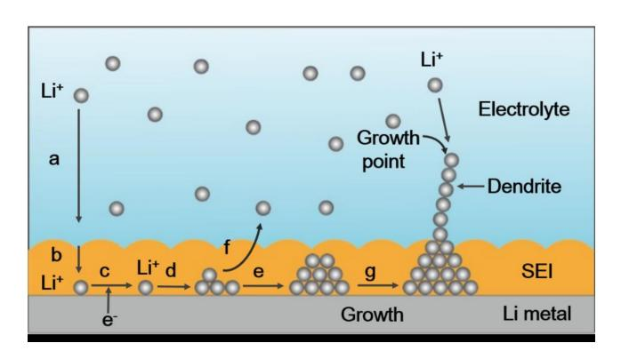
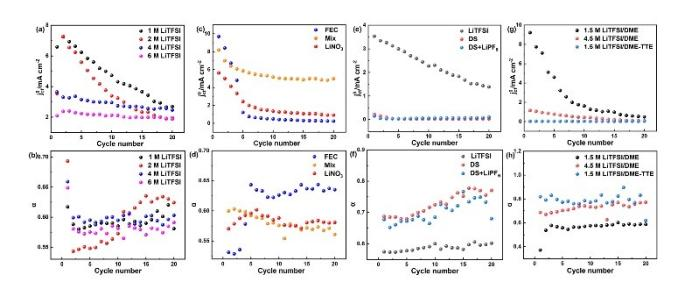
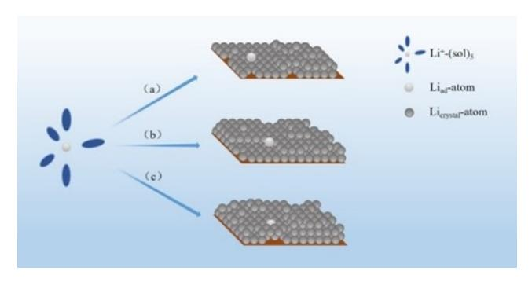
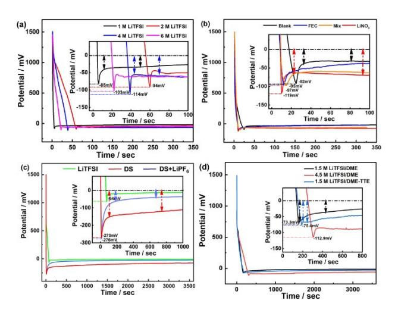
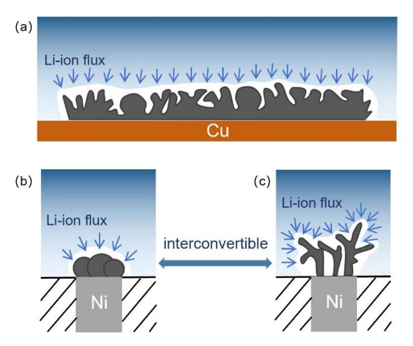
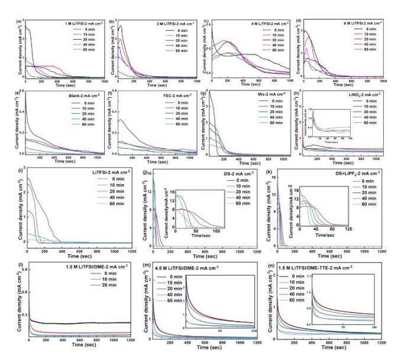
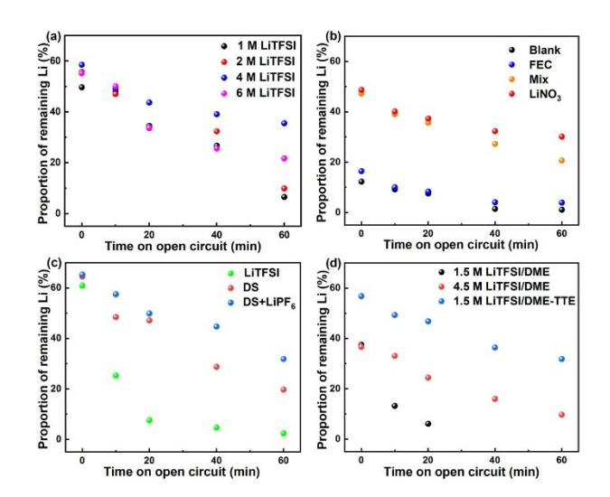

www.chemelectrochem.org

# **Lithium Metal Anode in Electrochemical Perspective**

Leping Wang,[a] Feng Wu,[a, b, c] Ying Yao,[a, b, c] and [Cunzhong](http://orcid.org/0000-0002-2836-6376) Zhang\*[a, b, c]

Lithium metal is a possible anode material for building high energy density secondary batteries, but its problems during cycling have hindered the commercialization of lithium metal secondary batteries. Until now, many sophisticated techniques have been used to obtain rich micro-morphological and physicochemical information of the deposition layer and the solid electrolyte interface (SEI), and to develop improvement strategies based on the information and achieve remarkable results. Regulating the reaction process around key links is a classic strategy to achieve expected results. Based on this

# **1. Introduction**

Energy and environment are two of the major problems in current society. Non-renewable energy sources, such as traditional fossil fuels, are becoming increasingly depleted and cause significant pollution of environment. Therefore, the use of environmentally friendly energy sources has a bearing on the future of human society, thus the development and utilization of new green and renewable energy sources, such as wind, hydro, geothermal, solar, ocean and biomass, and the improvement of the energy structure have received widespread attention.[1–3] However, these new energy sources are nonstorable and their output is unstable. Secondary chemical power sources has an irreplaceable position in building mode and framework (wind power storage,[4–7] photovoltaic energy storage,[8–9] etc.) for the future environmentally friendly energy using due to its energy storage and conversion features, naturally becoming the energy storage device that people focus on. Lithium metal has become one of the most important anode materials for high energy density secondary chemical power sources (Lij jNickel-Cobalt-Manganese ternary cathode (NCM),[10–12] Lij j Lithium-Rich Manganese-based cathode (LRMO),[13–14] etc.) due to its lowest electrode potential ( 3.04 V vs. SHE, Standard Hydrogen Electrode) and very high theoretical specific capacity (3,860 mAhg 1 ).

However, the electroplating/stripping of the lithium metal anode during cycling is accompanied by many complex behaviors, e.g., the emergence and development of volume change in the deposition layer and surface inhomogeneity (solid electrolyte interface (SEI) tearing, exposure of the lithium metal); and due to the high reactivity of lithium metal

| [a] L. Wang, Prof. F. Wu, Dr. Y. Yao, Dr. C. Zhang |  |  |  |  |
|----------------------------------------------------|--|--|--|--|
| School of Materials Science & Engineering          |  |  |  |  |
| Beijing Institute of Technology                    |  |  |  |  |
| Beijing, 100081, China                             |  |  |  |  |
| E-mail: czzhangchem@bit.edu.cn                     |  |  |  |  |

- [b] *Prof. F. Wu, Dr. Y. Yao, Dr. C. Zhang The National High Technology Development Center of Green Materials Beijing, 100081, China*
- [c] *Prof. F. Wu, Dr. Y. Yao, Dr. C. Zhang Beijing Key Laboratory of Environmental Science and Engineering Beijing, 100081, China*
- *© 2024 The Authors. ChemElectroChem published by Wiley-VCH GmbH. This is an open access article under the terms of the Creative Commons Attribution License, which permits use, distribution and reproduction in any medium, provided the original work is properly cited.*

empirical fact, we artificially highlighted the differences in the apparent performance of lithium metal anode using different series of electrolytes. We used microelectrode technology to analyze the reaction mechanisms and kinetic characteristics of each elementary step under all electrolyte conditions, revealing common laws that affect apparent performance and the basic steps that have a decisive impact on apparent performance. We discussed and elucidated the relevant physical and chemical principles, providing a clear basis for improving the pertinence and efficiency of improvement strategies.

(especially the freshly deposition layer), it will continue to corrode in the electrolyte, consuming lithium metal and electrolyte, and repeatedly generating electrochemically irreversible byproducts (SEI).[15–16] In addition, the inhomogeneity of the surface will continue to induce inhomogeneous deposition of lithium, such as mossy or dendritic lithium;[17–23] if the dendrites continue to grow, they will puncture the membrane, resulting in an short-circuit in the battery; and when the battery is discharged, due to the complex shape of lithium dendrites and different rates of electro-stripping of different microsites, lithium is easy to disconnect the electron contact to form dead lithium,[24–28] resulting in the decay of the specific capacity. These complex behaviors described above leads to many defects, such as reduced coulombic efficiency (CE), shorter lifetime, increased internal resistance, and safety issues, which have hindered the commercialization of lithium metal secondary batteries. This reveals that if the lithium metal anode undergoes only uniform lithium electroplating/stripping without other side reactions, the CE will reach 100%, the cycle life will be infinitely long, and there will be no safety problems. Therefore, CE, cycle life, and safety are intrinsically uniform, which is essentially the specificity of the chemical reaction.

The prerequisite for realizing the ideal lithium metal secondary battery is to ensure that the lithium metal anode performances ideally under all conditions. This requires that the surface of the deposition layer must be absolutely smooth (atomic level smooth, or equivalent curvature is equal to zero at any microscopic location on the surface) and absolutely dense (dense arrangement of lithium atoms with no other element atoms). In order to get such performance, many strategies and materials have been developed and used to optimize lithium metal anodes.

# **2. Research Progress of Lithium Metal Anode**

# **2.1. Electrolyte Engineering**

Electrolytes play a role in Li+ transport and SEI improvement in lithium metal batteries, and generally consist of solvents, supporting salts, and additives. Initially, Ming et al. found that the Li+ solvation structure in the electrolyte of Li-ion batteries significantly affected the performance of graphite electrodes, and later proposed a graphical model of Li+ solvation structure to study the electrolyte, in which the electrolyte is analogous to a crystalline material with a "basic unit", which is the Li+ solvation structure.[29–30] In non-aqueous electrolytes, Li+ is always solvated by the solvents and anions in supporting salts, forming a solvated sheath with a specific composition and structure. Solvated sheaths diffuse along with the Li+ and once they contact with the lithium surface, they are electro-reduced, becoming the main component of the SEI.[31–32]

Therefore, the types of organic solvents, the types and concentration of supporting salts and additives in electrolyte have an important influence on the cycling performance of lithium metal anode, thus the rational selection of organic solvents, supporting salts and additives is significant to improve the cycling performance of lithium metal anode.

#### *2.1.1. Solvents for Electrolyte*

Expanding the electrochemical window of the electrolyte is one of the key elements to increase the energy density of the battery. Researchers often use the energy difference between the highest occupied molecular orbital (HOMO) and the lowest unoccupied molecular orbital (LUMO) of the solvent molecules to theoretically explain and predict the electrochemical window of the electrolyte.[33–35] They believe that when the LUMO energy level of the solvent is higher than the Fermi energy level of the negative electrode, and the HOMO energy level is lower than the Fermi energy level of the positive electrode, there is no chemical reaction between the electrolyte and the positive and negative electrodes, therefore the battery system is in a stable state. However, it has been argued that the above view is inaccurate, because supporting salts and additives in the electrolyte can significantly change the limit values of reduction potential and oxidation potential in addition to the solvents.[36] Moreover, the electrochemical window of the electrolyte is not only affected by the electrolyte composition (solvents, support-

Leping Wang is pursuing a Master's of Materials Science and Engineering at Beijing Institute of Technology, China. Currently she is engaged in the research of lithium metal anode under the guidance of Associate Professor Cunzhong Zhang. Her research focus on exploring the kinetics behaviours and reaction mechanisms of lithium metal anode in polymer electrolyte.

Prof. Feng Wu is an Academician of Chinese Academy of Engineering, Academician of International Eurasian Academy of Sciences, Academician of Asia-Pacific Academy of Materials Sciences, Distinguished Professor and Vice-Director of Academic Committee of Beijing University of technology. He has long been engaged in the research and industrialization of new secondary batteries and related energy materials, and is one of the leaders in the field of secondary batteries and related energy materials in China.

ing salts, additives) but also by the scanning rate and electrode materials.[37] Therefore, the HOMO and LUMO of the solvent molecules are not the only factors affecting the electrochemical window.

In addition, almost all current studies only use the curves obtained by linear scanned voltammetry instead of cyclic voltammetry to evaluate the electrochemical window of electrolyte. Many studies typically set the minimum value of the scanning potential range relatively high,[31,38–39] for example, 2.5–3.0 V (vs. f00 *Li*þ*=Li*, condition equilibrium potential of Li+/Li redox couple), which is equivalent to only measuring the oxidation resistance of the electrolyte without measuring the reduction resistance. Such testing conditions and results are actually unreasonable. Throughout the history of battery development, the voltage of organic electrolyte batteries is significantly higher than that of aqueous electrolyte batteries. The fundamental reason for such fact is the emergence and use of low potential negative electrode materials, such as MCMB, Li, rather than significantly increasing the positive electrode potential. This can be understood from the electronic structure of the element undergoing a valence state change or placing the potential values of all electrodes within the potential scale of a standard hydrogen electrode. So, the electrolyte's reduction tolerance greatly affects the normal operation of low potential negative electrode materials. It should be noted that battery voltage is not equal to electrode potential.

Common solvents for lithium battery electrolytes are categorized as carbonate, ether, sulfone, nitrile, and so on. Carbonate solvents have excellent oxidative stability, their oxidation potential is up to 4.5 V vs. Li/Li+. [40–41] For example, propylene carbonate (PC) was first used as electrolyte in lithium ion batteries because of its high dielectric constant and wide electrochemical window, however, PC reacts violently with lithium metal, leading to low CE and serious safety risks.[42] Other carbonate solvents such as dimethyl carbonate (DMC),

Dr. Ying Yao is an associate professor at School of Materials Science and Engineering, Beijing Institute of Technology, China. She holds a Ph.D. from University of Florida with specialization in environmental nanotechnology. Her research interests are developing new carbon materials from carbon-rich biomass to be used as energy storage materials. She has authored or co-authored over 50 peer-reviewed articles in the field including 12 ESI highly cited papers.

Dr. Cunzhong Zhang is an associate professor at the School of Materials Science and Engineering, Beijing Institute of Technology, China. He holds a Ph.D. from Beijing Normal University in Physical Chemistry and learnt technique of SECM in Professor Allen J Bard's laboratory. He has been studying the kinetic behavior and mechanism of electrode reactions around the safety and energy conversion efficiency of secondary batteries.

diethyl carbonate (DEC), and ethyl methyl carbonate (EMC) are generally used as co-solvents to lower the boiling point and viscosity of the electrolyte.[40,42] Although carbonate solvents are effective in extending the life of lithium ion batteries and improving their apparent performance, there are few carbonate electrolytes that can cycle stably and provide high CE in lithium metal batteries. Gan et al. found that compared to carbonatebased electrolytes, lithium metal anodes have better stability in ether-based electrolytes, because they are able to form more intact and stable SEIs.[43] Currently, the most commonly used electrolytes for lithium metal batteries are also ether-based solvents and their mixed solvents.[37] For example, 1,3-dioxopentane/1,2-dimethoxyethane (DOL/DME) mixed solvents are commonly used as the electrolyte of lithium-sulfur batteries to improve the cycling performance of lithium sulfur batteries. In addition, sulfone and nitrile electrolytes have been promising for high-voltage battery applications in recent years. Cyclic sulfone and nitrile solvents have high flash point, good stability and safety performance, but most of the sulfone electrolytes have high melting points and viscosity, so they are generally used as additives or co-solvents.[38,44–46] Nitrile solvents have wider electrochemical window and lower viscosity than sulfone, but some nitrile electrolytes will react with lithium metal, making it difficult to form a stable SEI on the surface of lithium metal anode.[38,44]

# *2.1.2. Supporting Salts for Electrolyte*

The morphology of lithium metal deposition layer is affected by the supporting salts in addition to the solvents, e.g., dissociation degree of the salts, the degree of solvation, and oxidation tolerance of the anions, which determine the chemical composition and physicochemical properties of SEI.[47–48] Supporting salts are mainly used to provide Li+ in the electrolyte, and there are limited types of them, such as LiClO4, LiPF6, LiTFSI, LiFSI.[31,49–51] LiPF6 is widely used as commercial supporting salt in lithium ion batteries, which has a high transference number, but poor thermostability and safety.[49] Compared with LiPF6, LiFSI and LiTFSI have good thermal and electrochemical stability and are often used in high concentration electrolytes. In addition, some lithium salts are used as additives to assist in the formation of stable SEIs, such as LiNO3 and LiBOB.[52–53] Recently, Kwon et al. found that the electrolytes prepared by LiBF4 with tetrahydropyran, ether or other solvents can regulate the morphology and particle size of LiF in SEI, thus improving the CE of lithium metal batteries.[54]

In addition to the types of supporting salts, the concentration of supporting salts also has an important influence on the cycling performance of lithium metal anode. Low concentration electrolyte has the advantages of low viscosity, high diffusion coefficient, good wettability and low cost, but free solvent molecules in it are easy to oxidize and decompose under the high potential. With the increase of electrolyte concentration, the proportion of free solvent molecules are greatly reduced. Therefore, high concentration electrolyte has high oxidative stability due to their unique solvation structure and very few free solvent molecules, which helps to achieve stable cycling in lithium metal batteries.[55] However, high cost and poor wettability due to high concentration greatly limit its practical application. To solve these problems, researchers have developed localized high concentration electrolyte (LHCE) by adding diluents to high concentration electrolyte.[56–58] For example, Yu et al. established a dual-solvent LHCE with bis(2,2,2-trifluoroethyl) ether (BTFE) as the diluent, and this carbonate-based LHCE had excellent electrochemical performance with an average CE of 98.5%.[59]

# *2.1.3. Additives for Electrolyte*

Electrolyte additives can be categorized into SEI-forming additives and deposition regulating additives. SEI-forming additives decompose before other components in electrolyte and produce decomposition products that facilitate stable SEI formation. These additives mainly contain elements, such as N, C, I, F, O, B, and assist in the formation of inorganic compoundrich SEI by the reduction of anions.[52–53,60–61] For example, Zhang et al. developed fluoroethylene carbonate (FEC) as an electrolyte additive to generate LiF-rich SEI,[41] and Wang et al. proposed that LiI can be used as an electrolyte additive to assist in the formation of SEI.[62] Due to the large interfacial energy of "inorganic compounds/Li", the bonding between lithium metal anode and SEI is reduced, so that lithium atom can diffuse preferentially along the SEI/Li interface, which is favorable for the uniform deposition of lithium. In addition, inorganic compound-rich SEI has high mechanical strength, which can inhibit the growth of dendrites. Different inorganic components in SEI also lead to the different performance, e.g., Liu found that the lithium deposition layer corresponding to SEI with higher proportion of F and B is more regular and dense, which improves the apparent performance of lithium metal anode.[61]

Most of the SEI-forming additives are depleted in order to be incorporated into the SEI, which is not conducive to longterm cycling. In contrast, some non-sacrificial additives, such as electrostatic shielding additives, affect the lithium deposition behavior only by modulating the interfacial electrochemical reaction, which is more suitable for long-term cycling. The principle of electrostatic shielding mechanism is to promote the uniform deposition of lithium by adsorbing non-lithium cations (with lower reduction potential than Li+) at the tip of the dendrites. Ding et al. firstly discovered and proposed the electrostatic shielding effect of alkali metal cations, such as Cs+, K+, according to the Nernst equation by adjusting the concentration of alkali metal cations.[63] Ionic liquids (especially pyrrolopyridine (Pyr)-based ionic liquids) have also been considered as shielding agents for Li+ due to the low cation reduction potential. For example, Zhong et al. introduced an ionic liquid with a long aliphatic chain (containing n-methyl-ndecylpyridine cation (Pyr1(10)+) and TFSI ) as a non-consumable electrostatic shielding additive into an ether-based electrolyte. The results showed that the CE of the Lij j LiFePO4 battery using the modified electrolyte remained as high as 99.9% for

270 cycles at 1 C, while the control battery could only maintain for 110 cycles.[64]

In addition, there is a type of additives that can contribute to the uniform distribution of Li+ by building up the electrolyte structure with a high concentration on the negative electrode surface. After reduction at the negative electrode surface, Li+ in the electrolyte cannot be replenished to the interface immediately, thus forming a low-concentration zone and subsequently initiating dendrites. Previous studies have shown that when the ion concentration distribution at the negative electrode tends to be stable and high, the deposition layer exhibits a smooth morphology.[65] Chen et al. utilized this principle to introduce montmorillonite into an ether-based electrolyte to optimize the distribution of Li+ in the electrolyte. As a layered silicate, montmorillonite, due to its ionic self-enrichment, will make its surface ionic concentration higher than the ionic concentration of the body solution, and thus the interface between the electrolyte and the electrode is a high Li+ concentration zone, which makes Li+ distributed stably and uniformly on the electrode surface, and produces dendrite-free lithium deposition.[66]

## *2.1.4. Solid-state Electrolyte*

Due to the growth of lithium dendrites and the mobility of flammable organic liquid electrolytes, the safety issues (inner short circuits and thermal runaway) of liquid lithium metal batteries have seriously hindered their practical application. Solid-state electrolytes have high apparent mechanical strength, so using them becomes a reasonable strategy to solve the safety problems. In recent years, the research mainly includes the following two types of solid-state electrolytes: inorganic solid-state electrolytes and polymer solid-state electrolytes.

Among all inorganic solid-state electrolytes, garnet-type solid-state electrolytes stand out due to their wide electrochemical window, and are one of the few solid-state electrolytes that remain stable at electrochemical potential of lithium metal, thus becoming an excellent candidate for solid-state lithium metal batteries. However, garnet-type electrolytes have poor interfacial contact with lithium due to their lithiophobicity and Li2CO3 contamination on their surfaces.[67] Moreover, inorganic solid-state electrolyte cannot avoid the problem of stress caused by microscopic grain boundaries, structural defects, and compositional strains, and the inhomogeneity of its structure and composition will bring about inhomogeneity of physicochemical properties, such as inhomogeneity of mechanical strength, ion mass transfer, which cannot achieve uniform deposition of lithium at the molecular level, but tends to promote the growth of dendrites.[68–70] In addition, the process of charge transfer at the "lithium/solid electrolyte" interface inherently suffers from a high interfacial impedance (leading to thermal effects), which is also unfavorable to the energy conversion efficiency of the device.[68]

Compared with inorganic solid-state electrolytes, polymer solid-state electrolytes (SPEs) have high flexibility, excellent lithium compatibility and low interfacial impedance, which can effectively solve the problems arising from inorganic solid-state electrolytes. SPEs are usually composed of polymers, such as polyethylene oxide (PEO), polyvinylidene fluoride-co-hexafluoropropylene (PVDF-HFP) and polyacrylonitrile (PAN), which are used as the substrate, and the supporting salts.[71–74] PEO is the earliest and most researched in polymer electrolyte materials, which has the best compatibility with lithium metal, but its high crystallinity causes problems such as the difficult Li+ migration and low ionic conductivity at room temperature, so the researchers have carried out a series of modifications to establish a cross-linking structure through blending, copolymerization, grafting, etc., to reduce the crystallinity of PEO and to enhance the ionic conductivity of the electrolyte system.[75–77] For example, Zhang et al. reported the synthesis of polymer with hyperbranched structure, obtaining a polymer electrolyte with high ionic conductivity.[71] The alkyl fluoride in PVDF-HFP facilitates the dissociation of Li+, which can enhance the Li-ion conductivity.[72] PAN-based polymers have the wide electrochemical window with both high energy density and high safety, which can match high potential cathodes and have many applications in lithium metal batteries, such as membrane, anode protection layers, and gel electrolyte substrates.[73–74]

Composite solid-state electrolytes have the respective advantages of inorganic solid-state electrolytes and polymer solid-state electrolytes, and many research methods have been used to improve the ionic conductivity and mechanical strength of polymer solid-state electrolytes while retaining their own advantages by filling inorganic particles into the polymer skeleton to take advantage of the good electrical conductivity and mechanical strength of the inorganic particles.[77–79] For example, solution casting was used by Yin et al. to prepare a novel composite solid-state electrolyte consisting of PEO, aramid nanofibers (ANFs), and cubic garnet Li7La3Zr2O12 (LLZO).[39] By constructing a three-dimensional flexible skeleton of ANFs and PEOs and introducing LLZO particles as Li+ conductive fillers into the polymer skeleton, the crystallinity of PEOs was effectively reduced, new ion transport pathways were created, and the toughness and hardness of the electrolyte were significantly improved. The results showed that the ionic conductivity of the prepared electrolyte was increased to 1.36 mScm 1 at 30°C, and the capacity retention of Lij j LiFePO4 battery using the electrolyte was over 88% after 400 cycles.

# **2.2. Surface Engineering for Lithium Metal Anode**

# *2.2.1. Artificial SEIs*

SEI can isolate the lithium fresh lithium clusters/deposition layer from the electrolyte to avoid violent side reactions between the two, and can also inhibit the growth of lithium dendrites if it has high mechanical strength. However, natural SEIs are generally brittle and prone to rupture during cycling, so it is necessary to establish artificial SEIs with high mechanical stability.

The design of SEI mechanical stability can be divided into two types: one is the use of high-strength and high-hardness inorganic materials. LiF, LiCl, and other lithium halides are widely considered to be components of SEI that play an important role in passivation of lithium metal anode.[80–81] Therefore, many studies have been carried out to construct lithium halide-rich SEIs. Li3N has also been widely used in artificial SEIs due to its stability.[82] For example, lithium foil in a molten state is placed in high-purity nitrogen to generate the dense Li3N passivation layer on its surface;[83] another method is to directly introduce a three-dimensional conductive matrix containing N element into the lithium metal anode for the subsequent formation of SEI.[84] However, these inorganic protective layers are prone to grain boundary cracking in SEIs during cycling. The other is the use of flexible polymer materials. These materials are highly elastic and viscoelastic, and some of them are also self-healing, making them an excellent choice for constructing SEIs. For example, Liu et al. proposed a dynamically crosslinked polymer as an electrode coating that exhibits properties similar to those of non-Newtonian fluids, with mobility and stiffness capable of changing with the growth rate of lithium.[85] When localized inhomogeneous lithium deposition occurs on the electrode, the coating responds and stiffens at zones which have fast deposition rates to restrain the localized lithium growth. In addition, SEIs for uniform Li+ transport can be constructed with electrolyte additives to improve cycling performance of lithium metal batteries.[64,66,86]

## *2.2.2. Three-dimensional High Specific Surface Current Collector*

It is concluded that the 3D current collector provides a stable framework and high specific surface area, which is conducive to confining lithium within the matrix and reducing the volumetric change rate during cycling; the high specific surface area also significantly reduces effective current density on the surface, realizes a uniform Li+ flux on the electrode surface, and can effectively inhibit the growth of lithium dendrites.[87–92] Therefore, 3D current collectors have a certain influence on the morphology of lithium deposition layer and cycle life in lithium metal batteries. For example, Xiang et al. embedded Cu/Cu3P particles into carbon nanofibers(CNFs) as a multifunctional current collector, which effectively suppressed the growth of lithium dendrites by decreasing the local current density and providing uniform lithium deposition sites, and the CE of Lij j Cu/Cu3P-CNFs cells was maintained at 94% after 500 cycles at 1 mAcm 2 . [93] Kyungeun used Ag-modified cellulose carbide fibers (Ag@CC) as a 3D current collector, and Ag@CC was able to form AgLi with Li, which facilitated the deposition of Li inside the 3D structure and reduced the volumetric expansion rate during cycling but did not demonstrate whether it could improve the CE.[94] In fact, the complex structure of 3D high specific surface current collector does not provide uniform lithium deposition sites, and it has not been reported that simply reducing the current density can definitely improve the CE.

#### *2.2.3. Lithophilic Surface*

Solid state electrolytes, due to their rigidity, are difficult to achieve molecular scale contact with lithium metal anode, resulting in significant obstacles to lithium nucleation during charging and discharging processes. Therefore, interface issues have yet to be largely resolved. Many researchers have used lithophilic elements at the interface to construct lithophilic interfaces or coatings to alleviate dendrite formation.[95–98] Huggins pointed out that lithophilic elements are easy to form alloys with lithium, which can accelerate the diffusion of lithium atoms and thus change the morphology of the nucleation and deposition layer.[99] Elements capable of forming alloys with lithium metal are illustrated in Figure 1.

For example, Cui proposed a melt quenching method to uniformly coat garnet surfaces with an alloy interface-modified layer containing multiple metals.[67] The homogeneous AgSn0.6Bi coating on the garnet surface has a high affinity for lithium, which enables lithium atoms to diffuse rapidly in the coating, thereby slowing down dendrite formation and growth. The Lij j NCM solid-state battery composed of this surface-modified garnet-type solid-state electrolyte maintained 86% of its initial capacity after a stable cycling of 1000 cycles at 1 C. As another example, Liang et al. slowed down the formation of lithium dendrites by an in situ formed surface film consisting of lithiumbased alloys (e.g., Li13In3, Li2Zn, Li3Bi, and Li3As).[100]

Many improvement strategies for 3D current collectors also require uniform lithium plating/stripping with the help of lithophilic materials.[93–94,101] For example, Fu prepared a novel 3D composite anode (Fe N@SSM Li), a lithophilic conductive structure that induces uniform Li+ deposition and whose surface Li3N lithophilic sites help to reduce the nucleation overpotential of Li on the composite anode.[101]

#### *2.2.4. Dendrite Inhibition by Mechanical Pressure*

In addition to the electrolyte engineering to promote the uniform distribution of Li+, the establishment of high-mechanical-strength or flexible interfaces, and the construction of lithophilic surfaces, there are also researchers who directly inhibit the growth of dendrites by mechanical pressure.[102–104] Shen et al. proposed that the mechanism of the external

**Figure 1.** Elements in the periodic table of elements that tend to form alloys with lithium (reported lithophilic elements in red frames and possible lithophilic elements in blue dashed frames).

pressure on lithium anode through the mechano-electrochemical phase-field model can be divided into two main types:[105] (1). inhibit lithium deposition, reducing the rate performance of the battery; (2). make the morphology of lithium dendrites denser, but poor mechanical stability. For example, Kim et al. inhibited the dendrites by applying an external pressure of 1200 kPa, and obtained a very good cycling stability.[106] However, the mechanical pressurization strategy cannot completely inhibit the growth of dendrites, nor can it ensure that a smooth and dense deposition layer is obtained.

Ideal (absolutely smooth and dense) deposition layer (for example: solid electrode surface of the Hg film) on the surface of the various microscopic positions by the force must meet two conditions: (1). the direction of the force: the direction of the force on the various microscopic sites and the tangent direction of the site is completely perpendicular to the direction of the site; (2). the magnitude of the force: the size of the force on the various microscopic sites is directly proportional to the equivalent curvature of the site. Obviously, it is impossible for the macroscopic applied mechanical force to fully satisfy the above conditions. In particular, for solid-state lithium-metal batteries, this strategy may also lead to an increase in localized stresses at grain boundaries, resulting in solid-state electrolyte fracture and triggering the risk of internal short circuits.[107] In addition, this strategy requires an external pressurization device and introduces additional weight, which completely counteracts the high energy density advantage of Li-Metal batteries, thus improving the deposition layer with the help of macroscopic external mechanical forces is not a reasonable choice. However, this strategy inspires us to build a "Li/electrolyte or Li/ SEI" double-layer structure around the key parameter of "force" to achieve the desired results.

From the perspective of electrode reaction process mechanism, electrolyte engineering and surface engineering affect different elementary steps, respectively. Electrolyte engineering mainly involves changing mass transfer parameters, followed by the formation of SEI through the reaction of solvents, additives, and fresh metal lithium plating layers, which in turn affects the interface and surface elementary steps. The main changes in surface engineering are interface charge transfer step and the physical and chemical behavior on solid surfaces, for example, electro-crystallization.

## **2.3. Characterization and Analysis Techniques**

Current researches mainly focus on explaining and understanding apparent performance of electrode reaction at the microstructural and compositional levels. Understanding the evolution of SEI composition, SEI structure and deposition layer morphology on lithium metal anode during charging/discharging processes is the basis for understanding the deterioration mechanism of its apparent performance and formulating improvement strategies. Researchers have continuously used different characterization and analysis techniques to observe and characterize the morphology of the lithium deposition layer, the structure and composition of the SEI. And with the development of various characterization and analysis techniques and in-depth research on lithium metal anode, the information obtained has become more and more accurate. For example, by using advanced characterization and analysis techniques such as X-ray photoelectron spectroscopy (XPS),[108–110] scanning electron microscopy (SEM),[111–112] Fourier transform infrared spectroscopy (FTIR),[113–114] secondary ion mass spectrometry (SIMS),[108] and atomic force microscopy (AFM),[115] the morphology of the deposition layer, the chemical composition of the SEI, as well as other physical information (electrical, mechanical) and chemical information (elemental valence, spatial distribution) can be obtained. The effectiveness of improvement strategies can be characterized and evaluated through characterization and analysis techniques, and conversely, the information obtained through characterization and analysis techniques can be used to further expand improvement strategies. It should be noted that the above techniques only display information reflecting the outcome, but not provide information on the formation process of this outcome.

# **3. Electrochemical Strategies**

## **3.1. Neglected Clues and New Perspectives**

## *3.1.1. The Status and Defects of Research Strategies*

Until now, people have adopted a large number of materials and strategies for lithium metal anodes and achieved varying degrees of improvement effects. These facts mean that people's understanding of the electroplating/stripping process on the lithium metal anode is not yet complete, especially in terms of not clearly grasping and understanding the key links in the process. Although various characterization and analysis techniques can obtain detailed visualization information, the lack of the key parameter of apparent reaction rate (charge/discharge rate) makes it difficult for us to establish the correlation between visualization information and reaction rate, which also leads to limitations in our cognition.

Common sense suggests that the apparent performance of a cell is not only related to the manufacturing factors but also to the operation conditions, and there is an optimal range of operation conditions, i. e., the operation rate (current density) directly affects the apparent performance and the outcome of both electrode and cell. Exploring and elucidating the reaction dynamics mechanism under different series of electrolytes and elucidating the key links that are decisive for the outcome not only helps us to accurately understand and comprehend all the macroscopic and microscopic behaviors, as well as the intrinsic laws during the electroplating/stripping processes, but also provides a kinetic basis for improving the pertinence and efficiency of improvement strategies. Therefore, grasping the dynamic characteristics of the process and its effects will become indispensable perspective and entry point for understanding the electroplating/stripping process and improving the performance of lithium metal anode.

#### *3.1.2. Fundamental Focus and Entry Point*

According to previous studies, the electrochemical plating process of lithium metal negative electrode can be roughly described in Figure 2.[116]

The apparent behavior of the electrode process is controlled by the reaction mechanism. By combining polarization curves with information from various *in-situ* techniques, the mecha-

**Figure 2.** Schematic diagram of lithium metal electrochemical plating process.[116] (a) and (b) are mass transfer steps; (c) interfacial charge transfer step; (d) formation of lithium nuclei; (e) growth of lithium nuclei;(f) selfcorrosion process (chemical reaction between lithium metal and electrolyte); (g) dendritic Li formation. Reprinted with permission from ACS Appl. Mater. Interfaces2020, 12, 8366–8375. Copyright @2020, American Chemical Society.

| Table 1. Groups abbreviations.[60–61,116,123]                                               | of different series of electrolytes |        | and                      | their |  |
|------------------------------------------------------------------------------------------------|-------------------------------------------------|--------|--------------------------|-------|--|
| Support Salt                                                                                   | Electrolyte Groups                              |        | Denoted by               |       |  |
| Concentration Series[116]                                                                   | 1 M LiTFSI/DOL-DME                              |        | 1 M LiTFSI               |       |  |
|                                                                                                | 2 M LiTFSI/DOL-DME                              |        | 2 M LiTFSI               |       |  |
|                                                                                                | 4 M LiTFSI/DOL-DME                              |        | 4 M LiTFSI               |       |  |
|                                                                                                | 6 M LiTFSI/DOL-DME                              |        | 6 M LiTFSI               |       |  |
| Additive Type                                                                                  | Electrolyte Groups                              |        | Denoted by               |       |  |
| Series[60]                                                                                     | 1 M LiTFSI/DME                                  | Blank  |                          |       |  |
|                                                                                                | FEC in 1 M LiTFSI/DME                           | FEC    |                          |       |  |
|                                                                                                | FEC+LiNO3 in 1 M LiTFSI/DME                     | Mix    |                          |       |  |
|                                                                                                | LiNO3 in 1 M LiTFSI/DME                         | LiNO3  |                          |       |  |
| Support Salt                                                                                   | Electrolyte Groups                              |        | Denoted by               |       |  |
| Type Series[61]                                                                             | 1 M LiTFSI/EC-EMC                               | LiTFSI |                          |       |  |
|                                                                                                | 0.7 M LiTFSI+0.3 M LiBOB/EC-EMC                 | DS     |                          |       |  |
|                                                                                                | 0.7 M LiTFSI+0.3 M LiBOB+0.05 M LiPF6/EC-EMC |        | DS+LiPF6                 |       |  |
| Localized High                                                                                 | Electrolyte Groups                              |        | Denoted by               |       |  |
| Concentration Series[123]                                                                   | 1.5 M LiTFSI/DME                                | DME    | 1.5 M LiTFSI/            |       |  |
|                                                                                                | 4.5 M LiTFSI/DME                                | DME    | 4.5 M LiTFSI/            |       |  |
|                                                                                                | 1.5 M LiTFSI/DME-TTE                            |        | 1.5 M LiTFSI/ DME-TTE |       |  |
| In the table, TTE's full name is 1,1,2,2-tetrafluoroethyl-2,2,3,3-tetrafluor opropyl ether. |                                                 |        |                          |       |  |

nisms that generate various macroscopic and microscopic behaviors can be clearly elucidated, and the basic steps (key links) that have a significant impact on the reaction results can be verified during the reaction process. Microelectrodes have many unique advantages and have been used to analyze the complex electrode reaction mechanisms and kinetic characteristics of elementary steps,[117–118] as well as to conduct in-depth studies on the performance of different electrode materials.[119–122] In order to explore the elementary steps (key links) that have a decisive impact on the apparent performance and behavior, as well as various physical and chemical laws behind the apparent phenomena, we selectively adjusted certain factors based on typical electrolytes of actual battery systems to obtain the following four series of electrolytes[60–61,116,123] (Table 1, and the electrolyte groups appearing in the following are represented by abbreviations), artificially highlighting the differences in the apparent performance and behavior and exploring the effects of different chemical conditions (electrolyte composition) and operating conditions (current density) on the elementary steps using microelectrode technology and classical electrochemical methods.

## **3.2. Mass Transfer Step**

Sand first observed the formation of dendrites using an optical microscope and found that the concentration of electroactive ions in the electrolyte thin layer area closest to the electrode surface also decreased to zero at the moment of apparent of dendrites.[124] The time required for him to reduce the initial concentration of ions to zero is called the Sand time. Since then, many researchers have used Sand time to characterize and determine the appearance of dendrites.[65,125–126] Bai et al. observed the electrodeposition morphology of lithium metal in glass capillaries by in situ optical microscopy, and found that a bunch of dendrites with obvious tip growths would appear when the lithium salt on the surface of the negative electrode was depleted, which also confirms the conclusion of Sand.[127] However, the reduction of the surface concentration to zero corresponds only to the concentration gradient reaching its maximum value and the limiting diffusion current density, i. e., the diffusion rate reaching its maximum value, when the dendrites grow the fastest and are more easily observed. In fact, Li+ in the electrolyte has been undergoing electrochemical reduction reactions and forming Li metal nuclei, metastable nuclei, and deposition layers even before the Sand time, i. e., before the researchers observed the dendritic Li formation. Therefore, there are temporal and spatial limitations in the conclusions and theoretical models based solely on the phenomena observed by optical microscopy.

However, elucidating the relationship between Sand time and kinetic parameters of the mass transfer step still helps to understand and judge the formation and development of dendrites from a macroscopic point of view, and lays the foundation of mass transfer kinetics for selecting and evaluating

electrolytes. The following expression was given by the previous authors, see Eq. 1:[128]

$$
\tau_{Sand} = \pi D_{Li^+} \left( \frac{C_{Li^+} e n_{Li^+}}{2j} \right)^2 \left( \frac{\mu_a + \mu_c}{\mu_a} \right)^2 \tag{1}
$$

where DLiþ is the diffusion coefficient of Li+, *e* is the elementary charge constant, *nLi*þ is the number of Li+ valence or charge, j is the apparent charging/discharging current density, m*a* and m*c* are the ionic mobility of anions and cations, respectively, and t*Sand* is the Sand time.

Since Eq. 1 also contains m*a*, which does not accurately reflect the correlation between the Li+ mass transfer characteristics and the formation of dendrites, and is not conducive to the accurate and rapid evaluation and screening of the electrolyte performance by experimental data, we rearrange Eq. 1 to obtain the quantitative relationship between the Li+ mass transfer parameters only and the Sand time, see Eq. 2:[60]

$$
\tau_{Sand} = \pi D_{Li^{+}} \left( \frac{C_{Li^{+}} e n_{Li^{+}}}{2j} \right)^2 \left( \frac{1}{1 - t_{Li^{+}}} \right)^2 \tag{2}
$$

where tLi + is the Li+ transference number and the meanings of the rest of the parameters are consistent with the meanings of the parameters in Eq. 1.

Equation 2 clearly reflects the relationship between the kinetic parameters of Li+ mass transfer and t*Sand*, which is helpful for rapid evaluation and screening of electrolytes. Equation 2 shows that increasing tLi + and DLiþ , or decreasing j can increase t*Sand*, i. e., delay the time of dendrite generation. In addition, when tLi +!1, t*Sand*!∞, which means that in this case, the battery can maintain good apparent performance at any operation current density. In the future, using 3D current collectors to reduce the current density[87–89,91] is no longer a necessary strategy to delay dendrite formation and improve battery safety, and adjusting electrolyte composition to increase tLi + is a basic strategy to optimize electrolytes and improve safety.

It is worth noting that the original intention and exact meaning of t*Sand* in Eq. 1 and Eq. 2 was to refer to the time when the concentration of reactants on the electrode surface dropped to zero (i. e., the maximum concentration gradient distribution was reached). This statement describes elementary steps, a and b, of lithium metal electrochemical plating process in Figure 2. Such regulations not only provide clearer descriptions, but also have universal significance and universality in electrochemical discipline. However, this statement does not describe the behavior and form of the product after the interface charge transfer step. In fact, whether the product is a soluble species (e.g., OH , product of ORR in basic aqueous electrolyte) or a product that can form an absolutely smooth coating (e.g., a mercury film, an atomic-level smooth layer), the concentration of reactants ( O2 or Hg2+ ) on the electrode surface will decrease to zero when the reaction time is long enough. Therefore, from the perspective of strict electrochemical reaction mechanisms, using only t*Sand* to predict the formation of dendrites is not rigorous and also misleading.

Based on the apparent performance of the lithium metal anode in the four series of electrolytes and the kinetic parameters of Li+ mass transfer in the electrolytes (Table 2), it can be found that there is not a very clear and unambiguous correlation between the kinetic parameters of the mass transfer step and the apparent CE of the lithium metal. Notably, the cycle life of the lithium metal anode in the series of electrolytes with the lowest tLi + is instead the best, which suggests that the determining factor affecting the apparent performance is not the mass transfer kinetics, but rather other factors. That is, the mass transfer step is not the key links affecting the apparent performance. This means that optimizing the performance of lithium metal anode around this elementary step will not obtain significant results. In terms of electrode process kinetics, t*Sand* merely describes the effect of the mass transfer step and does not determine the interfacial charge transfer behavior and subsequent electro-crystallization behavior, and thus the modification of lithium metal anode with the help of t*Sand* is not very reasonable.

In addition, a comparison of the effects of changes in electrolyte composition (concentration of support salt, additives and type of support salt, and inert diluent) on the apparent performance reveals that the additives have the most significant improvement in the apparent performance, and thus the

| Table 2. Li+ mass transfer kinetic parameters and lithium metal anode apparent performance in different series of electrolytes.[60–61,116,123] |           |                                   |                        |                      |  |  |
|---------------------------------------------------------------------------------------------------------------------------------------------------|-----------|-----------------------------------|------------------------|----------------------|--|--|
| Electrolyte Groups                                                                                                                             | + tLi  | +×10 6 DLi (cm2 s 1 ) | CE (0.2 mAcm 2 ) | Stabilized Cycles |  |  |
| 1 M LiTFSI                                                                                                                                        | 0.53�0.02 | 2.56                              | 95%                    | 15                   |  |  |
| 2 M LiTFSI                                                                                                                                        | 0.54�0.04 | 1.1                               | 98%                    | 50                   |  |  |
| 4 M LiTFSI                                                                                                                                        | 0.55�0.03 | 0.34                              | 98%                    | 80                   |  |  |
| 6 M LiTFSI                                                                                                                                        | 0.52�0.05 | 0.12                              | 98%                    | 60                   |  |  |
| Electrolyte Groups                                                                                                                             | + tLi  | +×105 DLi 1 (cm2 s )  | CE (0.2 mAcm 2 ) | Stabilized Cycles |  |  |
| Blank                                                                                                                                             | 0.26�0.03 | \                                 | 95%                    | 122                  |  |  |
| FEC                                                                                                                                               | 0.27�0.04 | 2.53                              | 97%                    | 130                  |  |  |
| Mix                                                                                                                                               | 0.31�0.03 | 4.23                              | 98%                    | 220                  |  |  |
| LiNO3                                                                                                                                             | 0.35�0.01 | 3.65                              | 99%                    | 337                  |  |  |
| Electrolyte Groups                                                                                                                             | + tLi  | +×106 DLi 1 (cm2 s )  | CE (0.2 mAcm 2 ) | Stabilized Cycles |  |  |
| LiTFSI                                                                                                                                            | 0.55�0.04 | \                                 | \                      | 0                    |  |  |
| DS                                                                                                                                                | 0.53�0.02 | 1.9                               | 94%                    | 40                   |  |  |
| DS+LiPF6                                                                                                                                          | 0.57�0.03 | 1.8                               | 94%                    | 50                   |  |  |
| Electrolyte Groups                                                                                                                             | + tLi  | +×106 DLi 1 (cm2 s )  | CE (0.2 mAcm 2 ) | Stabilized Cycles |  |  |
| 1.5 M LiTFSI/DME                                                                                                                               | 0.30�0.01 | 3.87                              | 95.50%                 | 65                   |  |  |
| 4.5 M LiTFSI/DME                                                                                                                               | 0.32�0.01 | 1.18                              | 96.30%                 | 103                  |  |  |
| 1.5 M LiTFSI/DME TTE                                                                                                                        | 0.38�0.01 | 1.87                              | 97.60%                 | 97                   |  |  |

*ChemElectroChem* **2024**, *11*, e202400019 (9 of 17) © 2024 The Authors. ChemElectroChem published by Wiley-VCH GmbH

modification of lithium metal anode by additives is the most succinct and efficient among the four series of electrolytes.

#### **3.3. Interface Charge Transfer Step**

The kinetic behavior of the interfacial charge transfer step, which is a elementary step in the lithium metal electro-plating process, has been investigated in different electrolytes.[121,129] The rate of charge transfer at the interface is generally evaluated in terms of the exchange current density (jct 0 ).[130] Since jct 0 is closely related to the interfacial structure of the Li-Metal/SEI, the trend of jct 0 can also reflect the degree of integrity of the SEI as well as the degree of stabilization of its composition and properties. Combining the apparent cycling performance shown in Table 2 and the trend of jct 0 shown in Figure 3, it can be seen that if jct 0 is stabilized at the initial stage of cycling or can be stabilized in a very short period of time (3-5 cycles), it can continue to remain stable in subsequent cycles. In other words, a good SEI is formed at the beginning of the loop (in a very short amount of time), and if a good SEI is not formed at the beginning, it cannot be formed in subsequent cycles. Due to the subsequent behavior of adsorbed lithium atoms formed after the charge transfer step, there are at least two pathways: (a). aggregation to form crystal nuclei, and (b). reaction with different molecules of the initial electrolyte (solvents, supporting salts, and additives) to form SEI. Therefore, the reaction rate of the (b) pathway, the initial reactants other than adsorbed lithium atoms, and the composition and stability of SEI are issues worth exploring and summarizing.

Based on mathematical modeling, Akolkar found that a deviation of the transfer coefficient by 1/2 (the classical value of the Bulter-Volmer theory) resulted in a smooth deposition layer, and that the more significant the deviation, the smoother the layer.[129] However, he did not discuss the reason for this result. The research results in four series of electrolytes also found the same situation,[60–61,116,123] and found the following logic relationship: "long cycle life / smooth deposition layer / transfer

**Figure 3.** Kinetic parameters of the charge transfer step in different series of electrolytes versus the cycle number.[60–61,116,123] (a) and (b) are the series of supporting salt concentration; Reprinted with permission from ACS Appl. Mater. Interfaces2020, 12, 8366–8375. Copyright @2020, American Chemical Society. (c) and (d) are the series of additive types; Reprinted with permission from ACS Appl. Mater. Interfaces2021, 13, 18283–18293. Copyright @2021, American Chemical Society. (e) and (f) are the series of supporting salt types; Reprinted with permission from Electrochim. Acta2023, 457, 142493. Copyright @2023, Elsevier. (g) and (h) are the series of localized high concentration. Reprinted with permission from J. Electroanal. Chem. 2024, 118176. Copyright @2024, Elsevier.

coefficient deviation from 1/2". Boyle et al. studied the kinetics of the interfacial charge transfer step in the lithium metal electro-plating process using transient voltammetry with ultramicroelectrodes, and also found that α deviates from 1/2.[121] Based on the experimental facts, the transfer coefficient was formulated with the help of Marcus-Hush model:[118]

$$
\alpha = \frac{1}{2} + \frac{F(E - E^0)}{2\lambda} \tag{3}
$$

where α is the transfer coefficient, F is Faraday's constant, and λ is the reorganization energy, which represents the change in free energy between the electrolyte environment in which lithium ions reside and the environment in which adsorbed lithium metal atoms reside.

The magnitude of λ can be deduced from the degree of α deviation by 1/2, and then the degree of free energy change between the electrolyte environment where Li+ is located and the environment where adsorbed lithium atoms are located can be known. Since the larger degree of α deviation from 1/2 means the smaller λ, i. e., the physicochemical environment changes less during the formation of adsorbed state lithium atoms from solvated Li+, considering that in the electrolyte, there are generally 4–6 solvent molecules around the solvated Li+, [30–31] then according to the higher degree of similarity of the physicochemical environment before and after the charge transfer, it can be known that the coordination number of adsorbed atoms is also larger, which is conducive to the formation of a more rounded clusters of lithium atoms and a smoother deposition layer (as shown in Figure 4(c)). On the contrary, the easier it is to form sharp clusters with relatively prominent positions and develop dendrites (as shown in Figure 4(a)).

Combining the apparent cycling performance shown in Table 2 and the kinetic parameters of the charge transfer step in Figure 3, it can be seen that the α deviation from 1/2 is larger for the electrolyte system with good apparent performance, which is in agreement with the results postulated in Eq. 3. This again confirms the fact that the interfacial charge transfer step has an important influence on the overall apparent performance. In addition, the stability of α at different number of cycles

**Figure 4.** Schematic illustration of the microscopic discharge paths of lithium ions and the differences in the microchemical environments of adsorbed state lithium atoms. (a) one Li Li bond; (b) three Li Li bonds; (c) five Li Li bonds.

indicates that the micro-structure of the deposition layer is similar at each cycle, which is conducive to maintaining the apparent stability. Based on the above facts, it indicates that the degree of deviation of α by 1/2 is related to the chemical environment of newly adsorbed lithium atoms and the geometric shape of atomic clusters. Moreover, there is also a close correlation between the stability of the two dynamic parameters, jct 0 and α, and the stability of the apparent performance.

#### **3.4. Electro-Crystallization Step**

Lithium dendrite is one of the main causes of low CE of lithium metal anode and induces its safety problems. Although lithium dendrite and the morphology of the deposition layer have been discovered by using a variety of characterization and analysis techniques,[127,131–133] these techniques cannot detect the early signs of dendrite. Moreover, these technologies generally do not include the parameter of current density, so they cannot deeply explain the dynamic correlation between current density and the microscopic morphology and crystal nucleus shape of the deposition layer, nor can they reveal the elementary step that has a decisive role on the apparent performance and deposition layer morphology. These defects obviously affect the efficiency and pertinence of optimization strategy selection. If the correlation between potential, current density and microscopic morphology of deposition layer and nucleus shape can be obtained directly from polarization curves, and even the early signs of dendrites can be found, it will help to set up the technology and standard for the prediction of hidden dangers and optimization of electrolyte, which is of great practical significance.

We used microelectrode technique to obtain the chronopotential curves in different series of electrolytes and the results are shown in Figure 5.[60–61,116,123]

In all electrolytes, the potential value significantly decreases at the initial time, and the curve shows a huge "potential spike", which is attributed to the adsorption and aggregation of newly formed lithium atoms on the surface of heterogeneous metal elements (Ni), forming lithium critical nuclei. Due to adsorption and aggregation to overcome the chemical interactions between different elements and the increased surface energy accompanying the lithium nucleus surface, more electrical work is required to promote it. Therefore, the potential is significantly lower than the equilibrium potential to form a potential spike (that is, nucleation over-potential).[134–135] After the potential spike, the overpotential value (i. e., jf f00 *eq*j) decreases rapidly, but the chronopotential curves show different trends in different electrolytes. In some electrolytes, the overpotential values remain basically stable or decrease slightly (the overpotential of the plateau portion is close to the condition equilibrium potential f00 *eq*), but in other electrolytes, the overpotential values increase instead (the overpotential of the plateau portion is far from the condition equilibrium potential). Under the condition of constant current density, the change of potential value reflects the change of impedance (Z ¼ f*=j*, Z is the apparent impedance), and the reasons for the two different trends are as

**Figure 5.** Chronopotential curves (E-t) of lithium plating on nickel microelectrodes in different series of electrolytes (lithium deposition of 0.2 mAhcm 2 ).[60–61,116,123] (a) is the series of supporting salt concentration; Reprinted with permission from ACS Appl. Mater. Interfaces2020, 12, 8366– 8375. Copyright @2020, American Chemical Society. (b) is the series of additive types; Reprinted with permission from ACS Appl. Mater. Interfaces2021, 13, 18283–18293. Copyright @2021, American Chemical Society. (c) is the series of supporting salt types; Reprinted with permission from Electrochim. Acta2023, 457, 142493. Copyright @2023, Elsevier. (d) is the series of localized high concentration. Reprinted with permission from J. Electroanal. Chem. 2024, 118176. Copyright @2024, Elsevier.

follows, after the "potential spike", the charge transfer reaction (jct 0 is larger) and adsorption are more likely to occur on the surface of the large Li nucleus (Li critical nucleus), and the crystallization overpotential is higher than the potential spike due to the fact that the critical-size nucleus has already reached the stable native phase. Since the critical size nuclei have reached the stable native phase state, both the nucleation overpotential (surface processes) and the charge transfer overpotential (interfacial processes) are stabilized,[134–135] and thus the key reason affecting the change of the apparent overpotential is the change of the Li-ion mass transfer coefficient, which originates from the change of the shape of the critical size nuclei. There may be two different shapes (with different equivalent curvatures) for the critical nucleus: linear nuclei and spherical nuclei. They can be regarded as ultramicroelectrodes with mass transfer coefficients, respectively:[118]

$$
m_0 = 4D/\pi r \tag{4}
$$

$$
m_0 = 2D/r \ln \tau \tag{5}
$$

where r is the equivalent radius of critical nucleus, τ is the mass transfer time, and m0 is the mass transfer coefficient.

The increase in the equivalent radius leads to a decrease in the mass transfer coefficient, which corresponds to an increase in the mass transfer impedance, and thus to a more negative value of the potential in some of the electrolytes (increase in the overpotential). This change implies a change from linear to spherical nuclei, suggesting that the shape of the nuclei becomes progressively smoother in these electrolytes, a process that can be characterized as "self-smoothing" (that is, rearrangement of metal atoms). The results show that the composition of the electrolyte significantly influences whether or not "selfsmoothing" occurs. Li et al. also found that the shape of crystal nuclei changes during the growth process in different electrolytes using ultramicroelectrode and cryo-electron microscopy.

The reason that the above behavior has not been found in most studies[14,23,28,46] is the huge potential error in the results of the coin cell (large iR error due to the large area, especially the lack of an accurate reference electrode). In contrast, the use of an accurate electrochemical device[136] allows for accurate polarization curves, and the microelectrode limits the number of nuclei on the electrode, allowing for significant highlighting of the nucleus shape. Therefore, the polarization curve of the microelectrode is equivalent to a "smart morphology sensor", which can acutely detect the morphology change at the early stage of the critical nucleus, i.e., it can detect the behavior occurring in a wider time scale and space scale, and this information is helpful to understand the process of generating and developing the results of the SEM images. The above analysis can be described in Figure 6.

Wang et al. observed that the initial lithium nuclei can rapidly change to a liquid droplet state by combining *in-situ* electron microscopy and atomistic simulations,[137] which confirms the "self-smoothing" process that we found with microelectrodes. Compared to sophisticated devices and operations of *in-situ* techniques,[127,131–133] microelectrode measurement devices are easy to operate. Moreover, the polarization curve of microelectrode is closely related to the shape of the electrode and can be regarded as an important supplement to the results of *in-situ* technique, which can replace *in-situ* techniques in some cases.

The process of "self-smoothing" is microscopically the process of movement and rearrangement of lithium atoms on the surface of the lithium metal nucleus, culminating in a state

**Figure 6.** Schematic representation of the morphology of the deposited surface of ordinary large-size electrode and microelectrode. (a) is the largesize electrode; (b) and (c) are the microelectrode. (Arrows show the direction of the deposition current, and the light blue contoured area is the diffusion layer near the surface of the nucleus, i. e., the concentration gradient region).

of higher thermodynamic stability (homogenization of curvature on the surface of the nucleus, disappearance of highcurvature sites), which corresponds to the melting of the metal. The relationship between the melting point and the equivalent radius of the vast majority of metal particles can be expressed by the Kelvin formula (Equation 6):[138–139]

$$
T_m = T_{\infty} \exp(-\frac{2\sigma M}{\rho_m \Delta_{\text{fus}} H_m r})
$$
\n(6)

where T∞ is the melting point of a bulk crystal of a pure substance (when the radius of curvature tends to infinity), Tm is the melting point of a micro and nanoparticle (high curvature state), σ is the interfacial tension, r is the equivalent radius, M, *1m*, Δ*fus*H*m* are constants.

In order to obtain a smooth and dense deposition layer, it is hoped that the "self-smoothing" phenomenon can occur at the beginning of deposition, i. e., the rapid movement of lithium atoms on the surface of the deposition layer occurs to improve the uniformity of the surface curvature of the nucleus, similar to the metal Hg. Combined with the Kelvin formula, it can be inferred that: the smaller the equivalent radius of the deposition of the micro/nanoparticles, the higher the interfacial tension, the lower the melting point, and the more likely to occur "selfsmoothing" phenomenon. At a specific current density, i. e., when the equivalent radius of the deposited particles is basically maintained at a certain level, σ becomes the only factor affecting the melting point. Then, by adjusting the chemical composition of the electrolyte or SEI, the structure of the bilayer and σ at the "electrolyte/Li" interface can be changed, and this relationship can be used as a basis for the modification strategy of the electro-crystallization step. By adjusting the electrolyte/solid electrolyte, not only can the interfacial tension be adjusted, but the interfacial tension can also be perfectly matched with the microstructure. This means that adjusting the force at the molecular level can effectively regulate the shape of crystal nuclei, and can avoid the shortcomings of external mechanical devices implementing strategies such as high pressure[102–104] and high hardness solid electrolytes/SEI.[80–81]

Equation 7[134] explains the relationship between the critical nucleation radius and the crystallization overpotential:

$$
r_{critical} = -\frac{2M\sigma}{nF\rho\eta} \tag{7}
$$

where rcritical is the critical nucleus radius, η is the crystallization overpotential, ρ is the metal density, and M is the metal molar mass. The equation shows that the larger the crystallization overpotential, the smaller the critical nucleus size; moreover, previous studies have shown that the nuclei formed at high current densities have smaller sizes.[140] Both relationships corroborate the fact that the greater the driving force for metal crystallization, the easier it is to form nuclei and the smaller the critical nucleus size. A smaller nucleus size corresponds to a lower melting point and a faster rate of "self-smoothing". The

results of the series of studies conducted by our group are also consistent with this fact.

There is another key parameter called "nucleation induction period ", named as, τnucleus, before the deposition of lithium to form a critical nucleus, which corresponds to the gradual aggregation of lithium atoms into metastable state clusters, and the subsequent growth of clusters to form a critical nucleus. The relationship between the values of nucleation induction period/ self-smoothing time and CE in different series of electrolytes is summarized in Table 3[60–61,116]

As can be seen from Table 3, the larger the ratio of "nucleation induction period/self-smoothing time", the higher the CE and the better the apparent performance.

In addition, based on the results in different series of electrolytes, it can be seen that the relationship between CE and current density is not monotonically negative, but similar to a parabolic relationship (Table 4). Therefore, the modification strategy to improve the CE by simply reducing the current density through 3D current collector[87–88] needs further be identified.

In the electro-crystallization step, whether the nuclei can undergo "self-smoothing" process, the time of "self-smoothing" and the induction period of nucleation directly affect the microscopic morphology of the deposition layer and the apparent performance of lithium metal anode, and it can be seen that the electro-crystallization step has an important influence on the apparent performance, and the degree of influence is more than the interfacial charge transfer step. Moreover, it can be seen that the electro-crystallization step has an important influence on the apparent properties, and the degree of influence exceeds that of the interfacial charge transfer step.

|  |  |                                                                             | Table 3. Relationship between the values of nucleation induction period/ |
|--|--|-----------------------------------------------------------------------------|--------------------------------------------------------------------------|
|  |  | self-smoothing time and CE for different series of electrolytes.[60–61,116] |                                                                          |

| Different Series of Electrolytes       | Nucleation Induction Period/Self-smoothing Time | CE  |
|----------------------------------------|-------------------------------------------------------|-----|
| Support Salt Concentration Series[116] | 1:10–1 :15                                            | 97% |
| Additive Type Series[60]               | 1:1–1 :3                                              | 98% |
| Support Salt Type Series[61]           | 1:20–1 :100                                           | 94% |

| Table 4. Relationship between different current densities and cycle life for different series of electrolytes.[60–61,116,123] |                              |     |     |     |     |  |
|----------------------------------------------------------------------------------------------------------------------------------|------------------------------|-----|-----|-----|-----|--|
| Current Density (mA cm 2 )                                                                                                 |                              | 0.2 | 0.5 | 1   | 2   |  |
| Stablized Cycles                                                                                                                 | 6 M LiTFSI[116]              | 62  | 100 | 75  | 25  |  |
|                                                                                                                                  | Mix[60]                      | 200 | 170 | 110 | 125 |  |
|                                                                                                                                  | DS[61]                       | 45  | 40  | 50  | 32  |  |
|                                                                                                                                  | 1.5 M LiTFSI/DME-TTE[123] | 95  | 155 | 250 | 102 |  |

## **3.5. Self-Corrosion, SEI and Cyclic Stability**

The factors affecting the apparent performance of lithium metal negative electrodes are as follows: various characteristics of the freshly deposited layer of lithium metal (morphology, nucleus shape, specific surface area), electrolyte composition, and the results of the interaction between the two (i. e., the formation of SEI). In previous studies, the composition of SEI was characterized by AES and XPS depth analysis[108–110,141–143] using ion sputtering etching, but it is necessary to combine these characterization results with the electrolyte and the stability of SEI to be more helpful for the development of optimization strategies in the future. Therefore, we examined the relationship between the factors that were altered and the degree of change in the apparent properties of the lithium metal deposition layer in a series of electrolytes.

Specific methods and judgment principles are as follows: the lithium metal fresh deposition layer with a determined coulomb number is formed by electrodeposition in advance, and after a certain interval of time, the lithium metal is electrooxidized and stripped under the condition of constant potential (the potential value is more positive than f00 *Li*þ*=Li*), and the remaining coulomb number of the lithium metal is measured (the integral of the area under the i-t curve), and if there is more remaining amount, it means that the deposition layer has a high degree of stabilization in electrolyte, the optimization effect is significant, and the generated SEI performance is better. The obtained experimental results are shown in Figure 7 and Figure 8.[60–61,116,123]

In Figure 7(l), due to the blank set dilute electrolyte is particularly corrosive, the deposition layer cannot be stabilized in it. After standing for 40 and 60 minutes under open circuit potential conditions, the lithium metal deposition layer was completely consumed by the electrolyte. Therefore, the anodic dissolution curve of the residual lithium metal deposition layer was not obtained. Combined with the CE shown in Table 2 and the experimental results shown in Figure 7, it is easy to find that: the similarity of the i-t curves obtained by the preoptimized electrolyte group after different times of resting is low, while the similarity of the i-t curves obtained by the postoptimized electrolyte group is high; moreover, after the same long time of resting (60 min), the initial current density of the optimized electrolyte group is obviously larger than that of the pre-optimized electrolyte group. The current density at a certain moment corresponds to the proportion of active lithium atoms in a certain layer, and a more stable current density with a smaller degree of change means that the deposition layer is more homogeneous and dense, so it can be shown that the deposition layer formed after optimization and the SEI on the surface are more uniformly distributed in the depth direction, and the result of this uniform distribution is that the physical (mass transfer, mechanics) and chemical properties of the deposition layer and the SEI are more uniform, and the performance and lifetime of the SEI are better. The performance of SEI is better and its lifetime is longer. Moreover, the higher initial current density of the optimized electrolyte group means that the initial deposition layer is denser and more compact,

**Figure 7.** i–t curves of lithium metal dissolution process under different series of electrolytes.[60–61,116,123] (a), (b), (c) and (d) are support salt concentration series; Reprinted with permission from ACS Appl. Mater. Interfaces2020, 12, 8366–8375. Copyright @2020, American Chemical Society. (e), (f), (g) and (h) are additive type series; Reprinted with permission from ACS Appl. Mater. Interfaces2021, 13, 18283–18293. Copyright @2021, American Chemical Society. (i), (j) and (k) are support salt type series; Reprinted with permission from Electrochim. Acta2023, 457, 142493. Copyright @2023, Elsevier. (l), (m) and (n) are localized high concentration series. Reprinted with permission from J. Electroanal. Chem. 2024, 118176. Copyright @2024, Elsevier.

**Figure 8.** Relationship between lithium residual and open-circuit resting time under different series of electrolytes.[60–61,116,123] (a) is the series of supporting salt concentration; Reprinted with permission from ACS Appl. Mater. Interfaces2020, 12, 8366–8375. Copyright @2020, American Chemical Society. (b) is the series of additive types; Reprinted with permission from ACS Appl. Mater. Interfaces2021, 13, 18283–18293. Copyright @2021, American Chemical Society. (c) is the series of supporting salt types; Reprinted with permission from Electrochim. Acta2023, 457, 142493. Copyright @2023, Elsevier. (d) is the series of localized high concentration. Reprinted with permission from J. Electroanal. Chem. 2024, 118176. Copyright @2024, Elsevier.

#### and thus the subsequent deposition layer and SEI have better properties.

The experimental results shown in Figure 8 indicate that the magnitude of improvement in the residual coulomb number by adjusting the different factors is in the following order: additive change*>*localized high concentration*>*adjustment of support salt�support salt concentration change. Comparison of the experimental results with the magnitude of apparent CE changes in each series of electrolytes (Table 2) also shows that the factors that help to maintain a fresh deposition layer also help to optimize the apparent CE and cycling performance, and the magnitude of the improvement and optimization are in the same order. Since the above results represent the behavior of the first-time deposition layer in each series of electrolytes, it can be concluded that changes in electrolyte composition directly contribute to changes in initial SEI and long-term changes in apparent performance.

# **4. Summary and Outlook**

We highlight the difference in apparent performance of lithium metal anode artificially by adjusting the electrolyte composition, and adopt microelectrode technology to analyze the reaction mechanism behind the difference in apparent performance under various conditions, and compare the degree of influence of different elementary steps on the overall apparent performance of the electrode one by one, and the results show that: in the electrolyte used, the apparent performance of the lithium metal anode is not monotonically related to the current density, and the kinetic characteristics and parameters of elementary steps can well explain the above relationship; the degree of influence of each elementary step on the apparent performance during electrodeposition/stripping is in the order of crystallization step*>*interfacial charge transfer step*>*mass transfer step and self-extraction step. The kinetic characteristics and parameters of the elementary steps can well explain the above relationship; the order of the influence of each elementary steps on the apparent performance and outcome during the electroplating/stripping process is as follows: crystallization step *>* interfacial charge transfer step *>* mass transfer step and self-corrosion step. Based on the order of the influence of the elementary steps, researchers can choose more targeted strategies and materials for the modification of lithium metal anode in the subsequent studies, and the conditions and basic physicochemical laws of each elementary step are the basic working principles and theoretical basis for optimizing the electrolyte composition and operating conditions.

In general, the results and surface phenomena of any chemical reaction have a historical process (i.e., reaction mechanism) that produces them, and there must also be a decisive link (i. e., decisive elementary step) in the reaction mechanism that affects the reaction pathway and results. In other words, there exists "outcome~dynamic process" relationship. Adjusting the dynamic characteristics and behavior of decisive elementary step is the most effective means to achieve the desired goal. Recognizing, understanding, and elucidating a chemical reaction mechanism is discovering and summarizing laws, while regulating the chemical reaction process and

improving reaction results is applying and verifying laws (e.g., electrolyte engineering and surface engineering). Experience and facts indicate that both of the above have equal importance. The object and purpose of optimization strategies are the process of chemical reactions and the results of that process. The formulation and selection of optimization strategies must be based on the central clue of "outcome~dynamic process". The effectiveness and pertinence of optimization strategies depend on the clarity and completeness of understanding and comprehension of the laws. Any chemical reaction is an event within a certain time and space range, and the electrochemical oxidation/deposition process of lithium metal is no exception. On the basis of this fact, it is necessary to choose technical means with high temporal and spatial resolution to analyze the reaction mechanism of electrochemical oxidation/ deposition process of lithium metal and reveal the decisive elementary step. Classic electrochemical ideas and precise electrochemical techniques are the theoretical basis and important means to reveal and elucidate the complex electrochemical oxidation/deposition reaction mechanism of lithium metal. This is also an important prerequisite for formulating optimization strategies and optimizing materials.

# *Acknowledgements*

This project was supported by the National Natural Science Foundation of China (Grant No. 21872007) and the International Science & Technology Cooperation Program of China (2019YFE0100200). The authors would also like to acknowledge the financial support from the Tangyi New Energy Group (No. 2018-01), Jincheng City, Shanxi Province.

# *Conflict of Interests*

The authors declare no conflict of interest.

**Keywords:** Li metal **·** anode **·** kinetics **·** elementary steps

- [1] M. Scott, R. Sander, G. Nemet, J. Patz, *Front. Public Health* **2021**, *9*.
- [2] Y.-k. Chen, J. G. Kirkerud, T. F. Bolkesjø, *Appl. Energy* **2022**, *310*.
- [3] A. Mehmood, L. Zhang, J. Ren, T. Zayed, C. K. M. Lee, *J. Cleaner Prod.* **2022**, *378*.
- [4] R.-j. Shi, X.-c. Fan, Y. He, *Renewable [Sustainable](https://doi.org/10.1016/j.rser.2016.11.168) Energy Rev.* **2017**, *69*, [461–471.](https://doi.org/10.1016/j.rser.2016.11.168)
- [5] C. Ai, L. Zhang, W. Gao, G. Yang, D. Wu, L. Chen, W. Chen, A. Plummer, *Energy Convers. Manage.* **2022**, *264*.
- [6] J. Liu, H. Bao, *J. Energy Storage* **2022**, *49*.
- [7] L. Liu, Y. Wang, Z. Wang, S. Li, J. Li, G. He, Y. Li, Y. Liu, S. Piao, Z. Gao, R. Chang, W. Tang, K. Jiang, S. Wang, J. Wang, L. Zhao, Q. Chao, *[Resour.](https://doi.org/10.1016/j.resconrec.2022.106155) [Conserv.](https://doi.org/10.1016/j.resconrec.2022.106155) Recycl.* **2022**, *180*, 106155.
- [8] L. Wang, L. Wen, Y. Tong, S. Wang, X. Hou, X. An, S. X. Dou, J. Liang, *Carbon Energy* **2021**, *3*, [225–252.](https://doi.org/10.1002/cey2.105)
- [9] H. He, Z. Song, Y. Lan, M. Huang, S. Wu, C. Ben, D. He, X. Hou, X.-M. Song, Y. Zhang, *ACS Appl. Mater. Interfaces* **2023**, *15*, [17947–17956](https://doi.org/10.1021/acsami.3c01277).
- [10] X. Fan, X. Ou, W. Zhao, Y. Liu, B. Zhang, J. Zhang, L. Zou, L. Seidl, Y. Li, G. Hu, C. Battaglia, Y. Yang, *Nat. Commun.* **2021**, *12*.
- [11] Z. Chang, H. Yang, X. Zhu, P. He, H. Zhou, *Nat. Commun.* **2022**, *13*.
- [12] H. Lv, X. Zhu, J. Mei, Y. Xia, B. Wang, *Nano Res.* **2023**.
- 
- [13] X. Gao, H. Zhang, S. Li, S. Zhang, C. Guan, X. Hu, J. Guo, Y. Lai, Z. Zhang, *Adv. Funct. Mater.* **2023**, *33*.
- [14] X. Yuan, T. Dong, J. Liu, Y. Cui, H. Dong, D. Yuan, H. Zhang, *Angew. Chem. Int. Ed.* **2023**, *62*.
- [15] D. Liu, X. Xiong, Q. Liang, X. Wu, H. Fu, *Chem. [Commun.](https://doi.org/10.1039/D1CC03676A)* **2021**, *57*, [9232–9235.](https://doi.org/10.1039/D1CC03676A)
- [16] W. Cao, J. Lu, K. Zhou, G. Sun, J. Zheng, Z. Geng, H. Li, *Nano Energy* **2022**, *95*.
- [17] Z. Hao, Q. Zhao, J. Tang, Q. Zhang, J. Liu, Y. Jin, H. Wang, *[Mater.](https://doi.org/10.1039/D0MH01167C) Horiz.* **2021**, *8*, [12–32](https://doi.org/10.1039/D0MH01167C).
- [18] H. Jiang, X. Lin, C. Wei, Y. Tian, Y. An, J. Feng, X. Tian, *Chem. Eng. J.* **2021**, *414*.
- [19] W. Ren, Y. Zheng, Z. Cui, Y. Tao, B. Li, W. Wang, *Energy [Storage](https://doi.org/10.1016/j.ensm.2020.11.019) Mater.* **2021**, *35*, [157–168.](https://doi.org/10.1016/j.ensm.2020.11.019)
- [20] B. Ghanbarzadeh, A. Khatibi, A. Asadi, B. Shokri, *J. Energy Storage* **2022**, *47*.
- [21] V. Raj, V. Venturi, V. R. Kankanallu, B. Kuiri, V. Viswanathan, N. P. B. Aetukuri, *Nat. Mater.* **2022**, *21*, [1050–1056.](https://doi.org/10.1038/s41563-022-01264-8)
- [22] Y. Ye, X. Ye, H. Zhu, J. Bian, H. Lin, J. Zhu, Y. Zhao, *J. [Energy](https://doi.org/10.1016/j.jechem.2022.10.037) Chem.* **2023**, *77*, [62–69.](https://doi.org/10.1016/j.jechem.2022.10.037)
- [23] C. Zu, J. Li, B. Cai, J. Qiu, Y. Zhao, Q. Yang, H. Li, H. Yu, *J. Power Sources* **2023**, *555*.
- [24] X.-R. Chen, C. Yan, J.-F. Ding, H.-J. Peng, Q. Zhang, *J. [Energy](https://doi.org/10.1016/j.jechem.2021.03.048) Chem.* **2021**, *62*, [289–294.](https://doi.org/10.1016/j.jechem.2021.03.048)
- [25] C. Jin, T. Liu, O. Sheng, M. Li, T. Liu, Y. Yuan, J. Nai, Z. Ju, W. Zhang, Y. Liu, Y. Wang, Z. Lin, J. Lu, X. Tao, *Nat. Energy* **2021**, *6*, [378–387.](https://doi.org/10.1038/s41560-021-00789-7)
- [26] B. S. Vishnugopi, P. P. Mukherjee, *Joule* **2022**, *6*, [291–293.](https://doi.org/10.1016/j.joule.2022.01.014)
- [27] R. Zhang, X. Shen, Y.-T. Zhang, X.-L. Zhong, H.-T. Ju, T.-X. Huang, X. Chen, J.-D. Zhang, J.-Q. Huang, *J. [Energy](https://doi.org/10.1016/j.jechem.2021.12.020) Chem.* **2022**, *71*, 29–35.
- [28] Y. Zhang, J. Liu, Y. Li, D. Zhao, W. Huang, Y. Zheng, J. Zhou, C. Zhu, C. Deng, Y. Sun, T. Qian, C. Yan, *Adv. Funct. Mater.* **2023**, *33*.
- [29] J. Ming, Z. Cao, W. Wahyudi, M. Li, P. Kumar, Y. Wu, J.-Y. Hwang, M. N. Hedhili, L. Cavallo, Y.-K. Sun, L.-J. Li, *ACS Energy Lett.* **2018**, *3*, [335–340.](https://doi.org/10.1021/acsenergylett.7b01177)
- [30] J. Ming, Z. Cao, Y. Wu, W. Wahyudi, W. Wang, X. Guo, L. Cavallo, J.-Y. Hwang, A. Shamim, L.-J. Li, Y.-K. Sun, H. N. Alshareef, *ACS [Energy](https://doi.org/10.1021/acsenergylett.9b01441) Lett.* **2019**, *4*, [2613–2622.](https://doi.org/10.1021/acsenergylett.9b01441)
- [31] Y. Zhao, T. Zhou, T. Ashirov, M. E. Kazzi, C. Cancellieri, L. P. H. Jeurgens, J. W. Choi, A. Coskun, *Nat. Commun.* **2022**, *13*.
- [32] B. Li, Y. Chao, M. Li, Y. Xiao, R. Li, K. Yang, X. Cui, G. Xu, L. Li, C. Yang, Y. Yu, D. P. Wilkinson, J. Zhang, *Electrochem. Energy Rev.* **2023**, *6*.
- [33] J. B. Goodenough, K.-S. Park, *J. Am. Chem. Soc.* **2013**, *135*, [1167–1176.](https://doi.org/10.1021/ja3091438) [34] M. Gauthier, T. J. Carney, A. Grimaud, L. Giordano, N. Pour, H.-H. Chang, D. P. Fenning, S. F. Lux, O. Paschos, C. Bauer, F. Maglia, S. Lupart, P.
- Lamp, Y. Shao-Horn, *J. Phys. Chem. Lett.* **2015**, *6*, [4653–4672.](https://doi.org/10.1021/acs.jpclett.5b01727)
- [35] A. Wang, S. Kadam, H. Li, S. Shi, Y. Qi, *npj Comput. Mater.* **2018**, *4*.
- [36] P. Peljo, H. H. Girault, *Energy Environ. Sci.* **2018**, *11*, [2306–2309](https://doi.org/10.1039/C8EE01286E).
- [37] K. Xu, *Chem. Rev.* **2004**, *104*, [4303–4418](https://doi.org/10.1021/cr030203g).
- [38] S. Li, S. Fang, Z. Li, W. Chen, H. Dou, X. Zhang, *Batteries & Supercaps* **2022**, *5*.
- [39] J. Y. Yin, X. Xu, S. Jiang, H. H. Wu, L. Wei, Y. D. Li, J. P. He, K. Xi, Y. F. Gao, *Chem. Eng. J.* **2022**, *431*.
- [40] E. Markevich, G. Salitra, D. Aurbach, *ACS [Energy](https://doi.org/10.1021/acsenergylett.7b00163) Lett.* **2017**, *2*, 1337– [1345.](https://doi.org/10.1021/acsenergylett.7b00163)
- [41] X. Q. Zhang, X. B. Cheng, X. Chen, C. Yan, Q. Zhang, *Adv. Funct. Mater.* **2017**, *27*.
- [42] M. Berhil, N. Lebrun, A. Tranchant, R. Messina, *J. Power [Sources](https://doi.org/10.1016/0378-7753(94)02189-A)* **1995**, *55*, [205–210.](https://doi.org/10.1016/0378-7753(94)02189-A)
- [43] L. Gan, R. Chen, X. Xu, M. Zan, Q. Li, Q. Wang, X. Yu, H. Li, *J. Power Sources* **2022**, *551*.
- [44] H. Zhi, L. Xing, X. Zheng, K. Xu, W. Li, *J. Phys. [Chem.](https://doi.org/10.1021/acs.jpclett.7b02734) Lett.* **2017**, *8*, 6048– [6052.](https://doi.org/10.1021/acs.jpclett.7b02734)
- [45] W. Shin, K. P. So, W. F. Stickle, C. Su, J. Lu, J. Li, X. Ji, *Chem. [Commun.](https://doi.org/10.1039/C9CC00046A)* **2019**, *55*, [3387–3389](https://doi.org/10.1039/C9CC00046A).
- [46] S. Xue, Y. Zhou, X. Liu, M. He, *J. Energy Storage* **2023**, *64*.
- [47] F. Ding, W. Xu, X. Chen, J. Zhang, M. H. Engelhard, Y. Zhang, B. R. Johnson, J. V. Crum, T. A. Blake, X. Liu, J.-G. Zhang, *J. [Electrochem.](https://doi.org/10.1149/2.100310jes) Soc.* **2013**, *160*, [A1894](https://doi.org/10.1149/2.100310jes).
- [48] J. Alvarado, M. A. Schroeder, T. P. Pollard, X. Wang, J. Z. Lee, M. Zhang, T. Wynn, M. Ding, O. Borodin, Y. S. Meng, K. Xu, *Energy [Environ.](https://doi.org/10.1039/C8EE02601G) Sci.* **2019**, *12*, [780–794.](https://doi.org/10.1039/C8EE02601G)
- [49] D. W. McOwen, D. M. Seo, O. Borodin, J. Vatamanu, P. D. Boyle, W. A. Henderson, *Energy Environ. Sci.* **2014**, *7*, [416–426](https://doi.org/10.1039/C3EE42351D).
- [50] L. Qiao, U. Oteo, M. Martinez-Ibañez, A. Santiago, R. Cid, E. Sanchez-Diez, E. Lobato, L. Meabe, M. Armand, H. Zhang, *Nat. [Mater.](https://doi.org/10.1038/s41563-021-01190-1)* **2022**, *21*, [455–462](https://doi.org/10.1038/s41563-021-01190-1).

*ChemElectroChem* **2024**, *11*, e202400019 (15 of 17) © 2024 The Authors. ChemElectroChem published by Wiley-VCH GmbH

- [51] Y. Zhu, S. He, J. Ding, G. Zhao, F. Lian, *Nano Res.* **2022**, *16*, 3855–3863.
- [52] J. Zheng, M. H. Engelhard, D. Mei, S. Jiao, B. J. Polzin, J.-G. Zhang, W. Xu, *Nat. Energy* **2017**, *2*.
- [53] X. Q. Zhang, X. Chen, X. B. Cheng, B. Q. Li, X. Shen, C. Yan, J. Q. Huang, Q. Zhang, *Angew. Chem. Int. Ed.* **2018**, *57*, [5301–5305](https://doi.org/10.1002/anie.201801513).
- [54] H. Kwon, H. Kim, J. Hwang, W. Oh, Y. Roh, D. Shin, H.-T. Kim, *Nat. Energy* **2023**.
- [55] G. Jiang, F. Li, H. Wang, M. Wu, S. Qi, X. Liu, S. Yang, J. Ma, *Small Structures* **2021**, *2*.
- [56] H. Jia, L. Zou, P. Gao, X. Cao, W. Zhao, Y. He, M. H. Engelhard, S. D. Burton, H. Wang, X. Ren, Q. Li, R. Yi, X. Zhang, C. Wang, Z. Xu, X. Li, J. G. Zhang, W. Xu, *Adv. Energy Mater.* **2019**, *9*.
- [57] Y. Zheng, F. A. Soto, V. Ponce, J. M. Seminario, X. Cao, J.-G. Zhang, P. B. Balbuena, *J. Mater. Chem. A* **2019**, *7*, [25047–25055.](https://doi.org/10.1039/C9TA08935G)
- [58] Y. Zheng, P. B. Balbuena, *J. Chem. Phys.* **2021**, *154*.
- [59] L. Yu, S. Chen, H. Lee, L. Zhang, M. H. Engelhard, Q. Li, S. Jiao, J. Liu, W. Xu, J.-G. Zhang, *ACS Energy Lett.* **2018**, *3*, [2059–2067](https://doi.org/10.1021/acsenergylett.8b00935).
- [60] J. Qu, S. Wang, F. Wu, C. Zhang, *ACS Appl. Mater. [Interfaces](https://doi.org/10.1021/acsami.1c01595)* **2021**, *13*, [18283–18293](https://doi.org/10.1021/acsami.1c01595).
- [61] X. Liu, G. Li, F. Wu, C. Zhang, *Electrochim. Acta* **2023**, *457*.
- [62] G. Wang, X. Xiong, D. Xie, X. Fu, X. Ma, Y. Li, Y. Liu, Z. Lin, C. Yang, M. Liu, *Energy Storage Mater.* **2019**, *23*, [701–706](https://doi.org/10.1016/j.ensm.2019.02.026).
- [63] F. Ding, W. Xu, G. L. Graff, J. Zhang, M. L. Sushko, X. Chen, Y. Shao, M. H. Engelhard, Z. Nie, J. Xiao, X. Liu, P. V. Sushko, J. Liu, J.-G. Zhang, *[J.](https://doi.org/10.1021/ja312241y) Am. Chem. Soc.* **2013**, *135*, [4450–4456](https://doi.org/10.1021/ja312241y).
- [64] J. Zhong, Z. Wang, S. Wang, X. Li, H. Guo, J. Wang, G. Yan, *Appl. Surf. Sci.* **2023**, *622*.
- [65] C. Brissot, M. Rosso, J. N. Chazalviel, S. Lascaud, *J. Power [Sources](https://doi.org/10.1016/S0378-7753(98)00242-0)* **1999**, *81–82*, [925–929](https://doi.org/10.1016/S0378-7753(98)00242-0).
- [66] W. Chen, Y. Hu, W. Lv, T. Lei, X. Wang, Z. Li, M. Zhang, J. Huang, X. Du, Y. Yan, W. He, C. Liu, M. Liao, W. Zhang, J. Xiong, C. Yan, *Nat. Commun.* **2019**, *10*.
- [67] J. Cui, J. H. Kim, S. Yao, A. Guerfi, A. Paolella, J. B. Goodenough, H. Khani, *Adv. Funct. Mater.* **2023**, *33*.
- [68] K. B. Hatzell, X. C. Chen, C. L. Cobb, N. P. Dasgupta, M. B. Dixit, L. E. Marbella, M. T. McDowell, P. P. Mukherjee, A. Verma, V. Viswanathan, A. S. Westover, W. G. Zeier, *ACS Energy Lett.* **2020**, *5*, [922–934](https://doi.org/10.1021/acsenergylett.9b02668).
- [69] S. Kalnaus, N. J. Dudney, A. S. Westover, E. Herbert, S. Hackney, *Science* **2023**, *381*.
- [70] H. Wan, Z. Wang, S. Liu, B. Zhang, X. He, W. Zhang, C. Wang, *[Nat.](https://doi.org/10.1038/s41560-023-01231-w) Energy* **2023**, *8*, [473–481.](https://doi.org/10.1038/s41560-023-01231-w)
- [71] M. Zhang, S. Yu, Y. Mai, S. Zhang, Y. Zhou, *Chem. [Commun.](https://doi.org/10.1039/C9CC02351H)* **2019**, *55*, [6715–6718.](https://doi.org/10.1039/C9CC02351H)
- [72] X. Liu, J. Liu, B. Lin, F. Chu, Y. Ren, *ACS Appl. Energ. Mater.* **2021**, *5*, 1031–1040.
- [73] C. Shi, S. Takeuchi, G. V. Alexander, T. Hamann, J. O'Neill, J. A. Dura, E. D. Wachsman, *Adv. Energy Mater.* **2023**.
- [74] Q. Wu, M. Qin, Y. Wu, H. Zhu, S. Cheng, J. Xie, *J. [Mater.](https://doi.org/10.1039/D3TA04860H) Chem. A* **2023**, *11*, [22913–22921](https://doi.org/10.1039/D3TA04860H).
- [75] M. Arrese-Igor, M. Martinez-Ibañez, J. M. López del Amo, E. Sanchez-Diez, D. Shanmukaraj, E. Dumont, M. Armand, F. Aguesse, P. López-Aranguren, *Energy Storage Mater.* **2022**, *45*, [578–585](https://doi.org/10.1016/j.ensm.2021.11.052).
- [76] Y. Su, X. Rong, A. Gao, Y. Liu, J. Li, M. Mao, X. Qi, G. Chai, Q. Zhang, L. Suo, L. Gu, H. Li, X. Huang, L. Chen, B. Liu, Y.-S. Hu, *Nat. Commun.* **2022**, *13*, 4181.
- [77] X. Zhang, Y. Sun, C. Ma, N. Guo, H. Fan, J. Liu, H. Xie, *J. Power [Sources](https://doi.org/10.1016/j.jpowsour.2022.231797)* **2022**, *542*, [231797.](https://doi.org/10.1016/j.jpowsour.2022.231797)
- [78] L. Shen, S. Deng, R. Jiang, G. Liu, J. Yang, X. Yao, *Energy [Storage](https://doi.org/10.1016/j.ensm.2022.01.010) Mater.* **2022**, *46*, [175–181.](https://doi.org/10.1016/j.ensm.2022.01.010)
- [79] P. Shi, J. Ma, M. Liu, S. Guo, Y. Huang, S. Wang, L. Zhang, L. Chen, K. Yang, X. Liu, Y. Li, X. An, D. Zhang, X. Cheng, Q. Li, W. Lv, G. Zhong, Y.- B. He, F. Kang, *Nat. [Nanotechnol.](https://doi.org/10.1038/s41565-023-01341-2)* **2023**, *18*, 602–610.
- [80] W. Huang, H. Wang, D. T. Boyle, Y. Li, Y. Cui, *ACS [Energy](https://doi.org/10.1021/acsenergylett.0c00194) Lett.* **2020**, *5*, [1128–1135.](https://doi.org/10.1021/acsenergylett.0c00194)
- [81] Y. Li, W. Arnold, J. B. Jasinski, A. Thapa, G. Sumanasekera, M. Sunkara, B. Narayanan, T. Druffel, H. Wang, *Electrochim. Acta* **2020**, *363*.
- [82] Z. Xu, Y. Yu, Y. Huang, Z. Huang, P. Li, G. Liu, Z. Wang, *J. Power Sources* **2023**, *579*.
- [83] Y. Li, Y. Sun, A. Pei, K. Chen, A. Vailionis, Y. Li, G. Zheng, J. Sun, Y. Cui, *ACS Cent. Sci.* **2017**, *4*, 97–104.
- [84] C. Lu, M. Tian, X. Zheng, C. Wei, M. H. Rummeli, P. Strasser, R. Yang, *Chem. Eng. J.* **2022**, *430*.
- [85] K. Liu, A. Pei, H. R. Lee, B. Kong, N. Liu, D. Lin, Y. Liu, C. Liu, P.-c. Hsu, Z. Bao, Y. Cui, *J. Am. Chem. Soc.* **2017**, *139*, [4815–4820.](https://doi.org/10.1021/jacs.6b13314)
- [86] Q. Pang, X. Liang, A. Shyamsunder, L. F. Nazar, *Joule* **2017**, *1*, [871–886.](https://doi.org/10.1016/j.joule.2017.11.009)

- [87] Q. Li, S. Zhu, Y. Lu, *Adv. Funct. Mater.* **2017**, *27*.
- [88] Y. Zhang, C. Wang, G. Pastel, Y. Kuang, H. Xie, Y. Li, B. Liu, W. Luo, C. Chen, L. Hu, *Adv. Energy Mater.* **2018**, *8*.
- [89] Y. Wang, H.-Q. Sang, W. Zhang, Y. Qi, R.-X. He, B. Chen, W. Sun, X.-Z. Zhao, D. Fu, Y. Liu, *ACS Appl. Mater. Interfaces* **2020**, *12*, [51563–51572.](https://doi.org/10.1021/acsami.0c16430)
- [90] L.-X. Li, Y.-N. Li, F.-F. Cao, H. Ye, *Nano Res.* **2022**, *16*, 8297–8303. [91] B. Zhou, A. Bonakdarpour, I. Stoševski, B. Fang, D. P. Wilkinson, *Prog.*
- *Mater. Sci.* **2022**, *130*. [92] Y. S. Feng, Y. N. Li, P. Wang, Z. P. Guo, F. F. Cao, H. Ye, *Angew. Chem. Int. Ed.* **2023**, *62*.
- [93] Y. Xiang, L. Lu, W. Li, F. Yan, H. Wang, Z. Zhao, J. Li, A. Giri Prakash Kottapalli, Y. Pei, *Chem. Eng. J.* **2023**, *472*.
- [94] K. Baek, W.-G. Lee, E. Im, J. H. Ha, S. Ahn, Y. Kim, Y. Choi, S. J. Kang, *Nano Lett.* **2023**, *23*, [8515–8523.](https://doi.org/10.1021/acs.nanolett.3c02229)
- [95] W. Luo, Y. Gong, Y. Zhu, Y. Li, Y. Yao, Y. Zhang, K. Fu, G. Pastel, C.-F. Lin, Y. Mo, E. D. Wachsman, L. Hu, *Adv. Mater.* **2017**, *29*, 1606042.
- [96] J. Meng, Y. Zhang, X. Zhou, M. Lei, C. Li, *Nat. Commun.* **2020**, *11*, 3716.
- [97] Y. Zhong, Y. Xie, S. Hwang, Q. Wang, J. J. Cha, D. Su, H. Wang, *[Angew.](https://doi.org/10.1002/anie.202004477) Chem. Int. Ed.* **2020**, *59*, [14003–14008](https://doi.org/10.1002/anie.202004477).
- [98] K. Lee, S. Han, J. Lee, S. Lee, J. Kim, Y. Ko, S. Kim, K. Yoon, J.-H. Song, J. H. Noh, K. Kang, *ACS Energy Lett.* **2022**, *7*, [381–389](https://doi.org/10.1021/acsenergylett.1c02332).
- [99] R. A. Huggins, *J. Power Sources* **1988**, *22*, [341–350](https://doi.org/10.1016/0378-7753(88)80028-4).
- [100] X. Liang, Q. Pang, I. R. Kochetkov, M. S. Sempere, H. Huang, X. Sun, L. F. Nazar, *Nat. Energy* **2017**, *2*.
- [101] X. Fu, H. Duan, L. Zhang, Y. Hu, Y. Deng, *Adv. Funct. Mater.* **2023**, *33*, 2308022.
- [102] R. M. Kasse, N. R. Geise, E. Sebti, K. Lim, C. J. Takacs, C. Cao, H.-G. Steinrück, M. F. Toney, *ACS Appl. Energ. Mater.* **2022**, *5*, [8273–8281.](https://doi.org/10.1021/acsaem.2c00806)
- [103] G. Lai, Y. Zuo, J. Jiao, C. Fang, Q. Liu, F. Zhang, Y. Jiang, L. Sheng, B. Xu, C. Ouyang, J. Zheng, *J. Energy Chem.* **2023**, *79*, [489–494.](https://doi.org/10.1016/j.jechem.2023.01.003)
- [104] H. Yang, Z. Wang, *J. Solid State [Electrochem.](https://doi.org/10.1007/s10008-023-05560-4)* **2023**, *27*, 2607–2618.
- [105] X. Shen, R. Zhang, P. Shi, X. Chen, Q. Zhang, *Adv. Energy Mater.* **2021**, *11*.
- [106] H. Kim, S.-H. Lee, J.-M. Kim, C. S. Yoon, Y.-K. Sun, *ACS [Energy](https://doi.org/10.1021/acsenergylett.3c00910) Lett.* **2023**, *8*, [2970–2978](https://doi.org/10.1021/acsenergylett.3c00910).
- [107] Z. Ning, G. Li, D. L. R. Melvin, Y. Chen, J. Bu, D. Spencer-Jolly, J. Liu, B. Hu, X. Gao, J. Perera, C. Gong, S. D. Pu, S. Zhang, B. Liu, G. O. Hartley, A. J. Bodey, R. I. Todd, P. S. Grant, D. E. J. Armstrong, T. J. Marrow, C. W. Monroe, P. G. Bruce, *Nature* **2023**, *618*, [287–293.](https://doi.org/10.1038/s41586-023-05970-4)
- [108] J. Światowska-Mrowiecka, F. Martin, V. Maurice, S. Zanna, L. Klein, J. Castle, P. Marcus, *Electrochim. Acta* **2008**, *53*, 4257–4266.
- [109] N. Andreu, D. Flahaut, R. Dedryvère, M. Minvielle, H. Martinez, D. Gonbeau, *ACS Appl. Mater. Interfaces* **2015**, *7*, [6629–6636](https://doi.org/10.1021/am5089764).
- [110] R. Grissa, A. Abramova, S.-J. Tambio, M. Lecuyer, M. Deschamps, V. Fernandez, J.-M. Greneche, D. Guyomard, B. Lestriez, P. Moreau, *[ACS](https://doi.org/10.1021/acsami.9b01761) Appl. Mater. Interfaces* **2019**, *11*, [18368–18376](https://doi.org/10.1021/acsami.9b01761).
- [111] X. Xie, J. Xing, D. Hu, H. Gu, C. Chen, X. Guo, *ACS Appl. Mater. [Interfaces](https://doi.org/10.1021/acsami.7b17276)* **2018**, *10*, [5978–5983](https://doi.org/10.1021/acsami.7b17276).
- [112] M. J. Zachman, Z. Tu, L. A. Archer, L. F. Kourkoutis, *ACS [Energy](https://doi.org/10.1021/acsenergylett.0c00202) Lett.* **2020**, *5*, [1224–1232.](https://doi.org/10.1021/acsenergylett.0c00202)
- [113] C. M. Burba, R. Frech, *[Electrochim.](https://doi.org/10.1016/j.electacta.2006.06.007) Acta* **2006**, *52*, 780–785.
- [114] S.-W. Song, S.-W. Baek, *[Electrochim.](https://doi.org/10.1016/j.electacta.2008.09.021) Acta* **2009**, *54*, 1312–1318.
- [115] J. Światowska-Mrowiecka, V. Maurice, L. Klein, P. Marcus, *Electrochem. Commun.* **2007**, *9*, 2448–2455.
- [116] S. Wang, J. Qu, F. Wu, K. Yan, C. Zhang, *ACS Appl. Mater. [Interfaces](https://doi.org/10.1021/acsami.9b23251)* **2020**, *12*, [8366–8375](https://doi.org/10.1021/acsami.9b23251).
- [117] G. Denuault, *J. [Electroanal.](https://doi.org/10.1016/0022-0728(91)80083-3) Chem.* **1991**, *315*, 320–321.
- [118] L. R. F. Allen, J. Bard, *J. Chem. Educ.* **1983**, *60*.
- [119] K. Dokko, N. Nakata, Y. Suzuki, K. Kanamura, *J. Phys. [Chem.](https://doi.org/10.1021/jp101166d) C* **2010**, *114*, [8646–8650.](https://doi.org/10.1021/jp101166d)
- [120] X. Zhao, D. Zhang, X. Ren, F. Wu, C. Zhang, *J. [Electroanal.](https://doi.org/10.1016/j.jelechem.2013.11.005) Chem.* **2014**, *712*, [113–118.](https://doi.org/10.1016/j.jelechem.2013.11.005)
- [121] D. T. Boyle, X. Kong, A. Pei, P. E. Rudnicki, F. Shi, W. Huang, Z. Bao, J. Qin, Y. Cui, *ACS Energy Lett.* **2020**, *5*, [701–709.](https://doi.org/10.1021/acsenergylett.0c00031)
- [122] X. Yuan, B. Liu, M. Mecklenburg, Y. Li, *[Nature](https://doi.org/10.1038/s41586-023-06235-w)* **2023**, *620*, 86–91.
- [123] R. Wang, G. Li, F. Wu, S. Wang, C. Zhang, *J. Electroanal. Chem.* **2024**, 118176.
- [124] H. J. S. Sand, *[Philos.](https://doi.org/10.1080/14786440109462590) Mag.* **1901**, *1*, 45–79.
- [125] T. Lyu, F. Luo, Z. Wang, F. Jiang, S. Geng, Y. Zhuang, X. Lin, J. Chen, D. Wang, L. Bu, L. Tao, L. Liang, Z. Zheng, *Chem. Eng. J.* **2023**, *466*, [143357.](https://doi.org/10.1016/j.cej.2023.143357)
- [126] Y. Su, S. Liu, J. Shi, M. Huang, Z. Shi, H. Wang, T. Wang, *J. Alloys [Compd.](https://doi.org/10.1016/j.jallcom.2023.169695)* **2023**, *947*, [169695.](https://doi.org/10.1016/j.jallcom.2023.169695)
- [127] P. Bai, J. Li, F. R. Brushett, M. Z. Bazant, *Energy [Environ.](https://doi.org/10.1039/C6EE01674J) Sci.* **2016**, *9*, [3221–3229.](https://doi.org/10.1039/C6EE01674J)

*ChemElectroChem* **2024**, *11*, e202400019 (16 of 17) © 2024 The Authors. ChemElectroChem published by Wiley-VCH GmbH

- [128] M. Rosso, C. Brissot, A. Teyssot, M. Dollé, L. Sannier, J.-M. Tarascon, R. Bouchet, S. Lascaud, *[Electrochim.](https://doi.org/10.1016/j.electacta.2006.02.004) Acta* **2006**, *51*, 5334–5340.
- [129] R. Akolkar, *J. Power [Sources](https://doi.org/10.1016/j.jpowsour.2013.01.014)* **2013**, *232*, 23–28.
- [130] Y. Kato, T. Ishihara, Y. Uchimoto, M. Wakihara, *J. Phys. [Chem.](https://doi.org/10.1021/jp0373292) B* **2004**, *108*, [4794–4798](https://doi.org/10.1021/jp0373292).
- [131] C. Brissot, M. Rosso, J. N. Chazalviel, P. Baudry, S. Lascaud, *[Electrochim.](https://doi.org/10.1016/S0013-4686(97)10055-X) Acta* **1998**, *43*, [1569–1574](https://doi.org/10.1016/S0013-4686(97)10055-X).
- [132] Z. Ju, J. Nai, Y. Wang, T. Liu, J. Zheng, H. Yuan, O. Sheng, C. Jin, W. Zhang, Z. Jin, H. Tian, Y. Liu, X. Tao, *Nat. Commun.* **2020**, *11*, 488.
- [133] Y. Chen, Z. Yu, P. Rudnicki, H. Gong, Z. Huang, S. C. Kim, J.-C. Lai, X. Kong, J. Qin, Y. Cui, Z. Bao, *J. Am. Chem. Soc.* **2021**, *143*, [18703–18713](https://doi.org/10.1021/jacs.1c09006).
- [134] D. Pletcher, R. Greff, R. Peat, et al., Instrumental Methods in Electrochemistry, Ellis Horwood Ltd, Southampton, 1985, p.87.
- [135] G. I. Allen, J. Bard, Fritz Scholz, Carbó, Antonio Doménech, *J. Solid State Electrochem.* **2009**, *13*, 505–506.
- [136] R. Tao, X. Bi, S. Li, Y. Yao, F. Wu, Q. Wang, C. Zhang, J. Lu, *ACS [Appl.](https://doi.org/10.1021/acsami.6b13859) Mater. Interfaces* **2017**, *9*, [7003–7008.](https://doi.org/10.1021/acsami.6b13859)
- [137] C. Wang, H. Wang, L. Tao, X. Wang, P. Cao, F. Lin, H. L. Xin, *ACS [Energy](https://doi.org/10.1021/acsenergylett.3c00180) Lett.* **2023**, *8*, [1929–1935.](https://doi.org/10.1021/acsenergylett.3c00180)
- [138] P. R. Couchman, W. A. Jesser, *Nature* **1977**, *269*, [481–483](https://doi.org/10.1038/269481a0).
- [139] Q. Jiang, S. Zhang, M. Zhao, *Mater. Chem. Phys.* **2003**, *82*, [225–227](https://doi.org/10.1016/S0254-0584(03)00201-3).
- [140] K. Yan, W. Fei, Y. Yao, F. Wu, C. Zhang, *[Electrochim.](https://doi.org/10.1016/j.electacta.2015.07.066) Acta* **2015**, *176*, [836–844](https://doi.org/10.1016/j.electacta.2015.07.066).
- [141] S. Xiong, K. Xie, E. Blomberg, P. Jacobsson, A. Matic, *J. Power [Sources](https://doi.org/10.1016/j.jpowsour.2013.11.119)* **2014**, *252*, [150–155](https://doi.org/10.1016/j.jpowsour.2013.11.119).
- [142] S. Wenzel, T. Leichtweiss, D. Krüger, J. Sann, J. Janek, *Solid State [Ionics](https://doi.org/10.1016/j.ssi.2015.06.001)* **2015**, *278*, [98–105.](https://doi.org/10.1016/j.ssi.2015.06.001)
- [143] R. Fantin, A. Van Roekeghem, A. Benayad, *Surf. Interface Anal.* **2022**, *55*, 489–495.

Manuscript received: January 18, 2024 Revised manuscript received: March 4, 2024 Version of record online: March 27, 2024