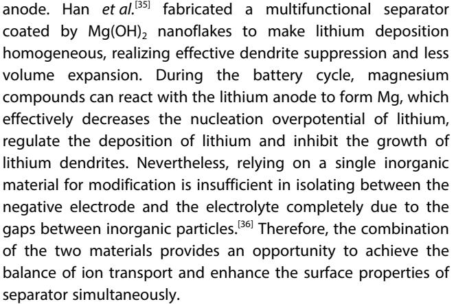
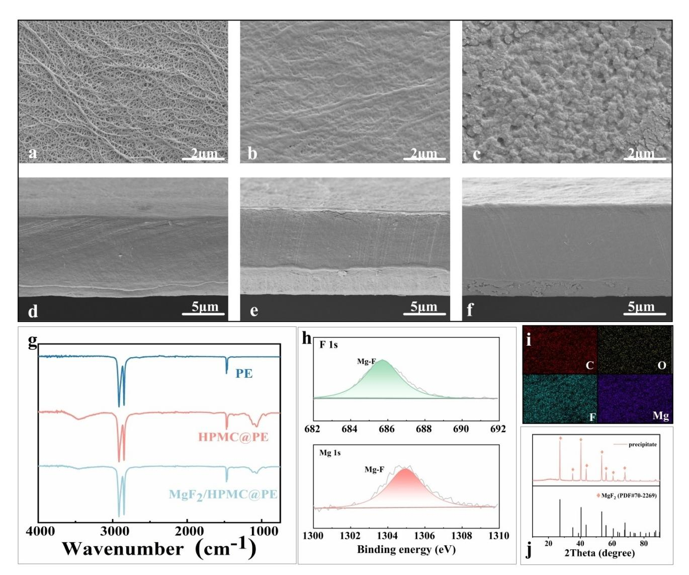
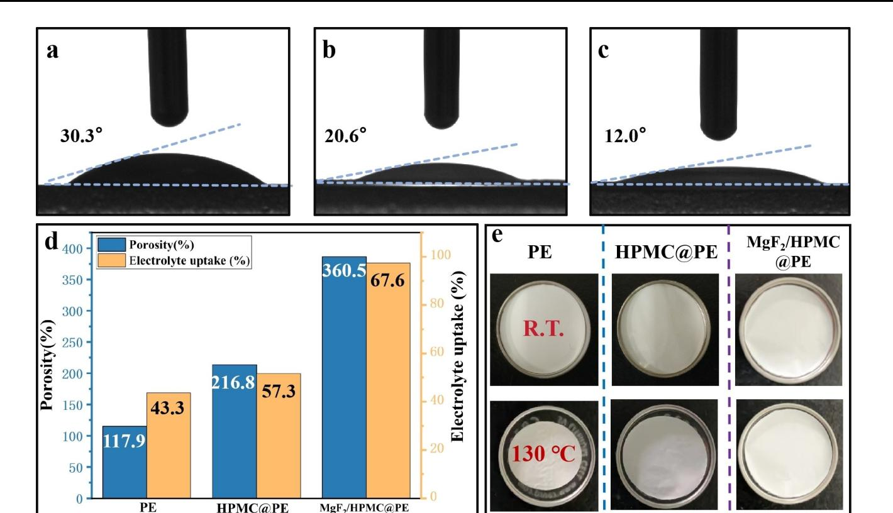
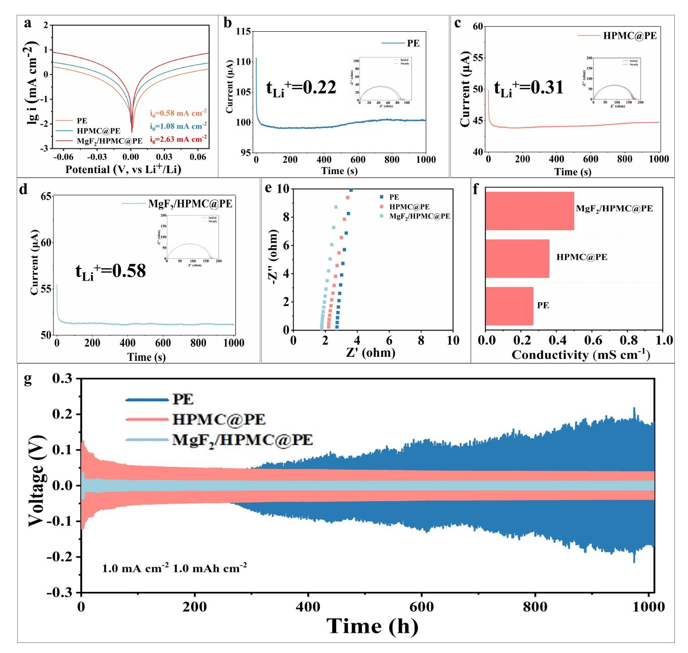
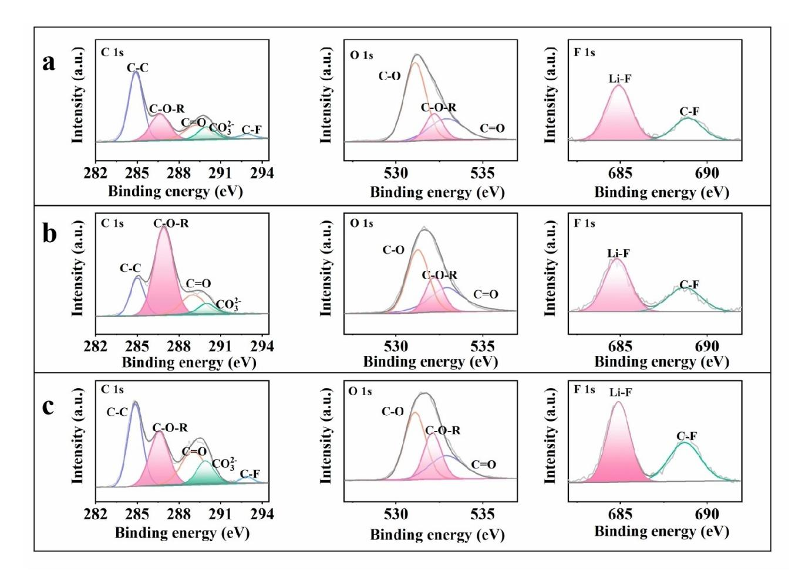
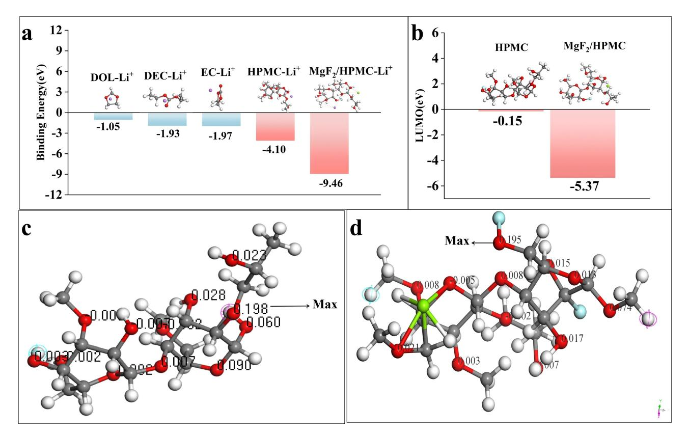
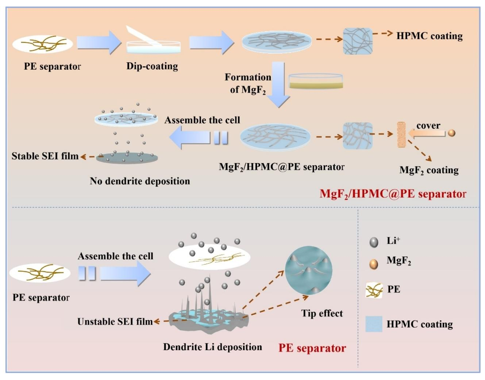
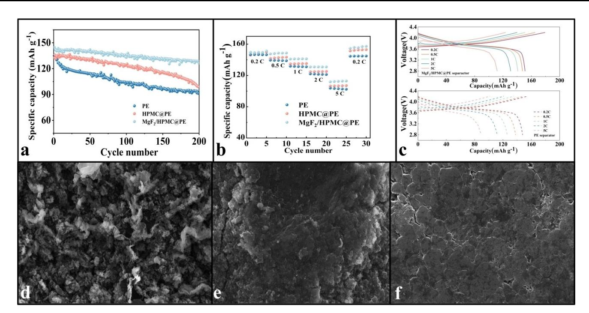

# **Regulate the Uniform Deposition of Lithium Through MgF2/ Hydroxypropyl Modified Polyethylene Separator Applied to Lithium Metal Batteries**

Qilu Zhu,[a] Zhuoying Su,[a] Xinyu Li,[a] Jiaqi Ding,[a] Longkai Zhang,[a] Xin Xiao,[a] Ronghua Zeng,[a] Junming Nan,\*[a] and [Xiaoxi](http://orcid.org/0000-0002-2253-1756) Zuo\*[a]

The uneven growth of lithium dendrites not only compromise the performance of lithium metal batteries, but also has security risks. In this sutudy, double coating with MgF2 and hydroxypropyl methylcellulose was synthesized on the surface of polyethylene separator through a simple soaking and in-situ chemical precipitation method, achieve the purpose of protecting lithium metal anode. Utilizing the MgF2/HPMC@PE separator, the Lij j Li symmetric cell was capable of cycling for over 1000 hours with a voltage hysteresis of only 11.4 mV, comparing the voltage hysteresis based on the cell use of PE separator increases rapidly after 200 h. Furthermore, the initial discharge

# **1. Introduction**

Lithium metal is widely regarded as the most optimal choice for the anode material in high energy density rechargeable battery bases on its significant advantages, including the excellent specific capacity (3860 mAhg 1 ), low electrochemical potential ( 3.04 V vs standard hydrogen electrode), and remarkably low density(0.534 gcm 3 ),[1–2] which enables higher energy density and broader electrochemical window. Nevertheless, due to the high activity of lithium, the negative electrode is prone to undergo irreversible reactions with the electrolyte and result in the formation of uneven solid electrolyte interphase (SEI) film,[4,5] which would promote uneven growth of lithium dendrites, even may puncture the separator and cause safety accidents.[6,7] To effectively tackle these issues, several strategies have been proposed. These include the utilization of solid-state electrolytes,[8–10] MOF-based materials[11] and three-dimensional negative electrode current collectors[12–14] that improved the transport process of Li+ and mitigate the dendrite growth.[15]

[a] *Q. Zhu, Z. Su, X. Li, J. Ding, L. Zhang, X. Xiao, R. Zeng, Prof. J. Nan, Prof. X. Zuo School of Chemistry South China Normal University Guangzhou 510006, People's Republic of China E-mail: jmnan@scnu.edu.cn zuoxiaoxi75@163.com*

- *Supporting information for this article is available on the WWW under <https://doi.org/10.1002/ceur.202400035>*
- *© 2024 The Author(s). ChemistryEurope published by Chemistry Europe and Wiley-VCH GmbH. This is an open access article under the terms of the Creative Commons Attribution License, which permits use, distribution and reproduction in any medium, provided the original work is properly cited.*

capacity of Lij j LiNi0.6Co0.2Mn0.2O2(NCM622) is 144.6 mAhg 1 and the capacity retention is 87.2% after 200 cycles at 1 C, which is higher than that of the PE separator (135.3 mAhg 1 , with retention of 74.9%). All improvements can be credited with the formation of stable solid electrolyte interphase(SEI) film induced by HPMC/MgF2 double coating, which is reduced the Li nucleation overpotential and ultimately promoted uniform Li deposition. This study provides a simple and effective strategy for improving the cycling performance and safety of lithium metal batteries.

Among them, the modification of separators is considered an economically feasible method for enhancing the electrochemical performance of lithium metal battery.[16–19]

Separator, serves as the critical component of batteries, infinitely impacts the transport of Li+ and Li electrodeposition/ stripping. However, owing to its uneven pore size distribution and low mechanical modulus,[20–22] commercial polyolefin separator is prone to be a "tip effect" during the battery cycle and promote uneven growth of lithium dendrite,[23,24] eventually puncture the separator. The research reveals that the implementation of polar functional groups for surface modification of separators facilitates the homogeneous distribution of Li+ flux,[25–27] and reduce the concentration gradient of Li+ from the bulk electrolyte to the anode surface, finally promoting the even deposition of lithium on anode.[28,29] For example, Wei *et al.* fabricated a boron nitride (BN) coated separator that mitigated the growth of Li dendrites and improved the cycling performance.[30] However, such surface modification would generate large interfacial resistance and poor mechanical property.[31] Moreover, most modified batteries can only cycle at low current density, which cannot meet the practical demand. Whereupon, the development of separators with robust mechanical strength, ionic conductivity separators are still urgent.

By using lithiophilic materials modified the separator, the distribution of Li+ on the anode surface can be effectively adjusted.[32,33] In recent years, with the outstanding adsorption capacity to serve as binding sites for Li+ , utilizing magnesium compounds has become a promising method for separator modification. For example, Yi *et al.*[34] designed an ion-released MgI2-doped polyacrylonitrile (PAN) based nanofiber (MPANF) separator, which leads to form an SEI layer and dendrite-free Li

Hereby, a facile approach was presented that fabricates a HPMC layer through a simple immersion. With a significant amount of hydroxyl groups, HPMC layer provides a greater number of reactive sites and ensures the efficient adhesion of MgF2 onto the PE separator.Whereafter, *in situ* growth and sedimentary MgF2 on the HPMC layer is realized. Via the polar effects between the Li+ and HPMC@MgF2 layer, the efficient regulation of Li+ flux is achieved and the stable SEI film enriched with LiF is formed, ultimately reducing the formation of lithium dendrites and promoting uniform deposition on the surface of the separator. This simple and green method visibly improves the mechanical and electrochemical properties of the separator. The Lij j Li symmetric cell utilizing the MgF2/ HPMC@PE separator was capable of cycling for over 1000 hours and the initial discharge capacity of Lij j Ni0.6Co0.2Mn0.2O2(NCM622) is 144.6 mAhg 1 and the capacity retention is 87.2% after 200 cycles at 1 C. The excellent performance of the MgF2/HPMC@PE separator was extensively validated, providing insights into the mechanism behind its ultrastable cycling performance.

# **2. Results and Discussion**

### **2.1. Preparation and Characterization of Physical Properties of Different Separators**

Depicted in Figure 1a, utilizing the immersion method alongside the in situ chemical precipitation method, the dual coating of MgF2/HPMC was fabricated on both sides of the PE separator. The initial step is to immerse the PE separator into an HPMC solution to obtain the HPMC coating. Enriched with a copious quantity of hydroxyl groups, HPMC showcases splendid polarity and adsorption power,[37] which assumes a pivotal role in the anchorage of MgF2. Subsequently, synthesizing MgF2 through a reaction between MgCl2 and NH4F solutions, and the HPMC layer acts as a binder to fix MgF2 onto the separator. Compared with PE separator, lithium metal batteries incorporating MgF2/ HPMC@PE separator exhibit significant improvements in both electrochemical performance and safety.

The surfaces of HPMC@PE separator and MgF2/HPMC@PE separator were covered a uniform and complete coating (Figure 2(b,c)), contrastively the surface of the PE separator exhibited numerous irregular large pores (Figure 2a). Furthermore, the thickness of the MgF2/HPMC@PE separator (about 17 um) and the HPMC@PE separator (about 16 um) didn't undergo significant changes compared to the PE separator (about 15 um) (Figure 2(d–f)), which ensures the rapid migration of Li+. Moreover, the EDS elemental mapping images proves a uniform distribution of C, O, Mg and F elements on the MgF2/ HPMC@PE separator surface, indicating that the MgF2/ HPMC@PE separator surface is evenly covered by MgF2 and HPMC (Figure 2i).

In order to further determine the chemical composition of the separators, Fourier-transform infrared spectroscopy (FT-IR) analysis was performed (Figure 2g). Two distinct peaks appear at 1110–1000 cm 1 and 3470 cm 1 , corresponding to the stretching vibrations of C O C and OH in the HPMC@PE and MgF2/HPMC@PE separator,[38] which confirmed the existence of HPMC layer because there are nonexistent in the PE separator.

**Figure 1.** Schematic diagram of preparation of MgF2/HPMC@PE separator.

**Figure 2.** a–f) SEM images of (a, d) PE separator, (b, e) HPMC@PE separator and (c, f)MgF2/HPMC@PE separator from the top view (a–c) and cross section (d–f); (g) FTIR spectra of different separators;(h) XPS Mg 1s and F 1s spectra of MgF2/HPMC@PE separator;(i) EDS elemental mapping images of MgF2/HPMC@PE separator; (j) XRD pattern of the precipitate.

As depicted in the X-ray diffraction (XRD) patterns (Figure 2j), the characteristic peaks of the precipitates obtained in reaction are consistent with MgF2. Surface composition of MgF2/ HPMC@PE separator was analyzed employing X-ray Photoelectron Spectroscopy (XPS). According to the results of F 1 s and Mg 1 s spectrum (Figure 2h), the two peaks at 687.0 eV and 1304.95 eV correspond to the Mg F bonds of MgF2, which further proves the existence of the MgF2 coating.

The addition of MgF2/HPMC layer significantly improved the wettability of the PE separator. According to the contact angle measurements results of Figure 3(a–c), the contact angle of the separator is decreased from 30.3° to 12° with the introduction of MgF2/HPMC coating, which suggests that the hydroxyl groups contained in HPMC coating and the lithiophilic property of MgF2 effectively enhance the surface affinity and improve the hydrophobicity of PE separator. Under the combined efficacy of the double coating, the electrolyte resistance of separator is minimized, which cause the rapid diffusion of electrolyte on its surface and improving ionic conductivity, consequently facilitate the transport of lithium ions and ultimately the regulation of lithium deposition. Besides, due to the existence of gaps in MgF2 particles, the porosity of the ceramic coating exceeds that of the PE separator, thereby the modified separator exhibits increased porosity and amplifies the contact surface area of separator with the electrolyte. As shown in Figure 3d, the MgF2/ HPMC@PE separator (97.6%) exhibits a higher porosity compared to the PE separator (44.3%) and the HPMC@PE separator(56.3%), which allows the MgF2/HPMC@PE separator to obtain more transport channels and absorb more electrolytes. The electrolyte absorption rate of the MgF2/HPMC@PE separator reaches 360.5%, significantly exceeding than that of the PE separator (117.9%) and the HPMC@PE separator (216.8%). High porosity and electrolyte absorption rate is conducive to the migration of Li+, thus improving the electrochemical performance.

**Figure 3.** Contact angle images of (a) PE, (b) HPMC@PE, (c) MgF2/HPMC@PE separators; (d) Porosity and electrolyte uptake of different separators; (e) Thermal shrinkage images of different separators.

The thermal stability of a battery is crucial for ensuring battery safety. In order to investigate the thermal resistance capability of the separators, thermal shrinkage tests were conducted on different separators. Figure 3e illustrates the dimensional changes of the separators after being subjected to thermal treatment at various temperatures for 30 minutes. After heat treatment at 130°C, the PE separator exhibited a substantial shrinkage of 43.8%, whereas the MgF2/HPMC@PE separator displayed a thermal shrinkage rate of only 7%, with its surface structure remaining intact and minimal shape alteration. The enhancement of thermal stability of modified separator can be attributed to the excellent heat resistance of MgF2. Under the protection of MgF2/HPMC coating, the thermal stability of the separator at high temperatures is greatly improved.

### **2.2. Characterization of Electrochemical Properties of Different Separators**

For the purpose of investigating the electrochemical performance of the MgF2/HPMC@PE separator and its impact on the cycling stability of Li metal, cells were assembled and tested for different separators. Firstly, for the sake of exploring the inhibitory effect of the MgF2/HPMC@PE separator on the growth of Li dendrite, a comparison of the nucleation overpotentials of different separators was conducted at a current density of 0.1 mAcm 2 . The consequence of Figure S1a shows that the overpotential for Lij jMgF2/HPMC@PE j jCu is approximately 17.8 mV, lower than the Lij jHPMC@PE j jCu separator (22.7 mV) and the Lij jPE j jCu separator (37.6 mV), meaning that the energy barriers formed by Li of Lij jMgF2/HPMC@PE j jCu is most minor and stable during Li plating and stripping, which is facilitating the uniform deposition of Li. In order to further investigate the effect of MgF2/HPMC@PE separator on the reversibility of the plating/stripping behavior, the coulombic efficiency (CE) of the Lij jCu cells was assembled with different separators and tested at 1 mAcm 2 and 1 mAhcm 2 . As shown in Figure S1b, the cell using the MgF2/HPMC@PE separator maintained 99.9% Coulombic efficiency after 150 cycles. In contrast, cells using PE and HPMC@PE separators under the same test begin to fall after 50 cycles with severe fluctuations, indicating that the instability of the SEI film. With the degradation and reformation of the SEI film, the growth of Li+ dendrites is continued and finally pierced separator.[39,40] As a consequence, the MgF2/HPMC@PE separator promotes the stable formation of SEI film and uniform Li+ deposition.

The lithium dendrite suppression behavior of the MgF2/ HPMC@PE separator is further investigated by utilizing Lij j Li symmetric cells. In order to thoroughly investigate the influence of the MgF2/HPMC coating on the mechanism of Li Plating/ Stripping, a variety of electrical performance tests were carried out. The kinetic of Li+ transport of the MgF2/HPMC@PE separator was proved through measuring the exchange current density. According to the Tafel plots of Figure 4a, the exchange current density of the MgF2/HPMC@PE separator was 2.63 mAcm 2 , exceeding that of the PE separator (0.58 mAcm 2 ) and the HPMC@PE separator (1.08 mAcm 2 ), which signifies the electrochemical reaction interface and the diffusion of lithium ions was faster, exhibiting excellent charge transfer kinetics. To further verify the positive influence of the MgF2/HPMC@PE separator on Li+ migration, the Li+ transference number (tLi +) was determined by CA and ACI techniques. Calculating from the current-time distribution and the EIS plot(Figure 4(b–d)), the tLi + of PE, HPMC@PE and MgF2/HPMC@PE separators are 0.22,0.31 and 0.58, respectively. Apart from tLi +, ionic conductivity is another important indicator to evaluate the performance of LMBs. The EIS was employed to measure the ionic conductivity in the SSj jseparatorj j SS cells. Calculating from Figure 4e, the ion conductivity of PE, HPMC@PE, MgF2/ HPMC@PE notably increased from 0.27 mScm 1 to 0.5 mScm 1 ( Figure 4f). On the one hand, the concentration gradient of Li+ from the electrolyte to anode surface is decreased because of the addition of polar groups, which allows the Li+ flux to be evenly distributed, ultimately promotes the even deposition of lithium on anode. On the other hand, the incorporation of lithiophilic materials significantly improved the porosity and electrolyte permeability of the separator, which contributes to the rapid transport of Li+, finally promotes the uniform deposition of Li+ in anode surface.

**Figure 4.** a) Tafel plots of PE, HPMC@PE, and MgF2/HPMC@PE separators; b-d) Current-time profile and impedance before and after polarization of (b) PE, (c) HPMC@PE and (d) MgF2/HPMC@PE separators; e) Impedance and f) ionic conductivity of different SS j jSS cells; g) The voltage distribution of Lij j Li cells with different separators at current density of 1 mAcm 2 and 1 mAhcm 2 .

To further evaluate the battery performance of different separators, the long-term cycling stability during the plating/ stripping process with different separators was investigated in Lij j Li symmetric cells at a current density of 1 mAcm 2 and a cycle capacity of 1 mAhcm 2 . As shown in the Figure 4g, the overpotential of symmetric cell with PE separator gradually increases after 200 h, and rising to 187 mV after 1000 h, which can be attributed to the inhomogeneous Li+ deposition and the inherent instability at the interface between the lithium metal electrode and the electrolyte. As a result, the growth of lithium dendrites causes a short circuit to occur in the cell. In comparison, the cycle life of the cells using HPMC@PE and MgF2/HPMC@PE have been extended over 1000 hours, and the voltage hysteresis of MgF2/HPMC@PE is only 11.4 mV, much smaller than that HPMC@PE (48.2 mV). It indicates that the MgF2/HPMC coating effectively reinforces the interfacial stability of SEI film, further verifies the superior of the lithium metal anode interface when using the MgF2/HPMC@PE separator. At the same time, profitting from abundant liquid electrolyte storage and the rapid transportation of Li+, the interface impedance of the cell using the MgF2/HPMC@PE separator is minimized after 1000 h cycles (Figures S2), meaning that the cell forms a more uniform and stable solid electrolyte interface (SEI) and the growth of lithium dendrites is suppressed.

### **2.3. The Mechanism of Enhanced Electrochemical Performance with Different Separators**

To further unravel the mechanism for enhanced electrochemical performance resulting from separator modification, the Lij j Li symmetric cell was disassembled after 150 cycles of 1 mAcm 2 , and the metal surface was characterized using scanning electron microscopy (SEM). As observed from Figure S3 (a–c), the lithium surface of the cycled Lij jPEj j Li cell exhibited clear visible cracks (Figure S3a), along with the generation of lithium dendrites. In the Lij jHPMC@PE j j Li cell, an uneven deposition of lithium on the surface was observed (Figure S3b). Conversely, the Lij jMgF2/HPMC@PE j j Li cell displayed a uniform deposition of lithium metal with a smooth and leveled surface, and almost no lithium dendrite formation occurred (Figure S3c). Based on the above analysis, it can be concluded that the MgF2/ HPMC@PE separator has the ability to effectively suppresses the production of lithium dendrites. At the same time, the composition of SEI on Li anode was analyzed through XPS test after cycling. As shown in the spectra (Figure 5(a–c)), the C 1s peaks situated at 286.7 eV, 288.8 eV, 290.3 eV and the O 1s peaks situated at 531.5 eV, 533.5 eV, 533.1 eV are respectively reflecting the C O, CO3 2 and C=O, which is mainly derived from ROLi, Li2CO3, and ROCO2Li. Compared with PE separator,

**Figure 5.** XPS spectra of C 1s, O 1s, and F 1s of lithium metal anodes cycled with (a) PE, (b) HPMC@PE, and (c) MgF2/HPMC@PE separators.

the strength of C O of MgF2/HPMC@PE separator and HPMC@PE separator are more pronounced, which can owe to the reaction of the hydroxyl groups of HPMC with Li metal. Meanwhile, peaks at 688.7 eV and 684.9 eV in the F 1s spectra are related to C F bonds and Li F bonds, severally. It is evident that MgF2/HPMC@PE separator exhibits the highest content of CFx and LiF, which is due to the reaction between MgF2 and Li and the formation of a LiF-rich SEI layer. On account of high mechanical stability and lower barriers for the ion transfer of the inorganic-rich SEI layer,[41,42] the use of MgF2/HPMC@PE separator can enhance the mechanical strength, reduce interfacial resistance and stabilize the electrode interface, which facilitates dendrite-free Li plating and stripping. The separator modification effectively enhances the cycle performance and safety of the battery.

To deeply explore the role of different separators in the plating/stripping process of Li+, the binding energies (Eb) between HPMC and Li+, MgF2/HPMC and Li+, solvent molecules and Li+ were calculated through density functional theory (DFT). From the theory of thermodynamics, the negative value of Eb is higher, the adsorption of lithium is more favorable and the performance of the lithium metal battery is better. For this purpose, several systems were constructed and obtained the optimal adsorption site of HPMC and Mgf2/HPMC through the Fukui function (Figure 6(b,c) and S4). Figure 6a summarizes the Eb of different systems. Upon comparison, the Eb of MgF2/HPMC and Li+ is maximal and several times higher than solvent molecules and Li+, which indicates that the introduction of MgF2/HPMC coating significantly accelerates the desolvation of Li+, thereby facilitates the transport of Li+ along the coating channels and ultimately deposited uniformly on the negative surface.[43,44] Figure S5 depicts an electronic density difference map optimized for the diverse separator-Li+ adsorption model. As illustrated in the Figure S5, the negative region (blue) is coupled to the positive region (red), which is attributed to the strong electronegative properties of oxygen atoms within C O/ C O F groups on the separator, and it favor interactions with Li+. Because of the interaction between MgF2/HPMC@PE and Li+, the solvation of Li+ was weakened and the transport of more free Li+ was expedited, in turn boosting the mobility of Li+. Moreover, in order to further verify the lithiophile nature of MgF2/HPMC layer, the LUMO values for various molecules were calculated and compared. As shown in Figure 6d, the LUMO value of MgF2/HPMC is higher than other systems, indicating the tendency to accept electrons is stronger. In consequence, MgF2/HPMC appears the greater adsorption capability of Li+.

Figure 7 is comprehensively depicted the mechanism of this separator. When the cells is equiped the PE separators, the uneven Li+ flux causes the varying rates of lithium deposition reaction across the negative electrode surface, resulting in the formation of uneven SEI film and lithium dendrites. As these dendrites growing in metallic lithium, current density becomes increasingly concentrated at their tips, which causes preferential deposition of lithium ions at a single tip and further exacerbates their growth. Consequently, there is a potential risk for piercing through the separator and leading to short circuit. In contrast,

**Figure 6.** a) Binding energy of Li+ with different molecules including DOL, DMC, EC, HPMC, MgF2/HPMC. b) LUMO values of HPMC and MgF2/HPMC molecules. c, d) Nucleopuilic values of (c) HPMC and (d) MgF2/HPMC at different O sites.

**Figure 7.** Schematics of Li+ deposition process of different separators.

the MgF2/HPMC@PE separator possesses the substantial specific surface area, high porosity, and numerous ion channels that facilitate the establishment of a uniform lithium ion flux. During battery cycling, the formation of LiF-rich SEI film effectively regulates the rapid transportation of Li+. In the meantime, the rich hydroxyl group in HPMC can combine with the C=O groups in the solvent molecules in the form of hydrogen bonding, which contributes to the desolvation of Li+ and effectively improves the transport capacity of Li+, and thereby inhibiting the growth of lithium dendrites. In conclusion, lithium metal batteries incorporating MgF2/HPMC@PE separator exhibits significant improvements in both electrochemical performance and safety.

### **2.4. Practical Application in Full Cells of Different Separators**

To further explore the practicability of the MgF2/HPMC@PE separator in LMBs, Lij jNCM622 cells were assembled and tested at a current density of 1 C (1 C=180 mAhg 1 ). Compared with other separators (Figure 8a), cells with MgF2/HPMC@PE separators exhibit higher discharge capacity and superior cycle stability. The first cycle capacity of the MgF2/HPMC@PE separator is 144.6 mAhg 1 , which is higher than that the PE (132.3 mAhg 1 ) and HPMC (135.6 mAhg 1 ) separators. After 200 cycles, the reversible capacity of the MgF2/HPMC@PE cell remains at 126.1 mAhg 1 with the coulombic efficiency of 87.2%. In contrast, the cell with the PE provides a lower specific capacity (94.5 mAhg 1 ), and the coulombic efficiency was significantly decreased to 74.9%. What's more, the Lij jNCM622 cells assembled with MgF2/HPMC@PE exhibited superior rate capability. Figure 8b illustrates the rate performance of Lij j NCM622 cells assembled with different separators at rates of 0.2, 0.5, 1, 2 and 5 C. It is evident that the MgF2/HPMC@PE consistently exhibits the highest capacity across all tested rates. Specifically, cycling at the current rates from 0.2 C to 5 C, the full cell employing the MgF2/HPMC@PE separator provides discharge capacities of 149.5, 148.6, 141.2, 130.9, 112.2 mAhg 1 (Figure 8c), which is better than the PE and HPMC@PE (Figure 8b–c). More preciously, when the current density returned to 0.2 C, the capacity of the cell using the MgF2/HPMC@PE separator recovered to 155.7 mAhg 1 (104.1% of the original capacity), indicating a excellent utilization of lithium. It confirms

**Figure 8.** a). long-term cycling performances of Li/NCM622 with different separator; b) C-rates capability of Li/NCM622 with different separator; c) PE and MgF2/HPMC@PE separator at different current densities; d–f) SEM images of lithium anodes with (d) PE, (e) HPMC@PE, and (f) MgF2/HPMC@PE separators after 200 cycles.

the contribution of the MgF2/HPMC coating to the battery performance.

To further validate the results, the SEM analysis of the surface morphology of the Li anodes was performed after cycling in Lij jNCM622. As shown in the Figure 8(d–f), the surface of Li anode from Lij jPEj jNCM622 was uneven with severe lithium dendrite growth, while the surface of Li anode from Lij jHPMC@PE j jNCM622 was relatively flat though the bulges and cracks still exist on the surface. Discriminately, a homogeneous surface morphology was formed and no visible Li dendrites on the Li anode with MgF2/HPMC@PE separator. This once again proves the ability of the MgF2/HPMC@PE separator of suppressing the growth of lithium dendrites.

# **3. Conclusions**

In summary, a modified PE composite separator with dual MgF2/HPMC coating by dip-coating and in situ chemical precipitation. The results indicate that this coating effectively inhibits the growth of lithium dendrites and promotes uniform lithium deposition. DFT calculations and experimental results demonstrate that MgF2/HPMC coating enhances the wetability of the separator and ion conductivity, which accelerates the kinetics of Li+ transfer and reduces the lithium nucleation overpotential, thus achieving excellent electrochemical performance. Utilizating MgF2/HPMC@PE separator, the coulomb efficiency of Cuj j Li is obviously improved and the cycle life of Lij j Li is extenged to 1000 h. It also ensures higher cycling stability in the Lij j NCM622 full cell, thereby the life of cell is longer. This study provides a simple and efficient method to suppress lithium dendrite growth, thus improving battery performance.

# *Acknowledgements*

This work was study supported by the National Natural Science Foundation of China (No. 22176065) and the Natural Science Foundation of Guangdong Province (Nos. 2022 A1515010447).

### *Conflict of Interests*

The authors declare no conflict of interest.

# *Data Availability Statement*

Research data are not shared

**Keywords:** Modified separator **·** Inhibition of Li dendrites **·** Affinity to lithium

- [1] X. Shen, H. Liu, X. B. Cheng, C. Yan, J. Q. Huang, *Energy [Storage](https://doi.org/10.1016/j.ensm.2017.12.002) Mater.* **2018**, *12*, [161–175.](https://doi.org/10.1016/j.ensm.2017.12.002)
- [2] W. C. Ren, Y. N. Zheng, Z. H. Cui, Y. S. Tao, B. X. Li, W. T. Wang, *[Energy](https://doi.org/10.1016/j.ensm.2020.11.019) Storage Mater.* **2021**, *35*, [157–168.](https://doi.org/10.1016/j.ensm.2020.11.019)
- [3] D. Chen, Y. Liu, C. Feng, Y. He, S. Zhou, B. Yuan, Y. Dong, H. Xie, G. Zeng, J. Han, W. He, *Electron* **2023**, *1*.
- [4] Y. Y. Liu, X. Y. Xu, X. X. Jiao, L. N. Guo, Z. X. Song, S. Z. Xiong, J. X. Song, *Chem. Eng. J.* **2019**, *371*, [294–300](https://doi.org/10.1016/j.cej.2019.04.068).

- [5] Y. Y. Liu, X. Y. Xu, O. O. Kapitanova, P. V. Evdokimov, Z. X. Song, A. Matic, S. Z. Xiong, *Adv. Energy Mater.* **2022**, *12*, 8.
- [6] Y. Yang, S. Y. Yao, Z. W. Liang, Y. C. Wen, Z. B. Liu, Y. W. Wu, J. Liu, M. Zhu, *ACS Energy Lett.* **2022**, *7*, [885–896.](https://doi.org/10.1021/acsenergylett.1c02719)
- [7] Z. Wu, Z. P. Cai, B. Fang, M. N. Liu, H. P. Wu, A. P. Liu, F. M. Ye, *ACS [Appl.](https://doi.org/10.1021/acsami.1c02951) Mater. Interfaces* **2021**, *13*, [25890–25897](https://doi.org/10.1021/acsami.1c02951).
- [8] Y. F. Zhai, G. M. Yang, Z. Zeng, S. F. Song, S. Li, N. Hu, W. P. Tang, Z. Y. Wen, L. Lu, J. Molenda, *ACS Appl. Energ. Mater.* **2021**, *4*, [7973–7982](https://doi.org/10.1021/acsaem.1c01281).
- [9] Z. R. Yao, K. J. Zhu, X. Li, J. Zhang, J. Li, J. Wang, K. Yan, J. S. Liu, *[ACS](https://doi.org/10.1021/acsami.0c22532) Appl. Mater. Interfaces* **2021**, *13*, [11958–11967.](https://doi.org/10.1021/acsami.0c22532)
- [10] J. P. Yue, Y. G. Guo, *Nat. Energy* **2019**, *4*, [174–175](https://doi.org/10.1038/s41560-019-0335-0).
- [11] R. Razaq, M. M. U. Din, D. R. Småbråten, V. Eyupoglu, S. Janakiram, T. O. Sunde, N. Allahgoli, D. Rettenwander, L. Deng, *Adv. Energy Mater.* **2023**, *14*.
- [12] C. H. Chang, S. H. Chung, A. Manthiram, *Adv. Sustainable Syst.* **2017**, *1*, 5.
- [13] G. X. Li, Z. Liu, Q. Q. Huang, Y. Gao, M. Regula, D. W. Wang, L. Q. Chen, D. H. Wang, *Nat. Energy* **2018**, *3*, [1076–1083.](https://doi.org/10.1038/s41560-018-0276-z)
- [14] Q. Guo, Y. N. Yu, S. J. Xia, C. Shen, D. Hu, W. Deng, D. J. Dong, X. F. Zhou, G. Z. Chen, Z. P. Liu, *ACS Appl. Mater. Interfaces* **2022**, 13.
- [15] X. Q. Zhang, X. B. Cheng, Q. Zhang, *Adv. Mater. Interfaces* **2018**, *5*, 19. [16] N. Mittal, A. Ojanguren, N. Cavasin, E. Lizundia, M. Niederberger, *Adv. Funct. Mater.* **2021**, *31*, 12.
- [17] Y. M. Liu, X. Y. Qin, D. Zhou, H. Y. Xia, S. Q. Zhang, G. H. Chen, F. Y. Kang, B. H. Li, *Energy Storage Mater.* **2020**, *24*, [229–236](https://doi.org/10.1016/j.ensm.2019.08.016).
- [18] Y. D. Liu, Q. Liu, L. Xin, Y. Z. Liu, F. Yang, E. A. Stach, J. Xie, *Nat. Energy* **2017**, *2*, 10.
- [19] B. Song, L. Su, X. Liu, W. Gao, T. Wang, Y. Ma, Y. Zhong, X. B. Cheng, Z. Zhu, J. He, Y. Wu, *Electron* **2023**, *1*, e13.
- [20] X. Huang, X. Y. Feng, B. Zhang, L. Zhang, S. C. Zhang, B. Gao, P. K. Chu, K. F. Huo, *ACS Appl. Mater. Interfaces* **2019**, *11*, [31824–31831.](https://doi.org/10.1021/acsami.9b08438)
- [21] H. P. Wu, L. B. Chen, Y. J. Chen, *Sustain. Energy Fuels* **2021**, *5*, [5656–5671](https://doi.org/10.1039/D1SE01152A).
- [22] Z. Peng, X. Cao, P. Y. Gao, H. P. Jia, X. D. Ren, S. Roy, Z. D. Li, Y. Zhu, W. P. Xie, D. Y. Liu, Q. Y. Li, D. Y. Wang, W. Xu, J. G. Zhang, *Adv. Funct. Mater.* **2020**, *30*, 13.
- [23] Z. R. Li, C. Liao, L. F. Han, Y. K. Cao, J. Huang, Y. C. Kan, Y. Hu, *Polym. Adv. Technol.* **2024**, *35*, 13.
- [24] T. Y. Wang, Y. B. Li, J. Q. Zhang, K. Yan, P. Jaumaux, J. Yang, C. Y. Wang, D. Shanmukaraj, B. Sun, M. Armand, Y. Cui, G. X. Wang, *Nat. Commun.* **2020**, *11*, 9.
- [25] K. Yan, H. W. Lee, T. Gao, G. Y. Zheng, H. B. Yao, H. T. Wang, Z. D. Lu, Y. Zhou, Z. Liang, Z. F. Liu, S. Chu, Y. Cui, *Nano Lett.* **2014**, *14*, [6016–6022](https://doi.org/10.1021/nl503125u).
- [26] J. S. Kim, D. W. Kim, H. T. Jung, J. W. Choi, *Chem. [Mater.](https://doi.org/10.1021/cm503447u)* **2015**, *27*, 2780– [2787.](https://doi.org/10.1021/cm503447u)
- [27] Q. W. Lu, Y. B. He, Q. P. Yu, B. H. Li, Y. V. Kaneti, Y. W. Yao, F. Y. Kang, Q. H. Yang, *Adv. Mater.* **2017**, *29*, 8.
- [28] H. Lee, X. D. Ren, C. J. Niu, L. Yu, M. H. Engelhard, I. Cho, M. H. Ryou, H. S. Jin, H. T. Kim, J. Liu, W. Xu, J. G. Zhang, *Adv. Funct. Mater.* **2017**, *27*, 8.
- [29] W. Luo, L. H. Zhou, K. Fu, Z. Yang, J. Y. Wan, M. Manno, Y. G. Yao, H. L. Zhu, B. Yang, L. B. Hu, *Nano Lett.* **2015**, *15*, [6149–6154.](https://doi.org/10.1021/acs.nanolett.5b02432)
- [30] Q. Y. Zhang, Z. K. Wang, Y. G. Liu, B. Zhu, L. M. Wu, R. Y. Mi, Z. H. Huang, *Surf. Interfaces* **2023**, *43*, 9.
- [31] C. F. Li, S. H. Liu, C. G. Shi, G. H. Liang, Z. T. Lu, R. W. Fu, D. C. Wu, *Nat. Commun.* **2019**, *10*, 9.
- [32] S. Q. Cui, P. B. Zhai, W. W. Yang, Y. Wei, J. Xiao, L. B. Deng, Y. J. Gong, *Small* **2020**, *16*, 9.
- [33] T. C. Liu, S. Q. Chen, W. W. Sun, L. P. Lv, F. H. Du, H. Liu, Y. Wang, *Adv. Funct. Mater.* **2021**, *31*, 12.
- [34] S. Yi, Z. Su, W. Y. Zhang, H. L. Chen, Y. Y. Zhang, B. Niu, D. H. Long, *[J.](https://doi.org/10.1016/j.jechem.2022.08.021) [Energy](https://doi.org/10.1016/j.jechem.2022.08.021) Chem.* **2022**, *75*, 83–94.
- [35] D. H. Han, M. Zhang, P. X. Lu, Y. L. Wan, Q. L. Chen, H. Y. Niu, Z. W. Yu, *[J.](https://doi.org/10.1016/j.jechem.2020.04.043) [Energy](https://doi.org/10.1016/j.jechem.2020.04.043) Chem.* **2021**, *52*, 75–83.
- [36] W. M. Tang, T. Zhao, K. Wang, T. Y. Yu, R. X. Lv, L. Li, F. Wu, R. J. Chen, *Adv. Funct. Mater.* **2024**, 12.
- [37] T. Zhang, X. Pei, Z. Zhou, L. T. Wang, Y. Lu, G. He, *Electroanalysis* **2023**, *35*, 8.
- [38] B. Mahesh, D. Kathyayani, G. S. Nanjundaswamy, D. C. Gowda, R. Sridhar, *[Carbohydr.](https://doi.org/10.1016/j.carbpol.2019.02.042) Polym.* **2019**, *212*, 129–141.
- [39] F. Ponzio, P. Payamyar, A. Schneider, M. Winterhalter, J. Bour, F. Addiego, M. P. Krafft, J. Hemmerle, V. Ball, *J. Phys. [Chem.](https://doi.org/10.1021/jz501842r) Lett.* **2014**, *5*, [3436–3440.](https://doi.org/10.1021/jz501842r)
- [40] X. Q. Zhang, X. B. Cheng, X. Chen, C. Yan, Q. Zhang, *Adv. Funct. Mater.* **2017**, *27*, 8.
- [41] C. X. Zu, J. M. Li, B. R. Cai, J. L. Qiu, Y. Zhao, Q. Yang, H. Li, H. G. Yu, *J. Power Sources* **2023**, *555*, 11.
- [42] X. Li, Y. Liu, Y. Pan, M. S. Wang, J. C. Chen, H. Xu, Y. Huang, W. M. Lau, A. X. Shan, J. M. Zheng, D. Mitlin, *J. Mater. Chem. A* **2019**, *7*, [21349–](https://doi.org/10.1039/C9TA06908A) [21361.](https://doi.org/10.1039/C9TA06908A)
- [43] J. Xu, S. H. An, X. Y. Song, Y. J. Cao, N. Wang, X. Qiu, Y. Zhang, J. W. Chen, X. L. Duan, J. H. Huang, W. Li, Y. G. Wang, *Adv. Mater.* **2021**, *33*, 10.
- [44] P. B. Zhai, T. S. Wang, W. W. Yang, S. Q. Cui, P. Zhang, A. M. Nie, Q. F. Zhang, Y. J. Gong, *Adv. Energy Mater.* **2019**, *9*, 8.

Version of record online: August 30, 2024