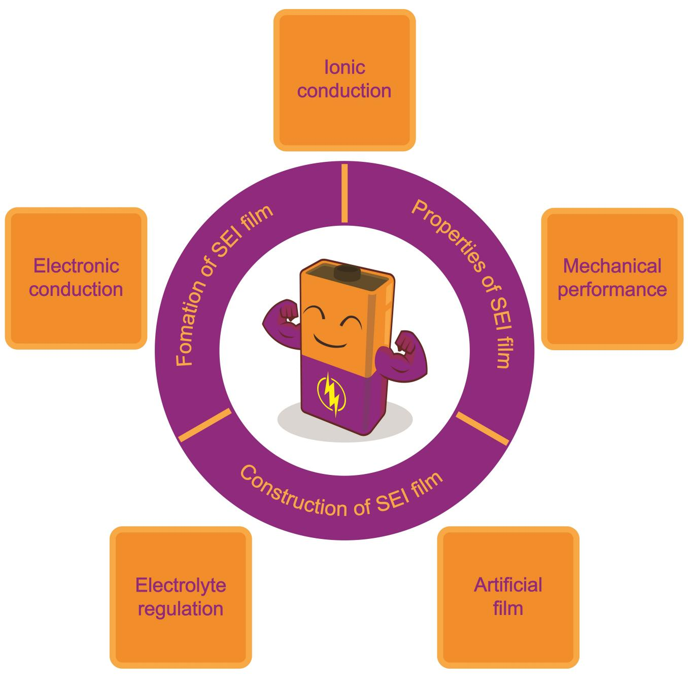
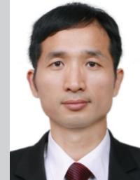
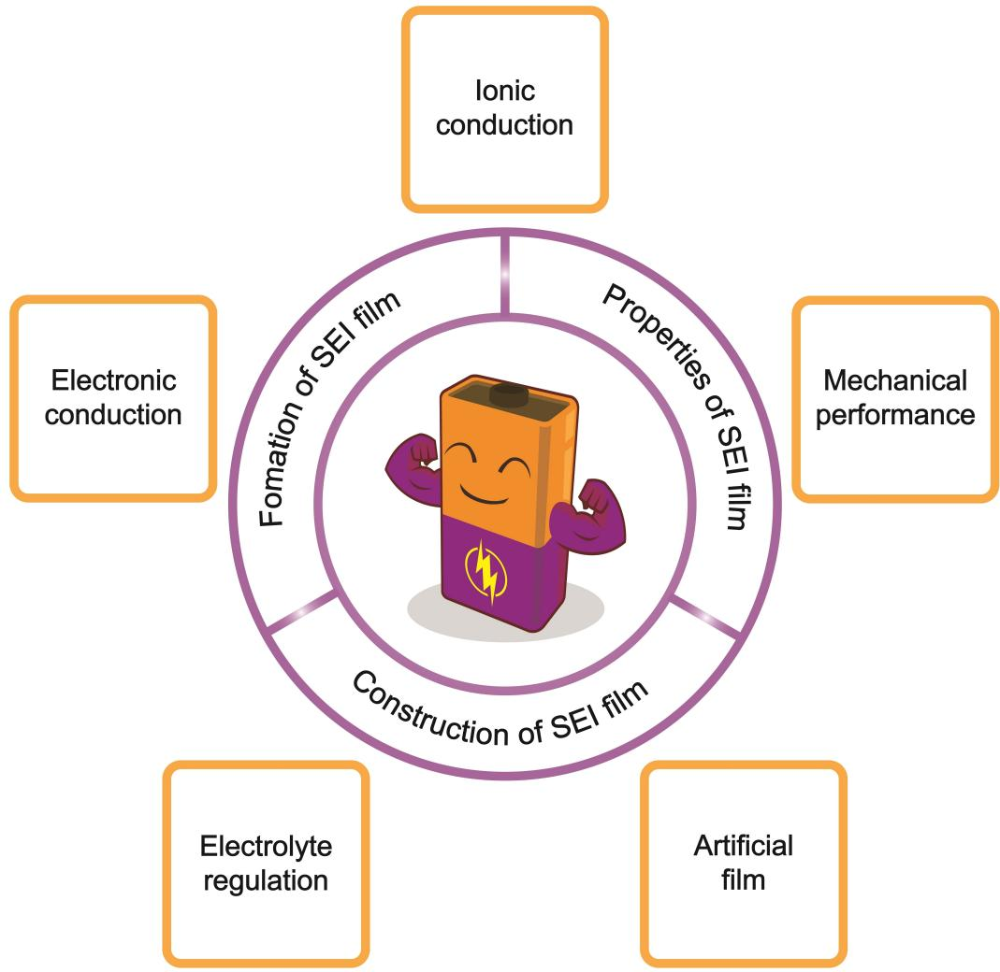
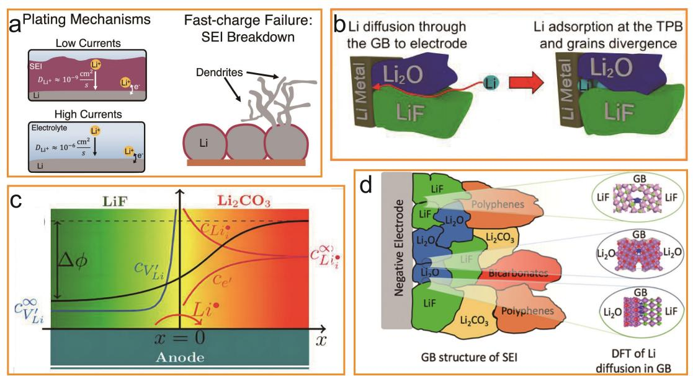
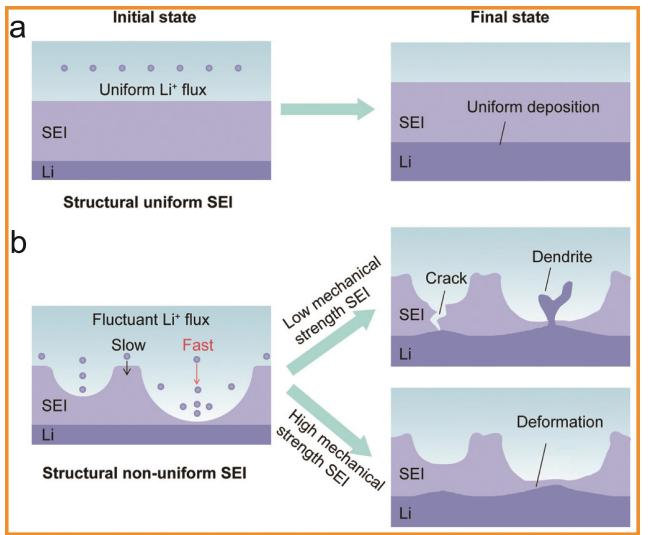
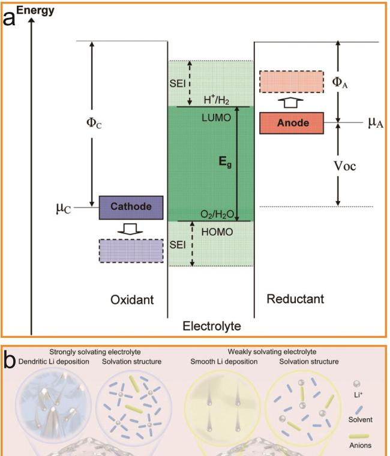
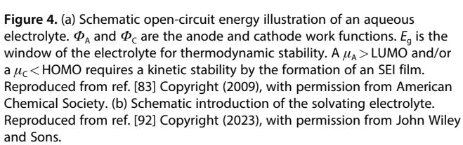
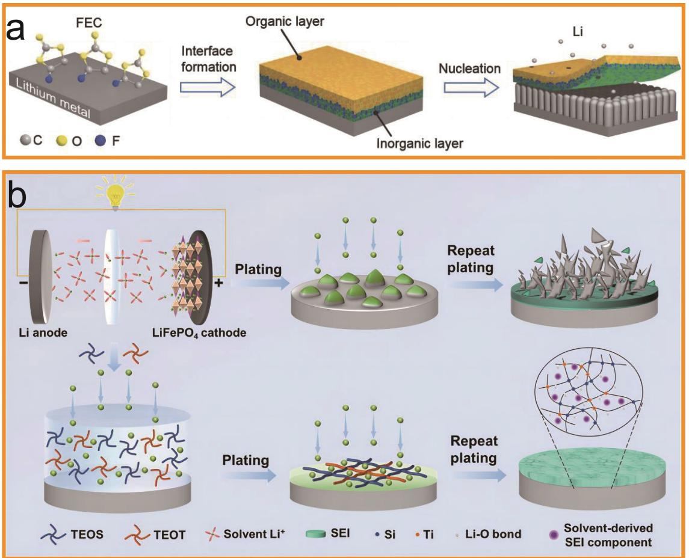
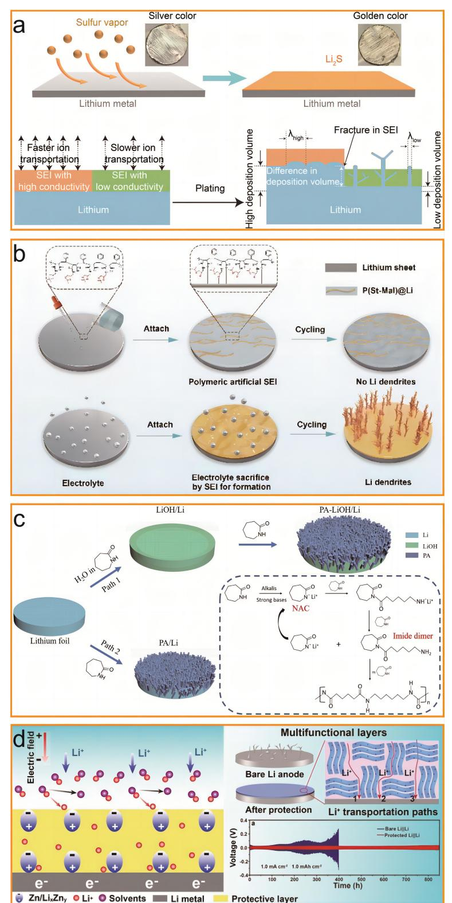
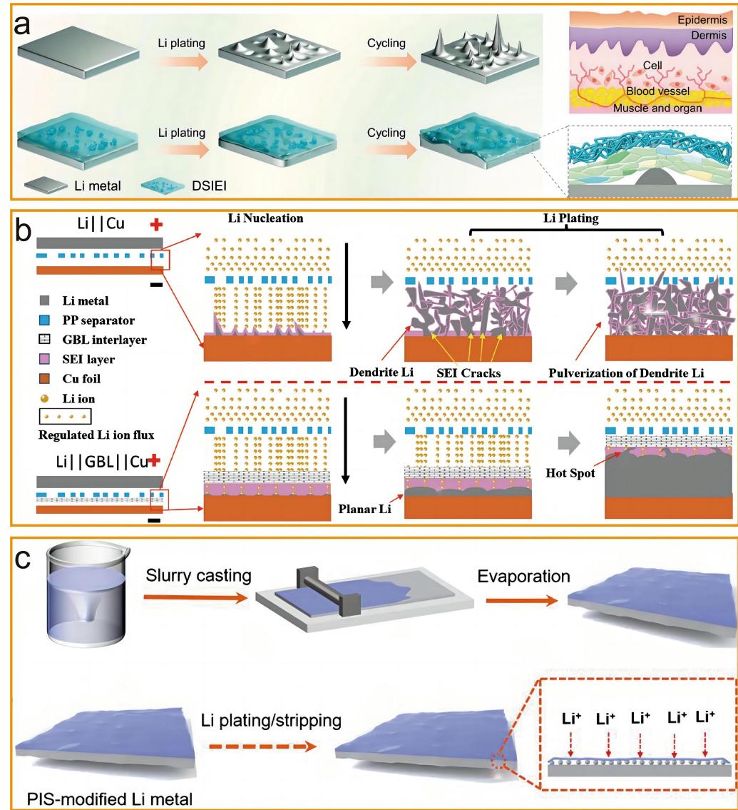

www.chemsuschem.org

# **Solid Electrolyte Interphase on Lithium Metal Anodes**

[Zhichuan](http://orcid.org/0000-0002-6440-6443) Shen+ , [a] Junqiao Huang+ , [a] Yu Xie,[a] Dafeng Wei,[a] Jinbiao Chen,[a] and [Zhicong](http://orcid.org/0000-0003-2360-7668) Shi\*[a, b]

Lithium metal batteries (LMBs) represent the most promising next-generation high-energy density batteries. The solid electrolyte interphase (SEI) film on the lithium metal anode plays a crucial role in regulating lithium deposition and improving the cycling performance of LMBs. In this review, we comprehensively present the formation process of the SEI film, while elucidating the key properties such as electronic conductivity, ionic conductivity, and mechanical performance. Furthermore,

## **1. Introduction**

Secondary batteries play a pivotal role in the storage and provision of energy, particularly in diverse electricity facilities, such as electric vehicles, portable electronic devices, and grid energy storage applications.[1–6] Lithium ion batteries (LIBs) offer several advantages compared to other types of secondary batteries, encompassing a broad electrochemical window, elevated operating voltage, exceptional specific energy capabilities, prolonged cycle life, and minimal self-discharge rate.[7,8] Therefore, LIBs have been extensively utilized in electric vehicles and various large-scale energy storage applications, leading to unprecedented advancements in enhancing the quality of daily human life.[9–11] The research progress on LIBs, however, has faced performance bottlenecks in recent years.[12–14] The limited energy density (100~220 Whkg 1 ) presents a significant challenge in meeting the increasing demands of energy storage technologies, thereby impeding its further commercial expansion.[15,16] Therefore, there is an urgent necessity to develop novel LIBs with enhanced energy density and superior power density, alongside conducting more comprehensive investigations into their operational mechanisms, which will effectively promote the high-quality advancement of LIBs.

For constructing high-energy density LIBs, it is crucial to utilize electrode materials with enhanced capacity and an expanded voltage range.[17–19] The recent study of lithium metal have presented promising opportunities for the design of anode materials, owing to its high theoretical specific capacity (3860 mAhg 1 ), low mass density (0.59 gcm 3 ), and negative redox potential ( 3.04 V *vs* standard hydrogen electrode).[20–22] When lithium metal is utilized as the anode, lithium ions are liberated from cathode during the charging process and subsequently traverse through the electrolyte. Finally, these ions deposit onto the surface of lithium metal. In the discharging process, lithium ions strip off from the surface of the lithium metal anode and reintegrate into the cathode via the electrolyte. Simultaneously, a corresponding number of electrons migrate within the external circuit. The exchange various approaches for constructing the SEI film are discussed from both electrolyte regulation and artificial coating design perspectives. Lastly, future research directions along with development recommendations are also provided. This review aims to provide possible strategies for the further improvement of SEI film in LMBs and highlight their inspiration for future research directions.

between electrons and ions takes place at the interface between electrode and electrolyte. However, during this exchange process, continuous deposition and stripping of lithium occur on the surface of the lithium metal, resulting in significant changes in volume morphology and the formation of dendritic structures.[23,24] Moreover, due to its high reactivity, lithium metal fails to maintain thermodynamic stability with virtually all electrolytes, leading to the formation of a inhomogeneous solid electrolyte interphase (SEI) film on its surface with poor mechanical properties.[25,26] In the subsequent charge-discharge process, the integrity of this SEI film will be compromised due to the emergence of new lithium dendrites. The growth of these fresh lithium dendrites exposes pristine lithium metal to electrolytes, thereby facilitating the formation of new SEI films.[27] The aforementioned process is iterated during the charge-discharge process, resulting in continue damage and repair to SEI film. Consequently, this phenomenon leads to electrode pulverization, electrolyte consumption, and diminished coulombic efficiency, all of which significantly undermine the cycling stability of lithium metal batteries (LMBs).[28] Due to the combination of above factors, LMBs exhibit unsatisfactory practical implementation and safety performance.[29–32]

The progress of research on LMBs has prompted researchers to acknowledge the crucial role of the SEI film in determining the reusability of lithium metal anode, as it governs both Li+ and electron reaction processes.[33,34] The SEI film possesses multiple functions, including suppressing further side reactions between lithium metal and electrolyte, as well as promoting uniform deposition of lithium by regulating solid-state ion flux.[25] Insolubility in electrolytes, high Li+ conductivity, high electronic resistance, stable nanometer-scale thickness, and excellent mechanical properties to enhance resilience against volume fluctuations are the basic guarantee to achieve the above functions. Additionally, the SEI film should exhibit thermal stability over a broad temperature range without compromising its performance across various voltage levels.[35–37] The formation and the composition are crucial factors to control the above properties of SEI film, which ultimately impacts the growth of lithium dendrites.[38,39] Therefore, the establishment of a stable SEI film is imperative for achieving reversible charge-discharge process of LMBs, as well as ensuring their long-term operational stability. Moreover, SEI film also serves as a prerequisite for the safe operation of LMBs across diverse application domains.[40–45] Despite extensive research on the chemical composition, spatial structure, and micro-morphology of SEI films, the precise formation process

[a] *Dr. Z. Shen,+ J. Huang,+ Y. Xie, D. Wei, Dr. J. Chen, Prof. Z. Shi Institute of Batteries, School of Materials and Energy, Guangdong University of Technology, 510006 Guangzhou, China E-mail: zhicong@gdut.edu.cn*

[b] *Prof. Z. Shi Key Laboratory of Advanced Energy Materials Chemistry (Ministry of Education), Nankai University, 300071 Tianjin, China*

[ +] *These authors contributed equally to this work*

and functional mechanisms of SEI films remain one of the most enigmatic issues in battery science.[45] The SEI film demonstrates characteristic dynamic evolution, wherein its structure, composition, and thickness undergo continuous changes throughout the charge-discharge process, resulting in surface mechanism variations.[46] Therefore, it is imperative for researchers to acquire a more comprehensive understanding of the characteristics of SEI film and its influence on cycling performance, which will facilitate the design of more rational SEI film that can guide future advancements in high-performance LMBs.

This review offers a comprehensive overview of the formation process and properties of SEI film on lithium metal anode. Moreover, this review introduces state-of-the-art engineering approaches for constructing SEI films from both in-situ formation and artificial design perspectives. Finally, potential future research directions are proposed for researchers (Figure 1).

## **2. Characteristics of SEI film**

#### **2.1. Formation of SEI film**

Lithium metal exhibits strong reducing properties, when upon exposure to air, fresh lithium metal can react with O2, N2, and H2O regardless of the duration of contact.[47,48] Prior to electrolyte contact, the lithium metal surface is already covered by a naturally occurring passivation film primarily composed of Li2O, Li2CO3, and LiOH. It is believed by researchers that this thin film layer serves as an inherent component of lithium metal and is typically retained prior to battery assembly.[49] This primary film, however, lacks the necessary density and strength to effectively hinder chemical and electrochemical reactions of lithium metal within its surrounding environment.[50,51] Therefore, when applying lithium metal to high-energy density batteries, a new SEI film forms through a two-step process.[25] Upon injection of

Zhichuan Shen obtained his Doctor degree from Guangdong University of Technology in 2022. Currently, he works as a postdoctoral fellow at Guangdong University of Technology with Prof. Zhicong Shi as his cooperation supervisor. His current research interests focus on the design of polymer electrolyte for lithium metal batteries and nanoscale interfacial modification for battery application.

Junqiao Huang obtained her Bachelor's degree from School of materials and Energy, Guangdong University of Technology in 2022. Currently, she is pursuing a Master's degree under the supervision of Prof. Zhicong Shi at Guangdong University of Technology. Her research topics are gel polymer electrolytes and interfacial modification for lithium metal batteries.

electrolyte into LMB, an instantaneous chemical reaction takes place between lithium metal and electrolyte. Consequently, an insoluble SEI film rich in inorganic substances is formed on top of the natural SEI film, suppressing further chemical reactions between lithium metal and electrolyte.[52,53] Nevertheless, during the charge-discharge process, electrons are able to permeate through this insoluble SEI film, resulting in ongoing electrolyte decomposition.[25] Meanwhile, lithium metal undergoes significant morphological variations at the interface, characterized by the formation of lithium dendrites. Therefore, the previously formed SEI film ruptures, exposing fresh lithium to electrolyte, which subsequently undergoes chemical and electrochemical reactions leading to the formation of additional SEI layers. Ultimately, continuous growth and thickening of the SEI film occur, resulting in diminished coulombic efficiency of LMBs.

#### **2.2. Properties of SEI film**

#### *2.2.1. Conduction*

The composition of SEI film is intricate, typically consisting of insoluble decomposition products derived from electrolytes. Among these components, some components exhibit a wide energy band gap (electron insulation), while others demonstrate high diffusion barrier (ion conduction).[54] The ideal SEI film should possess excellent electronic insulation properties, effectively preventing an increase in its thickness and the occurrence of undesired side reactions. However, when the thickness of the SEI film is below 10 Å, electrons can tunnel through defects in the SEI film.[25] As the SEI layer becomes thinner, this electron tunneling phenomenon becomes more pronounced. Meanwhile, the electronic conductivity also increases. The electrons through the SEI film leads to the electrochemical reduction of electrolytes, resulting in uncontrolled side reactions and dendritic growth. Additionally, at high

Zhicong Shi received his PhD in physical chemistry from Xiamen University in 2005. He joined Dalian University of Technology as an Associate Professor after a postdoctoral fellowship in University of Alberta, Canada. Now he is a Professor in the School of Materials and Energy, Guangdong University of Technology. His current research interests focus on design, characterization, and understanding the working mechanism of materials for supercapacitors, batteries, and fuel cells.

**Figure 1.** Overview of the content of this Review.

current densities, certain components of the SEI film may exhibit electron conductivity, causing internal lithium deposition within the SEI film and consequent occurrence of internal short circuits that further exacerbate electron tunneling.[55] Once the thickness of the SEI film exceeds 10 Å, electron tunneling reaches its threshold and electronic conductivity becomes negligible.[25]

The morphology of lithium deposition and the rate performance of batteries are determined by the stability and efficient conduction of Li+ in the SEI film. High Li+ conductivity ensures the formation of a stable lithium plating and stripping behavior on the surface of lithium metal, resulting in a uniform layer with high coulombic efficiency and excellent reversibility during long-term cycling. The researchers have demonstrated that when the current density is below 1 mAcm 2 , lithium can be uniformly plated beneath the SEI film, with the transport of Li+ in SEI film being the rate-limiting step (Figure 2a).[56] When the current intensity exceeds the ion conduction capacity of SEI film, the SEI film is susceptible to breakdown, resulting in high surface area filamentous deposition of lithium and formation of a new SEI film. Researchers have also observed the formation of concentration gradients within the SEI film.[57] The initiation of dendrite growth occurs when the concentration of Li+ at the interface of lithium metal reaches zero. Enhancing the diffusion rate of Li+ within the SEI film can effectively inhibit dendritic growth. Furthermore, it is imperative for lithium to be uniformly distributed across the SEI film to mitigate localized preferential lithium deposition.[58] Therefore, it is crucial to comprehend the ion conduction characteristics of SEI films. Theoretical calculations and indirect experimental methods have been employed by researchers to analyze the ion conduction mechanisms of SEI films.[59-61]

The SEI film typically consists of ROCOO-Li (The "R" represents different alkyl structures), Li2CO3, Li2O, and LiF as the predominant constituents. ROCOO-Li is a partially electrochemically reduced product derived from organic carbonate solvent molecules that reacted with the lithium metal anode. The ionic conductivity of ROCOO-Li may be influenced by the ester components present in the electrolyte.[62,63] In the presence of trace amounts of water in electrolyte, ROCOO-Li undergoes further decomposition and transforms into Li2CO3. [64,65] Li2CO3 exhibits characteristics indicative of being an ionic conductor Review doi.org/10.1002/cssc.202301777

**Figure 2.** (a) Plating mechanism and fast-charge failure of lithium metal. Reproduced from ref. [56] Copyright (2022), with permission from American Chemical Society. (b) Li diffuses through the cracks in the grain structure of SEI film. Reproduced from ref. [73] Copyright (2020), with permission from American Chemical Society. (c) The defect reaction and defect distribution near the interface between LiF and Li2CO3. Reproduced from ref. [74] Copyright (2016), with permission from American Chemical Society. (d) Grain boundary structure of the SEI film and DFT of Li diffusion in grain boundary. Reproduced from ref. [61] Copyright (2019), with permission from American Chemical Society.

with relatively high ion conductivity (approximately 10 8 S cm 1 ); however, it is susceptible to voltage on electrode surface.[66,67] The ionic conductivity of Li2O at room temperature is approximately 10 9 S cm 1 , which may be attributed to its distinctive multi-gap characteristics.[68,69] Moreover, based on the simulation results, the ionic conductivity of amorphous Li2O exhibits a three-order-of-magnitude increase compared to its crystalline counterpart.[70] For LiF, the energy barrier of 0.729 eV makes it exhibit a relatively low Li+ conductivity ranging from approximately 10 13 to 10 14 S cm 1 . [71,72] However, at the nanoscale, LiF exhibits enhanced ion conductivity, particularly when combined with Li2O (Figure 2b). This not only facilitates Li+ transport but also presents potential for effectively controlling the volume expansion of lithium metal during charging.[61,73] The coexistence of LiF and Li2CO3 within the SEI film synergistically improves both ionic conductivity and electronic insulation on the anode side of the battery by forming heterostructures (Figure 2c).[74] Actually, the ion conductivity of SEI film depends not only on the individual ion conductivities of each component but also on the structural arrangement of these components. Researchers have proved that Li+ exhibits higher diffusion rates at grain boundaries compared to within the grains themselves (Figure 2d).[61] This finding suggests that Li+ conductivity is determined to a larger extent by interface defects and topological distribution of these components.

#### *2.2.2. Mechanical performance*

During the process of lithium deposition and stripping, the surface of lithium metal undergoes significant volumetric morphological changes, which often generate mechanical stress to SEI film. When the mechanical stress exceeds the strain tolerance of SEI film, SEI film fractures and exposes fresh lithium to the electrolyte. Therefore, besides maintaining strong adhesion to lithium metal, SEI film should possess superior mechanical performance to withstand substantial volume deformation during cycling process.

The mechanical performance of the SEI film primarily depends on its elastic modulus. When this value exceeds 3 GPa, the SEI film can obtain optimal stability and effectively suppress uncontrolled growth of lithium dendrites.[75] However, the mechanical properties of the individual components comprising SEI films exhibit significant variation. Specifically, Li2CO3, LiOH, and Li2O demonstrate inherent mechanical fragility, whereas LiF exhibits enhanced mechanical stability.[38,42] On the other hand, ROCOO-Li displays the lowest elastic modulus.[76] Consequently, spontaneously formed SEI thin films often encounter intrinsic limitations such as non-uniformity and compromised mechanical performance (Figure 3).[75] With the advancement of interface research, it has been revealed that the mechanical properties of SEI films are influenced by multiple parameters, including ductility and toughness, rather than being solely governed by elastic modulus.[77] Biao Zhang's group employed AFM-based nanoindentation to determine the elastic modulus and elastic strain limit of SEI films.[78] They observed that there is no direct correlation between the coulombic efficiency of batteries and either the elastic modulus or elastic strain limit; instead, it correlates with the maximum elastic deformation energy. Therefore, the performance of SEI film relies not only on its rigidity but also on its ability to withstand permanent deformation.[37] In fact, SEI films that are either too soft or too

**Figure 3.** (a) A structural uniform SEI film achieves uniform lithium deposition. (b) Cracks and deformations of structural non-uniform SEI film occur under low and high mechanical strength, respectively. Reproduced from ref. [75] Copyright (2020), with permission from John Wiley and Sons.

hard are not conducive to protecting the lithium anode during the process of lithium deposition and stripping.[79] A balance between rigidity and elasticity should be achieved in the structure of SEI film. Developing a multi-layered SEI film comprising of an inorganic-rich layer and an organic-rich layer is a viable strategy for achieving this balance.[80] In this structure, the organic layer exhibits a soft nature while the inorganic layer demonstrates hardness, and they are coupled together to form a flexible-rigid SEI structure that functions analogously to a buffer layer.[81] This enables enhanced lithium deposition with larger grain size during plating, resulting in dense lithium deposition and effectively inhibiting dendrite growth.[82] Further investigation is warranted in the future to delve into the underlying structural evolution and its associated process mechanism inherent in this particular configuration.

### **3. Construction of SEI film**

#### **3.1. Electrolyte regulation**

According to Goodenough's theory, when the lowest unoccupied molecular orbital (LUMO) energy level of the electrolyte is lower than the Fermi energy level of the anode, a reaction takes place at the anode surface resulting in the formation of an in situ SEI film (Figure 4 a).[83] Consequently, both composition and structure of SEI film can be directly determined by the components of electrolyte.[84] Regulating electrolyte solvents, additives, and lithium salts represents a highly effective approach to enhance the performance of in-situ SEI film and fully exploit the potential of lithium metal anodes.[84]

**(1) Solvent**. As the primary component of electrolytes, solvent directly govern the structure and composition of the SEI film,

thereby indirectly influencing the morphology of lithium deposition. Alkyl carbonate solvents have been observed to form unstable SEI film when utilized in LMBs, resulting in significant deficiencies in terms of coulombic efficiency, uniformity of lithium deposition, and cycling life. In this particular environment, the morphology of lithium deposition typically manifests a needle-like structure.[85,86] In contrast, ether solvents such as dimethoxyethane (DME) and 1,3-Dioxolane (DOL) exhibit excellent reduction durability and relatively favorable compatibility with lithium metal anodes, facilitating the formation of a more stable SEI film, which make batteries exhibit higher coulombic efficiency during lithium deposition, resulting in the formation of lower aspect ratios moss-like structures.[87] However, ether solvents generally demonstrate poor voltage stability.[88,89] By appropriately blending ester solvents with ether solvents though, one can optimize both the performance of SEI film by transforming loose filamentary structures of lithium deposition into dense cylindrical ones.[90] Moreover, cyclic

structured esters and ethers are more preferable than their linear counterparts when it comes to enhancing coulombic efficiency.[91] Yunhui Huang's group has developed a weakly solvating electrolyte by blending 2-methyltetrahydrofuran, tetrahydrofuran, 1,4-dioxane, and 1,2-dimethoxyethane (Figure 4b).[92] This optimization enhances the solvation structure of Li+, leading to a decrease in available solvent molecules for reduction reactions. Consequently, the SEI film exhibits an increased proportion of inorganic phases while simultaneously becoming thinner and denser. This effectively suppresses the growth of lithium dendrites. The application of this electrolyte makes the pouch LiFePO4 j Li battery exhibits a discharge capacity of 160 mAhg 1 and maintains a capacity of 136 mAhg 1 after 140 cycles. Researchers have also introduced 1,3,5-trimethoxybenzene as a reactive co-solvent in the sulfurj lithium battery to construct a SEI film abundant in organic compounds through its decomposition on the surface of lithium metal anode.[93] This effectively mitigates the undesired reactions of lithium polysulfides. As a result, the sulfurjlithium batteries with 50 μm lithium anodes and 4.0 mgcm 2 sulfur cathodes can operate for 300 cycles. Moreover, the sulfurj lithium pouch battery (3.0 Ah-level) is capable of achieving a high energy density of 400 Whkg 1 and maintaining stability for 26 cycles.

Fluorinated solvents, such as fluorinated esters, fluorinated ethers, fluoroamides (sulfonamides), fluoroalkylsilanes, fluorosulfonyl compounds, fluorobenzenes, and perfluorocarbons, have been extensively and comprehensively investigated for their application in high-performance LMB.[94,95] By introducing fluorine, the highest occupied molecular orbital (HOMO) and LUMO energy levels of the solvent can obtain effective control, leading to enhanced anodic stability and excellent compatibility with Li+. This not only regulates the solvation structure of electrolytes but also facilitates the formation of a stable SEI film rich in LiF, enabling precise modulation of interface film properties and significantly boosting battery performance at elevated voltages.[96] Ultimately, this substantial improvement in electrochemical kinetics and cycling performance represents a significant advancement for LMBs. Ji Guang Zhang's group has discovered that a homogeneous amorphous SEI film forms on the surface of lithium metal when using a trifluoroethyl methacrylate based electrolyte.[97] By utilizing this electrolyte, the LiNi0.8Co0.1Mn0.1O2 j Li battery exhibits a significantly enhanced cycling performance, demonstrating a capacity retention of 80% after 300 cycles and maintaining a high coulombic efficiency of 99.7% throughout the entire cycling process. The exceptional uniformity and predominantly inorganic composition of this SEI film effectively ensure interface stability, significantly mitigating the fragmentation of the lithium metal anode even after prolonged cycling, which is crucial for ensuring the safe operation of LMBs.

**(2) Additives**. Incorporating a small amount (*<*10%) of additives into the electrolyte can significantly modify the composition of SEI film and suppress the growth of lithium dendrites, thereby enhancing the safety and cycling stability of LMBs.[84] Mixing different types of additives together can also synergistically enhance uniformity in lithium deposition to some extent. Generally, these additives undergo selective reduction on the surface of lithium metal, leading to the formation of products that contribute to regulating both the composition and structure of the SEI film. Moreover, specific additives may function as surfactants by changeing reactivity of the lithium metal surface, thereby regulating lithium deposition and indirectly improving the quality of SEI film.[87]

Fluorine-based additives, boron-based additives, organic silicon additives, sulfur-containing additives, and LiNO3 are commonly employed in electrolytes.[98] Among these options, fluoroethylene carbonate (FEC) stands out as the most exemplary additive. The application of FEC not only enhances the stability of lithium deposition and stripping processes at high capacity, but also facilitates the formation of a stable derivative SEI film, thereby significantly improving the electrochemical performance of high-voltage cathodes in LMBs.[99–101] Qiang Zhang's group has made a significant discovery that the weak carbon-fluorine bond in FEC facilitates the dissociation of fluorine and followed by its subsequent combination with lithium to form LiF (Figure 5a).[102] The SEI film, abundant in LiF, exhibits a significant effect in effectively suppressing the growth of lithium dendrites.

Another representative additive is LiNO3. The solvated NO3 can actively contribute to the formation of the interface double layer, thereby facilitating the desolvation process of Li+ and playing a crucial role in both the formation and chemical composition of SEI film.[103] LiNO3 is also a good inorganic anion film-forming additive that decomposes to form a SEI film rich in Li3N and Li2O.[104] This film exhibits rapid Li+ conduction and effectively reduces the nucleation overpotential of lithium, thereby promoting the formation of large-sized and low-density lithium nuclei. Simultaneously, the enlarged lithium nuclei undergo lateral expansion while maintaining their low-density state, leading to the formation of densely packed spherical structured deposits on the surface of lithium metal. Gen Chen's group incorporated a high concentration of LiNO3 and the I3 /I redox couple into ester-based electrolytes, resulting in a reduction in passivation layer thickness and the formation of a compact SEI film rich in nitrogen, effectively revitalizing the dormant lithium.[105] The application of this electrolyte enables the lithium metal battery, with a LiFePO4 cathode at a loading density of 12 mgcm 2 , to exhibit a capacity retention rate of 88.4% after undergoing 500 cycles at 1 C. According to the research of Zhiping Lin's team, LiNO3 can also be added as a lithium salt to solid polymer electrolytes for forming a uniform and dense SEI film that contains Li3N and LiNxOy groups, effectively suppressing dendrite growth.[106] When applied in LiNi0.6Co0.2Mn0.2O2 j Li batteries, this electrolyte imparts excellent cycling stability to the batteries, exhibiting a capacity retention rate of 88% after 300 cycles.

DOL is also a typical contributor to the formation of SEI film and effectively suppresses undesired side reactions. At the lithium metal interface, DOL can polymerize through a ringopening process activated by PF5. [107] Additionally, organic silicon additives have gained attention within the academic community in recent years. Researchers have successfully

*ChemSusChem* **2024**, *17*, e202301777 (7 of 16) © 2024 Wiley-VCH GmbH

**Figure 5.** (a) Schematic illustration of the dual-layered film formation on lithium metal treated by FEC and the uniform deposition of Li+ during repeated charge-discharge process. Reproduced from ref. [102] Copyright (2018), with permission from John Wiley and Sons. (b) Schematic illustration of the role of tetraethyl orthosilicate/tetraethyl orthotitanate additives on lithium anode. Reproduced from ref. [108] Copyright (2021), with permission from John Wiley and Sons.

employed tetraethyl orthosilicate and tetraethyl orthotitanate as dual additives for electrolyte, leading to the formation of a robust adherent polytitanium siloxane network on the surface of lithium metal through in-situ condensation (Figure 5b).[108] With the incorporation of these organic silicon additives, the LiFePO4 j Li battery demonstrates an initial specific capacity of 100 mAhg 1 at 10 C and exhibits an long lifespan of 3000 cycles.

In addition to the aforementioned typical additives, various other types of additives have also been employed in the advancement of solid state LMBs. For example, AlF3 can be incorporated as a Lewis acid additive into a polymer electrolyte through an in situ polymerization process.[109] This additive facilitates the formation of a robust and highly adhesive SEI film, promoting rapid Li+ diffusion kinetics and effectively protecting the lithium metal anode from undesired side reactions. By incorporating this additive, the LiFePO4 j Li battery exhibits long-term cycling performance with a capacity retention of 93.5% over 340 cycles at 3 C. Researchers also fully utilized the synergistic effect of trimethyl phosphate and lithium difluoro(oxalate)borate (LiDFOB) in the in situ polymer electrolyte to promote the formation of a SEI film containing B O, B F, LiF, and Li3P on lithium metal anode.[110] This enables stable lithium striping-plating processes, resulting in LiFePO4 j Li battery delivering a discharge capacity of 132 mAhg 1 with a capacity retention of 95.68% after 500 cycles at 1 C. Another exemplary example is that the incorporation of minute quantities of P2S5 into the polyethylene oxide polymer electrolyte, which facilitates achieving a heightened critical current density.[111] As a result, when employing this polymer electrolyte, a Lij Li symmetric battery can maintain stable cycles exceeding 200 hours at 0.5 mAhcm 2 , while a LiFePO4 j Li pouch battery retains 80% capacity after 100 cycles.

**(3) Lithium salt**. The formation of stable SEI film is significantly influenced by the reduction of anions in lithium salts, as the volume, structure, and composition of anions play the crucial roles in determining the structure and composition of SEI film. Lithium salts containing fluorine-based anions, including lithium bis(fluorosulfonyl)imide (LiFSI), lithium bis(trifluoromethanesulphonyl)imide (LiTFSI), and LiDFOB, have gained considerable attention in electrolyte applications due to their remarkable ability to effectively stabilize lithium metal anodes through the formation of a protective layer full of

LiF.[112–114] Nevertheless, specific fluorine-containing lithium salts like LiPF6 are susceptible to decomposition during cycling, leading to the generation of HF which can potentially inflict damage on current collector (Figure 6a).[115] In addition, the stability of SEI film can be further enhanced through synergistic interactions between different anions. For instance, the combined utilization of LiTFSI with either LiFSI or lithium bis(oxalate)borate (LiBOB) can result in the formation of dense LiF and robust boron-containing compounds within the SEI film, thereby improving its compactness and mechanical strength.[116,117] The research team led by C. Buddie Mullins employed a dual salt coupling strategy utilizing LiTFSI and LiDFOB in the electrolyte, resulting in an SEI film enriched with LiF and borate salts, which enhances both the ionic conductivity and mechanical integrity of the SEI film.[118] At a chargedischarge rate of 1.8 mAcm 2 , the LiNi0.59Co0.2Mn0.2Al0.1O2 j Li battery (cathode loading=10 mgcm 2 ) demonstrates a specific discharge capacity of 177 mA h g 1 while maintaining stable cycling for 500 cycles. LiFSI was also utilized in conjunction with LiPO2F2 to modify the SEI film between polyethylene oxide polymer electrolyte and lithium metal anode, resulting in the LiNi0.6Co0.2Mn0.2O2 j Li battery exhibiting a capacity of 141.4 mAhg 1 at 1 C and a capacity retention of 81.6% after 400 cycles.[119] Novel lithium salts have also been synthesized for application in LMBs. Kai Liu's team designed asymmetric trihaloaromatic lithium salts for solid polymer electrolytes to promote the formation of SEI film enriched with LiF and LiBr,

**Figure 6.** (a) Schematic illustration of the hydrolysis reaction of LiPF6 containing electrolyte. Reproduced from ref. [115] Copyright (2021), with permission from American Chemical Society. (b) Molecular design strategy of lithium salts. Reproduced from ref. [120] Copyright (2023), with permission from American Chemical Society.

thereby improving interface stability (Figure 6b).[120] The incorporation of LiF and LiBr in the SEI film was found to significantly enhance Young's modulus and surface energy, thereby promoting the homogenization of Li+ flux. Moreover, the presence of LiBr effectively reduces the diffusion barrier for Li+ within the SEI film. As a result, the LiFePO4 j Li battery is able to operate stably for over 1200 cycles at 1 C. Additionally, an increase in the concentration of lithium salt leads to a majority of large solvent molecules and anions coordinating with Li+, forming contact ion pairs and aggregate clusters, effectively facilitating their reduction at the anode.[121]

#### **3.2. Artificial film**

#### *3.2.1. Reactive artificial SEI film*

The reaction between lithium metal and other materials can be selectively utilized to exert precise control over the composition and structure of artificial SEI film. Depending on the nature of the contacting material, this reaction can be classified into three categories: lithium metal-gas phase reaction, lithium metalliquid phase reaction, and lithium metal-solid phase reaction.

**(1) Lithium metal-gas phase reaction**. The high reactivity of lithium metal makes sure that it can react with specific gases to form an artificial SEI film composed of pure phase components. This SEI film exhibits excellent resistance against air erosion and effectively suppresses the growth of lithium dendrites, thereby offering a promising solution for stabilizing lithium metal. The individual reactions of lithium metal with nitrogen gas, fluorine gas, iodine vapor, and sulfur vapor can lead to the formation of Li3N, LiF, LiI, and Li2S.[96] Researchers have discovered that N2 can dissociate into multiple adsorbed atoms on the surface of lithium metal, resulting in the formation of a protective layer with exceptional elasticity and flexibility.[122] This finding implies that incorporating small amounts of N2 is advantageous for enhancing the elastic properties of the original passivation layer. The research team, led by Yi Cui, has made a significant discovery involving the pre-treatment of the lithium metal surface with N2 or F2 gases.[123,124] These innovative approaches lead to the formation of a highly conductive Li3N or dense LiF protective layer, effectively preventing dendrite formation during lithium deposition. Additionally, subjecting lithium metal to sulfur vapor treatment at elevated temperatures facilitates the formation of a compact and homogeneous Li2S protective layer, thereby enhancing the stability of the interface between lithium metal and electrolyte (Figure 7a).[125] In a prototype lithium metal battery featuring a high-loading LiFePO4 cathode (active mass=16.6 mgcm 2 ), this LiFePO4 j Li2S@Li battery demonstrates the capability of 90 mAhg 1 at 2 C while maintaining a prolonged cycle life with 80% capacity retention after 150 cycles.

**(2) Lithium metal-liquid phase reaction**. During the treatment of lithium metal with liquid, the inherent high reactivity of lithium metal can be utilized to facilitate reactions between

Review doi.org/10.1002/cssc.202301777

**Figure 7.** (a) Lithium metal is placed in sulfur atmosphere, where the surficial lithium gradually reacted to form a thin Li2S film via gas-solid reaction. The lithium metal coated with high ionic conductivity SEI film achieves spherical lithium structure with higher dendrite nuclei size (λ), while lithium metal coated with low ionic conductivity SEI film achieves needle-like lithium fibrils with lower λ. Reproduced from ref. [125] Copyright (2019), with permission from John Wiley and Sons. (b) Formation of a polymer layer and its effect on lithium metal anode, while dendrite growth is obvious on bare lithium metal anode. The structural formulas in the small boxes are the specific formation process of the SEI film: The polymer chain with benzyl ring, cyclic ether pendant groups, and carboxylic acid is reacted with lithium metal to form a protective layer. Once the lithium metal surface is in contact with polymer chains, a polymeric SEI film is formed. Reproduced from ref. [126] Copyright (2023), with permission from John Wiley and Sons. (c) Schematic illustration of designing artificial SEI film for lithium metal anode via catalytic chemistry and the corresponding synthesis mechanism. Reproduced from ref. [127] Copyright (2023), with permission from John Wiley and Sons. (d) The artificial SEI film is constructed via in situ reaction of layered zinc silicate nanosheets with lithium. The consecutive Li+ conductors regulate the transfer of Li+. Reproduced from ref. [128] Copyright (2023), with permission from John Wiley and Sons.

lithium metal and liquid substances. Alternatively, by exploiting the alkaline constituents present in the native SEI film of lithium metal, chemical reactions can be catalyzed to form a protective film. This represents an additional effective approach for constructing an artificial SEI film on lithium metal anode. Libao Chen's group has developed a polymer precursor incorporating reactive carboxyl and ether groups, which can react with the lithium anode to form an in-situ protective film, effectively inhibiting the growth of lithium dendrites (Figure 7b).[126] Notably, the rigid benzyl ring of this artificial film confers exceptional mechanical strength, while the carboxylic acid group serves as reactive sites for interaction with lithium metal. Furthermore, owing to its strong affinity towards lithium metal, the cyclic ether side group can efficiently suppress the consumption of ester-based electrolytes. By employing LiFePO4 cathode (with a mass loading of 12 mgcm 2 ) in conjunction with this protected lithium metal anode, the LiFePO4 j Li battery maintains the 91.3% capacity retention even after undergoing 350 cycles at 1 C. The research team, led by Zhicong Shi, has employed lithium metal as a catalyst to fabricate an in-situ dual-layered SEI film, thereby facilitating stable cycling of lithium symmetric batteries at a current density of 20 mAhcm 2 for 1000 hours.[127] The pouch battery, utilizing this lithium anode and LiFePO4 (mass loading: approximately 10 mgcm 2 ), exhibits stable capacity for 300 cycles at 0.5 C with high coulombic efficiency of 99.84% and minimal capacity degradation of less than 20 mAhg 1 . The reaction process involves two distinct pathways: �1 In the presence of trace amounts of H2O in molten ɛ-caprolactam, lithium reacts to form an inorganic LiOH layer, which acts as a nucleophilic reagent initiating anionic ring-opening polymerization of ɛ-caprolactam monomers and resulting in polyamide formation. �2 Alternatively, pure lithium can deprotonate ɛ-caprolactam to initiate the polymerization reaction (Figure 7c).

**(3) Lithium metal-solid phase reaction**. Affected by external conditions, some solid-state SEI precursor materials can undergo a reaction with lithium metal, resulting in the formation of a artificial SEI film. The research group, led by Jin Qu, has successfully fabricated a uniform artificial SEI film via the reaction between layered zinc silicate nanosheets and lithium metal.[128] Lithiophilic zinc metal and LixZny alloy are uniformly but discontinuously dispersed within the lithium metal. By utilizing internal electric fields, this SEI film facilitates the migration of Li+ through the protective layer and serves as efficient nucleation sites to reduce nucleation barriers, significantly accelerating charge transfer processes (Figure 7d). As a result, the LiFePO4 j Li battery exhibits a high retention of 80.3% after undergoing 500 cycles at a current density of 1 C. Even at 2 C, the capacity retention of this battery is 92.5% after 275 cycles. By precisely manipulating the current and deposition time in electrochemical treatment, Fan Wu's group has designed a controlled reaction between lithium metal and Si3N4 particles, leading to the effective synthesis of a multifunctional composite material comprising Li Si alloy with abundant Li3N-LiF content.[129] As a result, the symmetric Lij Li battery exhibits a stable plating/stripping process for over 1200 hours at a current density of 0.5 mAcm 2 . Furthermore, the LiCoO2 j Li6PS5Clj Li solid state battery showcases long-lasting cycling performance with more than 500 cycles at 1.0 mAcm 2 . Hong Li's group developed a CuF2-PVDF-HFP composite film, which was precisely applied onto the lithium metal surface using the thermal pressing technique.[130] By incorporating hot-pressing, CuF2-PVDF-HFP undergoes an in situ reaction with lithium atoms, resulting in the formation of a multifunctional LiF/Cu inorganic interlayer. Interestingly, the presence of CuF2 can effectively reduce the reaction time between 1,1,2,3,3,3-Hexafluoro-1-propene-1,1-difluoroethene copolymer (PVDF-HFP) and lithium metal. Consequently, the symmetric Lij Li battery demonstrates a high critical current density of up to 3.7 mAcm 2 and maintains stability for over 1000 hours at a current density of 0.5 mAcm 2 . Moreover, LiCoO2 j Li6PS5Clj Li battery is able to retain 82.19% of its initial capacity after 300 cycles at 1 C.

#### *3.2.2. Non-reactive artificial SEI film*

Applying organic coatings, inorganic coatings, or organicinorganic composite coatings directly onto the surface of lithium metal through physical contact represents an alternative approach for constructing non-reactive artificial SEI film to enhance the stability of the lithium metal interface. Polymer coating, as one of the organic coatings, exhibits favourable flexibility and strong adaptability to the surface deformation of lithium metal. Benefit from these properties, the rupture of insitu SEI film during lithium deposition and stripping can be effectively prevented. However, polymer coatings often possess electrical insulation properties, presenting a challenge in simultaneously achieving outstanding mechanical performance and superior permeability to Li+. [84] Therefore, it is imperative to systematically design the polymer coatings. Taking inspiration from human skin and employing dynamic supramolecular engineering, Jiajun Fu's research team has developed an ionconductive elastomer interface film with exceptional toughness and fatigue resistance.[131] This film can withstand the volume expansion of lithium anode while suppressing dendrite growth, resulting in stable long-term cycling of large capacity LMBs (Figure 8a). The LiFePO4 j Li coin cell exhibits a capacity retention of 66.7% after 600 cycles at 1 C, while the LiNi0.8Co0.1Mn0.1O2 j Li pouch battery shows an initial capacity as high as 137.6 mAhg 1 and maintains 90.2% of the initial capacity after 100 cycles at 0.2 C. By utilizing electrospinning technology, Jia-Qi Huang's group fabricated a segmented polymer coating on the surface of lithium metal using polyacrylonitrile and 2-(N-3-sulfopropyl-N,Ndimethylammonium)ethyl methacrylate.[132] The uniformly distributed polar functional groups in this coating interact with intermediate decomposition products of FEC, thereby promoting LiF formation. Consequently, the LiNi0.5Co0.2Mn0.3O2 j Li battery exhibits a capacity retention of 80% after 143 cycles at 0.4 C, while the lithium metal pouch battery with a high-loading LiNi0.6Co0.2Mn0.2O2 cathode of 4.5 mAhcm 2 demonstrates a capacity retention rate of 90% after 180 cycles. The research

Review doi.org/10.1002/cssc.202301777

**Figure 8.** (a) Schematic illustration of lithium plating and stripping on bare lithium metal and DSIEI@Li electrodes. DSIEI exhibits excellent tolerance to the volumetric deformation. The top-right figure is a schematic illustration of of human skin structure. Reproduced from ref. [131] Copyright (2023), with permission from American Chemical Society. (b) Schematic illustration of lithium dendrite growth in Lij jCu and Lij jGBL j jCu LMBs. Reproduced from ref. [138] Copyright (2023), with permission from John Wiley and Sons. (c) Schematic illustration of preparation of PIS-modified lithium metal and the lithium deposition mechanism. Reproduced from ref. [139] Copyright (2023), with permission from American Chemical Society.

team, led by Yi Cui and Zhenan Bao, has successfully developed polymer coatings featuring a polydimethylsiloxane backbone and engineered side chains, thereby imparting hydrophobic and solvent-compatible properties.[133] This innovation significantly enhances the cycling performance of the LiNi0.8Co0.1Mn0.1O2 j Li battery (50 μm lithium, 2.5 mAhcm 2 LiNi0.8Co0.1Mn0.1O2) with a fluorinated ether electrolyte, resulting in a approximate 400-cycle lifespan while retaining 80% of its capacity.

In comparison with organic coatings, inorganic coatings exhibit higher mechanical strength and more excellent ion conductivity. By employing various spray coating techniques, the thin and uniform artificial film can be formed on the surface of lithium metal, effectively enhancing interface stability without inflicting substantial damage to the lithium metal.[96] Metalorganic framework materials, as exemplified by metal organic frameworks (MOFs), have captured the attention of researchers. Jie Xiong's group has coated the lithium metal surface with fluorine-functionalized MOF material, facilitating the formation of a SEI film rich in LiF.[134] This modified MOF effectively regulates the chemical process involved in SEI film formation, thereby improving the Li+ transfer. Benefiting from the improved stability of the lithium metal anode, a negligible capacity loss of 0.09% per cycle is achieved after 300 cycles at 0.5 C for sulfurjlithium battery. The sulfurjlithium pouch battery, featuring a high sulfur loading of 6 mgcm 2 , exhibits a stable capacity of 1 Ah g 1 at 0.1 C. The porous and robust metal-organic framework coating serves as a resilient shield to physically suppress the growth of lithium dendrites, while also facilitate the homogenization of Li+ concentration, thereby

mitigating excessive formation of SEI film.[135] In addition to MOFs, LiF has also been employed for the purpose of interface protection of the lithium metal anode. Qiang Zhang's group designed a high modulus LiF/Cu protection layer on the surface of lithium metal by a reaction between CuF2 and lithium.[136] This artificial SEI film facilitates concurrent lithium storage at the grain boundary regions of LiF/Cu prior to the bulk lithium deposition, regulating the deposition of lithium and inhibiting dendrite growth. Benefiting from these advantages, the Lij Li symmetrical battery exhibits a low polarization of 0.18 V at a current density of 2.5 mAcm 2 . Moreover, the lifespan of LiNi0.5Co0.2Mn0.3O2 j Li battery can be extended up to 400 cycles. Other inorganic materials, such as graphite fluoride, Al2O3, Li3PO4, and halides can also be applied as independent protective layers, significantly depressing dendrite growth on the lithium anodes surface.[137]

The mechanical rigidity and flexibility of artificial SEI films can be effectively balanced through the incorporation of organic-inorganic composite coating, which combines the exceptional flexibility of organic coatings with the advantageous high shear modulus of inorganic coatings. This unique combination enables accommodating volume changes in lithium metal anode and effectively suppressing the dendrite growth. The research group, led by Chun Cheng, has developed a lithium-compatible deep eutectic interlayer composed of 1,4 benzoquinone, lithium bis(trifluoromethanesulfonyl)amide, and graphene oxide sheets (Figure 8b).[138] This artificial protective film effectively regulates the flux of Li+ and facilitates uniform nucleation of lithium at relatively low overpotentials, ensuring stable cycling performance of LMBs. This interlayer enables the LiFePO4 j Li battery (cathode mass loading=6 mgcm 2 ) to undergo 1600 cycles at 1 C while maintaining a remarkable capacity retention of 95.23%. Shiyou Zheng's group applied a slurry composed of polyvinyl alcohol and nano-sized In2S3 onto the surface of lithium metal, resulting in the formation of a durable PIS-modified SEI film (Figure 8 c).[139] This design promotes the creation of a uniform and compact interface for lithium nucleation, thereby enabling the LiCoO2 j Li battery to exhibit a stable long-term operation for over 500 cycles at 1 C. Moreover, when employing a high loading LiCoO2 cathode (mass loading=25 mgcm 2 ) and ultrathin lithium foil (40 μm), the LiCoO2 j Li battery also demonstrates prolonged cycling performance.

## **4. Conclusion and Outlook**

The SEI film plays a crucial role in influencing Li+ conduction, lithium deposition, volume changes of lithium metal, and electrolyte stability, ultimately impacting the working life of LMBs. The characteristics of electrolyte and the reactivity of lithium metal profoundly influence the formation of SEI film, which is manifested in its physicochemical properties and electrochemical performance. Furthermore, the design and construction of artificial protective film are also important to the stability of SEI film. Advanced characterization techniques, theoretical calculations, and interface simulations have been effectively employed to study the properties of this intricate surface layer. However, several unresolved issues still persist in current research. On one hand, at the current stage, researchers have not fully integrated and further optimized the construction of SEI film with the structured design of lithium metal anode. On the other hand, the development and implementation of SEI film remain confined to laboratory settings and are not yet suitable for commercial-scale production. The transition from lab to industrial scale presents significant challenges in terms of adjusting material ratios and process routes while ensuring consistency between industrial outcomes and laboratory research. Relevant detection methods and their efficiency should be synchronized accordingly. Meanwhile, despite the utilization of high-resolution imaging techniques for characterizing SEI films, achieving a clear and accurate monitoring of their structural composition throughout various battery operation stages, as well as precise transformation processes, remains challenging due to limitations in characterization tools. A comprehensive understanding regarding the potential impacts of different characterization methods on the pristine state of SEI films has yet to be attained. In-depth investigation and gradual resolution of these challenges will contribute to the development of LMBs with enhanced performance. Hence, we propose several research directions in this regard.

(1) The multifunctionalization and in-situ formation of artificial SEI film represent the next direction of development. Methods such as catalytic reaction with lithium metal, interfacial controlled reaction, and reaction involving special components in electrolyte will serve as dominant reaction pathways for constructing novel artificial SEI film. Further investigations are required to comprehend the formation process and real-time evolution during the application of these artificial SEI films.

(2) Thorough research should be conducted on the evolution process of SEI films in high-capacity commercial batteries, including pouch batteries, cylindrical batteries, and prismatic batteries. Previous studies on SEI film have primarily focused on button batteries and small-sized pouch batteries, which significantly differ from the actual conditions encountered during the commercialization of large-area capacity batteries. A comprehensive understanding of how SEI film forms in high-capacity commercial batteries has not yet been established. Therefore, future research efforts should prioritize investigating this aspect.

(3) Artificial intelligence and machine learning offer the means to better design material structure. Researchers should make full use of the incorporation of artificial intelligence, machine learning, theoretical calculations, interface finite element simulations, and in-situ advanced characterization techniques to accurately guide SEI film design while simplifying experimental procedures. These approaches enable a precise analysis of structural and compositional evolution in SEI films, elucidating the dynamic process of lithium deposition and stripping, which will yield the clearer electrochemical kinetic laws.

In summary, SEI film with excellent properties can satisfy the ever-increasing demand for high-performance LMBs. Re-

searchers should exert more efforts to enhance this interface film between electrolyte and lithium metal anode.

## **Abbreviations**

| DME    | dimethoxyethane                                              |
|--------|--------------------------------------------------------------|
| DOL    | 1,3-Dioxolane                                                |
| FEC    | fluoroethylene carbonate                                     |
| HOMO   | highest occupied molecular orbital                           |
| LiBOB  | lithium bis(oxalate)borate                                   |
| LIBs   | lithium ion batteries                                        |
| LiDFOB | lithium difluoro(oxalato)borate                              |
| LiFSI  | lithium bis(fluorosulfonyl)imide                             |
| LMBs   | lithium metal batteries                                      |
| LiTFSI | lithium bis(trifluoromethanesulphonyl)imide                  |
| LUMO   | lowest unoccupied molecular orbital                          |
| MOFs   | metal organic frameworks                                     |
|        | PVDF-HFP 1,1,2,3,3,3-Hexafluoro-1-propene-1,1-difluoroethene |
|        | copolymer                                                    |
| SEI    | solid electrolyte interphase                                 |

# *Acknowledgements*

We gratefully acknowledge the financial support from the National Key Research and Development Program of China (2022YFE0202400).

# *Conflict of Interests*

The authors declare no conflict of interest.

**Keywords:** lithium metal anode **·** solid electrolyte interphase **·** lithium metal batteries **·** next generation batteries **·** cycling performance

- [1] M. Armand, J. M. Tarascon, *Nature* **2008**, *451*, [652–657.](https://doi.org/10.1038/451652a)
- [2] Z. Shen, Y. Cheng, S. Sun, X. Ke, L. Liu, Z. Shi, *[Carbon](https://doi.org/10.1002/cey2.108) Energy* **2021**, *3*, [482–508.](https://doi.org/10.1002/cey2.108)
- [3] D. Zhou, D. Shanmukaraj, A. Tkacheva, M. Armand, G. Wang, *[Chem](https://doi.org/10.1016/j.chempr.2019.05.009)* **2019**, *5*, [2326–2352.](https://doi.org/10.1016/j.chempr.2019.05.009)
- [4] J. M. Tarascon, M. Armand, *Nature* **2001**, *414*, [359–367.](https://doi.org/10.1038/35104644)
- [5] S. Chu, Y. Cui, N. Liu, *Nat. [Mater.](https://doi.org/10.1038/nmat4834)* **2017**, *16*, 16–22.
- [6] Q. Wang, J. Li, H. Jin, S. Xin, H. Gao, *InfoMat* **2022**, *4*, e12311.
- [7] A. Manthiram, *Nat. Commun.* **2020**, *11*, 1550.
- [8] Z. Shen, J. Zhong, S. Jiang, W. Xie, S. Zhan, K. Lin, L. Zeng, H. Hu, G. Lin, Y. Lin, S. Sun, Z. Shi, *ACS Appl. Mater. Interfaces* **2022**, *14*, [41022–41036](https://doi.org/10.1021/acsami.2c11397).
- [9] R. Usiskin, J. Maier, *Adv. Energy Mater.* **2021**, *11*, 2001455.
- [10] S. Tan, X. Zeng, Q. Ma, X. Wu, Y. Guo, *[Electrochem.](https://doi.org/10.1007/s41918-018-0011-2) Energy Rev.* **2018**, *1*, [113–138](https://doi.org/10.1007/s41918-018-0011-2).
- [11] P. Li, H. Kim, J. Ming, H. Jung, I. Belharouak, Y. Sun, *[eScience](https://doi.org/10.1016/j.esci.2021.10.002)* **2021**, *1*, 3– [12.](https://doi.org/10.1016/j.esci.2021.10.002)
- [12] M. Li, J. Lu, Z. Chen, K. Amine, *Adv. Mater.* **2018**, *30*, 1800561.
- [13] S. Lou, F. Zhang, C. Fu, M. Chen, Y. Ma, G. Yin, J. Wang, *Adv. Mater.* **2021**, *33*, 2000721.
- [14] Y. Huang, *[Interdiscip.](https://doi.org/10.1002/idm2.12048) Mater.* **2022**, *1*, 323–329.
- [15] D. Lin, Y. Liu, Y. Cui, *Nat. [Nanotechnol.](https://doi.org/10.1038/nnano.2017.16)* **2017**, *12*, 194–206.
- [16] Y. Lin, Z. Shen, J. Huang, J. Zhu, S. Jiang, S. Zhan, Y. Xie, J. Chen, Z. Shi, *J. Power Sources* **2023**, *584*, [233612.](https://doi.org/10.1016/j.jpowsour.2023.233612)
- [17] Y. Cheng, J. Chen, Y. Chen, X. Ke, J. Li, Y. Yang, Z. Shi, *Energy [Storage](https://doi.org/10.1016/j.ensm.2021.03.008) Mater.* **2021**, *38*, [276–298](https://doi.org/10.1016/j.ensm.2021.03.008).
- [18] X. Xie, J. Chen, X. Chen, Z. Shi, *J. [Electroanal.](https://doi.org/10.1016/j.jelechem.2023.117862) Chem.* **2023**, *949*, 117862.
- [19] K. Yu, J. Chen, X. Xie, K. Lin, J. Li, Z. Shi, *Surfaces and [Interfaces](https://doi.org/10.1016/j.surfin.2022.102326)* **2022**, *34*, [102326](https://doi.org/10.1016/j.surfin.2022.102326).
- [20] J. R. Nair, L. Imholt, G. Brunklaus, M. Winter, *[Electrochem.](https://doi.org/10.1149/2.F05192if) Soc. Interface* **2019**, *28*, [55–61.](https://doi.org/10.1149/2.F05192if)
- [21] Y. Zhang, T. Zuo, J. Popovic, K. Lim, Y. Yin, J. Maier, Y. Guo, *[Mater.](https://doi.org/10.1016/j.mattod.2019.09.018) Today* **2020**, *33*, [56–74.](https://doi.org/10.1016/j.mattod.2019.09.018)
- [22] Z. Shen, J. Zhong, J. Chen, W. Xie, K. Yang, Y. Lin, J. Chen, Z. Shi, *[Chin.](https://doi.org/10.1016/j.cclet.2022.03.093) Chem. Lett.* **2023**, *34*, [107370](https://doi.org/10.1016/j.cclet.2022.03.093).
- [23] Y. Chen, X. Ke, Y. Cheng, M. Fan, W. Wu, X. Huang, Y. Liang, Y. Zhong, Z. Ao, Y. Lai, G. Wang, Z. Shi, *Energy [Storage](https://doi.org/10.1016/j.ensm.2019.12.023) Mater.* **2020**, *26*, 56–64.
- [24] W. Wu, Y. Xu, X. Ke, Y. Chen, Y. Cheng, G. Lin, M. Fan, L. Liu, Z. Shi, *Energy Storage Mater.* **2021**, *37*, [387–395](https://doi.org/10.1016/j.ensm.2021.02.021).
- [25] H. Wu, H. Jia, C. Wang, J. Zhang, W. Xu, *Adv. Energy Mater.* **2021**, *11*, 2003092.
- [26] D. Lu, Y. Shao, T. Lozano, W. D. Bennett, G. L. Graff, B. Polzin, J. Zhang, M. H. Engelhard, N. T. Saenz, W. A. Henderson, P. Bhattacharya, J. Liu, J. Xiao, *Adv. Energy Mater.* **2015**, *5*, 1400993.
- [27] W. Xue, Z. Shi, M. Huang, S. Feng, C. Wang, F. Wang, J. Lopez, B. Qiao, G. Xu, W. Zhang, Y. Dong, R. Gao, Y. Shao-Horn, J. A. Johnson, J. Li, *Energy Environ. Sci.* **2020**, *13*, [212–220.](https://doi.org/10.1039/C9EE02538C)
- [28] X. Ding, Y. Xin, Y. Wang, M. Wang, T. Song, H. Gao, *ACS [Sustainable](https://doi.org/10.1021/acssuschemeng.2c06146) Chem. Eng.* **2023**, *11*, [6879–6889.](https://doi.org/10.1021/acssuschemeng.2c06146)
- [29] H. Adenusi, G. A. Chass, S. Passerini, K. V. Tian, G. Chen, *Adv. Energy Mater.* **2023**, *13*, 2203307.
- [30] X. Cheng, Q. Zhang, *J. Mater. Chem. A* **2015**, *3*, [7207–7209.](https://doi.org/10.1039/C5TA00689A)
- [31] J. N. Chazalviel, *Phys. Rev. A* **1990**, *42*, [7355–7367](https://doi.org/10.1103/PhysRevA.42.7355).
- [32] H. Gao, N. S. Grundish, Y. Zhao, A. Zhou, J. B. Goodenough, *Energy Mater. Adv.* **2021**, *2021*, 1932952.
- [33] K. Xu, *Chem. Rev.* **2014**, *114*, [11503–11618.](https://doi.org/10.1021/cr500003w)
- [34] E. Peled, D. Golodnitsky, G. Ardel, *J. [Electrochem.](https://doi.org/10.1149/1.1837858) Soc.* **1997**, *144*, L208.
- [35] W. Liu, P. Liu, D. Mitlin, *Adv. Energy Mater.* **2020**, *10*, 2002297.
- [36] X. Cheng, R. Zhang, C. Zhao, Q. Zhang, *Chem. Rev.* **2017**, *117*, [10403–](https://doi.org/10.1021/acs.chemrev.7b00115) [10473](https://doi.org/10.1021/acs.chemrev.7b00115).
- [37] B. Jagger, M. Pasta, *Joule* **2023**, *7*, [2228–2244](https://doi.org/10.1016/j.joule.2023.08.007).
- [38] X. Cheng, R. Zhang, C. Zhao, F. Wei, J. Zhang, Q. Zhang, *Adv. Sci.* **2016**, *3*, 1500213.
- [39] W. Liu, P. Li, W. Wang, D. Zhu, Y. Chen, S. Pen, E. Paek, D. Mitlin, *[ACS](https://doi.org/10.1021/acsnano.8b06051) Nano* **2018**, *12*, [12255–12268.](https://doi.org/10.1021/acsnano.8b06051)
- [40] X. Shan, Y. Zhong, L. Zhang, Y. Zhang, X. Xia, X. Wang, J. Tu, *J. [Phys.](https://doi.org/10.1021/acs.jpcc.1c06277) Chem. C* **2021**, *125*, [19060–19080](https://doi.org/10.1021/acs.jpcc.1c06277).
- [41] D. Diddens, W. A. Appiah, Y. Mabrouk, A. Heuer, T. Vegge, A. Bhowmik, *Adv. Mater. Interfaces* **2022**, *9*, 2101734.
- [42] A. Wang, S. Kadam, H. Li, S. Shi, Y. Qi, *npj Computational Materials* **2018**, *4*, 15.
- [43] E. Peled, S. Menkin, *J. [Electrochem.](https://doi.org/10.1149/2.1441707jes) Soc.* **2017**, *164*, A1703.
- [44] S. J. An, J. Li, C. Daniel, D. Mohanty, S. Nagpure, D. L. Wood, *[Carbon](https://doi.org/10.1016/j.carbon.2016.04.008)* **2016**, *105*, [52–76.](https://doi.org/10.1016/j.carbon.2016.04.008)
- [45] M. Winter, *Z Phys. Chem.* **2009**, *223*, [1395–1406.](https://doi.org/10.1524/zpch.2009.6086)
- [46] F. A. Soto, Y. Ma, J. M. Martinez De La Hoz, J. M. Seminario, P. B. Balbuena, *Chem. Mater.* **2015**, *27*, [7990–8000.](https://doi.org/10.1021/acs.chemmater.5b03358)
- [47] K. Kanamura, S. Shiraishi, H. Tamura, Z. I. Takehara, *J. [Electrochem.](https://doi.org/10.1149/1.2055129) Soc.* **[1994](https://doi.org/10.1149/1.2055129)**, *141*, 2379.
- [48] K. Kanamura, H. Tamura, S. Shiraishi, Z. I. Takehara, *J. [Electrochem.](https://doi.org/10.1149/1.2044000) Soc.* **[1995](https://doi.org/10.1149/1.2044000)**, *142*, 340.
- [49] J. Tan, J. Matz, P. Dong, J. Shen, M. Ye, *Adv. Energy Mater.* **2021**, *11*, 2100046.
- [50] G. G. Eshetu, X. Judez, C. Li, M. Martinez-Ibañez, I. Gracia, O. Bondarchuk, J. Carrasco, L. M. Rodriguez-Martinez, H. Zhang, M. Armand, *J. Am. Chem. Soc.* **2018**, *140*, [9921–9933.](https://doi.org/10.1021/jacs.8b04612)
- [51] S. T. Hong, J. S. Kim, S. J. Lim, W. Y. Yoon, *[Electrochim.](https://doi.org/10.1016/j.electacta.2004.03.065) Acta* **2004**, *50*, [535–539](https://doi.org/10.1016/j.electacta.2004.03.065).
- [52] F. A. Soto, Y. Ma, J. M. Martinez De La Hoz, J. M. Seminario, P. B. Balbuena, *Chem. Mater.* **2015**, *27*, [7990–8000.](https://doi.org/10.1021/acs.chemmater.5b03358)
- [53] K. Xu, *Energy Environ.* **2019**, *2*, 229–233.
- [54] Q. Zhao, S. Stalin, L. A. Archer, *Joule* **2021**, *5*, [1119–1142.](https://doi.org/10.1016/j.joule.2021.03.024)
- [55] E. Peled, H. Straze, *J. [Electrochem.](https://doi.org/10.1149/1.2133474) Soc.* **1977**, *124*, 1030.
- [56] D. T. Boyle, Y. Li, A. Pei, R. A. Vilá, Z. Zhang, P. Sayavong, M. S. Kim, W. Huang, H. Wang, Y. Liu, R. Xu, R. Sinclair, J. Qin, Z. Bao, Y. Cui, *[Nano](https://doi.org/10.1021/acs.nanolett.2c02792) Lett.* **2022**, *22*, [8224–8232](https://doi.org/10.1021/acs.nanolett.2c02792).
- [57] A. Maraschky, R. Akolkar, *J. [Electrochem.](https://doi.org/10.1149/2.0601814jes) Soc.* **2018**, *165*, D696–D703.
- [58] S. Zhang, R. Li, N. Hu, T. Deng, S. Weng, Z. Wu, D. Lu, H. Zhang, J. Zhang, X. Wang, L. Chen, L. Fan, X. Fan, *Nat. Commun.* **2022**, *13*, 5431.

- [59] S. Shi, P. Lu, Z. Liu, Y. Qi, J. L. G. Hector, H. Li, S. J. Harris, *J. Am. [Chem.](https://doi.org/10.1021/ja305366r) Soc.* **2012**, *134*, [15476–15487.](https://doi.org/10.1021/ja305366r)
- [60] P. Lu, S. J. Harris, *[Electrochem.](https://doi.org/10.1016/j.elecom.2011.06.026) Commun.* **2011**, *13*, 1035–1037.
- [61] A. Ramasubramanian, V. Yurkiv, T. Foroozan, M. Ragone, R. Shahbazian-Yassar, F. Mashayek, *J. Phys. Chem. C* **2019**, *123*, [10237–10245](https://doi.org/10.1021/acs.jpcc.9b00436).
- [62] L. Wang, A. Menakath, F. Han, Y. Wang, P. Y. Zavalij, K. J. Gaskell, O. Borodin, D. Iuga, S. P. Brown, C. Wang, K. Xu, B. W. Eichhorn, *[Nat.](https://doi.org/10.1038/s41557-019-0304-z) Chem.* **2019**, *11*, [789–796.](https://doi.org/10.1038/s41557-019-0304-z)
- [63] O. Borodin, G. V. Zhuang, P. N. Ross, K. Xu, *J. Phys. [Chem.](https://doi.org/10.1021/jp4000494) C* **2013**, *117*, [7433–7444.](https://doi.org/10.1021/jp4000494)
- [64] S. K. Heiskanen, J. Kim, B. L. Lucht, *Joule* **2019**, *3*, [2322–2333](https://doi.org/10.1016/j.joule.2019.08.018).
- [65] J. Lee, G. Song, S. Cho, D. Han, S. Park, *Batteries & [Supercaps](https://doi.org/10.1002/batt.202000016)* **2020**, *3*, [828–859](https://doi.org/10.1002/batt.202000016).
- [66] C. Li, J. Maier, *Solid State Ionics* **2012**, *225*, [408–411](https://doi.org/10.1016/j.ssi.2012.02.036).
- [67] S. Shi, Y. Qi, H. Li, J. L. G. Hector, *J. Phys. Chem. C* **2013**, *117*, [8579–8593](https://doi.org/10.1021/jp310591u).
- [68] S. Lorger, R. Usiskin, J. Maier, *J. [Electrochem.](https://doi.org/10.1149/2.1121910jes) Soc.* **2019**, *166*, A2215.
- [69] R. Guo, B. M. Gallant, *Chem. Mater.* **2020**, *32*, [5525–5533](https://doi.org/10.1021/acs.chemmater.0c00333).
- [70] J. S. Lowe, D. J. Siegel, *ACS Appl. Mater. [Interfaces](https://doi.org/10.1021/acsami.0c12468)* **2020**, *12*, 46015– [46026](https://doi.org/10.1021/acsami.0c12468).
- [71] M. He, R. Guo, G. M. Hobold, H. Gao, B. M. Gallant, *Proc. Natl. [Acad.](https://doi.org/10.1073/pnas.1911017116) Sci. USA* **2020**, *117*, [73–79](https://doi.org/10.1073/pnas.1911017116).
- [72] Y. C. Chen, C. Y. Ouyang, L. J. Song, Z. L. Sun, *J. Phys. [Chem.](https://doi.org/10.1021/jp112202s) C* **2011**, *115*, [7044–7049](https://doi.org/10.1021/jp112202s).
- [73] A. Ramasubramanian, V. Yurkiv, T. Foroozan, M. Ragone, R. Shahbazian-Yassar, F. Mashayek, *ACS Appl. Energ. Mater.* **2020**, *3*, [10560–](https://doi.org/10.1021/acsaem.0c01605) [10567](https://doi.org/10.1021/acsaem.0c01605).
- [74] Q. Zhang, J. Pan, P. Lu, Z. Liu, M. W. Verbrugge, B. W. Sheldon, Y. Cheng, Y. Qi, X. Xiao, *Nano Lett.* **2016**, *16*, [2011–2016.](https://doi.org/10.1021/acs.nanolett.5b05283)
- [75] X. Shen, R. Zhang, X. Chen, X. Cheng, X. Li, Q. Zhang, *Adv. Energy Mater.* **2020**, *10*, 1903645.
- [76] H. Shin, J. Park, S. Han, A. M. Sastry, W. Lu, *J. Power [Sources](https://doi.org/10.1016/j.jpowsour.2014.11.120)* **2015**, *277*, [169–179](https://doi.org/10.1016/j.jpowsour.2014.11.120).
- [77] P. Zhai, L. Liu, X. Gu, T. Wang, Y. Gong, *Adv. Energy Mater.* **2020**, *10*, 2001257.
- [78] Y. Gao, X. Du, Z. Hou, X. Shen, Y. Mai, J. Tarascon, B. Zhang, *Joule* **[2021](https://doi.org/10.1016/j.joule.2021.05.015)**, *5*, [1860–1872](https://doi.org/10.1016/j.joule.2021.05.015).
- [79] W. Wang, Y. Gu, H. Yan, S. Li, J. He, H. Xu, Q. Wu, J. Yan, B. Mao, *[Chem](https://doi.org/10.1016/j.chempr.2020.07.014)* **2020**, *6*, [2728–2745.](https://doi.org/10.1016/j.chempr.2020.07.014)
- [80] J. Wang, J. Yang, Q. Xiao, J. Zhang, T. Li, L. Jia, Z. Wang, S. Cheng, L. Li, M. Liu, H. Liu, H. Lin, Y. Zhang, *Adv. Funct. Mater.* **2021**, *31*, 2007434.
- [81] Y. Gu, W. Wang, Y. Li, Q. Wu, S. Tang, J. Yan, M. Zheng, D. Wu, C. Fan, W. Hu, Z. Chen, Y. Fang, Q. Zhang, Q. Dong, B. Mao, *Nat. Commun.* **2018**, *9*, 1339.
- [82] Q. Zhang, X. Zhang, J. Wan, N. Yao, T. Song, J. Xie, L. Hou, M. Zhou, X. Chen, B. Li, R. Wen, H. Peng, Q. Zhang, J. Huang, *Nat. [Energy](https://doi.org/10.1038/s41560-023-01275-y)* **2023**, *8*, [725–735](https://doi.org/10.1038/s41560-023-01275-y).
- [83] J. B. Goodenough, Y. Kim, *Chem. Mater.* **2010**, *22*, [587–603.](https://doi.org/10.1021/cm901452z)
- [84] Y. Chen, Y. Luo, H. Zhang, C. Qu, H. Zhang, X. Li, *Small Methods* **2019**, *3*, 1800551.
- [85] M. Ue, K. Uosaki, *Curr. Opin. [Electrochem.](https://doi.org/10.1016/j.coelec.2019.05.001)* **2019**, *17*, 106–113.
- [86] S. Xia, J. Lopez, C. Liang, Z. Zhang, Z. Bao, Y. Cui, W. Liu, *Adv. Sci.* **2019**, *6*, 1802353.
- [87] F. Shi, A. Pei, A. Vailionis, J. Xie, B. Liu, J. Zhao, Y. Gong, Y. Cui, *[Proc.](https://doi.org/10.1073/pnas.1708224114) Natl. Acad. Sci. USA* **2017**, *114*, [12138–12143](https://doi.org/10.1073/pnas.1708224114).
- [88] E. M. Erickson, E. Markevich, G. Salitra, D. Sharon, D. Hirshberg, E. de la Llave, I. Shterenberg, A. Rozenman, A. Frimer, D. Aurbach, *[J.](https://doi.org/10.1149/2.0051514jes) Electrochem. Soc.* **2015**, *162*, [A2424-A2438.](https://doi.org/10.1149/2.0051514jes)
- [89] M. S. Park, S. B. Ma, D. J. Lee, D. Im, S. G. Doo, O. Yamamoto, *Sci. Rep.- UK* **2014**, *4*.
- [90] H. Yu, J. Zhao, L. Ben, Y. Zhan, Y. Wu, X. Huang, *ACS [Energy](https://doi.org/10.1021/acsenergylett.7b00273) Lett.* **2017**, *2*, [1296–1302](https://doi.org/10.1021/acsenergylett.7b00273).
- [91] F. Ding, W. Xu, X. L. Chen, J. Zhang, M. H. Engelhard, Y. H. Zhang, B. R. Johnson, J. V. Crum, T. A. Blake, X. J. Liu, J. G. Zhang, *J. Electrochem. Soc.* **2013**, *160*, A1894-A1901.
- [92] Y. Liao, M. Zhou, L. Yuan, K. Huang, D. Wang, Y. Han, J. Meng, Y. Zhang, Z. Li, Y. Huang, *Adv. Energy Mater.* **2023**, *13*, 2301477.
- [93] Z. Li, Y. Li, C. Bi, Q. Zhang, L. Hou, X. Li, J. Ma, X. Zhang, B. Li, R. Wen, Q. Zhang, *Adv. Funct. Mater.* **2023**, *34*, 2304541.
- [94] Z. Li, Y. Chen, X. Yun, P. Gao, C. Zheng, P. Xiao, *Adv. Funct. Mater.* **2023**, *33*, 2300502.
- [95] Y. Wang, Z. Li, Y. Hou, Z. Hao, Q. Zhang, Y. Ni, Y. Lu, Z. Yan, K. Zhang, Q. Zhao, F. Li, J. Chen, *Chem. Soc. Rev.* **2023**, *52*, [2713–2763.](https://doi.org/10.1039/D2CS00873D)
- [96] J. Tan, L. Ma, Z. Li, Y. Wang, M. Ye, J. Shen, *[Mater.](https://doi.org/10.1016/j.mattod.2023.09.004) Today* **2023**, *69*, 287– [332.](https://doi.org/10.1016/j.mattod.2023.09.004)
- [97] X. Cao, X. Ren, L. Zou, M. H. Engelhard, W. Huang, H. Wang, B. E. Matthews, H. Lee, C. Niu, B. W. Arey, Y. Cui, C. Wang, J. Xiao, J. Liu, W. Xu, J. Zhang, *Nat. Energy* **2019**, *4*, [796–805](https://doi.org/10.1038/s41560-019-0464-5).
- [98] Z. Wang, H. Wang, S. Qi, D. Wu, J. Huang, X. Li, C. Wang, J. Ma, *EcoMat* **2022**, *4*, e12200.
- [99] C. Zheng, J. Wu, L. Zhang, H. Wang, *J. [Mater.](https://doi.org/10.1039/D2TC04220G) Chem. C* **2023**, *11*, 344– [363.](https://doi.org/10.1039/D2TC04220G)
- [100] X. Zheng, L. Huang, X. Ye, J. Zhang, F. Min, W. Luo, Y. Huang, *[Chem](https://doi.org/10.1016/j.chempr.2021.02.025)* **2021**, *7*, [2312–2346.](https://doi.org/10.1016/j.chempr.2021.02.025)
- [101] E. Markevich, G. Salitra, F. Chesneau, M. Schmidt, D. Aurbach, *[ACS](https://doi.org/10.1021/acsenergylett.7b00300) Energy Lett.* **2017**, *2*, [1321–1326](https://doi.org/10.1021/acsenergylett.7b00300).
- [102] C. Yan, X. Cheng, Y. Tian, X. Chen, X. Zhang, W. Li, J. Huang, Q. Zhang, *Adv. Mater.* **2018**, *30*, 1707629.
- [103] C. Yan, H. Li, X. Chen, X. Zhang, X. Cheng, R. Xu, J. Huang, Q. Zhang, *[J.](https://doi.org/10.1021/jacs.9b05029) Am. Chem. Soc.* **2019**, *141*, [9422–9429](https://doi.org/10.1021/jacs.9b05029).
- [104] K. Wang, W. Ni, L. Wang, L. Gan, J. Zhao, Z. Wan, W. Jiang, W. Ahmad, M. Tian, M. Ling, J. Chen, C. Liang, *J. Energy Chem.* **2023**, *77*, [581–600.](https://doi.org/10.1016/j.jechem.2022.11.017)
- [105] Z. Wen, W. Fang, X. Wu, Z. Qin, H. Kang, L. Chen, N. Zhang, X. Liu, G. Chen, *Adv. Funct. Mater.* **2022**, *32*, 2204768.
- [106] Y. Liao, J. Wang, Z. Wang, Z. Lin, F. Wu, *[Electrochim.](https://doi.org/10.1016/j.electacta.2023.143689) Acta* **2024**, *475*, [143689](https://doi.org/10.1016/j.electacta.2023.143689).
- [107] M. Xie, Y. Wu, Y. Liu, P. P. Yu, R. Jia, W. A. Goddard, T. Cheng, *Mater. Today* **2021**, *21*, 100730.
- [108] Y. Zhong, P. Huang, W. Yan, Z. Su, C. Sun, Y. Xing, C. Lai, *Adv. Funct. Mater.* **2022**, *32*, 2110347.
- [109] X. Zhang, M. Zhang, J. Wu, X. Hu, B. Fu, Z. Zhang, B. Luo, K. Khan, Z. Fang, Z. Xu, M. Wu, *Nano Energy* **2023**, *115*, [108700](https://doi.org/10.1016/j.nanoen.2023.108700).
- [110] Y. Liu, W. Hou, K. Zhang, J. Zhang, X. Ding, Y. Xu, *J. Power [Sources](https://doi.org/10.1016/j.jpowsour.2023.233943)* **2024**, *592*, [233943.](https://doi.org/10.1016/j.jpowsour.2023.233943)
- [111] J. Zhang, S. Li, X. Wang, S. Mao, J. Guo, Z. Shen, J. Mao, Q. Wu, K. Shen, H. Cheng, Y. Tan, Y. Lu, *Adv. Energy Mater.* **2024**, *14*, 2302587.
- [112] S. Jiao, X. Ren, R. Cao, M. H. Engelhard, Y. Liu, D. Hu, D. Mei, J. Zheng, W. Zhao, Q. Li, N. Liu, B. D. Adams, C. Ma, J. Liu, J. Zhang, W. Xu, *[Nat.](https://doi.org/10.1038/s41560-018-0199-8) Energy* **2018**, *3*, [739–746.](https://doi.org/10.1038/s41560-018-0199-8)
- [113] X. Fan, L. Chen, X. Ji, T. Deng, S. Hou, J. Chen, J. Zheng, F. Wang, J. Jiang, K. Xu, C. Wang, *Chem* **2018**, *4*, [174–185](https://doi.org/10.1016/j.chempr.2017.10.017).
- [114] L. Suo, W. Xue, M. Gobet, S. G. Greenbaum, C. Wang, Y. Chen, W. Yang, Y. Li, J. Li, *Proc. Natl. Acad. Sci. USA* **2018**, *115*, [1156–1161](https://doi.org/10.1073/pnas.1712895115).
- [115] M. Liu, J. Vatamanu, X. Chen, L. Xing, K. Xu, W. Li, *ACS [Energy](https://doi.org/10.1021/acsenergylett.1c00707) Lett.* **2021**, *6*, [2096–2102.](https://doi.org/10.1021/acsenergylett.1c00707)
- [116] J. Zheng, M. H. Engelhard, D. Mei, S. Jiao, B. J. Polzin, J. Zhang, W. Xu, *Nat. Energy* **2017**, *2*, 17012.
- [117] H. Xiang, P. Shi, P. Bhattacharya, X. Chen, D. Mei, M. E. Bowden, J. Zheng, J. Zhang, W. Xu, *J. Power Sources* **2016**, *318*, [170–177.](https://doi.org/10.1016/j.jpowsour.2016.04.017)
- [118] H. Sun, A. Dolocan, J. A. Weeks, R. Rodriguez, A. Heller, C. B. Mullins, *[J.](https://doi.org/10.1039/C9TA05063A) Mater. Chem. A* **2019**, *7*, [17782–17789](https://doi.org/10.1039/C9TA05063A).
- [119] J. Liu, K. Liang, H. Duan, G. Chen, Y. Deng, *ACS Appl. Mater. Interfaces* **2023**, *15*, 57293–57303.
- [120] S. Yan, F. Liu, Y. Ou, H. Zhou, Y. Lu, W. Hou, Q. Cao, H. Liu, P. Zhou, K. Liu, *ACS Nano* **2023**, *17*, [19398–19409.](https://doi.org/10.1021/acsnano.3c07246)
- [121] X. Yin, X. Li, X. Cui, L. Liu, X. Weng, S. Ding, W. Yu, *Batteries & Supercaps* **2023**, *6*, e202200394.
- [122] S. L. Koch, B. J. Morgan, S. Passerini, G. Teobaldi, *J. Power [Sources](https://doi.org/10.1016/j.jpowsour.2015.07.027)* **2015**, *296*, [150–161.](https://doi.org/10.1016/j.jpowsour.2015.07.027)
- [123] Y. Li, Y. Li, Y. Sun, B. Butz, K. Yan, A. L. Koh, J. Zhao, A. Pei, Y. Cui, *[Nano](https://doi.org/10.1021/acs.nanolett.7b02630) Lett.* **2017**, *17*, [5171–5178](https://doi.org/10.1021/acs.nanolett.7b02630).
- [124] J. Zhao, L. Liao, F. Shi, T. Lei, G. Chen, A. Pei, J. Sun, K. Yan, G. Zhou, J. Xie, C. Liu, Y. Li, Z. Liang, Z. Bao, Y. Cui, *J. Am. [Chem.](https://doi.org/10.1021/jacs.7b05251) Soc.* **2017**, *139*, [11550–11558.](https://doi.org/10.1021/jacs.7b05251)
- [125] H. Chen, A. Pei, D. Lin, J. Xie, A. Yang, J. Xu, K. Lin, J. Wang, H. Wang, F. Shi, D. Boyle, Y. Cui, *Adv. Energy Mater.* **2019**, *9*, 1900858.
- [126] T. Naren, G. Kuang, R. Jiang, P. Qing, H. Yang, J. Lin, Y. Chen, W. Wei, X. Ji, L. Chen, *Angew. Chem. Int. Ed.* **2023**, *62*, e202305287.
- [127] Y. Cheng, Z. Wang, J. Chen, Y. Chen, X. Ke, D. Wu, Q. Zhang, Y. Zhu, X. Yang, M. Gu, Z. Guo, Z. Shi, *Angew. Chem. Int. Ed.* **2023**, *62*, e202305723.
- [128] H. Liu, C. Yang, M. Han, C. Yu, X. Li, Z. Yu, J. Qu, *Angew. Chem. Int. Ed.* **2023**, *62*, e202217458.
- [129] Q. Gao, D. Wu, Z. Wang, P. Lu, X. Zhu, T. Ma, M. Yang, L. Chen, H. Li, F. Wu, *Energy Storage Mater.* **2023**, *63*, [103007.](https://doi.org/10.1016/j.ensm.2023.103007)
- [130] Q. Gao, D. Wu, X. Zhu, P. Lu, T. Ma, M. Yang, L. Chen, H. Li, F. Wu, *[Nano](https://doi.org/10.1016/j.nanoen.2023.108922) Energy* **2023**, *117*, [108922](https://doi.org/10.1016/j.nanoen.2023.108922).
- [131] P. Hu, W. Chen, Y. Wang, T. Chen, X. Qian, W. Li, J. Chen, J. Fu, *[ACS](https://doi.org/10.1021/acsnano.3c06171) Nano* **2023**, *17*, [16239–16251.](https://doi.org/10.1021/acsnano.3c06171)

- [132] Y. Zhan, Z. Liu, Y. Geng, P. Shi, N. Yao, C. Jin, B. Li, G. Ye, X. Zhang, J. Huang, *Energy [Storage](https://doi.org/10.1016/j.ensm.2023.102799) Mater.* **2023**, *60*, 102799.
- [133] Z. Huang, J. Lai, S. Liao, Z. Yu, Y. Chen, W. Yu, H. Gong, X. Gao, Y. Yang, J. Qin, Y. Cui, Z. Bao, *Nat. Energy* **2023**, *8*, [577–585.](https://doi.org/10.1038/s41560-023-01252-5)
- [134] Y. Li, W. Chen, T. Lei, H. Xie, A. Hu, F. Wang, J. Huang, X. Wang, Y. Hu, C. Yang, J. Xiong, *Energy [Storage](https://doi.org/10.1016/j.ensm.2023.04.004) Mater.* **2023**, *59*, 102765.
- [135] J. Qian, Y. Li, M. Zhang, R. Luo, F. Wang, Y. Ye, Y. Xing, W. Li, W. Qu, L. Wang, L. Li, Y. Li, F. Wu, R. Chen, *Nano Energy* **2019**, *60*, [866–874](https://doi.org/10.1016/j.nanoen.2019.04.030).
- [136] C. Yan, X. Cheng, Y. Yao, X. Shen, B. Li, W. Li, R. Zhang, J. Huang, H. Li, Q. Zhang, *Adv. Mater.* **2018**, *30*, 1804461.
- [137] D. Kang, M. Xiao, J. P. Lemmon, *Batteries & [Supercaps](https://doi.org/10.1002/batt.202000225)* **2021**, *4*, 445–455.
- [138] L. Xu, Q. Zhang, S. Niu, X. Wang, Q. Lian, Y. Huang, R. Shi, A. Amini, C. Cheng, *Adv. Energy Mater.* **2023**, *13*, 2204214.
- [139] S. Xia, F. Li, X. Zhang, L. Luo, Y. Zhang, T. Yuan, Y. Pang, J. Yang, W. Liu, Z. Guo, S. Zheng, *ACS Nano* **2023**, *17*, [20689–20698](https://doi.org/10.1021/acsnano.3c08864).

Manuscript received: November 29, 2023 Revised manuscript received: January 10, 2024 Accepted manuscript online: January 31, 2024 Version of record online: February 16, 2024