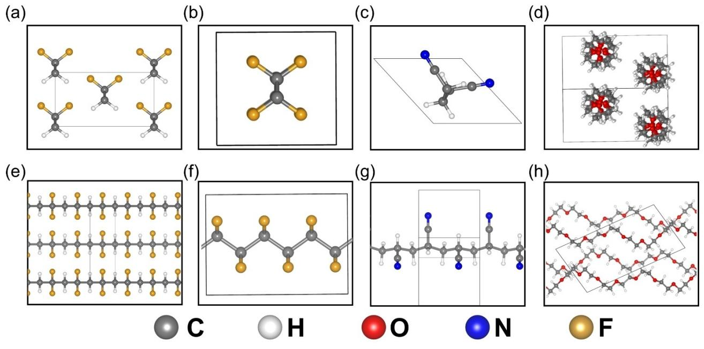
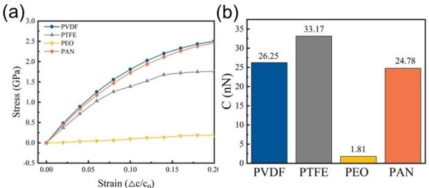
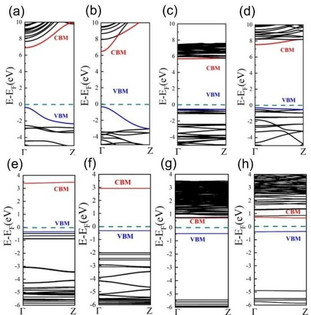
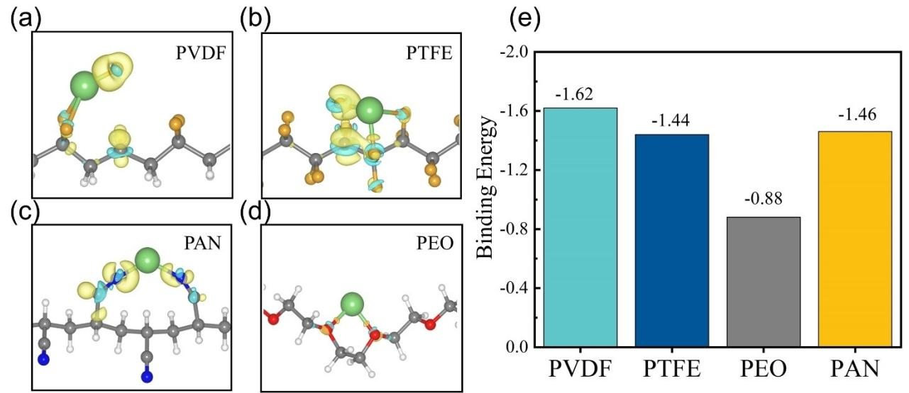
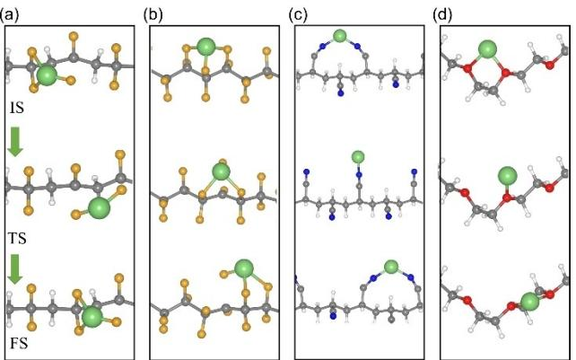
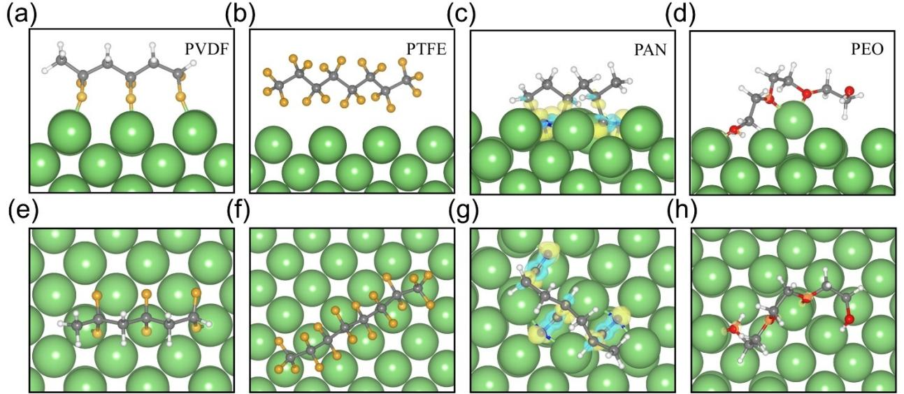

# **First-Principles Study on Polymer Electrolyte Interface Engineering for Lithium Metal Anodes**

Yao [Wang](http://orcid.org/0000-0002-3440-1801)+ , [a, b] [Ziang](http://orcid.org/0009-0003-2494-3441) Ren+ , [a] [Jianhui](http://orcid.org/0009-0005-7054-8885) Zheng,\*[c, d] [Juncheng](http://orcid.org/0009-0002-5485-8398) Wang,[c] [Huadong](http://orcid.org/0000-0002-1471-478X) Yuan,[a] [Yujing](http://orcid.org/0000-0002-9429-5983) Liu,[a] [Tiefeng](http://orcid.org/0000-0002-3995-2776) Liu,[d] [Jianmin](http://orcid.org/0000-0002-6233-4140) Luo,[a] [Jianwei](http://orcid.org/0000-0001-9681-5498) Nai,[a] and [Xinyong](http://orcid.org/0000-0003-4084-7743) Tao\*[a]

Modifying the interface between the lithium metal anode (LMA) and the electrolyte is crucial for achieving high-performance lithium metal batteries (LMBs). Recent research indicates that altering Li-metal interfaces with polymer coatings is an effective approach to extend LMBs' cycling lifespan. However, the physical properties of these polymer-Li interfaces have not yet been fully investigated. Therefore, the structural stability, electronic conductivity, and ionic conductivity of polymer-Li interfaces were examined based on first-principles calculations in this study. Several representative polymer compounds utilized in LMBs were assessed, including polyacrylonitrile (PAN), polyvinylidene fluoride (PVDF), polytetrafluoroethylene (PTFE), and polyethylene oxide (PEO). Our research revealed that lithium fluoride is formed upon fluoropolymer degradation,

# explaining previously observed experimental results. Polymers containing nitrile groups exhibit strong adhesion to lithium metal, facilitating the formation of the stable interface layer. Regarding electronic conductivity, the fluoropolymers preserve a good insulating property, which diminished marginally in the presence of lithium, but that of PAN and PEO significantly reduces. Additionally, lithium diffusion on PTFE and PEO demonstrates low diffusion barriers and high coefficients, enabling easy transportation. Overall, our investigation reveals that the interfaces formed between various polymers and LMA have distinct characteristics, providing new fundamental insights for designing composites with tailored interface properties.

# **1. Introduction**

Elemental Li0 is considered to be the optimal anode due to its low reduction potential ( 3.04 V versus standard hydrogen electrode) and the ultrahigh theoretical specific capacity (3,860 mAhg 1 ).[1] However, this advantage poses both opportunities and challenges owing to the strong reducibility and substantial volume fluctuations that might cause serious interface issues between the electrode and the electrolyte, hindering the commercialization of lithium (Li) metal anodes (LMAs).[2,3] An in-depth study of the battery interface is very important and deserved. As a result of these challenges, various theories, and advanced technologies have been proposed to investigate the interface between LMA and the electrolyte to gain a compre-

- [a] *College of Materials Science and Engineering, Zhejiang University of Technology, Hangzhou, China*
- [b] *Moganshan Research Institute at Deqing County, Zhejiang University of Technology, Huzhou, China*
- [c] *Quzhou Institute of Power Battery and Grid Energy Storage, Quzhou, China* [d] *College of Chemical and Biological Engineering, Zhejiang University,*
- *Hangzhou, China*

*Correspondence: Prof. Xinyong Tao, College of Materials Science and Engineering, Zhejiang University of Technology, Hangzhou 310014, China. Email: tao@zjut.edu.cn*

*Jianhui Zheng, Quzhou Institute of Power Battery and Grid Energy Storage, Quzhou 324000, China.*

*Email: zhengjianhui@qzpowerbattery.com*

- [ +] *These authors contributed equally to this work.*
- *Supporting Information for this article is available on the WWW under <https://doi.org/10.1002/cssc.202400738>*

hensive understanding of the interfacial reaction mechanism.[4–6]

The Li plating and stripping processes are fundamentally governed by the interface between the Li anode and the electrolyte.[7] Since the electrochemical potential of Li0 lies above the lowest unoccupied molecular orbital (LUMO) of practical electrolytes, the electrolyte will be reduced until solid electrolyte interphase (SEI) layer is formed at the electrodeelectrolyte interface. Nevertheless, the SEI that formed during the cycling procedure was failed to accommodate the huge volume expansion. This process leads to continuous SEI formation and rupture, leading to severe electrolyte depletion and battery degradation.[8] Therefore, various strategies have been utilized to stabilize the interface of Li metal, including modified liquid electrolytes, solid electrolytes, and artificial SEIs.[9–14] Among these methods, polymer coatings are notable for their ease of processing and compatibility with other electrolyte-based approaches.[7] For example, polyethyleneimine sponge hosts and ultrathin polymer films of "polyurea" have been proven to be effective in enabling dendrite-free Li deposition.[15,16] Furthermore, the stability of interface is improved by polymers with high viscoelasticity and self-healing properties.[17,18] Numerous modern techniques have been employed to characterize the interface between LMA and polymer, it remains difficult to comprehend how these polymers stabilize LMA, particularly their evolution process upon cycling at an atomic scale with the available technology. Therefore, it is imperative to gain a deeper understanding of the polymer-Li interface through theoretical calculations.

In recent years, density functional theory (DFT) and molecular dynamics (MD) simulations have been widely

**Figure 1.** Crystal structures of the different polymers investigated. (a) (e), (b) (f), (c) (g), and (d) (h) are PVDF, PTFE, PAN, and PEO, respectively. White, orange, red, blue, and gray represent H, F, O, N, and C. (a–d) is the view in the chain axis direction and (e–h) is the side view.

employed to study the atomic-scale interface between Li metal and electrolytes. Ebadi et al. investigated the stability and electronic structure of the interface between polymers and Li metal through DFT calculation.[19] Mirsakiyeva et al. discovered that the PEO/Li interface cpmprises an interphase layer of Li2O whose thickness is limited by kinetics via DFT simulation.[20] Additionally, Ebadi et al. simulated the polymer electrolyte/Limetal interface and showed that ionic transport dynamics were evidently inhibited near the interface.[21]

The present work explored the interfacial reaction between LMA and polymer coatings, several representative polymer compounds utilized in LMBs have been assessed: polyacrylonitrile (PAN), polytetrafluoroethylene (PTFE), poly(vinylidene fluoride) (PVDF) and poly(ethylene oxide) (PEO).[22–24] We initially investigated the mechanical properties, ionic conductivity properties, electronic structure, and stability of polymers containing Li atoms, which are crucial for achieving highperformance LMBs.[25] In addition, analyzing the interaction between the polymer compounds and Li metal electrodes allows for a comprehensive understanding of the initial stages of polymer degradation evolution at LMA. This work provides new insights into the polymer-Li interface and sheds light on polymer interface engineering for LMA.

### **2. Results and Discussion**

#### **2.1. Intrinsic Properties of Polymers**

The mechanical properties of polymer films are crucial for achieving uniform Li deposition.[7,26] Using a high high-modulus polymer coatings to mechanically inhibit dendrite growth is considered to be a very effective method for suppressing Li dendrites.[27,28] Figures 1a–d and Equations 1–4 show the crystal structures and the stiffness of PVDF, PTFE, PEO, and PAN. PVDF and PTFE are orthorhombic, while PEO and PAN are monoclinic. Stiffness represents an object's resistance to deformation.[29] Compared with PVDF, PTFE, PAN, PEO has a smaller stiffness, which indicates PEO is more susceptible to deformation. Figure 2 illustrates the stress-strain curves and stiffness (C) from our uniaxial extension simulation in the chain axis direction to better understand the mechanical properties of different polymers. Under the same strain conditions, PVDF, PTFE, and PAN have similar mechanical properties, but it is obvious from Figure 2 that under the same strain conditions, PEO is much less stressed than the other three polymers, indicating that PEO is more flexible. To better understand the mechanical properties of different polymers, we examined how the lengths of bonds and the angles of bonds vary with strainMain.

In Figures S1a and b, PVDF, PTFE, and PAN show similar changes in bond lengths and angles. It may be for this reason

**Figure 2.** The stress-strain curves and stiffness of the different polymers in the chain axis direction.

**Figure 3.** Calculated band structures of (a–d) PVDF, PTFE, PEO, PAN and (e– h) PVDF Li, PTFE Li, PEO Li, PAN Li. The valence band maximum is shifted to 0 eV.

| Table 1. Band gaps of the polymers with and without Li. |               |         |               |
|---------------------------------------------------------|---------------|---------|---------------|
|                                                         | Band gap (eV) |         | Band gap (eV) |
| PVDF                                                    | 7.23          | PVDF-Li | 3.74          |
| PTFE                                                    | 6.06          | PTFE-Li | 3.24          |
| PEO                                                     | 6.22          | PEO-Li  | 1.16          |
| PAN                                                     | 7.84          | PAN-Li  | 1.03          |

that these polymers exhibit similar mechanical properties. As for PEO, it is difficult to significantly change its C C bond length and C C O bond angle due to its unique helical structure (Figure 1d). Therefore, the lower stiffness of PEO can be attributed to the smaller alteration of the in-chain atomic structure under the same tensile stress.

Apart from exploring the mechanical properties of polymers, we also investigated their electrical insulation. In Figures 3a–d, the band structures of the different polymers were calculated by the HSE06 functional.[30] PVDF, PTFE, PEO, and PAN have wide band gaps, showing the properties of insulators (Table 1). In Figure S2, the wave functions of the valence band maximum (VBM) and conduction band minimum (CBM) of the polymers show a very slight overlap, which is unfavorable for the diffusion of carriers. In general, among the four polymers, PAN exhibits the widest band gap, indicating that the SEI containing organic components of PAN is highly unfavorable for electronic conduction.

#### **2.2. Interaction between Li Atom and Polymers**

We conducted DFT calculations for polymer-Li configurations to study the interactions between Li atoms and various polymers. The optimized structures of these polymers are presented in Figure 4a–d. According to Figure 4a, the bridge site of the F atoms on PVDF is the most stable for Li adsorption. Additionally, as shown in Figure S3, a Bader charge analysis was conducted to examine charge transfer.[31–33] Li and PVDF interact by transferring electrons from the Li atom to the C1 and F1 atoms. As a result, F1 separates from C1 and forms an ionic bond with Li. When considering PTFE, in Figure 4b and Figure S3b, the Li atom forms ionic bonds with three F atoms, and the electrons lost by Li atom are mainly concentrated around F1 and C1 atoms. As a result, the length of the C1-F1

**Figure 4.** The (a–d) geometrical configuration and charge density difference, (e) binding energy of a Li atom with different polymers. Iso-surface values is set to 0.008 e Bohr 3 . The yellow and blue colors representing the charge accumulation and depletion. The green color represents the Li atom, and the color coding is consistent with Figure 1.

bond has been extended from 1.36 Å to 2.25 Å. The optimized configuration of Li-PAN is shown in Figure 4c and Figure S3c. The data reveal that the Li atom loses 0.90 electrons and forms ionic bonds with two adjacent nitrogen atoms in PAN. With PAN, unlike PTFE or PVDF, when Li atoms are adsorbed on the chains, the N C bond changes only from 1.17 to 1.21 indicating that nitrogen atoms still have strong interactions with the chains. Regarding the Li-PEO configuration (Figure 4d and Figure S3d), Li is adsorbed between two oxygen atoms in PEO. As can be seen from the differential charge density described in Figure 4d, the electron transfer between PEO and Li atoms is a small amount (0.21 e in Figure S3d). It is worth noting that when the Li atom is adsorbed on PEO, there is hardly any change in the bond length of C O and C1-C2, which demonstrates the structure of Li-PEO is stable. As is well known, the binding energy determines the adhesion strength of adsorbate. Figure 4e shows the binding energies of Li with different polymers. Among the four configurations investigated, the Li-PVDF binding energy is the largest, 1.62 eV. In contrast, the Li-PEO binding energy is only 0.88 eV, indicating the relatively weak interaction between the Li atom and PEO.[34]

In summary, compared with Li adhesion PEO, Li atoms have strong adhesion to PAN, PVDF, and PTFE. Li-PAN and Li-PEO polymers exhibited minimal structural changes, with no atoms, such as nitrogen or oxygen, detaching from their carbon skeletons, indicating excellent structural stability with Li atoms. However, when Li atoms interact with PVDF and PTFE, F atoms detach from the carbon skeleton to form LiF, consistent with the defluorination and alkali-F formation observed experimentally.[23,33,35] Furthermore, previous experiments have demonstrated that LiF is one of the inorganic substances in the SEI film, which contributes to Li ion conduction.[36–38]

Figure 3e–h shows the band structures of polymer-Li. The band gaps of the polymer-Li significantly reduced compared to their intrinsic counterparts. Li provided electrons to the polymer body, which increased the Fermi level, resulting in n-doping. Consequently, the electronic insulation deteriorates as the amount of Li adsorbed increases, especially for PEO and PAN.[39] Notably, similar effects are observed in polymer electrolytes containing lithium bis(trifluoromethane)sulfonimide salt, where the introduction of the salt significantly reduces the band gap.[40,41]

Having validated the polymer-Li coordination configurations, we further explored the transport properties of Li in these polymers. It is well known that cation transport kinetics can be divided into three main mechanisms: moving along a chain, moving with the chain segment, using the chain as a carrier, and jumping between different chains.[42,43] Therefore, we explore

mechanisms of Li transport along a chain by the climbing image nudged elastic band (CI-NEB) method.[44] The schematic diagram of the Li diffusion pathway along PVDF and PTFE chains is displayed in Figure 5a and Figure 5b. As shown in the initial-state structure of PVDF, Li atoms coordinate with three fluorine atoms, and one fluorine atom is detached from the carbon skeleton. As Li moved from its initial-state configuration to its transition-state configuration, Li atoms formed ionic

**Figure 5.** Li migration pathways on the (a) PVDF, (b) PTFE, (c) PAN, (d) PEO. IS, TS, and FS represent the initial, transition, and final states. The green color represents the Li atom, and the color coding is consistent with Figure 1.

bonds with two fluorine atoms and at the same time, the carbon-fluorine chemical bond stretched from 1.41 Å to 1.96 Å. Compared with the initial-state configuration, the transition state shows a drastic change in the Li-fluorine environment: from bonding with three fluorines initially to only two during transition. It is observed that the initial and transition states of Li atoms on the PTFE chain (shown in Figure 5b) are similar in structure: during diffusion, Li maintains a configuration in which Li atoms coordinate with three fluorine atoms, and one fluorine atom is separated from the carbon skeleton. Figure 5c shows diffusion mechanism of Li atoms along the PAN chains. In the initial state, two nitrogen atoms with Li atoms form ionic bonds with a strong binding energy ( 1.46 eV). However, in the transition state, Li N coordination was changed from 2-fold (N Li-N: 1.93 Å, 1.85 Å) to 1-fold (Li N: 1.79 Å). In the case of Li diffusion along the PEO chain (Figure 5d), Li migrated between adjacent O atoms with the changing of Li O coordination number from 2 to 1. The process from the transition state to the final state is essentially the reverse of the process from the initial state to the transition state. Structurally, the initial and final states are similar, with the key difference being that in the final states, the lithium atom is bonded to the next repeating unit.

Based on the NEB calculations, Figure S4 shows Li migration energy barriers and diffusion coefficients. A lower energy barrier and a higher diffusion coefficient are observed for Li diffusing along PTFE and PEO chains. In contrast, Li diffusion on PVDF and PAN exhibits large energy barriers. The energy barrier for Li diffusion arises from the energy difference between the initial and transition states. According to the discussion above regarding Li migration configurations along different polymers (Figure 5), the chemical environment of Li atoms in the initial and transition configurations may contribute to the lower diffusion barrier of Li atoms along PTFE and PEO. For example, regarding the diffusion of Li along the PEO chain, although the Li O coordination number has changed, the variation of Li O bond length can be ignored (initial state: 1.99 Å, transitionstate: 1.92 Å), indicating that the Li-PEO binding energy is

similar in the two states, which results in a very low migration barrier.

#### **2.3. Interface between Li Atom and Polymers**

Battery performance is generally attributed to the chemical properties of SEI.[45] A compact SEI film can slow downside reactions and prevent Li metal from being continuously corroded by the electrolyte.[46,47] In this section, the interface between Li metal and polymer was studied by DFT and AIMD simulations. Considering the strong localization of the electronic structure of each polymer (Figure S2), the correlation between the electronic structure and the size of the oligomer is weak. Therefore, three units are used to represent each oligomer.[19] Optimized structures and charge density differences for the polymers on Li metal are shown in Figure 6.

Figure S5 shows the corresponding binding energies and Bader charge transfers for these polymers on Li metal. According to the charge density difference analysis of PVDF and PTFE (Figure 6a–b), there is negligible electron transfer between the polymers and Li metal. Figure S5 shows the binding energies of PVDF and PTFE between Li metal surfaces of 0.51 and 0.12 eV. Li metal transferred 0.30 and 0.38 electrons to the PVDF and PTFE oligomers. Based on the results presented above, PVDF and PTFE molecular oligomers do not exhibit strong binding energies to Li metal surfaces.

In the case of PAN, the binding energy to the Li metal surface is 4.89 eV (Figure S5), which indicates PAN has the strongest interaction with the Li metal surface. Based on the configuration of PAN after adsorption to the Li metal surface (Figure 6c), all N atoms are embedded into Li and form ionic bonds with the 4 Li atoms, resulting in a vigorous electron transfer between PAN and Li. This is consistent with the result of Bader charge states: Li metal transferred 6.39 electrons to the PAN oligomer (Figure S5b). The adsorbed PEO oligomer is shown in Figure 6d. In contrast to PAN oligomers, O atoms are not embedded into the Li metal surface, but after atomic relaxations, Li atoms on the metal surface move towards the O atoms. This is similar to the configuration of Li atom on the PEO chain shown in Figure 4d. The unique configuration is mainly due to the particular spiral structure of PEO (shown in Figure 1d), where two nearby oxygen atoms can "hoist" Li atoms from the surface of Li metal like a crane. As a result, at the interface between electrolyte and electrode, this could lead to the effortless solvation of Li atoms and increase the rate of Li conduction.

Further simulations were conducted using AIMD for 10 ps at 330 K to examine how polymers interact with Li metal surfaces. The optimized structures of these systems by DFT were used as the initial configuration of AIMD. For PVDF (Figure S6a), the fluorine atom forms a bond with Li after 10 ps of NVT AIMD simulation but does not detach from the carbon skeleton to form LiF. The interaction of PTFE with Li (100) is presented in Figure S6b. A weak interaction exists between PTFE and Li surface (Figure S5a), resulting in PTFE oligomer diffusion into the vacuum layer. The process of fluorine atoms forming bonds with Li atoms is continuous as shown in Figure S7. Based on these results, the energy barrier must be overcome if PTFE and PVDF react with Li metal to form LiF. Figure S6c displays the case of PAN. Unlike PTFE and PVDF oligomers, PAN binds strongly to the surface of Li metal and all nitrogen atoms are embedded in the metal. Figure S6d illustrates how oxygen in PEO pulls Li out of the Li metal surface rather than intercalating into it, as N does in PAN. In addition, PVDF, PTFE, PEO, and PAN do not exhibit any bond cleavage and remain stable during simulation. This prevents the polymer from continuously reacting with Li and improves the stability of the Li metal interface.

**Figure 6.** Charge density differences of (a) PVDF (b) PTFE (c) PAN and (d) PEO on the Li (100) surface. The iso-surface value is taken at 0.01 e Bohr 3 . The green color represents the Li atom, and the color coding is consistent with Figure 1. (a–d) is the side view, and (e–h) is the top view.

# **3. Conclusions**

In summary, the structural stability, electronic conductivity, and ionic conductivity of polymer-Li interfaces were investigated using first-principles calculations. PVDF and PTFE exhibit larger stiffness coefficients, whereas PEO provides considerably greater flexibility. The nitrile functional groups in PAN have a high binding energy to the lithium surface, indicating a strong affinity for the Li metal. The unique helical structure of the PEO chain prevents oxygen atoms from being embedded in the Li metal surface, instead pulling the lithium atoms out. For PVDF and PTFE adsorbed on the Li metal surface, their low binding energies lead to weaker adhesion. Therefore, PVDF and PTFE may need to overcome the energy barrier to react with LMA and generate LiF. The intrinsic band gap of PAN and PEO is considerable, yet it reduces dramatically after Li-ion adsorption, which does not contribute to preventing electron leakage. Nonetheless, PVDF and PTFE perform better in terms of electronic insulation before and after lithium adsorption. Furthermore, it has been demonstrated that the energy barriers for lithium ionic diffusion along PTFE and PEO chains are typically quite small, resulting in a rise in the lithium selfdiffusion coefficient. While these results offer valuable insights into the thermodynamic and kinetic properties of the Lipolymer interface, future studies should also consider the dynamic properties of Li within the polymer bulk, as well as the thermodynamic properties of polymer bulk at the surface of Li.

# **Computational Details**

The calculations were performed by the Vienna *Ab initio* Simulation Package,[48,49] a code using density functional theory with a plane wave basis[50] The exchange correlation functional was treated with the generalized gradient approximation (GGA) of Perdew Burke Ernzerhof (PBE)[51] For all systems in the study, the cutoff energy was set to 500 eV. When ions relaxation was carried out, the standard of forces was less than 0.01 eV Å 1 . The convergence criterion of electronic self-consistency was 10 5 eV with a 3×1×1 gama-centered grid.[52] The DFT D3 method was considered to include the van der Waals (vdW) correction.[53] The band gap of the investigated polymers were calculated using the hybrid functional of HSE06. The binding energies of the lithium atom with the polymers and the oligomers on the Li metal surface are calculated as:

$$
E_b = E_{\text{polymer}-li} - E_{\text{polymer}/\text{oligomers}} - E_{li-\text{atom}/li-\text{surface}}
$$
\n(1)

Where *Epolymer li*is total energy polymer and lithium atom or oligomers and lithium metal surface. *Epolymer=oligomers*is total energy of the polymers or oligomers. *E*li atom*=*li surfaceis the total energy of Li atom or Li metal surface. The reactivity of polymer with lithium metal surface was studied by AIMD simulation. All simulations were performed in the NVT ensemble at 330 K.[54] The cutoff energy was 500 eV and a 1×1×1 Monkhorst Pack kpoint mesh for all structures. A Nose thermostat, with a Nosémass parameter set to 0.5, was employed using a time step of 1 femtosecond, tritium mass is used instead of proton. Data was processed using VASPKIT[55] and all configurations were visualized by VESTA.[56]

# *Acknowledgments*

*This work was supported by the National Key R&D Program of China (No. 2022YFB3807700), the Natural Science Foundation of Zhejiang Province (No. LY23E020010), the National Natural Science Foundation of China (No. 52225208, and U21A20174). Y.W. acknowledges the funding from China Postdoctoral Science Foundation (2023M743098). The authors thank Beijing PARATERA Tech CO., Ltd. and Shanghai Hongzhiwei Tech CO., Ltd. for providing HPC resources.*

# *Conflict of interests*

The authors declare no conflict of interest.

# *Data Availability Statement*

The data that support the findings of this study are available in the supplementary material of this article.

**Keywords:** Lithium metal anode **·** First-principles calculations **·** Polymer coatings **·** Polymer-lithium interface **·** Diffusion mechanism

- [1] W. Xu, J. Wang, F. Ding, X. Chen, E. Nasybulin, Y. Zhang, J.-G. Zhang, *Energy [Environ.](https://doi.org/10.1039/C3EE40795K) Sci.* **2014**, *7*, 513.
- [2] J. B. Goodenough, Y. Kim, *Chem. [Mater.](https://doi.org/10.1021/cm901452z)* **2010**, *22*, 587.
- [3] M. D. Tikekar, L. A. Archer, D. L. Koch, *Sci. Adv.* **2016**, *2*, e1600320.
- [4] Y. Li, Y. Li, A. Pei, K. Yan, Y. Sun, C.-L. Wu, L.-M. Joubert, R. Chin, A. L.
- Koh, Y. Yu, J. Perrino, B. Butz, S. Chu, Y. Cui, *[Science](https://doi.org/10.1126/science.aam6014)* **2017**, *358*, 506. [5] O. Sheng, J. Zheng, Z. Ju, C. Jin, Y. Wang, M. Chen, J. Nai, T. Liu, W.
- Zhang, Y. Liu, X. Tao, *Adv. Mater.* **2020**, *32*, 2000223. [6] X.-B. Cheng, R. Zhang, C.-Z. Zhao, Q. Zhang, *[Chem.](https://doi.org/10.1021/acs.chemrev.7b00115) Rev.* **2017**, *117*,
- [10403.](https://doi.org/10.1021/acs.chemrev.7b00115) [7] J. Lopez, A. Pei, J. Y. Oh, G.-J. N. Wang, Y. Cui, Z. Bao, *J. Am. [Chem.](https://doi.org/10.1021/jacs.8b06047) Soc.* **2018**, *140*, [11735.](https://doi.org/10.1021/jacs.8b06047)
- [8] S. Jiang, W. Y. Lieu, X. L. Li, D. Fang, S. L. Teo, Y. Li, Z. W. Seh, B. Tian, Y. Shi, H. Y. Yang, *Mater. Today Energy* **2023**, *38*, [101444.](https://doi.org/10.1016/j.mtener.2023.101444)
- [9] Z. Ju, J. Nai, Y. Wang, T. Liu, J. Zheng, H. Yuan, O. Sheng, C. Jin, W. Zhang, Z. Jin, H. Tian, Y. Liu, X. Tao, *Nat. Commun.* **2020**, *11*, 488.
- [10] T. Liu, J. Zheng, H. Hu, O. Sheng, Z. Ju, G. Lu, Y. Liu, J. Nai, Y. Wang, W. Zhang, X. Tao, J. Energy *Chem.* **2021**, *55*, 272.
- [11] H. Yuan, J. Nai, H. Tian, Z. Ju, W. Zhang, Y. Liu, X. Tao, X. W. Lou, *Sci. Adv.* **2020**, *6*, eaaz3112.
- [12] X.-X. Zeng, Y.-X. Yin, Y. Shi, X.-D. Zhang, H.-R. Yao, R. Wen, X.-W. Wu, Y.- G. Guo, *[Chem](https://doi.org/10.1016/j.chempr.2017.12.003)* **2018**, *4*, 298.
- [13] F. Ding, W. Xu, G. L. Graff, J. Zhang, M. L. Sushko, X. Chen, Y. Shao, M. H. Engelhard, Z. Nie, J. Xiao, X. Liu, P. V. Sushko, J. Liu, J.-G. Zhang, *J. [Am.](https://doi.org/10.1021/ja312241y) [Chem.](https://doi.org/10.1021/ja312241y) Soc.* **2013**, *135*, 4450.
- [14] F. Wu, F. Du, P. Ruan, G. Cai, Y. Chen, X. Yin, L. Ma, R. Yin, W. Shi, W. Liu, J. Zhou, X. Cao, *J. Mater. Chem. A* **2023**, *11*, [11254.](https://doi.org/10.1039/D3TA01344H)
- [15] G. Li, Z. Liu, Q. Huang, Y. Gao, M. Regula, D. Wang, L.-Q. Chen, D. Wang, *Nat. [Energy](https://doi.org/10.1038/s41560-018-0276-z)* **2018**, *3*, 1076.
- [16] Y. Sun, Y. Zhao, J. Wang, J. Liang, C. Wang, Q. Sun, X. Lin, K. R. Adair, J. Luo, D. Wang, R. Li, M. Cai, T.-K. Sham, X. Sun, *Adv. Mater.* **2019**, *31*, 1806541.

- [17] P. Cordier, F. Tournilhac, C. Soulié-Ziakovic, L. Leibler, *[Nature](https://doi.org/10.1038/nature06669)* **2008**, *451*, [977](https://doi.org/10.1038/nature06669).
- [18] G. Zheng, C. Wang, A. Pei, J. Lopez, F. Shi, Z. Chen, A. D. Sendek, H.-W. Lee, Z. Lu, H. Schneider, M. M. Safont-Sempere, S. Chu, Z. Bao, Y. Cui, *ACS [Energy](https://doi.org/10.1021/acsenergylett.6b00456) Lett.* **2016**, *1*, 1247.
- [19] M. Ebadi, C. Marchiori, J. Mindemark, D. Brandell, C. M. Araujo, *J. [Mater.](https://doi.org/10.1039/C8TA12147H) [Chem.](https://doi.org/10.1039/C8TA12147H) A* **2019**, *7*, 8394.
- [20] A. Mirsakiyeva, M. Ebadi, C. M. Araujo, D. Brandell, P. Broqvist, J. Kullgren, *J. Phys. [Chem.](https://doi.org/10.1021/acs.jpcc.9b07712) C* **2019**, *123*, 22851.
- [21] M. Ebadi, L. T. Costa, C. M. Araujo, D. Brandell, *[Electrochim.](https://doi.org/10.1016/j.electacta.2017.03.030) Acta* **2017**, *[234](https://doi.org/10.1016/j.electacta.2017.03.030)*, 43.
- [22] Y. Zhai, X. Wang, Y. Chen, X. Sang, H. Liu, J. Sheng, Y. Wu, X. Wang, L. Li, *J. [Membr.](https://doi.org/10.1016/j.memsci.2020.118996) Sci.* **2021**, *621*, 118996.
- [23] J. Lang, J. Song, L. Qi, Y. Luo, X. Luo, H. Wu, *ACS Appl. Mater. [Interfaces](https://doi.org/10.1021/acsami.7b00181)* **2017**, *9*, [10360.](https://doi.org/10.1021/acsami.7b00181)
- [24] S. Sun, S. Myung, G. Kim, D. Lee, H. Son, M. Jang, E. Park, B. Son, Y.-G. Jung, U. Paik, T. Song, *J. [Mater.](https://doi.org/10.1039/D0TA05372D) Chem. A* **2020**, *8*, 17229.
- [25] H. Li, F. Zhang, W. Wei, X. Zhao, H. Dong, C. Yan, H. Jiang, Y. Sang, H. Chen, H. Liu, S. Wang, *Adv. Energy Mater.* **2023**, *13*, 2301023.
- [26] Z. Huang, J.-C. Lai, S.-L. Liao, Z. Yu, Y. Chen, W. Yu, H. Gong, X. Gao, Y. Yang, J. Qin, Y. Cui, Z. Bao, *Nat. [Energy](https://doi.org/10.1038/s41560-023-01252-5)* **2023**, *8*, 577.
- [27] S.-O. Tung, S. Ho, M. Yang, R. Zhang, N. A. Kotov, *Nat. Commun.* **2015**, *6*, 6152.
- [28] R. Bouchet, S. Maria, R. Meziane, A. Aboulaich, L. Lienafa, J.-P. Bonnet, T. N. T. Phan, D. Bertin, D. Gigmes, D. Devaux, R. Denoyel, M. Armand, *Nat. [Mater.](https://doi.org/10.1038/nmat3602)* **2013**, *12*, 452.
- [29] E. Baumgart, *Injury* **2000**, *31*, 14.
- [30] J. Heyd, G. E. Scuseria, *J. [Chem.](https://doi.org/10.1063/1.1760074) Phys.* **2004**, *121*, 1187.
- [31] W. Tang, E. Sanville, G. Henkelman, *J. Phys. [Condens.](https://doi.org/10.1088/0953-8984/21/8/084204) Matter* **2009**, *21*, [084204.](https://doi.org/10.1088/0953-8984/21/8/084204)
- [32] E. Sanville, S. D. Kenny, R. Smith, G. Henkelman, *J. [Comput.](https://doi.org/10.1002/jcc.20575) Chem.* **2007**, *28*, [899.](https://doi.org/10.1002/jcc.20575)
- [33] G. Henkelman, A. Arnaldsson, H. Jónsson, *[Comput.](https://doi.org/10.1016/j.commatsci.2005.04.010) Mater. Sci.* **2006**, *36*, [354](https://doi.org/10.1016/j.commatsci.2005.04.010).
- [34] M. Xu, F. Wu, Y. Zhang, Y. Yao, G. Zhu, X. Li, L. Chen, G. Jia, X. Wu, Y. Huang, P. Gao, W. Ye, *Nat. Commun.* **2023**, *14*, 6994.
- [35] C. Qin, D. Wang, Y. Liu, P. Yang, T. Xie, L. Huang, H. Zou, G. Li, Y. Wu, *Nat. Commun.* **2021**, *12*, 7184.
- [36] S. Tasker, R. D. Chambers, J. P. S. Badyal, *J. Phys. Chem.* **1994**, *98*, [12442.](https://doi.org/10.1021/j100098a046)
- [37] L. Fan, H. L. Zhuang, L. Gao, Y. Lu, L. A. Archer, *J. [Mater.](https://doi.org/10.1039/C6TA10204B) Chem. A* **2017**, *5*, [3483.](https://doi.org/10.1039/C6TA10204B)
- [38] J. Zheng, Z. Ju, B. Zhang, J. Nai, T. Liu, Y. Liu, Q. Xie, W. Zhang, Y. Wang, X. Tao, *J. [Mater.](https://doi.org/10.1039/D0TA11444H) Chem. A* **2021**, *9*, 10251.
- [39] A. Ramírez-Solís, B. Kirtman, R. Bernal-Jáquez, C. M. Zicovich-Wilson, *J. Chem. Phys.* **2009**, *130*, 164904.
- [40] H.-J. Liu, J. Qu, Y. Chang, C.-Y. Yang, X.-Z. Zhai, Z.-Z. Yu, X. Li, *ACS [Appl.](https://doi.org/10.1021/acsaem.2c03528) Energ. [Mater.](https://doi.org/10.1021/acsaem.2c03528)* **2023**, *6*, 519.
- [41] M. Unge, H. Gudla, C. Zhang, D. Brandell, *Phys. [Chem.](https://doi.org/10.1039/D0CP01130D) Chem. Phys.* **2020**, *22*, [7680.](https://doi.org/10.1039/D0CP01130D)
- [42] A. Maitra, A. Heuer, *Phys. Rev. Lett.* **2007**, *98*, 227802.
- [43] O. Borodin, G. D. Smith, *[Macromolecules](https://doi.org/10.1021/ma052277v)* **2006**, *39*, 1620.
- [44] G. Henkelman, H. Jónsson, *J. [Chem.](https://doi.org/10.1063/1.1323224) Phys.* **2000**, *113*, 9978.
- [45] Y. Li, W. Huang, Y. Li, A. Pei, D. T. Boyle, Y. Cui, *Joule* **[2018](https://doi.org/10.1016/j.joule.2018.08.004)**, *2*, 2167.
- [46] F. A. Soto, Y. Ma, J. M. Martinez de la Hoz, J. M. Seminario, P. B. Balbuena, *Chem. [Mater.](https://doi.org/10.1021/acs.chemmater.5b03358)* **2015**, *27*, 7990.
- [47] R. Liu, Z. Han, J. Han, L. Peng, S. Gu, J. Shao, W. Lv, *Mater. Today [Energy](https://doi.org/10.1016/j.mtener.2023.101452)* **2023**, *38*, [101452](https://doi.org/10.1016/j.mtener.2023.101452).
- [48] G. Kresse, J. Furthmüller, *Phys. Rev. B* **1996**, *54*, [11169.](https://doi.org/10.1103/PhysRevB.54.11169)
- [49] G. Kresse, D. Joubert, *Phys. Rev. B* **[1999](https://doi.org/10.1103/PhysRevB.59.1758)**, *59*, 1758.
- [50] P. E. Blöchl, *Phys. Rev. B* **1994**, *50*, [17953.](https://doi.org/10.1103/PhysRevB.50.17953)
- [51] J. P. Perdew, K. Burke, M. Ernzerhof, *Phys. Rev. Lett.* **[1996](https://doi.org/10.1103/PhysRevLett.77.3865)**, *77*, 3865.
- [52] H. J. Monkhorst, J. D. Pack, *Phys. Rev. B* **[1976](https://doi.org/10.1103/PhysRevB.13.5188)**, *13*, 5188.
- [53] A. O. Pereira, C. R. Miranda, *Appl. Surf. Sci.* **[2014](https://doi.org/10.1016/j.apsusc.2013.10.074)**, *288*, 564.
- [54] G. Kresse, J. Furthmüller, *[Comput.](https://doi.org/10.1016/0927-0256(96)00008-0) Mater. Sci.* **1996**, *6*, 15.
- [55] V. Wang, N. Xu, J. C. Liu, G. Tang, W.-T. Geng, *arXiv preprint arXiv:1908.08269* **2019**.
- [56] K. Momma, F. Izumi, *J. Appl. [Crystallogr.](https://doi.org/10.1107/S0021889811038970)* **2011**, *44*, 1272.

Manuscript received: April 7, 2024 Revised manuscript received: May 10, 2024 Accepted manuscript online: June 5, 2024 Version of record online: July 31, 2024