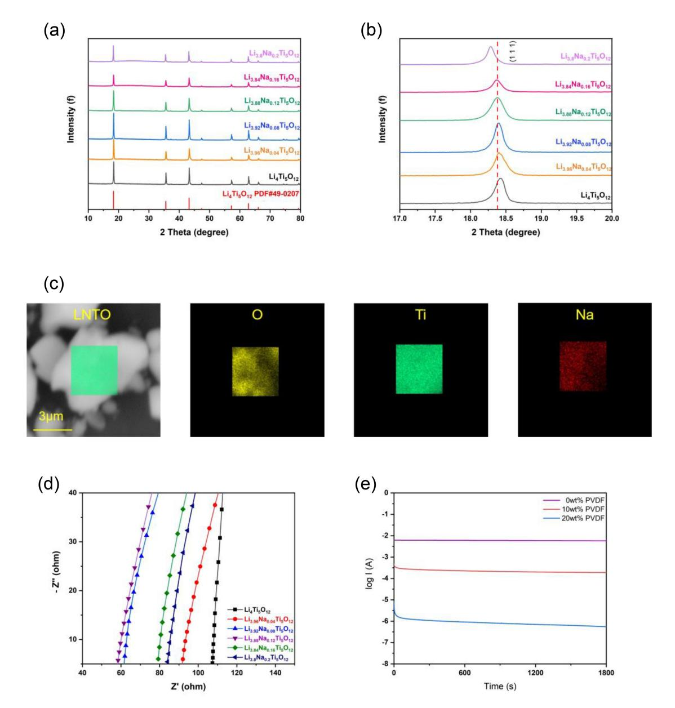
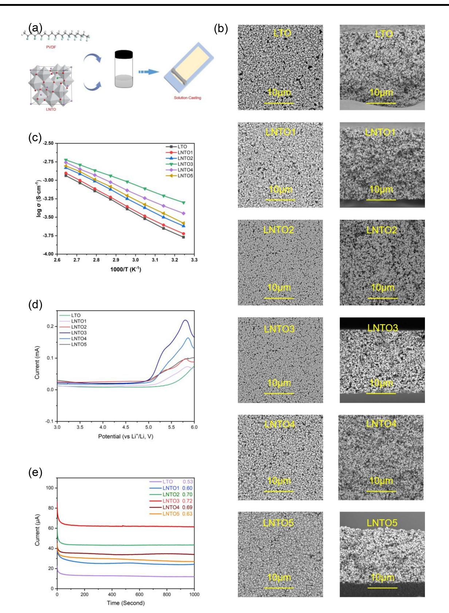
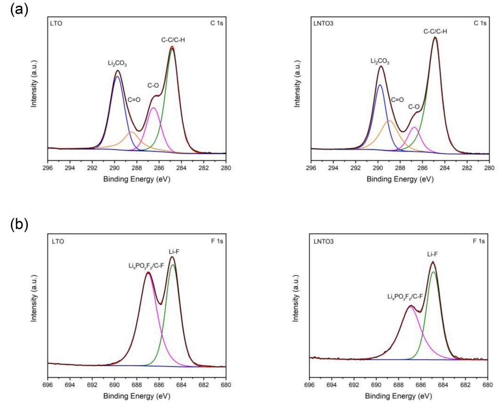
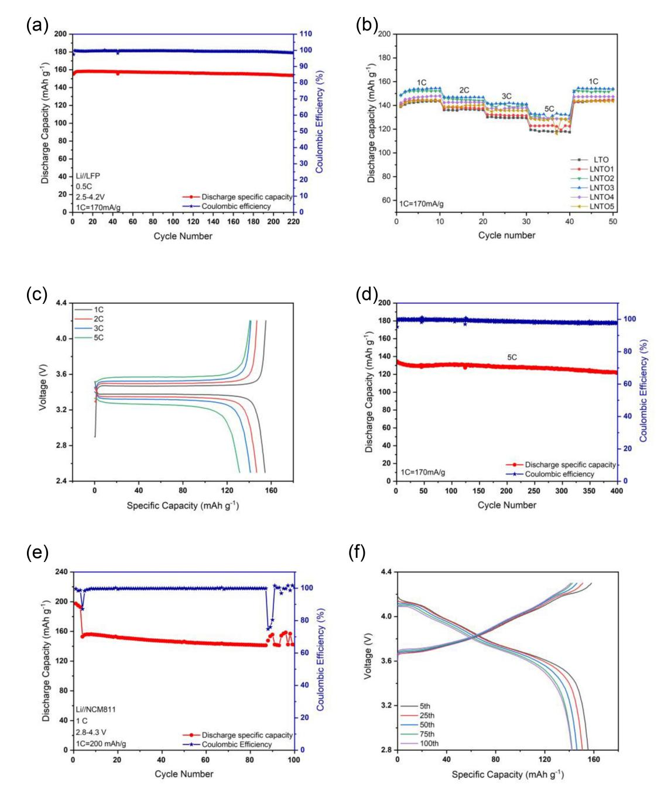
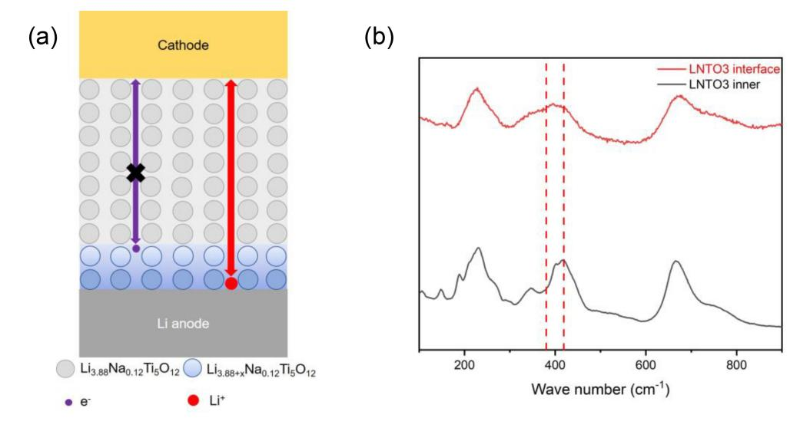

# **A Solid Electrolyte Based on Sodium-Doped Li4-xNaxTi5O12 with PVDF for Solid State Lithium Metal Battery**

Qiyue Chen,[a] Haitao Lv,[a] Jun Peng,[a] Qi Zhou,[b] Wenzhuo Wu,[c] Jing Wang,\*[a] Lili Liu,[a] Lijun Fu,[a] Yuhui Chen,[a] and [Yuping](http://orcid.org/0000-0002-0833-1205) Wu\*[a, b, d]

Solid-state batteries (SSBs) present a potential pathway for advancing next-generation lithium batteries, characterized by exceptional energy density and enhanced safety performance. Solid-state electrolytes have been extensively researched, yet an affordable option with outstanding electrochemical performance is still lacking. In this work, Li4-xNaxTi5O12 (LNTO)-based composite solid electrolytes (CSEs) were developed to enhance the interface stability and electronic insulation. The CSE is composed of Li3.88Na0.12Ti5O12 (LNTO3) and poly (vinylidene fluoride) (PVDF) with a proportion of 20 wt% exhibited high ionic conductivity (4.49×10 4 S cm 1 at a temperature value

## **Introduction**

In the context of viable economics, Li-ion batteries, known for their high power density and safety features, are extensively utilized in large-scale energy storage systems and electric vehicles.[1] In this context, there is a significant public interest in exploring the potential of lithium-ion batteries.[2]

With the drive for higher energy density along with larger battery packs, challenges in battery management and associated safety concerns have also emerged. Safety hazards have emerged due to issues such as leakage, thermal runaway, selfcombustion, and explosions associated with liquid electrolytes.[3] The most promising strategy to improve the safety of Li batteries is to substitute the conventional liquid electrolyte and polymer separator with a solid-state Li+ -conducting electrolyte.[4,5]

There are several kinds of solid-state electrolytes (SSEs) based on their composition: polymer, inorganic, and composite solid electrolytes.[6] Inorganic solid electrolytes provide high ionic conductivity along with a broader window of electrochemical stability.[7,8] However, high mechanical strength can

[c] *Department of Mathematics, Imperial College London, London, UK*

[d] *R & D Center, DKJ New Energy Materials Ltd. Co., Shaoxing, China Correspondence: Jing Wang and Yuping Wu, State Key Laboratory of Materials-oriented Chemical Engineering, School of Energy Science and Engineering, Nanjing Tech University, Nanjing, Jiangsu 211816, China. Email: wjx2015@njtech.edu.cn and wuyp@fudan.edu.cn*

*Supporting information for this article is available on the WWW under <https://doi.org/10.1002/cssc.202401755>*

*ChemSusChem* **2025**, *18*, e202401755 (1 of 10) © 2024 Wiley-VCH GmbH

equal to 35°C), high ionic transfer number (equal to 0.72), low activation energy (equal to 0.192 eV), and favorable compatibility with the Li metal anode. The Lij LNTO3j LiFePO4 cell, tested at a 0.5 C current density, demonstrated 154.5 mAhg 1 of outstanding cycling stability for 200 cycles, capacity retention of 97.6% along with a Coulombic efficiency of over 99%, as well as a significant average specific capacity of 127.8 mAhg 1 over 400 cycles at 5 C. The Lij LNTO3j LiNi0.8Co0.1Mn0.1O2 (NCM811) cell could also operate over 100 cycles at 1 C. This study offers an effective method for preparing commercial CSEs for SSBs.

impede lithium ion transport because of point-to-point contact with the electrodes.[9,10] Conversely, polymer electrolytes are more flexible, enabling improved surface contact with the electrodes.[11,12] However, polymer electrolytes generally have lower ionic conductivity at ambient temperature, often requiring operation at higher temperatures.[13,14] Composite solid electrolytes (CSEs) integrated with inorganic and polymer electrolytes provide a wider range of advantages, including high ionic conductivity, adequate strength, and excellent flexibility.[15,16] Thus, composite solid electrolytes have emerged as one of the utmost promising categories of solid electrolytes.

Recently, our group reported that a commercial anode material, spinel Li4Ti5O12, can be used to achieve a CSE by combining with poly (vinylidene fluoride). The CSE containing 80 wt% of the Li4Ti5O12 showed outstanding ionic conductivity at 35°C and excellent electrochemical performance while inhibiting the electronic conductive network.[17,18] In the spinel structure of Li4Ti5O12, the tetrahedral (8a) sites contained 75% of the Li ions, the octahedral (16d) sites hold the remaining lithium ions and all of the titanium ions in a 1:5 atomic ratio, and the 32e sites hold the oxygen ions. The zero strain property makes the lattice parameters of Li4Ti5O12 almost unchanged after lithium insertion, which is also a result of the 3D network of channels provided by the robust spinel framework for the transportation of lithium ions.[19] However, further improvement is needed.[20,21]

Previously, various approaches were explored to enhance the electrochemical efficiency of Li4Ti5O12 as an anode material, including nanoscaling,[22] surface coating,[23] structural design,[24] and heteroatom doping[25]. Among these strategies, doping with heteroatoms is particularly effective in enhancing the lithium-ion diffusion coefficient and electronic conductivity of Li4Ti5O12. [26]

[a] *State Key Laboratory of Materials-oriented Chemical Engineering, School of Energy Science and Engineering, Nanjing Tech University, Nanjing, Jiangsu, China*

[b] *Confucius Energy Storage Lab, School of Energy and Environment & Z Energy Storage Center, Southeast University, Nanjing, Jiangsu, China*

In this study, Na-doped spinel Li4-xNaxTi5O12 (LNTO) compounds were synthesized using solid-state method with Na2CO3, Li2CO3, and TiO2 as raw materials. CSEs were then produced by incorporating poly (vinylidene fluoride) (PVDF) to enhance electronic conductivity with improved interface contact. Small amount of Na+ doping can expand the Li-ion transport channels in Li4-xNaxTi5O12, which enhances the Li+ conductivity. The CSE with optimal Na+ doping amount in LNTO provided a high ionic conductivity and led to the development of a stable interface with the electrodes, which exhibits longer cycles and higher critical current density in the Lij j Li cells. The composite SSE was further used in the Lij j LiFePO4 (or NCM811) cell, which achieved remarkable cyclic stability and high-rate performance.

# **Results and Discussion**

#### **Some Properties of Li4-xNaxTi5O12 (x**=**0, 0.04, 0.08, 0.12, 0.16, 0.2)**

The X-ray diffraction (XRD) spectra (Figure 1a) suggested that the primary diffraction peaks of LNTO correspond to those of the standard sample (JCPDS card PDF#49-0207). The samples containing Na-doping endure a slight shift toward lower degrees in XRD, as evidenced by the enlarged peak associated with (1 1 1) planes (Figure 1b). The observed results suggest that the doping of Na increases the lattice parameter[27] which may be attributed to the larger Na+ ions replacing the smaller Li+ ions. This enlargement of the lattice constant facilitates rapid lithium-ion transfer while maintaining lattice stability.[28]

**Figure 1.** a) The acquired XRD spectra; b) enlarged (111) peaks of the Li4-xNaxTi5O12 materials; c) SEM image and EDS mapping of sodium (Na), oxygen (O), and titanium (Ti); d) EIS plot of pure Li4-xNaxTi5O12 pellet at room temperature; and e) chronoamperometry curve of lithiated pellets added with PVDF at a potential of 0.5 V.

*ChemSusChem* **2025**, *18*, e202401755 (2 of 10) © 2024 Wiley-VCH GmbH

Moreover, results from the energy dispersive spectrometer (EDS) and the inductively coupled plasma optical emission spectroscopy analysis confirmed the successful incorporation of the Na element (Figure 1c; Table S1, Supporting Information). It was clearly observed that Na and other elements were distributed uniformly throughout the sample.

At room temperature, the electrochemical impedance spectroscopy (EIS) measurement of Li4-xNaxTi5O12 pellets was carried out to investigate the impact of doping Na+ ions on the ionic conductivity (Figure 1c). The results showed that the ionic conductivity of Li4-xNaxTi5O12 initially increased with Na+ doping, but subsequently decreased as the doping amount continued to rise (Table 1). This is because a small amount of Na+ cations, acting as pillars, expand the Li-ion transport channels in Li4 xNaxTi5O12, which enhances the Li+ conductivity.[29] However, with further increases in doping amount, the ionic conductivity gradually decreased. This is because an excessive amount of larger Na+ cations can obstruct Li+ ion movement.[27] When Na+ content becomes too high, these hindering effects become predominant.

Therefore, optimizing Na doping is crucial to enhancing the ionic conductivity of Li4Ti5O12. The findings revealed that the LNTO demonstrated the highest value of ionic conductivity (5.4×10 4 S cm 1 ) at room temperature and the lowest activation energy (*E*a=0.111 eV) (Figure S1, Supporting Information), making it suitable for further testing.

Using pure Li4Ti5O12 as the SSE in a lithium metal cell results in an immediate short circuit, as the formation of an electronic conductive Li4+xTi5O12 phase quickly spreads throughout the Li4Ti5O12 pellet, generating a conductive pathway.[17] PVDF is viewed as an ideal polymer matrix for CSEs because of its thermal and chemical stability, favorable film-forming capability, and electronic insulation properties. It has thus been extensively used in this application.[30,31] To prevent reduction reactions within the LNTO bulk, PVDF was introduced to the pellet via physical mixing followed by the determination of the electronic conductivity using chronoamperometry at a voltage of 0.5 V (Figure 1d). Adding 10 wt% PVDF decreased the electronic conductivity of lithiated LNTO from 10 4 to 10 6 S cm 1 . The pellet with PVDF fraction of 20 wt% showed a significant reduction in electronic conductivity and served as an insulator after contact with Li metal, with a conductivity equal to 3.3×10 9 S cm 1 . Therefore, the weight amount of PVDF in the CSEs of LNTO is fixed at 20 wt%.

#### **Characterization of the CSEs**

The CSEs prepared using a casting method, as shown in Figure 2a, were labeled as LNTOx, where x indicates the amount of Na+ doping in the total CSEs. Figure 2b displays the SEM images of various CSEs, showing that their morphologies and particle sizes (ranging from 0.2–1 μm) were similar. This indicates that a small Na+ doping content did not significantly impact the morphology or particle size of the LNTO material.

EIS measurements of various CSEs (refer to Figure S2, Supporting Information) and Arrhenius plots for ionic conductivity (see Figure 2c) were employed to evaluate the Li-ion transfer capabilities within the CSEs. Through increasing Na ion doping levels in the CSEs, the ionic conductivity initially increased and subsequently decreased. This indicates that Na doping expands the Li+ conduction pathways in LNTO CSEs.[32] The LNTO3-based CSE displayed the lowest activation energy (*E*a=0.192 eV) and 4.49×10 4 S cm 1 of highest ionic conductivity at 35°C).

Figure 2d displays the linear sweep voltammetry (LSV) curve, which resembles the electrochemical window of LNTOx. No distinct current peak appeared until the potential reached the value of 5 V, which is adequate for LiFePO4 cathode (LFP) even high voltage cathodes like LiNi0.8Co0.1Mn0.1O2 (NCM811). LNTO3 achieved the highest Li+ transfer number (tLi+) of 0.72 (Figure 2e; Figure S3, Supporting Information). The thermal stability and tensile property of CSEs were further evaluated. Through the TGA test (Figure S4, Supporting Information), the CSEs have no obvious weight change below 450°C, which is higher than PVDF. From the stress-strain curve (Figure S5, Supporting Information), the LNTOx CSEs have higher tensile strength of 29.6 MPa compared to PVDF membrane. The results indicate that the addition of LNTO can enhance the thermal stability and tensile property of the PVDF-based CSEs. Of course, Na+ doping does not lead to changes in the thermodynamic and mechanical properties of the LNTOx CSEs.

As detailed in Table 2, LNTO3 demonstrated significant potential as a CSE with high performance owing to its superior overall characteristics, including the highest ionic conductivity of around 4.49×10 4 S cm 1 , along with 0.192 eV of lowest *E*a and high Li+ transfer number (0.72). Therefore, LNTO3 was incorporated into different solid-state batteries (SSBs) to evaluate its associated characteristics further.

| Table 1. The LNTO sample parameters determined by XRD and EIS. |        |        |        |            |                        |         |  |
|----------------------------------------------------------------|--------|--------|--------|------------|------------------------|---------|--|
| Sample                                                         | a (Å)  | b (Å)  | c (Å)  | V (Å3 ) | σ at 35°C (S cm 1 ) | Ea (eV) |  |
| Li4Ti5O12                                                      | 8.3539 | 8.3539 | 8.3539 | 582.99     | 2.28×10 4              | 0.216   |  |
| Li3.96Na0.04Ti5O12                                             | 8.3550 | 8.3550 | 8.3550 | 583.24     | 2.94×10 4              | 0.156   |  |
| Li3.92Na0.08Ti5O12                                             | 8.3578 | 8.3578 | 8.3578 | 583.82     | 3.66×10 4              | 0.128   |  |
| Li3.88Na0.12Ti5O12                                             | 8.3596 | 8.3596 | 8.3596 | 584.20     | 5.40×10 4              | 0.111   |  |
| Li3.84Na0.16Ti5O12                                             | 8.3635 | 8.3635 | 8.3635 | 585.01     | 3.63×10 4              | 0.129   |  |
| Li3.8Na0.2Ti5O12                                               | 8.3668 | 8.3668 | 8.3668 | 585.70     | 3.18×10 4              | 0.141   |  |

*ChemSusChem* **2025**, *18*, e202401755 (3 of 10) © 2024 Wiley-VCH GmbH

**Figure 2.** Electrochemical and Physical characteristics of LNTO-based CSEs. a) Synthesis of LNTOx; b) Surface and cross-sectional SEM images; c) Arrhenius plots for ionic conductivity; e) Linear sweep voltammetry plots; f) The obtained chronoamperometry plots for Lij LNTOx j Li at a scan rate equal to10 mVs 1 .

| Table 2. The ionic conductivity, Ea, and tLi+ of various CSEs. |                         |         |      |  |  |  |
|----------------------------------------------------------------|-------------------------|---------|------|--|--|--|
| Sample                                                         | σ at 35 °C (S cm 1 ) | Ea (eV) | tLi+ |  |  |  |
| LTO                                                            | 1.71×10 4               | 0.280   | 0.53 |  |  |  |
| LNTO1                                                          | 1.88×10 4               | 0.275   | 0.60 |  |  |  |
| LNTO2                                                          | 3.57×10 4               | 0.230   | 0.70 |  |  |  |
| LNTO3                                                          | 4.49×10 4               | 0.192   | 0.72 |  |  |  |
| LNTO4                                                          | 2.63×10 4               | 0.259   | 0.69 |  |  |  |
| LNTO5                                                          | 2.40×10 4               | 0.266   | 0.63 |  |  |  |

## **Li Metal Anode Interface**

Symmetric Lij LNTOx j Li cells were subjected to short cycling with progressively increasing current steps (Figure 3a). The abrupt voltage drops indicate cell failure of LTO at 4 mAcm 2 of critical current density, whereas LNTO3 maintains a stable voltage profile up to 5 mAcm 2 . The higher critical current density implies that LNTO3 is more effective than LTO in suppressing lithium dendrite formation during the rapid deposition and stripping processes.[33]

Symmetric Lij j Li cell with LNTO3 demonstrated superior cyclic stability, maintaining operation for over 700 hours (Figure 3b) with an approximately 40 mV low overpotential (Figure S6, Supporting Information). In contrast, the symmetric Lij j Li cells with LTO film may also cycle continuously for more than 600 hours; however, they experienced a higher level of polarization than LNTO3 CSE, which can lead to cell failure. This suggested that the LNTO3 CSE supported stable and reversible lithium deposition and stripping. The superior Li metal protection performance of LNTO3 CSE may be primarily attributed to the improved ionic conductivity from optimal Na+ doping, which enhances the lithium deposition kinetics and reduces the generation of Li dendrites.[34,35]

Lij jCu cells were assembled and discharged to achieve specific loading of lithium to explore the impact of LNTO on the interface of the Li metal anode (Figure 3c). In the Lij LTOjCu configuration, lithium deposits appeared as ellipsoid-like structures closely adhering to the Cu collector, but the shape and size of deposition are not uniform. This contrasts with the dendrite formation observed at the edges of bulk lithium, which can lead to porous lithium and ultimately result in battery failure.[36] In contrast, the lithium deposited on the surface of copper in Lij LNTO3 jCu cells formed a uniform and compact layer. This indicates that LNTO3 CSE holds significant promise for SSBs due to its exceptional cycling stability and superior performance of lithium deposition/stripping in contact with the anode based on Li metal.[37,38]

X-ray photoelectron spectroscopy (XPS) was conducted on cycled Li anode disassembled from LijCSEsj Li cells after 100 cycles (Figure 4; Figure S7, Supporting Information). The peaks at 289.8, 288.9, 286.7, and 284.8 eV in the C1s spectra can be ascribed to -CO3 2 , C=O, C O, and C C, respectively.[39] The peak shape and types of components show no significant differences. However, LNTO3 exhibits relatively weaker carbon component intensity. This indicates that there are fewer organic components at the Lij LNTO3 interface, suggesting that fewer solvent participated in the interfacial reactions. The peaks at 684.8 and 687 eV in the F1s spectra can be ascribed to Li F and LixPOyFz or C F. The former is a crucial component of the SEI that can effectively suppress dendrite formation, while the latter is produced from the decomposition of the electrolyte.[40] LNTO3 exhibits a weaker LixPOyFz/C F peak intensity, indicating that the electrolyte at the Lij LNTO3 interface is less decomposed, too. The results indicate that Na doping can enhance the ionic conductivity of the CSEs, promote uniform lithium deposition and stripping, and thereby suppress excessive interfacial side reactions, leading to a stable lithium anode interface layer.[41]

#### **SSBs Performances**

To assess the practical applicability of LNTO3, the assembly of SSBs was prepared using Li and LFP as the anode and cathode, respectively, while LNTO3 as the electrolyte. Figure 5a shows that the Lij LNTO3j LFP cell demonstrated extended cycling stability with a consistent Coulombic efficiency (CE) of over 99%. Following 200 cycles, the cell maintained a capacity of 154.5 mAhg 1 , corresponding to a capacity retention of 97.6%. The impressive long-term cyclic efficiency of the Lij LNTO3j LFP cell confirmed the remarkable interface compatibility of LNTO3 with both the LFP cathode as well as Li anode. This compatibility facilitates uniform lithium deposition and stripping while suppressing the lithium dendrite's growth. The Lij LNTO3j LFP cell's voltage profiles revealed stable charge as well as discharge characteristics with low overpotentials and flat voltage plateaus (Figure S8a, Supporting Information). This indicates the excellent interface compatibility and electrochemical performance of the LNTO3 CSE. Furthermore, the SSBs demonstrate advantageous rate performance owing to the higher ionic conductivity of LNTO3 CSE. The specific discharge capacities of Lij LNTO3j LFP were substantially higher than those of the other LNTOx, as demonstrated in Figure 5b, with values of 154.4, 146.8, 141.1, 132.4, and 154 mAhg 1 at 1, 2, 3, 5, and 1 C, respectively. There was a gradual increase in the overpotential as the current increased (Figure 5c). From the CV curves of Lij j LFP cells (Figure S8b, Supporting Information), the cell with LNTO3 exhibits a larger peak area and smaller potential difference than the LTO CSE, suggesting higher specific capacity and better reaction reversibility.

**Figure 3.** Electrochemical characteristics at the Lij LNTO3 interface. a) Analysis of critical current density of LNTO3 and LTO. b) Galvanostatic cyclic efficiency of the Lij j Li cells with LNTO3 and LTO at 0.15 mAhcm 2 and 0.3 mAcm 2 . c) Lithium-deposited morphology of Lij jCu cells with LTO and LNTO3.

The Lij LNTO3j LFP cell was subsequently cycled at 5 C (Figure 5d). In 400 cycles, the capacity curve provided 127.8 mAhg 1 an average specific capacity. The specific capacity was retained at 121.9 mAhg 1 following 400 cycles, while the capacity retention rate was found to be 90.7% with CE*>*97% during the cycling process. The test findings indicate that LNTO3 CSE demonstrated remarkable cycling stability and maintained high reversibility in its electrochemical behavior even at high current densities. The Lij LNTO3jNCM811 battery was operated at 1 C after activation (Figure 5e). The Lij j NCM811 cell demonstrates discharge capacity of 142 mAhg 1 , 91.1% capacity retention for 100 cycles, along with a slight increase in the overpotential (Figure 5f).

It is extensively recognized that an artificial interlayer that possesses mixed electronic as well as ionic conductivity can significantly improve the interface between the electrode and CSEs, resulting in uniform lithium deposition.[42] Figure 6a illustrates how LNTO3 on the CSE surface can serve as a conductive layer for both ions and electrons when in direct contact with the Li metal anode. In LNTO CSEs, lithiated LNTO can function as a mixed conductive phase, with the lithiated interphase forming and remaining confined to the surface area, serving as an active interlayer in contact with the anode based on Li metal. To further validate the hypothesis, Raman spectra were obtained for LNTO3 CSE disassembled from discharged Cuj LNTO3 j Li cells to examine the LNTO3 state at the anodecontacting surface and inner regions (Figure 6b). The Raman spectra of pristine LNTO3 exhibited three bands at 421, 230, and 670 cm 1 , associated with the asymmetric stretching vibrational mode of Li O (Eg), the Ti O bending vibrational mode

**Figure 4.** XPS spectra of the cycled Li anode disassembled from Lij LTOj Li cell and Lij LNTO3j Li cell after 100 cycles: (a) C1s, (b) F1s.

(F2g), and the Ti O symmetric vibration (A1g), respectively.[43] As lithium insertion increased, the bond length of Li O decreased, inducing local changes in the structure of the LiO6 octahedron and leading to the evolution of Eg mode.[44] For Li4Ti5O12, the Eg peak shifted from 420–380 cm 1 with decreasing intensity as it transformed to Li7Ti5O12. A small amount of Na+ doping had no effect on the Raman spectrum, which can be used as a reference for the Li3.88+xNa0.12Ti5O12 state. At the interface of anode and electrolyte, LNTO3 was lithiated to a state between Li3.88Na0.12Ti5O12 to Li6.88Na0.12Ti5O12, while the bulk spectra remained closer to the state of pristine because of the zero strain property. This indicates that lithiation in LNTO3 CSE was confined to the interface region, consistent with our previous report that identified it as an interface mediator for lithium anodes.[45] The interlayer having mixed conductivity (ionic and electronic) can redistribute the electric flux along the interface, ensuring a uniform electric field capable of promoting uniform lithium plating.[46] This arrangement sustains close Lij LNTO contact reduces interface impedance, and helps to prevent dendrite growth.

Overall, LNTO3 CSE demonstrated sufficiently high ionic conductivity. The mixed ionic/electronic conducting layer on the LNTO3 surface in direct contact with the lithium metal anode provided remarkable electrochemical stability for anodes, resulting in outstanding performance within the prepared Lij j LFP solid-state cells, including notable cycling as well as rate capabilities.

## **Conclusions**

In conclusion, the impact of Na+ doping on Li4Ti5O12 was investigated to develop a high-efficiency CSE. The ionic conductivity, reaching a value equal to 5.4×10 4 S cm 1 at 35°C, was determined to be highest with increasing Na doping content to the value of 0.12. Subsequently, the electrochemical characteristics of LNTO-based CSEs having 20 wt% PVDF was examined. LNTO3 CSE demonstrated the highest ionic conductivity with a value equal to 4.49×10 4 S cm 1 at 35°C, the lowest *E*a (0.192 eV), and the highest ionic transfer number (0.72). The lithiated LNTO3 on the surface contacted with the anode functions as a mixed ionic/electronic conducting layer, stabilizing the cathodic interface and contributing to the battery's excellent rate performance and stability. As a result, Lij j LFP cells utilizing LNTO3 CSEs demonstrated excellent performance, with 200 cycles at a 154.5 mAhg 1 stable discharge capacity at 0.5 C and a notable mean specific capacity with a value equal to 127.8 mAhg 1 over 400 cycles at 5 C. Lij LNTO3jNCM811 cells can operate over 100 cycles at 1 C with a capacity of 142 mAhg 1 . Certainly, this work significantly enhances the commercialization of SSBs and broadens the range of solid electrolytes.

*ChemSusChem* **2025**, *18*, e202401755 (7 of 10) © 2024 Wiley-VCH GmbH

**Figure 5.** Galvanostatic Lij LNTOj LFP cell's cycling performance at 35°C. a) Lij j LFP's Cycling performance at 0.5 C; b) Lij LNTOx j LFP's rate capabilities; c) Potential profiles of Lij j LFP cells at various discharge rates; d) Lij j LFP cycling performance at 5 C; e) Cycling performance of Lij LNTO3jNCM811 at 1 C; f) Potential profiles of the Lij LNTO3j jNCM811 cell.

### **Experimental Section**

#### **Synthesis of Solid-State Electrolytes**

A mixture of Li2CO3 (AR, Aladdin), TiO2 (AR, anatase, Aladdin), and Na2CO3 (AR, Aladdin) in the appropriate proportions were ball-milled for 10 hours in acetone slurry, and subjected to drying at 80°C for 12 h. The mixtures underwent a 12 hour calcination process in an environment of flowing air at 850 °C. After physically mixing the powders with PVDF (130,000 wt), the mixture was subjected to ball milling at 400 rpm with the incorporation of isopropanol. The as-dried mixture was treated with dimethylformamide (DMF), which resulted in a homogeneous slurry after the duration of 6 hours of vigorous agitation. Following its application by a doctor blade to a PET release film, the slurry was dried inside a vacuum oven heated at 80°C. In order to conduct further characterization, the CSE membrane was cut into pieces after being removed from the substrate.

*ChemSusChem* **2025**, *18*, e202401755 (8 of 10) © 2024 Wiley-VCH GmbH

Figure 6. a) Schematic illustration of actions of LNTO3; b) Raman spectra of LNTO3 during lithiation.

#### Preparation of LFP/NCM811 Cathode and Cells

N-methyl-2-pyrrolidene (NMP) was incorporated with LiFePO4/  $LiNi0.8Mn0.1Co0.1O2$ , PVDF, and Super P in 8:1:1 weight ratio. The blade was coated with aluminum foil and the slurry was stirred magnetically for a duration of 6 hours. The cathode was weighted, cut into diameter pieces of 10 mm followed by storage in an Argon-filled glove box after being deposited overnight at a temperature of 80 °C inside a vacuum oven.

The Argon-filled glove box was used for coin cell assembly. During the assembly of pristine PVDF cells, a single drop of nonaqueous conventional carbonate electrolyte (LB315, 10  $\mu$ L) was employed to gelatinize the polymer and wet the interface for the subsequent electrochemical examination.

#### Characterization

X-ray diffraction (XRD) was conducted across a  $2\theta$  range extending from 10–90° employing a Rigaku SmartLab (3 KW, Cu  $K\alpha$  radiation). The Philips scanning electron microscopy (SEM) XL70 was utilized to examine the lithium deposition morphology and the structures of the inner as well as surface of SSEs at a voltage of 15 kV. Agilent 5800 inductively coupled plasma (ICP) spectrometry was employed to ascertain the atomic composition of the pristine samples.

The HORIBA Xplora Plus Raman microscope was used to record Raman spectra, with 532 nm of an excitation wavelength. Each Raman spectrum was acquired within 100 seconds. The Thermo Scientific K-Alpha was used to record X-ray photoelectron spectroscopy (XPS) spectra.

AC electrochemical impedance spectroscopy (EIS) with an amplitude equal to 10 mV and a frequency range extending from 0.1 Hz to 1 MHz was employed to evaluate the ionic conductivity of SSEs using a Solartron Analytical 1287 A electrochemical workstation. The experiment was conducted within a temperature range extending from 35-105°C in order to determine the activation energy. The energy of activation and ionic conductivity were determined using the following formula:

$$\sigma = \frac{L}{RS} = Aexp \frac{-E_a}{TK_b}$$
 (1)

where  $L$  represents the CSE thickness,  $S$  denotes the contact area of the CSE and the electrode, A represents a preexponential factor,  $R$  refers to the impedance between the block electrode and CSE,  $K_b$  represents Boltzmann constant, T denotes absolute temperature, and  $E_a$  is ion transport activation energy. Using linear sweep scanning (LSV), the electrochemical window of CSEs was evaluated on a Li|CSE|stainless steel (SS) cell from 0–6 V. The Li+ transfer number ( $t_{Li+}$ ) was determined by conducting a potentiostatic experiment. In this experiment, symmetry Li|CSE|Li cells were subjected to a 10 mV step potential for a duration of 1000 s in order to obtain the initial and steady currents for calculation. The behaviors of Li stripping and plating on Li|CSE|Li cells were studied using a galvanostatic experiment at 0.3 mA  $\text{cm}^{-2}$  and a critical current test with a lifting current density ranging from  $0.1-5$  mA cm-2. The cyclic voltammetric (CV) curves were evaluated on Li|CSE|LFP cells from 2.5–4.2 V with a scan rate of 0.001 V/s.

The assembly of Li|CSE|LFP (or NCM811) cells was prepared to assess their electrochemical characteristics using a LAND CT2001 A battery test setup at 35 °C. Long-term stability was evaluated at 0.5 C and 5 C, while rate capability was evaluated from 1 C to 5 C in the potential range extending from  $2.5-4.2$  V (or  $2.8-4.3$  V).

## **Acknowledgements**

The authors gratefully acknowledge the financial support from the National Key Research and Development Program of China (No. 2021YFB2400400), the National Natural Science Foundation

of China (Nos. 52073143 and 22279016, Key Project (No. 52131306), the Project on Carbon Emission Peak and Neutrality of Jiangsu Province (No. BE2022031-4), the Natural Science Foundation of Jiangsu Province (Nos. BK20200696, BK20200768, and 20KJB430019), the Fundamental Research Funds for the Central Universities (Nos. 2242023R10001, and 2242024 K30047), the Start-up Research Fund of Southeast University (RF1028623005), and the Big Data Computing Center of Southeast University.

# *Conflict of Interests*

The authors declare no conflict of interest.

## *Data Availability Statement*

The data that support the findings of this study are available on request from the corresponding author. The data are not publicly available due to privacy or ethical restrictions.

**Keywords:** Composite solid electrolytes **·** Li3.88Na0.12Ti5O12, **·** Na doping **·** PVDF **·** Solid-state batteries

- [1] X. Zhang, Q. Xiang, S. Tang, A. Wang, X. Liu, J. Luo, *[Nano](https://doi.org/10.1021/acs.nanolett.0c00693) Lett.* **2020**, *20*, [2871.](https://doi.org/10.1021/acs.nanolett.0c00693)
- [2] S. Xia, Z. Chen, L. Yuan, J. Song, Q. Zhou, X. Yuan, L. Liu, L. Fu, Y. Chen, Y. Wu, *J. [Mater.](https://doi.org/10.1039/D3TA03527A) Chem. A* **2023**, *11*, 19870.
- [3] J. Janek, W. G. Zeier, *Nat. [Energy](https://doi.org/10.1038/s41560-023-01208-9)* **2023**, *8*, 230.
- [4] M. Balaish, J. C. Gonzalez-Rosillo, K. J. Kim, Y. Zhu, Z. D. Hood, J. L. M. Rupp, *Nat. [Energy](https://doi.org/10.1038/s41560-020-00759-5)* **2021**, *6*, 227.
- [5] W. Fan, Y. Huang, M. Yu, K. She, J. Gou, Z. Zhang, *[Nano](https://doi.org/10.1007/s12274-023-6135-7) Res.* **2024**, *17*, [2719.](https://doi.org/10.1007/s12274-023-6135-7)
- [6] S. Wang, W. Zhang, X. Chen, D. Das, R. Ruess, A. Gautam, F. Walther, S. Ohno, R. Koerver, Q. Zhang, W. G. Zeier, F. H. Richter, C. W. Nan, J. Janek, *Adv. Energy Mater.* **2021**, *11*, 2100654.
- [7] Y. Tanaka, K. Ueno, K. Mizuno, K. Takeuchi, T. Asano, A. Sakai, *Angew. Chem. Int. Ed.* **2023**, *62*, e202217581.
- [8] J. Akimoto, T. Akao, K. Kataoka, *Small* **2023**, *19*, 2301617.
- [9] C. W. Ban, G. M. Choi, *Solid State Ion.* **[2001](https://doi.org/10.1016/S0167-2738(01)00821-9)**, *140*, 285.
- [10] J. Biao, C. Bai, J. Ma, M. Liu, F. Kang, Y. Cao, Y. He, *Adv. Energy Mater.* **2024**, *14*, 2303128.
- [11] X. Cai, J. Ding, Z. Chi, W. Wang, D. Wang, G. Wang, *ACS [Nano](https://doi.org/10.1021/acsnano.1c09023)* **2021**, *15*, [20489.](https://doi.org/10.1021/acsnano.1c09023)
- [12] R. A. Tong, Y. Huang, C. Feng, Y. H. Dong, C. A. Wang, *Adv. Funct. Mater.* **2024**, *34*, 2315777.
- [13] Z. Ren, J. X. Li, M. Cai, R. Yin, J. Liang, Q. Zhang, C. He, X. Jiang, X. Ren, *[J.](https://doi.org/10.1039/D2TA07516D) [Mater.](https://doi.org/10.1039/D2TA07516D) Chem. A* **2023**, *11*, 1966.
- [14] W. Gu, X. Yang, H. Xiang, L. Zhang, X. Feng, *Curr. Opin. [Electrochem.](https://doi.org/10.1016/j.coelec.2024.101537)* **2024**, *46*, [101537](https://doi.org/10.1016/j.coelec.2024.101537).
- [15] B. Peng, Z. Liu, Q. Zhou, X. Xiong, S. Xia, X. Yuan, F. Wang, K. I. Ozoemena, L. Liu, L. Fu, Y. Wu, *Adv. Mater.* **2024**, *36*, 2307142.
- [16] L. Zhu, J. Chen, Y. Wang, W. Feng, Y. Zhu, S. F. H. Lambregts, Y. Wu, C. Yang, E. R. H. van Eck, L. Peng, A. P. M. Kentgens, W. Tang, Y. Xia, *J. [Am.](https://doi.org/10.1021/jacs.3c11988) [Chem.](https://doi.org/10.1021/jacs.3c11988) Soc.* **2024**, *146*, 6591.

- [17] Q. Zhou, X. Yang, X. Xiong, Q. Zhang, B. Peng, Y. Chen, Z. Wang, L. Fu, Y. Wu, *Adv. Energy Mater.* **2022**, *12*, 2201991.
- [18] S. Xia, J. Song, Q. Zhou, L. Liu, J. Ye, T. Wang, Y. Chen, Y. Liu, Y. Wu, T. van Ree, *Adv. Sci.* **2023**, *10*, 2301386.
- [19] M. M. Thackeray, K. Amine, *Nat. [Energy](https://doi.org/10.1038/s41560-021-00829-2)* **2021**, *6*, 683.
- [20] O. Ka, F. Cheng, L. Wen, X. Wang, T. Wang, X. Zeng, W. Lu, L. Dai, *[J.](https://doi.org/10.1039/D4TA00750F) [Mater.](https://doi.org/10.1039/D4TA00750F) Chem. A* **2024**, *12*, 11487.
- [21] H. Kim, D. Kim, K. Hara, H. Shiiba, Y. Charles-Blin, E. Otal, H. Tanaka, K. Teshima, G. Sánchez-Santolino, Y. Ikuhara, R. Ishikawa, N. Zettsu, *[J.](https://doi.org/10.1039/D3TA03494A) [Mater.](https://doi.org/10.1039/D3TA03494A) Chem. A* **2024**, *12*, 7107.
- [22] P. P. M. Schleker, C. Grosu, M. Paulus, P. Jakes, R. Schlögl, R. A. Eichel, C. Scheurer, J. Granwehr, *Comm. Chem.* **2023**, *6*, 113.
- [23] Y. Hu, L. Wang, C. Zhu, L. Zhang, C. Wang, *Appl. Surf. Sci.* **[2024](https://doi.org/10.1016/j.apsusc.2024.159619)**, *656*, [159619.](https://doi.org/10.1016/j.apsusc.2024.159619)
- [24] Q. Li, X. Sun, X. Mei, L. Wang, M. Yang, J. Cui, W. Wang, *J. [Energy](https://doi.org/10.1016/j.jechem.2024.03.045) Chem.* **[2024](https://doi.org/10.1016/j.jechem.2024.03.045)**, *95*, 250.
- [25] Z. N. Ezhyeh, M. Khodaei, F. Torabi, *[Ceram.](https://doi.org/10.1016/j.ceramint.2022.04.340) Int.* **2023**, *49*, 7105.
- [26] H. S. Bhatti, S. Jabeen, A. Mumtaz, G. Ali, S. Qaisar, S. Hussain, *J. [Alloy.](https://doi.org/10.1016/j.jallcom.2021.161691) [Compd.](https://doi.org/10.1016/j.jallcom.2021.161691)* **2022**, *890*, 161691. [27] T. Yi, S. Yang, X. Li, J. Yao, Y. Zhu, R. Zhu, *J. Power [Sources](https://doi.org/10.1016/j.jpowsour.2013.08.005)* **2014**, *246*,
- [505.](https://doi.org/10.1016/j.jpowsour.2013.08.005)
- [28] Y. Zhang, Z. Nie, C. Du, J. Zhang, J. Zhang, *Rare [Metals](https://doi.org/10.1007/s12598-022-02135-6)* **2023**, *42*, 471.
- [29] F. Zhao, P. Xue, H. Ge, L. Li, B. Wang, *J. [Electrochem.](https://doi.org/10.1149/2.0781605jes) Soc.* **2016**, *163*, [A690.](https://doi.org/10.1149/2.0781605jes)
- [30] X. Wang, H. Zhu, G. W. Greene, J. Li, N. Iranipour, C. Garnier, J. Fang, M. Armand, M. Forsyth, J. M. Pringle, P. C. Howlett, *J. [Mater.](https://doi.org/10.1039/C6TA02817A) Chem. A* **2016**, *4*, [9873](https://doi.org/10.1039/C6TA02817A).
- [31] Y. Jiang, C. Xu, K. Xu, S. Li, J. Ni, Y. Wang, Y. Liu, J. Cai, C. Lai, *[Chem.](https://doi.org/10.1016/j.cej.2022.136245) Eng. J.* **2022**, *442*, [136245](https://doi.org/10.1016/j.cej.2022.136245).
- [32] J. Bae, Y. Li, J. Zhang, X. Zhou, F. Zhao, Y. Shi, J. B. Goodenough, G. Yu, *[Angew.](https://doi.org/10.1002/anie.201710841) Chem. Int. Ed.* **2018**, *57*, 2096.
- [33] Y. Wu, Y. Li, Y. Wang, Q. Liu, Q. Chen, M. Chen, *J. [Energy](https://doi.org/10.1016/j.jechem.2021.04.007) Chem.* **2022**, *64*, [62](https://doi.org/10.1016/j.jechem.2021.04.007).
- [34] P. Lu, X. Huang, Y. Ren, J. Ding, H. Wang, S. Zhou, Y. Chen, X. Ding, *[RSC](https://doi.org/10.1039/C6RA16717A) Adv.* **2016**, *6*, [90455.](https://doi.org/10.1039/C6RA16717A)
- [35] L. Zhang, J. Zhang, B. Xu, *J. Alloy. [Compd.](https://doi.org/10.1016/j.jallcom.2022.163962)* **2022**, *903*, 163962.
- [36] H. Huo, X. Li, Y. Chen, J. Liang, S. Deng, X. Gao, K. Doyle-Davis, R. Li, X. Guo, Y. Shen, C. Nan, X. Sun, *Energy [Storage](https://doi.org/10.1016/j.ensm.2019.12.022) Mater.* **2020**, *29*, 361.
- [37] W. Fan, J. Gou, Y. Huang, K. She, M. Yu, Z. Zhang, *[Nano](https://doi.org/10.1021/acs.nanolett.4c02274) Lett.* **2024**, *24*, [9050.](https://doi.org/10.1021/acs.nanolett.4c02274)
- [38] J. Gou, Z. Zhang, S. Wang, J. Huang, K. Cui, H. Wang, *Adv. Mater.* **2024**, *36*, 2309677.
- [39] F. Chu, R. Deng, F. Wu, *Energy [Storage](https://doi.org/10.1016/j.ensm.2023.01.001) Mater.* **2023**, *56*, 141.
- [40] G. Yang, S. Zhang, S. Weng, X. Li, X. Wang, Z. Wang, L. Chen, *[Nano](https://doi.org/10.1021/acs.nanolett.1c01436) Lett.* **[2021](https://doi.org/10.1021/acs.nanolett.1c01436)**, *21*, 5316.
- [41] Q. Peng, Z. Liu, L. Jiang, Q. Wang, *Adv. Energy Mater.* **2022**, *12*, 2104021.
- [42] Y. Chen, Z. Wang, X. Li, X. Yao, C. Wang, Y. Li, W. Xue, D. Yu, S. Y. Kim, F. Yang, A. Kushima, G. Zhang, H. Huang, N. Wu, Y. W. Mai, J. B. Goodenough, J. Li, *[Nature](https://doi.org/10.1038/s41586-020-1972-y)* **2020**, *578*, 251.
- [43] K. Mukai, Y. Kato, H. Nakano, *J. Phys. [Chem.](https://doi.org/10.1021/jp412196v) C* **2014**, *118*, 2992.
- [44] L. Aldon, P. Kubiak, M. Womes, J. C. Jumas, J. Olivier-Fourcade, J. L. Tirado, J. I. Corredor, C. P. Vicente, *[Chem.](https://doi.org/10.1021/cm0488837) Mat.* **2004**, *16*, 5721.
- [45] X. Xiong, W. Yan, Y. Zhu, L. Liu, L. Fu, Y. Chen, N. Yu, Y. Wu, B. Wang, R. Xiao, *Adv. Energy Mater.* **2022**, *12*, 2103112.
- [46] Z. Li, S. Zhang, K. Qian, P. Nie, S. Chen, X. Zhang, B. Li, T. Li, G. Wei, F. Kang, *[iScience](https://doi.org/10.1016/j.isci.2020.101636)* **2020**, *23*, 101636.

Manuscript received: September 3, 2024 Revised manuscript received: November 5, 2024 Accepted manuscript online: November 20, 2024 Version of record online: December 2, 2024