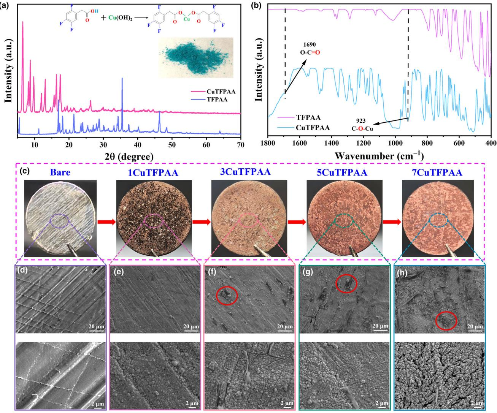
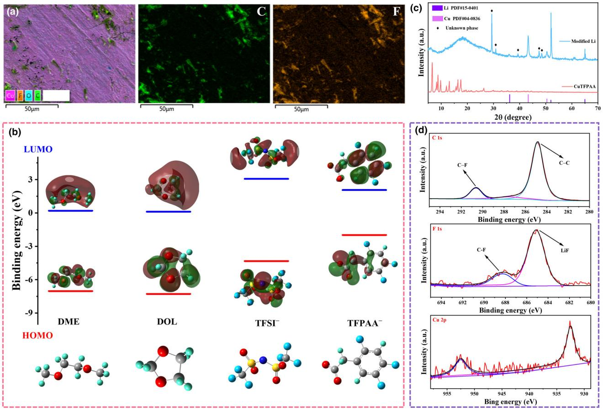
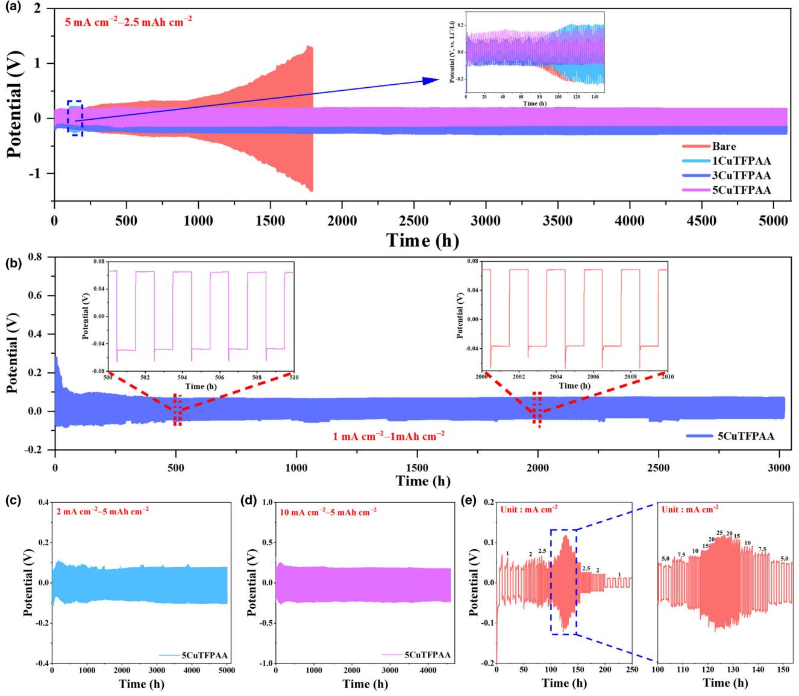
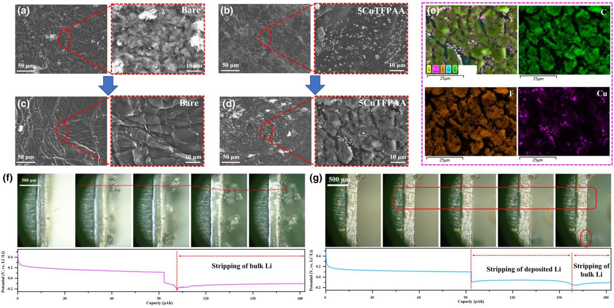
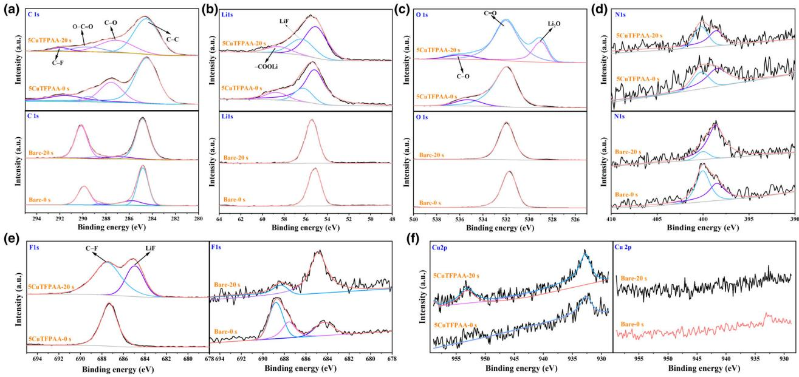
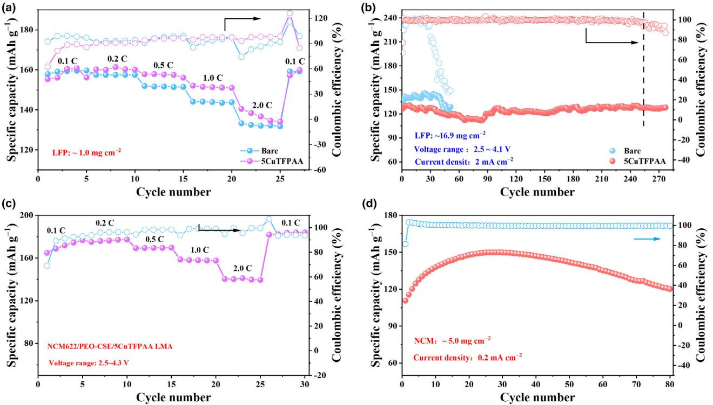

# In-Situ Constructing a Mixed-Conductive Interfacial Protective Layer for Ultra-Stable Lithium Metal Anodes

Liansheng Li , Yijie Zhang, Zuxin Long, Pengyu Meng, and Qinghua Liang\*

Lithium metal batteries are the most promising next-generation energy storage technologies due to their high energy density. However, their practical application is impeded by serious interfacial side reactions and uncontrolled dendrite growth of lithium metal anode. Herein, copper 2,4,5 trifluorophenylacetate is designed and explored to stabilize lithium metal anode by in-situ constructing a dense and mixed-conductive interfacial protective layer. The formed passivated layer not only significantly inhibits interfacial side reactions by avoiding direct contact between lithium metal anode and electrolyte but also effectively suppresses lithium dendrite growth due to the unique inorganic-rich compositions and mixed-conductive properties. As a result, the copper 2,4,5-trifluorophenylacetate-treated lithium metal anodes show greatly improved cycle stability under both high current density and high areal deposition capacity. Notably, the assembled liquid symmetrical cells with copper 2,4,5-trifluorophenylacetate-treated lithium metal anodes can stably work for more than 3000, 5000, and 4800 h at 1.0 mA cm2 –1.0 mAh cm2 , 2.0 mA cm2 –5.0 mAh cm2 , and 10 mA cm2 –5.0 mAh cm2 , respectively. Furthermore, the assembled liquid full cell with a high LiFePO4 loading (16.9 mg cm2 ) shows a significantly enhanced cycle life of 250 cycles with stable Coulombic efficiencies (>99.1%). Moreover, the assembled all-solid-state lithium metal battery with a high LiNi0.6Co0.2Mn0.2O2 loading (5.0 mg cm2 ) also exhibits improved cycle stability. These findings underline that the copper 2,4,5 trifluorophenylacetate-treated lithium metal anodes show great promise for high-performance lithium metal batteries.

#### 1. Introduction

To pursue higher energy density and higher safety of lithium batteries, significant efforts have been devoted by researchers in the past decade in terms of electrodes, electrolytes, and separators.[\[1](#page-8-0)–5] Among these components, the electrode plays a pivotal role in determining the energy density and safety of the battery. Lithium (Li) metal is the most promising anode due to its high theoretical specific capacity

Dr. L. Li, Y. Zhang, Z. Long, Dr. P. Meng, Prof. Q. Liang

Key Laboratory of Rare Earths, Ganjiang Innovation Academy, Chinese Academy of Sciences, Ganzhou 341000, China

The ORCID identification number(s) for the author(s) of this article can be found under<https://doi.org/10.1002/eem2.12836>.

#### DOI: 10.1002/eem2.12836

(3860 mAh g1 ), the lowest reduction potential (3.04 V vs standard hydrogen electrode), and low mass density (0.59 g cm3 ).[\[6,7\]](#page-8-0) However, the practical application of lithium metal anodes (LMAs) is seriously impeded by their poor cycling performance and potential safety hazards.[[8,9\]](#page-8-0) On one hand, LMA is highly reactive and can react spontaneously when in contact with most electrolytes.[[10](#page-8-0)] Such interfacial side reactions will consume electrolytes, leading to the formation of an intermediate layer known as solid electrolyte interphase (SEI).[\[11\]](#page-8-0) Normally, the SEI film derived from interfacial side reactions is non-dense and thus difficult to effectively separate LMA and electrolyte. Therefore, interfacial side reactions will continue to occur, resulting in continuous consumption of electrolytes and a rapid increase in interfacial impedance. This will ultimately cause a complete failure of the battery.[\[12\]](#page-8-0) On the other hand, the deposition process of Li is complex and difficult to control because this process is susceptible to various influencing factors.[\[13\]](#page-8-0) Generally, Li tends to be deposited at active sites and tips of LMA, easily leading to lithium dendrite formation and growth.[[14](#page-8-0)] The growth of lithium dendrites can penetrate the separator, causing internal short circuits or even fire/explosion in severe cases. Although solid electrolytes with high mechanical strength are believed to be effective in suppressing lithium

dendrite growth,[\[15,16](#page-8-0)] the dendrite issue remains a tremendous concern for all-solid-state lithium batteries (ASSLBs).[[17](#page-8-0)–22]

Various strategies, including electrolyte engineering (solvents,[\[23](#page-8-0)–26] additives,[[27](#page-8-0)–31] (localized) high-concentration electrolyte[[32](#page-8-0)–35] ), interfacial modification,[\[36](#page-8-0)–38] and anode structural design[\[39](#page-8-0)–41] have been proposed to address the severe interfacial side reactions as well as dendrite issues of LMAs. Among them, introducing a functional additive to regulate the composition and structure of SEI film is the lowest cost and most efficient strategy to stabilize LMAs.[[42](#page-8-0)–45] However, the use of additives will generally decrease the initial Coulombic efficiency of the battery and inevitably cause gas production. Moreover, this method is not suitable for ASSLBs, especially inorganic solid electrolyte-based ASSLBs.[\[46](#page-9-0)] In contrast, pre-constructing a protective layer at the anode interface is a promising method and can be applied to both liquid and solid-state lithium metal batteries.[\[37,47](#page-8-0)–50] For example, a thin LiAlO2 layer pre-deposited on the surface of LMA through a radio-frequency magnetron sputtering method contributes to the formation of a stable SEI film and can also promote the uniform Li deposition, thus

E-mail: [qhliang@gia.cas.cn](mailto:qhliang@gia.cas.cn)

Y. Zhang, Prof. Q. Liang

School of Rare Earths, University of Science and Technology of China, Hefei 230026, China

effectively stabilizing LMA in liquid ether electrolyte.[[37](#page-8-0)] A thin solid polymer electrolyte interlayer was employed to avoid the direct contact between Li3InCl6 solid electrolyte and lithium metal, which effectively suppresses interfacial side reactions and thereby significantly improves interfacial compatibility.[\[47\]](#page-9-0) Therefore, developing a simple and efficient surface treatment method to construct a protective interfacial layer is beneficial for promoting the practical application of LMAs and advancing ASSLBs with high energy density and high safety.

The commercially available lithium metal surface generally contains numerous active sites, which are the hotspots for preferential Li deposition, potentially leading to lithium dendrite growth and interfacial side reactions. Thus, the surface state of lithium metal plays a crucial role in suppressing interfacial side reactions and lithium dendrite growth. Passivating the surface active sites while in-situ generating a protective interfacial layer may effectively improve the cyclic reversibility of LMAs. In this study, copper 2,4,5-trifluorophenylacetate (CuTFPAA) was successfully synthesized and utilized to modify LMAs through a simple solution-soaking method. The experimental results indicate that modifying LMAs with an appropriate amount of CuTFPAA not only passivates active sites but also in-situ forms a dense, mixed-conductive, and inorganic-rich (Cu, LiF, Li2O, etc.) interfacial layer on the surface. The passivation of surface active sites is conducive to the inhibition of interfacial side reactions and uniform Li deposition. Additionally, the formed passivation film prevents direct contact between the LMA and electrolyte, thus further avoiding interfacial side reactions. Moreover, the inorganic-rich interfacial layer can effectively suppress lithium dendrite growth due to its high mechanical strength. As a result, the CuTFPAA-treated LMAs show significantly improved cyclic reversibility and high current density tolerance. The assembled liquid symmetrical cells show excellent cycle life of 3000, 5000, and 4800 h at 1.0 mA cm2 –1.0 mAh cm2 , 2.0 mA cm2 –5.0 mAh cm2 , and 10 mA cm2 –5.0 mAh cm2 , respectively. Furthermore, liquid full cell with a high LiFePO4 loading (16.9 mg cm2 ) exhibits significantly enhanced cycle life over 250 cycles. More attractively, the assembled ASSLB with a high LiNi0.6Co0.2Mn0.2O2 loading (5.0 mg cm2 ) also demonstrates improved cycle stability.

### 2. Results and Discussion

Pre-constructing a passivation film on the LMA surface can effectively mitigate interfacial side reactions and the growth of lithium dendrites.[\[49\]](#page-9-0) Inorganic electronic-insulation layers (such as Al2O3 [\[36\]](#page-8-0) and LiF[\[51\]](#page-9-0) ) or electronic-conductive layers (such as carbon nanomaterials[[52](#page-9-0)] ) are generally not conducive to the transportation of Li+ . Furthermore, inorganic interfacial layers are brittle and thus cannot accommodate the volume changes of LMAs. In contrast, organic interfacial layers are typically mechanically soft, but their lower mechanical strength cannot effectively inhibit lithium dendrite growth. Moreover, thick organic layers often exhibit high internal resistance, which is not conducive to the uniform deposition of Li in the initial stage. Therefore, a mixed-conductive composite passivation film rich in inorganic components is assumed to be a favorable interfacial passivation layer, which can help balance the ion and electron transport at the electrode/electrolyte interface. The homogeneous charge distribution and fast Li+ transportation at the interface contribute to the uniform deposition of Li, thereby preventing the formation of dendrites. When Cu2+ encounters active metals, they can quickly and spontaneously undergo displacement reactions to generate uniform coverage of Cu on the metal surface. Additionally, fluorinated organic anionic groups can react with lithium metal to form LiF and Li-containing organic components.[[53](#page-9-0)] Inspired by these findings, CuTFPAA was designed and employed to modify LMAs to construct a mixed-conductive interfacial protective layer.

The CuTFPAA was synthesized using the low-cost Cu(OH)2 and 2,4,5-trifluorophenylacetic acid (TFPAA) as the reactants through a simple liquid-phase preparation method at 80 °C (see Appendix [S1:](#page-8-0) Experimental Section, Supporting Information). Concretely, TFPAA and Cu(OH)2 react in a mixed solvent (Vethanol:Vwater = 4:1) for 6 h at 80 °C, followed by another 6 h at room temperature. Subsequently, the mixture was centrifuged to obtain the liquid. Finally, the obtained centrifugal liquid was dried to yield the blue crystalloids. X-ray diffraction (XRD) analysis reveals that the resultant blue crystalloid exhibits completely different diffraction peaks from raw materials (Figure 1[a\)](#page-2-0). The Fourier transform infrared spectroscopy (FTIR) spectrum of the resultant blue crystalloid shows similar stretching vibration peaks as those of TFPAA (Figure [1b\)](#page-2-0), except for two additional stretching vibration peaks at 923 and 1690 cm1 . The former is associated with the stretching vibration of C–O–Cu, while the latter can be ascribed to the stretching vibration of O–C=O. Elemental analysis shows that the atomic ratio of Cu:F in the obtained blue powder is 1:5.2 (Figure [S1,](#page-8-0) Supporting Information), close to the theoretical ratio of 1:6. Based on these results, it can be inferred that CuTFPAA with pure phase was successfully synthesized.

For the modification, lithium foils were directly immersed in a mixed solution of dimethoxyethane (DME) and 1,3-dioxolane (DOL) (1:1 by volume) containing varying concentrations of CuTFPAA for 10 min (see Appendix [S1:](#page-8-0) Experimental Section, Supporting Information). For simplicity, lithium foils treated with different concentrations of CuTFPAA (0.0, 1.2, 3.6, 6.0, and 8.4 g L1 ) were labeled as bare, 1CuTFPAA, 3CuTFPAA, 5CuTFPAA, and 7CuTFPAA LMAs, respectively. It was observed that the color of the treated lithium foils darkened and approached the intrinsic color of the copper metal as the concentration of CuTFPAA increased (Figure [1c](#page-2-0)). Notably, there are many unreacted areas on the 1CuTFPAA LMA surface. Although the passivation area of 1CuTFPAA LMA exhibits a changed surface morphology, the observed microscopic stripes similar to those of the bare LMA from the SEM images (Figure [1e\)](#page-2-0) indicate that the formed passivated film is relatively thin. At a low concentration of CuTFPAA, the LMA surface is difficult to completely passivate even if all CuTFPAA (Cu2+ , more precisely) is consumed (Figure [S2](#page-8-0), Supporting Information). Figure [S3](#page-8-0), Supporting Information illustrates the elemental distribution along the cross-section of the 5CuTFPAA LMA. A distinct layer of Cu signal was detected at the interface close to the bulk Li, indicating that displacement reaction takes priority over other spontaneous reactions. The in-situ constructed passivation film is an organic–inorganic composite layer. The Cu particles are embedded in the organic matrix with F-containing materials uniformly distributed. The 7CuTFPAA LMA shows a rougher surface with numerous obvious cracks/pores as compared to the 3CuTFPAA and 5CuTFPAA LMAs (Figure [1f](#page-2-0)–h). This may be attributed to the rapid displacement reactions between Li metal and Cu2+ . At high concentrations of Cu2+ , the rapid displacement reaction leads to the formation of large Cu particles with limited mechanical flexibility, resulting in a rougher surface with numerous visible cracks/pores. Conversely, at low concentrations of Cu2+ , smaller Cu particles are generated alongside the formation of organolithium compounds. These small Cu particles are encapsulated by mechanically soft organolithium compounds (Figure [S3](#page-8-0), Supporting Information), thereby avoiding the formation

Figure 1. Characterization of the as-prepared CuTFPAA and the CuTFPAA-treated LMAs: a) XRD results (insert: photograph of the obtained powders after reaction) and b) FTIR spectra; c) Photograph of the LMAs after treatment with different concentrations of CuTFPAA solution; SEM images of LMAs after treatment with different concentrations of CuTFPAA solution: d) bare, e) 1CuTFPAA, f) 3CuTFPAA, g) 5CuTFPAA, and h) 7CuTFPAA (marked area: residual TFPAA-based materials).

of cracks/pores. The priority and more generation of Cu particles at a high concentration of CuTFPAA will lead to the formation of a more electronically conductive interfacial layer on the surface of Li foil. In general, a non-dense and electronically conductive interfacial layer is not conducive to suppressing interfacial side reactions of LMAs, as it cannot effectively block the transport of electrons from the electrode to the electrolyte.[\[30](#page-8-0)] The easy acquisition of electrons from the LMA may give rise to the easy electrochemical decomposition of the electrolytes, especially for those with poor electrochemical stability. This causes serious electrolyte consumption and an increase in interface impedance.

Meanwhile, some incompletely reacted TFPAA-containing species remained on the surface of 3CuTFPAA, 5CuTFPAA, and 7CuTFPAA LMAs, as confirmed by the EDS results shown in Figure 2[a](#page-3-0) and Figure [S4,](#page-8-0) Supporting Information. Moreover, as the concentration of CuTFPAA increases, the amount of residual TFPAA-containing species significantly increases. Density functional theory (DFT) calculation results indicate that TFPAA possesses a lower HOMO energy level and higher LUMO energy level than TFSI (Figure [2b](#page-3-0)). Generally, the LUMO energy level is related to the reduction stability. The higher the energy level, the poorer the reduction stability. This means that TFPAA has poorer reduction stability and can preferentially undergo reductive decomposition reactions compared to TFSI. Therefore, the residue of TFPAA-based species would contribute to the SEI film formation, since they will further decompose in the subsequent electrochemical cycling processes.

XRD analysis reveals the presence of copper and some unknown phases that are different from CuTFPAA on the surface of CuTFPAA-treated LMA (Figure [2c](#page-3-0)), suggesting the occurrence of spontaneous reactions between Li and CuTFPAA. Although LiF is not detected by XRD, the F1s XPS spectra of the treated LMA revealed a strong peak at 648.8 eV assigned to LiF (Figure [2d](#page-3-0)).[\[54\]](#page-9-0) This demonstrates the formation of LiF but with relatively low content. These

Figure 2. The characterization of the CuTFPAA-treated LMA. a) EDS results of the 5CuTFPAA-treated LMA; b) The calculated HOMO and LUMO energy levels of DME, DOL, TFSI, and TFPAA; c) XRD test result of the CuTFPAA-treated LMA; and d) XPS spectrum of the CuTFPAA-treated LMA.

characterization results indicate that the spontaneous reaction between CuTFPAA and Li will lead to the formation of a passivation layer containing Cu, LiF, and organolithium compounds. Moreover, the displacement reaction of Cu2+ takes precedence over the generation reaction of LiF, especially at high concentrations of CuTFPAA. The possible spontaneous reaction processes are proposed as follows:

Li þ CuTFPAA ! Cu þ LiTFPAA (1)

$$
\text{Li} + C_6 \text{H}_2 \text{F}_3 \text{CH}_2 \text{COOLi} \rightarrow \text{LiF} + C_6 \text{H}_2 \text{F}_{3-x} \text{Li}_x \text{CH}_2 \text{COOLi} \tag{2}
$$

Initially, a rapid displacement reaction occurs to form elemental Cu when the highly active Li metal comes into contact with Cu2+ . Subsequently, the anionic group reacts with the remaining Li on the surface to generate LiF and organolithium compounds, thoroughly passivating the surface of Li foil. An increase in the proportion of Cu in the passivation layer is beneficial for reducing interfacial impedance (Figure [S5,](#page-8-0) Supporting Information). However, the increased electronic conductivity of the interfacial layer is not conducive to suppressing interfacial side reactions. Therefore, an appropriate concentration of CuTFPAA is necessary to construct a dense mixed-conductive interfacial layer on the LMA surface. The formed mixed-conductive interfacial layer can not only physically block the direct contact between electrolyte and Li, thereby inhibiting electrolyte decomposition, but can also effectively suppress lithium dendrite growth due to the high mechanical strength resulting from its rich inorganic components.

To evaluate the effect of CuTFPAA modification on the cycle reversibility of LMAs, liquid Li/Li symmetric cells were assembled for testing. Figure 3[a](#page-4-0) shows the cycle performance of liquid symmetric cells with bare and different CuTFPAA-treated LMAs at 5 mA cm2 –2.5 mAh cm2 . The cell with bare LMA shows a poor cycle life of only 70 h, with polarization voltage rapidly increasing to 2.5 V in the subsequent cycles. This can be attributed to the severe interfacial side reactions and the accumulation of dead Li on the bare LMA surface caused by uneven Li deposition/stripping. The cell with 1CuTFPAA LMA delivers a slightly increased cycle life of 90 h but experiences a similar increase of internal polarization as the cell assembled with bare LMA during long-term cycling. In contrast, the symmetric cells with 3CuTFPAA and 5CuTFPAA LMAs can both stably cycle for up to 5000 h, indicating a dense passivation interfacial layer is crucial to the stable cycle of LMA. In the case of 1CuTFPAA LMA, incomplete surface passivation (as supported by Figure [1c\)](#page-2-0) results in ineffective suppression of interfacial side reactions and non-uniform lithium deposition, thereby leading to poor cycle performance. Additionally, the symmetric cell with 5CuTFPAA LMA shows a lower polarization voltage than the symmetric cell with 3CuTFPAA LMA, demonstrating a more electronic-conductive interfacial layer is conducive to reducing internal polarization. In the case of 7CuTFPAA LMA, the assembled cell delivers

Figure 3. The electrochemical performance of the liquid Li/Li cells assembled by the CuTFPAA-treated LMAs at a) 5.0 mA cm2 –2.5 mAh cm2 , b) 1.0 mA cm2 –1.0 mAh cm2 , c) 2.0 mA cm2 –5.0 mAh cm2 , d) 10 mA cm2 –5.0 mAh cm2 , and e) rate capability.

a moderate cycle life of 700 h (Figure [S6](#page-8-0), Supporting Information). The decreased cycle stability can be attributable to the existence of cracks/pores in the formed passivation film of 7CuTFPAA LMA. Therefore, 5CuTFPAA LMA is considered the optimal LMA due to the better cycling performance and lower internal impedance.

As anticipated, the symmetric cell with 5CuTFPAA LMA demonstrates stable cycling for over 3000 h with a low polarization voltage at 1.0 mA cm2 –1.0 mAh cm2 (Figure 3b). The initial fluctuation in the polarization voltage curve can be attributed to interfacial adjustment.[[55](#page-9-0)] At a higher deposition areal capacity of 5.0 mAh cm2 , the symmetric cell shows an impressive cycle life of 5000 h at a current density of 2.0 mA cm2 (Figure 3c). Even at 10 mA cm2 –5.0 mAh cm2 , the symmetric cell with 5CuTFPAA LMA still delivers outstanding cycling performance, with a cycle life of 4800 h (Figure 3d). Furthermore, the assembled cell can stably cycle at the current density of

25 mA cm2 , indicating a significantly improved high current tolerance of 5CuTFPAA LMA (Figure 3e). Overall, the Li plating/stripping performance of 5CuTFPAA LMA is superior to that of recently reported LMAs (Table [S1,](#page-8-0) Supporting Information).[[30,37,42,56](#page-8-0)–62] The reasons for the significantly improved cyclic performance of 5CuTFPAA LMA can be as follows: 1) the dense mixed-conductive interfacial layer prevents direct contact between electrolyte and LMA, thereby effectively suppressing interfacial side reactions; 2) the passivation of active sites on LMA surfaces is beneficial for the uniform deposition of Li, effectively avoiding lithium dendrite formation and growth; and 3) the formed passivation film rich in inorganic components possesses high mechanical strength, and therefore can also effectively suppress lithium dendrite growth.

To reveal the deposition behavior of Li on bare and 5CuTFPAA LMAs, SEM characterization was carried out after different cycles at 5.0 mA cm2 –2.5 mAh cm2 . As compared in Figure 4[a,b,](#page-5-0) the cycled

Figure 4. SEM images of the cycled bare and 5CuTFPAA LMAs after different cycles: a) bare LMA at 500 cycles, b) 5CuTFPAA LMA at 500 cycles, c) bare LMA at 1790 cycles, and d) 5CuTFPAA LMA at 5090 cycles. e) The corresponding EDS mapping results of 5CuTFPAA LMA at 5090 cycles. In-situ optical observations of Li deposition and stripping on f) bare and g) 5CuTFPAA LMAs and their corresponding charge–discharge curves.

bare LMA exhibits a rough surface morphology, suggesting uneven deposition of Li (Figure 4a). In contrast, the cycled 5CuTFPAA LMA shows a relatively flat surface morphology (Figure 4b). Generally, the surface state of the untreated LMA is complex, with numerous active sites. During the electrochemical cycling process, Li will preferentially deposit on these active sites, resulting in a rough surface morphology. After modification with CuTFPAA, the active sites on the 5CuTFPA LMA surface are passivated along with the formation of a dense interfacial layer, which is conducive to uniform Li deposition. Meanwhile, significant aggregation of Cu was observed on the 5CuTFPAA LMA surface, as confirmed by the EDS results (Figure [S7](#page-8-0), Supporting Information). This can be attributed to phase separation owing to the difficulties in forming Li-Cu alloys and the poor lithiophilicity of Cu.

The surface of bare LMA evolved into a fish scale-like morphology after 1790 cycles (Figure 4c). Moreover, these fish scale-like Li are easily detached from bulk Li during the battery disassembly process, indicating loss of their electrochemical activity and becoming dead Li. The accumulation of large amounts of dead Li on the surface leads to a significantly increased interfacial impedance (Figure [S8,](#page-8-0) Supporting Information) and a rapid increase in the polarization voltage (Figure [3a\)](#page-4-0). Moreover, serious interfacial side reactions occurred on the surface, as the EDS results showed the presence of significant N, S, and F signals resulting from the decomposition of LiTFSI (Figure [S9](#page-8-0), Supporting Information). In the case of 5CuTFPAA LMA, the formed passivation interfacial layer shows obvious cracks after 5090 cycles (Figure 4d), which may result from the significant electrode volume effect caused by repeated Li stripping and deposition at a high areal deposition capacity of Li. Nonetheless, lithium dendrite formation was still not observed on the cycled 5CuTFPAA LMA surface. Additionally, it is noted that Cu particles mainly aggregate at the cracks of the passivation layer (Figure 4e). Generally, Cu particles exhibit lower mechanical flexibility, which may be the main cause of the passivation layer cracking.

To further demonstrate the beneficial impact of CuTFPAA treatment of LMA on the uniform deposition of Li, in-situ optical observation experiments were performed. Figure 4f illustrates the morphological changes and corresponding capacity-potential curves of bare LMA during the initial cycle. Lithium is preferentially deposited on active sites on the bare LMA surface, leading to rapid dendrite formation. What's worse, most of these dendrites lose their electrochemical activity, making them unable to be stripped off. The subsequent oxidation process results in bulk Li consumption. Additionally, uneven stripping of bulk Li leads to numerous pores forming on the electrode surface. This causes the exposure of more reactive Li to electrolyte, thereby accelerating electrolyte consumption as well as uneven Li deposition. According to the corresponding discharge curve, approximately 92% of the deposited Li loses its electrochemical activity. In contrast, relatively uniform deposition and stripping are achieved in 5CuTFPAA LMA (Figure 4g). During the deposition process, no significant formation of Li dendrites was observed on the 5CuTFPAA LMA surface. However, 5CuTFPAA LMA also experienced the stripping of bulk Li (29%), resulting in a small number of pores forming on the electrode surface. This can be attributed to the destruction of the formed passivation layer during the in-situ battery assembly. This result indicates that a dense surface passivation layer is crucial for achieving uniform deposition and stripping of Li.

The surface compositions of bare and 5CuTFPAA LMAs after cycling were characterized by XPS spectra (Figure [5](#page-6-0)). The C1s spectrum of the cycled 5CuTFPAA LMA shows four deconvoluted peaks at 284.8, 286.8, 288.5, and 290.3 eV (Figure [5a\)](#page-6-0), which can be attributed to the peaks of C–C, C–O, O–C=O, and C–F,[[63,64](#page-9-0)] respectively. Even after 20 s of etching, these four peaks still exist, but their relative content has changed. However, for the cycled bare LMA, only two distinct peaks corresponding to C–C and C–F are detected both before and after etching. The Li1s spectrum of the cycled 5CuTFPAA LMA shows two

Figure 5. XPS results of bare and CuTFPAA-treated LMAs after long-term cycling: a) C1s, b) Li1s, c) O1s, d) N1s, e) F1s, and f) Cu2p spectra.

additional peaks at 56.5 and 58.5 eV both before and after etching (Figure 5b), corresponding to the LiF and –COOLi species,[\[65\]](#page-9-0) respectively. Additionally, an extra peak at 535.5 eV associated with C–O is observed in the O1s spectra for the cycled 5CuTFPAA LMA before etching (Figure 5c).[\[66\]](#page-9-0) After 20 s of etching, a strong peak of Li2O in the O1s appeared. Previous research indicates that Li2O in SEI film is beneficial for the diffusion of Li+ . [[67](#page-9-0)] Based on the analysis of C1s, Li1s, and O1s spectra, it can be concluded that the SEI film formed on the surface of the cycled 5CuTFPAA LMA possesses more kinds of organic lithium components than that of the cycled bare LMA. Moreover, the cycled 5CuTFPAA LMA exhibits a weaker N1s signal than the cycled bare LMA (Figure 5d), suggesting that less TFSI was electrochemically reduced on the surface of 5CuTFPAA LMA. Therefore, these organic lithium components on the cycled 5CuTFPAA LMA surface are primarily associated with the electrochemical decomposition of the residual TFPAA-based materials.

According to the F1s spectra (Figure 5e), two peaks associated with LiF and C–F species[[68](#page-9-0)] are detected for the cycled bare LMA both before and after etching, demonstrating electrolyte decomposition on the surface. However, only one peak corresponding to C–F species was observed on the surface of the cycled 5CuTFPAA LMA before etching. This indicates that a relatively thick organic layer formed on the cycled 5CuTFPAA LMA surface, which is further supported by the results of Cu2p spectra. As shown in Figure 5f, the signal of Cu2p was nearly undetectable on the cycled 5CuTFPAA LMA surface before etching. However, an obvious Cu2p signal was observed after etching, demonstrating that the formed Cu is covered by an organic layer. After 20 s of etching, a strong peak of LiF is detected on the cycled 5CuTFPAA LMA surface, indicating the formation of a LiF-rich SEI film. Overall, severe interfacial side reactions occurred on the bare LMA surface due to the lack of a protective interfacial layer and the high reactivity of Li. In contrast, CuTFPAA treatment can passivate LMA and form a dense protective layer in-situ to physically block direct contact between electrolyte and LMA, thereby effectively inhibiting interfacial side reactions. Furthermore, a SEI film with an organic-rich outer layer and an inorganicrich inner layer can be formed on the CuTFPAA-treated LMA surface after cycling. The organic-rich outer layer, possessing high electronic insulation as well as excellent mechanical flexibility, can further prevent interfacial side reactions and buffer against the volume effects caused by Li deposition and stripping. The inorganic-rich inner layer (containing Li2O, LiF, Cu, etc.) delivering high mechanical strength can effectively suppress lithium dendrite formation. Therefore, the CuTFPAA-treated LMAs show remarkable cycle reversibility even at high current densities and high areal deposition capacities of Li.

To evaluate the practicability of 5CuTFPAA LMA, liquid full cells with LiFePO4 (LFP) cathodes were assembled and tested. As shown in Figure 6[a](#page-7-0), the LFP-based full cell with bare LMA exhibits dischargespecific capacities of 159.6, 157.5, 151.9, 144.1, and 132.5 mAh g1 at 0.1, 0.2, 0.5, 1.0, and 2.0 C, respectively, while those of the LFPbased cell with 5CuTFPAA LMA at the same rates are 160.8, 160.0, 157.7, 151.4, and 134.6 mAh g1 . It is noted that the capacity of the LFP-baed cell with 5CuTFPAA LMA continued to decrease during cycling at 2.0 C. However, it can maintain a high specific capacity of 159.9 mAh g1 when the current density returns to 0.1 C. This result suggests that surface modification by CuTFPAA on LMAs may decrease the cell capacity under high current densities to some extent. Therefore, the thickness of the formed passivation layer needs to be optimized within an appropriate range. Meanwhile, the LFP-based cell with 5CuTFPAA LMA shows a lower initial Coulombic efficiency (62.6%) than the LFP-based cell with bare LMA (92.5%), which may arise from the electrochemical decomposition of the residual TFPAAbased materials. This process contributes to the formation of a LiF-rich SEI film, thereby effectively stabilizing the LMA interface. Furthermore, liquid full cells with a high LFP loading of 16.9 mg cm2 were assembled for long-term cycling. As shown in Figure [6b](#page-7-0), the specific discharge capacity of the cell with bare LMA is 140 mAh g1 at a current density of 2.0 mA cm2 (0.8 C), which is slightly higher than that (130 mAh g1 ) of the cell assembled by 5CuTFPAA LMA. However, the cell with bare LMA can only stably cycle for 35 cycles. Subsequently, its capacity and Coulombic efficiency (CE) rapidly

Figure 6. The electrochemical performance of the CuTFPAA-treated LMAs used for both liquid and all-solid-state lithium metal batteries. a) Rate performance comparison of the liquid LFP-based cell assembled with bare and CuTFPAA-treated LMA; b) The cycle performance of the liquid LFP-based cell assembled with bare and CuTFPAA-treated LMAs at a high LFP loading of 16.9 mg cm2 ; c) Rate performance of the assembled NCM622-based ASSLB with 5CuTFPAA LMA; d) The cycle performance of the assembled ASSLB at a high NCM622 loading of 5.0 mg cm2 .

decreased, suggesting an unstable anode interface when using bare LMA. In contrast, the cell with 5CuTFPAA LMA can stably work for 250 cycles. The significantly improved cycle stability can be attributed to the mixed-conductive passivation layer formed on the CuTFPAAtreated LMA, which can effectively inhibit electrolyte decomposition and lithium dendrite formation.

All-solid-state LiNi0.6Co0.2Mn0.2O2 (NCM622)-based full cells were also assembled to evaluate the performance of 5CuTFPAA LMA in ASSLBs. To assemble the battery, PEO-based composite solid electrolytes with a thickness of 65 μm and an ionic conductivity of 1.45 × 104 S cm1 (at 60 °C) were employed (Figure [S10,](#page-8-0) Supporting Information).[\[55](#page-9-0)] The assembled NCM622-based ASSLB shows impressive rate performance (Figure 6c), delivering high discharge capacities of 176.7, 175.9, 169.5, 157.9, and 140.2 mAh g1 at 0.1, 0.2, 0.5, 1.0, and 2.0 C, respectively. Furthermore, the assembled ASSLB can stably work for more than 80 cycles with stable CEs at a high NCM622 loading of 5.0 mg cm2 at 0.2 mA cm2 (Figure 6d). In contrast, the NCM622-based ASSLB with bare LMA shows a poor cycle life of only 13 cycles, and then its capacity and CE value fluctuate significantly (Figure [S11](#page-8-0), Supporting Information). The slowly increased specific discharge capacity in Figure 6d could be ascribed to the gradual activation of NCM811 active materials due to the limited Li+ transportation in the thick electrode. The corresponding charge–discharge curves indicate that the fluctuation of capacity and CE value can be caused by a battery soft short-circuit induced by lithium dendrite growth (Figure [S12,](#page-8-0) Supporting Information). These results demonstrate that CuTFPAA-treated LMAs can maintain interfacial stability under a high areal deposition capacity of Li in ASSLBs.

#### 3. Conclusion

In summary, CuTFPAA functional material was successfully synthesized and utilized to modify LMAs for lithium metal batteries. The experimental results indicate that CuTFPAA and Li could react spontaneously, thereby passivating the active sites on the LMA surface and in-situ constructing a mixed-conductive interfacial layer rich in inorganic components. The dense passivation film formed can physically block direct contact between the electrolyte and Li, thereby effectively avoiding interfacial side reactions. Meanwhile, the passivation of active sites on the LMA surface can promote uniform Li deposition, thus inhibiting lithium dendrite formation. Furthermore, the inorganic-rich passivation layer formed, exhibit high mechanical strength and can also suppress lithium dendrite growth. Thanks to these benefits, the CuTFPAAtreated LMAs exhibit significantly improved cyclic reversibility and high current tolerance. The assembled liquid symmetrical cells with 5CuTFPAA LMAs show excellent cycle stability, with lifespans exceeding 3000, 5000, and 4800 h at 1.0 mA cm2 –1.0 mAh cm2 , 2.0 mA cm2 –5.0 mAh cm2 , and 10 mA cm2 –5.0 mAh cm2 , respectively. The assembled liquid full cell with a high LFP loading (16.9 mg cm2 ) also delivers enhanced cycle performance of 250 cycles. Moreover, the NCM622-based ASSLB with 5CuTFPAA LMA can work stably for more than 80 cycles without short-circuit at a high NCM622 loading of 5.0 mg cm2 . This work provides a new strategy for the in-situ construction of a dense mixed-conductive protective layer on the LMA surface to significantly improve the stability of LMAs for high-performance liquid and all-solid-state lithium metal batteries.

### 4. Experimental Section

Detailed information related to the synthesis of active electrodes, physicochemical characterization, and electrochemical evaluation of bifunctional electrodes towards UOR and supercapacitor application is provided in Supporting information.

#### Acknowledgements

This work was financially supported by the Natural Science Foundation of Jiangxi Province (No. 20232ACB214001), Research Projects of Ganjiang Innovation Academy (No. E355F003) of the Chinese Academy of Sciences, the Research fund from Jingxi Province Human Resources and Social Security Department and the Chinese Academy of Sciences, and the research fund of Key Laboratory of Rare Earths, Chinese Academy of Sciences.

#### Author Contributions

L. Li carried out experiments and data interpretation, and organized and wrote the manuscript. Y. Zhang, Z. Long, and P. Meng discussed and revised the manuscript. Q. Liang supervised the project and revised the manuscript.

## Conflict of Interest

The authors declare no conflict of interest.

#### Supporting Information

Supporting Information is available from the Wiley Online Library or from the author.

#### Keywords

copper 2,4,5-trifluorophenylacetate, dendrite suppression, interfacial regulation, lithium metal anode, lithium metal battery

Received: July 30, 2024

Revised: August 28, 2024

Published online: September 2, 2024

- [1] S. Zhang, R. Li, N. Hu, T. Deng, S. Weng, Z. Wu, D. Lu, H. Zhang, J. Zhang, X. Wang, L. Chen, L. Fan, X. Fan, Nat. Commun. 2022, 13, 5431.
- [2] X. Shen, Y. Li, T. Qian, J. Liu, J. Zhou, C. Yan, J. B. Goodenough, Nat. Commun. 2019, 10, 900.
- [3] K. Baek, W. G. Lee, E. Im, J. H. Ha, S. Ahn, Y. Kim, Y. Choi, S. J. Kang, Nano Lett. 2023, 23, 8515.
- [4] T. Ding, D. Zheng, H. Qu, W. Ji, X. Zhang, D. Lu, G. Wang, D. Qu, J. Power Sources 2024, 589, 233746.
- [5] Z. Wang, Z. Du, Y. Liu, C. E. Knapp, Y. Dai, J. Li, W. Zhang, R. Chen, F. Guo, W. Zong, X. Gao, J. Zhu, C. Wei, G. He, eScience 2024, 4, 100189.
- [6] W. Xu, J. Wang, F. Ding, X. Chen, E. Nasybulin, Y. Zhang, J.-G. Zhang, Energ. Environ. Sci. 2014, 7, 513.
- [7] D. Lin, Y. Liu, Y. Cui, Nat. Nanotechnol. 2017, 12, 194.
- [8] H. L. Xie, J. Y. Feng, H. L. Zhao, Energy Storage Mater. 2023, 61, 102918.
- [9] Q. Chang, Y. X. Angel Ng, D. Yang, J. Chen, T. Liang, S. Chen, X. Zhang, Z. Ou, J. Kim, E. H. Ang, H. Xiang, X. Song, ACS Mater. Lett. 2023, 5, 1506.
- [10] F. Shi, A. Pei, D. T. Boyle, J. Xie, X. Yu, X. Zhang, Y. Cui, Proc. Natl. Acad. Sci. USA 2018, 115, 8529.
- [11] J. G. Zhang, W. Xu, J. Xiao, X. Cao, J. Liu, Chem. Rev. 2020, 120, 13312.
- [12] O. B. Chae, B. L. Lucht, Adv. Energy Mater. 2023, 13, 2203791.
- [13] X. Yuan, B. Liu, M. Mecklenburg, Y. Li, Nature 2023, 620, 86.
- [14] X. Yao, X. Song, F. Zhang, J. Ma, H. Jiang, L. Wang, Y. Liu, E. Huixiang Ang, H. Xiang, ChemElectroChem 2022, 9, e202200390.
- [15] L. Li, Y. Deng, G. Chen, J. Energy Chem. 2020, 50, 154.
- [16] Z. Wu, S. He, C. Zheng, J. Gan, L. She, M. Zhang, Y. Gao, Y. Yang, H. Pan, eScience 2024, 4, 100247.
- [17] C. Ouyang, H. Zheng, Q. Chen, H. Liu, H. Duan, ACS Appl. Mater. Interfaces 2023, 15, 51179.
- [18] J. Y. Yoo, T. Y. Kim, D. M. Shin, Y. Kang, M. H. Wu, Y. C. Kang, D. Y. Kim, Adv. Funct. Mater. 2023, 33, 2308103.
- [19] Q. Zheng, Y. Song, W. B. Huang, J. Yang, T. Li, Y. Xu, Energy Storage Mater. 2023, 63, 103038.
- [20] H. Wan, Z. Wang, W. Zhang, X. He, C. Wang, Nature 2023, 623, 739.
- [21] L. S. Li, H. H. Duan, J. Li, L. Zhang, Y. F. Deng, G. H. Chen, Adv. Energy Mater. 2021, 11, 2003154.
- [22] Y. Zhong, X. Zhang, Y. Zhang, P. Jia, Y. Xi, L. Kang, Z. Yu, SusMat 2024, 4, e190.
- [23] Q. Wang, Z. Yao, C. Zhao, T. Verhallen, D. P. Tabor, M. Liu, F. Ooms, F. Kang, A. Aspuru-Guzik, Y. S. Hu, M. Wagemaker, B. Li, Nat. Commun. 2020, 11, 4188.
- [24] Z. Yu, H. Wang, X. Kong, W. Huang, Y. Tsao, D. G. Mackanic, K. Wang, X. Wang, W. Huang, S. Choudhury, Y. Zheng, C. V. Amanchukwu, S. T. Hung, Y. Ma, E. G. Lomeli, J. Qin, Y. Cui, Z. Bao, Nat. Energy 2020, 5, 526.
- [25] W. Xue, M. Huang, Y. Li, Y. G. Zhu, R. Gao, X. Xiao, W. Zhang, S. Li, G. Xu, Y. Yu, P. Li, J. Lopez, D. Yu, Y. Dong, W. Fan, Z. Shi, R. Xiong, C.-J. Sun, I. Hwang, W.-K. Lee, Y. Shao-Horn, J. A. Johnson, J. Li, Nat. Energy 2021, 6, 495.
- [26] Z. Li, L. Yu, C. X. Bi, X. Y. Li, J. Ma, X. Chen, X. Q. Zhang, A. Chen, H. Chen, Z. Zhang, L. Z. Fan, B. Q. Li, C. Tang, Q. Zhang, SusMat 2024, 4, e191.
- [27] R. Xu, X. Shen, X. X. Ma, C. Yan, X. Q. Zhang, X. Chen, J. F. Ding, J. Q. Huang, Angew. Chem. Int. Ed. 2021, 60, 4215.
- [28] J. Zhong, Z. Wang, X. Yi, X. Li, H. Guo, W. Peng, J. Wang, G. Yan, Small 2024, 20, e2308678.
- [29] S. Stuckenberg, M. M. Bela, C. T. Lechtenfeld, M. Mense, V. Kupers, T. T. K. Ingber, M. Winter, M. C. Stan, Small 2024, 20, e2305203.
- [30] H. Chen, Y. X. Xie, S. S. Liu, H. Peng, W. C. Zheng, P. Dai, Y. X. Huang, M. Sun, M. Lin, L. Huang, S. G. Sun, ACS Appl. Mater. Interfaces 2023, 15, 45834.
- [31] T. Hu, Y. X. Guo, Y. X. Meng, Z. Zhang, J. Yu, J. X. Cai, Z. Y. Yang, Chin. Chem. Lett. 2024, 35, 108603.
- [32] S. Chen, J. Zheng, D. Mei, K. S. Han, M. H. Engelhard, W. Zhao, W. Xu, J. Liu, J. G. Zhang, Adv. Mater. 2018, 30, e1706102.
- [33] N. Piao, X. Ji, H. Xu, X. Fan, L. Chen, S. Liu, M. N. Garaga, S. G. Greenbaum, L. Wang, C. Wang, X. He, Adv. Energy Mater. 2020, 10, 1903568.
- [34] C. Zhu, C. Sun, R. Li, S. Weng, L. Fan, X. Wang, L. Chen, M. Noked, X. Fan, ACS Energy Lett. 2022, 7, 1338.
- [35] Y. Liu, Y. Lin, Z. Yang, C. Lin, X. Zhang, S. Chen, G. Hu, B. Sa, Y. Chen, Y. Zhang, ACS Nano 2023, 17, 19625.
- [36] Y. He, Y. Zhang, Z. Wang, X. Li, Z. Lu, X. Huang, Z. Liu, ¨ Adv. Funct. Mater. 2021, 31, 2101737.
- [37] X. Hu, Y. Ma, J. Qian, W. Qu, Y. Li, R. Luo, H. Wang, A. Zhou, Y. Chen, K. Shi, L. Li, F. Wu, R. Chen, Adv. Mater. 2024, 36, e2303710.
- [38] X. J. Zhang, L. Zhou, K. P. Hu, D. D. Gao, S. Tang, L. He, Y. F. Chen, P. Zhang, Z. G. Zhang, Chem. Eng. J. 2023, 476, 146612.
- [39] Y. Y. Liu, S. Y. Wang, M. H. Sun, M. Ling, S. D. Zhou, C. D. Liang, J. Mater. Chem. A 2023, 11, 23961.
- [40] S. Zhang, J. Chen, C. Zhu, Q. Liu, Q. Li, R. Liu, X. Jiang, Y. Yan, S. Sun, L. Yin, R. Wang, ACS Nano 2023, 17, 24290.
- [41] H. Duan, C. H. Wang, R. Z. Yu, W. H. Li, J. M. Fu, X. F. Yang, X. T. Lin, M. T. Zheng, X. A. Li, S. X. Deng, X. G. Hao, R. Y. Li, J. T. Wang, H. Huang, X. L. Sun, Adv. Energy Mater. 2023, 13, 2300815.
- [42] Q. Ren, Q. Wang, L. Su, G. Liu, Y. Song, X. Shangguan, F. Li, J. Mater. Chem. A 2024, 12, 1072.
- [43] Z. Zhang, M. Zhang, J. Wu, X. Hu, B. Fu, X. Zhang, B. Luo, K. Khan, Z. Fang, Z. Xu, M. Wu, Small 2024, 20, e2304234.
- [44] T. Yang, W. Zhang, Y. Liu, J. Zheng, Y. Xia, X. Tao, Y. Wang, X. Xia, H. Huang, Y. Gan, X. He, J. Zhang, Small 2023, 19, e2303210.
- [45] J. Li, Y. Cai, F. Zhang, Y. Cui, W. Fang, H. Da, H. Zhang, S. Zhang, Nano Energy 2023, 118, 108985.
- [46] G. Yoon, S. Kim, J. S. Kim, Adv. Sci. 2023, 10, e2302263.
- [47] J. Luo, Q. Sun, J. W. Liang, K. Adair, F. P. Zhao, S. X. Deng, Y. Zhao, R. Y. Li, H. Huang, R. Yang, S. Q. Zhao, J. T. Wang, X. L. Sun, ACS Energy Lett. 2023, 8, 3676.
- [48] W. H. Kong, Z. Y. Jiang, Y. X. Liu, Q. Y. Han, L. X. Ding, S. Q. Wang, H. H. Wang, Adv. Funct. Mater. 2023, 33, 2306748.
- [49] Q. F. Gao, D. X. Wu, X. Zhu, P. S. Lu, T. H. Ma, M. Yang, L. Q. Chen, H. Li, F. Wu, Nano Energy 2023, 117, 108922.
- [50] C. Huang, S. Huang, A. L. Wang, Z. Y. Liu, D. X. Pei, J. H. Hong, S. Hou, L. Vitos, H. Y. Jin, J. Mater. Chem. A 2022, 10, 25500.
- [51] J. Zhao, L. Liao, F. Shi, T. Lei, G. Chen, A. Pei, J. Sun, K. Yan, G. Zhou, J. Xie, C. Liu, Y. Li, Z. Liang, Z. Bao, Y. Cui, J. Am. Chem. Soc. 2017, 139, 11550.
- [52] N. Li, K. Zhang, K. Xie, W. Wei, Y. Gao, M. Bai, Y. Gao, Q. Hou, C. Shen, Z. Xia, B. Wei, Adv. Mater. 2020, 32, e1907079.
- [53] L. Li, Y. Hu, H. Duan, Y. Deng, G. Chen, Small Methods 2023, 7, e2300314.
- [54] K. Wang, T. Zhao, R. X. Lv, W. M. Tang, T. Y. Yu, G. S. Chen, L. Li, F. Wu, R. J. Chen, Adv. Energy Mater. 2024, 14, 2401281.
- [55] L. Li, Y. Deng, H. Duan, Y. Qian, G. Chen, J. Energy Chem. 2022, 65, 319.
- [56] L. H. Zheng, R. X. Lv, C. Luo, Y. F. Guo, M. F. Yang, K. K. Hu, K. Wang, L. Li, F. Wu, R. J. Chen, Adv. Energy Mater. 2024, DOI: [10.1002/aenm.](https://doi.org/10.1002/aenm.202402042) [202402042](https://doi.org/10.1002/aenm.202402042).
- [57] Y. Fan, D. Kim, Y. Chen, D. Bi, Q. Han, Q. Cai, X. Hu, S. Mateti, B. Yu, Y. I. Chen, Adv. Energy Mater. 2024, 14, 2400933.
- [58] Z. H. Wang, J. Xue, Z. C. Song, J. X. Xing, A. J. Zhou, J. M. Ma, J. Z. Li, Chin. Chem. Lett. 2024, 35, 109489.
- [59] Y. X. Xie, Y. X. Huang, H. Chen, W. R. Lin, T. R. Wu, Y. Q. Wang, S. S. Liu, M. L. Sun, H. Y. Huang, P. Dai, Y. Ding, D. Y. Wu, C. Y. Ouyang, Y. H. Hong, X. Li, C. Y. Liu, S. J. Liao, L. Huang, S. G. Sun, Adv. Funct. Mater. 2024, 34, 2310867.
- [60] F. L. Chu, J. W. Zhou, J. M. Liu, F. C. Tang, L. B. Song, F. X. Wu, Nano Res. 2024, 17, 5148.
- [61] L. Yue, X. Wang, L. Chen, D. Shen, Z. Shao, H. Wu, S. Xiao, W. Liang, Y. Yu, Y. Li, Energ. Environ. Sci. 2024, 17, 1117.
- [62] H. D. Yao, F. Niu, C. J. Ma, X. Z. You, D. Ning, J. T. Qian, M. Wang, Q. E. Duan, C. Yang, Q. L. Wu, J. Wang, J. Zhang, Z. H. Lu, C. L. Yang, W. Wu, Adv. Funct. Mater. 2024, 34, 2310711.
- [63] L. Li, H. Duan, L. Zhang, Y. Deng, G. Chen, J. Mater. Chem. A 2022, 10, 20331.
- [64] L. Li, J. Wang, L. Zhang, H. Duan, Y. Deng, G. Chen, Energy Storage Mater. 2022, 45, 1062.
- [65] C. R. Li, C. W. Yang, T. R. Huang, Y. H. Wang, J. H. Yang, Y. Jiang, J. F. Mao, S. Y. Zheng, S. X. Xia, Adv. Funct. Mater. 2024, 34, 2407149.
- [66] F. Zhu, L. Xu, X. Hu, M. Yang, H. Liu, C. Gan, W. Deng, G. Zou, H. Hou, X. Ji, Angew. Chem. Int. Ed. 2024, 63, e202410016.
- [67] J. Tan, J. Matz, P. Dong, J. Shen, M. Ye, Adv. Energy Mater. 2021, 11, 2100046.
- [68] X. Zheng, Y. Xie, F. Tian, D. Lei, C. Wang, Energy Mater. Dev. 2024, 2, 9370032.