#### REVIEW ARTICLE

# Research progress in failure mechanisms and electrolyte modification of high-voltage nickel-rich layered oxide-based lithium metal batteries

## Jiandong Liu1,2 | Xinhong Hu1 | Shihan Qi 2 | Yurong Ren3 | Yong Li 4 | Jianmin Ma1

1 School of Chemistry, Tiangong University, Tianjin, the People's Republic of China

2 School of Physics and Electronics, Hunan University, Changsha, the People's Republic of China

3 School of Materials Science and Engineering, Jiangsu Collaborative Innovation Center of Photovoltaic Science and Engineering, Changzhou University, Changzhou, the People's Republic of China

4 State Key Laboratory of Space Power-Sources Technology, Shanghai Institute of Space Power Sources, Shanghai, the People's Republic of China

#### Correspondence

Yurong Ren, School of Materials Science and Engineering, Jiangsu Collaborative Innovation Center of Photovoltaic Science and Engineering, Changzhou University, Changzhou 213164, the People's Republic of China.

Email: [ryrchem@163.com](mailto:ryrchem@163.com)

Yong Li, State Key Laboratory of Space Power-Sources Technology, Shanghai Institute of Space Power Sources, Shanghai 200245, the People's Republic of China.

Email: [ydx1112@126.com](mailto:ydx1112@126.com)

Jianmin Ma, School of Chemistry, Tiangong University, Tianjin 300387, the People's Republic of China. Email: [nanoelechem@hnu.edu.cn](mailto:nanoelechem@hnu.edu.cn)

#### Funding information

National Natural Science Foundation of China, Grant/Award Numbers: U21A20311, 51971090

#### Abstract

High-voltage nickel (Ni)-rich layered oxide-based lithium metal batteries (LMBs) exhibit a great potential in advanced batteries due to the ultra-high energy density. However, it is still necessary to deal with the challenges in poor cyclic and thermal stability before realizing practical application where cycling life is considered. Among many improved strategies, mechanical and chemical stability for the electrode electrolyte interface plays a key role in addressing these challenges. Therefore, extensive effort has been made to address the challenges of electrode-electrolyte interface. In this progress, the failure mechanism of Ni-rich cathode, lithium metal anode and electrolytes are reviewed, and the latest breakthrough in stabilizing electrode-electrolyte interface is also summarized. Finally, the challenges and future research directions of Ni-rich LMBs are put forward.

#### KEYWORDS

electrode-electrolyte interface, electrolyte modification, failure mechanisms, high voltage, lithium metal anode, nickel-rich layered oxide cathode

#### 1 | INTRODUCTION

Energy storage devices have attracted great attention since the discover of lithium-ion batteries (LIBs) in 1991,1[–](#page-15-0)3 which have been used in various fields due to their advantages of large capacity, high voltage and long cycling life.4[–](#page-15-0)6 However, the improvement in the energy density and security performance of LIBs is highly desirable with rapid development of electric vehicles (EVs).7[–](#page-15-0)9 Therefore, it is necessary to explore new battery systems in greater depth. According to the national power battery technology planning route, to achieve the specific energy density of a single

This is an open access article under the terms of the [Creative Commons Attribution](http://creativecommons.org/licenses/by/4.0/) License, which permits use, distribution and reproduction in any medium, provided the original work is properly cited.

© 2024 The Authors. InfoMat published by UESTC and John Wiley & Sons Australia, Ltd.

battery close to 300 Wh kg–1 in 2025[,10](#page-15-0) the combination of a theoretical specific capacity of up to 200–250 mAh g–1 nickel (Ni)-rich cathode and 3680 mAh g–1 lithium metal anode (LMA) is an ideal choice, compared to other electrode materials, such as LiCoO2, LiFePO4, Li2MnO4, and so on[.11,12](#page-15-0) The commonly used Ni-rich cathodes are mainly ternary materials in the form of LiNixCoyMn1xyO2, such as LiNi0.6Co0.2Mn0.2O2 (NCM622), LiNi0.8Co0.1Mn0.1O2 (NCM811), and LiNi0.9Co0.05Mn0.05O2 (NCM90).[13,14](#page-15-0)

The use of Ni-rich cathode can increase the capacity of the battery while it also reduces the use of Co for lowering the costs and reducing the harm to the environment. However, with the increase of Ni content, Ni-rich cathodes bring capacity advantage at the expense of its stability, mainly in the form of irreversible capacity and voltage attenuation.[15,16](#page-15-0) In detail, these results derive from cation mixing, further structural phase transitions, material surface reconstruction, and microcracks caused by internal stress accumulation due to anisotropic volume changes during cycling.[10,17](#page-15-0)–20 Besides, problems such as volume expansion and uncontrolled Li dendrites growth for LMA during cycling also hinder the commercial development of Ni-rich LMBs.[21,22](#page-15-0) Especially under extreme voltage conditions, the case can be worse. It is worth noting that these problems arise at the electrodeelectrolyte interface. Therefore, it is urgent to construct a strong and stable electrode-electrolyte interface to realize the long cycle life of Ni-rich LMBs.

To solve the interface problem of Ni-rich cathode and LMA under high-voltage, many modification methods have been employed. The most effective and simple way is to modify the electrolytes. Although there are some reviews which are associated with the electrolytes,[23](#page-15-0)–26 there is no review which just focuses on high-voltage nickel-rich layered oxide-based lithium metal batteries. Thus, it is necessary to write one review for making researchers understand this field more clearly. In this progress, the degradation mechanism of Ni-rich cathode, LMA, and electrolyte is introduced, and the reliable strategies for obtaining stable interface through electrolyte engineering in recent years are summarized. Lastly, we propose new insights into the design of more stable Ni-rich cathode and electrolyte interfaces.

#### 2 | FAILURE MECHANISMS

Although Ni-rich layered oxide cathodes have the advantages of capacity and voltage, the increase of Ni content will lead to some unavoidable defects during cycling, such as cationic mixing and surface reconstruction, intraand intergranular cracks, and poor thermal stability. In addition, side reactions in LMA and electrolytes can also accelerate battery degradation. Thus, a thorough understanding for the degradation mechanism of Ni-rich layered oxide-based LMBs is a prerequisite to build a more stable and robust electrode-electrolyte interface.

### 2.1 | Cation mixing and surface reconstruction

Cation mixing refers to the mixing of Li and transition metal (TM) ions in Ni-rich layered oxide cathodes. Due to the similar radius of Ni2+ (0.69 Å) and Li+ (0.76 Å), Ni2+ easily enters the Li layer and occupies the Li+ sites (Figure [1A](#page-2-0))[.22,29](#page-15-0) Zheng et al[.30](#page-15-0) attributed the origin of the Li+/Ni2+ cation mixing to the following three reasons: (i) Comparing the structure of α-NaFeO2 and α-LiFeO2, the steric effect of cations with similar size will promote the cations mixing. (ii) the strong interlayer linear Ni2+ O2 Ni2+/Mn4+ super exchange also provides the driving force for Li+/Ni2+ cation mixing. (iii) The lower migration energy barrier of Ni2+ provides a kinetic advantage for Li+/Ni2+ cation mixing. As shown in Figure [1B](#page-2-0)–G, with the increase of Li+/Ni2+ cation mixing degree, the crystal structure of Ni-rich oxide materials will transit from the original R-3m layered phase to Fd-3m spinel phase and finally to Fm-3m rock salt phase[.27,28,31](#page-15-0) The resultant rock salt phase greatly hinders the migration of Li+, and thus the rate performance for the active material will be significantly reduced with the help of high angle annular dark field scanning transmission electron microscopy (HAADF-STEM) and annular bright field (ABF) imaging characterization techniques[.28,32](#page-15-0)

The reconstructed layer is often observed on the Ni-rich layered oxide surface after cycling (Figure [2A\)](#page-3-0). From a crystallographic point of view, this reconstructed layer is also caused by mixing Li+ with TM ions.[34](#page-15-0) Recently, Zou et al. reported that direct contact between the Ni-rich oxide (NCM622) surface and the electrolyte resulted in surface reconfiguration; Besides, oxygen loss can also cause severe phase transitions (Figure [2B](#page-3-0)).[33,35](#page-15-0) In the process of continuous cycle, the proportion of surface reconstruction layer becomes larger and larger. The inactive NiO-like halite phase grows continuously on the outer edge of Ni-rich layered oxide, which hinders the Li+ diffusion and reduces the ionic conductivity of cathode materials.[19](#page-15-0)

### 2.2 | Intergranular and intragranular cracks

The mechanical failure of Ni-rich layered oxide cathodes caused by microcracks is the primary factor affecting the battery performance. Specifically, anisotropic forces are

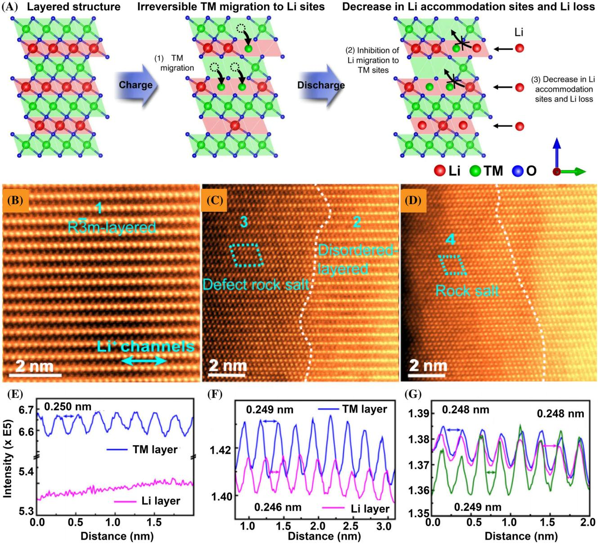

FIGURE 1 (A) Schematic illustration of TM migration to Li sites resulting in Li accommodation sites reduction and Li loss during the charge–discharge process. Reproduced with permission.[27](#page-15-0) Copyright 2021, Springer Nature. (B–D) Atomic resolution HAADF-STEM and ABF images of NCM811 cathodes after 100 cycles at 4.5 V voltage and (E–G) line intensity distribution marked by arrows of the same color in corresponding HAADF images. Reproduced with permission.[28](#page-15-0) Copyright 2018, Elsevier.

generated due to the change of material structure caused by Ni content during the cycle, which leads to the generation of microcracks. The resulting microcracks would expose the inside of the cathodes to the electrolyte and further accelerate the degradation of the cathodes[.36](#page-16-0)–39 Sun et al[.40](#page-16-0) studied the relationship between Ni content and cathodes cracking degree. As depicted in Figure [3A,B,](#page-3-0) the damage of Ni-rich layered oxide microcracks is more serious with the increase of Ni content. Microcracks can be further divided into intergranular and intragranular cracks according to their cracking locations under the observation of transmission electron microscope (TEM) (Figure [3C](#page-3-0)–F)[.31,36,41](#page-15-0)

The intergranular crack is usually caused by the accumulation of anisotropic internal stress between primary particles due to H2 ! H3 phase transition. Moreover, the cracks are generated from the secondary particle center to the surface. During the charge/discharge process, the Ni-rich cathode laminates mainly undergo a three-phase transition, taking Li1xNiO2 as an example, that is, a rhombohedral phase (H1, 0 ≤ x ≤ 0.25), a monoclinic phase (M, 0.25 ≤ x ≤ 0.55) and a rhombohedral phase

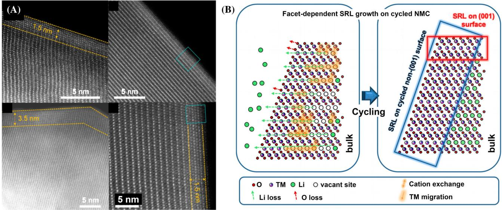

FIGURE 2 (A) Atomic resolution HAADF-STEM images of surface reconstruction layers formed on NMC622 surfaces after cycling. (B) Schematic illustration of the process by which surface reconstruction layers form and grow on the surface of a Ni-rich layered oxide cathode. Reproduced with permission.[33](#page-15-0) Copyright 2020, American Chemical Society.

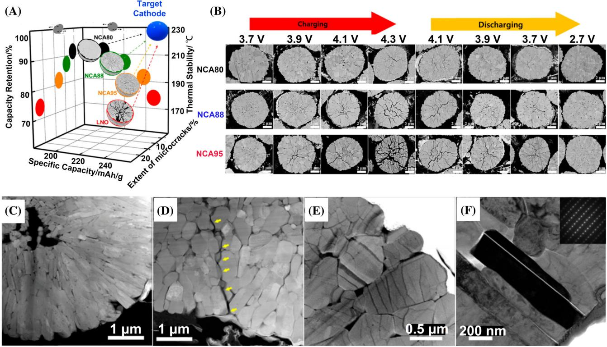

FIGURE 3 (A) Relationship between Ni content, microcrack degree and properties of Ni-rich layered oxide cathode. (B) Comparison of the cracking degree of Ni-rich layered oxide cathode with different Ni content under different charge states. Reproduced with permission.[40](#page-16-0) Copyright 2019, American Chemical Society. Intergranular crack: (C) NCM811 and (D) NCM90 cathodes cross section dark field scanning TEM image after 100 cycles; Intragranular crack: (E,F) NCM90 cathode cross section dark field scanning TEM image after 100 cycles. Reproduced with permission.[36](#page-16-0) Copyright 2018, American Chemical Society.

(H2, 0.55 ≤ x ≤ 0.75) and then with a two-phase coexistence region (H2/H3, 0.75 ≤ x ≤ 0.9).[42,43](#page-16-0) Among them, the H2 ! H3 phase transition generally occurs in Ni-rich layered oxide cathodes with Ni content greater than 0.8 and cuff-off voltage higher than 4.2 V, indicating that Ni content and cut-off voltage have a great influence on the

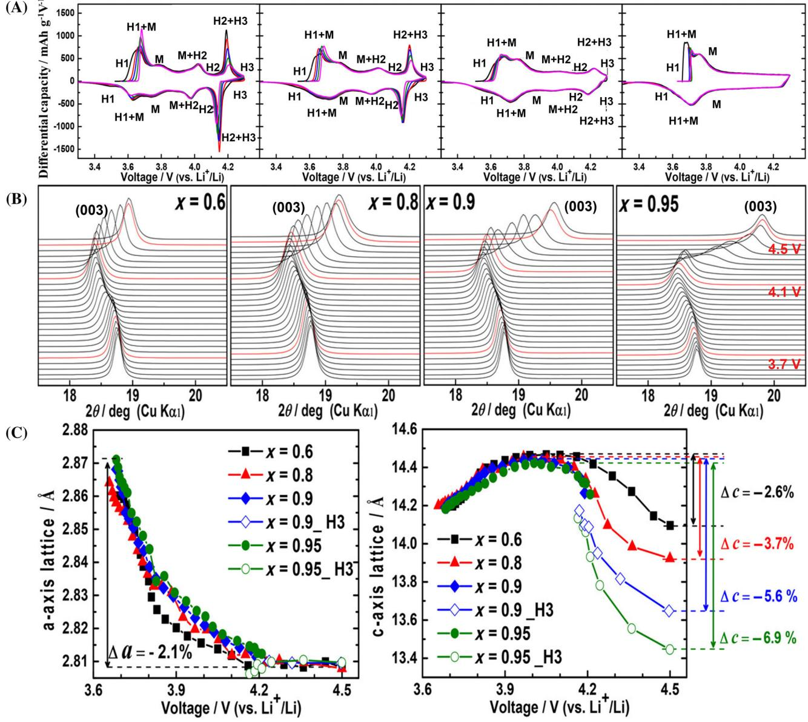

FIGURE 4 (A) dQ/dV curves of Li[NixCoyMn1xy]O2: (a) x = 0.95, (b) x = 0.9, (b) x = 0.8, (b) x = 0.6. (B) In situ XRD curves of Li [NixCoyMn1xy]O2 (x = 0.6, 0.8, 0.9, and 0.95) about (003) reflection. a-axis and c-axis lattice parameter of Li[NixCoyMn1xy]O2 (x = 0.6, 0.8, 0.9, and 0.95). (C) a-axis lattice parameter, and (D) c-axis lattice parameter of Li[NixCoyMn1-x-y]O2 (x = 0.6, 0.8, 0.9, and 0.95) as a function of the cell voltage. Reproduced with permission.[36](#page-16-0) Copyright 2019, American Chemical Society.

bulk phase structure of Ni-rich layered oxide cathode (Figure 4A).[44](#page-16-0) The differential curves of volume and voltage (dQ/dV) are used to record the phase transition. As shown in Figure 4A–D, the phase transition process shown in the dQ/dV curve corresponds to the change of lattice parameters.[44](#page-16-0) The higher the Ni content is, the more drastic the phase transition and the more obvious the corresponding cell parameters change.[36](#page-16-0) Besides, Park et al.[44](#page-16-0) found that the phase transition degree of Ni-rich layered oxide cathodes was also related to the depth of discharge (DOD) conditions. When DOD is lower than 60%, the electrode's structure remained intact, while when DOD was higher than 60%, nickel-rich cathodes were more likely to produce microcracks. In conclusion, the intergranular cracks are caused by the adverse structural changes caused by the H2 ! H3 phase transition, and the H3 phase is caused by high Ni content, cut-off voltage and DOD.

Intragranular cracks are usually caused by Li/Ni antisite defects, lattice disorder, and Coulombic repulsion between ions. Compared with intergranular cracks, intragranular cracks are smaller in size but more densely distributed.[11](#page-15-0) Figure [5A](#page-5-0) exhibits HAADF and ABF imagines of premature cracks that grow into intragranular

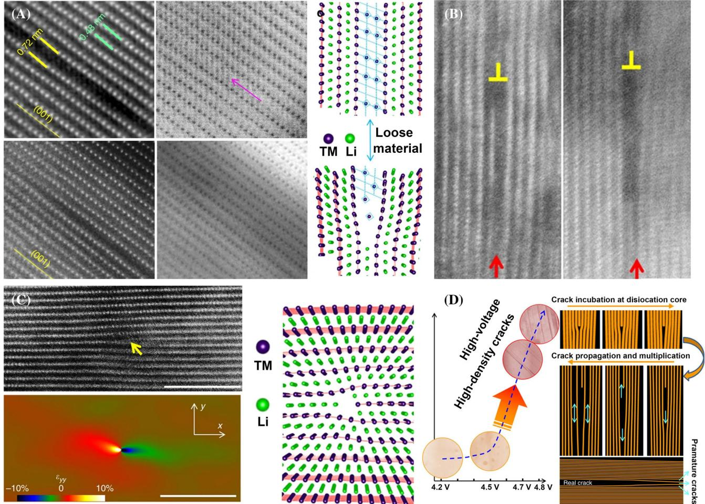

FIGURE 5 (A) HAADF and ABF images and the corresponding lattice model. (B) The vacancy accumulation at dislocation source and the atomic structure model at early incubation stages. (C) A HAADF image showing an end-on edge dislocation and the corresponding strain map and lattice model. (D) Diagram of the relationship between intragranular crack and cyclic voltage and Schematic diagram of dislocation promoting crack generation to propagation. Reproduced with permission.[41](#page-16-0) Copyright 2017, Springer Nature.

cracks in a continuous cycle. Then, Figure 5B,C shows the origin and propagation of premature cracks. Yan et al. proposed that the dislocation core could be used as the starting point of crack incubation. From the perspective of energy, Li and O ions are preferentially removed from the dislocation core to release strain. Therefore, the nucleation and propagation of premature crack is an electrochemically driven process, and high voltage is the direct driving force of intragranular cracks generation. Because higher voltage will lead to deeper Li+ extraction, which releases a lot of internal strain (Figure 5D).[41](#page-16-0) The resulting microcracks accelerate electrolyte penetration into the particle interior and accelerate degradation of exposed primary particle surfaces, which form NiO-like layers of halite impurities with unstable Ni4+. Surface degradation of the internal primary particles significantly increases the cell impedance and destroys the mechanical integrity of the entire secondary particle, leading to rapid capacity decay, and eventual cell failure[.45,46](#page-16-0)

### 2.3 | Adverse interface reaction

For Ni-rich layered oxide cathodes, the adverse interfacial reactions affecting material properties include electrolyte degradation and the formation of unstable cathode electrolyte interface (CEI). Usually, the electrolyte is called as the blood of LIBs, which is the guarantee of high performance. The electrolyte is composed of lithium salt, organic solvent and additive, which plays the role of Li+ transmission between the cathode and anode. Figure [6A](#page-6-0) illustrates the relationship between the working voltage and the reversible capacity of the two electrode materials and the electrolyte level. The electrochemical stability window of the electrolyte is determined by the lowest unoccupied molecular orbital (LUMO) and the highest occupied molecular orbital (HOMO)[.49](#page-16-0) Ideally, the redox window of the electrolyte should be lower than the reduction potential of the anode and higher than the oxidation potential of the cathode. This means that the

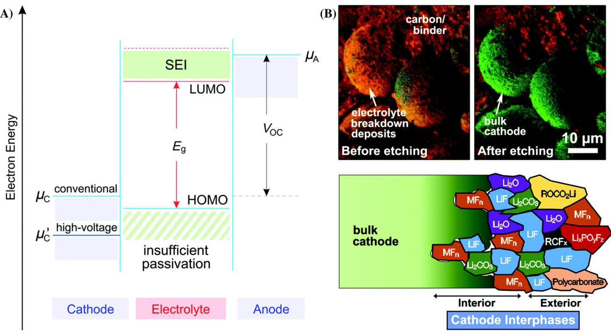

FIGURE 6 (A) The relationship between the working voltage of two electrode materials and the electrolyte level in open circuit state. Reproduced with permission.[47](#page-16-0) Copyright 2022, John Wiley and Sons. (B) TOF-SIMS map image of the LiNi0.7Mn0.15Co0.15O2 cathode surface after cycling and schematic diagram of surface deposition (interface) of various interface side reactions on the high voltage cathode material during electrochemical operation. Reproduced with permission.[48](#page-16-0) Copyright 2017, Royal Society of Chemistry.

electrolyte is only used as a chemically inert medium, enabling efficient ion transport between the two electrodes to maintain charge balance. However, the decomposition of electrolyte is inevitable under practical conditions.[47](#page-16-0) Currently, commercial electrolytes are mainly carbonate based electrolytes. Because Ni-rich layered oxide cathodes can operate at voltages above their stability limits (4.3 V), electrolytes are prone to oxidative decomposition at the cathode interface. There are two main ways of electrolyte decomposition: (i) local selfdischarge and surface oxyphilic attack of active cathode material under high de-lithium condition; (ii) Under high voltage, the water produced by ethylene carbonate (EC) dehydrogenation hydrolyzes with hexafluorophosphate ion (PF6 )[.48](#page-16-0) As shown in Figure 6B, the various complex organic and inorganic components produced by electrolyte decomposition at the cathode surface constitute the so-called CEI leveraging the time of flight secondary ion mass spectrometry (TOF-SIMS) technology[.50](#page-16-0) Ideal CEI should meet the requirements of good electronic insulation (preventing further decomposition of electrolyte), high ionic conductivity (accelerating Li+ transmission), and good mechanical toughness (impeding large volume strain of electrode).[51](#page-16-0) Stable and strong CEI plays an important role in electrochemical performance. However, the CEI generated in conventional electrolytes is usually thicker and has

lower ionic conductivity. In addition, its hardness is also insufficient, which can damage during cycling, leading to continuous decomposition of the electrolyte.

### 3 | ELECTROLYTE MODIFICATION STRATEGIES

The modification strategies for high-voltage Ni-rich layered oxide-based LMBs aim to improve battery performance and cycle life[.52](#page-16-0) This includes surface coating to increase the stability and oxidation resistance of the positive electrode[53;](#page-16-0) Optimize the electrochemical performance of the electrode by regulating the crystal structure and particle size distribution of the positive electrode material[54](#page-16-0); Increasing the Li+ storage capacity and conductivity of positive electrode materials through alloying modificatio[n55,56](#page-16-0); By utilizing interface engineering to adjust the interface structure and properties between the positive electrode and the electrolyte, the lithium ion transfer rate and interface stability can be improved. The selection and application of these modification strategies need to be based on specific battery needs and optimization objectives. Among them, modifying the electrolyte is the most economical and convenient strategy, including solvents and additives modification.[57](#page-16-0)

## 3.1 | High-voltage electrolyte solvent

Because traditional EC-based electrolytes have poor anode stability, this makes them very unstable for high voltage nickel-rich cathodes (>4.5 V). Therefore, researchers are trying to partially or completely replace the EC-based electrolyte solvent with other high-voltage resistant solvents. Usually, the replacement solvent is divided into fluorinated solvent, sulfone solvent, and nitrile solvent, ionic liquids, and so on.

#### 3.1.1 | Fluorinated solvents

Due to the strong electronegativity and electron absorption ability of fluorine atom, C F bond in fluorinated solvent has significant influence on HOMO and LUMO of solvents[.58,59](#page-16-0) The strong electronegativity reduces the orbital energy of LUMO, so that organic molecules are more easily reduced and participate in film formation. At the same time, the HOMO orbital energy of organic molecules will

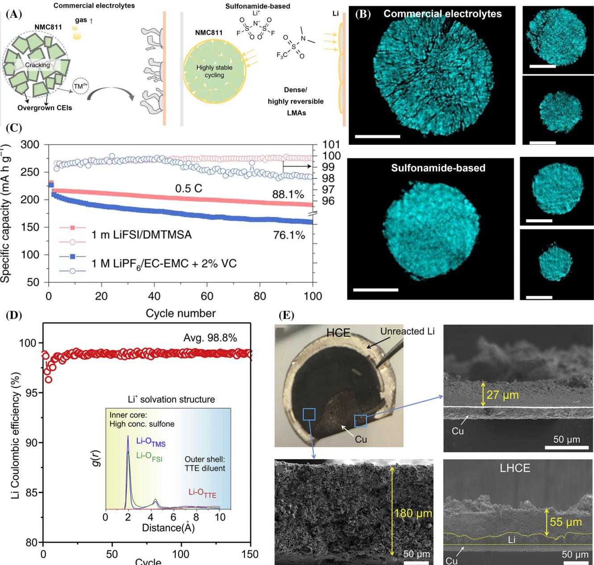

FIGURE 7 (A) Schematic illustration of LijjNCM811 after cycled in different electrolytes. (B) Two-dimensional cross-sections at different depths of the reconstructed three-dimensional tomography images of NCM811 particles cycled in different electrolytes. (C) Cycling performance in different electrolytes. Reproduced with permission.[64](#page-16-0) Copyright 2021, Springer Nature. (D) coulombic efficiency and Radial distribution function of Li+ solvation structure. (E) Comparison of cycling performances of LijjNCM cells using a 50 mm thick Li anode and different electrolytes; and Li metal cycling behavior in LijjNCM cells. Reproduced with permission.[65](#page-16-0) Copyright 2018, Elsevier.

also decrease, making fluorinated solvents have strong antioxidant properties and can be used in high-voltage battery systems. Typical fluorinated solvents such as fluoroethylene carbonate (FEC), 3, 3, 3-trifluoropropylene carbonate (TFPC), and so on have been used as the solvent or additive for electrolytes. Hou et al. illustrated that FEC played a key role in the adjustment of Li+ solvation structure and formation of protective solid electrolyte interphase (SEI) composition, thus contributing to the rational design of high voltage electrolytes[.60](#page-16-0) Kushwaha et al[.61](#page-16-0) used first-principles calculations to compare the structure, electronic, thermochemical, and solvation properties of FEC and TFPC solvated Li+. The results show that the solvation energy of TFPC is better than that of FEC, which is in good agreement with the experimental solvation energy order. In addition, fluorinated solvents also have flame retardancy as well as oxidize resistance, which can effectively enhance electrode passivation and thermal stability[.62](#page-16-0)

#### 3.1.2 | Sulfone solvents

Sulfones are considered as potential high-voltage electrolytes due to their low cost and high electrochemical window (>5 V)[.63](#page-16-0) Sulfone electrolytes contribute to lower HOMO energy levels for higher oxidation stability, which is attributed to the more electronegative nature of the sulfonyl group.[47](#page-16-0) Xue et al[.64](#page-16-0) reported a new sulfonamide-based electrolyte that not only inhibits side reactions, stress corrosion cracking, transition metal dissolution, and cathode impedance growth, but also enables highly reversible Li stripping and electroplating, resulting in compact morphology and low pulverization compared to commercial carbonate electrolytes. As expected, the sulfone electrolyte results in 88.1% capacity retention of the LijjNCM811 battery at 4.7 V for 100 cycles (Figure [7A](#page-7-0)–C). However, sulfone electrolytes still have three important challenges, for example, high viscosity, poor wetter, and poor stability to LMA, which needs to be further solved[.58](#page-16-0) As depicted in Figure [7D,E](#page-7-0), Ren and his colleagues designed a high-concentration LiFSI-TMS system (including TTE diluent) for the above shortcomings of sulfone electrolytes, and constructed a local highconcentration solvation structure, which further improved the problems of high viscosity of sulfone electrolytes, poor wettability and poor stability of LMA. At the same time, the electrolyte also effectively inhibits the corrosion of the positive Al collector fluid and realizes the stable operation of the battery under 4.9 V.[65](#page-16-0)

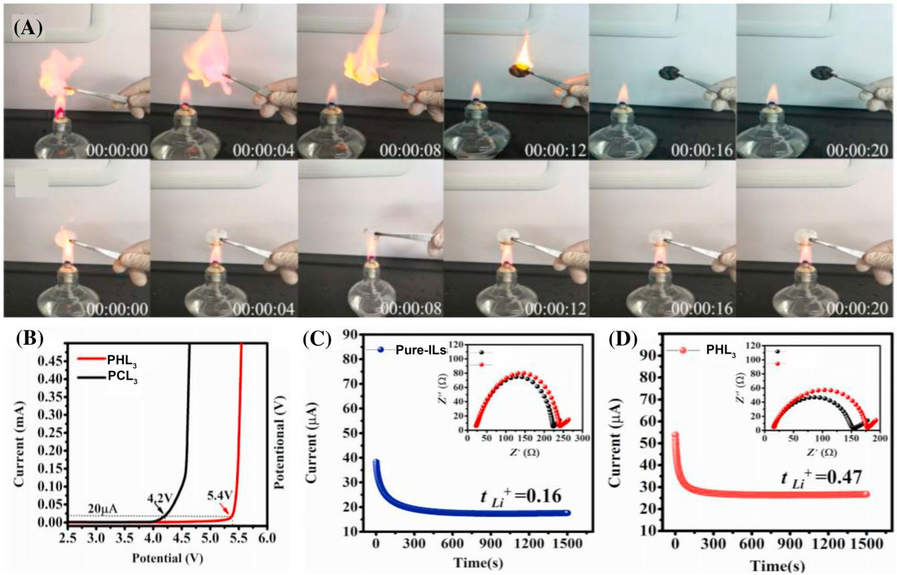

FIGURE 8 (A) Flame retardant experiment in PCL3 and PHL3 electrolytes. (B) The linear sweep voltammetry (with and without HFPM) of LijjNCM622 half cells. Polarization curve with a 10 mV DC voltage of (C) pure-ILs and (D) PHL3 electrolytes at 25C. Reproduced with permission.[83](#page-17-0) Copyright 2021, Elsevier.

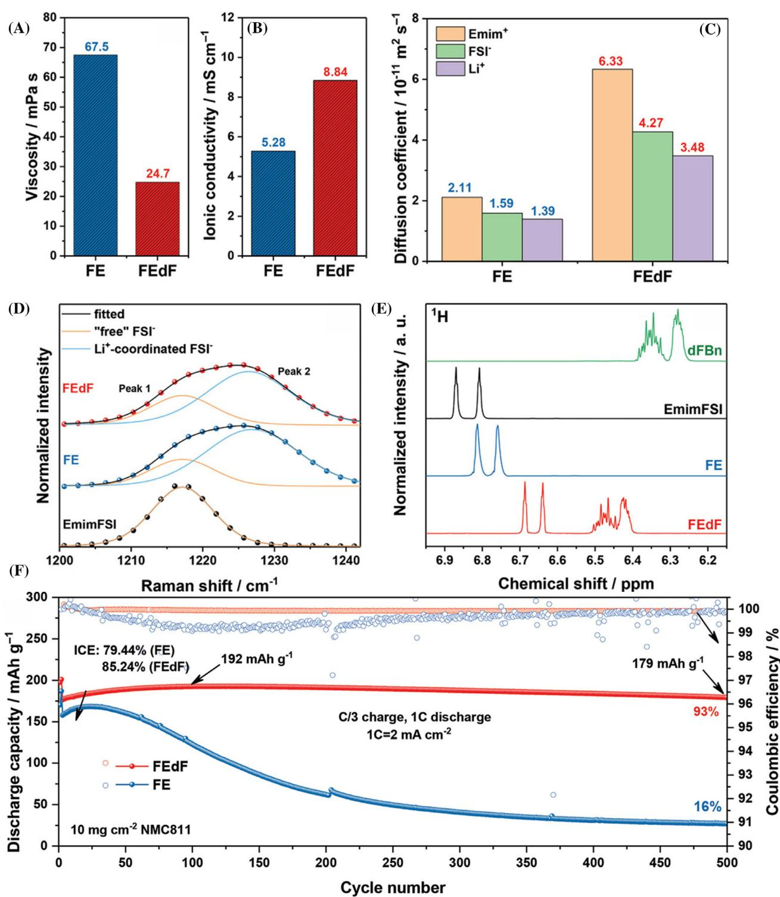

FIGURE 9 (A) Physical characterization of different electrolytes at 20C. (A) Viscosities and (B) ionic conductivities. (C) Self-diffusion coefficient of ions in different electrolytes. (D) Raman spectra. (E) 1D 1 H NMR spectra in the region 6.1–7.0 ppm. Reproduced with permission.[84](#page-17-0) Copyright 2022, John Wiley and Sons.

#### 3.1.3 | Nitrile solvents

In recent years, nitrile solvents have attracted much attention as high-voltage LIB electrolytes due to their wide electrochemical window, moderate dielectric constant, good thermal stability and low flammability[.66](#page-16-0)–69 In general, cathode stability in nitrile electrolytes originates from a single layer of chemisorbed nitrile

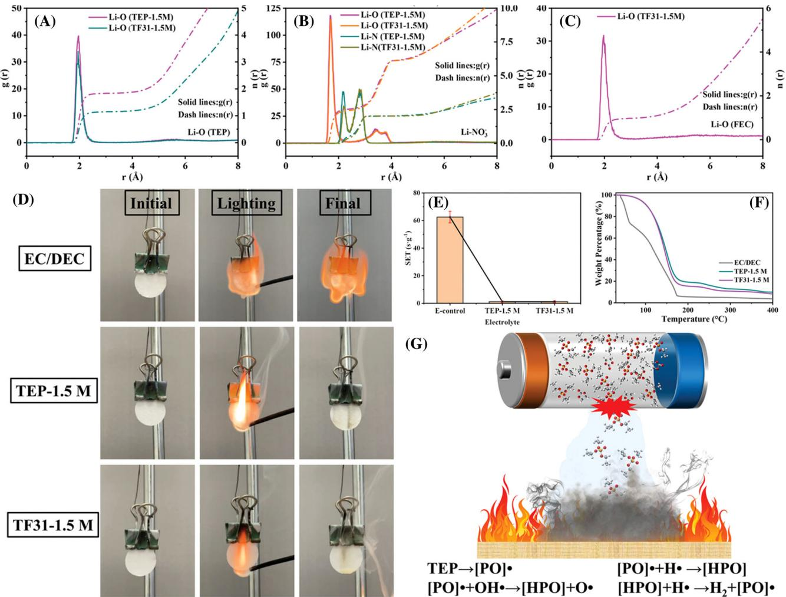

FIGURE 10 Molecular dynamics simulation results of radial distribution functions and coordination numbers. (A) Li-O (TEP); (B) Li-N (NO3 ); (C) Li-O (FEC). Combustion and thermal stability tests. (D) The digital photos of various electrolytes burning process. (E) The selfextinguishing time values of various electrolytes. (F) Thermogravimetric analysis curves of electrolytes under nitrogen atmosphere with a heat rate of 10C min1 . (G) Schematic diagram of flame-retardant mechanism of TEP-based flame-retardant electrolytes. Reproduced with permission.[92](#page-17-0) Copyright 2023, John Wiley and Sons.

molecules on the surface of the high-voltage cathode, which produces the C≡N-TM complex and excludes other carbonate molecules to prevent its decomposition.[70,71](#page-16-0) Butylene dinitrile (SN) is one of the most commonly used nitriles in electrolytes. Its HOMO level is higher than that of carbonate solvent, which can induce the formation of protective interface layer on the surface of high-pressure cathode materials, and remove hydrofluoric acid (HF) to slow the dissolution of TM ions on cathode surface.[47](#page-16-0)

#### 3.1.4 | Ionic liquids electrolytes

Ionic liquids (ILs) consist of cations and anions, which can be treated as special salts in the liquid state at room temperature due to the weak electrostatic interaction between the cations and anions[.72](#page-17-0)–74 ILs have low vapor pressure, non-flammability, high thermal, and electrochemical stability are considered as an electrolyte substitute suitable for high voltage. However, high viscosity and insufficient Li+ transport still limit their further practical application[.75](#page-17-0) Therefore, introducing low viscosity co-solvent into Ionic liquids electrolytes (ILEs) is a feasible way to reduce its viscosity and promote Li+ migration[.76](#page-17-0)–78 In recent years, non-solvated hydrofluoroethers (HFEs) have been proposed as a co-solvent for ILEs[.79](#page-17-0)–82 Yan et al[.83](#page-17-0) introduced a novel high-temperature and highvoltage resistant electrolyte based on ILs fluorinated solvents, where 1,1,1,3,3,3-hexafluoroisopropyl methyl ether (HFPM) facilitates Li+ diffusion but does not significantly reduce IL's wide electrochemical window properties. Finally, the LijjNCM622 battery has 94% capacity retention rate after 100 cycles. The addition of ILEs and HFPM

## 12 of 19 LIU ET AL.

has excellent flame retardancy, which improves the safety performance of the electrolyte (Figure [8A](#page-8-0)–D). As shown in Figure [9A](#page-9-0)–E, Liu and his colleagues proposed a locally concentrated ionic liquid electrolyte (LCILE) electrolyte. The co-solvent 1,2-difluorobenzene (dFBn) promoted the transport of Li+ and reduced the viscosity of ionic liquid. As a result, the LCILE enables dendrite-free cycling of LMAs with a coulombic efficiency (CE) up to 99.57% and highly stable cycling of LijjNMC811 for 500 cycles with a capacity retention of 93% (Figure [9F](#page-9-0))[.84](#page-17-0)

## 3.2 | High-voltage electrolyte additive

Recently, high-voltage electrolyte additive has attracted a lot of attention due to its advantages such as low cost, simple method and obvious effect[.11](#page-15-0) In order to meet the higher-voltage cathode materials, researchers have developed various additives suitable for high-voltage conditions to build stable electrode-electrolyte interfaces (EEIs) for a more stable cycle life. Most high-voltage electrolyte additives have higher HOMO levels and lower LUMO levels than traditional carbonate solvents, so they can participate in redox to produce high quality EEIs before decomposition of the electrolyte solvent occurs.[85](#page-17-0)–87

### 3.2.1 | Phosphorous-containing additive

Phosphorous additives are widely studied as flame retardant additives due to their good free radical scavenging ability.[88](#page-17-0) However, most organophosphorus

FIGURE 11 (A) Schematic illustration of the hydrolysis of LiPF6 to generate acidic compounds in the electrolyte and reactive species (HF and PF5)-derived problems in batteries. (B) Elimination mechanism of TMS-ON on HF and H2O. Reproduced with permission.[96](#page-17-0) Copyright 2020, John Wiley and Sons.

compounds negatively affect battery performance due to poor EEI formation.[89,90](#page-17-0) In order to obtain better protection effect for high-voltage Ni-rich layered oxide cathodes and LMA, Lu et al.[91](#page-17-0) reported a dual-additive electrolyte consisting of tirs(pentafluorophenyl)phosphine (TPFPP) additive and LiNO3 in carbonate-based electrolyte. The TPFPP has electron-deficient atoms that appear to be a center that breaks up LiNO3 clusters and manipulates solvated structures at appropriate heating temperatures. Finally, the dual-additive electrolyte can form a robust EEIs on the surface of both the anode and cathode. Besides, Hu et al.[92](#page-17-0) used LiNO3 as the only Li salt combined with non-flammable triethyl phosphate (TEP) and FEC co-solvents as the electrolyte, which effectively improved the cycle stability and safety performance of batteries. In this study, a stable EEIs rich in Li3N and LiF were constructed, and the strong solvation and easy reduction ability of NO3 and FEC were utilized to improve the cycle stability of the battery (Figure [10A](#page-10-0)–G). Compared with commercial electrolytes, LijjNCM811 battery showed a higher capacity retention rate of 83.74% after 1000 cycles. Thus, these new electrolytes can make a great contribution to the development of LMBs with high electrochemical performance and high safety.

#### 3.2.2 | Silicon-containing additives

Silicone as an electrolyte additive can remove HF and phosphorus pentafluoride (PF5) harmful substances and effectively protect the cathode from nucleophilic attack.[93](#page-17-0)–95 Silicon-containing additives have been applied to various high-voltage cathodes and have greatly improved their electrochemical properties. Kim et al[.96](#page-17-0) reported that 3-(trimethylsilyl)-2-oxazolidone (TMS-ON) as a multifunctional additive helps to form stable CEI, thereby achieving long-term stability of Ni-rich cathodes. TMS-ON contains an N Si structure, which contains a polar ring structure that can effectively interact with Li+ ions, thereby improving the dissociation degree of LiPF6. The Si atoms in the N Si structure of TMS-ON can effectively absorb F to form a pentavalent silane intermediate, which then produces fluorinated trimethyl

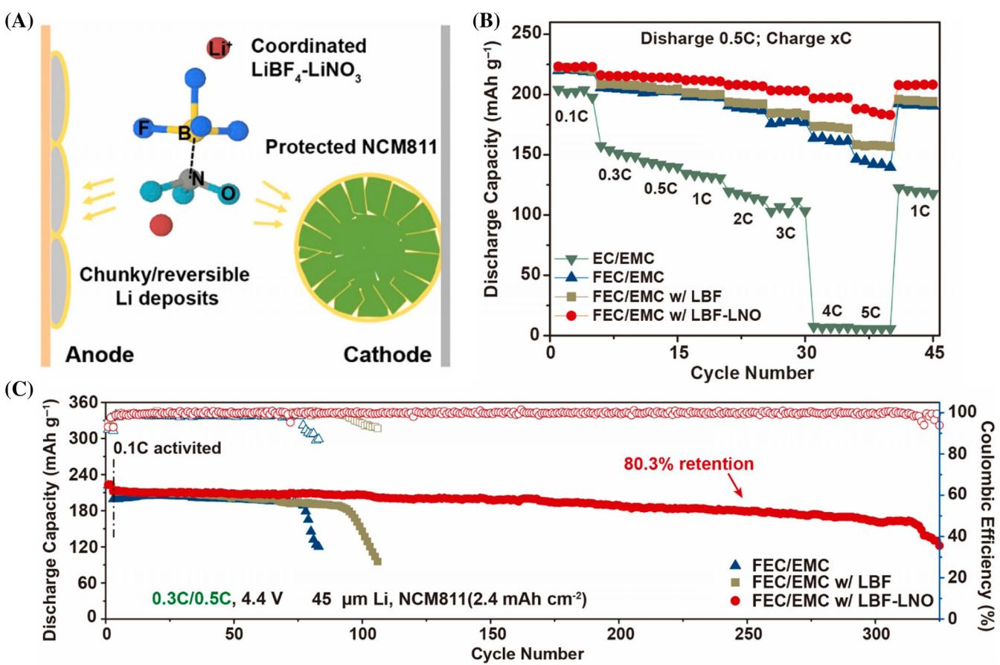

FIGURE 12 (A) Illustration of SEI and CEI formation in the dual-salt-additive electrolyte. Electrochemical behavior of LijjNCM811: (B) rate performance and (C) long cycle. Reproduced with permission.[101](#page-17-0) Copyright 2021, Elsevier.

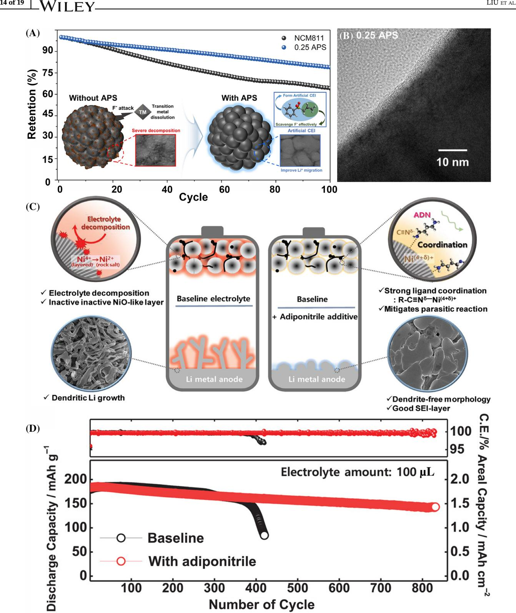

FIGURE 13 (A) Schematic illustration of the NCM811 cathode material using APS. (B) TEM analysis of cycled NCM811 cathode with 0.25 APS controlled-electrolyte. Reproduced with permission.[104](#page-17-0) Copyright 2021, Elsevier. (C) Schematic illustration of the effectiveness of adiponitrile as a bi-functional additive. (D) Cycle life test of the LijjLi[Ni0.73Co0.10Mn0.15Al0.02]O2 batteries with different amounts of the electrolyte and rate performance. Reproduced with permission.[71](#page-17-0) Copyright 2019, John Wiley and Sons.

silane (TMSF). Therefore, the decomposition of TMS-ON to form TMSF and ON can eliminate HF from LiPF6 based electrolytes (Figure [11A,B](#page-11-0)). Besides, Park et al. also proved that the introduction of trimethylsilicyl (TMS) motif in the electrolyte could effectively remove HF and prevent HF from damaging the EEIs.[97](#page-17-0)

## 3.2.3 | Boron-containing additives

Boron-containing additives can form a stable protective film on the cathode surface at high voltage, thus improving battery performance.[98,99](#page-17-0) In some boron-containing additives, such as lithium tetrafluoroborate (LiBF4), lithium bis(oxalate)borate (LiBOB), and lithium diflu(oroxalate) borate (LiDFOB) are widely studied as lithium salts. Previous studies have shown that these salts have a high HOMO level and can be preferentially decomposed on the delithium cathodes to form a robust borate-rich interface[.100](#page-17-0) For example, Wang et al[.101](#page-17-0) reported a double salt additive strategy through manipulating Li+ solvated structure by LiBF4 and LiNO3. LiBF4 additive could not only improve the stability of high-voltage NCM811 cathode, but also play a role in assisting the dissolution of LiNO3 in carbonate electrolyte through its Lewis acidity. Under the synergistic action of the double salt additive chemistry, the thin Li anode and highloading NCM811 cathode still have 80.35% capacity retention after 250 cycles (Figure [12A](#page-12-0)–C). In addition, some boron-containing additives can form CEIs containing B O, B O B, B F, and other species on the cathode surface, and ultimately improve the cycle stability of LMBs.[38,102,103](#page-16-0)

#### 3.2.4 | Other additives

Sulfone and nitrile organic molecules can not only be used as solvents, but also as additives to play a role in electrolytes. Ahn et al. introduced allyl phenyl sulfone (APS) additive into the carbonate electrolyte, and the sulfone functional in APS is expected to effectively inhibit electrolyte decomposition during the cycle (Figure [13A\)](#page-13-0). The allyl functional group makes CEI more durable through chemical removal of F species (Figure [13B\)](#page-13-0). Finally, the capacity retention rate of LijjNCM811 battery was increased from 64.3% to 78.9% after 100 cycles at 45C.[104](#page-17-0) Nitrile solvents are often used as high-voltage electrolyte additives. Sun et al. proposed a bi-functional additive adiponitrile (C6H8N2), the strong coordination between Ni4+ and the nitrile group in adiponitrile can effectively stabilize the LMA and Ni-rich layered oxide interface. The Li[Ni0.73Co0.10Mn0.15Al0.02]O2 battery achieved an unprecedented 75% cycle retention rate after 830 cycles (Figure [13C,D](#page-13-0)).[71](#page-17-0)

### 4 | CONCLUSIONS AND PERSPECTIVES

In recent years, the pursuit of EVs has driven the development of higher energy-density LIBs. Thus, Ni-rich layered oxides have been considered as advanced cathodes for large-scale applications due to their relatively high working voltage and theoretical specific capacity. However, with the increasing voltage, Ni-rich layered oxide cathodes are facing various challenges, such as cationic mixing, surface reconstruction, microcrack generation and electrolyte decomposition. In order to cope with these challenges, the research on the modification of electrolyte engineering interface has received extensive attention. In this progress, the failure mechanism of Ni-rich layered oxide LMBs is reviewed, and the recent studies on improving battery performance through electrolyte modification strategies are further overviewed.

The selection criteria for high-voltage electrolytes can be classified as: (i) To choose solvents with high oxidation potential and wide electrochemical window to replace traditional commercial carbonate solvents, such as sulfones, fluorinated solvents, and nitrile solvents, and so on. (ii) To choose the cathode film-forming additive to inhibit the reaction between cathode and electrolyte interface. (iii) To choose a new high voltage resistant Li salt as an additive to prevent the side reaction between electrolyte and electrode material. In terms of economic benefit, the development of appropriate additives is the core of the electrolyte, but also the key to improve the performance. The future development of electrolyte additives will have the following trends:

- i. More in situ characterization techniques are used to explore the reaction process at the electrodeelectrolyte interface and determine the effect mechanism of additives.
- ii. The evaluation standards of electrolyte additive are established by combining theoretical simulation with experiment.
- iii. The electrolyte additive is combined with other positive electrode modification methods to improve the performance of high-voltage LMBs.

In conclusion, with the continuous improvement of the high-voltage Ni-rich layered oxides, the commercialization of high energy density LIBs will take a further step.

#### ACKNOWLEDGMENTS

This work was supported by the National Natural Science Foundation of China (Grant Nos. 51971090 and U21A20311).

#### CONFLICT OF INTEREST STATEMENT

The authors declare no conflicts of interest.

#### ORCID

Jianmin Ma <https://orcid.org/0000-0003-2081-2877>

## 16 of 19 LIU ET AL.

#### REFERENCES

- 1. Huang J, Zhu Y, Feng Y. Research progress on key materials and technologies for secondary batteries. Acta Phys Chim Sin. 2022;38(12):2208000.
- 2. Long R, Wang G-L, Hu Z-L, Sun PF, Zhang L. Gradually activated lithium uptake in sodium citrate toward high-capacity organic anode for lithium-ion batteries. Rare Met. 2021;40(6): 1366-1372.
- 3. Wu Q, Zhang B, Lu Y. Progress and perspective of highvoltage lithium cobalt oxide in lithium-ion batteries. J Energy Chem. 2022;74:283-308.
- 4. Liu Y, Yu Z, Chen J, et al. Recent development and progress of structural energy devices. Chin Chem Lett. 2022;33(4):1817- 1830.
- 5. Luo K, Chen X, Zheng H, Shi Z. A review of deep learning approach to predicting the state of health and state of charge of lithium-ion batteries. J Energy Chem. 2022;74:159-173.
- 6. Wang Y-B, Yang Q, Guo X, et al. Strategies of binder design for high-performance lithium-ion batteries: a mini review. Rare Met. 2022;41(3):745-761.
- 7. Chen H, Li M, Li C, et al. Electrospun carbon nanofibers for lithium metal anodes: Progress and perspectives. Chin Chem Lett. 2022;33(1):141-152.
- 8. Wu S-J, Wu Z-H, Fang S, Qi XP, Yu B, Yang JY. A comparison of core–shell Si/C and embedded structure Si/C composites as negative materials for lithium-ion batteries. Rare Met. 2021; 40(9):2440-2446.
- 9. Chen Y, Kang Y, Zhao Y, et al. A review of lithium-ion battery safety concerns: the issues, strategies, and testing standards. J Energy Chem. 2021;59:83-99.
- 10. Li W, Erickson EM, Manthiram A. High-nickel layered oxide cathodes for lithium-based automotive batteries. Nat Energy. 2020;5(1):26-34.
- 11. Jiang M, Danilov DL, Eichel R-A, Notten PHL. A review of degradation mechanisms and recent achievements for Ni-rich cathodebased Li-ion batteries. Adv Energy Mater. 2021;11(48):2103005.
- 12. Maleki Kheimeh Sari H, Li X. Controllable cathode– electrolyte interface of Li[Ni0.8Co0.1Mn0.1]O2 for lithium ion batteries: a review. Adv Energy Mater. 2019;9(39):1901597.
- 13. Liang C, Jiang L, Wei Z, Zhang W, Wang Q, Sun J. Insight into the structural evolution and thermal behavior of LiNi0.8Co0.1Mn0.1O2 cathode under deep charge. J Energy Chem. 2022;65:424-432.
- 14. Su Y, Zhang Q, Chen L, et al. Stress accumulation in Ni-rich layered oxide cathodes: origin, impact, and resolution. J Energy Chem. 2022;65:236-253.
- 15. He W, Xie Q-S, Lin J, Qu BH, Wang LS, Peng DL. Mechanisms and applications of layer/spinel phase transition in Liand Mn-rich cathodes for lithium-ion batteries. Rare Met. 2022;41(5):1456-1476.
- 16. Wang X, Zhang B, Xiao Z, et al. Enhanced rate capability and mitigated capacity decay of ultrahigh-nickel cobalt-free LiNi0.9Mn0.1O2 cathode at high-voltage by selective tungsten substitution. Chin Chem Lett. 2023;34(7):107772.
- 17. Wang X, Ding Y-L, Deng Y-P, Chen Z. Ni-rich/Co-poor layered cathode for automotive Li-ion batteries: promises and challenges. Adv Energy Mater. 2020;10(12):1903864.
- 18. Dai Z, Wang J, Zhao H, Bai Y. Surface coupling between mechanical and electric fields empowering Ni-rich cathodes

with superior cyclabilities for lithium-ion batteries. Adv Sci. 2022;9(18):2200622.

- 19. Xu C, Märker K, Lee J, et al. Bulk fatigue induced by surface reconstruction in layered Ni-rich cathodes for Li-ion batteries. Nat Mater. 2021;20(1):84-92.
- 20. Lee E, Muhammad S, Kim T, Kim H, Lee W, Yoon WS. Tracking the influence of thermal expansion and oxygen vacancies on the thermal stability of Ni-rich layered cathode materials. Adv Sci. 2020;7(12):1902413.
- 21. Slonchak A, Parry R, Pullinger B, et al. Structural analysis of 30 UTRs in insect flaviviruses reveals novel determinants of sfRNA biogenesis and provides new insights into flavivirus evolution. Nat Commun. 2022;13(1):1279.
- 22. Koyama Y, Tanaka I, Adachi H, Makimura Y, Ohzuku T. Crystal and electronic structures of superstructural Li1x[Co1/3Ni1/3- Mn1/3]O2 (0≤x≤1). J Power Sources. 2003;119-121:644-648.
- 23. Li X, Liu J, He J, et al. Hexafluoroisopropyl trifluoromethanesulfonate-driven easily Li+ desolvated electrolyte to afford LijjNCM811 cells with efficient anode/cathode electrolyte interphases. Adv Funct Mater. 2021;31(37):2104395.
- 24. Li X, Liu J, He J, et al. Separator-wetted, acid- and waterscavenged electrolyte with optimized Li-ion solvation to form dual efficient electrode electrolyte interphases via hexafunctional additive. Adv Sci. 2022;9(20):2201297.
- 25. Wang Z, Chen C, Wang D, Zhu Y, Zhang B. Stabilizing interfaces in high-temperature NCM811-Li batteries via tuning terminal alkyl chains of ether solvents. Angew Chem Int Ed. 2023;62(28):e202303950.
- 26. Hu X, Li Y, Liu J, et al. Constructing LiF/Li2CO3-rich heterostructured electrode electrolyte interphases by electrolyte additive for 4.5 V well-cycled lithium metal batteries. Sci Bull. 2023;68(12):1295-1305.
- 27. Chae B-G, Park SY, Song JH, Lee E, Jeon WS. Evolution and expansion of Li concentration gradient during charge– discharge cycling. Nat Commun. 2021;12(1):3814.
- 28. Lin Q, Guan W, Meng J, et al. A new insight into continuous performance decay mechanism of Ni-rich layered oxide cathode for high energy lithium ion batteries. Nano Energy. 2018; 54:313-321.
- 29. Huang Z, Gao J, He X, Li J, Jiang C. Well-ordered spherical LiNixCo(12x)MnxO2 cathode materials synthesized from cobolt concentration-gradient precursors. J Power Sources. 2012;202:284-290.
- 30. Zheng J, Ye Y, Liu T, et al. Ni/Li disordering in layered transition metal oxide: electrochemical impact, origin, and control. Acc Chem Res. 2019;52(8):2201-2209.
- 31. Lee J, Urban A, Li X, Su D, Hautier G, Ceder G. Unlocking the potential of cation-disordered oxides for rechargeable lithium batteries. Science. 2014;343(6170):519-522.
- 32. Zhang X, Jiang WJ, Mauger A, Qilu, Gendron F, Julien CM. Minimization of the cation mixing in Li1+x(NMC)1xO2 as cathode material. J Power Sources. 2010;195(5):1292-1301.
- 33. Zhu J, Sharifi-Asl S, Garcia JC, et al. Atomic-level understanding of surface reconstruction based on Li[NixMnyCo1–x–y]O2 singlecrystal studies. ACS Appl Energy Mater. 2020;3(5):4799-4811.
- 34. Zhang SS. Problems and their origins of Ni-rich layered oxide cathode materials. Energy Storage Mater. 2020;24:247-254.
- 35. Zou L, Zhao W, Jia H, et al. The role of secondary particle structures in surface phase transitions of Ni-rich cathodes. Chem Mater. 2020;32(7):2884-2892.
- 36. Ryu H-H, Park K-J, Yoon CS, Sun YK. Capacity fading of Nirich Li[NixCoyMn1–x–y]O2 (0.6 ≤ x ≤ 0.95) cathodes for highenergy-density lithium-ion batteries: bulk or surface degradation? Chem Mater. 2018;30(3):1155-1163.
- 37. Sun HH, Ryu H-H, Kim U-H, et al. Beyond doping and coating: prospective strategies for stable high-capacity layered Nirich cathodes. ACS Energy Lett. 2020;5(4):1136-1146.
- 38. Cheng F, Zhang X, Qiu Y, et al. Tailoring electrolyte to enable high-rate and super-stable Ni-rich NCM cathode materials for Li-ion batteries. Nano Energy. 2021;88:106301.
- 39. Ryu H-H, Park K-J, Yoon DR, Aishova A, Yoon CS, Sun YK. Li[Ni0.9Co0.09W0.01]O2: a new type of layered oxide cathode with high cycling stability. Adv Energy Mater. 2019;9(44): 1902698.
- 40. Nam GW, Park N-Y, Park K-J, et al. Capacity fading of Ni-rich NCA cathodes: effect of microcracking extent. ACS Energy Lett. 2019;4(12):2995-3001.
- 41. Yan P, Zheng J, Gu M, Xiao J, Zhang JG, Wang CM. Intragranular cracking as a critical barrier for high-voltage usage of layer-structured cathode for lithium-ion batteries. Nat Commun. 2017;8(1):14101.
- 42. Li W, Reimers JN, Dahn JR. In situ x-ray diffraction and electrochemical studies of Li1xNiO2. Solid State Ion. 1993;67(1): 123-130.
- 43. Ohzuku T, Ueda A, Nagayama M, Iwakoshi Y, Komori H. Comparative study of LiCoO2, LiNi12Co12O2 and LiNiO2 for 4 volt secondary lithium cells. Electrochim Acta. 1993;38(9): 1159-1167.
- 44. Li W, Reimers JN, Dahn JR. Crystal structure of LixNi2xO2 and a lattice-gas model for the order-disorder transition. Phys Rev B. 1992;46(6):3236-3246.
- 45. Zhang H, Omenya F, Yan P, et al. Rock-salt growth-induced (003) cracking in a layered positive electrode for Li-ion batteries. ACS Energy Lett. 2017;2(11):2607-2615.
- 46. Kim J-H, Ryu H-H, Kim SJ, Yoon CS, Sun YK. Degradation mechanism of highly Ni-rich Li[NixCoyMn1–x–y]O2 cathodes with x >0.9. ACS Appl Mater Interfaces. 2019;11(34):30936- 30942.
- 47. Guo K, Qi S, Wang H, et al. High-voltage electrolyte chemistry for lithium batteries. Small Sci. 2022;2(5):2100107.
- 48. Li W, Song B, Manthiram A. High-voltage positive electrode materials for lithium-ion batteries. Chem Soc Rev. 2017;46(10): 3006-3059.
- 49. Huang J, Liu J, He J, et al. Optimizing electrode/electrolyte interphases and Li-ion flux/solvation for lithium-metal batteries with qua-functional heptafluorobutyric anhydride. Angew Chem Int Ed. 2021;60(38):20717-20722.
- 50. Li W, Dolocan A, Oh P, et al. Dynamic behaviour of interphases and its implication on high-energy-density cathode materials in lithium-ion batteries. Nat Commun. 2017;8(1): 14589.
- 51. Yu Z, Wang H, Kong X, et al. Molecular design for electrolyte solvents enabling energy-dense and long-cycling lithium metal batteries. Nat Energy. 2020;5(7):526-533.
- 52. Guo W, Wei W, Zhu H, Hu Y, Jiang H, Li C. In situ surface engineering enables high interface stability and rapid reaction kinetics for Ni-rich cathodes. eScience. 2023;3(1):100082.
- 53. Chen Y, Zhang Y, Chen B, Wang Z, Lu C. An approach to application for LiNi0.6Co0.2Mn0.2O2 cathode material at high

cutoff voltage by TiO2 coating. J Power Sources. 2014;256: 20-27.

- 54. Woo SW, Myung ST, Bang H, Kim DW, Sun YK. Improvement of electrochemical and thermal properties of Li [Ni0.8Co0.1Mn0.1]O2 positive electrode materials by multiple metal (Al, Mg) substitution. Electrochim Acta. 2009;54(15): 3851-3856.
- 55. Han B, Xu D, Chi S-S, et al. 500 Wh kg1 class Li metal battery enabled by a self-organized core–shell composite anode. Adv Mater. 2020;32(42):2004793.
- 56. Zhao J, Zhou G, Yan K, et al. Air-stable and freestanding lithium alloy/graphene foil as an alternative to lithium metal anodes. Nat Nanotechnol. 2017;12(10):993-999.
- 57. Cheng H, Sun Q, Li L, et al. Emerging era of electrolyte solvation structure and interfacial model in batteries. ACS Energy Lett. 2022;7(1):490-513.
- 58. Fan X, Wang C. High-voltage liquid electrolytes for Li batteries: progress and perspectives. Chem Soc Rev. 2021;50(18): 10486-10566.
- 59. He M, Su C-C, Peebles C, Zhang Z. The impact of different substituents in fluorinated cyclic carbonates in the performance of high voltage lithium-ion battery electrolyte. J Electrochem Soc. 2021;168(1):010505.
- 60. Hou T, Yang G, Rajput NN, et al. The influence of FEC on the solvation structure and reduction reaction of LiPF6/EC electrolytes and its implication for solid electrolyte interphase formation. Nano Energy. 2019;64:103881.
- 61. Kushwaha AK, Jena SS, Sahoo MR, Nayak SK. Electrolytic solvation effects in fluoroethylene carbonate and trifluoropropylene carbonate: a comparative study based on firstprinciples calculation. J Electron Mater. 2021;50(4):1807-1816.
- 62. Fan X, Chen L, Borodin O, et al. Non-flammable electrolyte enables Li-metal batteries with aggressive cathode chemistries. Nat Nanotechnol. 2018;13(8):715-722.
- 63. Wang Y, Li Z, Hou Y, et al. Emerging electrolytes with fluorinated solvents for rechargeable lithium-based batteries. Chem Soc Rev. 2023;52(8):2713-2763.
- 64. Xue W, Huang M, Li Y, et al. Ultra-high-voltage Ni-rich layered cathodes in practical Li metal batteries enabled by a sulfonamide-based electrolyte. Nat Energy. 2021;6(5):495-505.
- 65. Ren X, Chen S, Lee H, et al. Localized high-concentration sulfone electrolytes for high-efficiency lithium-metal batteries. Chem. 2018;4(8):1877-1892.
- 66. Zhang Q, Liu K, Ding F, Li W, Liu X, Zhang J. Enhancing the high voltage interface compatibility of LiNi0.5Co0.2Mn0.3O2 in the succinonitrile-based electrolyte. Electrochim Acta. 2019; 298:818-826.
- 67. Alarco P-J, Abu-Lebdeh Y, Abouimrane A, Armand M. The plastic-crystalline phase of succinonitrile as a universal matrix for solid-state ionic conductors. Nat Mater. 2004;3(7):476-481.
- 68. Isken P, Dippel C, Schmitz R, et al. High flash point electrolyte for use in lithium-ion batteries. Electrochim Acta. 2011; 56(22):7530-7535.
- 69. Liu Y, Fang S, Shi P, Luo D, Yang L, Hirano SI. Ternary mixtures of nitrile-functionalized glyme, non-flammable hydrofluoroether and fluoroethylene carbonate as safe electrolytes for lithium-ion batteries. J Power Sources. 2016;331:445-451.
- 70. Chen R, Liu F, Chen Y, et al. An investigation of functionalized electrolyte using succinonitrile additive for

high voltage lithium-ion batteries. J Power Sources. 2016;306: 70-77.

- 71. Lee SH, Hwang J-Y, Park S-J, Park GT, Sun YK. Adiponitrile (C6H8N2): a new bi-functional additive for high-performance Li-metal batteries. Adv Funct Mater. 2019;29(30):1902496.
- 72. Giffin GA. Ionic liquid-based electrolytes for "beyond lithium" battery technologies. J Mater Chem A. 2016;4(35):13378- 13389.
- 73. Fedorov MV, Kornyshev AA. Ionic liquids at electrified interfaces. Chem Rev. 2014;114(5):2978-3036.
- 74. Eftekhari A, Liu Y, Chen P. Different roles of ionic liquids in lithium batteries. J Power Sources. 2016;334:221-239.
- 75. Liu X, Mariani A, Adenusi H, Passerini S. Locally concentrated ionic liquid electrolytes for lithium-metal batteries. Angew Chem Int Ed. 2023;62(17):e202219318.
- 76. Pal U, Chen F, Gyabang D, et al. Enhanced ion transport in an ether aided super concentrated ionic liquid electrolyte for long-life practical lithium metal battery applications. J Mater Chem A. 2020;8(36):18826-18839.
- 77. Meisner QJ, Rojas T, Glossmann T, et al. Impact of Co-solvent and LiTFSI concentration on ionic liquid-based electrolytes for Li-S battery. J Electrochem Soc. 2020;167(7):070528.
- 78. Pal U, Rakov D, Lu B, et al. Interphase control for high performance lithium metal batteries using ether aided ionic liquid electrolyte. Energ Environ Sci. 2022;15(5):1907-1919.
- 79. Liu X, Zarrabeitia M, Mariani A, et al. Enhanced Li+ transport in ionic liquid-based electrolytes aided by fluorinated ethers for highly efficient lithium metal batteries with improved rate capability. Small Methods. 2021;5(7):2100168.
- 80. Lee S, Park K, Koo B, et al. Safe, stable cycling of lithium metal batteries with low-viscosity, fire-retardant locally concentrated ionic liquid electrolytes. Adv Funct Mater. 2020; 30(35):2003132.
- 81. Wang Z, Zhang F, Sun Y, et al. Intrinsically nonflammable ionic liquid-based localized highly concentrated electrolytes enable high-performance Li-metal batteries. Adv Energy Mater. 2021;11(17):2003752.
- 82. Liu X, Mariani A, Zarrabeitia M, et al. Effect of organic cations in locally concentrated ionic liquid electrolytes on the electrochemical performance of lithium metal batteries. Energy Storage Mater. 2022;44:370-378.
- 83. Yan S, Wang Y, Chen T, et al. Regulated interfacial stability by coordinating ionic liquids with fluorinated solvent for high voltage and safety batteries. J Power Sources. 2021;491:229603.
- 84. Liu X, Mariani A, Diemant T, et al. Difluorobenzene-based locally concentrated ionic liquid electrolyte enabling stable cycling of lithium metal batteries with nickel-rich cathode. Adv Energy Mater. 2022;12(25):2200862.
- 85. Kim K, Kim Y, Park S, et al. Dual-function ethyl 4,4,4-trifluorobutyrate additive for high-performance Ni-rich cathodes and stable graphite anodes. J Power Sources. 2018; 396:276-287.
- 86. Li Z, Lin X, Zhou H, et al. Stabilizing the interphasial layer of Ni-rich cathode and graphite anode for lithium ion battery with multifunctional additive. J Power Sources. 2020;467: 228343.
- 87. Kazzazi A, Bresser D, Kuenzel M, et al. Synergistic electrolyte additives for enhancing the performance of high-voltage lithium-ion cathodes in half-cells and full-cells. J Power Sources. 2021;482:228975.
- 88. Todorov YM, Aoki M, Mimura H, Fujii K, Yoshimoto N, Morita M. Thermal and electrochemical properties of nonflammable electrolyte solutions containing fluorinated alkylphosphates for lithium-ion batteries. J Power Sources. 2016;332:322-329.
- 89. Wang W, Liao C, Liu L, et al. Comparable investigation of tervalent and pentavalent phosphorus based flame retardants on improving the safety and capacity of lithium-ion batteries. J Power Sources. 2019;420:143-151.
- 90. Zhang H, Luo J, Qi M, et al. Enabling lithium metal anode in nonflammable phosphate electrolyte with electrochemically induced chemical reactions. Angew Chem Int Ed. 2021;60(35): 19183-19190.
- 91. Li S, Zhang W, Wu Q, et al. Synergistic dual-additive electrolyte enables practical lithium-metal batteries. Angew Chem Int Ed. 2020;59(35):14935-14941.
- 92. Liao C, Han L, Wang W, et al. Non-flammable electrolyte with lithium nitrate as the only lithium salt for boosting ultrastable cycling and fire-safety lithium metal batteries. Adv Funct Mater. 2023;33(17):2212605.
- 93. Vidal Laveda J, Low JE, Pagani F, et al. Stabilizing capacity retention in NMC811/graphite full cells via TMSPi electrolyte additives. ACS Appl Energy Mater. 2019;2(10):7036-7044.
- 94. Zheng Y, Xu N, Chen S, et al. Construction of a stable LiNi0.8Co0.1Mn0.1O2 (NCM811) cathode Interface by a multifunctional organosilicon electrolyte additive. ACS Appl Energy Mater. 2020;3(3):2837-2845.
- 95. Zhao J, Zhang X, Liang Y, et al. Interphase engineering by electrolyte additives for lithium-rich layered oxides: advances and perspectives. ACS Energy Lett. 2021;6(7):2552-2564.
- 96. Kim K, Hwang D, Kim S, et al. Cyclic aminosilane-based additive ensuring stable electrode–electrolyte interfaces in Li-ion batteries. Adv Energy Mater. 2020;10(15):2000012.
- 97. Park MW, Park S, Choi N-S. Unanticipated mechanism of the trimethylsilyl motif in electrolyte additives on nickel-rich cathodes in lithium-ion batteries. ACS Appl Mater Interfaces. 2020;12(39):43694-43704.
- 98. Wang Z, Xing L, Li J, Xu M, Li W. Triethylborate as an electrolyte additive for high voltage layered lithium nickel cobalt manganese oxide cathode of lithium ion battery. J Power Sources. 2016;307:587-592.
- 99. Gu W, Xue G, Dong Q, et al. Trimethoxyboroxine as an electrolyte additive to enhance the 4.5 V cycling performance of a Ni-rich layered oxide cathode. eScience. 2022;2(5):486-493.
- 100. Zhang Q, Wang K, Wang X, et al. Lithium bis(oxalate)borate reinforces the interphase on Li-metal anodes. ACS Appl Mater Interfaces. 2019;11(23):20854-20863.
- 101. Wang X, Li S, Zhang W, et al. Dual-salt-additive electrolyte enables high-voltage lithium metal full batteries capable of fast-charging ability. Nano Energy. 2021;89:106353.
- 102. Liu Q, Yang G, Liu S, Han M, Wang Z, Chen L. Trimethyl borate as film-forming electrolyte additive to improve highvoltage performances. ACS Appl Mater Interfaces. 2019;11(19): 17435-17443.
- 103. Cheng F, Zhang X, Wei P, et al. Tailoring electrolyte enables highvoltage Ni-rich NCM cathode against aggressive cathode chemistries for Li-ion batteries. Sci Bull. 2022;67(21):2225-2234.
- 104. Ahn J, Yim T. Ni-rich LiNi0.8Co0.1Mn0.1O2 oxide functionalized by allyl phenyl sulfone as high-performance cathode material for lithium-ion batteries. J Alloys Compd. 2021;867:159153.

## LIU ET AL. 19 of 19

#### AUTHOR BIOGRAPHIES

Yurong Ren is now a professor in the School of Materials Science and Engineering at Changzhou University. She is elected as a Fellow of the Royal Society of Chemistry. She received her bachelor's degree from Jilin Normal University in July 1998 and Ph.D. degree in Chengdu Institute of Organic Chemistry, Chinese

Academy of Sciences in July 2010. She once worked in the University of California, Los Angeles as a visiting scholar from 2015 to 2016. Her main research topics include new carbon materials and new energy storage materials and related device systems. She has published more than 120 peer-reviewed papers and authorized almost 20 Chinese patents.

Yong Li is a senior engineer in the shanghai institute of space power source. He received his master's degree in chemistry from shanghai university in 2011. His research focuses on advanced electrode materials and advanced rechargeable batteries with high energy density.

Dr Jianmin Ma is a professor at Tiangong University, Changsha, China. He serves as the Associate Editor of Chinese Chemical Letters, Academic Editor for Rare Metals and is an editorial board member for the Journal of Energy Chemistry, Chinese Chemical Letters, Nano-Micro Letters, Journal of

Physics: Condensed Matter, Journal of Physics: Energy, Chemistry-An Asian Journal, and others. His research interests focus on energy storage devices and components including metal anodes and electrolytes, and theoretical calculations from Density Functional Theory and Molecular Dynamics to Finite Element Analysis.

How to cite this article: Liu J, Hu X, Qi S, Ren Y, Li Y, Ma J. Research progress in failure mechanisms and electrolyte modification of high-voltage nickel-rich layered oxide-based lithium metal batteries. InfoMat. 2024;6(2):e12507. doi:[10.1002/inf2.12507](info:doi/10.1002/inf2.12507)