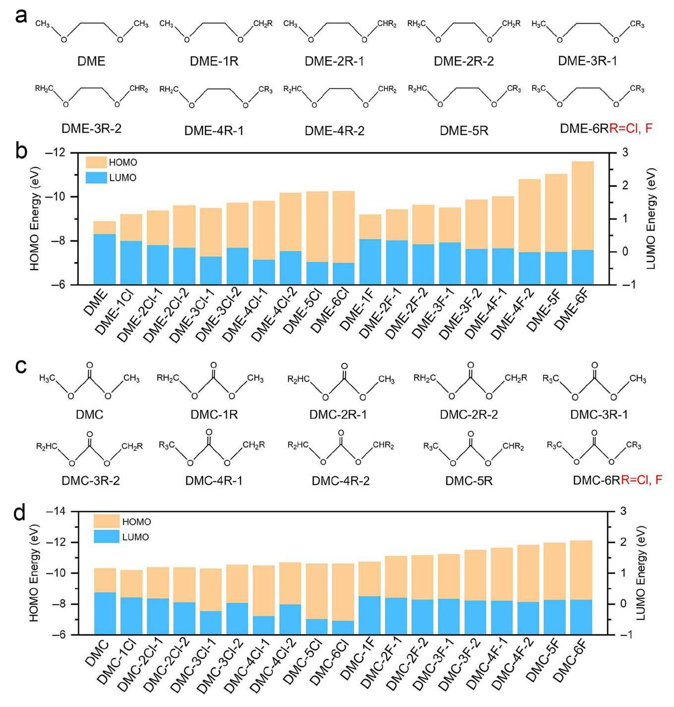
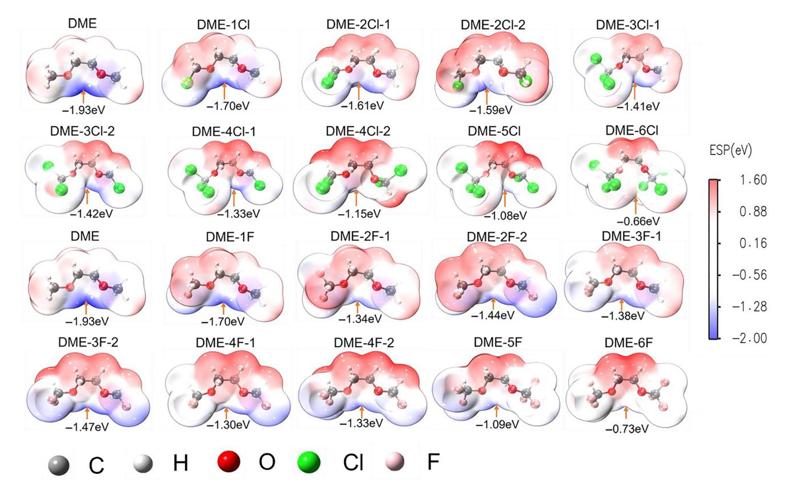
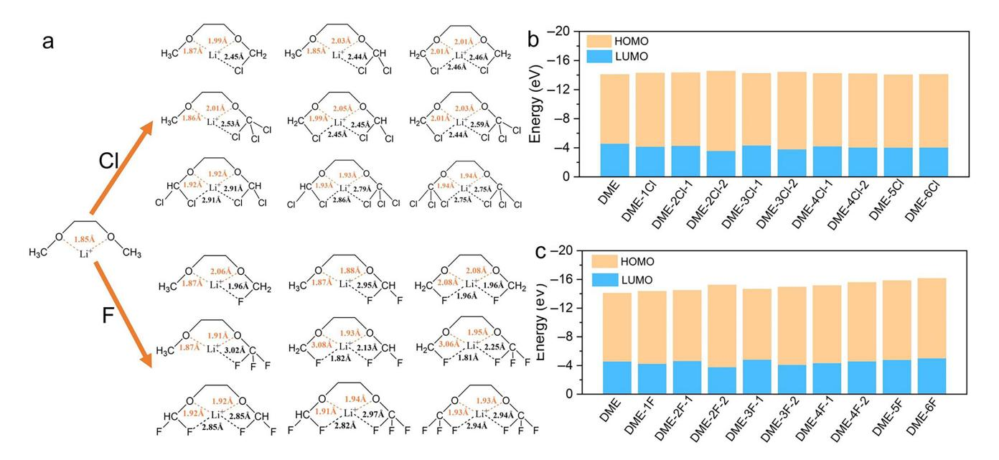
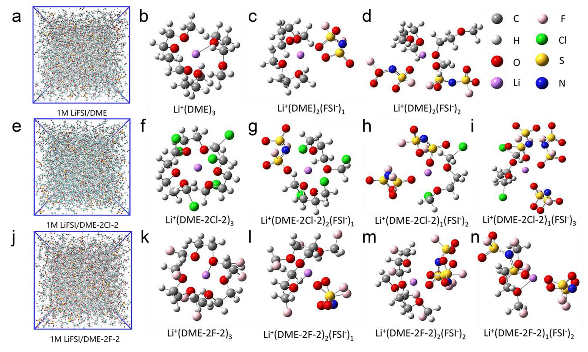
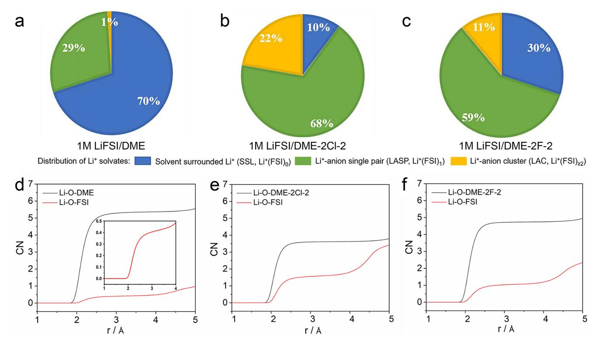

**RESEARCH ARTICLE**

# **Exploring Chlorinated Solvents as Electrolytes for Lithium Metal Batteries: A DFT and MD Study**

Zhe Li | Jingwei Zhang | Weiwei Xie | Qing Zhao

Frontiers Science Center for New Organic Matter, Haihe Laboratory of Sustainable Chemical Transformations, Key Laboratory of Advanced Energy Materials Chemistry (Ministry of Education), College of Chemistry, Nankai University, Tianjin, China

**Correspondence:** Weiwei Xie (xieweiwei@nankai.edu.cn) | Qing Zhao (zhaoq@nankai.edu.cn)

**Received:** 6 July 2024 | **Revised:** 15 October 2024 | **Accepted:** 21 October 2024

**Funding:** This work was supported by National Key R&D Program of China (2021YFB2500300), the Natural Science Foundation of Tianjin (No. 22JCZDJC00380), the National Natural Science Foundation of China (No. 52201259), and Young Elite Scientist Sponsorship Program by CAST.

**Keywords:** chlorinate solvents | electrolytes | first principles | lithium metal batteries | molecular dynamics

# **ABSTRACT**

Electrolytes with fluorinated solvents have been regarded as a promising strategy to stabilize high-voltage cathodes and the interphase of lithium anode in lithium metal batteries (LMBs). However, the rigorous synthesis approach and high cost have led to a demand for developing cost-effective solvents with suitable properties for LMBs. Herein, we explored the possibility of using chlorinate solvents as electrolytes using density functional theory (DFT) and classical molecular dynamics (MD) simulation. Taking ether (1,2-dimethoxyethane [DME], 1,3-dioxolane [DOL]), carbonate (dimethyl carbonate [DMC], and ethylene carbonate [EC]) as examples, we first compared the energy variation of the highest occupied molecular orbital (HOMO) and lowest unoccupied molecular orbital (LUMO) upon Cl and F substitution. In particular, we found that 1,2-bis(chloromethoxy)ethane (DME-2Cl-2) has the lowest HOMO and the highest LUMO level among the chlorinated DME after coordinating with Li+, enabling a potentially wide voltage stability. Further MD simulation reveals that lithium ions in DME-2Cl-2 has a weaker solvation coordination with solvents but stronger interaction with anions than DME and 1,2-bis(Fluoromethoxy)ethane (DME-2F-2), which is more beneficial for forming stable anion-derived solid electrolyte interphase (SEI). Our findings suggest that chlorinated solvents can be used as promising electrolytes for LMBs.

----------------------------------------------------------------------------------------------------------------------------------------------------------------------------------------------------------------------------------

Lithium ion batteries (LIBs), which have been widely applied to electric vehicles, portable devices, large-scale smart grids and so on, play an indispensable role in our lives. However, the energy density of commercialized LIBs has been approaching its theoretical limits [\[1–4\]](#page-6-0). In recent decades, lithium metal batteries (LMBs) have gained increasing attention due to their high theoretical energy density [\[5–8\]](#page-6-1). With the metal plating/stripping mechanism and lightweight characteristics, lithium metal exhibits a much higher capacity (3860 mAh/g, 2062 mAh/cm3) than graphite anode (372 mAh/g, 778 mAh/cm3) that operates under the mechanism of Li-ion intercalation/de-intercalation, indicating a higher volume and mass energy density of LMBs than LIBs [\[9–13\]](#page-6-2). However, one of the major challenges for LMBs is the high chemical/electrochemical reactivity of lithium metal, leading to the formation of unstable solid electrolyte interphase (SEI) on anode during battery operation [\[14\]](#page-6-3). The SEI is unable to accommodate the volume change during repeated Li plating/stripping [10, 15–17], resulting in its the cracking and regeneration. The continuous consumption of electrolyte and lithium, along with an increase in the resistance of the LMBs, leads to rapid capacity loss. Moreover, the inhomogeneity of SEI results in the nonuniform

© 2024 Wiley Periodicals LLC.

deposition of lithium and the formation of lithium dendrites that can cause short circuits of batteries and safety concern [15, 18, 19]. Therefore, designing a stable SEI is of utmost importance to address these aforementioned challenges faced by LMBs.

A stable SEI should possess electron-insulating and uniform ion-conducting properties. Electron insulation prevents further reactions between lithium and electrolytes, while uniform ion conductivity ensures the transport of Li-ion [\[20–22\]](#page-6-4). In addition, given the significant volume change during Li plating/stripping process, it is preferable to have a mechanically strong SEI with decent viscoelasticity to prevent dendrite growth and accommodate volume expansion/shrinkage [\[20, 22–24\]](#page-6-4). In general, the stability of Li-electrolyte interphase can be improved either through surface coating of the lithium anode with a stable artificial SEI layer or the optimization of electrolytes [\[15\]](#page-6-5). In comparison to artificial SEI, the electrolyte modification strategy constructs SEI during battery operation, which can self-heal through the cycling of batteries [\[15, 20, 25\]](#page-6-5). Recently, LiF has been found to be an effective inorganic SEI component that suppresses side reactions and dendrite growth of lithium, particularly when used in tandem with an elastic polymer component to accommodate volume changes [\[26, 27\]](#page-7-0). The electrolytes with fluorinated solvents and salts have been extensively studied in recent years. For example, Bao et al. designed a family of fluorinated-diethoxyethane type solvents to construct LiF-rich SEI, resulting in relatively flat lithium deposition morphology. In addition, they found that the fluorination also decreases the HOMO energy of the solvent and thus enhances the oxidation stability of electrolyte [\[28\]](#page-7-1).

In spite of the promising advantages of fluorinated solvents in terms of stable SEI film and high voltage stability, the cost of fluorinated solvents is relatively high [\[29, 30\]](#page-7-2), and the synthesis process usually involves the generation of HF and other highly toxic substances [\[31\]](#page-7-3). In addition, the Li-ion diffusion energy barrier through LiF is higher than other inorganic compounds such as Li2S and Li3N [\[32, 33\]](#page-7-4). As an element in the same family, Cl shares similar properties with F. For example, both LiF and LiCl have a high shear modulus (LiF: ∼48.6 GPa, LiCl: ∼19.6 GPa) and large band gap (LiF: ∼14.6 eV, LiCl: ∼9.8 eV) [\[34–36\]](#page-7-5). However, the synthesis of chlorinated solvents produces much fewer highly toxic substances and has a lower cost than fluorinated solvents. Moreover, the diffusion energy barrier of LiCl (∼0.08 eV/atom) is much lower than that of LiF (0.17 eV/atom), indicating faster Li-ion transport in LiCl-based SEI [\[37\]](#page-7-6). Finally, the performance of flame retardant of chlorinated solvents is superior than that of fluorinated solvents due to the weaker bond energy of C—Cl, which can release Cl● to capture active H●. To our best knowledge, there are few reports on the application of chlorinated solvents in LMBs. Ren et al. reported a localized highly concentrated electrolyte with a composition of lithium bisfluorosulfonimide (LiFSI), 1,2-bis(2-chloroethoxy)-ethyl ether and 1,1,2,2-tetrafluoroethyl-2,2,3,3-tetrafluoropropylethe (molar ratio of 1: 1.6: 3) for LMBs. In this work, the chloro-ether exhibits the nonflammable property and enhanced interfacial charge transfer kinetics with LiCl-rich SEI [\[38\]](#page-7-7). This pioneering work confirms the possibility of chlorinated solvents for LMBs and also triggers the interests for the systematic study of various types of chlorinated solvents.

In this work, we employed density functional theory (DFT) and molecular dynamics (MD) simulations to study the influence of chlorination on the oxidation stability and solvation structure of conventional ether and carbonate solvents. Taking dimethoxyethane (DME) and 1,3-dioxolane (DOL) as examples of ether solvents, and dimethyl carbonate (DMC) and ethylene carbonate (EC) as the examples of carbonate solvents, we compared the energies of HOMOs and LUMOs and solvation structures of chlorinated solvents with the fluorinated solvents. Our results demonstrate that chlorination can also lower the HOMO level of the solvent molecule but not as much as fluorination. When the solvent molecules were coordinated with Li+ to form ionic solvent complexes, the HOMO level was further decreased. Among the studied chlorinated solvents, we found that 1,2-bis(chloromethoxy)ethane (DME-2Cl-2) has the lowest HOMO level and the highest LUMO level. Moreover, our MD simulation reveals that Cl-substitution is more favorable for the formation of anion-derived SEI due to its weaker solvation ability compared to F-substitution. In 1M LiFSI/DME-2Cl-2 electrolyte, Li+-anion single pair and Li+-anion cluster occupies 90% of all Li-ion solvation structures, which was much higher than 1,2-bis(fluoromethoxy)ethane (DME-2F-2, 70%) and DME (30%). Our findings suggest that low-cost chlorinated electrolytes are promising for constructing high-voltage LMBs with improved interfacial stability.

Redox potentials are often used to measure the electrochemical window of electrolytes [\[39\]](#page-7-8). Many studies have shown that the oxidation/reduction potentials have a positive correlation with the energies of HOMO/LUMO of solvent molecules [\[40–42\]](#page-7-9). In this work, we selected DME, DOL, DMC, and EC as prototype solvents and compared the HOMO and LUMO energies of F-/Cl-substituted solvents to study the impact of halogen substitution on electrochemical stability of the solvents through M062X method. As shown in Figure [1a,b,](#page-2-0) Figures [S1](#page-7-10) and [S2;](#page-7-10) Tables [S1](#page-7-10) and [S2,](#page-7-10) the introduction of fluorine and chlorine can significantly lower the HOMO energy of DME. In this work, we only study the halogen substitution on the methyl positions of DME as the substitution on methylene (—CH2— ) positions may largely influence the solvation stability of electrolyte [\[28\]](#page-7-1). As expected, F-derivatives show lower HOMO energies than those of Cl-derivatives due to the higher electronegativity of fluorine. This indicates that Cl-derivatives may more prone to losing electrons than F-derivatives. Note that the HOMO energy of the molecule decreases with an increase in halogen substitution number. For the isomers with the same number of halogen atoms but different position of substitution, the symmetrically distributed halogen-substituted solvents show the lower HOMO energy, for example, DME-2R-2 < DME-2R-1, DME-3R-2 < DME-3R-1, DME-4R-2 < DME-4R-1 (R: F and Cl).

Moreover, due to the electron-withdrawing effect of halogen atoms, the LUMO energy is also reduced after the introduction of chlorine and fluorine. The electron density contributions of Cl/F to the LUMOs are shown in Tables [S3](#page-7-10) and [S4.](#page-7-10) It is found that more electron density of LUMO is distributed on chlorine atoms with the increasing number of chlorines, while the number of fluorine atoms has minor impact on the electron density of fluorine atoms. Note that LUMO strongly relates to the reduction stability of electrolytes and have a significant impact on the formation of the SEI. More electron density distributed on chlorine atoms

**FIGURE 1** | (a, c) Molecular structures and (b, d) HOMO and LUMO energies of F- and Cl-substituted DME and DMC.

than fluorine atoms indicates that the C—Cl bond is easier to be broken than the C—F bond, resulting in a higher likelihood of forming a stable SEI. The reduced energies of HOMO and LUMO upon the substitution of fluorine and chlorine can also be found for cyclic ether molecules, for example, DOL (Tables [S5](#page-7-10) and [S6\)](#page-7-10).

In contrast to ether-based solvents, the HOMO energy of Cl/F substitution on carbonate solvents (DMC and EC, Figures [S3](#page-7-10) and [S4;](#page-7-10) Tables [S7–S10\)](#page-7-10) is less affected, which may be caused by stable carbon–oxygen double bond. Among all Cl-derivatives, DMC-4Cl-2 exhibits the lowest HOMO energy of −10.68 eV, a value that is 0.38 eV lower than DMC (Figure [1c,d,](#page-2-0) Table [S7\)](#page-7-10). For F-derivatives, DMC-6F shows the lowest HOMO energy of −12.09 eV. Comparing the HOMO shapes of chlorinated and fluorinated DMC (Figures [S3](#page-7-10) and [S4\)](#page-7-10), we find that the electron density localized on the carbon and oxygen atoms of the C=O bond shifts to the Cl atom upon Cl substitution, while F substitution causes minor changes in the electron density of the C=O bond. In comparison with F-substitution, the decrease in LUMO energy of DMC by chlorine substitution is more significant than fluorine substitution, indicating more preferred reduction of Cl-substituted DMC toward lithium anode. As a cyclic carbonate molecule, EC exhibits similar properties with DMC (Tables [S9](#page-7-10) and [S10\)](#page-7-10).

**FIGURE 2** | ESP of F- and Cl-substituted DME. The most negative ESP values are marked.

To examine the accuracy of the M062X method in the calculation of frontier orbitals, we benchmark the M062X method against the MP2 method (Figure [S5\)](#page-7-10). The trend upon the substitution of a Cl atom can be reasonably reproduced, which confirms the validity of the DFT method for electronic-structure calculations. Furthermore, to confirm the positive correlation between orbital energy level and oxidation potential, we also calculated the oxidation potentials using oxidation-free energy in solution with DME and DMC before and after the substitution of a Cl atom as examples. As shown in Figure [S6,](#page-7-10) a lower HOMO energy level correlates with a higher oxidation potential. The lower HOMO energy level indicates the higher stability of molecule, which requires more energy to extract an electron from molecule, resulting in a higher oxidation potential. In particular, the calculated oxidation potential of DME-1Cl is about 5.8 V. In addition, according to the electrostatic potential (ESP) plots, Cl is not the preferred site for oxidation reaction, which reduces the concerns of Cl2 corrosion due to the decomposition of solvent.

In order to study the coordination between solvent and Li-ion, we first determine the coordination site by calculating the ESP, which is widely applied to predict the active site for nucleophilic or electrophilic reactions [\[43–45\]](#page-7-11). The site with most negative ESP is the most favorable place to coordinate with Li-ion. As shown in Figure [2,](#page-3-0) the most negative ESP for DME and halogen-substituted DME is located approximately in the middle of the two oxygen atoms. It is thus speculated that Li+ is likely to coordinate with the two oxygen atoms. With the increase of the number of chlorine or fluorine, the electron density on the oxygen atoms decreases, indicating a weakening of molecular binding ability of Li+. In contrast, the most negative ESP for DMC and the corresponding F- and Cl-derivatives are mainly concentrated on the carbonyl oxygen and thus the lithium ion prefers to coordinate with carbonyl group. With the increase of the number of halogen atoms, the electron density changes in the similar way as DME (Figure [S7\)](#page-7-10).

The Li-solvent coordination structures and the distances of Li-O and Li-X (X = Cl, F) are further studied to evaluate the stability of Li+-solvates. As shown in Figure [3a,](#page-4-0) the Li-O bond length overall increases upon F/Cl substitution. Figure [3b,c](#page-4-0) demonstrate that after coordination with Li+, the HOMO and LUMO energies of all studied solvents are reduced, indicating an increase in oxidation activity and a decrease in reduction activity (The values are shown in Tables [S11–S14\)](#page-7-10). In particular, DME-2Cl-2 has the lowest HOMO energy and the highest LUMO energy among all chlorinated ion-solvent complexes. We also calculated the binding energy between a solvent molecule and Li+. The results demonstrate that the absolute value of binding energy between DME-2Cl-2 and Li+ is the lowest (Table [S15\)](#page-7-10), further confirming its weakest solvation ability in all chlorinated solvents. It is worth mentioned that DMC-2Cl-2 also exhibits the lowest absolute value of binding energy among the Cl-derivatives (Table [S16\)](#page-7-10). In addition, the binding energies calculated by MP2 show the same trend (Figure [S8\)](#page-7-10), confirming the validity of M062X in the calculations of Li-ion binding energy.

As DME-2Cl-2 solvent exhibits both the highest LUMO energy and lowest HOMO energy after coordination with Li+, we selected DME-2Cl-2 and performed MD simulation to study

**FIGURE 3** | (a) Structures of Li-ion coordinated with F-/Cl- substituted DME. (b) HOMO and LUMO energies of Cl-derivatives for DME. (c) HOMO and LUMO energies of F-derivatives for DME.

Li-ion solvation structures in 1 M LiFSI/DME-2Cl-2 electrolyte. The simulations for 1 M LiFSI/DME and 1 M LiFSI/DME-2F-2 were also performed for comparison. Dielectric constant is firstly calculated to estimate the solvation ability [46]. The dielectric constants of selected solvents are 3.01, 9.34, and 6.59 for DME. DME-2CL-2, and DME-2F-2, respectively. It can be found that halogen substitution can increase the dielectric constant of solvent molecules. As shown in Figure 4, 1 M LiFSI/DME mainly exhibits three solvation structures, one of which involves Li+ coordinated with three DME molecules (six-fold coordination) (Figure 4b), while the second structure involves Li+ coordinated with two DME molecules and one FSI-ion (Figure  $4c$ ). The third structure involves Li+ coordinated with two DME molecules and two FSI-ion (Figure 4d). For 1 M LiFSI/DME-2Cl-2 and 1 M LiFSI/DME-2F-2, there are primarily four solvation structures, two of which are similar and involve Li+ coordinated with three solvent molecules (Figure  $4f,k$ ), Li+ coordinated with two solvent molecules and one FSI- ion (Figure 4g,l). The third solvation structure for DME-2Cl-2 is Li+ coordinated with one solvent molecule and two FSI-ion (Figure 4h), and for DME-2F-2 it involves Li+ coordinated with two solvent molecule and two FSI- ion (Figure 4m). The fourth solvation structure for DME-2Cl-2 is Li+ coordinated with one solvent molecule and three FSIion (Figure 4i), and for DME-2F-2, it involves Li+ coordinated with one solvent molecule and two FSI $-$  ion (Figure 4n). These results indicate that Li+ prefers to coordinate with anions in chlorinated solvents than that in fluorinated solvents. It should be noticed that the anion-coordinated clusters in electrolytes also slow down the ion transport. As calculated using the Nernst-Einstein equation, the ion conductivities are 14.76, 1.66, and 3.10 mS/cm for 1 M LiFSI/DME, 1 M LiFSI/DME-2Cl-2, and 1 M LiFSI/DME-2F-2, respectively (Figures S9-S11). In practical application, a compromise should be considered between ion transport and SEI stability.

We further classify the  $Li^+$  solvation structures into three types: Li+ only coordinated with solvent-solvent surrounded Li+ (SSL,

 $Li^+(solvent)_n$ , one anion coordinated with  $Li^+$ - $Li^+$ -anion single pair (LASP,  $Li^+(solvent)_n$  (FSI)1), and more anions coordinated with Li+-Li+-anion cluster (LAC, Li+(FSI)n( $n \ge 2$ )) [28]. Figure  $5a-c$  shows the percentages of four types of solvation structures for three electrolytes. The SSL is the major Li+ solvation structure in LiFSI/DME electrolytes, accounting for 70%. However, after F- and Cl-substitution, the SSL is significantly reduced, accounting for only 30% and 10% in 1M LiFSI/DME-2F-2 and 1 M LiFSI/DME-2Cl-2, respectively. In contrast, the contributions of the LASP and LAC increase dramatically upon halogen substitution. The Li-ion coordination numbers of the electrolytes also support this observation (Figure  $5d-f$ , Figure S12). The coordination numbers of Li+ and oxygen atoms are about 5.4, 4.7, and 3.6 for DME, DME-2F-2, and DME-2Cl-2 electrolytes, respectively. Correspondingly, the coordination numbers between  $Li^+$  and the oxygen atoms of FSI- in DME, DME-2F-2, and DME-2Cl-2 electrolytes are about 0.4, 1.0 and 1.6, respectively. Therefore, Li ion has weaker solvation coordination with solvents but stronger interaction with anions in LiFSI/DME-2Cl-2 compared to LiFSI/DME and LiFSI/DME-2F-2 electrolytes. This is consistent with the binding energy discussed above. The presence of more FSI-ions in solvated structures is reported to be beneficial for the formation of stable anion-derived SEI (For example, LiF) [47]. In addition to the effect of solvated anions, the coordination with DME-2Cl-2 can lead to the formation of LiCl in the SEI, which has been reported to largely increase the kinetics of lithium stripping/plating process, supporting the cycling of LMBs under high current density [48]. Moreover, the LiCl and LiF-enriched SEI was also reported to show a high Li Coulombic efficiency up to 99.2% [38]. In addition, the electron electrically insulated LiF is supposed to suppress the excessive side reaction between solvent and Li metal with controlled amount of LiCl, as the increased thickness of LiCl inevitably hinders the transport of Li-ion transport through SEI.

Therefore, based on DFT and MD simulation, it is suggested that DME-2Cl-2 is endowed with high voltage stability, the formation

**FIGURE 4** | MD simulation snapshots of 1 M LiFSI with (a) DME, (e) DME-2Cl-2 and (j) DME-2F-2 solvent. The representative solvation structures of 1 M LiFSI in (b–d) DME, (f–i) DME-2Cl-2 and (k–n) DME-2F-2.

**FIGURE 5** | Distributions of (a–c) Li+ solvation structures and (d– f) coordination numbers in (a, d) 1 M LiFSI/DME, (b, e) 1 M LiFSI/DME-2Cl-2, and (c, f) 1 M LiFSI/DME-2F-2 electrolytes.

of stable LiF/LiCl mixed SEI with fast Li-ion transport, and low desolvation energy with fast kinetic, which makes it a promising electrolyte solvent for high-voltage LMBs. More detailed information on chlorinated solvents-based electrolytes may be obtained by applying more accurate approach [\[49\]](#page-7-15). Although DME-2Cl-2 is not commercially available, it was prepared through the interaction of boron trichloride with dioxane, according to the literature [\[50\]](#page-7-16). In addition, chlorinated solvents are obtaining increasing attentions. For example, dichloroethane was recently used as electrolyte diluent for high-voltage Li metal batteries [\[51\]](#page-7-17). Therefore, DME-2Cl-2 can be anticipated as a promising electrolyte solvent for LMBs.

In summary, a series of Cl and F-substituted ether and carbonate solvents have been studied by DFT and MD simulations to evaluate their potential as electrolyte solvents for lithium metal batteries. In comparison to DME, the introduction of chlorine in DME can effectively improve the high voltage stability by reducing the HOMO energy, in which DME-2Cl-2 exhibits the lowest HOMO energy and the highest LUMO energy among all chlorinated ion-solvent complexes. MD simulations show that the DME-2Cl-2 electrolyte has a higher ratio of Li+-anion clusters in solvation structures compared to the DME-2F-2 electrolyte, indicating a more favorable formation of anion-derived SEI. In practical application, the oxidation stability with potential corrosiveness of Cl substitution, as well as degradation issues in environment, needs to be carefully confirmed as the oxidation/reduction potential can be further affected by the state of aggregation and the surface of electrode. Our findings suggest that chlorinated solvents may have promising high-voltage resistance and enable the formation of stable SEI, which could encourage their further applications in rechargeable metal batteries.

#### **Acknowledgments**

This work was supported by the National Key R&D Program of China (2021YFB2500300), the Natural Science Foundation of Tianjin (No. 22JCZDJC00380), the National Natural Science Foundation of China (No. 52201259), and Young Elite Scientist Sponsorship Program by CAST.

#### **Data Availability Statement**

The data that support the findings of this study are available from the corresponding author upon reasonable request.

## **References**

1. M. Armand and J.-M. Tarascon, "Building Better Batteries," *Nature* 451 (2008): 652–657.

2. M. R. Palacin and A. de Guibert, "Why Do Batteries Fail?," *Science* 351 (2016): 1253292.

3. X. Chen, H. R. Li, X. Shen, and Q. Zhang, "The Origin of the Reduced Reductive Stability of Ion–Solvent Complexes on Alkali and Alkaline Earth Metal Anodes," *Angewandte Chemie, International Edition* 57 (2018): 16643–16647.

4. X. Liu, J. Zhang, Y. Yang, et al., "Acetal as a Class of Co-Intercalation-Free Electrolytes for Lithium-Ion Batteries," *Cell Reports Physical Science* 5 (2024): 10193.

5. X. B. Cheng, R. Zhang, C. Z. Zhao, and Q. Zhang, "Toward Safe Lithium Metal Anode in Rechargeable Batteries: A Review," *Chemical Reviews* 117 (2017): 10403–10473.

6. M. Y. Ovchinnikov, E. V. Kuzmina, E. V. Karaseva, S. L. Khursan, and V. S. Kolosnitsyn, "Density Functional Theory Model ofLi–Selectrochemical System With Explicit Solvation of Lithium Polysulfides by Sulfolane," *International Journal of Quantum Chemistry* 122 (2022): e26985.

7. X. Li, R. Zhao, Y. Fu, and A. Manthiram, "Nitrate Additives for Lithium Batteries: Mechanisms, Applications, and Prospects," *eScience* 1 (2021): 108–123.

8. Y. Jie, X. Liu, Z. Lei, et al., "Enabling High-Voltage Lithium Metal Batteries by Manipulating Solvation Structure in Ester Electrolyte," *Angewandte Chemie, International Edition* 59 (2020): 3505–3510.

9. L. Q. Wu, Z. Li, Y. Lu, et al., "Hexacyclic Chelated Lithium Stable Solvates for Highly Reversible Cycling of High-Voltage Lithium Metal Battery," *ChemSusChem* 16 (2023): e202300590.

10. D. Lin, Y. Liu, and Y. Cui, "Reviving the Lithium Metal Anode for High-Energy Batteries," *Nature Nanotechnology* 12 (2017): 194–206.

11. J. Liu, Z. Bao, Y. Cui, et al., "Pathways for Practical High-Energy Long-Cycling Lithium Metal Batteries," *Nature Energy* 4 (2019): 180–186.

12. P. Ma, P. Mirmira, and C. V. Amanchukwu, "Effect of Building Block Connectivity and Ion Solvation on Electrochemical Stability and Ionic Conductivity in Novel Fluoroether Electrolytes," *ACS Central Science* 7 (2021): 1232–1244.

13. X. Q. Zhang, X. Chen, X. B. Cheng, et al., "Highly Stable Lithium Metal Batteries Enabled by Regulating the Solvation of Lithium Ions in Nonaqueous Electrolytes," *Angewandte Chemie, International Edition* 57 (2018): 5301–5305.

14. W. Cao, Q. Li, X. Yu, and H. Li, "Controlling Li Deposition Below the Interface," *eScience* 2 (2022): 47–78.

15. Z. A. Ghazi, Z. Sun, C. Sun, et al., "Key Aspects of Lithium Metal Anodes for Lithium Metal Batteries," *Small* 15 (2019): e1900687.

16. C. Yang, K. Fu, Y. Zhang, et al., "Tungsten Disulfide Monolayers: Graphene-Assisted Antioxidation of Tungsten Disulfide Monolayers: Substrate and Electric-Field Effect," *Advanced Materials* 29 (2017): 1603898.

17. C. Miao, S. Qi, K. Liang, et al., "Diethyl Phenylphosphonite Contributing to Solid Electrolyte Interphase and Cathode Electrolyte Interphase for Lithium Metal Batteries," *Journal of Energy Chemistry* 63 (2021): 566–573.

18. S. S. Zhang, "A Review on Electrolyte Additives for Lithium-Ion Batteries," *Journal of Power Sources* 162 (2006): 1379–1394.

19. Y. Wang, J. Wang, J. Nai, J. Luo, X. Tao, and Y. Liu, "Mechanistic Insights Into the Processes of the Initial Stage of Electrolyte Degradation in Lithium Metal Batteries," *Chinese Chemical Letters* 35 (2024): 108510.

20. S. Li, M. Jiang, Y. Xie, et al., "Developing High-Performance Lithium Metal Anode in Liquid Electrolytes: Challenges and Progress," *Advanced Materials* 30 (2018): e1706375.

21. E. Peled and H. Straze, "The Kinetics of the Magnesium Electrode in Thionyl Chloride Solutions," *Journal of the Electrochemical Society* 124 (1977): 1030–1035.

22. P. Zhai, L. Liu, X. Gu, T. Wang, and Y. Gong, "Interface Engineering for Lithium Metal Anodes in Liquid Electrolyte," *Advanced Energy Materials* 10 (2020): 2001257.

23. R. Koerver, W. Zhang, L. de Biasi, et al., "Chemo-Mechanical Expansion of Lithium Electrode Materials – On the Route to Mechanically Optimized All-Solid-State Batteries," *Energy & Environmental Science* 11 (2018): 2142–2158.

24. X. Shen, X. Cheng, P. Shi, et al., "Lithium–Matrix Composite Anode Protected by a Solid Electrolyte Layer for Stable Lithium Metal Batteries," *Journal of Energy Chemistry* 37 (2019): 29–34.

25. L. Q. Wu, Z. Li, Z. Y. Fan, et al., "Unveiling the Role of Fluorination in Hexacyclic Coordinated Ether Electrolytes for High-Voltage Lithium Metal Batteries," *Journal of the American Chemical Society* 146 (2024): 5964–5976.

26. S. Liu, X. Ji, N. Piao, et al., "An Inorganic-Rich Solid Electrolyte Interphase for Advanced Lithium-Metal Batteries in Carbonate Electrolytes," *Angewandte Chemie, International Edition* 60 (2021): 3661–3671.

27. X. Wang, Y. Tan, G. Shen, and S. Zhang, "Recent Progress in Fluorinated Electrolytes for Improving the Performance of Li–S Batteries," *Journal of Energy Chemistry* 41 (2020): 149–170.

28. Z. Yu, P. E. Rudnicki, Z. Zhang, et al., "Rational Solvent Molecule Tuning for High-Performance Lithium Metal Battery Electrolytes," *Nature Energy* 7 (2022): 94–106.

29. R. Narayan and R. Dominko, "Fluorinated Solvents for Better Batteries," *Nature Reviews Chemistry* 6 (2022): 449–450.

30. Y. Zhao, T. Zhou, T. Ashirov, et al., "Fluorinated Ether Electrolyte With Controlled Solvation Structure for High Voltage Lithium Metal Batteries," *Nature Communications* 13 (2022): 2575.

31. H. F. Motiwala, A. M. Armaly, J. G. Cacioppo, et al., "HFIP in Organic Synthesis," *Chemical Reviews* 122 (2022): 12544–12747.

32. J. Yu, K. Shi, S. Zhang, et al., "A Lithium Nucleation-Diffusion-Growth Mechanism to Govern the Horizontal Deposition of Lithium Metal Anode," *Science China Materials* 64 (2021): 2409–2420.

33. S. Lorger, K. Narita, R. Usiskin, and J. Maier, "Enhanced Ion Transport in Li2O and Li2S Films," *Chemical Communications* 57 (2021): 6503–6506.

34. J. Tan, J. Matz, P. Dong, et al., "A Growing Appreciation for the Role of LiF in the Solid Electrolyte Interphase," *Advanced Energy Materials* 11 (2021): 2100046.

35. D. Zeng, J. Yao, L. Zhang, et al., "Promoting Favorable Interfacial Properties in Lithium-Based Batteries Using Chlorine-Rich Sulfide Inorganic Solid-State Electrolytes," *Nature Communications* 13 (2022): 1909.

36. Q. Zhao, S. Stalin, and L. A. Archer, "Stabilizing Metal Battery Anodes Through the Design of Solid Electrolyte Interphases," *Joule* 5 (2021): 1119–1142.

37. S. Choudhury, S. Wei, Y. Ozhabes, et al., "Designing Solid-Liquid Interphases for Sodium Batteries," *Nature Communications* 8 (2017): 898.

38. L. Tan, S. Chen, Y. Chen, et al., "Intrinsic Nonflammable Ether Electrolytes for Ultrahigh-Voltage Lithium Metal Batteries Enabled by Chlorine Functionality," *Angewandte Chemie, International Edition* 61 (2022): e202203693.

39. J. B. Goodenough and K. S. Park, "The Li-Ion Rechargeable Battery: A Perspective," *Journal of the American Chemical Society* 135 (2013): 1167–1176.

40. W. Ding, X. Lei, and C. Ouyang, "Coordination of Lithium Ion With Ethylene Carbonate Electrolyte Solvent: A Computational Study," *International Journal of Quantum Chemistry* 116 (2015): 97–102.

41. C.-C. Su, M. He, R. Redfern, et al., "Oxidatively Stable Fluorinated Sulfone Electrolytes for High Voltage High Energy Lithium-Ion Batteries," *Energy & Environmental Science* 10 (2017): 900–904.

42. J. Wang, Y. Mai, H. Luo, X. Yan, and L. Zhang, "Fluorosilane Compounds With Oligo(Ethylene Oxide) Substituent as Safe Electrolyte Solvents for High-Voltage Lithium-Ion Batteries," *Journal of Power Sources* 334 (2016): 58–64.

43. Q. Zhao, W. Huang, Z. Luo, et al., "High-Capacity Aqueous Zinc Batteries Using Sustainable Quinone Electrodes," *Science Advances* 4 (2018): eaao1761.

44. J. Liu, L. Miao, L. Li, et al., "Molecular Electrostatic Potential: A New Tool to Predict the Lithiation Process of Organic Battery Materials," *Journal of Physical Chemistry Letters* 9 (2018): 3573–3579.

45. G. Zhang, J. Chang, L. Wang, et al., "A Monofluoride Ether-Based Electrolyte Solution for Fast-Charging and Low-Temperature Non-aqueous Lithium Metal Batteries," *Nature Communications* 14 (2023): 1081.

46. Y.-X. Yao, X. Chen, C. Yan, et al., "Regulating Interfacial Chemistry in Lithium-Ion Batteries by a Weakly Solvating Electrolyte\*\*," *Angewandte Chemie, International Edition* 60 (2020): 4090–4097.

47. S. Zhu and J. Chen, "Dual Strategy With Li-Ion Solvation and Solid Electrolyte Interphase for High Coulombic Efficiency of Lithium Metal Anode," *Energy Storage Materials* 44 (2022): 48–56.

48. Q. Zhao, Z. Tu, S. Wei, et al., "Building Organic/Inorganic Hybrid Interphases for Fast Interfacial Transport in Rechargeable Metal Batteries," *Angewandte Chemie, International Edition* 57 (2018): 992–996.

49. D. Wang, T. He, A. Wang, et al., "A Thermodynamic Cycle-Based Electrochemical Windows Database of 308 Electrolyte Solvents for Rechargeable Batteries," *Advanced Functional Materials* 33 (2023): 2212342.

50. B. A. J. Burn, J. I. G. Cadogan, and H. N. Moulden, "Notes," *Journal of the Chemical Society* (1961): 5542–5544.

51. B. Ma, H. Zhang, R. Li, et al., "Molecular-Docking Electrolytes Enable High-Voltage Lithium Battery Chemistries," *Nature Chemistry* 16 (2024): 1427–1435.

### **Supporting Information**

Additional supporting information can be found online in the Supporting Information section.