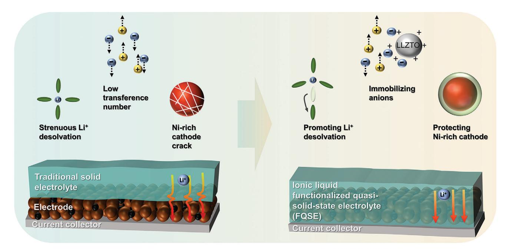
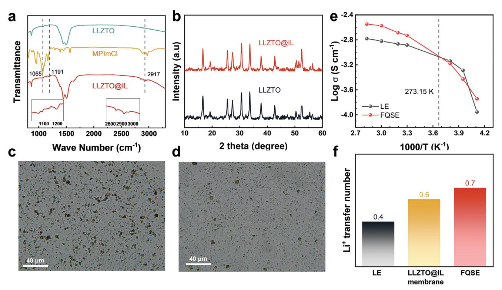
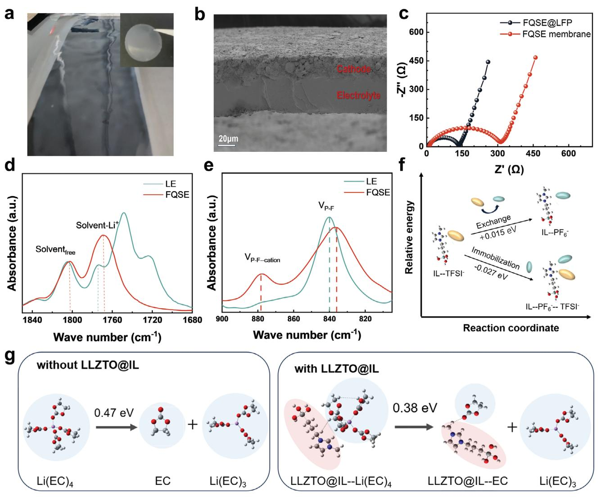
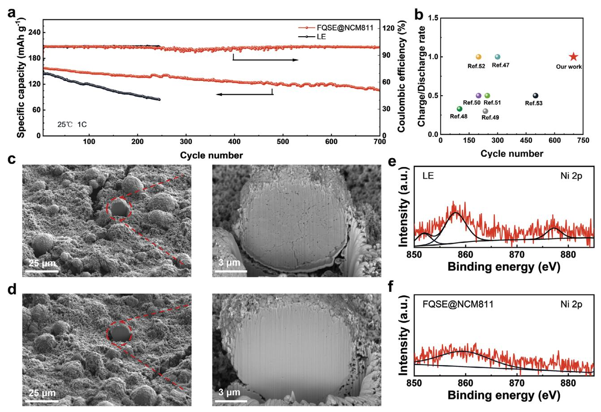
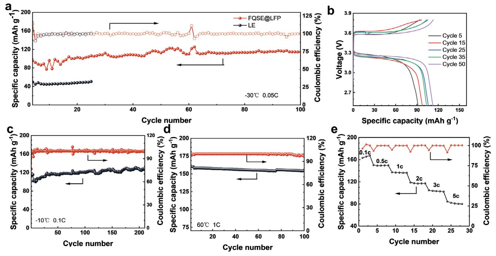
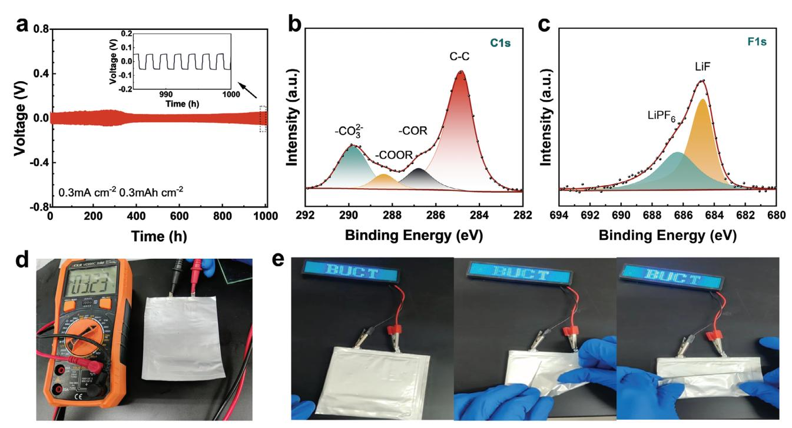

# **Wide-Temperature and High-Rate Operation of Lithium Metal Batteries Enabled by an Ionic Liquid Functionalized Quasi-Solid-State Electrolyte**

*Yonghui Deng, Shunshun Zhao, Yong Chen, Shuang Wan, and Shimou Chen\**

**The development of high-energy-density solid-state lithium metal battery has been hindered by the unstable cycling of Ni-rich cathodes at high rate and limited wide-temperatures adoptability. In this study, an ionic liquid functionalized quasi-solid-state electrolyte (FQSE) is prepared to address these challenges. The FQSE features a semi-immobilized ionic liquid capable of anchoring solvent molecules through electrostatic interactions, which facilitates Li<sup>+</sup> desolvation and reduces deleterious solvent-cathode reactions. The FQSE exhibits impressive electrochemical characteristics, including high ionic conductivity (1.9 mS cm<sup>−</sup><sup>1</sup> at 30 °C and 0.2 mS cm<sup>−</sup><sup>1</sup> at -30 °C) and a Li<sup>+</sup> transfer number of 0.7. Consequently, Li/NCM811 cells incorporating FQSE demonstrate exceptional stability during high-rate cycling, enduring 700 cycles at 1 C. Notably, the Li/LFP cells with FQSE maintain high capacity across a wide temperature range, from -30 to 60 °C. This research provides a new way to promote the practical application of high-energy lithium metal batteries.**

#### **1. Introduction**

Rechargeable lithium-ion batteries are gaining traction due to the growing demand for portable electronics and electric vehicles, as well as increasing environmental awareness.[\[1\]](#page-8-0) Lithium metal has become a preferred anode alternative to graphite, due to its superior theoretical specific capacity (3860 mAh g<sup>−</sup>1) and lowest redox potential (−3.040 V *vs*. standard hydrogen electrode).[\[2,3\]](#page-8-0) Moreover, lithium metal batteries, when paired with solid-state electrolytes and Ni-rich cathodes, are considered to be a promising next-generation battery technology with high energy density and safety.[\[4\]](#page-8-0) However, they still face a number of challenges, including poor performance at room and low

```
Y. Deng, S. Zhao, S. Wan, S. Chen
State Key Laboratory of Chemical Resource Engineering
Beijing Key Laboratory of Electrochemical Process and
Technology of Materials
Beijing University of Chemical Technology
Beijing 100029, P. R. China
E-mail: chensm@buct.edu.cn
Y. Chen
UTS School of Mathematical and Physical Sciences
University of Technology Sydney
Sydney, NSW 2007, Australia
```
The ORCID identification number(s) for the author(s) of this article can be found under <https://doi.org/10.1002/smll.202310534>

**DOI: 10.1002/smll.202310534**

temperature, unstable cycling of the Ni-rich cathodes and potential security risks due to Li dendrite growth, etc.[\[5–7\]](#page-8-0)

The limited low-temperature performance of solid-state Li-metal batteries mainly due to slow ion transport both in the electrolyte bulk and at the electrolyte/electrode interfaces.[\[8,9\]](#page-8-0) Improving the electrochemical properties of solid-state electrolyte, including its ionic conductivity and Li<sup>+</sup> transfer number, is crucial for better battery performance. Various approaches have been employed to improve these properties, such as quasi-solidstate electrolytes,[\[10\]](#page-8-0) LLTO-base composite polymer electrolytes,[\[11,12\]](#page-8-0) and single-ion conducting electrolytes.[\[13\]](#page-8-0) A successful strategy is the incorporation of inorganic fillers into the polymer matrix, which not only reduces the crystallinity of the polymer matrix but also creates new ion migration

channels.[\[14,15\]](#page-8-0) However, the performance of state-of-the-art solidstate electrolytes is still insufficient for wide-temperature applications, especially below −30 °C. It's worth noting that replacing liquid electrolyte with solid electrolyte alters the interface contact from a permeable solid-liquid interface to a rigid solid-solid interface. This causes a higher interfacial impedance and obstacles ion transport, even with flexible polymer electrolytes.[\[16–18\]](#page-8-0) To address the interface problems of solid-state electrolyte, the in-situ preparation is regarded as an effective measure.[\[19\]](#page-8-0) This method includes the following two ways: 1) converting liquid electrolyte to polymer electrolyte inside the cell, and the precursor solutions consist of polymerizable monomers with unsaturated functional groups, such as 1,3-dioxolane,[\[20–22\]](#page-8-0) Vinylene Carbonate.[\[23\]](#page-8-0) 2) casting the electrolyte precursor directly onto the cathode surface and then form a solid electrolyte, including polymer electrolyte,[\[16,24\]](#page-8-0) inorganic electrolyte.[\[25\]](#page-8-0) So fast ion transport in the electrolyte bulk phase and at the electrolyte/electrode interface is crucial for achieving high-rate operation of solid-state batteries.

The use of high-voltage Ni-rich cathodes (LiNixMnyCo1-x-yO2, where x *>* 0.6) is an effective approach to increasing the energy density of lithium metal batteries. However, the practical applications of NCM811 cathodes are hampered by intergranular cracking, transition metal dissolution and structural phase transition, which are usually induced by detrimental reactions with electrolyte.[\[26,27,28\]](#page-8-0) So inhibiting side reactions is crucial to




**Scheme 1.** Schematic illustration of the advantages of FQSE.

enhancing the cycling stability of Ni-rich cathodes.[\[29\]](#page-8-0) Besides, polyethylene oxide (PEO) is widely used for polymer electrolyte due to its good compatibility with lithium anode, but unsuitable for high-voltage cathodes due to the oxidative decomposition potential of EO functional group is below 4.0 V,[\[30\]](#page-8-0) to solve this problem. Poly(vinylidene fluoride-co-hexafluoropropylene) (PVDF-HFP) was employed due to its high dielectric constant, wide electrochemical window and favorable mechanical strength.[\[31\]](#page-8-0)

In this study, we prepared an ionic liquid functional quasisolid-state electrolyte (FQSE) by incorporating ionic liquidgrafted Li6.4La3Zr1.4Ta0.6O12 (LLZTO) into poly(vinylidene fluoride-co-hexafluoropropylene) (PVDF-HFP) polymer matrix. The integration of electrolyte and cathode was prepared to reduce the interface impedance. The FQSE can effectively promote Li<sup>+</sup> desolvation and suppressed the deleterious reactions between Ni-rich cathodes and solvent, exhibiting superior electrochemical properties. These advantages of the FQSE are conceptually illustrated in **Scheme 1**. When applied to Li/NCM811 cells, the FQSE enables stable cycling for up to 700 cycles, maintaining 70% capacity retention at 1 C. Benefiting from fast ion transport in the electrolyte bulk and at the interface, the Li/LFP cell operates efficiently over a wide temperature range of −30 to 60 °C.

## **2. Results and Discussion**

The detailed preparation process of grafting ionic liquid (1-(Propyltriethoxyl)−3-methylimidazolium bis(trifluoromethane)sulfonimide, IL) onto LLZTO is elucidated in the experimental section and Figure S1 (Supporting Information). Fourier transform infrared spectroscopy (FT-IR) was conducted to testify the chemical bonding and structural information of LLZTO, MPImCl (1-(Propyltriethoxyl)−3-methylimidazolium chloride) and ionic liquid-grafted LLZTO (LLZTO@IL) (**Figure [1a](#page-2-0)**). The absorption bands at 1062 and 1191 cm<sup>−</sup><sup>1</sup> correspond to -O-Si-Cand Si-alkyl groups, respectively, while the peak at 2917 cm<sup>−</sup><sup>1</sup> is attributed to C-H stretching.[\[32\]](#page-8-0) These characteristic absorption peaks appeared in both MPImCl and LLZTO@IL spectra, demonstrating the successful grafting of IL onto LLZTO. In addition, the peak at 1382 cm<sup>−</sup>1, corresponding to TFSI<sup>−</sup>, indicates that the anion Cl<sup>−</sup> has been replaced by TFSI<sup>−</sup>. [\[33,34\]](#page-8-0) In Figure [1b,](#page-2-0) the X-ray diffraction (XRD) results reveal that LLZTO@IL has the same identified peaks as LLZTO with the cubic garnet phase. This suggests that LLZTO@IL is structurally stable and completely crystallized after the grafting process.[\[33\]](#page-8-0) In order to optimize the inorganic filler content, the ionic conductivity of PVDF-HFP composite membranes containing different LLZTO@IL content was measured (Figure S2, Supporting Information). As the content of LLZTO@IL increases, the ionic conductivity gradually increases, and the maximum value obtained at 5 wt%, indicating that when the content is further increased above 5 wt%, particles agglomeration will occur, which hinders the ion transport.[\[35\]](#page-9-0) The improvement of the ionic conductivity of the PVDF-HFP composite membrane is mainly attributed to the following two aspects. First, the incorporation of LLZTO@IL expands the amorphous volume fraction of polymer, as evidenced by the enlargement of the heat absorption peak area used for crystalline melting in Figure S3 (Supporting Information). Second, for PVDF-based polymer membrane, the residual DMF solvent is beneficial for improving the ionic conductivity.[\[31\]](#page-8-0) An experiment test was conducted to probe the mass fraction of residual N,N-Dimethylformamide (DMF) in PVDF-HFP membrane. Table S1 (Supporting Information) shows that the mass fraction of residual solvent in PVDF-HFP membrane is 22%. In contrast, after the incorporation of LLZTO or LLZTO@IL, it increases to 39% and 41%, respectively. The results reveal that the inorganic fillers present in the composite polymer electrolyte

<span id="page-2-0"></span>

**Figure 1.** The electrochemical properties of FQSE a) FT-IR spectra of LLZTO, MPImCl and LLZTO@IL. b) XRD spectra of LLZTO and LLZTO@IL. The dispersity of LLZTO c) and LLZTO@IL d) in DMF solvent. e) Ionic conductivities of FQSE and LE at different temperatures. f) The Li<sup>+</sup> transfer number of LE, LLZTO@IL membrane and FQSE.

effectively immobilize the solvent, leading to an increase in solvent content.[\[36\]](#page-9-0)

The inherent interphase incompatibility between organic and inorganic often results in the agglomeration of nanoscale inorganic particles, hindering ion transport and degrading the electrochemical performance of composite polymer electrolytes.[\[37\]](#page-9-0) Here, a solution to this challenge is proposed by grafting IL onto LLZTO, resulting from the electrostatic repulsion induced by the positively charged semi-immobilized IL. First, the dispersibility of inorganic particles was studied by adding LLZTO or LLZTO@IL into DMF and then observing the dispersibility by the optical microscopy. As shown in Figure 1c,d, the image captured depicts numerous aggregates of primary particles for LLZTO. In contrast, the image of ionic liquid-grafted LLZTO shows a significant reduction in the aggregation phenomenon, indicating that the grafting of IL could prevent inorganic particles from aggregating. Further insights were derived from Scanning Electron Microscopy (SEM) analysis on the PVDF-HFP composite membrane incorporated with either LLZTO or LLZTO@IL (Figure S4, Supporting Information). The SEM images elucidate a smoother and more compact surface morphology for the polymer composite membrane with LLZTO@IL, in contrast to the rough, cracked surface observed with LLZTO. Moreover, Figure S5 (Supporting Information) highlights that the addition of LLZTO@IL leads to enhanced mechanical properties when compared to the membrane containing only LLZTO. This improvement is attributed to the superior binding ability between LLZTO@IL and PVDF-HFP. The above results indicate the grafting of IL onto the inorganic surface could enhance the organic/inorganic interphase compatibility, resulting in uniform distribution of inorganic particles and improved mechanical properties. This in turn promotes uniform Li<sup>+</sup> flux and reversible Li<sup>+</sup> plating/stripping on the lithium metal anode.[\[38\]](#page-9-0) In addition, the highly alkaline LLZTO reacts readily with the PVDFbased polymer, resulting in polymer degradation.[\[39\]](#page-9-0) As shown in Figures S6 and S7 (Supporting Information), the appearance of the PVDF-HFP composite membrane remains unchanged when incorporating LLZTO@IL as inorganic fillers, even at 60 wt%, contrasting with the noticeable color change to yellowish brown in the polymer film with 60 wt% LLZTO. This indicates that grafting of IL onto LLZTO effectively mitigates the alkaline environment and reduces the side reactions between LLZTO and PVDFbased polymer.[\[40,41\]](#page-9-0)

Electrochemical impedance spectroscopy (EIS) was applied to investigate the ion transport kinetics. As shown in Figure 1e, the FQSE exhibits an excellent ionic conductivity of 1.9 mS cm<sup>−</sup><sup>1</sup> at 30 °, which is higher than that of liquid electrolyte (LE). There are two main reasons for the increase in ionic conductivity: First, polymer (PVDF-HFP) has a high dielectric constant, which can promote the dissociation of lithium salts; Second, the ionic liquid grafted onto the LLZTO surface have electrostatic interactions with the solvent, which reduces Li+ solvation and accelerates ion transport. Notably, the ionic conductivity of LE decreases more rapidly with decreasing temperature below 0 °C due to liquid crystallization, increased viscosity and the precipitation of lithium salt. These drawbacks block

<span id="page-3-0"></span>



**Figure 2.** The electrostatic interaction of semi-immobilized IL a) Image of the integrated electrolyte/cathode. b) Cross-sectional SEM image of the integrated electrolyte/cathode. c) EIS of Li/FQSE@LFP and Li/FQSE/LFP. d,e) FT-IR spectra of FQSE and LE. f) The immobilization mechanism of anion with semi-immobilized IL. g) DFT calculation model estimating the desolvation energy of an EC molecule of Li(EC)4 without and with LLZTO@IL.

the electrode pores and partially isolate the active materials, resulting in a significant loss of battery capacity.[\[42,43\]](#page-9-0) These challenges largely hinder the efficiency of LE at low temperature. In contrast, FQSE exhibits a gradual conductivity decrease at subzero temperatures, even at −30 °C, with a conductivity level of 0.2 mS cm<sup>−</sup>1. On the other hand, Li<sup>+</sup> transference number of FQSE is calculated to be 0.7, higher than that of LE (0.4) and LLZTO@IL membrane (0.6) (Figure [1f\)](#page-2-0). This improved Li<sup>+</sup> transference number is attributed to the semi-immobilized IL with the positively charged nitrogen atom. It engages in strong electrostatic interactions with PF<sup>−</sup> <sup>6</sup> and TFSI<sup>−</sup> anions, limiting free anions migration. As shown in Figure S8 (Supporting Information), the critical current density of FQSE up to 5 mA cm<sup>−</sup>2. The aforementioned results suggest that the ionic liquidgrafted LLZTO enables FQSE to exhibit excellent electrochemical properties, including high ionic conductivity and Li<sup>+</sup> transfer number.

During practical operation of the battery, the solid-state electrolyte often encounters high interface impedance due to the rigid solid-solid contact between the electrolyte and the electrode. In this work, the integration structure was created by bladecoating the electrolyte slurry onto the cathode, enabling it to permeate thoroughly into the cathode pores. This results in tight contact via capillary attraction, as evidenced by **Figure 2**a, which shows the electrolyte/cathode fully integrated with a non-porous and smooth surface.[\[18\]](#page-8-0) Even after cutting it into round pieces, the surface remains smooth. Additionally, Figure S9 (Supporting Information) exhibits the ease of peeling the integrated structure from aluminum foil, verifying the tight contact between the electrolyte and cathode. To further observe the microscopic structure of the integrated electrolyte/cathode, the scanning electron microscopy (SEM) was carried out. As demonstrated in Figure 2b, the cross-section image displays the electrolyte thoroughly penetrates into the cathode and establishes a tight contact. Compared to the original cathode in Figure S10 (Supporting Information), the integrated structure significantly increases the contact area between the solid electrolyte and cathode, which facilitates ion transport at high-rate. Besides, the thickness of the electrolyte film is a crucial factor affecting the energy density and safety. It should be noted that the thickness of FQSE is controllable by adjusting the blade height. The thickness was measured for the cathode before and after blade-coating by a thickness gauge, as shown in Figure S11 (Supporting Information). It shows the final thickness of the electrolyte is ≈40 μm, which is consistent with SEM result. An EIS test was conducted to exhibit the interface impedance changes of Li/LFP full cell using the integrated electrolyte/cathode in Figure [2c.](#page-3-0) The resultant manifests integrated electrolyte/cathode strategy can effectively reduce the interface impedance from 300 to 140 Ω. The significantly lower interfacial impedance improves Li<sup>+</sup> transport at the interface, which is important to support the batteries working under low temperature and high-rate conditions.

Figure S12 (Supporting Information) displays the electrostatic potential of the semi-immobilized IL, highlighting the imidazole group with positively charged nitrogen atom as the region of highest electrostatic potential. The FT-IR spectroscopy was conducted to probe the change in the structure of the Li<sup>+</sup> solvation shell in FQSE. The distinctive peaks at 1804 and 1745 cm<sup>−</sup><sup>1</sup> are associated with -C = O stretch vibration of EC and EMC, respectively (Figure [2d\)](#page-3-0). It demonstrates red-shift after coordinating with Li ion. By contrast, the peak in FQSE is down to 1768 cm<sup>−</sup>1, which is lower than that of LE (1774 cm<sup>−</sup>1), indicating that FQSE facilitates the desolvation process of Li<sup>+</sup>-coordinated carbonates.[\[44\]](#page-9-0) Figure [2e](#page-3-0) elaborates on the positive influence of semi-immobilized IL on anion PF<sup>−</sup> <sup>6</sup> immobilization, as evidenced by the downshift in the characteristic peak of P-F vibration.[\[45,46\]](#page-9-0) Besides, DFT calculations were performed to elucidate the effect of semi-immobilized IL on solvent molecules. Free anions often cause uneven ion distribution and influence Li<sup>+</sup> plating/stripping on Li anode. The semi-immobilized IL with positively charged nitrogen atom displays a strong electrostatic interaction with anions. The Gibbs free energy was utilized to study the immobilization mechanism of anion in FQSE in Figure [2f.](#page-3-0) There are two immobilization pathways: capturing PF<sup>−</sup> <sup>6</sup> with semi-immobilized IL and substitution PF<sup>−</sup> <sup>6</sup> by TFSI<sup>−</sup>. Through DFT calculations, it was found that the Gibbs free energy of anion substitution is +0.015 eV, whereas the simultaneous trap of TFSI<sup>−</sup> and PF<sup>−</sup> <sup>6</sup> shows a Gibbs free energy of −0.027 eV. Comparison of calculated results indicate the pathway of capturing PF<sup>−</sup> 6 with IL is energetically favorable. Figure [2g](#page-3-0) illustrates the process of Li<sup>+</sup> desolvation and the resulting desolvation energy with and without LLZTO@IL. The semi-immobilized IL can capture solvent molecules and facilitate Li<sup>+</sup> desolvation through electrostatic interaction. Theoretical calculations demonstrates that Li<sup>+</sup> desolvation is promoted with semi-immobilized IL, resulting in a lower desolvation energy (0.38 eV) compared to without semiimmobilized IL (0.47 eV).

The cells employing Ni-rich cathodes were assembled to achieve higher energy density. The electrochemical window of FQSE was first assessed using linear sweep voltammetry (LSV). Figure S13 (Supporting Information) shows that FQSE remains electrochemically stable below 4.5 V, which lowers the operating voltage of the Ni-rich cathodes (4.3 V). The CV test was used to investigate the compatibility between FQSE and Ni-rich cathodes (Figure S14, Supporting Information). The CV curves display the cathodic and anodic peaks linked to the delithiation and lithiation processes of the NCM811 cathode. The identical shape of the peak from the third cycle indicates that FQSE are electrochemically stable without any side reactions for NCM811 cathode. Additionally, Figure S15 (Supporting Information) presents the rate capability of the Li/FQSE@NCM811 cell. It demonstrates a specific capacity of 210, 177, 158, 135, 116, and 79 mAh g<sup>−</sup><sup>1</sup> at 0.1, 0.5, 1, 2, 3, and 5 C, respectively. And the corresponding discharge/charge curves indicate an elevation in polarization with the rise in rate from 0.1 to 5 C. The excellent high-rate performance is due to the excellent electrochemical properties of FQSE and the regulation of the electrolyte/electrode interface, including electrolyte/cathode integration and facile Li<sup>+</sup> desolvation.

To investigate the effectiveness in FQSE for inhibiting the side reactions of solvent and Ni-rich anodes, Li/FQSE@NCM811 cells were assembled and cycled at high rates. **Figure [3](#page-5-0)**a illustrates the outstanding long-cycle performance, achieving 700 cycles with 70% capacity retention at 1 C. In contrast, Li/NCM811 with LE cell exhibits rapid capacity degradation within 200 cycles. The improved cell cycle performance is primarily a result of reduced side reactions between Ni-rich cathodes and the solvent through anchoring solvent molecules with semiimmobilized IL. Besides, our work, compared to those solidstate electrolyte studies that used NCM811 cathode, shows superior cycle performance in terms of both cycle life and cycle rate (Figure [3b\)](#page-5-0).[\[47–53\]](#page-9-0) As shown in Figure S16 (Supporting Information), The Li/FQSE/NCM811cell achieves stable 170 cycles operation at 60 °C. During cycling, liquid electrolyte chemically interacts with NCM811 particles, resulting in the disturbance of layered structure and the formation of NiO phase. The anisotropic variation of the lattice parameter induces the formation of cracks, which in turn accelerate side reactions and cause Ni2<sup>+</sup> dissolution.[\[54–56\]](#page-9-0) In order to further explore the reasons for the excellent long cycle performance of Li/FQSE@NCM811 cell, the cycled cathodes were investigated by microscopy. Figure [3c](#page-5-0) and [d](#page-5-0) exhibit the Focused Ion Beam-Scanning Electron Microscope (FIB-SEM) images of cycled NCM811 cathodes obtained from Li/NCM811 with LE or FQSE cells after 200 cycles. The NCM811 cathode cycled with LE displays noticeable cracking and disruption. In contrast, in the Li/FQSE@NCM811 cell, the cathode particles maintain structural integrity. The result proves that FQSE can effectively impede the side reaction between Ni-rich cathodes and liquid electrolyte, thus preventing the formation of cracks. This is achieved by anchoring the solvent molecules with semi-mobilized IL. Besides, the Ni element on the cycled Li metal surface was investigated by X-ray photoelectron spectroscopy (XPS). As shown in Figure [3e,f,](#page-5-0) the Ni signal on the cycled Li metal with LE is stronger than that of the cell with FQSE, indicating that FQSE can effectively prevent the Ni<sup>2</sup><sup>+</sup> dissolution form NCM811 cathode and restrict the migration to Li metal anode. Benefiting from the good compatibility with Ni-rich cathodes and reducing the side reaction, FQSE enables the cells to achieve a stable long cycling at high rate.

In addition to the cycling stability of FQSE with Ni-rich cathodes, wide-temperatures adoptability also is an important factor for practical applications. **Figure [4](#page-6-0)**a illustrates the impressive low-temperature performance of the Li/FQSE@LFP cell,

<span id="page-5-0"></span>

**Figure 3.** Cycle performance with Ni-rich cathodes a) Li/FQSE@NCM811 and Li/LE/NCM811 cells work at 1 C (270 mA g<sup>−</sup>1). b) Comparison of cycle performance with previous works using NCM811 cathode in terms of both cycle life and cycle rate. FIB-SEM images of NCM811 cathodes from Li/FQSE@NCM811 cell c) and Li/LE/NCM811 cell d). XPS spectra of the cycled Li metal anode surface of Li/LE/NCM811 e) and Li/FQSE@NCM811 (f ).

showing stable cycling: 100 cycles with a high specific capacity of 110 mAh g<sup>−</sup><sup>1</sup> at 0.05 C and at −30 °C. In contrast, the Li/LFP with LE cell only shows the specific capacity of 50 mAh g<sup>−</sup><sup>1</sup> at the same rate. The improved low-temperature performance with FQSE compared to LE can be attributed to two factors: there is fast ion transport both in the electrolyte bulk and at the electrolyte/cathode interface for cell with FQSE@cathode. The other is the degradation of LE performance due to increased viscosity and crystallization at low temperature. And the corresponding charge-discharge voltage curve of Li/LFP with LE cell is presented in Figure S17 (Supporting Information). The rapid increase in polarization voltage and low specific capacity is due to the sluggish ion transport in the electrolyte under low temperature. Conversely the Li/FQSE@LFP cell maintains the steady charge/discharge curve and high specific capacity (Figure [4b\)](#page-6-0). Moreover, at −10 °C, the FQSE@LFP cell achieves 200 cycles operation with 120 mAh g<sup>−</sup><sup>1</sup> at 0.1 C (Figure [4c\)](#page-6-0). And at 25 °C, the cell achieves 300 cycles with 86% capacity retention at 0.5 C (Figure S18, Supporting Information). Thermogravimetric Analysis (TGA) was carried out to investigate the thermal stability of the composite polymer membrane. There are two primary stages of weight loss from 25 to 400 °C (Figure S19, Supporting Information). Initially, ≈100 °C, solvent evaporation occurs, followed by polymer phase and lithium salt decomposition at 320 °C. And there is hardly any capacity loss within 100 cycles at 1 C for the lithium metal cell with FQSE@LFP at 60 °C (Figure [4d\)](#page-6-0). These above results indicate that the lithium metal cell with FQSE has the exceptional operating performance over a wide temperature range (−30 to 60 °C). Besides, the Li/FQSE@LFP cell displays excellent rate performance in Figure [4e.](#page-6-0) It illustrates the specific capacity of 165 and 80 mAh g<sup>−</sup><sup>1</sup> at rates of 0.1 and 5 C, respectively. The Li/FQSE@LFP cell was operated at 5 C to evaluate the cycle performance at high rate, it exhibits 250 cycles with capacity retention of 89% (Figure S20, Supporting Information).

The enhanced Li plating/stripping behavior on Li metal anode was shown by galvanostatic polarization experiments of symmetric Li cells (**Figure 5**[a\)](#page-6-0). It realizes the stable cycle of 1000 h at a current density of 0.3 mA cm<sup>−</sup><sup>2</sup> / 0.3 mAh cm<sup>−</sup><sup>2</sup> with FQSE. In contrast, the battery using LE was cycled stably for only 350 h at the same current density (Figure S21, Supporting Information). The morphology of Li deposition was studied by SEM. Figure S22 (Supporting Information) shows that the lithium metal with LE displays uneven and hollow surfaces, whereas a flat and uniform Li deposition was achieved with FQSE. The chemical composition of solid electrolyte interface (SEI) in symmetric Li/Li with FQSE cell was analyzed using X-ray photoelectron microscopy

<span id="page-6-0"></span>




**Figure 4.** Wide temperature operation from −30 to 60 °C a) Cycle performance of Li/FQSE@LFP and Li/LFP with LE cells at −30 °C. b) Corresponding voltage curve of Li/FQSE@LFP at −30 °C. Cycle performance of Li/FQSE@LFP at different temperatures of −10 °C c) and 60 °C d). e) Rate test of Li/FQSE@LFP at 25 °C.



**Figure 5.** a) Polarized voltage curve of symmetric Li/Li cell with FQSE. XPS result of the SEI compositions of cycled Li symmetric cell with FQSE about C1s b) and F1s c). d) Pictures of the open-circuit voltage of the Li/FQSE@NCM811 pouch cell. e) Lighting the LED screen with the pouch cell under bending and folding conditions.

(XPS). As shown in Figure [5b,](#page-6-0) the C1s spectrum indicates the presence of -C-C, -COR, -COOR, and −CO<sup>2</sup><sup>−</sup> <sup>3</sup> with the corresponding deconvoluted signals positioned at 284.8, 286.7, 288.5, and 290.0 eV, respectively. These inorganic components originate mainly from the decomposition of fluoroethylene carbonate (FEC) and carbonate-based solvent. Figure [5c](#page-6-0) presents the signals of LiF and LiPF6, which located at 184.5 and 186.3 eV, respectively.[\[57\]](#page-9-0) The XPS results confirm that SEI is F-rich, which has positively effect on Li<sup>+</sup> plating/striping and protection of Li metal anode.[\[58\]](#page-9-0) The favorable behavior of Li plating/stripping mainly arises from the capacity of FQSE to immobilize anions and the formation of F-rich SEI. Besides, we assembled the Li/FQSE@NCM811 pouch cell to investigate the employment of FQSE@cathode in practical, large-scale products. As shown in Figure [5d,](#page-6-0) the pouch cell exhibits a standard open-circuit voltage. Impressively, it has the ability to power an LED screen while flexing and bending, indicating the potential application in flexible electronic devices (Figure [5e\)](#page-6-0). Figure S23 (Supporting Information) displays the Li/FQSE/NCM811 pouch cells achieve stable 30 cycles at 0.3 C.

### **3. Conclusion**

In conclusion, we prepared an ionic liquid functionalized quasisolid electrolyte with high ionic conductivity (1.9 mS cm<sup>−</sup><sup>1</sup> at 30 °C and 0.2 mS cm<sup>−</sup><sup>1</sup> at −30 °C) and Li<sup>+</sup> transfer number (0.7). It was found that grafting IL onto LLZTO surface could enhance the organic/inorganic compatibility and mitigate the reactions between LLZTO and PVDF-HFP. The DFT calculations were conducted to elucidate the effect of semi-immobilized IL on solvent molecules. Benefits from the grafted IL, the FQSE has the ability to anchor solvent and facilitates Li<sup>+</sup> desolvation. This functionality prevents Ni-rich cathodes from cracking and suppressing Ni<sup>2</sup><sup>+</sup> dissolution, thereby enabling stable high-rate cycling. Consequently, the Li/FQSE@NCM811 cell demonstrates exceptional high-rate, long-cycle performance, achieving 700 cycles at 1 C with a capacity retention of 70%. Furthermore, the Li/LFP cell operates with high specific capacityacross a wide temperature range (−30 to 60 °C). This study provides an efficient and new approach to enable Li metal batteries with high-rate capability, long-term cycling life and wide-temperature adoptability.

#### **4. Experimental Section**

*Grafting of Ionic Liquid onto the LLZTO (LLZTO@IL)*: A mixture was prepared using 1 ml of 1-methylimidazole, 2.25 ml of (3-chloropropyl) trimethoxy silane, and 15 ml of N,N-dimethylformamide (DMF). This mixture was stirred at 80 °C for 48 h to complete reaction. Subsequent steps included dissolution in deionized water, extraction with dichloromethane, and evaporation under vacuum to obtain a yellow oil. The excess yellow oil was added to 10 wt% aqueous solution containing Li6.4La3Zr1.4Ta0.6O12 (LLZTO), and the LLZTO@MIM-CL was produced after the mixture was continuously stirred at the temperature of 80 °C for 12 h. LiTFSI was added to the solution of LLZTO@MIM-Cl in the molar ratio (1:1) to replace Cl<sup>−</sup> with TFSI−. The solution was then purified by centrifugation and multiple water washes, followed by a final moisture removal step under vacuum at 80 °C for 12 h to obtain LLZTO@IL.

*Preparation of FQSE and the Integrated Electrolyte/Cathode (FQSE@cathode)*: A solution containing PVDF-HFP and LiTFSI (weight ratio of 1:1) was prepared in N, N-Dimethylformamide (solid to liquid ratio of 1:4) and stirred at 55 °C for 12 h to achieve homogeneity. LLZTO@IL (or LLZTO) was then incorporated at different mass fractions (3%, 5%, 10%, 20%, 60% relative to the polymer) and stirred for an additional 12 h to obtain the electrolyte slurry. The composite electrolyte membrane was prepared by casting the electrolyte precursor onto a glass plate, followed by solvent evaporation and vacuum drying at 80 °C for 12 h. It was then immersed in liquid electrolyte (1 M LiPF6 EC: EMC = 3:7 5% FEC), and the surface solvent was removed using dust-free paper to finally obtain FQSE.

For cathode preparation, a mixture of active material, Super-P, and PVDF (mass ratio of 8:1:1) was stirred overnight in N-methyl pyrrolidone. The resulting homogeneous slurry was blade-cast onto carbon-coated Al foil, dried at 60 °C, and further vacuum dried at 100 °C for 12 h. The active material loading of the LFP and NCM811 cathodes were controlled at ≈3 mg cm<sup>−</sup>2. Lithium metal (450 microns thickness) is used as the anode and its capacity far exceeds that of the cathode.

To obtain integrated electrolyte/cathode (FQSE@cathode), the electrolyte precursor was directly coated onto the cathode using an adjustable coater. Then most of the solvent was removed in the air and dried under vacuum at 80 °C for 12 h. The integrated electrolyte/cathode was fully soaked with a small amount of liquid electrolyte before use, then wiped with a dust-free paper to remove the surface solvent, finally obtaining the integrated electrolyte/cathode.

*Battery Assembly*: Battery assembly was conducted in a glove box using coin 2025-type cells, with argon as the inert atmosphere. The Li/FQSE@cathode full battery was prepared by directly incorporating the FQSR@cathode with a lithium metal anode. The Li/FQSE/cathode cell was produced by combining a separate cathode disc, FQSE membrane and lithium metal. The cell with liquid electrolyte was assembled employing Celgard 2325 as separator.

*Electrochemical Measurements*: The galvanostatic charge-discharge test was carried out with voltage ranging from 2.5–3.8 V for LFP cathode (1 C = 170 mA g<sup>−</sup>1) and from 2.8–4.3 V for NCM811 cathode (1 C = 270 mA g<sup>−</sup>1) in a battery testing system (Land CT3001A, Wuhan). The ionic conductivity is measured with EIS test (a frequency range of 106 – 0.01 Hz with amplitude of 5 mV) in the ss/ss cell with electrolyte membrane, and the result is calculated with the equation:

$$
\sigma = d \div (R_b \times S) \tag{1}
$$

 is the ionic conductivity, *d* is the thickness of electrolyte membrane, *S* is the area of the stainless steel and *Rb* is the bulk resistance. Linear sweep voltammetry (LSV) was conducted in the Li/ss cell with a scan rate of 0.1 mV s<sup>−</sup>1. The CV was conducted with a scan rate of 0.1 mV s<sup>−</sup>1. And the Li<sup>+</sup> transference number was carried out by potentiostatic polarization method in symmetric Li/Li cell, it follows the equation:

$$
t_{Li+} = I_{ss} \ (\Delta V - I_0 R_0) \div I_0 \ (\Delta V - I_{ss} R_{ss}) \tag{2}
$$

*I*<sup>0</sup> is the initial current, *R*<sup>0</sup> is the initial resistance, *Iss* is the steady current, *Rss* is the steady resistance after a polarization of 5 mV. All tests of EIS, CV, LSV, and Li<sup>+</sup> transference number were conducted in Metrohm Auto lab M204 electrochemical workstation.

*Materials Characterizations*: The Fourier transform infrared (FTIR) test was conducted between 400–4000 cm<sup>−</sup>1using a Thermo Fisher spectrometer (Nicolet 6700). X-ray diffraction (XRD) was employed to probe the structure of material by an X-ray powder diffractometer (XRD-6000). The scanning electron microscopy (SEM, Hitachi S-4700) was used to observe the microscopic morphology. TG/DSC Synchronous analyzer (METTLER, TGA/DSC3+) was used to test the thermal properties from 25 to 700 °C. The X-ray photoelectron spectroscopy (XPS, Thermo Scientific K-Alpha) was conducted. Focused ion beam-scanning electron microscopy (FIR-SEM, FEI Scios 2 HiVac) was used to get the cross-sectional microstructure of cathode.

<span id="page-8-0"></span>*Simulations*: The molecular electrostatic potential was conducted by Gaussian09 software. The desolvation energy of Liquid electrolyte was calculated by the formula:

$$
E_{desolve} = E_{EC} + E_{Li-(EC)_3} - E_{Li-(EC)_4}
$$
 (3)

*EEC* is the energy of EC, *ELi*<sup>−</sup>(*EC*)3 is the energy of Li-(EC)3 and*ELi*<sup>−</sup>(*EC*)4 is the energy of Li-(EC)4. The desolvation energy with semi-mobilized IL is calculated by the formula:

$$
E_{desolve} = E_{IL-Li(EC)_3} + E_{IL-EC} - E_{IL-Li(EC)_4} - E_{IL}
$$
\n(4)

*EIL*<sup>−</sup>*Li*(*EC*)3 , *EIL* <sup>−</sup> *EC*, *EIL*<sup>−</sup>*Li*(*EC*)4 , *EIL* represent the energy of IL-Li(EC)3, IL-EC, IL-Li(EC)4 and IL, respectively. Besides, the calculation of anion immobilization was by the formula:

$$
E_e = (E_{IL-TFSI^-} + E_{PF_6^-}) - (E_{IL-PF_6^-} + E_{TFSI^-})
$$
\n(5)

*Ee* is the energy of anion exchange. And*EIL*<sup>−</sup>*TFSI*<sup>−</sup> , *EPF*<sup>−</sup> 6 , *EIL*<sup>−</sup>*PF*<sup>−</sup> <sup>6</sup> and *ETFSI*<sup>−</sup> represent the energy of IL-TFSI<sup>−</sup>, PF6 <sup>−</sup>, IL-PF6 <sup>−</sup> and TFSI−, respectively. and the formula of simultaneously immobilizing anions is:

$$
E_i = E_{IL-TFSI^--PF_6^-} - \left(E_{IL-TFSI^-} + E_{PF_6^-}\right)
$$
\n
$$
\tag{6}
$$

where EIL-TFSI<sup>−</sup> -PF6-, *EIL*<sup>−</sup>*TFSI*<sup>−</sup> and *EPF*<sup>−</sup> <sup>6</sup> is the energy of IL-TFSI-PF6 <sup>−</sup>, IL-TFSI<sup>−</sup> and PF6 −.

### **Supporting Information**

Supporting Information is available from the Wiley Online Library or from the author.

#### **Acknowledgements**

This work was supported financially by National Natural Science Foundation of China (52171198 and 51922099), Fundamental Research Funds for the Central Universities (buctrc202104), and Natural Science Foundation of Hebei Province for Distinguished Young Scholars (E2020103052).

#### **Conflict of Interest**

The authors declare no conflict of interest.

### **Data Availability Statement**

The data that support the findings of this study are available on request from the corresponding author. The data are not publicly available due to privacy or ethical restrictions.

### **Keywords**

ionic liquid, Ni-rich cathodes, quasi-solid-state electrolyte, widetemperature

Received: November 16, 2023

- Revised: January 7, 2024
- Published online: February 7, 2024


- [1] M. Li, J. Lu, Z. Chen, K. Amine, *Adv. Mater.* **2018**, *30*, 1800561.
- [2] H. Duan, J. Zhang, X. Chen, X. D. Zhang, J. Y. Li, L. B. Huang, X. Zhang, J. L. Shi, Y. X. Yin, Q. Zhang, Y. G. Guo, L. Jiang, L. J. Wan, *J. Am. Chem. Soc.* **2018**, *140*, 18051.
- [3] B. Liu, J. G. Zhang, W. Xu, *Joule* **2018**, *2*, 833.
- [4] D. Lin, Y. Liu, Y. Cui, *Nat. Nanotechnol.* **2017**, *12*, 194.
- [5] W. Xu, J. Wang, F. Ding, X. Chen, E. Nasybulin, Y. Zhang, J. G. Zhang, *Energy Environ. Sci.* **2014**, *7*, 513.
- [6] Z. Xie, Z. Wu, X. An, X. Yue, P. Xiaokaiti, A. Yoshida, A. Abudula, G. Guan, *J. Membr. Sci.* **2020**, *596*, 117739.
- [7] J. Pan, P. Zhao, N. Wang, F. Huang, S. Dou, *Energy Environ. Sci.* **2022**, *15*, 2753.
- [8] Z. Li, R. Yu, S. Weng, Q. Zhang, X. Wang, X. Guo, *Nat. Commun.* **2023**, *14*, 482.
- [9] M. Li, J. Yang, Y. Shi, Z. Chen, P. Bai, H. Su, P. Xiong, M. Cheng, J. Zhao, Y. Xu, *Adv. Mater.* **2022**, *34*, 2107226.
- [10] X. Li, Y. Wang, K. Xi, W. Yu, J. Feng, G. Gao, H. Wu, Q. Jiang, A. Abdelkader, W. Hua, G. Zhong, S. Ding, *Nano-Micro Lett.* **2022**, *14*, 210.
- [11] L. Xu, G. Li, J. Guan, L. Wang, J. Chen, J. Zheng, *J. Energy Storage* **2019**, *24*, 100767.
- [12] R.-A. Tong, L. Chen, B. Fan, G. Shao, R. Liu, C. A. Wang, *ACS Appl. Energy Mater.* **2021**, *4*, 11802.
- [13] K. Wen, C. Xin, S. Guan, X. Wu, S. He, C. Xue, S. Liu, Y. Shen, L. Li, C. Nan, *Adv. Mater.* **2022**, 2202143.
- [14] K. Pan, L. Zhang, W. Qian, X. Wu, K. Dong, H. Zhang, S. Zhang, *Adv. Mater.* **2020**, *32*, 2000399.
- [15] T. Zhang, J. Li, X. Li, R. Wang, C. Wang, Z. Zhang, L. Yin, *Adv. Mater.* **2022**, *34*, 2205575.
- [16] W. Liu, C. Yi, L. Li, S. Liu, Q. Gui, D. Ba, Y. Li, D. Peng, J. Liu, *Angew. Chem.* **2021**, *133*, 13041.
- [17] K. Xu, *J. Power Sources* **2023**, *559*, 232652.
- [18] X. Chen, W. He, L. X. Ding, S. Wang, H. Wang, *Energy Environ. Sci.* **2019**, *12*, 938.
- [19] Q. Ma, S. Fu, A. Wu, Q. Deng, W. Li, D. Yue, B. Zhang, X. Wu, Z. Wang, Y. Guo, *Adv. Energy Mater.* **2023**, 2203892.
- [20] J. Zhao, M. Li, H. Su, Y. Liu, P. Bai, H. Liu, L. Ma, W. Li, J. Sun, Y. Xu, *Small Methods* **2023**, *7*, 2300228.
- [21] Y. Chen, F. Huo, S. Chen, W. Cai, S. Zhang, *Adv. Funct. Mater.* **2021**, *31*, 2102347.
- [22] Y. Chen, Y. Cui, S. Wang, Y. Xiao, J. Niu, J. Huang, F. Wang, S. Chen, *Adv. Mater.* **2023**, *35*, 2300982.
- [23] S. J. Tan, J. Yue, Y. F. Tian, Q. Ma, J. Wan, Y. Xiao, J. Zhang, Y. X. Yin, R. Wen, S. Xin, Y. G. Guo, *Energy Storage Mater.* **2021**, *39*, 186.
- [24] C. M. Thomas, W. J. Hyun, H. C. Huang, D. Zeng, M. C. Hersam, *ACS Energy Lett.* **2022**.
- [25] Y. Xiao, K. Turcheniuk, A. Narla, A. Y. Song, X. Ren, A. Magasinski, A. Jain, S. Huang, H. Lee, G. Yushin, *Nat. Mater.* **2021**, *20*, 984.
- [26] H. Liu, M. Wolfman, K. Karki, Y. S. Yu, E. A. Stach, J. Cabana, K. W. Chapman, P. J. Chupas, *Nano Lett.* **2017**, *17*, 3452.
- [27] Q. Wang, C. H. Shen, S. Y. Shen, Y. F. Xu, C. G. Shi, L. Huang, J. T. Li, S. G. Sun, *ACS Appl. Mater. Interfaces* **2017**, *9*, 24731.
- [28] J. Li, H. Liu, J. Xia, A. R. Cameron, M. Nie, G. A. Botton, J. R. Dahn, *J. Electrochem. Soc.* **2017**, *164*, A655.
- [29] F. Cheng, X. Zhang, Y. Qiu, J. Zhang, Y. Liu, P. Wei, M. Ou, S. Sun, Y. Xu, Q. Li, C. Fang, J. Han, Y. Huang, *Nano Energy* **2021**, *88*, 106301.
- [30] W. M. Seong, Y. Kim, A. Manthiram, *Chem. Mater.* **2020**, *32*, 9479.
- [31] Q. Liu, G. Yang, X. Li, S. Zhang, R. Chen, X. Wang, Y. Gao, Z. Wang, L. Chen, *Energy Storage Mater.* **2022**, *51*, 443.
- [32] F. Adam, H. Osman, K. M. Hello, *J. Colloid Interface Sci.* **2009**, *331*, 143.
- [33] W. Li, C. Sun, J. Jin, Y. Li, C. Chen, Z. Wen, *J. Mater. Chem. A* **2019**, *7*, 27304.

- <span id="page-9-0"></span>[34] Y. Li, K. W. Wong, Q. Dou, W. Zhang, K. M. Ng, *ACS Appl. Energy Mater.* **2018**, *1*, 2664.
- [35] Z. Zhang, S. Zhang, S. Geng, S. Zhou, Z. Hu, J. Luo, *Energy Storage Mater.* **2022**, *51*, 19.
- [36] R. Khurana, J. L. Schaefer, L. A. Archer, G. W. Coates, *J. Am. Chem. Soc.* **2014**, *136*, 7395.
- [37] Y. Liu, Q. Zeng, P. Chen, Z. Li, A. Chen, J. Guan, A. Wang, L. Zhang, *Macromol. Chem. Phys.* **2022**, *223*, 2100325.
- [38] Z. Zhang, S. Zhang, S. Geng, S. Zhou, Z. Hu, J. Luo, *Energy Storage Mater.* **2022**, *51*, 19.
- [39] L. Chen, X. Qiu, Z. Bai, L. Z. Fan, *J. Energy Chem.* **2021**, *52*, 210.
- [40] D. Wang, D. Cai, Y. Zhong, Z. Jiang, S. Zhang, X. Xia, X. Wang, J. Tu, *Front. Chem.* **2021**, *9*, 751476.
- [41] X. Zhang, T. Liu, S. Zhang, X. Huang, B. Xu, Y. Lin, B. Xu, L. Li, C. W. Nan, Y. Shen, *J. Am. Chem. Soc.* **2017**, *139*, 13779.
- [42] M. S. Ding, K. Xu, T. R. Jow, *J. Electrochem. Soc.* **2000**, *147*, 1688.
- [43] D. Hubble, D. E. Brown, Y. Zhao, C. Fang, J. Lau, B. D. McCloskey, G. Liu, *Energy Environ. Sci.* **2022**, *15*, 550.
- [44] Y. Zou, Z. Cao, J. Zhang, W. Wahyudi, Y. Wu, G. Liu, Q. Li, H. Cheng, D. Zhang, G. Park, L. Cavallo, T. D. Anthopoulos, L. Wang, Y. Sun, J. Ming, *Adv. Mater.* **2021**, *33*, 2102964.
- [45] S. Cho, K. Oh, J. C. Shin, J. E. Lee, K. M. Lee, J. Cho, W. B. Lee, S. K. Kwak, M. Lee, S. Lee, *Adv. Funct. Mater.* **2022**, *32*, 2107753.
- [46] M. Nie, D. P. Abraham, D. M. Seo, Y. Chen, A. Bose, B. L. Lucht, *J. Phys. Chem. C* **2013**, *117*, 25381.
- [47] K.-S. Oh, S. Park, J. S. Kim, Y. Yao, J.-H. Kim, J. Guo, D.-H. Seo, S. Y. Lee, *ACS Energy Lett.* **2023**, *8*, 2463.
- [48] B. Jin, Z. Cui, A. Manthiram, *Angew. Chem., Int. Ed.* **2023**, *62*, 202301241.
- [49] S. Zhang, F. Sun, X. Du, X. Zhang, L. Huang, J. Ma, S. Dong, A. Hilger, I. Manke, L. Li, B. Xie, J. Li, Z. Hu, A. C. Komarek, H. J. Lin, C. Y. Kuo, C. T. Chen, P. Han, G. Xu, Z. Cui, G. Cui, *Energy Environ. Sci.* **2023**, *16*, 2591.
- [50] Y. Zou, G. Liu, Y. Wang, Q. Li, Z. Ma, D. Yin, Y. Liang, Z. Cao, L. Cavallo, H. Kim, L. Wang, H. N. Alshareef, Y. K. Sun, J. Ming, *Adv. Energy Mater.* **2023**, *13*, 2300443.
- [51] G. X. Li, H. Jiang, R. Kou, D. Wang, A. Nguyen, M. Liao, P. Shi, A. Silver, D. Wang, *ACS Energy Lett.* **2022**, *7*, 2282.
- [52] C. Yang, Y. Li, X. Zhang, J. Xiao, H. Xiong, W. Li, P. Guo, Z. Yang, M. Xie, *Ionics* **2022**, *28*, 4547.
- [53] Y. Meng, D. Zhou, R. Liu, Y. Tian, Y. Gao, Y. Wang, B. Sun, F. Kang, M. Armand, B. Li, G. Wang, D. Aurbach, *Nat. Energy* **2023**, *8*, 1023.
- [54] S. K. Jung, H. Gwon, J. Hong, K. Y. Park, D. H. Seo, H. Kim, J. Hyun, W. Yang, K. Kang, *Adv. Energy Mater.* **2014**, *4*, 1300787.
- [55] J. Kim, H. Ma, H. Cha, H. Lee, J. Sung, M. Seo, P. Oh, M. Park, J. Cho, *Energy Environ. Sci.* **2018**, *11*, 1449.
- [56] H. M. K. Sari, X. Li, *Adv. Energy Mater.* **2019**, *9*, 1901597.
- [57] N. W. Li, Y. X. Yin, C. P. Yang, Y. G. Guo, *Adv. Mater.* **2016**, *28*, 1853.
- [58] Y. X. Zhan, Z. Y. Liu, Y. Y. Geng, P. Shi, N. Yao, C. B. Jin, B. Q. Li, G. Ye, X. Q. Zhang, J. Q. Huang, *Energy Storage Mater.* **2023**, *60*, 102799.