# **Recent Progress of Advanced Functional Separators in Lithium Metal Batteries**

*Junhyeok Seo, Juyeon Im, Minjae Kim, Dahee Song, Sukeun Yoon,\* and Kuk Young Cho\**

**As a representative in the post-lithium-ion batteries (LIBs) landscape, lithium metal batteries (LMBs) exhibit high-energy densities but suffer from low coulombic efficiencies and short cycling lifetimes due to dendrite formation and complex side reactions. Separator modification holds the most promise in overcoming these challenges because it utilizes the original elements of LMBs. In this review, separators designed to address critical issues in LMBs that are fatal to their destiny according to the target electrodes are focused on. On the lithium anode side, functional separators reduce dendrite propagation with a conductive lithiophilic layer and a uniform Li-ion channel or form a stable solid electrolyte interphase layer through the continuous release of active agents. The classification of functional separators solving the degradation stemming from the cathodes, which has often been overlooked, is summarized. Structural deterioration and the resulting leakage from cathode materials are suppressed by acidic impurity scavenging, transition metal ion capture, and polysulfide shuttle effect inhibition from functional separators. Furthermore, flame-retardant separators for preventing LMB safety issues and multifunctional separators are discussed. Further expansion of functional separators can be effectively utilized in other types of batteries, indicating that intensive and extensive research on functional separators is expected to continue in LIBs.**

# **1. Introduction**

Lithium-ion batteries (LIBs) are currently the dominant rechargeable batteries in the energy storage market due to their high-energy density, low self-discharge, lightweight, and long lifespan.[\[1,2\]](#page-24-0) The basic components of commercialized LIBs are a graphite anode, a separator, and a layered structured or olivine-type cathode.[\[3\]](#page-24-0) They are used as energy sources for various applications, from small electronic devices to mid- and

The ORCID identification number(s) for the author(s) of this article can be found under <https://doi.org/10.1002/smll.202312132>

**DOI: 10.1002/smll.202312132**

large-sized electric vehicles (EVs) and energy storage systems (ESSs). The representative cathodes with layered structures and olivine are LiCoO2 (LCO), LiNixCoyMn1–x–yO2 (NCM), LiNixCoyAl1–x–yO2 (NCA), and LiFePO4 (LFP).[\[4\]](#page-24-0) Currently, the anodes used are graphite or silicon nanoparticles (*<*8%) dispersed in graphite.[\[5\]](#page-24-0) Despite the low theoretical specific capacity of graphite (372 mAh g−1), it demonstrates outstanding performance in terms of structural stability with the number of charging/discharging operations due to its low volumetric change (10%).[\[6\]](#page-24-0) Thus, it is commonly adopted in LIB cells with differently layered cathodes and olivine. However, because the demand for higher energy-density rechargeable batteries that satisfy new emerging applications is continuous, various post-LIBs that exhibit improved energy density have been proposed, and intensive studies are underway. The most highlighted groups of post-LIBs include lithium metal batteries (LMBs), all-solid-state lithium batteries (ASSLBs), lithium–sulfur (Li–S) batteries, and lithium–air batteries.[\[7\]](#page-24-0) These new

systems are named based on the anode and cathode used to form high-energy-density batteries, except for ASSLBs. A common feature of post-LIBs is the replacement of the graphite anode with lithium metal.

The lithium metal anode (LMA) is recognized as a "holy grail" in LIBs because it has the most negative equilibrium potential (−3.04 V vs standard hydrogen electrode) and a high theoretical specific capacity (3860 mAh g−1).[\[8\]](#page-24-0) The practical utilization of LMA can ultimately address the increasing need for high-energydensity batteries. In fact, its application was attempted prior to the use of a graphite anode, which was based on Li+ intercalation and deintercalation mechanisms for commercial lithium secondary batteries.[\[9\]](#page-24-0) However, severe safety concerns due to the high reactivity and conversion chemistry of Li have resulted in the selection of graphite anodes for commercial LIBs.[\[10\]](#page-24-0) Thus, it is a great challenge to design robust LMA-based batteries presenting high performance for the long cycle life with high safety. Intensive studies on LMA revealed that Li dendrite formation and growth, electrolyte consumption due to solid electrolyte interphase (SEI) formation at the Li metal surface, and volume fluctuation from alloying and dealloying are major causes of the low coulombic efficiency and short lifespan of batteries equipped

J. Seo, J. Im, M. Kim, D. Song, K. Y. Cho Department of Materials Science and Chemical Engineering Hanyang University Ansan, Gyeonggi 15588, Republic of Korea E-mail: [kycho@hanyang.ac.kr](mailto:kycho@hanyang.ac.kr) S. Yoon Division of Advanced Materials Engineering Kongju National University Cheonan, Chungnam 31080, Republic of Korea E-mail: [skyoon@kongju.ac.kr](mailto:skyoon@kongju.ac.kr)

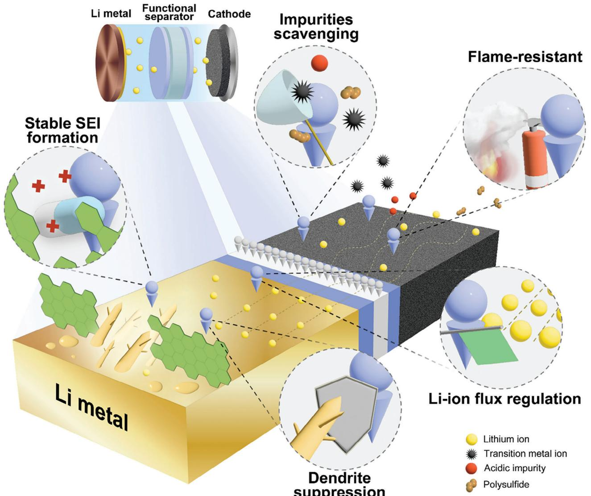

**Figure 1.** Schematic illustration of various effects exerted by functional separators in LMBs.

with LMAs.[\[11\]](#page-24-0) Among post-LIBs, LMBs differ from LIBs only in terms of the change in the anode system, which has the potential for early commercialization, among others, and to succeed the throne of LIBs. Although the replacement of the anode system may be simple, the entire battery system should be checked and optimized. Particularly, dendrite formation and suppression of unwanted surface reactions on LMA are critical for the success of LMBs.[\[12\]](#page-24-0)

Various engineering approaches (such as artificial SEI, selection of suitable Li salts, and structural modification of LMAs) have been investigated.[\[13–17\]](#page-24-0) Recently, a separator that could be effective for improving LMBs without modifying the electrodes was suggested. The traditional concept of a separator and electrolyte is that inactive materials should be gravimetrically and volumetrically kept at a minimum in the cell structure, which is involved in Li-ion transport. Some reports reviewed the specific function of separators in LMBs; however, reviews on the various types of functional separator approaches are hardly found.

Herein, we report on functional separators to improve the performance of LMBs (**Figure 1**).

The classification of many separators, mainly focusing on the improvement of the electrodes, will be demonstrated, followed by a brief introduction to the lithium dendrite issue and the basics of separators shown in Section 2. Finally, we propose several perspectives on the future development of functional separators for constructing advanced LMBs.

# **2. Challenges of Lithium Metal Battery**

The US Department of Energy and the Advanced Battery Consortium have set the energy density goal of LMBs as 450 Wh kg−1 and 850 Wh L−1, which exceeds the requirement of the current energy density of the LIBs for EV application.

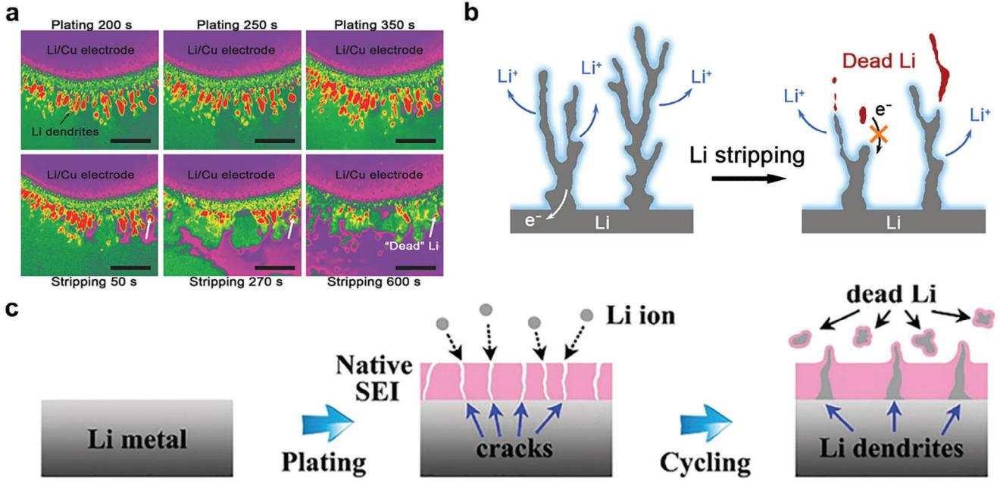

**Figure 2.** a) Time lapse series of SEM images of the processes of lithium platting and stripping under 0.15 mA cm−2 on the Li/Cu electrode. Reproduced with permission.[\[31\]](#page-24-0) Copyright 2017, Wiley-VCH GmbH. b) The formation of dead lithium during the lithium stripping process. Reproduced with permission.[\[32\]](#page-24-0) Copyright 2022, Elsevier. c) Schematic illustrations of inhomogeneous Li deposition process for lithium metal anode. Reproduced with permission.[\[42\]](#page-24-0) Copyright 2021, Wiley-VCH GmbH.

Thus, for commercialization, a prerequisite for LMBs at the single-cell level is a thick cathode (*>*4 mAh cm−2) and a thin LMA (*<*50 μm). Additionally, the amount of electrolyte, defined as the electrolyte/capacity (E/C) ratio, should be *<*3 g Ah−1. [\[18–20\]](#page-24-0)

However, simply reducing the Li thickness and electrolyte amount causes the rapid failure of LMBs. This is because thin LMAs show limited compensation for irreversible Li loss and quick evolution of cracks by the pits generated during the early stage cycles, which leads to fast capacity fading. Thus, many studies have applied mild conditions of hundreds of micrometers thick Li and sufficient amounts of electrolytes for LMB fabrication to investigate the effects of new or modified components (current collector,[\[21\]](#page-24-0) electrolyte species,[\[22\]](#page-24-0) functional additives,[\[23\]](#page-24-0) and separators[\[24\]](#page-24-0) ), excluding the thickness and E/C ratio effects. In particular, the effect of various approaches on the component is confirmed by its performance in solving the lithium dendrite problem and complex side reactions in LMBs.

Two directions of study on LMBs are available in the literature. One targets the stabilization of LMBs overcoming thin Li and low E/C ratio, and the other develops and compares the effects of engineered components on LMB improvement under milder cell operating conditions. The success of the commercialization of LMBs is possible through the combined achievements of both trends.

These optimizations for ideal LMB structures and conditions comparable to the manufacturing and operation conditions of the current LIBs aggravate dendrite formation, attributed problems, and unwanted surface reactions.[\[25\]](#page-24-0) Functional separators endowed with additional functions to their intrinsic role mainly focus on reducing or preventing dendrite and surface-side reactions.

### **2.1. Dendrite Propagation**

Unlike commercial graphite anodes, which operate based on the intercalation/deintercalation mechanism, lithium-ions strip and deposit onto the surface of the lithium metal (plating/stripping mechanism).[\[26,27\]](#page-24-0) The unevenness of the lithium metal surface is unavoidable at the micron scale because it shows different localized current distributions, causing heterogeneous lithium nucleation. In addition, the inhomogeneous Li-ion flux from the separator results in non-uniform Li deposition throughout the Li metal surface. Repeated charge/discharge cycles induce dendrite growth owing to inhomogeneous nucleation.[\[28,29\]](#page-24-0)

Dendrites are classified as needle-like, moss-like, whisker-like, or branch-like based on their growth morphology.[\[30\]](#page-24-0) The Li dendrites grow toward the cathode, and their shape can be easily observed using scanning electron microscopy (SEM) (**Figure 2**a).[\[31\]](#page-24-0) Various techniques have been applied to study in situ dendrite growth on LMA surfaces (Figure 2b).[\[32–34\]](#page-24-0)

Such growth of dendrite shortens the transport path of Li+, which leads to an internal short circuit that can cause explosive thermal runaway in LMBs. In addition, a piece of lithium metal can detach from the dendrite before reaching the counter electrode; this is called dead lithium. Dead lithium manifests as selfdischarge and loss of lithium inventory.[\[35\]](#page-24-0) Therefore, reducing or suppressing dendrites in LMA is vital for improving the cycling performance and safety of LMBs.

### **2.2. Side Reaction of Lithium Metal Anode**

Reactions other than "*Li*+ + *e*− ↔ *Li*" are referred to as side reactions at the surface of the LMA.[\[36\]](#page-24-0) Complex side reactions generally result in the formation of SEI, an electrically insulating and ionic-conducting layer formed on the anode by the reduction of electrolytes.[\[37\]](#page-24-0)

The SEI composition and structure affect the cell performance. Because of the high reactivity of LMAs, SEI typically consists of a dense inorganic inner layer composed of LiF, Li2O, Li2CO3, and other inorganic salts covered by a more porous and organic outer layer consisting of organic molecules and ionic compounds.[\[38,39\]](#page-24-0)

A thin, robust, ionically conducting but electrically insulating SEI can be beneficial for long-term operation. However, the instability and poor ionic conductivity of the SEI are problematic and should be improved to obtain practical LMBs. This brittle SEI layer forms cracks owing to the mechanical deformation caused by volume changes during plating and stripping.[\[40,41\]](#page-24-0) The formed cracks enhance the Li-ion flux, resulting in Li dendrite growth and new SEI formation (Figure [2c\)](#page-2-0).[\[42\]](#page-24-0) This unstable situation between the LMA and the liquid electrolyte continues the side reaction, consuming lithium and drying up the electrolyte repeatedly, and is doomed to the short cycle life of LMBs.[\[43,44\]](#page-24-0)

Owing to the significance of this side reaction along with lithium dendrite propagation, attempts have been made to understand the underlying mechanism and electrochemical– mechanical phenomena at the LMA.[\[45\]](#page-24-0) The separator is appropriate for tackling issues not only in the stability and safety of the cell but also in dendrite propagation and side reactions. In addition, various approaches for components other than functional separators have been proposed in recent studies. Prior to looking into the different types of functional separators for improving LMB performances, a brief addressing of separators is made in the next section.

#### **2.3. Separator Basics**

As the nomenclature indicates, the basic role of the separator is to physically separate the anode and cathode while providing a pathway for the lithium-ion. This provides the basic condition of the battery in action by preventing internal shortages while allowing the charging and discharging of the cell.[\[46\]](#page-24-0)

General properties for commercially available separators for LIBs demonstrate thicknesses less than 25 μm, porosity ≈40– 60% with a pore size below 1 μm, thermal shrinkage should be less than 5% after being placed in 100 °C for 1 h, puncture strength bigger than 300 g mil−1, Gurley number below 250 s 100 cc−1, and complete electrolyte wetting in a short time.[\[47–49\]](#page-24-0) The porosity of the fluoropolymer separator can even be raised to 74% for high Li-ion flux transferability, enabling high rate capability in LIB.[\[50\]](#page-24-0) The mechanical and thermal stabilities of the polyolefin separators can be improved by applying a thin coating layer consisting of inorganic particles such as aluminum oxide (Al2O3) and boehmite (AlOOH), which are referred to as ceramiccoated separators.[\[51,52\]](#page-24-0)

In LMBs, dendrites interfere with the basic role of the separators. Protrusion of the separator by dendrite brings the separated cathode and anode into contact, and the side reaction depletes the electrolyte and salt inside the cell, resulting in the disconnection of the lithium path.[\[53\]](#page-24-0)

# **3. Research Progress of Functional Separators**

Separators for LMBs require additional functions, including dendrite prevention and side reaction reduction, to continuously perform their basic role. This section describes the different types of functional separators for LMBs in detail, with the sections classified based on the target electrodes for improvement.

#### **3.1. Solution Toward Lithium Metal Anode**

Functional separators for LMAs solve the problems of dendrite formation and unstable non-uniform SEI. The electrically conductive separators with dendrite-proof characteristics, Li-ion channel separators showing uniform Li deposition, sustained release separators providing continuous additives for SEI formation, mechanically enhanced separators, and the reactive separators are discussed in detail in these subsections (**Figure [3](#page-4-0)**).

#### *3.1.1. Electric Conductive Separator*

During charging and discharging, lithium ions migrate between the anode and cathode through the electrolyte, whereas electrons pass through the external circuit.[\[54\]](#page-24-0) Electrical conduction between the electrodes connecting the interior pores of the separators results in short circuits, leading to disastrous safety issues. Thus, it is natural to use an electrically insulating separator using polymers, such as polyethylene (PE) and polypropylene (PP), to prevent electrical short circuits in the cell interior.[\[55\]](#page-24-0)

In LMAs, lithium ions are deposited on the Li surface through the acquisition of electrons. During this process, Li nuclei form on the Li surface, resulting in an uneven current distribution and high local current densities, particularly at the tips of the Li nuclei. Gradually, Li dendrites grow on the nuclei, ultimately penetrating the separator, leading to short circuits and thermal runaway.[\[56,57\]](#page-24-0)

To address these problems, providing electrical conductivity on the one side of the separator facing the anode is an effective strategy for controlling the direction of dendrite growth and enhancing the safety and cycling performance of LMBs.[\[58\]](#page-24-0) Such one-sided electrically conductive separators not only facilitate Li stripping and deposition but also reduce the local current density at the anodes, effectively regulating the Li-ion flux. In addition, lithium deposition can occur on the conductive coating layer facing the LMA, thereby preventing dendrite growth toward the separator direction.

The use of various conductive coating materials such as metals,[\[56,58–60\]](#page-24-0) carbon nanofibers (CNF),[\[61–64\]](#page-24-0) and polyaniline (PANI) conducting polymers[\[65\]](#page-25-0) have been reported, and the application method of the separator varies depending on the type of conductive material used. For example, thin metallic layers were formed on the surface of a separator using magnetron sputtering to achieve a coating thickness of ≈100 nm. Lee et al. coated a conductive Cu thin film (CuTF), with a thickness of ≈60 nm, on

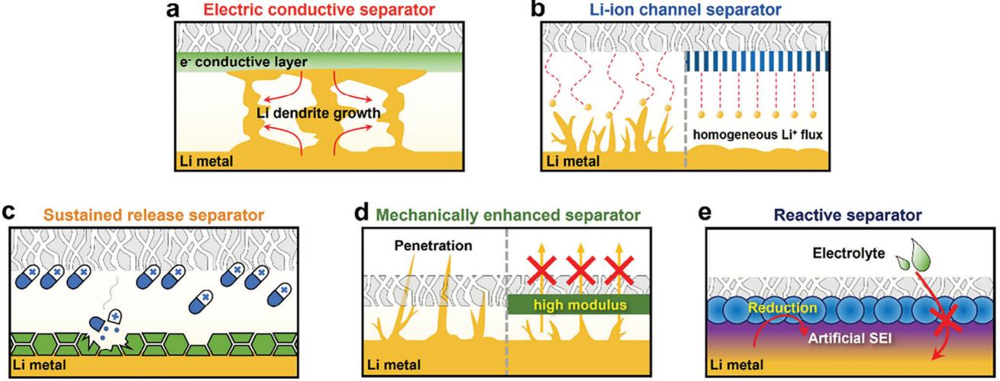

**Figure 3.** Summary illustrations representing functional separator approaches toward lithium metal anodes for improving LMB. a) Electric conductive separator. b) Li-ion channel separator. c) Sustained release separator. d) Mechanically enhanced separator. e) Reactive separator.

one side of a PE separator using direct-current (DC) magnetron sputtering.[\[58\]](#page-24-0) The CuTF serves as an electrical bridge, enabling the plating of Li metal on the separator facing the anode and modulating the Li deposition morphology via dendrite merging in the interspace region (**Figure 4**[a\)](#page-5-0). In the Li/Cu cell with the PE/CuTF separator, Li metal deposition on the Cu current collector exhibited a smoother surface and reduced dendritic morphology, whereas dendritic Li metal growth was observed in the cells using the pristine PE separator (Figure [4b\)](#page-5-0). This indicates that the PE/CuTF separator can control Li dendrite growth, forming a dense Li layer between the anode and separator, which improves the safety of LMBs. Similarly, Wen et al. coated metallic Pt nanoparticles on the PP separator with a thickness of 120 nm,[\[59\]](#page-24-0) and Din et al. applied a nano-coating layer of Nb metal particles with a thickness of 60 nm on the PP separator facing the LMA.[\[60\]](#page-24-0) The electrically conductive nature of applied metals on the separator guides the deposition of Li metal and ensures uniformity of the Li deposition morphology.

Similar to the metal layer, much thicker carbon fiber coating layers on a separator ranging from 3 to 25 μm can also be used for dendrite-proofing. The thicker coating of the micron-scale layer is attributed to the limitations of conventional casting methods. 3D CNFs with large surface areas offer extensive space for Li deposition and provide sufficient transport channels for Li-ions and electrons. However, CNFs have poor compatibility with Li metal owing to the weak bonding between the nonpolar interface of the carbon matrix and Li anode. To effectively regulate the Li nucleation behavior of 3D carbon structures, previous researchers have doped or mixed various lithiophilic polar materials with CNFs. Lithiophilic polar materials can provide more active sites for plating Li-ions in the interior of the carbon matrix rather than on the surface of the Li anode, making Li plating/stripping more homogeneous. Consequently, the surface of the Li metal remains clean without any uncontrolled Li. For example, Liu et al. coated 3 μm thick Ag nanoparticle-doped porous carbon nanofibers (PCNF) on one side of the PP separator facing the anode direction.[\[61\]](#page-24-0) The 3D porous structure of PCNFs with a high specific surface area enables high lithium loading capacity. Due to the guidance of the Ag nanoparticles, Li-ions were uniformly deposited simultaneously on the outer surface and in the inner channels of the Ag nanoparticle-doped PCNFs (Figure [4c\)](#page-5-0). When the Li/Li symmetric cell with the Ag-PCNFs coated PP separator operated at a high current density of 2 mA cm−2, an insignificant voltage polarization increase was observed during the lithium deposition/stripping process for 1500 h. It demonstrated the function of Ag-PCNFs in alleviating the growth of Li dendrites (Figure [4d\)](#page-5-0). Similarly, lithiophilic ZnF2-doped PCNFs (ZnF2-PCNFs) and a polydopamine-treated 3D carbon fiber coated on one side of the separator were reported by other groups, where the coating thickness was 25 and 15 μm, respectively.[\[62,63\]](#page-25-0) An aqueous coating condition was adopted for polydopamine coating using a simple doctor blade coating method. These 3D hosting structured conductive coating layers inhibit Li dendrites and dead Li formation by forming a uniform current distribution on the Li metal surface and applying an electric path to the isolated dead Li.

Synthesized electrically conductive polymers are another candidate to replace metals or carbon nanofibers. Xu et al. fabricated a polymeric one-sided conductive separator from polyvinyl alcohol (PVA) and PANI precursor aqueous solutions via directional freezing and phase inversion (Figure [4e\)](#page-5-0).[\[65\]](#page-25-0) This conductive separator exhibits surface electrical conductivity on its PANI side, while the PVA surface is highly insulating (Figure [4f\)](#page-5-0). The PANI conducting layer facing the anode plays a vital role in reducing the local current and enabling stable and uniform Li metal deposition. However, the use of electrically conducting polymer as a coating layer on one side is unusual due to the difficulty in fabricating the coating solution.

A separator, having one side electrically conductive layer toward the lithium metal anode, can control the dendrite growth direction. It is anticipated to be more improved when it possesses the even conducting layer with an ordered uniform nucleation site with lithiophilic ability.

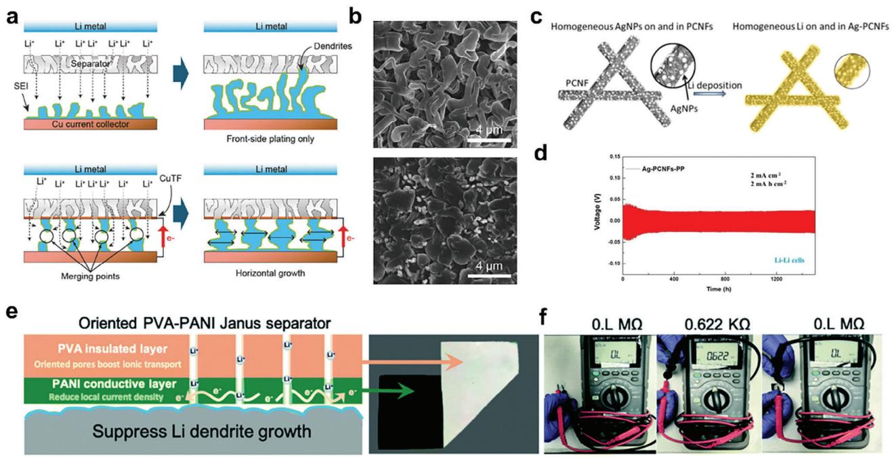

**Figure 4.** a) Schematic illustration of Li metal deposition mechanism with the bare PE separator and PE/CuTF Janus separator. b) SEM images of Li metal deposition on anode disassembled from the Li/Cu cells employing PE separator (up) and PE/CuTF Janus separator (down) after the first Li deposition with a capacity of 1 mAh cm−2 at 0.5 mA cm−2 current density, indicating the effect of Li dendrite growth control. Reproduced with permission.[\[58\]](#page-24-0) Copyright 2017, Wiley-VCH GmbH. c) Schematic illustration of the strategy to deposit the Li metal uniformly on and in Ag-PCNFs. d) Voltage profile of the Li/Li cells with a separator of Ag-PCNFs-PP at 2 mA cm−2 and 2 mAh cm−2, demonstrating the function of Ag-PCNFs in alleviating the Li dendrite growth. Reproduced with permission.[\[61\]](#page-24-0) Copyright 2019, American Chemical Society. e) A schematic showing the mechanism of the PVA-PANI Janus separator with oriented pores. A photo of the as-prepared O-PVA-PANI Janus separator. f) Surface resistances of the PVA side (left) and PANI side (middle) of the O-PVA-PANI separator, and the resistance of the separator in the thickness direction (right) measured using a multimeter. Reproduced with permission.[\[65\]](#page-25-0) Copyright 2021, the Royal Society of Chemistry.

#### *3.1.2. Li-Ion Channel Separator*

As discussed in Section [2.1,](#page-2-0) the uneven Li-ion flux reaching the lithium metal surface is a critical cause of Li dendrite formation. Lithium ions passing through conventional separators during charging cause an uneven Li-ion flux due to the non-uniform pore distribution.[\[66\]](#page-25-0) This leads to uneven deposition, resulting in the formation of an inhomogeneous lithium surface that eventually promotes the growth of lithium dendrites with repeated charge/discharge cycles.[\[67–71\]](#page-25-0)

Thus, it is crucial to regulate a uniform Li-ion flux and form a homogeneous Li metal surface to significantly improve the performance and safety of LMBs significantly. The most feasible approach to obtain even Li-ion flux to LMA is to use a regulated sieve upon the anode. The separator is the first component to consider for this purpose. Many researchers studied new separators to achieve homogeneous Li-ion flow, and significant progress in the recent separators is summarized in **Table [1](#page-6-0)**.

The two major approaches to producing a uniform Li-ion flux using separators are the creation of Li-ion migration and conduction channels, which differ in the Li-ion movement mechanism. The former utilizes a uniformly distributed nanostructured migration channel for Li movement through a separator, whereas the latter uses a conduction channel.

In the migration channel concept, uniform nano-sized pores facilitate the dispersion of lithium ions, preventing their concentration at specific points and ensuring the formation of a consistent Li-ion flux. Therefore, the fabrication of a well-engineered porous structure in the separator is crucial for the success of the migration channel mechanism. Pore structures can be established using polymers, metal–organic frameworks (MOF), and inorganic materials. Polymeric nanostructures have been widely employed in various fields, including biomedical, separation, and energy applications, due to their easy processability. This advantage enables the ability to form diverse types of nanochannels with flexibility.[\[103\]](#page-25-0)

For example, 1D-oriented Li-ion transport channels were created by grafting polymer chains onto a polyolefin separator, forming poly(pentafluorophenyl acrylate) polymer brushes, which exhibited an even distribution of Li nuclei.[\[77\]](#page-25-0) Other researchers prepared a highly porous layer composed of silk fibroin and polyvinyl alcohol (SF-PVA), which was applied to the commercial PP separator through a straightforward freeze-drying process.[\[75\]](#page-25-0) The SF-PVA layer, with an approximate thickness of ≈1.5 μm, exhibited interconnected pores with an average diameter of ≈2 μm, demonstrating an improvement in the coulombic efficiency of Li/Cu cells. Ordered-type aligned pores can also be used to provide a Li-ion channel.[\[78\]](#page-25-0) Vertically aligned straight nanochannels in the polyimide (PI) film with an average pore size of 100 nm were achieved using the track etching technique, and improving Li/Li symmetric cycling performance was proposed. Fabrics from the electrospinning can provide pores for

**Table 1.** Summary of recent Li-ion flux regulating separators.

| Year | Type                        | Materials                             | t+   | Li-Li symmetric performance                                                                      | Cathode                      | Performance [Rate, cycle number, retention] | Reference |
|------|-----------------------------|---------------------------------------|------|--------------------------------------------------------------------------------------------------|------------------------------|------------------------------------------------------|-----------|
| 2018 | Polymer                     | CNFs/PE/CNFs                          | -    | 155 h@0.65 mA cm−2/0.65 mAh cm−2                                                              | LFP                          | 0.5C, 65, 97.5%                                   | [72]      |
| 2020 |                             | PVDF-HFP/PMIA nanofiber               | -    | 500 h@1 mA cm−2/1 mAh cm−2                                                                       | LCO                          | 0.5C, 200, 89.2%                                  | [73]      |
| 2020 |                             | PDA@PAN fibrous membrane           | -    | >700 h@1 mA cm−2/2 mAh cm−2                                                                      | LFP                          | 0.2C, 100, 66.8%                                  | [74]      |
| 2021 |                             | Silk Fibroin-PVA                      | 0.63 | >6000 h@0.5 mA cm−2/1 mAh cm−2 >2000 h@5 mA cm−2/10 mAh cm−2                                  | LFP                          | 5C, 3000, 75.5%                                   | [75]      |
| 2022 |                             | hollow porous PAN nanofiber           | -    | 1300 h@3 mA cm−2/3 mAh cm−2                                                                      | NCM523                       | 3C, 200, 84.2%                                       | [76]      |
| 2022 |                             | PPFPA-g-Celgard                       | 0.61 | 900 h@1 mA cm−2/1 mAh cm−2 400 h@3 mA cm−2/1 mAh cm−2                                         | LFP                          | 1C, 700, 83%                                         | [77]      |
| 2022 |                             | PVP-TEPI                              | 0.66 | 350 h@2 mA cm−2/2 mAh cm−2                                                                       | NCM622                       | 0.5C, 100, 93.6%                                  | [78]      |
| 2021 | MOF                         | MAF-6                                 | 0.78 | 2200 h@0.5 mA cm−2/1 mAh cm−2 600 h@1 mA cm−2/1 mAh cm−2 250 h@2 mA cm−2/1 mAh cm−2        | LFP                          | 1C, 1500, 73.2%                                   | [79]      |
| 2021 |                             | NH2-MIL-125                           | 0.68 | >150 h@1 mA cm−2/0.5 mAh cm−2                                                                    | LFP                          | 2C, 50, 98.1%                                        | [80]      |
| 2022 |                             | ZIF-67                                | 0.81 | >500 h@1 mA cm−2/1 mAh cm−2                                                                      | LFP                          | 0.5C, 240, 96.3%                                  | [81]      |
| 2023 |                             | Zn-BDC/PAN@PAN                        | 0.68 | 1000 h@2 mA cm−2/2 mAh cm−2                                                                      | LFP                          | 2C, 300, 96%                                         | [82]      |
| 2023 |                             | UiO-66-SO3Li                          | 0.85 | 4000 h@5 mA cm−2/2.5 mAh cm−2                                                                    | -                            | -                                                    | [83]      |
| 2020 | Inorganic materials      | MSTF⊥AAO                              | -    | >2000 h@3 mA cm−2/1.5 mAh cm−2 >1600 h@10 mA cm−2/5 mAh cm−2 >400 h@20 mA cm−2/10 mAh cm−2 | LFP                          | 0.5C, 200, 99.6%                                  | [84]      |
| 2021 |                             | SiO@PAA                               | -    | >1500 h@1 mA cm−2/1 mAh cm−2                                                                     | NCM811                       | 5C, 600, 82.9%                                       | [85]      |
| 2021 |                             | Sepiolite                             | -    | >180 h@1 mA cm−2/1 mAh cm−2                                                                      | LiNi0.5Mn1.5O4               | 1C, 200, 88.9%                                       | [86]      |
| 2022 |                             | PVDF-HFP/YSZ                          | 0.63 | >1000 h@1 mA cm−2/1 mAh cm−2                                                                     | NCM712                       | 1C, 100, 87.6%                                       | [87]      |
| 2022 |                             | SnO2/HPMC                             | 0.61 | >2000 h@1 mA cm−2/1 mAh cm−2 500 h@2 mA cm−2/1 mAh cm−2                                       | NCM622                       | 1C, 250, 77.9%                                       | [88]      |
| 2022 |                             | Carbon nanosheet with cubic cavity | -    | >2600 h@6 mA cm−2/2 mAh cm−2 440 h@8 mA cm−2/2 mAh cm−2                                       | -                            | -                                                    | [89]      |
| 2022 |                             | rGO/tannic acid/VS4                   | 0.68 | 4200 h@8.2 mA cm−2/3.5 mAh cm−2                                                                  | Li1.4Mn0.6Ni0.2 Co0.2O2.4 | 1000 mA g−1, 300, 68%                             | [90]      |
| 2022 |                             | AAO                                   | 0.65 | 2400 h@2 mA cm−2/2 mAh cm−2 1600 h@4 mA cm−2/4 mAh cm−2                                       | LFP                          | 0.5C, 300, ≈95%                                   | [91]      |
| 2023 |                             | Amorphous Silica Nanosheets           | 0.54 | 2000 h@0.1 mA cm−2 1500 h@0.25 mA cm−2                                                        | LFP                          | 5C, 2000, 81.5%                                   | [92]      |
| 2023 |                             | Lithiated Molecular Sieve             | 0.52 | >500 h@1 mA cm−2/1 mAh cm−2                                                                      | LCO                          | 1C, 200, 78%                                         | [93]      |
| 2023 |                             | TaO3 Nanosheets                       | 0.72 | >900 h@0.5 mA cm−2/1 mAh cm−2                                                                    | LFP                          | 0.5C, 500, ≈98.6%                                 | [94]      |
| 2023 |                             | PAA coated AAO                        | 0.77 | >2000 h@5 mA cm−2/2.5 mAh cm−2                                                                   | LFP                          | 1C, 300, ≈100%                                    | [95]      |
| 2020 | Ion-conductive materials | LiAl-LDH                              | -    | >1600 h@1 mA cm−2/1 mAh cm−2 >3000 h@20 mA cm−2/5 mAh cm−2                                    | LFP                          | 1C, 500, ≈78.6%                                   | [96]      |
| 2021 |                             | PPTA/LLZTO                            | 0.57 | 500 h@0.5 mA cm−2/1 mAh cm−2                                                                     | LFP                          | 0.2C, 1000, 95.5%                                 | [97]      |
| 2020 |                             | PVDF/LLZTO                            | 0.66 | >1000 h@1 mA cm−2/1 mAh cm−2                                                                     | LFP                          | 1C, 300, ≈100%                                    | [98]      |
| 2018 |                             | Al doped LLZTO                        | -    | 800 h@1 mA cm−2/2 mAh cm−2                                                                       | LFP                          | 0.1C, 90, 88%                                        | [66]      |
| 2020 |                             | PAN/LITFSI/Li6.3La3 Zr1.65W0.35O12 | 0.58 | >350 h@0.2 mA cm−2/0.1 mAh cm−2                                                                  | LFP                          | 0.2C, 100, ≈108%                                  | [99]      |

(*Continued*)

**Table 1.** (Continued)

| Year | Type | Materials                                     | t+    | Li-Li symmetric performance                                 | Cathode | Performance [Rate, cycle number, retention] | Reference |
|------|------|-----------------------------------------------|-------|-------------------------------------------------------------|---------|------------------------------------------------------|-----------|
| 2023 |      | LATP-ITO                                      | -     | 600 h@1 mA cm−2/1 mAh cm−2, 400 h@1 mA cm−2/2 mAh cm−2   | LCO     | 1C, 400, ≈98%                                        | [100]     |
| 2022 |      | LIPON                                         | 0.477 | >2000 h@1 mA cm−2/1 mAh cm−2 2000 h@5 mA cm−2/1 mAh cm−2 | LFP     | 0.5C, 550, ≈92%                                   | [101]     |
| 2021 |      | Li0.375Sr0.375Ta0.75 Zr0.25O3@polydopamine | -     | 180 h@1 mA cm−2                                             | LFP     | 0.1C, 600, ≈90%                                   | [102]     |

Li-ion channel migration. Electrospun poly(vinylidene fluoride*co*-hexafluoropropylene)/poly(m-phenyleneisophthalamide) (PVDF-HFP/PMIA) nanofibrous separator in LCO/Li cells showed smooth LMA surface after 200 cycles (**Figure 5**[a\)](#page-8-0).[\[73\]](#page-25-0)

Another candidate for producing a nanostructured uniform path is the use of MOFs owing to the merits of providing various nanosized porous structures.[\[79\]](#page-25-0) For example, MAF-6 was coated onto PP separators (MAF-6/PP), which provided superorganophilic surfaces with 3D-ordered pores. The authors indicated that the coating of MOFs at the surface raised the Li-ion transference number (tLi +) (0.78) and enhanced the conductivity (0.398 mS cm−1) of the uniform Li-ion flux. The Li/Li cells with the modified separator demonstrated outstanding performance, achieving stable operation for 2200 h at 0.5 mA cm−2 and 250 h at 2.0 mA cm−2, respectively (Figure [5b\)](#page-8-0).

Coating inorganic materials onto the separator can also provide a migration channel that increases both the surface area and porosity. Unfortunately, reports insist on a uniform migration channel using a simple coating of inorganics without proof of an ordered configuration. However, the inorganics should be coated in an ordered manner to distinguish them from the conventional coating of inorganic particles in a Li-ion channel separator combined with supporting evidence.

Two representative examples of inorganic structures used to form migration channels have been introduced. The first type is a 2D inorganic nanosheet exhibiting an aligned structure that facilitates the formation of a Li-ion flux.

For instance, the utilization of polyacrylamide-grafted graphene oxide nanosheets leads to stacked 2D molecular brush formation, which offers rapid pathways for electrolyte diffusion.[\[104\]](#page-25-0) 2D holey amorphous silica nanosheets (ASN) with numerous holes are also examples of this type. Abundant surface oxygen groups were shown to facilitate an even distribution of Li-ions, as suggested by the simulation result (Figure [5c\)](#page-8-0).[\[92\]](#page-25-0) Tantalum oxide (TaO3) nanosheets, with ≈1 nm thickness of the single-layer, are also reported to provide Li-ion channels showing stability in both symmetric cells and full cells.[\[94\]](#page-25-0)

The other is an anodized aluminum oxide (AAO) membrane, which exhibits the intuitive features of a nanostructured uniform migration channel with low tortuosity. Vertically aligned nanochannels ranging from 5 nm to 10 μm in the AAO membrane establish regulated pathways for Li-ion flux.[\[105\]](#page-25-0) Hao et al. modified the AAO membrane to form electronegative nanochannels by applying poly acrylic acid (PAA) (Figure [5d\)](#page-8-0).[\[95\]](#page-25-0) The functional separator can selectively enhance Li-ion conduction, which was confirmed by the high Li-ion transference number (0.77) and ionic conductivity (1.36 mS cm−1). The optimized ion transport dynamics of the electronegative nanochannel separator could effectively stabilize LMAs and thus enable highly stable Li plating/stripping cycling over 2000 h under 5 mA cm−2 and 2.5 mAh cm−2.

Meanwhile, the Li-ion conduction channel incorporates fast Li-ion conducting materials and contributes to the uniform distribution of Li-ion transport.[\[66\]](#page-25-0) The material intended for use as a conduction channel should have ionic conduction ability with a wide electrochemical window and be stable in the battery environment.[\[68\]](#page-25-0) Based on these requirements, ceramic solidstate electrolytes are representative candidates for lanthanum zirconium tantalum oxide (LLZTO),[\[66,97,98\]](#page-25-0) lithium phosphorus oxynitride (LiPON),[\[101\]](#page-25-0) and lithium aluminum titanium phosphate (LATP).[\[100\]](#page-25-0)

Cheng et al. demonstrated the efficiency of PP separators modified with LLZTO conductive ceramic, functioning as redistributors to control Li-ion transport, thereby achieving dendritefree LMBs (Figure [5e\)](#page-8-0).[\[66\]](#page-25-0) The incorporation of the LLZTO layer reduced uniform Li-ion concentration on the separator. In Li/Cu cells, the LLZTO-coated separator exhibited a high coulombic efficiency of 98% over 450 cycles. Pang et al. implemented a surface modification strategy for separators by depositing a LiPON nanolayer on commercial PP separators via magnetron sputtering.[\[101\]](#page-25-0) The LiPON-modified PP separator (LPM-PP) suppressed Li dendrite growth, leading to improved battery performance and longevity. LPM-PP exhibited excellent stability in Li plating/stripping, maintaining over 2000 h at a high current density of 5 mA cm−2. Furthermore, the longevity of cell cycle performance was observed by LFP/Li cells, achieving 550 cycles with 79% capacity retention in a current density of 0.5C.

A combination of the two different mechanisms, Li-ion migration, and conduction channels, has been attempted through the hybridization of ceramic solid-state electrolytes and polymers (Figure [5f\)](#page-8-0).[\[97\]](#page-25-0) A hybrid separator was prepared by combining LLZTO and aramid nanofibers on a commercial PP separator via a simple casting process. The aramid nanofibers feature uniform nanopores and nanosized skeletons, with the dispersed LLZTO in the aramid matrix providing rapid Li-ion channels. The authors claimed that Li-ions were effectively guided from the hybrid separator to achieve a uniform distribution, thereby suppressing the growth of Li dendrites. Consequently, LFP/Li cells incorporating this hybrid separator demonstrated a high specific discharge

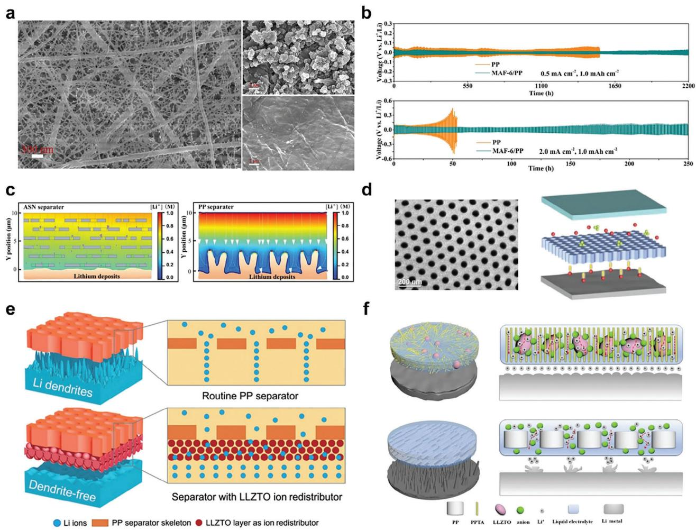

**Figure 5.** a) SEM images showing nanofiber structures and surface morphologies of the LMAs, disassembled from LCO/Li cells, comparing samples using PP membranes with those using nanofiber membranes. The surface of LMA with nanofiber membrane cells has a smoother surface (down) than the PP membrane (up) after the cycle. Reproduced with permission.[\[73\]](#page-25-0) Copyright 2020, Elsevier. b) Voltage-time profiles for Li plating/stripping cycling in symmetric Li/Li cells using PP and MOF-coated separator. The cell with MAF-6/PP demonstrated lower voltage hysteresis than PP. Reproduced with permission.[\[79\]](#page-25-0) Copyright 2021, Elsevier. c) Simulated lithium ion concentration distribution profiles throughout the ASN-Separator and PP-Separator, depicting the ion channel effect on the LMA surface morphology. Reproduced with permission.[\[92\]](#page-25-0) Copyright 2023, Wiley-VCH GmbH. d) SEM image of the AAO membrane, accompanied by a schematic illustration of Li+ transport and Li plating behaviors. Reproduced with permission.[\[95\]](#page-25-0) Copyright 2023, Wiley-VCH GmbH. e) Schematic of electrochemical deposition in LMAs with a standard PP separator and a composite LLZTO layer separator for ion redistribution and uniform Li-ion distribution. Reproduced with permission.[\[66\]](#page-25-0) Copyright 2018, American Association for the Advancement of Science. f) Schematic illustration of electrochemical deposition behaviors in LMAs using a hybrid separator. Reproduced with permission.[\[97\]](#page-25-0) Copyright 2021, Elsevier.

capacity of 122 mAh g−1 at 5C, with a discharge capacity retention of 95.5% after 1000 cycles, showing a uniform and dense surface of LMAs.

Recent research on Li-ion channel-forming separators has mainly focused on the application of new materials. However, the optimization of physical parameters, such as pore size and pore distribution, has been neglected. Therefore, optimization of these parameters to achieve a uniform Li-ion flux is required to thoroughly understand the ion channel mechanism that can lead to the development of stable LMB operation. Furthermore, a precise analysis of the Li-ion flux is essential, and operando analysis can be a straightforward method for understanding the real-time situation involving ion channels.

#### *3.1.3. Sustained Release Concept Separator*

In LMBs, the formation of dendrites and side reactions of Li metal with the electrolyte inevitably occur during repeated cycles, significantly influencing the cycle performance. This continues throughout the time of operation. In general, introducing functional additives into the electrolyte has been effective for robust SEI preparation, but depletion of the additive in early cycles may limit the extended long-term stability of the SEI with time.

Typically, after full assembly of the cells to fabricate the module, the safety of the battery is checked and managed through externally equipped measures, such as battery management systems (BMS) and protection circuit modules. Similarly, the continuous management of cell interiors connected from an electrochemical perspective can be advantageous for maintaining cell performance, if possible. However, this is complicated because operating cells cannot be dissected during their lifetime.

Clues to continue the additive action in the cell can be found in highlighted research areas in the biomedical field. A controlled release system (CRS), typically used in the biomedical field for drug delivery, is a successful internal treatment method that can deliver effective drug concentrations for extended periods within the body.[\[106\]](#page-25-0) This corresponds to a single dose demonstrating the same effect as repeated periodic multiple dosing of active agents in the long-term.

It has not been a decade since the concept of the CRS was adopted in the LMB system.[\[107\]](#page-25-0) CRS generally consists of a drug that continues to function, a carrier containing the drug, and a release medium. In contrast with the application of CRS in the biomedical field, the situation is quite different in lithium secondary batteries. First, the release medium for the active agents in lithium batteries is an organic electrolyte solvent, which differs from the pH 7.0 aqueous buffer solution. Second, active agents differ in their biological applications. Carriers can be inorganic or polymeric materials as traditional CRS.

Candidates for the active substances in lithium batteries include functional additives, salts, and solvents. However, only a few additives have been considered for this purpose. Most studies have used lithium nitrate (LiNO3), which has proven to be an effective additive for forming nitride-rich stable SEI films on Li metal.[\[108\]](#page-25-0)

One of the main reasons for using LiNO3 as an active substance for CRS in lithium batteries is that it shows a limited solubility (≈10−5 g mL−1) in the carbonate electrolyte, whereas it exhibits higher solubility in an ether electrolyte (5 wt.% in dimethoxyethane and 1,3-dioxolane).[\[109\]](#page-25-0) Because of its very low solubility in carbonate-based electrolytes, LiNO3 demonstrates a passive release that occurs when dissolved LiNO3 is continuously restored with consumption. This approach can also be used for LiNO3 in ether-based electrolytes by modulating its solubility by mixing poorly soluble fluorinated ethers in the electrolyte.

Studies on this subject can be classified by the carriers used. First, polymeric or inorganic particles such as halloysite nanotubes (HNT) and MOF have been as investigated as carriers for combining additives (LiNO3 and vinylene carbonate (VC)). Carriers should exhibit sufficient loading capacity for the active substance and be well dispersed in liquid electrolyte.[\[110–112\]](#page-25-0) The encapsulation of VC in a 1D inorganic nanocarrier (HNT) for LMB was free of any organic solvent that could act as an impurity in the cell.[\[111\]](#page-25-0) The VC-loaded carriers were dispersed in liquid electrolytes. Furthermore, the polyethyleneimine (PEI) coating on the carrier surface effectively extended the controlled release period. The time-dependent release rate of VC was periodically measured using gas chromatography from the release medium (electrolyte), which was replenished with fresh electrolytes. These are referred to as in vitro release measurements. This study provides important insights into the use of CRS in energy storage devices, evaluating its release behavior and analyzing its release mechanism.

Second, a free-standing film containing an active substance called a sustained release film (SRF), placed between the anode and separator, was used as the carrier. It was prepared by casting a mixture of LiNO3 and the polymer in acetone or 1-Methyl-2 pyrrolidinone (NMP).[\[107,113,114\]](#page-25-0) NO3− present in the SRF was continuously supplied during lithium deposition, which is advantageous for sustaining an appreciable local NO3− concentration at the anode.

As an initial approach for combining CRS with LIBs, Cui et al. utilized the limited solubility of LiNO3 in carbonate-based electrolytes, fabricating a polymeric matrix that encapsulated LiNO3 and placed it on top of the anode.[\[107\]](#page-25-0) The slow release of the additive maintained an appropriate NO3− concentration, which enhanced the cycling performance of the NCM111/Li cell. Jin et al. prepared a free-standing film from the mixture of lithiated Nafion polymer and LiNO3 dissolved in NMP.[\[113\]](#page-25-0) It was sandwiched between the anode and separator. They employed fluorinated ether (1,1,2,2-tetrafluoroethylene 2,2,2-trifluoromethyl ether), showing low solubility for LiNO3 as a co-solvent in the electrolyte. The free-standing film swells well in the mixture of electrolytes. The sustained release of LiNO3 from the free-standing film was confirmed by UV–vis analysis, and they also applied this system in Li–S batteries, showing improved performance.

Third, polyolefin-based separators can be used as substrates to release active substances. This resembles a transdermal drug delivery system in which the release behavior is closely related to the diffusion of the substance. The diffusion rate is determined by the thickness of the coating layer in a transdermal drug delivery system.

Liu et al. reported two separators for a sustained release system in which solid LiNO3 powders are presented between the two separators.[\[115\]](#page-25-0) LiNO3 solid powder was positioned in a sandwich structure between two PP separator-supporting matrices and gradually dissolved in the electrolyte (**Figure 6**[a\)](#page-10-0). After cycling, round LiNO3 particles, which were initially irregular crystals with sharp edges and corners, were observed in the SEM image, indicating the sustainable dissolution of LiNO3 into the electrolyte during cycling. Furthermore, the NCA/Li full cell demonstrated excellent cycling performance, maintaining a capacity retention of 84.2% after 450 cycles, attributed to the stable SEI formation due to continuous LiNO3 supply with PP/LiNO3/PP separator. Other researchers have used a separator coated with a mixed slurry composed of a solvent, organic binder, and LiNO3. [\[116,117\]](#page-25-0) Guan et al. fabricated a sustained release functional ceramiccoated separator (Al2O3/LiNO3/PVDF); utilizing the LiNO3 adsorption capability of Al2O3, and they proposed a release system in which LiNO3 continuously dissolved toward the anode side.[\[116\]](#page-25-0)

The approach of using active substances other than LiNO3 has also been introduced. Yan et al. applied an aqueous coating of transition metal (TM) oxides as the active material to a PP separator.[\[117\]](#page-25-0) Because of the low solubility of MnO in the electrolyte, it slowly dissolved in the electrolyte and was reduced on the lithium metal surface, forming an SEI layer containing Li2O and Mn0. Mn0 acts as a lithium-nucleating seed, assisting in spherical Li deposition, whereas Li2O continuously stabilizes the interface, forming a self-healing SEI layer (Figure [6b\)](#page-10-0). The Li/Cu cells with pristine PP and MnO/PP separators were operated at varying current densities. Li/Cu cells equipped with MnO/PP separators at a lower current density led to denser and largersize Li deposition formation, resulting in a higher CE (99.3%).

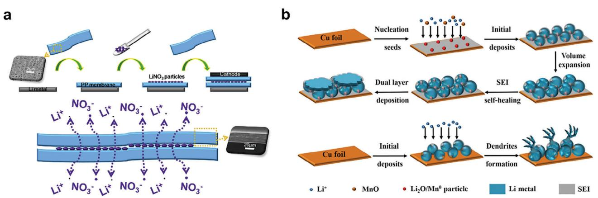

**Figure 6.** a) Schematic illustration of the fabrication process and the sustained release mechanism of the PP/LiNO3/PP separator. Reproduced with permission.[\[115\]](#page-25-0) Copyright 2020, Elsevier. b) The schematic diagram of Li depositions in the Li/Cu cell with MnO/PP and PP separator in the ether electrolyte. Reproduced with permission.[\[117\]](#page-25-0) Copyright 2021, Wiley-VCH GmbH.

Additionally, the application of MnO/PP separators showed improved cycling, validating the positive effect of MnO coating.

The CRS approach is promising for the continuous maintenance of cycle performance in the cell and is comparable to external measures such as battery management systems (BMS) and protective circuits in improving the battery system. However, this new concept requires additional efforts to develop the way of active substance incorporation and explore new active agents extending beyond LiNO3. The use of a separator as a matrix substrate for the release of active substances is advantageous in the sense of simplicity.

### *3.1.4. Mechanically Enhanced Separator (Against Li Dendrite Penetration)*

It requires the separator to have sufficient mechanical stability against various tensions and deformations from the battery manufacturing and operation, such as winding, extrusion, and volume change of the electrode during charge-discharge cycles. The mechanical properties of the separator have been considered important from the early stage of commercialized LIBs. General mechanical strength related to the separator includes tensile and puncture strengths. The dimensional stability of the separator against external forces applied during use is addressed from tensile strength, whereas puncture strength demonstrates the ability of the separator to overcome damage caused by compression and puncture. The tensile strength of the separator should be more than 98. 06 MPa for 25 μm thickness for withstanding the assembly process, and puncture strength should not be less than 300 g mil−1 to resist physical impact.[\[118,119\]](#page-25-0) The details of the mechanical properties of the LIB separators can be found in review papers.[\[120,121](#page-25-0)]

Compared to that of the conventional LIBs, one additional critical mechanical requirement is to provide a physical barrier against lithium dendrites, which is essential for the separators of LMBs. The deposited Li dendrites at the LMA from the repeated charge and discharge cycles can puncture the separator and contact the cathode, resulting in a disastrous short circuit of the cell.[\[122\]](#page-25-0) The mechanical strength of the separator against lithium dendrite puncture is especially related to the elastic modulus generally measured from the nanoindentation experiment (**Figure 7**[a\)](#page-11-0). It can suggest the criterion of the surface toughness whether the separator can resist the dendritic lithium growth over the separator. Because the elastic modulus of polyolefin separators (e.g., 2.1 GPa for PP) is smaller than that of the Li dendrites (4.0 GPa), polyolefin separators cannot inhibit the puncture of needle-shaped Li dendrites when they are formed. The needle-shaped Li dendrite puncture through the separator may lead to battery failure and even battery accidents. Thus, it was suggested that the minimum theoretical elastic modulus of separators should be greater than 7 GPa to suppress the growth of Li dendrites.[\[123,124](#page-25-0)]

The feasible approach to enhancing the mechanical strength of the separator and providing an effective physical barrier against lithium dendrites is to use materials with superior mechanical strength, such as inorganic material, in separator fabrication. Two representative approaches are coating the inorganic particles at the surface of the conventional polyolefin separator and replacing the separator substrate with the composite using ceramic materials and other polymers of higher mechanical strength. Some researchers only used high-strength polymers, although composite materials can be preferable mainly because of their high mechanical strength and corrosion resistance.[\[125,126\]](#page-26-0)

The first approach of upgrading the polyolefin separators by coating ceramic particles such as Al2O3, [\[127\]](#page-26-0) SiO2, [\[128\]](#page-26-0) and AlOOH[\[129\]](#page-26-0) is namely ceramic-coated separators described in Section [2.3.](#page-3-0) Na et al. prepared a composite-coated separator using the UV-curable ladder-like structured polysilsesquioxane binder (LPMA64) and Al2O3 filler particles. The LPMA64 demonstrated a unique inorganic-organic hybrid material consisting of a Si−O−Si inorganic backbone and phenyl and methacryloxypropyl organic functional pendant groups for UV-curing function, resulting in mechanical robustness. The elastic modulus obtained by the nanoindentation was 7.3 GPa, which exceeds the threshold value to suppress lithium dendrite growth (Figure [7b\)](#page-11-0).[\[130\]](#page-26-0)

Another approach is replacing polyolefin with other highstrength and high-modulus polymers such as PVDF-HFP,[\[122\]](#page-25-0)

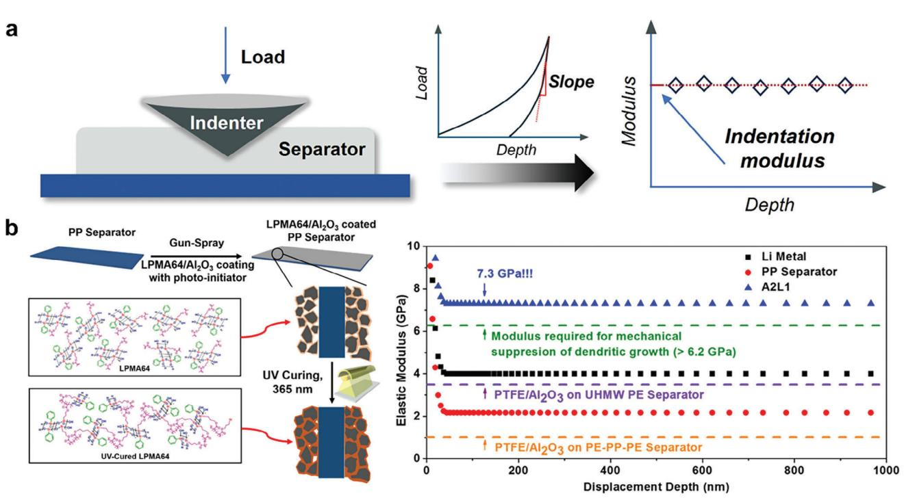

**Figure 7.** a) Schematic illustration of the nanoindentation test model for the separator. b) Schematic depiction for the fabrication of LPMA64/Al2O3 composite solution-coated on PP using UV-curing process and nanoindentation-derived elastic moduli of pristine PP separator, LPMA64/Al2O3 composite separator (A2L1), PTFE/Al2O3-coated ultrahigh molecular weight polyethylene (UHMWPE) composite separator, and PTFE/Al2O3-coated PE-PP-PE/Al2O3 composite separator. Reproduced with permission.[\[130\]](#page-26-0) Copyright 2016, American Chemical Society.

polyvinyl alcohol (PVA),[\[131\]](#page-26-0) polyacrylonitrile (PAN),[\[132\]](#page-26-0) poly(m-phenyleneisophthalamide) (PMIA),[\[133\]](#page-26-0) and cellulose[\[134\]](#page-26-0) to develop a dendrite-resistant separator. Ceramic materials can be added to produce even high mechanical composite materials for the separator. A SiC/PVDF-HFP composite separator prepared with SiC nanoparticles into PVDF-HFP via a phase inversion method demonstrated about four times higher nanoindentation load value compared to that of the Celgard2500 PP separator from the optimized SiC content separator. Authors address that this higher mechanical strength of the composite separator is attributed to the Si−F chemical bonding as well as physical bonding.[\[122\]](#page-25-0) The replacement of polyolefin with other polymers not only improves mechanical strength but also enables different fabrication methods, such as electrospinning. Chen et al. fabricated the HKUST-1/PAN composite membrane by electrospinning the solution containing MOF precursor and polymer to use as a dendrite puncture-resistant separator. The tensile strength instead of elastic modulus was compared for the nanofibrous membrane with that of the other studies. The incorporation of ceramic material, MOF, in the electrospun nanofibrous separator demonstrated increased tensile strength.[\[132\]](#page-26-0)

Improving mechanical properties gives a broader choice of inorganic particles, high mechanical polymers, and various fabrication routes, which can extend research on high mechanical separators. However, current approaches to improve mechanical properties generally involve an increase in thickness, which decreases ionic conductivity and electrochemical performances. Thus, it is necessary to consider both the mechanical strength of the separator and electrochemical cell performance to obtain optimal characteristics.

### *3.1.5. Reactive Separator*

Li metal also spontaneously reacts with the liquid electrolytes to form SEI as in the LIB due to the high reactivity of the Li metal toward organic electrolytes. The SEI formed by the interfacial reaction between the anode and electrolyte components generally expresses a brittle character that is undesirable for withstanding huge volume changes of the LMA and dendritic Li growth.[\[135\]](#page-26-0) Cracks formed in the SEI layer due to the unstable mechanical properties can continuously consume electrolytes, resulting in cell failure. The ideal SEI at the Li anode should have mechanical robustness to mitigate lithium dendrite growth and direct contact with the electrolyte while providing excellent ionic conducting characteristics to enable feasible Li-ion movement. Thus, it is anticipated that the artificial engineering of SEI that provides an effective protective layer can achieve stable LMB operation.[\[136\]](#page-26-0) Recently, a sophisticated strategy of using a separator with reactive moiety to form appropriate artificial SEI with the LMA has been proposed. This in-situ artificial SEI film also protects the Li anode from electrolyte side reactions. A reactive separator, stable in air, takes into action when it begins contact with the LMA and constructs a stable interface between Li metal and electrolyte, presenting practical suitability for industrialization.[\[137,138\]](#page-26-0)

Recently reported reactive separators have a common structure of possessing organic (lignosulfonate)[\[135\]](#page-26-0) or inorganic

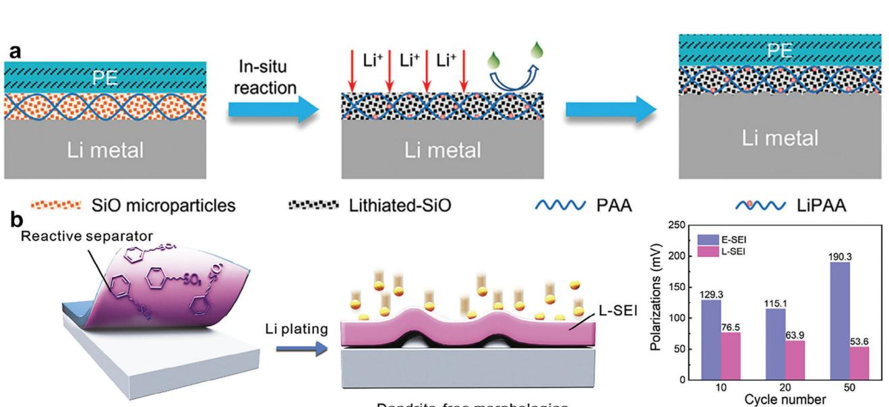

**Figure 8.** a) Schematic of Li deposition on Li metal anode with SiO@PAA-coated PE separator demonstrating reactive inorganic materials coated on the separator. Reproduced with permission.[\[135\]](#page-26-0) Copyright 2021, Wiley-VCH GmbH. b) Schematic illustration of lignosulfonate-induced solid electrolyte interphase (L-SEI) formation and comparison of polarization voltages with electrolyte-induced SEI (E-SEI) and L-SEI showing the effect of organic reactive moieties on the separator. Reproduced with permission.[\[137\]](#page-26-0) Copyright 2020, Elsevier.

(MgF2, SiO, Pb27Zr14Ti13O81 (PZT), Mg(OH)2@MgO, and MnCO3) [\[136–140\]](#page-26-0) coated layer on the conventional polyolefin separator. These reactive components react with the LMA surface to generate artificial SEI, demonstrating lithiophilic or high ionic conducting properties. The artificial SEI is evaluated through the postmortem analysis of the LMA and Li/Li symmetric voltage profile.

For example, a composite PE separator was fabricated with SiO and PAA using spray coating. Upon contact with LMA, the lithiated-SiO particles facilitate Li-ion flux while preventing side reactions, and the Li polyacrylic acid polymer provides binding and stretching abilities.[\[137\]](#page-26-0) This enables the artificial SEI to conform to Li volume changes and suppress dendrite growth, as demonstrated by SEM images of the LMA surface (**Figure 8**a). A 2 μm thick layer of lignosulfonate was coated onto the PP separator to create a reactive separator, facilitating interaction with LMA due to its negatively charged sulfonic groups.[\[135\]](#page-26-0) Upon direct contact with the Li anode, the artificial SEI layer contains abundant inorganic species for fast Li-ion diffusion and aromatic groups enhancing mechanical stability. Consequently, Li/Cu cells using the reactive separator exhibit reduced polarization compared to those with a PP separator, resulting in a highly stable Li metal anode with dendrite-free morphology. (Figure 8b).

The reactive separator is practically promising because it is ready-made to act in the case of LMA contact after cell fabrication. However, it should be additionally investigated whether the materials used for artificial SEI do not generate unexpected side reactions that may even harm the cell performance. This may be critical when the reactive layer at the separator contains TM ions or its derivatives that may involve catalytic side reactions. A further understanding of the effect of TM ions originating from the cathode can be found in the next section.

#### **3.2. Solution Toward the Cathode**

The cathode loses its intrinsic character owing to various causes that result in structural disintegration and resulting leakage of TM ions in the cathode active materials. In addition, volume changes during charge/discharge and degradation by the acid product affect its chemical stability. Other than the layered-type lithium TM oxide cathodes, sulfur cathodes suffer from the polysulfide shuttle effect. In this section, the functional separators designed to address the problems concerning the cathode are discussed. Acidic impurity scavenging separator, transition metal capturing separator, and polysulfide blocking separator are dealt with in Sections 3.2.1, [3.2.2,](#page-14-0) and [3.2.3,](#page-15-0) respectively (**Figure [9](#page-13-0)**).

#### *3.2.1. Acidic Impurity Scavenging Separator*

Commercially available carbonate electrolytes in LIBs use LiPF6 as the lithium salt owing to its advantages of high ionic conductivity, relatively high resistance to high-voltage oxidation, and low cost.[\[141,142\]](#page-26-0) However, this electrolyte is prone to produce HF or PF5, as shown below in the reaction scheme in Equation (1), due to the unavoidable trace moisture in the cell and high-temperature operation.[\[143,144\]](#page-26-0) This also applies to LMBs, causing significant degradation of the internal structure of the cathode and leading to a poor cycle life.[\[145\]](#page-26-0)

$$
LiPF_6 \to LiF + PF_5 \tag{1}
$$

In addition, both LiPF6 and PF5 readily react with H2O according to Equations (2) and (3).[\[144\]](#page-26-0)

$$
LiPF_6 + H_2O \rightarrow LiF + POF_3 + 2HF
$$
 (2)

$$
PF_5 + H_2O \rightarrow POP_3 + 2HF
$$
 (3)

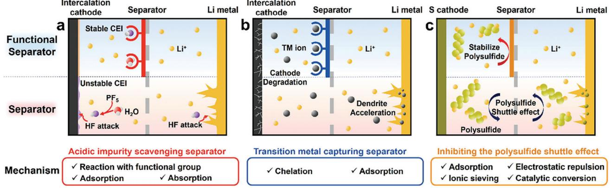

**Figure 9.** Summary illustrations representing functional separator approaches toward cathode to enhance the performance of LMB. a) Acidic impurity scavenging separator. b) Transition metal capturing separator. c) Inhibiting the polysulfide shuttle effect.

The acidic substances formed in the presence of moisture accelerate the formation of the cathode electrolyte interphase (CEI) and the SEI layer by producing unwanted by-products or gases at the electrode surface, which results in a high charge transfer resistance.[\[146,147\]](#page-26-0) In addition, acids corrode active materials in the cathode.[\[148\]](#page-26-0)

Particularly, HF attacks the surface of the cathode materials, inducing the dissolution of TM ions from the cathode (2H+ + MO − R → M2 + + H2O + R), where M represents Ni, Co, and Mn TMs. The dissolved TM ions either form resistive MF2 precipitates (2F− + 2H+ + MO − R → MF2 + H2O + R) on the cathode surface or migrate to the anode surface and deposit by passing through the separator, resulting in a low coulombic efficiency and fast capacity decay.[\[149,150\]](#page-26-0) Therefore, preventing or reducing acid substance formation can significantly preserve cathode integrity. A separator designed to prevent acid formation is referred to as a scavenging separator.

The underlying mechanism of the scavenging separator is that it absorbs or adsorbs reactive protonic impurities from the components included in the coating layer, such as functional groups, MOFs, and molecular sieves. They react preferentially with the acidic substance before reaching the cathode surface.

Fourier-transform infrared (FT-IR) and time-of-flight secondary ion mass spectrometry (TOF-SIMS) analyses of cycled separators have been conducted to evaluate their scavenging abilities.[\[151,152\]](#page-26-0) Accelerated conditions, such as intentionally increasing the moisture content (ppm level) in the cell and hightemperature cycling, were applied to confirm the advantages of the scavenging separator.[\[153–155\]](#page-26-0) The acid/water removal ability at a specific period can be directly determined by measuring the concentration of residual acid or water in the electrolyte.[\[153,155,156\]](#page-26-0)

Scavenging separators can be classified according to the materials used to capture or react with protonic impurities such as acids and moisture. In the first approach, specific functional groups capable of reacting with acids and moisture are introduced onto the surface of inorganic particles, such as silica or alumina, to improve their thermal stability.[\[152,157,158\]](#page-26-0) Qiu et al. constructed a silica–oxygen–borate (Si─O─B) hybrid thin layer on Al2O3 through surface engineering, which was coated on both sides of a polyethylene separator (BS-Al2O3@ PE).[\[152\]](#page-26-0) The HF and H2O molecules react with Si─O─B, Si─O─Al, and Al─O─Al bonds to generate new bonds (i.e., Al─F, Si─O─H, F─Si─O, and F─B─O─H), which was confirmed by the TOF-SIMS analysis of the BS-Al2O3@PE separator before and after 1000 cycles in the LCO/Li cells (**Figure [10](#page-14-0)**a). Wu et al. coated imidazole-based functionalized silica (Z-SiO2) nanoparticles onto the PE separator via dip-coating.[\[157\]](#page-26-0) The imidazole grafted onto the SiO2 nanoparticles could react with H2O and HF. The effect of Z-SiO2 on the CEI layer was verified through SEM, TEM, and XPS on the surface of the NCM523 cathode after 100 cycles.

The second approach involves the use of MOFs as efficient molecular scavengers of acids or H2O because of their high surface area and abundant pores.[\[159,160\]](#page-26-0) It can serve as a separator or integrated into a polyolefin separator.[\[153,154,161,162\]](#page-26-0) Zhou et al. prepared a MOF (Cu3(BTC)2, HKUST-1) with excellent water adsorption ability for the reversible capture of H2O molecules owing to its unique microporous crystalline structure.[\[153\]](#page-26-0) The excellent water adsorption ability of the MOF was confirmed by the rapid drop in the H2O content within the electrolyte after the addition of Cu3(BTC)2 MOF powder for 48 h (Figure [10b\)](#page-14-0). An MOF film was prepared from Cu3(BTC)2 powder by solution casting. The performance of the Cu3(BTC)2 MOF-based separator demonstrated excellent capacity stability with 80.5% capacity retention after 400 cycles for the LiNi0.5Mn1.5O4/MOF separator/Li cell under harsh conditions (200 ppm water, 55 °C). In addition, the SEM image of the LiNi0.5Mn1.5O4 cathode confirmed that the cell using the MOF did not exhibit apparent cathode degradation compared with that of the cell using the bare separator. Sheng et al. introduced MOFs, denoted as MIL-101(Cr), with two characteristic open metal sites that allow them to adsorb water.[\[154\]](#page-26-0) The isolated fluorine ions in these MOFs adsorbed both moisture and HF. MIL-101(Cr) was coated onto the PP separator. After cycling, SEM images of the NCM622 particles in the cathode showed crack suppression in the MIL-101@PP-equipped cell (Figure [10c\)](#page-14-0). A similar effect of MOF separators containing fumaric acid on the MOFs that adsorb H2O/HF was also reported.

Similar to MOF molecular scavengers, Li et al. used a molecular sieve with a mesoporous structure capable of selectively absorbing molecules according to the pore size in the coating layer of the separator.[\[155\]](#page-26-0) They prepared the ordered pore window (4 Å) of a zeolite molecular sieve as an H2O scavenger and coated it on a PP separator. 1 milligram of activated zeolite powder was placed

**Figure 10.** a) Schematic illustration of the HF/H2O capturing reaction mechanism of the boron and silica-containing BS-Al2O3@PE separator (left) and resulting TOF-SIMS spectra of BS-Al2O3@PE separator before and after assembling LCO/Li cell. Reproduced with permission.[\[152\]](#page-26-0) Copyright 2020, Elsevier. b) Moisture reduction evidenced by the water adsorption ability of MOFs powder within 200 ppm added water in the electrolyte (50 mg MOFs powder immersed in 1 mL electrolyte). Reproduced with permission.[\[153\]](#page-26-0) Copyright 2020, the Royal Society of Chemistry. c) SEM images of the NCM622 cathode after 200 cycles at a rate of 1C in PP separator (left) and MIL-101@PP (right) based cells indicating the effect of HF/H2O capturing. Reproduced with permission.[\[154\]](#page-26-0) Copyright 2023, Wiley-VCH GmbH.

in 50 mL of aged electrolyte to show the reduction of H2O content from 316 to 51 ppm using a Karl Fischer titrator, which indicated the H2O scavenging capability of the zeolite.

Recently, researchers have attempted a combined approach to improve the scavenging ability of separators by integrating different types of materials into the same separator. Simultaneous functional capturing group and molecular sieve use can produce a strong acid/water scavenging effect. Zhang et al. constructed a 500 nm hybrid coating composed of a CuSAPO-5 molecular sieve and sulfonated melamine formaldehyde condensate (SMF) on the surface of a commercial PE separator using a simple dipcoating method.[\[156\]](#page-26-0) The molecular sieve contributes to its strong H2O capture owing to its intrinsic porous structure, whereas SMF contributes to HF scavenging by the hydrogen bond interaction between HF and the sulfonic group. They evaluated the H2O and HF capture ability by monitoring the color change of 1000 ppm H2O or 1000 ppm HF in carbonate-based electrolytes over time with the addition of 2 wt.% of molecular sieve or SMF, respectively. Another researcher investigated the same system, molecular sieve/SMF coated PE separator, on HF capturing ability in 22 days electrolyte storage using 19F NMR analysis.[\[163\]](#page-26-0) The results showed the weakened peak intensity of HF and high retention of LiPF6.

All acid and moisture scavenging separators have demonstrated the ability to protect against impurity movement toward the cathode, exhibiting improved cyclic performance of the cells by preventing cathode degradation.

As introduced in this section, the impact of the acidic impurity scavenging separator on the cell is more concentrated on the cathode. Even a trace amount of H2O can result in the rapid corrosion of Li metal to form Li hydroxide (LiOH and LiOH·H2O), Li nitride (Li3N), and Li carbonate (Li2CO3), posing a serious technical and manufacturing challenge.[\[164,165\]](#page-26-0) Recently, some surfaceengineered passivation layers have been shown to stabilize Li metal in low water content air, and electrolytes.[\[166\]](#page-26-0) Although all the aforementioned protective layers are efficacious in suppressing dendritic Li growth to a certain extent, the importance of the H2O tolerant capability of the LMA is ignored.

#### *3.2.2. Transition Metal Capturing Separator*

The cathode of LMBs experiences a number of repeated lithium extractions and reinsertions during repeated charging and discharging. This is also responsible for the cell capacity. Currently, layered lithium metal transition oxides are the dominant cathode materials used in lithium secondary batteries.[\[167,168\]](#page-26-0) Layered-structure compounds are represented by the formula LiMO2, where the M and lithium ions are located at octahedral sites in a cubic close-packed oxygen array, and the lithium layers lie between slabs of octahedra formed by M and oxygen atoms. M is typically an electrochemically active TM ion, such as cobalt, manganese, nickel, or other electrochemically inactive substituent cations.[\[169\]](#page-26-0) Because NCM combines the advantages of each component (the structural stability and rate performance of cobalt, chemical stability of manganese, and high capacity of nickel), it is the most representative layered-structure cathode material.[\[169,170\]](#page-26-0)

However, despite the commercial success of the NCM cathode, it suffers from degradation during repeated cycling operations, which results in TM ions leaching into the electrolyte, inducing severe performance decay of the cell. The main reason for this decay is the crossover of TM ions dissolved in the electrolyte through the separator, which eventually accumulates on the surface of the LMA.[\[171–173\]](#page-26-0)

The TM ions deposited on the anode catalyze electrolyte decomposition and accelerate the formation of a thick SEI layer, which hinders Li-ion lithiation/delithiation and increases the anode impedance.[\[147,174–177\]](#page-26-0) This phenomenon also occurs in the graphite anodes of LIBs.[\[178–180\]](#page-26-0) However, the SEI on a Li anode is more sensitive and fragile than that on graphite because of the highly reactive nature of Li dendrites and the large volume change of the Li anode during cycling. Thus, TM ions must be prevented from crossing over to the LMA surface from the cathode.

The first consideration is the reinforcement of the cathode structure to address the problem of TM ion dissolution. These considerations include doping other elements into crystal lattices, developing nanoparticles, constructing porous structures, and growing typical crystal planes.[\[147,171\]](#page-26-0) These strategies have been somewhat successful, but they cannot completely prevent the deposition of TM ions on LIB anodes.

Another consideration is the development of a novel polymer separator that prevents the migration of TM ions to the anode surface. The functional separator provides solutions for both approaches. The former is connected with an acidic impurity scavenging separator discussed in 3.2.1., the latter is related to the TM ion capturing separator covered in this section.

The two major concepts of TM ion capture using a separator are chelation and surface adsorption. The chelation of TM ions can be achieved using polymers or covalent organic frameworks (COF) with nucleophilic functional moieties (─NH2, ─COOH, and ─SH). The electron-rich groups combine well with the TM ions, leading to the effective trapping of TM ions. Another strategy for impeding TM ion crossover is to apply a carbonaceous coating onto the separator facing the cathode side, where the adsorption of TM ions takes place.

Halalay group first proposed Mn-ion trapping using nucleophilic functional groups on a separator.[\[181\]](#page-26-0) Polymeric crown ether with 30–50 nm aza-15-crown-5 polymers was used for TM ion chelation and was coated on the side of the separator facing the cathode. The TM ion capturing separator was successful in reducing the amount of Mn2+ reached graphite anode from 9–10 to 4–5 μg cm−2 for the LiMn2O4 cathode cells operated at 50 °C. Banerjee et al. reported an improved block of TM ion crossover in LMBs in which the same LiMn2O4 cathode was used.[\[182\]](#page-26-0) They fabricated a multifunctional separator, which is a Mn cation-chelating poly(ethylene-alt-maleic acid) dilithium salt polymer embedded in a PVDF-HFP copolymer matrix. It was reported that the 75% lower Mn amount on the LMA compared to that in the bare separator cell was observed after the 100 cycles operated at 0.2C rate. They insisted on the significance of the chelating separator on the LiMn2O4-based LMBs. Wen et al. studied Li-rich layered oxide-based LMBs with a TM ion-capturing separator, which were prepared by coating a COF synthesized from 1,3,5-tris(4-aminophenyl) benzene and 2,5-dimethoxybenzene-1,4-dialdehyde onto a PP separator (**Figure [11](#page-16-0)**a).[\[183\]](#page-26-0) They provided theoretical calculations suggesting that COFs could provide localized negatively charged groups (─OCH3) for transporting lithium ions and polar groups (─CN─) with lone pair electrons for chelating TM ions.

Furthermore, our group previously reported high-Ni NCMloaded LMBs equipped with a TM ion-capturing separator. Dopamine- and PEI-coated inorganics (halloysite or round silica) were applied to the separator facing the cathode.[\[184\]](#page-26-0) The effective capture of TM ions by amine-functionalized inorganics was theoretically supported by density functional theory calculations. A synergistic TM ion trapping effect was obtained using a TM-capturing separator with the CEI-forming functional additive (succinic anhydride) (Figure [11b\)](#page-16-0). A reduction of 84% Ni2+ at the LMA can be obtained even after the harsh high-voltage operation of the LMBs (Figure [11c\)](#page-16-0).

Some studies have also reported on TM ion-capturing separators using an adsorption mechanism. Zhang et al. proposed a graphene-coated PP separator produced via a facile filtration process for suppressing the crosstalk of Mn ions derived from an NCM cathode of LMBs.[\[185\]](#page-26-0) Graphene coatings with a high specific surface area (609 m2 g−1) adsorbed Mn ion passing the functional separator. The effect of Mn crossover to Li anode was confirmed by the maintenance of the original morphology. Li et al. chemically introduced oxygen-containing groups on the super P to enhance the interaction with the released TM ions through d- conjugation.[\[186\]](#page-26-0) The strong interaction between the oxygen-containing group on super P and the TM ions (Ni, Co, and Mn) was supported by computational calculations of the adsorption energies (Figure [11d\)](#page-16-0). Htype cells separated by the TM ion-entrapping separator were used to experimentally investigate the TM ions residing on the cathodic side rather than on the anodic side using UV–vis spectroscopy (Figure [11e\)](#page-16-0). The absorption peak intensity demonstrates that the super P-coated separator prevented TM ion crossover.

The number of TM-capturing separator studies demonstrates that the dissolution of TM ions from the cathode can be effectively prevented by materials capable of chelating or adsorbing TM ions from being transported to the lithium anode side. Adopting a nucleophilic functional group to enhance chelation or increase the surface area for adsorption effectively increases TM ion trapping. Therefore, maximized TM ion capture performance is possible when a combination of multiple effects is implemented in a single functional separator.

### *3.2.3. Inhibiting the Polysulfide Shuttle Effect*

Because sulfur is a promising cathode material owing to its low cost, high theoretical capacity (1675 mAh g−1), and nontoxicity, Li–S batteries are attractive and their current theoretical energy density reaches values as high as 2500 Wh kg−1 when paired with a metallic lithium anode.[\[187\]](#page-26-0) However, challenges remain in the commercialization of Li–S batteries and one of the significant hurdles is the shuttle effect.

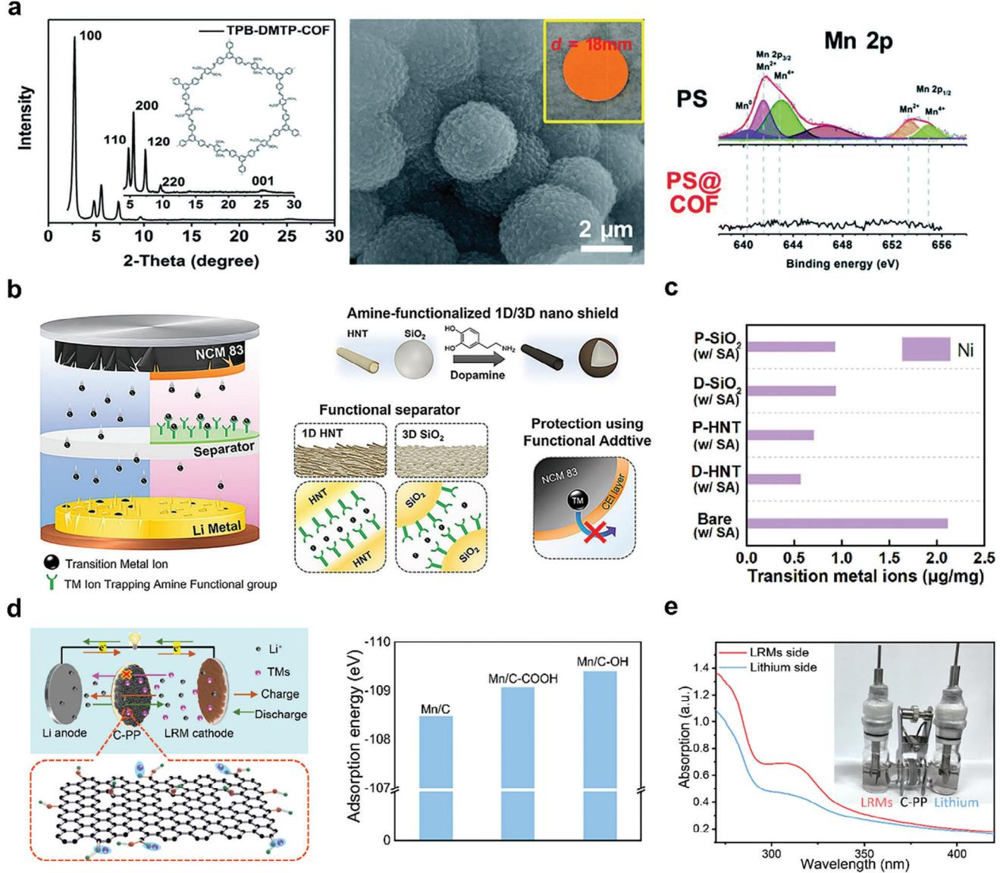

**Figure 11.** a) Structural characterization of the TM capturing COF, including XRD pattern and SEM images, along with the difference in relative Mn2+ detected on the electrode surface by XPS. Reproduced with permission.[\[183\]](#page-26-0) Copyright 2019, the Royal Society of Chemistry. b) Schematic illustration of the TM ion-capturing separator. Two different 1D and 3D amine-functioned at the surface of the nano shield are used for TM capture combined with CEI forming additive. c) Trace amounts of transition metal elements on Li metal electrodes collected by ICP-AES from cells after 100 cycles of the cell in (b). Reproduced with permission.[\[184\]](#page-26-0) Copyright 2023, Elsevier. d) Scheme illustrating the C-PP separator and adsorption energy values of C, C─COOH, and C─OH toward Mn species. e) UV–vis absorption spectroscopy analysis of the electrolyte on both sides of the separator after 40 cycles at 1C for the separator in (d). Reproduced with permission.[\[186\]](#page-26-0) Copyright 2023, Elsevier.

Overall, the redox reactions in the cathode region in Li–S batteries are more complex than those in the conventional LIBs, which involves a stepwise conversion of elemental sulfur (S8) to lithium sulfide (Li2S) during the discharging process and vice versa for charging.[\[188\]](#page-26-0) The intermediate products of the reactions are lithium polysulfides (LiPS) (Li2Sx, 4 ≤ *x* ≤ 8), which are highly soluble in ether-based electrolytes.[\[189\]](#page-26-0) The polysulfides dissolved in the electrolyte are responsible for the shuttle effect. It can react directly with lithium metal, leading to the loss of active substances and a reduction in battery capacity.[\[190\]](#page-26-0) Thus, reducing or blocking the polysulfide crossover in the separator and reaching the LMA is critical to enhance the utilization rate of the anode. An appealing approach is the endowment of a separator with a specific function to prevent polysulfide crossover through the separator.

Other approaches involving porous sulfur scaffolds, electrolyte additives, and functional cathode binders have been dedicated to improving sulfur cathodes and have been reported to improve polysulfide issues, which can be referred to in recent review articles on Li–S batteries.[\[191–193\]](#page-26-0)

Various approaches using functional separators can address polysulfide problems, such as adsorption, ionic sieving,

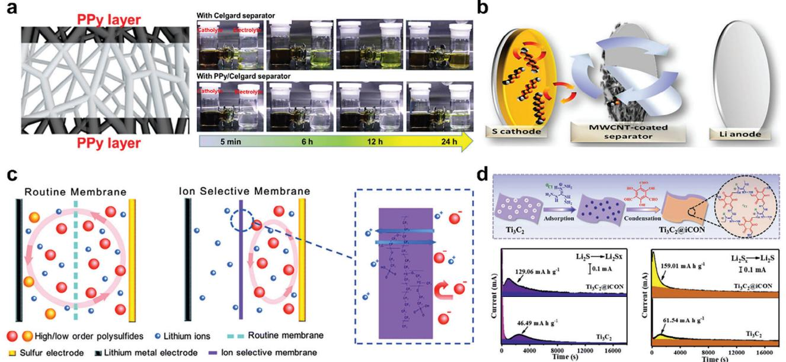

**Figure 12.** a) Schematic illustration of coating a PPy ultrathin nanolayer on both surfaces of the separator. Optical images for the diffusion of polysulfides in glass cells with regular Celgard separator and PPy modified separator. Reproduced with permission.[\[196\]](#page-27-0) Copyright 2019, Elsevier. b) Schematic cell configuration of the Li−S cell employing the MWCNT-coated separator. Reproduced with permission.[\[203\]](#page-27-0) Copyright 2014, American Chemical Society. c) Schematic illustration of the routine and ion sieving separators. Reproduced with permission.[\[205\]](#page-27-0) Copyright 2014, the Royal Society of Chemistry. d) Schematic illustration for the synthesis of Ti3C2@*i*CON. The potentiostatic charge profile at 2.05 V (left) and 2.40 V (right) for the Ti3C2@*i*CON and Ti3C2, indicating a faster and higher conversion of sulfur cathode for Ti3C2@*i*CON. Reproduced with permission.[\[211\]](#page-27-0) Copyright 2021, Wiley-VCH GmbH.

electrostatic repulsion, and catalytic conversion. Furthermore, different functional group coatings with strong chemical adsorption capabilities can capture polysulfides and prevent their crossover. For adsorption, carbonaceous or conducting polymers or inorganic materials are applied to the separator surface.

Carbon matrices are especially explored by doping with heteroatoms (N, B, S, and P),[\[194,196\]](#page-26-0) allowing polarized surface coating materials to realize strong chemical adsorption with polysulfides. Abundant functional surface groups can demonstrate enormous potential. Zeng et al. fabricated a honeycomb-like N, P codoped carbon (HNPC) to modify the pristine separator for use in Li–S batteries.[\[189\]](#page-26-0) The anchoring of N and P in HNPC was revealed using UV–vis and XPS investigation. The cell equipped with the HNPC-modified separator displayed a high initial specific capacity of 1387 mAh g−1 and maintained a large capacity of 930 mAh g−1 after 200 cycles at 0.2C.

Electronically conductive polymers (e.g., PANI, polypyrrole (PPy), and poly(3,4-ethylenedioxythiophene) are also good candidates for separator coating materials owing to their stronger chemical bonding with polysulfides.[\[195–197](#page-27-0)] For example, Li et al. introduced ultrathin, lightweight, and bifunctional PPy onto a commercial Celgard separator using an in situ vapor-phase polymerization approach to prevent the permeation of soluble polysulfides.[\[196\]](#page-27-0) Tenacious chemical interactions between the imine group (─N═) of the quinoid ring in PPy and the sulfur-containing species enabled a trapping mechanism. The adsorption ability of the separator was visualized using the color change in the glass cell when polysulfide penetrated the separator (**Figure 12**a).

In this section, the role of the electrically conducting polymer is focused on its interaction with polysulfides, pivoting crossover to the LMA. Electrically conducting polymers in Section [3.1.1](#page-3-0) apply to the surface of the separator facing the lithium metal differ in their objectives of preventing dendrite penetration through the separator.

Recently, inorganic materials based on metallic compounds (metal oxides,[\[198\]](#page-27-0) sulfides,[\[199\]](#page-27-0) and nitrides[\[200\]](#page-27-0) ) have attracted attention as polysulfide-adsorbing coating materials for separators because of their ability to generate multiple adsorption sites via polar, Lewis acid–base, and meta–sulfur bonding interactions.[\[201\]](#page-27-0) Li. et al. introduced titanium monoxide (TiO) and multiwall carbon nanotube (MWCNT) composites to modify the Celgard 2400.[\[202\]](#page-27-0) The investigation results of XPS demonstrated that the interaction between LixS and TiO originated from the Ti─S bond formation between unsaturated Ti centers in TiO and terminal sulfur of the Sx 2− (polysulfides) due to the Lewis acid-base interactions.

Simple pore blocking (ion sieving) by the coating layer on the separator can effectively prohibit polysulfide movement in a practically promising manner. Manthiram et al. presented the feasibility and practicality of a bifunctional separator with an ultralightweight MWCNT-coating on a commercial Celgard polypropylene sheet for Li–S batteries (Figure 12b).[\[203\]](#page-27-0) The SEM image showed the obstructed active material, which was filtered out by the MWCNT coating. The corresponding energy-dispersive X-ray spectroscopy elemental mapping showed a clear elemental sulfur signal distributed in the carbon matrix, indicating the excellent

interception and ion-sieving effects of the porous MWCNT coating.

The electrostatic repulsion of polysulfides using sulfonated or carboxylated polymers is another approach for addressing soluble polysulfide issues. These polymers possess anionic characteristics and can be easily coated on the separator using the general solvent casting method.[\[204–206\]](#page-27-0) Huang et al. reported an ionselective strategy involving the introduction of sulfonate-ended perfluoroalkyl ether groups onto the separators.[\[205\]](#page-27-0) The −SO3− group on its perfluorinated side chain can selectively allow positive ions to pass and inhibit the passage of negative ions (LiPS) by coulomb interactions (Figure [12c\)](#page-17-0). The resultant battery cell showed a greatly improved cycling stability with a cyclic decay of 0.08% per cycle for 500 cycles. Song et al. prepared a series of carboxyl group functionalized separators by a facile photografting method (PP-*g*-PAA).[\[206\]](#page-27-0) To reveal the ability to suppress the polysulfide shuttle by the modified separator, electrochemical cells were constructed with diverse separators and LiNO3-free electrolytes. Due to physical confinement and electrostatic repulsion to polysulfide species, the resultant battery cell showed improved cycling stability with a cyclic decay of 0.074% per cycle over the first 600 cycles at 0.5C.

Finally, the catalytic conversion of polysulfides to insoluble Li2S on the surface of the separator was demonstrated. Because sulfur (5 × 10−30 S cm−1) and its discharge end product Li2S (10−13 S cm−1) exhibit an insulating character, it severely hinders electron transfer, leading to low sulfur utilization and sluggish redox kinetics.[\[189\]](#page-26-0) Polar metal-based compounds, including sulfides, phosphides, carbides, nitrides, and MXenes, show excellent catalytic and chemisorption abilities to accelerate the conversion kinetics of LiPSs and improve their polysulfide-anchoring capability.[\[199,207–211\]](#page-27-0) Cheng et al. reported sulfur-deficient MoS2 nano-flowers showing good chemisorption and catalytic conversion of polysulfides, inevitably assisted by efficient electron transfer from reduced graphene oxide (*r*GO) to increase LiPS conversion rates.[\[199\]](#page-27-0) Li et al. reported that the coating layer of the PP separator consists of guanidinium-based ionic covalent organic nanosheets (*i*CON) uniformly loaded on Ti3C2 nanosheets (Ti3C2@*i*CON).[\[201\]](#page-27-0) Ti3C2 has been reported to possess negative Zeta potential and rich surface functional groups, such as hydroxyl, oxygen, and fluorine. The oxidation of solid Li2S was also examined using a potentiostatic charge process after galvanostatic discharge. Ti3C2@*i*CON exhibits the increased oxidation current density, suggesting low oxidation overpotential for Li2S conversion. The charge capacity of 129.06 mAh g−1 is also higher than that of Ti3C2 (46.49 mAh g−1), which reflects that Ti3C2@*i*CON also promotes redox kinetics of sulfur species during charge (Figure [12d\)](#page-17-0).

In the development of functional separators for Li–S and the electrochemical investigation of batteries, the strong adsorption of polysulfide, higher Li-ion transport, robust mechanical properties, improved rate capability, thermal stability, lightweight, and maximization of sulfur cathode utilization should be considered in future studies.

#### **3.3. Miscellaneous Complex Approach**

Apart from those engineered to improve the performance of electrodes in LMBs, other interesting functional separators have been designed to address safety issues (flame-retardant separators) and pinpoint treatments for different problems (anisotropic separators). Multifunctional separators from thermostable polymers are introduced in this section (**Figure [13](#page-19-0)**).

### *3.3.1. Flame-Retardant: The New Safety Issue*

With the infiltration of lithium secondary batteries into largesized applications such as EVs and ESSs, safety concerns have become one of the most important topics. The failure of batteries combined with thermal runaway poses great danger and results in combustion and even explosions.[\[212\]](#page-27-0) Safety failure is initiated by an internal short circuit triggered by lithium dendrite formation, overcharging conditions, and external penetration. The large internal ionic flow caused by the short circuit results in uncontrolled electrochemical reactions at the electrodes and battery overheating. The accumulation inside the cell causes the decomposition of the cathode materials, followed by the release of gaseous oxygen. The highly exothermic reactions between the heated oxygen, liquid electrolyte, and separator can cause disastrous events.[\[213\]](#page-27-0)

The most reliable and effective approach for addressing safety concerns in LMBs is the development of advanced battery components (electrolytes, electrodes, and separators) with innately high thermal stability and fire resistance. In particular, the two most vulnerable components are liquid electrolytes and polymeric separators.[\[214,215\]](#page-27-0) Functional additives that exhibit flameretardancy can be added to liquid electrolytes to reduce fire hazards. However, this effect can only be obtained when large amounts of flame retardants are applied, which severely deteriorate battery performance by affecting electron/ion transport, reducing ionic conductivity, or narrowing the electrochemical stability window of batteries.[\[216\]](#page-27-0) Therefore, its practical applicability should be further improved.

The role of the battery separator, which is another component, is to physically isolate the positive and negative electrodes, avoid short circuits while allowing ion flow and is closely related to battery safety.[\[212\]](#page-27-0) Compared with safe electrolyte designs, the development of high-performance and flame-retardant separators is an effective and feasible approach to simultaneously improve the flame-retardancy and electrochemical performance of cells.[\[217\]](#page-27-0) Much research has been conducted to provide flame-retardant functional separators since 2015.

Flame-retardancy mechanisms can be divided into four types. The flame-retardant separators are engineered to utilize more than one mechanism. The first type of flame-retardant mechanism in the separator involves the application of a flameretardant agent that promptly vaporizes to absorb external heat and extinguishes the fire before the cell reaches a severe thermal runaway state.[\[218\]](#page-27-0) Metal hydroxides, such as aluminum hydroxide (Al(OH)3) and magnesium hydroxide (Mg(OH)2), are representative flame-retardant agents. They can lower the surface temperature and terminate the combustion reaction of the burning material.[\[219\]](#page-27-0) Yeon et al. prepared two types of composite separators by adding two metal hydroxides, Mg(OH)2 and Al(OH)3 to PE separators, respectively.[\[220\]](#page-27-0) The released water from the two metal oxides at heated conditions is responsible for the flame-retardant characteristics of the composite separator.

**Figure 13.** Summary illustrations representing miscellaneous complex approaches employing functional separators to improve the LMB performance. a) Flame-retardant separator. b) Multifunctional separator.

The self-extinguishing time (SET) was reduced to 7 s and 6 s compared to those of the bare PE separators for Al(OH)3 and Mg(OH)2), respectively. However, due to the water formation, the approach can be restrictive to LMA systems.

The second mechanism involves the formation of a nonvolatile protective film by the combustion of the added flameretardant agents. The film is isolated from the air to inhibit further reactions.[\[214,215,221\]](#page-27-0) Inorganic materials such as MoO3 and LLZTO are used to slow the combustion reactions in this mechanism. Zeng et al. designed a bilayer separator composed of MoO3 and LLZTO with the thermally stable PVDF-HFP to form each layer (**Figure [14](#page-20-0)**a).[\[222\]](#page-27-0) When MoO3 and LLZTO are exposed to the flame, they form protective graphitized carbon, MOFx, and LaFx to demonstrate improved flame-retardant performances. When exposed to the fire, the bilayer separator was free from ignition for up to 30 s (Figure [14b\)](#page-20-0).

The third flame-retardancy mechanism is related to a reduction in the concentration of oxygen gas, which drives the creation of additional oxygen and hydroxyl radicals that participate in combustion reactions.[\[223\]](#page-27-0) This can be achieved using flameretardant materials that release nitrogen gas under fire, dilute the oxygen concentration, and decelerate the combustion reaction. Han et al. prepared a flame-retardant separator using the phase separation process to fabricate uniformly incorporated flameretardants (melamine pyrophosphate, MPP) into the polymer matrix (PVDF-HFP/MPP separator).[\[217\]](#page-27-0) At high temperatures, MPP decomposed to release non-flammable gas products, such as NH3, NO, and H2O. These gases can dilute flammable gases. The PVDF-HFP/MPP separator exhibited four times faster flame extinguishing time compared to that of the base separator.

The last type of flame-retardant separator scavenges gaseous free radicals (halogens or phosphorus) that combine with H⋅, OH⋅ flammable components.[\[224–228\]](#page-27-0) Liu et al. fabricated a thermo-responsive composite separator by coating the PP separator with silica microcapsules that are internally encapsulated with both a phase-change material (PCM) and a flame retardant (triethyl phosphate, TEP) (PCM-TEP@SiO2/PP). Here, stearic acid was used as a PCM.[\[224\]](#page-27-0) Once the internal temperature of batteries reaches the melting point of PCM, then PCM melts to release the flame retardant. TEP vaporizes and decomposes to generate phosphorus-containing free radicals (PO⋅ and PO2⋅) to capture the highly active H⋅ and HO⋅ radicals and terminate the combustion reaction. It took no longer than 1 s to completely extinguish the flame for the PCM-TEP@SiO2/PP separator soaked with carbonate-based electrolytes, and a residual weight of 84.6% remained, showing excellent flame-retardant ability of the separator.

Multiple flame-retarding mechanisms can be introduced into a functional separator by simultaneously incorporating flameretarding agents from different categories. Cui et al. combined the third and fourth aforementioned mechanisms to prepare a flame-retardant separator.[\[216\]](#page-27-0) A brominated flame-retardant additive (decabromodiphenyl ethane, DBDPE) and inorganic particles (antimony trioxide, Sb2O3) were sequentially coated onto the PE separator to form a two-layer functional separator (Figure [14c\)](#page-20-0). The halogen radicals generated from the layer containing DBDPE neutralized the H⋅ and HO⋅ radicals emitted by the chain reaction of the burning electrolyte. Synergistically, the formed halogen radicals reacted with Sb2O3 and generated antimony tribromide (SbBr3), which formed dense white smoke and extinguished the flame via oxygen exclusion. The SET decreased with the increasing thickness of the DBDPE coating layer, confirming that the flame-retardant additives helped reduce the flammability of the electrolyte (Figure [14d\)](#page-20-0).

Meanwhile, Zeng et al. reported flame-retardant separators using the second and fourth mechanisms.[\[212\]](#page-27-0) Researchers fabricated a fireproofing core-shell membrane by one-step coaxial

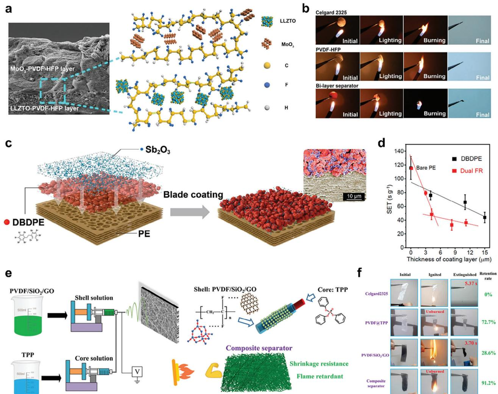

**Figure 14.** a) Cross-sectional SEM images of the flame-retardant bilayer separator and the schematic illustration for the bilayer structure. b) Optical photographs of the burning test of Celgard 2325, PVDF-HFP, and flame-retardant bilayer separators. Reproduced with permission.[\[222\]](#page-27-0) Copyright 2019, American Chemical Society. c) Scheme illustrating the formation of the bilayered dual flame-resistant composite separator and the corresponding SEM image. d) Self-extinguishing time (SET) of composite separators with different thicknesses of brominated flame-retardant additive (DBDPE) and dual flame-retardant coating layers. Reproduced with permission.[\[216\]](#page-27-0) Copyright 2021, American Chemical Society. e) Schematic diagram of the coaxial electrospinning process for fabrication of fireproofing TPP@PVDF/SiO2/GO fibers. f) Digital photographs of the lighter combustion test of Celgard2325, PVDF@TPP, PVDF/SiO2/GO, and TPP@PVDF/SiO2/GO separators. Reproduced with permission.[\[212\]](#page-27-0) Copyright 2023, American Chemical Society.

electrospinning, where the shell layer was a mixture of PVDF, silicon dioxide (SiO2), and graphene oxide (GO), and the core contained triphenyl phosphate (TPP) (Figure 14e). The TPP, which shows faster release in the open flame, released from the core removes generated H⋅ and OH⋅ radicals during combustion, while GO at the shell provided a graphitized carbon layer isolating the heat. The synergistic effect of TPP and GO demonstrated 91.2% intact condition despite the 15 s of open flame exposure (Figure 14f).

Despite the various studies on different flame-retardant mechanisms, limitations still impede the practical success of flameretardant separators. Flame-retardant materials (nonflammable polymers or additives), which must be introduced in large quantities compared with that of other additives, are expensive and require complicated manufacturing methods, making mass production difficult.[\[214\]](#page-27-0) In addition, large amounts of flame retardants deteriorate the battery performance in terms of ionic conductivity, electrochemical stability, and compatibility with cathodes and LMAs under high-voltage.[\[224\]](#page-27-0) Therefore, improved flame-retardant materials must be developed to minimize these drawbacks. Nevertheless, flame retardancy is a critical issue concerning battery safety and requires continuous progress. Improving the flame-retardant properties of other components in the cell, along with the separator, can be a good approach for increasing practical availability. Although not discussed in detail, ASSLBs present another way of solving safety problems with inflammable liquid electrolytes. Recent progress in ASSLBs can be found in the literature.

#### *3.3.2. Combination of Functions*

Sections [3.1](#page-3-0) and [3.2](#page-12-0) introduced different types of functional separators to provide solutions that focus on one of the electrodes in LMBs. It can be expected that a multifunctional separator possessing both cathode and anode improvement approaches will be advantageous.

Recently, a separator having anisotropic characters on either side is attracting growing interest. This type of multifunctional separator is often referred to as a Janus separator. Most multifunctional separators with anisotropic sides have been studied in LIBs and Li–S batteries. In Li–S batteries, Janus separators are utilized to simultaneously handle the shuttle effect and dendrite growth, where detailed information can be found in a previous review.[\[229,230\]](#page-27-0) However, only a few studies have been published on Janus separators for LMBs.

The most feasible way to obtain the anisotropic sides of a separator is through different modifications on the surface of commercial polyolefin, particularly through coating technology. Various combinations on either side of the separator have been developed to improve the LMBs. The objectives of an asymmetric layered separator can be divided into two categories based on the target of improvement. One improves the total cell performance (higher ionic conductivity, increased tLi +) and simultaneously reduces dendrite formation at the LMA.[\[231–234\]](#page-27-0) In the second, each side of the separator is responsible for improving the facing electrode.[\[156,235\]](#page-26-0) Overall, both approaches improve the total number of LMB cells.

Liang et al. used roll-to-roll micro gravure coating technology to fabricate a double-side asymmetric composite separator having 2 μm thick lithium aluminum germanium phosphate (LAGP) and 3 μm thick PVDF-HFP layer (LAGP/PP/PVDF-HFP) intended for improving ionic conductivity of the cell and dendrite suppression from reduced interfacial resistance between the separator and LMA, respectively.[\[231\]](#page-27-0) The LAGP layer is fabricated using a coating solution including PVDF binder and NMP solvent.

Ding et al. reported a Z5P/PE/SBF separator that promotes Li-ion flux homogenization by constraining anion transport at the cathode side using Z5P (ZSM-5-Poly dimethyl diallyl ammonium chloride), while building an inorganic-rich SEI, Li–Sb alloy (Li3Sb), and LiF to suppress Li dendrite growth on the cathode side using SBF (SbF3).[\[232\]](#page-27-0) The binder used for both the coating sides was PVDF, but the solvents used were NMP and dimethylformamide for Z5P and SBF, respectively. The role of the anisotropic surfaces of the separator prepared by simple doctor blading was confirmed by the higher tLi + value estimated by impedance spectroscopy and DC polarization measurements and the existence of Li3Sb, SbOx, and LiF in the SEI via TOF-SIMS and XPS analyses. As a result, enhanced cyclic stability of NCM811/Li cell equipped with this separator was reported.

Furthermore, a combination of acidic capture on the cathode side and isotropic Li deposition on the LMA in a single separator has been recently reported (**Figure [15](#page-22-0)**a).[\[156\]](#page-26-0) A hybrid layer of molecular sieve and sulfonated melamine formaldehyde on the coated surface of the separator was used to scavenge HF and H2O impurities in the carbonate-based electrolytes. Another separator surface with an Ag2S layer forms an in situ Li10Ag3- Li2S composite matrix when it contacts the Li anode surface. The composite layer presented ≈3–4 orders of magnitude high ionic conductivity (1.09 × 10−4 S cm−1) but lower electric conductivity (3.27 × 10−7 S cm−1) than SEI with general components of LiF and Li2CO3, which is advantageous in simultaneously promoting interfacial ion diffusion and preventing Li electrodeposition at the Li10Ag3-Li2S composite layer. The ionic conductivity of the Li10Ag3-Li2S composite layer composting SEI was made using a 50 μm thick Ag2S layer coated on one side of stainless steel (SS) after contacting with Li foil for 6 days followed by measuring the bulk resistance of SS|in situ prelithiated Ag2S|SS cell was assembled for measuring the bulk resistance.

A Janus separator that uses the same sustained release mechanism from both sides of the separator but contains different active substances in the coated layer for the cathode and anode has also been reported.[\[235\]](#page-27-0) The PVDF-HFP binder and acetone solvent were used to fabricate the coating solution by spray coating on either side of the separator surface and varying the active agent. This asymmetric SRF loaded with lithium bis(oxalate)borate (LiBOB) and LiNO3 on each side was designed to simultaneously stabilize the CEI and SEI in high-voltage LMBs (Figure [15b\)](#page-22-0). Researchers have insisted that the released Li-BOB formed a stable B-containing CEI, which suppresses parasitic electrolyte decomposition and limits the TM dissolution of NCM523 under high-voltage operation. Meanwhile, a uniform SEI was formed from the continuously dissolved LiNO3, enabling uniformly dense Li deposition. Investigation of the SEI and CEI using XPS to detect N and B atoms, respectively. However, results of release behavior characteristics of LiBOB and LiNO3 have not been provided.

Other fabrication methods for asymmetric separators have been also investigated by the previous authors. For example, an electrospinning technique was adopted to fabricate a poly(butylene succinate) nanofibrous membrane, in which a layer of conductive MXene and silica particles on one side and only silica particles on the other side were fabricated by sequential vacuum filtration.[\[233\]](#page-27-0) MXene suppresses dendrite formation with the assistance of SiO2. SiO2 particles also improve ionic conductivity by enhancing wettability.

Another example of fabricating an asymmetric Janus separator is by casting two separate films of 30 μm thickness, each using PVDF-HFP and NMP as the binder and solvent, respectively.[\[236\]](#page-27-0) Then, the two composite films were directly assembled in the A-and-B configuration using hot pressing. The final separator displayed a thickness of 35 μm. The layer A is composed of Aldoped lithium lanthanum zirconate oxide (Al-LLZO) on the side facing the Li anode, and B is a composite film containing Al-LLZO and N-doped carbon quantum dots facing the cathode. Layer A prevents dendrite growth by favoring a uniform Li-ion carrier flux and hindering undesired ion accumulation, whereas layer B inhibits the formation of ion solvent clusters in the electrolyte, protects from side reactions involving the NCM cathode, and acts as a physical barrier against any possible dendrite penetration.

The anisotropic separator is promising in that it can present multiple functions. In particular, tailor-made treatments for the cathode and anode can enhance the performance of the total battery system. However, challenges still remain in preparing different composition coating layers. The sequential coating of the layers can affect the coating quality of the other side, which indicates consideration of the practical availability of the coating

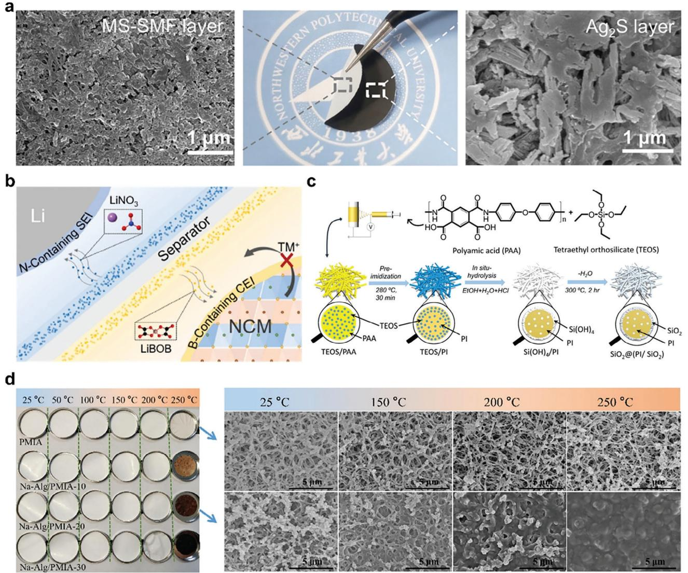

**Figure 15.** a) Optical and SEM images of the coating layers on the faced-to-cathode side (MS-SMF) and the faced-to-anode side (Ag2S) in the Janus separator. Reproduced with permission.[\[156\]](#page-26-0) Copyright 2022, Wiley-VCH GmbH. b) Schematic of constructing N-containing SEI and B-containing CEI in NCM/Li cell by asymmetrically sustained releasing LiNO3 and LiBOB, respectively. Reproduced with permission.[\[235\]](#page-27-0) Copyright 2022, Elsevier. c) Schematic of the fabrication strategy for the in situ SiO2@(PI/SiO2) hybrid separator. Reproduced with permission.[\[238\]](#page-27-0) Copyright 2018, American Chemical Society. d) Optical photos of the pristine PMIA separator and the Na-Alg/PMIA composite separator heat treatment at different temperatures (left). The SEM images of the pristine PMIA separator and the Na-Alg/PMIA-20 composite separator treated at different temperatures, indicating the shutdown properties of the Na-Alg/PMIA composite separator. Reproduced with permission.[\[246\]](#page-27-0) Copyright 2023, Elsevier.

procedure. Hence, approaches that avoid multiple coating steps to present different action layers on the separator surface are desirable for practical considerations. In addition, a detailed and sophisticated analysis is required to examine each component applied to different separator surfaces and define whether a synergistic effect exists.

Unlike asymmetric separators, which demonstrate different roles on each side, thermally reinforced functional separators use thermally stable substrates and the same coatings on both sides to improve LMBs. Polyimide (PI), poly(mphenyleneisophthalamide) (PMIA), polyacrylonitrile, polyethylene terephthalate, and poly(ether ether ketone) demonstrate excellent heat resistance compared with the polyolefins (PE, PP) used to fabricate separators, which can be substituted to obtain high thermal properties.[\[237\]](#page-27-0)

Additional materials are applied as the coating layer or homogeneously dispersed inside the matrix to improve the 1) mechanical properties, 2) Li-ion transport, and 3) shutdown function, in addition to enhancing the thermal properties.

First, inorganics can be added to heat-resistant separators to improve thermal and mechanical stability.[\[238–241\]](#page-27-0) For example, PI separators with unique SiO2@(PI/SiO2) hybrid structures were fabricated using a mixture of the prepolymer polyamic acid and SiO2 precursor for electrospinning, followed by imidization and hydrolysis (Figure 15c).[\[238\]](#page-27-0) This organic–inorganic hybridtype separator exhibited high mechanical strength, which was confirmed by the five times higher tensile strength (from 8 to 42 MPa) and higher thermal stability, as well as the increase in deformation temperature from the thermal mechanical analysis. In high-rate operation, another aspect of the heat problem, the local heat buildup, should also be considered. Yuan et al. reported a composite-type separator using PVDF-HFP and PDAcoated CNT (CNT@PDA/PVDF-HFP). As the CNTs have a better thermal conductivity (≈3000 W m−1 K−1), they can evenly distribute the heat of the polymer matrix and prevent lithium dendrite problems caused by heat accumulation. As a result, authors can achieve high capacity retention of 87.35% after 800 cycles at 5 C using the CNT@PDA/PVDF-HFP separator in LFP/Li cells.[\[242\]](#page-27-0)

Second, electron-withdrawing groups are incorporated into thermostable separators to enhance Li-ion mobility and heat resistance.[\[243–245\]](#page-27-0) For example, a modified dianhydride component with electron-withdrawing groups (trifluoromethyl (─CF3) groups) underwent polycondensation with pyromellitic dianhydride to obtain polyamic acid, which was further subjected to sequential electrospinning and post-imidization to form a fluorinated PI nanofiber separator.[\[243\]](#page-27-0) The authors insisted that the fluorinated PI separator shows a tLi + value of 0.881, which is higher than the Celgard separator.

The last example of improving a heat-resistant matrix separator is endowing it with shutdown properties.[\[246,247\]](#page-27-0) For example, a heat-resistant PMIA membrane was fabricated using nonsolvent-induced phase separation (Figure [15d\)](#page-22-0).[\[246\]](#page-27-0) Then, sodium alginate (Na-Alg), which forms strong hydrogen bonds between the ─CONH─ bonds in PMIA and ─OH group in Na-Alg, was coated onto the fabricated membrane to form a separator with shutdown characteristics while demonstrating dimensional stability at elevated temperatures. The separator went through shutdown when heated to 200 °C. At this temperature, Na-Alg underwent carbonization with the breakage of hydrogen bonds to block the pores of the PMIA separator and prevent Li-ion movement. The plugging of the pores was observed using SEM.

However, despite the advantages of using heat-resistant polymers as substrates for separators, the processability and cost of materials are drawbacks compared with that of the use of polyolefin separators.

# **4. Summary and Perspectives**

LMB is one of the most promising post-LIBs that express highenergy density, and studies should continue to obtain practical success. However, a high level of hurdles still remain that should be overcome by the various research approaches.

A separator is a basic component in the battery directly connected with safety and cycling maintenance. Its fundamental role is to prevent contact between the two electrodes and provide a Liion transport pathway. Functional separators can provide effective options for addressing the most notorious issues of lithium dendrites and side reactions on the Li metal surface in LMBs.

Therefore, numerous studies in various approaches have been conducted with functional separators. However, many unexplored aspects exist, and new concepts requiring intensive research remain.

In this report, we reviewed functional separators for LMB based on approaches to improve the challenges toward the cathode and LMA, respectively. The effective engineering of the separators to improve the comprehensive properties of the LMB, such as Li-ion diffusion, internal resistance, cycling stability, coulombic efficiency, rate performance, and safety, can be achieved based on a deep understanding of the characteristics of the separator and LMB, thereby making the separator a crucial component.

We demonstrated ten major functional separator approaches for solving challenges and improving the performance of LMBs, organized based on a focusing electrode. The state of the studies varied in depth from the early to considerably developed stages. In two years, more than 30 papers were published on functional separators for the inhibition of the shuttle effect for Li–S batteries, Li-ion channels, and flame retardation. Meanwhile, research on sustained release concepts and conductive separators is at an early stage and is expected to increase. Anisotropic separators, in the early stages, are promising among various engineering approaches owing to their potential to simultaneously manage the problems of both electrodes.

Further studies must be conducted to overcome the predictable complexity of the fabrication process and achieve practical applicability.

Unfortunately, a common limitation exists in many studies for the different approaches. The success criterion of the new functional separators has been simply determined by the performance improvement in LMBs with the absence of deeper investigation, leaving ambiguity in the analysis. A deeper understanding of functional separators is indispensably required to achieve the eventual goal of the practical success of LMBs. Postmortem cell analysis, which combines the investigation of composition and morphology changes at the electrode, can be a good example for evaluating the functional separator effect.

When developing a new functional separator for LMBs, the following steps are required: approach selection, design, material selection, fabrication (mixing and coating), engineering (surface modification), characterization (structure, physical, and thermal properties), cell application (coin or pouch type), and analysis (electrochemical and morphology). In addition to these steps, other approaches, such as computation, simulation, and operando analysis, can be used to optimize functional separators. Systematic approaches can lead to sprout novel approaches other than those introduced in this review.

As an original battery component, upgrading the separator can potentially provide solutions to the challenges in LMBs. Further extension of this functional separator can be applied to various types of batteries. Therefore, intensive and extensive research on the functional separator is expected to continue.

# **Acknowledgements**

J.S. and J.I. contributed equally to this work. This work was supported by the National Research Foundation of Korea (NRF) granted Mid-Career Research Program (No. 2021R1A2C2005764) and by the Development Program of Core Industrial Technology (No. 20012326) funded by the Ministry of Trade, Industry & Energy (MOTIE, Korea).

# **Conflict of Interest**

The authors declare no conflict of interest.

# **Keywords**

functional separator, high-energy-density, lithium dendrites, lithium metal batteries, side reactions

> Received: December 26, 2023 Revised: February 26, 2024 Published online: March 7, 2024

- [1] J. Lu, T. Wu, K. Amine, *Nat. Energy* **2017**, *2*, 17011.
- [2] E. A. Olivetti, G. Ceder, G. G. Gaustad, X. Fu, *Joule* **2017**, *1*, 229.
- [3] L. Jin, C. Shen, Q. Wu, A. Shellikeri, J. Zheng, C. Zhang, J. P. Zheng, *Adv. Sci.* **2021**, *8*, 2005031.
- [4] N. Nitta, F. Wu, J. T. Lee, G. Yushin, *Mater. Today* **2015**, *18*, 252.
- [5] G. G. Eshetu, H. Zhang, X. Judez, H. Adenusi, M. Armand, S. Passerini, E. Figgemeier, *Nat. Commun.* **2021**, *12*, 5459.
- [6] Z. Xu, X. Shi, X. Zhuang, Z. Wang, S. Sun, K. Li, T. Y. Zhang, *Research* **2021**, *2021*, 9842391.
- [7] B. Liu, J.-G. Zhang, W. Xu, *Joule* **2018**, *2*, 833.
- [8] X. Shen, H. Liu, X.-B. Cheng, C. Yan, J.-Q. Huang, *Energy Storage Mater.* **2018**, *12*, 161.
- [9] W. Xu, J. Wang, F. Ding, X. Chen, E. Nasybulin, Y. Zhang, J.-G. Zhang, *Energy Environ. Sci.* **2014**, *7*, 513.
- [10] S. Tobishima, Y. Sakurai, J. Yamaki, *J. Power Sources* **1997**, *68*, 455.
- [11] H. Ye, Y. Zhang, Y. X. Yin, F. F. Cao, Y. G. Guo, *ACS Central Sci.* **2020**, *6*, 661.
- [12] Q. Yun, Y. B. He, W. Lv, Y. Zhao, B. Li, F. Kang, Q. H. Yang, *Adv. Mater.* **2016**, *28*, 6932.
- [13] C. Cui, C. Yang, N. Eidson, J. Chen, F. Han, L. Chen, C. Luo, P. F. Wang, X. Fan, C. Wang, *Adv. Mater.* **2020**, *32*, 1906427.
- [14] Y. J. Gong, S. Pyo, H. Kim, J. Cho, H. Yun, H. Kim, S. Ryu, J. Yoo, Y. S. Kim, *Energy Environ. Sci.* **2021**, *14*, 940.
- [15] R. Xu, X. Q. Zhang, X. B. Cheng, H. J. Peng, C. Z. Zhao, C. Yan, J. Q. Huang, *Adv. Funct. Mater.* **2018**, *28*, 1705838.
- [16] D. Wang, W. Zhang, W. Zheng, X. Cui, T. Rojo, Q. Zhang, *Adv. Sci.* **2017**, *4*, 1600168.
- [17] Y. Yamada, J. Wang, S. Ko, E. Watanabe, A. Yamada, *Nat. Energy* **2019**, *4*, 269.
- [18] United States Advanced Battery Consotrium (USABC). Lithium Electrode Based Cell and Manufacturing for Automotive Traction Applications, USCAR, <https://uscar.org/usabc/> (accessed: December 2023).
- [19] H. Liu, X. Sun, X. B. Cheng, C. Guo, F. Yu, W. Bao, T. Wang, J. Li, Q. Zhang, *Adv. Energy Mater.* **2022**, *12*, 2202518.
- [20] Y. X. Zhan, P. Shi, X. X. Ma, C. B. Jin, Q. K. Zhang, S. J. Yang, B. Q. Li, X. Q. Zhang, J. Q. Huang, *Adv. Energy Mater.* **2021**, *12*, 2103291.
- [21] Q. Li, S. Zhu, Y. Lu, *Adv. Funct. Mater.* **2017**, *27*, 1606422.
- [22] X. Q. Zhang, X. Chen, X. B. Cheng, B. Q. Li, X. Shen, C. Yan, J. Q. Huang, Q. Zhang, *Angew. Chem.-Int. Ed.* **2018**, *57*, 5301.
- [23] E. Markevich, G. Salitra, D. Aurbach, *ACS Energy Lett.* **2017**, *2*, 1337.
- [24] M. Yan, C. Y. Wang, M. Fan, Y. Zhang, S. Xin, J. Yue, X. X. Zeng, J. Y. Liang, Y. X. Song, Y. X. Yin, R. Wen, Z. Liu, L. J. Wan, Y. G. Guo, *Adv. Funct. Mater.* **2023**, *34*, 2301638.
- [25] Y. Jie, C. Tang, Y. Xu, Y. Guo, W. Li, Y. Chen, H. Jia, J. Zhang, M. Yang, R. Cao, Y. Lu, J. Cho, S. Jiao, *Angew. Chem.-Int. Ed.* **2023**, *136*, 202307802.
- [26] W. Wu, W. Luo, Y. Huang, *Chem. Soc. Rev.* **2023**, *52*, 2553.
- [27] B. Wu, J. Li, S. Han, J. Mao, P. Wen, M. Chen, Y. Zhao, J. Lin, X. Lin, *Giant* **2023**, *16*, 100201.
- [28] Z. Yang, Z. Yu, Y. Qu, X. Wang, W. Lu, T. Li, N. Chen, M. Yao, P. Gao, D. Zhang, F. Du, *Chem. Eng. J.* **2023**, *477*, 147077.
- [30] K. N. Wood, M. Noked, N. P. Dasgupta, *ACS Energy Lett.* **2017**, *2*, 664.
- [31] G. Rong, X. Zhang, W. Zhao, Y. Qiu, M. Liu, F. Ye, Y. Xu, J. Chen, Y. Hou, W. Li, W. Duan, Y. Zhang, *Adv. Mater.* **2017**, *29*, 1606187.
- [32] R. Zhang, X. Shen, Y.-T. Zhang, X.-L. Zhong, H.-T. Ju, T.-X. Huang, X. Chen, J.-D. Zhang, J.-Q. Huang, *J. Energy Chem.* **2022**, *71*, 29.
- [33] H. Liu, X. B. Cheng, R. Xu, X. Q. Zhang, C. Yan, J. Q. Huang, Q. Zhang, *Adv. Energy Mater.* **2019**, *9*, 1902254.
- [34] P. Choi, B. Parimalam, Y. Li, S. Litster, *J. Power Sources* **2023**, *581*, 233468.
- [35] H. Kwon, H. Kim, J. Hwang, W. Oh, Y. Roh, D. Shin, H.-T. Kim, *Nat. Energy* **2023**, *9*, 57.
- [36] J. S. Hummelshoj, J. Blomqvist, S. Datta, T. Vegge, J. Rossmeisl, K. S. Thygesen, A. C. Luntz, K. W. Jacobsen, J. K. Norskov, *J. Chem. Phys.* **2010**, *132*, 071101.
- [37] G. Jiang, J. Liu, J. He, H. Wang, S. Qi, J. Huang, D. Wu, J. Ma, *Adv. Funct. Mater.* **2023**, *33*, 2214422.
- [38] H. Dai, J. Dong, M. Wu, Q. Hu, D. Wang, L. Zuin, N. Chen, C. Lai, G. Zhang, S. Sun, *Angew. Chem.-Int. Ed.* **2021**, *60*, 19852.
- [39] X. Sun, Q. Niu, D. Song, S. Sun, M. Li, T. Ohsaka, F. Matsumoto, J. Wu, *J. Energy Storage* **2020**, *27*, 101142.
- [40] D. Wu, J. He, J. Liu, M. Wu, S. Qi, H. Wang, J. Huang, F. Li, D. Tang, J. Ma, *Adv. Energy Mater.* **2022**, *12*, 2200337.
- [41] H. Adenusi, G. A. Chass, S. Passerini, K. V. Tian, G. Chen, *Adv. Energy Mater.* **2023**, *13*, 2203307.
- [42] C. Chen, Q. Liang, G. Wang, D. Liu, X. Xiong, *Adv. Funct. Mater.* **2021**, *32*, 2107249.
- [43] J. Liu, M. Wu, X. Li, D. Wu, H. Wang, J. Huang, J. Ma, *Adv. Energy Mater.* **2023**, *13*, 2300084.
- [44] Y. Liu, X. Xu, O. O. Kapitanova, P. V. Evdokimov, Z. Song, A. Matic, S. Xiong, *Adv. Energy Mater.* **2022**, *12*, 2103589.
- [45] C. Hou, J. Han, P. Liu, C. Yang, G. Huang, T. Fujita, A. Hirata, M. Chen, *Adv. Energy Mater.* **2019**, *9*, 1902675.
- [46] H. An, Y. Roh, Y. Jo, H. Lee, M. Lim, M. Lee, Y. M. Lee, H. Lee, *Energy Environ. Sci.* **2022**, *6*, e12397.
- [47] United States Advanced Battery Consortrium (USABC). Lithium Battery Separator Goals, USCAR, <https://uscar.org/usabc/> (accessed: December 2023).
- [48] P. Arora, Z. Zhang, *Chem. Rev.* **2004**, *104*, 4419.
- [49] M. F. Lagadec, R. Zahn, V. Wood, *Nat. Energy* **2018**, *4*, 16.
- [50] D. Chen, Y. Liu, C. Feng, Y. He, S. Zhou, B. Yuan, Y. Dong, H. Xie, G. Zeng, J. Han, W. He, *Electron* **2023**, *1*, e1.
- [51] Y. Wang, Q. Wang, X. Wei, Z. Song, Y. Lan, W. Luo, C. Yin, Z. Yue, L. Zhou, X. Li, *Ceram. Int.* **2021**, *47*, 10153.
- [52] R. Xu, L. Sheng, H. Gong, Y. Kong, Y. Yang, M. Li, Y. Bai, S. Song, G. Liu, T. Wang, X. Huang, J. He, *Adv. Energy Mater.* **2021**, *23*, 2001009.
- [53] X. Chen, R. Zhang, R. Zhao, X. Qi, K. Li, Q. Sun, M. Ma, L. Qie, Y. Huang, *Energy Storage Mater.* **2020**, *31*, 181.
- [54] Y. Liu, Q. Liu, L. Xin, Y. Liu, F. Yang, E. A. Stach, J. Xie, *Nat. Energy* **2017**, *2*, 1.
- [55] Q. Zhao, R. Wang, X. Hu, Y. Wang, G. Lu, Z. Yang, Q. Liu, X. Yang, F. Pan, C. Xu, *Adv. Sci.* **2022**, *9*, 2102215.
- [56] Y. Liu, S. Xiong, J. Wang, X. Jiao, S. Li, C. Zhang, Z. Song, J. Song, *Energy Storage Mater.* **2019**, *19*, 24.
- [57] Z. Li, M. Peng, X. Zhou, K. Shin, S. Tunmee, X. Zhang, C. Xie, H. Saitoh, Y. Zheng, Z. Zhou, Y. Tang, *Adv. Mater.* **2021**, *33*, 2100793.
- [58] H. Lee, X. Ren, C. Niu, L. Yu, M. H. Engelhard, I. Cho, M. H. Ryou, H. S. Jin, H. T. Kim, J. Liu, W. Xu, J. G. Zhang, *Adv. Funct. Mater.* **2017**, *27*, 1704391.
- [59] K. Wen, L. Liu, S. Chen, S. Zhang, *RSC Adv.* **2018**, *8*, 13034.
- [60] M. M. U. Din, R. Murugan, *Sci. Rep.* **2019**, *9*, 16795.

- [61] M. Liu, N. Deng, J. Ju, L. Wang, G. Wang, Y. Ma, W. Kang, J. Yan, *ACS Appl. Mater. Interfaces* **2019**, *11*, 17843.
- [62] L.-y. Wei, N.-p. Deng, J.-g. Ju, H.-j. Zhao, G. Wang, H.-y. Xiang, W.-m. Kang, B.-w. Cheng, *Chem. Eng. J.* **2021**, *424*, 130346.
- [63] J. Oh, H. Jo, H. Lee, H.-T. Kim, Y. M. Lee, M.-H. Ryou, *J. Power Sources* **2019**, *430*, 130.
- [64] N. Deng, Z. Peng, X. Tian, Y. Li, J. Yan, Y. Liu, W. Kang, *J. Colloid Interface Sci.* **2023**, *634*, 949.
- [65] L. Xu, X. Y. Daphne Ma, W. Wang, J. Liu, Z. Wang, X. Lu, *J. Mater. Chem. A* **2021**, *9*, 3409.
- [66] C.-Z. Zhao, P.-Y. Chen, R. Zhang, X. Chen, B.-Q. Li, X.-Q. Zhang, X.-B. Cheng, Q. Zhang, *Sci. Adv.* **2018**, *4*, eaat3446.
- [67] J. Zheng, M. S. Kim, Z. Tu, S. Choudhury, T. Tang, L. A. Archer, *Chem. Soc. Rev.* **2020**, *49*, 2701.
- [68] M. Kim, J. Seo, J. P. D. Suba, K. Y. Cho, *Mat. Chem. Front.* **2023**, *7*, 5475.
- [69] D. H. Liu, Z. Bai, M. Li, A. Yu, D. Luo, W. Liu, L. Yang, J. Lu, K. Amine, Z. Chen, *Chem. Soc. Rev.* **2020**, *49*, 5407.
- [70] M. D. Tikekar, G. Li, L. A. Archer, D. L. Koch, *J. Electrochem. Soc.* **2018**, *165*, A3697.
- [71] A. Jana, S. I. Woo, K. S. N. Vikrant, R. E. García, *Energy Environ. Sci.* **2019**, *12*, 3595.
- [72] R. Pan, X. Xu, R. Sun, Z. Wang, J. Lindh, K. Edstrom, M. Stromme, L. Nyholm, *Small* **2018**, *14*, 1704371.
- [73] H. Zhao, N. Deng, W. Kang, Z. Li, G. Wang, B. Cheng, *Energy Storage Mater.* **2020**, *26*, 334.
- [74] Y. Gao, X. Sang, Y. Chen, Y. Li, B. Liu, J. Sheng, Y. Feng, L. Li, H. Liu, X. Wang, C. Kuang, Y. Zhai, *J. Mater. Sci.* **2019**, *55*, 3549.
- [75] X. Li, L. Yuan, D. Liu, M. Liao, J. Chen, K. Yuan, J. Xiang, Z. Li, Y. Huang, *Adv. Funct. Mater.* **2021**, *31*, 2100537.
- [76] Z. Su, B. Wang, L. Li, G. Yang, A. Yu, G. Li, J. Zhang, *ChemSusChem* **2022**, *15*, 202201352.
- [77] S. Zheng, L. Mo, K. Chen, A. L. Chen, X. Zhang, X. Fan, F. Lai, Q. Wei, Y. E. Miao, T. Liu, Y. Yu, *Adv. Funct. Mater.* **2022**, *32*, 2201430.
- [78] S. Eun Park, K. Shin, J. Hyuk Yang, B. Keun Park, S. Yeun Kim, H.-S. Kim, M.-S. Park, K. Jae Kim, *Chem. Eng. J.* **2022**, *445*, 136801.
- [79] W.-L. Wu, Y.-T. Xu, X. Ke, Y.-M. Chen, Y.-F. Cheng, G.-D. Lin, M.-P. Fan, L.-Y. Liu, Z.-C. Shi, *Energy Storage Mater.* **2021**, *37*, 387.
- [80] Z. Hao, Y. Wu, Q. Zhao, J. Tang, Q. Zhang, X. Ke, J. Liu, Y. Jin, H. Wang, *Adv. Funct. Mater.* **2021**, *31*, 2102938.
- [81] G. Lin, K. Jia, Z. Bai, C. Liu, S. Liu, Y. Huang, X. Liu, *Adv. Funct. Mater.* **2022**, *32*, 2207969.
- [82] Y. Ju, H. Liu, Y. Chen, J. Sheng, Y. Zhai, B. Dong, R. Cheng, Y. Zhou, L. Li, *Compos. Commun.* **2023**, *37*, 101449.
- [83] C. Wang, Z. Hao, Y. Hu, Y. Wu, J. Liu, Y. Jin, H. Wang, Q. Zhang, *J. Mater. Chem. A* **2023**, *11*, 8131.
- [84] J. Yang, C.-Y. Wang, C.-C. Wang, K.-H. Chen, C.-Y. Mou, H.-L. Wu, *J. Mater. Chem. A* **2020**, *8*, 5095.
- [85] L. Tan, Y. Sun, C. Wei, Y. Tao, Y. Tian, Y. An, Y. Zhang, S. Xiong, J. Feng, *Small* **2021**, *17*, 2007717.
- [86] J. Guo, Y. Zhang, S. Fu, S. Yan, Y. Lang, L. Wang, G. Liang, *Ind. Eng. Chem. Res.* **2021**, *60*, 11117.
- [87] M. Wang, J. Wang, J. Si, F. Chen, K. Cao, C. Chen, *Chem. Eng. J.* **2022**, *430*, 132971.
- [88] Z. Su, Y. He, S. Liu, J. Li, X. Xiao, J. Nan, X. Zuo, *ACS Appl. Energy Mater.* **2022**, *5*, 10264.
- [89] S. Xu, T. Zhao, Y. Ye, T. Yang, R. Luo, L. Li, F. Wu, R. Chen, *Small* **2022**, *18*, 2104390.
- [90] Q. Zhao, R. Wang, X. Hu, Y. Wang, G. Lu, Z. Yang, Q. Liu, X. Yang, F. Pan, C. Xu, *Adv. Sci.* **2022**, *9*, 2102215.
- [91] K. Huang, P. Zhai, J. Song Chen, J. Xiao, Y. Gong, X. Zhang, X. Peng, Y. Xiang, *Electrochem. Commun.* **2022**, *144–145*, 107395.
- [92] C. Guo, Z. H. Luo, M. X. Zhou, X. Wu, Y. Shi, Q. An, J. J. Shao, G. Zhou, *Small* **2023**, *19*, 2301428.
- [93] X. Xie, L. Sheng, X. Gao, H. Gong, L. Yang, M. Cao, D. Li, Y. Bai, G. Liu, H. Dong, T. Wang, X. Huang, J. He, *ACS Appl. Polym. Mater.* **2023**, *5*, 5004.
- [94] L. Chen, X. Lin, W. Dang, H. Huang, G. Liu, Z. Yang, *Adv. Compos. Hybrid Mater.* **2022**, *6*, 12.
- [95] Z. Hao, C. Wang, Y. Wu, Q. Zhang, H. Xu, Y. Jin, J. Liu, H. Wang, X. He, *Adv. Energy Mater.* **2023**, *13*, 2204007.
- [96] Q.-K. Lei, Q. Zhang, X.-Y. Wu, X. Wei, J. Zhang, K.-X. Wang, J.-S. Chen, *Chem. Eng. J.* **2020**, *395*, 125187.
- [97] Y. Mao, W. Sun, Y. Qiao, X. Liu, C. Xu, L. Fang, W. Hou, Z. Wang, K. Sun, *Chem. Eng. J.* **2021**, *416*, 129119.
- [98] H. Huo, X. Li, Y. Chen, J. Liang, S. Deng, X. Gao, K. Doyle-Davis, R. Li, X. Guo, Y. Shen, C.-W. Nan, X. Sun, *Energy Storage Mater.* **2020**, *29*, 361.
- [99] X. Fu, C. Shang, M. Yang, E. M. Akinoglu, X. Wang, G. Zhou, *J. Power Sources* **2020**, *475*, 228687.
- [100] S. Zhao, M. Ma, L. Gao, L. Gu, M. Chen, G. Han, T. Yang, J. Chen, D. Qi, P. Wang, X. Han, *New J. Chem.* **2023**, *47*, 7986.
- [101] Y. Pang, M. Guan, Y. Pan, M. Tian, K. Huang, C. Jiang, A. Xiang, X. Wang, Y. Gong, Y. Xiang, X. Zhang, *Small* **2022**, *18*, 2104832.
- [102] B. Huang, J. Luo, B. Xu, Z. Li, Y. Li, Y. Che, C.-A. Wang, *ACS Appl. Energy Mater.* **2021**, *4*, 8621.
- [103] R. Chantiwas, S. Park, S. A. Soper, B. C. Kim, S. Takayama, V. Sunkara, H. Hwang, Y. K. Cho, *Chem. Soc. Rev.* **2011**, *40*, 3677.
- [104] C. Li, S. Liu, C. Shi, G. Liang, Z. Lu, R. Fu, D. Wu, *Nat. Commun.* **2019**, *10*, 1363.
- [105] E. Gultepe, D. Nagesha, S. Sridhar, M. Amiji, *Adv. Drug Delivery Rev.* **2010**, *62*, 305.
- [106] G. Liu, S. Xu, Y. Liu, Y. Gao, T. Tong, Y. Qi, C. Zhang, *Adv. Funct. Mater.* **2020**, *30*, 1909886.
- [107] Y. Liu, D. Lin, Y. Li, G. Chen, A. Pei, O. Nix, Y. Li, Y. Cui, *Nat. Commun.* **2018**, *9*, 3656.
- [108] W. Li, H. Yao, K. Yan, G. Zheng, Z. Liang, Y. M. Chiang, Y. Cui, *Nat. Commun.* **2015**, *6*, 7436.
- [109] N. Piao, S. Liu, B. Zhang, X. Ji, X. Fan, L. Wang, P.-F. Wang, T. Jin, S.-C. Liou, H. Yang, J. Jiang, K. Xu, M. A. Schroeder, X. He, C. Wang, *ACS Energy Lett.* **2021**, *6*, 1839.
- [110] T. W. Lim, C. W. Park, S. R. White, N. R. Sottos, *ACS Appl. Mater. Interfaces* **2017**, *9*, 40244.
- [111] J. Ahn, S. Yoon, J. Y. Kim, Y.-G. Lee, K. Y. Cho, *Chem. Eng. J.* **2022**, *427*, 131748.
- [112] Q. Liu, Y. Xu, J. Wang, B. Zhao, Z. Li, H. B. Wu, *Nano-Micro Lett.* **2020**, *12*, 176.
- [113] Q. Jin, K. Zhao, L. Wu, L. Li, L. Kong, X. Zhang, *J. Energy Chem.* **2023**, *84*, 22.
- [114] X. Q. Zhang, T. Li, B. Q. Li, R. Zhang, P. Shi, C. Yan, J. Q. Huang, Q. Zhang, *Angew. Chem.-Int. Ed.* **2020**, *59*, 3252.
- [115] Y. Liu, X. Qin, D. Zhou, H. Xia, S. Zhang, G. Chen, F. Kang, B. Li, *Energy Storage Mater.* **2020**, *24*, 229.
- [116] Y. Guan, A. Wang, S. Liu, Q. Li, W. Wang, Y. Huang, *J. Alloy. Compd.* **2018**, *765*, 544.
- [117] J. Yan, F. Q. Liu, J. Gao, W. Zhou, H. Huo, J. J. Zhou, L. Li, *Adv. Funct. Mater.* **2021**, *31*, 2007255.
- [118] M. Waqas, S. Ali, C. Feng, D. Chen, J. Han, W. He, *Small* **2019**, *15*, 1901689.
- [119] X. Dai, X. Zhang, J. Wen, C. Wang, X. Ma, Y. Yang, G. Huang, H. Ye, S. Xu, *Energy Storage Mater.* **2022**, *51*, 638.
- [120] B. Tong, X. Li, *Mat. Chem. Front.* **2024**, *8*, 309.
- [121] J. Xing, J. Li, W. Fan, T. Zhao, X. Chen, H. Li, Y. Cui, Z. Wei, Y. Zhao, *Compos. Pt. B-Eng.* **2022**, *243*, 110105.
- [122] Q. Zhao, L. Ma, Y. Xu, X. Wu, S. Jiang, Q. Zheng, G. Hong, B. He, C. Li, W. Cen, W. Zhou, Y. Meng, D. Xiao, *J. Energy Chem.* **2023**, *84*, 402.

- [123] Y. Yang, W. Wang, G. Meng, J. Zhang, *J. Mater. Chem. A* **2022**, *10*, 14137.
- [124] X. Cheng, R. Zhang, C. Zhao, Q. Zhang, *Chem. Rev.* **2017**, *117*, 10403.
- [125] Lee, J. H., Manuel, J., Choi, H., Park, W. H., Ahn, J. H., *Polymer* **2015**, *68*, 335.
- [126] Y. Liang, S. Cheng, J. Zhao, C. Zhang, S. Sun, N. Zhou, Y. Qiu, X. Zhang, *J. Power Sources* **2013**, *240*, 204.
- [127] C. Shi, J. Dai, X. Shen, L. Peng, C. Li, X. Wang, P. Zhang, J. Zhao, *J. Membr. Sci.* **2016**, *517*, 91.
- [128] J. Liang, Q. Chen, X. Liao, P. Yao, B. Zhu, G. Lv, X. Wang, X. Chen, J. Zhu, *Angew. Chem.-Int. Ed.* **2020**, *132*, 6623.
- [129] Y. Wang, Q. Wang, Y. Lan, Z. Song, J. Luo, X. Wei, F. Sun, Z. Yue, C. Yin, L. Zhou, X. Li, *Solid State Ion.* **2020**, *345*, 115188.
- [130] W. Na, A. S. Lee, J. H. Lee, S. S. Hwang, E. Kim, S. M. Hong, C. M. Koo, *ACS Appl. Mater. Interfaces* **2016**, *8*, 12852.
- [131] W. Wang, A. C. Y. Yuen, Y. Yuan, C. Liao, A. Li, I. I. Kabir, Y. Kan, Y. Hu, G. H. Yeoh, *Chem. Eng. J.* **2023**, *451*, 138496.
- [132] C. Chen, W. Zhang, H. Zhu, B. G. Li, Y. Lu, S. Zhu, *Nano Res.* **2021**, *14*, 1465.
- [133] J. Liu, J. Wang, L. Zhu, X. Chen, Q. Ma, L. Wang, X. Wang, W. Yan, *Chem. Eng. J.* **2021**, *411*, 128540.
- [134] M. L. Zhou, Z. Zhang, J. Xu, J. Wei, J. Yu, Z. Y. Yang, *J. Electroanal. Chem.* **2020**, *868*, 114195.
- [135] J. Liu, R. Xu, C. Yan, H. Yuan, J. F. Ding, Y. Xiao, T. Q. Yuan, J. Q. Huang, *Energy Storage Mater.* **2020**, *30*, 27.
- [136] L. Tan, C. Wei, Y. Zhang, Y. An, S. Xiong, J. Feng, *Chem. Eng. J.* **2022**, *442*, 136243.
- [137] L. Tan, Y. Sun, C. Wei, Y. Tao, Y. Tian, Y. An, Y. Zhang, S. Xiong, J. Feng, *Small* **2021**, *17*, 2007717.
- [138] Z. Hu, F. Liu, J. Gao, W. Zhou, H. Huo, J. Zhou, L. Li, *Adv. Funct. Mater.* **2020**, *30*, 1907020.
- [139] C. Zu, J. Li, B. Cai, J. Qiu, Y. Zhao, Q. Yang, H. Li, H. Yu, *J. Power Sources* **2023**, *555*, 232336.
- [140] J. Yan, F. Liu, Z. Hu, J. Gao, W. Zhou, H. Huo, J. Zhou, L. Li, *Nano Lett.* **2020**, *20*, 3798.
- [141] Q. Wang, L. Jiang, Y. Yu, J. Sun, *Nano Energy* **2019**, *55*, 93.
- [142] S. S. Zhang, *J. Power Sources* **2006**, *162*, 1379.
- [143] S. F. Lux, I. T. Lucas, E. Pollak, S. Passerini, M. Winter, R. Kostecki, *Electrochem. Commun.* **2012**, *14*, 47.
- [144] T. Kawamura, S. Okada, J.-i. Yamaki, *J. Power Sources* **2006**, *156*, 547.
- [145] E. Markevich, G. Salitra, K. Fridman, R. Sharabi, G. Gershinsky, A. Garsuch, G. Semrau, M. A. Schmidt, D. Aurbach, *Langmuir* **2014**, *30*, 7414.
- [146] K. Kim, I. Park, S.-Y. Ha, Y. Kim, M.-H. Woo, M.-H. Jeong, W. C. Shin, M. Ue, S. Y. Hong, N.-S. Choi, *Electrochim. Acta* **2017**, *225*, 358.
- [147] C. Zhan, T. Wu, J. Lu, K. Amine, *Energy Environ. Sci.* **2018**, *11*, 243.
- [148] M. Jiang, D. L. Danilov, R. A. Eichel, P. H. L. Notten, *Adv. Energy Mater.* **2021**, *11*, 2103005.
- [149] J.-M. Kim, X. Zhang, J.-G. Zhang, A. Manthiram, Y. S. Meng, W. Xu, *Mater. Today* **2021**, *46*, 155.
- [150] D. Li, H. Li, D. Danilov, L. Gao, J. Zhou, R.-A. Eichel, Y. Yang, P. H. L. Notten, *J. Power Sources* **2018**, *396*, 444.
- [151] T. Yim, H.-J. Ha, M.-S. Park, K. J. Kim, J.-S. Yu, Y.-J. Kim, *RSC Adv.* **2013**, *3*, 25657.
- [152] Z. Qiu, S. Yuan, Z. Wang, L. Shi, J. H. Jo, S.-T. Myung, J. Zhu, *J. Power Sources* **2020**, *472*, 228445.
- [153] Z. Chang, Y. Qiao, H. Deng, H. Yang, P. He, H. Zhou, *Energy Environ. Sci.* **2020**, *13*, 1197.
- [154] L. Sheng, K. Yang, J. Chen, D. Zhu, L. Wang, J. Wang, Y. Tang, H. Xu, X. He, *Adv. Mater.* **2023**, *35*, 2212292.
- [155] Z. Li, S. Zhou, X. Wu, B. Zhang, X. Yu, F. Pei, H. G. Liao, Y. Qiao, H. Zhou, S. G. Sun, *Adv. Funct. Mater.* **2022**, *33*, 2211774.
- [156] M. Zhang, K. Liu, Y. Gan, H. Wang, F. Liu, M. Bai, X. Tang, Z. Wang, S. Li, A. Shao, K. Zhou, T. Wang, Z. Wang, S. Yuan, Y. Ma, *Adv. Energy Mater.* **2022**, *12*, 2201390.
- [157] J. Wu, X. Zuo, Q. Chen, X. Deng, H. Liang, T. Zhu, J. Liu, W. Li, J. Nan, *Electrochim. Acta* **2019**, *320*, 134567.
- [158] H. B. Son, M. Shin, W.-J. Song, D.-Y. Han, S. Choi, H. Cha, S. Nam, J. Cho, S. Choi, S. Yoo, S. Park, *Energy Storage Mater.* **2021**, *36*, 355.
- [159] J. R. Li, R. J. Kuppler, H. C. Zhou, *Chem. Soc. Rev.* **2009**, *38*, 1477.
- [160] X. Ma, Y. Chai, P. Li, B. Wang, *Acc. Chem. Res.* **2019**, *52*, 1461.
- [161] K. Yang, L. Sheng, D. Zhu, Y. Hu, Z. Tang, J. Chen, H. Liang, Y. Song, X. Wang, H. Xu, X. He, *Adv. Funct. Mater.* **2024**, *34*, 2307746.
- [162] H. B. Son, S. Cho, K. Baek, J. Jung, S. Nam, D. Y. Han, S. J. Kang, H. R. Moon, S. Park, *Adv. Funct. Mater.* **2023**, *33*, 2302563.
- [163] Y. Zhang, Z. Qiu, Z. Wang, S. Yuan, *J. Colloid Interface Sci.* **2022**, *607*, 742.
- [164] K. Liao, S. Wu, X. Mu, Q. Lu, M. Han, P. He, Z. Shao, H. Zhou, *Adv. Mater.* **2018**, *30*, 1705711.
- [165] M. Yang, L. Chen, H. Li, F. Wu, *Energy Mater. Adv.* **2022**, 2022.
- [166] L. Dong, L. Nie, W. Liu, *Adv. Mater.* **2020**, *32*, 1908494.
- [167] W. Li, E. M. Erickson, A. Manthiram, *Nat. Energy* **2020**, *5*, 26.
- [168] J. Liu, J. Wang, Y. Ni, K. Zhang, F. Cheng, J. Chen, *Mater. Today* **2021**, *43*, 132.
- [169] A. Manthiram, *Nat. Commun.* **2020**, *11*, 1550.
- [170] P. He, H. Yu, D. Li, H. Zhou, *J. Mater. Chem.* **2012**, *22*, 3680.
- [171] W. Li, *J. Electrochem. Soc.* **2020**, *167*, 090514.
- [172] S. S. Zhang, *Energy Storage Mater.* **2020**, *24*, 247.
- [173] S. S. Zhang, *J. Energy Chem.* **2020**, *41*, 135.
- [174] R. A. Vilá, W. Huang, Y. Cui, *Cell Rep. Phys. Sci.* **2020**, *1*, 9.
- [175] S. J. Wachs, C. Behling, J. Ranninger, J. Moller, K. J. J. Mayrhofer, B. B. Berkes, *ACS Appl. Mater. Interfaces* **2021**, *13*, 33075.
- [176] A. Banerjee, Y. Shilina, B. Ziv, J. M. Ziegelbauer, S. Luski, D. Aurbach, I. C. Halalay, *J. Am. Chem. Soc.* **2017**, *139*, 1738.
- [177] T. Liu, A. Dai, J. Lu, Y. Yuan, Y. Xiao, L. Yu, M. Li, J. Gim, L. Ma, J. Liu, C. Zhan, L. Li, J. Zheng, Y. Ren, T. Wu, R. Shahbazian-Yassar, J. Wen, F. Pan, K. Amine, *Nat. Commun.* **2019**, *10*, 4721.
- [178] C. Park, M. H. Kim, S. Ko, C. Lee, A. Choi, T. Kim, J. Park, D. W. Lee, S. W. Lee, H. W. Lee, *Nano Lett.* **2022**, *22*, 1804.
- [179] J. Xu, X. Xiao, S. Zeng, M. Cai, M. W. Verbrugge, *ACS Appl. Energy Mater.* **2018**, *1*, 7237.
- [180] C. Zhang, X. Lan, Q. Liu, L. Yu, Y. Li, X. Hu, *Mater. Today Phys.* **2022**, *24*, 100676.
- [181] Z. Li, A. D. Pauric, G. R. Goward, T. J. Fuller, J. M. Ziegelbauer, M. P. Balogh, I. C. Halalay, *J. Power Sources* **2014**, *272*, 1134.
- [182] A. Banerjee, B. Ziv, Y. Shilina, S. Luski, I. C. Halalay, D. Aurbach, *Adv. Energy Mater.* **2016**, *7*.
- [183] Y. Wen, X. Wang, Y. Yang, M. Liu, W. Tu, M. Xu, G. Sun, S. Kawaguchi, G. Cao, W. Li, *J. Mater. Chem. A* **2019**, *7*, 26540.
- [184] J. Seo, J. Im, S. Yoon, K. Y. Cho, *Chem. Eng. J.* **2023**, 470.
- [185] X.-Q. Zhang, X.-M. Wang, B.-Q. Li, P. Shi, J.-Q. Huang, A. Chen, Q. Zhang, *J. Mater. Chem. A* **2020**, *8*, 4283.
- [186] Z. Li, B. Zhang, G. Li, S. Cao, C. Guo, H. Li, R. Wang, J. Chen, L. Wu, J. Huang, Y. Bai, X. Wang, *J. Energy Chem.* **2023**, *84*, 11.
- [187] W. G. Lim, Y. Mun, A. Cho, C. Jo, S. Lee, J. W. Han, J. Lee, *ACS Nano* **2018**, *12*, 6013.
- [188] S. Evers, L. F. Nazar, *Acc. Chem. Res.* **2013**, *46*, 1135.
- [189] P. Zeng, L. Huang, X. Zhang, R. Zhang, L. Wu, Y. Chen, *Chem. Eng. J.* **2018**, *349*, 327.
- [190] J. Y. Wei, X. Q. Zhang, L. P. Hou, P. Shi, B. Q. Li, Y. Xiao, C. Yan, H. Yuan, J. Q. Huang, *Adv. Mater.* **2020**, *32*, 2003012.
- [191] M. A. Pope, I. A. Aksay, *Adv. Energy Mater.* **2015**, *5*, 1500124.
- [192] J. Tan, M. Ye, J. Shen, *Mater. Horiz.* **2022**, *9*, 2325.
- [193] G. Yoo, S. Kim, C. Chanthad, M. Cho, Y. Lee, *Chem. Eng. J.* **2021**, *405*, 126628.

- [194] Y. Lu, S. Gu, J. Guo, K. Rui, C. Chen, S. Zhang, J. Jin, J. Yang, Z. Wen,
- *ACS Appl. Mater. Interfaces* **2017**, *9*, 14878. [195] P. J. H. Kim, J. Seo, K. Fu, J. Choi, Z. Liu, J. Kwon, L. Hu, U. Paik, *NPG Asia Mater.* **2017**, *9*, e375.
- [196] Y. Li, W. Wang, X. Liu, E. Mao, M. Wang, G. Li, L. Fu, Z. Li, A. Y. S. Eng, Z. W. Seh, Y. Sun, *Energy Storage Mater.* **2019**, *23*, 261.
- [197] C.-H. Chang, S.-H. Chung, A. Manthiram, *J. Mater. Chem. A* **2015**, *3*, 18829.
- [198] Y. Zhang, X. Ge, Q. Kang, Z. Kong, Y. Wang, L. Zhan, *Chem. Eng. J.* **2020**, *393*, 124570.
- [199] Z. Cheng, Y. Chen, Y. Yang, L. Zhang, H. Pan, X. Fan, S. Xiang, Z. Zhang, *Adv. Energy Mater.* **2021**, *11*, 2003718.
- [200] F. Ma, X. Zhang, K. Sriniva, D. Liu, Z. Zhang, X. Chen, W. Zhang, Q. Wu, Y. Chen, *J. Mater. Chem. A* **2022**, *10*, 8578.
- [201] P. Zeng, L. Huang, X. Zhang, Y. Han, Y. Chen, *Appl. Surf. Sci.* **2018**, *427*, 242.
- [202] Z. Li, L. Tang, X. Liu, T. Song, Q. Xu, H. Liu, Y. Wang, *Electrochim. Acta* **2019**, *310*, 1.
- [203] S. H. Chung, A. Manthiram, *J. Phys. Chem. Lett.* **2014**, *5*, 1978.
- [204] S. A. Abbas, M. A. Ibrahem, L.-H. Hu, C.-N. Lin, J. Fang, K. M. Boopathi, P.-C. Wang, L.-J. Li, C.-W. Chu, *J. Mater. Chem. A* **2016**, *4*, 9661.
- [205] J.-Q. Huang, Q. Zhang, H.-J. Peng, X.-Y. Liu, W.-Z. Qian, F. Wei, *Energy Environ. Sci.* **2014**, *7*, 347.
- [206] S. Song, L. Shi, S. Lu, Y. Pang, Y. Wang, M. Zhu, D. Ding, S. Ding, *J. Membr. Sci.* **2018**, *563*, 277.
- [207] F. Ma, K. Srinivas, X. Zhang, Z. Zhang, Y. Wu, D. Liu, W. Zhang, Q. Wu, Y. Chen, *Adv. Funct. Mater.* **2022**, *32*, 2206113.
- [208] Z. Wu, S. Chen, L. Wang, Q. Deng, Z. Zeng, J. Wang, S. Deng, *Energy Storage Mater.* **2021**, *38*, 381.
- [209] M. Chen, X. Zhao, Y. Li, P. Zeng, H. Liu, H. Yu, M. Wu, Z. Li, D. Shao, C. Miao, G. Chen, H. Shu, Y. Pei, X. Wang, *Chem. Eng. J.* **2020**, *385*, 123905.
- [210] B. Yu, D. Chen, Z. Wang, F. Qi, X. Zhang, X. Wang, Y. Hu, B. Wang, W. Zhang, Y. Chen, J. He, W. He, *Chem. Eng. J.* **2020**, *399*, 125837.
- [211] P. Li, H. Lv, Z. Li, X. Meng, Z. Lin, R. Wang, X. Li, *Adv. Mater.* **2021**, *33*, 2007803.
- [212] Z. Zeng, Z. Shao, R. Shen, H. Li, J. Jiang, X. Wang, W. Li, S. Guo, Y. Liu, G. Zheng, *ACS Appl. Mater. Interfaces* **2023**, *15*, 44259.
- [213] L. Peng, X. Kong, H. Li, X. Wang, C. Shi, T. Hu, Y. Liu, P. Zhang, J. Zhao, *Adv. Funct. Mater.* **2021**, *31*, 2008537.
- [214] C. Liao, W. Wang, L. Han, X. Mu, N. Wu, J. Wang, Z. Gui, Y. Hu, Y. Kan, L. Song, *Appl. Mater. Today* **2020**, *21*, 100793.
- [215] S. H. Kang, J.-K. Jang, H. Y. Jeong, S. So, S.-K. Hong, Y. T. Hong, S. J. Yoon, D. M. Yu, *ACS Appl. Energy Mater.* **2022**, *5*, 2452.
- [216] L. Y. Chou, Y. Ye, H. K. Lee, W. Huang, R. Xu, X. Gao, R. Chen, F. Wu, C. K. Tsung, Y. Cui, *Nano Lett.* **2021**, *21*, 2074.
- [217] C. Han, Y. Cao, S. Zhang, L. Bai, M. Yang, S. Fang, H. Gong, D. Tang, F. Pan, Z. Jiang, J. Sun, *Small* **2023**, *19*, 2207453.
- [218] T. Yim, M. S. Park, S. G. Woo, H. K. Kwon, J. K. Yoo, Y. S. Jung, K. J. Kim, J. S. Yu, Y. J. Kim, *Nano Lett.* **2015**, *15*, 5059.
- [219] M. Hong, D. Chen, W. Zhu, G. Li, X. Zhou, W. Li, Y. Liao, *Solid State Ion.* **2023**, *393*, 116184.
- [220] D. Yeon, Y. Lee, M.-H. Ryou, Y. M. Lee, *Electrochim. Acta* **2015**, *157*, 282.
- [221] C. Liao, X. Mu, L. Han, Z. Li, Y. Zhu, J. Lu, H. Wang, L. Song, Y. Kan, Y. Hu, *Energy Storage Mater.* **2022**, *48*, 123.
- [222] G. Zeng, J. Zhao, C. Feng, D. Chen, Y. Meng, B. Boateng, N. Lu, W. He, *ACS Appl. Mater. Interfaces* **2019**, *11*, 26402.
- [223] L. Wang, J. Gao, S. Zhou, S. Hu, X. Sun, T. Wang, A. Bernatik, J. Skrinsky, *J. Loss Prev. Process Ind.* **2021**, *69*, 104311.
- [224] Z. Liu, Y. Peng, T. Meng, L. Yu, S. Wang, X. Hu, *Energy Storage Mater.* **2022**, *47*, 445.
- [225] B. Huang, H. Hua, L. Peng, X. Wang, X. Shen, R. Li, P. Zhang, J. Zhao, *J. Power Sources* **2021**, *498*, 229908.
- [226] J. Fu, H. Wang, Z. Du, Y. Liu, Q. Sun, H. Li, *SmartMat* **2023**, *4*, e1182.
- [227] Y. Yang, Z. Chen, T. Lv, K. Dong, Y. Liu, Y. Qi, S. Cao, T. Chen, *J. Colloid Interface Sci.* **2023**, *649*, 591.
- [228] X. Dong, T. Zhu, G. Liu, J. Chen, H. Li, J. Sun, X. Gu, S. Zhang, *J. Colloid Interface Sci.* **2023**, *643*, 223.
- [229] M. Chen, M. Shao, J. Jin, L. Cui, H. Tu, X. Fu, *Energy Storage Mater.* **2022**, *47*, 629.
- [230] D. Chan, Y. Liu, Y. Fan, H. Wang, S. Chen, T. Hao, H. Li, Z. Bai, H. Shao, G. Xing, Y. Zhang, Y. Tang, *Energy Environ. Mater.* **2023**, *6*, e12451.
- [231] T. Liang, J. H. Cao, W. H. Liang, Q. Li, L. He, D. Y. Wu, *RSC Adv.* **2019**, *9*, 41151.
- [232] L. Ding, X. Yue, Y. Chen, Z. Wang, J. Liu, Z. Shi, Z. Liang, *Adv. Funct. Mater.* **2023**, *33*, 2304386.
- [233] J. Gu, Y. Feng, X. Wei, C. Zhang, T. Peng, L. Lu, Z. Wei, Y. Zhao, *J. Power Sources* **2023**, *581*, 233515.
- [234] B.-R. Cai, J.-H. Cao, W.-H. Liang, L.-Y. Yang, T. Liang, D.-Y. Wu, *ACS Appl. Energy Mater.* **2021**, *4*, 5293.
- [235] F. Bai, Y. Li, Z. Chen, Y. Zhou, C. Li, T. Li, *J. Power Sources* **2022**, *548*, 232045.
- [236] D. Callegari, S. Davino, M. Parmigiani, M. Medina-Llamas, L. Malavasi, E. Quartarone, *Batteries Supercaps* **2023**, *6*, 202300431.
- [237] H. Zhao, N. Deng, J. Yan, W. Kang, J. Ju, L. Wang, Z. Li, B. Cheng, *Chem. Eng. J.* **2019**, *356*, 11.
- [238] L. Kong, Y. Wang, H. Yu, B. Liu, S. Qi, D. Wu, W. H. Zhong, G. Tian, J. Wang, *ACS Appl. Mater. Interfaces* **2019**, *11*, 2978.
- [239] G. Dong, N. Dong, B. Liu, G. Tian, S. Qi, D. Wu, *J. Membr. Sci.* **2020**, *601*, 117884.
- [240] L. Kefan, Y. Chengyuan, L. Xiaogang, D. Nanxi, L. Bingxue, T. Guofeng, Q. Shengli, W. Dezhen, *Energy Technol.* **2022**, *10*, 2100982.
- [241] X. Hu, Y. Li, Z. Chen, C. Duan, B. Yuan, *Electrochim. Acta* **2023**, *443*, 141926.
- [242] B. Yuan, Y. Feng, X. Qiu, Y. He, L. Dong, S. Zhong, J. Liu, Y. Liang, Y. Liu, H. Xie, Z. Liu, J. Han, W. He, *Adv. Funct. Mater.* **2024**, *34*, 2308929.
- [243] X. Luo, X. Lu, X. Chen, Y. Chen, C. Song, C. Yu, N. Wang, D. Su, C. Wang, X. Gao, G. Wang, L. Cui, *J. Mater. Chem. A* **2020**, *8*, 14788.
- [244] H. Li, B. Zhang, W. Liu, B. Lin, Q. Ou, H. Wang, M. Fang, D. Liu, S. Neelakandan, L. Wang, *Electrochim. Acta* **2018**, *290*, 150.
- [245] W. Kang, N. Deng, X. Ma, J. Ju, L. Li, X. Liu, B. Cheng, *Electrochim. Acta* **2016**, *216*, 276.
- [246] X. Hu, Y. Li, Z. Chen, Y. Sun, C. Duan, C. Li, J. Yan, X. Wu, S. Kawi, *J. Colloid Interface Sci.* **2023**, *648*, 951.
- [247] Y. Zhai, N. Wang, X. Mao, Y. Si, J. Yu, S. S. Al-Deyab, M. El-Newehy, B. Ding, *J. Mater. Chem. A* **2014**, *2*, 14511.

**Junhyeok Seo** received a B.S. degree in Materials Science and Chemical Engineering from Hanyang University (ERICA). He is currently an M.S./Ph.D. integrated course candidate at the Department of Materials Science and Chemical Engineering at Hanyang University, Republic of Korea. His research interests focus on developing silicon anode for all solid-state lithium batteries.

**Juyeon Im** received a B.S. degree in Materials Science and Chemical Engineering from Hanyang University (ERICA). She is currently an M.S. course candidate at the Department of Materials Science and Chemical Engineering at Hanyang University, Republic of Korea. Her research interests focus on surface modification materials for Lithium-ion Batteries.

**Minjae Kim** received a B.S. degree in Materials Science and Chemical Engineering from Hanyang University (ERICA). He is currently an M.S./Ph.D. integrated course candidate at the Department of Materials Science and Chemical Engineering at Hanyang University, Republic of Korea. His research interests focus on developing sheet-type solid electrolytes for all solid-state lithium batteries.

**Dahee Song** received an M.S. degree in Materials Science and Chemical Engineering from Hanyang University (ERICA). She is currently an M.S. course candidate at the Department of Materials Science and Chemical Engineering at Hanyang University, Republic of Korea. Her research interests focus on developing functional separators for lithium metal batteries.

**Sukeun Yoon** is a professor at Kongju National University in Korea. He received his Ph.D. from Seoul National University (2008), and then he was a postdoctoral researcher at the University of Texas at Austin (2008–2010) and Oak Ridge National Laboratory (2010–2011) in the USA. Before joining Kongju National University, he worked as a senior research scientist at Korea Institute of Energy Research (2011–2013). His research interests include advanced functional materials for electrochemical energy storage systems.

**Kuk Young Cho** has been a professor of Dept. of Materials Science and Chemical Engineering at Hanyang University (ERICA), Republic of Korea, since 2015. He received his Ph.D. degree in Chemical & Biomolecular Engineering from the Korea Advanced Institute of Science and Technology (KAIST) in 2002. He has an Industrial career in the R&D department of LG Chemicals and Samsung Electronics. He was a professor of the Division of Advanced Materials Engineering at Kongju National University from 2006 to 2015. His current research interest focuses on developing advanced lithium secondary batteries and their energy materials.