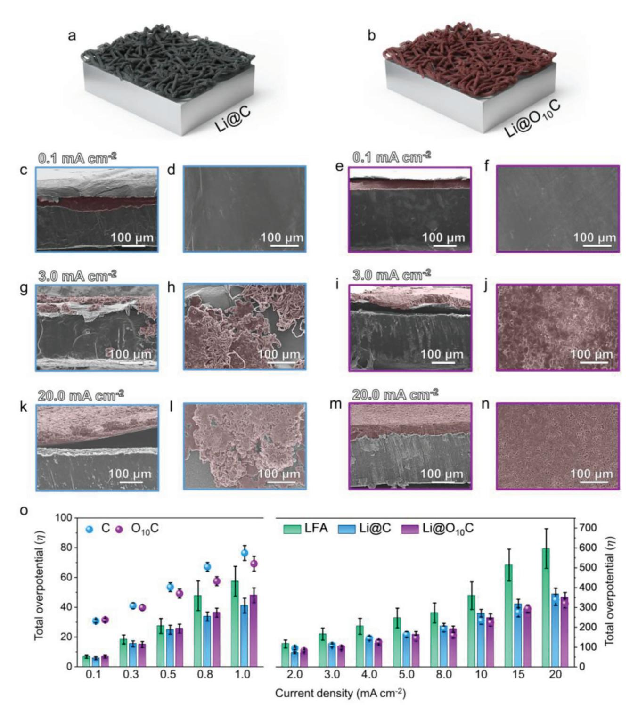
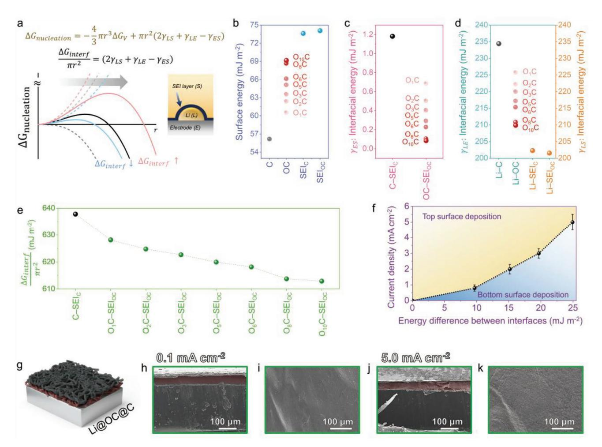
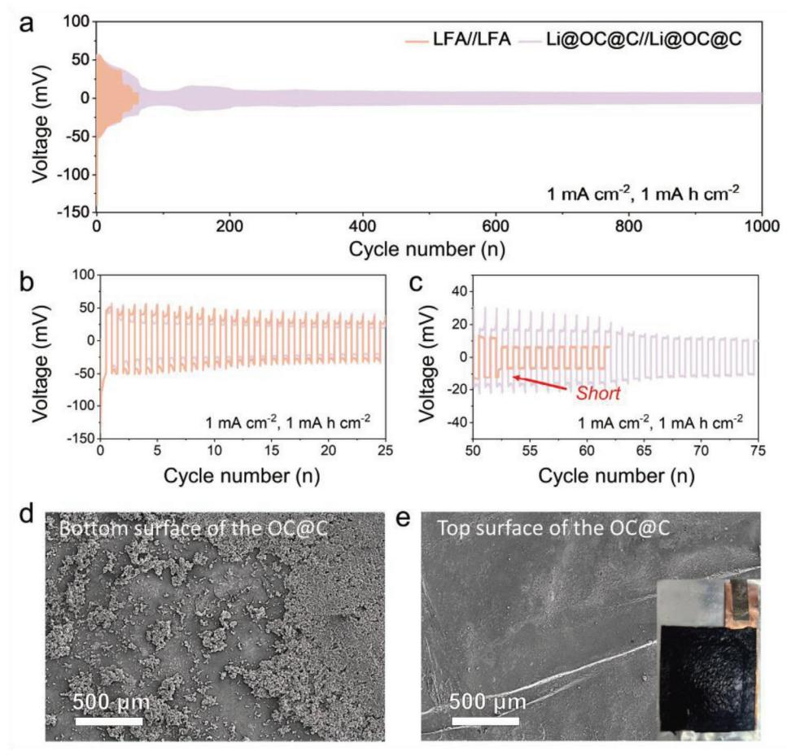

# **High-Power and Large-Area Anodes for Safe Lithium-Metal Batteries**

*Son Ha, Ji Yong Park, Sung-Ho Huh, Seung-Ho Yu, Jin Hwan Kwak, Jungjin Park, Hee-Dae Lim, Dong June Ahn, Hyoung-Joon Jin, Hyung-Kyu Lim, Seung Jae Yang,\* and Young Soo Yun\**

**The lithium deposited via the complex electrochemical heterogeneous lithium deposition reaction (LDR) process on a lithium foil-based anode (LFA) forms a high-aspect-ratio shape whenever the reaction kinetics reach its limit, threatening battery safety. Thereby, a research strategy that boosts the LDR kinetics is needed to construct a high-power and safe lithium metal anode. In this study, the kinetic limitations of the LDR process on LFA are elucidated through operando and ex situ observations using in-depth electrochemical analyses. In addition, ultra-thin (≈0.5 μm) and high modulus (≥19 GPa) double-walled carbon nanotube (DWNT) membranes with different surface properties are designed to catalyze high-safety LDRs. The oxygen-functionalized DWNT membranes introduced on the LFA top surface simultaneously induce multitudinous lithium nuclei, leading to film-like lithium deposition even at a high current density of 20 mA cm−2. More importantly, the layer-by-layer assembly of the oxygen-functionalized and pristine DWNT membranes results in different surface energies between the top and bottom surfaces, enabling selective surface LDRs underneath the high-modulus bilayer membranes. The protective LDR on the bilayer-covered LFA guarantees an invulnerable cycling process in large-area pouch cells at high current densities for more than 1000 cycles, demonstrating the practicability of LFA in a conventional liquid electrolyte system.**

#### **1. Introduction**

Lithium metal was recently re-spotlighted as a potential anode candidate for nextgeneration rechargeable batteries because the electrochemical heterogeneous phase transition reaction between lithium ions and lithium metal can reversibly deliver high theoretical capacities (3,860 mA h g−1 and 2,060 mA h cm−3) at low redox potentials (‒3.04 V vs SHE).[\[1,2\]](#page-7-0) A simple and cost-effective preparation process without a slurry-based coating method and conventional electrode components makes lithium metal more attractive for commercial application.[\[3–5\]](#page-7-0) However, bare lithium foil-based anodes (LFAs) suffer from highaspect-ratio metal growths called "dendrites" at a feasible current density.[[1–7\]](#page-7-0) The origin of dendrite formation is conventionally understood to be deficient lithium ion concentration on the active electrode surfaces because of a higher lithium consumption rate with electroplating than the replenishment of surface lithium ions

S. Ha, D. J. Ahn, Y. S. Yun KU-KIST Graduate School of Converging Science and Technology Korea University 145 Anam-ro, Seongbuk-gu, Seoul 02841, Republic of Korea E-mail: [c-ysyun@korea.ac.kr](mailto:c-ysyun@korea.ac.kr) J. Y. Park, S. J. Yang Department of Chemistry and Chemical Engineering, Education and Research Center for Smart Energy and Materials Inha University 100 Inha-ro, Incheon 22212, Republic of Korea E-mail: [sjyang@inha.ac.kr](mailto:sjyang@inha.ac.kr) S.-H. Huh, S.-H. Yu, J. H. Kwak, D. J. Ahn Department of Chemical and Biological Engineering Korea University 145 Anam-ro, Seongbuk-gu, Seoul 02841, Republic of Korea

The ORCID identification number(s) for the author(s) of this article can be found under <https://doi.org/10.1002/smll.202400638>

#### **DOI: 10.1002/smll.202400638**

J. H. Kwak, J. Park, Y. S. Yun Energy Storage Research Center Korea Institute of Science and Technology (KIST) Hwarangro 14-gil 5, Seoungbuk-gu, Seoul 02792, Republic of Korea H.-D. Lim Department of Chemical Engineering Hanyang University 222 Wangsimni-ro, Seongdong-gu, Seoul 04763, Republic of Korea H.-J. Jin Department of Polymer Science and Engineering Inha university 100 Inha-ro, Incheon 22212, Republic of Korea H.-K. Lim Division of Chemical Engineering and Bioengineering Kangwon National University Chuncheon, Gangwon-do 24341, Republic of Korea Y. S. Yun Department of Integrative Energy Engineering Korea University 145 Anam-ro, Seongbuk-gu, Seoul 02841, Republic of Korea

in local areas, leading to inhomogeneous lithium deposition reaction (LDR).[\[8–10\]](#page-7-0) Furthermore, solid electrolyte interface (SEI) layers indispensably formed on the deposited lithium are negatively influenced by the reduction in the surface lithium concentration, accelerating the non-uniform LDR process.[\[11,12\]](#page-7-0) Recent studies also revealed that the crystalline structure of lithium metal can be a determining factor for the deposited lithium morphology, where lithium transport from the SEI and substrate to the depositing surfaces plays a key role in lithium nucleation and growth.[\[13–16\]](#page-7-0) Under the complex electrochemical heterogeneous LDR process, completely controlling dendritic lithium growth is difficult, particularly under high current densities, causing safety issues owing to short circuiting of the electrode and limiting the power capabilities of the LFA.[\[17–22\]](#page-7-0) Moreover, the high-surface area dendrite formation/dissolution cycles repetitively produce large amounts of byproducts with electrolyte decomposition.[\[23–25\]](#page-7-0) These electrolyte-consuming processes significantly increase the cell resistance and safety hazards.[\[23–26\]](#page-7-0) Therefore, strenuous research efforts have focused on suppressing dendritic lithium growth. The previously reported research strategies can be summarized as follows: i) coating homogeneous artificial SEI layers,[\[27–29\]](#page-8-0) ii) tuning electrolyte systems for more effective SEI layer formation,[\[30–32\]](#page-8-0) iii) designing stereoscopic substrates with high active surface areas,[\[33,34\]](#page-8-0) and iv) introducing lithiophilic substrates with significantly more nucleation active sites.[\[35–37\]](#page-8-0) These methods are partly effective in achieving a homogeneous lithium flux and show positive results. However, these strategies are still insufficient to thoroughly suppress unexpected dendrite formation, especially on feasible large-area electrodes. This is because of the scarcity of reliable results in practical cells and the lack of a mechanistic understanding of the lithium dendrite formation mechanism.

Herein, the electrochemical heterogeneous LDR mechanism on LFA was investigated through operando and ex situ observations using in-depth electrochemical analyses. In addition, an ultra-thin (≈0.5 μm), high-modulus (≥19 GPa), and highly electro-conductive (≈2800 S cm−1) membrane (hereafter named as C) composed of double-walled carbon nanotubes (DWNTs) was designed to catalyze LDR processes and protect battery cells from dendritic lithium growth. A dendrite-free LDR process can be obtained even under a high current density of 20 mA cm−2 by introducing oxygen-functionalized C (named as OC) on the surface of the LFA. In addition, the OC@C bilayer on LFA enables selective area LDRs only underneath the high-modulus bilayers, achieving high power and high-safety cycling. Furthermore, protective LDRs based on a OC@C bilayer-covered LFA were demonstrated in a large-area pouch cell, in which the LDR process only occurred below the surface of the bilayer, for 1000 cycles, proving the feasibility of LFA in a conventional liquid electrolyte system.

#### **2. Results and Discussion**

The LDR mechanism on LFA was analyzed using galvanostatic tests at different current densities of 0.1‒20.0 mA cm−2 (**Figure 1**[a\)](#page-2-0). The voltage profiles exhibited significant changes in the overpotentials with an increasing current density and lithiation capacity. The profiles at current densities ≤0.5 mA cm−2 were nearly flat and had low overpotentials of *<*30 mV. Ex situ scanning electron microscopy (SEM) images revealed that the lithium deposited at lower current densities was densely packed with a film-like morphology (Figure [1b\)](#page-2-0). Increasing the current density by 3 mA cm−2 significantly increased the overpotential by 170 mV, and increasing the areal capacity (lithiation) by 4 mA h cm−2 gradually increased the initial voltage from ‒170 to ‒60 mV (Figure [1a\)](#page-2-0). The ex situ SEM image in Figure [1c](#page-2-0) shows that a significant morphological change occurred at the current density of 3 mA cm−2, that is, needle-like bulk dendritic lithium was mainly formed. The overpotential significantly increased when the current density was further increased by ≥5 mA cm−2. However, the initial voltages significantly increased and gradual voltage increase sections were also observed in all the voltage profiles at ≥5 mA cm−2 (Figure [1a\)](#page-2-0). Ex situ SEM images (Figure [1d;](#page-2-0) Figure S1, Supporting Information) show that mossy-like dendrites with considerably higher surface areas were formed at the higher current density of ≥10 mA cm−2. The dendritic lithium growth was closely related to the reduction in the overpotential, and operando optical videos obtained during the LDR process on LFA at different current densities of 1, 3, and 20 mA cm−2 confirmed this relationship (Supplementary movies S1‒S3, Supporting Information). Dendritic lithium mainly grew when the voltage increased (overpotential reduction) (Figure [1e](#page-2-0)‒p). Additionally, the slope of the voltage increase was dependent on the dendrite growth rate. The voltage profile at 1 mA cm−2 exhibited a gradual increase in the overpotential during the initial LDR process, where film-like lithium was formed without dendritic lithium growth. However, the voltage profile recovered from a state of ≈50%. Subsequently, relatively small amounts of dendritic lithium were simultaneously formed at defect sites with the film-like lithium, resulting in a gradual sloping voltage increase (Figure [1e](#page-2-0)‒h). More active dendritic lithium growth occurred at 3 mA cm−2, whereas the film-like lithium growth rate significantly decreased (Figure [1i](#page-2-0)‒l). The dendrite-driven LDR process resulted in a higher slope. This relationship was further clearly observed at considerably higher current densities (≥5 mA cm−2). An initial sharp voltage increase occurred with the intensive growth of dendritic lithium on the defective lithium surfaces (Figure [1m](#page-2-0)‒p). Following the significant dendrite formation during the initial LDR process, the simultaneous and large amount of dendrite growth mitigated the slope change, leading to a voltage plateau.

Notably, the observed dendritic lithium formation and growth behavior mainly occurred under a kinetically controlled reaction during the initial LDR process (Supplementary text S1 and Figure S2, Supporting Information). This observation contradicts the conventional belief that lithium dendrites originate from an insufficient lithium-ion transfer rate limited by a diffusioncontrolled reaction process.[\[8–10\]](#page-7-0) Potentiostatic and linear sweep voltammetry (LSV) tests were performed to further clarify the LDR mechanism (Supplementary text S2 and Figures S3 and S4, Supporting Information). The results confirmed that the morphologies of the electrochemically deposited lithium continuously changed in response to the reaction kinetics. Specifically, mossy- and whisker shaped dendrites can form in response to the applied current density to increase the surface area (Figure S5, Supporting Information). This provides strong evidence of a kinetically controlled LDR mechanism.

As a research strategy to overcome the insufficient LDR kinetics and their driving safety issues on LFA, a nanostructured C electrode was designed as a catalytic cover layer through the

**Figure 1.** LDR mechanism on LFA. a) Galvanostatic LDR profiles at different current densities of 0.1, 0.5, 1.0, 3.0, 5.0, 10.0, and 20.0 mA cm−2. Ex situ SEM images after the galvanostatic LDRs of 4 mA h cm−2 at b) 0.1, c) 3.0, and d) 20.0 mA cm−2. Operando test results of the e) galvanostatic LDR profile at 1.0 mA cm−2 and optical images obtained at the different state of charges of f) initial, g) medium, and h) final. Operando test results of the i) galvanostatic LDR profile at 3.0 mA cm−2 and optical images obtained at the different state of charges of j) initial, k) medium, and l) final. Operando test results of the m) galvanostatic LDR profile at 20.0 mA cm−2 and optical images obtained at the different state of charges of n) initial, o) medium, and p) final. Scale bars in the operando test images are 200 μm.

mass-producible direct spinning of DWNT aerogels, which were continuously fabricated using floating catalyst chemical vapor deposition (FCCVD). Furthermore, OCs were prepared using oxygen plasma treatment. The detailed fabrication process and material properties of the C and OCs are described in the Supplementary Material (Experimental Section, Supplementary text S3, and Figures S6‒S13, Supporting Information). The nanostructured C and OCs exhibited excellent mechanical properties, such as a tensile modulus of ≈19.3 and ≈55.6 GPa, tensile strength of ≈900 and ≈750 MPa, and compressive hardness of ≈30 and ≈28 MPa, respectively, which are several times higher than those of bulk lithium.[\[38,39\]](#page-8-0) Additionally, numerous lithiophilic sites, which can guide the homogeneous lithium nucleation reaction (LiNR), were uniformly introduced on the surfaces of the OCs.

Moreover, the as-prepared large-area C and OCs varied in shape and size, which could be easily tuned by simple cutting (Figure S14, Supporting Information). This physical tunability, high flexibility, ultrathin thickness, and excellent mechanical properties enable various electrode configurations composed of C and/or OC configurations.[\[40\]](#page-8-0)

The effects of the C and O10C (OxC; x represents the oxygen plasma treatment time, 1–10 min) electrodes on the LFA were analyzed using ex situ SEM observations after LDRs at the current densities of 0.1, 3.0, and 20.0 mA cm−2 (**Figure [2](#page-3-0)**). The lithium metals deposited on the C-covered (Li@C) and O10C-covered (Li@O10C) LFAs at a current density of 0.1 mA cm−2, which were observed in the interlayers between the lithium foil and C or O10C (Figure [2a](#page-3-0)‒f), exhibited uniform film-like shapes. In contrast,

**Figure 2.** Ex situ SEM observation and comparison of the overpotential variation in the C- and OC-covered LFAs (Li@C and Li@OC, respectively). Schematic images of the a) Li@C and b) Li@OC. Ex situ c) cross-sectional, and d) top-surface SEM images of the Li@C characterized after lithium deposition of 4 mA h cm−2 at 0.1 mA cm−2. Ex situ e) cross-sectional, and f) top-surface SEM images of the Li@OC characterized after lithium deposition of 4 mA h cm−2 at 0.1 mA cm−2. Ex situ g) cross-sectional, and h) top-surface SEM images of the Li@C characterized after lithium deposition of 4 mA h cm−2 at 3.0 mA cm−2. Ex situ i) cross-sectional, and j) top-surface SEM images of the Li@OC characterized after lithium deposition of 4 mA h cm−2 at 3.0 mA cm−2. Ex situ k) cross-sectional, and l) top-surface SEM images of the Li@C characterized after lithium deposition of 4 mA h cm−2 at 20.0 mA cm−2. Ex situ m) cross-sectional, and n) top-surface SEM images of the Li@OC characterized after lithium deposition of 4 mA h cm−2 at 20.0 mA cm−2. o) Comparison of the overpotential variation of the LFA, Li@C, and Li@OC at different current densities from 0.1 to 20.0 mA cm−2. Deposited lithium metal is expressed as a red-type color.

lithium metal deposited at current densities ≥3.0 mA cm−2 was observed on the top surfaces of the C and O10C (Figure [2g](#page-3-0)‒j). The changes in the electrochemically deposited surfaces were closely related to the overpotential. The total overpotentials on LFA at current densities ≤1.0 mA cm−2 were lower than those on the C and O10C (Figure [2o;](#page-3-0) Figure S15 and Table S1, Supporting Information). The lower overpotentials did not allow LiNRs on the surfaces of the C and O10C, leading to a preferential LDR on the surface of LFA at current densities ≤1.0 mA cm−2 despite the presence of C and O10C electrodes in Li@C and Li@O10C, respectively.

The galvanostatic LDR profiles of Li@C and Li@O10C at 0.1 mA cm−2 were similar to those on LFA (Figure [1a\)](#page-2-0) and differed from those on the single C and O10C electrodes, respectively (Figure S16a,b, Supporting Information). This result confirms the preferential LDRs on the surface of the LFA at lower current densities. In contrast, the galvanostatic LDR profiles of Li@C and Li@O10C at current densities ≥3.0 mA cm−2 were similar to the signature curves of the single C and OC electrodes, respectively, indicating that LDRs mainly occurred on the C and OC surfaces of the Li@C and Li@O10C (Figure S16c‒f, Supporting Information), respectively. More importantly, the lithium deposited on Li@C at higher current densities exhibited a dendritic shape, which significantly differed from those deposited on Li@O10C although their galvanostatic profiles were very similar (Figure [2g](#page-3-0)‒n; Figure S16c‒f, Supporting Information). Dendritic lithium mainly grew on the top surface of the C electrode on Li@C, whereas very uniform lithium was deposited on the top surface of the O10C electrode on Li@O10C even at 20.0 mA cm−2 (Figure [2g](#page-3-0)‒n). Notably, the dendritic lithium growth mechanism on the surface of the C electrode differed from that on the LFA. Operando optical videos confirmed the mechanistic differences in the LDR processes (Supplementary movie S4 and Figure S17, Supporting Information). LDR occurred on the top surface of the C electrode of Li@C mainly in a single nucleus, leading to large dendritic lithium growth. Despite the intensive lithium growth concentrated on a small number of lithium nuclei on the C electrode, the galvanostatic profiles exhibited a lower overpotential with no sharp voltage increase, which is typically observed when dendritic lithium grows on LFA (Figure S16c,e, Supporting Information). This result indicates that the reaction kinetics corresponding to the rate-determining step on the surface of the nanostructured C electrode were significantly improved (Supplementary text S4 and Figure S18, Supporting Information). This indicates that the number of nuclei is also a key factor in determining the electrochemical deposition of lithium. The O10C electrode not only exhibited high LDR kinetics but also contained a large number of active lithium nucleation sites, which induced multiple simultaneous lithium growth reactions (LiGRs) on its overall surface (Supplementary movie S5 and Figure S20, Supporting Information). Consequently, the OC-based LDR process enabled high-power LFA without dendritic metal growth.

However, the top-surface-induced LDR process on the OCcovered LFA could not fully prevent the safety issues originating from the unexpected growth of dendritic lithium. Therefore, an additional protective LDR strategy is essential to achieve a high safety and power capability. Preferential LDR under the bottom side of an ultrathin and super-strong C electrode is an excellent solution for the protective LDR process. This approach can be realized by introducing an OC@C bilayer on the surface of the LFA (Li@OC@C) because its two different interfaces exhibit a distinctive gap in the lithium nucleation energy barriers. The conventional nucleation theory shows that the Gibbs free energy required for the formation of semi-spherical lithium nuclei of radius r (∆*G*nucleation) on a substrate is dependent on two major factors, namely, the free energy change per unit volume (∆*GV*) and interfacial energy change (∆*G*interf) per unit surface area, as shown in Equations 1 and 2 (**Figure 3**[a;](#page-5-0) Supplementary text S5 and Table S2, Supporting Information).

$$
\Delta G_{\text{nucleation}} = -V\Delta G_{\text{V}} + \pi r^2 \left(2\gamma_{\text{LS}} + \gamma_{\text{LE}} - \gamma_{\text{ES}}\right) \tag{1}
$$

$$
\Delta G_{\text{interf}} = \pi r^2 \left( 2 \gamma_{LS} + \gamma_{LE} - \gamma_{ES} \right) \tag{2}
$$

where *V* is molar volume, and LS, LE, and ES are the interfacial energies between lithium-SEI, lithium-electrode, and electrode-SEI, respectively. A lower ∆*G*interf value indicates a lower energy barrier for LiNR. The surface energies of the C and OCs, and their SEI layers were obtained using the Owens-Wendt method (Supplementary text S6, Supporting Information). The C layer on O10C had a surface energy of 56.1 mJ m−2, which systematically increased with the oxygen plasma treatment duration by 69.2, whereas that of the SEI layers on the O and OCs were very similar at 73.6 and 74.1 mJ m−2, respectively (Figure [3b\)](#page-5-0). Accordingly, the ES and LS values calculated using the Dupré equation exhibited a small gap in the different solid‒solid interfaces (C‒SEI and OC‒SEI) (Figure [3c,d;](#page-5-0) Supplementary text S7, Supporting Information). This means that variations in the LE values play a key role for their gap in the overall ∆*G*interf values. According to previously reported results, the LE value indicates the order of electrode lithiophilicity, where lower LE values indicate more lithiophilic electrodes.[\[34–36\]](#page-8-0) This interpretation corresponds with the C and OCs results, demonstrating the validity of the lithiophilic concept for the C and OC electrodes. The energy gap between C‒SEI and OC‒SEI in the ∆*G*interf values per *r*2 gradually increased from 637.8 to 612.9 mJ m−2 with the oxygen plasma treatment time (Figure [3e\)](#page-5-0). This result indicates that the LiNR energy barrier can be systematically tuned by controlling the lithiophilicity of the electrode. This energy gap leads to preferential lithium deposition on the bottom side of the OC@C bilayer. However, this preferential deposition can be reduced by increasing the overpotentials by overpassing the energy gap, leading to top-surface nucleation. Therefore, the preferential surface for the LDR process was determined by the relationship between the energy gap and applied current density (Figure [3f\)](#page-5-0).[\[41\]](#page-8-0) Ex situ SEM images and operando optical video demonstrated that the lithium was selectively deposited under the bottom-side of the OC@C bilayer on the Li@OC@C anode (Figure [3g](#page-5-0)‒k; Figures S21,S22, and Supplementary movie S6, Supporting Information).

The large-area feasibility of a high-power and highly safe Li@OC@C anode with a 5 cm × 5 cm OC@C bilayer was demonstrated by testing symmetric pouch cells at a cut-off capacity of 1 mA h cm−2 under 1 mA cm−2. The galvanostatic lithium metal deposition/dissolution profiles of the symmetric LFA‖LFA and Li@OC@C‖Li@OC@C pouch cells revealed significant differences in cycling performance (**Figure 4**[a\)](#page-6-0). The two pouch cells exhibited similar cycling behaviors during the early cycling process, in which the overpotentials gradually decreased with cycling

**Figure 3.** Selective surface lithium deposition based on the differences in the lithium nucleation energy barrier. a) Schematic image showing the lithium nucleation energy variation *(*∆*G*nucleation) according to the different lithium nucleation energy barriers (∆*G*interf) at the solid‒solid interface between the electrode and the SEI layer. b) Surface energies of the C, OCs, and SEI layers on the C and OCs. c) Interfacial energies of the electrode‒SEI layer. d) Interfacial energies of the lithium‒electrode and lithium‒SEI layers. e) Interfacial energy variations per *r* 2 at the different solid‒solid interfaces. f) Relationship between the interfacial energy and current density for lithium deposition surfaces. g) Schematic image of the Li@OC@C anode. Ex situ h) cross-sectional, and i) top surface SEM images of the Li@OC@C anodes characterized after lithium deposition of 4 mA h cm−2 at 0.1 mA cm−2. Ex situ j) cross-sectional, and k, top surface SEM images of the Li@OC@C anodes characterized after lithium deposition of 4 mA h cm−2 at 5.0 mA cm−2. Deposited lithium metal is expressed as a red-type color.

(Figure [4b\)](#page-6-0). However, the overpotential of the LFA-based pouch cell significantly reduced at the 53rd cycle and the electrode short circuited (Figure [4c\)](#page-6-0). In contrast, the Li@OC@C-based pouch cell exhibited a gradual reduction in the overpotential (Figure [4c\)](#page-6-0). Although a slight fluctuation occurred at 100–200 cycles, the voltage profiles revealed a highly stable cycling behavior with a very low overpotential of ≈10 mV (Figure [4a\)](#page-6-0). Ex situ SEM and optical images obtained after 1000 cycles confirmed that selective bottom-side lithium metal deposition/dissolution cycles were maintained over the long-term cycling process despite the presence of large amounts of byproducts (Figure [4d\)](#page-6-0). No lithium or byproducts were observed on the top surface of the OC@C bilayer, demonstrating the practicability of the Li@OC@C anode based on an organic liquid electrolyte (Figure [4e\)](#page-6-0). Furthermore, the viability of the Li@OC@C anode was demonstrated through full cell testing with a lithium iron phosphate (LFP) cathode. The Li@OC@C‖LFP full cell exhibited consistent cyclability over 100 cycles, with a capacity retention of 87.5% compared to the initial cycles after 100 cycles. This capacity retention rate significantly surpasses that of the LFA‖LFP full cell, which is less than 40%. Given the sole difference between the two full cells lies in the anode material, the observed gradual capacity decrease is likely attributable to the significant disparity in the electrochemical performance of the anode. This result underscores the superiority of the Li@OC@C anode.

#### **3. Conclusion**

In conclusion, a high-power and high-safety Li@OC@C anode was designed by introducing an ultra-thin and high modulus OC@C bilayer on the surface of lithium foil. Large numbers of lithium nuclei were simultaneously formed on the lithiophilic OC‒SEI interface on the LFA and film-like lithium was homogeneously deposited on the OC‒SEI interface, even at a high

**Figure 4.** Large-area LFA- and Li@OC@C-based pouch cell test results. a‒c) Galvanostatic lithium deposition/dissolution profiles of the symmetric LFAand Li@OC@C-based pouch cells over 1000 cycles with a cut-off capacity of 1 mA h cm−2 at 1 mA cm−2. Ex situ SEM images of the d) bottom and e) top surfaces of the Li@OC@C anode characterized after 1000 cycles.

current density of 20 mA cm−2. The additional introduction of C on the top surface of the OC as the OC@C bilayer created two different solid‒solid interfaces on LFA, namely, OC‒SEI and C‒SEI, which had large interfacial energy gaps. The preferential LDR process at the OC‒SEI interface led to selective lithium metal deposition below the high-modulus bilayer, enabling high-power and safe lithium metal anodes. Furthermore, the selective LDR behavior was demonstrated using a practical large-area pouch cell. Protective lithium metal deposition/dissolution cycles enabled stable cycling over 1000 cycles in the feasible electrochemical cells using a conventional liquid electrolyte.

### **4. Experimental Section**

*Fabrication of C Using FCCVD*: C was fabricated by stacking DWNT aerogels that were synthesized using the FCCVD method in a furnace with three heating zones at 1200 °C. Ferrocene, thiophene, methane, and a mixture of hydrogen and argon gases were used as the catalysts, promoters, carbon sources, and carrier gases, respectively, to synthesize the DWNT aerogels. The input rates of thiophene and ferrocene were 3.59 and 0.62 mg min−1, respectively, in which the atomic ratios of S:C and Fe:S were 0.016 and 0.078, respectively. The total H2 (99.999%), argon (99.999%), and methane (99.999%) flow rates were maintained at 1200, 500, and 60 mL min−1, respectively, during the fabrication process. H2 and thiophene were separately stored before injection into the furnace at 80 and −20 °C, respectively, to control their vapor pressures. DWNT aerogels were collected at the bottom of the furnace for 12 min using a polytetrafluoroethylene (PTFE) film-covered cylindrical roller with a winding rate of 4 m min−1 to fabricate a membrane. After collection, the as-prepared DWNT aerogel membrane on the PTFE film was detached, unwound from the cylindrical roller and flattened. Ethanol was dripped onto the membrane to densify the membrane, and the resulting C was dried in a convection oven at 60 °C for 3 h.

*Preparation of the OCs*: The C adhered to the PTFE film was directly placed into a COVANCE O2 plasma system (FEMTO SCIENCE) to tune its surface properties, which were tuned by varying the oxygen plasma treatment time using a radiofrequency power level of 50 W on a vacuum plasma system under 2.0 e−2 torr. Different treatment times of 1, 2, 3, 5, 6, 8, 10, and 20 min were applied under an oxygen flow rate of 10 mL min−1. The resulting OCs were stored in a vacuum oven at 30 °C and directly used with no additional treatment.

*Characterization*: The microstructures of the DWNTs were examined using field-emission transmission electron microscopy (FE-TEM; JEM-2100F, JEOL, Japan). Morphological characterization, including ex situ analysis, was performed using field-emission SEM (FE-SEM, S-4300, Hitachi). Ex situ FE-SEM images were obtained after washing with dimethyl ether in a glove box, followed by vacuum drying for 1 h in a vacuum chamber. Tensile tests were performed using a universal testing machine (UTM; RB 302 ML, R&B). The gauge length and loading rate were 10 and 0.5 mm min−1, respectively. Nanoindentations were performed using a nanoindentation system (G200, NanoIndenter) operated under load control for 15 s up to the maximum load. Raman spectroscopy (Raman force, Nanophotone) with a laser wavelength of 532 nm was employed to analyze the physicochemical structural changes in the C and OCs. X-ray photoelectron spectroscopy (XPS; Nexsa G2, Thermo Fisher Scientific) was performed to analyze the surface properties of the C and OCs. Contact angle measurements were conducted through the sessile drop method using a drop shape analyzer (DSA 100, Kruss) in air at 20 ±2 °C with 3 μL drops.

*Electrochemical Characterization*: Electrochemical tests were conducted using a Wonatech automatic battery cycler and standard CR2032 coin cells assembled in an argon-filled glove box. An LFA (MTI Korea) was used as the working, reference, and counter electrodes in a symmetric test cell configuration. C, OC, and OC@C were also used as working electrodes with or without LFA. A glass fiber membrane filter (GF/F, Whatman, US) was used as the separator. The electrolyte was prepared by dissolving 1 m lithium bis(trifluoromethanesulfonyl)imide (LiTFSI) in a solvent mixture of 1,3 dioxolane (DOL) and 1,2-dimethoxyethane (DME) (1:1, v/v) containing 5 wt. % LiNO3. Galvanostatic and potentiostatic measurements and LSV tests were conducted on symmetric coin cells at different current densities.

*Pouch Cell Fabrication*: A copper substrate was punched using a pouch-type punch machine (5 × 5 cm2), and a nickel tab was connected using ultrasonic welding (2000Xt, Branson). The lithium foil, C, and OC were cut to a size of 5 × 5 cm2 using a cutter blade. Electrodes for the pouch cell tests were fabricated by attaching a lithium foil to the copper substrate using roll pressure. The OC@C bilayer was placed on the lithium foil. The same separator and electrolyte to the coin-cell tests were used for the pouch cell tests. The pouch cell was manufactured by attaching threesided pouch cases containing symmetric electrode pairs and separators. The electrolyte was then injected into the pouch cell.

*Operando Visualization of the Electrochemical Heterogeneous LDR Process*: A commercially available handmade optical cell with a 3 mm diameter hole was used for the operando visualization of the electrochemically heterogeneous lithium nucleation and growth behaviors on LFA, Li@C, Li@OC, and Li@OC@C. Operando visualization was performed during a galvanostatic LDR process using an optical microscope (50x lens, Nikon LV150N) set up through a hole sealed with a transparent glass window.

# **Supporting Information**

Supporting Information is available from the Wiley Online Library or from the author.

## **Acknowledgements**

S.H. and J.Y.P. contributed equally to this work. This research was supported by the Basic Science Research Program through the National Research Foundation of Korea (NRF) funded by the Ministry of Education (RS-2023-00302689). This work is funded by Korea Institute of Science and Technology (KIST) Institutional Program(2V09840-23-P025).

# **Conflict of Interest**

The authors declare no conflict of interest.

# **Data Availability Statement**

The data that support the findings of this study are available on request from the corresponding author. The data are not publicly available due to privacy or ethical restrictions.

# **Keywords**

double-walled carbon nanotube (DWNT), heterogeneous lithium deposition reaction (LDR), large-area lithium metal anode, protective bilayer, selective surface lithium deposition

> Received: February 4, 2024 Revised: April 8, 2024 Published online: May 28, 2024

- [1] D. Lin, Y. Liu, Y. Cui, *Nat. Nanotechnol.* **2017**, *12*, 194.
- [2] J. Liu, Z. Bao, Y. Cui, E. J. Dufek, J. B. Goodenough, P. Khalifah, Q. Li, B. Y. Liaw, P. Liu, A. Manthiram, Y. S. Meng, V. R. Subramanian, M. F. Toney, V. V. Viswanathan, M. S. Whittingham, J. Xiao, W. Xu, J. Yang, X.-Q. Yang, J.-G. Zhang, *Nat. Energy* **2019**, *4*, 180.
- [3] C. Niu, D. Liu, J. A. Lochala, C. S. Anderson, X. Cao, M. E. Gross, W. Xu, J.-G. Zhang, M. S. Whittingham, J. Xiao, J. Liu, *Nat. Energy* **2021**, *6*, 723.
- [4] L. Mauler, F. Duffner, W. G. Zeier, J. Leker, *Energy Environ, Sci.* **2021**, *14*, 4712.
- [5] P. Li, H. Kim, J. Ming, H.-G. Jung, I. Belharouak, Y.-K. Sun, *eScience* **2021**, *1*, 3.
- [6] Y. He, X. Ren, Y. Xu, M. H. Engelhard, X. Li, J. Xiao, J. Liu, J.-G. Zhang, W. Xu, C. Wang, *Nat. Nanotechnol.* **2019**, *14*, 1042.
- [7] M. Wan, S. Kang, L. Wang, H.-W. Lee, G. W. Zheng, Y. Cui, Y. Sun, *Nat. Commun.* **2020**, *11*, 829.
- [8] J. Xiao, *Science* **2019**, *366*, 426.
- [9] P. Bai, J. Li, F. R. Brushett, M. Z. Bazant, *Energy Environ. Sci.* **2016**, *9*, 3221.
- [10] X. Xu, X. Jiao, O. O. Kapitanova, J. Wang, V. S. Volkov, Y. Liu, S. Xiong, *Adv. Energy Mater.* **2022**, *12*, 2200244.
- [11] Y. Chen, M. Li, Y. Liu, Y. Jie, W. Li, F. Huang, X. Li, Z. He, X. Ren, Y. Chen, X. Meng, T. Cheng, M. Gu, S. Jiao, R. Cao, *Nat. Commun.* **2023**, *14*, 2655.
- [12] J. Park, S. Ha, J. Y. Jung, J.-H. Hyun, S.-H. Yu, H.-K. Lim, N. D. Kim, Y. S. Yun, *Adv. Sci.* **2022**, *9*, 2104145.
- [13] Z. Wu, C. Wang, Z. Hui, H. Liu, S. Wang, S. Yu, X. Xing, J. Holoubek, Q. Miao, H. L. Xin, P. Liu, *Nat. Energy* **2023**, *8*, 340.
- [14] X. Wang, G. Pawar, Y. Li, X. Ren, M. Zhang, B. Lu, A. Banerjee, P. Liu, E. J. Dufek, J.-G. Zhang, J. Xiao, J. Liu, Y. S. Meng, B. Liaw, *Nat. Mater.* **2020**, *19*, 1339.
- [15] J. Sun, J. Peng, T. Ring, L. Whittaker-Brooks, J. Zhu, D. Fraggedakis, J. Niu, T. Gao, F. Wang, *Energy Environ. Sci.* **2022**, *15*, 5284.
- [16] Q. Zhao, Y. Deng, N. W. Utomo, J. Zheng, P. Biswal, J. Yin, L. A. Archer, *Nat. Commun.* **2021**, *12*, 6034.
- [17] L. Li, S. Basu, Y. Wang, Z. Chen, P. Hundekar, B. Wang, J. Shi, Y. Shi, S. Narayanan, N. Koratkar, *Science* **2018**, *359*, 1513.
- [18] S. Jiao, J. Zheng, Q. Li, X. Li, M. H. Engelhard, R. Cao, J.-G. Zhang, W. Xu, *Joule* **2018**, *2*, 110.
- [19] J. Qian, W. A. Henderson, W. Xu, P. Bhattacharya, M. Engelhard, O. Borodin, J.-G. Zhang, *Nat. Commun.* **2015**, *6*, 6362.
- [20] P. Bai, J. Guo, M. Wang, A. Kushima, L. Su, J. Li, F. R. Brushett, M. Z. Bazant, *Joule* **2018**, *2*, 2434.
- [21] W. Cao, Q. Li, X. Yu, H. Li, *eSciecne* **2022**, *2*, 47.
- [22] P. M. G. Puente, S. Song, S. Cao, L. Z. Rannalter, Z. Pan, X. Xiang, Q. Shen, F. Chen, *J. Adv. Ceram.* **2021**, *10*, 933.
- [23] C. Fang, J. Li, M. Zhang, y. Zhang, F. Yang, J. Z. Lee, M.-H. Lee, J. Alvarado, M. A. Schroeder, Y. Yang, B. Lu, N. Williams, M. Ceja, L. Yang, M. Cai, J. Gu, K. Xu, X. Wang, Y. S. Meng, *Nature* **2019**, *572*, 511.

- [24] X. Cao, X. Ren, L. Zou, M. H. Engelhard, W. Huang, H. Wang, B. E. Matthews, H. Lee, C. Niu, B. W. Arey, Y. Cui, C. Wang, J. Xiao, J. Liu, J.-G. Zhang, *Nat. Energy* **2019**, *4*, 796.
- [25] C. Jin, T. Liu, Q. Sheng, M. Li, T. Liu, Y. Yuan, J. Nai, Z. Ju, W. Zhang, Y. Liu, Y. Wang, Z. Lin, J. Lu, X. Tao, *Nat. Energy* **2021**, *6*, 378.
- [26] S. Chen, C. Niu, H. Lee, Q. Li, L. Yu, W. Xu, J.-G. Zhang, E. J. Dufek, M. S. Whittingham, S. Meng, J. Xiao, J. Liu, *Joule* **2019**, *3*, 1094.
- [27] Y. Liu, X. Tao, Y. Wang, C. Jiang, C. Ma, O. Sheng, G. Lu, X. W. Lou, *Science* **2022**, *375*, 739.
- [28] Z. Tu, S. Choudhury, M. J. Zachman, S. Wei, K. Zhang, L. F. Kourkoutis, L. A. Archer, *Nat. Energy* **2018**, *3*, 310.
- [29] S. Liu, X. Ji, J. Yue, S. Hou, P. Wang, C. Cui, J. Chen, B. Shao, J. Li, F. Han, J. Tu, C. Wang, *J. Am. Chem. Soc.* **2020**, *142*, 2438.
- [30] Q.-K. Zhang, X.-Q. Zhang, J. Wan, N. Yao, T.-L. Song, J. Xie, L.-P. Hou, M.-Y. Zhou, X. Chen, B.-Q. Li, R. Wen, H.-J. Peng, Q. Zhang, J.-Q. Huang, *Nat. Energy* **2023**, *8*, 725.
- [31] M. Yang, Z. Li, X. Sun, Y. Lian, Y. Wang, C. Niu, Y. Jiang, Y. Luo, Z. Liu, Y. Tian, K. Long, P. Zhang, J. Yu, Z. Zhang, G. Wang, M. Wu, W. Gu, *Chen, Energy Environ. Sci.* **2023**, *16*, 3837.
- [32] M. S. Kim, Z. Zhang, P. E. Rudnicki, Z. Yu, J. Wang, H. Wang, S. T. Oyakhire, Y. Chen, S. C. Kim, W. Zhang, D. T. Boyle, X. Kong, R. Xu, Z.

Huang, W. Huang, S. F. Bent, L.-W. Wang, J. Qin, Z. Bao, Y. Cui, *Nat. Mater.* **2022**, *21*, 445.

- [33] X. Wang, W. Zeng, L. Hong, W. Xu, H. Yang, F. Wang, H. Duan, M. Tang, H. Jiang, *Nat. Energy* **2018**, *3*, 227.
- [34] S. Park, H.-J. Jin, Y. S. Yun, *Adv. Mater.* **2020**, *32*, 2002193.
- [35] X. Chen, X.-R. Chen, T.-Z. Hou, B.-Q. Li, X.-B. Cheng, R. Zhang, Q. Zhang, *Sci. Adv.* **2019**, *5*, eaau7728.
- [36] T. Wei, J. Lu, M. Wang, C. Sun, Q. Zhang, S. Wang, Y. Zhou, D. Chen, Y.-Q. Lan, *Chin. J. Chem.* **2023**, *41*, 1861.
- [37] K. Yan, Z. Lu, H.-W. Lee, F. Xiong, P.-C. Hsu, Y. Li, J. Zhao, S. Chu, Y. Cui, *Nat. Energy* **2016**, *1*, 16010.
- [38] L. Zhang, T. Yang, C. Du, Q. Liu, Y. Tang, J. Zhao, B. Wang, T. Chen, Y. Sun, P. Jia, H. Li, L. Geng, J. Chen, H. Ye, Z. Wang, Y. Li, H. Sun, X. Li, Q. Dai, Y. Tang, Q. Peng, T. Shen, S. Zhang, T. Zhu, J. Huang, *Nat. Nanotechnol.* **2020**, *15*, 94.
- [39] R. Xu, X.-Q. Zhang, X.-B. Cheng, H.-J. Peng, C.-Z. Zhao, C. Yan, J.-Q. Huang, *Adv. Funct. Mater.* **2018**, *28*, 1705838.
- [40] S. Wang, Y. Yang, Y. Dong, Z. Zhang, Z. Tang, *J. Adv. Ceram.* **2019**, *8*, 209.
- [41] X. Gao, Y.-N. Zhou, D. Han, J. Zhou, D. Zhou, W. Tang, J. B. Goodenough, *Joule* **2020**, *4*, 1864.