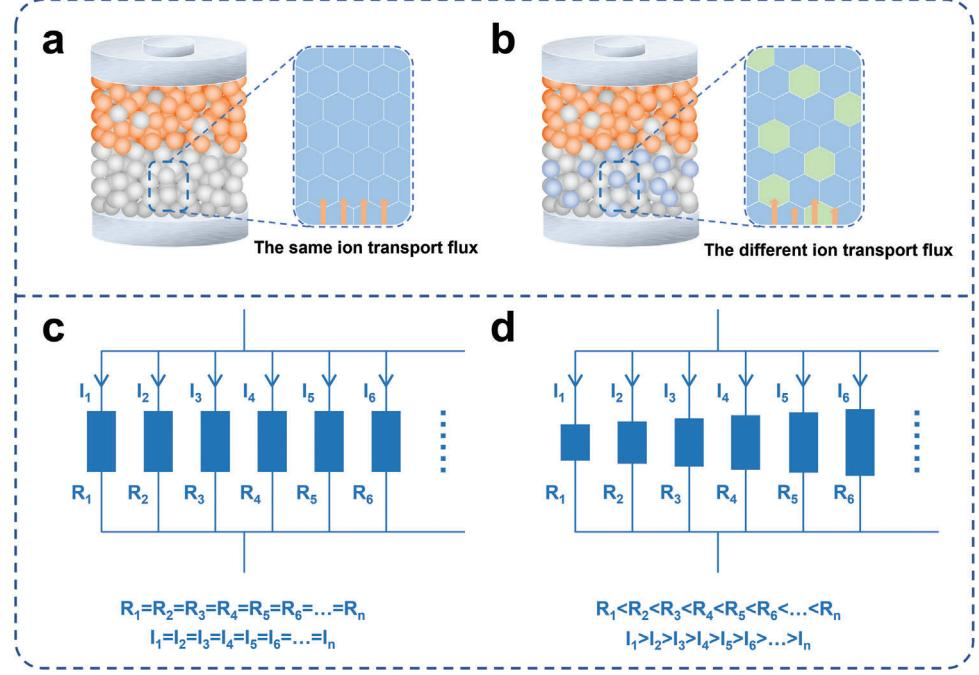
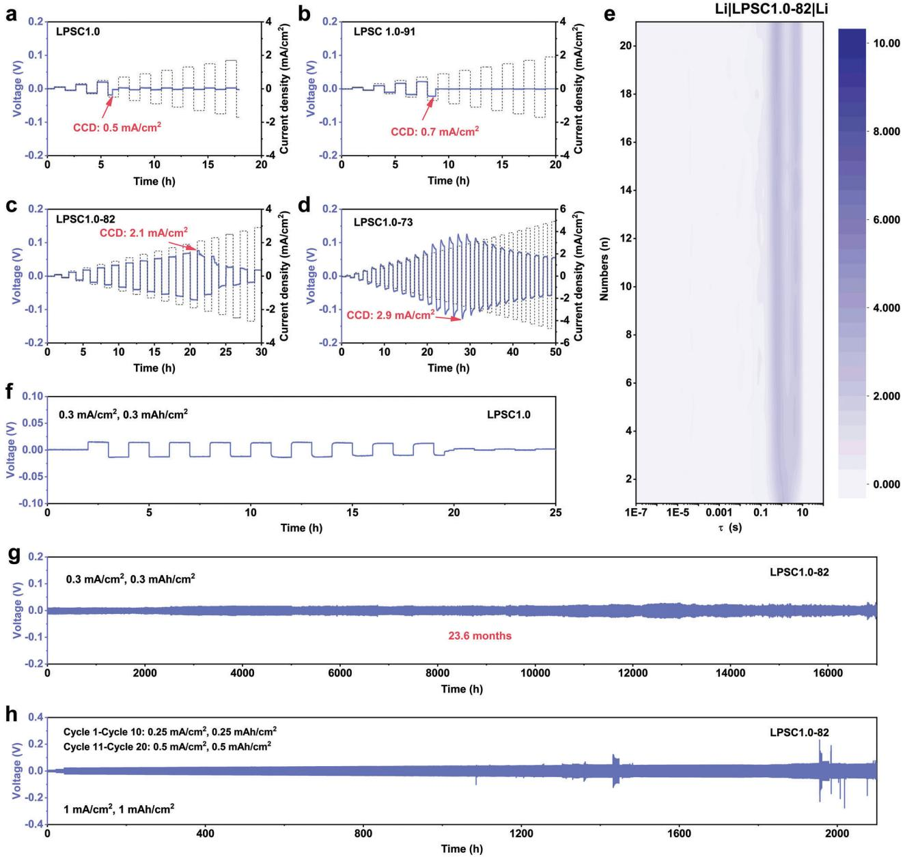
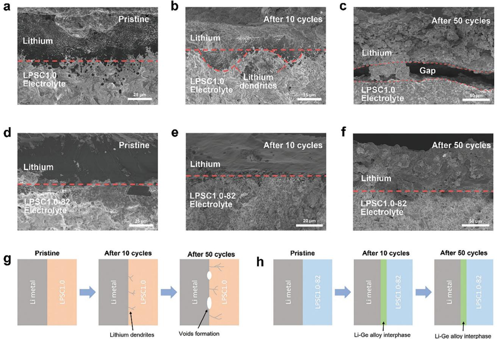
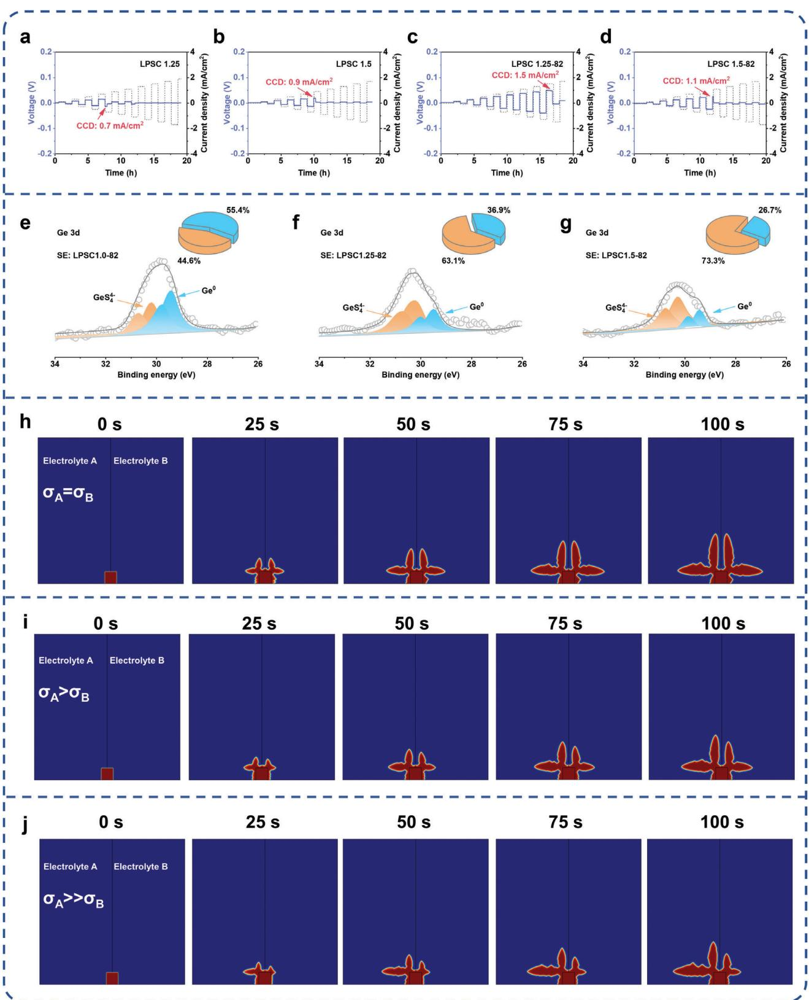
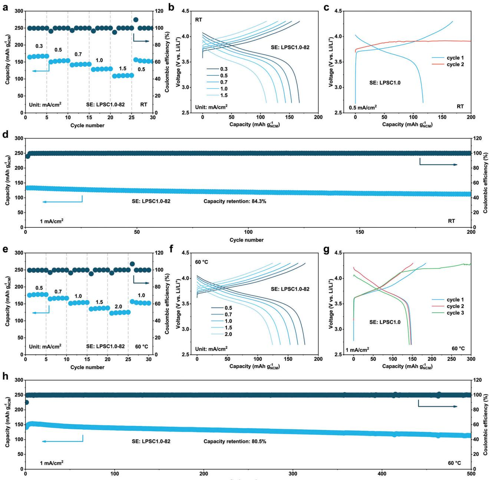

# **Intercepting Dendrite Growth With a Heterogeneous Solid Electrolyte for Long-Life All-Solid-State Lithium Metal Batteries**

*Tao Yu, Yuankai Liu, Yiwen Liu, Haoyu Li, Wenjie Ning, Yinhui Feng, Daxian Zuo, Haoshen Zhou, and Shaohua Guo\**

**The application of lithium metal anode in all-solid-state batteries has the potential to achieve both high energy density and safety performance. However, the presence of serious dendrite issues hinders this potential. Here, the ion transport pathways and orientation of dendrite growth are regulated by utilizing the differences of ionic conductivity in heterogeneous electrolytes. The in situ formed Li–Ge alloy phases from the spontaneous reaction between Li10GeP2S12 and the attracted dendrites greatly enhance the ability to resist dendrite growth. As an outcome, the heterogeneous electrolyte achieves a high critical current density of 2.1 mA cm−2 and long-term stable symmetrical battery operation (0.3 mA cm−2 for 17 000 h and 1.0 mA cm−2 for 2000 h). Besides, due to the superior interfacial stability and low interface impedance between the heterogeneous electrolyte and lithium anode, the Li||LiNi0.8Co0.1Mn0.1O2 full battery exhibits great cycling stability (80.5% after 500 cycles at 1.0 mA cm−2) and rate performance (125.4 mAh g at 2.0 mA cm−2). This work provides a unique strategy of interface regulation via heterogeneous electrolytes design, offering insights into the development of state-of the-art all-solid-state batteries.**

# **1. Introduction**

Lithium metal is considered to be the ideal anode material due to its high theoretical capacity (3860 mAh g−1) and low potential (−3.04 V vs standard hydrogen electrode).[\[1\]](#page-8-0) The all-solidstate battery has the potential to construct the safe 500 Wh kg−1

T. Yu, Y. Liu, Y. Liu, H. Li, W. Ning, Y. Feng, D. Zuo, H. Zhou, S. Guo College of Engineering and Applied Sciences Jiangsu Key Laboratory of Artificial Functional Materials National Laboratory of Solid State Microstructures Collaborative Innovation Center of Advanced Microstructures Frontiers Science Center for Critical Earth Material Cycling Nanjing University Nanjing 210023, China E-mail: [shguo@nju.edu.cn](mailto:shguo@nju.edu.cn) T. Yu, Y. Liu, H. Li, W. Ning, Y. Feng, S. Guo Lab of Power and Energy Storage Batteries

Shenzhen Research Institute of Nanjing University Shenzhen 518057, P. R. China

The ORCID identification number(s) for the author(s) of this article can be found under <https://doi.org/10.1002/smll.202405446>

**DOI: 10.1002/smll.202405446**

energy storage system due to the usage of Li metal anode and nonflammable solid electrolytes,[\[2\]](#page-8-0) making it a promising choice for electric vehicles. The challenge of Li dendrites becomes even tough although the solid electrolytes with high Young's modulus are expected to block continuous dendrite growth.[\[3\]](#page-8-0) However, in reality, lithium dendrite growth is more severe in solid-state batteries than in liquid batteries, as evidenced by the fact that the critical current density (CCD) of multiple solid electrolytes is below 0.5 mA cm−2, such as Li6PS5Cl (LPSC1.0, CCD: 0.4 mA cm−2) [\[4\]](#page-8-0) and Li6.4La3Zr1.4Ta0.6O12 (LLZTO, CCD: 0.15 mA cm−2).[\[1b\]](#page-8-0) Besides, the severe side reactions between lithium metal and solid electrolytes, such as Li10GeP2S12 (LGPS)[\[5\]](#page-8-0) and Li3YCl6, [\[6\]](#page-8-0) also restrain the application of lithium metal anode, in which the mixed conductive interphase cannot passivate the side reactions.

Considering the unsatisfied properties of current solid electrolytes, many strategies

have been reported to construct solid electrolyte layer with high conductivity and stability to realize promising Li metal anode compatibility.[\[7\]](#page-8-0) The modification of solid electrolytes can regulate the interphase between lithium metal and electrolytes, thereby suppressing interface side reactions and dendrite growth. However, the modification of electrolytes often sacrifices their ionic conductivity, such as CuF2–LiNO3–Li6PS5Cl[\[4\]](#page-8-0) and LiF@LGPS.[\[8\]](#page-8-0) Constructing multilayer electrolytes can combine the advantages of several electrolytes, effectively preventing interface side reactions and inhibiting dendrite growth,[\[9\]](#page-8-0) but this increases manufacturing difficulty, making industrialization challenging.

In this work, we redistribute the Li+ transport flux within the solid electrolyte layer to regulate the Li plating behavior through coordinating the electrolytes with distinct ion conductivities. In principle, the homogeneous solid electrolytes with identical solid particles bring uniform ion transport flux through each particle (**Scheme 1**[a\)](#page-1-0).[\[10\]](#page-8-0) This equal distribution of ion diffusion without propensity is like the parallel connection of the same resistors (Scheme [1c\)](#page-1-0). In contrast, the equal distribution of ion flux undergoes readjustment in the heterogeneous solid electrolyte with multiple electrolyte particles (Scheme [1b\)](#page-1-0). The solid electrolyte

**Scheme 1.** Schematic diagram of ion transport mechanism for homogeneous and heterogeneous solid electrolytes. a) The schematic diagram of the ASSB with homogeneous solid electrolytes, where the ion transport flux is the same. b) The schematic diagram of the ASSB with heterogeneous solid electrolytes, where the ion transport flux is different. c) The homogeneous solid electrolyte can be concreted as a multiple circuit with identical parallel resistances. d) The heterogeneous solid electrolyte can be concreted as a multiple circuit with different parallel resistances.

with low diffusion barrier can create hot points of ion flux within the electrolyte layer, which serve as relay centers for ion redistribution. A similar pattern can be described as the current distribution in parallel connection of the distinct resistors (Scheme 1d). This converging effect from high-conductivity particles facilitates the fast ion diffusion within solid electrolyte layer. Accordingly, the ion-plating direction, which points to the source of ion flux, can also be regulated. Through utilizing the selective reactions between lithium deposits and solid electrolytes, the dangerous Li dendrite can be consumed and locked on purpose, ensuring dynamic stability between the electrolyte and lithium metal.

Specifically, in our work, a series of heterogeneous electrolytes is constructed by introducing high-conductive solid particles (LGPS) into low-conductive electrolyte (LPSC1.0). As an outcome, we increase the CCD from 0.5 to 2.1 mA cm−2, a 4.2-fold improvement, and extend the cycle life of the symmetric battery from 20 to 17 000 h. The symmetric battery also demonstrates stable operation for above 2000 h under 1.0 mA cm−2, indicating the outstanding ability of the heterogeneous electrolyte in inhibiting dendrite growth. The Li||LiNi0.8Co0.1Mn0.1O2 (NCM811) battery based on heterogeneous electrolytes exhibits excellent rate performance and cycle stability, achieving 125.4 mAh g−1 at 2 mA cm−2 and retaining 80.5% capacity after 500 cycles.

#### **2. Results**

#### **2.1. The Evaluation of Symmetrical Battery Performance**

The argyrodite-type sulfide electrolyte, such as LPSC1.0, is considered one of the most promising solid electrolytes because of its stable interphase with lithium metal (Figure S2 and Note S1, Supporting Information), low-cost elements, and simple synthesis process. However, the problem of dendrite growth is significant in LPSC1.0, as evidenced by the low CCD (0.5 mA cm−2) at room temperature (RT) shown in **Figure 1**[a.](#page-2-0) LGPS is a typical unstable electrolyte for lithium metal (Figure S3 and Note S1, Supporting Information), with interface products including Li2S, Li3P, and Li–Ge alloy, making it a mixed conductor.[\[11\]](#page-8-0) Figure S4, Supporting Information shows the voltage profile of the symmetrical cell based on LGPS, in which the overpotential increases a lot during cycling. Herein, we construct a set of heterogeneous electrolytes via mixing LPSC1.0 and LGPS evenly via low-speed ball milling (50 rpm), without compromising the ionic conductivity of the electrolyte (Figure S5, Supporting Information). The uniform distribution of elements indicates the homogeneous mixing of LPSC1.0 and LGPS (Figure S6, Supporting Information). LGPS holds a higher cold-pressed ionic conductivity than LPSC1.0 (Figure S7, Supporting Information). Therefore, LGPS is more of an attrahent to dendrites growth than LPSC1.0 in heterogeneous electrolytes. Subsequently, by utilizing the spontaneous chemical reactions between LGPS and lithium dendrites, the formation of Li–Ge alloy can offer a splendid ion migration rate,[\[12\]](#page-8-0) thereby improving the inhibitory effect of the electrolyte on dendrites.

In order to investigate the optimal mixture ratio, various heterogeneous electrolytes were prepared, and their inhibitory effects on dendrites growth were evaluated through critical current density testing. As for the LPSC1.0-91 (LPSC1.0: LGPS = 9:1, based on the mass), the CCD was 0.7 mA cm−2 at RT (Figure [1b\)](#page-2-0), revealing a slight improvement than LPSC1.0. When the quality percentage of LGPS was increased to 20%, the CCD of LPSC1.0- 82 rose significantly to 2.1 mA cm−2 (Figure [1c\)](#page-2-0), which was

**Figure 1.** The symmetrical battery testing under room temperature with heterogeneous solid electrolytes of different proportions. The critical density test of the symmetrical battery with a) LPSC1.0 electrolyte, b) LPSC1.0-91 electrolyte, c) LPSC1.0-82 electrolyte, and d) LPSC1.0-73 electrolyte. The initial current density is 0.1 mA cm−2 and the stepping current density is 0.2 mA cm−2. e) The distribution of relaxation time (DRT) profile from the in situ EIS of Li|LPSC1.0-82|Li battery. The long cycling test of the symmetrical battery with f) LPSC1.0 and g) LPSC1.0-82 electrolyte at 0.3 mA cm−2 with a fixed capacity of 0.3 mAh cm−2. h) The long cycling test of the symmetrical battery with LPSC1.0-82 electrolyte. The current density for the first ten cycles and the next ten cycles is 0.25 mA cm−2 and 0.5 mA cm−2, respectively.

4.2 times higher than the one of LPSC1.0. We increased the quality percentage of LGPS to 30% and raised the CCD of the heterogeneous electrolyte to 2.9 mA cm−2 (Figure 1d). However, the interface stability with lithium metal deteriorated due to the excess LGPS, in which the side reactions between LGPS and lithium metal could not be passivated by LPSC1.0 in time. Figure S8, Supporting Information shows the deposition-stripping curve of symmetric batteries under step-increased current densities. The overpotential of LPSC1.0-82 remained constant under a fixed current density, indicating a stable interface with lithium metal. In contrast, the overpotential of LPSC1.0-73 fluctuated, suggesting an unstable interface between the LPSC1.0-73 electrolyte and lithium metal. Further, the in situ EIS data from symmetrical cells using LPSC1.0-82 and LPSC1.0-73 electrolyte also supported this (Figure 1e; Figure S9 and Note S1, Supporting Information).

Then, we evaluate the long-term stability of the electrolyte/anode interface through long cycling tests of the

**Figure 2.** The evolution of the interface between Li and solid electrolyte before and after cycling. a) The interface of Li/LPSC1.0 electrolyte before cycling. b) The interface of Li/LPSC1.0 electrolyte after ten cycles (0.1 mA cm−2, 0.1 mAh cm−2). The image shows the severe dendrite growth issues. c) The interface of Li/LPSC1.0 electrolyte after 50 cycles (0.1 mA cm−2, 0.1 mAh cm−2). The image indicates the presence of a significant gap in the interface, possibly caused by severe side reactions between the growing lithium dendrites and the electrolyte, leading to interface damage. d) The interface of Li/LPSC1.0-82 electrolyte before cycling. e) The interface of Li/LPSC1.0-82 electrolyte after ten cycles (1.0 mA cm−2, 1.0 mA cm−2). The image indicates that there was no apparent dendrite growth on the interface, and it maintained close contact. f) The interface of Li/LPSC1.0-82 electrolyte after ten cycles (1.0 mA cm−2, 1.0 mA cm−2). The image indicates that the interface maintains good contact without any evident gaps or dendrite formation. g) Schematic diagram of the evolution of the Li/LPSC1.0 interface. h) Schematic diagram of the evolution of the Li/LPSC1.0-82 interface.

symmetrical batteries at a fixed current density. As for the original LPSC1.0 electrolyte, the symmetrical battery can only cycle for ≈20 h under 0.3 mA cm−2 (Figure [1f\)](#page-2-0). Regarding the LPSC1.0- 82 heterogeneous electrolytes, the symmetrical battery can cycle stably at the same current density for 17 000 h (Figure [1g\)](#page-2-0), which is the longest duration time of symmetric battery cycling among solid-state batteries known to us. In the longstanding cycling process, there is no significant change in the overpotential, as shown in Figure S10, Supporting Information, indicating the excellent interfacial stability of the electrolyte for lithium metal. Further, the symmetrical battery can operate steadily for over 2000 h (Figure [1h\)](#page-2-0) under high current density (1 mA cm−2, 1 mAh cm−2), demonstrating its excellent ability to suppress dendrite growth. We collect the symmetrical battery results based on argyrodite-type electrolytes from some previous work, as shown in Figure S11 and Table S1, Supporting Information. The heterogeneous electrolyte in this work has certain advantages in both current density and cycle time.

#### **2.2. The Evolution of Lithium/Solid Electrolyte Interface**

To study the evolution of the interface between lithium and solid electrolyte, we investigated this process using scanning electron microscopy (SEM). We first analyzed the particle size distribution of different sulfide electrolytes (LPSC1.0, LGPS, and LPSC1.0-82) using SEM (Figure S12, Supporting Information). The SEM images showed that the LPSC1.0 electrolyte had larger particles than LGPS. In addition, the particle size of LPSC1.0-82 electrolyte was significantly smaller because of the preparation process for the heterogeneous electrolyte. Next, we investigated the density of ceramic pellets with different sulfide electrolytes, and the results are shown in Figures S13–S15, Supporting Information. The results indicated that the LPSC1.0-82 pellet exhibited higher relative density, which was also one of the potential reasons for the high CCD exhibited by this electrolyte.

**Figure 2** exhibits the evolution of the interface between Li and solid electrolyte before and after cycling. Despite being cycled for 50 cycles at higher current density, the symmetric battery based on the LPSC 1.0-82 electrolyte maintained good interface contact and showed no significant dendrite growth (Figure [2d–f\)](#page-3-0). The schematic diagram of the interface evolution process is shown in Figure [2h.](#page-3-0) During the early cycling stage, the reaction between lithium metal and LPSC1.0-82 electrolyte formed a Li–Ge alloy interphase at the interface. This alloy interphase could enhance ion transport at the interface, thereby alleviating dendrite growth and interfacial contact failure. For the LPSC1.0 electrolyte, symmetrical cells showed significant dendrite growth after ten cycles (Figure [2a,b\)](#page-3-0) at a low current density, and severe gaps appeared after 50 cycles (Figure [2c\)](#page-3-0). As shown in Figure [2g,](#page-3-0) the LPSC1.0 electrolyte was unable to inhibit dendrite growth, leading to significant dendrite growth during the initial cycles. This dendritic growth further induced severe interfacial side reactions with the electrolyte, exacerbating interfacial failure.

#### **2.3. The Verification of Dendrite Growth Inhibition of Heterogenous Electrolytes**

The heterogeneous electrolyte based on LPSC1.0 and LGPS demonstrates excellent performance. However, further investigation is needed to determine if its underlying mechanism aligns with our expectations. To achieve this, we synthesized two additional argyrodite-type electrolytes with different chlorine contents (Li5.75PS4.75Cl1.25, denoted as LPSC1.25; Li5.5PS4.5Cl1.5, denoted as LPSC1.5). The CCD values of the two electrolytes are 0.7 and 0.9 mA cm−2 (**Figure 3**[a,b\)](#page-5-0), slightly higher than the one of LPSC1.0, which is consistent with the previous literatures.[\[13\]](#page-8-0) Figure S16, Supporting Information displays the X-ray diffraction (XRD) plot of the electrolytes, confirming their purity and single phase. Next, we prepared two heterogeneous electrolytes, LPSC1.25-82 and LPSC1.5-82, using the same LGPS ratio and treatment method; and then, tested their CCD. The CCD values of LPSC1.25-82 and LPSC1.5-82 were 1.5 and 1.1 mA cm−2, respectively (Figure [3c,d\)](#page-5-0). The CCD values of these three heterogeneous electrolytes (LPSC1.0-82, LPSC1.25-82, and LPSC1.5- 82) showed a gradually decreasing trend, indicating the strategy was becoming less effective due to the ionic conductivity of these electrolytes. The ionic conductivities of LPSC1.0, LPSC1.25, LPSC1.5, and LGPS were 3.57, 4.87, 6.75, and 5.26 mS cm−1, respectively (Figure S7, Supporting Information). As for the heterogeneous electrolytes LPSC1.0-82, the ionic conductivity of LPSC1.0 was lower than that of LGPS; thus, the LGPS functioned like a magnet, attracting the dendrites growth toward it. Raising the chlorine content of argyrodite-type electrolytes increased the ionic conductivity. As a result, the attracting effect of LGPS on dendrite growth gradually weakened, leading to the gradual failure of the strategy.

The stronger attraction of LGPS toward dendrites in heterogeneous electrolytes with LPSC1.0 could be verified by the interfacial byproducts between LGPS and lithium dendrites. Therefore, we used ex situ X-ray photoelectron spectroscopy (XPS) to study the interface products of symmetrical batteries (Figure [3e–g\)](#page-5-0). For the heterogeneous electrolytes, the Ge 3d spectrum of the interface could be deconvoluted into two doublets: GeS4 4− (3d5/2 ≈ 30.4 eV) and Ge0 (3d5/2 ≈ 29.4 eV), which is the byproduct of LGPS and lithium metal. By comparing the relative signal strengths of Ge0 and GeS4 4−, we could gauge the varying attraction of LGPS in different heterogeneous electrolytes for dendrite growth. For these three heterogeneous electrolytes, LPSC1.0-82 showed the highest signal proportion of Ge0, indicating that LGPS in LPSC1.0-82 was most attractive for dendrite growth. As the chlorine content of argyrodite-type electrolytes increased, the ionic conductivity of LGPS gradually lost its advantage, and its attractiveness to dendrites also weakened.

The simulations in the phase field also confirmed this point (Figure [3h–j\)](#page-5-0). The model combined electrolyte A and electrolyte B, highlighting the impact of their respective ionic conductivities on dendrite growth rates. Specifically, when the ionic conductivities of electrolytes A and B were the same, the growth rates of the dendrites became more consistent (Figure [3h\)](#page-5-0). In contrast, when the ionic conductivity of electrolyte A surpassed that of electrolyte B, dendrite growth in A accelerated, as evident in Figure [3i.](#page-5-0) When the disparity in ionic conductivity widened, there was a greater variation in dendrite growth (Figure [3j\)](#page-5-0). These findings underscore the significant influence of ionic conductivity on dendrite growth dynamics within the studied heterogeneous electrolyte system.

#### **2.4. Electrochemical Performance of the Full Cells**

In the preceding section, we have demonstrated the excellent inhibitory effect of LPSC1.0-82 heterogeneous electrolyte on dendrite growth in symmetric cells. However, there are still uncertainties regarding the performance of this electrolyte in the full battery. Hence, the electrochemical performance of Li||NCM811 based on LPSC1.0 and LPSC1.0-82 electrolyte was comprehensively evaluated. To evaluate the kinetic performance of the battery system, we first tested its rate capability. The Li||NCM811 full cell, using the LPSC1.0-82 electrolyte, exhibited impressive rate performance, as illustrated in **Figure 4**[a.](#page-6-0) Specifically, the battery demonstrated the ability to release specific capacities of 167.1, 153.7, 143.2, 129.6, and 110.2 mAh g−1 under the current densities of 0.3, 0.5, 0.7, 1.0, and 1.5 mA cm−2 at RT, respectively. In addition, the corresponding voltage profiles at different current densities are depicted in Figure [4b,](#page-6-0) providing evidence of small overpotential. The cycling stability of the battery was also outstanding under the current density of 1 mA cm−2 (Figure [4d\)](#page-6-0), with a capacity retention of 84.3% after 200 cycles. Further, the average coulombic efficiency of the battery was also high, reaching 99.95%. For the LPSC1.0 electrolyte, a short circuit occurred in the second cycle of the battery at 0.5 mA cm−2 (Figure [4c\)](#page-6-0), indicating the poor resistance to dendrite growth.

The electrochemical performance of the battery was systematically tested under high temperature conditions (60 °C). Figure [4e](#page-6-0) illustrates the battery's specific capacities at different current densities, demonstrating the superior rate performance of the full cell compared to that at RT. The specific capacities at 0.5, 0.7, 1.0, 1.5, and 2.0 mA cm−2 were 177.7, 166.2, 153.5, 137.2, and 125.4 mAh g−1, respectively. In Figure [4f,](#page-6-0) the voltage profiles at various current densities depicted a smaller overpotential for the full cell compared to that at RT. The excellent cycling stability of the full cell based on LPSC1.0-82 electrolyte was demonstrated by the long-term cycling curve depicted in Figure [4h,](#page-6-0) which showcased a high average coulombic efficiency of 99.96%. The battery's

**Figure 3.** The mechanism of heterogeneous electrolytes revealed via orthogonal experiments. The critical density test of the symmetrical battery with a) LPSC1.25 electrolyte, b) LPSC1.5 electrolyte, c) LPSC1.25-82 electrolyte, and d) LPSC1.5-82 electrolyte. The Ge 3d spectrum at the interface of symmetrical cells after ten cycles (0.5 mA cm−2, 0.5 mAh cm−2) with e) LPSC1.0-82, f) LPSC1.25-82, and g) LPSC1.5-82 electrolyte. The simulation of lithium dendrite growth in heterogeneous solid electrolytes, h) A = B, i) A *>* B, and j) A *>>* B.

**Figure 4.** The electrochemical performance of Li||NCM811 ASSLMBs with different electrolytes. a) The rate performance of Li||NCM811 ASSLMB with LPSC1.0-82 electrolyte at RT. b) The voltage profile of Li||NCM811 ASSLMB with LPSC1.0-82 under different current density at RT. c) The voltage profile of Li||NCM811 ASSLMB with LPSC1.0 under 0.5 mA cm−2 at RT. d) The cycling performance of Li||NCM811 ASSLMB with LPSC1.0-82 under 1.0 mA cm−2 at RT. e) The rate performance of Li||NCM811 ASSLMB with LPSC1.0-82 electrolyte at 60 °C. f) The voltage profile of Li||NCM811 ASSLMB with LPSC1.0-82 under different current density at 60 °C. g) The voltage profile of Li||NCM811 ASSLMB with LPSC1.0 under 1.0 mA cm−2 at 60 °C. h) The cycling performance of Li||NCM811 ASSLMB with LPSC1.0-82 under 1.0 mA cm−2 at 60 °C.

initial capacity stood at 141.2 mAh g−1, and remarkably, even after 500 cycles, it managed to retain 80.5% of its capacity, delivering a sustained performance of 113.6 mAh g−1. Even at 60 °C, LPSC1.0 had a limited ability to resist dendrite growth, as evidenced by the short-circuit of the battery during the third cycle (Figure 4g). The battery could only operate normally under a small current density (0.2 mA cm−2), which would encounter the micro-short-circuit when the current density increased to 0.4 mA cm−2 (Figure S17, Supporting Information).

# **3. Conclusion**

The heterogeneous solid electrolytes with LPSC1.0 and LGPS have been demonstrated as effective strategies for dendrite

inhibition in which the difference of ionic conductivity could regulate the orientation of dendrite growth. We then utilized the spontaneous reaction between LGPS and lithium metal to capture dendrites and convert them into a beneficial Li–Ge alloy phase, significantly enhancing the ability to resist dendrites. As a result, we increased the critical current density of the electrolyte from 0.5 to 2.1 mA cm−2 and achieved long-term stable operation of the symmetrical battery (0.3 mA cm−2 for 17 000 h and 1.0 mA cm−2 for 2000 h). The stable and low interfacial resistance between heterogeneous electrolytes and lithium anode endowed the Li||NCM811 full cell with an excellent cycling stability (80.5% after 500 cycles) and rate performance (125.4 mAh g−1 at 2 mA cm−2). This work offered new insights into the regulation of dendrite growth and presented new opportunities for the development of high-performance all-solid-state lithium metal batteries.

#### **4. Experimental Section**

*Material Synthesis*: Li6PS5Cl (LPSC1.0) powders were prepared through solid-phase synthesis using Li2S (99.5%; Aladdin), LiCl (99.9%, anhydrous; Aladdin), and P2S5 (99%; Macklin) powders in a stoichiometric molar ratio of Li6PS5Cl. First, the powders were preliminarily mixed in an agate mortar for 20 min; then, placed into a ball milling tank with 5-mm ZrO2 balls sealed using dry argon. The tank underwent 10 h of ball milling at 300 rpm (MITR, YXQM-1.0 L). The well-mixed powders were collected and pressed into pellets with a 12 mm diameter, followed by sealing in a quartz tube with a vacuum degree of 10−2 Pa. Subsequently, the sealed tube underwent annealing at 550 °C for 10 h with a ramping/cooling rate of 2 °C min−1. The resulting annealed pellets were hand-ground in an agate mortar within an argon gas glove box [H2O, O2 ≤ 1 ppm]. For the preparation of Li5.75PS4.75Cl1.25 (LPSC1.25) and (LPSC1.5) Li5.5PS4.5Cl1.5 (LPSC1.5) electrolytes, a similar process was employed with a lower sintering temperature (500 °C for LPSC1.25 and 450 °C for LPSC1.5). Li10GeP2S12 (LGPS) powders were prepared using a similar solid-phase synthesis method with Li2S (99.5%; Aladdin), Ge (99.99%; Aladdin) S (99.5%, 5% excess; Aladdin), and P2S5 (99%; Macklin) as raw materials. The sintering temperature was 620 °C.

The heterogeneous electrolytes were mixed via low-speed (50 rpm, [MITR, YXQM-1.0 L]) ball milling based on the mass ratio of electrolytes.

All the sintered electrolytes were ground to powder and sieved through a 300-mesh sieve before being used.

*Material Characterization*: The crystal structures of the materials were characterized using XRD (Bruker D8 Advance Diffractometer) with Cu K radiation in the range of 10–80°. Following this, the heterogeneous electrolytes/lithium anode interface of the symmetrical cells were examined via XPS (Thermo Scientific K-Alpha) after 10-nm argon ion etching. All of the experiments conducted in this section were protected by dry argon gas. Morphological and structural analyses were performed by field emission scanning electron microscope (FESEM, Hitachi SU8010), with energy dispersive spectroscopy (EDS).

*Conductivity Measurements*: Before conducting the EIS measurement using the Biologic VSP-300, the stainless steel (SS)|SE|SS symmetrical cell was prepared. The solid electrolyte powders were placed into a homemade mold with a diameter of 10 mm and pressed at ≈2 tons for 2 min. Following this, an external pressure of ≈20 MPa was applied on the cell. The EIS technique was then utilized within a frequency range from 1 MHz to 1 Hz, using a voltage amplitude of 10 mV.

*Li||Li Symmetric Cell Fabrication*: The solid electrolyte powders (≈150 mg) were placed into a homemade mold with a diameter of 10 mm and pressed at ≈2 tons for 2 min. Li foils (100 μm thickness) with a diameter of 9 mm were then pasted on both sides; and finally, the cell was sandwiched between two stainless steel rods as current collectors. Following this, an external pressure of ≈10 MPa was applied on the cell. Galvanostatic charging/discharging (NEWARE Battery Test System [CT- 4008T-5V10mA-164, Shenzhen, China]) of the cells was conducted under different current densities at RT.

*In Situ Electrochemical Impedance Spectroscopy (EIS) Test of Symmetrical Cells*: The in situ EIS was conducted at RT, and the frequency range was from 1 MHz to 0.1 Hz, with a voltage amplitude of 10 mV. The first sampling point occurred before the symmetric battery cycling, with subsequent tests conducted at the end of each cycle (0.3 mA cm−2, 0.5 h), totaling 20 cycles (Figure S1, Supporting Information). Further, the DRT analyses were carried out using the MATLAB Graphical User Interface (GUI) toolbox developed by Ciucci's research team.[\[14\]](#page-8-0)

*Li||NCM811 Full Cell Fabrication*: For the Li||NCM811 solid-state cell, the composite cathode was mixed with NCM811 and LPSC1.0 in a mass ratio of 7:3 via hand milling in the mortar. For the assembly of full cells, the solid electrolyte powders (≈150 mg) were placed into a homemade mold with a diameter of 10 mm and pressed at ≈1 ton for 1 min. Afterward, the powders of the composite cathode (≈6–7 mg cm−2) were scattered on the cathode layer evenly, and the mound was pressed at ≈2 tons for 2 min to form a bilayer pellet. Li foils (100 μm thickness) with a diameter of 9 mm were then pasted on the anode side. Following this, an external pressure of ≈10 MPa was applied on the cell. Galvanostatic charging/discharging (NEWARE Battery Test System [CT-4008T-5V10mA-164, Shenzhen, China]) of the cells was conducted in the voltage range of 2.7–4.3 V (vs Li/Li+).

# **Supporting Information**

Supporting Information is available from the Wiley Online Library or from the author.

# **Acknowledgements**

This work was financially supported by the National Key R&D Program of China (No. 2021YFA1202300), the National Natural Science Foundation of China (No. 22075132 and 22209069), the Natural Science Foundation of Jiangsu Province, China (No. BK20211556, BK20220783, and BK20230789), the Jiangsu Province Carbon Peak and Neutrality Innovation Program (Industry tackling on prospect and key technology, No. BE2022002-2), the Shenzhen Science and Technology Innovation Committee (No. RCYX20200714114524165 and JCYJ20210324123002008), and the Guangdong Basic and Applied Basic Research Foundation (No. 2023A1515011437, 2022A1515110736, and 2022A1515010026). The authors also thank Fundamental Research Funds from the Central Universities and Frontiers Science Center for Critical Earth Material Cycling Fund. The authors are grateful to the High Performance Computing Center (HPCC) of Nanjing University for doing the numerical calculations in this paper on its blade cluster system.

# **Conflict of Interest**

The authors declare no conflict of interest.

### **Data Availability Statement**

The data that support the findings of this study are available from the corresponding author upon reasonable request.

## **Keywords**

all-solid-state lithium metal batteries, heterogeneous solid electrolytes, ion transport flux regulation, lithium dendrite

> Received: July 5, 2024 Revised: July 22, 2024 Published online: August 7, 2024

- [1] a) L. Yong-Gun, F. Satoshi, J. Changhoon, S. Naoki, Y. Nobuyoshi, O. Ryo, K. Dong-Su, S. Tomoyuki, S. Toshinori, R. Saebom, K. Jun Hwan, W. Taku, P. Youngsin, A. Yuichi, I. Dongmin, H. In Taek, *Nat. Energy* **2020**, *5*, 299; b) S. Lee, K.-s. Lee, S. Kim, K. Yoon, S. Han, M. H. Lee, Y. Ko, J. H. Noh, W. Kim, K. Kang, *Sci. Adv.* **2022**, *8*, eabq0153; c) S. Yuan, K. Ding, X. Zeng, D. Bin, Y. Zhang, P. Dong, Y. Wang, *Adv. Mater.* **2023**, *35*, 2206228; d) A. Hu, W. Chen, X. Du, Y. Hu, T. Lei, H. Wang, L. Xue, Y. Li, H. Sun, Y. Yan, J. Long, C. Shu, J. Zhu, B. Li, X. Wang, J. Xiong, *Energy Environ. Sci.* **2021**, *14*, 4115.
- [2] a) Y.-C. Yin, J.-P. Wang, Y.-H. Song, H.-X. Ju, J.-T. Y., J.-D. Luo, L.-Z. Feng, Y. Xiao, Z. Li, G.-X. Lu, P. Li, F. Li, Y.-C. Wu, J.-N. Yang, T. Ma, Z. Huang, X. Tao, H.-B. Yao, *Nature* **2023**, *616*, 77; b) T. Yu, H. Li, Y. Liu, J. Li, J. Tian, Z. Liu, Y. Rao, S. Guo, H. Zhou, *Sci. Adv.* **2023**, *9*, eadj8171; c) T. Yu, W. Ning, H. Li, S. Guo, H. Zhou, *Nanoscale Horiz.* **2024**, *9*, 667; d) Y. Wang, J. Ju, S. Dong, Y. Yan, F. Jiang, L. Cui, Q. Wang, X. Han, G. Cui, *Adv. Funct. Mater.* **2021**, *31*, 2101523.
- [3] Z. Wang, J. Xia, X. Ji, Y. Liu, J. Zhang, X. He, W. Zhang, H. Wan, C. Wang, *Nat. Energy* **2024**, *9*, 251.
- [4] H. Wan, J. Zhang, J. Xia, X. Ji, X. He, S. Liu, C. Wang, *Adv. Funct. Mater.* **2021**, *32*, 2110876.
- [5] N. Kamaya, K. Homma, Y. Yamakawa, M. Hirayama, R. Kanno, M. Yonemura, T. Kamiyama, Y. Kato, S. Hama, K. Kawamoto, A. Mitsui, *Nat. Mater.* **2011**, *10*, 682.
- [6] C. Wang, J. Liang, J. Luo, J. Liu, X. Li, F. Zhao, R. Li, H. Huang, S. Zhao, L. Zhang, J. Wang, X. Sun, *Sci. Adv.* **2021**, *7*, eabh1896.
- [7] a) H. Pan, M. Zhang, Z. Cheng, H. Jiang, J. Yang, P. Wang, P. He, H. Zhou, *Sci. Adv.* **2022**, *8*, eabn4372; b) Y. Lu, C.-Z. Zhao, R. Zhang, H. Yuan, L.-P. Hou, Z.-H. Fu, X. Chen, J.-Q. Huang, Q. Zhang, *Sci. Adv.* **2021**, *7*, eabi5520; c) T. Yu, B. Ke, H. Li, S. Guo, H. Zhou, *Mater. Chem. Front.* **2021**, *5*, 4892; d) Y. Su, L. Ye, W. Fitzhugh, Y. Wang, E. Gil-González, I. Kim, X. Li, *Energy Environ. Sci.* **2020**, *13*, 908; e) C. Duan, Z. Cheng, W. Li, F. Li, H. Liu, J. Yang, G. Hou, P. He, H. Zhou, *Energy Environ. Sci.* **2022**, *15*, 3236.
- [8] Y. Jin, Q. He, G. Liu, Z. Gu, M. Wu, T. Sun, Z. Zhang, L. Huang, X. Yao, *Adv. Mater.* **2023**, *35*, 2211047.
- [9] a) L. Ye, X. Li, *Nature* **2021**, *593*, 218; b) S. Xu, X. Cheng, S. Yang, Y. Yin, X. Wang, Y. Zhang, D. Ren, Y. Sun, X. Sun, H. Yao, Y. Yang, *Adv. Mater.* **2024**, *36*, 2310356; c) J. Su, M. Pasta, Z. Ning, X. Gao, P. G. Bruce, C. Grovenor, *Energy Environ. Sci.* **2022**, *15*, 3805.
- [10] K. Yang, L. Zhao, X. An, L. Chen, J. Ma, J. Mi, Y.-B. He, *Angew. Chem., Int. Ed.* **2023**, *62*, 202302586.
- [11] C. Liu, B. Chen, T. Zhang, J. Zhang, R. Wang, J. Zheng, Q. Mao, X. Liu, *Angew. Chem., Int. Ed.* **2023**, *62*, 202302655.
- [12] J. Wan, Y.-X. Song, W.-P. Chen, H.-J. Guo, Y. Shi, Y.-J. Guo, J.-L. Shi, Y.-G. Guo, F.-F. Jia, F.-Y. Wang, R. Wen, L.-J. Wan, *J. Am. Chem. Soc.* **2020**, *143*, 839.
- [13] D. Zeng, J. Yao, L. Zhang, R. Xu, S. Wang, X. Yan, C. Yu, L. Wang, *Nat. Commun.* **2022**, *13*, 1909.
- [14] T. H. Wan, M. Saccoccio, C. Chen, F. Ciucci, *Electrochim. Acta* **2015**, *184*, 483.