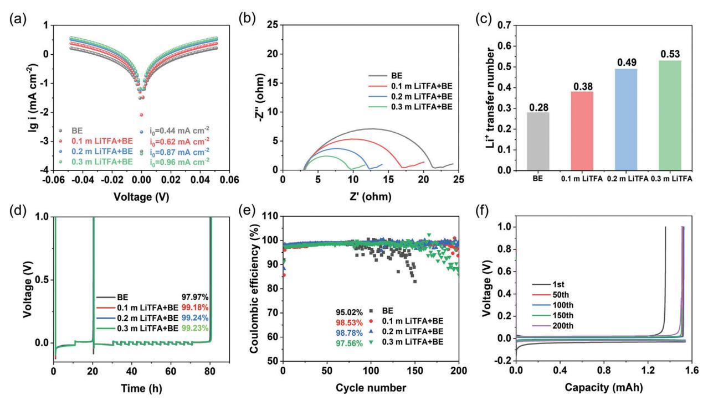
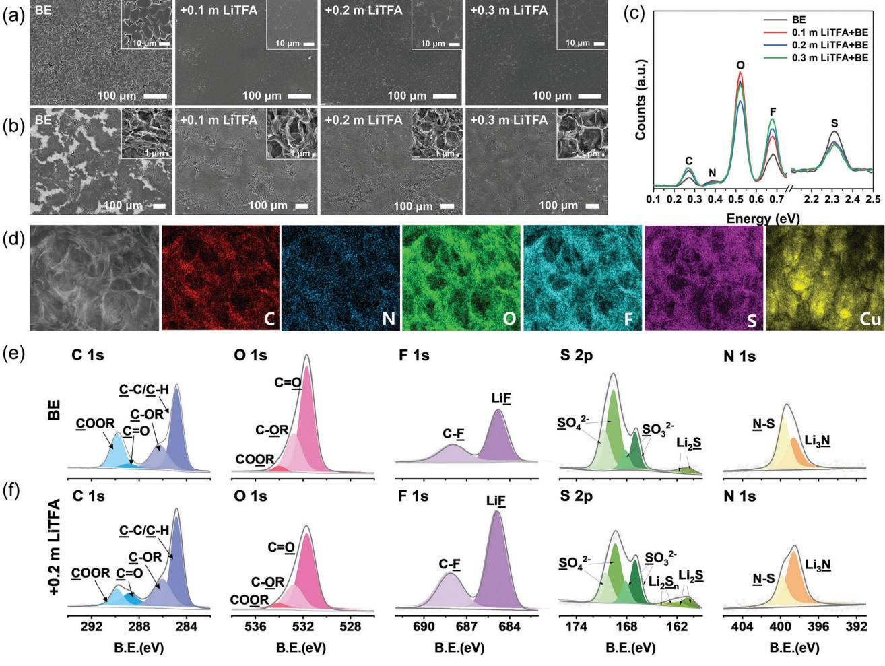
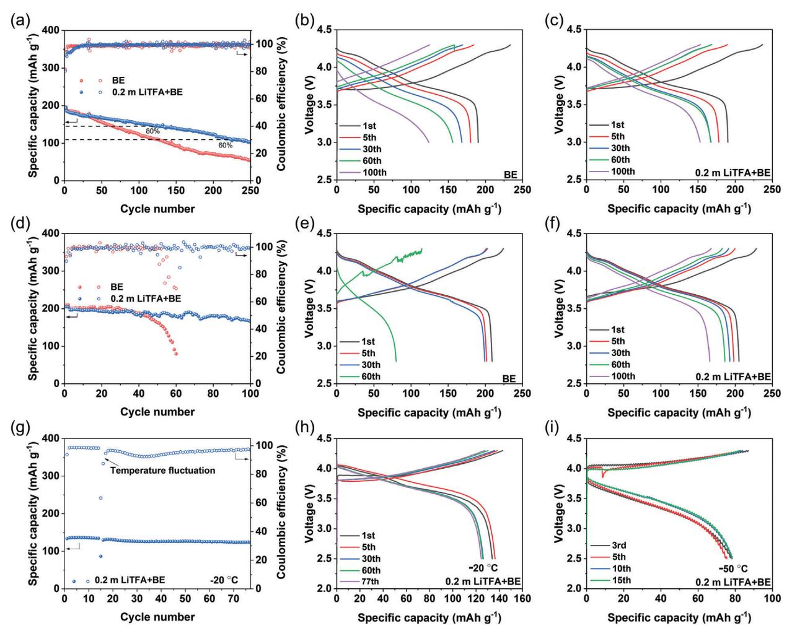
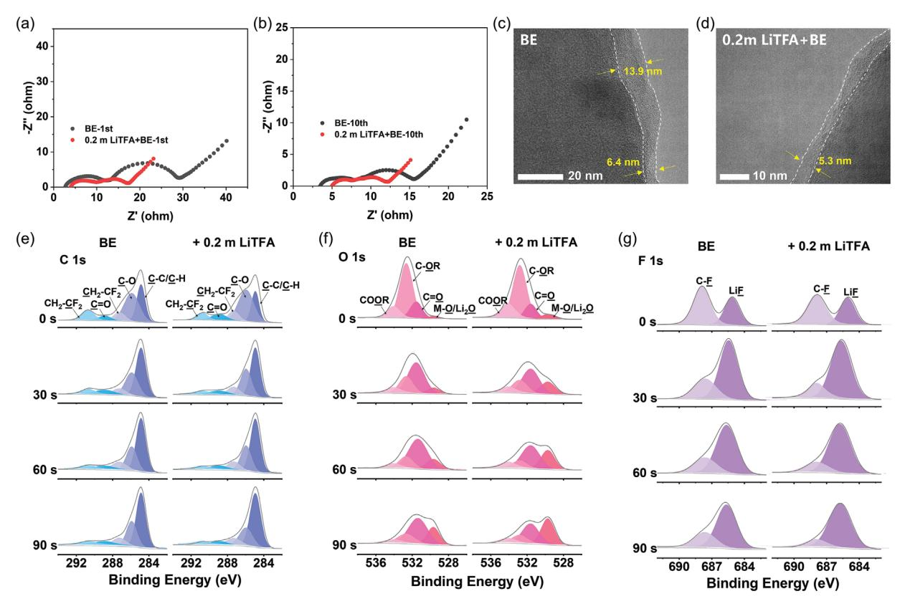

# **Designing High Donor Number Anion Additive for Stable Lithium Metal Batteries**

*Jia Li, Jingwei Zhang, Huaqing Yu, Zihang Xi, Zhenyu Fan, Shuangxin Ren, Xu Liu, Kun Li, and Qing Zhao\**

**The electrolytes in energy-dense lithium metal batteries (LMBs) face the challenge of being compatible with both the lithium anode and the high voltage cathodes. Adjusting the solvation structures of the electrolytes by regulating the interaction between ions and solvents is an effective strategy to improve the stability of LMBs. Herein, lithium trifluoroacetate (LiTFA) endowed with high donor number is introduced into ether-based electrolytes as an additive to regulate the solvation structure and further stabilize the interphase as well as accelerate the interfacial kinetic of LMBs. Due to the strong interaction between TFA− with Li+, the anion-rich solvation structure with reduced solvent coordination capability is constructed, contributing to the formation of inorganic-rich interphase layers and facilitate charge transfer reaction. Consequently, the designed electrolyte improves the reversibility of Li plating/stripping with high Coulombic efficiency of 99.24% and enables long-term cycling of Li||LiNi0.8Co0.1Mn0.1O2 (NCM811) over 100 cycles with a capacity retention of 84.37% under the condition of lean electrolyte, limited Li source and conventional Li-salt concentration. This work provides an effective and low-cost strategy to adjust the solvation structure and improve the stability of LMBs without largely sacrificing the intrinsic physicochemical property (viscosity, wettability, ionic conductivity etc.) of electrolytes.**

#### **1. Introduction**

Lithium metal batteries (LMBs) have demonstrated great merits on energy density due to the extremely high theoretical capacity (3860 mAh g−1) and the low electrode potential (−3.04 V vs S.H.E) of lithium metal anode, especially when matching with high voltage cathodes.[\[1\]](#page-8-0) However, the application of LMBs suffers from

J. Li, J. Zhang, H. Yu, Z. Xi, Z. Fan, S. Ren, X. Liu, K. Li, Q. Zhao Frontiers Science Center for New Organic Matter Key Laboratory of Advanced Energy Materials Chemistry (Ministry of Education) State Key Laboratory of Advanced Chemical Power Sources College of Chemistry Nankai University Tianjin 300071, China E-mail: [zhaoq@nankai.edu.cn](mailto:zhaoq@nankai.edu.cn) Q. Zhao Haihe Laboratory of Sustainable Chemical Transformations Tianjin 300192, China

The ORCID identification number(s) for the author(s) of this article can be found under <https://doi.org/10.1002/smll.202408164>

**DOI: 10.1002/smll.202408164**

short cycling life and safety risk, which ascribes to inevitable consumption of active lithium source and electrolyte when repeated cracking and formation occurs on fragile solid electrolyte interphase (SEI) layer, and the significant volume expansion and even the growth of lithium dendrites during lithium deposition.[\[2\]](#page-8-0) In comparison with traditional carbonate-based electrolytes, ether-based electrolytes have shown excellent compatibility with Li metal anode. However, due to the poor oxidation stability, the ether electrolytes usually cannot afford the operation of high-voltage cathodes (*>* 4 V vs Li/Li+).[\[3\]](#page-8-0) Recently, the regulation of electrolyte chemistry that can realize the formation of inorganicrich electrolyte-electrode interphase layers by constructing anion-dominated Li+ solvation structure is confirmed as an effective and economical way to improve the compatibility with both Li metal anode and high voltage cathodes.[\[4,5\]](#page-8-0) The interphase layer rich in inorganic substances is usually endowed with high interfacial energy toward Li metal and high ion

conductivity, thereby can effectively inhibit dendrites growth and improve the ion transport kinetics at the interface.[\[6–8\]](#page-8-0) Meanwhile, the dense and inorganic-rich cathode electrolyte interphase (CEI) is conducive to inhibiting the continuous decomposition of electrolyte and the corrosion of Al current collector under high-voltage.[\[9,10\]](#page-8-0) Over the past few years, several kinds of electrolyte models have been proposed to build anion-rich solvation structures, including high concentration electrolytes (HCEs),[\[11–13\]](#page-8-0) locally high concentration electrolytes (LHCEs),[\[14–16\]](#page-8-0) and weakly solvated electrolytes (WSEs).[\[17–19\]](#page-8-0) However, the applications of HCEs are plagued by poor wettability, high viscosity and high cost. The LHCEs with inert diluents face the risk of lithium salt precipitation under low temperatures. Besides, most diluents that functionalized by the fluorinegroups are also not cost-effective. Although WSEs using solvent with weak solvation capacity enables more anions to participate in the solvation structures, these advantages are achieved with the sacrifice of bulk ionic conductivity.

In contrast, additive modified electrolyte can improve the stability of LMBs at conventional concentration without largely sacrificing the intrinsic ion-transport properties. In most cases, the solvation structures of electrolytes are determined by the competition between solvents and anions when they are coordinated with Li+. [\[20,21\]](#page-8-0) Therefore, the improved electrochemical stability can be achieved by manipulating the intermolecular interactions among species within the electrolyte.[\[22,23\]](#page-8-0) The Gutmann donor number (DN) is a quantitative description of the Lewis base and can be used to assess the ability to provide electrons.[\[24\]](#page-8-0) In 1993, Linert et al. first evaluated the DN of various anions from the maximum UV−vis absorption wavelength (Cu) of a copper complex solvatochromic indicator dissolved in 1,2-dichloroethane.[\[25\]](#page-8-0) The higher DN of anion means the stronger interaction with Li+, and thus preferentially coordinate with Li+ to generate anion-rich solvation structure and further contribute to the formation of inorganic-rich and stable interfacial layer.[\[26–28\]](#page-8-0) Due to the high DN of NO3 − (21.1 kcal mol−1), LiNO3 is a kind of commonly used electrolyte additives.[\[29–35\]](#page-8-0) Zhang et al. reported that by introducing LiNO3 into the electrolyte, a stable SEI can be realized through anion-regulated solvation sheath.[\[36\]](#page-8-0) NO3 − can adjust Li+ solvated shell and decompose into ion-conductive and mechanically strong Li3Nrich interphase layer, which can facilitate the uniform deposition of lithium. In addition, Liu et al. proposed that NO3 −, which is small in size and has strong coordination ability with Li+, contributes to the formation of a passivated and adaptive electric double layer (EDL) structure at the cathode/electrolyte interface, thereby improving the oxidation stability of the electrolyte.[\[37\]](#page-8-0)

In spite of these merits, LiNO3 faces some intractable problems such as low solubility in aprotic solvents and easy decomposition into toxic nitrogen oxides at high temperature.[\[38–42\]](#page-8-0) Therefore, more efforts are still needed to find high DN additives with improved solubility and stability. Watanabe et al. validated that the DN of TFA− is higher than NO3 −, which means TFA− is more likely to preferentially coordinate with Li+ to form anion-rich solvation structure.[\[43,44\]](#page-8-0) At the same time, lithium trifluoroacetate (LiTFA) has good solubility in aprotic solvents due to its low lattice enthalpy.[\[43,45\]](#page-8-0) However, there are few studies on the application of LiTFA in lithium metal batteries,[\[46–48\]](#page-8-0) and a systematic insight on how LiTFA additive modifies the solvation structure of electrolytes is still lacking.

Inspired by the high DN of TFA−, in this work, LiTFA was introduced as an additive in electrolytes for high-performance LMBs. The combination of molecular dynamics (MD) and spectra analysis unveils that TFA− endowed with strong interaction toward Li+ can preferentially enter the inner solvated shell and promote the formation of the anion-dominated solvation structure. The perfluorinated structure makes TFA− have lower lowest unoccupied molecular orbital (LUMO) energy level than solvent, which is conducive to preferential reduction with the formation of stable SEI rich in LiF. In addition, the weakened interaction between Li+ and solvent enables fast interfacial charge transfer reaction, high Li+ transference number, as well as a high Coulombic efficiency (CE) up to 99.24% for lithium plaing/stripping reaction. As results, even at a conventional concentration (1 m lithium bis(fluorosulfonyl)imide (LiFSI) in diethoxyethane (DEE)), the addition of LiTFA (0.2 m) enables 84.37% capacity of high-voltage LMBs after 100 cycles that use limited-excess Li anode and lean electrolytes. Our results provide a feasible and universal approach to regulate the solvation structures of electrolytes for advanced battery systems.

# **2. Results and Discussion**

#### **2.1. Solvation Structure of the Electrolytes with High DN Additives**

As illustrated in **Scheme [1](#page-2-0)**, in comparison with LiNO3, LiTFA is endowed with higher DN of anion (DN = 34 kcal mol−1) [\[49,50\]](#page-8-0) as well as better solubility in various ether and carbonate solvents (Figures S1 and S2, Table S1, Supporting Information). Simultaneously, DEE that is known to exhibit weaker interaction with Li+ than traditional ether – DME (1,2-dimethoxyethane) due to the steric effects.[\[3\]](#page-8-0) At last, LiFSI was used as the main salt of electrolytes to provide fast ion transport at conventional concentration. In this work, 1 m LiFSI/DEE is designed as the based electrolyte (BE), in which various amounts of LiTFA are added (0.1, 0.2, 0.3 m) to illustrate the effect on solvation structure. It is worth noting that the addition of LiTFA only slightly increased the viscosity and reduced the wettability of electrolyte (Table S2 and Figure S3, Supporting Information).

Density functional theory (DFT) calculation was first performed to calculate the LUMO and the highest occupied molecular orbital (HOMO) energy level to reveal the redox stability of each component, in which DME and LiNO3 are also calculated for comparison. As shown in **Figure 1**[a,](#page-2-0) the LUMO energy level decreases in the order of DME*>*DEE*>*LiTFA*>*LiNO3*>*LiFSI, indicating that LiTFA has a higher reduction tendency than solvents during SEI formation. The HOMO energy level of TFA− is higher than FSI−, indicating its prior decomposition on the cathode surface. Linear sweep voltammetry (LSV) was further employed to compare the reduction tendency of species in the electrolytes (Figure S4, Supporting Information). Two distinct peaks observed in the high and low voltage regions correspond to the reduction of anions and solvents, respectively. The initial reduction potential of LiTFA is ≈1.62 V versus Li+/Li, which is slightly higher than that of LiFSI (1.58 V vs Li+/Li), implying that the strong interaction between Li+ and TFA− facilitates the preferential reduction of TFA− for SEI formation at anodes.

The composition of the interfacial layer depends not only on the redox sequence of species, but also on the solvation structures of the electrolytes. In order to verify the practicability of the TFA− to regulate the solvation sheath, Fourier Transform Infrared Spectroscopy (FTIR) and nuclear magnetic resonance (NMR) spectra were implemented. FTIR can be used to investigate the coordination environment of DEE. The peaks at 1106 and 1066 cm−1 represent the C─O─C stretching vibration mode of free DEE and Li+-solvated DEE, respectively (Figure [1b;](#page-2-0) Figure S5, Supporting Information).[\[51,52\]](#page-8-0) With the increased concentration of TFA− in the electrolyte, the peak of Li+−DEE shows a blue-shift, indicating that the interaction between DEE and Li+ is weakened. In addition, the C═O absorption peak of LiTFA can also be observed at ≈1720 cm−1 in the FTIR spectrum[\[50,53\]](#page-8-0) (Figure S6, Supporting Information). The NMR spectra is an effective method to evaluate the chemical environment of the elements and analyze the changes of coordinating species in the solvation shell. As shown in Figure [1c,](#page-2-0) upon increasing the concentration of LiTFA (from 0 to 0.3 m), a trend of lower field (more positive) shift is observed (from 0.33 to 0.21 ppm) for7Li NMR spectra, indicating decreased electron density around Li+. Meanwhile, a same phenomenon can be seen in electrolytes with

**Scheme 1.** The illustration of high donor number (DN) additive (TFA−) modified electrolytes for stable lithium metal batteries. a) The merits of designed electrolytes (LiFSI/DEE with LiTFA) in bulk phase and interfacial reactions. b) Schematic solvation structure and interfacial characteristics.

**Figure 1.** Solvation structure of designed electrolytes. a) LUMO−HOMO energy levels of DME, DEE, LiFSI, FSI−, LiNO3, NO3 −, LiTFA, TFA−. b) FTIR spectra and c) 7Li NMR of each electrolyte. The chemical shifts of NMR are referenced to 1 M LiCl in D2O. Radial distribution function (RDF) of d) BE, e) 0.2 m LiTFA+BE. f) Coordination number of Li+ with DEE, FSI−, TFA− and g) proportion of coordinated DEE, FSI−, TFA− in BE and 0.2 m LiTFA+BE electrolytes. The snapshots of MD simulation boxes (yellow: anion, red: cation) and predominant coordination structures in h) BE and i) 0.2 m LiTFA+BE electrolytes. BE stands for 1 m LiFSI/DEE.

NO3 − additives (Figure S7a, Supporting Information), which means anions with high DN have similar capability to tune Li+ solvation structure. In addition, the 7Li NMR of DEE or DMEbased electrolytes with 1 m LiTFA or 1 m LiFSI are also measured. The 7Li peak in the DEE-based electrolyte shifts toward a lower field relative to the DME-based electrolyte, indicating the weak solvation ability of DEE (Figure S7b, Supporting Information). Meanwhile, the peak of LiTFA electrolyte also shows a downfield shift compared with the LiFSI electrolyte due to the deshielding effect of TFA−. In short, the introduction of LiTFA reduces the electron density around Li+, which is suggested due to the reduced solvent coordination number in the solvation sheath.

The Li+ solvation structure of BE and 0.2 m LiTFA+BE electrolytes are further studied by classical MD (Table S3, Supporting Information). Radial distribution functions (RDF) are shown in Figure [1d,e,](#page-2-0) the strong new peak of Li-OTFA (≈2.00 Å) and high coordination number of TFA− (0.36) in 0.2 m LiTFA+BE demonstrate TFA− is more easily coordinated with Li+ in the inner solvated shell than the solvent molecule and FSI−. After the addition of TFA−, the average coordination number of DEE decreases from 3.70 to 3.48, while the total coordination number of anions (FSI− and TFA−) increases from 1.27 to 1.41, verifying the formation of anion-rich solvation structure (Figure [1f\)](#page-2-0). The fewer DEE molecules in the solvation shell again indicates the TFA− weaken the ion-dipole intercalation, as confirmed by the decreased electron density around Li+ in 7Li NMR and weakened Li+ – DEE interaction in FTIR spectra. The coordinated FSI− in the solvation shell of 0.2 m LiTFA+BE is also less than that of BE, suggesting that TFA− occupies the position of both DEE and FSI− in the solvation sheath. Further analysis confirms that TFA− is fully involved in the coordination of Li+ without any free parts in 0.2 m LiTFA+BE (Figure [1g\)](#page-2-0). The representative Li+ solvation structures and corresponding proportions in BE and 0.2 m LiTFA+BE are presented in Table S4 (Supporting Information). The percentage of aggregates (AGGs) solvation structure is 25.52% in 0.2 m LiTFA+BE, which is higher than that in BE (19.29%, Figure S8, Supporting Information). The predominant solvation structures in BE are Li+(DEE)2, [Li+(DEE)2][FSI−], [(Li+)2(DEE)4][FSI−], and [(Li+)2(DEE)3][(FSI−)2], which account for 20.84%, 46.81%, 10.28% and 6.18%, respectively (Figure [1h\)](#page-2-0). In comparison, the proportions of Li+(DEE)2, [Li+(DEE)2][FSI−], and [(Li+)2(DEE)4][FSI−] change to 26.60%, 33.70% and 5.46% respectively in 0.2 m LiTFA+BE. Additionally, two new types of predominant solvation structures emerge in the presence of TFA−, namely [(Li+)2(DEE)3][(FSI−)(TFA−)] accounting for 5.99% and [(Li+)2(DEE)4][TFA−] accounting for 5.64% (Figure [1i\)](#page-2-0). Therefore, it is evident that TFA− with strong ability to coordinate with Li+ is heavily involved in the solvation structure of AGGs. Such changes are expected to influence electrochemical properties of electrolytes and ultimately cycling performance of LMBs.

#### **2.2. The Compatibility with Li Metal Anode**

The solvation structure is known to take crucial roles on determining the kinetics of interfacial charge transfer reaction. The exchange current density (i0) was first measured with Li||Li symmetrical cells, in which the Tafel plots show that i0 for Li plating/stripping increases with the increased concentration of LiTFA, from 0.44 mA cm−2 in the BE electrolyte to 0.96 mA cm−2 in the 0.3 m LiTFA+BE (**Figure 2**[a;](#page-4-0) Figure S9, Supporting Information). This result suggests less driving force of electrochemical reactions and faster interfacial kinetics in the electrolytes with LiTFA, which promotes highly reversible and uniform Li plating/stripping. Similarly, in comparison with the BE electrolytes, the electrolytes with LiTFA additive exhibit smaller charge transfer resistance (Rct), indicting the faster Li+ desolvation kinetics at the interface of Li metal anode (Figure [2b\)](#page-4-0). In addition, due to the weakened coordination with Li+, the introduced TFA− effectively enhances the Li+ transfer number (T+), from 0.28 of BE to 0.53 of 0.3 m LiTFA+BE (Figure [2c;](#page-4-0) Figure S10, Supporting Information). The enhanced T+ can prolong the Sand's time of lithium dendrites growth.[\[54\]](#page-8-0) In addition, the bulk ionic conductivity at different temperatures was also measured (Figure S11, Supporting Information). The electrolyte conductivity decreases slightly after the addition of LiTFA, possibly due to the increase of ion aggregates. Notably, the conductivity of BE electrolyte exhibited a dramatic decrease at −50 °C due to the phase transition at this temperature, as confirmed by differential scanning calorimetry (DSC) analysis (Figure S12, Supporting Information). Interestingly, with the addition of LiTFA, the sharp drop of conductivity at −50 °C was alleviated due to the reduction of phase transition temperature. Therefore, the addition of LiTFA is supposed to regulate the interaction among species in the electrolyte and increases the entropy in the electrolyte, which together suppress the phase transition of the electrolytes. This phenomenon proves the potential of electrolytes with LiTFA for low temperature applications.

To verify the superiority of anion-rich solvates for the reversibility of LMBs, the CEs of Li during plating/stripping is tested in Li||Cu cells. Through Aurbach method,[\[55\]](#page-8-0) CE of 0.2 m LiTFA+BE reaches 99.24%, while that of the BE is only 97.97% (Figure [2d\)](#page-4-0). In addition, the long-term cycling of BE electrolyte is not stable, and CE fluctuates after 100 cycles with an average CE of 95.02%. In contrast, 0.2 m LiTFA+BE shows stable cycling with an average CE of 98.78% after 200 cycles (Figure [2e\)](#page-4-0). Moreover, the average voltage polarization of 0.2 m LiTFA+BE (20.5 mV) is lower than BE (39.9 mV) and 0.1 m LiTFA+BE (25.5 mV), indicating enhanced interfacial kinetics in 0.2 m LiTFA+BE (Figure [2f;](#page-4-0) Figure S13, Supporting Information). The increased polarization at higher LiTFA concentration of 0.3 m (38.6 mV) may be attributed to the increased resistance of SEI caused by the excessive formation of LiF during longterm cycles.[\[56–58\]](#page-8-0) Furthermore, Li||Li symmetric cells were also used to investigate the long-term stability and overpotential of electrolytes (Figure S14, Supporting Information). The 0.2 m LiTFA+BE exhibited stable cycling for over 450 h, with only a slight increase in overpotential. In comparison, the BE electrolyte only cycled steadily for ≈250 h, and then the overpotential increased sharply, followed by a short circuit of the battery. Therefore, the addition of LiTFA can effectively improve the reversibility of lithium plating/stripping, of which 0.2 m LiTFA was selected as the optimized concentration due to the best cycling performance and highest CE. Furthermore, LiTFA also exhibits high solubility in EC-based electrolytes and can effectively decrease electron density around Li+. In addition, the CE of Li||Cu electrochemical cells increase from 97.55% to 98.30%, which demonstrates the universality of LiTFA for improving the reversibility

**Figure 2.** Kinetics and reversibility of electrochemical Li plating and stripping. a) Tafel plots derived from cyclic voltammetry measurements. b) EIS analysis. c) Li+ transfer number of various electrolytes. CV and EIS measurements were conducted in symmetrical Li||Li electrochemical cells with fresh Li electrode. d) CEs of Li stripping/plating measured by Li||Cu electrochemical cells through Aurbach method. e) Long-term CEs of Li||Cu half cells at a current density of 0.5 mA cm−2 and a deposition capacity of 1 mAh cm−2. f) Corresponding plating/stripping profiles in 0.2 m LiTFA+BE electrolyte.

of lithium metal plating/stripping (Figure S15, Supporting Information).

#### **2.3. Solid Electrolyte Interphase on Li Metal Anode**

The morphologies of deposited Li metal and SEI structure in different electrolytes were then observed by scanning electron microscopy (SEM). As shown in **Figure 3**[a,](#page-5-0) instead of growing into a loose and porous structure in BE, densely packed Li-metal particles were uniformly distributed on Cu substrates in the electrolytes with LiTFA. In addition, the average sizes of grains gradually increase from 8.18 μm in BE to 12.05 μm in 0.3 m LiTFA +BE (Figure S16, Supporting Information), validating that LiTFA can promote the uniform deposition of Li metal and slow down the side reactions between Li metal anode and electrolyte with reduced surface area. Figure [3b](#page-5-0) shows the structures of SEI left on Cu current collector after stripping of the deposited lithium. It is evident that the SEI formed in the BE electrolyte exhibits uneven distribution with numerous cracks, likely attributed to its fragility and susceptibility to rupture due to volume expansion induced by Li deposition. In contrast, the SEIs formed in the electrolyte containing LiTFA are intact with negligible cracks, confirming the enhanced mechanical stability. Moreover, the sizes of pores in the LiTFA-containing electrolytes are larger, which is consistent with the size of deposited lithium particles. Point scanning of Energydispersive X-ray spectra (EDS) on the SEIs reveals that C, O, F, N, and S are the dominant elements in the SEI (Figure [3c\)](#page-5-0). With the increasing of LiTFA concentration in electrolyte, the content of F element increases obviously, indicating that the introduced TFA− decomposes and participates in the formation of inorganic-rich SEI. The SEM-EDS mapping provides a more-detailed analysis (Figure [3d;](#page-5-0) Figure S17, Supporting Information) of the spatial distribution of the respective elements. The elements of C, N, O, F, S are evenly distributed along with the porous outline of SEI in the 0.2 m LiTFA+BE, proving the formation of uniform SEI. The composition of SEI was further analyzed by X-ray photoelectron spectroscopy (XPS, Figure S18, Supporting Information). As shown in Figure [3e,f,](#page-5-0) both C 1s and O 1s spectra reveal that there are less carbonaceous compounds (such as COOR, C═O, and C-OR)[\[59\]](#page-8-0) in the SEI composition of 0.2 m LiTFA+BE than that of BE, indicating the reduced reduction of solvents. In addition, the F 1s spectra suggests that the content of inorganic LiF in 0.2 m LiTFA+BE is obviously higher than that in BE,[\[60\]](#page-8-0) further validating that TFA− in the solvation sheath decomposes at the interface and participates in the formation of SEI. Finally, the anion-rich solvation sheath also results in more complete reduction of FSI−, as evidenced by the increased intensities of inorganic Li2S[\[61\]](#page-8-0) and Li3N[\[62\]](#page-8-0) in the S 2p and N 1s spectra. Therefore, the introduction of TFA− facilitates the formation of SEI rich in inorganic substances such as LiF, Li2S, Li3N, and etc., which leads to dendritesfree deposition of Li metal and improved CEs.

#### **2.4. Electrochemical Performance of High-Voltage LMBs**

Finally, to access the feasibility of LiTFA based electrolytes, LMBs with limited-excess 50 μm Li metal as the anode and

**Figure 3.** Characterizations of deposited Li and corresponding solid electrolyte interphase (SEI). a) SEM morphologies of deposited Li with areal capacity of 10 mAh cm−2 at a current density of 0.5 mA cm−2. The insert is the amplification of deposition morphologies. b) Corresponding SEI left on Cu foil after Li stripping with c) point scanning of EDS spectra on the edge of SEI. d) SEM-EDS. C, N, O, F, S, Cu elements mapping of SEI in 0.2 m LiTFA+BE electrolyte. Chemical composition of SEI on Li anode characterized by C 1s, O 1s, F 1s, S 2p and N 1s XPS in e) BE and f) 0.2 m LiTFA+BE electrolytes, respectively. All elements were calibrated according to the reference value of adsorbed carbon (284.8 eV).

LiNi0.8Co0.1Mn0.1O2 (NCM811, 1.47 mAh cm−2) as the cathode was assembled. NCM811 was chosen as the cathode because it has a higher specific capacity and operation potential due to its higher Ni content. As shown in **Figure 4**[a,](#page-6-0) the specific capacity of the BE electrolyte decays to 80% after only 58 cycles, while the specific capacity of 0.2 m LiTFA+BE electrolyte maintains 80% after 120 cycles, and 60% after 222 cycles. Accordingly, the charge/discharge curves show larger polarization in BE electrolyte (Figure [4b,c\)](#page-6-0), which may be due to its worse interfacial dynamics. In addition, high-loading NCM811 (3.9 mAh cm−2) and lean electrolyte (20 μL) were further used to evaluate battery under more rigorous condition. The 0.2 m LiTFA+BE electrolyte maintains 84.37% of the capacity after 100 cycles, while the specific capacity of cathode rapidly decays to 39.72% after 60 cycles in BE electrolyte (Figure [4d–f\)](#page-6-0). The lower initial capacities are suggested to be caused by slightly increased viscosity and inferior wettability of 0.2 m LiTFA + BE, which may affect ion-transport kinetics of Li+ in the initial cycling. In order to verify the potential application of the designed electrolyte at low temperatures, the LMBs were further tested at −20 and −50 °C respectively. At −20 °C, the discharge specific capacity of NCM811 cathode with 0.2 m LiTFA+BE electrolyte is 135.7 mAh g−1, which is 73.4% of the specific capacity at room temperature. The cell could also cycle stably with a capacity retention rate of 90.84% (123.3 mAh g−1) after 77 cycles (Figure [4g,h\)](#page-6-0). Even at −50 °C, after initial two pre-cycles, the full cell with 0.2 m LiTFA+BE still displayed a discharge specific capacity of 78.1 mAh g−1 (Figure [4i\)](#page-6-0). While the discharge specific capacity with BE electrolyte is only 58.5 mAh g−1 (Figure S19, Supporting Information).

In order to investigate the evolution of interphase with cycling, electrochemical impedance spectroscopy (EIS) tests were performed on fully charged state of LMBs at the initial cycle and the tenth cycle, respectively. The both lower interphase resistance (Ri ) and charge-transfer resistance (Rct) during cycling in 0.2 m LiTFA +BE than that in BE demonstrate the enhanced interfacial kinetics in 0.2 m LiTFA +BE (**Figure 5**[a,b\)](#page-7-0). The slightly larger resistance of bulk electrolyte (Rb) in 0.2 m LiTFA+BE is attributed to the reduction of ionic conductivity. In addition, transmission

**Figure 4.** Electrochemical performance of Li||NMC811 full cells. Cycling performance with CEs of BE and 0.2 m LiTFA+BE electrolytes under the condition of a) 1.47 mAh cm−2 cathode with 40 μL electrolyte (E/C = 34.66 mL Ah−1) and d) 3.89 mAh cm−2 cathode with 20 μL electrolyte (E/C = 6.56 mL Ah−1). Corresponding charge/discharge profiles of b,e) BE and c,f) 0.2 m LiTFA+BE electrolytes. Two formation cycles at 0.1 C charge and discharge were conducted before long-term cycling at 0.2 C charge and 0.3 C discharge. Cycling performance and charge/discharge profiles of 0.2 m LiTFA+BE electrolyte at g,h) 0.1 C and −20 °C and i) 0.01 C and −50 °C with 0.48 mAh cm−2 cathode and 20 μL electrolyte. Two pre-cycles at 0.1 C charge and discharge were conducted at room temperature before low temperature tests. Thin lithium anode (50 μm) was used for all the battery tests.

electron microscopy (TEM) was used to reveal the thickness of CEI. As shown in Figure [5c,d,](#page-7-0) the CEI in the BE system is thick and non-uniform, with a thickness between 6.4 and 13.9 nm. By contrast, the 0.2 m LiTFA+BE electrolyte exhibits a thinner and more uniform CEI with a thickness of ≈5.3 nm. This result indicates that CEI formed in 0.2 m LiTFA+BE can effectively passivate the surface of cathode and prevent the continuous decomposition of the electrolyte.

The composition of the CEI on NCM811 electrode after cycling was then characterized by in-depth X-ray photoelectron spectroscopy (XPS) analysis to further study the passivation behavior of each electrolyte (Figure [5e–g;](#page-7-0) Figures S20 and S21, Supporting Information). According to the atomic ratio at different depths, the proportion of Ni element in 0.2 m LiTFA+BE increases faster than BE within 90 s of sputtering, indicating the thinner CEI (Figure S22, Supporting Information). In the O 1s spectra, the peak intensity of Li2O/M–O in 0.2 m LiTFA+BE is higher than that in BE. In addition, in the F 1s spectra, the CEI from the 0.2 m LiTFA+BE has a higher percentage of inorganic LiF and lower content of C–F. Therefore, it is evident that the addition of LiTFA also contributes to the formation of inorganic-rich CEI. With the increase of etching time, the increasing proportion of inorganic LiF and the decreasing proportion of organic components indicate that the outer layer of CEI is mainly composed of soft organic components and the inner layer is robust inorganic components. The evidences above demonstrate that the TFA− regulated anion-rich solvation sheath can facilitate the formation of inorganic-rich and uniform CEI, which has good mechanical instability and good ion conductivity to passivate the surface of cathode and suppress the oxidation of electrolytes

# **3. Conclusion**

In summary, LiTFA additive with high DN can effectively regulate the solvation structure and achieve anion-rich solvation structure, which induces the formation of SEI rich in inorganic

**Figure 5.** Characterizations of cathode electrolyte interphase (CEI) formed on NCM8111 cathode. EIS analysis of a) the initial cycle and b) the tenth cycle collected in Li||NCM811 full cells at fully charged state in BE and 0.2 m LiTFA+BE. TEM images of cathode surface with illustrated thickness of CEI layer in c) BE and d) 0.2 m LiTFA+BE. Chemical composition of CEI charaterized by e) C 1s, (f) O 1s, (g) F 1s XPS analysis through Ar-sputtering for 0, 30, 60, and 90 s, respectively.

components, thus promoting dense and uniform lithium deposition. Besides, the addition of TFA− can also effectively weaken the intercalation between Li+ and solvent, thus facilitating the charge transfer process during lithium deposition/stripping with high Li+ transference number. As a result, the ether electrolyte with LiTFA additive enables highly reversible Li plating/stripping process with a high CE up to 99.24% at conventional salt concentration. The assembled LMBs with low anode-to-cathode (2.65) and electrolyte-to-cathode ratio (6.56 mL Ah−1) cycled stably for 100 cycles with 84.37% capacity retention. This work shows that additive modified electrolyte can achieve the analogous interfacial chemistry and Li+ deposition behavior with highly concentrated or weakly solvated electrolytes, and simultaneously maintain high ionic conductivity and low cost. According to this strategy, more functional additives can be designed to prolong the cycling life and accelerate the kinetic of energy-dense batteries.

#### **Supporting Information**

Supporting Information is available from the Wiley Online Library or from the author.

## **Acknowledgements**

This work was supported by the National Key R&D Program of China (2021YFB2500300), the Fundamental Research Funds for the Central Universities: Nankai University (63241607), the National Natural Science Foundation of China (No. 22372083, 52201259), the Natural Science Foundation of Tianjin (No. 22JCZDJC00380), the Natural Science Foundation of Chongqing (CSTB2023NSCQ-LZX0084), and Young Elite Scientist Sponsorship Program by CAST.

# **Conflict of Interest**

The authors declare no conflict of interest.

# **Data Availability Statement**

The data that support the findings of this study are available from the corresponding author upon reasonable request.

## **Keywords**

coordination structure, donor number, electrolytes, high-voltage, lithium metal batteries

> Received: October 6, 2024 Revised: October 8, 2024 Published online: October 22, 2024

- [1] D. Lin, Y. Liu, Y. Cui, *Nat. Nanotech.* **2017**, *12*, 194.
- [2] X.-B. Cheng, R. Zhang, C.-Z. Zhao, Q. Zhang, *Chem. Rev.* **2017**, *117*, 10403.
- [3] Y. Chen, Z. Yu, P. Rudnicki, H. Gong, Z. Huang, S. C. Kim, J.-C. Lai, X. Kong, J. Qin, Y. Cui, Z. Bao, *J. Am. Chem. Soc.* **2021**, *143*, 18703.
- [4] Z. Tian, Y. Zou, G. Liu, Y. Wang, J. Yin, J. Ming, H. N. Alshareef, *Adv. Sci.* **2022**, *9*, 2201207.
- [5] N. Yao, S. Y. Sun, X. Chen, X. Q. Zhang, X. Shen, Z. H. Fu, R. Zhang, Q. Zhang, *Angew. Chem., Int. Ed.* **2022**, *61*, 202210589.
- [6] S. Liu, X. Ji, N. Piao, J. Chen, N. Eidson, J. Xu, P. Wang, L. Chen, J. Zhang, T. Deng, S. Hou, T. Jin, H. Wan, J. Li, J. Tu, C. Wang, *Angew. Chem., Int. Ed.* **2020**, *60*, 3661.
- [7] S. Liu, X. Ji, J. Yue, S. Hou, P. Wang, C. Cui, J. Chen, B. Shao, J. Li, F. Han, J. Tu, C. Wang, *J. Am. Chem. Soc.* **2020**, *142*, 2438.
- [8] Q. Zhao, S. Stalin, L. A. Archer, *Joule* **2021**, *5*, 1119.
- [9] D. Chai, H. Yan, X. Wang, X. Li, Y. Fu, *Adv. Funct. Mater.* **2023**, *34*, 23105164.
- [10] Y. F. Tian, S. J. Tan, Z. Y. Lu, D. X. Xu, H. X. Chen, C. H. Zhang, X. S. Zhang, G. Li, Y. M. Zhao, W. P. Chen, Q. Xu, R. Wen, J. Zhang, Y. G. Guo, *Angew. Chem., Int. Ed.* **2023**, *62*, 202305988.
- [11] T. D. Pham, A. Bin Faheem, K. K. Lee, *SmallSmall* **2021**, *17*, 2103375.
- [12] S. Jiao, X. Ren, R. Cao, M. H. Engelhard, Y. Liu, D. Hu, D. Mei, J. Zheng, W. Zhao, Q. Li, N. Liu, B. D. Adams, C. Ma, J. Liu, J.-G. Zhang, W. Xu, *Nat. Energy* **2018**, *3*, 739.
- [13] Y. Yamada, J. Wang, S. Ko, E. Watanabe, A. Yamada, *Nat. Energy* **2019**, *4*, 269.
- [14] X. Ren, S. Chen, H. Lee, D. Mei, M. H. Engelhard, S. D. Burton, W. Zhao, J. Zheng, Q. Li, M. S. Ding, M. Schroeder, J. Alvarado, K. Xu, Y. S. Meng, J. Liu, J.-G. Zhang, W. Xu, *Chem* **2018**, *4*, 1877.
- [15] J. Chen, H. Zhang, M. Fang, C. Ke, S. Liu, J. Wang, *ACS Energy Lett.* **2023**, *8*, 1723.
- [16] C. M. Efaw, Q. Wu, N. Gao, Y. Zhang, H. Zhu, K. Gering, M. F. Hurley, H. Xiong, E. Hu, X. Cao, W. Xu, J.-G. Zhang, E. J. Dufek, J. Xiao, X.-Q. Yang, J. Liu, Y. Qi, B. Li, *Nat. Mater.* **2023**, *22*, 1531.
- [17] H. Wang, J. Liu, J. He, S. Qi, M. Wu, F. Li, J. Huang, Y. Huang, J. Ma, *eScience* **2022**, *2*, 557.
- [18] J. Zhang, Q. Li, Y. Zeng, Z. Tang, D. Sun, D. Huang, Y. Tang, H. Wang, *ACS Energy Lett.* **2023**, *8*, 1752.
- [19] X. Liu, J. Zhang, X. Yun, J. Li, H. Yu, L. Peng, Z. Xi, R. Wang, L. Yang, W. Xie, J. Chen, Q. Zhao, *Angew. Chem., Int. Ed.* **2024**, *63*, 202406596.
- [20] X. Chen, Q. Zhang, *Acc. Chem. Res.* **2020**, *53*, 1992.
- [21] K. Chen, X. Shen, L. Luo, H. Chen, R. Cao, X. Feng, W. Chen, Y. Fang, Y. Cao, *Angew. Chem., Int. Ed.* **2023**, *62*, 202312373.
- [22] J. Wu, Z. Gao, Y. Wang, X. Yang, Q. Liu, D. Zhou, X. Wang, F. Kang, B. Li, *Nano-Micro Lett.* **2022**, *14*, 147.
- [23] J. Xu, V. Koverga, A. Phan, A. min Li, N. Zhang, M. Baek, C. Jayawardana, B. L. Lucht, A. T. Ngo, C. Wang, *Adv. Mater.* **2023**, *36*, 2306462.
- [24] V. Gutmann, *Electrochim. Acta* **1976**, *21*, 661.
- [25] W. Linert, R. Jameson, A. Taha, *J. Chem. Soc., Dalton Transactions* **1993**, 3181.
- [26] Y. Xia, P. Zhou, X. Kong, J. Tian, W. Zhang, S. Yan, W.-H. Hou, H.-Y. Zhou, H. Dong, X. Chen, P. Wang, Z. Xu, L. Wan, B. Wang, K. Liu, *Nat. Energy* **2023**, *8*, 934.
- [27] Z. Zhu, J. Ji, X. Qi, Y. Ji, Z. Liu, W. Du, Y. Pan, D. Yang, J. Ma, L. Qie, Y. Huang, *Adv. Energy Mater.* **2023**, *13*, 2300936.
- [28] P. Zhou, H. Zhou, Y. Xia, Q. Feng, X. Kong, W. Hou, Y. Ou, X. Song, H.-Y. Zhou, W. Zhang, Y. Lu, F. Liu, Q. Cao, H. Liu, S. Yan, K. Liu, *Angew. Chem., Int. Ed.* **2024**, *63*, 202316717.
- [29] Y. Yang, Y. Li, J. Zhang, X. Liu, H. Yu, L. Wu, C. Duan, Z. Xi, R. Fang, Q. Zhao, *ACS Applied Mater. Interfaces* **2024**, *16*, 10116.
- [30] Z. Jiang, T. Yang, C. Li, J. Zou, H. Yang, Q. Zhang, Y. Li, *Adv. Funct. Mater.* **2023**, *33*, 2306868.
- [31] L. P. Hou, N. Yao, J. Xie, P. Shi, S. Y. Sun, C. B. Jin, C. M. Chen, Q. B. Liu, B. Q. Li, X. Q. Zhang, Q. Zhang, *Angew. Chem., Int. Ed.* **2022**, *61*, 202201406.
- [32] X. Li, R. Zhao, Y. Fu, A. Manthiram, *eScience* **2021**, *1*, 108.
- [33] S. Li, W. Zhang, Q. Wu, L. Fan, X. Wang, X. Wang, Z. Shen, Y. He, Y. Lu, *Angew. Chem., Int. Ed.* **2020**, *59*, 14935.
- [34] J. Fu, X. Ji, J. Chen, L. Chen, X. Fan, D. Mu, C. Wang, *Angew. Chem., Int. Ed.* **2020**, *59*, 22194.
- [35] W. Li, H. Yao, K. Yan, G. Zheng, Z. Liang, Y.-M. Chiang, Y. Cui, *Nat. Commun.* **2015**, *6*, 7436.
- [36] X.-Q. Zhang, X. Chen, L.-P. Hou, B.-Q. Li, X.-B. Cheng, J.-Q. Huang, Q. Zhang, *ACS Energy Lett.* **2019**, *4*, 411.
- [37] W. Zhang, Y. Lu, L. Wan, P. Zhou, Y. Xia, S. Yan, X. Chen, H. Zhou, H. Dong, K. Liu, *Nat. Commun.* **2022**, *13*, 2029.
- [38] Z. Jin, Y. Liu, H. Xu, T. Chen, C. Wang, *Angew. Chem., Int. Ed.* **2024**, *63*, 202318197.
- [39] V. A. K. Adiraju, O. B. Chae, J. R. Robinson, B. L. Lucht, *ACS Energy Lett.* **2023**, *8*, 2440.
- [40] Q. Zhao, N. W. Utomo, A. L. Kocen, S. Jin, Y. Deng, V. X. Zhu, S. Moganty, G. W. Coates, L. A. Archer, *Angew. Chem., Int. Ed.* **2022**, *61*, 202116214.
- [41] W. Zhang, Q. Wu, J. Huang, L. Fan, Z. Shen, Y. He, Q. Feng, G. Zhu, Y. Lu, *Adv.Mater* **2020**, *32*, 2001740.
- [42] C. Yan, Y. X. Yao, X. Chen, X. B. Cheng, X. Q. Zhang, J. Q. Huang, Q. Zhang, *Angew. Chem., Int. Ed.* **2018**, *57*, 14055.
- [43] K. Ueno, K. Yoshida, M. Tsuchiya, N. Tachikawa, K. Dokko, M. Watanabe, *The J. Phys. Chem. B* **2012**, *116*, 11323.
- [44] H. Tokuda, S. Tsuzuki, M. Susan, K. Hayamizu, M. Watanabe, *J. Phys. Chem. B* **2006**, *110*, 19593.
- [45] C. K. Kim, J. Won, H. S. Kim, Y. S. Kang, H. G. Li, C. K. Kim, *J. Comput. Chem.* **2001**, *22*, 827.
- [46] Z. Wen, W. Fang, F. Wang, H. Kang, S. Zhao, S. Guo, G. Chen, *Angew. Chem., Int. Ed.* **2024**, *63*, 202314876.
- [47] G. Park, K. Lee, D.-J. Yoo, J. W. Choi, *ACS Energy Lett.* **2022**, *7*, 4274.
- [48] Z. Wang, F. Qi, L. Yin, Y. Shi, C. Sun, B. An, H. M. Cheng, F. Li, *Adv. Energy Mater.* **2020**, *10*, 1903843.
- [49] G. Leverick, Y. Shao-Horn, *Adv. Energy Mater.* **2023**, *13*, 2204094.
- [50] G. Leverick, R. Tatara, S. Feng, E. Crabb, A. France-Lanord, M. Tułodziecki, J. Lopez, R. M. Stephens, J. C. Grossman, Y. Shao-Horn, *J. Phys. Chem. C* **2020**, *124*, 4953.
- [51] J. Holoubek, H. Liu, Z. Wu, Y. Yin, X. Xing, G. Cai, S. Yu, H. Zhou, T. A. Pascal, Z. Chen, P. Liu, *Nat. Energy* **2021**, *6*, 303.
- [52] K. Fujii, M. Sogawa, N. Yoshimoto, M. Morita, *J. Phys. Chem. B* **2018**, *122*, 8712.
- [53] N. Fuson, M.-L. Josien, E. A. Jones, J. R. Lawson, *J. Chem. Phys.* **1952**, *20*, 1627.
- [54] P. Zhou, X. Zhang, Y. Xiang, K. Liu, *Nano Res.* **2022**, *16*, 8055.
- [55] B. D. Adams, J. Zheng, X. Ren, W. Xu, J. G. Zhang, *Adv. Energy Mater.* **2018**, *8*, 1702097.
- [56] Z. Zhu, Y. Tang, Z. Lv, J. Wei, Y. Zhang, R. Wang, W. Zhang, H. Xia, M. Ge, X. Chen, *Angew. Chem., Int. Ed.* **2018**, *57*, 3656.
- [57] S. Zhou, Y. Zhu, H. Hu, C. Li, J. Jiang, J. Huang, B. Zhang, *J. Mate. Chem. A* **2023**, *11*, 5636.
- [58] D. Wu, J. He, J. Liu, M. Wu, S. Qi, H. Wang, J. Huang, F. Li, D. Tang, J. Ma, *Adv. Energy Mater.* **2022**, *12*, 2200337.
- [59] D. Aurbach, E. Pollak, R. Elazari, G. Salitra, C. Kelley, J. Affinito, *J. Electrochem. Soc.* **2009**, *156*, A694.
- [60] Y. Zhang, F. Li, Y. Cao, M. Yang, X. Han, Y. Ji, K. Chen, L. Liang, J. Sun, G. Hou, *Adv. Funct. Mater.* **2024**, *34*, 2315527.
- [61] L. Q. Wu, Z. Li, Y. Lu, J. Z. Hou, H. Q. Han, Q. Zhao, J. Chen, *Chem-SusChemChemSusChem* **2023**, *16*, 202300590.
- [62] Q. Zhao, Y. Deng, N. W. Utomo, J. Zheng, P. Biswal, J. Yin, L. A. Archer, *Nat. Commun.* **2021**, *12*, 6034.

