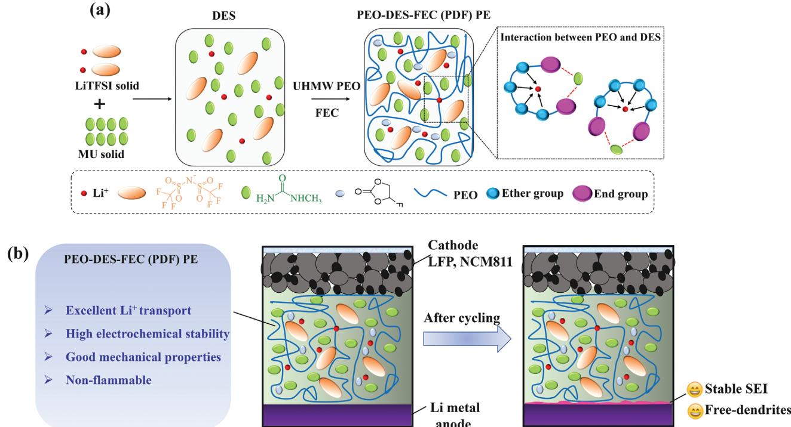
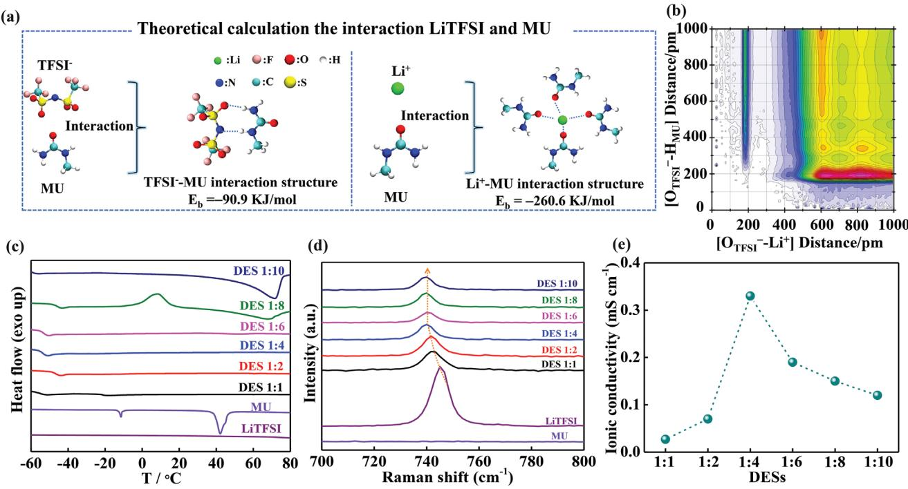
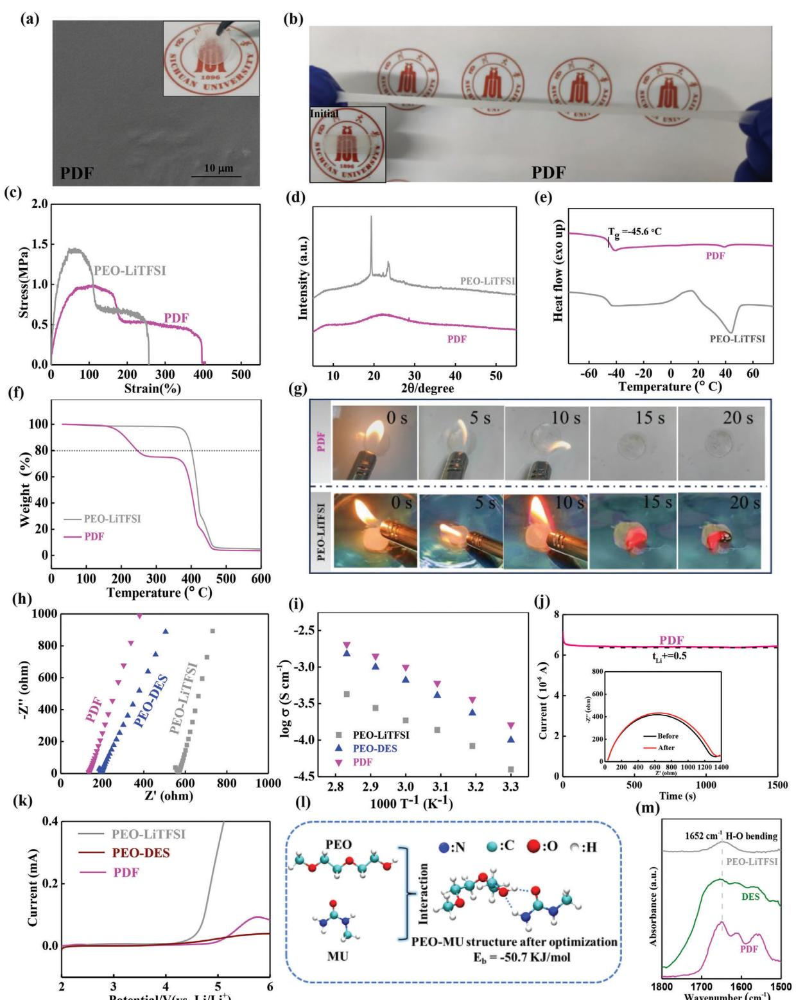
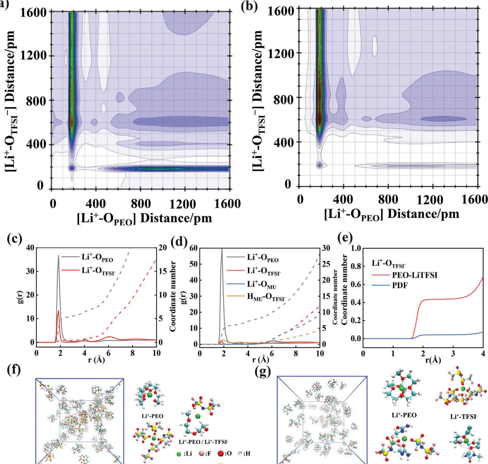
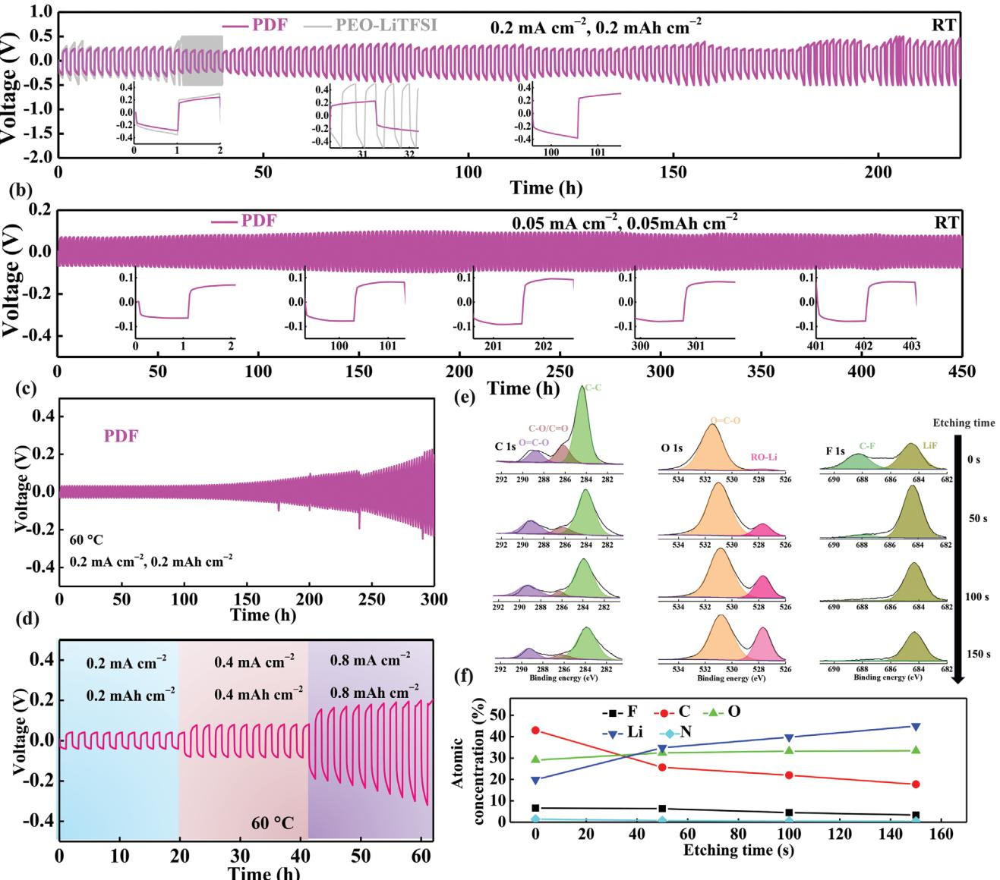
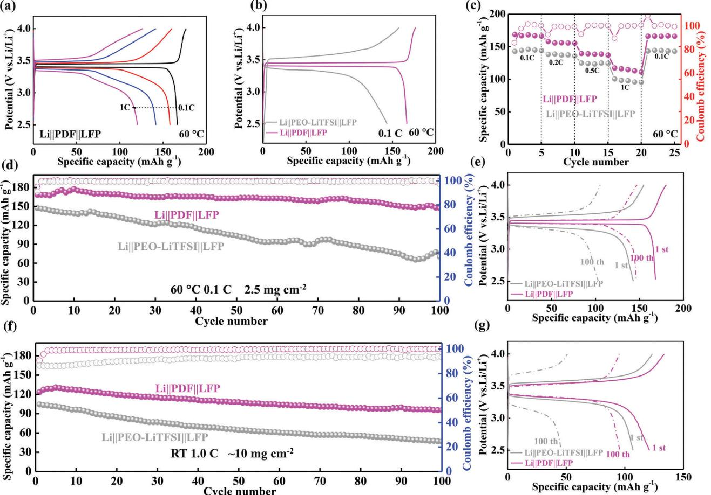
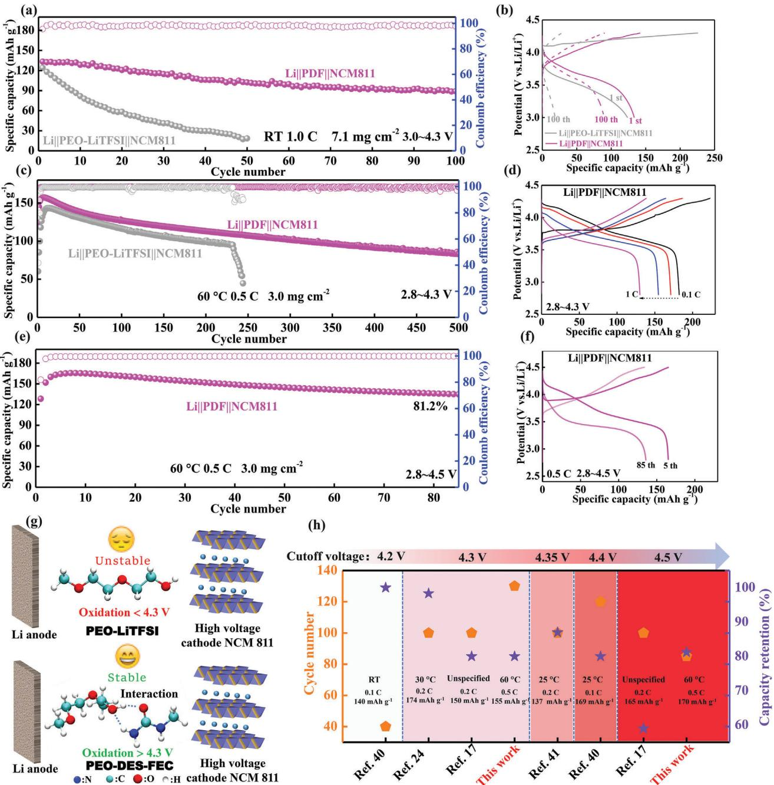
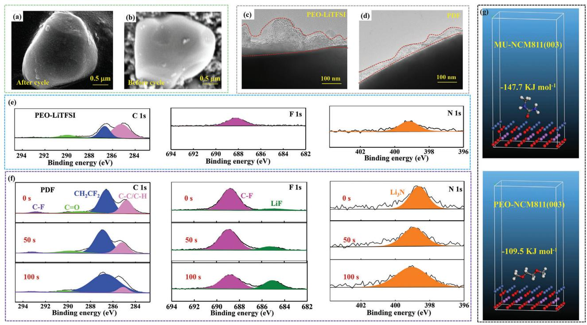

# **A Highly Compatible Deep Eutectic Solvent-Based Poly(ethylene) Oxide Polymer Electrolyte to Enable the Stable Operation of 4.5 V Lithium Metal Batteries**

*Qi Liu, Yongjie Dan, Yanhua Niu,\* Yadong Lv,\* and Guangxian Li*

**Insufficient ionic conductivity, limited Li+ transfer number (tLi+), and narrow electrochemical windows have heavily restricted the actual application of PEO (poly(ethylene) oxide)-based polymer electrolytes (PEs). Herein, a novel deep eutectic solvent (DES)-based PEO PE for stabilizing high voltage lithium metal battery (LMB) is designed. The DES reduces the crystallinity of PEO while promoting the dissociation of LiTFSI to release more free Li+, thus facilitating the transport of Li+ in the PEO matrix. In addition, the interaction between DES and the PEO, thereby improving the stability of the PEO-based PE under high voltage. Consequently, the PEO-DES-FEC (for short PDF) PE possesses satisfactory ionic conductivity, good mechanical properties, and high electrochemical stability. Meanwhile, PDF PE can build a robust/uniform LiF-rich solid electrolyte interface (SEI) to ensure electrode/electrolyte interface stability. As a concept proof, the Li symmetrical battery and Li||LiFePO4 LMBs of PDF PE exhibit good cycle stability. Applied to the high voltage Li||NCM811 LMBs, the PDF PE-based cell has excellent cycling performance at 4.3 and 4.5 V. This tactic is one of the successful demonstrations of PEO-based electrolytes under 4.5 V high voltage conditions, which breaks through the voltage constraint of conventional PEO-based PEs.**

#### **1. Introduction**

High energy density lithium metal batteries (LMBs) are recognized as competitive next-generation energy storage devices.[\[1–3\]](#page-11-0) However, the growth of lithium dendrites in current LMBs with liquid electrolytes (LEs) leads to unsatisfactory cycle life and safety issues, obstructing the actual application of LMBs.[\[4–6\]](#page-11-0) Many efforts have been made to address these challenges, such

Q. Liu, Y. Dan, Y. Niu, Y. Lv, G. Li College of Polymer Science and Engineering State Key Laboratory of Polymer Materials Engineering of China Sichuan University Chengdu 610065, China E-mail: [yhniu@scu.edu.cn;](mailto:yhniu@scu.edu.cn) [yadonglv@scu.edu.cn](mailto:yadonglv@scu.edu.cn) Q. Liu, G. Li School of Aeronautics and Astronautics Sichuan University Chengdu 610065, China

The ORCID identification number(s) for the author(s) of this article can be found under <https://doi.org/10.1002/smll.202408944>

**DOI: 10.1002/smll.202408944**

as designing or upgrading electrolyte formulations,[\[7,8\]](#page-11-0) designing functional lithium anodes,[\[9\]](#page-11-0) and developing solidstate electrolytes (SSEs).[\[10,11\]](#page-11-0) Among the SSEs, polymer electrolytes (PEs) have attracted much attention due to their advantages such as low cost, flexibility, and easy processing.[\[12,13\]](#page-11-0) Typical poly(ethylene oxide) (PEO)–based PEs have been extensively studied due to the high dielectric constant of PEO to readily form complexes with lithium salts.[\[14,15\]](#page-11-0) Nevertheless, this coordination ability of ether oxygen with Li+ is too strong and usually presents a low Li+ transfer number (tLi+), which leads to inhomogeneous lithium deposition, uneven growth of lithium dendrites, and even short-circuiting of the battery. In addition, PEO-based PEs generally have high crystallinity at RT and low solubility of lithium salts in the crystalline phase, leading to frustrating ionic conductivity. What's more, PEO-based PEs have a narrow electrochemical stabilization window (ESW *<* 4 V) and are extremely susceptible to oxidative decomposition when matched for high voltage cathode.[\[16–18\]](#page-11-0)

So far, the existing researches on PEO-based PEs mainly focus on improving ionic conductivity, enhancing mechanical strength, and inhibiting lithium dendrites generation.[\[19\]](#page-11-0) Most of the studies indicate that PEO-based PEs have good compatibility with LiFePO4 (LFP) cathode, but they are difficult to match with high nickel cathode materials (e. g., LiNi0.8Mn0.1Co0.1O2 (NCM811)), and are especially difficult to be operated at voltages greater than 4.3 V.[\[20,21\]](#page-11-0) In order to solve these dilemmas, researchers have made many attempts to improve the room temperature (RT) ionic conductivity and high voltage compatibility of PEO-based PEs by filler doping, molecular design, interfacial constructs, and other strategies.[\[22–24\]](#page-12-0) These strategies are informative for increasing the energy density of LMBs as well as improving the contact interface between the PEO-based PEs and high-voltage cathodes. Unfortunately, it is relatively troublesome to realize high energy density batteries due to their unsatisfactory cycling stability performance at voltages greater than 4.5 V. Hence, it is very valuable to develop a PEO-based PE with simultaneously satisfactory ionic conductivity, wide electrochemical window, and firstclass mechanical properties.

**Scheme 1.** a) Brief schematic of the preparation of PDF PE. b) Design rationale of PEO-based PEs for high voltage Li||NCM811 LMBs.

Deep eutectic solvent (DES) is a low transition temperature mixture consisting of two or more components that are capable of self-associating through intermolecular interactions to form eutectic mixtures with melting points much lower than those of the individual components.[\[25–27\]](#page-12-0) DESs can be prepared easily by mixing solid components to form a liquid at a certain temperature. This is attractive for large-scale battery applications due to its low cost, non-toxicity, and easily customizable composition. More importantly, DESs also exhibit some of the same advantages as ionic liquids (ILs), including non-flammability, a wide electrochemical stabilization window, and an ionic conductivity comparable to that of organic electrolytes.[\[28–30\]](#page-12-0) In particular, DESs typically display a relatively high tLi+ relative to ILs because only Li+ is present in the DES system. Therefore, various types of DESs have been designed for advanced electrochemical energy storage devices.[\[31,32\]](#page-12-0) Even so, DES electrolytes are usually poorly compatible with lithium metal anode, and transition metal ions of high voltage cathode materials are easily dissolved in DESs, resulting in low reversible capacity and poor cycle life of LMBs. Currently, there are few reports on recyclable DES electrolyte-based highvoltage LMBs.

In the present work, a novel DES-based PEO PE for stabilizing high-voltage LMB is proposed. The PEO-DES-FEC (for short PDF) PE is prepared by blending ultra-high molecular weight (UHMW) (Mw =5 × 106 g mol−1) PEO and LiTFSI: N-methylurea (MU) (eutectic molar ratio of 1:4), and fluoroethylene carbonate (FEC, 10 wt.%) as additives. The DES can reduce the crystallinity of PEO while promoting the dissociation of LiTFSI to release more free Li+, thus facilitating the transport of Li+ in the PEO matrix. In addition, the interaction between DES and the PEO, thereby improving the stability of the PEO-based PE under high voltage. The UHMW PEO polymer matrix allows the PDF PE to remain quasi-solid-state, without electrolyte leakage safety concerns and to maintain outstanding electrode/electrolyte interface contact during long cycles. As expected, the constructed PDF PE demonstrates non-flammability, relatively high ionic conductivity (0.18 mS cm−1 at RT) wide electrochemical stability (up to 4.8 V vs Li/Li+), and stable electrolyte/electrode interface properties. As a concept proof, the Li||PDF||Li symmetrical batteries can be stably cycled more than 200 and 300 h at RT and 60 °C, respectively. The Li||LiFePO4 LMBs of PDF PE exhibit a high capacity retention of 87.9% after 100 cycles at 0.1 C and at 60 °C. Under the challenging conditions of high-loading cathode LFP (≈10.0 mg cm−2) and RT, the Li||PDF||LFP realizes excellent capacity and good cycling performance. Applied to the high voltage Li||NCM811 LMBs, the PDF PE-based cell has excellent cycling performance at 4.3 V and at RT and 60 °C. More importantly, when the cutoff voltage is further increased to 4.5 V, the Li||PDF||NCM811 cell reveals a maximum discharge capacity of 165.1 mA h g−1 at 0.5 C. In addition, the NCM811 still has good cycling stability after 85 cycles with a capacity of 134.9 mA h g−1 and a retention rate of 81.2%. These findings of the present study are attractive for high-performance LMBs.

#### **2. Results and Discussion**

**Scheme 1**a demonstrates the optimization design rationale of the PEO-based PEs. PEO is a promising material for PEs. Yet, PEO is highly susceptible to catalytic decomposition by cathode materials in the delighted state when matched with high nickel cathode materials with high energy density.[\[21,33\]](#page-11-0) In addition, the ionic conductivity of PEO-LiTFSI PE is low at RT, and

**Figure 1.** Mechanism of DES formation by LiTFSI and MU. a) Molecular simulation of the intermolecular interaction of MU with TFSI− and Li+. b) The structural properties of DES 1:4. The OTFSI−−Li+ interaction center (x-axis) and OTFSI−−MU interaction center (y-axis). c) DSC curves of DESs at different LiTFSI:MU molar ratios d) Raman spectra of the DESs, MU, and LiTFSI. e) RT ionic conductivity of DESs with different LiTFSI:MU molar ratios.

due to the lower mobility of Li+ than anions, PEO-LiTFSI PE usually exhibits low tLi+, leading to inhomogeneous lithium deposition and the growth of lithium dendrites, and even leading to short-circuiting of the batteries (Figure S1, Supporting Information). More importantly, lithium metal anode with high reactivity reacts spontaneously with lithium salts in PEO-LiTFSI PE, resulting in the formation of a passive solid electrolyte interface (SEI) on the anode surface.[\[34\]](#page-12-0) Generally, the strength of the SEI cannot withstand the volume changes during repeated charging/discharging, thus creating defects in the SEI. Lithium ions tend to diffuse toward these defects, and during subsequent deposition, localized current densities are concentrated, leading to lithium dendrite growth. Herein, a novel DES-based PEO PE for stabilizing high-voltage LMB is designed (Scheme [1a\)](#page-1-0). Compared to PEO-LiTFSI PE, the PDF PE is proposed in this study, which exhibits excellent Li+ transport capacity, wide electrochemical window, outstanding toughness, good flame retardancy, superior Li metal compatibility, and rich/robust SEI (Scheme [1b\)](#page-1-0).

**Figures 1**a and S2 (Supporting Information) show the interaction between the nitrogen-containing compound MU and LiTFSI to form a DES system. Theoretical calculation suggests that MU has strong interactions with TFSI− and Li+ with binding energies (Eb) of −90.9 and −260.6 KJ mol−1, respectively, revealing that the DES has excellent lithium ion transport properties. In order to further analyze the interaction between MU and LiTFSI, we perform a theoretical simulation of the DES system (Figure 1b). From the combined radial distribution function (CRDF), it can be seen that the interaction of OTFSI−−MU is much larger than that of OTFSI−−Li+. The interaction between OTFSI−−MU further confirms the formation of deep eutectic and complete dissociation of lithium salt. As depicted in Figure S3 (Supporting Information), DESs were prepared by mixing LiTFSI and MU with different ratios and stirring at 55 °C for 2 h without further treatment (the mixture formed by LiTFSI:MU = 1:4 mol mol−1 is designated as DES 1:4). The formulations with 1:2 and 1:4 molar ratios are able to form a uniform and transparent liquids. The thermal properties of DESs were investigated by differential scanning calorimetry (DSC) with a heating rate of 10 °C min−1 from −70 to 90 °C, as shown in Figure 1c. With the increase of the molar fraction of LiTFSI, the Tm of DES 1:4 disappears, and only one glass transition temperature (Tg, −51 °C) could be detected, suggesting that DES 1:4 has a long liquid phase range.[\[27\]](#page-12-0) Afterward, the Tm of DES 1:6 reappears due to an excess of LiTFSI. Making use of the thermal properties reported in Figure 1c, a phase diagram as a function of LiTFSI molar fraction is given in Figure S4 (Supporting Information). The DES exhibits typical eutectic characteristics, with the eutectic point at ≈−55 °C, and a LiTFSI molar fraction of ≈0.2. The DSC results and the phase diagram demonstrate that a deep eutectic system can be formed between MU and LiTFSI.

To understand the formation mechanism of DESs, the Raman spectra were mainly used to study the coordinate relationship between MU and LiTFSI (Figure 1d). DES is formed based on the strong intermolecular interaction between the amino group of MU and TFSI−, which can be confirmed by the shift of the TFSI− peak from 745.3 to 740.0 cm−1. [\[35\]](#page-12-0) The strong complexation leads to a weak coordination of TFSI− with Li+ (Li−O), which promotes the dissociation of LiTFSI and releases free Li+. It was further found that LiTFSI:MU = 1:4 exhibits the highest Li+ coordination capacity, as shown by the TFSI− energy band shift, indicating a high degree of lithium salt dissociation, which is consistent with the theoretical calculation. With the increase of the LiTFSI ratio, the coordination ability remains basically unchanged, but some lithium salts are not fully dissociated due to the formation of Li+(TFSI−)n ion clusters.[\[36\]](#page-12-0) Therefore, the LiTFSI:MU ratio of DES is set to 1:4 in this study.

The ionic conductivities of the DESs are evaluated at RT by electrochemical impedance spectroscopy (EIS). The samples are sandwiched between the two stainless steel blocking electrodes, separated by a certain thick PTFE gasket (Figure S5, Supporting Information). Figure [1e](#page-2-0) shows the ionic conductivity of DESs at RT. Due to incomplete dissociation of the lithium salt, DES 1:1 and DES 1:2 exhibit lower ionic conductivity, which is verified by the TFSI− coordination state in the Raman results. The lower ionic conductivity of DES 1:6, DES 1:8, and DES 1:10 could be attributed to the presence of a large number of Li+(TFSI−)n ionic clusters in the system due to the excess of LiTFSI, which leads to the decrease in ionic conductivity. In sharp contrast, in DES 1:4, the lithium salt completely dissociates and forms a complex with MU, and the ionic conductivity reaches a maximum of 0.33 mS cm−1. Figure S6 (Supporting Information) shows that the ion conductivity of DES 1:4 increases with the increase in temperature.

The preparation process of PDF PE is shown schematically in Scheme [1a.](#page-1-0) In particular, it is noted that the combination of DES 1:4 with UHMW PEO to form a gel PE is not a simple mixing process, but an interaction of LiTFSI, MU, and PEO. First, the uniform and transparent DES 1:4 solution was obtained by heating LiTFSI and MU. Subsequently, the UHMW PEO polymer was introduced into DES 1:4 solution and added 10 wt.% FEC and an amount of acetonitrile, and heating as well as stirring to form a homogeneous mixture. The solvent acetonitrile was removed by evaporation. Finally, PDF PE membranes were prepared by a simple hot-pressing method. The evaporation of acetonitrile left some voids on the surface of the PDF PE membrane, which might affect its interfacial contact with the electrode. Therefore, hot-pressing was performed in this work to obtain a dense surface (**Figure 2**[a;](#page-4-0) Figure S7, Supporting Information). Good toughness and high mechanical strength ensure the reliability of the PE membrane in practical operation. As demonstrated in Figure [2b,](#page-4-0) the PDF PE can be stretched to ≈400% of its initial length, exhibiting satisfactory flexibility. The tensile test results (Figure [2c\)](#page-4-0) show that the tensile strength of PDF PE is lower than that of PEO-LiTFSI PE due to the plasticizer effect of DES and FEC. Fortunately, the PDF PE also exhibits relatively outstanding mechanical strength (≈1.0 MPa). The exciting mechanical properties are mainly attributed to the UHMW PEO polymer matrix.

PEO-based PEs generally have high crystallinity at RT, resulting in low ionic conductivity. In order to investigate the effect of DES on the crystallinity of the PEO matrix, XRD and DSC tests were performed, as shown in Figure [2d,e.](#page-4-0) The crystallinity of the PDF PE is significantly reduced compared to that of PEO-LiTFSI PE, which further promotes the movement of lithium ions along with the amorphous segments of PEO, thus improving the lithium-ion transport efficiency. At the same time, PDF PE displays a low glass transition temperature of −45.6 °C (Figure [2e\)](#page-4-0), which ensures the good mobility of PEO chain segments at RT and has a positive effect on lithium ion transport. Good thermal stability and flame retardancy are conducive to improving the safety of LMBs. Although the thermal stability temperature of PDF PE is significantly lower than that of PEO-LiTFSI PE (Figure [2f\)](#page-4-0), its negligible weight loss at temperatures as high as 100 °C indicates it possesses high thermal stability in practical applications. In addition, PDF PE shows excellent flame retardancy (Figure [2g\)](#page-4-0), and no flames within 20 s of the open flame. Compared with PEO-LiTFSI PE, which flames within 20 s. PDF PE's good thermal stability and flame retardancy are conducive to improving the safety of LMBs.

Insufficient ionic conductivity, limited tLi+, and narrow electrochemical windows have heavily restricted the actual application of PEO-based PE. Figure [2h](#page-4-0) demonstrates EIS curves of PEO-LiTFSI, PEO-DES, and PDF PE at RT. It can be seen that the introduction of DES and FEC results in the ionic conductivity of PDF PE reaching up to 0.18 mS cm−1 which is about four times that of PEO-LiTFSI PE (0.046 mS cm−1). Figure [2i](#page-4-0) and Figure S8 (Supporting Information) illustrates the temperature dependence of ionic conductivity for PEs. Meanwhile, the FEC additive has a positive effect on the ionic conductivity. The increase in ionic conductivity of PDF PE is partly attributed to the reduced crystallinity of PEO due to the introduction of DES, which facilitates the transport of lithium ions in the PEO matrix. On the other hand, the strong intermolecular interaction between the amino group of MU in DES and TFSI−, and this strong complexation leads to the weak coordination of TFSI with Li+ (Li−O), which promotes the dissociation of LiTFSI and releases more free Li+.

It is well known that in addition to ionic conductivity, tLi+ is also a key parameter for evaluating the Li+ mobility and rate capability of electrolyte.[\[37\]](#page-12-0) The tLi+ values of PDF and PEO-LiTFSI PE were measured and plotted in Figure [2j](#page-4-0) and Figure S9 (Supporting Information). The strong coordination ability of ether oxygen with lithium, LiTFSI partial dissociation, as well as the high PEO crystallinity, is the cause of the PEO-LiTFSI PE having a limited tLi+of 0.11 (Figure S9, Supporting Information). In contrast, PDF PE expresses a sufficient tLi+ of 0.5 which is ≈5 times higher than that of PEO-LiTFSI PE. Expanding the electrochemical window while ensuring excellent ionic conductivity and tLi+ is an important way to realize high-energy density lithium batteries. The electrochemical stability of PEO-LiTFSI, PEO-DES, and PDF PE at RT was evaluated by linear sweep voltammetry (LSV) (Figure [2k\)](#page-4-0) and electrochemical floating test in a Li||NCM811 cell (Figure S10, Supporting Information). The PDF PE (≈4.8 V, vs Li/Li+) exhibits wider electrochemical stability than PEO-LiTFSI PE (≈4.3 V) and PEO-DES PE (≈4.7 V). The electrochemical float test further confirms the electrochemical stabilization window of PDF up to ≈4.8 V. Table S1 (Supporting Information) compares the main physical/electrochemical properties for PEO-based PEs from recent literature. Compared to the same type of PEO-based PEs, the ionic conductivity and tLi+ of PDF are at an excellent level.

A large number of researchers have revealed that the main reason for the instability of PEO-LiTFSI PE is that the end group −OH of PEO polymer is easily oxidized and decomposed under high voltage.[\[17,21\]](#page-11-0) So, we have analyzed the interaction between MU in DES and PEO by theoretical calculations and FTIR spectrum (Figure [2l,m\)](#page-4-0). The theoretical calculation result shows that there is a strong interaction between MU and PEO molecular chain end group −OH, the binding energy of MU and PEO chain segment is −50.7 KJ mol−1. The interaction between MU

**Figure 2.** Performances of PDF PE. a) SEM image of PDF PE (Inset is an optical photograph). b) Optical photograph of PDF toughness display (The insert shows the initial state). c) Stress-strain curves, d) XRD patterns, e) DSC results with a heating rate of 10 °C min−1 from −80 to 80 °C and f) TGA thermograms of the PDF PE and PEO-LiTFSI PE. g) Flame resistance of PEO-LiTFSI PE and PDF PE. h) Nyquist plots of the PEO-LiTFSI, PEO-DES and PDF PE at RT. i) Ion conductivity of PEO-LiTFSI, PEO-DES, and PDF PE as a function of temperature (30–80 °C). j) The chronoamperometry profile of Li||PDF||Li cell (Inset: EIS curves) at indoor temperature. k) Linear sweep voltammetry of PEO-LiTFSI PE, PEO-DES, and PDF PE with a sweep rate of 1 mV s−1 at RT. l) Theoretical calculations to analyze the interaction between PEO and MU. m) FTIR spectra of DES, PEO-LiTFSI, and PDF.

**Figure 3.** Molecular dynamics simulations. CRDFs of a) PEO-LiTFSI PE and b) PDF PE systems. RDF and coordination numbers of Li+−OPEO and Li+−OTFSI− of c) PEO-LiTFSI PE and d) PDF PE. e) Zoomed-in plots of the coordination numbers of Li+−OTFSI−. Snapshot of coordination environments of Li+ from molecular dynamics simulations of f) PEO-LiTFSI PE system and g) PDF PE system.

and PEO may weaken the oxidation and degradation of PEO electrolyte under high voltage. At the same time, the FTIR spectrum provides more direct evidence, the bending vibration peak of H─O at 1652 cm−1 is significantly enhanced, which further confirms the strong interaction between PEO and MU. It is observed that when PEO is blended with DES, MU in DES forms a strong interaction with PEO, which improves the stability of PEObased PE under high voltage. It is further demonstrated that the combination of DES with PEO to form a PE is not a simple mixing process, but there are interactions between LiTFSI, MU, and PEO molecules. The LSV results indicate that the PDF PE can well meet the voltage requirements of LFP and most of the existing high-voltage cathode materials (e.g., NCM811), suggesting that it has some potential for high-voltage batteries.

To further reveal the effect of DES on the coordination environment of Li+, we performed molecular dynamics (MD) simulations of PEO-LiTFSI PE and PDF PE. The TRAVIS package was used to further characterize the structural properties of PEs using combined radial distribution functions (CRDFs). **Figure 3**a,b give the CRDFs of Li+−OPEO interaction centers (x-axis) and Li+−OTFSI− center interaction (y-axis) in the two electrolytes, with the main peaks of both interactions located at ≈200 pm and ≈200 pm, respectively. PEO-LiTFSI PE and PDF PE, Li+ is mainly coordinated by PEO. However, in PEO-LiTFSI PE, the Li+−OTFSI− peak intensity is much stronger in the PDF PE, which is due to the incomplete dissociation of the lithium salt in the PEO-LiTFSI system. The results of the radial distribution function (RDF) simulation are shown in Figure [3c–e.](#page-5-0) For the PEO-LiTFSI system, Li+ is mainly coordinated to the PEO chains, but Li+(TFSI−)n aggregates are still present in large quantities (Figure [3c,e,f\)](#page-5-0), suggesting that some undissociated lithium salts are still present in PEO-LiTFSI PE, which is consistent with CRDF result. As a comparison, the PDF system Li+ is still mainly coordinated with PEO, but only a small amount of Li+(TFSI−)n aggregates are observed (Figure [3d,e,g\)](#page-5-0). To better understand the transport mechanism of lithium ions in polymer electrolytes, the ion pair time correlation functions were calculated for the PEO-LiTFSI and PDF PE systems in Figure S11 (Supporting Information). Calculations show that Li+-TFSI− ion pairs relax their coordination structure faster in PDF than in PEO-LiTFSI, exhibiting faster kinetics of lithium ions in PDF. In addition, Li+-MU has the fastest coordination relaxation structure in the PDF system, which provides an efficient pathway for lithium ion transport. These results confirm that the lithium salt dissociation in the PDF system is more complete, leading to enhanced ionic conductivity and Li+ transport efficiency in PDF PE compared to PEO-LiTFSI PE.

PEO-LiTFSI PE and PDF PE are used to assemble Li||Li symmetric cells to investigate the compatibility of PEs with Li metal anode at RT and 60 °C. As reflected in **Figure 4**[a,](#page-7-0) at the beginning of cycling, the Li||PEO-LiTFSI||Li and Li||PDF||Li cells have approximately the same overpotential (≈220 mV) at 0.2 mA cm−2 and a capacity of 0.2 mAh cm−2. But with continuous Li plating/stripping, a significant short-circuit occurs in the Li||PEO-LiTFSI||Li cell after 30 h. It may be due to the limited tLi+ and insufficient ionic conductivity of PEO-LiTFSI PE at RT, which causes uneven Li deposition. Concurrently, the SEI film of the Li||PEO-LiTFSI||Li cell may be gradually thickened or destabilized, and the deterioration of the electrode/electrolyte interface leads to uneven lithium deposition and dendrite growth. As a comparison, since PDF PE has relatively sufficient ionic conductivity and tLi+, the voltage fluctuation of Li||PDF||Li symmetric cells is almost stable during cycling, indicating the existence of stable interfacial reaction and uniform lithium deposition. In addition, the Li||PDF||Li cell can cycle smoothly for 450 h with a low overpotential of ≈83 mV at a relatively small current density and capacity (Figure [4b\)](#page-7-0), demonstrating that Li||PDF||Li cell possess excellent Li plating/stripping reversibility at RT. More importantly, the plating/stripping behavior of Li||PDF||Li cell is investigated at 60 °C (Figure [4c\)](#page-7-0). Within 150 h, the Li||PDF||Li symmetric cell has a relatively small overpotential (≈31 mV) at 0.2 mA cm−2 and a capacity of 0.2 mAh cm−2, which is 7.1 times smaller than that at RT, verifying that high temperature is favorable for Li plating/stripping behaviors. Although the overpotential of the Li|| PDF||Li cell gradually increases with cycling, it can still be stably cycled for 300 h, signifying stable interfacial reaction and uniform lithium deposition at 60 °C. In addition, the critical current density (CCD) test result is depicted in Figure [4d](#page-7-0) and Figure S12 (Supporting Information). At a relatively high current density of 0.8 mA cm−2 and a capacity of 0.8 mAh cm−2, the Li||PDF||Li symmetric cell can still operate stably, which indicates that the PDF PE is able to withstand higher current density, as well as inhibit Li dendrite growth effectively. The long stripping/plating cycle life and small voltage polarization confirm that PDF PE can conduct lithium ions efficiently and uniformly at 60 °C. In addition, the assembled Li||Cu asymmetric lithium batteries were applied to further evaluate the real utilization of lithium metal and the stability of the SEI formed at the interface. As illustrated in Figure S13 (Supporting Information), the average Coulombic efficiency (CE) of PDF electrolyte is 93.79%, much higher than that of PEO-LiTFSI (76.13%) electrolyte. Table S2 (Supporting Information) summarizes the typical performances and stable time of Li symmetric cells with PEO-based PEs in recent years.

The changes in the surface morphology after 30 h of the stripping/plating cycle of the lithium metal anode of Li||Li symmetric battery are further analyzed by SEM (Figure S14, Supporting Information). The lithium metal anode surface of Li||PEO-LiTFSI||Li battery lost its metallic luster and is porous and loose (Figure S14a, Supporting Information), pointing to inhomogeneous lithium deposition and dendrite growth. On the contrary, the Li metal surface of Li||PDF PE||Li cell has a smooth surface and metallic luster (Figure S14b, Supporting Information), demonstrating uniform and stable lithium deposition. These results imply that PDF PE is highly compatible with lithium metal. In order to understand the stability mechanism of the Li||Li symmetric battery, the depth information of the SEI layer is obtained by in-depth X-ray photoelectron spectroscopy (XPS) with the Ar sputter etching method (Figure [4e\)](#page-7-0). The results show that the Li||PDF||Li batteries form a gradient structure of the SEI layer on the lithium anode surface. On the unetched lithium metal surface (C 1s), the high content of C─C, C═O/C─O and O═C─O indicates that the outer SEI layer is dominated by organic compounds. This soft layer helps to keep the lithium metal/electrolyte interface in close contact during the dynamic lithium plating/stripping process. The relative content of these organic components gradually decreases with deeper etching depth. The main peaks of LiF at 684.4 eV can be found in the F 1s spectra. The LiF-rich SEI (compared to PEO-LiTFS, Figure S15, Supporting Information) facilitates charge transfer for uniform lithium deposition and the formation of a stable protective layer, which effectively inhibits side reactions.[\[38\]](#page-12-0) The composition of the inorganic–organic hybridized SEI layer gradually changed with the increase in etching time (Figure [4f\)](#page-7-0). The results show that the SEI layer formed between PDF PE and Li metal has a gradient structure, and this effect contributes to the highly reversible lithium plating/stripping.

In order to investigate the electrochemical performance of the as-prepared PDF and PEO-LiTFSI electrolytes, the Li||PEs||LFP cells with Li metal as the anode and LFP (loading 2.5 mg cm−2 and ≈10 mg cm−2) as the cathode are assembled and are evaluated of 2.5−4.0 V at 60 °C and RT. The charge/discharge profiles of Li||PDF||LFP cells from 0.1 to 1 C at 60 °C is shown in **Figure 5**[a,](#page-8-0) and Li||PDF||LFP cells have high specific capacities of 166.8, 156, 138.6, and 114.8 mAh g−1 at 0.1, 0.2, 0.5, and 1 C, respectively. Figure [5b](#page-8-0) demonstrates the charge/discharge curves of Li||PDF||LFP and Li||PEO-LiTFSI||LFP cells at 0.1 C and 60 °C. It can be observed that the discharge capacity of Li||PDF||LFP cell with 166.8 mAh g−1 is significantly higher than that of Li||PEO-LiTFSI||LFP cell (144.9 mAh g−1) discharge capacity. In addition, Li||PDF||LFP and Li||PEO-LiTFSI||LFP cells

**Figure 4.** Electrochemical performance of Li||Li symmetric cells. Voltage profiles of the continued Li striping/plating cycling of Li||Li symmetric cells with a) current density of 0.2 mA cm−2 and capacity 0.2 mAh cm−2 and b) 0.05 mA cm−2 and capacity 0.05 mAh cm−2 at RT (The inset shows the corresponding potential profile of the Li||Li symmetric cell during cycling). c) Li plating/stripping voltage curves of PDF PE c) with current density of 0.2 mA cm−2 and capacity 0.2 mAh cm−2 and d) with different current densities and capacities at 60 °C. e) In-depth XPS spectra of C 1s, O 1s and F 1s of Li metal in PDE PE after cycling 30 h. d) Li, C, N, F, and O atomic percentage along the etching depth.

exhibit two well-defined potential plateaus corresponding to stable delithiation and lithiation processes. The overpotential of Li||PDF||LFP cells is 67 mV lower than that of Li||PEO-LiTFSI||LFP cells (261 mV), which suggests that PDF PE has a distinguished interfacial stabilization for LFP and Li anode. The Li||PDF||LFP and Li||PEO-LiTFSI||LFP cell rate performance is graphically shown in Figure [5c.](#page-8-0) Li||PDF||LFP cell has highly reversible specific capacity at 0.1, 0.2, 0.5, and 1 C, and the capacity can be recovered to 166.2 mAh g−1 when the current density returns to 0.1 C with almost no capacity loss. The cycling stability of Li||PDF||LFP and Li||PEO-LiTFSI||LFP cells are evaluated at 0.1 C and 60 °C (Figure [5d,e\)](#page-8-0). The Li||PDF||LFP cell has an initial capacity of 166 mAh g−1 and maintains a discharge capacity of 146.9 mAh g−1 after 100 cycles with a capacity retention of 87.9%, indicating outstanding cycling stability. But, the Li||PAN||LFP cell delivers a comparatively lower discharge capacity of 146.3 mAh g−1 at the initial cycle, and the capacity retention rapidly decreased to 66.4% after 100 cycles. High cathode loading, limited source of Li metal anode, and thin polymer electrolytes are essential for high energy density LMBs. Therefore, to further demonstrate the practical applicability of the asprepared PDF and PEO-LiTFSI electrolytes, the LMBs with high

**Figure 5.** Electrochemical performance of Li||LFP cells. a) Typical charge/discharge profiles of the Li||PDF||LFP cells at 0.1-1.0 C. b) Charge/discharge curves of Li||PDF||LFP and Li||PEO-LiTFSI||LFP cells at 0.1 C. c) Rate performance and d) cycling performance of Li||PDF||LFP and Li||PEO-LiTFSI||LFP cells at 0.1 C. e) Selected charging/discharging curves of Li||PDF||LFP and Li||PEO-LiTFSI||LFP cells. f) Cycling performance of Li||PDF||LFP and Li||PEO-LiTFSI||LFP cells with high loading (≈10 mg cm−2) and at RT and 1.0 C. g) Selected charging/discharging curves.

cathode loading of LFP (≈10.0 mg cm−2) was assembled and evaluated at RT. As depicted in Figure 5f,g, the Li||PDF||LFP and Li||PEO-LiTFSI||LFP cell cycling tests were performed at 1 C to assess the long-term stability. The Li||PDF||LFP cell has a high initial discharge capacity of 123.7 mAh g−1 and a Coulombic efficiency (CE) of 90.6%, which is related to the formation of SEI. The Li||PDF||LFP battery still possesses a discharge capacity of 95.7 mAh g−1 after 100 cycles, with a capacity retention rate of 77.4%. Nevertheless, the Li||PEO-LiTFSI||LFP cell exhibits a low discharge capacity of 104.4 mAh g−1 at the initial cycle, and the capacity retention rate rapidly decreases to 44.7% after 100 cycles. Under the challenging conditions of high-loading cathode LFP (≈10.0 mg cm−2) and RT, the Li||PDF||LFP realizes excellent capacity and good cycling performance, representing a significant step toward practical applications.

As mentioned previously, the as-prepared PDF electrolyte expresses a wide electrochemical window up to 4.8 V and good lithium compatibility. So, the high voltage lithium metal batteries with single crystal NCM811 (loading 7.1 and 3.0 mg cm−2) as the cathode are assembled and evaluated at RT and 60 °C. As depicted in **Figure 6**[a,b,](#page-9-0) the Li||PDF||NCM811 and Li||PEO-LiTFSI||NCM811 high voltage cells with cathode loading 7.1 mg cm−2 cycling tests were performed at 1C and RT. The Li||PDF||NCM811 high voltage cell shows a high initial discharge capacity of 133.3 mAh g−1, and still possesses a discharge capacity of 89.0 mAh g−1 after 100 cycles, with a capacity retention rate of 66.9%. In contrast, the Li||PEO-LiTFSI||NCM811 high voltage cell has a poor initial discharge capacity of 124.1 mAh g−1 with a low capacity retention rate of 14.1% only after 50 cycles. So, the high voltage Li||PDF||NCM811 (loading 7.1 mg cm−2) LMBs proves potential applications in high-energy fields. Besides, the cycling stability of Li||PDF||NCM811 and Li||PEO-LiTFSI||NCM811 cells at 0.5 C and 60 °C is shown in Figure [6c](#page-9-0) and Figure S16 (Supporting Information). The Li||PEO-LiTFSI||NCM811 high voltage cell reduces the discharge capacity to the initial 69.2% after 200 cycles. It is worth noting that when the Li||PEO-LiTFSI||NCM811 battery is cycled ≈230 cycles, it may be due to the fact that the PEO-LiTFSI electrolyte tends to oxidize and decompose under high voltage, which may lead to the gradual failure of the battery. In sharp contrast, after mixing PEO with DES, MU in DES will form a strong interaction with the PEO, which improves the stability of PEO-based PE under high

**Figure 6.** Electrochemical performance of high voltage Li||NCM811 LMBs. a) Cycling performance of the Li||PDF||NCM811 and Li||PEO-LiTFSI||NCM811 cells with high loading (7.1 mg cm−2) and at RT and 1.0 C with a cutoff voltage of 3.0–4.3 V and b) selected charging/discharging curves. c) Cycling performance of the Li||PDF||NCM811 and Li||PEO-LiTFSI||NCM811 cells at 60 °C and 0.5 C with a cutoff voltage of 2.8–4.3 V. d) Charge/discharge profiles of the Li||PDF||NCM811 cell with a cutoff voltage of 2.8–4.3 V at a different rate. e) Cycling performance and f) selected charge/discharge profiles of the Li||PDF||NCM 811 cell at 0.5 C with a cutoff voltage of 2.8–4.5 V. g) Schematic representation of the response of PDF and PEO-LiTFSI PEs to high voltage LMBs. h) Comparison of this study with representative literature on the key performance of PEO-based PEs in high voltage LMBs.

voltage. As a result, Li||PDF||NCM811 cell can be cycled at a high voltage of 4.3 V for 200 cycles with 72.3% capacity retention and 500 cycles with 52.5% capacity retention, separately. Figure 6d investigates the charge/discharge curves of Li||PDF||NCM811 battery from 0.1 to 1 C with a cutoff voltage of 2.8−4.3 V. The high voltage Li||PDF||NCM811 battery presents high specific capacities of 182.4, 171.4, 154.6, and 130.3 mAh g−1 at 0.1, 0.2, 0.5 and 1 C, respectively.

Since the energy density is proportional to the capacity and discharge voltage of the battery, increasing the cutoff voltage will greatly increase the energy density of the battery.[\[39\]](#page-12-0) Therefore, the superiority of this PDF PE is further investigated at a higher

**Figure 7.** Mechanism analysis of high voltage Li||NCM811 LMBs. SEM images of the NCM811 cathodes a) before cycling and b) after 100 cycles in Li||PDF||NCM811 cells with a cutoff voltage of 2.8–4.3 V. TEM images of NCM811 cathodes retrieved from c) Li||PEO-LiTFSI||NCM811 and d) Li||PDF||NCM811 cells after cycling. In-depth XPS analysis of C 1 s, F 1s, and N 1s of the NCM811 cathode surface retrieved from the e) Li||PEO-LiTFSI||NCM811 f) Li||PDF||NCM811 cells after cycling. g) Adsorption energies of MU and PEO with NCM811 (003) crystal face.

cutoff voltage (4.5 V). As shown in Figure [6e,](#page-9-0) when the cutoff voltage is further increased to 4.5 V, the Li||PDF||NCM811 reaches a maximum discharge capacity of 165.1 mAh g−1 after 5 cycles at 0.5 C. In addition, it still has good cycling stability with a retention as high as 81.2% after 85 cycles, which indicates that the PDF PE exhibits good oxidative stability under a high voltage of 4.5 V. However, after 85 cycles, the charge/discharge curve of Li||PDF||NCM811 battery shows evident voltage polarization (Figure [6f\)](#page-9-0), which may be due to the irreversible secondary reaction between PDF and NCM811 during cycling, resulting in the capacity reduction of the cell. Figure [6g](#page-9-0) generalizes the schematic of the response of PDF and PEO-LiTFSI PEs to Li||NCM811 highvoltage LMBs. The PDF electrolyte can be stabilized at voltages greater than 4.3 V due to the interaction of DES with the end groups of the PEO polymer chain segments. While PEO-LiTFSI is difficult to work stably at a voltage greater than 4.3 V. It proves that PDF PE has certain superiority in matching the high voltage NCM811 cathode. Figure [6h](#page-9-0) and Table S1 (Supporting Information) summarizes and compares the high voltage LMBs performance of this study with that of representative PEO-based PEs that have been reported.[\[17,24,40,41\]](#page-11-0) This tactic is one of the resultful demonstrations of PEO-based PEs under 4.5 V high voltage at 60 °C, which breaks through the voltage limitation of conventional PEO-based electrolytes.

The morphology of NCM811 cathodes was characterized by SEM. The NCM811 cathode retrieved from the Li||PDF||NCM811 cells maintains a complete microscopic morphology after cycling (**Figure 7**a), and the changes can be negligible compared with the NCM811 cathode before cycling (Figure 7b). It is well-established that the passivation of the cathode by the cathode electrolyte interface (CEI) layer is closely correlated with cathode stability. A thin, homogeneous, robust, and inorganic-rich CEI layer can effectively minimize side reactions at the cathode/electrolyte interface. The formation of CEI on the cathodes was first studied by transmission electron microscopy (TEM). The TEM image demonstrates the formation of a thick and inhomogeneous CEI layer on the cathode of PEO-LiTFSI PE (Figure 7c). It illustrates that the electrolyte cannot successfully passivate the NCM811 cathode under high voltage. In comparison, Li||PDF||NCM811 cells present a thin and homogeneous CEI layer with an average thickness of 30−40 nm (Figure 7d), which prevents electrolyte decomposition and permits it to operate under high voltage.

In order to further understand the stability mechanism of Li||NCM811 LMBs, the information on the CEI layer was obtained by XPS (Figure 7e,f). In the C 1s spectra, C─C/C─H (284.7 eV) and CF2CH2 (286.6 eV) peaks are detected in all the NCM811 cathodes, which could be generated by polymer decomposition or residual electrolytes. The F 1s and N 1s spectra show that the contents of LiF and Li3N in Li||PDF||NCM811 cell are significantly higher than those in Li||PEO-LiTFSI||NCM811 cell, suggesting that more TFSI− anions and MU are involved in the formation of CEI. LiF can effectively inhibit the continuous decomposition of electrolyte, due to its high physical/chemical stability and low electronic conductivity. Meanwhile, Li3N constitutes an interface with high mechanical strength and a low Li+ diffusion barrier. The in-depth information of the CEI layer of

Li||PDF||NCM811 cell is obtained further by in-depth XPS with the Ar sputter etching method (Figure [7f\)](#page-10-0). With the increase of etching depth, the content of LiF in PDF PE gradually increases, while Li3N is almost unchanged, and the LiF/Li3N-rich CEI layer contributes to the stability of the cathode interface. In-depth XPS results show the formation of an inorganic-organic hybridized LiF/Li3N-rich gradient structure of the CEI layer between PDF PE and NCM811 cathode. In addition, the adsorption energy of the electrolyte components with respect to the NCM811 (003) crystal surface was calculated by further density functional theory (DFT) (Figure [7g\)](#page-10-0). From the results, it can be seen that the adsorption energy of MU on the surface of NCM811 (003) crystals is the largest. Therefore, during the cycling process, MU adsorbs NCM811 more easily and reacts to generate N- and O-rich components of CEI, which contributes to the formation of sustainable/robust CEI and improves the electrochemical performance of high-voltage batteries.

### **3. Conclusion**

In summary, a novel DES-based PEO PE for stabilizing high voltage LMB is designed. The DES reduces the crystallinity of PEO while promoting the dissociation of LiTFSI to release more free Li+, thus facilitating the transport of Li+ in the PEO matrix. In addition, the interaction between DES and the PEO, thereby promoting the stability of the PEO-based PE under high voltage. The developed PDF PE demonstrates non-flammability, relatively high ionic conductivity wide electrochemical window (up to 4.8 V vs Li/Li+), and stable electrolyte/electrode interface properties. As a concept proof, Li|| PDF PE ||Li symmetrical battery can be stably cycled more than 200 and 300 h at RT and 60 °C at 0.2 mA cm−2 and a capacity of 0.2 mAh cm−2, respectively. The Li||LiFePO4 LMBs of PDF PE demonstrate good capacity retention of 87.9% after 100 cycles at 0.1 C and at 60 °C. Under the challenging conditions of high-loading cathode LFP (≈10.0 mg cm−2) and RT, the Li||PDF||LFP realizes excellent capacity (123.7 mAh g−1) and good cycling performance. Li||PDF||NCM811 cells present a thin and homogeneous CEI layer, which prevents electrolyte decomposition and permits it to operate under high voltage. Applied to the high voltage Li||NCM811 LMBs, the PDF PEbased cell has excellent cycling performance at 4.3 V and at RT and 60 °C. More importantly, when the cutoff voltage is further increased to 4.5 V, the Li||PDF||NCM811 cell has a maximum discharge capacity of 165.1 mA h g−1 at 0.5 C. In addition, the NCM811 still has good cycling stability after 85 cycles with a capacity of 134.9 mA h g−1 and a retention rate of 81.2%. The results of this work demonstrate the effectiveness of novel DES-based PEO PE for high-performance LMBs.

### **Supporting Information**

Supporting Information is available from the Wiley Online Library or from the author.

#### **Acknowledgements**

Y.H. Niu acknowledges the financial support from the National Natural Science Foundation of China with grant numbers 52073184 and 51873125, and the Scientific Research Foundation of International Cooperation and Exchanges of Sichuan Province with grant number 2019YFH0027. Supported by "the Fundamental Research Funds for the Central Universities".

# **Conflict of Interest**

The authors declare no conflict of interest.

# **Data Availability Statement**

The data that support the findings of this study are available from the corresponding author upon reasonable request.

#### **Keywords**

deep eutectic solvent, high voltage, lithium metal batteries, poly(ethylene) oxide polymer electrolyte

> Received: September 30, 2024 Revised: November 5, 2024 Published online: November 21, 2024

- [1] Q. Liu, L. Wang, X. He, *Adv. Energy Mater.* **2023**, *13*, 2300798.
- [2] S. Kim, G. Park, S. J. Lee, S. Seo, K. Ryu, C. H. Kim, J. W. Choi, *Adv. Mater.* **2023**, *35*, 2206625.
- [3] P. Lennartz, B. A. Paren, A. Herzog-Arbeitman, X. C. Chen, J. A. Johnson, M. Winter, Y. Shao-Horn, G. Brunklaus, *Joule* **2023**, *7*, 1471.
- [4] J. Xiao, *Science* **2019**, *366*, 426.
- [5] P. Zhai, L. Liu, X. Gu, T. Wang, Y. Gong, *Adv. Energy Mater.* **2020**, *10*, 2001257.
- [6] M. Liu, Z. Zeng, Y. Wu, W. Zhong, S. Lei, S. Cheng, J. Wen, J. Xie, *Energy Storage Mater.* **2024**, *65*, 103133.
- [7] H. Wang, Z. Yu, X. Kong, S. C. Kim, D. T. Boyle, J. Qin, Z. Bao, Y. Cui, *Joule* **2022**, *6*, 588.
- [8] N. Yao, X. Chen, Z.-H. Fu, Q. Zhang, *Chem. Rev.* **2022**, *122*, 10970.
- [9] J. Wang, L. Li, H. Hu, H. Hu, Q. Guan, M. Huang, L. Jia, H. Adenusi, K. V. Tian, J. Zhang, S. Passerini, H. Lin, *ACS Nano* **2022**, *16*, 17729.
- [10] L.-Z. Fan, H. He, C.-W. Nan, *Nat. Rev. Mater.* **2021**, *6*, 1003.
- [11] V. Vijayakumar, B. Anothumakkool, S. Kurungot, M. Winter, J. R. Nair, *Energy Environ. Sci.* **2021**, *14*, 2708.
- [12] X. Lu, Y. Wang, X. Xu, B. Yan, T. Wu, L. Lu, *Adv. Energy Mater.* **2023**, *13*, 2301746.
- [13] Q. Liu, Y. Dan, M. Kong, Y. Niu, G. Li, *Small* **2023**, *19*, 2300118.
- [14] Z. Jia, Y. Liu, H. Li, Y. Xiong, Y. Miao, Z. Liu, F. Ren, *J. Energy Chem.* **2024**, *92*, 548.
- [15] D. M. Reinoso, M. A. Frechero, *Energy Storage Mater.* **2022**, *52*, 430.
- [16] S. Huo, L. Sheng, W. Xue, L. Wang, H. Xu, H. Zhang, X. He, *InfoMat* **2023**, *5*, e12394.
- [17] X. Yang, M. Jiang, X. Gao, D. Bao, Q. Sun, N. Holmes, H. Duan, S. Mukherjee, K. Adair, C. Zhao, J. Liang, W. Li, J. Li, Y. Liu, H. Huang, L. Zhang, S. Lu, Q. Lu, R. Li, C. V. Singh, X. Sun, *Energy Environ. Sci.* **2020**, *13*, 1318.
- [18] M. A. Cabañero Martínez, N. Boaretto, A. J. Naylor, F. Alcaie, G. D. Salian, F. Palombarini, E. Ayerbe, M. Borras, M. Casas-Cabanas, *Adv. Energy Mater.* **2022**, *12*, 2201264.
- [19] B. Guo, Y. Fu, J. Wang, Y. Gong, Y. Zhao, K. Yang, S. Zhou, L. Liu, S. Yang, X. Liu, F. Pan, *Chem. Commun.* **2022**, *58*, 8182.
- [20] Z. Xiong, Z. Wang, W. Zhou, Q. Liu, J.-F. Wu, T.-H. Liu, C. Xu, J. Liu, *Energy Storage Mater.* **2023**, *57*, 171.

- [21] Y. Yusim, E. Trevisanello, R. Ruess, F. H. Richter, A. Mayer, D. Bresser, S. Passerini, J. Janek, A. Henss, *Angew. Chem., Int. Ed.* **2023**, *62*, 202218316.
- [22] Z. Rong, Y. Sun, M. Yang, F. Cheng, W. Zhang, J. Chen, *Energy Storage Mater.* **2023**, *63*, 103066.
- [23] X. Wang, Y. Song, X. Jiang, Q. Liu, J. Dong, J. Wang, X. Zhou, B. Li, G. Yin, Z. Jiang, J. Wang, *Adv. Funct. Mater.* **2022**, *32*, 2113068.
- [24] W. Bao, Y. Zhang, L. Cao, Y. Jiang, H. Zhang, N. Zhang, Y. Liu, P. Yan, X. Wang, Y. Liu, H. Li, Y. Zhao, J. Xie, *Adv. Mater.* **2023**, *35*, 2304712.
- [25] R. Deng, M. Gao, B. Zhang, Q. Zhang, *Adv. Energy Mater.* **2024**, *14*, 2303707.
- [26] X. Pei, Y. Li, T. Ou, X. Liang, Y. Yang, E. Jia, Y. Tan, S. Guo, *Angew. Chem., Int. Ed.* **2022**, *61*, 202205075.
- [27] J. Song, Y. Si, W. Guo, D. Wang, Y. Fu, *Angew. Chem., Int. Ed.* **2021**, *60*, 9881.
- [28] J. Hwang, K. Matsumoto, C.-Y. Chen, R. Hagiwara, *Energy Environ. Sci.* **2021**, *14*, 5834.
- [29] L. Geng, X. Wang, K. Han, P. Hu, L. Zhou, Y. Zhao, W. Luo, L. Mai, *ACS Energy Lett.* **2022**, *7*, 247.
- [30] Q. Liu, L. Li, G. Liu, X. He, Y. Niu, G. Li, *J. Power Sources* **2024**, *592*, 233897.
- [31] C. Zhang, L. Zhang, G. Yu, *Acc. Chem. Res.* **2020**, *53*, 1648.
- [32] J. Chen, Z. Yang, X. Xu, Y. Qiao, Z. Zhou, Z. Hao, X. Chen, Y. Liu, X. Wu, X. Zhou, L. Li, S.-L. Chou, *Adv. Mater.* **2024**, *36*, 2400169.
- [33] M. Yi, J. Li, M. Wang, X. Fan, B. Hong, Z. Zhang, Z. Zhang, H. Jiang, A. Wang, Y. Lai, *Energy Storage Mater.* **2023**, *54*, 579.
- [34] J. Li, H. Hu, W. Fang, J. Ding, D. Yuan, S. Luo, H. Zhang, X. Ji, *Adv. Funct. Mater.* **2023**, *33*, 2303718.
- [35] H. Wang, J. Song, K. Zhang, Q. Fang, Y. Zuo, T. Yang, Y. Yang, C. Gao, X. Wang, Q. Pang, D. Xia, *Energy Environ. Sci.* **2022**, *15*, 5149.
- [36] P. Dong, X. Zhang, K. S. Han, Y. Cha, M.-K. Song, *J. Energy Chem.* **2022**, *70*, 363.
- [37] K. M. Diederichsen, E. J. McShane, B. D. McCloskey, *ACS Energy Lett.* **2017**, *2*, 2563.
- [38] J. Tan, J. Matz, P. Dong, J. Shen, M. Ye, *Adv. Energy Mater.* **2021**, *11*, 2100046.
- [39] A. Yamada, *Adv. Sci.* **2024**, *11*, 2401739.
- [40] Y. Liu, Y. Zhao, W. Lu, L. Sun, L. Lin, M. Zheng, X. Sun, H. Xie, *Nano Energy* **2021**, *88*, 106205.
- [41] X. Huang, S. Huang, T. Wang, L. Zhong, D. Han, M. Xiao, S. Wang, Y. Meng, *Adv. Funct. Mater.* **2023**, *33*, 2300683.