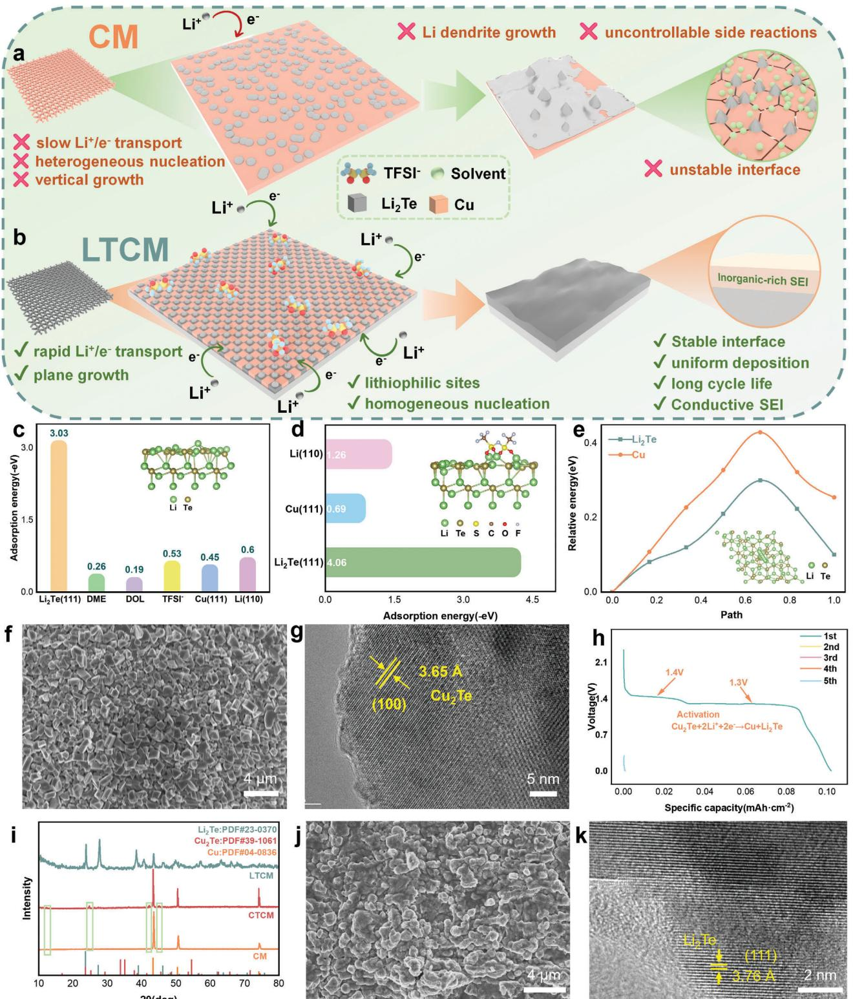
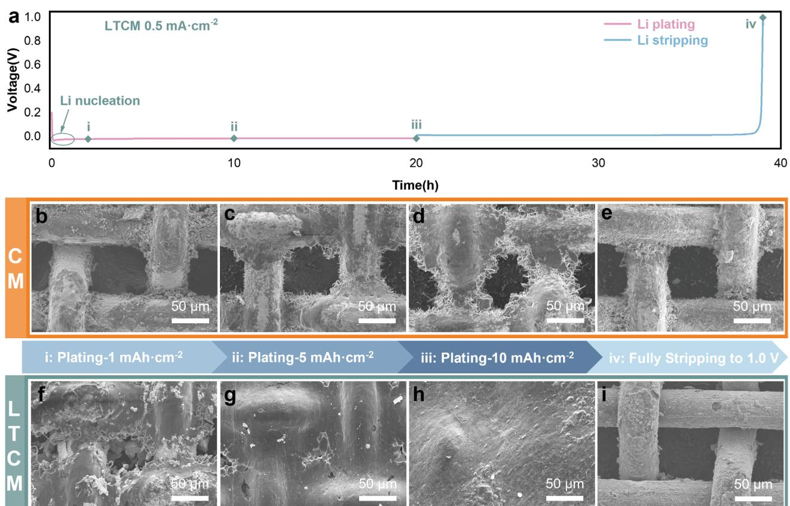
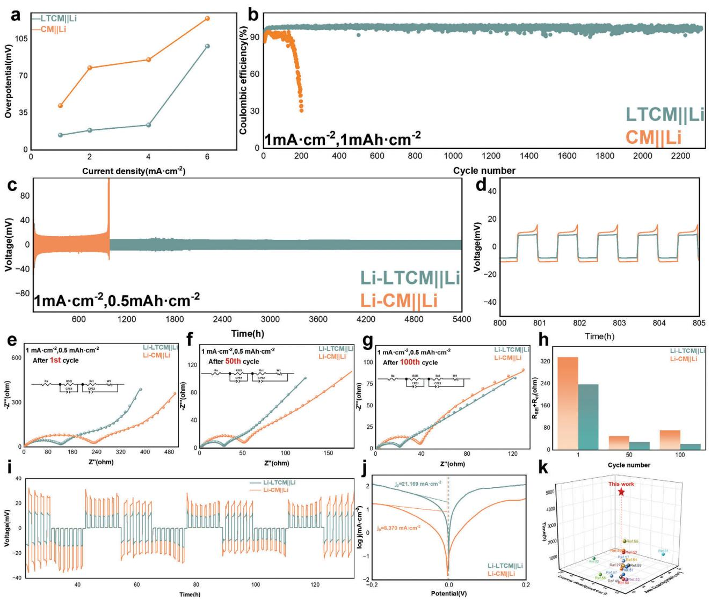
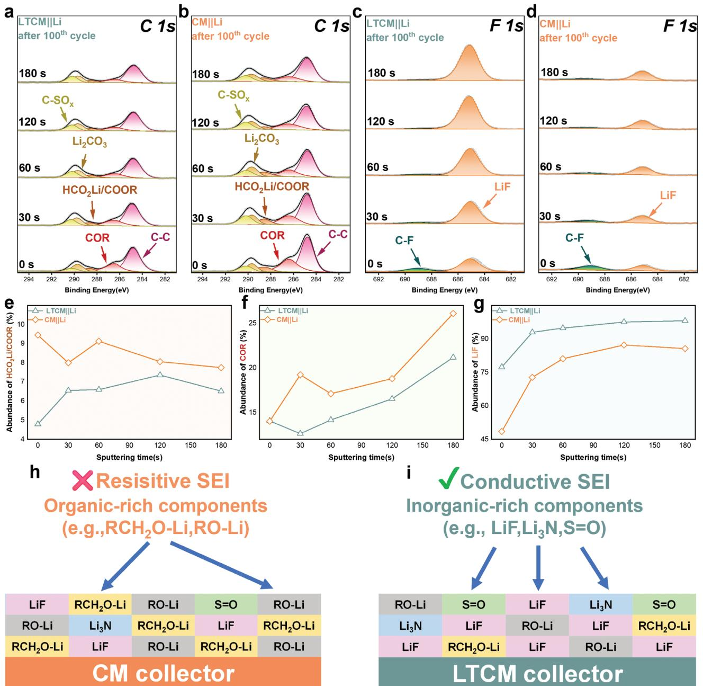
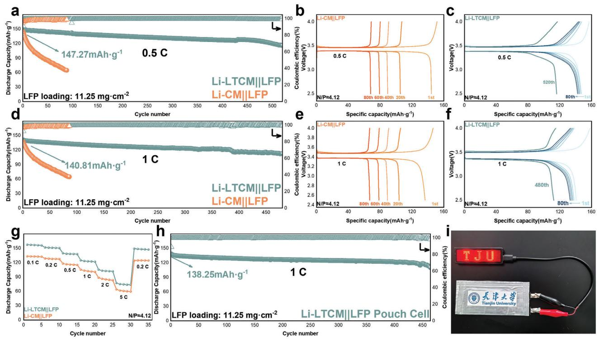

# **In Situ Grown Li2Te Enhanced Lithium Metal Anode Interfacial Kinetics**

*Xiao Meng, Nan Xiao, Chenglin Gao, Rui Zhang, Zongfu Sun, Yihao Cheng, Ning Zhang, Wen Li, Biao Chen,\* and Chunnian He\**

**Lithium metal anode (LMA) is expected to be the ideal anode material for future high-energy-density batteries, but regulating the complex electrolyte–anode interface remains a challenge. In this work, a stable Li2Te coating is formed on the surface of commercial copper mesh (LTCM) using a simple and quick method to improve lithium metal anode interfacial kinetics. Li2Te possesses a strong affinity for both Li+ and TFSI− anions, which reduces the lithium nucleation barrier and guides the formation of inorganic-rich SEI, accelerates the diffusion of Li+, and promotes the growth of lithium metal along the plane. The highly conductive Li2Te and Cu generated by in situ lithiation reaction together constitute an effective electron-conducting network, which synergistically enhances the interfacial kinetics and the cycling stability of LMA. As a result, the LTCM maintains high Coulombic efficiency (98%) even after 2200 cycles at 1 mA cm−2, whereas the symmetric cell has a long cycle life of over 5400 h at 1 mA cm−2. In addition, the full cells with LFP display a high capacity retention ratio (80%) after 480 cycles at 1 C and the corresponding pouch cell can cycle steadily more than 464 cycles at 1 C, which has good application prospects.**

# **1. Introduction**

The rapid development of energy storage devices, electric vehicles, and smart wearable devices has boosted the demand for high-energy-density storage systems.[\[1–6\]](#page-8-0) Lithium metal anode (LMA) with ultra-high theoretical specific capacity (3860 mAh g−1) and the lowest electrochemical potential (−3.04 V vs the

E-mail: [bchen@tju.edu.cn;](mailto:bchen@tju.edu.cn) [cnhe08@tju.edu.cn](mailto:cnhe08@tju.edu.cn) R. Zhang

The ORCID identification number(s) for the author(s) of this article can be found under <https://doi.org/10.1002/smll.202409195>

**DOI: 10.1002/smll.202409195**

standard hydrogen electrodes) have attracted extensive research attention.[\[7–10\]](#page-8-0) However, the extreme reactivity of Li metal and the unpredictable growth of Li dendrites have severely hampered commercialization.[\[11–13\]](#page-8-0) The deposition process of Li+ reduction to Li metal on the anode surface is considered to be a key factor in determining the stability of LMA. The lithium deposition process can be divided into four steps: diffusion, adsorption, nucleation, and growth.[\[14\]](#page-8-0) Conventional copper material has been widely used as the current collector, as shown in **Figure 1**[a,](#page-1-0) however, it has a high lithium nucleation potential due to poor intrinsic lithophilicity and high lithium nucleation barrier, and lithium is more inclined to be deposited in the region of high current density, leading to the formation of dendritic lithium. Simultaneously, due to the high chemical reactivity and volume change of lithium metal anode during charging and discharging, continuous and

uncontrollable side reactions between lithium and electrolytes are unavoidable. The solid electrolyte interphase (SEI) on the anode surface continues to break and regenerate, reducing the anode interface's mechanical stability and ion transport efficiency. Li+ diffusion resistance increases, the interface kinetics continue to deteriorate, and the battery performance declines rapidly, causing serious safety hazards.

Various strategies have been proposed to address the above problems, including solid-state electrolytes,[\[15–18\]](#page-8-0) functional separators,[\[19,20\]](#page-8-0) and electrolyte additives.[\[21,22\]](#page-8-0) Modifying lithophilic coatings on 3D current collectors is an effective strategy that can simultaneously mitigate volume expansion and improve lithophilicity.[\[23–25\]](#page-8-0) According to the Sand's time model,[\[26\]](#page-8-0) 3D structures with highly electroactive surfaces and porous skeletons can reduce the effective current density, extend the initial time of dendrite emergence, and provide space for Li deposition. Furthermore, favorable lithophilic sites can effectively reduce the nucleation barrier and promote the uniform deposition of Li. Lithophilic sites that have been reported thus far include Li–Ag,[[27\]](#page-8-0) Li–In,[\[28\]](#page-8-0) Li2S,[\[26\]](#page-8-0) ZnO,[\[29\]](#page-8-0) and others. Among them, although the lithophilic sites such as Li–In and ZnO have low nucleation barriers, the large volume change associated with reversible alloying–dealloying is easy to cause the interface to become loose and swell, and this may lead to the detachment of the

X. Meng, N. Xiao, C. Gao, Z. Sun, Y. Cheng, N. Zhang, W. Li, B. Chen, C. He

School of Materials Science and Engineering

Tianjin Key Laboratory of Composite and Functional Materials

Key Laboratory of Advanced Ceramics and Machining Technology (Ministry of Education)

National Industry-Education Platform of Energy Storage

Tianjin University

Tianjin 300350, P. R. China

School of Electrical Engineering Hebei University of Technology

Tianjin 300130, China

**Figure 1.** Lithium deposition behavior on a) CM and b) LTCM current collectors. c) Comparisons of Li atom adsorption energy on Li2Te (111), DME, DOL, TFSI−, Cu (111), Li (110). d) Comparisons of TFSI− adsorption energy on various substrate surfaces. e) The diffusion barriers of Li along Li2Te (111) and Cu (111) surfaces. f,g) SEM image and HRTEM images of CTCM. h) Galvanostatic discharge/charge profile of Li||CTCM half-cell during first 5 cycles, tested between 0 and 0.5 V. i) XRD pattern of the CM, CTCM and surface substance of LTCM electrode after activation. j,k) SEM image and HRTEM images of LTCM.

ity for the Li atoms. The DFT results show that compared to DME (−0.26 eV), DOL (−0.19 eV), TFSI− (−0.53 eV), Cu (111) (−0.45 eV), and Li (110) (−0.6 eV), Li2Te (111) has the most negative adsorption energy (−3.03 eV). This indicates that Li+ at the electrolyte-anode interface will be more inclined to adsorb uniformly and stably on Li2Te under the driving of the electric field, lowering the nucleation barrier; TFSI− plays a crucial role in the formation of inorganic components such as LiF in SEI. More inorganic components are expected to boost SEI's ion transport efficiency as well as its interfacial kinetics.[\[44\]](#page-9-0) The adsorption energies of TFSI− on three substrates, Li2Te, Cu, and Li, were calculated (Figure [1d](#page-1-0) and Figure S2, Supporting Information). Compared with Cu (111) (−0.69 eV) and Li (110) (−1.26 eV), Li2Te (111) has the strongest affinity (−4.06 eV) for TFSI−. This means that TFSI− is easily adsorbed on the Li2Te surface and has a higher chance of receiving electrons and forming inorganicrich SEI; controlling its growth in the transverse direction dur-

lithiophilic layer from the current collector and increase the risk of side reactions. Inorganic interfacial layers such as Li2S have good ionic conductivity and stable structure, but poor electronic conductivity still has adverse effects on interface dynamics. Furthermore, the influence of lithiophilic layers on the formation of SEI is often overlooked. It has been proved that inorganic-rich SEI can effectively improve the mechanical properties and ionic conductivity of the interface.[\[30,31\]](#page-8-0) Hence, a promising lithophilic layer should possess the following characteristics: 1) good mechanical stability with no significant volume change at the interface during the electrochemical reaction; 2) a high ionic conductivity lithophilic phase that lowers Li+ diffusion barriers and can lead to the formation of inorganic-rich SEI; and 3) an electronconducting network with an effective charge-transfer channel that ensures the rapid electrons transfer. The key challenge to construct an ideal LMA is how to build a promising lithophilic layer in the 3D conductive current collectors.

In this work, we uniformly design a layer of Cu2Te on the surface of commercial copper mesh (CTCM) by a simple and quick method, and during the first charge of Li activation, the Cu2Te was irreversibly in situ transformed into homogeneously dispersed Li2Te and Cu on the CM surface (LTCM). Compared with other compounds of chalcogen elements, like Li2Se (2.97 eV),[\[32,33\]](#page-9-0) Li2S (3.39 eV),[\[34–36\]](#page-9-0) and Li2O (4.9 eV),[\[37–41\]](#page-9-0) Li2Te (2.49 eV)[\[42,43\]](#page-9-0) has a narrower bandgap, resulting in an excellent electron-conducting network with the uniformly scattered Cu particles. Meanwhile, the DFT calculation and in-depth XPS results illustrate that Li2Te has a strong affinity for both Li+ and TFSI− anions, which effectively reduces the lithium nucleation barriers and leads to the formation of inorganic-rich SEI, reduces the barriers for Li diffusion along the planes, prevent the vertical growth of lithium metal, and effectively enhances the interfacial kinetics of the LMA to improve the cycling stability of the battery (Figure [1b\)](#page-1-0). The LTCM||Li half-cells can be stably cycled for more than 2200 cycles under 1 mA cm−2/1 mAh cm−2, and the corresponding symmetric cells have an ultra-long cycle life of more than 5400 h under 1 mA cm−2. The full cell paired with an LFP cathode with high loading (11.25 mg cm−2) shows a high initial capacity of 140.81 mAh g−1 at 1 C and a long cycling stability of 480 cycles, and the corresponding pouch cell can cycle steadily more than 464 cycles at 1 C, demonstrating the advantages of the designed coating in LMA. This work gives fresh insights into the study of lithium metal batteries and other alkali metal batteries, as well as a straightforward, quick, and inexpensive method for building 3D structures with stable lithophilic interfaces.

# **2. Results and Discussion**

The stability of LMA is largely dependent on the deposition behavior of Li metal. If the lithium deposition kinetics can be controlled in the whole process, the comprehensive performance of LMA will be dramatically enhanced. Considering the concept of enhancing the lithium deposition kinetics, we proposed the modification of conventional Cu current collectors using Li2Te coatings. The adsorption energies of Li atoms with commercial ether electrolyte components DME, DOL, TFSI− and on three substrates of Li2Te, Cu, and Li were calculated (Figure [1c](#page-1-0) and Figure S1, Supporting Information). The more negative adsorption energies indicate a thermodynamically stronger affin-

ing lithium deposition can effectively prevent dendrite formation. Figure [1e](#page-1-0) and Figures S3 and S4 (Supporting Information) show that Li atoms have lower diffusion barriers on the Li2Te (111) surface, facilitating planar diffusion of adsorbed Li atoms and preventing local aggregation. In summary, the Li2Te coating is expected to improve the lithium deposition kinetics of conventional Cu current collectors in terms of diffusion, adsorption, nucleation, and growth by designing the Li2Te coating. A straightforward method was used to create the Li2Te coating on commercial copper mesh (CM; Figure S5, Supporting Information). The CTCM was prepared at a low temperature (600 °C) in only 10 min (Figure S6, Supporting Information). Figure S7 (Supporting Information) shows the X-ray diffraction (XRD) analysis of the CTCM. After tellurization, four more diffraction peaks at 12.1°, 24.4°, 42.6°, and 44.8° were seen in comparison to pristine CM. These peaks were associated with the Cu2Te (PDF#39-1061) crystal plane (001), (100), (110), and (103). The CTCM surface states were further investigated by Xray photoelectron spectroscopy (XPS). Figure S8a (Supporting Information) displays the high-resolution Cu 2p spectrum, where the peaks at 932.5 and 952.3 eV can be attributed to Cu0/Cu+ 2p3/2 and Cu0/Cu+ 2p1/2, while the peaks at 934.6 and 954.4 eV can be attributed to Cu2+ 2p3/2 and Cu2+ 2p1/2. Figure S8b (Supporting

Information) shows the high-resolution XPS spectrum of Te 3d. Te2− 3d5/2 (573.1 eV) and Te2− 3d3/2 (583.3 eV) can be observed along with the Cu LMM Auger.[\[45\]](#page-9-0) The XRD and XPS results confirmed the formation of Cu2Te on the CM surface after tellurization. The morphology of the Cu2Te layer was characterized by scanning electron microscopy (SEM) and transmission electron microscopy (TEM). As shown in Figure [1f](#page-1-0) and Figure S9 (Supporting Information), the Cu2Te microcrystalline layer was uniformly grown on the Cu surface with a thickness of 2–3 μm and a particle size of about 1–2 μm. Figure [1g](#page-1-0) shows high-resolution transmission electron microscope (HRTEM) lattice fringes with a d spacing of 0.365 nm corresponding to the Cu2Te's (100) face, which is consistent with the XRD data above. The SEM-EDS and TEM mapping images in Figures S10 and S11 (Supporting Information) further show the uniform distribution of the Cu2Te layer

on the CTCM surface. The CTCM was paired with Li foil to assemble a half-cell, and the final Li2Te layer was formed directly on the CM via in situ lithiation of Cu2Te. Figure [1h](#page-1-0) shows the constant current

**Figure 2.** a) Voltage curves of LTCM for plating 10 mAh cm−2 and stripping to 1.0 V at 0.5 mA cm−2. The corresponding SEM images at different states of Li plating and striping on CM and LTCM:(b,f) plating 1 mAh cm−2, c,g) 5 mAh cm−2, d,h) 10 mAh cm−2, and (e,i) stripping to 1.0 V.

discharge/charge curve of Cu2Te during activation at 0.2 mA cm−2. In the first charge, Cu2Te reacts with Li+ to form Li2Te and Cu, and two plateaus can be observed at ≈1.4 and 1.3 V, corresponding to the step lithiation of Cu2Te (Equation 1).

$$
Cu2Te + 2e^- + Li^+ \rightarrow Li2Te + Cu
$$
 (1)

As seen in Figure S12 (Supporting Information), LTCM provides negligible capacity during the first delithiation process as well as during subsequent cycling, indicating that the conversion reaction is irreversible.[\[46\]](#page-9-0) The other product of this reaction, Cu, will likewise not alloy with Li, so it can be assumed that the Li2Te/Cu coating will exist stably on the LTCM surface during subsequent cycling and will not undergo significant volume changes during subsequent charge and discharge, ensuring the stability of the interface. Figure [1i](#page-1-0) shows the XRD analysis results of LTCM after lithiation. It should be noted that since it is difficult to detect the signal by directly characterizing the LTCM electrode, the method of collecting the surface substance by ultrasonic waves is used for XRD. Three additional diffraction peaks appearing at 23.6°, 27.3°, and 39.1° are related to the (111), (200), and (220) crystal planes of Li2Te (PDF#23-0370). The surface morphology of LTCM after lithiation is shown in Figure [1j,k](#page-1-0) and Figure S13 (Supporting Information), which display TEM images of lattice fringes with d spacings of 0.376, 0.196, and 0.208 nm, which are related to the (111), (311) face of Li2Te and the (111) face of Cu, corresponding to the XRD results. The Te and Cu components are distributed uniformly in Figures S14 and S15 (Supporting Information), which further demonstrates the stable presence of the Li2Te/Cu hybrid coating.

By observing the morphology evolution under different lithium plating/stripping states, the effect of Li2Te on the lithium deposition process was investigated. **Figure 2**a illustrates a typical discharge/charge curve of LTCM at a constant current density of 0.5 mA cm−2. As shown in Figure 2b, loose Li was unevenly deposited on the CM when depositing 1 mAh cm−2. The following deposition process will be significantly impacted by the initial status of the deposition. When the capacity of deposited Li increased from 1 to 5 mAh cm−2, the initial Li whiskers grew into large Li dendrites due to Li accumulation and friable SEI (Figure 2c).[\[47\]](#page-9-0) It is important to note that a significant deposition inhomogeneity was generated at the macroscopic scale of the current collector level due to the CM's extremely low lithophilicity, as shown in Figure S16a (Supporting Information). As a result, the majority of the Li was not uniformly deposited between each Cu fiber of the CM, losing the benefit of the 3D structure. When the deposition capacity was further increased to 10 mAh cm−2, dendritic and porous Li deposits with noticeable cracks emerged on the CM (Figure 2d and Figure S16b, Supporting Information). After complete stripping of the deposited Li to 1.0 V versus Li+/Li, a large amount of loose filamentary "dead Li" remained on the surface of the CM, severely reducing the

**Figure 3.** a) Lithium deposition overpotential on CM and LTCM at different current densities. b) Coulombic efficiency of Li plating/stripping of CM and LTCM at a current density of 1 mA cm−2 with the deposition capacity of 1 mAh cm−2. c) Voltage profiles of symmetrical cells assembled with CM and LTCM cycled at 1 mA cm−2. d) Amplified voltage profiles of (c). e–g) EIS spectra of symmetrical cells after different cycles. h) Statistics for *R*SEI+*R*ct. i) Voltage profiles of GITT in the symmetrical cells with different current collectors. j) Tafel plot obtained from a linear sweep voltammetry test in symmetrical cells with a scan rate of 1 mV s−1. k) The lifespan of Li-LTCM symmetrical cells in comparison with previous 3D current collectors with lithophilic coating.

Coulombic efficiency (Figure [2e\)](#page-3-0). Conversely, more Li was attached to the fibers of the LTCM current collector after depositing 1 mAh cm−2 (Figure [2f\)](#page-3-0). Further increasing the capacity of deposited Li to 5 mAh cm−2, the voids between adjacent LTCM fibers were almost filled with densely deposited Li (Figure [2g\)](#page-3-0). When the capacity of deposited Li was further increased to 10 mAh cm−2, a very smooth surface, and dendrite-free morphology were presented on the LTCM (Figure [2h\)](#page-3-0). Li filled the current collector's pores and tightly wrapped the LTCM fibers, as shown by the corresponding cross-sectional SEM images (Figure S17a-c, Supporting Information). The shape of the SEI-covered fibers was preserved on the surface of the LTCM current collector with no visible Li residue after stripping the deposited Li to 1.0 V versus Li+/Li (Figure [2i\)](#page-3-0). This demonstrates that LTCM has a better regulation behavior than CM during lithium plating/ stripping with a high capacity of up to 10 mAh cm−2.

Half-cells were assembled to evaluate the reversibility and efficiency of lithium plating/stripping on LTCM current collectors. The nucleation overpotential ȵnucl was quantified by the potential difference between the lowest voltage dip on the initial plating curve and the stable plating overpotential (ȵg) [\[28\]](#page-8-0) (**Figures 3**a, S18a—d, Supporting Information). At 1 mA cm−2, the LTCM current collector exhibited the lowest nucleation overpotential (ȵnucl = 14.1 mV) in the initial plating curve in contrast to CM (ȵnucl = 42 mV). The LTCM current collector still shows reduced ȵnucl when the current density is increased to 2, 4, and 6 mA cm−2. This finding implies that Li2Te modifies the adsorption of Li atoms on the current collector's surface and decreases the energy barrier for Li nucleation. Outstanding long-cycle stability is likewise displayed by the corresponding half-cells. As shown in Figures [3b](#page-4-0) and S19a (Supporting Information), the CM||Li half-cells show abrupt CE decay after only 180 and 60 cycles at current densities of 1 mA cm−2 and 2 mA cm−2. On the other hand, after 2200 cycles at 1 mA cm−2, the LTCM||Li halfcell demonstrated extremely steady cycling with a high CE of over 98%. 600 and 400 cycles were also achieved after increasing the current density to 2 and 6 mA cm−2 (Figure S19b, Supporting Information).

Further research on the cycling stability of CM and LTCM current collectors was conducted using symmetrical cells. Li was first pre-deposited on various current collectors at a current density of 0.5 mA cm−2 with a deposition capacity of 7 mAh cm−2, and subsequently paired with Li foil to assemble symmetrical cells. As can be shown in Figure [3c,d,](#page-4-0) after 980 hours of cycling at 1 mA cm−2/0.5 mAh cm−2, Li-CM||Li displayed severe voltage polarization due to the accumulation of Li dendrites and the depletion of electrolytes, which caused the interfacial kinetics to continuously deteriorate. In contrast, the Li-LTCM||Li symmetrical cell exhibits a cycle life of over 5400 h with a low voltage polarization of 17 mV. Moreover, electrochemical impedance spectroscopy (EIS) showed that Li-LTCM||Li symmetrical cells had superior interfacial stability as evidenced by their reduced interfacial resistance *R*SEI and charge transfer resistance *R*ct, which both progressively declined in the first 100 cycles (Figure [3e–h\)](#page-4-0). The interfacial kinetics were further investigated by the galvanostatic intermittent titration technique (GITT).[\[48\]](#page-9-0) Consistent with the EIS study, the stable and continuous GITT curves of the cell show reduced overpotentials because of accelerated mass transfer kinetics on LTCM, as shown in Figure [3i.](#page-4-0) On the contrary, Li-CM||Li symmetrical cells show significantly higher and gradually increasing voltage polarization in the GITT curves. The increase in polarization can be attributed to the accumulation of "dead Li" on the anode surface after cycling. Additionally, based on the Tafel plot,[\[45\]](#page-9-0) the exchange current density on various interfaces was calculated (Figure [3j](#page-4-0) and Figure S20, Supporting Information). The significantly greater exchange current density of 21.169 mA cm−2 in Li-LTCM than that in Li-CM (8.370 mA cm−2) can be detected, which indicates the enhanced kinetics of Li+ plating/stripping on the Li-LTCM. Consequently, under the more severe conditions of 2 mA cm−2/1 mAh cm−2 and 8 mA cm−2/1 mAh cm−2, the Li-LTCM||Li symmetrical cells also displayed an ultra-long cycle life of 1750 and 820 h (Figures S21 and S22, Supporting Information). The excellent performance of LTCM in terms of cycling stability compared to other reported work strongly elucidates the advantages of Li2Te in modulating the interfacial kinetics of lithium-metal anodes (Figure [3k\)](#page-4-0).[\[27,49–60\]](#page-8-0)

The structure and composition of SEI on the LTCM and CM current collector after 100 cycles were further investigated by indepth XPS. **Figure 4**[a,b](#page-6-0) shows the characteristic C 1s peaks at 284.8, 286.4, and 288.6 eV, which are identified as C-C, COR (R: radicals), and HCO2Li/COOR, respectively.[\[51\]](#page-9-0) The SEI of LTCM clearly shows a mitigated parasitic reaction between the solvent and Li metal anode (Figure [4e,f\)](#page-6-0), as evidenced by the peak intensities and relative contents of HCO2Li/COOR and COR, which can only be created by the decomposition of the solvents (DME and DOL). Meanwhile, the peaks at 684.8 eV in the F 1 s spectra attributed to LiF show an apparent increase in peak intensities, suggesting a LiF-dominant SEI formed on the LTCM current collector (Figure [4c,g\)](#page-6-0), compared with the CM current collector (Figure [4d\)](#page-6-0). This confirms that Li2Te can promote the preferential decrease of TFSI− anion, as evidenced by the DFT calculation findings in the previous section. A comparison of the trends of elemental content changes also illustrates the enrichment of elemental F on the LTCM surface (Figure S23, Supporting Information). The large amount of LiF can have a beneficial effect on the homogeneous Li+ flux distribution and electron insulation, which greatly enhances the interfacial kinetics.[\[61\]](#page-9-0) Furthermore, it was shown by the Li 1s, N 1s, and O 1s spectra that the LTCM surface contains a higher concentration of inorganic species, such as Li3N and S═O, which when combined with LiF create an inorganic-rich SEI with high ionic conductivity (Figures S24–S26, Supporting Information). Based on the above results, the microstructures and compositions of the SEI on the CM and LTCM current collectors are schematically shown in Figure [4h,i.](#page-6-0) The organic components from solvent decomposition that make up the majority of the SEI on the CM current collector are viscous and highly resistive, which significantly reduces interfacial kinetics. In comparison, the Li+ conductivity of the SEI on the LTCM current collector contributes to its excellent interfacial stability and accelerates the uniform deposition of Li. It is also mechanically strong, electrically insulating, and enriched with inorganic components primarily derived from anions.

Finally, lithium metal full cells were used to assess the superiority of the LTCM current collector. LiFePO4 (LFP) cathodes (area capacity 11.25 mg cm−2, 1.69 mAh cm−2) were paired with lithium pre-deposited current collectors (pre-deposited lithium: 7 mAh cm−2; N/P ratio = 4.12) to assemble the full cell. The Li-CM||LFP had a 144.55 mAh g−1 initial capacity at 0.5 C. After 80 cycles, there was a sharp decline in capacity, bringing it down to 68 mAh g−1 (**Figure 5**[a,b\)](#page-7-0). In contrast, Li-LTCM||LFP showed good capacity retention, which decreased to 80% after 521 cycles of stable cycling at a high initial capacity of 147.27 mAh g−1, showing good capacity retention (Figure [5a,c\)](#page-7-0). At higher multiplicity 1 C, Li-LTCM||LFP exhibited an initial capacity of 140.81 mAh g−1 and a long cycle life of 480 cycles (Figure [5b,f\)](#page-7-0). In contrast, Li-CM||LFP dropped from 136.55 mAh g−1 to 66.91 mAh g−1 after only 80 cycles of cycling (Figure [5b,e\)](#page-7-0). Furthermore, in Figure [5g,](#page-7-0) Li-LTCM||LFP provided higher specific capacities at current densities of 0.1, 0.2, 0.5, 1, 2, and 5 C, respectively, compared to Li-CM||LFP, with 157.34, 151.64, 139.50, 124.74, 105.26 and 77.27 mAh g−1, showing good rate performance. For practical applications, the pouch cell was assembled from Li-LTCM anode and LFP cathode. The pouch cell has a starting capacity of up to 138.25 mAh g−1 and can cycle steadily more than 464 cycles (Figure [5h\)](#page-7-0) at 1 C. Furthermore, the capacity of the pouch cell to power the "TJU" LED light board also reflects its application value (Figure [5i\)](#page-7-0). These results demonstrate the LTCM current collector's potential for application in high-density battery systems.

## **3. Conclusion**

In conclusion, the in situ grown Li2Te coating has been shown to effectively enhance the interfacial kinetics of lithium metal anode. Li2Te has a strong affinity for both Li+ and TFSI− anions,

**Figure 4.** a) C 1s, c) F 1s XPS spectrum of LTCM at different etching times. b) C 1s, d) F 1s XPS spectrum of CM at different sputtering times. e–g) Depth profiling of the absolute intensity of SEI components e) HCO2Li/COOR, f) COR, and g) LiF for CM and LTCM. Diagram of the SEI on h) CM and i) LTCM current collectors.

which effectively reduces the lithium nucleation barriers and guides the formation of inorganic-rich SEI, resulting in a uniform distribution of Li+ fluxes, which greatly enhances the interfacial kinetics. Furthermore, Li2Te can increase the flatness of lithium metal deposition and lower the potential barrier of Li diffusion along the plane. The deposition of 10 mAh cm−2 nevertheless preserves a dense and smooth morphology, which significantly increases interfacial stability. Owing to these advantages, the corresponding symmetric cell has an ultralong cycle life of more than 5400 h at 1 mA cm−2, and the LTCM||Li half-cell can be steadily cycled for more than 2200 cycles at 1 mA cm−2/1 mAh cm−2. The full cell exhibits a long cycle stability of 480 cycles and a high initial capacity of 140.81 mAh g−1 at 1 C when paired with an LFP cathode with high loading (11.25 mg cm−2). The corresponding pouch cell can cycle steadily more than 464 cycles at 1 C. This simple and practical coating design is a promising strategy for the development of dendrite-free lithium metal anodes for practical applications.

**Figure 5.** a) Long-term cycling performance of the Li/collector||LFP full-cells at 0.5 C. bc) Charge/discharge curves of (a). d) Long-term cycling performance of the Li/collector||LFP full-cells at 1 C. e,f) Charge/discharge curves of (d). g) Rate performance of Li/collector||LFP full cells. h) Specific capacity and Coulombic efficiency of the pouch battery cycled at 1 C. i) The images of an LED board lighted up by the pouch cell.

#### **4. Experimental Section**

*Preparation of CTCM*: The clean copper mesh (2 × 3 cm2, Canrd, China) was placed in the center of the heating zone of the tube furnace, and an ark containing excess Te powder (HEOWNS, Chinas, 99.9%) was placed about 10 cm upstream of it, which was rapidly heated to 600 °C under the mixed air flow of Ar and H2 (Ar:H2 = 200:100 sccm), and kept heating for 10 min. After cooling down to room temperature, the CTCM was obtained and cut into disks with a diameter of 5 × 5 mm2 for electrochemical tests.

*Preparation of LTCM*: LTCM was obtained after the lithiation of CTCM. CR2032 coin cells were assembled with Li foil and CTCM electrodes in an Ar-filled glove box. Celgard separator (Celgard 2400, thickness 25 μm) was used, and the electrolyte was 1 m lithium bis (trifluoromethane sulfonimide) (LiTFSI) in 1,3-dioxolane (DOL)/1,2-dimethoxyethane (DME) (volume ratio: 1:1) with 1 wt% LiNO3 additive (Canrd, China). The cells were cycled between 0.01 and 0.5 V for 5 cycles at 0.2 mA cm−2, and LTCM was obtained after cycling (lithiation process).

*Preparation of Li-CM and Li-LTCM*: Li-CM or Li-LTCM was fabricated by the electrodeposition method, with CM/CTCM and Li foil serving as cathode and anode, respectively, and assembled into CR2032 coin cells. The electrolyte was 1 m lithium bis (trifluoromethane sulfonimide) (LiTFSI) in 1,3-dioxolane (DOL)/1,2dimethoxyethane (DME) (volume ratio: 1:1) with 1 wt% LiNO3 additive. Lithium was deposited on the CM/CTCM cathode at a current density of 0.5 mA cm−2 with a capacity of 7 mAh cm−2. The symmetrical cell was tested by the galvanostatic cycling of coin cells with the Li-CM/Li-LTCM. The GITT voltage profiles of the symmetric cells were measured with a periodically interrupted current (1 mA cm−2 for 30 min) and a resting time of 60 min until the overall plating/stripping areal capacity was 4 mAh cm−2.

*Structural Characterization*: Morphology and microstructures of the samples were observed by SEM (Hitachi S4800) and TEM (JEOL JEM- 2100F). The element distribution was determined by an energy dispersive spectrometer (EDS) on TEM. The X-ray diffraction (XRD) patterns (Bruker D8 Advanced, Cu K radiation) were taken to confirm the components of the samples. X-ray photoelectron spectroscopy (XPS) analyses were carried out by Kratos Axis Supra X-ray photoelectron spectrometer. The sputtering condition of Ar+ ion etching was 2 kV with a spot size of 5 × 5 mm2, and the etching rate was 0.1 nm s−1 calibrated for Ta2O5.

*Electrochemical Measurements*: All the cells were assembled in an Arfilled glove box. CE was tested by the galvanostatic cycling of coin cells with working electrodes (CM, LTCM) and counter electrodes (Li foil). The electrolyte (1 m LiTFSI in cosolvent of DOL and DME (volume ratio: 1:1) with 1% LiNO3) was 70 μL in each cell. A Celgard separator (Celgard 2400, thickness 25 μm) was used to separate the electrodes. The cells were first cycled between 0.01 and 0.5 V for 5 cycles. After that, in each galvanostatic cycling, a fixed amount of metallic Li was plated on the working electrodes and stripped away up to 0.5 V. Electrochemical impedance spectroscopy (EIS) measurements were performed using a Gamry Interface 1000 electrochemical workstation in the frequency range 0.1-100 kHz.

The exchange current density can be identified as an intrinsic kinetic parameter,[\[62\]](#page-9-0) which was investigated by using Tafel curves based on linear sweep voltammetry (LSV). Assuming there is no mass transfer effect, the Bulter-Volmer equation is expressed as Equation 2:

$$
j = j_0 \left[ \exp\left(\frac{\alpha n F}{RT} \eta\right) - \exp\left(-\frac{\left(1 - \alpha\right) n F}{RT} \eta\right) \right]
$$
 (2)

where *j* is the current density (A cm−2), ɑ is the charge transfer coefficient of Li+/Li, is the overpotential (V), *n* is the electron transfer number, *F* is the Faraday constant (C mol−1), *R* is the universal gas constant (J mol−1 K−1), and *T* represents the absolute temperature (K), respectively.

Owing to a high polarization of the electrode surface in LMBs, i.e., large , the equation can be simplified as Equation 3: [\[63\]](#page-9-0)

$$
lg (j) = lg (j_0) + \frac{\alpha nF}{RT} \eta
$$
\n(3)

Hereby, at a large overpotential region in the Tafel plot, the simplified Bulter-Volmer (Equation [2\)](#page-7-0) was used to fit the linear Tafel region to obtain the *j* 0 at y-intercept on a plot of lg (*j*) versus .

The full cells were assembled in CR2016 coin cells, LFP (11.25 mg cm−2, Canrd, China), and Li-CM/Li-CTCM with a size of 5 × 5 mm2 served as cathode and anode, respectively. The electrolyte (1 m LiTFSI in cosolvent of DOL and DME (volume ratio: 1:1) with 1% LiNO3) was 70 μL in each cell. A Celgard separator (Celgard 2400, thickness 25 μm) was used to separate the electrodes.

*Computational Details*: Density functional theory (DFT) calculations were performed using the projector augmented plane-wave method[\[64\]](#page-9-0) within the Vienna Ab initio Simulation Package (VASP).[\[65,66\]](#page-9-0) The generalized gradient approximation (GGA) was used in the scheme of Perdew-Burke-Ernzerhof (PBE) to describe the exchange-correlation function.[\[67\]](#page-9-0) The cut-off energy for the plane wave was set to 480 eV. The energy criterion was set to 10−5 eV in the iterative solution of the Kohn-Sham equation. All the structures were relaxed until the residual forces on the atoms declined to less than 0.02 eV Å−1. To prevent interaction between periodic units in the vertical direction, a vacuum space of 20 Å was employed. A Monkhorst–Pack scheme with a k-points mesh of 2 × 2 × 1 was used. The diffusion barrier of adsorbed hydrogen at different adsorption sites was explored by using the Nudge Elastic Band (CI-NEB) method.[\[68\]](#page-9-0)

The adsorption energy *E*ads is expressed as Equation 4:

$$
\Delta E_{ads} = E_{A+B} - E_A - E_B \tag{4}
$$

where *E*A+B is the total energy of slab A model with B adsorption, *E*A is the energy of an A slab, and *E*B is that of a B molecule.

#### **Supporting Information**

Supporting Information is available from the Wiley Online Library or from the author.

### **Acknowledgements**

This work was financially supported by the Chinese National Natural Science Fund for Distinguished Young Scholars (Grant No. 52025015), the Young Elite Scientists Sponsorship Program by CAST (2022QNRC001), the Natural Science Foundation of Tianjin City (23JCZDJC01110), the Tianjin University science and technology innovation leading talent training program. We also thank Dr. Yajing Han, Dr. Jing Mao, and Dr. Jinfeng Zhang from the National Demonstration Center for Materials Science & Engineering Education, Tianjin University for their help and kind advice on the characterization of the samples.

### **Conflict of Interest**

The authors declare no conflict of interest.

# **Data Availability Statement**

The data that support the findings of this study are available from the corresponding author upon reasonable request.

#### **Keywords**

3D current collectors, inorganic-rich SEI, interfacial kinetics, Li2Te, lithium metal anode

Received: October 8, 2024 Revised: November 10, 2024 Published online: December 8, 2024

- [1] B. Chen, S. Sui, F. He, C. He, H. Cheng, S. Qiao, W. Hu, N. Zhao, *Chem. Soc. Rev.* **2023**, *52*, 7802.
- [2] M. Liang, H. Zhang, B. Chen, X. Meng, J. Zhou, L. Ma, F. He, W. Hu, C. He, N. Zhao, *Adv. Mater.* **2023**, *35*, 2307209.
- [3] B. Chen, M. Liang, Q. Wu, S. Zhu, N. Zhao, C. He, *Trans. Tianjin Univ.* **2022**, *28*, 6.
- [4] R. Wang, D. G. Wang, Y. Dong, B. Xie, X. Y. Wu, Q. H. Wu, S. P. Zhu, G. W. Diao, M. Chen, *J. Alloys Compd.* **2023**, *952*, 169980.
- [5] Z. Sun, H. Liu, W. Li, N. Zhang, S. Zhu, B. Chen, F. He, N. Zhao, C. He, *Prog. Mater. Sci.* **2025**, *149*, 101401.
- [6] B. Chen, X. Zhong, G. Zhou, N. Z. Cao, H.-M. Cheng, *Adv. Mater.* **2022**, *34*, 2105812.
- [7] J. F. Qian, W. A. Henderson, W. Xu, P. Bhattacharya, M. Engelhard, O. Borodin, J. G. Zhang, *Nat. Commun.* **2015**, *6*, 6362.
- [8] P. Shi, T. Li, R. Zhang, X. Shen, X. B. Cheng, R. Xu, J. Q. Huang, X. R. Chen, H. Liu, Q. Zhang, *Adv. Mater.* **2019**, *31*, 1807131.
- [9] B. Liu, J. G. Zhang, W. Xu, *Joule* **2018**, *2*, 833.
- [10] D. H. Liu, Z. Y. Bai, M. Li, A. P. Yu, D. Luo, W. W. Liu, L. Yang, J. Lu, K. Amine, Z. W. Chen, *Chem. Soc. Rev.* **2020**, *49*, 5407.
- [11] X. Zhang, Y. A. Yang, Z. Zhou, *Chem. Soc. Rev.* **2020**, *49*, 3040.
- [12] F. Wang, J. X. Gao, Y. Liu, F. Z. Ren, *J. Mater. Chem. A* **2022**, *10*, 17395.
- [13] Z. Luo, X. J. Qiu, C. Liu, S. Li, C. W. Wang, G. Q. Zou, H. S. Hou, X. B. Ji, *Nano Energy* **2021**, *79*,105507.
- [14] H.-Y. Peng, Y.-S. Xu, X.-Y. Wei, Y.-N. Li, X. Liang, J. Wang, S.-J. Tan, Y.-G. Guo, F.-F. Cao, *Adv. Mater.* **2024**, *36*, 2313034.
- [15] B. Zhao, W. Ma, B. Li, X. Hu, S. Lu, X. Liu, Y. Jiang, J. Zhang, *Nano Energy* **2022**, *91*, 106643.
- [16] S. Xia, L. Luo, X. Zhang, L. Shen, J. Yang, W. Liu, S. Zheng, *Energy Storage Mater.* **2023**, *55*, 517.
- [17] S. Chen, L. Nie, X. Hu, Y. Zhang, Y. Zhang, Y. Yu, W. Liu, *Adv. Mater.* **2022**, *34*, 2200430.
- [18] Y. Du, L. Zhao, C. Xiong, Z. Sun, S. Liu, C. Li, S. Hao, W. Zhou, H. Li, *Energy Storage Mater.* **2023**, *56*, 310.
- [19] K. H. Han, J. Y. Seok, I. H. Kim, K. Woo, J. H. Kim, G. G. Yang, H. J. Choi, S. Kwon, E. I. Jung, S. O. Kim, *Adv. Mater.* **2022**, *34*, 2203992.
- [20] J. Liang, Q. Y. Chen, X. B. Liao, P. C. Yao, B. Zhu, G. X. Lv, X. Y. Wang, X. Chen, J. Zhu, *Angew. Chem., Int. Ed.* **2020**, *59*, 6561.
- [21] S. Li, Z. Luo, H. Y. Tu, H. Zhang, W. N. Deng, G. Q. Zou, H. S. Hou, X. B. Ji, *Energy Storage Mater.* **2021**, *42*, 679.
- [22] B. Zhong, J. Y. Wu, L. T. Ren, T. Y. Zhou, Z. J. Zhang, W. Liu, H. H. Zhou, *Energy Storage Mater.* **2022**, *50*, 792.
- [23] S. Y. Ni, M. T. Zhang, C. Li, R. H. Gao, J. Z. Sheng, X. Wu, G. M. Zhou, *Adv. Mater.* **2023**, *35*, 2209028.
- [24] P. B. Zhai, T. S. Wang, H. N. Jiang, J. Y. Wan, Y. Wei, L. Wang, W. Liu, Q. Chen, W. W. Yang, Y. Cui, Y. J. Gong, *Adv. Mater.* **2021**, *33*, 2006247.
- [25] R. Zhang, B. Chen, C. S. Shi, J. W. Sha, L. Y. Ma, E. Z. Liu, N. Q. Zhao, *Small* **2023**, *19*, 2208095.
- [26] Y. K. Lee, K. Y. Cho, S. Lee, J. Choi, G. Lee, H. I. Joh, K. Eom, S. Lee, *Adv. Energy Mater.* **2023**, *13*, 1900853.
- [27] C. H. Zhang, Y. J. Guo, S. J. Tan, Y. H. Wang, J. C. Guo, Y. F. Tian, X. S. Zhang, B. Z. Liu, S. Xin, J. Zhang, L. J. Wan, Y. G. Guo, *Sci. Adv.* **2024**, *10*, eadl4842.
- [28] Y. Wang, C. Ye, J. Wang, F. Chen, J. Qian, C. Yang, Y. Song, L. Bi, Q. Xie, L. He, J. Yu, X. Wei, H. Song, J. Liao, S. Wang, R. Chen, *Nano Energy* **2023**, *119*, 109093.
- [29] H. Qian, X. Li, Q. Chen, W. Liu, Z. Zhao, Z. Ma, Y. Cao, J. Wang, W. Li, K. Xu, K. Zhang, W. Yan, J. Zhang, X. Li, *Adv. Funct. Mater.* **2024**, *34*, 2310143.

- [30] Y. Liu, W. Guan, S. Li, J. Bi, X. Hu, Z. Du, H. Du, W. Ai, W. Huang, *Adv. Energy Mater.* **2023**, *13*, 2302695.
- [31] X. Shi, J. Liu, H. Zhang, Z. Xue, Z. Zhao, Y. Zhang, G. Wang, L. Akbar, L. Li, *ACS Nano* **2024**, *18*, 8827.
- [32] P. T. Cunningham, S. A. Johnson, E. J. Cairns, *J. Electrochem. Soc.* **1971**, *118*, 1941.
- [33] W. D. Johnston, R. R. Heikes, *J. Am. Chem. Soc.* **1958**, *80*, 5904.
- [34] W. Buehrer, F. Altorfer, J. Mesot, H. Bill, P. Carron, H. G. Smith, *J. Phys.: Condens. Matter* **1991**, *3*, 1055.
- [35] F. Altorfer, W. Buehrer, I. Anderson, O. Scharpf, H. Bill, P. L. Carron, H. G. Smith, *Adv. Mater.* **1991**, *325–330*, 1992.
- [36] A. Claassen, *Recl. Trav. Chim. Pays-Bas Belg.* **1925**, *44*, 790.
- [37] D. Taylor, *Br. Ceram. Trans. J.* **1984**, *83*, 32.
- [38] T. W. D. Farley, W. Hayes, S. Hull, M. T. Hutchings, M. Vrtis, *J. Phys.: Condens. Matter* **1991**, *3*, 4761.
- [39] J. M. Bijvoet, A. Claassen, A. Karssen, *Proc. K. Ned. Akad. Wet.* **1926**, *29*, 1286.
- [40] W. I. F. David, M. O. Jones, D. H. Gregory, C. M. Jewell, S. R. Johnson, A. Walton, P. P. Edwards, *J. Am. Chem. Soc.* **2007**, *129*, 1594.
- [41] Yun. Zhuravlev, O. S. Obolonskaya, *J. Struct. Chem.* **2010**, *51*, 1005.
- [42] E. Zintl, A. Harder, B. Dauth, *Z. Elektrochem. Angew. Phys. Chem.* **1934**, *40*, 588.
- [43] S. M. Alay-e-Abbas, A. Shaukat, *J. Mater. Sci.* **2011**, *46*, 1027.
- [44] X.-L. Zhang, L. Ma, Y.-P. Cai, J. Fransaer, Q. Zheng, *Matter* **2024**, *7*, 583.
- [45] Y. Wang, Y. Liu, M. Nguyen, J. Cho, N. Katyal, B. S. Vishnugopi, H. Hao, R. Fang, N. Wu, P. Liu, P. P. Mukherjee, J. Nanda, G. Henkelman, J. Watt, D. Mitlin, *Adv. Mater.* **2023**, *35*, 2206762.
- [46] C. Han, Z. Li, W.-j. Li, S.-l. Chou, S.-x. Dou, *J. Mater. Chem. A* **2014**, *2*, 11683.
- [47] Y. Zhang, M. Yao, T. Wang, H. Wu, Y. Zhang, *Angew. Chem., Int. Ed.* **2024**, *63*, 202403399.
- [48] C. Li, J. Wang, Q. Ye, P. Li, K. Zhang, J. Li, Y. Zhang, L. Ye, T. Song, Y. Gao, B. Wang, H. Peng, *Small* **2024**, *20*, 2400570.
- [49] X. Fei, H. Gao, Y. Xu, W. Ma, B. Yu, F. Tan, G. Cheng, Z. Zhang, *Energy Storage Mater.* **2024**, *65*, 103079.
- [50] Z. Wang, S. Qin, F. Chen, S. Chen, D. Liu, D. Jiang, P. Zhang, P. Mota-Santiago, D. Hegh, P. Lynch, A. S. Alotabi, G. G. Andersson, P. C. Howlett, M. Forsyth, W. Lei, J. M. Razal, *ACS Nano* **2024**, *18*, 3531.
- [51] J. Cao, Y. Shi, A. Gao, G. Du, M. Dilxat, Y. Zhang, M. Cai, G. Qian, X. Lu, F. Xie, Y. Sun, X. Lu, *Nat. Commun.* **2024**, *15*, 1354.
- [52] J. Pan, K. Shi, H. Wu, J. Li, R. Zhang, Q. Liu, Z. Liang, *Adv. Energy Mater.* **2024**, *14*, 2302862.
- [53] Y. Jin, I.-H. Lee, T. Gu, S.-H. Jung, H. Chang, B.-S. Kim, J. Moon, D. Whang, *Adv. Funct. Mater.* **2024**, *34*, 2310097.
- [54] M. Bae, S.-J. Park, M. Kim, E. Kwon, S. Yu, J. Choi, Y. Chang, Y. Kim, Y. J. Choi, H. Hong, L. Lin, W. Zhang, S. Park, J. Y. Maeng, J. Park, S.-Y. Lee, S.-H. Yu, Y. Piao, *Adv. Energy Mater.* **2024**, *14*, 2304101.
- [55] M. Gao, Q. Dong, M. Yao, X. Wang, J. Li, W. Zhang, H. Huang, H. Guo, Z. Sun, Q. Chen, X. Han, W. Hu, *Adv. Funct. Mater.* **2024**, *34*, 2401442.
- [56] B. Su, X. Wang, L. Chai, S. Huo, J. Qiu, Q. Huang, S. Li, Y. Wang, W. Xue, *Adv. Sci.* **2024**, *11*, 2308939.
- [57] J. Luo, Q. Huang, D. Shi, Y. Qiu, X. Zheng, S. Yang, B. Li, J. Weng, M. Wu, Z. Liu, Y. Yu, C. Yang, *Adv. Funct. Mater.* **2024**, *34*, 2403021.
- [58] D.-Y. Han, S. Kim, S. Nam, G. Lee, H. Bae, J. H. Kim, N.-S. Choi, G. Song, S. Park, *Adv. Sci.* **2024**, *11*, 2402156.
- [59] C. Ye, K. Ni, J. Wang, W. Ye, S. Li, M.-S. Wang, X. Fan, Y. Zhu, *Adv. Mater.* **2024**, *36*, 2401965.
- [60] Q. Yin, Q. Liu, Y. Liu, Z. Qu, F. Sun, C. Wang, X. Yuan, Y. Li, L. Shen, C. Zhang, Y. Lu, *Adv. Mater.* **2024**, *36*, 2404689.
- [61] R. Zhang, B. Chen, Y. Ma, Y. Li, J. Sha, L. Ma, C. Shi, N. Zhao, *Green Energy Environ.* **2024**, *9*, 1279.
- [62] Y. Liu, X. Xu, M. Sadd, O. O. Kapitanova, V. A. Krivchenko, J. Ban, J. Wang, X. Jiao, Z. Song, J. Song, S. Xiong, A. Matic, *Adv. Sci.* **2021**, *8*, 2003301.
- [63] Q. Wu, Z. Yao, A. Du, H. Wu, M. Huang, J. Xu, F. Cao, C. Li, *J. Mater. Chem. A* **2021**, *9*, 5606.
- [64] G. Kresse, D. Joubert, *Phys. Rev. B* **1999**, *59*, 1758.
- [65] H. Kresse, *Phys. Rev. B* **1994**, *49*, 14251.
- [66] F. Kresse, *Phys. Rev. B* **1996**, *54*, 11169.
- [67] W. Perdew, *Phys. Rev. B* **1992**, *45*, 13244.
- [68] G. Henkelman, B. P. Uberuaga, H. Jónsson, *J. Chem. Phys.* **2000**, *113*, 9901.