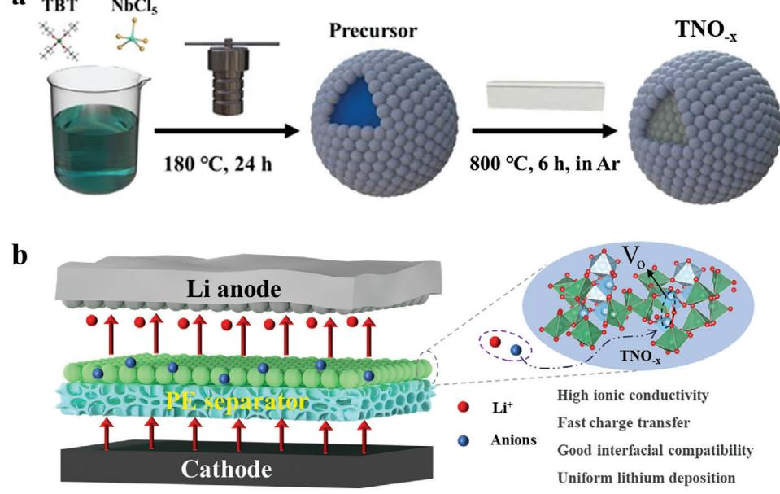
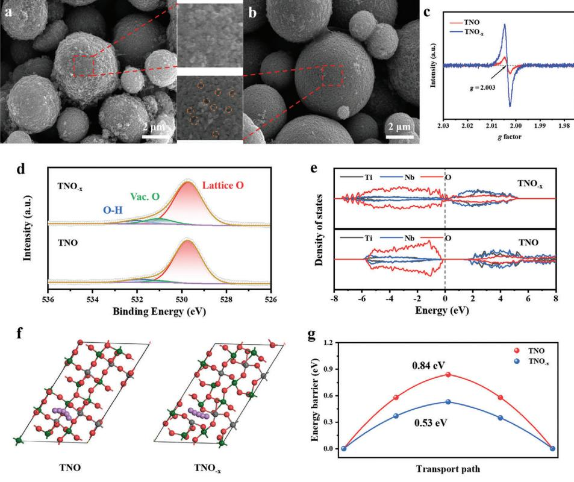
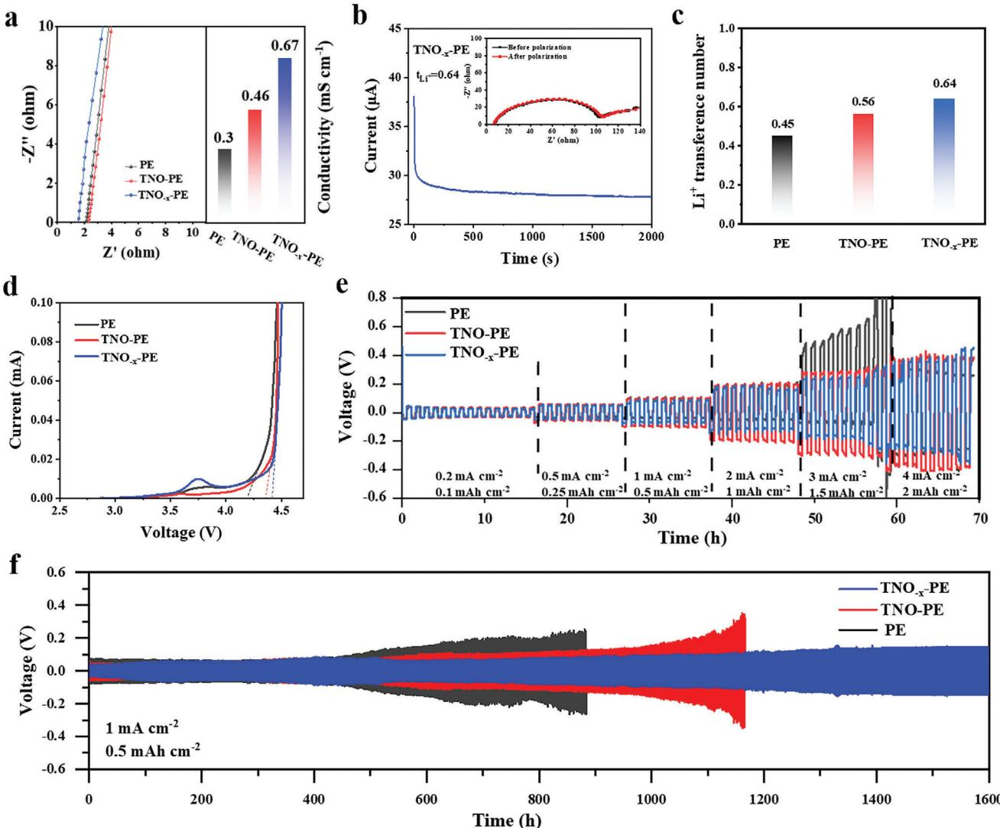
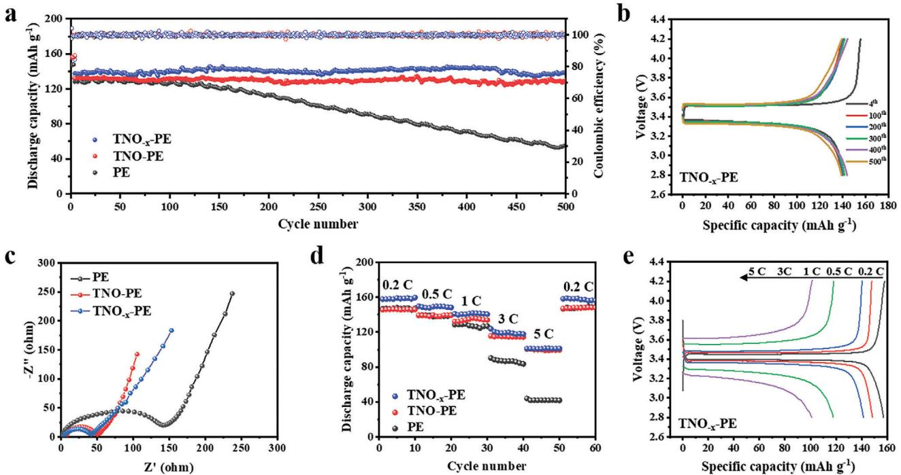

# **Oxygen Vacancy Engineering of TiNb2O7 Modified PE Separator Toward Dendrite-Free Lithium Metal Battery**

*Wenhao Tang, Yirui Deng, Zhiwei Xing, Xin Zhang, Taotao Zhou, Lianlong Hou,\* Dalei Zhao, and Ruiping Liu\**

**Lithium metal battery with high specific energy and high safety is crucial for the next-generation energy storage technologies. However, the poor thermal stability, lower mechanical performance, and poor electrochemical performance of the commercially available polyethylene (PE) separator hinders the development of high-specific lithium metal batteries. Herein, a functional PE separator is prepared by innovative coating the TiNb2O7 microspheres with oxygen vacancies on the surface of PE (denoted as TNO−x-PE). The porosity, contact angle, electrolyte uptake rate, thermal shrinkage rate, mechanical properties, conductivity as well as lithium ions transference number of the TNO−x modified PE separator are all improved. The favorable TNO−x is beneficial for facilitating fast Li+ migration and impeding anions transfer, guiding the uniform distribution of lithium-ion flux. Consequently, the lithium symmetric cells with TNO−x-PE separator can be stably cycled more than 1600 h at 1 mA cm−2, and the initial capacity of the LFP/Li cells with TNO−x-PE separator is as high as 139.8 mAh g−1, and after 500 cycles, the capacity retention rate is still 99.5%. This work may provide a new idea to construct a multi-functional separator with high safety and superior electrochemical performance and promote the development of LMBs.**

#### **1. Introduction**

Lithium metal batteries (LMBs) have been widely used in various areas including portable devices, electric vehicles, and large-scale energy storage. Separator is one of the indispensable components of lithium-ion battery, which acts as a physical barrier between

W. Tang, Y. Deng, Z. Xing, T. Zhou, R. Liu School of Chemical & Environmental Engineering China University of Mining & Technology (Beijing) Beijing 100083, P. R. China E-mail: [lrp@cumtb.edu.cn](mailto:lrp@cumtb.edu.cn) X. Zhang, L. Hou Hebei Provincial Key Laboratory of Flexible Functional Materials Hebei University of Science and Technology Shijiazhuang 050091, P. R. China E-mail: [llhou@hebust.edu.cn](mailto:llhou@hebust.edu.cn) D. Zhao Cangzhou Mingzhu Separator Technology Co. Ltd Cangzhou 241060, P. R. China

The ORCID identification number(s) for the author(s) of this article can be found under <https://doi.org/10.1002/smtd.202401606>

**DOI: 10.1002/smtd.202401606**

cathode and anode, and plays the role of electronic insulation to prevent accidents caused by direct contact between cathode and anode.[\[1\]](#page-7-0) At present, polyolefin separators including polypropylene (PP) and polyethylene (PE) separators with good chemical stability are widely used in LMBs and have achieved commercial large-scale production.[\[2,3\]](#page-7-0) However, commercial separators still have many significant defects, such as the fatal problem of thermal shrinkage of polyolefin separators, which may lead to bipolar contact and short circuit of the battery.[\[4\]](#page-7-0) In addition, the poor wettability between the separator and the electrolyte and the low mechanical properties, which will result in the uneven lithium deposition and the growth of lithium dendrites.[\[5\]](#page-7-0) Thus, it is highly desired to develop newly multi-functional separator for next-generation high-specific LMBs.

A large number of inorganic oxides such as TiO2, SiO2, Al2O3, and ZrO2 with

Lewis acid sites have been found that they can adsorb anions in electrolytes and alleviate solvation effect.[\[6–11\]](#page-7-0) Thus, inorganic oxide coatings can effectively change the surface of polyolefin separator, thereby improving their infiltration performance with electrolytes, increasing electrolyte absorption capacity, and enhancing lithium ions transport capabilities.[\[12\]](#page-7-0) Additionally, the coatings can enhance thermal stability and mechanical properties while reducing the thermal shrinkage rate of the separators.[\[13\]](#page-7-0) Yang et al.[\[14\]](#page-7-0) coated TiO2 nanorods uniformly on the surface of PE separator, which significantly improved the thermal stability, mechanical properties, and electrochemical properties of PE separator. In particular, the shrinkage of the PE separator coated with 0.6 mg cm−2 TiO2 nanorods was only 4.5%. After 100 cycles at 7 C and 0.2 C, the cells retained 57.1% and 82.6% of their capacity, respectively. Liu et al.[\[15\]](#page-7-0) synthesized the core-shell structural paraffin@SiO2 microparticles by in situ emulsion interfacial hydrolysis and polycondensation and prepared the paraffin@SiO2 loaded PE separator (PSS) by a facile filtration method. The incorporation of hydrophilic silica shells into paraffin@SiO2 significantly improved the wettability of the carbonate electrolyte when combined with the composite separator, enhancing the processability of soft paraffin. Consequently, lithium metal batteries containing PSS demonstrated more uniform lithium deposition, significantly lower overpotential, and enhanced

**Figure 1.** a) Schematic diagram of the preparation process of TNO−x. b) Schematic illustration of the Li deposition behaviors with TNO−x-PE separator.

electrochemical stability compared to cells utilizing a blank separator or conventional pure paraffin-loaded separators at room temperature. In addition, Liu et al have prepared ST@Al2O3- PE separators by surface engineering a layer of ST@Al2O3 with strong Lewis acid and uniform porous structure on one side of the PE separators. At a current density of 1 mA cm−2, Li/Li symmetric cells with ST@Al2O3-PE separator can be stably cycled for more than 400 h.[\[16\]](#page-7-0) However, the electrochemical performance including ion conductivity and lithium ions transference number of the reported functional separator need to be further improved.

TiNb2O7 (TNO), as a new anode material, has the same characteristics of the other inorganic oxides, and compared with traditional inorganic oxides, the high working potential (≈1.6 V) of TNO avoids the formation of lithium dendrites and the reduction of the electrolyte, which ensures its good safety. In addition, the crystal structure of niobium oxide is very conducive to the intercalation and deintercalation of Li+. [\[17–19\]](#page-7-0) However, the semiconductor characteristic of TNO determined its very low conductivity, which will deteriorate the electrochemical performance of battery.[\[20\]](#page-8-0) To address these issues, many efforts have been made to improve the ionic and electronic transport of TNO.[\[21–25\]](#page-8-0) For example, Yao et al.[\[26\]](#page-8-0) reported a multiscale niobium titanium oxide anode design from crystal structure modification and surface carbon coating to the 3D network construction at the whole electrode scale. By the introduction of oxygen vacancy and surface carbon coating, the ionic and electronic conductivity of TiNb2O7−x@C is improved. Additionally, Lou et al.[\[27\]](#page-8-0) proposed delocalized electronic engineering to manipulate the active electronic states in TNO−x@N micro flowers to boost ion-diffusion kinetics at low temperatures. Modulation of the active electronic states of TiNb2O7 materials by doping and O-vacancies enhances the low-temperature dynamics of the materials. However, taking optimized TNO−x as a modified coating for separators has never been reported before.

Herein, the conductivity of TNO was improved by regulating its oxygen vacancies via calcination at controlled argon atmosphere, which can provide more lithium-ion transmission channels. Furthermore, the introduction of oxygen vacancy can also enhance the charge transfer ability of the material and absorbing anions, guiding the uniform distribution of lithium-ion flux and inhibiting growth of Li dendrite. TNO−x-PE separator with greatly improved physical and electrochemical properties exhibit higher ionic conductivity (0.67 mS cm−1), larger lithium ions transference (0.64), and smaller contact angle with electrolyte (9.1°). Additionally, the Li/TNO−x-PE/Li symmetrical cells can be cycled stably for more than 1600 h at a current density of 1 mA cm−2. The cells assembled with lithium iron phosphate (LFP) cathodes can be cycled for over 500 cycles at 1 C with a remarkable capacity retention of 99.5%. This work provides a new way to enhance the performance of the separator with high safety and superior electrochemical performance.

#### **2. Results and Discussion**

**Figure 1**a shows the preparation process of TNO−x. Niobium pentachloride and tetrabuty ltitanate was dissolved in the anhydrous ethanol solution first, and after the hydrothermal process at 180 °C for 24 h, the milky TNO precusor was obtained. The TNO−x with oxygen defects can be finally prepared by calcination at the Ar atmosphere. As illustrated in Figure 1b, uniform Li deposition can be achieved when the modified PE separator was employed on the Li metal surface due to the enhanced electron and ionic conductivity, the improved interfacial compatibility of the TNO−x.

In order to explore the influence of different calcination atmosphere on the oxygen vacancy and morphology of the sample, the morphology and structure of the sample were characterized. The as-prepared TNO microspheres are well dispersed with uniform particle size of ≈5 μm. Some residual impurities can be observed

**Figure 2.** SEM images of a) TNO and b) TNO−x. c) EPR curves of TNO−x and TNO. d) High-resolution XPS spectrum of O 1s of TNO−x and TNO. e) The calculated density of states of TNO−x and TNO. f) Li+ migration pathways of TNO and TNO−x (the red, purple, green, and gray balls represent O, Li, Nb, and Ti atoms, respectively). g) The energy barriers of Li+ migration in the TNO and TNO−x.

on the surface of TNO microspheres calcined in oxygen atmosphere, and it may be ascribed to the introduction of by-product impurities during calcination (**Figure 2**a). In contrast, the surface morphology of TNO−x obtained by calcination under Ar atmosphere is uniform, and the voids on the microspheres are constantly expanding (Figure 2b). The distribution of Ti, Nb, and O elements in the sample are well matched with the corresponding morphology, indicating that the materials have been synthesized successfully (Figure S1, Supporting Information). Additionally, X-ray powder diffraction (XRD) patterns (Figure S2, Supporting Information) suggest the typical structure of the monoclinic phase (JCPDS No. 77–1374) for both TNO−x and TNO. The relative intensities of the two main peaks ((110) and (003)) in TNO−x are changed, which may be related to the increase in the number of vacancy defects. Figure 2c displays the electron paramagnetic resonance (EPR) characterization curves, which verify the defects of the oxygen vacancies. TNO−x exhibits a distinct EPR signal peak at *g* = 2.003, whereas TNO shows only a weak resonance. The result strongly indicates that the thermal reduction process induced by the annealing treatment leads to the formation of oxygen vacancies in TNO−x. As shown in Figure 2d, the O 1s spectrum in TNO−x and TNO can be divided into three peaks located at 529.7, 531.1, and 532.3 eV, belonging to lattice O, oxygen vacancies, and oxygen species in hydroxyl oxygen, respectively.[\[27\]](#page-8-0) The peak area of O vacancy for TNO−x is much higher than that of TNO, confirming the introduction of oxygen vacancies in TNO−x. Furthermore, the density of states (DOS), as a basic concept describing the number of electron states, is utilized to examine the electronic structure of samples (Figure 2e). The calculated TNO bandgap of ≈2 eV indicates an insulating nature. By contrast, oxygen vacancies can lower the bandgap of TNO−x, leading to an increase in carrier concentration, which significantly increases the electrical conductivity of TNO−x. [\[27\]](#page-8-0) As another key evaluation index reflecting mass transport, Li+ transport pathway (Figure 2f) and the corresponding migration energy barriers (Figure 2g) were calculated. The results reveal that the relatively low diffusion barriers of TNO−x highlight the positive role of oxygen deficiency in facilitating Li+ migration, further underscoring the beneficial effects of strategically introduced oxygen vacancies in enhancing diffusion kinetics.[\[28\]](#page-8-0)

To probe the effect of oxygen vacancies to the structure for TNO, the Brunauer–Emmett–Teller (BET) analysis on the N2 adsorption/desorption isotherms for TNO−x and TNO are performed (Figure S3, Supporting Information). The specific surface area of TNO−x (9.2 m2 g−1) is higher than that of TNO (3.67 m2 g−1), indicating that number of void/defects are generated on the surface of TNO after calcination under Ar atmosphere. In addition, the average pore size of TNO−x is 1.9 nm, which is smaller than that of TNO (3.43 nm).

The uneven pore size distribution of the original PE separator cannot uniform the flux of lithium ions (**Figure 3**[a\)](#page-3-0). As shown in Figure [3b,](#page-3-0) after coating with TNO, the pore size distribution become more uniform, but a large number of agglomerated particles can be observed on the surface of the separator, making

**Figure 3.** Surface SEM images of a) PE separator, b) TNO-PE separator, and c) TNO−x-PE separator. d) Contact angles of different separators during the same amount of time. e) Electrolyte immersion-height results of TNO−x-PE, TNO-PE and PE separators. f) Porosity and electrolyte uptake rate of different separators. g) The DSC curves of pristine PE, TNO-PE and TNO−x-PE separators. h) Tensile strength of different separators.

the surface of the separator uneven and rough, which is easy to damage separator and lead to the short circuit of battery. In contrast, the surface of PE is uniformly coated by TNO−x without particle agglomeration, and a uniform pore structure that is conducive to lithium ions transportation is formed (Figure 3c). The difference in the dispersibility of TNO and TNO−x on the PE separator surface is attributed to their specific surface area and pore size. As shown in Figure S3 (Supporting Information), the larger surface area and more nanoscale pores facilitate the contact between TNO−x and the dispersing solvent, which improves the dispersion uniformity of TNO−x and thus the agglomeration of the coating. Furthermore, EDS spectra show that the Ti, Nb, and O are evenly distributed on the surface of TNO−x modified PE separator (Figure S4, Supporting Information), indicating that the successfully synthesized TNO−x is uniformly coated on the surface of PE separator. Figure S5 (Supporting Information) shows the cross-section images of separators modified with TNO−x and TNO microspheres, and the thickness of both TNO−x and TNO layers are ≈5 μm.

In order to further verify the pore size and the rate of electrolyte absorption of the modified separator, the contact angles of the different separators were tested. 1 m LiPF6 in EC/EMC/DMC (1:1:1) electrolyte was selected for dripping. Due to the poor surface wettability, the contact angle between the PE separator and the electrolyte is ≈36.5°, and the contact angle slowly becomes smaller from 0 to 4s. After modified by the titanium niobium oxide, the contact angle is reduced to 12.4° for TNO-PE and 9.1° for TNO−x-PE, and rapidly spread out after 500 ms, indicating the best affinity of the TNO−x-PE separator with the electrolyte (Figure 3d). In addition, the improved wettability of the TNO−x-PE, TNO-PE, and PE separators is quantitatively assessed by comparing the electrolyte immersion-height of the separators in Figure 3e. By suspending TNO−x-PE, TNO-PE, and PE separators in the electrolyte, it can be observed that the electrolyte did not unfold rapidly after contacting with the PE separator, while the electrolyte could unfold and wet quickly on the TNO−x-PE and TNO-PE separators. After 2 h, the rise height of the electrolyte on TNO−x -PE and TNO-PE separators are much larger than that on PE separator. And the highest absorption height on the TNO−x-PE separator indicated that TNO−x showed good affinity to the liquid electrolyte. The porosity of the separator is crucial to control the liquid absorption rate and ion conduction process inside the separator. As illustrated in Figure [3g](#page-3-0) and Table S1 (Supporting Information), the porosity of commercial PE separator, TNO-PE separator, and TNO−x-PE separator are 42.5%, 60.5%, and 66.4%, respectively. The larger the porosity, the higher the liquid absorption rate, the smaller the internal resistance of the battery.[\[29\]](#page-8-0) The electrolyte absorption rates of PE separator, TNO-PE separator, and TNO−x-PE separator are 87%, 132%, and 148%, respectively. More electrolyte is conducive to the rapid conduction of ions inside the battery, which can improve the lithium ions transference number and ionic conductivity, thereby reducing the polarization of the battery and extending the life of the battery. In summary, the better wettability, affinity, and absorption rate of TNO−x-PE separator to the liquid electrolyte are attributed to its larger surface area and more nanoscale pores, which are favorable for the penetration and absorption of the liquid electrolyte.

The thermal stability of the separator plays a decisive role in the safety of the battery. As the internal temperature continues to rise during the long-time cycling, the internal resistance gradually increases, which may result in the internal thermal runaway and even short circuit of the battery.[\[30\]](#page-8-0) The heat resistance of the modified separator can be more than 140 °C, among which the area of the TNO−x-PE separator changes the least, only less than 18% of the area is reduced, and the smaller shrinkage rate is due to the increase of the shrinkage temperature of the TNO−x-PE separator (Figure S6, Supporting Information). The coating of TNO−x greatly improves the heat resistance temperature of the separator, prevents the contraction of the PE separator, and improves the rigid supporting role of the whole modified separator.

The thermal stability of the separator was further illustrated by DSC and TGA curves. In the temperature range of 50–200 °C, the thermal behavior of the modified separator can be divided into two parts (Figure [3h\)](#page-3-0). The shrinkage temperature of TNO−x-PE separator is the highest, indicating that the inorganic ceramic coating improves the thermal stability of the separator and slows down the transition from rubber state to viscous state. Furthermore, as seen in Figure S7 (Supporting Information), the TNO−x-PE and TNO-PE separators show significantly improved thermostability than PE separator due to the protection of the substrate PE separator by the surface TNO−x and TNO coating. The mechanical strength of the separator plays a crucial role in ensuring its safety.[\[31\]](#page-8-0) Figure [3i](#page-3-0) shows the stress-strain curves of PE, TNO-PE, and TNO−x-PE separator. The results show that compared with ordinary PE, the tensile strength and elongationmodified PE are significantly improved.[\[32\]](#page-8-0) The tensile strength of TNO-PE (138.9 MPa) and TNO−x-PE (146.4 MPa) is 30.6% and 37.7% higher than that of PE (106.3 MPa), respectively. The elongation of PE is 48.21%, which is lower than that of TNO-PE (50.92%) and TNO−x-PE (52.79%). The results show that the mechanical properties of the separator can be significantly improved by TNO−x coatings, which exhibits the best tensile properties.

The ionic conductivity and lithium transference number of the separator is also very decisive in the electrochemical performance of the battery.[\[6\]](#page-7-0) In **Figure 4**[a,](#page-5-0) the ionic conductivity of TNO−x-PE separator is the highest, which can be increased to 0.67 mS cm−1, while the ionic conductivity of the separator coated with TNO and pure PE is only 0.46 and 0.3 mS cm−1, respectively. It indicates that the oxide modified PE separator can change the surface pore distribution and the affinity of the electrolyte, and the regulation of the oxygen vacancy could provide additional diffusion channels for Li ions, thus realizing the improved lithium ionic conductivity of the TNO.[\[7\]](#page-7-0) Figure [4b,c](#page-5-0) and Figure S8 (Supporting Information) show the DC polarization curves and the electrochemical AC impedance spectra of lithium symmetric batteries with different separators. The TNO−x-PE separator exhibits a large lithium ions transference number of up to 0.64, which is higher than that of the TNO-PE separator (0.56) and PE (0.45). TNO has a strong affinity for lithium ions, which is conducive to directional induction of lithium deposition and rapid lithium embedding and removal. At the same time, the regulation of oxygen vacancy could adsorb anions in the electrolyte, owning to their positive charge, and promote the dissociation of Li salts, which increase the number of lithium ions that can move freely inside the battery. In addition, the improved pore structure of TNO−x-PE separator can also provide more channel for ion migration. High lithium ions transference number can slow down the growth of lithium dendrites and improve the cycle life and safety of LMBs.[\[33\]](#page-8-0)

In addition, LSV experiment was carried out to test the electrochemical stability of different separators in ether-based electrolytes. As shown in Figure [4d,](#page-5-0) the PE and the coated separator have a similar curve trend, and the current is maintained at a steady level before 4.0 V. The electrochemical stability window of TNO-PE separator can reach 4.36 V, and the electrochemical stability window of TNO−x-PE separator can achieve 4.41 V, which is higher than that of the unmodified PE separator (4.19 V). After 4.5 V, the current begins to increase sharply because the solvent molecules in the electrolyte cannot withstand the high voltage and begin to decompose. LSV test results demonstrate that the TNO−x modified separator has good electrochemical stability, which can meet the needs for high specific LMBs.

In order to further characterize the effect of modified separator on the inhibition of dendrite growth during cycling, the lithium symmetrical cells with different separators were assembled and cycled.[\[29\]](#page-8-0) Figure [4e](#page-5-0) shows the cycle performance of symmetric batteries at different current densities. Among them, the battery using PE separator shows a short circuit at the current density of 3 mA cm−2, while the lithium symmetric battery with TNO−x modified separator still has lower polarization even at the current density of 4 mA cm−2. Additionally, as shown in Figure [4f,](#page-5-0) at the current density of 1 mA cm−2, the cells with PE separator can stably undergo lithium stripping/deposition process within 500 h. After 500 h, the polarization begins to increase, and the polarization voltage reaches more than 100 mV, which is higher than that of TNO-PE and TNO−x-PE. In contrast, the lithium symmetric cells with TNO−x-PE separator can be stably cycled more than 1600 h with no changes in voltage polarization. It indicates that the TNO−x coated separator has a great promotion effect on the uniform striping and plating of lithium ions. At the same time, in order to further illustrate the cycle stability under high current density, as shown in Figure S9 (Supporting Information), **[www.advancedsciencenews.com](http://www.advancedsciencenews.com) [www.small-methods.com](http://www.small-methods.com)**

**Figure 4.** a) Ionic conductivity test of different modified separators. b) Variation of current with time and EIS test before and after the polarization of Li–Li symmetrical cells with TNO−x-PE separator. c) Comparison of lithium ions transference numbers for different separators. The following cells are all based on the 1.0 m LiTFSI in DME/DOL. d) LSV curves of different separators. e) Rate performance of Li/Li symmetric batteries with different separators. f) Cycle performance of lithium symmetric battery at a current density of 1 mA cm−2.

when the current density increases to 2 mA cm−2, the cell with PE separator can only be cycled less than 200 h with a sudden increase in voltage, indicating the occurrence of the internal short circuit of battery, while both the cell with TNO and TNO−x modified PE separators can be stably cycled for more than 500 h with a voltage of less than 100 mV. However, as the cycle time continues to increase, the polarization voltage of the cell with TNO-PE separator becomes rapidly larger, while the cell with TNO−x-PE separator could still maintain a stable cycle of 760 h with a stable voltage, indicating that the TNO-x can facilitate the rapid plating and stripping process of lithium, and has better stability and interfacial compatibility with lithium metal.[[34\]](#page-8-0) The results indicate that the titanium-niobium oxide material plays an important role in promoting the long-cycle stability of lithium symmetric batteries, both at low current density and at increased current density. In summary, compared with TNO, TNO−x has stronger dendrite inhibition ability and higher electrolyte interface stability.

Of equal note is that the above tests were all with ether-based electrolytes.[\[35\]](#page-8-0) The carbonate-based electrolyte was also used to demonstrate the cycle stability of different separators. When the current density is 1 mA cm−2, the battery with PE separator suddenly shows obvious voltage fluctuation after less than 220 h cycling, while the battery with TNO−x modified PE separator can be cycled more than 550 h with a small voltage (Figure S10, Supporting Information).

To investigate the effect of different separators on the electrochemical performance of the battery, the coin cells with lithium iron phosphate (LFP) as cathode, lithium metal as anode, and ether electrolyte were assembled by using different separators. The cells were cycled in the operating voltage range of 2.8–4.2 V. At 1 C, the initial discharge capacity of the cell with PE **[www.advancedsciencenews.com](http://www.advancedsciencenews.com) [www.small-methods.com](http://www.small-methods.com)**

**Figure 5.** a) Long cycle performance of LFP||Li full cells with different separators at 1 C. b) Charge and discharge curves of LFP/TNO−x-PE/Li battery with different cycle numbers. c) Different separators assemble LFP/Li for EIS testing after 200 cycles. d) Rate performance of cells with different separators. e) Charge and discharge curves of TNO−x-PE at different rates.

separator is 128 mAh g−1, and the discharge capacity of 115.3 mAh g−1 can be retained after 200 cycles, with the retention rate of only 90%. After 500 cycles, the capacity drops to 54.7 mAh g−1, and the capacity retention rate is only 42.7% (**Figure 5**a). In contrast, the cells with TNO-PE separator perform well at 1 C, with no significant attenuation in capacity, and the discharge capacity are all higher than 128 mAh g−1. Especially for the cells with TNO−x-PE, the initial capacity is as high as 139.8 mAh g−1, and after 200 cycles, the capacity retention rate is close to 100%. After a long cycle of 500 times, the discharge capacity only drops to 138.9 mAh g−1, and the capacity retention rate reaches 99.5%, which is higher than that of the cells with TNO-PE (128.6 mAh g−1 and 97.2%). Figure 5b and Figure S11 (Supporting Information) show the capacity-voltage curve of the battery with different separators. The coulomb efficiency of the cells with TNO−x-PE separator maintains well, indicating that the modified separators can maintain a stable electrode interface and improve the capacity retention rate and long cycle stability of the battery.

The electrochemical impedance spectra of the cells with three different separators after 200th cycling is similar (Figure 5c), and they all consist of a semicircle and a straight line. The intercept between the semi-circle and the x-axis of the high frequency region represents the interface impedance between the separator and the electrode, and the tail line represents the diffusion impedance. The interface impedance of the PE separator is the highest (148 ohm), while the interface impedance of the modified separator is significantly reduced, with the interface impedance of the TNO-PE separator (53 ohm) and TNO−x-PE separator (48 ohm), further demonstrating the improved ion conductivity of the battery by TNO−x modified separator.

In order to prove the practicability of modified separators in terms of rate performance, full cells were cycled at various current densities. As illustrated in Figure 5d, the initial discharge capacity of cell with TNO−x-PE at different rates (0.2 C, 0.5 C, 1 C, 3 C, and 5 C) is 158.7, 151.2, 140.4, 120.42, and 103.21 mAh g−1, respectively. And at 5 C, the capacity retention rate can still reach 65%. When the current density goes back to 0.2 C, the discharge-specific capacity of the battery can still be restored to 157.6 mAh g−1, indicating its good reversibility. In contrast, the cell with TNO-PE separator shows a relatively low discharge specific capacity at the same rates, providing 143.1, 139.8, and 129.6 mAh g−1 discharge specific capacity at 0.2, 0.5, and 1 C, respectively, and it should be noted that when the current density continues to rise to 3C and 5C, the discharge specific capacity of the battery is only 116.2 and 101.1 mAh g−1, respectively. For the cell with PE separator, the discharge specific capacity is only 92.4 and 46.7 mAh g−1, respectively at 3C and 5C. Figure 5e and Figure S12 (Supporting Information) show the voltage profiles of different batteries at different rates. The smaller polarization voltage increments of the cell with TNO−x-PE further proves the excellent rate performance. At high rate, TNO−x- and TNO-modified PE separators exhibit a significant advantage over the pristine PE separator in terms of discharge-specific capacity. As shown in Figure S13 (Supporting Information), the initial dischargespecific capacity of the cell with PE separator is only 49.8 mAh g−1, which is rapidly decayed after 40 cycles. In contrast, the initial discharge-specific capacity of the cell with TNO and TNO−x modified separators is 103.2 and 105.3 mAh g−1, respectively, and the capacity retention rate after 200 cycles could reach 82.3% and 94.8%, respectively, which demonstrates the superiority of the cell with TNO−x modified PE separators at high rates. In comparison with the recently reported modified PE-based separators in terms of Li+ transfer number and ionic conductivity, the TNO−x-PE separator shows a remarkably higher performance than those separators, indicating its excellent electrochemical properties in battery (Table S2, Supporting Information).

To verify the ability of the modified separators to regulate Li+ deposition, the surface morphology of lithium anodes from assembled Li||LFP cells with different separators was examined after 50 cycles. The surface SEM image of the pristine Li foil is used as a reference (Figure S14, Supporting Information). For the PE separator, the anode surface shows a large amount of loose and porous lithium deposition, as well as some undulating gaps caused by inhomogeneous deposition, which leads to a larger cell interfacial impedance and deteriorates the performance (Figure S15a, Supporting Information). Corresponding cross-sections also demonstrate the loose and porous lithium deposits in Figure S15d (Supporting Information). As shown in Figure S15b,e (Supporting Information), the lithium anode with TNO-PE separator after cycling is flatter compared to that of the PE separator, but mossy deposited lithium on the surface could still be observed. In contrast, lithium anode with TNO−x-PE separator maintains a uniformly smooth and dense surface after cycling without dendritic deposited lithium, confirming that the TNO−x-PE separator regulates Li+ deposition and inhibits dendritic crystal growth during the cycling process (Figure S15c,f, Supporting Information). In addition, to exclude the factor of degradation of cell performance due to slagging and shedding of the separator coating, the surface morphology of the TNO−x-PE and TNO-PE separators after cycling was investigated (Figure S16, Supporting Information). It can be observed that there is no obvious cracking and shedding on the surface of the TNO−x-PE and TNO-PE separators, which indicates that the TNO−x and TNO coating are well preserved after cycling.

# **3. Conclusion**

In this work, a new lithiophilicity TNO−x with oxygen vacancies was synthesized and used to construct the functional separators by applied a very thin TNO−x layer on the surface of PE separators. The porosity, electrolyte uptake rate, contact angle, thermal stability, and mechanical properties were improved, and the ion conductivity and lithium ions transference number reached 0.67 mS cm−1 and 0.64, respectively. The lithium symmetric cells with TNO−x-PE separator can be stably cycled more than 1600 h at the current density of 1 mA cm−2, and the LFP/Li cell with TNO−x-PE separator showed better cycling and rare performance, the initial capacity was as high as 139.8 mAh g−1, and after 500 cycles, the discharge capacity only dropped to 138.9 mAh g−1 with the capacity retention rate of 99.5%. This work may provide a new idea to construct a multi-functional separator with high safety and superior electrochemical performance, promoting the development of LMBs.

#### **Supporting Information**

Supporting Information is available from the Wiley Online Library or from the author.

### **Acknowledgements**

This work was supported by the National Natural Science Foundation of China (52272258), the Beijing Nova Program (20220484214), and the Fundamental Research Funds of China University of Mining and Technology (Beijing) – Top Innovative Talents Cultivation Fund for Doctoral Students (BBJ2023033).

# **Conflict of Interest**

The authors declare no conflict of interest.

#### **Data Availability Statement**

The data that support the findings of this study are available from the corresponding author upon reasonable request.

# **Keywords**

high safety, lithium metal battery, oxygen vacancy, separators, TiNb2O7

Received: October 23, 2024 Revised: November 12, 2024 Published online:

- [1] B. Yuan, N. He, Y. Liang, L. Dong, J. Liu, J. Han, W. He, Y. Liu, *J. Energy Chem.* **2023**, *76*, 398.
- [2] A. Sharma, J. Lim, S. Jeong, S. Won, J. Seong, S. Lee, Y. S. Kim, S. B. Baek, M. S. Lah, *Angew. Chem.* **2021**, *133*, 14455.
- [3] Y. Xia, X. Li, J. Zhuang, Y. Yuan, W. Wang, *Carbohydr. Polym.* **2023**, *300*, 120231.
- [4] W. Luo, S. Cheng, M. Wu, X. Zhang, D. Yang, X. Rui, *J. Power Sources* **2021**, *509*, 230372.
- [5] H. Pei, J. Chen, H. Liu, L. Zhang, H. Hui, Z. Li, J. Li, X. Li, *Appl. Surf. Sci.* **2023**, *608*, 155030.
- [6] Z. Qiu, S. Yuan, Z. Wang, L. Shi, J. H. Jo, S.-T. Myung, J. Zhu, *J. Power Sources* **2020**, *472*, 228445.
- [7] T.-Y. Jeong, Y. D. Lee, Y. Ban, J. Lee, H. Lee, Y. K. Kwon, *Poly.* **2021**, *212*, 123288.
- [8] L. Yang, X. Gao, J. Li, Y. Gao, M. Zhang, Y. Bai, G. Liu, H. Dong, L. Sheng, T. Wang, *Small* **2024**, 2310915.
- [9] Z. Li, C. Zhou, J. Hua, X. Hong, C. Sun, H. W. Li, X. Xu, L. Mai, *Adv. Mater.* **2020**, *32*, 1907444.
- [10] L. Liu, Y. Wang, C. Gao, C. Yang, K. Wang, H. Li, H. Gu, *J. Membr. Sci.* **2019**, *592*, 117368.
- [11] M. Chi, L. Shi, Z. Wang, J. Zhu, X. Mao, Y. Zhao, M. Zhang, L. Sun, S. Yuan, *Nano Energy* **2016**, *28*, 1.
- [12] Y. Wang, Y. Wu, P. Mao, Y. Fan, X. Wang, H. Xiang, Z. Li, K. Li, C. Hu, *Small* **2024**, *20*, 2304898.
- [13] H. Liu, C. Liu, Y. Zhou, Y. Zhang, W. Deng, G. Zou, H. Hou, X. Ji, *Energy Storage Mater.* **2024**, *71*, 103575.
- [14] Z. J. Chen, T. Wang, X. L. Yang, Y. X. Peng, H. B. Zhong, C. Y. Hu, *Materials* **2023**, *16*, 2049.
- [15] H. Dong, P. C. Wang, S. S. Yan, Y. C. Xia, B. G. Wang, X. L. Wang, K. Liu, *J. Energy Chem.* **2021**, *62*, 423.
- [16] T. Zhou, W. Tang, J. Lv, Y. Deng, Q. Liu, L. Zhang, R. Liu, *Small* **2023**, *19*, 2303924.
- [17] X. Jin, Y. Deng, H. Tian, M. Zhou, W. Tang, H. Dong, X. Zhang, R. Liu, *Green Energy Environ.* **2024**, *9*, 1257.
- [18] P. Cui, G.-T. Li, P.-P. Zhang, T. Wan, M.-Q. Li, X.-L. Chen, Y. Zhou, R.-Q. Guo, M.-R. Su, Y.-J. Liu, *Rare Met.* **2023**, *42*, 3364.

**[www.advancedsciencenews.com](http://www.advancedsciencenews.com) [www.small-methods.com](http://www.small-methods.com)**

- [19] H. Liang, L. Liu, N. Wang, W. Zhang, C. T. Hung, X. Zhang, Z. Zhang, L. Duan, D. Chao, F. Wang, *Adv. Mater.* **2022**, *34*, 2202873.
- [20] X. Zhou, X. Li, Z. Li, J. Fu, S. Xu, W. Zhou, S. Gui, L. Wei, H. Yang, J.-F. Wu, *Mater. Today Energy* **2022**, *26*, 100990.
- [21] C. Lin, S. Yu, H. Zhao, S. Wu, G. Wang, L. Yu, Y. Li, Z.-Z. Zhu, J. Li, S. Lin, *Sci. Rep.* **2015**, *5*, 17836.
- [22] S. Deng, H. Zhu, G. Wang, M. Luo, S. Shen, C. Ai, L. Yang, S. Lin, Q. Zhang, L. Gu, *Nat. Commun.* **2020**, *11*, 132.
- [23] C. Lin, S. Yu, S. Wu, S. Lin, Z.-Z. Zhu, J. Li, L. Lu, *J. Mater. Chem. A* **2015**, *3*, 8627.
- [24] L.-Q. Cheng, Y. He, K. Chen, Z. Ma, R. Liu, N. Liu, Y. Deng, *J. Mater. Chem. A* **2022**, *10*, 17586.
- [25] P. Cui, P. Zhang, X. Chen, X. Chen, T. Wan, Y. Zhou, M. Su, Y. Liu, H. Xu, D. Chu, *ACS Appl. Mater. Interfaces* **2023**, *15*, 43745.
- [26] T. Tian, L. L. Lu, Y. C. Yin, F. Li, T. W. Zhang, Y. H. Song, Y. H. Tan, H. B. Yao, *Adv. Funct. Mater.* **2021**, *31*, 2007419.
- [27] Y. Zhang, Y. Wang, W. Zhao, P. Zuo, Y. Tong, G. Yin, T. Zhu, S. Lou, *Nat. Commun.* **2024**, *15*, 6299.
- [28] T. Meng, J. Qin, Z. Yang, L. Zheng, M. Cao, *J. Mater. Chem. A* **2019**, *7*, 17570.
- [29] Z. Wang, F. Liu, X. Li, B. Liu, D. Lin, G. Tian, S. Qi, D. Wu, *ACS Appl. Mater. Interfaces* **2024**, *16*, 23826.
- [30] B. Yang, R. Pang, J. He, H. Sun, B. Yuan, M. Zhang, *J. Power Sources* **2024**, *600*, 234259.
- [31] H. Zhou, C. Fear, M. Parekh, F. Gray, J. Fleetwood, T. Adams, V. Tomar, V. G. Pol, P. P. Mukherjee, *J. Electrochem. Soc.* **2022**, *169*, 090521.
- [32] L. Sheng, Z. Li, C.-H. Hsueh, L. Liu, J. Wang, Y. Tang, J. Wang, H. Xu, X. He, *J. Power Sources* **2021**, *515*, 230608.
- [33] X. Wu, X. Liang, X. Zhang, L. Lan, S. Li, Q. Gai, *J. Adv. Ceram.* **2021**, *10*, 347.
- [34] L. Qian, Y. Zheng, T. Or, H. W. Park, R. Gao, M. Park, Q. Ma, D. Luo, A. Yu, Z. Chen, *Small* **2022**, *18*, 2205233.
- [35] W. Ren, K. Zhu, W. Zhang, H. Liang, L. Xu, L. Wang, C. Yang, Y. Yang, P. Zhang, F. Wang, *Adv. Funct. Mater.* **2023**, *33*, 2301586.