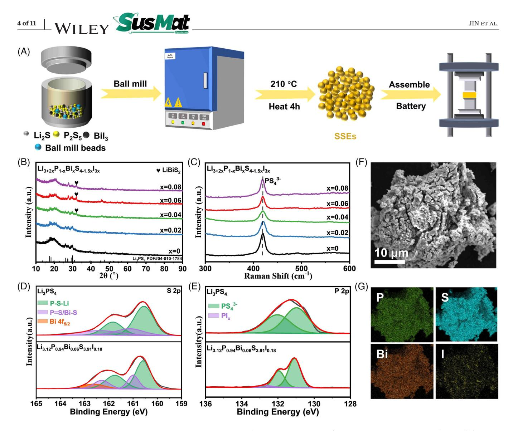
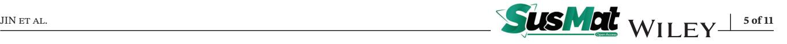
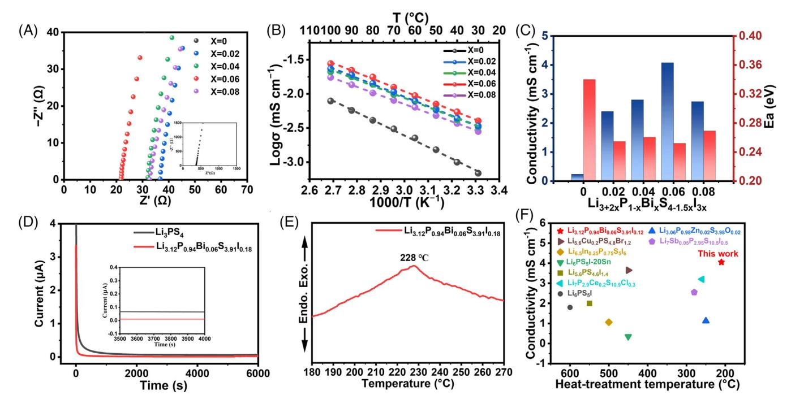
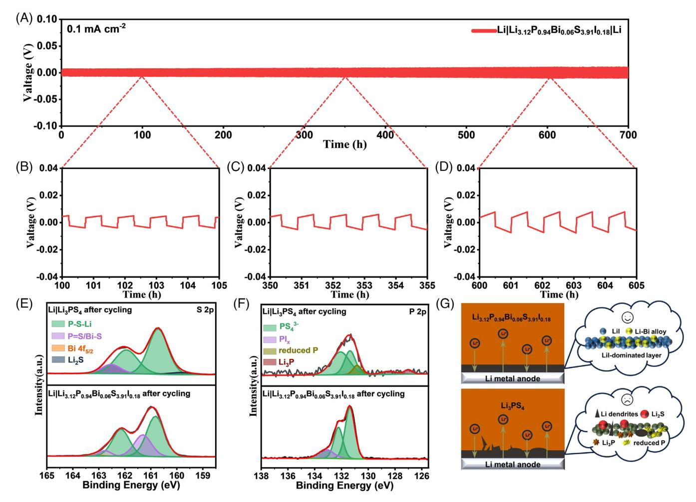
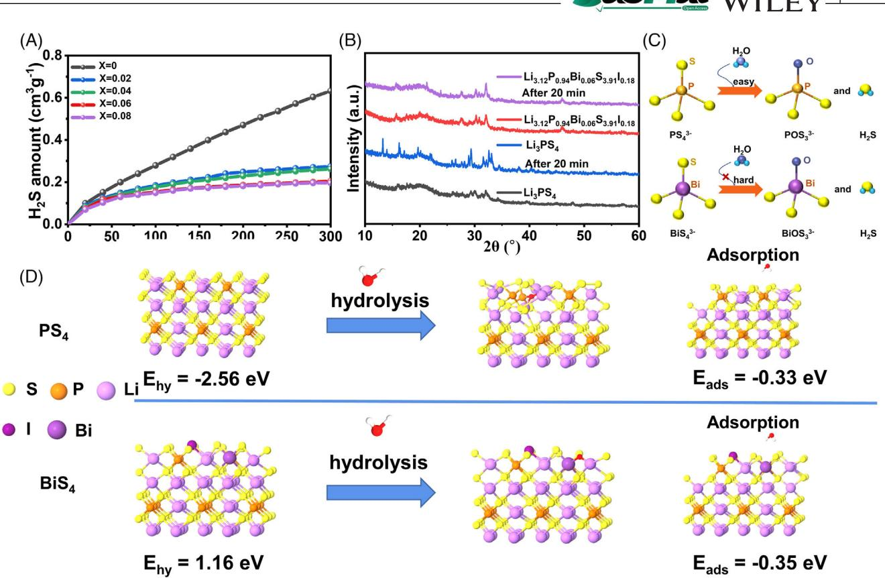
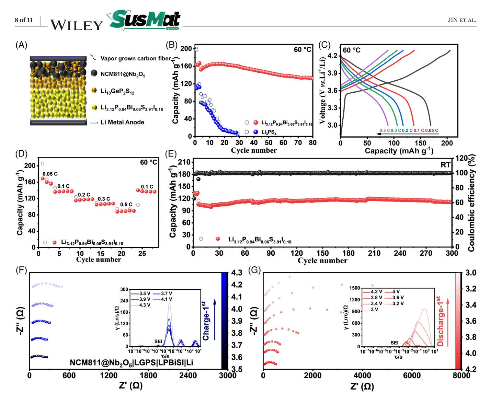

DOI: 10.1002/sus2.218

#### **RESEARCH ARTICLE**

# **Air-stable Li3.12P0.94Bi0.06S3.91I0.18 solid-state electrolyte with high ionic conductivity and lithium anode compatibility toward high-performance all-solid-state lithium metal batteries**

**Daokuan Jin1,2 Haodong Shi2 Yuxin Ma2,3 Yangyang Liu2 Yang Wang1,4 Yanfeng Dong5 Mingbo Wu1,4 Zhong-Shuai Wu2,6**

1 State Key Laboratory of Heavy Oil Processing, Institute of New Energy, College of Chemistry and Chemical Engineering, China University of Petroleum (East China), Qingdao, China

2State Key Laboratory of Catalysis, Dalian Institute of Chemical Physics, Chinese Academy of Sciences, Dalian, China

3University of Chinese Academy of Sciences, Beijing, China

4College of New Energy, China University of Petroleum (East China), Qingdao, China

5Department of Chemistry, College of Sciences, Northeastern University, Shenyang, China

6Dalian National Laboratory for Clean Energy, Chinese Academy of Sciences, Dalian, China

#### **Correspondence**

Haodong Shi and Zhong-Shuai Wu, State Key Laboratory of Catalysis, Dalian Institute of Chemical Physics, Chinese Academy of Sciences, 457 Zhongshan Road, Dalian 116023, China. Email: [hdshi@dicp.ac.cn,](mailto:hdshi@dicp.ac.cn) [wuzs@dicp.ac.cn](mailto:wuzs@dicp.ac.cn)

Mingbo Wu, State Key Laboratory of Heavy Oil Processing, Institute of New Energy, College of Chemistry and Chemical Engineering, China University of Petroleum (East China), Qingdao 266580, China. Email: [wumb@upc.edu.cn](mailto:wumb@upc.edu.cn)

#### **Funding information**

National Natural Science Foundation of China, Grant/Award Numbers: 22125903, 22309177, 22138013, 22208377, 2213000238, 52072409; National Key R&D Program of China, Grant/Award Number: 2022YFA1504100; Energy Revolution S&T Program of Yulin Innovation Institute of Clean Energy, Grant/Award Numbers:

#### **Abstract**

Sulfide solid-state electrolytes (SSEs) with superior ionic conductivity and processability are highly promising candidates for constructing all-solid-state lithium metal batteries (ASSLMBs). However, their practical applications are limited by their intrinsic air instability and serious interfacial incompatibility. Herein, a novel glass-ceramic electrolyte Li3.12P0.94Bi0.06S3.91I0.18 was synthesized by co-doping Li3PS4 with Bi and I for high-performance ASSLMBs. Owing to the strong Bi‒S bonds that are thermodynamically stable to water, increased unit cell volume and Li+ concentration caused by P5+ substitution with Bi3+, and the in situ formed robust solid electrolyte interphase layer LiI at lithium surface, the asprepared Li3.12P0.94Bi0.06S3.91I0.18 SSE achieved excellent air stability with a H2S concentration of only 0.205 cm3 g−1 (after 300 min of air exposure), outperforming Li3PS4 (0.632 cm3 g−1 ) and the most reported sulfide SSEs, together with high ionic conductivity of 4.05 mS cm−1 . Furthermore, the Li3.12P0.94Bi0.06S3.91I0.18 effectively improved lithium metal stability. With this SSE, an ultralong cyclability of 700 h at 0.1 mA cm−2 was realized in a lithium symmetrical cell. Moreover, the Li3.12P0.94Bi0.06S3.91I0.18-based ASSLMBs with LiNi0.8Mn0.1Co0.1O2 cathode achieved ultrastable capacity retention rate of 95.8% after 300 cycles at 0.1 C.

This is an open access article under the terms of the [Creative Commons Attribution](http://creativecommons.org/licenses/by/4.0/) License, which permits use, distribution and reproduction in any medium, provided the original work is properly cited.

© 2024 The Author(s). *SusMat* published by Sichuan University and John Wiley & Sons Australia, Ltd.

E412010508, E411070316; Liaoning Province Applied Basic Research Program, Grant/Award Number: 2022JH2/101300210; Major Scientific and Technological Innovation Project of Shandong Province, Grant/Award Number: 2020CXGC010402; Natural Science Foundation of Shandong Province, Grant/Award Number: ZR2021QE062; Taishan Scholar Project, Grant/Award Number: ts201712020; Fundamental Research Funds for the Central Universities; Dalian Innovation Support Plan for Young and Middle-Aged Science and Technology Talents Innovative, Grant/Award Number: 2022RQ033; DICP, Grant/Award Numbers: DICP I2020032, DICP I202222; Joint Fund of the Yulin University; Dalian National Laboratory for Clean Energy, Grant/Award Number: YLU-DNL Fund 2021002; Exploratory Research Project of Yanchang Petroleum International Limited and DICP, Grant/Award Number: yc-hw-2022ky-01

## **1 INTRODUCTION**

All-solid-state lithium metal batteries (ASSLMBs) represent a promising next-generation battery technology owing to their high energy density and superior safety characteristics in comparison to conventional lithium-ion batteries utilizing organic electrolytes[.1](#page-8-0) As a vital component of ASSLMBs, solid-state electrolytes (SSEs), including oxide, sulfide, and polymer SSEs, have attracted extensive attention and made remarkable breakthroughs over the past decades.[2–5](#page-8-0) Among them, sulfide-based glass-ceramic SSEs such as Li3PS4 have shown great promise for large-scale commercial application due to their straightforward preparation process and excellent ductility, facilitating tight solid‒solid contact through simple cold pressing[.6–11](#page-8-0) However, there are several key issues that are obstructing their development and practical application of sulfide SSEs in ASSLMBs, and the noteworthy one is their low ionic conductivity due to the disordered lattice structures, which limit the overall electrochemical performance of the battery. Additionally, severe side reactions occur between sulfide SSEs and lithium metal anodes, resulting in interfacial incompatibility, lithium dendrite formation, and eventual short-circuiting battery[.12–14](#page-8-0) Moreover, due to the hydrolyzation and generation of H2S toward moisture, the poor air stability of sulfide SSEs usually results in the structure/property degradation and increased fabrication costs[.3,15–20](#page-8-0)

Currently, several effective strategies have been developed to conquer these challenges in glass-ceramic sulfide

This work provides reliable strategy for designing advanced sulfide SSEs for commercial applications in ASSLMBs.

#### **KEYWORDS**

air stability, all-solid-state lithium metal battery, glass-ceramic, lithium metal compatibility, sulfide solid-state electrolyte

> SSEs. Heterovalent element substitution is a typical and effective method to improve the ionic conductivity of SSEs[.21–25](#page-9-0) For instance, Rajagopal et al. partially replaced the P5+ with larger atomic radius and higher polarization of Sb5+, resulting in an improvement in ionic conductivity of Li7P3S11 from 1.40 to 2.55 mS cm−1 . [26](#page-9-0) Meanwhile, hard and soft acids and bases theory has been employed by the strategies of partially or completely replacing the hard acid P5+ with soft acid ions, and replacing S2− with hard base ions to improve the air stability of SSEs[.23–25](#page-9-0) Liu et al. used hard acid Zn2+ and hard base ions O2‒ to partially replace P5+ and S2−, respectively, which in turn enhanced air stability (exposure time 180 min, H2S release 0.018 cm3 g−1 ) of Li3PS4. [27](#page-9-0) Besides, the interface issues between SSEs and lithium metal anodes have been studied to realize their compatibility. In particular, the halide-rich sulfide SSEs can effectively suppress the side reactions and inhibit the growth of lithium dendrites through the in situ formation of a stable solid electrolyte interface (SEI) layer during battery operation[.1,22](#page-8-0) For instance, Li5.7PS4.7Cl1.3 achieved ASSLMBs with high reversible capacities and stable cyclability due to the formation of a LiCl-rich interface[.13](#page-9-0) Despite great progress, it remains a significant challenge to develop an advanced sulfide SSE with superior ionic conductivity, high air stability, and lithium anode compatibility for achieving ASSLMBs with exceptional performance[.28–32](#page-9-0)

> In this work, we report the synthesis of novel glassceramic Li3+2*x*P1−*x*Bi*x*S4−1.5*x*I3*x* (*x* = 0, 0.02, 0.04, 0.06, 0.08) SSEs by co-doping Li3PS4 with BiI3 for

high-performance ASSLMBs. Benefiting from the strong affinity of Bi3+ toward S2−, enlarged lattice volume, high Li+ ion concentration, and in situ formed artificial LiI SEI layer between the lithium metal anode and the SSE, the resulting Li3.12P0.94Bi0.06S3.91I0.18 possesses excellent air stability, high ionic conductivity (4.05 mS cm−1 ), as well as enhanced lithium metal interface compatibility. As a result, the symmetric lithium metal cells using Li3.12P0.94Bi0.06S3.91I0.18 achieved superior dendrite suppression capability up to a high critical current density (CCD) of 0.9 mA cm−2 and ultralong cyclability of 700 h at 0.1 mA cm−2. Moreover, the as-assembled ASSLMBs presented outstanding cycling stability (95.8% capacity retention after 300 cycles) and rate capability (169 mAh g−1 at 0.05 C, 87 mAh g−1 at 0.5 C), showcasing their promising applications for the next-generation high-energy-density ASSLMBs.

## **2 RESULTS AND DISCUSSION**

As shown in Figures [1A](#page-3-0) and S1, a series of Li3+2*x*P1−*x*Bi*x*S4−1.5*x*I3*x* (*x* = 0, 0.02, 0.04, 0.06, 0.08) SSEs were synthesized by ball milling and annealing of Li2S, P2S5, and BiI3. X-ray diffraction (XRD) measurements were performed to determine the effect of Bi and I co-doping amount on the structure of the SSEs (Figure [1B\)](#page-3-0). The intensity of the crystalline peak of Li3PS4 at 31.1◦ gradually weakens until it disappears from *x* = 0.04. In contrast, the peak at 32.05◦ for LiBiS2 appears, while the characteristic peak of BiI3 is not found in the XRD patterns. The overall structure remains relatively unchanged, suggesting successful co-doping of Bi and I into the Li3PS4. Moreover, the Raman spectra provide further insights into the effect of Bi and I co-doping on the Li3PS4. As shown in Figure [1C,](#page-3-0) a characteristic peak at 418 cm−1 corresponds to the PS4 3− tetrahedra, while no peak splitting or new group formation is observed, indicating that the Bi and I co-doping solely influences the P‒S bond without altering the overall structure of PS4 3−. Thus, the model of Li3.12P0.94Bi0.06S3.91I0.18 can be constructed (Figure S2).

Taking Li3.12P0.94Bi0.06S3.91I0.18 as a representative, the chemical bonding information was verified by X-ray photoelectron spectroscopy (XPS). The S 2p spectrum of Li3PS4 can be fitted into two distinct peaks, corresponding to P‒S‒Li (160.5 and 161.8 eV) and P = S bonds (161.1 and 162.4 eV), respectively (Figure [1D\)](#page-3-0)[.14](#page-9-0) The P 2p spectrum peaks of Li3PS4 appear at 131.4 and 132.4 eV owing to the typical PS4 3− (Figure [1E\)](#page-3-0). In the case of Li3.12P0.94Bi0.06S3.91I0.18, except the peaks corresponding to P = S and P‒S‒Li (161 and 162.7 eV), an additional peak primarily arises from the Bi 4f peak, and Bi‒S peak is observed[.14](#page-9-0) Additionally, the increased peak intensity at 162.2 eV is attributed to the overlap of P‒S and Bi‒S peaks, resulting from Bi doping. No discernible difference in this peak between the two SEEs is observed in the Li 1s spectrum (Figure S3). However, one of the sulfur atoms in the PS4 3− unit, originally presenting in Li3PS4, undergoes the substitution with one I atom. This substitution, denoted as PI*x* (132.8 eV), is clearly visible in Figure [1E.](#page-3-0) Moreover, the I 3d spectrum exhibits two peaks at 618 and 630 eV (Figure S4), further confirming the doping of I into Li3PS4. The morphology of SSEs is presented in Figures [1F](#page-3-0) and S5, and both the Li3PS4 and Li3.12P0.94Bi0.06S3.91I0.18 electrolyte particles exhibit irregular shapes with sizes ranging from 10 to 20 µm. The energy dispersive spectroscopy elemental profile of Li3.12P0.94Bi0.06S3.91I0.18 confirmed the uniformly distributed P, S, Bi, and I in the electrolyte particles (Figure [1G\)](#page-3-0), indicating the co-doping of both Bi and I into Li3PS4.

Electrochemical impedance spectroscopy (EIS) was conducted to evaluate the ionic conductivity of the as-prepared Li3+2*x*P1−*x*Bi*x*S4−1.5*x*I3*x* (*x* = 0, 0.02, 0.04, 0.06, 0.08) SSEs. It is evident that Li3.12P0.94Bi0.06S3.91I0.18 (*x* = 0.06) shows the optimal ionic conductivity of 4.05 mS cm−1 , which is one order of magnitude higher than that of Li3PS4 (0.24 mS cm−1 , Figure [2A\)](#page-4-0). Furthermore, the calculated activation energy (*E*a) of Li3.12P0.94Bi0.06S3.91I0.18 is as low as 0.252 eV (Figure [2B,C\)](#page-4-0)[.33](#page-9-0) The high ionic conductivity with low activation barrier of Li3.12P0.94Bi0.06S3.91I0.18 can be attributed to the synergy of increased Li+ concentration, weakened charge interaction between part of Li+ and S2−, and anion site disorder induced by the insertion of I−. [14,26](#page-9-0) However, high amount of BiI3 (*x* = 0.08) tends to induce the formation of impurity phases such as LiI, resulting in the obstructed Li+ migration and a significant increase in the activation energy (*E*a = 0.269 eV). In addition, from the direct current polarization curves, the Li3.12P0.94Bi0.06S3.91I0.18 electrolyte exhibits the lower electronic conductivity of 1.0 × 10−8 S cm−1 compared with Li3PS4 (6.6 × 10−8 S cm−1 ) (Figure [2D\)](#page-4-0), which facilitates to prevent dendrite formation on the Li metal anode[.14](#page-9-0) Moreover, differential thermal analysis of Li3.12P0.94Bi0.06S3.91I0.18 was conducted with a heating rate of 10◦C/min in an argon environment (Figure [2E\)](#page-4-0), in which the crystallization temperature of Li3.12P0.94Bi0.06S3.91I0.18 is determined to be 228◦C. A highly crystalline SSEs can be obtained after annealing at 230◦C for 4 h (Li3.12P0.94Bi0.06S3.91I0.18-230) (Figure S6). However, the EIS plot of Li3.12P0.94Bi0.06S3.91I0.18-230 shows a high impedance of 174 Ω and a low ionic conductivity of only 0.51 mS cm−1 compared to the glass-ceramic SSEs annealed at 210◦C (Li3.12P0.94Bi0.06S3.91I0.18-210) (4.05 mS cm−1 , Figure S7). The enhanced ionic conductivity of glass-ceramic phase is likely due to the self-organization

**FIGURE 1** Preparation and crystal structure characterization of Li3+2*x*P1−*x*Bi*x*S4−1.5*x*I3*x* (*x* = 0, 0.02, 0.04, 0.06, and 0.08) SSEs. (A) Schematic diagram for the preparation of SSEs for all-solid-state lithium metal batteries (ASSLMBs). (B) X-ray diffraction (XRD) patterns and (C) Raman spectra of Li3PS4 and Li3+2*x*P1−*x*Bi*x*S4−1.5*x*I3*x* (*x* = 0.02, 0.04, 0.06, and 0.08). X-ray photoelectron spectroscopy (XPS) spectra of (D) S 2p and (E) P 2p for Li3.12P0.94Bi0.06S3.91I0.18. (F) Scanning electron microscopy (SEM) image and (G) corresponding energy dispersive spectroscopy (EDS) elemental mapping of P, S, Bi, and I for Li3.12P0.94Bi0.06S3.91I0.18.

of microcrystalline glasses into heterogeneous nanostructured domains during the solid-phase reaction[.34](#page-9-0) It is worth noting that the low annealing temperature of 210◦C achieving impressive ionic conductivity, which is obviously lower than the processing temperatures of common SSEs[.3,5,10](#page-8-0) Thus, the synthesis cost can be significantly reduced, endowing Li3+2*x*P1−*x*Bi*x*S4−1.5*x*I3*x*-210 a promising choice for ASSLMBs (Figure [2F\)](#page-4-0)[.35](#page-9-0)

To evaluate the lithium dendrite suppression ability of the SSEs, the Li|Li3+2*x*P1−*x*Bi*x*S4−1.5*x*I3*x*|Li symmetric cells were assembled. Figure S8 shows the voltage curves of lithium plating and stripping, and the initial current density is 0.1 mA cm−2, with the gradual increase in the current density. From the comparison, a sudden voltage drop occurs for Li|Li3PS4|Li symmetric cell (Figure S8a), indicating a CCD value of 0.25 mA cm−2 for Li3PS4. In a sharp contrast, the CCD value of Li|Li3.12P0.94Bi0.06S3.91I0.18|Li symmetric cells reaches a maximum value of 0.9 mA cm−2 (Figure S8d), obviously higher than those of Li|Li3.04P0.98Bi0.02S3.97I0.06|Li (0.25 mA cm−2), Li|Li3.08P0.96Bi0.04S3.94I0.12|Li (0.20 mA cm−2), and Li|Li3.16P0.92Bi0.08S3.88I0.24|Li (0.40 mA cm−2) (Figure S8b‒e), which is attributed to its intrinsic low electronic conductivity and high interface stability between Li metal and SSEs[.36](#page-9-0) The long-term cyclability was also examined by Li metal symmetric cells at a current density of 0.1 mA cm−2 and a capacity of 0.1 mAh cm−2 (Figures [3A](#page-5-0) and S8f). The Li|Li3.12P0.94Bi0.06S3.91I0.18|Li symmetric cell maintains an ultra-stable overpotential of 13 mV without short circuiting for 700 h (Figures [3A‒D](#page-5-0) and S9c,d). However, the Li|Li3PS4|Li cell experiences a significant detectable overpotential alteration only after

**FIGURE 2** Li+ ion dynamics of Li3.12P0.94Bi0.06S3.91I0.18 SSEs. (A) The impendence plots of Li3+2*x*P1‒*x*Bi*x*S4‒1.5*x*I3*x* (*x* = 0.02, 0.04, 0.06, and 0.08) SSEs at room temperature. (B) Arrhenius plots and (C) the relation between the ionic conductivity and activation energy of Li3+2*x*P1−*x*Bi*x*S4−1.5*x*I3*x* (*x* = 0, 0.02, 0.04, 0.06, and 0.08). (D) Direct current (DC) polarization current-time curves of Li3+2*x*P1−*x*Bi*x*S4−1.5*x*I3*x* (*x* = 0 and 0.06) SSEs at a constant voltage of 1 V. (E) Differential thermal analysis (DTA) curve of Li3.12P0.94Bi0.06S3.91I0.18 in an argon atmosphere from 180◦C to 270◦C. (F) Thermal treatment temperature and corresponding ionic conductivity comparison of our Li3.12P0.94Bi0.06S3.91I0.18 with several reported sulfide SSEs.

225 h owing to its poor Li compatibility (Figure S9a,b). Additionally, the Li|Li3.12P0.94Bi0.06S3.91I0.18|Li symmetric cell can cycle steadily at a high current density of 0.25 mA cm‒2 (Figure S10). This indicates that the doping of Bi3+ can inhibit the reaction between electrolyte and lithium dendrites. Moreover, the linear sweep voltammetry profiles from open-circuit voltage to 0 V of Li|SSEs|SSEs/C cells at 0.1 mV s−1 were conducted to evaluate the electrochemical stability of the SSEs with lithium metal anode. Both SSEs started to decrease near the open-circuit voltage, and a significant increase in the specific current with a high integral reduction current (0.11768 VA g−1 ) was observed for the Li3PS4. However, the reduction potential of Li3.12P0.94Bi0.06S3.91I0.18 slightly increased (2.197 V) with an integral current of only 0.08508 A g−1 , indicating the superior Li compatibility of Li3.12P0.94Bi0.06S3.91I0.18 (Figure S11). The chemical stability of Li metal and Li3.12P0.94Bi0.06S3.91I0.18 SSEs was further examined by XPS measurement. As shown in Figure [3E,F,](#page-5-0) distinct Li2S (159.8 eV), reduced P (130.8 eV), and Li3P (127 and 128.5 eV) peaks appear after 100 cycles at the Li|Li3PS4 interface, indicating a severe reduction of Li3PS4 by Li metal (Figure S12). However, a negligible amount of Li2S and Li3P with a low-intensity signal is detected on the Li|Li3.12P0.94Bi0.06S3.91I0.18 interface, along with a stable

Li‒Bi alloy formation (Figure S12a), suggesting that the co-doping of Bi and I significantly enhances interfacial compatibility with Li metal[.14](#page-9-0) Additionally, the increased amount of LiI (630.2 and 618.8 eV) after cycling effectively passivates the active Li metal and inhibits the growth of Li dendrites (Figures [3G,](#page-5-0) S12b, and S4)[.37](#page-9-0)

To validate the air stability of Li3+2*x*P1−*x*Bi*x*S4−1.5*x*I3*x*, this SSE was placed in a sealed container at a temperature of 25◦C and a humidity of 35%. The stability of SSE in the air was determined by monitoring the amount of H2S released from SSEs at different time by an online H2S detector (Figure [4A\)](#page-6-0). It is found that Li3.12P0.94Bi0.06S3.91I0.18 shows minimal change with the H2S concentration of only 0.205 cm3 g−1 after 300 min, after which H2S concentration remains constant thenceforth. In contrast, Li3PS4 exhibits a higher concentration of 0.632 cm3 g−1 at the same time, and the steep slope of the curve indicates a faster H2S release rate. Additionally, it is disclosed that Li3.12P0.94Bi0.06S3.91I0.18 maintains its lamellar shape even after 300 min of exposure to humid air, whereas Li3PS4 experiences severe structural collapse under the same condition, demonstrating the uniqueness of Bi and I co-doping in improving air stability of this sulfide SSE (Figure S13). In addition, structural changes in the SSEs were examined via XRD tests after 20 min

**FIGURE 3** Performance and characterization of Li|Li3.12P0.94Bi0.06S3.91I0.18|Li symmetric cells. (A) Galvanostatic cycling of Li plating/stripping profile for Li|Li3.12P0.94Bi0.06S3.91I0.18|Li symmetric cell at 0.1 mA cm‒2 and 0.1 mAh cm‒2. (BandD) Magnified Li plating/stripping profiles for the cycling periods of (B) 100‒105 h, (C) 350‒355 h, and (D) 600‒605 h. (E and F) X-ray photoelectron spectroscopy (XPS) spectra of (E) S 2p and (F) P 2p for Li3PS4 and Li3.12P0.94Bi0.06S3.91I0.18 SSEs after the Li plating/stripping for 100 cycles. (G) The solid electrolyte interface (SEI) formation mechanism diagram induced by Li3.12P0.94Bi0.06S3.91I0.18 and Li3PS4 SSEs on Li metal anodes.

of exposure to moist air. Impressively, the XRD peaks of Li3.12P0.94Bi0.06S3.91I0.18 remain almost unchanged compared to the pristine sample, indicating that the doping of Bi significantly improves the hydrolysis resistance of Li3PS4-based SSEs. However, a change in the peak shape and the appearance of several new impurity peaks can be observed in the XRD pattern of Li3PS4 (Figure [4B\)](#page-6-0), suggesting partial structural and compositional change of PS4 3− induced by hydrolysis. Notably, the exceptionally high air stability of Li3.12P0.94Bi0.06S3.91I0.18 (0.205 cm3 g−1 ) is superior to that of the most reported representative air-stable sulfide SSEs (Table S3), such as Li6.988P2.994Nb0.2S10.934O0.6 (0.489 cm3 g−1 ),[29](#page-9-0) Li7P2.9Sb0.1S10.75O0.25 (1.02 cm3 g−1 ),[38](#page-9-0) Li7P2.9Ce0.2S10.9Cl0.3 (3.12 cm3 g−1 ),[39](#page-9-0) Li4SnS4 (0.25 cm3 g−1 ),[40](#page-9-0) and Li6.3P0.9Cu0.1S4.9Cl1.1 (0.49 cm3 g−1 )[.41](#page-9-0) Therefore, the partial replacement of the hard acid P with soft acid Bi can greatly enhance the hydrolysis resistance of Li3PS4-based SSEs, demonstrating its high potential for practical application (Figure [4C\)](#page-6-0).

To insightfully understand the improved air stability of Bi-doped Li3PS4, the density generalized function theory calculation was employed to assess both the water hydrolysis reaction energy (∆*E*hy) and adsorption energy (∆*E*ad) (Figure [4D\)](#page-6-0). The hydrolysis reaction of sulfide SSEs typically involves PS4 structural units reaction with H2O. In the case of the Li3.12P0.94Bi0.06S3.91I0.18, two sulfurcontaining structural units (PS4 and BiS4), along with the sulfur-containing structural unit PS3O generated after the hydrolysis reaction, are formed when considering the substitution of Bi at the P-position. Notably, the PS4 has a relatively low ∆*E*hy (−2.56 eV) and ∆*E*ad (−0.33 eV), implying its facile reaction with H2O (Tables S1 and S2). On the contrary, the positive value of ∆*E*hy (1.16 eV) indicates that the hydrolysis reaction of Li3.12P0.94Bi0.06S3.91I0.18 SSEs is

**FIGURE 4** The air stability of Li3.12P0.94Bi0.06S3.91I0.18 solid-state electrolytes (SSEs). (A) The amounts of H2S generated from Li3+2*x*P1−*x*Bi*x*S4−1.5*x*I3*x* (*x* = 0, 0.02, 0.04, 0.06, and 0.08) when exposed to wet air. (B) X-ray diffraction (XRD) patterns of Li3PS4 and Li3.12P0.94Bi0.06S3.91I0.18 after exposure to wet air for 20 min. (C) Schematic diagram of Li3PS4 and Li3.12P0.94Bi0.06S3.91I0.18 when reacted with H2O. (D) The calculated model of adsorption and reaction energies of one water molecule on PS4 and BiS4 units.

thermodynamically unfavorable (Figure 4C), which is consistent with previous experimental results on the enhanced air stability of Li3.12P0.94Bi0.06S3.91I0.18.

To evaluate the applicability of SSEs, the as-synthesized Li3.12P0.94Bi0.06S3.91I0.18 and Li3PS4 SSEs were assembled into ASSLMBs using Nb2O5-coated LiNi0.8Mn0.1Co0.1O2 (NCM811@Nb2O5) cathode and Li metal anode. Li10GeP2S12 SSEs (LGPS) are used as catholytes to ensure sufficient ionic conductivity (Figures [5A](#page-7-0) and S14). The cells were initially cycled at a constant current of 0.1 C (1 C = 200 mAh g−1 ) in the voltage range of 3.0‒4.3 V at 60◦C. Figure S15 exhibits the typical charge-discharge voltage curves of the ASSLMBs. The initial discharge capacity of ASSLMBs with Li3.12P0.94Bi0.06S3.91I0.18 SSE is 163.6 mAh g‒1 with a high coulombic efficiency of 79.5%. Importantly, a high capacity retention rate of 86.8% is maintained after 80 cycles. By contrast, as for the battery with the Li3PS4, the capacity is only 77 mAh g‒1 with a low capacity retention of 60.3% after 15 cycles (Figures [5B](#page-7-0) and S16). Moreover, a significant voltage polarization with a low initial coulombic efficiency of only 55.35% is observed. Furthermore, the discharge capacities of the NCM811@Nb2O5|LGPS|Li3.12P0.94Bi0.06S3.91I0.18|Li cell are 169, 136, 115, 105, and 87 mAh g−1 at 0.05, 0.1, 0.2, 0.3, and 0.5 C (Figure [5C,D\)](#page-7-0), respectively, and the capacity can recover to 140 mAh g−1 when the current density shifts back to 0.1 C, suggesting excellent rate capability of the Li3.12P0.94Bi0.06S3.91I0.18 electrolyte-based ASSLMBs. Besides, the cyclability of ASSLMBs was also measured at room temperature. As depicted in Figures [5E](#page-7-0) and S17, the NCM811@Nb2O5|LGPS|Li3.12P0.94Bi0.06S3.91I0.18|Li cell shows a reversible capacity of 111 mAh g−1 and impressive capacity retention of 95.8% after 300 cycles at 0.1 C, which is superior to those of most reported sulfidebased ASSLMBs, such as NCM622|Li6PS5Cl‒Li2ZrCl6|Li (0.3 C, 70 cycles, capacity retention 87.10%)[,42](#page-9-0) NCM532@LNO|Li6P0.925Sb0.075S5Cl|Li (0.2 C, 60 cycles, capacity retention 82.60%),[43](#page-9-0) and NCM523@LNO|Li6.04P0.98Bi0.02S4.97O0.03Cl|Li (0.1 C, 60 cycles, capacity retention 88.60%) (Tables S4)[.44](#page-9-0)

Subsequently, an in situ impedance test was conducted on the ASSLMBs to elucidate the underlying electrochemical distinctions. The charge and discharge processes were examined at various cut-off voltages. During the charging process, the increase in the cut-off voltages results in a higher total impedance for both

**FIGURE 5** Electrochemical performance of Li3.12P0.94Bi0.06S3.91I0.18-based all-solid-state lithium metal batteries (ASSLMBs). (A) Schematic diagram of NCM811@Nb2O5|LGPS|Li3.12P0.94Bi0.06S3.91I0.18|Li ASSLMBs. (B) Cyclic performance of NCM811@Nb2O5|LGPS|Li3PS4|Li and NCM811@Nb2O5|LGPS|Li3.12P0.94Bi0.06S3.91I0.18|Li cells obtained at 0.1 C (1 C = 200 mAh g−1 ) at 60◦C between 3.0 and 4.3 V. (C) Galvanostatic charge and discharge profiles and (D) rate capability of NCM811@Nb2O5|LGPS|Li3.12P0.94Bi0.06S3.91I0.18|Li cell from 0.1 to 0.5 C measured at 60◦C. (E) The cycling performance of NCM811@Nb2O5|LGPS|Li3.12P0.94Bi0.06S3.91I0.18|Li cell at 0.1 C and 25◦C. (F and G) Interfacial impedance evolution and the corresponding distribution of relaxation time (DRT) profiles under different (F) states of charge (SOC) and (G) states of discharge (SOD) in the first cycle.

batteries (Figures 5F and S18a). In the discharge process, the total impedances of both battery setups significantly increase at shallower discharge depths (Figures 5G and S18b), aligning with findings from previous studies[.45](#page-9-0) It is evident that NCM811@Nb2O5|LGPS|Li3PS4|Li maintains a high initial impedance, and the impedance of the battery is significantly increased during the subsequent charge and discharge process. In contrast, NCM811@Nb2O5LGPS|Li3.12P0.94Bi0.06S3.91I0.18|Li exhibited a lower initial impedance (265 Ω), attributed to the higher ionic conductivity of Li3.12P0.94Bi0.06S3.91I0.18. Additionally, as the depth of subsequent charge and discharge processes increases, the Li3.12P0.94Bi0.06S3.91I0.18-based battery sustains lower impedance due to the formation of a stable SEI between SSE and Li metal without serious side reactions. To gain more intuitive understanding of resistance changes of the battery during different states of charge (SOC) and states of discharge (SOD) preprocess, the distribution of relaxation time curves was analyzed.[44](#page-9-0) In terms of time constant, the bulk resistance (*R*SE-bulk) of the solid electrolyte layer is distributed between 10−7 and 10−6 s, and Li3PS4 shows higher bulk resistance than that of Li3.12P0.94Bi0.06S3.91I0.18, corresponding to its larger initial impedance. The grain boundary impedance between the solid electrolyte particles is roughly distributed between 10−6 and 10−5 s, and these two batteries maintain low impedance. The impedance of SEI falls in the range of 10−4 to 10−3 s (Figures 5F and S18a). Compared to the NCM811@Nb2O5|LGPS|Li3PS4|Li, which has a high impedance, the SEI impedance of NCM811@Nb2O5|LGPS|Li3.12P0.94Bi0.06S3.91I0.18|Li remains extremely low (5.3‒10.1 Ω) during the charge and discharge processes (Figure [5F,G\)](#page-7-0). This is mainly attributed to the formation of a stable SEI layer, further demonstrating excellent interfacial compatibility of Li|Li3.12P0.94Bi0.06S3.91I0.18 during long-term cycling[.46](#page-10-0)

## **3 CONCLUSION**

In summary, we report an air-stable Li3.12P0.94Bi0.06S3.91I0.18 glass-ceramic SSE obtained by co-doping Li3PS4 with Bi and I for high-performance ASSLMBs. Owing to the increased Li+ concentration, weakened electronegativity between Li+ and S2−, and anion site-disorder induced from I, the resulting SSE shows greatly enhanced ionic conductivity of 4.05 mS cm−1 . Furthermore, the introduction of BiI also improved the Li dendrite suppression capability and air stability induced from the in situ formed robust SEI (LiI and Li‒Bi alloy) and strong covalent bonding of Bi‒S bonds. Consequently, the Li symmetric cell-based Li3.12P0.94Bi0.06S3.91I0.18 SSEs shows an ultrahigh CCD value of 0.9 mA cm−2 and ultralong cyclability of 700 h at 0.1 mA cm−2. The corresponding ASSLMBs exhibit a high discharge capacity of 111 mAh g−1 , and remain 95.8% of the initial capacity after 300 cycles at 0.1 C. This work demonstrates that the Bi and I co-doping strategy is a reliable direction to develop air-stable sulfide-based SSEs for ASSLMBs with high energy density and long cyclability.

## **4 EXPERIMENTAL**

The experimental details and characterizations are provided in the Supporting Information.

#### **ACKNOWLEDGMENTS**

This work was financially supported by the National Natural Science Foundation of China (grant nos. 22125903, 22309177, 22138013, 22208377, 2213000238, and 52072409), the National Key R&D Program of China (grant 2022YFA1504100), the Energy Revolution S&T Program of Yulin Innovation Institute of Clean Energy (grant nos. E412010508 and E411070316), the Liaoning Province Applied Basic Research Program (2022JH2/101300210), the Major Scientific and Technological Innovation Project of Shandong Province (2020CXGC010402), the Natural Science Foundation of Shandong Province (ZR2021QE062), the Taishan Scholar Project (ts201712020), the Fundamental Research Funds for the Central Universities, Dalian Innovation Support Plan for Young and Middle-Aged Science and Technology Talents Innovative (2022RQ033), DICP (DICP I2020032 and DICP I202222), the Joint Fund of the Yulin University and the Dalian National Laboratory for Clean Energy (YLU-DNL Fund 2021002), and the Exploratory Research Project of Yanchang Petroleum International Limited and DICP (yc-hw-2022ky-01).

### **CONFLICT OF INTEREST STATEMENT** The authors declare no conflict of interest.

## **ORCID**

*Yanfeng Dong* <https://orcid.org/0000-0002-4916-428X> *Zhong-ShuaiWu* [https://orcid.org/0000-0003-1851-](https://orcid.org/0000-0003-1851-4803) [4803](https://orcid.org/0000-0003-1851-4803)

#### **REFERENCES**

- 1. Chen R, Li Q, Yu X, Chen L, Li H. Approaching practically accessible solid-state batteries: stability issues related to solid electrolytes and interfaces. *Chem Rev*. 2020;120(14):6820- 6877.
- 2. Xia W, Zhao Y, Zhao F, et al. Antiperovskite electrolytes for solid-state batteries. *Chem Rev*. 2022;122(3):3763-3819.
- 3. Zhao Q, Liu X, Stalin S, Khan K, Archer LA. Solid-state polymer electrolytes with in-built fast interfacial transport for secondary lithium batteries. *Nat Energy*. 2019;4(5):365-373.
- 4. Zhao B-S, Chen P, Gao X-P. Bulk and interface-strengthened Li7P2.9Sb0.1S10.65O0.15I0.2 electrolyte via dual-source doping for all-solid-state lithium-sulfur batteries. *Sci China Mater*. 2022;66(2):513-521.
- 5. Lee YG, Fujiki S, Jung C, et al. High-energy long-cycling allsolid-state lithium metal batteries enabled by silver‒carbon composite anodes. *Nat Energy*. 2020;5(4):299-308.
- 6. Xu R, Han F, Ji X, Fan X, Tu J, Wang C. Interface engineering of sulfide electrolytes for all-solid-state lithium batteries. *Nano Energy*. 2018;53:958-966.
- 7. Su Y, Zhang X, Du C, et al. An all-solid-state battery based on sulfide and PEO composite electrolyte. *Small*. 2022;18(29):2202069.
- 8. Gil-González E, Ye L, Wang Y, et al. Synergistic effects of chlorine substitution in sulfide electrolyte solid state batteries. *Energy Storage Mater*. 2022;45:484-493.
- 9. Zhou X, Zhang Y, Shen M, et al. A highly stable Li-organic all-solid-state battery based on sulfide electrolytes. *Adv Energy Mater*. 2022;12(14):2103932.
- 10. Yang Z, Wang F, Hu Z, et al. Room-temperature allsolid-state lithium‒organic batteries based on sulfide electrolytes and organodisulfide cathodes. *Adv Energy Mater*. 2021;11(48):2102962.
- 11. Li X, Liang J, Li X, et al. High-performance all-solid-state Li‒Se batteries induced by sulfide electrolytes. *Energy Environ Sci*. 2018;11(10):2828-2832.
- 12. Otoyama M, Sakuda A, Tatsumisago M, Hayashi A. Sulfide electrolyte suppressing side reactions in composite positive electrodes for all-solid-state lithium batteries. *ACS Appl Mater Interfaces*. 2020;12(26):29228-29234.

JIN et al. **9 of 11**

- 13. Zeng D, Yao J, Zhang L, et al. Promoting favorable interfacial properties in lithium-based batteries using chlorine-rich sulfide inorganic solid-state electrolytes. *Nat Commun*. 2022;13(1):1909.
- 14. Kato Y, Hori S, Saito T, et al. High-power all-solid-state batteries using sulfide superionic conductors. *Nat Energy*. 2016;1(4):16030.
- 15. Ni Y, Huang C, Liu H, Liang Y, Fan LZ. A high air-stability and Li-metal-compatible Li3+2*x*P1−*x*Bi*x*S4−1.5*x*O1.5*x* sulfide electrolyte for all-solid-state Li‒metal batteries. *Adv Funct Mater*. 2022;32(41):2205998.
- 16. Lee JE, Park KH, Kim JC, et al. Universal solution synthesis of sulfide solid electrolytes using alkahest for all-solid-state batteries. *Adv Mater*. 2022;34(16):2200083.
- 17. Zuo TT, Walther F, Ahmed S, et al. Formation of an artificial cathode‒electrolyte interphase to suppress interfacial degradation of Ni-rich cathode active material with sulfide electrolytes for solid-state batteries. *ACS Energy Lett*. 2023;8(3):1322-1329.
- 18. Jung SK, Gwon H, Lee SS, et al. Understanding the effects of chemical reactions at the cathode‒electrolyte interface in sulfide based all-solid-state batteries.*J Mater Chem A*. 2019;7(40):22967- 22976.
- 19. Oh P, Yun J, Choi JH, et al. Development of high-energy anodes for all-solid-state lithium batteries based on sulfide electrolytes. *Angew Chem Int Ed*. 2022;61(25):202201249.
- 20. Yan W, Mu Z, Wang Z, et al. Hard-carbon-stabilized Li‒Si anodes for high-performance all-solid-state Li-ion batteries. *Nat Energy*. 2023;8(8):800-813.
- 21. Ma Y, Wang L, Fu S, et al. Situ formation of a Li‒Sn alloy protected layer for inducing lateral growth of dendrites. *J Mater Chem A*. 2020;8(44):23574-23579.
- 22. Kang J, Deng N, Liu Y, et al. Recent advances of anode protection in solid-state lithium metal batteries. *Energy Storage Mater*. 2022;52:130-160.
- 23. Li Y, Arnold W, Thapa A, et al. Stable and flexible sulfide composite electrolyte for high-performance solid-state lithium batteries. *ACS Appl Mater Interfaces*. 2020;12(38):42653-42659.
- 24. Lu P, Wu D, Chen L, Li H, Wu F. Air stability of solidstate sulfide batteries and electrolytes. *Electrochem Energy Rev*. 2022;5(3).
- 25. Liu H, Liang Y, Wang C, et al. Priority and prospect of sulfide-based solid-electrolyte membrane. *Adv Mater*. 2023;35(50):2206013.
- 26. Rajagopal R, Cho JU, Subramanian Y, et al. Preparation of highly conductive metal doped/substituted Li7P2S8Br1‒*x*I*x* type lithium superionic conductor for all-solid-state lithium battery applications. *Chem Eng J*. 2022;428:13215.
- 27. Liu G, Xie D, Wang X, et al. High air-stability and superior lithium ion conduction of Li3+3*x*P1‒*x*Zn*x*S4‒*x*O*x* by aliovalent substitution of ZnO for all-solid-state lithium batteries. *Energy Storage Mater*. 2019;17:266-274.
- 28. Jiang Z, Liu Y, Peng H, et al. Enhanced air stability and interfacial compatibility of Li-argyrodite sulfide electrolyte triggered by CuBr co-substitution for all-solid-state lithium batteries. *Energy Storage Mater*. 2023;56:300-309.
- 29. Ahmad N, Zhou L, Faheem M, et al. Enhanced air stability and high Li-ion conductivity of Li6.988P2.994Nb0.2S10.934O0.6 glassceramic electrolyte for all-solid-state lithium‒sulfur batteries. *ACS Appl Mater Interfaces*. 2020;12(19):21548-21558.
- 30. Lu P, Liu L, Wang S, et al. Superior all-solid-state batteries enabled by a gas-phase-synthesized sulfide electrolyte with ultrahigh moisture stability and ionic conductivity. *Adv Mater*. 2021;33(32):2100921.
- 31. Rui X, Ren D, Liu X, et al. Distinct thermal runaway mechanisms of sulfide-based all-solid-state batteries. *Energy Environ Sci*. 2023;16(8):3552-3563.
- 32. Ma T, Wang Z, Wu D, et al. High-areal-capacity and long-cyclelife all-solid-state battery enabled by freeze drying technology. *Energy Environ Sci*. 2023;16(5):2142-2152.
- 33. Crapse J, Pappireddi N, Gupta M, Shvartsman SY, Wieschaus E, Wuhr M. Evaluating the Arrhenius equation for developmental processes. *Mol Syst Biol*. 2021;17(8):9895.
- 34. Lu P, Xia Y, Huang Y, et al. Wide-temperature, long-cycling, and high-loading pyrite all-solid-state batteries enabled by argyrodite thioarsenate superionic conductor. *Adv Funct Mater*. 2022;33(8):2211211.
- 35. Hong M, Dong Q, Xie H, et al. Ultrafast sintering of solid-state electrolytes with volatile fillers. *ACS Energy Lett*. 2021;6(11):3753- 3760.
- 36. Kim MJ, Choi IH, Jo SC, et al. A novel strategy to overcome the hurdle for commercial all-solid-state batteries via low-cost synthesis of sulfide solid electrolytes. *Small Methods*. 2021;5(11):2100793.
- 37. Yi S, Su Z, Zhang W, et al. An ion-released MgI2-doped separator inducing a LiI-containing solid electrolyte interphase for dendrite-free Li metal anodes. *J Energy Chem*. 2022;75:83-94.
- 38. Zhao BS, Wang L, Chen P, et al. Congener substitution reinforced Li7P2.9Sb0.1S10.75O0.25 glass-ceramic electrolytes for allsolid-state lithium-sulfur batteries. *ACS Appl Mater Interfaces*. 2021;13(29):34477-34485.
- 39. Zhou L, Tufail MK, Ahmad N, Song T, Chen R, Yang W. Strong interfacial adhesion between the Li2S cathode and a functional Li7P2.9Ce0.2S10.9Cl0.3 solid-state electrolyte endowed long-term cycle stability to all-solid-state lithium‒sulfur batteries. *ACS Appl Mater Interfaces*. 2021;13(24):28270-28280.
- 40. Kanazawa K, Yubuchi S, Hotehama C, et al. Mechanochemical synthesis and characterization of metastable hexagonal Li(4)SnS(4) solid electrolyte. *Inorg Chem*. 2018;57(16):9925-9930.
- 41. Taklu BW, Su WN, Nikodimos Y, et al. Dual CuCl doped argyrodite superconductor to boost the interfacial compatibility and air stability for all solid-state lithium metal batteries. *Nano Energy*. 2021;90:106542.
- 42. Zhang H, Yu Z, Cheng J, Chen H, Huang X, Tian B. Halide/sulfide composite solid-state electrolyte for Lianode based all-solid-state batteries. *Chin Chem Lett*. 2023;34(11):108228.
- 43. Liu H, Zhu Q, Liang Y, et al. Versatility of Sb-doping enabling argyrodite electrolyte with superior moisture stability and Li metal compatibility towards practical all-solid-state Li metal batteries. *Chem Eng J*. 2023;462:142183.
- 44. Liu H, Zhu Q, Wang C, et al. High air stability and excellent Li metal compatibility of argyrodite-based electrolyte enabling superior all-solid-state Li metal batteries. *Adv Funct Mater*. 2022;32(32):2203858.
- 45. Wei C, Liu X, Yu C, et al. Revealing performance of 78Li2S‒22P2S5 glass ceramic based solid-state batteries at different operating temperatures. *Chin Chem Lett*. 2023;34(7):107859.

46. Lu Y, Zhao CZ, Huang JQ, Zhang Q. The timescale identification decoupling complicated kinetic processes in lithium batteries. *Joule*. 2022;6(6):1172-1198.

## **SUPPORTING INFORMATION**

Additional supporting information can be found online in the Supporting Information section at the end of this article.

JIN et al. **11 of 11**

**How to cite this article:** Jin D, Shi H, Ma Y, et al. Air-stable Li3.12P0.94Bi0.06S3.91I0.18 solid-state electrolyte with high ionic conductivity and lithium anode compatibility toward high-performance all-solid-state lithium metal batteries. *SusMat*. 2024;4:e218. <https://doi.org/10.1002/sus2.218>