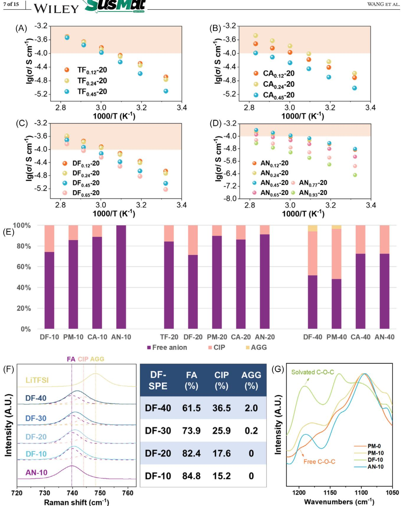
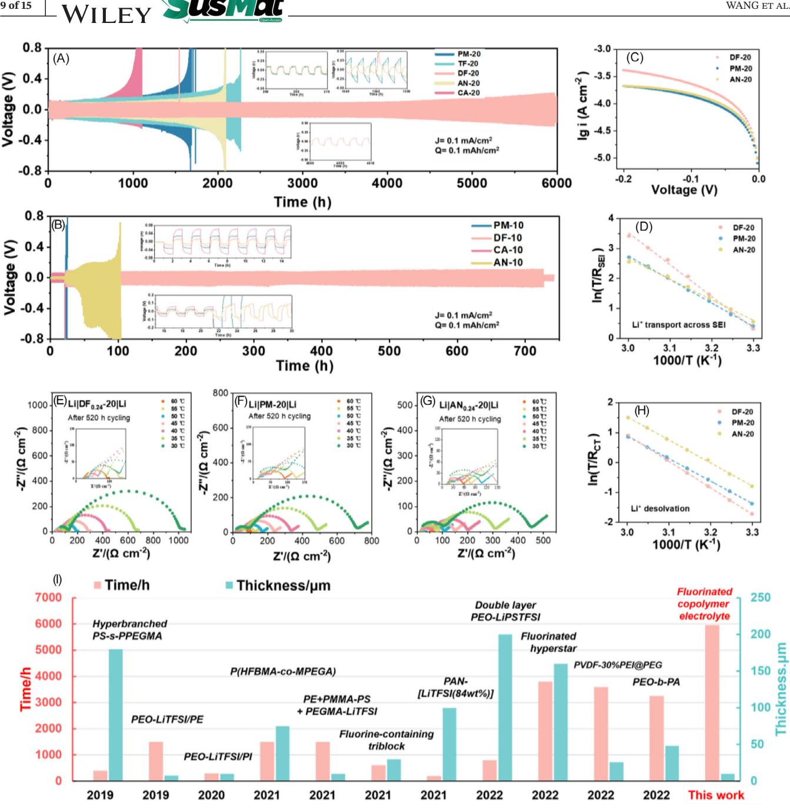
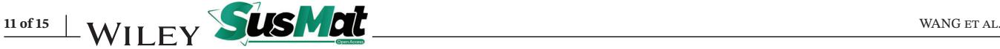
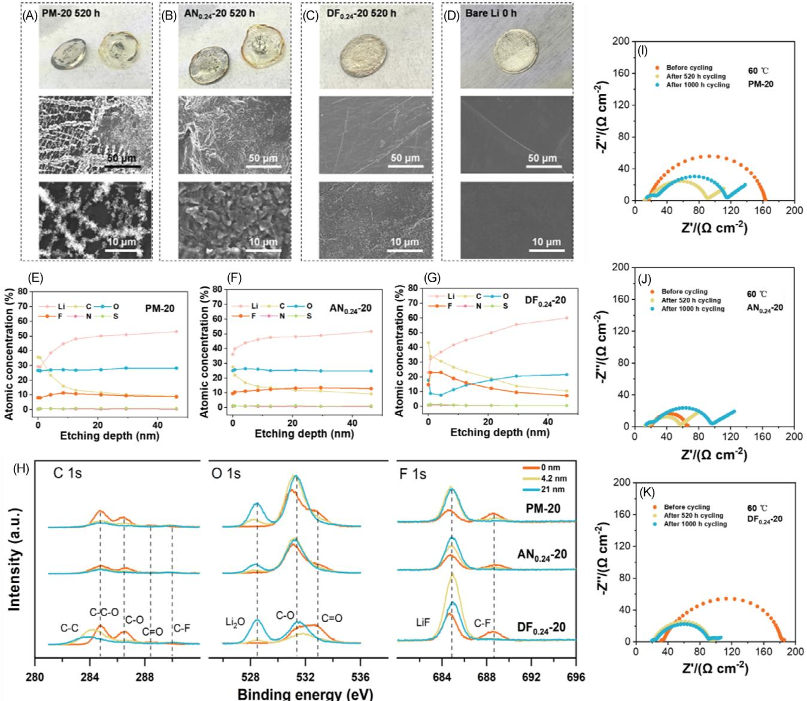
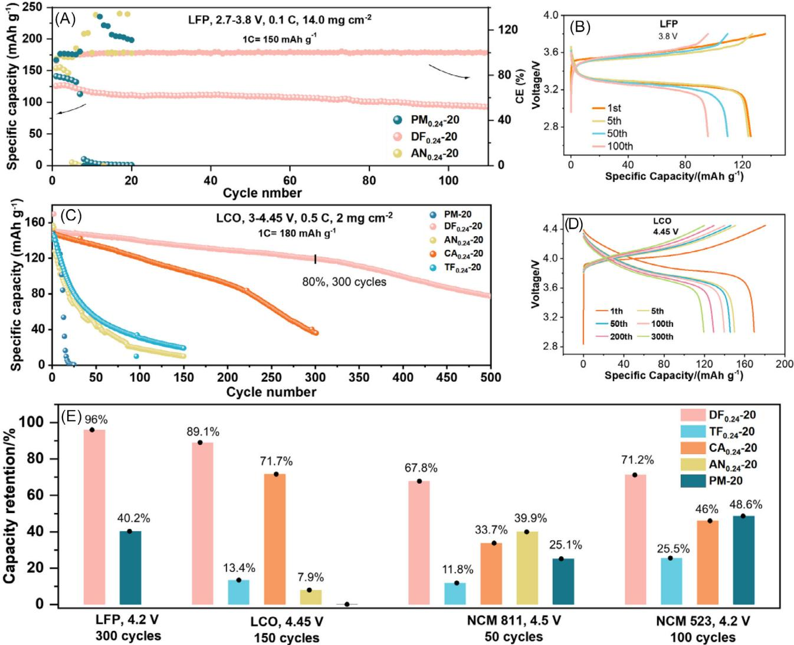
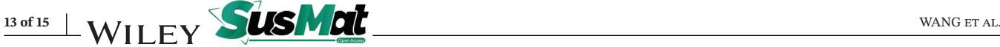

#### **RESEARCH ARTICLE**

## **Designing weakly and strongly solvating polymer electrolytes: Systematically boosting high-voltage lithium metal batteries**

| Wang1 Tianyi   | Zhang1 Huang2 Yimeng Xueyan | Su1 Xiao1 Peifeng Min |
|-------------------|--------------------------------------|--------------------------------|
| Wang1 Shuanjin | Huang1 Han1,3 Sheng Dongmei | Meng1,3,4 Yuezhong          |

1 The Key Laboratory of Low-carbon Chemistry & Energy Conservation of Guangdong Province, State Key Laboratory of Optoelectronic Materials and Technologies, School of Materials Science and Engineering, Sun Yat-sen University, Guangzhou, China

2Department of Chemical Engineering, Tsinghua University, Beijing, China

3School of Chemical Engineering and Technology, Sun Yat-sen University, Zhuhai, China

4Institute of Chemistry, Henan Provincial Academy of Sciences, Zhengzhou, China

#### **Correspondence**

Dongmei Han and Yuezhong Meng, The Key Laboratory of Low-carbon Chemistry & Energy Conservation of Guangdong Province, State Key Laboratory of Optoelectronic Materials and Technologies, School of Materials Science and Engineering, Sun Yat-sen University, Guangzhou 510275, P. R. China. Email: [handongm@mail.sysu.edu.cn](mailto:handongm@mail.sysu.edu.cn) and [mengyzh@mail.sysu.edu.cn](mailto:mengyzh@mail.sysu.edu.cn)

#### **Funding information**

National Key Research and Development Program, Grant/Award Number: 2019YFA0705701; National Natural Science Foundation of China, Grant/Award Numbers: 22179149, 22075329, 22008267, 51573215, 21978332; Guangdong Basic and Applied Basic Research Foundation, Grant/Award Number: 2021A0505030022; Research and Development Project of Henan Academy of Sciences China, Grant/Award Number: 232018002

#### **Abstract**

Practical high-voltage lithium metal batteries hold promise for high energy density applications, but face stability challenges in electrolytes for both 4 Vclass cathodes and lithium anode. To address this, we delve into the positive impacts of two crucial moieties in electrolyte chemistry: fluorine atom (-F) and cyano group (-CN) on the electrochemical performance of polyether electrolytes and lithium metal batteries. Cyano-bearing polyether electrolytes possess strong solvation, accelerating Li+ desolvation with minimal SEI impact. Fluorinated polyether electrolytes possess weak solvation, and stabilize the lithium anode via preferential decomposition of F-segment, exhibiting nearly 6000-h stable cycling of lithium symmetric cell. Furthermore, the electron-withdrawing properties of -F and -CN groups significantly bolster the high-voltage tolerance of copolymer electrolyte, extending its operational range up to 5 V. This advancement enables the development of 4 V-class lithium metal batteries compatible with various cathodes, including 4.45 V LiCoO2, 4.5 V LiNi0.8Co0.1Mn0.1O2, and 4.2 V LiNi0.5Co0.2Mn0.3O2. These findings provide insights into design principles centered around polymer components for high-performance polymer electrolytes.

#### **KEYWORDS**

cyano-bearing copolymer electrolyte, fluorinated copolymer electrolyte, high-voltage lithium metal battery, in situ polymerization, solvation

This is an open access article under the terms of the [Creative Commons Attribution](http://creativecommons.org/licenses/by/4.0/) License, which permits use, distribution and reproduction in any medium, provided the original work is properly cited.

© 2024 The Author(s). *SusMat* published by Sichuan University and John Wiley & Sons Australia, Ltd.

## **1 INTRODUCTION**

The increasing demand for power applications and energy storage has spurred the search for next-generation battery technologies due to the nearing limits of specific energy in lithium-ion batteries[.1,2](#page-13-0) Solid-state lithium metal batteries (LMBs), as post-lithium-ion technologies[,3](#page-13-0) have garnered considerable attention in recent years. Despite its ultrahigh specific capacity (3860 mAh/g), lithium metal faces challenges due to uncontrollable parasitic reactions with electrolytes, leading to poor cycle life and safety concerns in LMBs.[4](#page-13-0) Solid polymer electrolytes (SPEs) hold promise to address these issues due to their adjustable components and molecular structures[.5–9](#page-13-0) Various polymer structures, such as fluoropolymer,[10–14](#page-13-0) cyano-bearing polymer[,15](#page-13-0) polysiloxane,[16](#page-13-0) and polyanion electrolyt[e17,18](#page-13-0) have been investigated to unlock the potential of SPEs. Further research is required to fully exploit and integrate the functionalities/advantages of SPEs, including Li anode stability[,19,20](#page-13-0) high-voltage stability[,21](#page-13-0) high ionic conductivity, high mechanical strength[,22–24](#page-13-0) and in situ process availability, to bring them closer to practical applications. To achieve this, advanced strategies, such as asymmetric SPE[s25–27](#page-13-0) and phase-separated block copolymer electrolytes,[28,29](#page-13-0) are being explored to merge these beneficial attributes.

In the past decade, fluorination of solvent and Li salt has become as a common strategy for stabilizing Li anode by forming stable solid electrolyte interface (SEI) containing abundant LiF[.30–33](#page-13-0) Innovation of high concentrated electrolytes (HCEs)[,34](#page-13-0) localized high concentrated electrolytes (LHCEs)[,35](#page-13-0) and weakly solvating electrolyte (WSE[\)36](#page-13-0) have verified that special Li+ solvation structures contribute to the formation of anion-derived SEI. Understanding the decomposition of fluorine resource is significant and can guide electrolyte design[.33,37](#page-13-0) Besides, Li3N has been identified as an advantageous constituent of SEI with a lower ion transport energy barrier compared to LiF[.38,39](#page-14-0) Various N-sources introduction, such as cyano-containing electrolytes[,40](#page-14-0) amine[,41](#page-14-0) and LiNO3 [42,43](#page-14-0) have been reported for forming Li3N-rich SEI. Furthermore, acetonitrilebased electrolytes possess fast ion-conduction capability with high ionic conductivity more than 40 mS/cm at room temperature[.44,45](#page-14-0) Many studies on SPEs focus on designing precise molecular sequences through linear and nonlinear block copolymerization. However, for practical applications, we are more interested in the free control of polymeric components through in situ random copolymerization, which offers advantages such as mitigating interfacial issues and reducing post-processing procedures.[46,47](#page-14-0) Furthermore, random copolymerization allows precise variation of composition and ensures the homogeneity of the polymer chain.

WANG et al. **2 of 15**

In this study, we explore the implications of incorporating two distinct functional groups, fluorine (-F) and cyano group (-CN), into a conventional polyether-based electrolyte, specifically poly(methoxypoly(ethylene glycol) acrylate/lithium bis(trifluoromethanesulfonyl)imide, denoted as PMPEGA/LiTFSI, hereinafter referred to as PM-SPE. Through in situ copolymerization, the fluorinated and cyano-bearing polymer electrolytes exhibit enhanced electrochemical stability when tested with 4 V cathodes and Li anode. These electrolytes demonstrate different solvating effects, with the fluorinated electrolytes classified as weakly solvating polymer electrolytes (WSPEs) and the cyano-bearing electrolytes as strongly solvating polymer electrolytes (SSPEs). These distinct characteristics arise from the similar yet different effects of the -F and -CN. They are electron-withdrawing groups, but differentiated at polarizability. It is interesting to clarify the properties of SPEs with varying components and obtain the inspired design principal for practical SPEs.

#### **2 RESULTS AND DISCUSSION**

#### **2.1 Nomenclature**

Note of monomers: DFA, c; TFA, 2,2,2-trifluoroethyl; CA, 2-cyanoethyl acrylate; acrylate AN, acrylonitrile. Five types of in situ copolymerized SPEs were studied in the article: (i) DF-SPEs: P(DFA*x*-*r*-MPEGA1-*x*) + Y wt% LiTFSI, abbreviated as DF*x*-Y; *x* refers to mole ratio of DFA monomer. The same naming convention applies to the series of electrolytes: (ii) TF-SPEs, TF*x*-Y; (iii) CA-SPEs, CA*x*-Y; (iv) AN-SPEs, AN*x*-Y; and (v) PM-SPEs, PM-Y. For exploration purposes, different *x* values (0.12, 0.24, 0.45, 0.65) and *Y* values (5, 10, 20, 30, 40, 50) are employed.

#### **2.2 Highlight sketch**

All investigations to "Structure–Properties" correlations begin with the finding for astonishing electrochemical performance of the designed WSPEs (DF, TF-SPE) and SSPEs (AN, CA-SPE). The following items convey main findings and advances compared with conventional PM-SPE:

(1) DF-SPEs and TF-SPEs are weakly solvating electrolytes with a higher proportion of CIP and AGGs. DF-SPE enhances the formation of LiF-rich SEI through the preferential decomposition of fluorinated side chains (at 1.5 V vs. potential of Li/Li+) and anions, leading to the improved cycling stability. AN-SPEs and CA-SPEs are strongly solvating electrolytes with higher ionic conductivity, and promote the desolvation process of lithium ions, but they cannot form a stable SEI.

- (2) Cycling stability of Li||Li cells. DF0.24-20 >> TF0.24- 20 > AN0.24-20 > PM-20 > CA0.24-20 with *J* = 0.1 mA/cm2, *Q* = 0.1 mA/cm2 at 60◦C. Notably, the cell applying DF0.24-20 exhibits nearly 6000 h ultrastable cycling, with a long-period stable overpotential (90–180 mV) for 300–5000 h.
- (3) Enhanced high-voltage LMBs. The oxidation voltage follows the order: DF-SPEs, TF-SPEs (5.0 V) > CA-SPEs (4.9 V) > AN-SPEs∼PM-SPEs (4.2 V). Various high-voltage cathodes, including LiCoO2 (LCO), LiNi0.8Co0.1Mn0.1O2 (NCM 811), and LiNi0.5Co0.2Mn0.3O2 (NCM 523) were applied to evaluate full cell performances. Li|DF0.24-20|LCO cell shows 80% capacity retention after 300 cycles. Li|DF0.24-20|NCM 811 and Li|DF0.24-20|NCM 523 also displayed great improvements compared with PM-20.

## **2.3 Design rationale of weakly and strongly solvating polymer electrolytes**

The main limitations of polyether electrolyte PM-SPEs lie in three aspects: (i) potential crystallization even mixed with Li salt; (ii) sustained parasitic reaction at the Li|SPE interface owing to ether segments; and (iii) low oxidation voltage caused by electron-rich ethylene oxide (EO) segments. To address the issues, we propose a copolymer design fully considering functional group types, mole ratio, and spatial effects. First, radical random copolymerization is employed to introduce side-chain functional groups, for disrupting the regularity of polymer chain and altering the solvating ability of EO. Here, we choose to introduce side-chain -CN and -F groups, both of which are electronwithdrawing groups that have been widely reported as effective components for forming beneficial SEI compositions (Li3N, LiF). These groups hold promise to stabilize EO segments from being electron donor, thus increasing the oxidation voltage of PM-SPE. Second, we consider the spatial effect, considering that each MPEGA molecule roughly contains nine EO segments in the side chain. Therefore, we carefully consider the appropriate fraction of -CN and -F groups and their corresponding side-chain lengths to ensure their effectiveness. For this purpose, we select cyano-bearing monomers AN and CA with longer side chains, while fluorine-containing monomers TFA and DFA with more abundant fluorine and longer side chains are also chosen. The choice of -CN and -F also lies in their differentiated lithium salts solvation ability. Both - CN and -F are strong electron-withdrawing groups, yet the *π*-electron clouds in cyano groups tend to polarize easily, generating dipolar moments of strong interaction, thus enhancing the surface energy of materials. Conversely, fluorine atoms, with their high electronegativity and tightly packed electronic structure, exhibit weak polarizability, resulting in weaker intermolecular forces and a reduction in the surface energy of materials. And higher Li+ coordination number for -CN was found in PEO-based SPE with cyano groups, exhibiting the simulated results of Li+-CN = 2.2, Li+-TFSI− = 1.3, and Li+-O = 0.5[.48](#page-14-0) Specifically, we employed a non-solvent, one-step in situ polymerization process for fabricating copolymer electrolytes, with meticulous control over extraneous variables, including reaction conditions, and investigation of the thermal and mechanical properties of SPEs (Tables S1 and S2; Figures S1–S6). We utilized a 6-µm polyethylene (PE) separator for either in situ or ex situ fabrication. To ensure nearly 100% monomer conversion, we first investigated the reaction conditions via in situ polymerization. Reaction conditions including 0.09 mol% AIBN (vs. monomer total mole), 12-h reaction time at 60◦C were taken for preparing various SPEs, and for further testing 1 H nuclear magnetic resonance (NMR), thermal gravimetric analysis (TGA), differential scanning calorimetry (DSC), and gel permeation chromatography (GPC). The preparation of precursor solution is presented in Table S1. No signal of hydrogens on carbon–carbon double bonds (5.3–6.6 ppm) is found for these five SPEs (Figure S1). It indicates the high conversion of thermal-initiated radical copolymerization that ensures the reliability of in situ polymerization process. The TGA curves of SPEs also show no obvious weight loss under 250◦C (Figure S2). The heating conditions of 2 h at 80◦C and then 12 h at 60◦C were determined for in situ fabrication of solid-state LMBs. DF0.24-20 membrane is transparent and its thickness can be controlled around 10 µm via in situ or ex situ fabrication methods (Figure [1F\)](#page-3-0). The membranes were tested with micrometer and scanning electron microscopy (SEM), and in both cases, the thickness was found to be approximately 10 µm (Figures S4 and S5). DF0.24-20 with PE displays a tensile strength of 94.0 MPa and a 91.1% elongation (Figure S6). The rigidity of composite membranes ensures a reliable duplication for their application in batteries.

The effects of incorporating -CN and F-containing segments on the molecular structure were first investigated using density functional theory (DFT). The highest occupied molecular orbital (HOMO) and lowest unoccupied molecular orbital (LUMO) energies of the oligomers in different SPEs with varying molar ratios were calculated. Compared to the dimer MPEGA2, the tetramer MPEGA4 exhibited a significant decrease in both HOMO and LUMO energy levels, indicating the instability of the ether chain segment toward the lithium anode and high-voltage cathode (Figure S7). Via copolymerization, all eight different oligomers show significantly lowered

**FIGURE 1** Design rationale of weakly and strongly solvating polymer electrolytes. (A) Molecular structures of copolymer electrolytes. The abbreviations of copolymer electrolytes present what kind of side chain was introduced. (B) The highest occupied molecular orbital (HOMO) and lowest unoccupied molecular orbital (LUMO) of the polymeric repeating units in electrolytes of DF*x*-SPE, TF*x*-SPE, PM-SPE, CA*x*-SPE, and AN*x*-SPE. *x* Represents the mole ratio of the introduced segment. For each polymer molecule, calculations were performed for two different ratios of repeating units, from left to right: 1/4 and 2/3. (C–E) Li electrode potential *E*Li of PM-20, AN0.24-SPE, and DF0.24-SPE with varied LiTFSI concentrations. (F) Illustration about how SSPE and WSPE enhance the interfacial stability of LMBs.

LUMO levels, demonstrating reduced reduction stability, with a notable effect observed in the DF-SPE (−7.05 eV for DF1/3-SPE compared to −6.82 eV for PM-SPE). The overall trend of HOMO energy levels also shows a noticeable decrease, indicating a reduced electron-donating capability of the oligomers, particularly in TF-SPE and DF-SPE (Figure 1B). Additionally, the dimers' HOMO and LUMO energy levels exhibit a consistent downward trend. The above calculation results indicate that the introduction of F- or CN-containing chain segments enhances the oxidation stability of the molecules, while reducing the reduction stability.

Li+ concentration at electrode/electrolyte interface reflects the solvation nature of polymer electrolyte, which can be analyzed through Nernst equation[49,50:](#page-14-0)

$$
\varphi \left(\text{Li}^{+}/\text{Li}\right) = \varphi^{\theta} \left(\text{Li}\right) + \frac{RT}{F} \ln([\text{Li}^{+}]) \tag{1}
$$

where (Li+∕Li) is the Li electrode potential, (Li) is Li standard electrode potential versus standard hydrogen electrode, *R* is the gas constant, *T* is temperature, *F* is the Faraday constant, [Li+] is the lithium-ion activity. With the C/Al as the reference electrode, we conducted Li electrode potential (*E*Li) measurements to evaluate the Li+ solvation characteristics of the SPEs.[51](#page-14-0) We observed a correlation, wherein a weaker solvation resulted in a lower *E*Li. To investigate the factors modulating the interfacial Li+ concentration, we made alterations in three variables of the SPEs. First, we examined different polymer electrolytes with the same Li salt ratio. As depicted in Figure [1C,](#page-3-0) the *E*Li decreased from −2.595 to −2.87 V, and then to −3.056 V for AN0.24-20, PM-20 and DF0.24-20, respectively. Second, we varied the Li salt concentration in DF-SPE (Figure [1D\)](#page-3-0). With an increase in LiTFSI ratio, the *E*Li increased (−3.056 V for DF0.24-20, −2.85 V for DF0.24-30, and −2.64 V for DF0.24-40). Third, we explored the influence of different mole ratios of AN in AN-SPEs (Figure [1E\)](#page-3-0). The cells assembled with the three polymer electrolytes, AN0.12-20, AN0.24-20, and AN0.45-20, exhibited similar *E*Li around −2.56 V. In summary, AN-SPEs exhibited a higher interfacial Li+ concentration compared to PM-SPEs and DF-SPEs. This confirms that AN-SPEs possess strong Li+ solvation, while DF-SPEs exhibit weak Li+ solvation. The molecular structures probably explain these findings: In DF-SPE, the ether segments coordinate with Li+, while the fluorine-rich segments occupy the outer periphery due to their lithium-repelling nature, thereby leading to an enlarged solvent size for Li+. This configuration resembles the solvation structure of localhigh-concentration polymer electrolytes[.52](#page-14-0) On the other hand, the -CN groups in AN-SPEs facilitate the concentration of free Li+ owing to the high Li+ coordination number.

## **2.4 Oxidation and reduction stability of WSPEs and SSPEs**

The design rationale for enhancing oxidative stability is first validated by linear sweep voltammetry (LSV) applying Li|SPE|carbon-coated Al foil (C/Al) cells (Figure [2A–D\)](#page-5-0). When taking the 5 µA/cm2 as decomposition benchmark, the plots convey the oxidation voltages ranking: DF0.24-20, TF0.24-20 (5.0 V) > CA0.24-20 (4.9 V) > AN0.24-20, PM-20 (4.2 V). Introducing a fraction exceeding 12 mol% of -CN group and -F group can considerably boost the electrochemical stability. With the increase of monomer ratio *x* in DF*x*-20, TF*x*-20, and CA*x*-20, the oxidation decomposition current has been restrained further. But it turns different for AN-SPEs, with AN ratio from 0.12 to 0.45, the onset oxidation voltages remain nearly 4.0 V. It is probably because the cyano-bearing side chain is too short to impact the long ether segments. Besides, high concentration copolymer electrolytes were investigated for their improved oxidation voltage: 4.9 V for CA0.24-20 rises to 5.5 V for CA0.24-50; 4.2 V for PM-20 increases to 4.8 V for PM-50; and largely inhibited decomposition current density observed from DF0.24-20 to DF0.24-30 and DF0.24-40 (Figure [2E,F](#page-5-0) and Figure S8). It should be noted that we took carbon-coated Al foil (C/Al) as working electrode but not inert stainless steel (SS). The oxidation voltage measured with the Li|SPE|SS cell is exaggerated and does not conform to the actual condition of the battery (rough positive electrode surface, large specific surface area). We also confirmed that the oxidation voltage of 5.5 V for Li|CA0.24-20|SS that is far beyond 4.9 V for Li|CA0.24-20|C/Al (Figure [2I\)](#page-5-0).

The reduction stability of the copolymer electrolytes was investigated by cyclic voltammetry. Samples were divided into two categories for testing: (i) copolymer molecules with 0 wt% LiTFSI: AN0.24-0, DF0.24-0, and PM-0 (Figure S9); and (ii) copolymer electrolytes with 20 wt% LiTFSI: AN0.24-20, DF0.24-20, and PM-20 (Figure [2G,H\)](#page-5-0). The oxidation–reduction peak area of AN0.24-0 and DF0.24- 0 is much smaller than that of PM-0, and the peak area of PM-0 increases significantly within 20 cycles. DF0.24-20 electrolyte shows a significant reduction peak starting at a high reduction potential (1.5 V) and is only observed in the first cycle (Figure [2G\)](#page-5-0). Also, the subsequent reduction of ester group and ether group is restrained at a low responding current density, and the oxidation peak is also abated (Figure [2H\)](#page-5-0). This indicates the mechanism of fluorinated segments to stabilize the lithium anode: -F preferentially decomposes on Li anode to form a stable SEI to suppress further decomposition of polymer electrolyte.

## **2.5 Solvation properties and ionic conductivities of WSPEs and SSPEs**

The solubility of LiTFSI in monomers offers insights into the differential features of -F and -CN groups. MPEGA, DFA, and TFA exhibit solubility limits of 3.8, 2.2, and 2.9 M, respectively. However, AN and CA rapidly solvate LiTFSI to higher concentrations of 6.7 and 11.2 M (Figure S11). These findings suggest that the -CN group exhibits strong solvation, whereas the -F group exhibits weak solvation. We studied the conductivity properties versus monomer ratios in various SPEs, including (AN, CA, TFA, DFA) mol% of varied *x* = 0.12, 0.24, 0.45, 0.65

**FIGURE 2** Oxidation and reduction stability of SPEs. (A–D) LSV curves of DF*x*-20, TF*x*-20, AN*x*-20, and CA*x*-20 compared to PM-20. (E and F) LSV curves of high-concentrated copolymer electrolytes. (G and H) First and 10th cycle cyclic voltammetry curves of AN0.24-20, PM-20, and DF0.24-20. (I) LSV curves of CA0.24-20 applying stainless steel (SS) and carbon-coated aluminum (C/Al) as working electrode.

(Figure [3A–D\)](#page-6-0). We controlled the addition of 20 wt% lithium bis(trifluoromethanesulfone)imide (LiTFSI), nearly EO:Li = 20:1, for each polymer electrolyte. Overall, with *x* increasing from 0.12 to 0.65, the ionic conductivities of TF*x*-20 and DF*x*-20 decline, because the weaker solvation ability leads to lower concentration of free lithium ions (Figure [3A,C\)](#page-6-0). But it turns different for CA-SPEs and AN-SPEs. At low *x* range, from AN0.12-20 to AN0.45-20 (i.e., 1.5–7 wt% AN), the conductivity shows no decline but slight enhancement; at high *x* range, the conductivity decreases evidently (Figure [3D\)](#page-6-0). Similar trend happens on CA-SPEs (Figure [3B\)](#page-6-0). This phenomenon conveys the double sides of introducing -CN side chains: low ratio of -CN could help dissolve lithium salt owing to its high dielectric constant; however, high ratio of -CN sufficiently enhances the polymer chain interaction, which weakens the segmental motion, further suppressing Li+ ions migration. Our analysis was confirmed by the DSC curves, from which the obviously increasing *T*g at high *x* range (*T*g = −52◦C, *x* = 0.24; *T*g = −39◦C, *x* = 0.77, *T*g = 40◦C,

**FIGURE 3** Ionic conductivities and solvation structures of WSPEs and SSPEs. (A–D) Temperature-dependent ionic conductivity of DF*x*-20, TF*x*-20, AN*x*-20, and CA*x*-20. (E) Ratio of FA (739.7 cm−1 ), CIP (744 cm−1 ), and AGG (748.3 cm−1 ) of various SPEs. (F) Raman spectra detecting the S–N–S stretching in DF0.24-SPEs with 10, 20, 30, and 40 wt% LiTFSI. (G) ATR FTIR examining the C–O–C vibration of SPEs.

*x* = 0.93) was observed on AN*x*-20 (Figure S12). To better perform electrochemical tests, *x* = 0.24 is fixed for each SPE to get moderate conductivity (>0.1 mS/cm at 60◦C). The ionic conductivities at 60◦C obey the following order: CA0.24-20 = 0.17 mS/cm > AN0.24-20∼PM-20 ∼TF0.24-20 = 0.13 mS/cm > DF0.24-20 = 0.11 mS/cm. And the ionic conductivities at 28◦C exhibit the following ranking: CA0.24-20 (2.6 × 10−5 S/cm) > PM-20 (2.3 × 10−5 S/cm) > DF0.24-20 (1.9 × 10−5 S/cm) > TF0.24-20 (1.7 × 10−5 S/cm) > AN0.24-20 (1.5 × 10−5 S/cm). The temperature-dependent electrochemical impedance spectroscopy (EIS) curves of SPEs are displayed in Figures S13–S17.

As TFSI− plays a vital role in forming stable SEI, Raman spectroscopy is primarily leveraged to detect the ratio of three states that TFSI− exists in: free anion (FA), contact ion pair (CIP), and aggregate (AGG), respectively, corresponding to 739.7, 744, and 748.3 cm−1 of S–N–S stretching signals. We take the lowest wavenumber 739.7 cm−1 of AN0.24-10 as the distinctive band of FA, and 748.3 cm−1 of LiTFSI as that of AGG, and 744 cm−1 as that of CIP[.45](#page-14-0) Deconvoluted in this way, the proportion information of solvation structures of five SPEs are obtained (Figure [3E](#page-6-0) and Figure S18, Table S4). At a low LiTFSI concentration (10 wt%) and a high concentration (40 wt%), the differences of solvating ability among WSPEs, SSPEs, and PM-SPE are enlarged: AN0.24-10 contains 100% FA, outnumbering that of PM-20 (85.5%) and DF0.24-10 (74.1%); AN0.24-40 and CA0.24-40 contains similar ratio of FA up to 72.6%, exceeding that of DF0.24-40 (51.7%) and PM-40 (48.1%). Similar trend is also displayed on 20 wt% LiTFSI adding. These results convey that the introduction of highly dielectric group -CN strengthens the solvating ability to LiTFSI, while weakly polarizable group -F functions in the opposite way.

From the view of polymer, the solvation effects of polymer on LiTFSI can be distinguished among DF-SPEs, TF-SPEs, and AN-SPEs, CA-SPEs. The C–O–C asymmetric stretching vibration between 1220 and 1150 cm−1 , observed by attenuated total reflection Fourier transform infrared (ATR-FTIR) spectroscopy, are profoundly influenced by adjacent -F or -CN containing side chains. As shown in Figure [3G,](#page-6-0) at a low concentration of LiTFSI (10 wt%, nearly EO:Li+ = 36–42:1), there should have been large proportion of free C–O–C in SPEs. However, DF0.24-10 shows an extremely strengthened vibration, while AN0.24-10 exhibits the reduced one compared to PM-10. This phenomenon coveys that introducing -CN partially liberates the C– O–C segments from solvating, or to say, -CN functions as stronger complexing ligand with a lower coordination number for Li+; introducing -F weakens the Li+-O interaction and solvation ability of partial C–O–C segments so that higher ratio of C–O–C must participate in solvation structure. This explanation gets further confirmation: with the increment of LiTFSI concentration (from 10 to 30 wt%) in AN0.24-SPE, DF0.24-SPE, and PM-SPE, the vibration is further enhanced, which is contributed to the increased proportion of solvated C–O–C (Figure S19).

## **2.6 Lithium metal interfacial chemistry and kinetics**

To assess the electrochemical stability of SPEs, we employed the Li plating and stripping tests. A current density (J) of 0.1 mA/cm2, plating/stripping capacity (*Q*) of 0.1 mAh/cm2, and an operating temperature of 60◦C were utilized. The electrochemical performances of DF0.24-Y, TF0.24-Y, AN0.24-Y, and CA0.24-Y are compared to PM-Y, where *y* coveys the weight ratio of LiTFSI (*Y* = 10, 20, 30, 40, 50; *y* = 10 corresponds to 10 wt% LiTFSI, EO:Li = 42:1). At an extremely low LiTFSI ratio, the Li|DF0.24- 10|Li cell exhibited stable depositing/stripping cycling for over 700 h with an overpotential of approximately 100 mV, while AN0.24-10 shows unstable cycling, and ultimately failed around 100 h. However, cells using PM-10, TF0.24- 10, and CA0.24-10 could not cycle (Figure [4B\)](#page-8-0). Considering the low anion concentration, this astonishing result suggests that the SEI formation is more likely derived from the decomposition of the fluoropolymer. When the LiTFSI concentration is increased to 20 wt%, an overall evaluation of Li anode stability was performed among the SPEs (Figure [4A\)](#page-8-0). PM-20 exhibits a sharp increase in overpotential after approximately 1500 h. In comparison, the cell containing DF0.24-20 shows the best performance, with stable cycling for over 5000 h and an overpotential below 100 mV. The extraordinary performance outperforms the most delicately designed polymer electrolytes reported in recent years (Figure [4I,](#page-8-0) Table S5). Cells with TF0.24-20 and AN0.24-20 also demonstrate improvements compared to PM-20. AN0.24-20 quickly reaches an overpotential platform and displays the lowest overpotential during the early cycling period. This confirms our hypothesis that AN-SPEs have stronger solvating power, resulting in a higher concentration of free Li+ ions and a faster Li+ desolvation process at the interface.

Further, we took the two best-performing electrolytes, DF0.24-SPE and AN0.24-SPE, for intensive comparison to PM-SPE. The characterizations for proof include several aspects: (i) EIS tests for the resistance evolution and interfacial kinetic analysis; (ii) LSV tests for the exchange current density; (iii) Li stripping/plating performances at varied LiTFSI concentrations; (iv) SEM tests for Li morphologies; and (v) XPS depth profiling for SEI structures.

EIS tests straightly reflect the bulk resistance *R*b, SEI resistance (*R*SEI), and charge transfer resistance (*R*ct). Take the process of Li+ plating for consideration: (i) Li+

**FIGURE 4** Cycling performance of Li|SPE|Li cells and interfacial kinetics analysis at 60◦C. (A and B) Overpotential evolution of Li depositing/stripping applying DF0.24-SPE, TF0.24-SPE, PM-SPE, CA0.24-SPE, and AN0.24-SPE with 10 wt% and 20 wt% LiTFSI. A sharp voltage increase at 1545th hour was caused by the sudden temperature drop of oven. (C) Tafel plots for 520-h cycled cells with DF0.24-20, PM-20, and AN0.24-20. (D–H) Temperature-dependent EIS tests and Arrhenius fitting of *R*SEI and *R*ct. (I) Comparison of the electrochemical stability of all-solid-state SPEs on Li anode with the literature: statistical analysis based on electrolyte membrane thickness and cycling duration in Li symmetric cells at *J* = 0.1 mA/cm2*, Q* = 0.1 mAh/cm2. The references are listed in Table S5.

transport across the polymer electrolyte, (ii) Li+ desolvation process (intermediate frequency zone in EIS curve), (iii) Li+ transport through SEI (high-frequency zone), and (4) Li+ gets electron and deposits. We investigated the temperature-dependent *R*ct and *R*SEI by performing EIS tests for cells after 520-h cycling (Figure 4E–G). The determination of *R*ct and *R*SEI in EIS plots is detailed in Figure S20. [53](#page-14-0) Arrhenius fitting plots of *R*ct and *R*SEI validate the different benefits from AN0.24-20 and DF0.24-20. At 60◦C, we obtained the Li+ desolvation rate ranking of AN0.24-20 > DF0.24-20 > PM-20, and the SEI ionic conductivity order of DF0.24-20 > PM-20 > AN0.24-20 (Figure 4D,H). The disadvantage of DF0.24-20 is apparent that both its energy barriers of these two processes are highest. The higher SEI energy barrier implies a LiF-rich SEI, which is detected by the subsequent XPS depth profiling. AN0.24-20 is superior at fast desolvation, but has no obvious advantages to *R*SEI. It is not as expected that a Li3N-rich SEI would be formed. Only DF0.24-20 performs a higher exchange current density (Figure [4C\)](#page-8-0). It possibly conveys that Li+ transport through SEI should be the rate-determining step.

We took Li plating/stripping tests with high concentrated SPEs (AN0.24-Y, DF0.24-Y, CA0.24-Y and PM-Y, *Y* = 30, 40, 50) and further confirmed their distinct solvating ability (Figure S21). Both AN0.24-30 and PM-30 exhibit more stable overpotential than AN0.24-20 and PM-20, but DF0.24- 30 shows a higher potential and only cycles of 1000 h. The high concentrated SSPE AN0.24-30 probably obtained an anion-derived SEI and improved the cycling stability. The DF0.24-30 gets more abundant ion clusters and lower free ions, thereby the resultant low conductivity leads to a high overpotential and early failure.

We tested the symmetric cells at their 0, 520, and 1000 h cycling time (Figure [5I–K\)](#page-10-0). From 520 to 1000 h, the sharp increment of *R*ct is observed on PM-20 (from 74.7 to 90.4 Ω/cm2) and AN0.24-20 (from 39.1 to 75.5 Ω/cm2), but stable and slight declined *R*ct is displayed on DF0.24- 20 (from 71.3 to 68.8 Ω/cm2). To elucidate the plating/stripping process, SEM tests and XPS depth profiling were employed to probe into the correlation of "structurecomponent-properties" of SEI. SEM measurements were utilized to detect the Li interfacial morphologies after 520 h plating/stripping cycling at 0.1 mA/cm2 (Figure [5A–D](#page-10-0) and Figure S22). Two kinds of morphologies, cracks, and hills piled by dendrite occupy the Li metal anode with PM-20. The dead Li was peeled off and seen on the transparent PE separator. AN0.24-20 shows alleviated destruction of Li, but also with dendrite-like structure and dead Li residual. In contrast, DF0.24-20 displays a uniform and smooth surface. The XPS etching depth is calibrated using SiO2 etching rate. According to XPS depth profiling data, the *C* concentrations drop rapidly within 10 nm and then keep steady for PM-20 and AN0.24-20. In contrast, DF0.24- 20 exhibited a faster decrease in *C* concentration, but still maintained a higher ratio than PM-20 and AN0.24-20 within 30 nm. These results confirm the classic two-layer SEI mode[l38,54](#page-14-0) that the outer layer contains organic-rich species and serves as buffer glue for the inner fragile inorganic layer. There is not much difference in SEI between PM-20 and AN0.24-20 (Figure [5E,F\)](#page-10-0). In contrast, DF0.24- 20 exhibits a LiF-rich SEI. Within 10 nm of the surface, the average F content is as high as 19.9%, more than twice that of PM-20 (9.4%). The F 1s peaks indicate that LiF is the major species, with a signal around 684.8 eV (Figure [5G,H\)](#page-10-0)[.55](#page-14-0) Notably, the different O/F ratios provide insights into the decomposition of polymer/TFSI− on the Li anode. TFSI− has an O/F ratio of 2/3. SEIs from PM-

WANG et al. **10 of 15**

20 and AN0.24-20 possess the high and steady O/F ratios at 2.9 and 2.1, respectively, indicating a significant decomposition of EO segments. Inversely, the SEI from DF0.24-20 shows an ultralow O/F ratio of 0.56 within 10 nm, indicating the chemically stable LiF-rich layer effectively inhibits the reduction of EO segments. The preferential sacrifice of the (-CF2)*n* segments of DF0.24-20 primarily contributes to the formation of LiF-rich SEI.

## **2.7 Performance of LMBs with various cathodes**

For evaluating the reliability of the design strategy, four common cathode materials LiFePO4 (LFP), LiCoO2 (LCO), NCM 523, NCM 811 were assembled in LMBs with various SPEs testing their electrochemical stability. First, we employed different loadings (1.5, 2.7, and 14 mg/cm2) of LFP cathodes to assess the rate capability and long-term cycling stability of batteries utilizing various electrolytes. Notably, DF0.24-20 demonstrated superior rate performance and electrochemical stability. For high-loading (14 mg/cm2) LFP cells cycling, cell of DF0.24-20 maintained a remarkable 75.3% capacity retention after 100 cycles (Figure [6A,B\)](#page-11-0). In contrast, cells of AN0.24-20 and PM-20, despite exhibiting higher initial discharge capacities (154.1 and 141.3 mAh/g, respectively), both experienced overcharging behavior within the first 10 cycles, leading to rapid capacity decay to nearly 0. In low-loading (1.5 mg/cm2) LFP battery cycling, in line with the proved beneficial effect of SEI in Li symmetric cells, cell of DF0.24- 20 also shows better fast-charging performance with a 90.8% capacity retention (138.8 mAh/g) at 2 C compared to PM-20 (84.3%, 129.3 mAh/g) (Figure S23A). When raising the LFP cathode loading from 1.5 to 2.7 mg/cm2 and charging cutoff voltage from 3.9 to 4.2 V, PM-20 exhibits 40% capacity retention, whereas DF0.24-20 retains 96% after 300 cycles (Figure [6E](#page-11-0) and Figure S23b).

Tested with 4 V-class cathodes applying higher cutoff voltages, DF0.24-20 exhibits more stable cycling performance contrast to other SPEs. As Figure [6C,D](#page-11-0) shows, when Li|LCO cells were charged up to 4.45 V, the best cycling stability occurred on DF0.24-20 with an 80% capacity retention after 300 cycles at 0.5 C. CA0.24-20 also shows apparent cycling improvement retaining 62% after 200 cycles. However, AN0.24-20, TF0.24-20, and PM-20 display sharp capacity diving at the beginning, among which PM-20 first suffers fast failure around 20th cycle. AC impedance spectroscopy of Li|LCO cells conveys that -F and -CN bearing polymer electrolytes show the higher compatibility with LCO cathode (Figure S24)[.15](#page-13-0) Even applying a low salt concentrated DF0.24-10, Li||LCO cell shows an excellent cycling stability (75.9% after 200 cycles at 0.5 C)

**FIGURE 5** Li metal interfacial characterization after 520-h cycling of Li||Li symmetric cells of PM-20, AN0.24-20, and DF0.24-20. (A–D) Optical images and SEM images of Li anodes. (E–G) Atomic concentration at the different depths of SEIs by XPS depth profiling. (H) Main composition species of SEIs at different depths in XPS C 1s, O 1s, F 1s spectra. (I–K) Resistance revolution of Li|Li cells applying various polymer electrolytes at 0, 520, and 1000 h cycling.

(Figure S25). Superior cycling stability of DF-SPEs is similarly observed on Li|NCM batteries (Figure [6E](#page-11-0) and Figures S26–S28). When charging to 4.5 V, Li|NCM 811 cell employing DF0.24-20 shows a higher initial 88.1% CE (PM-20, 52.6%), and maintains higher average CE of 99.05% in the subsequent 99 cycles. The battery retains 67.8% capacity of 50 cycles, outclassing those of other SPEs. As charging to 4.2 V, Li||NCM 532 cells also display distinct performance discrepancy among various SPEs. DF0.24-20 bearing highvoltage tolerance displays better cycling performance with 71.2% capacity retention after 100 cycles. To sum up, the enhanced rate and cycling performance along with highvoltage stability fully confirm our strategy for the guidance of designing practical polymer electrolytes.

The aim of this work is not to develop a highperformance polymer electrolyte for practical LMBs (large current density cycling, low stacking pressure, fluctuant ambient temperature, etc.). For example, the high-loading (14.0 mg/cm) LFP battery with DF0.24-20 can only run at a low current density of approximately 0.19 mA/cm2. All the batteries utilized in this study operated at 60◦C due to the low conductivity (<0.2 mS/cm) of SPEs, which poses challenges for practical applications. Instead, a thorough analysis of both SSPEs and WSPEs has been

**FIGURE 6** Long-term cycling performance of various LMBs applying various SPEs at 60◦C. Long-cycling test of (A and B) Li|LFP cells, and (C and D) Li|LCO cells. (E) Capacity retention summary of various LMBs applying WSPEs and SSPEs.

conducted, aiming to establish a design rationale centered around polymer components for the development of more advanced and versatile polymer electrolytes in the future.

## **3 CONCLUSIONS**

A thorough investigation into incorporating -F and -CN groups into side-chain polyether electrolytes has been conducted. The distinct properties of these groups yield various beneficial effects. DF-SPEs and AN-SPEs are categorized as WSPEs and SSPEs, respectively. The weakly solvating nature of DF-SPEs promotes the decomposition of fluorinated segments and anions, facilitating the formation of a stable LiF-rich SEI. Although DF-SPEs enable fast-charging and stable cycling of the Li anode, they exhibit reduced conductivity. Conversely, the strongly solvating nature of AN-SPEs facilitates Li salt solvation and accelerates Li+ desolvation at the electrode/electrolyte interface, reducing the overpotential of electrode reactions without significantly affecting the SEI composition. Both -F and -CN groups protect EO segments for enhanced highvoltage stability, but their introduction ratio and spatial distribution must be carefully considered. In situ thermal copolymerization effectively combines the merits of different components. Future efforts may focus on integrating components with both weakly and strongly solvating effects to develop well-rounded polymer electrolytes.

#### **4 EXPERIMENTAL SECTION**

*Materials*: Methoxypoly(ethylene glycol) acrylate (MPEGA, C22H42O10, *Mn* = 467 g/mol, Aladdin), 2,2,2-

trifluoroethyl acrylate (TFA, C5H5F3O2 *M* = 154.09, Aladdin), 1H,1H,7H-dodecafluoroheptyl acrylate (DFA, C10H6F12O2, *M* = 386.13, Aladdin), acrylonitrile (AN, C3H3N, *M* = 53.06, Macklin), 2-cyanoethyl acrylate (CA, C6H7NO2, *M* = 125.13, Macklin), 2,2'-azobis(2 methylpropionitrile) (AIBN, C8H12N4, *M* = 164.21, Macklin), carbon nano fibers (JiangSu Cnano Technology Co., Ltd.), lithium bis(trifluoromethanesulfone)imide (LiTFSI, DoDoChem), poly(vinylidene fluoride) (PVDF, Alfa Aesar), *N*-methyl-2-pyrrolidone (NMP, Sigma-Aldrich), calcium hydride (CaH2, Sigma-Aldrich), lithium metal foil, 450-µm thick, *Φ*15.6 mm, was purchased from China Energy Lithium. All monomers were dehydrated by adding CaH2, filtered, and temporarily stored in sealed brown bottles in glovebox.

*In situ fabrication of SPEs in batteries*: Chemicals in the designed groups were mixed as precursor solution. The mole ratios of introduction monomer, such as DFA/(MPEGA+DFA) in DF0.24-20, were controlled at 24 mol%. The content of AIBN was controlled nearly 0.09 mol% in a concentration to monomers. The overall content of the precursor was not fixed to ensure ease of addition, but the same dosage of precursors was carefully controlled for in situ polymerization. The operation was taken in argon-filled glovebox (O2 ≤0.1 ppm, H2O ≤0.1 ppm). The assembling order follows bottomup method, taking symmetric cells for case: Li foil, 10 µL precursor solution, 6 µm PE separator, 10 µL precursor solution, Li foil. The precursor content used for batteries is 20 µL. The in situ polymerization was induced using heating pad at 80◦C for 2 h. Then 2025-type coin-cell was used to seal these modules by an MSK hydraulic crimping machine. The batteries were moved out of glovebox and put in blast air oven at 60◦C for 12 h, ensuring the full conversion of monomers. In this study, unless otherwise specified, PE was used as the separator for in situ fabrication of electrolyte membrane.

*Preparation of cathodes*: The cathodes used in the study consisted of LiFePO4 (1.5, 2.7, 14 mg/cm2), LiCoO2 (2.0 mg/cm2), NCM 523 (1.5 mg/cm2), and NCM 811 (2.0 mg/cm2). The preparation processes for these various low-loading cathodes were similar, with only slight differences in materials. The weight ratio of active material to Super P to PVDF was 8:1:1. These three materials were uniformly mixed in NMP using ball milling for 12 h. The cathode slurry is then coated onto the carbon-coated aluminum foil using a doctor blade coater, and after drying most of the solvent in a 60◦C forced air oven, it is placed in an 80◦C vacuum oven for 12 h to complete the drying process. The cathode slurry was then coated onto carbon-coated aluminum foil using a knife blade coater and dried in a vacuum oven at 80◦C for 12 h. For the highloading LiFePO4 cathode, the slurry was mixed in NMP with a mass ratio of active material to Super P to carbon nanofibers to PVDF of 95.8:1.5:0.5:2.2. The high-loading electrodes underwent drying in an infrared drying flatbed coating machine and a vacuum oven at 80◦C for 12 h.

*Characterization*: 1 H NMR (400 MHz, CDCl3) spectrum was recorded by a DRX-400 Bruker BioSpin instrument at room temperature. GPC measurements were performed on Waters modular equipment. Tetrahydrofuran (HPLC grade) was used as an eluent. Polystyrene (PDI = 1.02) was taken as reference to obtain the *Mn* and PDI of samples. DSC tests were taken on a Netzsch Model 204 instrument. The second heating curves at 10◦C/min were chosen to observe the glass transition temperatures (*T*gs). TGA analysis was performed on a Perkin-Elmer Pyris Diamond TG/DTA analyzer employing N2 (150 mL/min) as a protective gas at a heating rate of 10◦C/min from 30◦C to 700◦C. Tensile test was conducted on a Labthink C610 auto tensile tester at a stretching rate of 50 mm/min at room temperature. LSV and CV were conducted on a CHI604E electrochemical workstation. The settings of LSV tests were as follows: the scan range was from OCV to 6 V, and the scan rate was set at 1 mV/s. CV tests setting: scanning range from OCV to 0 V and scan rate at 1 mV/s. EIS measurements were carried on a Metrohm Autolab PGSTAT204 apparatus. 106–0.1 Hz range has been applied in the EIS tests for Li|Li cells and full cells. 106– 10 Hz range is used for the conductivity tests. Raman spectra were obtained from a Renishaw inVia Laser Micro-Raman Spectrometer with 785-nm laser. The error range of wavenumber was controlled at ±0.1 cm−1 by duplication measurements before the operation of instrument. ATR FTIR was taken on a Bruker, Vertex70Hyperion3000 FT-IR instrument. The resolution of wavenumber is 0.15 cm−1 . SEM tests were carried on a JEOL SU8010 instrument. XPS spectra were obtained by a Nexsa instrument from Thermo Fisher. The energy resolution is lower than 0.45 eV. Batteries tests were conducted on a LAND battery test system CT.

#### **ACKNOWLEDGMENTS**

This work was supported by the National Key Research and Development Program (2019YFA0705701); National Natural Science Foundation of China (22179149, 22075329, 22008267, 51573215, 21978332); Guangdong Basic and Applied Basic Research Foundation (Grant No. 2021A0505030022); and Research and Development Project of Henan Academy of Sciences China (No. 232018002).

**CONFLICT OF INTEREST STATEMENT** The authors declare no conflict of interest.

#### **ORCID**

*Yuezhong Meng* <https://orcid.org/0000-0003-2997-9841>

## **REFERENCES**

- 1. Cao Y, Li M, Lu J, Liu J, Amine K. Bridging the academic and industrial metrics for next-generation practical batteries. *Nat Nanotechnol*. 2019;14:200-207.
- 2. Liu J, Bao Z, Cui Y, et al. Pathways for practical high-energy longcycling lithium metal batteries. *Nat Energy.* 2019;4:180-186.
- 3. Duffner F, Kronemeyer N, Tübke J, Leker J, Winter M, Schmuch R. Post-lithium-ion battery cell production and its compatibility with lithium-ion cell production infrastructure. *Nat Energy.* 2021;6:123-134.
- 4. Lin D, Liu Y, Cui Y. Reviving the lithium metal anode for highenergy batteries. *Nat Nanotechnol*. 2017;12:194-206.
- 5. Long L, Wang S, Xiao M, Meng Y. Polymer electrolytes for lithium polymer batteries. *J Mater Chem A.* 2016;4:10038-10069.
- 6. Lopez J, Mackanic DG, Cui Y, Bao Z. Designing polymers for advanced battery chemistries. *Nat Rev Mater*. 2019;4:312-330.
- 7. Xi G, Xiao M, Wang S, Han D, Li Y, Meng Y. Polymer-Based solid electrolytes: material selection, design, and application. *Adv Funct Mater*. 2020;31:2007598.
- 8. Su G, Zhang X, Xiao M, et al. Polymeric electrolytes for solid-state lithium ion batteries: Structure design, electrochemical properties and cell performances. *ChemSusChem.* 2023;17:e202300293.
- 9. Mai W, Cao Q, Zheng M, et al. A fast ionic transport copolymeric network for stable quasi-solid lithium metal battery. *J Energy Chem*. 2023;87:491-500.
- 10. Su Y, Rong X, Gao A, et al. Rational design of a topological polymeric solid electrolyte for high-performance all-solid-state alkali metal batteries. *Nat Commun*. 2022;13:4181.
- 11. Ma M, Shao F, Wen P, et al. Designing weakly solvating solid main-chain fluoropolymer electrolytes: synergistically enhancing stability toward Li anodes and high-voltage cathodes. *ACS Energy Lett*. 2021;6:4255-4264.
- 12. Sun Y, Zhang X, Ma C, et al. Fluorine-containing triblock copolymers as solid-state polymer electrolytes for lithium metal batteries. *J Power Sources.* 2021;516:230686.
- 13. Jia M, Wen P, Wang Z, et al. Fluorinated bifunctional solid polymer electrolyte synthesized under visible light for stable lithium deposition and dendrite-free all-solid-state batteries. *Adv Funct Mater*. 2021;31:2101736.
- 14. Yang SJ, Yao N, Jiang FN, et al. Thermally stable polymer-rich solid electrolyte interphase for safe lithium metal pouch cells. *Angew Chem Int Ed*. 2022;61:e202214545.
- 15. Lv Z, Zhou Q, Zhang S, et al. Cyano-reinforced in situ polymer electrolyte enabling long-life cycling for high-voltage lithium metal batteries. *Energy Storage Mater*. 2021;37:215- 223.
- 16. Ji X, Cao M, Fu X, et al. Efficient room-temperature solid-state lithium ion conductors enabled by mixed-graft block copolymer architectures. *Giant.* 2020;3:100027.
- 17. Deng K, Qin J, Wang S, et al. Effective suppression of lithium dendrite growth using a flexible single-ion conducting polymer electrolyte. *Small.* 2018;14(31):e1801420.
- 18. Deng K, Zeng Q, Wang D, et al. Single-ion conducting gel polymer electrolytes: design, preparation and application. *J Mater Chem A.* 2020;8:1557-1577.
- 19. Li S, Huang J, Cui Y, et al. A robust all-organic protective layer towards ultrahigh-rate and large-capacity Li metal anodes. *Nat Nanotechnol*. 2022;17:613-621.
- 20. Zhao J, Hong M, Ju Z, Yan X, Gai Y, Liang Z, *Angew Chem Int Ed Engl*. 2022;61(52):e202214386.
- 21. Choudhury S, Tu Z, Nijamudheen A, et al. Stabilizing polymer electrolytes in high-voltage lithium batteries. *Nat Commun*. 2019;10:3091.
- 22. Schulze MW, McIntosh LD, Hillmyer MA, Lodge TP. Highmodulus, high-conductivity nanostructured polymer electrolyte membranes via polymerization-induced phase separation. *Nano Lett*. 2014;14:122-126.
- 23. Chopade SA, Au JG, Li Z, Schmidt PW, Hillmyer MA, Lodge TP. Robust polymer electrolyte membranes with high ambient-temperature lithium-ion conductivity via polymerization-induced microphase separation. *ACS Appl Mater Interfaces.* 2017;9:14561-14565.
- 24. Li Z, Wang T, Zhong L, et al. Ultrathin thiol-ene crosslinked polymeric electrolyte for solid-state and high-performance lithium metal batteries. *Sci China Mater*. 2022;66:1332-1340.
- 25. Jiang B, Wei Y, Wu J, et al. Recent progress of asymmetric solid-state electrolytes for lithium/sodium-metal batteries. *EnergyChem.* 2021;3(5):100058.
- 26. Arrese-Igor M, Martinez-Ibañez M, Pavlenko E, et al. Toward high-voltage solid-state li-metal batteries with double-layer polymer electrolytes. *ACS Energy Lett*. 2022;7:1473-1480.
- 27. Zhou W, Wang Z, Pu Y, et al. Double-layer polymer electrolyte for high-voltage all-solid-state rechargeable batteries.*Adv Mater*. 2019;31:e1805574.
- 28. Wang T, Zhong L, Xiao M, et al. Block copolymer electrolytes for lithium metal batteries: strategies to boost both ionic conductivity and mechanical strength. *Prog Polym Sci*. 2023;146: 101743.
- 29. Huang X, Huang S, Wang T, et al. Polyether-b-amide based solid electrolytes with well-adhered interface and fast kinetics for ultralow temperature solid-state lithium metal batteries. *Adv Funct Mater*. 2023;33(27):2300683.
- 30. Amanchukwu CV, Yu Z, Kong X, Qin J, Cui Y, Bao Z. A new class of ionically conducting fluorinated ether electrolytes with high electrochemical stability. *J Am Chem Soc*. 2020;142:7393-7403.
- 31. Yu Z, Wang H, Kong X, et al. Molecular design for electrolyte solvents enabling energy-dense and long-cycling lithium metal batteries. *Nat Energy.* 2020;5:526-533.
- 32. Yu Z, Rudnicki PE, Zhang Z, et al. Rational solvent molecule tuning for high-performance lithium metal battery electrolytes. *Nat Energy.* 2022;7:94-106.
- 33. Hobold GM, Lopez J, Guo R, et al. Moving beyond 99.9% Coulombic efficiency for lithium anodes in liquid electrolytes. *Nat Energy.* 2021;6:951-960.
- 34. Xu K, Xu W, Zhang SS. Austen Angell's legacy in electrolyte research. *J Non-Cryst Solids: X* 2022;14:100088.
- 35. Cao X, Jia H, Xu W, Zhang J-G. Review—localized highconcentration electrolytes for lithium batteries. *J Electrochem Soc*. 2021;168:010522.
- 36. Yao YX, Chen X, Yan C, et al. Regulating interfacial chemistry in lithium-ion batteries by a weakly solvating electrolyte. *Angew Chem Int Ed Engl*. 2021;60:4090-4097.
- 37. Zhang H, Chen Y, Li C, Armand M. Electrolyte and anodeelectrolyte interphase in solid-state lithium metal polymer batteries: a perspective. *SusMat.* 2021;1:24-37.

# **15 of 15** WANG et al.

- 38. Tan J, Matz J, Dong P, Shen J, Ye M. A growing appreciation for the role of LiF in the solid electrolyte interphase. *Adv Energy Mater*. 2021;11(16):2100046.
- 39. Kim MS, Zhang Z, Wang J, et al. Revealing the multifunctions of Li 3 N in the suspension electrolyte for lithium metal batteries. *ACS Nano.* 2023;17:3168-3180.
- 40. Ma Y, Wan J, Yang Y, et al. Scalable, ultrathin, and high-temperature-resistant solid polymer electrolytes for energy-dense lithium metal batteries. *Adv Energy Mater*. 2022;12:2103720.
- 41. Pokharel J, Cresce A, Pant B, et al. Manipulating the diffusion energy barrier at the lithium metal electrolyte interface for dendrite-free long-life batteries. *Nat Commun*. 2024;15: 3085.
- 42. Cai T, Sun Q, Cao Z, et al. Electrolyte additive-controlled interfacial models enabling stable antimony anodes for lithium-ion batteries. *J Phys Chem C.* 2022;126:20302-20313.
- 43. Kim S, Park SO, Lee M-Y, et al. Stable electrode–electrolyte interfaces constructed by fluorine- and nitrogen-donating ionic additives for high-performance lithium metal batteries. *Energy Storage Mater*. 2022;45:1-13.
- 44. Lu D, Li R, Rahman MM, et al. Ligand-channel-enabled ultrafast Li-ion conduction. *Nature.* 2024;627:101-107.
- 45. Yamada Y, Furukawa K, Sodeyama K, et al. Unusual stability of acetonitrile-based superconcentrated electrolytes for fastcharging lithium-ion batteries. *J Am Chem Soc*. 2014;136:5039- 5046.
- 46. Vijayakumar V, Anothumakkool B, Kurungot S, Winter M, Nair JR. In situ polymerization process: an essential design tool for lithium polymer batteries. *Energy Environ Sci*. 2021;14:2708-2788.
- 47. Xu P, Shuang Z-Y, Zhao C-Z, et al. A review of solid-state lithium metal batteries through in situ solidification. *Sci China Chem*. 2023;67:67-86.
- 48. Matsuoka R, Shibata M, Matsuo K, et al. Lithium local coordination structure in polyether-based electrolyte with cyanoethoxy sidechain: an experimental and theoretical approach. *ECS Meeting Abstracts.* 2020;MA2020-02:705.
- 49. Jiang J, Ji H, Chen P, et al. The influence of electrolyte concentration and solvent on operational voltage of Li/CF primary batteries elucidated by Nernst Equation. *J Power Sources.* 2022;527:1-11.
- 50. del Olmo D, Pavelka M, Kosek J. Open-circuit voltage comes from non-equilibrium thermodynamics. *J Non-Equil Thermody.* 2020;46:91-108.
- 51. Kim SC, Kong X, Vila RA, et al. Potentiometric measurement to probe solvation energy and its correlation to lithium battery cyclability. *J Am Chem Soc*. 2021;143:10301-10308.
- 52. Zhang W, Koverga V, Liu S, et al. Single-phaselocalhigh-concentration solid polymer electrolytes for lithiummetalbatteries. *Nat Energy.* 2024;9:386-400.
- 53. Wang Z, Qi F, Yin L, et al. An anion-tuned solid electrolyte interphase with fast ion transfer kinetics for stable lithium anodes. *Adv Energy Mater*. 2020;10:1903843.
- 54. Zhou Y, Su M, Yu X, et al. Real-time mass spectrometric characterization of the solid–electrolyte interphase of a lithium-ion battery. *Nat Nanotechnol*. 2020;15:224-230.
- 55. Yu W, Yu Z, Cui Y, Bao Z. Degradation and speciation of Li Salts during XPS analysis for battery research. *ACS Energy Lett*. 2022;7:3270-3275.

#### **SUPPORTING INFORMATION**

Additional supporting information can be found online in the Supporting Information section at the end of this article.

**How to cite this article:** Wang T, Zhang Y, Huang X, et al. Designing weakly and strongly solvating polymer electrolytes: Systematically boosting high-voltage lithium metal batteries. *SusMat*. 2024;4:e219. <https://doi.org/10.1002/sus2.219>