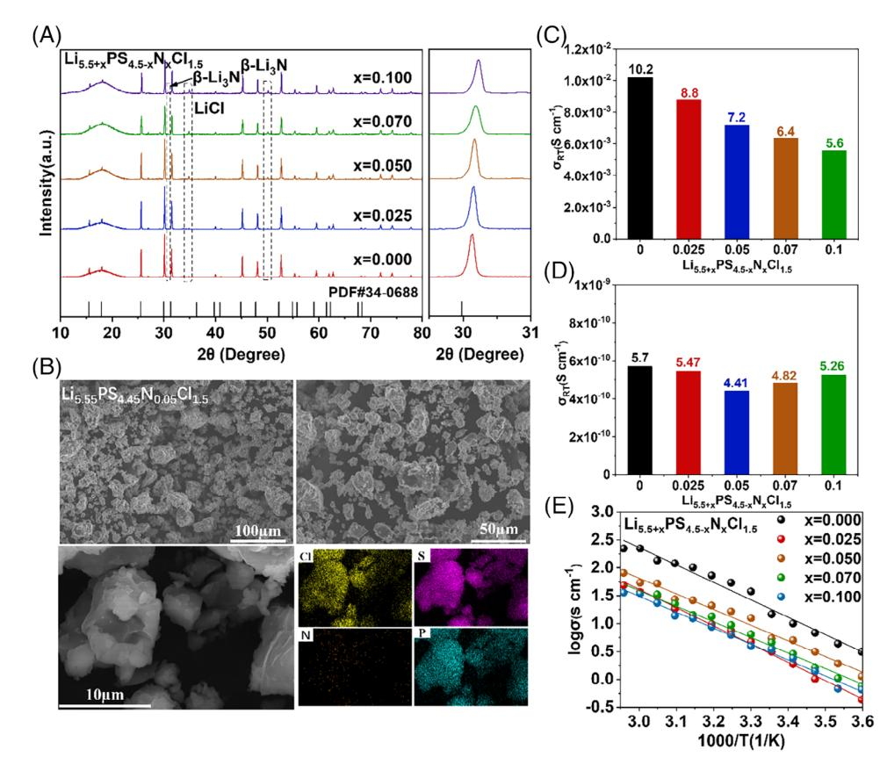
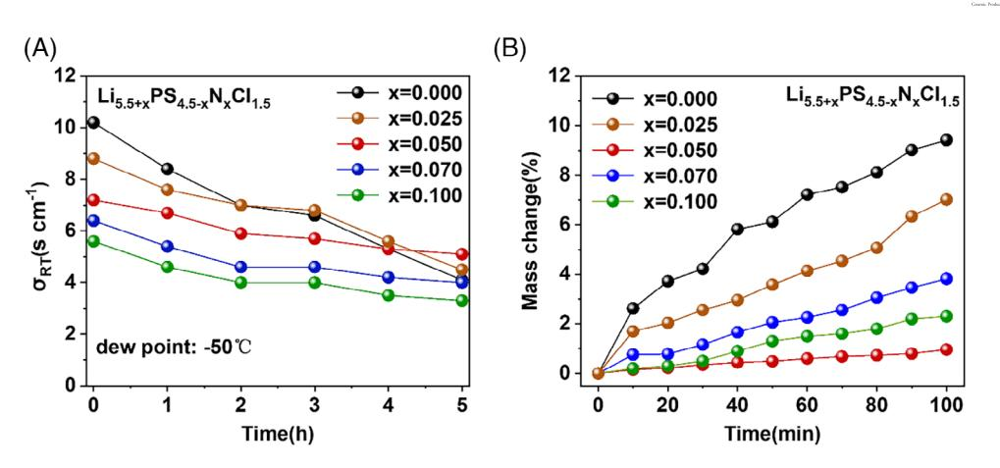
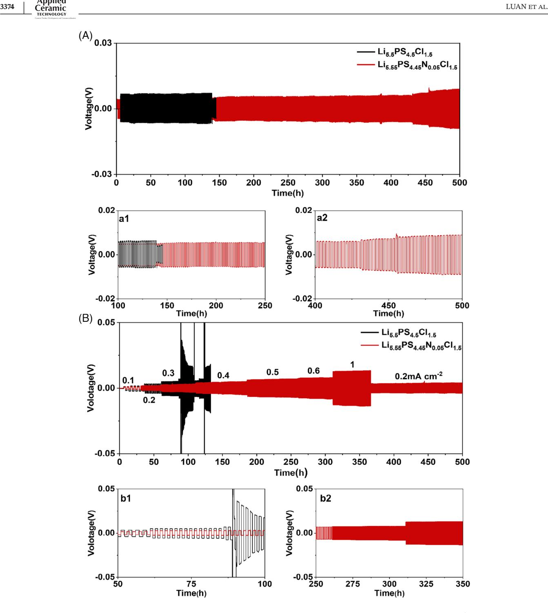

**Qiongyu Zhou4**

# **RESEARCH ARTICLE**

# **Nitrogen doped sulfide solid electrolytes with enhanced air stability and lithium metal compatibility**

**Zhengying Luan1 Pengfei Ren2 Xiaofen Wang3,4 Hong Chen1**

1 College of Materials Science and Engineering, Central South University of Forestry and Technology, Changsha, China

2School of Chemical & Environmental Engineering, China University of Mining & Technology, Beijing, China

3School of Materials Science and Engineering, Shanghai University, Shanghai, China

4Key Laboratory of Green Surface Technology and Functional Coatings for Materials, China National Light Industry, Foshan University, Foshan, China

### **Correspondence**

Xiaofen Wang and Qiongyu Zhou, Key Laboratory of Green Surface Technology and Functional Coatings for Materials, China National Light Industry, Foshan University, Foshan 528000, China. Email: [wangxiaofen@shu.edu.cn](mailto:wangxiaofen@shu.edu.cn) and [zhouzhouqiongyu@fosu.edu.cn](mailto:zhouzhouqiongyu@fosu.edu.cn)

### **Funding information**

Innovation Team Project for Colleges and Universities of Guangdong Province, Grant/Award Number: 2023KCXTD030; Natural Science Key Foundation of Guangdong Province, Grant/Award Number: 2019B1515120056

# **1 INTRODUCTION**

The limited reserves and environmental hazards of consuming fossil fuels have evoked wide concerns, bringing the rise of renewable and environmentally friendly energy production. Taking examples of solar, wind and geothermal energy, those alternatives' intrinsic problems of discreteness in space or time require advanced energy storage and transformation. Rechargeable batteries with high energy density are one of the most promising solutions. However, rechargeable lithium-ion batteries continue to raise inherent safety concerns such as flammability and the risk of explosions, and the safety issue is growing increasingly critical as new battery systems with high energy density and rapid charging rates are being developed. As the demand for rechargeable batteries with increased energy density and improved safety rises, all-solid-state batteries have emerged as one of the most promising options

# **Abstract**

Compared with oxide, halide, and polymer-based solid electrolytes, Li-ion conducting sulfide solid electrolytes exhibit remarkable ionic conductivity, electronic conductivity, and exceptional thermal and mechanical properties. Despite these advantages, the susceptibility of sulfide electrolytes to air and the formation of lithium dendrites on the anode hinder their large-scale commercial application. In this study, we propose a doping strategy involving the nitrogen (N) element in sulfide electrolyte Li5.5PS4.5Cl1.5 (LPSCl) with inherently high ionic conductivity. We have successfully synthesized Li5.5+*x*PS4.5−*x*N*x*Cl1.5(*x* = .025, .05, .07, .10) solid electrolytes by enhancing their air stability through doping. The modified electrolyte material demonstrates stable cycling performance exhibiting superior air stability compared to Li5.5PS4.5Cl1.5. The results indicate that the doped sulfide solid electrolyte effectively suppresses the growth of lithium dendrites, thereby enhancing the compatibility between the lithium metal anode and sulfide solid electrolyte.

## **KEYWORDS**

air stability, all-solid-state batteries, elemental doping, Li-ion conductivity, sulfide solid electrolytes

for next-generation energy-storage technology because of the absence of flammable and volatile organic liquid electrolytes.1-3

Li-ion conducting solid electrolytes as the key component of all-solid-state batteries should have a high ionic conductivity at room temperature, a large electrochemical window to enable the stable cycling of the batteries with high energy and powder density. Li-ion conducting solid electrolytes including sulfide, oxide, halide, and polymerbased materials, have been investigated over the past three decades. Compared with other solid electrolytes, sulfide solid electrolytes have excellent Li-ion conductivity and robust mechanical properties at room temperature; their Li-ion conductivity approaches or even surpasses those of organic liquid electrolytes in conventional rechargeable lithium-ion batteries. Notably,  $\text{Li}_6\text{PS}_5X$  (X = Cl, Br, and I) lithium argyrodite sulfide electrolytes have emerged as a good candidate for the development and application of sulfide solid electrolytes due to their high ionic conductivity of  $(10^{-3}-10^{-2})$  S cm-1 at room temperature and good thermal stability. However, sulfide solid electrolytes face challenges related to poor air stability and chemical stability, posing urgent issues for resolution. $4-6$  First, the partial hydrolysis of sulfide solid electrolytes in the presence of moisture leads to the production of toxic  $H_2S$  gas and degradation of the crystal structure of the electrolytes, which reduces Li-ion conductivity and increases the interfacial resistance of the batteries. Therefore, the preparation and utilization of sulfide electrolytes demand strict conditions in the drying room, significantly increasing the processing costs and environmental requirements associated with battery assembly.7 Moreover, sulfide solid electrolytes exhibit poor compatibility with the metallic lithium anode, and the side reactions at the Li/sulfide electrolyte interface during cycling result in rapid growth of lithium dendrites and large interfacial impedance.8–10

Different approaches, such as compounding, elemental doping, and coating the electrolyte,11-13 have been reported to tackle the challenges of air stability and compatibility with the lithium metal anode in sulfide solid electrolytes.14–16 Among these, element doping in sulfide solid electrolytes is a relatively straightforward method, which could modify the crystal structure of the sulfide solid electrolytes, and enhance their stability in moisture.17 For example, Peng et al. conducted oxygen doping in the  $Li_{5.5}PS_{4.5}Cl_{1.5}$  electrolyte, resulting in the improvement in air stability of solid electrolytes. However, the compatibility with the metallic lithium anode did not show significant improvement.18

In this work, we successfully prepared N elemental doped sulfide solid electrolytes  $Li_{5,5+x}PS_{4,5-x}N_xCl_{1,5}$  $(x = .025, .05, .07, .10)$ , and the doped Li5,55PS4,45N0,05Cl1,5 sulfide solid electrolyte demonstrated superior air stability and the ability to inhibit lithium-dendrite growth. This modified solid electrolyte maintained a Li-ion conductivity of 7.20 mS cm $-1$  and an electronic conductivity of 4.41  $\times 10^{-10}$  S cm-1. N doping improved the stability of the sulfide electrolyte in moisture, leading to a better retention rate of ionic conductivity  $(71\%)$  after 5 h of exposure to air than that of the undoped samples (40.2%). Moreover, the introduction of N elemental significantly enhanced the compatibility between the sulfide solid electrolyte and the metallic lithium anode. The doped sample exhibited an ultra-high critical current density (CCD) of 1.3 mA  $\text{cm}^{-2}$ , and the symmetric Li/Li cell showed a stable cycling over 600 h with no short circuits. All-solid-state Li/NMC cells also demonstrated stable cycling for 100 cycles with a capacity retention rate of 61.3%.

#### **EXPERIMENT** $\mathbf{2}$ $\mathbf{1}$

Sulfide solid  $Li_{5.5+x}PS_{4.5-x}N_xCl_{1.5}$ electrolytes  $(x = .025, .05, .07, .10)$ , were synthesized by solid-state reaction. Li2S (Sigma Aldrich,  $>99.99\%$ ), P2S5 (Sigma Aldrich,  $>99\%$ ), LiCl (Sigma Aldrich,  $>99\%$ ), and Li3N (Sigma Aldrich,  $> 99.9\%$ ) were used as the starting materials. The powders based on the stoichiometric ratio were ball-milled with a vertical planetary ball mill at 500 rpm for 12 h; the powders after ball-milling were put in a crucible and sintered at 460°C for 10 h to obtain the solid electrolytes.

For the symmetric Li/Li cell, 130 mg of solid electrolyte powders were cold-pressed under 356 MPa to get a ceramic membrane with a diameter of 13 mm and a thickness of 600 µm. Two lithium foils with a diameter of 13 mm and a thickness of 300 µm were pressed onto both sides of the ceramic membrane. For the all-solid-state Li/Ni90 ternary cathode (NMC) cell, the NMC cathode and the sulfide electrolytes at a weight ratio of 75:25 were ground in an agate mortar, and the mixed powders were pressed on one side of the ceramic membrane under 356 MPa for 10 s. Jean-Marie Doux et al. confirmed through experiments that the optimal testing pressure for all-solid-state batteries is 5 MPa.19 Therefore, Li/Li batteries and Li/NMC batteries in this work were evaluated at 5 MPa. The symmetric Li/Li and all-solid-state Li/NMC cells were assembled in an argon glovebox with water and oxygen levels below .01 ppm. All cells were tested in land battery testing systems at 60°C, and the cut-off voltage of the Li/NMC cell is  $2.8-4.2$  V.

X-ray diffraction (XRD, MiniFlex 600) was employed to investigate the crystal structure of the solid electrolytes. Scanning electron microscopy (SEM, Talos F200X) and energy dispersive X-ray spectroscopy (EDS) were used to examine the micromorphology and elemental

FIGURE 1 (A) X-ray diffraction (XRD) patterns, (B) scanning electron microscopy (SEM) images and energy dispersive X-ray spectroscopy (EDS) mappings. (C) ionic conductivity, (D) electronic conductivities, and (E) activation energy mappings of  $\text{Li}_{5.5+x}$ PS4.5-xNxCl1.5 solid electrolytes.

distribution of solid electrolytes. Electrochemical impedance spectroscopy measurements were performed using an electrochemical workstation (VSP-300) from 7 MHz to 1 Hz.

#### **RESULTS AND DISCUSSION** $\mathbf{3}$ $\mathcal{L}^{\mathcal{L}}$

The phase structure of the  $Li_{5.5}PS_{4.5}Cl_{1.5}$  based electrolytes doped with  $Li_3N$  was characterized by XRD (Figure 1A). The diffraction peak at 30° exhibits a right shift with increasing doping amounts, indicating the successful synthesis of the doped samples. The observed peak shift after doping is attributed to the smaller radius of the doped trivalent nitrogen anion (146 pm) compared to the divalent sulfur anion (184 pm). In addition, the two diffraction peaks at 31° and 50° are associated with  $\beta$ -Li3N. The diffraction peak at  $35^{\circ}$  is related to LiCl. The presence of  $\beta$ -Li3N can enhance the interfacial compatibility between the sulfide solid electrolyte and the metallic lithium anode.20

SEM images (Figure 1B) reveal that the particle size of the  $\text{Li}_{5.55}$ PS4.45N0.05Cl1.5 electrolyte is uniform and closely similar to the particle size of the  $Li_{5.5}PS_{4.5}Cl_{1.5}$  electrolyte

(Figure S1). Despite some water absorption and agglomeration of the solid electrolyte powder during testing, the particles remain evenly distributed. The particle size is approximately 11 µm, arranged in a relatively regular cubic structure. In addition, the EDS results shown in Figure 1B can confirm the even distribution of N elements throughout the  $Li_{5,55}PS_{4,45}N_{0,05}Cl_{1,5}$  electrolyte.

Ionic conductivity extracted from Figure S2 is shown in Figure 1C,  $Li_{5.5}PS_{4.5}Cl_{1.5}$  conductivity decreases with increasing doping of Li3N. The ionic conductivity of the original Li5.5PS4.5Cl1.5 is 10.2 mS cm-1.  $\text{Li}_{5.525}\text{PS}_{4.475}\text{N}_{0.025}\text{Cl}_{1.5}$ ,  $\text{Li}_{5.55} \text{PS}_{4.45} \text{N}_{0.05} \text{Cl}_{1.5}$ while  $Li_{5.57}PS_{4.43}N_{0.07}Cl_{1.5}$ , and  $Li_{5.56}PS_{4.4}N_{0.1}Cl_{1.5}$  exhibit lower ionic conductivities than  $Li_{5.5}PS_{4.5}Cl_{1.5}$ , which are 8.8 mS cm-1, 7.2 mS cm-1, 6.4 mS cm-1, and 5.6 mS  $\text{cm}^{-1}$ , respectively. The electronic conductivities extracted from Figure S3 are shown in Figure 1D, which reveal that the synthesized  $Li_{5.5+x}PS_{4.5-x}N_xCl_{1.5}$  electrolytes have lower electronic conductivities than  $Li_{5,5}PS_{4,5}Cl_{1,5}$  $(5.7 \times 10^{-10} \text{ S cm}^{-1})$ , of which the Li5.55PS4.45N0.05Cl1.5 exhibits the smallest electronic conductivity (4.41  $\times$  10-10 S cm $^{-1}$ ). Hence, enhancing lithium metal compatibility and interface stability can be anticipated for the  $\text{Li}_{5.55}\text{PS}_{4.45}\text{N}_{0.05}\text{Cl}_{1.5}$  electrolyte, because the reduced

**FIGURE 2** (A) Change in Li-ion conductivity and (B) mass variation of Li5.5+*x*PS4.5−*x*N*x*Cl1.5 solid electrolytes when exposed to air.

**FIGURE 3** (A) The critical current density (CCD) comparison of Li/Li5.5PS4.5Cl1.5/Li and Li/Li5.55PS4.45N0.05Cl1.5/Li symmetric cells; impedance plots of (B) Li/Li5.5PS4.5Cl1.5/Li and (C) Li5.55PS4.45N0.05Cl1.5/Li at .2 mA cm−2, .2 mAh cm−2, and 60◦C.

electronic conductivity can effectively suppress the penetration of Li dendrites[.21](#page-7-0) The reason why the electron conductivity decreases first and then increases is that the material changes with the increase of doping amount, which hinders the electron flow. In addition, the activation energies of Li5.55PS4.45N0.05Cl1.5 is .2240 eV, which is significantly lower than the .2498 eV of Li5.5PS4.5Cl1.5, as seen in Figure [1E.](#page-2-0) The reduced activation energy, which can represent the continuity of a reaction, means that the superior interface stability of Li5.55PS4.45N0.05Cl1.5 can be expected[.22](#page-7-0)

To assess the stability of solid electrolytes in the dry room with a dew point of −50◦C, which has limited moisture in the air, the obtained solid electrolytes were fully exposed in a drying room for 5 h. As shown in Figure 2A, the Li5.55PS4.45N0.05Cl1.5 solid electrolyte exhibits an impressive 71% retention in ionic conductivity after a 5-h exposure to air. In contrast, the ionic conductivity retention rate of Li5.5PS4.5Cl1.5 is only 40.2% (Figure 2A). Figure 2B illustrates the mass change of the solid electrolytes after exposure to the air for 100 min. The Li5.5+*x*PS4.5−*x*N*x*Cl1.5 electrolytes show observably lesser

**FIGURE 4** Cycling profile of Li/Li5.5PS4.5Cl1.5/Li and Li/Li5.55PS4.45N0.05Cl1.5/Li symmetrical cells (A) at .2 mA cm−2 with a fixed capacity of .2 mAh cm−2 and (B) at different current density with a fixed capacity of .5 mAh cm−2, where A1, A2, B1, and B2 are the zoom-in of the charge/discharge curves.

weight increments (.96%–7.02%) when compared with that of Li5.5PS4.5Cl1.5 (9.42%), of which the Li5.55PS4.45N0.05Cl1.5 solid electrolyte displays the smallest weight increment (.96%). In addition, the alleviation in water absorption and enhanced chemical stability of Li5.55PS4.45N0.05Cl1.5 compared to Li5.5PS4.5Cl1.5 can also be obviously visible from digital photos in Figure S4. These results can fully confirm the reduced susceptibility of the doped solid electrolytes to moisture-induced degradation. It is easier for hard base N3− to form P–N bonds with hard acid P5+ in the air than for soft base S2− to form P–S bonds with hard acid P5+. [23](#page-7-0)

To assess the Li-ion transport and stability of the Li/solid electrolyte interface, the Li/Li5.5PS4.5Cl1.5/Li and

FIGURE 5 Charge/discharge profiles of the (A) Li/Li5.55PS4.45N0.05Cl1.5/NMC and Li/Li5.5PS4.5Cl1.5/NMC cells at .1C and 60°C and (B) charge/discharge curves of Li/Li5,55PS4,45N0.05Cl1,5/NMC at .1C. (C) Rate performance of Li/Li5,55PS4,45N0.05Cl1,5/NMC and Li/Li5.5PS4.5Cl1.5/NMC cells at .2C and 60°C, (D) charge/discharge curves at various current densities of Li/Li5.55PS4.45N0.05Cl1.5/NMC, and (E,F) impedance plots of the cells during different state of charge.

Li/ Li5 55PS4 45N0.05Cl1 5/Li symmetric cells were cycled at different current densities. In Figure 3A, the overpotential of both cells rises with the increasing current density, and  $Li/Li_{5.5}PS_{4.5}Cl_{1.5}/Li$  and  $Li/Li_{5.55}PS_{4.45}N_{0.05}Cl_{1.5}/Li$  symmetrical cells got short-circuited at .8 and 1.3 mA  $\text{cm}^{-2}$ . respectively. The increased CCD, corresponding to the short-circuit current of the cell, confirms the better capability of the doped electrolyte in inhibiting the lithiumdendrite growth.24 To further explore the compatibility of lithium metal in the assembly of  $Li/Li_{5.5}PS_{4.5}Cl_{1.5}/Li$ and  $\text{Li/Li}_{5.55}\text{PS}_{4.45}\text{N}_{0.05}\text{Cl}_{1.5}/\text{Li}$  symmetrical batteries, both symmetric cells were cycled at constant .2 mA cm $-2$  with a fixed capacity of .2 mAh  $\text{cm}^{-2}$ . The impedance plots with long-term testing are displayed in Figure 3B,C, and fitted to an equivalent circuit (shown in Figure S5) according

to the model applied by Narayanan et al. and T.T. Zou et al. In this model, the impedance contributions from the bulk  $(R_b)$ , grain boundaries  $(R_{gb})$ , the solid electrolyte interphase ( $R_{SEI}$ ) and charge transfer ( $R_{ct}$ ) processes.25,26 The interfacial impedance  $(R_{\text{inter}})$  can then be approximated as  $R_{\text{inter}} = R_{\text{SEI}} + R_{\text{ct}}$ . The fitting results in Tables S1 show that the  $R_{\text{inter}}$  values of the Li/Li5 55PS4 45N0 05Cl1 5/Li cell (3.236–4.396  $\Omega$  cm2) are smaller than those of Li/Li5.5PS4.5Cl1.5/Li cell (7.970–9.403 Ω cm2). After 100 cycles, the  $R_{\text{inter}}$  of the Li/Li5.55PS4.45N0.05Cl1.5/Li cell increases slightly by only 1.160  $\Omega$  cm2, while the impedance of the  $\text{Li/Li}_{5.5}\text{PS}_{4.5}\text{Cl}_{1.5}/\text{Li}$  symmetrical cell increases by 1.433  $\Omega$  cm2. This observation indicates that doping strategy of the solid electrolytes improves Li-ion transport at the Li/electrolyte interface.27–29

The long cycling of both symmetric cells at .2 mA  $cm^{-2}$  and .2 mAh  $cm^{-2}$  is shown in Figure 4A.  $\text{Li/Li}_{5.55} \text{PS}_{4.45} \text{N}_{0.05} \text{Cl}_{1.5}/\text{Li}$  cell had a stable cycling over 500 h with a marginal increase in overpotential by 4.8 mV (4.2 mV $\rightarrow$ 9.0 mV). However, the Li/Li5.5PS4.5Cl1.5/Li cell had a larger overpotential and got short-circuited after 137 h (Figure 4A1). The cycling of both cells at different current densities (Figure 4B) further demonstrates the doped Li5,55PS4,45N0,05Cl1,5 could be stable at 1 mA cm-2, which is significantly higher than that of the cell with  $\text{Li}_{5,5}\text{PS}_{4,5}\text{Cl}_{1,5}$  (0.3 mA cm-2). This result indicates that the doping-modified sulfide electrolytes exhibit better compatibility and stability with the metallic lithium anode, and the introduction of the N element effectively inhibits the growth of lithium dendrites.

Utilizing NMC as the cathode and Li metal as the anode, we assessed the electrochemical performance of the doped sulfide electrolytes in all-solid-state Li/NMC cells at 60°C. Figure 5A,B shows the charge and discharge performance of  $Li/Li_{5.55}PS_{4.45}N_{0.05}Cl_{1.5}/NMC$  and  $Li/Li_{5.5}PS_{4.5}Cl_{1.5}/NMC$  cells at .1C from 2.8 to 4.2 V. The  $Li/Li_{5.55}PS_{4.45}N_{0.05}Cl_{1.5}/NMC$  cell displays a higher initial discharge capacity of 180.4 mAh  $g^{-1}$  and a higher initial coulombic efficiency of 84.35% than those of the  $\text{Li/Li}_{5.5}\text{PS}_{4.5}\text{Cl}_{1.5}/\text{NMC}$  cell (172.87 mAh g-1 and 83.93%, respectively). All-solid-state Li/Li5.55PS4.45N0.05Cl1.5/NMC cell maintains a capacity retention of 110.6 mAh  $g^{-1}$  after 100 cycles (Figure 5A), which is much better than the  $\text{Li/Li}_{5.5}\text{PS}_{4.5}\text{Cl}_{1.5}/\text{NMC}$  cell (73.36 mAh g-1). The rate performance of both all-solid-state cells at 60°C is shown in Figure 5C. The Li/Li5.55PS4.45N0.05Cl1.5/NMC cell has a discharge capacity of 183.5, 152.1, 136, and 117.4 mAh  $g^{-1}$  at .1C, .2C, .3C, and .5C, respectively. When the current density is back to .2C, the discharge capacity of the cell can be recovered to 145.2 mAh  $g^{-1}$ . However, the  $\text{Li/Li}_{5.5}\text{PS}_{4.5}\text{Cl}_{1.5}/\text{NMC}$  cell owns a lower discharge capacity at different C rates. This is attributed to the larger internal resistance of the cell resulting from the reduction of the solid electrolyte.

Figure  $5E$ ,F shows the impedance plots of all-solid-state  $Li/Li_{5.5}PS_{4.5}Cl_{1.5}/NMC$  and  $Li/Li_{5.55}PS_{4.45}N_{0.05}Cl_{1.5}/NMC$ cells during discharge to 4.1, 3.9, 3.7, 3.5, and 3.3 V, respectively. These impedance plots are also fitted by the equivalent circuit in Figure S5 and the results are displayed in Table S2. The Li/Li5.5PS4.5Cl1.5/NMC cell has a  $R_{\text{inter}}$  value above 137  $\Omega$  cm2 at different discharge voltages, with a larger 53.511  $\Omega$  cm2 change observed from 4.1 to 3.3 V. While the Li/Li5.55PS4.45N0.05Cl1.5/NMC cell displays a  $R_{\text{inter}}$  value less than 53  $\Omega$  cm2 and a slight resistance change (20.714  $\Omega$  cm2) from 4.1 to 3.3 V, which can confirm the modified stability of doped sulfide electrolyte with the metallic lithium anode.

#### $\boldsymbol{\Delta}$ **CONCLUSION** $\mathbf{I}$

In this study, we have successfully synthesized  $Li_{5.5+x}PS_{4.5-x}N_xCl_{1.5}$  (x = .025, .05, .07, .10) sulfide electrolytes with low electronic conductivities, and the nitrogen doping increased the stability of sulfide electrolytes in moist environments. The symmetric Li/Li cell with the  $Li_{5,55}PS_{4,45}N_{0,05}Cl_{1,5}Cl_{1,5}$  has a high CCD of 1.3 mA  $\text{cm}^{-2}$  and a stable cycling over 500 h. Moreover, all-solid-state  $Li/Li_{5.55}PS_{4.45}N_{0.05}Cl_{1.5}/NMC$  cell has a high discharge of 180.4 mAh  $g^{-1}$  at .1C and a good rate performance, demonstrating the obvious advantages of the  $\text{Li}_{5.5+x}$ PS4.5-xNxCl1.5 electrolyte modified by doping.

## **ACKNOWLEDGMENTS**

This work is supported by the Innovation Team Project for Colleges and Universities of Guangdong Province (2023KCXTD030) and Natural Science Key Foundation of Guangdong Province (2019B1515120056).

### ORCID

*Qiongyu Zhou* **b** https://orcid.org/0000-0003-4440-2784

### REFERENCES

- 1. Zhang Q, Cao D, Ma Y, Natan A, Aurora P, Zhu HL. Sulfidebased solid-state electrolytes: synthesis, stability, and potential for all-solid-state batteries. Adv Mater. 2019;31:201901131. https://doi.org/10.1002/adma.201901131
- 2. Oh P, Lee H, Park S, Cha H, Kim J, Cho J. Improvements to the overpotential of all-solid-state lithium-ion batteries during the past ten years. Adv Energy Mater. 2020;10:2000904. https://doi. org/10.1002/aenm.202000904
- 3. Liu J, Xu J, Lin Y, Li J, Lai Y, Yuan C, et al. All-solid-state lithium ion battery: research and industrial prospects. Acta Chim Sinica. 2013;71:869-78. https://doi.org/10.6023/a13020170
- 4. Wu D, Chen L, Li H, Wu F. Recent progress of solid-state lithium batteries in China. Appl Phys Lett. 2022;121:120502. https://doi. org/10.1063/5.0117248
- 5. Su H, Jiang Z, Liu Y, Li J, Gu C, Wang X et al. Recent progress of sulfide electrolytes for all-solid-state lithium batteries. Energy Mater. 2022;2:200005. https://doi.org/10.20517/ energymater.2022.01
- 6. Zheng B, Wang H, Ma J, Gong Z, Yang Y. A review of inorganic solid electrolyte/electrode interface in all-solid-state lithium batteries. Sci China Chem. 2017;47:579-93, https://doi.org/10.1360/ n032016-00239
- 7. Yersak TA, Zhang Y, Hao F, Cai M. Moisture stability of sulfide solid-state electrolytes. Front Energy Res. 2022;10:882508, https://doi.org/10.3389/fenrg.2022.882508
- 8. Cheng XB, Zhao CZ, Yao YX, Liu H, Zhang Q. Recent advances in energy chemistry between solid-state electrolyte and safe lithium-metal anodes. Chem. 2019;5:74-96. https://doi.org/10. 1016/j.chempr.2018.12.002
- 9. Gao Z, Sun H, Fu L, Ye F, Zhang Y, Luo W, et al. Promises, challenges, and recent progress of inorganic

solid-state electrolytes for all-solid-state lithium batteries. Adv Mater. 2018;30:201705702. [https://doi.org/10.1002/adma.](https://doi.org/10.1002/adma.201705702) [201705702](https://doi.org/10.1002/adma.201705702)

- 10. Nikodimos Y, Huang CJ, Taklu BW, Su WN, Hwang BJ. Chemical stability of sulfide solid-state electrolytes: stability toward humid air and compatibility with solvents and binders. Energy Environ Sci. 2022;15:991–1033. [https://doi.org/10.1039/](https://doi.org/10.1039/d1ee03032a) [d1ee03032a](https://doi.org/10.1039/d1ee03032a)
- 11. Ohtomo T, Hayashi A, Tatsumisago M, Kawamoto K. Allsolid-state batteries with Li2O-Li2S-P2S5 glass electrolytes synthesized by two-step mechanical milling. J Solid State Chem. 2013;17:2551–57. <https://doi.org/10.1007/s10008-013-2149-5>
- 12. Yu T, Ke B, Li H, Guo S, Zhou H. Recent advances in sulfide electrolytes toward high specific energy solid-state lithium batteries. Mater Chem Front. 2021;5:4892–911. [https://doi.org/10.](https://doi.org/10.1039/d1qm00474c) [1039/d1qm00474c](https://doi.org/10.1039/d1qm00474c)
- 13. Isaac JA, Devaux D, Bouchet R. Dense inorganic electrolyte particles as a lever to promote composite electrolyte conductivity. Nat Mater. 2022;21:1412–18, [https://doi.org/10.1038/s41563-022-](https://doi.org/10.1038/s41563-022-01343-w) [01343-w](https://doi.org/10.1038/s41563-022-01343-w)
- 14. Isaac JA, Devaux D, Bouchet R. Superior all-solid-state batteries enabled by gas-phase synthesized sulfide electrolyte with ultra-high moisture stability and ionic conductivity. Adv Mater. 2022;33:202100921. <https://doi.org/10.1002/adma.202100921>
- 15. Zhu GL, Zhao CZ, Peng HJ, Yuan H, Hu JK, Nan HX, et al. A self-limited free-standing sulfide electrolyte thin film for all-solid-state lithium metal batteries. Adv Funct Mater. 2021;31:202101985. <https://doi.org/10.1002/adfm.202101985>
- 16. Luo S, Wang Z, Fan A, Liu X, Wang H, Ma W, et al. A high energy and power all-solid-state lithium battery enabled by modified sulfide electrolyte film. J Power Sources. 2021;485:229325. <https://doi.org/10.1016/j.jpowsour.2020.229325>
- 17. Zhao R, Hu G, Kmiec S, Wheaton J, Torres VM iii, Martin SW. Grain-boundary-free glassy solid electrolytes based on sulfide materials: effects of oxygen and nitrogen doping on electrochemical performance. Batter Supercaps. 2022;5:202100356. <https://doi.org/10.1002/batt.202100356>
- 18. Peng L, Chen S, Yu C, Wei C, Liao C, Wu ZK, et al. Enhancing moisture and electrochemical stability of the Li5.5PS4.5Cl1.5 electrolyte by oxygen doping. ACS Appl Mater. 2022;14:4179–85. <https://doi.org/10.1021/acsami.1c21561>
- 19. Doux JM, Nguyen H, Tan DHS, Banerjee A, Wang XF, Wu EA, et al. Stack pressure considerations for room-temperature all-solid-state lithium metal batteries. Adv Energy Mater. 2019;10:201903253. <https://doi.org/10.1002/aenm.201903253>
- 20. Hartley GO, Jin L, Bergner BJ, Jolly DS, Rees JG, Zekoll S, et al. Is nitrogen present in Li3N⋅P2S5 solid electrolytes produced by ball milling? Chem Mater. 2019;31:9993–10001. [https://doi.org/](https://doi.org/10.1021/acs.chemmater.9b01853) [10.1021/acs.chemmater.9b01853](https://doi.org/10.1021/acs.chemmater.9b01853)
- 21. Gao J, Sun X, Wang C, Zhang Y, Yang L, Song D, et al. Sband O-Co substituted Li10SnP2S12 with high electrochemical and

air stability for all-solid-state lithium batteries. Chem Electro Chem. 2022;9:202200156. <https://doi.org/10.1002/celc.202200156>

- 22. Song DX, Ma WG, Zhang X. Insight into the activation energy for the interfacial stability evaluation in all-solid-state Li-ion batteries. J Power Sources. 2021;506:230211. [https://doi.org/10.1016/](https://doi.org/10.1016/j.jpowsour.2021.230211) [j.jpowsour.2021.230211](https://doi.org/10.1016/j.jpowsour.2021.230211)
- 23. Ahmad N, Zhou L, Faheem M, Tufail MK, Yang L, Chen RJ, et al. Enhanced air stability and high Li-ion conductivity of Li6.988P2.994Nb0.2S10.934O0.6 glass–ceramic electrolyte for allsolid-state lithium–sulfur batteries. ACS Appl Mater Interfaces. 2020;12:21548–58. <https://doi.org/10.1021/acsami.0c00393>
- 24. Zhao F, Sun Q, Yu C, Zhang S, Adair K, Wang S, et al. Ultrastable anode interface achieved by fluorinating electrolytes for all-solid-state Li metal batteries. ACS Energy Lett. 2020;5:1035– 43.
- 25. Zou TT, Rue*β* R, Pan RJ, Walther F, Rohnke M, Hori S, et al. A mechanistic investigation of the Li10GeP2S12|LiNi1-x-YCoxMnyO2 interface stability in all-solid-state lithium batteries. Nat Commun. 2021;12:6669. <https://doi.org/10.1038/s41467-021-26895-4>
- 26. Narayanan S, Ulissi U, Gibson JS, Chart YA, Weatherup RS, Pasta M. Effect of current density on the solid electrolyte interphase formation at the lithium|Li6PS5Cl interface. Nat Commun. 2022;13:7237. <https://doi.org/10.1038/s41467-022-34855-9>
- 27. Yang M, Chen L, Li H, Wu F. Air/water stability problems and solutions for lithium batteries. Energy Mater Adv. 2022;2022;9842651. <https://doi.org/10.34133/2022/9842651>
- 28. Zhang J, Zheng C, Li L, Xia Y, Huang H, Gan YP, et al. Unraveling the intra and intercycle interfacial evolution of Li6PS5Clbased all-solid-state lithium batteries. Adv Energy Mater. 2019;10:201903311. <https://doi.org/10.1002/aenm.201903311>
- 29. Bachman JC, Muy S, Grimaud A, Chang HH, Pour N, Lux SF, et al. Inorganic solid-state electrolytes for lithium batteries: mechanisms and properties governing ion conduction. Chem Rev. 2015;116:140–62. [https://doi.org/10.1021/acs.](https://doi.org/10.1021/acs.chemrev.5b00563) [chemrev.5b00563](https://doi.org/10.1021/acs.chemrev.5b00563)

# **SUPPORTING INFORMATION**

Additional supporting information can be found online in the Supporting Information section at the end of this article.

**How to cite this article:** Luan Z, Ren P, Wang X, Chen H, Zhou Q. Nitrogen doped sulfide solid electrolytes with enhanced air stability and lithium metal compatibility. Int J Appl Ceram Technol. 2024;21:3370–77. <https://doi.org/10.1111/ijac.14771>