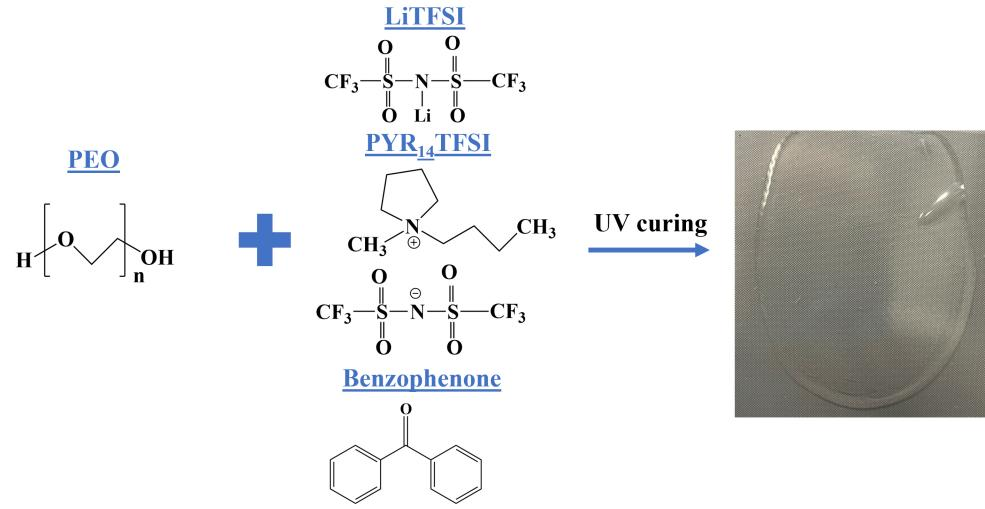
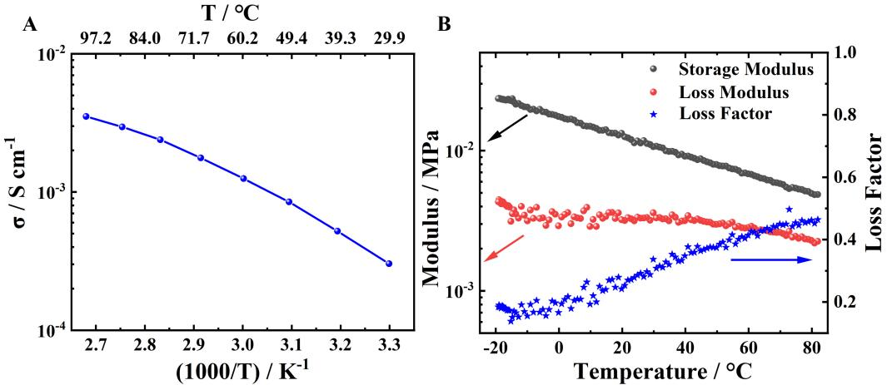
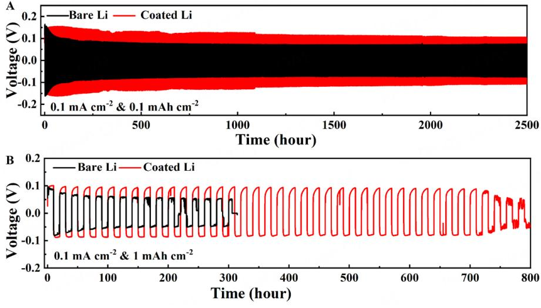
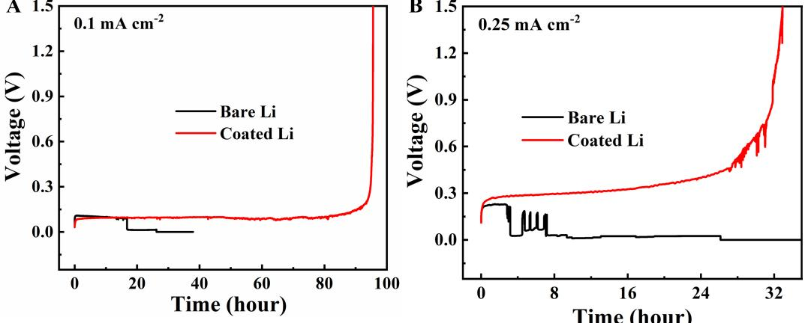
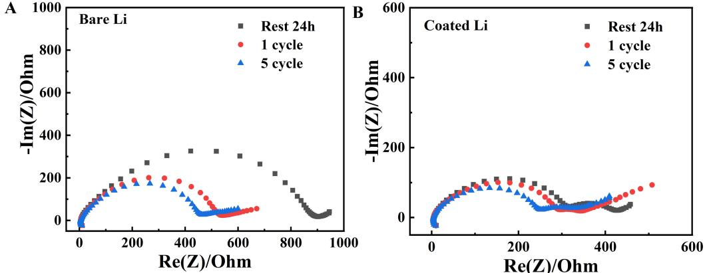
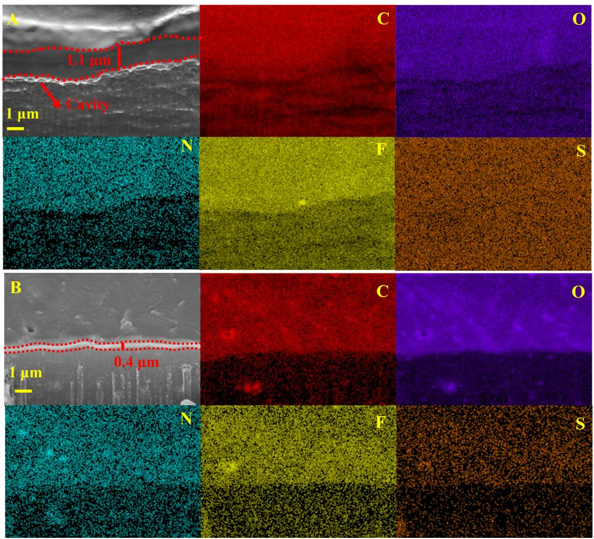
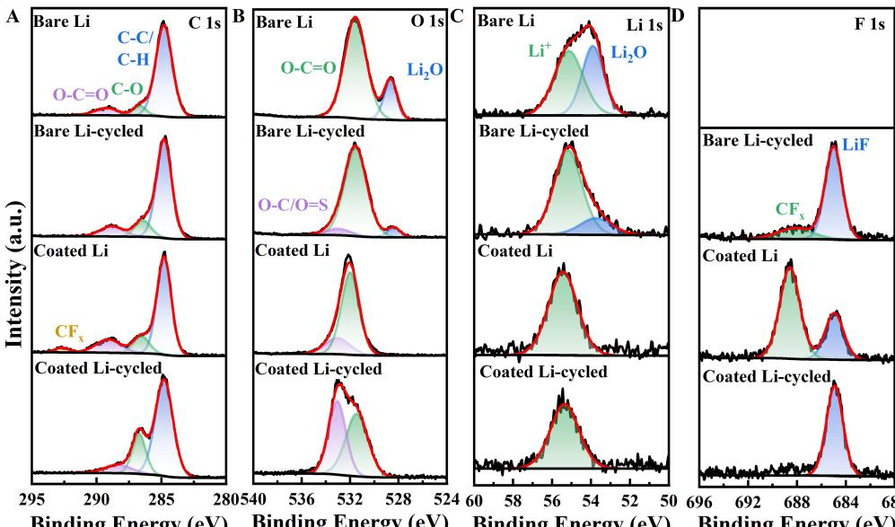
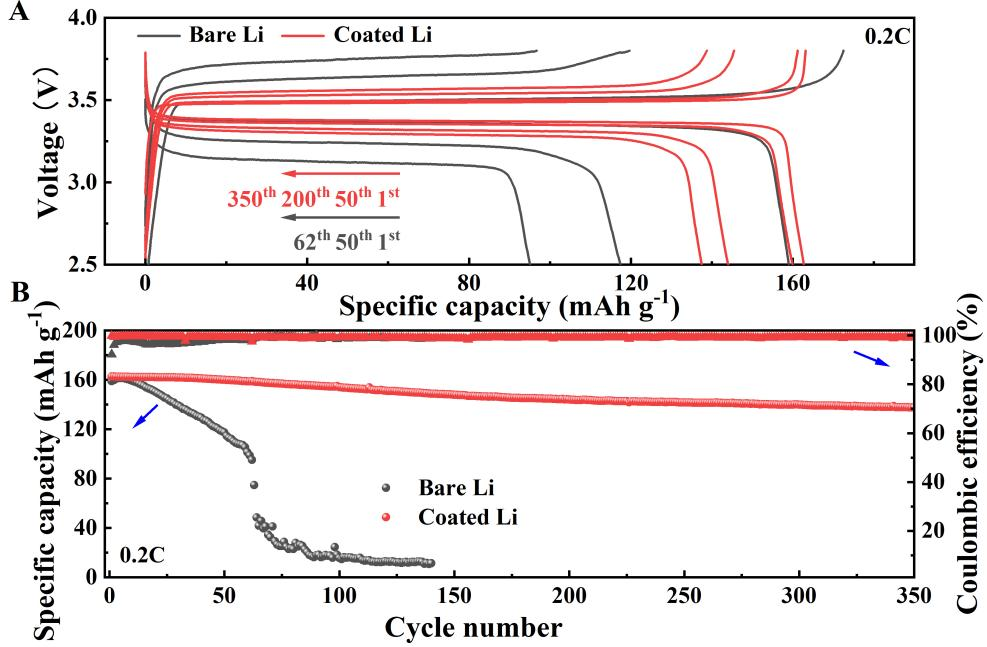

# **Article Open Access**

# **Combining ternary, ionic liquid-based, polymer electrolytes with a single-ion conducting polymerbased interlayer for lithium metal batteries**

**Jiajia Wan1,2, Mintao Wan3,4, Xu Hou5 , Francesco Briatico Vangosa1 , Dominic Bresser3,4, Jie Li2 , Elie Paillard2,[\\*](https://orcid.org/0000-0002-5630-0569)**

1 Politecnico di Milano, Chemistry Department, Piazza Leonardo da Vinci 32-20133, Milan. 2 Politecnico di Milano, Energy Department, Lambruschini 4-20156, Milan. 3Helmholtz Institute Ulm (HIU), Ulm D-89081, Germany. 4 Karlsruhe Institute of Technology (KIT), Karlsruhe D-76021, Germany. 5Uppsala University, Chemistry Department, Uppsala SE-751 21, Sweden.

\***Correspondence to:** Prof. Elie Paillard, Energy Department, Politecnico di Milano, Lambruschini 4-20156, Milan. E-mail: elieelisee.paillard@polimi.it

**How to cite this article:** Wan J, Wan M, Hou X, Vangosa FB, Bresser D, Li J, Paillard E. Combining ternary, ionic liquid-based, polymer electrolytes with a single-ion conducting polymer-based interlayer for lithium metal batteries. *Energy Mater* 2024;4:400074. [https://dx.doi.org/10.20517/energymater.2024.50](https://dx.doi.org/10.20517/energymater.2024.50 )

**Received:** 22 May 2024 **First Decision:** 21Jun 2024 **Revised:** 25 Jul 2024 **Accepted:** 12 Jul 2024 **Published:** 30 Jul 2024

**Academic Editor:** Xiongwei Wu **Copy Editor:** Fangyuan Liu **Production Editor:** Fangyuan Liu

### **Abstract**

Among the many approaches to improve the performance of lithium-metal batteries, ternary polyethylene oxide/ionic liquid/lithium salt electrolytes offer several advantages such as low flammability, high conductivity (*vs.* polyethylene oxide/lithium salt electrolytes) and, to a large extent, limiting the growth of dendrites at moderate currents. However, they suffer from relatively low mechanical strength for lithium metal confinement. Besides, the lithium transport numbers are very low, which is conducive to lithium depletion during plating at high current densities at the lithium/electrolyte interface. Thus, we show here that the combination of a ternary solid polymer electrolyte with a single-ion polymer-based conducting interlayer allows for a significant improvement of the cyclability of the lithium metal anode. This results in a strong improvement of the electrochemical performance of lithium-metal batteries using solid polymer electrolytes at 80 °C, with an 85% capacity retention after 350 cycles (*vs.* 60% after 62 cycles for the uncoated anode). This is attributed, via focused ion beam-scanning electron microscopy and X-ray photoelectron spectroscopy, to a denser lithium deposit, better contact with the electrolyte and a reduced reactivity of electrolyte species with the interlayer.

**Keywords:** Lithium metal battery, artificial SEI, ternary solid polymer electrolyte

© The Author(s) 2024. **Open Access** This article is licensed under a Creative Commons Attribution 4.0 International License [\(https://creativecommons.org/licenses/by/4.0/\)](https://creativecommons.org/licenses/by/4.0/), which permits unrestricted use, sharing, adaptation, distribution and reproduction in any medium or format, for any purpose, even commercially, as

long as you give appropriate credit to the original author(s) and the source, provide a link to the Creative Commons license, and indicate if changes were made.

## INTRODUCTION

With the increasing dependence on energy storage devices, lithium-metal batteries have attracted much attention due to their advantages of potentially higher gravimetric and volumetric energy density as compared to the widely used Li-ion batteries. However, the use of lithium metal as an anode triggers a variety of challenges such as intense dendrite growth, which can induce cell short circuits and severe safety issues as well as fierce interface side reactions, evolution of dead Li from dendrites, and increased resistance and heat generation[\[1\]](#page-14-0) . Especially, the combination of Li anodes and the organic liquid electrolytes that are commonly used in Li-ion batteries is problematic due to the intrinsic volatility and flammability of solvents and the high reactivity between the electrolyte and lithium metal[\[2\]](#page-14-1) . To overcome the challenges related to the use of Li anodes, solid polymer electrolytes (SPEs) appear as a good choice as alternative electrolytes since they are inherently low-volatile, low-flammable and, therefore, less prone to leakage or fire. This property has allowed the commercialization of solid lithium metal polymer batteries for electric vehicles using polyethylene oxide (PEO)-based electrolytes[\[3\]](#page-14-2) . Besides being compatible with lithium metal, PEO contains repeating oxygen units that can dissolve a variety of conducting lithium salts and solvate the lithium cation to ensure the Li transportation via local polymer chain segmental mobility[\[4\]](#page-14-3) . However, the conductivity of PEO-based SPEs is limited to ca. 10-4 S cm-1 at 40 °C, which is far lower than those of commonly used liquid electrolytes (10-3-10-2 S cm-1) [[5\]](#page-14-4) .

Various plasticizers, including molecular solvents (propylene carbonate, ethylene carbonate, and glymes or longer and less volatile polyethylene glycol dimethyl ethers (PEGDMEs), and ionic liquids (ILs)[\[6](#page-14-5)[-12\]](#page-14-6) , have been employed in SPEs to improve their ionic conductivity, since they can decrease the melting temperature and glass transition temperature. Among them, aprotic ILs with the advantages of non-volatility and low flammability, high thermal stability, and high ionic conductivity can act not only as plasticizers but also as supporting electrolytes to form high-performance ternary PEO/IL/lithium salt electrolytes. This idea was first proposed by Shin *et al.* in 2003 using the PEO/*N*-methyl-*N*-propyl pyrrolidinium bis(trifluoromethanesulfonyl)imide (PYR13TFSI)/bis(trifluoromethanesulfonyl)imide lithium salt (LiTFSI) system to improve the conductivity up to ~10-4 S cm-1 at 20 °C and then used it in lithium metal polymer electrolyte batteries[\[6\]](#page-14-5) . Rupp *et al.* prepared an ultraviolet (UV) crosslinked ternary polymer electrolyte (PEO/*N*-methyl-*N*-butyl pyrrolidinium (PYR14) TFSI)/LiTFSI with a molar ratio of 10/1/1, OPEO/LiTFSI/ PYR14TFSI) using benzophenone as a photoinitiator to improve the mechanical stability without sacrificing conductivity[\[13\]](#page-15-0) . Afterward, ternary polymer electrolytes were combined with composite cathode tapes to enable the cycling of solid lithium metal polymer batteries[[14](#page-15-1)[-16\]](#page-15-2) . Although the ternary SPEs (TSPEs) are superior in terms of ionic conductivity and safety compared with other types of SPEs, their demerits are concerning. For instance, their low Li transference numbers lead to significant salt concentration gradients and even full Li depletion at the interface during charge. In addition, their low mechanical strength provides insufficient lithium metal confinement. Accordingly, protrusion growth might occur, and lead to related issues (extension of surface area of the Li anode and, in the worst case, short circuits).

On the other hand, interface engineering on the surface of the Li anode is an effective strategy to improve the performance of lithium-metal batteries. The solid electrolyte interphase (SEI) layer plays a crucial role in this regard, since it can prevent the continuous decomposition of the electrolyte. The ideal SEI is merely conductive to Li+ cations, while blocking electrons and other electrolyte species. However, real SEIs grown in contact with the electrolyte might lack mechanical stability, homogeneous ionic transport, as well as the ability to fully suppress electrolyte decomposition, which commonly leads to dendrite growth and limited lifespans of the battery cells. This issue can be addressed by applying an artificial SEI (art-SEI) layer onto the lithium metal surface because they not only act as a physical barrier to reduce the continuous electrolyte reaction with the lithium metal, but potentially possess other advantages such as mechanical strength, high conductivity, and good chemical stability. A variety of art-SEI layers has been reported, including LiF[\[17](#page-15-3)] , Li3PO4 [\[18\]](#page-15-4) , Al2O3 [[19](#page-15-5)] , and Li3N [\[20\]](#page-15-6) , organic components, and polymers that greatly enhance the Li+ transport and lower the interphase resistance. Among them, polymers caught much attention due to their good mechanical stability, interfacial compatibility, high elasticity, and lack of grain boundaries, which is favorable for lithium metal confinement and homogeneous Li-ion transport[\[21-](#page-15-7)[28](#page-15-8)] . For example, Cui *et al.* proposed a trifluorophenyl-modified poly(ethylene imine) crosslinked network as a self-healing art-SEI enabling dendrite-free Li plating and excellent cyclability[[29](#page-15-9)] . However, most of the reported art-SEIs are dual-ion conductors, in which the migration of the anions towards the opposite direction reinforces the salt concentration gradient that results from the consumption of Li+ ions at the Li anode and the release of Li+ ions at the other electrode during charge. This accelerates the Li depletion at the Li anode, thus leading to fast dendrite growth[[30](#page-15-10)] . Therefore, the utilization of single-ion conducting polymers as art-SEI layers, in principle, could solve the Li depletion issue since it can fix anions, at least in the vicinity of the Li anode[[31](#page-15-11)] .

Herein, we show the limit of a classical TSPE and propose the use of an art-SEI made from two kinds of ionomers: Poly(lithium sulfonyl(trifluoromethanesulfonyl)imide methacrylate) (PMTFSILi) and poly(lithium sulfonyl(trifluoromethanesulfonyl)imide styrene) (PSTFSILi) to overcome its disadvantages and benefit from its advantages such as high conductivity and low flammability. On the one hand, the art-SEI layer likely loses its single-ion property upon contact with the polymer electrolyte due to salt and IL ingress. Nevertheless, it still includes some fixed anions contributing to limiting the Li+ depletion close to the Li anode. On the other hand, the stiff and robust art-SEI layer is expected to greatly improve the confinement of the lithium metal, especially as the TSPE is very soft and sticky due to the addition of the IL, already at room temperature (RT). The combination of TSPE and art-SEI achieves high safety, high conductivity, and better interface stability, and regulates lithium plating, thus enabling better cycling performance in symmetric Li||Li cells and LiFePO4 (LFP)||Li solid polymer batteries.

## EXPERIMENTAL SECTION

#### **Materials**

Poly(ethylene oxide) (PEO, average Mv~1,000,000 (nominal), powder, Merck), acetonitrile (99.9%, Merck), LiTFSI (99.95%, Merck), 1-butyl-1-methylpyrrolidinium bis(trifluoromethanesulfonyl)imide (PYR14TFSI, 99.9%, Solvionic), benzophenone (99%, Merck), PSTFSILi (Mn = 27,592 g mol-1 , Mw = 190,562 g mol-1 , Ip = 6.9 (gel permeation chromatography (GPC), eluent: dimethylformamide (DMF)) Specific Polymers), PMTFSILi (Mn = 208,828 g mol-1 , Mw = 356,953 g mol-1 , Ip = 1.7 (GPC, eluent: DMF), Specific Polymers), Propylene Carbonate (PC, Heliume Tech), 1,2-dimethoxyethane (99%, DME, Merck), *N*-methylpyrrolidone (99.95%, NMP, Merck), Super C65 (Imerys), carbon-coated LFP (M23, Advanced Lithium Electrochemistry Co., Ltd.), poly(vinylidene difluoride) (PVDF, TMAX), Li foil and Li chips (China Energy Lithium Co., Ltd) with a thickness of 50 μm and 1 mm, respectively, were used in the experiments.

#### **Preparation of the solid polymer electrolyte**

An amount of 0.6 g of PEO (dried at 60 °C for 48 h under dynamic vacuum) was dissolved in 9.4 g of acetonitrile (dried on molecular sieves to < 20 ppm H2O) by stirring for 12 h inside an Ar-filled glovebox (H2O and O2 < 0.1 ppm). Then, 0.5760 g of PYR14TFSI, 0.3915 g of LiTFSI (corresponding to a molar ratio PEO/PYR14TFSI/ LiTFSI of 10/1/1), and 0.03 g benzophenone (i.e., 5% of the polymer weight) were added and mixed by further stirring for 3 h. The obtained viscous solution was cast onto a polydimethylsiloxanecoated Mylar foil and dried at RT in the glovebox for three days then at 60 °C for 12 h. Finally, the thin film was crosslinked by UV for 12 min on each side with a Bio-Link-BLX (VILBER) at a wavelength of 312 nm.

#### Page 4 of 17

#### **Preparation of art-SEI**

The coated Li electrodes were fabricated by immersing the Li anodes into a PC solution with 5 wt.% PMTFSILi + 5 wt.% PSTFSILi for 10 min and then drying them at RT under vacuum for 12 h. This procedure was previously shown to lead to an interlayer of ca. 3.5 µm ± 1.5 thickness[[31](#page-15-11)] .

#### **Cells assembly and measurements.**

Two types of Li electrodes were used. Some were made from a Li foil of 50 μm thickness and had diameters of 12 mm and were used as stripped electrodes in single direction plating experiments. The others were made by scratching the surface of 1 mm thick Li chips with a polypropylene tweezer in a glovebox to completely remove the native passivation layer on the Li surface. They had diameters of 12 and 14 mm. They were then manually roll-pressed and finally pressed with a hydraulic press (between Mylar foils in both cases) to a thickness of ca. 200 µm. The crosslinked polymer membranes were cut into 18 mm disks and used as electrolytes and separators with a thickness of 200 µm (± 25 µm).

All the electrochemical characterizations were carried out in 2,032 type coin cells and conducted at 80 °C using a Neware BTS4000 battery test system. For the experiments involving a single galvanostatic plating of Li, the deposits were made onto 14 mm polished electrodes, using a 12 mm unpolished Li foil as the counter electrode at 0.1 and 0.25 mA cm-2 . The cycling of symmetric Li||Li cells was done with polished Li anodes at 0.1 mA cm-2 with cycled capacities of 0.1 and 1 mAh cm-2 . The LFP electrodes were prepared by casting a slurry of LFP, PVDF, and carbon black with a weight ratio of 8:1:1, using NMP as a solvent, onto an Al current collector. The films were dried at 80 °C for 12 h, cut into 12 mm round disks, pressed at 3 tons with a hydraulic press and then vacuum-dried for 12 h at 120 °C. The electrochemical performance of LFP||Li coin cells was measured via galvanostatic cycling within the voltage range of 2.5-3.8 V at 0.2 and 0. 1C for LFP active material mass loadings of 2.6 and 5.6 mg cm-2 , respectively (the 1 C rate was calculated considering a specific capacity of 170 mAh g -1 for LFP). Electrochemical impedance spectroscopy (EIS) was performed within the frequency range of 100 kHz~0.01Hz with an amplitude of 5 mV using a VMP2 multichannel potentiostat (Biologic).

### **Materials characterization**

To characterize the Li electrodes after the electrochemical tests, the cells were dismantled and the Li electrodes/polymer electrolyte assembly was immersed in DME for 24 h to allow for peeling off the TSPE from the Li electrodes.

The *ex-situ* scanning electron microscopy (SEM)/EDX analysis of the bare Li and coated Li was performed *via* a ZEISS Crossbeam XB340 instrument, equipped with an energy dispersive X-ray (EDX) spectrometer. The cross-sectional bare Li and coated Li were prepared using a Capella focused ion beam (FIB) with a gallium ion source, utilizing a milling current of 1.5 nA. The cross-section images were captured following FIB milling, with the smart SEM software employed for tilt correction to compensate for image distortion arising from the 54° tilt from the optical axis.

X-ray photoelectron spectroscopy (XPS) measurements on Li anodes were conducted with an AXIS Supra+ (Kratos) with a focused 20-500 μm diameter beam of monochromatic X-rays and a 15 kV filament voltage source energy. The Al Kα radiation with an energy of 1,486.3 eV and an angle of 0° of emission was used for the measurements. Adventitious carbon in the C 1s spectra at 284.8 eV was used as a charge reference to correct the binding energies.

#### **Electrochemical measurements of the polymer electrolyte**

Symmetric SS|TSPE|SS coin cells (SS: stainless steel electrodes) were assembled to determine the ionic conductivity via EIS within the temperature range from 30 to 100 °C, with increments of 10 °C. The ionic conductivity (σ) of TSPE was calculated via:

$$
\sigma = \frac{l}{RA} \tag{1}
$$

Where *l*, *R*, and *A* represent the thickness, resistance, and area of the TSPE employed in the coin cells, respectively.

#### **Viscoelastic properties measurement**

The viscoelastic properties of the electrolyte were measured with an Anton Paar MCR502 rheometer in oscillating mode, at 1 Hz with a constant strain of 0.1% and applying a constant normal force of 0.25 N during a cooling ramp from 100 to -20 °C at -3 °C min-1 . Temperature was controlled using a plate and hood Peltier systems. A parallel-plate (diameter 25 mm) geometry was chosen, with a gap corresponding to the membrane thickness, varying from 246 µm at 80 °C to 238 µm at 25 °C.

## RESULTS AND DISCUSSION

Results obtained with lithium metal electrodes strongly depend on the lithium metal used, with large differences usually obtained with lithium carbonate-coated Li chips (commonly used to assemble "halfcells" in Li-ion studies) or uncoated Li foils (processed under dry air and thus covered with a passivation layer made mostly of Li2O). In fact, Li foils from different providers or stored in multiple conditions in terms of storage time, and atmosphere (dry room or glovebox under Ar, presence of atmospheric impurities) also exhibit very distinct cycling behaviors. It is thus critical to establish the "reference" behavior of the TSPE in the conditions of the laboratory. Several strategies have been implemented to "erase" the history of the Li foil[\[32-](#page-15-12)[34](#page-15-13)] or at least improve the consistency of the results. Indeed, the Li foil might age and the passivation layer at its surface grows over time because of contaminants (e.g., alkyl carbonate vapors, N2 ingress into the glovebox, *etc.*). Here, we started using Li foils "as received and stored in the glove-box", but we found issues with the reproducibility of the results. Especially, when coating art-SEIs onto the Li foil, the electrochemical results were not consistent since the variations of the surface reactivity of the Li foil led to different coating layers. Good reproducibility was then reached by using polished Li electrodes, as it avoided the effect of surface changes over time on the formation of the art-SEI. In practice, for better surface control, lithium metal treatment should be done immediately after foil extrusion or roll pressing to better control the process.

Therefore, the polished Li electrodes were adopted to assemble coin cells for electrochemical performance measurements in this study. They were prepared by manually rolling the completely scratched/polished Li chips with a thickness of 1 mm to a ca. 200 µm thickness between two pieces of Mylar foil and then cut with a puncher of 14 mm or 12 mm depending on their application. The surface of the obtained Li electrodes is relatively shiny and smooth, as shown in [Supplementary](em4050-SupplementaryMaterials.pdf) Figure 1A. The flat Li anode obtained after pressing it between two pieces of Mylar foil, as shown in [Supplementary](em4050-SupplementaryMaterials.pdf) Figure 1B, is noted as *bare Li*. For coating art-SEIs, two kinds of Li+ ionomers, PSTFSILi and PMTFSILi (molecular formulas given in [Supplementary](em4050-SupplementaryMaterials.pdf) Figure 1C and [D](em4050-SupplementaryMaterials.pdf)), were used, since this combination leads to clear improvements in liquid (DME-based) and polymer (PEO-based, single-ion), ether-based electrolytes[[31](#page-15-11)] . The *bare Li* electrodes were dipped into a 5 wt.% PMTFSILi + 5 wt.% PSTFSILi solution in PC for 10 min and dried at RT under vacuum for 12 h and referred to in the following as *coated Li*. An example of such an electrode is shown in [Supplementary Figure 1E.](em4050-SupplementaryMaterials.pdf)

As for TSPE membranes, differences might arise from the starting materials. For instance, the molecular weight distribution of the starting PEO can influence the amount of soluble polymer chains after crosslinking, (e.g., via the proportion of short chains that are statistically less likely to form radicals and bind with the rest of the polymer network) and thereby the mechanical properties and ionic mobility. Besides, experimental conditions such as the wavelength and power of the UV curing apparatus and curing time, or the battery cells used can all affect the results obtained. Rupp *et al.* showed, for instance, that, in their conditions, a maximum of insoluble fraction was reached at intermediate curing time, as longer curing time favored chain fragmentation[\[13\]](#page-15-0) .

#### **Preparation of ternary solid polymer electrolyte**

The preparation of the TSPE is illustrated in [Figure 1.](#page-6-0) It was done by first mixing all the components in acetonitrile. The clear and viscous solution obtained was then cast onto a Mylar foil in a glovebox and the acetonitrile evaporated at RT, leading to a self-standing membrane that was then crosslinked via UV light. As can be seen, the final membranes are fully transparent without any sign of crystallinity.

The ionic conductivity (σ) of TSPE is a crucial property that greatly affects the electrochemical performance of the cells. [Figure 2A](#page-6-1) shows the variation of conductivity for TSPE *vs.* temperature. The conductivity at 30 °C is 3.0 × 10-4 S cm-1 , which is coherent with the value reported by Appetecchi *et al.* with noncrosslinked membranes of the same composition (2.6 × 10-4 S cm-1) [\[35\]](#page-15-14) and the ionic conductivity at 80 °C reaches 2.5 × 10-3 S cm-1 . The increase of IL content can further raise the conductivity of such TSPEs, with a value up to 3.0 × 10-4 S cm-1 at 20 °C previously reported for the 20:2:4 crosslinked electrolyte. However, this occurs at the expense of mechanical strength as the membranes become softer and stickier with an increased IL content. Most importantly, although the total conductivity helps in reducing the internal resistance in transient regimes, in a steady state, since only Li+ is transported from one electrode to the other, the Li+ mobility is the most crucial parameter. In this regard, it was determined by pulsed-field gradient nuclear magnetic resonance (PFG-NMR) that the lithium self-diffusion coefficient (a proxy for lithium electrophoretic mobility) decreases with increasing the IL content to 20:2:4. This was explained via molecular dynamics simulations showing that, when using non-coordinating ILs such as PYR14TFSI, the increase of the IL fraction leads to a dilution of the PEO chains along which the Li+ is mainly transported via an intrachain transport mechanism[\[37\]](#page-15-15) . This results in a decrease of the lithium transference number below what is expected from the sole addition of the IL ions. In fine, the conductivities of the 20:2:2 and 20:2:4 membranes are very similar at 80 °C[\[38\]](#page-15-16) ; thus, the 20:2:2 membrane with the highest lithium mobility, lithium transference number and mechanical properties was selected here.

[Figure 2B](#page-6-1) shows the evolution of the viscoelastic parameters of the TSPE with temperature. As can be seen, the loss factor stays below 1 over the whole temperature range, confirming the solid-like behavior expected in the case of a crosslinked polymer. Upon cooling, an increase of the storage modulus is observed, from 5.0 × 10-3 MPa at 80 °C to 2.35 × 10-2 MPa at -19 °C. There is not much data available in the literature concerning this family of electrolytes; however, the value reported at 40 °C by Atik *et al.* for a 20:2:1 membrane is 1.01 × 10-2 MPa and, for another IL, 9.52 × 10-3 MPa for the 20:2:1 membrane and 2.95 × 10-3 MPa for the 20:2:4 membrane. With a storage modulus of 9.1 × 10-3 MPa at 40 °C the 20:2:2 membrane is rather close to the value reported for the 20:2:1 membrane. One can notice, however, that the storage modulus of our TSPE membrane, relatively soft and sticky at RT, reduces to half of its RT value at 80 °C. In fact, we could not find any report of ternary polymer electrolytes operated at 80 °C and most of the literature reports on cycling lithium metal or battery cells at 40 °C[[7-](#page-14-7)[9](#page-14-8),[11](#page-14-9)[,13,](#page-15-0)[15](#page-15-17)] . Considering that a higher

**Figure 1.** The preparation process of the TSPE.

**Figure 2.** (A) Ionic conductivity of the TSPE in a temperature range of 30 to 100 °C; (B) Evolution of the viscoelastic parameters of the TSPE with temperature.

temperature favors, at the same time, a more conductive electrolyte, a less resistive SEI onto lithium metal, a more ductile and therefore easier to confine lithium metal, and for large batteries, an easier cooling (since the temperature difference with the outside is larger), we investigated in the following the electrochemical performances of the TSPE at 80 °C.

#### **Lithium cycling**

Cycling results have been previously reported with similar TSPEs, mostly at 40 °C, with a 20:2:2 noncrosslinked electrolyte[\[35](#page-15-14)] and LFP||Li cells reached 180 cycles. The best results reported in terms of lithium metal cycling were obtained with a higher IL content for a 20:2:4 composition, with 1,000 cycles reached at 0.078 mA cm-2 in 1 h steps in symmetric Li||Li cells[\[14](#page-15-1)] . [Figure 3A](#page-7-0) shows that, at 80 °C, the 20:2:2 TSPE allows reaching well above 1,250 cycles at 0.1 mA cm-2 . However, one can wonder about the stability of the Li|electrolyte interface, since the overvoltage of the cell decreases significantly from ca. 0.16 to ca. 0.07 V over cycling, with the strongest decrease observed within the first 50 cycles. This can likely be explained by an increase of the surface area of the Li|electrolyte interface over cycling that results in the decrease of the

**Figure 3.** Voltage profiles of Li||Li cells using *bare Li* and *coated Li* electrodes cycled at 0.1 mA cm -2 .(A) with 1 h steps and (B) with 10 h steps.

SEI resistance. This decrease results from the increase of surface area itself as, for a given resistivity and thickness, the resistance is inversely proportional to the surface area, and it is emphasized by the fact that the SEI that reforms on the renewed lithium surface might be thinner or less resistive than the starting SEI. The system seems rather stable after the initial decrease of resistance, either because the surface area stops increasing or due to the constant growth of dendrites during plating that would constantly induce new lithium surface and SEI formation. When elevating the cycled capacity to 1 mAh cm-2 , as shown in [Figure 3B](#page-7-0), the cell is only able to reach 15 cycles (i.e., 300 h) before exhibiting a short circuit. One can observe, in this case as well, that the overvoltage decreases significantly over cycling.

For comparison, cells with the art-SEI Li were cycled in the same conditions and maintained a relatively stable overvoltage over cycling, indicating a more stable interface. The improvement is not obvious when cycling a low amount of lithium metal [\[Figure 3A\]](#page-7-0), since both cells can cycle for thousands of cycles. However, [Figure 3B](#page-7-0) confirms that the decrease of overvoltage indeed corresponds to an increase of surface area of the lithium metal electrode, since the cell with art-SEIs only shows obvious voltage noise and overvoltage decay after 720 h. This demonstrates the significant protective function of the art-SEI layer to limit dendrite growth and postpone the occurrence of short circuits.

#### **Resistance to short-circuit**

To characterize the resistance to dendrite growth, continuous Li electrodeposition was done at two different current densities in Li|TSPE|Li cells using polished Li foils, coated or not, as plated electrodes, and the results are shown in [Figure 4](#page-8-0) (the stripped Li electrode with a thickness of 50 μm provides a capacity of ca. 10 mAh cm-2). As can be seen, at 0.1 mA cm-2 , the *bare Li* cell exhibits a short circuit after 16 h 47 min (i.e., after plating a capacity of 1.68 mAh cm-2). This value is further reduced to 2 h 48 min (0.70 mAh cm-2) at 0.25 mA cm-2 .

It must be emphasized that these results strongly depend on the surface state of the Li foil used, since Li foils from different producers might have distinct surface chemistry and it was previously shown that, for a given Li foil, the storage in a dry room results in a much different surface chemistry compared to the storage in a glovebox under Ar[[39](#page-15-18)] . In fact, Passerini *et al.* reported the full plating of a 50 µm foil onto another at

**Figure 4.** Voltage profiles of Li||Li cells using various lithium metal anodes with different current densities: (A) 0.1 mA cm -2 , (B) 0.25 mA cm -2 .

0.1 mA cm-2 and 40 °C in a pouch cell with a 20:2:4 crosslinked TSPE, using a Li foil stored in a dry room. Although there are differences in terms of Li surface chemistry, type of cell, and TSPE composition, since TSPEs become softer with temperature, their performance in terms of lithium metal physical confinement also decreases, likely making the need for an additional physical barrier more stringent at 80 °C compared to 40 °C.

In stark contrast, at 0.1 mA cm-2, the art-SEI coated cell does not exhibit any short-circuit and achieves the complete electrodeposition of Li until the 50 µm foil is fully consumed (ca. 9.5 mAh cm-2). At a higher current density of 0.25 mA cm-2, the *coated Li* cells allow depositing 6.8 mAh cm-2 of Li before some voltage noise occurs after 27 h and 8.3 mAh cm-2 before reaching the cut-off voltage. This indicates that the art-SEI is beneficial to improving the homogeneity of Li deposition and limiting dendrite growth, thus limiting the appearance of short circuits.

Furthermore, the interface between TSPE and Li anodes was explored through visual observation and SEM imaging after dismantling *the bare Li* and *coated Li* cells. The Li anodes and TSPEs were stuck to each other. Thus, to separate them, DME was used to swell and soften the TSPE for 24 h. As can be seen in [Supplementary Figure 2A,](em4050-SupplementaryMaterials.pdf) the plated Li anode of the *bare Li* cell still exhibits a relatively smooth appearance with no obvious black Li protrusion on its surface. However, dendrites have clearly grown into the TSPE, resulting in a short circuit, as confirmed by the aspect of the peeled TSPE that exhibits black dots [\[Supplementary Figure 2B\]](em4050-SupplementaryMaterials.pdf). For the *coated Li* cell, the plated Li anode [\[Supplementary Figure 2C](em4050-SupplementaryMaterials.pdf)] shows a rough surface, due to the TSPE leftover that is difficult to remove from the Li anode. This is expected, since upon disappearance, few Li islands remain onto the stainless steel spacer, leading to very high localized current densities in front of the island and thereby a likely growth of protrusion in the last instants of the plating as it was previously reported. Nevertheless, [Supplementary Figure 2D](em4050-SupplementaryMaterials.pdf) confirms that nearly all the Li from the Li foil has been transferred into the plated Li electrode. Furthermore, SEM images were acquired to observe the morphology of the *bare Li* [[Supplementary Figure 2E](em4050-SupplementaryMaterials.pdf) and [F\]](em4050-SupplementaryMaterials.pdf) and *coated Li* [\[Supplementary Figure 2G](em4050-SupplementaryMaterials.pdf) and [H](em4050-SupplementaryMaterials.pdf)] after Li electrodeposition. As can be seen, only a few features (indicated by red arrows), seemingly corresponding to dendrites, can be seen onto the plated *bare* electrode, even though the longest dendrites were removed together with the TSPE. In addition, the smaller scale image on [Supplementary Figure 2E](em4050-SupplementaryMaterials.pdf) reveals a rough surface that seems covered by polymer remains, with the exception of the area in the red rectangle that exhibits sharper features. On the other hand, the *coated* electrode images [[Supplementary Figure 2G](em4050-SupplementaryMaterials.pdf) and [H](em4050-SupplementaryMaterials.pdf)] only show TSPE remains.

Page 10 of 17

#### **Evolution of the interface upon cycling**

It is expected that the Li anode coated with the single-ion polymers evolves in contact with the TSPE to form the final art-SEI. In particular, the liquid fraction of the TSPE is likely to penetrate the coating, at least where the polymers did not react with the lithium surface, in the outer SEI layer. Therefore, the art-SEI is expected to contain both fixed anions (therefore limiting Li+ depletion and limiting the growth of protrusions) from the single-ion polymers and mobile anions from the TSPE. In addition, reaction products originating from the TSPE and coating, are likely incorporated in the inner layer and participate in blocking electrolyte species. Furthermore, the whole art-SEI likely participates in the mechanical confinement of lithium metal. Although it is difficult to attribute the improvement of performance to a single factor, the respective evolutions of the interfaces of *bare* and *coated* lithium are compared in the following.

First, cells were kept at open circuit voltage for 24 h at 80 °C to form stabilized interfaces and then cycled at 0.1 mA cm-2 with 10 h steps. EIS measurements were conducted on cells using *bare Li* and *coated Li* electrodes, and the results are reported in [Figure 5](#page-10-0); the corresponding resistance values are shown in [Supplementary Table 1](em4050-SupplementaryMaterials.pdf) and the equivalent circuit used for fitting the curves is shown in [Supplementary Figure 3](em4050-SupplementaryMaterials.pdf). As can be seen, the *bare Li* cell only exhibits one semicircle, while art-SEI cells have two semicircles. The total resistance of the *bare Li* cell significantly decreases over cycling to 54% of its initial value after only five cycles. This can be explained by the increased Li surface area due to inhomogeneous lithium deposition and potentially dendrite growth. As shown in [Supplementary Figure 4A](em4050-SupplementaryMaterials.pdf) and [B](em4050-SupplementaryMaterials.pdf), initially plated and stripped Li anodes both exhibit obvious black dendrites, which is in accordance with the EIS results. In comparison, the cell with the art-SEI layer has a lower initial resistance (429 *vs.* 860 Ω) and maintains 80% of the initial total resistance after 100 h, which is coherent with the overvoltage evolution observed earlier. After dismantling the *coated Li* cell, not only do both Li anodes remain shiny with smooth surfaces, but the TSPE membrane can be easily removed [[Supplementary Figure 4C-E\]](em4050-SupplementaryMaterials.pdf).

Besides, to follow the change in lithium metal surface morphology, top-view and cross-sectional SEM images were acquired after five cycles at 0.1 mA cm-2 with 10 h steps for *bare Li* and *coated Li* anodes. As can be seen from the top-view SEM images [[Supplementary Figure 5](em4050-SupplementaryMaterials.pdf)], dendrite growth is observed on the surface of *bare Li* (highlighted by the red oval) while the *coated Li* has no obvious dendrite growth. Also, *coated Li* exhibits a smoother surface as compared to *bare Li*. Cross-sectional images of the electrodes were also acquired via FIB-SEM. As shown in [Figure 6A](#page-10-1), *bare Li* exhibits an interfacial layer with a thickness of ca. 1.1 μm, which is relatively thick and indicates a strong accumulation of electrolyte and Li degradation products. Also, cavities have been formed at the interface between the SEI and the *bare Li* anode, likely due to inhomogeneous Li deposition or stripping. The reduced contact between the electrode and the SEI is likely to induce further inhomogeneities upon further cycling. In contrast, as can be seen from [Figure 6B,](#page-10-1) a thinner layer with a thickness of ca. 0.4 μm is observed on *coated Li*, demonstrating that the art-SEI layer has remained after cycling. Also, the *coated Li* exhibits an uninterrupted contact area between the SEI layer without any cavities. This is another indication that the art-SEI improves the homogeneity of the Li deposition and prevents the formation of a thick electrolyte-derived SEI with poor contact with Li leading to a lower SEI thickness and limiting dendrite growth.

In addition, [Figure 6](#page-10-1) shows that the *bare Li* anode exhibits a relatively smooth cross-section while some columnar damages are observed on the cross-section of *coated Li*, although the same milling current was used for both electrodes. This obvious difference is likely due to their different porosities. That is, *bare Li* has a porous outer layer caused by repeated inhomogeneous plating/stripping. In fact, the larger view of the electrode shown in [Supplementary Figure 6](em4050-SupplementaryMaterials.pdf) shows that the porosity of the electrode is not limited to the cavities at the interface but extends under the surface. On the contrary*, coated Li* is covered by a thinner

**Figure 5.** Impedance evolution for Li|TSPE|Li cells using (A) *bare Li* and (B) *coated Li* cycled at 0.1 mA cm -2 with 10 h steps at 80 °C.

**Figure 6.** Cross-sectional SEM images and corresponding EDX images of (A) *bare Li* and (B) *coated Li* after 5 cycles of plating/stripping at 0.1 mA cm -2 with a cycling capacity of 1 mAh cm -2 .

interfacial layer compared to bare Li indicating a more limited reactivity as its art-SEI leads to homogeneous deposition beneath this layer, thus maintaining the dense nature of the electrode. Therefore, the crosssection of the *coated Li* anode exhibits more FIB damage compared to that of bare Li which is more porous and easily etched. EDX images show that not only are C, O, N, F, and S signals present on the surface and cross-section of the SEIs for both electrodes, but they also clearly appear on the cross-section of the Li beneath the SEI, in the case of the *bare* Li, whereas the signals are very weak in the case of coated Li. This confirms that the cycled Li, in the case of *bare* Li, is porous and that the porosity is filled with electrolytes and/or electrolyte degradation products. On the other hand, the art-SEI seems to allow a denser and more homogenous deposit with little, if any, electrolyte-derived species within the Li electrode, which results in a strong contrast between the SEI and the Li for the *coated* Li electrode.

To explore the surface chemistry evolution of cycled Li anodes, XPS spectra were acquired for pristine and cycled *bare Li* and *coated Li* (100 h at 0.1 mA cm-2 with 10 h steps). In the case of cycled electrodes, the electrodes plated first were used. [Supplementary](em4050-SupplementaryMaterials.pdf) Table 2 shows the atomic concentrations of elements for these samples. Pristine *bare Li* has the largest proportion of Li (34.0%) with low O and C fractions (32.0% and 26.4%, respectively), indicating a relatively clean Li surface (the Li electrodes used are freshly polished). The Si element (7.6%) is likely from the polydimethylsiloxane-coated Mylar foil used to press the polished Li to avoid adhesion. In comparison, for the *coated Li*, the fraction of C increases to 41.5% while that of O and Li elements decreases to 24.8% and 18.0%. In addition, the F, S, and N elements appear with fractions of 4.9%, 2.7%, and 2.0%, originating from the deposited layer (i.e., the polymers as well as their reaction products and those of PC). The small amount of Cl is probably an impurity from the synthesis process of polymers. After cycling, the proportion of C element increases to 54.0% (*bare Li*) and 65.6% (*coated Li*) while that of O and Li elements decreases to 18.5% and 21.5%, respectively, for *bare Li* and 17.1%, and 11.1%, respectively, for *coated Li*. Also, *bare Li* has 4.0% of F and a small proportion of N and S elements below 1% originating from the reduction products of the bis(trifluoromethanesulfonyl)imide (TFSI) anions from the TSPE. Similarly, fractions of F (3.4%), N (0.5%), and S (0.3%) can also be observed on *coated Li* after cycling and are smaller than before cycling. This is probably because, in the outer layer of the SEI, the TSPE penetrates the art-SEI without being reduced. Upon rinsing with DME, the IL fraction is washed away, and the S and N elements decrease, leaving behind insoluble reduction products (the proportion of F for *bare Li* and *coated Li* after cycling is 4.0% and 3.4%, respectively, rather than less than 1% as N and S elements).

In detail, as shown in the C1s spectra [[Figure 7A](#page-12-0) and [Supplementary](em4050-SupplementaryMaterials.pdf) Table 3], four peaks attributed to C-C/C-H (284.8.7 eV), C-O (286.0-287.0 eV), O-C=O (288.0-289.5 eV), and CFx (292.7 eV) are observed[\[42,](#page-16-0)[43](#page-16-1)] . The O-C=O for pristine *bare Li* is likely Li2CO3 originating from the reaction with alkyl carbonate solvent vapor inside the glovebox whereas for *coated Li* it also includes organic compounds derived from PC or PMTFSILi. CFx only appears in pristine *coated Li* and derives from the anionic moiety of the polymers but it disappears after cycling. Noticeably, both *bare Li* and *coated Li* show an obvious increase of the C-O component after cycling probably due to the -CH2 -CH2 -O units from the TSPE and their reduction products. The O 1s spectra [[Figure 7B](#page-12-0) and [Supplementary](em4050-SupplementaryMaterials.pdf) Table 4] also show the O-C=O peak in the range of 531.5-532.0 eV[\[44](#page-16-2)] . Li2O can be detected in *bare Li* (528.4-528.6 eV) and the intensity of this peak decreases after cycling due to the growth of the SEI layer[\[45,](#page-16-3)[46](#page-16-4)] . This peak cannot be observed in pristine or cycled *coated Li*, indicating that the deposited layer after the coating step covers uniformly the surface of lithium metal and can be preserved after cycling. Besides, the O-C/O=S component around 533.0 eV can be observed in cycled *bare Li* and *coated Li* samples mainly due to organic C-O groups and TFSI anions. [Figure 7C](#page-12-0) and [Supplementary](em4050-SupplementaryMaterials.pdf) Table 5 indicate that *bare Li* has two peaks at 53.9 and 55.2 eV, which are assigned to Li2O and Li+ (Li2CO3 ), respectively[[46](#page-16-4)] . After cycling, the peak intensity of Li2O decreases significantly due to the formation of the SEI, in agreement with the O 1s spectra evolution. As for *coated Li* before and after cycling, only one peak at 55.2 eV can be observed, corresponding to Li+ salts[\[31](#page-15-11)] .

**Figure 7.** XPS spectra of different Li anodes before or after five cycles at 0.1 mA cm -2 with 10 h steps. (A) C1s, (B) O 1s, (C) Li 1s, (D) F 1s.

The cycled *bare Li* sample shows two peaks at 685 and 688.2 eV, which are assigned to CFx (from TFSI) and LiF, from TFSI reduction, respectively [[Figure 7D](#page-12-0) and [Supplementary](em4050-SupplementaryMaterials.pdf) Table 6] [\[47\]](#page-16-5) . Pristine *coated Li* presents the same two peaks originating from the anionic moiety of PSTFSILi and PMTFSILi. In this case, the fraction of LiF is lower than CFx , indicating that only a small proportion of CF3 is reduced to LiF. Unexpectedly, after cycling, the CFx peak disappears, and all F signals are from LiF. Similarly, the cycled *bare Li* sample only has 0.8% of CFx in the F1s spectrum and this signal does not even appear in the C 1s spectrum. One possible reason could be that the non-reduced fraction of the polymer and TFSI are removed together with the TSPE, either during immersion in DME for 24 h or when peeling off the polymer electrolyte, since non-washed samples, cycled in a DME-based electrolyte, were exhibiting this peak, even after cycling[[31](#page-15-11)] .

#### **Performance in LFP|TSPE|Li cells**

LFP|TSPE|Li cells were assembled to assess the effect of the art-SEI in a battery cell. In this case, ordinary porous LFP electrodes (LFP, super C65, PVDF with a weight ratio of 8:1:1 and an active material mass loading of 2.8 mg cm-2) were used. As can be seen from [Figure 8](#page-13-0) A and B, both cells deliver a similar initial discharge capacity (159 and 163 mAh g -1 for the bare and art-SEI cells, respectively). Then, the *bare Li* cells experience a significantly increased ohmic polarization and fast capacity fading with a low capacity retention of only 60% after 62 cycles, while the coated Li cells exhibit a relatively stable ohmic polarization and significantly improved cycling stability with a capacity retention of 85% after 350 cycles. A similar improvement was also observed with a higher mass loading of LFP of ca. 5.6 mg cm-2 and cycling at 0.1 C. As shown in [Supplementary](em4050-SupplementaryMaterials.pdf) Figure 7, *coated Li* cells exhibit excellent cyclability with a capacity retention of 80% after 43 cycles while *bare Li* cells show fast capacity decay to 56% of the initial discharge capacity. The relatively low performance of these cells and initial capacity variation likely originates from the poor contact between the polymer electrolyte and the porous cathode as suggested by the increase of capacity after the first cycle for both cells. In fact, previous reports used dense LFP electrodes including a TSPE of similar composition (i.e., PEO, PY14TFSI, and LiTFSI)[[14](#page-15-1)[-16\]](#page-15-2) .

**Figure 8.** Cycling performance of LFP|TSPE|Li cells cycling at 0.2 C. (A) Voltage profiles; (B) Evolution of the specific capacity over cycling.

Both cells use the TSPE, so the difference is due to the interface engineering. Here, on the one hand, the art-SEI is not, a priori, a full single-ion conductor, since the liquid fraction of the TSPE can penetrate at least the outer layer of the art-SEI. Nevertheless, the anionic function grafted onto the polymers used to prepare the art-SEI should, in principle, prevent Li depletion in the outer layer of the art-SEI to levels below the Li content of the polymer. On the other hand, even though the outer art-SEI layer is swollen by some of the IL, we can still expect that the deposited layer, after reacting with the electrolyte, still constitutes a physical barrier, as compared with the very flexible TSPE used (especially at 80 °C).

## CONCLUSION

Homogeneous and transparent crosslinked ternary OPEO/LiTFSI/PYR14TFSI (10:1:1, mol) electrolyte membranes were prepared via UV curing. The conductivity of this electrolyte reaches 3.0 × 10-4 S cm-1 at 30 °C and 2.5 × 10-3 S cm-1 at 80 °C. However, at 80 °C in coin cell configuration, the growth of dendrites and the appearance of short circuits prevents the plating or cycling of large capacities of Li, which is attributed to either a lack of physical confinement or marked Li depletion at the Li|electrolyte interface during plating due to concentration gradients. Therefore, an art-SEI based on single-ion conducting polymers was combined with the TSPE to limit the concentration gradients at least close to the Li anode and add a physical barrier for lithium metal confinement. The electrochemical results indicate that the art-SEI helps limit dendrite growth and confers to the cell a good short-circuit resistance, enabling a doubling of cycle life in Li|TSPE|Li cells. Also, in a LFP|TSPE|Li lithium metal polymer battery cell, the art-SEI layer significantly improves the cycling stability that reaches an 85% capacity retention after 350 cycles at 0.2 C, while the capacity of the cells with the bare Li rapidly decays to 60% of the initial discharge capacity after 62 cycles.

## DECLARATIONS

#### **Authors' contributions**

Made substantial contributions to conception and design of the study and performed data analysis and interpretation: Wan J, Paillard E Performed data acquisition: Wan J, Hou X, Wan M, Briatico Vangosa F Provided technical and material support: Briatico Vangosa F, Bresser D, Li J Wrote the first version of the manuscript: Wan J All authors revised the manuscript.

### **Availability of data and materials**

The data are available upon request from the authors.

#### **Financial support and sponsorship**

The China Scholarship Council (CSC) provided financial support for Wan J (2020063100).

#### **Conflicts of interest**

Paillard E is the associate editor of the journal *Energy Materials*, while the other authors have declared that they have no conflicts of interest.

### **Ethical approval and consent to participate**

Not applicable.

#### **Consent for publication**

Not applicable.

### **Copyright**

© The Author(s) 2024.

## REFERENCES

- Cheng XB, Zhang R, Zhao CZ, Zhang Q. Toward safe lithium metal anode in rechargeable batteries: a review. *Chem Rev* 2017;117:10403-73. [DOI](https://dx.doi.org/10.1021/acs.chemrev.7b00115) [PubMed](http://www.ncbi.nlm.nih.gov/pubmed/28753298) 1.
- He X, Bresser D, Passerini S, et al. The passivity of lithium electrodes in liquid electrolytes for secondary batteries. *Nat Rev Mater* 2021;6:1036-52. [DOI](https://dx.doi.org/10.1038/s41578-021-00345-5) 2.
- Zeng X, Li M, Abd El-hady D, et al. Commercialization of lithium battery technologies for electric vehicles. *Adv Energy Mater* 2019;9:1900161. [DOI](https://dx.doi.org/10.1002/aenm.201900161) 3.
- Iojoiu C, Paillard E. Solid-state batteries with polymer electrolytes. In: Bard AJ, editor. Encyclopedia of electrochemistry. Wiley; 2007. pp. 1-49. [DOI](https://dx.doi.org/10.1002/9783527610426.bard110014) 4.
- Dorval V, St-Pierre C, Vallee A. Lithium-metal-polymer batteries: from the electrochemical cell to the integrated energy storage system. Available from: [https://www.vertiv.com/48e1ad/globalassets/documents/battcon-static-assets/2004/lithium-metal-polymer](https://www.vertiv.com/48e1ad/globalassets/documents/battcon-static-assets/2004/lithium-metal-polymer-batteries--from-the-electrochemical-cell-to-the-integrated-energy-storage-system.pdf)[batteries--from-the-electrochemical-cell-to-the-integrated-energy-storage-system.pdf](https://www.vertiv.com/48e1ad/globalassets/documents/battcon-static-assets/2004/lithium-metal-polymer-batteries--from-the-electrochemical-cell-to-the-integrated-energy-storage-system.pdf) [Last accessed on 26 Jul 2024]. 5.
- 6. Shin J. Ionic liquids to the rescue? *Electrochem Commun* 2003;5:1016-20. [DOI](https://dx.doi.org/10.1016/j.elecom.2003.09.017)
- Hoffknecht J, Wettstein A, Atik J, et al. Coordinating anions "to the rescue" of the lithium ion mobility in ternary solid polymer electrolytes plasticized with ionic liquids. *Adv Energy Mater* 2023;13:2202789. [DOI](https://dx.doi.org/10.1002/aenm.202202789) 7.
- 8. Shin J, Henderson WA, Passerini S. An elegant fix for polymer electrolytes. *Electrochem Solid State Lett* 2005;8:A125. [DOI](https://dx.doi.org/10.1149/1.1850387)
- Shin J, Henderson WA, Passerini S. PEO-based polymer electrolytes with ionic liquids and their use in lithium metal-polymer electrolyte batteries. *J Electrochem Soc* 2005;152:A978. [DOI](https://dx.doi.org/10.1149/1.1890701) 9.
- Tsao C, Wang C, Trevisanello E, et al. Polyethylene glycol dimethyl ether-plasticized poly(vinylidene difluoride)-based polymer electrolytes inhibit dendrite growth and enable stable cycling for lithium-metal batteries. *ACS Appl Energy Mater* 2023;6:5662-70. [DOI](https://dx.doi.org/10.1021/acsaem.2c03892.s001) 10.
- Atik J, Diddens D, Thienenkamp JH, Brunklaus G, Winter M, Paillard E. Cation-assisted lithium-ion transport for high-performance PEO-based ternary solid polymer electrolytes. *Angew Chem Int Ed* 2021;60:11919-27. [DOI](https://dx.doi.org/10.1002/anie.202016716) [PubMed](http://www.ncbi.nlm.nih.gov/pubmed/33645903) [PMC](https://www.ncbi.nlm.nih.gov/pmc/articles/PMC8252488) 11.
- Herbers L, Küpers V, Winter M, Bieker P. An ionic liquid- and PEO-based ternary polymer electrolyte for lithium metal batteries: an advanced processing solvent-free approach for solid electrolyte processing. *RSC Adv* 2023;13:17947-58. [DOI](https://dx.doi.org/10.1039/d3ra02488a) [PubMed](http://www.ncbi.nlm.nih.gov/pubmed/37323458) [PMC](https://www.ncbi.nlm.nih.gov/pmc/articles/PMC10265719) 12.
- Rupp B, Schmuck M, Balducci A, Winter M, Kern W. Polymer electrolyte for lithium batteries based on photochemically crosslinked poly(ethylene oxide) and ionic liquid. *Eur Polym J* 2008;44:2986-90. [DOI](https://dx.doi.org/10.1016/j.eurpolymj.2008.06.022) 13.
- Kim G, Appetecchi G, Carewska M, et al. UV cross-linked, lithium-conducting ternary polymer electrolytes containing ionic liquids. *J Power Sources* 2010;195:6130-7. [DOI](https://dx.doi.org/10.1016/j.jpowsour.2009.10.079) 14.
- Balducci A, Jeong S, Kim G, et al. Development of safe, green and high performance ionic liquids-based batteries (ILLIBATT project). *J Power Sources* 2011;196:9719-30. [DOI](https://dx.doi.org/10.1016/j.jpowsour.2011.07.058) 15.
- Wetjen M, Kim G, Joost M, Appetecchi GB, Winter M, Passerini S. Thermal and electrochemical properties of PEO-LiTFSI-Pyr14TFSI-based composite cathodes, incorporating 4 V-class cathode active materials. *J Power Sources* 2014;246:846-57. [DOI](https://dx.doi.org/10.1016/j.jpowsour.2013.08.037) 16.
- Wang G, Xiong X, Xie D, et al. A scalable approach for dendrite-free alkali metal anodes via room-temperature facile surface fluorination. *ACS Appl Mater Interfaces* 2019;11:4962-8. [DOI](https://dx.doi.org/10.1021/acsami.8b18101) 17.
- Li NW, Yin YX, Yang CP, Guo YG. An artificial solid electrolyte interphase layer for stable lithium metal anodes. *Adv Mater* 2016;28:1853-8. [DOI](https://dx.doi.org/10.1002/adma.201504526) [PubMed](http://www.ncbi.nlm.nih.gov/pubmed/26698171) 18.
- Kazyak E, Wood KN, Dasgupta NP. Improved cycle life and stability of lithium metal anodes through ultrathin atomic layer deposition surface treatments. *Chem Mater* 2015;27:6457-62. [DOI](https://dx.doi.org/10.1021/acs.chemmater.5b02789) 19.
- Liu Y, Lin D, Yuen PY, et al. An artificial solid electrolyte interphase with high Li-ion conductivity, mechanical strength, and flexibility for stable lithium metal anodes. *Adv Mater* 2017;29:1605531. [DOI](https://dx.doi.org/10.1002/adma.201605531) 20.
- Wang L, Zhang L, Wang Q, et al. Long lifespan lithium metal anodes enabled by Al2O3 sputter coating. *Energy Stor Mater* 2018;10:16-23. [DOI](https://dx.doi.org/10.1016/j.ensm.2017.08.001) 21.
- Beichel W, Skrotzki J, Klose P, et al. An artificial SEI layer based on an inorganic coordination polymer with self-healing ability for long-lived rechargeable lithium-metal batteries. *Batteries Supercaps* 2022;5:e202100347. [DOI](https://dx.doi.org/10.1002/batt.202100347) 22.
- Park K, Goodenough JB. Dendrite-suppressed lithium plating from a liquid electrolyte via wetting of Li3N. *Adv Energy Mater* 2017;7:1700732. [DOI](https://dx.doi.org/10.1002/aenm.201700732) 23.
- Sun S, Myung S, Kim G, et al. Facile *ex situ* formation of a LiF-polymer composite layer as an artificial SEI layer on Li metal by simple roll-press processing for carbonate electrolyte-based Li metal batteries. *J Mater Chem A* 2020;8:17229-37. [DOI](https://dx.doi.org/10.1039/d0ta05372d) 24.
- Liu Y, Hu R, Zhang D, et al. Constructing Li-rich artificial sei layer in alloy-polymer composite electrolyte to achieve high ionic conductivity for all-solid-state lithium metal batteries. *Adv Mater* 2021;33:e2004711. [DOI](https://dx.doi.org/10.1002/adma.202004711) 25.
- Zhao B, Xing C, Shi Y, et al. Construction of high elastic artificial SEI for air-stable and long-life lithium metal anode. *J Colloid Interf Sci* 2023;642:193-203. [DOI](https://dx.doi.org/10.1016/j.jcis.2023.03.168) 26.
- Sun J, Zhang S, Li J, et al. Robust transport: an artificial solid electrolyte interphase design for anode-free lithium-metal batteries. *Adv Mater* 2023;35:e2209404. [DOI](https://dx.doi.org/10.1002/adma.202209404) 27.
- Zhao F, Zhai P, Wei Y, et al. Constructing artificial SEI layer on lithiophilic MXene surface for high-performance lithium metal anodes. *Adv Sci* 2022;9:e2103930. [DOI](https://dx.doi.org/10.1002/advs.202103930) [PubMed](http://www.ncbi.nlm.nih.gov/pubmed/34990077) [PMC](https://www.ncbi.nlm.nih.gov/pmc/articles/PMC8867166) 28.
- Cui X, Chu Y, Wang X, Zhang X, Li Y, Pan Q. Stabilizing lithium metal anodes by a self-healable and Li-regulating interlayer. *ACS Appl Mater Interfaces* 2021;13:44983-90. [DOI](https://dx.doi.org/10.1021/acsami.1c08858) 29.
- Chazalviel J. Electrochemical aspects of the generation of ramified metallic electrodeposits. *Phys Rev A* 1990;42:7355-67. [DOI](https://dx.doi.org/10.1103/physreva.42.7355) [PubMed](http://www.ncbi.nlm.nih.gov/pubmed/9904050) 30.
- Wan J, Liu X, Diemant T, Wan M, Passerini S, Paillard E. Single-ion conducting interlayers for improved lithium metal plating. *Energy Stor Mater* 2023;63:103029. [DOI](https://dx.doi.org/10.1016/j.ensm.2023.103029) 31.
- Becking J, Gröbmeyer A, Kolek M, et al. Lithium-metal foil surface modification: an effective method to improve the cycling performance of lithium-metal batteries. *Adv Mater Inter* 2017;4:1700166. [DOI](https://dx.doi.org/10.1002/admi.201700166) 32.
- Deng K, Han D, Ren S, Wang S, Xiao M, Meng Y. Single-ion conducting artificial solid electrolyte interphase layers for dendrite-free and highly stable lithium metal anodes. *J Mater Chem A* 2019;7:13113-9. [DOI](https://dx.doi.org/10.1039/c9ta02407g) 33.
- Budi A, Basile A, Opletal G, et al. Study of the initial stage of solid electrolyte interphase formation upon chemical reaction of lithium metal and *N*-methyl-*N*-propyl-pyrrolidinium-bis(fluorosulfonyl)imide. *J Phys Chem C* 2012;116:19789-97. [DOI](https://dx.doi.org/10.1021/jp304581g) 34.
- Appetecchi G, Kim G, Montanino M, Alessandrini F, Passerini S. Room temperature lithium polymer batteries based on ionic liquids. *J Power Sources* 2011;196:6703-9. [DOI](https://dx.doi.org/10.1016/j.jpowsour.2010.11.070) 35.
- Joost M, Kunze M, Jeong S, Schönhoff M, Winter M, Passerini S. Ionic mobility in ternary polymer electrolytes for lithium-ion batteries. *Electrochim Acta* 2012;86:330-8. [DOI](https://dx.doi.org/10.1016/j.electacta.2012.03.084) 36.
- Diddens D, Heuer A. Simulation study of the lithium ion transport mechanism in ternary polymer electrolytes: the critical role of the segmental mobility. *J Phys Chem B* 2014;118:1113-25. [DOI](https://dx.doi.org/10.1021/jp409800r) [PubMed](http://www.ncbi.nlm.nih.gov/pubmed/24383892) 37.
- Wetjen M, Kim G, Joost M, Winter M, Passerini S. Temperature dependence of electrochemical properties of cross-linked poly(ethylene oxide)-lithium bis(trifluoromethanesulfonyl)imide-N-butyl-N-methylpyrrolidinium bis(trifluoromethanesulfonyl)imide solid polymer electrolytes for lithium batteries. *Electrochim Acta* 2013;87:779-87. [DOI](https://dx.doi.org/10.1016/j.electacta.2012.09.034) 38.
- Grande L, Paillard E, Kim GT, Monaco S, Passerini S. Ionic liquid electrolytes for Li-air batteries: lithium metal cycling. *Int J Mol Sci* 2014;15:8122-37. [DOI](https://dx.doi.org/10.3390/ijms15058122) [PubMed](http://www.ncbi.nlm.nih.gov/pubmed/24815072) [PMC](https://www.ncbi.nlm.nih.gov/pmc/articles/PMC4057723) 39.
- Elie Paillard. Li-air battery with ionic liquid electrolyte flow: main achievements of the LABOHR EU project. Proceedings of the 65th Annual Meeting of the International Society of Electrochemistry; 2014 Aug 31-Sep5; Lausanne, Switzerland. 40.
- Grande L, von Zamory J, Koch SL, Kalhoff J, Paillard E, Passerini S. Homogeneous lithium electrodeposition with pyrrolidiniumbased ionic liquid electrolytes. *ACS Appl Mater Interfaces* 2015;7:5950-8. [DOI](https://dx.doi.org/10.1021/acsami.5b00209) [PubMed](http://www.ncbi.nlm.nih.gov/pubmed/25714124) 41.
- Chen X, Wang X, Fang D. A review on C1s XPS-spectra for some kinds of carbon materials. *Fuller Nanotub Car N* 2020;28:1048-58. [DOI](https://dx.doi.org/10.1080/1536383x.2020.1794851) 42.
- Dedryvère R, Leroy S, Martinez H, Blanchard F, Lemordant D, Gonbeau D. XPS valence characterization of lithium salts as a tool to study electrode/electrolyte interfaces of Li-ion batteries. *J Phys Chem B* 2006;110:12986-92. [DOI](https://dx.doi.org/10.1021/jp061624f) [PubMed](http://www.ncbi.nlm.nih.gov/pubmed/16805604) 43.
- Wood KN, Teeter G. XPS on Li-battery-related compounds: analysis of inorganic SEI phases and a methodology for charge correction. *ACS Appl Energy Mater* 2018;1:4493-504. [DOI](https://dx.doi.org/10.1021/acsaem.8b00406) 44.
- Xiong S, Xie K, Diao Y, Hong X. Characterization of the solid electrolyte interphase on lithium anode for preventing the shuttle mechanism in lithium-sulfur batteries. *J Power Sources* 2014;246:840-5. [DOI](https://dx.doi.org/10.1016/j.jpowsour.2013.08.041) 45.
- Otto S, Moryson Y, Krauskopf T, et al. In-depth characterization of lithium-metal surfaces with XPS and ToF-SIMS: toward better understanding of the passivation layer. *Chem Mater* 2021;33:859-67. [DOI](https://dx.doi.org/10.1021/acs.chemmater.0c03518) 46.
- Yu W, Yu Z, Cui Y, Bao Z. Degradation and speciation of Li salts during XPS analysis for battery research. *ACS Energy Lett* 2022;7:3270-5. [DOI](https://dx.doi.org/10.1021/acsenergylett.2c01587) 47.