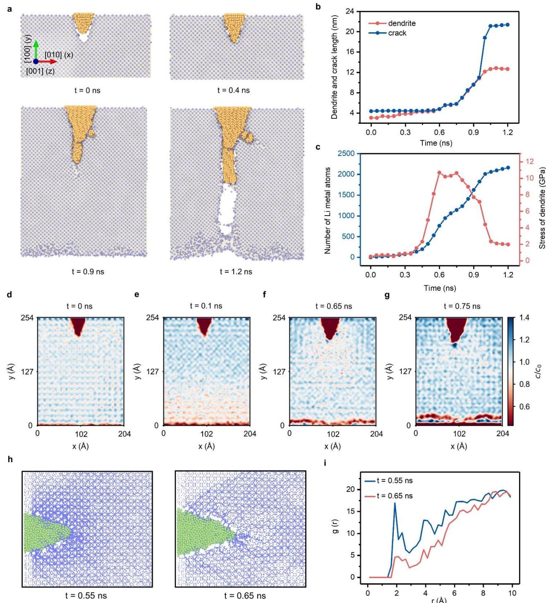
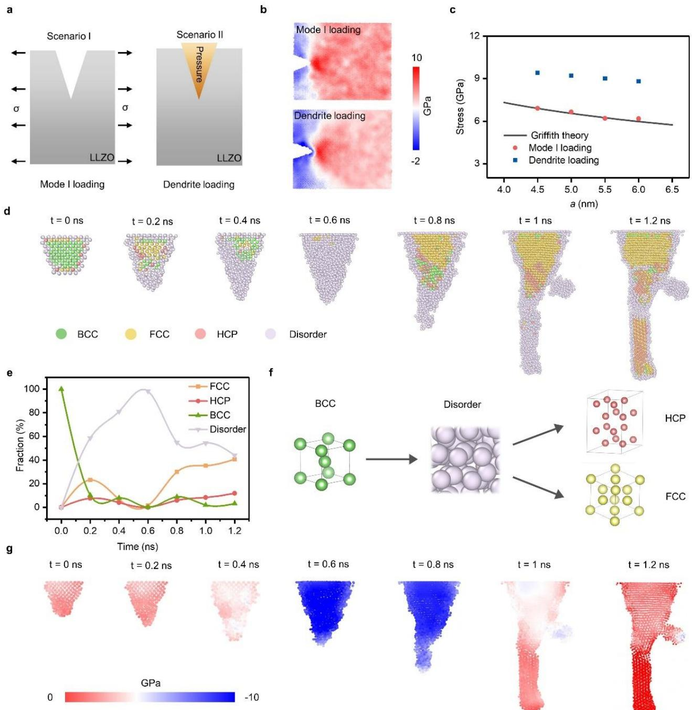
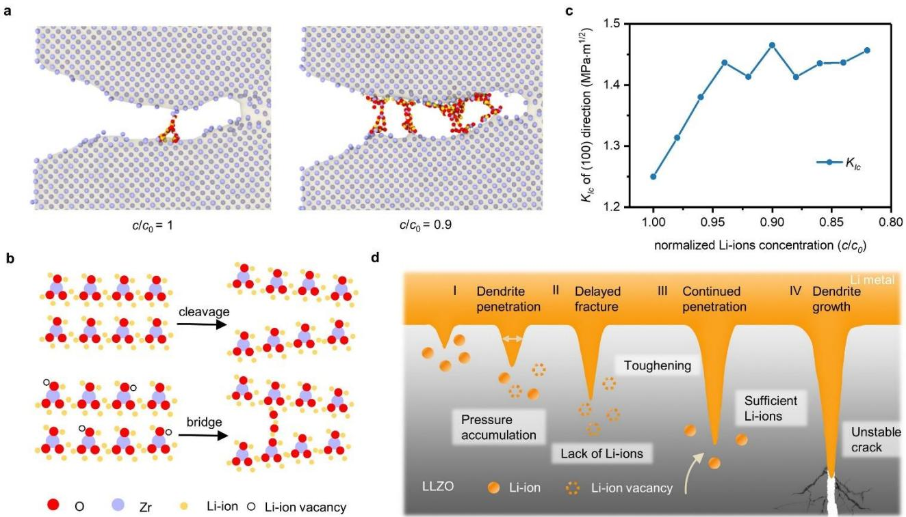
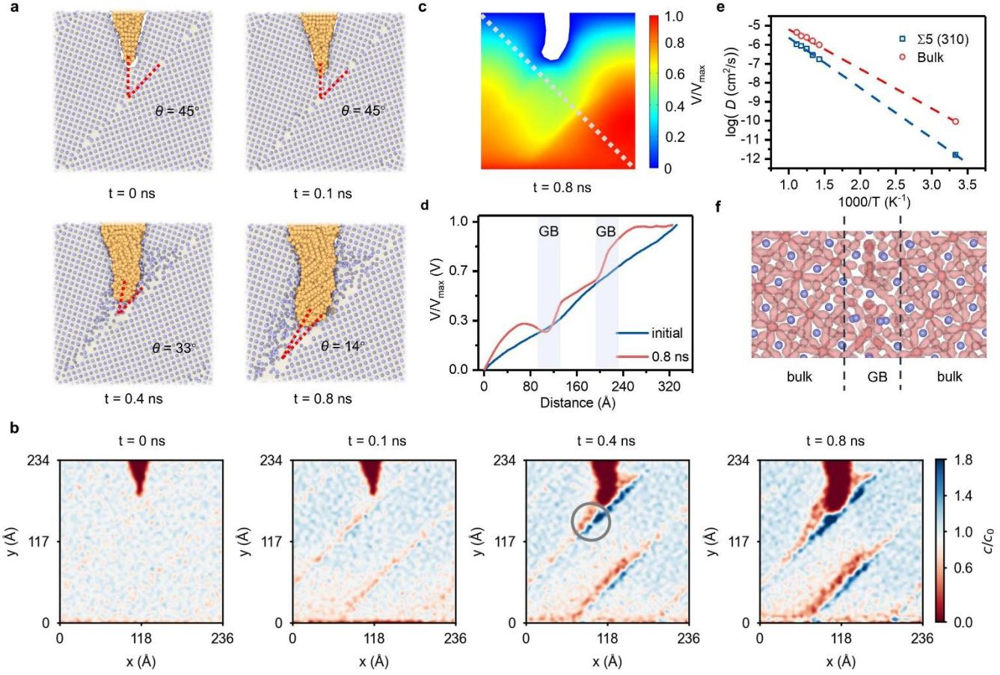
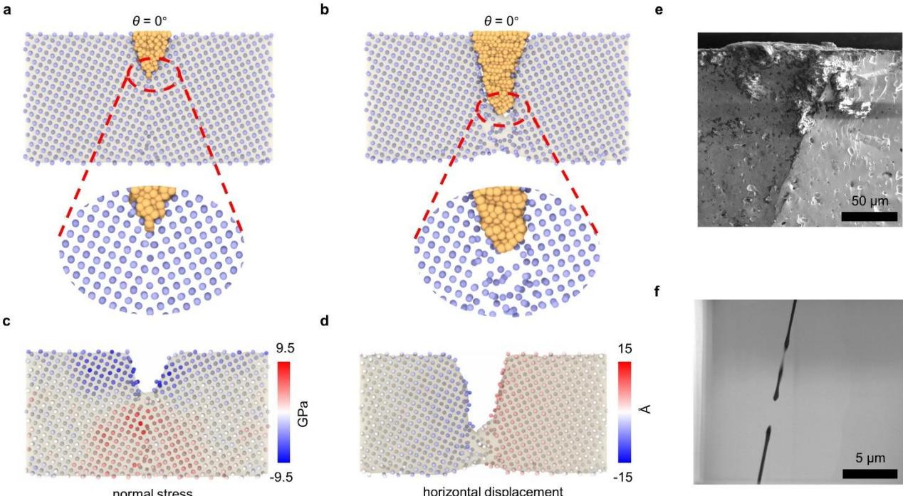
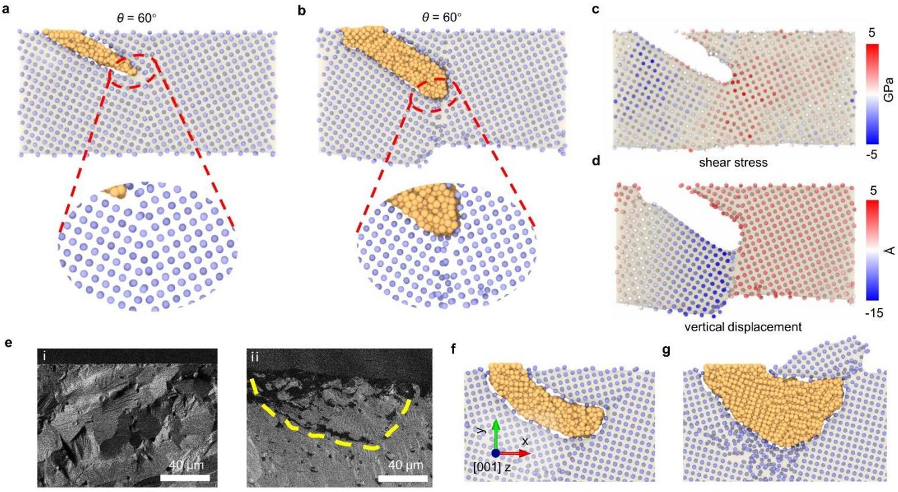

# Atomic mechanism of lithium dendrite penetration in solid electrolytes

Yuanpeng Liu

Harbin Institute of Technology

## Bowen Zhang

Harbin Institute of Technology

## Botao Yuan

Harbin Institute of Technology

## Xin Yan

Xiao Han

Beijing University of Technology

## Jiawei Zhang

Harbin Institute of Technology

Huifeng Tan Harbin Institute of Technology

Changguo Wang Harbin Institute of Technology

## Pengfei Yan

Beijing University of Technology <https://orcid.org/0000-0001-6387-7502>

## Huajian Gao

Center for Advanced Mechanics and Materials, Applied Mechanics Laboratory, Department of Engineering Mechanics, Tsinghua University

## Article

Keywords:

Posted Date: April 26th, 2024

DOI: <https://doi.org/10.21203/rs.3.rs-4223442/v1>

License: This work is licensed under a Creative Commons Attribution 4.0 International License. [Read Full License](https://creativecommons.org/licenses/by/4.0/)

Version of Record: A version of this preprint was published at Nature Communications on February 24th, 2025. See the published version at [https://doi.org/10.1038/s41467-025-57259-x.](https://doi.org/10.1038/s41467-025-57259-x)

## **Atomic mechanism of lithium dendrite penetration in solid electrolytes**

Bowen Zhang1,2,\*, Botao Yuan1,2,\*, Xin Yan3 , Xiao Han4 , Jiawei Zhang1,2, Huifeng Tan1,2, Changuo Wang1,2, Pengfei Yan4 , Huajian Gao5,6,7#, Yuanpeng Liu1,2, #

1Center for Composite Materials, Harbin Institute of Technology, Harbin, 150001, China

2National Key Laboratory of Science and Technology on Advanced Composites in Special Environments, Harbin Institute of Technology, Harbin 150080, China

3 School of Mechanical Engineering and Automation, Beihang University, Beijing 100191, China

4 Beijing Key Laboratory of Microstructure and Property of Solids, Faculty of Materials and Manufacturing, Beijing University of Technology, Beijing 100124, China

5 School of Mechanical and Aerospace Engineering, Nanyang Technological University, Singapore 639798, Singapore 6 Institute of High-Performance Computing, A\*STAR, Singapore 138632, Singapore

7 Mechano-X Institute, Applied Mechanics Laboratory, Department of Engineering Mechanics, Tsinghua University, Beijing 100084, China

\*These authors contributed equally to this work.

#Corresponding authors. E-mail: liuyp@hit.edu.cn; gao.huajian@mail.tsinghua.edu.cn

#### **Abstract**

**Lithium dendrite penetration through ceramic electrolytes is known to result in mechanical failure and short circuits, which has impeded the commercialization of all-solid-state lithium anode batteries. However, the underlying mechanism still remains under debate, due in part to a lack of in situ atomic-level observations of the dendrite penetration process. Here, we employ large-scale molecular dynamics simulations to reproduce the dynamic process of dendrite nucleation and penetration. Our findings reveal that dynamically generated lithium depositions lead to a continuous accumulation of internal stress, culminating in fracture of the solid electrolyte at dendrite tips. We demonstrate that the classical Griffith theory remains effective in assessing this fracture mode, but it is necessary to consider the electrochemical impact of local lithium ion concentration on the fracture toughness. Additionally, in polycrystalline solid electrolytes, we observe that initial defects or dendrite nuclei within grains typically deflect towards and propagate along grain boundaries. Simulations and experimental evidence both identify that dendrite induced fractures at grain boundaries exhibit a mixed Mode I and Mode II pattern, contingent on their fracture toughness and the angle between dendrites and grain boundaries. These insights deepen our understanding of dendrite penetration mechanisms and may offer valuable guidance for improving the performance of solid electrolytes.**

#### **Introduction**

All-solid-state lithium batteries (ASSLBs) hold great promise for greater energy density, increased reliability, fast charging and, most importantly, improved operational safety1-4. However, the commercialization of ASSLBs has been hindered, due in large part to the growth of lithium dendrites5-12 . The penetration of dendrites into solid electrolytes (SEs) poses a significant concern, as it can readily result in mechanical failure or fracture of the SEs, risking potentially catastrophic battery failure. It had been originally anticipated that SEs would prevent the dendrites penetration by virtue of their mechanical rigidity. But recent experiments have demonstrated dendrite formation and growth in SE systems, such as garnets, thiophosphates, and argyrodites, are much easier than in their liquid counterparts13, 14. Obviously, the mechanism of dendrite penetration in ASSLBs remains to be clarified.

Recent studies hold two prevailing views on the mechanism of dendrite penetration. In the context of fracture mechanics, one viewpoint insists that stress accumulates within defects during lithium deposition, ultimately surpassing the mechanical strength of SE and resulting in the formation of cracks9, 11, 12, 15-20. In return, the newly formed crack provides vacant space for continuous dendrite growth. The alternative argument suggests that dendrite penetration arises from electrochemical degradation, wherein lithium ions are preferentially reduced to lithium metal at grain boundaries and defects. The resultant lithium metal typically forms as isolated deposits away from the electrode surface. These deposits gradually interconnect, culminating in battery failure5, 8, 21-23. Other potential mechanisms, such as stress corrosion24 and dislocation climbing25, 26, have also been proposed to explain the penetration behavior. In the absence of detailed and quantitative data, the root cause of penetration is still under debate.

So far, direct observation of dendrite penetration process into SEs and the concurrent development of cracks during cell operation still face multiple challenges, such as the inability to observe dendrites buried inside SEs, high sensitivity of lithium, complexity of microstructural features and opacity of SEs27, 28 . Although a number of state-of-the-art in situ and operando techniques have shown promises in addressing some of the challenges12, 17, 29-31, they remain restricted by limitations in spatial and time resolutions. As a complement to experimental characterization, molecular modeling offers the possibility to directly simulate the dendrite mechanisms with atomic and femtosecond resolution32-36 .

In this work, we perform large-scale molecular dynamics (MD) simulations to reveal dendrite penetration mechanisms in SEs. Taking Li7La3Zr2O12 (LLZO) as a model SE, we have directly simulated the entire process of lithium ion deposition, dendrite nucleation, penetration, and eventual cracking. During deposition, stress progressively builds up within the dendrite, resulting in the fracture of the SE a process influenced by both mechanics and electrochemistry. By accounting for the effect of lithium ion concentration on fracture toughness, Griffith's theory proves effective in quantitatively assessing dendrite induced fractures. Grain boundaries significantly influence dendrite propagation direction and lithium ion concentration distribution. Combining simulations and experiments indicates that dendrite induced fracture at grain boundaries displays a mixed Mode I and Mode II fracture pattern. This behavior is determined by the fracture toughness of the grain boundaries and the relative orientation of dendrites.

#### **Results**

#### **Dendrite penetration in single-crystal LLZO**

Consider a solid-state battery system consisting of a lithium metal anode and a single-crystal LLZO SE featuring a pre-existing defect, such as a crack, a scratch, or a void, aligned parallel to the [100] direction of the LLZO. Previous studies indicate that among various crystal planes, the (100) plane exhibits the lowest energy37, 38. To mimic the electrodeposition process in batteries, an electric field of 0.1 V/ Å is applied to drive lithium ions towards the anode where they are reduced to lithium atoms at the anode/SE interface. An energy barrier of 0.05 eV is chosen for the conversion of a single lithium ion to a lithium atom within LLZO39, 40. Simultaneously, an equivalent quantity of lithium ions is introduced to the system to ensure overall charge balance (Supplementary Fig.1). Further details on the interatomic potentials and simulation procedures can be found in the Methods section.

Fig. 1a shows the dynamic progression of dendrite penetration in single-crystal LLZO. Initially, the electrodeposition process favors the defect as the nucleation site, leading to a gradual formation of dendrite within the LLZO. Since the pre-existing crack length exceeds that of the dendrite, the crack remains constant in length during *t* = 0-0.6 ns (Fig. 1b). The continuous deposition of lithium ions facilitates the dendrite's progressive growth, eventually penetrating the LLZO and initiating crack formation. The dendrite and crack propagation predominantly align with the [100] direction, with sporadic branching along the [-110] direction. Interestingly, a temporary pause of growth for both dendrite and crack occurs between *t* = 0.65 and 0.75 ns (Fig. 1b and Supplementary Fig. 2), indicating a type of delayed fracture phenomenon. Subsequent lithium deposition leads to a marked acceleration of crack growth after *t* = 0.95 ns, where the propagation rate surges from 20 nm/ns to 156 nm/ns, as inferred from the slope in Fig. 1b, suggesting that the energy release rate has surpassed material's resistance to crack growth, leading to the initiation of unstable propagation. The differential rates of lithium ions deposition and crack propagation cause the dendrite to lag behind the advancing crack tip, a behavior recently captured via *in situ* X-ray computed tomography9, 11 .

To understand the observed delayed fracture during dendrite penetration, we perform a stress analysis of the dendrite and monitor the temporal deposition of lithium ions, as shown in Fig. 1c. Before *t* = 0.4 ns, dendrite grows unrestrictedly, maintaining minimal stress levels inside. However, after *t* = 0.4 ns, the dendrite's expansion within a limited volume leads to the accumulation of compressive stress. The increased stress reduces interfacial resistance, thereby accelerating the deposition of lithium ions41-43 . This positive feedback loop contributes to the rapid buildup of compressive stress within the dendrite. Once the stress reaches approximately 10.5 GPa, crack is initiated at the initial defect. Following the onset of crack propagation, the stress within the dendrite experiences a slight reduction, stabilizing at around 10 GPa, in line with the observed pause in crack growth in Fig. 1b. This stress level aligns with the internal stresses within dendrites that lead to cracking in nano-sized single-crystal LLZO12. After *t* = 0.75 ns, the stress rapidly releases, mirroring the rapid progression of crack advance.

We plot the temporal profile of lithium ions concentration in Fig. 1d. Initially, the distribution of lithium ions is uniform. Upon charging, lithium ions rapidly migrate toward the dendrite under the strong influence of the applied electric field. The presence of a gap at the dendrite-LLZO interface slows the deposition rate, leading to the accumulation and uneven concentration distribution of lithium ions, as observed at *t* = 0.1 ns in Fig. 1d. This concentration distribution stabilizes for an extended period, as evidenced by the negligible change between *t* = 0.1 ns and *t* = 0.4 ns (Supplementary Fig. 3), until being disturbed after *t* = 0.6 ns. Accelerated stress buildup increases the deposition rate, reducing lithium concentration and leading to lithium ion vacancies near the dendrite. These vacancies are directly observable in lithium ion trajectories (Fig. 1e). At the dendrite-LLZO interface, the peak values of the radial distribution functions between lithium atoms and ions show a marked reduction between *t* = 0.65 and 0.75 ns (Fig. 1f), further confirming the decrease in Li-ion concentration. As a result, the dendrite experiences a deficit in lithium ion replenishment, resulting in the observed delayed fracture.

**Fig. 1 | Characterization of dendrite penetration in single-crystal LLZO. a** Snapshots of the progression of dendrite penetration at specific time intervals: 0 ns, 0.4 ns, 0.9 ns and 1.2 ns. Yellow and purple particles represent the Li and Zr atoms, respectively. **b** Temporal variations of dendrite and crack lengths. **c** Temporal dynamics of lithium atom deposition and the resultant internal stress within dendrite. **d-g** Distribution of lithium ions in single-crystal LLZO during dendrite penetration process. **h** Trajectories of lithium ions at 0.55 and 0.65 ns, respectively. **i** Radial distribution function between lithium atom and ion at the dendrite/LLZO interface at 0.55 and 0.65 ns, respectively.

#### **Validity of Griffith theory in assessing LLZO fracture**

Numerous studies use Griffith theory to assess crack propagation in brittle SEs such as LLZO12, 16, 18-20 . In this context, tensile loading (commonly referred to as Mode I loading in fracture mechanics) is applied perpendicular to the crack surface (Scenario I in Fig. 2a), and the critical stress *σc* for crack propagation can be calculated as

$$
\sigma_c \ge \frac{K_{\scriptscriptstyle{IC}}}{Y\sqrt{\pi a}}\tag{1}
$$

where *Y* is a geometrical factor; *a* is the crack length; *KIC* is the Mode I fracture toughness. Based on the aforementioned analysis, the dendrite induced crack in the LLZO can be attributed to the accumulation of internal pressure (Scenario II in Fig. 2a), analogous to the crack induced by an expanding screw40 . Is the classical Griffith theory still valid in this case?

To quantitively evaluate the applicability of Griffith theory, we conduct a simulation to analyze the fracture behavior of LLZO under Mode I loading. Fig. 2b compares the critical stress states at fracture in LLZO subjected to the two different loadings with the same initial crack length. The stress distribution characteristic at the crack tip under dendrite loading is consistent with that under Mode Ⅰ loading. Furthermore, LLZO exhibits typical brittle behavior, and the critical stress under Mode I loading aligns with Griffith theory predictions. According to the theory, the critical stress is inversely proportional to the square root of the crack length (indicated by the black line in Fig. 2c). However, the critical stress under dendrite loading exceeds that under Mode I loading (as shown by the blue and red dots in Fig. 2c).

To clarify the observed discrepancy, we analyze the electrodeposition state of lithium metal inside the dendrite. It is known that lithium ions are deposited as amorphous nuclei and then rapidly crystallize, ultimately stabilizing in a body-centered cubic (BCC) lattice structure45. In our simulation, lithium ions are also deposited initially as an amorphous phase, but with a noteworthy distinction: the lithium metal gradually crystallized in a confined space, forming a hybrid structure composed of a face-centered cubic (FCC) and hexagonal close-packed (HCP) arrangement (Fig. 2e-f). Recent studies have indicated that the FCC phase is the ground state structure of lithium metal, and high pressure plays a key role in maintaining the FCC phase. The presence of numerous amorphous phases and grain boundaries (Supplementary Fig. 4) provides multiple pathways for the slip motion of lithium metal, promoting mobility and maintaining uniform pressure inside the dendrite (Fig. 2g). This consistent pressure distribution during deposition satisfies the prerequisite for applying Mode I loading in classical fracture mechanics to assess dendrite loading.

**Fig. 2 | Validating the applicability of Griffith theory and analysis of lithium metal states inside dendrites. a**  Scenarios of dendrite loading and Mode I loading. **b** Normal stress distribution in the LLZO under dendrite loading (*t*  =0.6 ns) and Mode Ⅰ loading. **c** Calculated critical stresses under dendrite loading (*t* =0.6-0.75 ns) and Mode Ⅰ loading. **d** Atomic structure of lithium metal inside the dendrite during deposition. **e** Fraction curves of different crystalline types inside the dendrite. **f** Schematic representation of the transition process of lithium metal atomic stacking structures,

starting from the BCC (left) configuration, moving to the disordered configuration (center), and finally transitioning to the HCP and FCC configurations (right). **g** Stress distribution inside the dendrite.

Subsequently, we calculate the fracture toughness of single-crystal LLZO at various lithium ion concentrations. A decreased lithium ions concentration leads to the formation of additional bridges behind the crack tip (Fig. 3a). The reduced concentration of metal cations results in a relatively higher concentration of oxygen anions, thereby promoting the formation of oxygen bridges where multiple oxygen anions share the same cation (Fig. 3b). These oxygen bridges connect the separated surfaces and hinder further crack propagation, consequently enhancing the fracture toughness of LLZO (ranging from 1.25 to 1.46 MPaꞏm1/2 , in Fig. 3c). Thus, to quantitatively assess the LLZO crack behavior using Griffith theory, it is essential to account for the variations in fracture toughness associated with lithium ion concentration.

**Fig. 3 | Toughening mechanisms during the dendrite penetration process. a** Atomic structure of single-crystal LLZO under a strain loading of 0.13, with normalized lithium ions concentration of *c*/*c*0=1 and 0.9, respectively. **b** Schematic of the transition of fracture from cleavage to bridging due to the decreased Li-ions concentration. **c** Fracture toughness (*KIC*) under Mode Ⅰ loading as a function of normalized lithium ions concentration for single-crystal LLZO. **d** Progression of dendrite penetration in the single-crystal LLZO.

As a result, the progression of dendrite penetration in single-crystal LLZO can be divided into four stages, as shown in Fig. 3d. Initially, stress accumulates progressively inside the dendrite during deposition (Stage I). Simultaneously, a decrease in lithium ion concentration occurs, contributing to the SE toughening and resulting in delayed fracture (Stage II). Once sufficient lithium ion levels are reached, dendrites continue to penetrate into the SE (Stage III). As the crack length extends, the crack experiences unstable growth, causing the dendrites to lag behind the cracks. Finally, dendrite propagates along the crack, traversing the entire SE and resulting in catastrophic failure (Stage IV).

#### **Dendrite penetration in polycrystalline LLZO**

To investigate the effect of grain boundaries on the dendrite penetration, we construct a polycrystalline LLZO system featuring ∑5(310) grain boundaries, a configuration commonly observed in experiments46 . An initial dendrite orientation inclined at 45° to the grain boundary is selected. Details of the model are described in the Methods section.

Fig. 4a shows local snapshots of the dendrite penetration in polycrystalline LLZO at different time points. Initially, the dendrite grows straightforward within the grain, maintaining an angle of 45° with respect to the grain boundary during *t* = 0~0.1 ns (Fig. 4a). As lithium ions continue to deposit, the dendrite tip deflects significantly (from 45° at *t* = 0.1 ns to 33° at *t* = 0.4 ns) as it approaches the grain boundary. At *t* = 0.8 ns, the angle between the dendrite tip and the grain boundary has reduced to 14°, almost aligning parallel to the grain boundary. Subsequently, the dendrite triggers the initiation of unstable crack growth along the grain boundary (Supplementary Fig. 5). The crack propagation results in the creation of free surfaces between the two adjacent grains, which in return prompts the dendrite penetration. The above observations indicate that even if the initial defects or dendrite nuclei are located in the interior of the grain, they tend to deflect toward the grain boundary and continue to grow along the grain boundary. These phenomena are consistent with experimental observations, wherein dendrite-induced intergranular cracks are commonly noted, whereas transgranular cracks are seldom reported29, 30, 47-49 .

Fig. 4b shows the distribution of lithium ions inside the LLZO during the dendrite penetration. Initially, lithium ions exhibit uniform distribution throughout the LLZO, with no noticeable accumulations. As deposition continues, the lithium ion concentration exhibits a step-like pattern along both sides of the grain boundaries. One side exhibits a low concentration, while the other side features a high concentration. At *t* = 0.4 ns, the concentrations on both sides of the grain boundary are measured to be 0.5 and 1.7, respectively

(marked with the grey circle in Fig. 4b), and this difference in concentration increases over time. The presence of the grain boundary appears to impede the diffusion of lithium ions, giving rise to such distinctive concentration distribution. The distribution of lithium ions at grain boundaries resembles a space charge layer and induces changes in the potential field. To model the potential distribution within the system, we employ the finite element method, using the charge distribution of the system at both *t* = 0 and 0.8 ns as input conditions. Details of the calculation setup can be found in the Methods section.

**Fig. 4 | Characterization of Li metal dendrite penetration in polycrystalline LLZO with ∑5(310) grain boundaries. a** Snapshots of the progression of dendrite penetration in polycrystalline LLZO at specific time intervals: 0 ns, 0.1 ns, 0.4 ns and 0.8 ns. Yellow and purple particles represent the Li metal and Zr atoms, respectively. **b** Distribution of lithium ions in polycrystalline LLZO during dendrite penetration. **c** Normalized potential distribution within polycrystalline LLZO at 0.8 ns. **d** Normalized potential curve on the white dashed line in (**c**). **e** Arrhenius plots of diffusion coefficients in Σ5(310) GB and bulk of LLZO, respectively. **f** Lithium ions trajectory densities from the MD simulations.

The potential distributions within the LLZO at *t* = 0 and 0.8 ns are shown in Fig. 4c and Supplementary Fig. 6, respectively. At *t* = 0.8 ns, a large number of lithium ion vacancies on one side of the grain boundary exhibits a negative charge, while a significant accumulation of lithium ions on the other side exhibits a positive charge. This gives rise to an internal potential between the two sides, leading to a sharp drop in the potential at the grain boundary (Fig. 4d). This finding is in good agreement with the phenomenon observed in recent experiments, where the Galvani potential drops at grain boundaries near the lithium metal electrode during deposition22. The internal electric field associated with the space charge layer acts in the same direction as lithium ions diffusion, potentially promoting diffusion rather than inhibiting it, which contrasts with the previous viewpoints50-52. Therefore, the atomic structure at the grain boundaries results in a uninform distribution of lithium ions.

To quantitively analyze the effect of grain boundaries on lithium ion diffusion kinetics, we calculate the lithium ion diffusivity (*D*) of the grain boundaries and bulk phase of the LLZO. Calculation details are described in the Methods section. Fig. 4e displays the Arrhenius plots of diffusion coefficients in Σ5(310) grain boundary and bulk of LLZO, respectively. For bulk LLZO, the calculated lithium ion diffusivity at 300 K is 8.9×10-11cm2 /s, and the activation energy (*E*a) is 0.48 eV. However, the lithium diffusivity at the grain boundaries is significantly reduced, approximately 56 times lower at 1.59×10-12 cm2 /s (Fig. 4e and Supplementary Fig. 7). In addition, the activation energy (*E*a) increases to 0.6 eV, suggesting higher energy barriers for diffusion need to be overcome near the grain boundary. Fig. 4f and Supplementary Fig. 8 compare the migration probability density of lithium ions at grain boundaries and in the bulk phase. Lithium ions in the bulk phase exhibit continuous diffusion behavior, while those at the grain boundaries display more pronounced discontinuous diffusion behavior, characterized by a higher proportion of immobile lithium ions. It is noteworthy that, despite the pronounced lithium ion concentration gradient across grain boundaries, lithium dendrite growth does not clearly lean towards either higher or lower concentration areas. This implies that lithium ion concentration is not the main factor determining the growth direction of dendrite-induced crack.

#### **Mixed-mode fracture**

We conduct simulations using two incident angles of the dendrite relative to the grain boundary (i.e., *θ* = 0° and 60°). Further details regarding the model parameters can be found in the Methods section. When the incident angle of the dendrite is parallel to the grain boundary (i.e., *θ* = 0°), the dendrite traverses along the grain boundary (Fig. 5a-b). The stress distribution map in Fig. 5c obviously shows stress concentration at the crack tip, while the atomic displacement map in Fig. 5d displays a symmetric crack opening pattern. These observations collectively suggest Mode I fracture. Similar observations are also captured in the experiment (Details are described in Experiments section), where dendrites grow along the grain boundaries and induce Mode I cracks (Fig. 5e-f).

**Fig. 5 | Mode Ⅰ fracture in polycrystalline LLZO. a-b** Atomic structures at the initial (a) and during penetration (b) of a dendrite at incidence angle of 0° to the grain boundary. The polycrystalline model features a ∑5(310) grain boundary. **c** Normal stress distribution of the polycrystalline LLZO. **d** Horizontal displacement distribution of the polycrystalline LLZO. **e-f** Cross-section SEM observations of Mode Ⅰ fracture in polycrystalline LLZO with 50 µm (**e**) and 5 µm (**f**) scales, respectively.

When the incident angle of the dendrite is *θ* = 60°, the dendrite continues to grow along the grain boundary, but the fracture pattern significantly diverges from the *θ* = 0° case (Fig. 6a-b). The shear stress distribution map (Fig. 6c) reveals that shear stress is broadly distributed along the grain boundary instead of concentrating at the crack tip. Additionally, the atomic displacement map (Fig. 6d) highlights an asymmetric crack pattern. These two characteristics collectively confirm that the dendrite induced a predominantly Mode II fracture at the grain boundary.

Meanwhile, the scanning electron microscope (SEM) observation of the peeling phenomenon in the polycrystalline LLZO provides additional evidence for the existence of Mode II fracture, as shown in Fig. 6e. Molecular simulations are conducted to replicate the dynamic peeling process, as presented in Fig. 6fg and Supplementary Fig. 9. The dendrite penetration into the polycrystalline LLZO induces the Mode II crack at the grain boundary, resulting in sliding between two adjacent grains and their subsequent peeling from the LLZO.

**Fig. 6 | Mode Ⅱ fracture in polycrystalline LLZO. a-b** Atomic structures at the initial (a) and during penetration (b) of a dendrite at incident angle of 60° to the ∑5(310) grain boundary. **c** Shear stress distribution in the polycrystalline LLZO. **d** Vertical displacement distribution of the polycrystalline LLZO. **e** Cross-section SEM observations of initial (**i**) and peeling (**ii**) of the polycrystalline LLZO surface with 40 µm scale. **f-g** Simulated atomic structures of the polycrystalline LLZO surface before (**f**) and after (**g**) peeling. The surface peeling model was constructed by rotating several grains around a random axis oriented along the [001] direction.

The observations from Figs. 5-6 indicate that dendrite penetration leads to mixed-mode fractures (Mode Ⅰ and Mode Ⅱ fractures, as shown in Figs. 7a-b) at the grain boundaries of polycrystalline LLZO. Our calculations of fracture toughness for both the bulk and grain boundaries of LLZO (Fig. 7c) reveal that, in comparison to the bulk, the grain boundaries exhibit markedly lower Mode I and Mode II fracture toughness ( *GB KIc* and *GB KIIc* ). Additionally, the *GB KIIc* of the grain boundaries is much smaller than *GB KIc* , estimated as 0.33 *GB GB K K IIc Ic* at the ∑3(112) grain boundary, indicating the Mode Ⅱ fracture is more likely to occur at grain boundaries as opposed to Mode Ⅰ fracture.

**Fig. 7 | Mix-mode fracture due to dendrite penetration along grain boundary. a-b** Schematic illustration of the fracture modes with the dendrite-grain boundary angle at 0° (**a**) and 60° (**b**). **c** Mode Ⅰ and Mode Ⅱ fracture toughness of the bulk and along the grain boundary. Grain boundaries R1, R2, and R3 are formed by rotating multiple grains around a randomly oriented axis along the [001] direction. **d** Phase map of dendrite induced intergranular and transgranular fracture at grain boundary. *gen KIc* is calculated based on a grain boundary model where the orientation of the crystal axis and the angle are established entirely randomly through rotation.

To investigate the deflection of dendrites at grain boundaries, we develop an analytical model based on fracture mechanics. In this model, dendrite is initially inclined at an angle *θ* to the grain boundary of the SE (Supplementary Fig. 10b). Both the grain and grain boundary are treated as uniform and isotropic materials. Based on our previous findings, the pressure within the dendrite is assumed to be uniform. Detailed derivations of the model are provided in the Methods section. Fig. 7d shows the phase diagram of intergranular and transgranular crack as a function of incidence angle and fracture toughness ratio (*ω=* / *GB gen K K IIc Ic* ), derived from the theoretical model. The results indicate that dendrite transgranular growth is confined to a narrow range of parameters (*ω* > 0.43 and *θ* > 73°, indicated by the blue region in the Fig. 7d). For instance, using the toughness of the R3 grain boundary as a reference, transgranular growth of dendrites is observed only for *θ* > 78°. Specifically, at the ∑3(112) grain boundary, dendrites grow along

the grain boundary at all observed angles. The pronounced reduction in *GB KIIc* significantly increases the likelihood of dendrites deflecting and propagating along grain boundaries. These results are consistent with experimental observations, showing that dendrites seldom penetrate across grain boundaries, rather they predominantly move along them instead29, 30, 47-49. Thus, improving the mechanical properties of grain boundaries and strategically designing and optimizing their pathways are crucial for mitigating and controlling dendrite penetration.

#### **Summary**

In summary, large-scale MD simulations are performed to enable direct atomic-scale investigation in the process of dendrite penetration into SEs and the concurrent development of cracks during cell operation. Our findings demonstrate that the fracture process is governed by both mechanical and electrochemical dynamics. Specifically, as lithium ions are deposited, internal stress within the dendrites builds up, eventually causing SE fracture at the dendrite tip. While Griffith's theory remains applicable for evaluating dendrite-induced fractures in battery systems, it tends to underestimate the critical stress required for fracture. This discrepancy primarily arises from an increase in the SE's toughness due to the localized reduction in lithium ion concentration. In polycrystalline SEs, initial defects or dendrite nuclei within the grain often deflect towards and propagate along the grain boundaries. Both simulations and experiments demonstrate fracture at grain boundaries predominantly occurring in a mixed mode. Notably, a decrease in Mode II fracture toughness at grain boundaries is identified as a key factor driving intergranular crack. These findings offer atomic insights into the penetration mechanisms of dendrites and contribute essential knowledge towards improving the performance of SEs.

#### **Methods**

#### **Simulations**

The atomistic modeling of dendrite penetration in LLZO includes an initial lithium metal dendrite, the LLZO and the source of lithium ions. The interactions among the LLZO atoms are modeled with the Buckingham–Coulomb potential, which can describe both the short-range nuclear repulsion and longrange Coulombic attraction or repulsion53. The interactions between lithium metal atoms are modeled with the second nearest-neighbor (2NN) embedded MEAM force field54. The UFF force field55 is used to describe the interactions between lithium atoms and LLZO. Periodic boundary conditions are applied in x and z directions, and the boundaries are left free in y direction (Fig.1a). MD simulations are performed using NPT ensemble at a constant temperature of 300K. An electric field of 0.1 VÅ-1 is applied to the system along y direction to accelerate the lithium ions diffusion. A cutoff radius of 1.75 Å, corresponding to the reduction energy barrier of 0.05 eV, is selected for converting lithium ions into atoms within LLZO. Lithium ions within this radius from lithium metal atoms undergo transformation into metal atoms. Simultaneously, an equivalent number of lithium ions are randomly generated in the lithium source region to maintain charge balance within the system. (see Supplementary Fig. 1). Information on the computational models of single-crystal and polycrystalline cases can be found in the Supplementary Fig. 11-14.

To determine the diffusion coefficients (*D*) for lithium ions in LLZO, we calculate the MSD at five distinct temperatures (700, 750, 800, 850, and 900 K) using NVT ensemble. The MSD data was collecting over a 0.5 ns MD simulation window. The diffusion coefficient calculation is calculated from:

$$
D = \frac{1}{2Ndt} \sum_{i=1}^{N} \left\langle \left[ r_i \left( t + t_0 \right) - r_i \left( t_0 \right) \right]^2 \right\rangle \tag{2}
$$

where *N* and *d* refer to the total number of lithium ions and the dimensionality (*d*=3 in our system) in the system, respectively; *t*0 is the initial time, and *ri*(*t*) represents the displacement of the *i*-th lithium ion at time *t*. To determine the diffusivity at room temperature, we extrapolated the higher-temperature data collected between 700 and 900 K. Then, the activation energy (*E*a) was then calculated by fitting the Arrhenius equation, and the results were plotted in Fig. 4e.

$$
D(T)=D_0\times e^{-\frac{E^u}{k_BT}}
$$
\n(3)

where *D*0 is the pre-exponential factor, and *k*B is the Boltzmann constant. We separately calculated the diffusivity in the regions 4 Å away from the grain boundaries and 8 Å away from the grain centers for both grain boundary and bulk. For better illustration, the model and region division are shown in Supplementary Fig. 15.

All molecular dynamics (MD) simulations are conducted using the Large-scale Atomic/Molecular Massively Parallel Simulator (LAMMPS) package56. The atomic model was constructed using the Atomsk software57. For visualization purposes, atomistic configurations and trajectories were analyzed using Ovito software58. To classify the local structural environments of lithium atoms, we employ the polyhedral template matching (PTM) method59 with a root-mean-square deviation (RMSD) cutoff of 0.15. To calculate the migration probability density of lithium ions, we utilize the diffusion module of pymatgen60

and further visualize the results using Vesta software61 .

Finite element calculations are conducted using COMSOL Multiphysics 5.5 simulation software. The potential difference is determined by solving Poisson's equation, and the net charge distribution at different time is obtained from the previous molecular simulations. The electric field magnitude in the vertical direction is set to be 0.1 V/Å. The grid size used in the simulations is 2-4 Å. The relative permittivity of LLZO is set to be 15262 .

#### **Analytical methods**

We have developed an analytical model for predicting dendrite penetration in polycrystalline solid electrolytes using a plane strain framework. The schematic diagram of the model is shown in the Supplementary Fig. 10a. From the preceding discussion, it is evident that there exists uniform pressure within the dendrite, which can be effectively represented as a Mode I loading. In the direction of an angle α with respect to the crack, the fracture toughness factor *KI*(*α*) and *KII*(*α*) can be computed using the following equation63:

$$
K_{I}(\alpha) = C_{11} K_{I0}, \ K_{II}(\alpha) = C_{21} K_{I0}
$$
 (4)

In this equation, *KI0* represents the stress intensity factor computed considering the uniform pressure distribution within the dendrite, while *C*11, *C*21 are coefficients determined by the angle *α*:

$$
C_{11} = \frac{3}{4}\cos(\frac{\alpha}{2}) + \frac{1}{4}\cos(\frac{3\alpha}{2}), \quad C_{21} = \frac{1}{4}\sin(\frac{\alpha}{2}) + \frac{1}{4}\sin(\frac{3\alpha}{2})
$$
(5)

When *α* is non-zero, as depicted by Equation (5), *KII*(*α*) is not equal to zero. This indicates that crack propagation in the *α* direction is driven by a combination of mode I and mode II stress intensity factors. Given the disparate critical fracture toughness factors for Mode I (*KIc*) and II (*KIIc*) fractures in solid electrolytes, and drawing from the Tsai–Hill failure criteria64,65, we have adopted the following mixed mode fracture criterion for polycrystalline solid electrolytes:

$$
f(\alpha) = \frac{K_I(\alpha)^2}{K_{Ic}^2} + \frac{K_{II}(\alpha)^2}{K_{Ilc}^2} \ge 1
$$
 (6)

In the course of lithium ions deposition, the expansion of dendrites, induced by the deposition of fresh lithium metal, results in an ever-increasing *KI0*. When a dendrite encounters a grain boundary at an angle *θ*, and if it continues to propagate along its initial trajectory, this can be categorized as transgranular fracture, with *α*=0. Substituting the fracture toughness factors for Mode I ( *bulk KIc* ) within the grain into Equation (6), we derive the criterion function for transgranular fracture:

$$
f(0) = \frac{K_{10}^{2}}{K_{1c}^{bulk^{2}}}
$$
 (7)

Conversely, if the dendrite propagates along a direction inclined at an angle *θ*, it is regarded as intergranular fracture. Substituting the fracture toughness factors for Mode I ( *GB KIc* ) and II ( *GB KIIc* ) at the grain boundary into Equation (6), we derive the criterion function for intergranular fracture:

$$
f(\theta) = \frac{K_I(\theta)^2}{K_{Ic}^{GB^2}} + \frac{K_{II}(\theta)^2}{K_{Ilc}^{GB^2}}
$$
 (8)

Henceforth, we can establish the following criteria for fracture initiation and crack propagation within a polycrystalline structure:

$$
\begin{cases}\nf(0) < 1 \text{ and } f(\theta) < 1, \text{ uncracked} \\
f(0) < f(\theta) \text{ and } f(\theta) \ge 1, \text{ intergranular crack} \\
f(0) \ge 1 \text{ and } f(\theta) < f(0), \text{ transgranular crack}\n\end{cases}
$$
\n(9)

#### **Experiments**

#### **Characterization**

Cross-section SEM observation high voltage is 5 kV. Transmission Electron Microscope (TEM) specimens were prepared using a focused ion beam (FEI Helios NanoLab 600i) operating at 2–30 kV. A Pt/C protecting layer with a thickness of 2 μm (200 nm e-beam deposition followed by 2 μm Ga ion beam deposition) was deposited on the LLZO cross-section surface to avoid radiation damage caused by the ion beam. The FIB-prepared samples were investigated using a FEI Titan G2 60–300 microscope at 300 kV. This microscope was equipped with a probe spherical aberration corrector, enabling sub-angstrom imaging using Scanning Transmission Electron Microscopy-High Angle Annular Dark Field (STEM-HAADF) detectors.

#### **Synthesis**

The synthesis of LLZO ceramics used stoichiometric LiOH (Alfa Aesar, 99.995%), La(OH)3, and ZrO2 (Aladdin Reagent, 99.99%), as well as a 10 wt.% excess of LiOH to compensate for volatile Li components. The powder was wet-milled in ethanol for 18 hours, followed by drying at 80 ℃ in a drying oven for 12 hours, and then heated in air at 900 ℃ for 12 hours to ensure the formation of cubic LLZO

phase. After that, the powders were ball-milled for 12 hours again. Following this, the powders were pressed into pellets with a diameter of 10 mm at 500 MPa and sintered in air at 1200 ℃ for 15 h. During sintering, the pellets were covered with the mother powders and put in a covered magnesium oxide crucible in a tube furnace.

#### **Electrochemical performance test**

For electrochemical measurements, the sintered particles were polished with 200, 400, 600, and 1200 grit SiC abrasive paper. The thickness of pellets was 800-1000 μm. Li/LLZO/Li symmetric cells were assembled in an argon-filled glove box, and Li metal was attached to both sides of the LLZO and then heated to 180°C for one minute on a heating table to enhance the contact at the interface. Then the cells were packaged in 2032-coin cell cases and the edge of the cells was sealed by epoxy resin. Galvanostatic cycling was conducted using CT2001A cell test system from Wuhan LAND Electronic Co., Ltd at different current densities for 1 h/cycle at room temperature.

#### **Data availability**

The authors declare that all the relevant data are available within the paper and its Supplementary Information file or from the corresponding author upon reasonable request.

#### **Reference**

- 1. Han X*, et al.* Negating interfacial impedance in garnet-based solid-state Li metal batteries. *Nature Materials* **16**, 572-579 (2017).
- 2. Janek J, Zeier WG. A solid future for battery development. *Nature Energy* **1**, 16141 (2016).
- 3. Kato Y*, et al.* High-power all-solid-state batteries using sulfide superionic conductors. *Nature Energy* **1**, 16030 (2016).
- 4. Janek J, Zeier WG. Challenges in speeding up solid-state battery development. *Nature Energy* **8**, 230-240 (2023).
- 5. Han F*, et al.* High electronic conductivity as the origin of lithium dendrite formation within solid electrolytes. *Nature Energy* **4**, 187-196 (2019).
- 6. Kazyak E*, et al.* Li penetration in ceramic solid electrolytes: operando microscopy analysis of morphology, propagation, and reversibility. *Matter* **2**, 1025-1048 (2020).
- 7. Wang H*, et al.* Linking the defects to the formation and growth of Li dendrite in all‐solid‐state batteries. *Advanced Energy Materials* **11**, 2102148 (2021).
- 8. Reisecker V*, et al.* Effect of pulse-current-based protocols on the lithium dendrite formation and evolution in all-solid-state batteries. *Nature Communications* **14**, 2432 (2023).
- 9. Ning Z*, et al.* Dendrite initiation and propagation in lithium metal solid-state batteries. *Nature* **618**, 287-293 (2023).
- 10. Kasemchainan J*, et al.* Critical stripping current leads to dendrite formation on plating in lithium anode solid electrolyte cells. *Nature Materials* **18**, 1105-1111 (2019).
- 11. Ning Z*, et al.* Visualizing plating-induced cracking in lithium-anode solid-electrolyte cells. *Nature Materials* **20**, 1121-1129 (2021).
- 12. Gao H*, et al.* Visualizing the failure of solid electrolyte under GPa-level interface stress induced by lithium eruption. *Nature Communications* **13**, 5050 (2022).
- 13. Cao D, Sun X, Li Q, Natan A, Xiang P, Zhu H. Lithium dendrite in all-solid-state batteries: growth mechanisms, suppression strategies, and characterizations. *Matter* **3**, 57-94 (2020).
- 14. Takada K. Progress and prospective of solid-state lithium batteries. *Acta Materialia* **61**, 759-770 (2013).
- 15. Porz L*, et al.* Mechanism of Lithium Metal Penetration through Inorganic Solid Electrolytes. *Advanced Energy Materials* **7**, 1701003 (2017).
- 16. Fincher CD*, et al.* Controlling dendrite propagation in solid-state batteries with engineered stress. *Joule* **6**, 2794-2809 (2022).
- 17. Sun H*, et al.* In situ visualization of lithium penetration through solid electrolyte and dead lithium dynamics in solid-state lithium metal batteries. *ACS nano* **15**, 19070-19079 (2021).
- 18. Athanasiou CE*, et al.* Operando measurements of dendrite-induced stresses in ceramic electrolytes using photoelasticity. *Matter*, (2023).
- 19. Klinsmann M, Hildebrand FE, Ganser M, McMeeking RM. Dendritic cracking in solid electrolytes driven by lithium insertion. *Journal of Power Sources* **442**, 227226 (2019).
- 20. Hao F, Wang W, Mukherjee PP. Electrochemical-reaction-driven interfacial stress in a solid-solid layered architecture. *Physical Review Applied* **11**, 034038 (2019).
- 21. Liu X*, et al.* Local electronic structure variation resulting in Li 'filament' formation within solid electrolytes. *Nature Materials* **20**, 1485-1490 (2021).
- 22. Zhu C*, et al.* Understanding the evolution of lithium dendrites at Li6. 25Al0. 25La3Zr2O12 grain boundaries via operando microscopy techniques. *Nature Communications* **14**, 1300 (2023).
- 23. De Jonghe LC, Feldman L, Beuchele A. Slow degradation and electron conduction in sodium/betaaluminas. *Journal of Materials Science* **16**, 780-786 (1981).
- 24. Qi Y, Ban C, Harris SJ. A new general paradigm for understanding and preventing Li metal penetration through solid electrolytes. *Joule* **4**, 2599-2608 (2020).
- 25. Shishvan SS, Fleck NA, McMeeking RM, Deshpande VS. Dendrites as climbing dislocations in ceramic electrolytes: Initiation of growth. *Journal of Power Sources* **456**, 227989 (2020).
- 26. Shishvan SS, Fleck NA, McMeeking RM, Deshpande VS. Growth rate of lithium filaments in ceramic electrolytes. *Acta Materialia* **196**, 444-455 (2020).
- 27. Zhang L*, et al.* Recent Advances in In-situ and Operando Characterization Techniques for Li7La3Zr2O12-Based Solid-State Lithium Batteries. *Materials Horizons*, (2023).
- 28. Yang S*, et al.* In situ characterization of lithium-metal anodes. *Journal of Materials Chemistry A* **10**, 17917-17947 (2022).
- 29. Krauskopf T*, et al.* Lithium-metal growth kinetics on LLZO garnet-type solid electrolytes. *Joule* **3**, 2030-2049 (2019).
- 30. Swamy T*, et al.* Lithium metal penetration induced by electrodeposition through solid electrolytes: example in single-crystal li6la3zrtao12garnet. *Journal of The Electrochemical Society* **165**, A3648- A3655 (2018).
- 31. Peng X*, et al.* Unraveling Li growth kinetics in solid electrolytes due to electron beam charging.

*Sci Adv* **9**, eabq3285 (2023).

- 32. Lee HG, Kim SY, Lee JS. Dynamic observation of dendrite growth on lithium metal anode during battery charging/discharging cycles. *npj Computational Materials* **8**, 103 (2022).
- 33. Selis LA, Seminario JM. Dendrite formation in Li-metal anodes: an atomistic molecular dynamics study. *RSC advances* **9**, 27835-27848 (2019).
- 34. Yang M, Liu Y, Mo Y. Lithium crystallization at solid interfaces. *Nature Communications* **14**, 2986 (2023).
- 35. Yang M, Mo Y. Interfacial Defect of Lithium Metal in Solid‐State Batteries. *Angewandte Chemie International Edition* **60**, 21494-21501 (2021).
- 36. Yang M, Liu Y, Nolan AM, Mo Y. Interfacial atomistic mechanisms of lithium metal stripping and plating in solid‐state batteries. *Advanced Materials* **33**, 2008081 (2021).
- 37. Thompson T*, et al.* Electrochemical window of the Li-ion solid electrolyte Li7La3Zr2O12. *ACS Energy Letters* **2**, 462-468 (2017).
- 38. Gao B, Jalem R, Tateyama Y. Surface-dependent stability of the interface between garnet Li7La3Zr2O12 and the Li metal in the all-solid-state battery from first-principles calculations. *ACS applied materials & interfaces* **12**, 16350-16358 (2020).
- 39. Han F, Zhu Y, He X, Mo Y, Wang C. Electrochemical stability of Li10GeP2S12 and Li7La3Zr2O12 solid electrolytes. *Advanced Energy Materials* **6**, 1501590 (2016).
- 40. Richards WD, Miara LJ, Wang Y, Kim JC, Ceder G. Interface stability in solid-state batteries. *Chemistry of Materials* **28**, 266-273 (2016).
- 41. Wang MJ, Choudhury R, Sakamoto J. Characterizing the Li-solid-electrolyte interface dynamics as a function of stack pressure and current density. *Joule* **3**, 2165-2178 (2019).
- 42. Zhang X, Wang QJ, Harrison KL, Roberts SA, Harris SJ. Pressure-driven interface evolution in solid-state lithium metal batteries. *Cell Reports Physical Science* **1**, (2020).
- 43. Meyer A, Xiao X, Chen M, Seo A, Cheng Y-T. A power-law decrease in interfacial resistance between Li7La3Zr2O12 and lithium metal after removing stack pressure. *Journal of The Electrochemical Society* **168**, 100522 (2021).
- 44. Ye L, Li X. A dynamic stability design strategy for lithium metal solid state batteries. *Nature* **593**, 218-222 (2021).
- 45. Wang X*, et al.* Glassy Li metal anode for high-performance rechargeable Li batteries. *Nature materials* **19**, 1339-1345 (2020).
- 46. Cheng L*, et al.* Effect of Surface Microstructure on Electrochemical Performance of Garnet Solid Electrolytes. *ACS Applied Materials & Interfaces* **7**, 2073-2081 (2015).
- 47. Ren Y, Shen Y, Lin Y, Nan C-W. Direct observation of lithium dendrites inside garnet-type lithiumion solid electrolyte. *Electrochemistry Communications* **57**, 27-30 (2015).
- 48. Cheng EJ, Sharafi A, Sakamoto J. Intergranular Li metal propagation through polycrystalline Li6. 25Al0. 25La3Zr2O12 ceramic electrolyte. *Electrochimica Acta* **223**, 85-91 (2017).
- 49. Sudo R*, et al.* Interface behavior between garnet-type lithium-conducting solid electrolyte and lithium metal. *Solid State Ionics* **262**, 151-154 (2014).
- 50. Wu J-F, Guo X. Origin of the low grain boundary conductivity in lithium ion conducting perovskites: Li 3x La 0.67− x TiO 3. *Physical Chemistry Chemical Physics* **19**, 5880-5887 (2017).
- 51. Sasano S, Ishikawa R, Sánchez-Santolino G, Ohta H, Shibata N, Ikuhara Y. Atomistic Origin of Li-Ion Conductivity Reduction at (Li3 x La2/3–x) TiO3 Grain Boundary. *Nano letters* **21**, 6282- 6288 (2021).
- 52. Polczyk T, Zając W, Ziąbka M, Świerczek K. Mitigation of grain boundary resistance in La 2/3-x Li 3x TiO 3 perovskite as an electrolyte for solid-state Li-ion batteries. *Journal of Materials Science* **56**, 2435-2450 (2021).
- 53. Klenk MJ, Lai W. Finite-size effects on the molecular dynamics simulation of fast-ion conductors: A case study of lithium garnet oxide Li7La3Zr2O12. *Solid State Ionics* **289**, 143-149 (2016).
- 54. Kim Y-M, Jung I-H, Lee B-J. Atomistic modeling of pure Li and Mg–Li system. *Modelling and Simulation in Materials Science and Engineering* **20**, 035005 (2012).
- 55. Rappé AK, Casewit CJ, Colwell K, Goddard III WA, Skiff WM. UFF, a full periodic table force field for molecular mechanics and molecular dynamics simulations. *Journal of the American chemical society* **114**, 10024-10035 (1992).
- 56. Thompson AP*, et al.* LAMMPS-a flexible simulation tool for particle-based materials modeling at the atomic, meso, and continuum scales. *Computer Physics Communications* **271**, 108171 (2022).
- 57. Hirel P. Atomsk: A tool for manipulating and converting atomic data files. *Computer Physics Communications* **197**, 212-219 (2015).
- 58. Stukowski A. Visualization and analysis of atomistic simulation data with OVITO–the Open Visualization Tool. *Modelling and simulation in materials science and engineering* **18**, 015012 (2009).
- 59. Larsen PM, Schmidt S, Schiøtz J. Robust structural identification via polyhedral template matching. *Modelling and Simulation in Materials Science and Engineering* **24**, 055007 (2016).
- 60. Ong SP*, et al.* Python Materials Genomics (pymatgen): A robust, open-source python library for materials analysis. *Computational Materials Science* **68**, 314-319 (2013).
- 61. Momma K, Izumi F. VESTA 3 for three-dimensional visualization of crystal, volumetric and morphology data. *Journal of applied crystallography* **44**, 1272-1276 (2011).
- 62. Loho C, Djenadic R, Bruns M, Clemens O, Hahn H. Garnet-type Li7La3Zr2O12 solid electrolyte thin films grown by CO2-laser assisted CVD for all-solid-state batteries. *Journal of The Electrochemical Society* **164**, A6131 (2016).
- 63. Anderson TL, Anderson TL. *Fracture mechanics: fundamentals and applications*. CRC press (2005).
- 64. Hill R. Theory of mechanical properties of fibre-strengthened materials—III. Self-consistent model. *Journal of the Mechanics and Physics of Solids* **13**, 189-198 (1965).
- 65. Tsai SW. Strength theories of filamentary structure. *Fundamental aspects of fiber reinforced plastic composites*, (1968).

#### **Acknowledgements**

This work was financially supported by the National Natural Science Foundation of China (Grants No.

12372097), the Fundamental Research Funds for the Central Universities (Grant No. HIT.OCEF.2022013).

#### **Author contributions**

Y.L. and H.G. conceived and supervised the project; B.Z. performed the molecular and FEM simulations; B.Z. and Y.B. performed the visualization of results. X.H., P.Y. conducted the materials synthesis and characterizations; J.Z. established the analytical model. B.Z., and Y.L. analyzed the data and proposed the mechanisms. Y.L. and B.Z. wrote the first draft of the manuscript with discussion and feedback from X.Y., H.T., and C.W. All authors discussed the results and commented on the paper.

#### **Competing interests**

The authors declare no competing interests.

## Supplementary Files

This is a list of supplementary les associated with this preprint. Click to download.

[SI.docx](https://assets-eu.researchsquare.com/files/rs-4223442/v1/b995ec78815ba9925fcd3d02.docx)