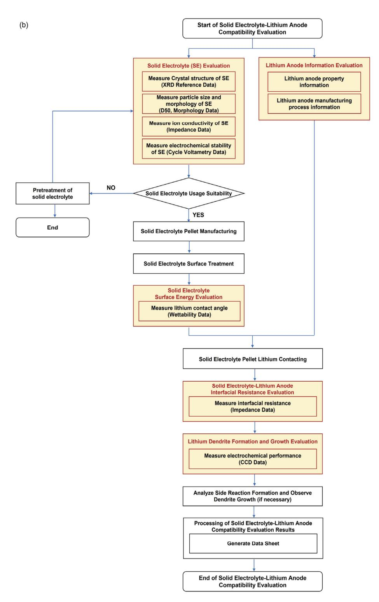
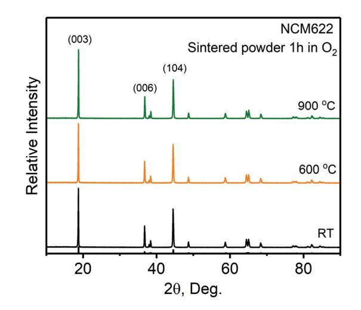
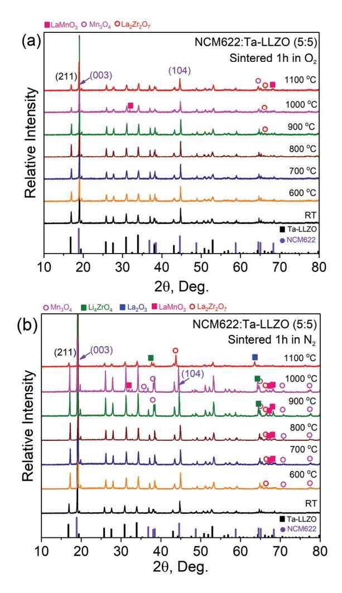
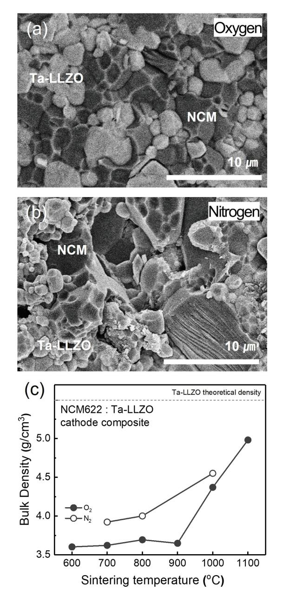
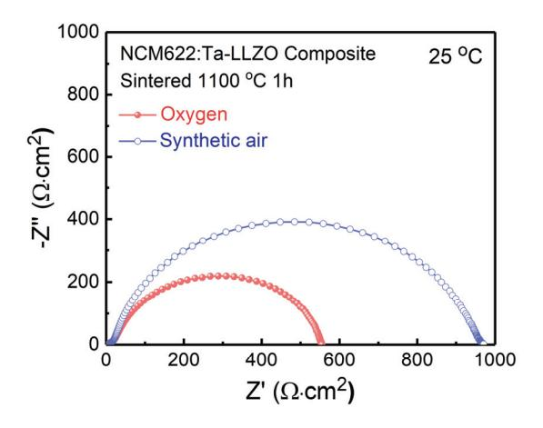
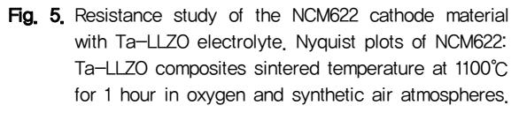
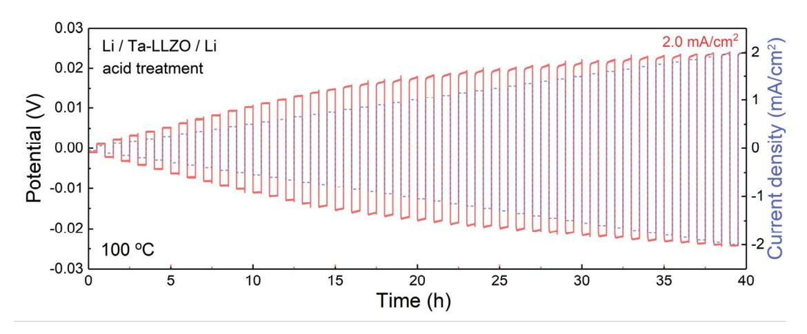
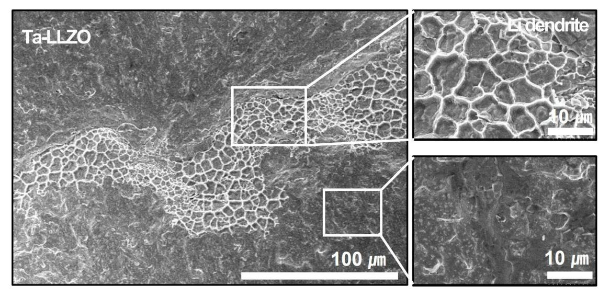

http://doi.org/10.31613/ceramist.2024.00150

# Design for compatibility evaluation of solid electrolyte and Cathode/Lithium anode materials for oxide-based solid-state batteries

Hwa-Jung Kim1 , Seung-Wook Baek1†

1 Division of Chemical and Material Metrology-Emerging Material Metrology Group, Korea Research Institute of Standards and Science, Daejeon 34113, Republic of Korea

# 산화물계 전고체전지 向 고체전해질-양극/리튬음극 소재 적합성 평가 디자인

김화정1 , 백승욱1† 1 한국표준과학연구원 화학소재측정본부

(Received November 18, 2024; Revised November 29, 2024; Accepted November 29, 2024)

### Abstracts

As the demand for safety and efficiency in lithium-ion batteries increases, research on solid electrolytes as promising alternatives to conventional liquid electrolytes has gained momentum. This study presents a systematic evaluation of compatibility between oxide-based solid electrolytes and cathode/anode materials, investigating their physical and electrochemical properties. A step-by-step assessment process is proposed, beginning with the structural, morphological, and conductivity evaluations of the solid electrolyte and extending to the interfacial stability and electrochemical performance assessments with cathode and lithium anode materials. For the cathode, compatibility was assessed through high-temperature stability, impedance measurements, and composite formation, with the goal of minimizing side reactions. For the lithium anode, evaluations included surface wettability, interfacial resistance, and lithium dendrite formation. These evaluations provide essential insights into the interactions at the electrode-electrolyte interfaces, enabling optimal material selection and processing methods to enhance battery performance and safety. The results from these compatibility evaluations offer valuable information for researchers and industry practitioners in the development of next-generation solid-state lithium-ion batteries. This research contributes to

† Corresponding Author: baeksw@kriss.re.kr

© 2024 The Korean Ceramic Society

This is an Open Access article distributed under the terms of Creative Attributions Non-Commercial License (https://creativecommons.org/li-censes/ by-nc/4.0/) which permits unrestricted noncommercial use, distribution, and reproduction in any medium, provided the original work is properly cited.

understanding key parameters for stable interfaces and long-lasting battery performance, advancing high-energy-density and safe lithium battery technologies.

Keywords: Electrochemical Stability, Electrode Compatibility, Interfacial Resistance, Solid Electrolyte, Solid State Battery

### 1. 서론

전고체전지는 기존 리튬이온전지에서 사용되는 액체 전해질의 가연성으로 인해 발생하는 안전성 문제를 해 결할 수 있을 뿐 아니라, 에너지 밀도를 극대화할 가능성 을 가지고 있어 차세대 에너지 저장 기술로 주목받고 있다. 전고체전지는 기존 액체전해질 기반 리튬이온전 지와 달리 모든 전지 구성요소가 고체 상태로 되어 있으 며, 고체전해질은 양극과 음극 사이에서 이온을 전달하 는 역할을 한다. 고체전해질은 액체전해질에 비해 안전 성이 더 뛰어나며, 화재 위험이 적고 에너지 밀도를 크게 향상시킬 수 있다는 장점을 가진다.[1-5] 특히, 산화물 계 고체전해질은 공기 중 안정성과 우수한 전기화학적 안정성을 가지며, 높은 이온 전도성을 가지고 있어 고용 량의 양극소재, 리튬음극과 결합할 경우 장기적이고 안 정적인 고성능 배터리 구현이 기대된다.[6,7]

산화물계 고체전해질을 적용한 전고체전지 제조에는 양극/리튬음극 소재와의 높은 계면 저항으로 인해 현재 상용화 및 성능 구현이 어려운 문제점이 있다. 산화물계 고체전해질의 경우 높은 이온전도도 달성을 위해서는 고온에서 장시간 소결이 필수적이다.[8-10] 고체전해 질과 양극소재가 복합된 양극 복합체 제조 시에도 고온 에서의 소결이 필수적이게 되며, 이는 고온에서 불안정 한 양극소재의 구조적 변화와 소재 간의 계면반응으로 인한 부반응 생성물 발생으로 인한 높은 계면 저항의 문제점이 발생하게 된다.[11]

산화물계 가넷형 (Garnet-type) Li₇La3Zr2O12 (LLZO) 은 나시콘형 (NASICON-type) Li1.3AlₓTi2₋ₓ(PO4)3 등 의 소재에 비해 리튬과의 높은 전기화학적 안정성을 가지고 있어 리튬음극과 함께 사용하기에 적합한 특성 을 보인다.[12] 리튬은 이론 용량이 약 3860 mAh/g에 달해 음극 재료로 사용하면 전지의 에너지 밀도를 크게 높일 수 있다.[13,14] 그러나 리튬과 고체전해질 계면에 서 발생하는 리튬 덴드라이트 성장, 계면 저항 증가, 물리적⋅화학적 불안정성 등은 주요한 연구 과제로 남 아 있다.[15-18]

따라서, 차세대 전고체전지 개발을 위해서는 고체전 해질과 양극/리튬음극 소재 간의 적합성 평가와 이를 통한 설계 기술 확보가 시급하다. 산화물계 전고체전지 에 대한 제조 공정, 소재, 측정, 분석, 시험 평가와 관련 된 국제 표준이 부재하여 향후 다수의 시험 규격 및 측정 표준이 요구되는 상황이다. 아울러, 초고속 리튬이온 전도체 신소재 개발, 이를 위한 공정 기술, 고속 정밀 측정 분석 기술, 소재 데이터베이스 등을 지원할 수 있는 측정 서비스 제공 기관도 부족한 실정이다. 이에 따라, 전고체전지 계면 안정성 평가, 소재 적합성 측정 기술 및 표준화된 시험 규격과 측정법 정립이 요구된다.

본 연구는 이러한 요구를 충족시키기 위해 전고체전 지에서 고체전해질-양극/리튬음극 소재 간 적합성 평 가에 대한 체계적인 접근 방식을 제공하고 고체전해질 과 양극/리튬음극 소재 사이의 상호작용이 전고체전지 의 성능에 미치는 영향에 중점을 두었다. 각 소재의 물성 분석을 진행하고 적합성 평가 진행 시에는 고체전해질 을 적용한 양극 복합체 및 리튬 대칭셀을 이용하여 결정 구조, 전도도, 계면저항 등을 측정하는 다양한 실험적 방법을 소개하고 이를 통해 전고체전지의 성능을 개선 할 수 있는 방향을 모색하였다.

고체전해질은 상대적으로 낮은 이온전도도와 높은 계면 저항 문제를 극복해야 하며, 이를 위해 고체전해질과 양극, 리튬음극 각각의 소재 평가를 거쳐 고체전해질-양극/리튬음극 간의 적합성 평가가 진행된다. Fig. 1. a와 Fig. 1. b는 각각 고체전해질과 양극 및 리튬음극 간의 적합성 평가 절차 모식도를 나타낸다.[19,20] 적합 성 평가는 다단계로 구성되어 있으며, 각 단계에서 소재의

## 2. 본론

# 2.1 고체전해질-양극/리튬음극 소재 적합성 평가 기준 및 절차

고체전해질은 전지에서 양극과 음극 사이에 위치하여 이온을 전달하는 역할을 하며, 그 성능은 전지의 전기화 학적 특성과 안전성에 크게 영향을 미친다. 산화물계

▌김화정, 백승욱

Fig. 1. Flowchart of the compatibility evaluation process; a. Solid electrolyte (SE) and cathode material, Modified from Reproduced from / Modified from Baek et al. Measurement guide, KRISS/TR-2023-043.[19], b. SE and lithium anode. Modified from Baek et al. Measurement guide, KRISS/TR-2023-042.[20]

구조적 안정성과 전기화학적 특성을 확인하고자 한다. 본 연구에서는 적합성 평가를 진행할 고체전해질로 산화 물계 가넷형  $\text{Li}_{6.4}\text{La}_{3}\text{Zr}_{1.4}\text{Ta}_{0.6}\text{O}_{12}$  (Ta-LLZO)을 선택하 였으며, 양극소재는  $LiN_{0.6}Co_{0.2}Mn_{0.2}O_2$  (NCM622) 그 리고 리튬음극으로 적합성 평가를 진행하였다.

# 2.2 고체전해질-양극 소재 적합성 평가 및 성능 개선

#### 2.2.1 고체 전해질과 양극 소재의 정보 평가

초기 단계에서는 고체전해질과 양극 소재의 결정 구조. 입자 크기 및 형상. 이온 전도도. 용량 등의 물리적 특성 을 측정하여 두 소재의 기본 물성 데이터를 확보하였다. 본 연구에서는 Ta-LLZO 고체전해질과 NCM622 양극 소재의 X선 회절(X-ray diffraction, XRD), 전계방출 형 주사전자현미경(Field emission scanning electron microscopy, FE-SEM), 임피던스(AC impedance), 용 량(Capacity) 측정으로 물성 데이터를 수집하였다.

가넷형 산화물계 LLZO 고체전해질의 경우 가능한 결정구조로는 정방정계 (Tetragonal) 결정구조 및 입방 정계 (Cubic) 결정구조가 있다. 그 중에서도 리튬의 무 질서도 (Disordering) 가 높은 입방정계 구조가 정방정 계에 비해 이온전도도가 약 10~100배 높은 것으로 알려 져 있어. 결정구조는 입방정계의 구조가 형성되어야 한 다. [12] 또한 입자 사이의 계면 저항이 큰 산화물계 고체 전해질로 인해 소결이 필수적인 산화물계 전고체전지 의 경우 소재의 평균 입경 및 형상이 고용량의 전고체전 지 구현에 큰 영향을 미치는 부분이므로 소재 간의 입자 크기 확인 역시 필수적인 부분이다. 따라서 결정구조 측정 결과를 통해 정방정계 및 입방정계 중 어떠한 결정 구조를 가지는지 확인하고, 불순물 피크의 여부 확인이 필요하다. 본 연구에서는 적합성 평가 진행에 앞서 선택 된 고체전해질과 양극 소재의 결정구조, 형상, 물성을 측정 및 확인하였다. Ta-LLZO 고체전해질의 경우 순 수한 Cubic 상으로 합성된 입자크기~1 µm 이내인 것 을 확인하였으며, 이온전도도 측정을 위해 소결 과정 으로 펠릿(Pellet)으로 제조 후 측정 시 이온전도도는  $~10^{-4}$  S/cm임을 확인할 수 있었다. NCM622 양극소재 는 전형적인 R-3m 공간그룹인 Trigonal 결정구조를 가지는 것으로 확인되었으며, 입자 형상은 단결정의~3 // 이내인 것을 확인함으로써 기본적인 두 소재의 물성 데이터를 확인하였다.

#### 2.2.2 고체 전해질과 양극 소재의 고온 안정성 평가

소결로 제조되는 산화물계 전고체전지의 경우 고온에 서의 상안정성 평가가 필수적이므로 고온 환경에서의 고체전해질과 양극 소재의 결정구조 안정성을 평가하였 다. 이 과정은 소재가 높은 온도에서도 물성을 유지할 수 있는지를 판단하는 중요한 단계이다. Fig. 2는 고순도 산소 (O2) 환경에서 600, 900℃ 각각 1시간씩 열처리를 진행한 NCM622 분말의 XRD 측정 결과이다. Fig. 2를 보면 600, 900℃에서 소결된 양극재는 NCM의 메인 피크인 19.96° 와 45.26° 위치에서 (003) 와 (104) 피크의 감소없이 유지되며, 이차상 및 불순물 피크는 확인되지 않는다. 따라서 900℃ 이상의 열처리온도에서도 구조적 안정성을 가지는 것으로 평가할 수 있다. 이와 같이 확보 된 고체전해질과 양극소재의 물성을 기반으로 고체전해 질-양극소재 적합성 평가 진행 및 결과를 분석하였다.

**Fig. 2.** The X-ray diffraction (XRD) patterns of the  $LiN_{0.6-}$  $\text{Co}_{0.2}\text{Mn}_{0.2}\text{O}_2$  (NCM622) cathode material with sintering temperature ranging from room temperature, 600°C and 900°C in oxygen atmospheres. Measurement guide, KRIS-TR-2023-043.[19]

## 2.2.3 고체 전해질-양극소재 복합체 제조 및 계면 적합성 평가

고체전해질과 양극 소재의 고온 안정성 검증 후, 두 소재 간의 적합성 평가 및 상호 안정성을 평가하기 위해 표면 및 계면의 결정 구조 변화를 관찰하고, 미세 구조 분석과 저항 특성을 측정하여 계면 반응 여부와 안정성 평가를 진행한다. 이러한 계면 적합성 평가는 고체전해 질과 양극 소재를 혼합하여 펠릿화(Pelletizing) 공정을

Fig. 3. Chemical Compatibility study of the NCM622 cathode material with Li6.4La3Zr1.4Ta0.6O12 (Ta-LLZO) electrolyte. The XRD patterns of the NCM622:Ta-LLZO composites with sintering temperature ranging from room temperature to 1100℃ in a. oxygen and b. nitrogen atmospheres.

통해 적합성 측정용 복합체를 제작하고, 고온에서의 결 정 구조, 소결성 및 전도도 등의 물성 평가를 위해 복합체 펠릿을 소결하여 진행한다.

본 연구에서 결정구조 안정성 평가는 Ta-LLZO와 NCM622의 온도와 소결 분위기에 따른 영향을 평가하 기 위해 Ta-LLZO:NCM622 복합체를 고순도 산소 (O2), 고순도 질소 (N2) 분위기에서 600∼1100℃ 각각 1시간씩 소결을 진행하였다. Fig. 3은 소결 분위기와 온도에 따른 Ta-LLZO:NCM622 복합체의 XRD 패턴 을 나타낸다. 각 열처리 온도에 따른 패턴 변화를 확인 할 수 있으며, 특정 온도 이상에서 LaMnO3와 Mn3O4 등의 상이 형성되는 것을 관찰할 수 있다. 이는 특정 소결 조건에서 양극재와 고체전해질 사이의 계면 반응 에 의해 새로운 상이 형성됨을 의미한다. Fig. 3. a을 보면 산소분위기에서 소결 시 상온에서 800℃까지는 이차상 및 불순물 피크는 확인되지 않았다. 따라서 측정 된 산소분위기에서 소결 시 800℃ 이하의 온도에서는 고체전해질 및 양극재의 결정구조의 붕괴가 나타나지 않지만, 900℃ 이상의 온도에서는 불안정하여 양극재 의 결정성이 감소되는 것으로 평가할 수 있다. 반면, Fig. 3. b의 질소 분위기에서의 반응은 산소 분위기와는 다르게 진행되며, 600℃의 낮은 온도에서도 계면반응 으로 인한 이차상이 형성되는 것을 확인할 수 있다. 이 는 각 분위기 조건에 따라 양극재와 고체전해질 간의 계면 반응이 다르게 나타남을 시사한다. NCM622와 Ta-LLZO 간의 계면 반응은 열처리 온도와 분위기 조 건에 따라 달라지며, 이는 고체전해질 기반 전고체전지 에서 안정적인 계면 형성에 중요한 영향을 미칠 수 있음 을 알 수 있다.

고체전해질-양극재 복합체의 소결성 수준을 평가하 기 위해서는 파단면 미세조직 관찰 및 밀도 측정을 진행 한다. Fig. 4. a, b는 Ta-LLZO:NCM622 복합체의 파단 면은 FE-SEM으로 관찰하며, 1100℃에서 1시간 동안 산소 및 질소 분위기에서 소결된 복합체의 미세조직이 다. Fig. 4. a, b에서 보면, 산소 분위기에서는 고체전해질 결정립이 성장하여 소결된 양상을 보이지만, 질소 분위 기에서는 결정립이 성장하지 않은 채 소결된 양상을

Fig. 4. Sinterability study of the NCM622 cathode material with Ta-LLZO electrolyte. The Cross-section Field emission scanning electron microscopy (FE-SEM) images of the NCM622:Ta-LLZO composites with sintered at 1100℃ 1 hour in a. oxygen and b. nitrogen atmospheres. c. Density of the cathode composites sintered at elevated temperature in oxygen and nitrogen atmospheres.

보인다. Fig. 4. c는 소결 온도와 가스 분위기에 따른 밀도 변화를 나타낸다. 1000℃ 이상에서 소결 시 분위기 와 관계없이 밀도가 급격히 증가하는 것을 확인할 수 있으며, 질소 분위기에서의 밀도가 산소 분위기보다 더 높은 결과를 나타낸다. 따라서 전해질과 양극 소재 입자 간 치밀화를 위해서는 1000℃ 이상의 온도가 필요하며, 소결성의 관점에서 보면 질소 분위기에서 소결할 때 밀 도가 더 높게 증가하는 것으로 평가된다.

복합체의 면적비저항(Area specific resistance, ASR)은 임피던스를 측정을 통해 얻어진 나이키스트 선 도를 통해 확인된다. Fig. 5는 1100℃ 1시간 산소, 고순 도 공기 분위기에서 각각 소결된 NCM622:Ta-LLZO 복합체를 임피던스 측정을 통해 얻어진 나이키스트 선 도이다. Fig. 5에서 복합체의 저항은 산소 분위기보다 고순도 공기 분위기에서 소결 시 증가하는 것을 확인할 수 있다. 따라서 산소 분위기에서 소결된 복합체가 더 높은 밀도와 낮은 ASR을 보이며, 이는 고체전해질과 양극 소재 간 치밀화를 위한 적절한 온도가 필요함을 시사한다.

2.2.4 고체 전해질-양극소재의 계면 안정화 및 성능 개선

본 연구에서는 Ta-LLZO 고체전해질과 NCM622 양 극 소재의 적합성 평가를 단계적으로 진행하였다. 이를 위해 다양한 조건으로 소결된 NCM622:Ta-LLZO 복합 체를 제조하고, 결정구조 변화, 미세조직, 밀도 및 계면 저항을 분석하였다. 고온에서의 결정구조 안정성 평가 결과, 산소 분위기에서 소결 시 800℃ 이하에서 안정성 을 보였으나, 900℃ 이상에서는 일부 상 변형이 발생하 였으며, 질소 분위기에서는 더 낮은 온도에서 이차상이 형성되었다. 이는 소결 시 온도와 분위기에 따라 계면 반응 특성이 상이함을 나타낸다. 소결성 측면에서는 소 결 온도와 분위기에 따른 밀도 변화 분석 결과, 1000℃ 이상의 온도에서 밀도가 급격히 증가하였으며, 질소 분 위기에서의 밀도가 산소 분위기보다 더 높게 나타났다. 계면 저항 측정 시에는 고순도 공기 분위기에서 소결된 복합체가 산소 분위기에서 소결된 복합체에 비해 더 높 은 저항을 나타내었다. 결론적으로 산소분위기에서 1000℃ 이상의 소결 시 안정한 결정구조, 높은 밀도, 낮은 계면저항을 나타내어, 고체전해질 기반 전고체전 지의 성능 최적화에 중요한 요소로 작용할 수 있음을 알 수 있다.

고체전해질-양극소재의 적합성 평가를 진행한 결과 와 같이 고체전해질과 양극 간의 고온에서의 계면반응, 소결성은 계면저항의 증가 원인이며, 안정성 있는 계면 형성은 전고체전지의 구현에 중요한 영향을 미치는 요 소이다. 계면에서의 이차상 형성은 전지 성능 저하를 유발하며, 계면에서의 이온 전도 및 전기 전도 경로를 방해할 수 있다.[6,25,26] 본 연구에서도 적용한 양극복 합체 제조 및 전고체전지 시 산소분위기에서 소결은 계 면반응을 억제 및 계면 안정성 향상을 보고하였다. [11,21,22] LLZO계열 고체전해질의 고온 소결 시 산소 의 유입은 결정립 성장을 촉진하고 리튬 휘발 억제로 결정구조 유지 및 밀도 향상을 가져오는 것으로 보고되 었다.[23,24] 이와 같은 원리로 양극 복합체 소결 시에 서도 고체전해질과 양극 소재 간의 소결성 향상과 부반 응 생성상 억제될 수 있다. 계면 안정성을 향상시키기 위해 소결 첨가제는 복합체의 소결성을 향상 및 1000℃

이상의 소결 온도를 감소에 효과적인 것으로 입증되었 다. B2O3 등의 소결첨가제 적용으로 계면에 Li3BO3 형성 하여 입자 간의 유리한 계면접촉을 갖도록 하여 소결 온 도를 700℃로 낮추어 전고체전지를 구현하였다.[25,26] 또한 고온에서의 장시간 소결로 인한 양극 소재의 결정구 조 붕괴 및 계면반응을 억제하기 위해 스파크 플라즈마 소결 (Spark plasma sintering) [27-29], 초고속 고온 소결 기술 (Ultrafast high-temperature sintering, UHS)[30,31] 등의 급속 소결 기술이 적용의 연구가 진 행되고 있다. 최근에는 단시간의 UHS의 급속 고온 소결 방식을 적용하여 계면 반응을 억제하고 양극소재의 열 화를 방지하여 고용량의 산화물계 전고체전지 구현을 보고하였다.[32]

결론적으로 산화물계 전고체전지 구현을 위해서는 고 체전해질과 양극소재 간의 소결 시 발생하는 계면반응 으로 인한 부반응 이차상 형성 억제, 결정구조 유지, 높은 이온전도를 위한 소결성 향상이 중요하다. 소결첨 가제, 코팅을 응용한 계면 보호층 형성 및 급속 소결 기술을 적용 등의 기술을 발전으로 고용량의 전고체전 지 개발을 앞당길 수 있다.

# 2.3 고체전해질-리튬음극 소재 적합성 평가 및 성능 개선

### 2.3.1 고체 전해질-리튬음극 계면 적합성 평가

고체전해질과 리튬음극의 적합성 평가는 양극 소재 적합성 평가와 동일하게 각 소재의 물성 분석 후 전기화 학적 안정성을 기반으로 진행한다. 고체전해질의 전기화 학적 안정성은 리튬음극과의 적합성에서 중요한 요소로, 고체전해질이 리튬과 접촉했을 때 안정적으로 이온을 전 도하면서도 전기화학적으로 분해되지 않아야 한다. 이를 평가하기 위해 순환전압주사법(Cyclic voltammetry) 을 사용하며, 이 방법은 고체전해질과 리튬음극 간의 전기화학적 상호작용을 평가하고 고체전해질의 전기화 학 안정창을 파악하는 데 유용하다. 전기화학적 안정창 은 고체전해질이 전기화학적으로 안정하게 작동할 수 있는 전압 범위를 의미하며, 이는 전고체전지의 수명과

Fig. 6. Resistance study of the lithium anode with Ta-LLZO electrolyte. Nyquist plots of Li /Ta-LLZO / Li symmetric cells at 60℃.

안전성에 중요한 영향을 미친다.[33]

계면 저항은 고체전해질과 리튬음극 사이 접촉 면에 서 발생하는 저항으로, 전지 성능 저하의 주요 원인 중 하나이다. 이를 줄이기 위해서는 고체전해질의 표면 처 리가 중요하며, 고체전해질의 표면 거칠기, 이온전도도, 열적 안정성 등을 종합적으로 고려해야 한다. 고체전해 질과 리튬음극의 계면 저항 및 전기화학적 특성을 평가 하기 위해 리튬 대칭셀을 조립하여 사용하며, 리튬 덴드 라이트 형성 가능성과 전기화학적 성능을 평가하여 고 체 전해질이 리튬음극과 접촉 시 발생할 수 있는 문제를 파악한다. 리튬 덴드라이트 형성 억제 여부는 시간 제어 임계전류밀도 (Critical current density) 시험을 통해 평가되며, 리튬 대칭셀을 이용하여 단계적으로 전류밀 도를 증가시키며 덴드라이트 형성이 발생하는 시점을 파악한다. 이 시험에서 일정 수준의 전류밀도에 도달하 면 급격한 전압 강하가 발생하며, 이는 리튬 덴드라이트 에 의한 단락을 의미한다.[34,35]

본 연구에서는 Ta-LLZO 고체전해질의 산처리 방식 을 통한 표면 처리에 따른 리튬과의 계면 저항 변화를 분석하였고 리튬 대칭셀의 60℃에서의 임피던스 측정 결과를 Fig. 6에 나타내었다. Fig. 6을 보면 표면처리를 하지 않은 것에 비해 계면 저항이 감소함을 확인하였다. 이를 토대로 산처리가 적용된 고체전해질로 리튬 대칭 셀을 제조하였고 임계전류밀도 시험 진행 결과를 Fig. 7에 나타내었다. Fig. 7에서는 덴드라이트 성장으로 인한 단락 및 고체전해질 파단 없이 100℃에서 2.0 mA/cm2 의 높은 임계전류밀도를 확인할 수 있다. Fig. 8은 이전 단계에서 진행된 임계전류밀도 시험이 단락으로 인해 모두 종료된 후 대칭셀을 분해하여 획득한 고체전해질 의 FE-SEM 파단면 이미지이다. Fig. 8을 보면 리튬 덴드라이트 성장으로 인해 단락이 진행된 것을 확인할 수 있으며, 리튬 덴드라이트는 고체전해질의 결정립계 를 따라 성장하는 것을 확인할 수 있다.

Fig. 7. Electrochemical performance of lithium anode with Ta-LLZO electrolyte. Critical current densities of Li /Ta-LLZO / Li symmetric cells at 100℃.

Fig. 8. Lithium dendrite observation of lithium anode with Ta-LLZO electrolyte. The Cross-section FE-SEM images of Ta-LLZO in Li /Ta-LLZO / Li symmetric cells after cycling.

### 2.3.2 고체 전해질-리튬음극 소재의 계면 안정화 및 성능 개선

본 연구에서는 Ta-LLZO 고체전해질과 리튬음극 간 의 적합성을 평가하여 전고체전지의 안정성과 성능을 개선하기 위한 방안을 제시하였다. Ta-LLZO 고체전해 질에 산처리 표면 처리를 적용하여 계면 저항 감소 효과 를 확인하였으며, 이를 통해 고체전해질-리튬 대칭셀의 계면 저항이 크게 감소함을 확인하였다. 더불어, 임계전 류밀도 시험을 통해 리튬 덴드라이트 형성 억제 여부를 평가한 결과, 산처리된 고체전해질-리튬 대칭셀에서 100℃에서 2.0 mA/cm2 의 높은 임계전류밀도를 보여줌 으로써 덴드라이트 성장 억제에 유리한 특성을 보였다. FE-SEM을 통해 관찰한 고체전해질 파단면 이미지에서 는 리튬 덴드라이트가 결정립계를 따라 성장하여 단락 을 일으키는 것을 확인할 수 있었으며, 이를 통해 고체전 해질과 리튬음극의 적합성 및 계면 안정성이 전지 성능 과 안정성에 중요한 영향을 미침을 재확인하였다. 이러 한 결과는 고체전해질 기반 전고체전지 개발에 있어 계 면 저항 감소와 덴드라이트 형성 억제 기술의 중요성을 강조하며, 향후 전고체전지 상용화를 위한 기술적 토대 를 제공한다.

적합성 평가를 진행한 결과와 같이 고체전해질과

리튬음극 간의 접합에서 계면 저항 감소는 전고체전지 의 성능과 수명에 중요한 영향을 미치는 요소이다. 리튬 덴드라이트 형성은 전지 단락과 성능 저하를 유발하는 주요 원인 중 하나로, 충⋅방전 과정에서 리튬이 고체전 해질 내부로 자라나며 계면에서의 이온 전도 경로를 방 해할 수 있다. 이를 억제하기 위해서는 고체전해질의 이온전도도, 밀도 등 다양한 물성을 고려한 고성능의 고체전해질 막 제조가 우선적으로 진행되어야 하며, 고 체전해질의 표면 처리와 리튬의 균일한 증착을 유도하 는 기술들이 필요하다. 계면 저항은 고체전해질과 리튬 음극 사이의 불완전한 접촉으로 발생하며, 이는 리튬 이온의 이동을 저해하여 전지의 전기화학적 성능을 저 하시킨다.[16-18] 이러한 문제를 해결하기 위해 금 (Au)[36], 알루미늄(Al)[37], SnF2[38]과 같은 리튬친 수성 물질을 이용한 코팅이 효과적으로 사용되며, 이를 통해 계면 저항을 감소시킬 수 있다. LLZO 고체전해질 은 대기 중의 수분 및 이산화탄소와 접촉 시 표면에 Li2CO3 층이 형성되어 계면 저항을 증가시킨다.[39-41] 이로 인해 리튬과의 접착성이 저하되고, 계면에서의 저항이 증가하여 전기화학적 성능이 저하된다. 이를 해 결하기 위해서는 표면에서 Li2CO3를 제거하는 산처리 또는 물리적 연마와 같은 표면 처리 방법이 필요하다.

본 연구에서도 적용한 산처리 방식은 고체전해질 표면 에서 Li2CO3 층을 제거하여 리튬과의 접촉을 개선하는 효과를 나타내었다.

결론적으로, 고체전해질과 리튬음극의 적합성을 개 선하기 위해서는 표면 처리를 통해 계면 저항을 줄이고, 리튬 덴드라이트 성장을 억제하는 것이 필수적이다. 이 러한 표면 처리 기술은 고체전해질 기반 전고체전지의 성능 향상과 수명 연장을 위한 중요한 방법으로, 차세대 전지 개발에 있어 계면 저항 감소 기술이 중요한 역할을 할 것이다.

### 3. 결론

본 연구에서 제시된 고체전해질과 양극/리튬음극 소 재 간의 적합성 평가 절차는 고체전해질 기반 리튬 이온 배터리 개발에 있어 중요한 참고 자료를 제공한다. 본 연구의 평가 결과는 다음과 같은 중요한 가치를 지닌다. 첫째, 안전성으로 고온 안정성과 부반응 가능성을 사전 에 파악하여 고체 리튬 이온 배터리의 안전성을 크게 향상시킬 수 있다. 둘째, 효율성 증가로 전도도 및 계면 저항 특성 분석을 통해 전기화학적 성능을 최적화하여 배터리의 효율성을 증대시킬 수 있다. 셋째, 산업적 활 용 측면에서 본 연구의 평가 방법론과 데이터 시트는 연구자와 산업 실무자들이 배터리 소재를 선택하고 최 적화하는 데 실질적인 가이드를 제공할 수 있다.

산화물계 고체전해질과 양극/리튬음극 간의 적합성 평가는 차세대 전고체전지 개발에서 중요한 과제로, 본 연구는 고체전해질과 양극 간의 계면에서 발생하는 상 호작용을 평가하여 계면 저항을 줄이고 전지 성능을 극 대화할 수 있는 방안을 모색하였다. 전고체전지 개발을 위해서는 고체전해질과 양극/리튬음극 간의 적합성을 더욱 정밀하게 평가하고, 계면 저항을 줄이기 위한 새로 운 소재 개발 및 표면 처리 기술이 필요하다. 이를 통해 전고체전지의 성능을 더욱 향상시키고 차세대 에너지 저장 장치로서의 상용화 가능성을 높일 수 있을 것이며, 안전성 문제를 해결하고 에너지 밀도를 극대화할 수 있 는 핵심 기술이 될 것이다. 따라서 향후 연구에서는 고체

전해질과 양극/리튬음극 간의 계면에서 발생하는 문제 를 해결하고, 이를 통해 더 높은 성능을 가진 전고체전지 를 구현하는 데 중점을 두어야 한다. 이를 위해 표면 처리 기술, 계면 저항 저감 기술, 그리고 전기화학적 안정성 향상 기술이 지속적으로 개발되어야 하며, 본 연구는 이러한 기술 개발에 중요한 기여를 할 것이다.

### ACKNOWLEDGEMENTS

이 논문은 2024년도 과학기술정보통신부의 재원으 로 한국연구재단-나노 및 소재 기술개발사업의 지원 (2021M3H4A1A0409305111)과 과학기술사업화진흥원 의 지원을 받아 수행된 연구임(2024-22040301, 연구 재료 확산지원 사업).

### REFERENCES

- 1. X. Han, S. Wang, Y. Xu, et al., Energy Environ. Sci., 14, 5044-5056 (2021). https://doi.org/10.1039/ D1EE01494C
- 2. F. Han, J. Yue, C. Chen, et al., Joule, 2(3), 497-508 (2018). https://doi.org/10.1016/j.joule.2018.02.007
- 3. J.-M. Lee, T. Kim, S. W. Baek, et al., Solid State Ionics, 258, 13-17 (2014). https://doi.org/10.1016/ j.ssi.2014.01.043
- 4. R. Balasubramaniam, C.-W. Nam, V. Aravindan, et al., ChemElectroChem, 8, 570-576 (2021). https:// doi.org/10.1002/celc.202001116
- 5. W. Luo, Y. Gong, Y. Zhu, et al., Adv. Mater., 29, 1606042 (2017). https://doi.org/10.1002/adma.2016 06042
- 6. S. W. Baek, J. M. Lee, T. Y. Kim, et al., J. Power Sources, 249, 197-206 (2014). https://doi.org/10.1016/ j.jpowsour.2013.10.089
- 7. E. Zhao, F. Ma, Y. Guoc and Y. Jin, RSC Adv., 6, 92579-92585 (2016). https://doi.org/10.1039/ C6RA19415J
- 8. K. J. Kim and J. L. M. Rupp, Energy Environ. Sci., 13, 4930-4945 (2020). https://doi.org/10.1039/D0EE 02062A
- 9. X. Huang, Y. Lu, Z. Song, et al., Energy Storage

### ❚김화정, 백승욱

Mater., 22, 207-217 (2019). https://doi.org/10.1016/ j.ensm.2019.01.018

- 10. X. Huang, J. Tang, Y. Zhou, et al., ACS Appl. Mater. Interfaces, 14(29), 33340-33354 (2022). https:// doi.org/10.1021/acsami.2c08442
- 11. S. Hong, S. H. Song, M. Cho, et al., Small, 2103306 (2021). https://doi.org/10.1002/smll.202103306
- 12. K. J. Kim, M. Balaish, M. Wadaguchi, et al., Adv. Energy Mater., 11, 2002689 (2021). https://doi.org/ 10.1002/aenm.202002689
- 13. J. Biao, C. Bai, J. Ma, et al., Adv. Energy Mater., 14(10), 2303128 (2024). https://doi.org/10.1002/ aenm.202303128
- 14. K. Parascos, J. L. Watts, J. A. Alarco, et al., J. Eur. Ceram. Soc., 44, 970-977 (2024). https://doi.org/ 10.1016/j.jeurceramsoc.2023.09.044
- 15. F. Flatscher, M. Philipp, S. Ganschow, et al., J. Mater. Chem. A, 8, 15782-15788 (2020). https://doi.org/ 10.1039/C9TA14177D
- 16. J. Y. Yoo, T. Y. Kim, D. M. Shin, et al., Adv. Funct. Mater., 34(2), 2308103 (2024). https://doi.org/10. 1002/adfm.202308103
- 17. S. Lee, K.-S. Lee, S. Kim, et al., Sci. Adv., 8, eabq0153 (2022). https://doi.org/10.1126/sciadv.abq0153
- 18. V. Reisecker, F. Flatscher, L. Porz, et al., Nat. Commun., 14, 2432 (2023). https://doi.org/10.1038/ s41467-023-37476-y
- 19. S. W. Baek, H. Park and H. J. Kim, Measurement guide for Compatibility Evaluation of Solid Electrolyte and Li-Metal for Design and Fabrication of Solid State Batteries, Korea Research Institute of Standards and Science, KRISS/TR--2023-042 (2023). Available: https://www.kriss.re.kr/main/download/ club\_guide33.pdf
- 20. S. W. Baek, H. Park and H. J. Kim, Measurement guide for Compatibility Evaluation of Solid Electrolyte and Cathode for Design and Fabrication of Solid State Batteries, Korea Research Institute of Standards and Science, KRISS/TR--2023-043 (2023). Available: https://www.kriss.re.kr/main/download/ club\_guide32.pdf
- 21. Y. Kim, I. Waluyo, A. Hunt, et al., Adv. Energy Mater., 12(13), 2102741 (2022). https://doi.org/ 10.1002/aenm.202102741
- 22. J. Wang, R. Chen, L. Yang, et al., Adv. Mater., 34(19), 2200655 (2022). https://doi.org/10.1002/adma.2022

00655

- 23. L. Xu, J. Li, W. Deng, et al., Adv. Energy Mater., 11(2), 2000648 (2021). https://doi.org/10.1002/aenm. 202000648
- 24. X. Ping, Q. Zheng, B. Meng, et al., Ceram. Int., 48(18), 25689-25695 (2022). https://doi.org/10.1016/ j.ceramint.2022.05.176
- 25. H. Xie, C. Li, W. H. Kan, et al., J. Mater. Chem. A., 7, 20633-20639 (2019). https://doi.org/10.1039/ C9TA03263K
- 26. S. Ohta, S. Komagata, J. Seki, et al., J. Power Sources, 238, 53-56 (2013). https://doi.org/10.1016/j.jpowsour. 2013.02.073
- 27. S.-W. Baek, J.-M. Lee, T. Y. Kim, et al., J. Power Sources, 249, 197-206 (2014). https://doi.org/10. 1016/j.jpowsour.2013.10.089
- 28. H. Zhu and J. Liu, J. Power Sources, 391, 10-25 (2018). https://doi.org/10.1016/j.jpowsour.2018.04.054
- 29. C.-M. Chang, Y. I. Lee, S. H. Hong, et al., J. Am. Ceram. Soc., 88(7), 1803 (2005). https://doi.org/ 10.1111/j.1551-2916.2005.00246.x
- 30. S. Chen, L. Nie, X. Hu, et al., Adv. Mater., 34(33), 2200430 (2022). https://doi.org/10.1002/adma.2022 00430
- 31. M. Ihrig, T. P. Mishra, W. S. Scheld, et al., J. Eur. Ceram. Soc., 41(12), 6075-6079 (2021). https:// doi.org/10.1016/j.jeurceramsoc.2021.05.041
- 32. S. Han, D. Kil, S. Lee, et al., ACS Energy Lett., 8(11), 4794-4805 (2023). https://doi.org/10.1021/ acsenergylett.3c01759
- 33. Y. Gao, S. Sun, X. Zhang, et al., Adv. Funct. Mater., 31(15), 2009692 (2021). https://doi.org/10.1002/ adfm.202009692
- 34. Y. Lu, C. Z. Zhao, H. Yuan, et al., Adv. Funct. Mater., 31(18), 2009925 (2021). https://doi.org/10. 1002/adfm.202009925
- 35. E. J. Cheng, A. Sharafi and J. Sakamoto, Electrochim. Acta, 223, 85-91 (2017). https://doi.org/10.1016/ j.electacta.2016.12.018
- 36. C. L. Tsai, V. Roddatis, C. V. Chandran, et al., ACS Appl. Mater. Interfaces, 8(16), 10617-10626 (2016). https://doi.org/10.1021/acsami.6b00831
- 37. K. Fu, Y. Gong, B. Liu, et al., Sci. Adv., 3, e1601659 (2017). https://doi.org/10.1126/sciadv.1601659
- 38. K. Lee, S. Han, J. Lee, et al., ACS Energy Lett., 7(1), 381-389 (2022). https://doi.org/10.1021/

acsenergylett.1c02332

- 39. H. Huo, Y. Chena, N. Zhao et al., Nano Energy, **61**, 119-125 (2019). https://doi.org/10.1016/j.nanoen. 2019.04.058
- 40. H. Huo, J. Luo, V. Thangadurai, et al., ACS Energy

● 김화정

◉ 2009년 부경대학교 학사 ◉ 2011년 부경대학교 석사 ◉ 2009년-2011년 한국재료연구원 위촉연구생 ◉ 2011년-2014년 한국재료연구원 위촉연구원 ◉ 2020년 부경대학교 박사 ◉ 2020년 포항산업과학연구원 위촉연구원 ◉ 2021년~현재 한국표준과학연구원 박사후 연구원

Lett., 5(1), 252-262 (2020). https://doi.org/10.1021/ acsenergylett.9b02401

41. Z. Huang, K. Liu, L. Chen, et al., Int. J. Appl. Ceram. Technol., **14**(5), 921-927 (2017). https://doi.org/ 10.1111/ijac.12735

## ● 백승욱

● 2010년 KAIST 박사 ◉ 2010년-2011년 일본 도호쿠대 JSPS  $_{\rm Fellow}$ ◉ 2011년-2014년 삼성전자 종합기술원 책임연구원 ● 2019년 국가과학기술자문회의 전문위원 ● 2014년-현재 한국표준과학연구원 책임연구원