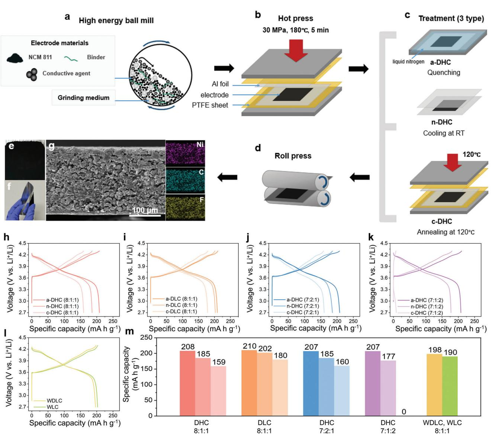
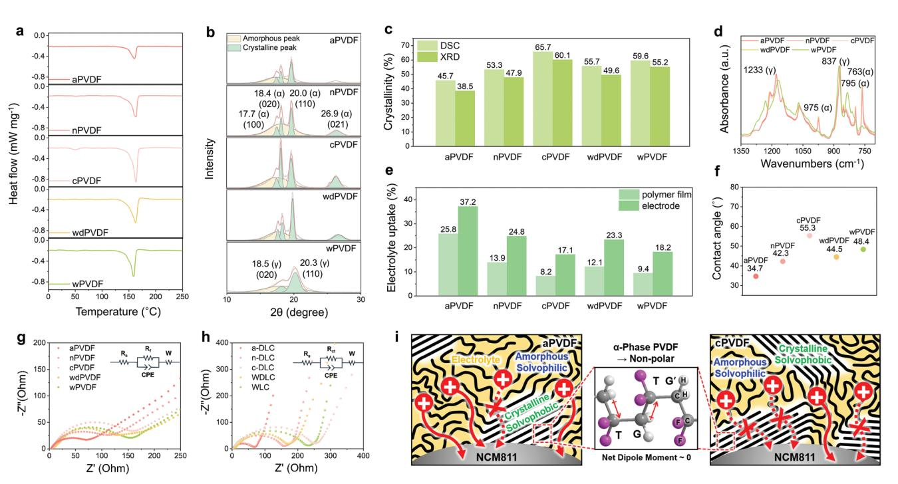
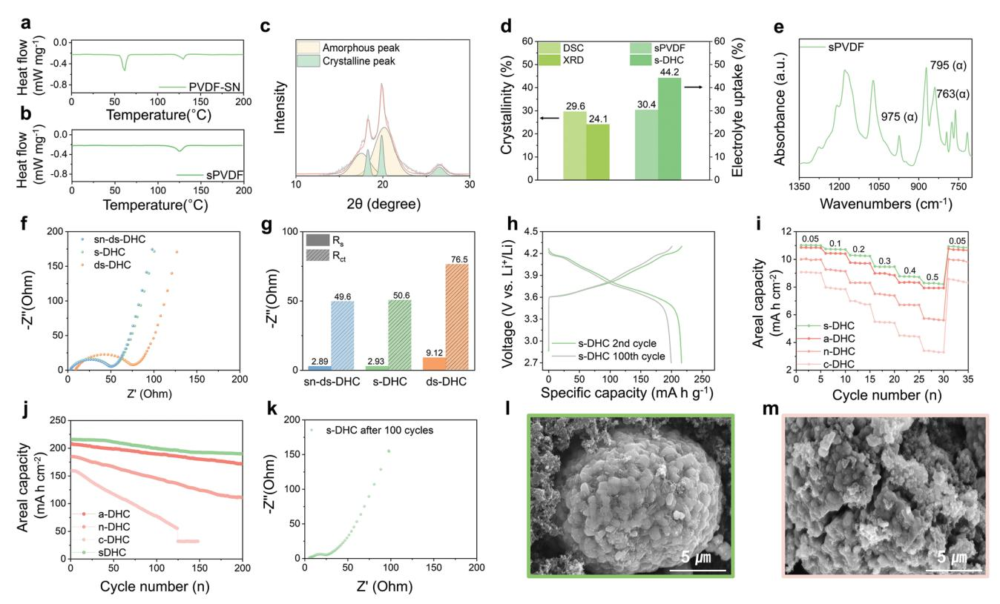
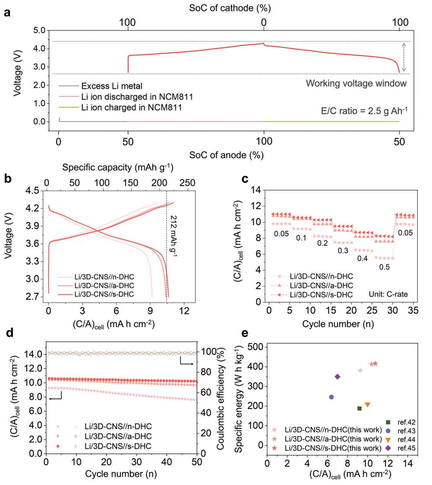
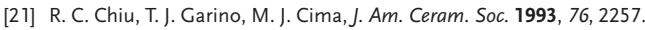

# **Solvophobic Binder Crystallinity-Tailored Advances in Solvent-Free Thick Cathodes for High-Energy Lithium Metal Batteries**

*Hyemin Kim, Dong Hyuk Kang, Jeonghun Lee, Juhee Yoon, Yurim Kim, Jihyeon Kim, Hyoung-Joon Jin,\* and Young Soo Yun\**

**Developing high-performance thick cathodes with optimized inactive-to-active material ratios is a promising approach to enhance the energy density of conventional lithium-ion batteries (LIBs). However, increasing electrode thickness introduces challenges, including elevated resistance and mechanical issues such as cracking and flaking, particularly in slurry-based wet processes. This highlights the necessity for solvent-free, low-resistance thick cathode fabrication methods. In this study, the impact of a solvent-free mechano–thermal fabrication process on the electrochemical performance of high-nickel ternary metal oxide-based thick cathodes is explored. A key challenge identified is the formation of solvophobic crystalline structures on the surface of the active cathode materials. To address this, a fast cooling strategy is implemented at the end of the solvent-free fabrication process, which successfully reduced the solvophobic crystallinity, ultimately surpassing the electrochemical performance of cathodes produced through wet processes. Furthermore, incorporating a PVDF/succinonitrile (SN) mixture binder via liquid-phase mixing further minimized crystallinity, resulting in significantly improved electrolyte wettability, ionic conductivity, and mechanical adhesion. As a result, the mixture binder system achieved a high areal capacity of ≈11 mA h cm−2 and demonstrated stable cycling performance over 100 cycles. When paired with a lithium metal anode, the thick cathode attained an energy density of ≈418 W h kg−1, translating to ≈335 W h kg−1 with packaging—representing approximately 35% improvement over current LIB technologies.**

#### robustly established through meticulous research and development, spurred by the burgeoning requirements of portable electronic devices and the electric vehicle market.[\[1–3\]](#page-9-0) A continuous evolution in the domain of active host materials has catalyzed a substantial escalation in the energy densities of LIBs, surging from an initial 150 Wh kg−1 in early cell models to 250 Wh kg−1 in contemporary iterations.[\[4\]](#page-9-0) Nonetheless, traditional research paradigms aimed at augmenting the proportion of high-capacity transition metal components have reached their theoretical zenith.[\[5–7\]](#page-9-0) Furthermore, the quest to develop novel, high-energy cathode materials amenable to commercialization has encountered formidable challenges.[[8\]](#page-9-0) These quandaries underscore the imperative for pioneering research strategies to transcend the prevailing limitations and fulfill the escalating market demands for enhanced energy density.[\[9,10\]](#page-9-0)

In the pursuit of significantly augmenting the energy density of LIBs without necessitating modifications to the wellestablished chemistry or the infrastructure of existing investments, the advent of thick electrode technology has emerged as

## **1. Introduction**

Lithium-ion batteries (LIBs), predicated upon the utilization of host materials and intercalation chemistry, have been

H. Kim, J. Yoon, Y. Kim, J. Kim, H.-J. Jin Program in Environmental and Polymer Engineering; Inha University 100 Inha-ro, Michuhol-gu, Incheon 22212, South Korea E-mail: [hjjin@inha.ac.kr](mailto:hjjin@inha.ac.kr) D. H. Kang, J. Lee, Y. S. Yun KU-KIST Graduathhe School of Converging Science and Technology Korea University 145 Anam-ro, Seongbuk-gu, Seoul 02841, South Korea E-mail: [c-ysyun@korea.ac.kr](mailto:c-ysyun@korea.ac.kr) The ORCID identification number(s) for the author(s) of this article can be found under <https://doi.org/10.1002/adfm.202420104>

**DOI: 10.1002/adfm.202420104**

a pivotal innovation.[\[11\]](#page-9-0) Current configurations of LIB cells typically allocate approximately 40% of their composition to active materials.[\[12\]](#page-9-0) The application of thick electrode technology promises to double this figure to about 80%, potentially

H.-J. Jin Department of Polymer Science and Engineering Inha university 100 Inha-ro, Michuhol-gu, Incheon 22212, Republic of Korea Y. S. Yun Department of Integrative Energy Engineering Korea University 145 Anam-ro, Seongbuk-gu, Seoul 02841, Republic of Korea Y. S. Yun Energy Storage Research Center Korea Institute of Science and Technology (KIST) Hwarangro 14-gil 5, Seoungbuk-gu, Seoul 02792, Republic of Korea realizing a 30% increase in energy density.[\[13\]](#page-9-0) This substantial enhancement requires an intricate redesign of electrodes, which involves increasing the active material loading from approximately 15–20 to 40 mg cm−2. [\[14\]](#page-9-0) Crucially, this must be achieved without compromising the ion and electron transfer resistances, maintaining them at levels akin to those observed in traditional electrodes.[\[15,16\]](#page-9-0) Thus, while prior research has underscored the paramount importance of active materials in boosting energy density, the roles of binders and conductive additives assume new significance in the thick electrode design paradigm.

Poly(vinylidene fluoride) (PVDF), a semi-crystalline thermoplastic fluoropolymer, is currently the most widely utilized binder material for the cathodes of LIBs. It maintains a robust position as a binder in wet processes despite environmental concerns about fluorinated resins and their high costs.[\[17,18\]](#page-9-0) The multifunctionality of PVDF, which aptly encompasses the diverse properties required at the cathode and its advantages in slurry processes, underscores its continued use.[\[19\]](#page-9-0) However, the pursuit of high-energy-density electrodes using thick cathodes has highlighted the limitations of slurry-based manufacturing methods, notably the issues of cracking and flaking in electrodes.[\[20–24\]](#page-9-0) Consequently, solvent-free dry processes are gaining attention as alternative strategies.[\[25–28\]](#page-9-0) Additionally, the properties of PVDF have been deemed insufficient for the heightened functional demands of thick cathodes, spurring ongoing research into potential replacements.[\[29,30\]](#page-9-0) Recent reports have identified novel high-functionality binder materials for thick cathode applications, including polyhydroxyalkanoate copolymer, spandex, poly(acrylic acid)-grafted polynorbornene, and polyimide, each demonstrating exceptional electrochemical performance and high potential.[\[31–34\]](#page-9-0) Furthermore, enhancements in performance through the reduction of crystallinity in PVDF have been achieved via formulations such as polyaniline/PVDF mixtures and the grafting of maleic anhydride onto PVDF via wet process.[\[35,36\]](#page-9-0) These modifications suggest that significant enhancements in binder performance can be realized through simple physical structure control, without necessitating major changes to the existing electrode systems. Few reports reveal the effect of crystalline structure on PVDF binder, where crystalline structure-dependent electrochemical performances have been confirmed, albeit their origins are understood differently, e.g., different ratios of crystalline phases and domains. In addition, no report has yet detected microstructural effects of PVDF binder on thick cathodes via a solventfree dry process. Completely removing N-methyl-2-pyrrolidone (NMP) solvent from electrodes fabricated using the slurry process with a PVDF binder presents significant challenges, necessitating a comparative analysis of the electrochemical performance between electrodes based on wet processes influenced by solvent effects and those fabricated through dry processes using PVDF. It is also well-established that PVDF tends to crystallize into the gamma phase when in solution, in stark contrast to its preference for the alpha phase during melt crystallization.[\[37,38\]](#page-9-0) Given the currently unsatisfactory assessments of PVDF binder, it is crucial to systematically and rigorously analyze the impacts of solvent effects, crystalline phases, and degrees of crystallinity on electrochemical performance before proceeding with studies aimed at replacing or tuning PVDF. However, the scarcity of comprehensive information on these effects underscores the urgent need for further research in this area.

Herein, we optimized the crystalline structure of PVDF binders in high-Ni ternary metal oxide, specifically LiNi1−x−yCoxMnyO2 (both x and y are ≤ 0.1, NCM), within thick cathodes through a mechano–thermal solvent-free process by employing varying cooling strategies. We explored the impact of these modifications on the electrochemical performance of the cathodes. The cooling strategies included quenching, natural cooling, and annealing at the crystalline temperature (Tc), followed by natural cooling. Resulting from these methods, the dry-process-based high-loading cathodes (DHC) were categorized according to the structural characteristics of PVDF binders as amorphous (aPVDF), normal (nPVDF), and crystalline PVDF (cPVDF)-based DHCs (a-DHC, n-DHC, and c-DHC, respectively). For further details, please refer to Table S1 (Supporting Information), which provides the abbreviations of the samples. The electrochemical performances of the DHC series were compared with the dry-process-based low-loading cathodes (DLC), which were prepared using similar PVDF series with different crystalline structures, termed as a-DLC, n-DLC, and c-DLC. This study clearly confirms that the crystalline structure of PVDF binders plays a critical role in the electrochemical performance of both DHC and DLC series samples, with a more amorphous structure leading to improved electrochemical performance. However, the polymorphic form of the crystalline phase did not significantly affect the electrochemical performance. Based on these findings, we designed a more amorphous PVDF binder (sPVDF) by fabricating a melt composite with succinonitrile (SN), which acts as a plasticizer for the PVDF binder, followed by the introduction of an electrolyte additive. The resulting sPVDF-based DHC (s-DHC) exhibited reduced solvophobic crystallinity, delivering significantly improved electrochemical performance in both half-cell and full-cell tests.

#### **2. Results and Discussion**

#### **2.1. Design Principles and Electrochemical Performance Comparison of Thick Cathodes**

The dry process was conducted using a sequence that included a mixing procedure, where a mixture of NCM, conductive agents, and binder in a 8:1:1 ratio was blended using a high-energy ball mill (**Figure 1**[a\)](#page-2-0). This was followed by thermal annealing at 180 °C under 30 MPa using a hot press (Figure [1b\)](#page-2-0). Subsequently, the three distinct cooling processes were applied, and the procedure was completed with a roll-press process (Figure [1c,d\)](#page-2-0). Optical images of the a-DHC produced via the dry process reveal a uniformly well-manufactured thick-film electrode without any signs of cracking or flaking (Figure [1e\)](#page-2-0). Even when bent around an aluminum current collector, the substrate remains well-adhered, demonstrating robust structural integrity (Figure [1f\)](#page-2-0). Further analysis using FE-SEM images and EDS data confirms that NCM, conductive agents, and binder are uniformly mixed, resulting in a thick-film electrode with a uniform film thickness of 200 μm and an NCM loading of approximately 50 mg cm−2 (Figure [1g\)](#page-2-0). Similar outcomes are observed for n-DHC and c-DHC, which were manufactured using a milder approach without the quenching process, thereby validating the effectiveness of the applied

**Figure 1.** Design principles and electrochemical performance comparison of thick cathodes. Schematic representation of the thick cathode fabrication process using the mechano–thermal method, which sequentially involves a) high-energy ball milling, b) hot pressing, c) dry treatment, and d) roll pressing. e,f) Optical images of the a-DHC. g) Cross-sectional FE-SEM image and corresponding EDS mapping for Ni, C, and F. Galvanostatic charge/discharge profiles of the DHC series with NCM, Super P, and PVDF weight ratios of h) 8:1:1, j) 7:2:1, and k) 7:1:2, and that of the i) DLC series, as well as l) WDLC and WLC with an NCM, Super P, and PVDF weight ratio of 8:1:1. m) Bar graphs depicting the reversible capacities of the different cathode series.

dry process and the integrity of the manufactured thick cathodes (Figure S1, Supporting Information).

Electrochemical performances of the thick cathodes were evaluated using a galvanostatic method at a 0.1 C-rate, across a voltage window of 2.7–4.3 V versus Li+/Li. The galvanostatic charge/discharge profiles demonstrated significant differences in capacities, as depicted in Fig 1h,m. The reversible capacity of the a-DHC was approximately 208 mA h g−1, which is around 12% and 30% higher than those of n-DHC and c-DHC, which exhibited capacities of approximately 185 and 159 mA h g−1, respectively. The results for the rate capabilities and cycling performances of the DHC series indicate that the initial capacity gap at a 0.1 C-rate gradually increases with higher C-rates and cycle numbers (Figure S2, Supporting Information). When the NCM loading density is decreased to about 17 mg cm−2 with a thickness of approximately 80 μm, the capacity disparity to a-DLC is narrowed by about 4% and 17% for n-DLC and c-DLC, respectively (Figure 1i,m). These findings suggest that the crystalline structure of PVDF binders plays a crucial role in influencing the electrochemical performances of cathodes, particularly in the context of thick cathodes. To further investigate the origins behind the differences in capacity, the content ratio of conductive agents and binders was increased to 20%, and changes in reversible capacity were observed. When the

**Figure 2.** Material properties of PVDF films fabricated through the mechano–thermal process, followed by different cooling processes, and comparison with the slurry-based wet process and post-thermal treatment. a) DSC curves, b) XRD patterns, and c) bar graphs showing the crystallinity of the PVDF films. d) FT–IR spectroscopy data, e) bar graphs displaying electrolyte uptake, and f) contact angle measurements for the electrolyte solution. g,h) EIS profile of binder films and electrodes. i) Schematic images for binder crystallinity of aPVDF and cPVDF in their electrode.

conductive agent content was raised to 20%, the reversible capacities for a-DHC, n-DHC, and c-DHC were 207, 185, and 160 mA h g−1, respectively, which are very similar to those with a 10% content of conductive agent (Figure [1j,m\)](#page-2-0). This supports the conclusion that the decrease in capacity observed in the n-DHC and c-DHC samples is not due to issues with electrical conductivity. Increasing the binder content to 20% resulted in similar reversible capacities for a-DHC, whereas the reversible capacity for n-DHC decreased to about 170 mA h g−1, a reduction of approximately 8% compared to the original (Figure [1k,m\)](#page-2-0). For c-DHC, the charge/discharge cycles did not operate normally. In contrast, when the binder content was reduced to 5 wt% and the same tests were conducted, an overall increase in reversible capacity was observed, with particularly significant improvements in the n-DHC and C-DHC samples (Figure S3, Supporting Information). These results suggest that the differences in capacity are likely attributable to the crystalline structure of the binders. Furthermore, the galvanostatic charge/discharge profiles of the different cathodes after 50 cycles more clearly highlight the significance of binder crystallinity (Figure S4, Supporting Information). Compared to the initial cycles, cathodes with high binder crystallinity exhibit dramatic capacity decay after 50 cycles. Additionally, after fabricating the NCM cathode via a slurry process and testing its electrochemical performance under similar conditions to DLCs, a reversible capacity of approximately 190 mA h g−1 was observed for the wet-process-based low loading cathode (WLC, Figure [1l,m\)](#page-2-0). This capacity lies between those of n-DLC and c-DHC and is about 20 mA h g−1 lower than a-DLC. Furthermore, applying a dry process involving hot-pressing followed by natural cooling to WLC, called as WDLC, enhanced the reversible capacity to 198 mA h g−1, comparable to n-DLC. The gap in reversible capacity is increased with C-rates by 35 mA h g−1 at 0.5 C-rate (Figure S5, Supporting Information). These findings underscore that manipulating the crystalline structure of the binder through post-treatment dry process techniques can substantially boost electrochemical performance beyond conventional wet processing methods, and suggest that such techniques can modify the crystalline structure of the PVDF binder in WLCs.

#### **2.2. Impact of Post-Cooling Processes on PVDF Crystallinity**

To elucidate the differences in crystalline microstructures of PVDF binders, PVDF films were prepared using various cooling processes similar to those employed in cathode fabrication. Differential scanning calorimetry (DSC) curves for PVDF films, each with a mass of 10 mg, were recorded at a heating rate of 10 °C min−1 over a temperature range from 0 to 250 °C (**Figure 2**a). A pronounced endothermic peak was observed at around 161 °C, indicative of the melting of crystalline structures. The degree of crystallinity (Xc) of the PVDF films was quantified by integrating the area under the peak to determine the total heat of fusion (∆Hmeasured), which was then compared to the enthalpy (∆H100% crystalline) reported in the literature for 100% crystalline PVDF using Equation 1[\[39,40\]](#page-9-0) :

$$X_c = \frac{\Delta H_{measured}}{\Delta H_{100\% \text{ crystalline}}} \times 100 \text{ (%)}$$
 (1)

aPVDF, nPVDF, and cPVDF, fabricated using quenching, natural cooling, and annealing at Tc followed by natural cooling, respectively, exhibited crystallinities of 45.7%, 53.3%, and 65.7% (Figure [2c\)](#page-3-0). These results demonstrate that crystallinity can be systematically tuned by varying the fabrication processes. In the case of wet process-based PVDF films (wPVDF), which were fabricated by dissolving in NMP followed by solution casting, the crystallinity was measured at 59.6%, positioned between the values for nPVDF and cPVDF films. Furthermore, the melting peak of wPVDF films is observed at a lower temperature (158 °C) compared to those produced by dry processes. This shift suggests that the crystalline phase of wPVDF differs from that of dry-process-based films. When the wPVDF film is thermally annealed at Tc followed by natural cooling (wdPVDF), the melting peak of the resulting wdPVDF shifts to 162 °C, and the crystallinity slightly decreases to 55.7%. These alterations indicate a microstructural transition associated with the post dry-process treatment. To further investigate the crystalline structure and crystallinity of the PVDF films, X-ray diffraction (XRD) analysis was performed (Figure [2b\)](#page-3-0). Samples produced through dry processes exhibited distinct peaks at 17.7, 18.4, and 20.0°, corresponding to the alpha phase's (100), (020), and (110) crystallographic planes, respectively. Similarly, wdPVDF displayed the same alpha phase pattern, while wPVDF demonstrated broader peaks at 18.5 and 20.3°, identified as the gamma phase's (020) and (110) peaks, suggesting a different crystalline structure compared to dry-processed samples. The degree of crystallinity was calculated by comparing the areas of the deconvoluted peaks and the amorphous regions, yielding values of 38.5%, 47.9%, 60.1%, 49.6%, and 55.2% for aPVDF, nPVDF, cPVDF, wdPVDF, and wPVDF films, respectively (Figure [2c\)](#page-3-0). Although the trends in crystallinity derived from XRD data align with those from DSC results, the values are generally lower. This discrepancy is attributed to stricter criteria of XRD for recognizing crystalline phases, as opposed to DSC, which reflects enthalpy changes from less well-defined crystalline melting in addition to clear crystal transitions.

The difference in crystalline structures between wPVDF and dry-process-based PVDF samples is further elucidated through infrared (IR) spectroscopy analysis (Figure [2d\)](#page-3-0). The IR spectrum of wPVDF distinctly displays characteristic peaks of the gamma phase at 812, 837, and 1233 cm−1. In contrast, the IR spectra of PVDF samples produced via dry processes including wdPVDF consistently exhibit the characteristic peaks of alpha phase at 763, 795, and 975 cm−1. Thus, based on the results of DSC, XRD, and IR spectroscopy analyses, it is evident that the crystalline phase of PVDF produced via dry processes is predominantly the alpha phase, which contrasts with the gamma phase typically observed in PVDF synthesized through wet processes.

The influence of varying crystalline microstructures in PVDF binders on the electrochemical properties was systematically evaluated through electrolyte uptake, wettability, and electrochemical impedance spectroscopy (EIS) tests (Figure [2e–g\)](#page-3-0). In the electrolyte uptake experiments, weight changes were measured after immersing differently processed PVDF films in an electrolyte solution for 48 h under an argon atmosphere (Figure [2e\)](#page-3-0). The highest weight increase was observed in aPVDF (25.8%), followed by nPVDF (13.9%) and cPVDF (8.0%), while wdPVDF exhibited a moderate increase (12.1%), falling between nPVDF and cPVDF. The -phase wPVDF showed a lower weight increase (9.4%) than wdPVDF. Similar trends were observed when electrolyte uptake tests were performed on electrodes incorporating PVDF binders with different crystalline structures. The electrodes with higher electrolyte uptake, attributed to the increased surface area and porosity, demonstrated enhanced electrolyte absorption capacity. Additionally, this increase in electrolyte uptake indicates improved electrolyte-philicity. The trend was further supported by wettability measurements for electrolyte solution, where contact angle experiments showed a decrease in contact angle values, correlating with the increased electrolyte uptake (Figure [2f\)](#page-3-0). Across the series, contact angle values ranged from 34.7° to 55.3°, reflecting the influence of crystallinity changes (Figure S6, Supporting Information).

Figure [2g](#page-3-0) presents the EIS profiles of the PVDF films, where the semicircular feature corresponds to the film resistance (Rf). Films with lower crystallinity, such as aPVDF, nPVDF, and cPVDF, exhibited progressively lower Rf values of 68.5, 111.7, and 160 Ω, respectively, indicating that lithium ion transport is more efficient as crystallinity decreases. The intermediate Rf values for wdPVDF (131.0 Ω) and wPVDF (153.4 Ω) align with their positions between nPVDF and cPVDF, reinforcing the correlation between crystalline structure and ion transport properties. Although similar semicircles are observed in the EIS profiles of the DLC series (Figure [2h\)](#page-3-0), these semicircles originate from charge transfer resistance (Rct) because the measurements were conducted prior to the formation of the cathode electrolyte interphase (CEI) layer.[\[41\]](#page-9-0) Notably, the variations in Rct values among the samples align with the trend observed in the Rf values in Figure [2g.](#page-3-0) This correlation supports the conclusion that the variations in Rct are induced by differences in the binder crystallinity.

Additionally, the effects of varying crystalline microstructures in PVDF binders on the electrical conductivity of the cathode series were investigated using the 4-probe method. As shown in Figure S7 (Supporting Information), the binder crystallinity exhibited a slight but noticeable impact on electrical conductivity. The conductivity decreased marginally with increasing crystallinity, from 2.1 S cm−1 for a-DHC to 1.9 S and 1.8 S cm−1 for n-DHC and c-DHC, respectively. Although these changes in electrical conductivity are unlikely to have significantly influenced the overall electrochemical performance, it is noteworthy that reduced binder crystallinity appears to positively contribute to improved electrical conductivity. This finding further highlights the potential benefits of reduced crystallinity in enhancing electrode performance.

Based on these findings, it has been confirmed that variations in the crystallinity of PVDF binders significantly influence the electrochemical properties of electrodes designed with these binders, affecting electrolyte uptake, wettability, and ion transfer characteristics. These factors are particularly crucial in thick cathodes. Consequently, electrodes manufactured through various processes demonstrated notable differences in reversible capacity. Schematic image describe this impact of PVDF binder crsytallinity in their electrode performances (Figure [2i\)](#page-3-0). The presence of crystalline PVDF domains adjacent to active materials can impede lithium ion transfer, both by physically obstructing the lithium ion pathways and by reducing local lithium ion concentrations due to their solvophobic properties. Specifically, alpha-phase PVDF crystals, predominantly formed during dry processes, exhibit non-polar characteristics due to their symmetric configuration, which enhances their solvophobic behavior.

**Figure 3.** Characterization of PVDF/SN mixture binder and its thick cathodes. a) DSC curves of PVDF-SN and b) sPVDF films. c) XRD patterns of the sPVDF film. d) Crystallinity of the sPVDF films and electrolyte uptake of sPVDF film and s-DHC. e) IR spectroscopy data of sPVDF. f) EIS profiles and g) bar graphs for Rs and Rct of s-DHC, ds-DHC, and sn-ds-DHC. h) Galvanostatic charge/discharge profiles of s-DHC at the 2nd and 100th cycles. i) Rate capabilities and reversibility of the different thick cathodes, characterized from 0.05 to 0.5 C-rates, followed by 0.05 C-rate. j) Cycling performance of the different thick cathodes over 200 cycles at a 0.1 C-rate. k) EIS profile of s-DHC. Ex situ FE-SEM images of l) s-DHC and m) n-DHC after 100 cycles.

Improved electrolyte wettability broadens the interface between the electrolyte and active material, minimizing the fraction of active material with blocked lithium-ion pathways and thereby enhancing the initial capacity. Additionally, an increase in ionic conductivity, along with a reduction in crystalline domains, contributes to improved rate capability. For cycling performance, electrolyte uptake plays a pivotal role; higher electrolyte uptake enhances cycle stability and overall electrochemical performance. Moreover, beyond the individual effects of electrolyte uptake, wettability, and ionic conductivity, their synergistic interactions likely play a crucial role in the observed enhancements in electrochemical performance. These findings underscore the importance of binder crystallinity in optimizing electrode properties, particularly for thick cathodes.

#### **2.3. PVDF/SN Mixture Binder-Based High-Performance Thick Cathodes**

The close relationship between electrochemical performance and binder crystallinity in thick cathodes underscores a crucial guideline for designing binder materials. However, despite aDHC exhibiting the best electrochemical performance among the tested samples, the aPVDF film, produced by the same method, retains a high crystallinity of 45.7%. This finding highlights the inherent limitations of reducing PVDF polymer crystallinity using the quenching method in a dry process. Therefore, to further reduce the crystallinity of PVDF using a feasible method, we have introduced SN as a plasticizer which has good micibility to PVDF.[\[42,43\]](#page-9-0) The PVDF plastisized by SN is prepared by mixing PVDF to SN weight ratio of 50 wt.%, where the PVDF/SN mixture film before and after SN removal was named as PVDF– SN and sPVDF, respectively. As shown in Figure S8a (Supporting Information), PVDF is dissolved in SN solution at 80 °C, and a transparent mixture solution is formed, indicating that PVDF and SN is mixed as a homogeneous liquid phase. After solution casting, the PVDF–SN film still exhibits a homogeneous phase with no phase separation, supporting the good micibility between PVDF and SN (Figure S8b, Supporting Information). In the DSC curve for PVDF–SN, two endothermic peaks are observed at 62 and 135 °C, which are related to SN and PVDF melting, respectively (**Figure 3**a). Notably, the PVDF melting peak is highly reduced by approximately 25 °C compared with the PVDF series filims with no SN, and the peak position is maintained after SN removal by impregnating into electrolyte solution (Figure 3a,b). These results indicate that SN effectively change the PVDF crystalline structures and is fully dissolved in the electrolyte solution. The crystallinity of the sPVDF calculated from the peak area is 29.6%, which is significantly lower than those of the original PVDF series filims. In addition, the crystallinity of the sPVDF obtained from the deconvoluted XRD data shows 24.1%, supporting the much more amorphorization by SN addition (Figure 3c). According to the highly low crystalinity, the electrolyte uptake ratio of the sPVDF is increased by 30.4% (Figure [3d\)](#page-5-0), and its electrolyte wettability is reduced by 21.3° (Figure S9, Supporting Information). Additionally, the electrolyte uptake ratio for s-DHC is further increased by 44.2% which is 7.0% higher than that of the a-DHC, indicating more solvophilic characterisitics of the sPVDF binder-based electrode system. The crystallographic structure of sPVDF is further investigated by IR spectroscopy (Figure [3e\)](#page-5-0). The plastisized PVDF also has the alpha phase's characteristic peaks at 763, 795, and 975 cm−1, indicating that SN did not affect the crystalline phase of sPVDF.

A distinctive feature of the s-DHC system is the dissolution of SN, employed as a plasticizer, into the electrolyte, where it functions as an additive to enhance ionic conductivity. Notably, despite the dissolution of SN, the physical integrity of the sPVDFbased thick cathode fabricated through a solvent-free process is preserved. As depicted in Figure S10a (Supporting Information), the optical image after electrode fabrication confirms a uniform s-DHC coating on the current collector, with no evidence of cracking or delamination. Moreover, this uniform adhesion persists even after mechanical bending, underscoring the robust binding properties of the coating (Figure S10b, Supporting Information). Cross-sectional FE-SEM and EDS mapping further reveal a homogenous and dense distribution of sPVDF binder, conductive carbon, and active material across the electrode (Figure S10c, Supporting Information). The incorporation of dissolved SN into the electrolyte enhances the surface area of the active material exposed to the electrolyte within the s-DHC matrix, promoting more efficient ion transport. This mechanism not only mitigates the solvophobic crystalline structure, favoring solvophilic characteristics, but also facilitates enhanced ion exchange with the electrolyte, thereby positively influencing the electrochemical performance.

The change in solution resistance (Rs) and charge transfer resistance (Rct) of the s-DHC system was evaluated using EIS (Figure [3f\)](#page-5-0). To elucidate the role of SN in the s-DHC system, where SN spontaneously dissolves into the electrolyte upon contact, a control sample (ds-DHC) was prepared by removing SN from the s-DHC prior to electrode fabrication. A second comparison sample (sn-ds-DHC) was tested by introducing SN as an additive in the electrolyte with the ds-DHC electrode. The Rs and Rct values of the s-DHC system, measured at 3.1 and 54.0 Ω, respectively, are significantly lower than those of the ds-DHC system (8.7 and 62.1 Ω), with a pronounced difference in Rs (Figure [3g\)](#page-5-0). In contrast, the values for the sn-ds-DHC system (2.9 and 50.1 Ω) closely resemble those of s-DHC, highlighting the beneficial effect of SN in enhancing ionic conductivity and charge transfer. Furthermore, the Rct values of s-DHC are substantially lower than those of a-DHC, n-DHC, and c-DHC systems (87.2–310.1 Ω), reinforcing the superior performance of the sPVDF binder in the DHC system (Figure S11, Supporting Information).

Additionally, 180° peel-off tests were conducted to evaluate the adhesion force between the DHC series and the Al current collector (Figure S12, Supporting Information). A clear trend of decreasing adhesion force with increasing binder crystallinity was observed. For s-DHC, the adhesion force was measured at 4.1 N, slightly lower than the 4.9 N recorded for a-DHC, which is attributed to the relatively lower PVDF content in s-DHC. However, s-DHC demonstrated a higher adhesion force compared to n-DHC (3.7 N) and c-DHC (2.8 N), suggesting that lower binder crystallinity positively influences adhesion force.

Galvanostatic charge/discharge profiles further demonstrate the effectiveness of the sPVDF binder (Figure [3h\)](#page-5-0). The initial reversible capacity of the s-DHC system is ≈216 mA h g−1, with a minor decrease to 200 mA h g−1 after 100 cycles, a marked improvement over the lower initial reversible capacities and diminished capacity retention of the a-DHC, n-DHC, and c-DHC systems (Figure S13, Supporting Information). Rate capability was characterized across C-rates from 0.05 to 0.5, followed by recovery of reversible capacity at 0.05 C after 30 cycles of rate testing (Figure [3i\)](#page-5-0). The areal capacities of the s-DHC, a-DHC, n-DHC, and c-DHC systems at 0.05 C were 11.0, 10.8, 10.0, and 9.0 mA h cm−2, respectively, with a gradual decline as C-rate increased. At 0.5 C, the systems retained areal capacities of 8.2, 7.9, 5.6, and 3.3 mA h cm−2, respectively, with the initial reversible capacities fully recovered after rate-cycling, except in the case of the c-DHC system. The maximum areal capacity of s-DHC is approximately 10– 20% higher than the areal capacities (9–10 mAh cm−2) reported for electrodes with comparable or even higher mass loadings of 50, 60, and 68 mg cm−2 (Table S2, Supporting Information).[\[44–46\]](#page-9-0) This demonstrates the ability to fully utilize the reversible capacity of high-capacity cathode materials, achieving performance comparable to that of thinner electrodes. Cycling performance data during consecutive 200 cycles at 0.1 C-rate confirm the reversibiltiy and stability of the solvophobic binder crystallinitytuned electrode systems (Figure [3j\)](#page-5-0). For s-DHC, approxiamately 9.6 mA h cm−2 corresponding to 88.1% was reteined after 200 cycles. This value is much higher than 8.7, 5.6, and 1.6 mA h cm−2 for a-DHC, n-DHC, and c-DHC, which correspond to capacity retentions of 82.2, 59.7, and 20.4% respectively. The significant disparity in cycling performance cannot be solely attributed to differences in Rct values, as the Rct values for all samples decreased after 100 cycles compared to their initial measurements (Figure [3k;](#page-5-0) Figure S14, Supporting Information). In contrast, in the s-DHC system, which exhibits superior cycling performance, the morphology of the active material particles remains well-preserved even after 100 cycles (Figure [3l;](#page-5-0) Figure S15, Supporting Information). Conversely, in electrodes with poorer cycling performance, active material particles located on the top surface are observed to be fractured or damaged after 100 cycles (Figure [3m;](#page-5-0) Figure S16, Supporting Information). This phenomenon is understood to stem from the imbalance in current distribution across the electrode.[\[47,48\]](#page-9-0) In samples with higher charge transfer resistance, the active material located at the top of the thick cathode, which is more favorable for ion contact, experiences a higher current density load. This excessive load can lead to particle fracture or damage, ultimately contributing to capacity fade. As cycling progresses, the upper particles may degrade, while the active material deeper within the electrode gradually becomes more active. This transition results in a more uniform current distribution throughout the entire electrode, which may account for the observed decrease in resistance over time with continued cycling.

#### **2.4. Demonstration of High-Energy Lithium Metal Batteries (LMBs) Based on the s-DHC**

The feasibility of the high-performance s-DHC with an active material loading of 50 mg cm−2 was evaluated in a LMB full cell,

**Figure 4.** Electrochemical performance comparisons of the Li/3D-CNS//s-DHC, Li/3D-CNS//a-DHC, and Li/3D-CNS//n-DHC full cells. a) Schematic diagram showing the full cell configuration and operating conditions. b) Galvanostatic charge/discharge profiles within a voltage window of 2.7–4.3 V at a 0.05 C-rate. c) Rate capabilities and reversibility, characterized from 0.05 to 0.5 C-rates, followed by 0.05 C-rate. d) Cycling performance over 50 cycles at a 0.1 C-rate. e) Specific energy plots as a function of areal capacity, including previously reported dry-process-based cathode results.

paired with a previously reported lithium metal anode (LMA) hosted by a 3D nanofiber scaffold (3D-CNS) coated with a LiNO3 additive.[\[49\]](#page-9-0) The fabricated 3D-CNS was pre-cycled in an electrolyte of 1 M LiPF6 in EC/DMC (1:1 v/v) for 20 cycles before full cell tests, with excess lithium (11 mA h cm−2), equivalent to about 100% of the cathode capacity, added at the end of the precycling process. Under an initial electrolyte-to-cell capacity (E/C) ratio of 2.5 g Ah−1 and a 50% state of charge (SoC) for the anode, Li/3D-CNS//s-DHC cells were cycled over a voltage range of 2.7–4.3 V at various C-rates for 50 cycles (**Figure 4**a). For comparison, Li/3D-CNS//a-DHC and Li/3D-CNS//n-DHC cells with the same active mass loading (50 mg cm−2) were tested under identical conditions. At a 0.1 C-rate, the Li/3D-CNS//s-DHC cells exhibited a specific capacity of 212 mA h g−1 and an areal capacity of 10.6 mA h cm−2, which were 2% and 15% higher, respectively, than those of the Li/3D-CNS//a-DHC and Li/3D-CNS//n-DHC cells (Figure 4b). The areal capacity gradually decreased with increasing C-rates from 0.05 to 0.1, 0.2, 0.3, 0.4, and 0.5 C, retaining values of 11.0, 10.6, 10.2, 9.4, 8.7, and 8.2 mA h cm−2. After 30 cycles of the rate-cycling test, the initial capacity was fully recovered at 0.05 C (Figure 4c). Moreover, at a 0.1 C-rate, the Li/3D-CNS//s-DHC cells demonstrated highly stable cycling performance with nearly 100% capacity retention over 50 cycles (Figure 4d), in contrast to capacity retentions of 92.7% and 81.7% observed in Li/3D-CNS//a-DHC and Li/3D-CNS//n-DHC cells, respectively. The s-DHC system delivered high areal capacities of 11.0 mA h cm−2, with an average voltage of 3.8 V, and the specific energy density of Li/3D-CNS//s-DHC cells reached 418 W h kg−1, excluding packaging materials. This is significantly higher than previously reported cells fabricated via dry processes (Figure [4e\)](#page-7-0).[\[50–53\]](#page-9-0) Even when accounting for 20% of the total weight as packaging, the energy density remains approximately 35% higher than that of commercial LIBs. Further detailed textural data can be confirmed in Table S3 (Supporting Information).

Additionally, the s-DHC-based LMB full-cell tests were conducted using a pouch cell with dimensions of 30 mm × 20 mm (Figure S17a, Supporting Information). The galvanostatic charge/discharge profiles of the pouch cell exhibit similar shapes to those obtained from a coin cell at a 0.2 C-rate (Figure S17b, Supporting Information). Furthermore, the cycling performance data indicates a capacity retention of 89% after 50 consecutive cycles (Figure S17c, Supporting Information). These pouch cell test results, therefore, demonstrate the feasibility of this system in a larger areal cell format.

## **3. Conclusion**

In summary, thick cathodes with a high active NCM material mass loading of 50 mg cm−2 were successfully fabricated using conventional PVDF binders through a mechano-thermal solventfree process with varying cooling protocols. The influence of the nanoscale crystalline structures of the PVDF binder on electrochemical performance was thoroughly investigated. The a-DHC employing aPVDF, produced via thermo-quenching to suppress crystallization, exhibited 7.6–9.4% and 20.0–21.6% lower crystallinity compared to thick cathodes (n-DHC and c-DHC) based on nPVDF and cPVDF, respectively. This reduction in crystallinity significantly enhanced electrolyte wettability, ionic conductivity, and mechanical adhesion, leading to a reversible capacity of 208 mA h g−1 in galvanostatic charge/discharge tests at 0.1 C-rate substantially higher than the 185 and 159 mA h g−1 achieved by n-DHC and c-DHC, respectively. Furthermore, by incorporating SN as a plasticizer to hinder crystallization at the molecular level, we developed sPVDF, which exhibited ≈16% lower crystallinity than aPVDF. This modification led to significantly improved electrochemical performance compared to a-DHC. In a full-cell test pairing the s-DHC with a LMA, a high areal capacity of 10.6 mA h cm−2 and an energy density of 418 W h kg−1 were achieved, exceeding commercial LIBs by over 35%, even considering packaging weight. This study demonstrates the critical role of the nanoscale crystalline structure of binder materials in the performance of microscale thick cathodes, and highlights that simple process adjustments and additive incorporation can markedly improve electrochemical performance.

## **4. Experimental Section**

*Fabrication of DLC and DHC Series*: NCM (Posco Future M, South Korea), Super P (Alfa Aesar, Belgium), and PVDF (Mw = 534000 g mol−1, Sigma–Aldrich, USA) were pre-mixed using a high-energy ball mill. The ratios of active material were varied to achieve overall weight compositions of 8:1:1, 7:2:1, and 7:1:2. NCM and Super P were dried in a convection oven at 80 °C prior to use. The pre-mixed powder was pressed using a hot press machine at 30 MPa and 180 °C for 5 min. After pressing, three distinct cooling processes were applied: (a-DHC and a-DLC: quenching the electrode by immersing it in liquid nitrogen, n-DHC and n-DLC: cooling the electrode at room temperature, c-DHC and c-DLC: maintaining the electrode at 120 °C for 20 min, then cooling it at room temperature). The electrode was then roll-pressed at room temperature. The thickness and active material loading of the roll-pressed electrode were approximately 200 μm and 50 mg cm−2 for the DHC series, and approximately 80 μm and 17 mg cm−2 for the DLC series.

*Fabrication of WLC and WDLC*: Wet-process-based low-laoding cathode (WLC) was fabricated by mixing NCM, Super P, and PVDF in NMP solvent at a weight ratio of 8:1:1. The slurry was prepared using a mortar and then coated onto Al foil using a bar coating technique. The resulting WLC was dried in a convection oven at 80 °C for 1 h and subsequently pressed using a roll press. Wet-process and followed by dry-process-based low-loading cathode (WDLC) was then prepared by pressing the WLC with a hot press machine at 30 MPa and 180 °C for 5 min, followed by natural cooling and roll pressing. The thickness and active material loading of the roll-pressed WLC and WDLC were approximately 80 μm and 17 mg cm−2, respectively.

*Fabrication of s-DHC*: PVDF (10 g) was dissolved in 10 g of molten SN solution (Mw = 80.09 g/mol, Sigma–Aldrich, USA) at 130 °C with mild stirring. After liquid-phase mixing, the resulting mixture binder, sPVDF (10 wt.%), was pre-mixed with 80 wt.% NCM and 10 wt.% Super P using a high-energy ball mill at room temperature. The pre-blended powders were pressed using a hot press machine at 30 MPa and 180 °C for 5 min, followed by cooling at room temperature. The electrode was then roll-pressed at room temperature and used without any SN extraction or post-treatment. The thickness and active material loading of the roll-pressed electrode were approximately 200 μm and 50 mg cm−2, respectively. The resulting electrode density is approximately 2.5 g/cc for all high-loading cathodes, regardless of the differences in the electrode fabrication process. Additionally, to prepare ds-DHC, the s-DHC electrodes were immersed in the electrolyte (1 M LiPF6 in EC/DMC) outside the cell for 24 hours inside an Ar-atmosphere glovebox to allow sufficient dissolution of SN. The cells were assembled using these electrodes, where SN is fully removed, without any additional pressing process. While both s-DHC and ds-DHC employ sPVDF as the binder, the critical distinction lies in the state of the electrolyte: in s-DHC, the electrolyte within the system contains dissolved SN, whereas in ds-DHC, the electrolyte is free from SN.

*Characterization*: The cross-sectional morphologies and atomic dispersion mapping images of the various series cathodes were characterized using field emission scanning electron microscopy (FE-SEM, S-4300, Hitachi, Japan) equipped with energy dispersive spectroscopy (EDS). The microstructures, thermal properties, and chemical structures of the PVDF films prepared under different fabrication protocols and thermal histories were analyzed by X-ray diffraction (XRD, SmartLab, Rigaku, Japan) with Cu-K radiation at 40 kV, differential scanning calorimetry (DSC, DSC200F3, Netzsch Geratebau GmbH & Co., Germany), and Fourier-transform infrared spectroscopy (FT–IR, Nicolet iS5 FTIR spectrometer, Nicolet Analytical Instruments, Madison, WI, USA), respectively.

Electrochemical tests of the thick cathodes were performed in both halfand full-cells, with Li metal foil serving as both the reference and counter electrodes, using CR2032-type coin cells and WonATech automatic battery cyclers at 25 °C. The electrodes were punched into ½-inch diameter discs. A polyethylene separator (16 μm thick) and a liquid electrolyte solution consisting of 1 M LiPF6 in a 1:1 (v/v) mixture of ethylene carbonate (EC) and dimethyl carbonate (DMC) were used. The full cells were galvanostatically cycled at varying current densities within a voltage window of 2.7–4.3 V. Electrochemical impedance spectroscopy (EIS) analysis was conducted using an impedance analyzer (ZIVE SP2; WonATech) in the frequency range of 1–0.1 MHz.

# **Supporting Information**

Supporting Information is available from the Wiley Online Library or from the author.

## **Acknowledgements**

H.K., D.H.K., and J.L. contributed equally to this work. This research was supported by the Basic Science Research Program of the National Research Foundation of Korea (NRF) funded by the Ministry Author of Education (RS-2023-00302689 and NRF-2022R1F1A1067606). This study was funded by the Korea Institute of Science and Technology (KIST) Institutional Program (2V09840).

## **Conflict of Interest**

The authors declare no conflict of interest.

## **Data Availability Statement**

The data that support the findings of this study are available from the corresponding author upon reasonable request.

## **Keywords**

lithium metal batteries, lithium-ion batteries, polymer binder, solvent-free thick cathode, solvophobic crystallinity

> Received: October 22, 2024 Revised: December 27, 2024 Published online:

- [1] B. Shaffer, M. Auffhammer, C. Samaras, *Nature* **2021**, *598*, 254.
- [2] Y. Y. Liu, Y. Y. Zhu, Y. Cui, *Nat. Energy* **2019**, *4*, 540.
- [3] Y. Nikodimos, M. Ihrig, B. W. Taklu, W.-N. Su, B. J. Hwang, *Energy Storage Mater.* **2023**, *63*, 103030.
- [4] J. L. Shi, D. D. Xiao, M. Y. Ge, X. Q. Yu, Y. Chu, X. J. Huang, X. D. Zhang, Y. X. Yin, X. Q. Yang, Y. G. Guo, L. Gu, L. J. Wan, *Adv. Mater.* **2018**, *30*, 1705575.
- [5] A. Rajkamal, A. Sharma, B. K. Pullagura, R. Thapa, H. Kim, *Chem. Eng. J.* **2024**, *481*, 148223.
- [6] Z. W. Jing, S. N. Wang, Q. Fu, V. Baran, A. Tayal, N. P. M. Casati, A. Missyul, L. Simonelli, M. Knapp, F. J. Li, H. Ehrenberg, S. Indris, C. X. Shan, W. B. Hua, *Energy Storage Mater.* **2023**, *29*, 102775.
- [7] C.-Y. Chen, K. Matsumoto, K. Kubota, R. Hagiwara, Q. Xu, *Adv. Funct. Mater.* **2020**, *30*, 2003557.
- [8] F. A. Susai, H. Sclar, Y. Shilina, T. R. Penki, R. Raman, S. Maddukuri, S. Maiti, I. C. Halalay, S. Luski, B. Markovsky, D. Aurbach, *Adv. Mater.* **2018**, *30*, 1801348.
- [9] S. H. Park, P. J. King, R. Y. Tian, C. S. Boland, J. Coelho, C. F. Zhang, P. McBean, N. McEvoy, M. P. Kremer, D. Daly, J. N. Coleman, V. Nicolosi, *Nat. Energy* **2019**, *4*, 560.
- [10] J. X. Liu, J. Q. Wang, Y. X. Ni, K. Zhang, F. Y. Cheng, J. Chen, *Mater Today* **2021**, *43*, 132.
- [11] Y. D. Kuang, C. J. Chen, D. Kirsch, L. B. Hu, *Adv. Energy Mater.* **2019**, *9*, 1901457.
- [12] D. J. Arnot, K. S. Mayilvahanan, Z. Y. Hui, K. J. Takeuchi, A. C. Marschilok, D. C. Bock, L. Wang, A. C. West, E. S. Takeuchi, *Acc. Mater. Res.* **2022**, *3*, 472.
- [13] X. Y. Shen, H. L. Yu, L. B. Ben, W. W. Zhao, Q. Y. Wang, G. J. Cen, R. H. Qiao, Y. D. Wu, X. J. Huang, *J. Energy Chem.* **2024**, *90*, 133.
- [14] J. Y. Wu, X. Zhang, Z. Y. Ju, L. Wang, Z. Y. Hui, K. Mayilvahanan, K. J. Takeuchi, A. C. Marschilok, A. C. West, E. S. Takeuchi, G. H. Yu, *Adv. Mater.* **2021**, *33*, 2101275.
- [15] H. M. Cheng, F. Li, *Science* **2017**, *356*, 582.
- [16] R. Raccichini, A. Varzi, S. Passerini, B. Scrosati, *Nat. Mater.* **2015**, *14*, 271.
- [17] X. H. Zhong, J. W. Han, L. L. Chen, W. Liu, F. Jiao, H. L. Zhu, W. Q. Qin, *Appl. Surf. Sci.* **2021**, *553*, 149564.
- [18] X. M. Hu, A. K. J. An, S. S. Chopra, *Acs Sustain Chem. Eng.* **2022**, *10*, 5708.
- [19] W. J. Song, S. H. Joo, D. H. Kim, C. Hwang, G. Y. Jung, S. Bae, Y. Son, J. Cho, H. K. Song, S. K. Kwak, S. Park, S. J. Kang, *Nano Energy* **2017**, *32*, 255.
- [20] K. B. Singh, M. S. Tirumkudulu, *Phys. Rev. Lett.* **2007**, *98*, 218302.

- [22] F. Font, B. Protas, G. Richardson, J. M. Foster, *J. Power Sources* **2018**, *393*, 177.
- [23] J. Fu, X. Gong, W. Jin, C. Podder, Y. Liu, Z. Yang, M. Sultanov, H. Pan, Y. Wang, *Energy Storage Mater.* **2024**, *69*, 103423.
- [24] Z. Liang, T. Li, H. Chi, J. Ziegelbauer, K. Sun, M. Wang, W. Zhang, T. Liu, Y.-T. Cheng, Z. Chen, X. Gayden, C. Ban, *Energy Environ. Mater.* **2024**, *7*, e12503.
- [25] J. Kim, K. Park, M. Kim, H. Lee, J. Choi, H. B. Park, H. Kim, J. Jang, Y. H. Kim, T. Song, U. Paik, *Adv. Energy Mater.* **2024**, *14*, 2303455.
- [26] M. Ryu, Y. K. Hong, S. Y. Lee, J. H. Park, *Nat. Commun.* **2023**, *14*, 1316.
- [27] C. Z. Z. Lu, H. Yuan, J. K. Hu, J. Q. Huang, Q. Zhang, *Matter* **2022**, *5*, 876.
- [28] H. Li, L. Peng, D. B. Wu, J. Wu, Y. J. Zhu, X. L. Hu, *Adv. Energy Mater.* **2019**, *9*, 1802930.
- [29] N. Y. Kim, J. Moon, M. H. Ryou, S. H. Kim, J. H. Kim, J. M. Kim, J. Bang, S. Y. Lee, *Adv. Energy Mater.* **2022**, *12*, 2102109.
- [30] L. Yuan, H. M. Liu, X. Y. Jiang, *J. Energy Storage* **2024**, *90*, 111912.
- [31] C. M. Costa, V. F. Cardoso, P. Martins, D. M. Correia, R. Gonçalves, P. Costa, V. Correia, C. Ribeiro, M. M. Fernandes, P. M. Martins, S. Lanceros-Méndez, *Chem. Rev.* **2023**, *123*, 11392.
- [32] J. Yoon, G. H. Han, S. M. Cho, C. S. Lee, E. H. Y. Lee, K. Yoon, H. J. Jin, *Acs Appl. Polym. Mater.* **2023**, *5*, 1199.
- [33] D. H. Kang, M. Park, J. H. Lee, C. Y. Kim, J. Park, Y. K. Lee, J. C. Hyun, S. Ha, J. H. Kwak, J. Yoon, H. Kim, H. S. Kim, D. Kim, S. Kim, J. Y. Park, R. Jang, S. J. Yang, H. D. Lim, S. Y. Cho, H. J. Jin, S. J. Lee, Y. Hwang, Y. S. Yun, *Adv. Fiber Mater.* **2024**, *6*, 214.
- [34] B. Chang, J. Kim, Y. Cho, I. Hwang, M. S. Jung, K. Char, K. T. Lee, K. J. Kim, J. W. Choi, *Adv. Energy Mater.* **2020**, *10*, 2001069.
- [35] J. N. Martins, M. Kersch, V. Altstädt, R. V. B. Oliveira, *Polym. Test.* **2013**, *3*, 862.
- [36] Z. Fu, H. L. Feng, X. D. Xiang, M. M. Rao, W. Wu, J. C. Luo, T. T. Chen, Q. P. Hu, A. B. Feng, W. S. Li, *J. Power Sources* **2014**, *261*, 170.
- [37] X. Cai, T. Lei, D. Sun, L. Lin, *RCS Adv.* **2017**, *7*, 15382.
- [38] M. P. Silva, V. Sencadas, G. Botelho, A. V. Machado, A. G. Rolo, J. G.
- Rocha, S. Lanceros-Mendez, *Chem. Phys.* **2010**, *122*, 87.
- [39] D. J. Blundell, D. R. Beckett, P. H. Willcocks, *Polymer* **1981**, *22*, 704.
- [40] C. Schick, *Anal. Bioanal. Chem.* **2009**, *395*, 1589.
- [41] S.-K. Jung, H. Gwon, J. Hong, K.-Y. Park, D.-H. Seo, H. Kim, J. Hyun, W. Yang, K. Kang, *Adv. Energy Mater.* **2014**, *4*, 1300787.
- [42] L.-Z. Fan, X.-L. Wang, F. Long, X. Wang, *Solid State Ion* **2008**, *179*, 1772.
- [43] V. R. Jeddi, K. K., Y. M. Ganta, R. Swarnalatha, S. N. Reddy, *ASC.J. Polym. Res.* **2022**, *29*, 64.
- [44] T. Embleton, J. Choi, S.-J. Won, J. Ali, K. Saqib, K. Ko, M. Jo, J. Hwang, J. Park, J. Lee, J. Kim, M. Kim, J.-W. Jung, M. Park, P. Oh, *Energy Storage Mater.* **2024**, *71*, 103542.
- [45] W. Yao, M. Chouchane, W. Li, S. Bai, Z. Liu, L. Li, A. X. Chen, B. Sayahpour, R. Shimizu, G. Raghavendran, M. A. Schroeder, Y.-T. Chen, D. H. S. Tan, B. Sreenarayanan, C. K. Waters, A. Sichler, B. Gould, D. J. Kountz, D. J. Lipomi, M. Zhang, Y. Meng, *Energy Environ. Sci.* **2023**, *16*, 1620.
- [46] J. Kim, K. Park, M. Kim, H. Lee, J. Choi, H. B. Park, H. Kim, J. Jang, Y.-H. Kim, T. Song, U. Paik, *Adv. Energy Mater.* **2024**, *14*, 2303455.
- [47] M. Zhang, M. Chouchane, S. A. Shojaee, B. Winiarski, Z. Liu, L. Li, R. Pelapur, A. Shodiev, W. Yao, J.-M. Doux, S. Wang, Y. Li, C. Liu, H. Lemmens, A. A. Franco, Y. S. Meng, *Joule* **2023**, *7*, 201.
- [48] K.-Y. Park, J.-W. Park, W. M. Seong, K. Yoon, T.-H. Hwang, K.-H. Ko, J.-H. Han, Y. Jaedong, K. Kang, *J. Power Sources* **2020**, *468*, 228369.
- [49] M. Park, S. Ha, J. Park, D. H. Kang, J. C. Hyun, J. Yoon, H. J. Jin, Y. S. Yun, *Chem. Eng. J.* **2023**, *458*, 141478.
- [50] M. Singh, J. Kaiser, H. Hahn, *J. Electroanal. Chem.* **2016**, *782*, 245.

- [51] K. G. Gallagher, S. E. Trask, C. Bauer, T. Woehrle, S. F. Lux, M. Tschech, P. Lamp, B. J. Polzin, S. Ha, B. Long, Q. L. Wu, W. Q. Lu, D. W. Dees, A. N. Jansen, *J. Electrochem. Soc.* **2016**, *163*, A138.
- [52] J. S. Wang, P. Liu, E. Sherman, M. Verbrugge, H. Tataria, *J. Power Sources* **2011**, *196*, 8714.
- [53] M. Fritsch, G. Standke, C. Heubner, U. Langklotz, A. Michaelis, *J. Energy Storage* **2018**, *16*, 125.