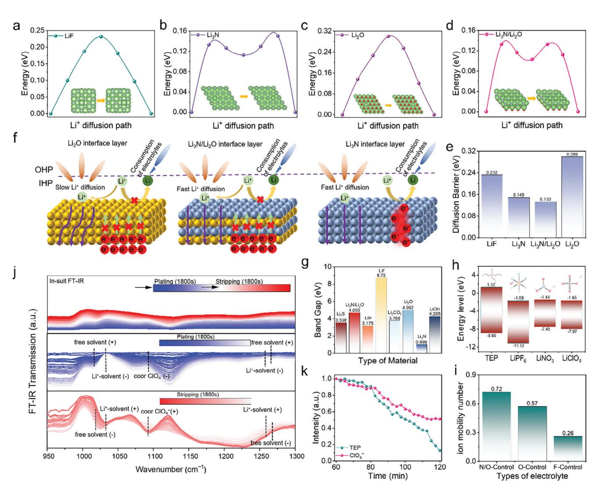
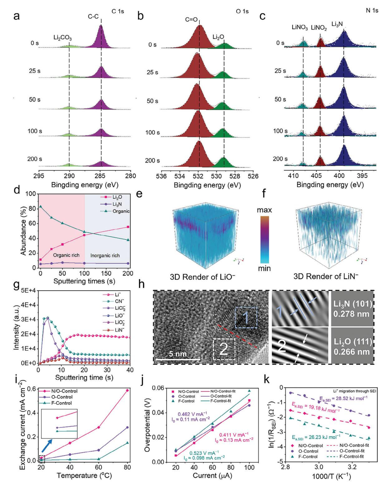
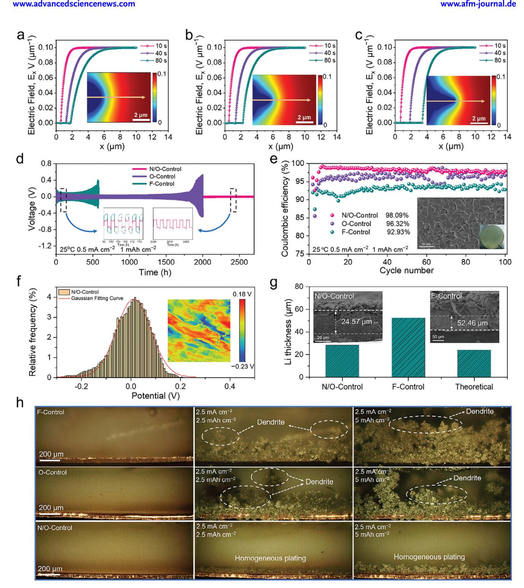
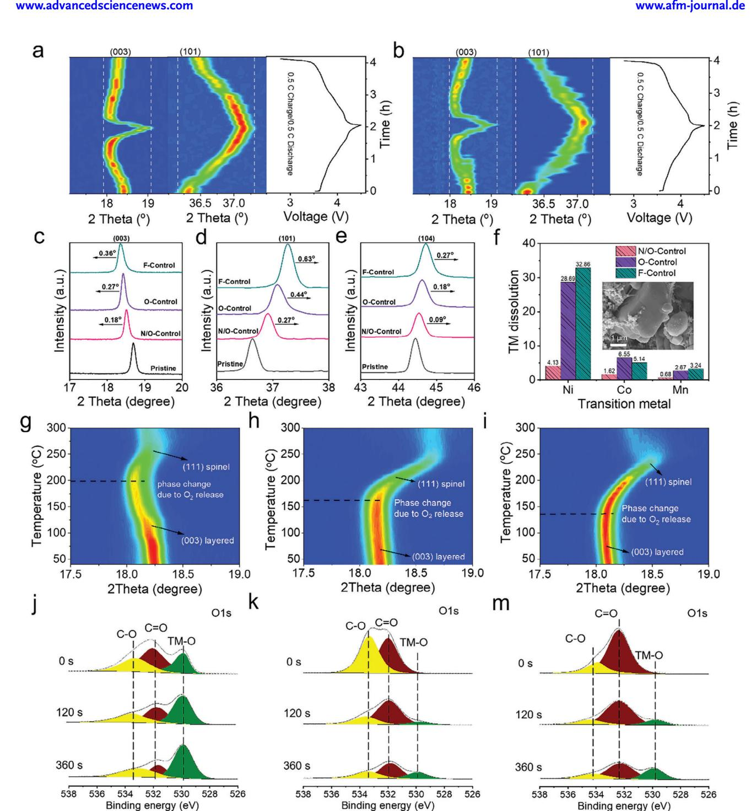
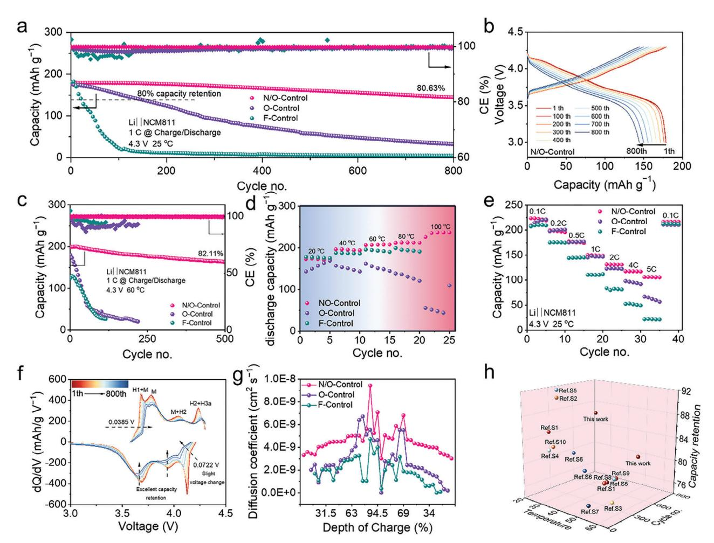
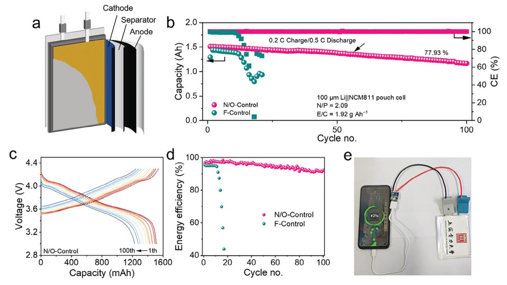

# **Construction of a Fluoride-Free and High-Voltage Lithium** Metal Battery with a Li3N/Li2O Heterostructure Solid **Electrolyte Interface**

Shengtao Xu, Sheng Xu, Xiaoyu Guo, Jin Xiong, Zhangyue Wei, Sheng Zhu,\* Jinting Xu,\* Shuaigi Gong,\* Penghui Shi, Shuainan Guo,\* and Yulin Min

Currently, the design of lithium metal batteries primarily focuses on improving cycling stability by increasing the lithium fluoride (LiF) content in the interfacial layer. However, the extensive use of fluorides poses severe environmental concerns. In this study, a novel strategy is proposed to construct a  $Li_3N/Li_2O$  heterostructure via the in situ decomposition of lithium perchlorate (LiClO4) and lithium nitrate (LiNO3), replacing the role of LiF in the SEI. This unique heterostructure combines excellent lithium-ion transport capability with robust electronic insulation properties, effectively preventing electron tunneling phenomena. When paired with the NCM811 cathode, the Li||NCM811 full cell exhibits exceptional electrochemical performance, including outstanding charge-discharge capabilities under extreme temperatures. At 60 °C and 1C conditions, the battery retains 82.11% of its capacity after 500 cycles; at 25 °C and 1C, it maintains a capacity retention rate of 80.61% after 800 cycles. Furthermore, under practical application conditions (100  $\mu$ m lithium anode, N/P ratio of 3.09, and a 1.5 Ah pouch cell), the fluorine-free lithium metal battery (LMB) retains 77.93% capacity after 100 cycles, demonstrating the superiority and practical value of this strategy.

### 1. Introduction

With the advancement of electric transportation, portable electronic devices, and grid energy storage, the demand for

Shanghai University of Electric Power

Shanghai 200090, China E-mail: zhusheng@shiep.edu.cn; xujinting011291@shiep.edu.cn; sq\_gong@shiep.edu.cn

S. Zhu, J. Xu, S. Gong, P. Shi, Y. Min Shanghai Institute of Pollution Control and Ecological Security Shanghai 200092, China S. Guo Institute of Science and Technology China Three Gorges Corporation Beijing 100038, China E-mail: guo\_shuainan@ctg.com.cn

The ORCID identification number(s) for the author(s) of this article can be found under https://doi.org/10.1002/adfm.202500335

DOI: 10.1002/adfm.202500335

high-energy-density energy storage systems has been steadily increasing.[1] However, the current combination of lithium transition metal oxide cathodes ( $LiCoO2$ ,  $LiMn_2O_4$ ,  $LiFePO_4$ , etc.)[2] and graphite anodes, which have a theoretical specific capacity of 372 mAh  $g^{-1}$ , is nearing the energy density limit of  $\approx$ 300 Wh kg-1, making it challenging to meet the growing demand.[1b,3] Given their highest energy density of 3860 mAh  $g^{-1}$  and the lowest redox potential of  $-3.04$  V versus  $SHE$ ,[4] lithium metal anodes (LMA) are expected to replace graphite anodes and become the preferred anode for nextgeneration energy storage systems. Unfortunately, the high reactivity and dendrite growth of LMA imposes greater demands on the functionality of the SEI.[5]

Recently, many researchers have focused on achieving a stable SEI through electrolyte formulation—such as solvent[6] or lithium salt[7] adjustments—and artificial SEIs.[8] However, the structure and

composition of the SEI have long been subjects of debate, and its transport mechanisms remain poorly understood.[9] Theoretically, an ideal SEI should exhibit high ionic conductivity to facilitate rapid ion transport at the interface while also possessing excellent electronic insulation to prevent electron tunneling.[10] LiF is regarded as an ideal interfacial phase due to its chemical inertness, mechanical strength, low electronic conductivity, and high interfacial energy, making fluorination the primary strategy in electrolyte design.[11] However, LiF acts as a biphasic insulator for both electrons and ions (at room temperature,  $\sigma_{\text{ion}} = 10^{-14}$ –  $10^{-12}$  S cm-1,  $\sigma_e = 10^{-14}$  S cm-1), raising doubts about its role as a beneficial chemical component in the SEI.[12] Additionally, the European Chemicals Agency (ECHA) plans to ban the largescale use of  $\approx$ 10 000 fluorinated chemicals, known as per- and polyfluoroalkyl substances (PFAS), in batteries in the future.[13] Therefore, there is an urgent need to propose a fluorine-free SEI structural design concept that offers both high lithium-ion conductivity and stability.[14]

Among other SEI descriptors,  $Li_2O$  and  $Li_3N$  are two additional key components.[15] As a representative of high-performance SEIs, Li3N exhibits beneficial characteristics such as high ionic conductivity, enhanced ion migration at the interface, and high

S. Xu, S. Xu, X. Guo, J. Xiong, Z. Wei, S. Zhu, J. Xu, S. Gong, P. Shi, Y. Min Shanghai Key Laboratory of Materials Protection and Advanced Materials in Electric Power

thermodynamic stability. However, despite its high ion transport capability, its relatively low bandgap may result in significant electron tunneling, causing lithium to deposit on the SEI surface and triggering side reactions between lithium and the electrolyte, thereby accelerating electrolyte consumption.[\[7c\]](#page-10-0) Li2O, in addition to LiF, is the second major SEI descriptor. Although it possesses good mechanical strength, superior chemical stability, and excellent electronic insulation, its ionic conductivity, like that of LiF, is not as impressive as that of Li3N.[\[16\]](#page-11-0) Therefore, rationally utilizing these two non-fluorinated SEI descriptors has emerged as a crucial strategy for achieving stable cycling performance in fluorine-free LMBs.

In this study, we innovatively design a Li3N/Li2O heterojunction SEI structure through the regulation of lithium salts. This system employs TEP as the sole solvent to ensure the intrinsic non-flammability of the electrolyte and its solubility for inorganic lithium salts,[\[17\]](#page-11-0) while LiClO4 and LiNO3 act as solutes that decompose to form the Li3N/Li2O heterostructure. Our findings indicate that the Li3N/Li2O heterostructure has a higher bandgap than Li3N, which inhibits the continuous decomposition of the electrolyte caused by electron tunneling effects. Interestingly, we discovered that, while increasing the bandgap, the Li3N/Li2O heterostructure maintains a low interfacial migration barrier, facilitating rapid lithium-ion transport across the SEI interface, thereby ensuring high-rate battery performance. Notably, we found that this in situ formed Li3N/Li2O heterojunction SEI exhibits high ionic conductivity, excellent temperature adaptability, and outstanding plating/stripping capabilities. When combined with the NCM811 cathode, the Li||NCM811 full cell demonstrates remarkable charging performance under extreme temperatures, exhibiting excellent cycling stability at 60 °C and 1C (82.11% retention after 500 cycles) and at 25 °C and 1C (80.61% retention after 800 cycles). Additionally, even under practical application conditions (100 μm Li, N/P = 3.09, 1.5 Ah pouch cell), the fluorine-free lithium metal battery (LMB) achieves a capacity retention of 77.93% after 100 cycles.

## **2. Results and Discussions**

#### **2.1. Principles of the Electrolyte and its Interface Design**

To further elucidate the advantages of the heterostructure SEI, density functional theory (DFT) simulations were performed to calculate the Li+ diffusion barriers in four different SEI structures: Li2O, Li3N, LiF, and Li3N/Li2O (**Figure 1**[,d\)](#page-2-0). Compared to Li2O-rich (0.299 eV) and LiF-rich (0.154 eV) SEIs, the Li+ migration barrier in the heterostructure SEI (0.133 eV) is slightly lower than that in Li3N (0.149 eV) (Figure [1e\)](#page-2-0), indicating that the surface of the Li3N/Li2O heterostructure SEI facilitates Li+ surface diffusion, thereby enabling uniform lithium deposition. To explain the lithium deposition behavior in these SEI layers, we have provided a schematic diagram. As shown in Figure [1f,](#page-2-0) the Li3N -rich SEI promotes fast Li+ migration across the SEI. However, due to its low bandgap, the electronic conductivity of Li3N is relatively high, making it susceptible to electron tunneling. This results in electrons easily penetrating the SEI, leading to Li+ deposition on the SEI surface. The lithium metal on the SEI surface then directly contacts the electrolyte, continuously consuming the electrolyte and ultimately causing battery deactivation. In contrast, SEIs rich in Li2O and LiF can effectively block electrons; however, due to their poor ionic conductivity, the diffusion dynamics of Li+ on the surface are limited, resulting in increased polarization potential and impedance. The Li3N/Li2O heterojunction SEI not only enables fast Li+ migration but also, due to the heterojunction effect, increases the overall bandgap, thereby enhancing its electronic insulation and mitigating electron tunneling. This ensures that Li+ is not reduced on the surface of the SEI (Figure [1g\)](#page-2-0). Therefore, we anticipate that the Li3N/Li2O heterostructure-rich SEI will endow lithium metal anodes with excellent cycling performance.

To implement the theoretical design described above, we propose a novel lithium salt combination using lithium perchlorate and lithium nitrate. This combination, characterized by a low LUMO energy level relative to TEP, enables the preferential decomposition of lithium salts to form an interface layer enriched with Li3N/Li2O heterostructures (Figure [1](#page-2-0) and Figure S1, Supporting Information). To compare the effects of different interface layers, we designed three distinct electrolytes: N/O-Control (1m LiClO4 in TEP+0.2 m LiNO3), O-Control (1m LiClO4 in TEP), and F-Control (1m LiPF6 in TEP).

First, we evaluated the ionic conductivity and Li+ transference numbers of the three electrolytes. As shown in Figure S2 (Supporting Information), the ionic conductivity of all three electrolytes increased with temperature. Although N/O-Control did not exhibit the highest ionic conductivity among the three, it exceeded 5 mS cm−1 at room temperature, a relatively high value for non-flammable electrolytes. Next, we measured the Li+ transference numbers of the three electrolytes. The transference number of N/O-Control (tLi+ = 0*.*72) was significantly higher than that of O-Control (tLi+ = 0*.*57) and F-Control (tLi+ = 0*.*26). This enhanced transference number can be attributed to the reduced interface impedance of the SEI formed by N/O-Control, which improves overall Li+ migration capability (Figure [1i](#page-2-0) and Figure S3, Supporting Information).

We monitored chemical bond vibrations in electrolyte molecules using molecular spectroscopy to investigate the bonding and decomposition of various molecules in the electrolyte. The in situ FT-IR spectra of the N/O-Control electrolyte within the electrochemical cell are shown in Figure S4 (Supporting Information), where upward peaks correspond to the consumption of substances during the reaction, and downward peaks indicate the formation of new substances. The original infrared absorption and differential spectra from the in situ FT-IR measurements during lithium metal plating and stripping processes are shown in Figure [1j.](#page-2-0) During the plating process, spectral bands corresponding to free TEP appear as downward peaks, while those associated with Li+-TEP and coordinated ClO4 − appear as upward peaks. This indicates that Li+ desolvates at the Cu current collector side, and ClO4 − undergoes reductive decomposition during plating. A clear reversible trend can be observed during the stripping process. Subsequently, we quantified the changes in surface solvents and anions by comparing the peak areas during the stripping stage and at the end of lithium plating (Figure [1k\)](#page-2-0). Notably, at the final moment of stripping, the content of TEP is 12.65%, while the content of ClO4 − is 54.06%. This suggests that TEP exhibits significantly higher reversibility than ClO4 −. These results demonstrate that the consumption rate of the lithium salt LiClO4 at the anode interface is higher

**Figure 1.** Electrolyte Design Strategies. Top view of the energy distribution of Li ions diffusing on the surfaces of a) LiF (001), b) Li3N (001), c) Li2O (111), and d) Li3N/Li2O (001) and their Li migration paths. e) Comparison of Li-ion diffusion energy barriers for different SEI components. f) Interface design schematic. g) Band gap of different materials. (h) LUMO and HOMO energy levels of TEP, LiPF6, LiNO3 and LiClO4. i) Li-ion transport in N/O-Control, O-Control and F-Control electrolytes. j) In situ infrared spectra of the N/O-Control electrolyte. k) Peak content profiles of free TEP and free ClO4 − at the stripping stage.

than that of the solvent TEP, indicating that the lithium salt decomposes preferentially over the solvent, consistent with the DFT calculation results.

#### **2.2. Structure of the Interface Layer on the Negative Side and its Interfacial Activity**

To determine the chemical properties at the interface, a systematic investigation was conducted on the SEI nanostructure and interfacial activity on the lithium metal anode side. First, we conducted a detailed analysis of the Li||NMC811 coin cell using Xray photoelectron spectroscopy (XPS) to examine the interfacial chemical composition of the SEIs formed on the lithium metal after 10 cycles with N/O-Control, O-Control, and F-Control electrolytes. The high-resolution C1s XPS spectrum (**Figure 2**[a\)](#page-3-0) reveals peaks for C─C (284.8 eV) and Li2CO3 (290.1 eV) in the N/O-Control electrolyte. The results indicate that the C─C content gradually decreases with increased sputtering time, suggesting that the organic compounds formed by the N/O-Control electrolyte are primarily distributed in the outer layer. This outer organic layer helps accommodate the volume changes during the lithium insertion/extraction process. The depth profile of the O1s XPS spectrum (Figure [2b\)](#page-3-0) reveals that the Li2O content gradually increases with increasing etching depth, while the N1s XPS spectrum (Figure [2c\)](#page-3-0) shows no significant difference in Li3N content between the inner and outer SEI. Therefore, we can infer that Li3N is uniformly embedded throughout the SEI, forming heterostructures with Li2O across the interfacial layer, which enhances ion transport capability, particularly in the surface organic layer. Additionally, by comparing the content of C─C as the organic component and Li2O and Li3N as the inorganic

**Figure 2.** Interfacial chemistry of lithium metal anode side and its interfacial activity. XPS depth profiles were determined of a) C1s, b) O1s, and c) N1s of lithium metal anodes recovered from full cell cycled with N/O-Control electrolyte at sputtering times of 0, 25, 50, 100, and 200 s, respectively. Depth analysis of the absolute intensities of organic matter, Li2O, and Li3N in the SEI formed in the N/O-Control electrolyte. Time-of-flight secondary ion mass spectral depth distributions g) and 3D images e,f) of various substances in N/O-Control electrolyte. h) TEM image of Li deposited in N/O-Control and its lattice fringes of Li2O and Li3N. i) Exchange current density at each temperature. The exchange current density (I0) is derived from (i) Tafel plot and j) voltage-time curves of Li||Li cell at different microcurrents. k)The Arrhenius equation was used to calculate the activation energy of Li+ through SEI for Li||Li cells with different electrolytes.

components, we found that the SEI formed by the N/O-Control electrolyte is dominated by organic compounds in the outer layer, while the inner layer is primarily composed of inorganic compounds (Figure [2d\)](#page-3-0). Thus, based on the XPS spectrum results, a robust dual-layer SEI was formed, with the inner layer rich in Li2O and Li3N and the outer layer rich in organic compounds.

To investigate the depth distribution of various substances in the SEI formed by the N/O-Control electrolyte, time-of-flight secondary ion mass spectrometry (TOF-SIMS) was employed. Signals of Li2O (e.g., LiO− and LiO2 −) and Li3N (e.g., LiN− and CN−) detected in the depth profile of N/O-Control (Figure [2g\)](#page-3-0) and its images (Figure [2e,f](#page-3-0) and Figure S10, Supporting Information) indicate that Li2O and Li3N exhibit similar distribution patterns within the SEI, being less abundant in the outer layer and more concentrated in the inner layer. This consistent distribution pattern promotes the formation of a heterojunction structure within the interfacial layer. In addition, several representative fragments formed by the partial decomposition of TEP were identified, including P−, PO−, PO2 −, and PO3 − species, which are primarily distributed in the surface layer of the SEI (Figure S11, Supporting Information). This organic-rich surface layer enhances the elasticity of the interface, allowing it to accommodate the volume changes caused by lithium insertion and extraction (Figure S12, S13, Supporting Information).[\[18\]](#page-11-0)

To further investigate the nanostructure of the derived SEI, the structure and composition of the SEI at the lithium metal interface in the three electrolytes were examined using high-resolution transmission electron microscopy (HRTEM) (Figure [2h\)](#page-3-0). We performed an inverse fast Fourier transform (IFFT) on the small crystalline nanoparticles with clear lattice fringes. The results show that the lattice spacing of 0.266 nm corresponds to the (111) plane of Li2O, and the lattice spacing of 0.278 nm corresponds to the (101) plane of Li3N, both exhibiting well-defined lattice structures at the interfacial layer. This suggests that a well-formed heterostructured interfacial layer was created on the lithium metal anode side through in situ electrochemical reduction.

The interfacial kinetics of the N/O-Control electrolyte were demonstrated by calculating the exchange current density (I0) during the polarization of the Li||Li symmetric cell in the deposition/stripping process, using Tafel curves at different temperatures (20, 40, 60, 80 °C). As shown in Figure [2i](#page-3-0) and Figure S14 (Supporting Information), the ionic exchange rates of the N/O-Control electrolyte at various temperatures are higher than those of the O-Control and F-Control electrolytes. This indicates that the N/O-Control electrolyte, due to the SEI induced by the high ionic conductivity of the synergistic additives, facilitates faster charge transfer kinetics.[\[19\]](#page-11-0) To further validate our conclusion regarding the exchange current, the exchange current density can also be measured using Equation 1[\[17b,20\]](#page-11-0) :

$$I \approx I_0 \frac{F}{RT} \frac{\eta_{tot}}{2} \tag{1}$$

here, tot represents the total overpotential, F is Faraday's constant, T is the absolute temperature, and R is the gas constant. Figure S15 (Supporting Information) displays the constant current charge and discharge curves of the Li||Li symmetric cell at microcurrents ranging from 20 to 100 μA. The N/O-Control electrolyte achieved the highest exchange current density of 0.13 mA cm−2 (Figure [2j\)](#page-3-0). However, the exchange current densities measured for the O-Control and F-Control electrolytes were 0.11 and 0.098 mA cm−2, respectively. This further indicates that the heterojunction SEI of Li3N/Li2O formed by the N/O-Control electrolyte facilitates charge transfer kinetics at the interface.

The Li+ deposition process can be subdivided into four stages: the diffusion of solvated Li+ in the liquid phase, the desolvation of Li+ at the electrolyte/electrode interface, the diffusion of Li+ through the SEI, and the deposition of Li+ on the lithium surface. Among these, the Li+ diffusion barrier is the most critical factor for achieving uniform lithium deposition. Therefore, we systematically investigated the activation energy (Ea ) of different electrolytes in this critical process (Figure S17, Supporting Information). This was fitted using the Arrhenius equation:[\[21\]](#page-11-0)

$$\frac{T}{R1} = A \exp\left(-\frac{Ea}{RT}\right) \tag{2}$$

here, A refers to the pre-exponential factor, Ea is the activation energy, and R1 represents the Li+ diffusion resistance of the SEI layer in the high to mid-frequency range. As shown in Figure [2k,](#page-3-0) the Li+ diffusion barriers of the SEI layers in the N/O-Control, O-Control, and F-Control electrolytes were 19.18, 28.52, and 26.23 kJ mol−1 respectively. The lower diffusion barrier indicates that the interface layer between the N/O-Control electrolyte and lithium metal, characterized by its high ionic conductivity and stability, enhances the kinetics of Li+ through the SEI layer, facilitating uniform lithium deposition.

#### **2.3. Characterization of Lithium Deposition on the Negative Side**

To verify the relationship between the interface layer and lithium deposition in N/O-Control, O-Control, and F-Control electrolytes, we first conducted integrated phase-field simulations to elucidate the correlation between the interface and lithium deposition, followed by experimental validation. A highly diffusive SEI layer was introduced on the Li surface to simulate lithium metal covered by SEI layers controlled by different elements. Small protrusions were added to the surface of the Li metal to simulate Li nuclei. Since the electrolyte governs both the ionic conductivity of the electrolyte and the ion-conducting ability at the interface, we used these two quantities as input variables for the phase-field simulations. The ionic conductivities for the N/O-Control, O-Control, and F-Control electrolytes were input as 6.23, 6.51, and 11.10 ms cm−1, the interfacial diffusion coefficients, obtained through GITT, were input as 4.58 × 10−9, 2.85 × 10−9, and 1.92 × 10−9 cm2 s−1. **Figure 3**[a,c](#page-5-0) and Figures S18–S21 (Supporting Information) show snapshots of the dendrite structures, concentration distributions, and potential distributions after 80 s for the three electrolytes. For the F-Control electrolyte, we observed that the protrusions grew into a dendritic morphology, with side branches sprouting from the main arms of the dendritic crystals (Figure S19, Supporting Information). For the O-Control electrolyte, dendrites formed and grew at a slower rate, with minimal lateral growth observed on the main arms of the Li0 dendrites (Figure S20, Supporting Information). In contrast, the protrusions in the N/O-Control electrolyte exhibited a dome-like morphology with a smooth electrode-electrolyte interface, and their

**Figure 3.** Characterization of lithium deposition on the negative side. In the phase-field simulation, a) Li+ concentration profiles along the *x*-axis for N/O-Control, b) O-Control, and c) F-Control electrolytes. The images in the Figure show the 2D maps of Li+ concentration at t = 80s. Long-term cycling performance of Li||Li symmetric cells with designed electrolytes at 0.5 mA cm−2 and 1 mAh cm−2. e) Long-term CE of Li||Cu batteries with designed electrolytes at 0.5 mA cm−2 and 1 mAh cm−2. The images in the figure show the top-view SEM images of N/O-Control electrolyte on copper foil. f) Normal distribution of the surface potential of lithium-deposited copper foil in N/O-Control electrolyte and its KPFM potential image. Electrode thickness of deposited lithium calculated from SEM results. The following image shows the cross-sectional SEM of lithium-deposited copper foil in N/O-Control and F-Control electrolytes after 10 h of deposition at a current density of 0.5 mA cm−2. h) In situ optical images of lithium deposition on bare copper in N/O-Control, O-Control, and F-Control electrolytes at 2.5 mA cm−2.

growth rate significantly decreased. Moreover, the concentration and potential variations were more gradual, suggesting that SEI layers with higher ionic conductivity and lithium-ion diffusion coefficients can effectively suppress dendrite growth (Figure S21, Supporting Information).

In addition, we conducted long-term cycling tests on Li||Li symmetric cells at 0.5 and 1 mAh cm−2 to evaluate the role of different electrolytes in stabilizing the Li metal interface (Figure [3d\)](#page-5-0). Notably, the Li||Li symmetric cells cycled in the N/O-Control electrolyte exhibited no short circuits for over 2700 h (corresponding to 675 cycles), indicating a long-term stable Li plating and stripping process regulated by the Li3N/Li2O heterogeneous SEI structure. In contrast, batteries cycled in the O-Control and F-Control electrolytes experienced short circuits after 2000 and 576 h, respectively. Furthermore, the batteries in the N/O-Control electrolyte maintained stable cycling for over 1000 h at 1 mA cm−2 and 1 mAh cm−2 (Figure S22, Supporting Information), further confirming the synergistic regulatory advantages of the Li3N/Li2O heterojunction in stabilizing the Li metal/electrolyte interface and suppressing Li dendrite growth. Subsequently, we investigated the lithium plating and stripping capabilities of the lithium metal anode using Li||Cu half-cells. In the N/O-Control electrolyte, the average CE over 100 cycles reached 98.09%, while the average CE for the O-Control and F-Control electrolytes were 96.32% and 92.93%, respectively (Figure [3e\)](#page-5-0). As shown in Figure S24 (Supporting Information), the lithium deposits formed in the N/O-Control electrolyte were significantly more densely packed. This improvement can be attributed to the fast ionic conductivity and stable SEI formed by the N/O-Control electrolyte.

As shown in Figure [3f](#page-5-0) and Figures S25–S27 (Supporting Information), compared with the O-Control and F-Control electrolytes, Li+ deposits more uniformly and with larger particle sizes in the N/O-Control electrolyte. Notably, the Li potential deposited on the Cu current collector in the N/O-Control electrolyte is more uniform, and this even potential distribution prevents the formation of Li dendrites, promoting uniform Li+ deposition. The morphological features of Li deposited on the Cu current collector were further observed using scanning electron microscopy (SEM). In the N/O-Control electrolyte, lithium deposition at a capacity of 5 mAh cm−2 and a current density of 0.5 mA cm−2 is dense and seamlessly stacked on the Cu substrate, with a thickness of 28.57 μm (Figure [3g\)](#page-5-0). In contrast, the uncontrolled growth of high-porosity, whisker-like lithium deposits in the F-Control electrolyte leads to noticeable cracks between the lithium and the Cu current collector, resulting in a thickness of 52.46 μm. Ideally, the deposition of 5 mAh cm−2 should yield a theoretical thickness of 24.25 μm. The thicknesses in the N/O-Control and F-Control electrolytes are 28.57 and 52.46 μm, respectively, indicating that the N/O-Control electrolyte facilitates dense lithium deposition, reducing porosity and minimizing parasitic reactions between the electrolyte and lithium, thereby improving CE.

To directly observe the effect of the three electrolytes on lithium deposition behavior, in situ electrochemical optical microscopy was employed. Figure [3h](#page-5-0) shows real-time optical images of in situ lithium deposition on the Cu substrate for the three electrolytes at a current density of 2.5 mA cm−2 taken after 0 mAh cm−2, 1 and 2 h of deposition. After 1 h of plating, Li dendrite growth was already observable on the surface in the O-Control and F-Control electrolytes. As the deposition process continued, dendrite growth intensified, leading to the formation of large, uneven dendrites. This behavior is attributed to the higher lithiumion diffusion barriers imposed by the SEI layer, which is composed solely of Li2O and LiF. This composition results in uneven ion flow and promotes lithium dendrite growth. In contrast, the N/O-Control electrolyte did not exhibit noticeable dendrite formation even after 2 h. This can be attributed to the regulatory effect of the Li3N/Li2O heterojunction, which enables uniform lithium-ion flow within the SEI layer, resulting in uniform deposition on the Cu substrate.

#### **2.4. Cathode Chemistry of NCM811**

Similar to the SEI, the properties of the cathode-electrolyte interphase (CEI) significantly influence the stability and electrochemical performance of the cathode/electrolyte interface. In situ X-ray diffraction (XRD) was employed to investigate the structural evolution of the NCM811 cathode during the charge-discharge process with different electrolytes (**Figure 4**[a,b\)](#page-7-0). At 3.8 V, the Bragg angles of the (003) and (101) peaks of the NCM811 cathode during cycling with the F-Control electrolyte exhibited significant changes during the phase transition from H1 to M. After transitioning to the H2 phase, the (003) peak began to shift to a lower angle, followed by a shift to a higher angle corresponding to the phase transition from H2 to H3, indicating a reduction in interlayer spacing.[\[22\]](#page-11-0) Notably, the change in the position of the (003) peak for the NCM811 cathode cycled with the N/O-Control electrolyte was much smaller than that for the F-Control electrolyte, suggesting that the change in the lattice parameter c during the charging process was impeded by the CEI formed by the N/O-Control electrolyte. Furthermore, the XRD results of the cathode after 100 cycles revealed that the shifts of the (003), (101), and (104) peaks for the NCM811 cycled with the N/O-Control electrolyte were smaller (Figure [4c–e](#page-7-0) and Figure S28, Supporting Information), indicating that the structural transition from layered to rock-salt phase was effectively suppressed.[\[23\]](#page-11-0)

At high potentials, parasitic reactions between the delithiated cathode and the electrolyte accelerate the dissolution of transition metals, which is considered one of the primary failure mechanisms in high-energy lithium-ion batteries (LIBs).[\[24\]](#page-11-0) The occurrence of side reactions between the N/O-Control electrolyte and the delithiated cathode is significantly reduced, effectively suppressing the dissolution of transition metals (Figure [4f](#page-7-0) and Figure S29, Supporting Information) and helping to maintain stable battery performance. Additionally, from the insets in Figure [4f](#page-7-0) and Figure S30 (Supporting Information), which show the shape of NCM811 particles after 100 cycles in the three electrolytes, we observed that the particles in the N/O-Control electrolyte retained their intact shape, while those in the other two electrolytes were cracked. In situ X-ray diffraction (XRD) was further employed to examine the structural changes of the NCM811 electrode materials cycled in the three electrolytes at a fully charged state, from 40 to 300 °C in 10 °C intervals (Figure [4g–i\)](#page-7-0). As the repulsive forces between oxygen atoms increase with rising temperature, the (003) peaks of the three samples initially shift to lower angles. When the temperature reaches a critical point, a sudden shift to a larger angle occurs, indicating the

**Figure 4.** Cathode chemistry of NCM811. XRD characterisation of the initial charge/discharge cycles of the NCM811 cathode using N/O-Control a) and F-Control b) electrolytes. c–e) XRD measurements of three characteristic peaks of the ncm811 cathode in the N/O-Control in 100 cycles. f) Inductively coupled plasma mass spectrometry (ICP-MS) measurement of transition metal (TM) dissolution after 100 cycles. The inset shows the particle state of the cathode material after 100 cycles in N/O-Control electrolyte In situ XRD results of fully charged N/O-Control g), O-Control h), and F-Control i) electrodes from heating experiments.XPS spectra of O1s of NCM811 after 100 cycles in N/O-Control j), O-Control k), and F-Control (m) electrolytes.

**Figure 5.** Electrochemical performance based on NCM811 cathode. Cycling performance of NCM811||Li coin cells a) and corresponding chargedischarge curves at different cycles b). c) Cycling performance of NCM811||Li cells with three electrolytes at 60 °C. Rate performance d) and performance at different temperatures e) of NCM811||Li cells with three electrolytes. f) dQ/dV curves of NCM811||Li cells with N/O-Control electrolyte after 800 cycles. g) Ion diffusion coefficients of NCM811||Li cells with three electrolytes. h) Comparison of the latest performance in reported literature on energy density, capacity retention, and cycle number for lithium metal batteries.

emergence of the LMO spinel structure (111) phase. The critical temperatures for the N/O-Control, O-Control, and F-Control electrolytes were 198, 162, and 137 °C, respectively, directly demonstrating that the cathode interphase formed by N/O-Control effectively suppresses oxygen release during charging, thereby enhancing thermodynamic stability.[\[25\]](#page-11-0)

To gain deeper insight into the internal composition of the CEI, depth profiling was conducted using X-ray photoelectron spectroscopy (XPS) with Ar+ sputtering for intervals of 0, 120, and 360 s. The O1s spectra presented in Figure [4j–m](#page-7-0) indicate that the CEI derived from the N/O-Control electrolyte exhibits weaker signals for C═O and C─O groups, suggesting minimal solvent decomposition, while the other two electrolytes show more significant solvent breakdown. Additionally, the peak at 529.9 eV, which corresponds to lattice oxygen in NCM811, appears earlier in the N/O-Control electrolyte, indicating the formation of a thinner CEI layer.[\[26\]](#page-11-0) We utilized transmission electron microscopy (TEM) to visualize the thickness of the interfacial layer, confirming that the N/O-Control electrolyte forms the thinnest CEI, as indicated by the XPS data (Figure S31, Supporting Information). Inorganic species are another crucial component of the CEI, significantly influencing interfacial stability and kinetics. Notably, as shown in Figure S32 (Supporting Information) from the N1s and Cl2p XPS spectra, the CEI layer of N/O-Control contains a notable amount of Li3N and LiCl, both of which possess high ionic conductivity, thereby enhancing the rates of Li+ insertion and extraction while strengthening the interfacial layer. Overall, compared to the other two electrolytes, the N/O-Control electrolyte forms a thin, inorganic-rich CEI protective layer that stabilizes the surface and suppresses further solvent decomposition and structural degradation.

#### **2.5. Electrochemical Performance of Li||NMC811 Full Cells**

As shown in **Figure 5**a, the full-cell performance of the N/O-Control electrolyte surpasses that of the O-Control and F-Control electrolytes. Specifically, the full cell with the N/O-Control

**Figure 6.** Performance of Ah-level pouch cells with thin-layer lithium metal anodes using N/O-Control and F-Control electrolytes. a) Schematic diagram of the stacked pouch cell. b) Cycling performance of the stacked Li||NCM811 pouch cell. c) Charge-discharge curves corresponding to different cycles with N/O-Control electrolyte. d) Energy efficiency of the stacked Li||NCM811 pouch cell. e) Practical application of pouch cells assembled with N/O-Control electrolyte.

electrolyte demonstrated 80.63% capacity retention after 800 cycles, with an impressive average CE of 99.84%. In Figure [5b,](#page-8-0) the charge/discharge voltage curves for the battery using the N/O-Control electrolyte are displayed. To further verify the performance of the three electrolytes under high voltage, the N/O-Control full cell maintained an impressive 76.34% capacity retention after 200 cycles, even with a cutoff voltage of 4.5 V (Figure S35, Supporting Information). Beyond its excellent performance at room temperature, the Li||NMC811 lithium metal full cell also demonstrated outstanding performance at elevated temperatures. Figure [5c](#page-8-0) and Figure S36 (Supporting Information) illustrate the cycling stability of Li||NMC811 full cells at 60 °C, using N/O-Control, O-Control, and F-Control electrolytes at 1C. At 60 °C, the N/O-Control electrolyte achieved 82.11% capacity retention after 500 cycles, with an average CE of 99.72%. Figure [5d](#page-8-0) and Figure S37 (Supporting Information) further compare the performance of Li||NMC811 full cells with the three electrolytes at various temperatures. The O-Control electrolyte exhibited severe capacity fading beginning at 40 °C, while the F-Control electrolyte showed capacity fading at 60 °C and overcharging issues at 100 °C. Notably, the N/O-Control electrolyte operated stably even under extremely high temperatures. Specific capacities were 172.34, 195, 207, 212, and 234 mAh g−1 at 20, 40, 60, 80, and 100 °C, respectively. Figure [5e](#page-8-0) shows the rate performance of Li||NMC811 full cells with N/O-Control, O-Control, and F-Control electrolytes. The Li||NMC811 cell with N/O-Control electrolyte delivered capacities of 175, 149, 131, 117, and 105 mAh g−1 at 0.5, 1, 2, 4, and 5C, respectively. The improved rate performance of the Li||NMC811 full cell with the N/O-Control electrolyte is attributed to the fast ionic conductivity of the Li3N/Li2O heterojunction, which enhances lithium-ion transport across the interface.

To clarify the high-voltage stability and phase transitions during cycling, we evaluated the dQ/dV curves of the three electrolytes (Figure [5f](#page-8-0) and Figure S38, Supporting Information). The dQ/dV curves for the NCM811 cathode with O-Control and F-Control electrolytes showed significant capacity loss and voltage fading, with the phase transition peaks nearly disappearing in the later stages of cycling. In contrast, the NCM811 cathode cycled with the N/O-Control electrolyte exhibited only a voltage decay of 0.0722 V at the H2a+H3b peak after 800 cycles. Meanwhile, the phase transition potential difference from H1 to M for the NCM811 cathode in the O-Control and F-Control electrolytes was significant; in contrast, the NCM811 cathode cycled with the N/O-Control electrolyte showed only a slight potential increase of 0.0385 V after 800 cycles, indicating that the N/O-Control electrolyte effectively suppresses the irreversible electrochemical degradation of the cathode. Results from galvanostatic intermittent titration (GITT) and the calculated Li+ diffusion coefficient (DLi+ ) further demonstrate that the overpotential during charge-discharge of the NCM811 cathode cycled with the N/O-Control electrolyte is significantly lower, and DLi+ is higher, confirming the enhanced kinetics of the interfacial layer in the N/O-Control electrolyte (Figure [5g](#page-8-0) and Figure S39, Supporting Information). Finally, compared to advanced literature, the designed electrolyte exhibits superior performance in terms

of cycle count, capacity retention, and temperature adaptability (Figure [5h\)](#page-8-0).

To further illustrate the application potential of the Li3N/Li2O heterojunction SEI in practical lithium metal batteries, we fabricated an Ah-level stacked pouch cell comprising a lithium metal anode and an NCM811 cathode (**Figure 6**[a\)](#page-9-0). The stacked Li||NMC811 lithium metal pouch cell with the N/O-Control electrolyte delivered a high reversible capacity of 1.51 Ah at 0.5C (Figure [6b,c\)](#page-9-0). This cell exhibited remarkable cycling stability over 100 cycles, maintaining a capacity retention rate of 77.93%. In contrast, the F-Control electrolyte experienced a severe capacity drop in fewer than 20 cycles. The slight capacity decay can be attributed to the degradation of the NCM811 cathode after prolonged cycling in the charged state. Additionally, the voltagecapacity curves indicate only minor electrode potential polarization after extended cycling. Battery energy efficiency refers to the percentage of discharge energy compared to charging energy during the battery's charge-discharge cycle under specified conditions. By calculating energy efficiency, we can assess energy losses during the storage and release processes, providing a better evaluation of the battery's performance and usability. The energy efficiency of the N/O-Control pouch cell consistently exceeded 92%, reflecting the excellent energy output of the battery (Figure [6d\)](#page-9-0). Finally, the fabricated pouch cell successfully powered a mobile phone after charging for 20 min, demonstrating the practical application prospects of this electrolyte (Figure [6e\)](#page-9-0).

In conclusion, we propose replacing the current LiF-based SEI structure with a Li3N/Li2O heterostructure-based SEI. A series of theoretical calculations and experiments demonstrate that the Li3N/Li2O heterostructure possesses a low lithium-ion diffusion barrier, enabling fast lithium-ion transport within the SEI. Additionally, this heterostructure has a significantly higher bandgap compared to Li3N, preventing electron tunneling and thus reducing the loss of active lithium and electrolyte. Thanks to these properties, the practical 1.5 Ah Li||NCM811 pouch cell maintains a capacity retention of 77.93% after 100 cycles. We show that LiF can be entirely replaced through rational SEI design. This study provides a theoretical framework for a completely fluoride-free electrolyte.

## **Supporting Information**

Supporting Information is available from the Wiley Online Library or from the author.

## **Acknowledgements**

This work was supported by National Natural Science Foundation of China (22479094 and 22075174), Science and Technology Commission of Shanghai Municipality (20520740900 and 19DZ2271100), and International Joint Laboratory on Resource Chemistry.

## **Conflict of Interest**

The authors declare no conflict of interest.

# **Data Availability Statement**

The data that support the findings of this study are available from the corresponding author upon reasonable request.

# **Keywords**

heterostructured, high-voltage, li3n/li2o, lithium metal batteries

Received: January 5, 2025 Revised: January 24, 2025 Published online: February 13, 2025

- [1] a) J. B. Goodenough, K.-S. Park, *J. Am. Chem. Soc.* **2013**, *135*, 1167. b) J. M. Tarascon, M. Armand, *Nature* **2001**, *414*, 359.
- [2] J. B. Goodenough, Y. Kim, *Chem. Mater.* **2010**, *22*, 587.
- [3] M. Winter, B. Barnett, K. Xu, *Chem. Rev.* **2018**, *118*, 11433.
- [4] a) S. Yuan, T. Kong, Y. Zhang, P. Dong, Y. Zhang, X. Dong, Y. Wang, Y. Xia, *Angew. Chem., Int. Ed.* **2021**, *60*, 25624. b) P. P. Paul, E. J. McShane, A. M. Colclasure, N. Balsara, D. E. Brown, C. Cao, B.-R. Chen, P. R. Chinnam, Y. Cui, E. J. Dufek, D. P. Finegan, S. Gillard, W. Huang, Z. M. Konz, R. Kostecki, F. Liu, S. Lubner, R. Prasher, M. B. Preefer, J. Qian, M.-T. F. Rodrigues, M. Schnabel, S.-B. Son, V. Srinivasan, H.-G. Steinrück, T. R. Tanim, M. F. Toney, W. Tong, F. Usseglio-Viretta, J. Wan, et al., *Adv. Energy Mater.* **2021**, *11*, 2100372.
- [5] a) B. Jagger, M. Pasta, *Joule* **2023**, *7*, 2228. b) B. Han, X. Li, S. Bai, Y. Zou, B. Lu, M. Zhang, X. Ma, Z. Chang, Y. S. Meng, M. Gu, *Matter* **2021**, *4*, 3741. c) E. Peled, *J. Electrochem. Soc.* **1979**, *126*, 2047.
- [6] a) Z. Piao, X. Wu, H.-R. Ren, G. Lu, R. Gao, G. Zhou, H.-M. Cheng, *J. Am. Chem. Soc.* **2023**, *145*, 24260. b) P. Li, Z. Zhang, Z. Zhao, X. Zhang, H. Zhang, G. Li, *Angew. Chem., Int. Ed.* **2024**, *63*, e202319090. c) G.-X. Li, V. Koverga, A. Nguyen, R. Kou, M. Ncube, H. Jiang, K. Wang, M. Liao, H. Guo, J. Chen, N. Dandu, A. T. Ngo, D. Wang, *Nat. Energy.* **2024**, *9*, 817.
- [7] a) Z. Jiang, C. Li, T. Yang, Y. Deng, J. Zou, Q. Zhang, Y. Li, *ACS Energy Lett.* **2024**, *9*, 1389. b) Z. Wen, W. Fang, F. Wang, H. Kang, S. Zhao, S. Guo, G. Chen, *Angew. Chem., Int. Ed.* **2024**, *63*, e202314876. c) S. Kim, S. O. Park, M.-Y. Lee, J.-A. Lee, I. Kristanto, T. K. Lee, D. Hwang, J. Kim, T.-U. Wi, H.-W. Lee, S. K. Kwak, N.-S. Choi, *Energy Storage Mater.* **2022**, *45*, 1.
- [8] a) Y. Xie, Y. Huang, Y. Zhang, T. Wu, S. Liu, M. Sun, B. Lee, Z. Lin, H. Chen, P. Dai, Z. Huang, J. Yang, C. Shi, D. Wu, L. Huang, Y. Hua, C. Wang, S. Sun, *Nat. Commun.* **2023**, *14*, 2883. b) J. Pokharel, A. Cresce, B. Pant, M. Y. Yang, A. Gurung, W. He, A. Baniya, B. S. Lamsal, Z. Yang, S. Gent, X. Xian, Y. Cao, W. A. Goddard, K. Xu, Y. Zhou, *Nat. Commun.* **2024**, *15*, 3085. c) J. Lu, Z. Ma, Y. Wang, W. Dai, X. Cheng, J. Zuo, H. Lei, Z.-W. Fu, *Small* **2024**, *20*, 2406359. d) Z. Wang, S. Qin, F. Chen, S. Chen, D. Liu, D. Jiang, P. Zhang, P. Mota-Santiago, D. Hegh, P. Lynch, A. S. Alotabi, G. G. Andersson, P. C. Howlett, M. Forsyth, W. Lei, J. M. Razal, *ACS Nano* **2024**, *18*, 3531. e) J. Su, M. Pasta, Z. Ning, X. Gao, P. G. Bruce, C. R. M. Grovenor, *Energy Environ. Sci.* **2022**, *15*, 3805.
- [9] J. Tan, J. Matz, P. Dong, J. Shen, M. Ye, *Adv. Energy Mater.* **2021**, *11*, 2100046.
- [10] a) A. Hu, W. Chen, X. Du, Y. Hu, T. Lei, H. Wang, L. Xue, Y. Li, H. Sun, Y. Yan, J. Long, C. Shu, J. Zhu, B. Li, X. Wang, J. Xiong, *Energy Environ. Sci.* **2021**, *14*, 4115. b) X. Ji, S. Hou, P. Wang, X. He, N. Piao, J. Chen, X. Fan, C. Wang, *Adv. Mater.* **2020**, *32*, 2002741. c) E. Peled, S. Menkin, *J. Electrochem. Soc.* **2017**, *164*, A1703.
- [11] a) T. Li, X.-Q. Zhang, P. Shi, Q. Zhang, *Joule* **2019**, *3*, 2647. b) C. Wang, Y. S. Meng, K. Xu, *J. Electrochem. Soc.* **2019**, *166*, A5184.
- [12] a) S. Zhang, R. Li, N. Hu, T. Deng, S. Weng, Z. Wu, D. Lu, H. Zhang, J. Zhang, X. Wang, L. Chen, L. Fan, X. Fan, *Nat. Commun.* **2022**, *13*, 5431. b) G. M. Hobold, C. Wang, K. Steinberg, Y. Li, B. M. Gallant, *Nat. Energy.* **2024**, *9*, 580. c) W. Huang, H. Wang, D. T. Boyle, Y. Li, Y. Cui, *ACS Energy Lett.* **2020**, *5*, 1128.

- [13] a) A. Rensmo, E. K. Savvidou, I. T. Cousins, X. Hu, S. Schellenberger, J. P. Benskin, *Environmental Science: Processes & Impacts* **2023**, *25*, 1015. b) F. Spyrakis, T. A. Dragani, *Toxics* **2023**, *11*, 721.
- [14] Y. Wang, Z. Wu, F. M. Azad, Y. Zhu, L. Wang, C. J. Hawker, A. K. Whittaker, M. Forsyth, C. Zhang, *Nat. Rev. Mater.* **2024**, *9*, 119.
- [15] a) H. Wu, H. Jia, C. Wang, J.-G. Zhang, W. Xu, *Adv. Energy Mater.* **2021**, *11*, 2003092. b) M. S. Kim, Z. Zhang, J. Wang, S. T. Oyakhire, S. C. Kim, Z. Yu, Y. Chen, D. T. Boyle, Y. Ye, Z. Huang, W. Zhang, R. Xu, P. Sayavong, S. F. Bent, J. Qin, Z. Bao, Y. Cui, *ACS Nano* **2023**, *17*, 3168.
- [16] a) H. Zeng, K. Yu, J. Li, M. Yuan, J. Wang, Q. Wang, A. Lai, Y. Jiang, X. Yan, G. Zhang, H. Xu, J. Wang, W. Huang, C. Wang, Y. Deng, S.-S. Chi, *ACS Nano* **2024**, *18*, 1969. b) M. S. Kim, Z. Zhang, P. E. Rudnicki, Z. Yu, J. Wang, H. Wang, S. T. Oyakhire, Y. Chen, S. C. Kim, W. Zhang, D. T. Boyle, X. Kong, R. Xu, Z. Huang, W. Huang, S. F. Bent, L.-W. Wang, J. Qin, Z. Bao, Y. Cui, *Nat. Mater.* **2022**, *21*, 445.
- [17] a) Z. Deng, Y. Jia, Y. Deng, C. Xu, X. Zhang, Q. He, J. Peng, H. Wu, W. Cai, *J. Energy Chem.* **2024**, *96*, 282. b) Z. Ni, C. Wei, Z. Wang, Y. Li, X. Zhang, S. Xiong, J. Feng, *Energy Storage Mater.* **2024**, *71*, 103603.
- [18] Q.-K. Zhang, X.-Q. Zhang, J. Wan, N. Yao, T.-L. Song, J. Xie, L.-P. Hou, M.-Y. Zhou, X. Chen, B.-Q. Li, R. Wen, H.-J. Peng, Q. Zhang, J.-Q. Huang, *Nat. Energy.* **2023**, *8*, 725.

- [19] a) Q. Zhao, Z. Tu, S. Wei, K. Zhang, S. Choudhury, X. Liu, L. A. Archer, *Angew. Chem., Int. Ed.* **2018**, *57*, 992. b) K. Ryu, K. Lee, J. Lim, M. J. Lee, K.-H. Kim, U. H. Lee, B. L. D. Rinkel, K. Kim, S. Kim, D. Kim, D. Shin, B. McCloskey, J. Kang, S. W. Lee, *Energy Environ. Sci.* **2024**, *17*, 7772.
- [20] Y. Guo, P. Niu, Y. Liu, Y. Ouyang, D. Li, T. Zhai, H. Li, Y. Cui, *Adv. Mater.* **2019**, *31*, 1900342.
- [21] a) K. Xu, *J. Electrochem. Soc.* **2007**, *A162*, 154. b) S. Tu, B. Zhang, Y. Zhang, Z. Chen, X. Wang, R. Zhan, Y. Ou, W. Wang, X. Liu, X. Duan, L. Wang, Y. Sun, *Nat. Energy.* **2023**, *8*, 1365.
- [22] T. Liu, L. Yu, J. Liu, J. Lu, X. Bi, A. Dai, M. Li, M. Li, Z. Hu, L. Ma, D. Luo, J. Zheng, T. Wu, Y. Ren, J. Wen, F. Pan, K. Amine, *Nat. Energy.* **2021**, *6*, 277.
- [23] Y. Wei, J. Zheng, S. Cui, X. Song, Y. Su, W. Deng, Z. Wu, X. Wang, W. Wang, M. Rao, Y. Lin, C. Wang, K. Amine, F. Pan, *J. Am. Chem. Soc.* **2015**, *137*, 8364.
- [24] a) C. Zhan, T. Wu, J. Lu, K. Amine, *Energy Environ. Sci.* **2018**, *11*, 243. b) X. Fan, C. Wang, *Chem. Soc. Rev.* **2021**, *50*, 10486.
- [25] a) K. Du, A. Gao, L. Gao, S. Sun, X. Lu, C. Yu, S. Li, H. Zhao, Y. Bai, *Nano Energy* **2021**, *83*, 105775. b) W. Zhang, Y. Sun, H. Deng, J. Ma, Y. Zeng, Z. Zhu, Z. Lv, H. Xia, X. Ge, S. Cao, Y. Xiao, S. Xi, Y. Du, A. Cao, X. Chen, *Adv. Mater.* **2020**, *32*, 2000496.
- [26] C. Yang, M. Zheng, R. Qu, H. Zhang, L. Yin, W. Hu, J. Han, J. Lu, Y. You, *Adv. Mater.* **2024**, *36*, 2307220.