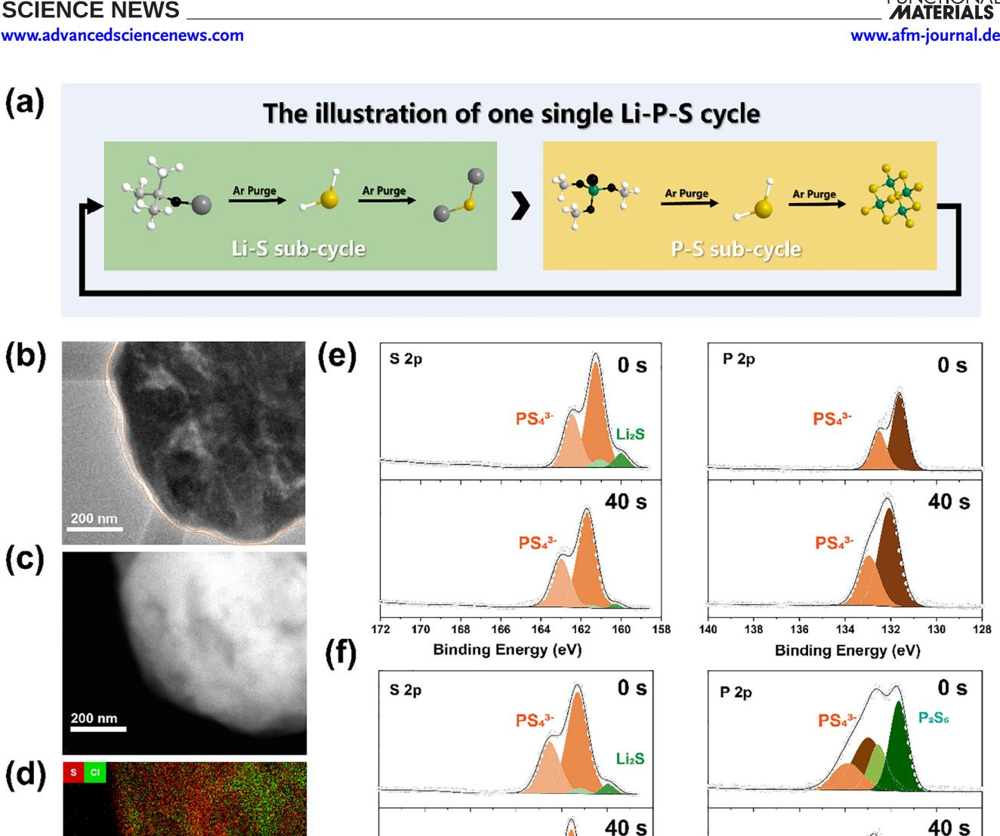
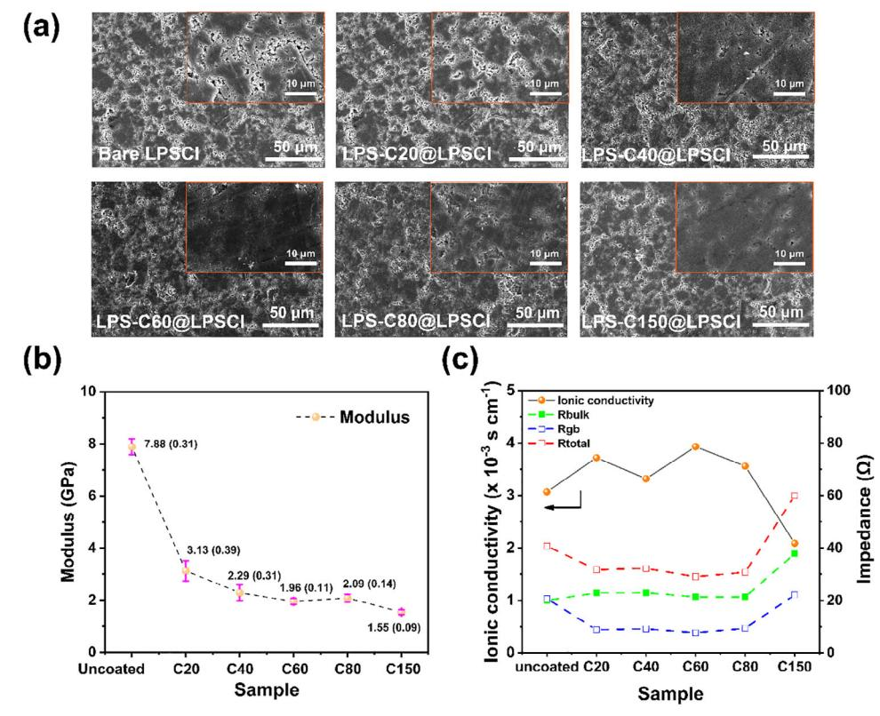
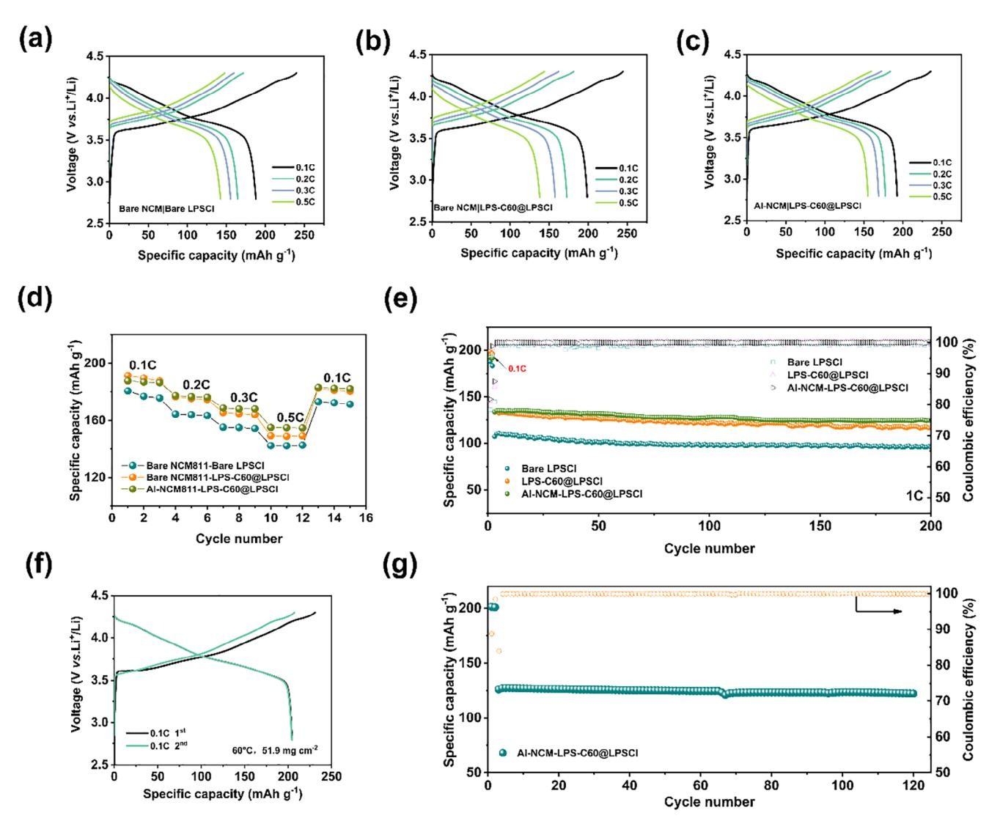
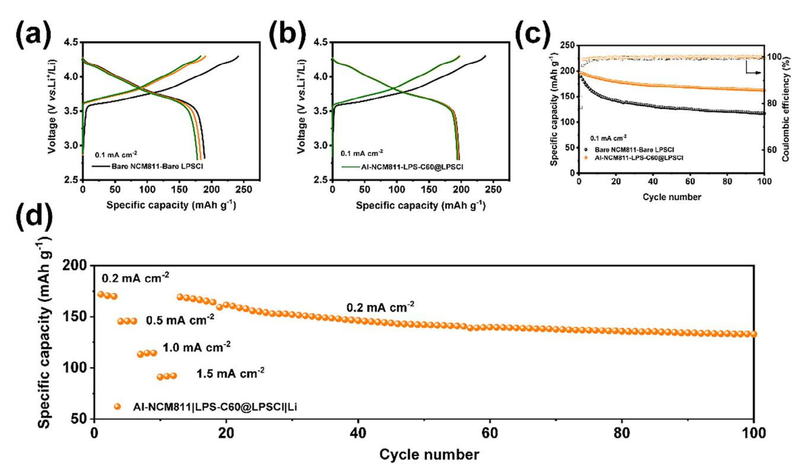
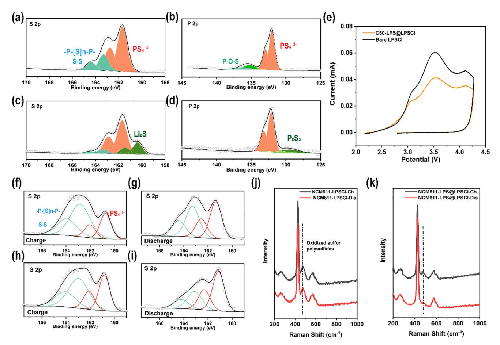
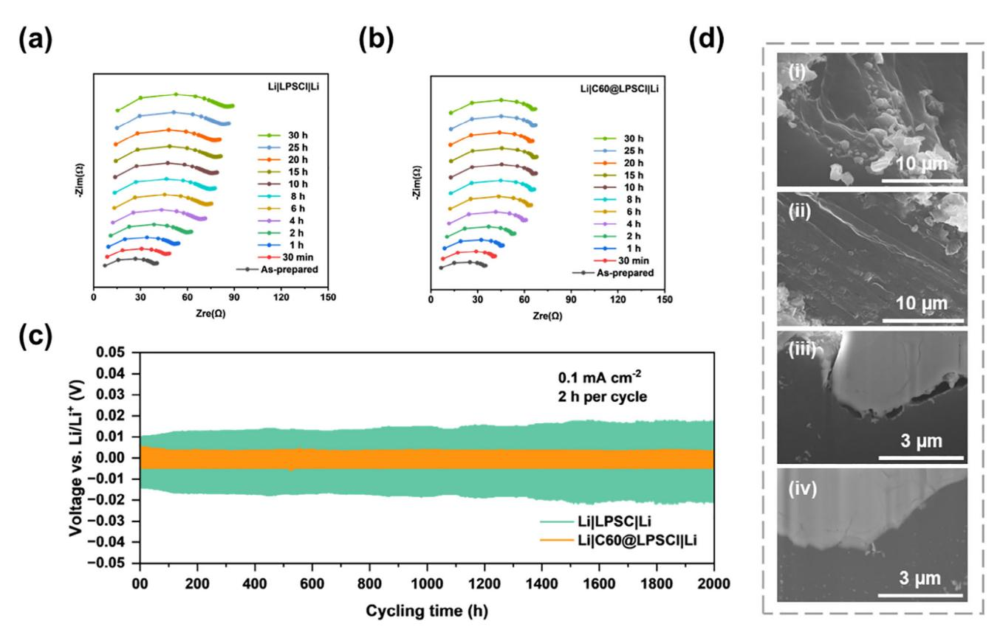

# **Ultra-Thin Lithium–Phosphorus–Sulfur (LPS) Interfacial Electrolyte Layer for All-Solid-State Lithium Metal Battery** with High-Rate and High-Areal-Capacity Performance

Yu Su, Yuxi Deng, Yu Luo, Zhaoyu Rong, Yuteng Fan, Cong Zhong, Fucheng Ren, Xiangsi Liu, Yuqi Wu, Kangjun Wang, Yong Cheng, Haoyue Zhong, Jun Zhao, Mingsheng Wang, Xuefeng Wang, Jianyu Huang, Jiawei Yan, and Yong Yang\*

To solve the challenging interfacial issues of all-solid-state lithium batteries (ASSLBs), a novel strategy to construct a nano-scale lithium-phosphorus-sulfur (LPS) electrolyte film by atomic layer deposition (ALD) technique and to coat it on LicPS5Cl (LPSCl) electrolyte is proposed and demonstrated for the first time. The modified LPS@LPSCI electrolytes exhibit excellent compatibility with both high-voltage cathodes and pure lithium metal anode with enhanced ionic conductivity, much reduced electronic conductivity, and modified mechanical strength, which can fill the gaps in the base electrolytes after electrolyte pellet pressing and reduce interfacial defects in the composite electrolytes. The sulfide-based ASSLBs, assembled with LPS@LPSCI, Al-GL@NCM811 materials, and a lithium indium anode, achieves a high areal capacity of 10.6 mAh  $cm^{-2}$  at high-temperature and high mass loading (60 °C, 51.9 mg cm $-2$ ). Additionally, LPS@LPSCI has high stability toward lithium metal, suppressing interfacial side reactions and improving physical contact, enabling charge and discharge testing at a high current density of 1.5 mA cm $-2$ . This study demonstrates that the nano-scaled film formation of sulfide solid-state electrolytes can significantly reduce the polarization voltage of traditional double-layer electrolytes toward lithium metal, and provide a new approach for interfacial modification in sulfide solid-state batteries.

## 1. Introduction

The large-scale development and application of electric vehicles and smart electronic devices necessitates the advancement of batteries with long cycle life, high energy density, as well as safety and reliability.[1] Sulfide-based ASSLBs are more promising next-generation energy storage devices due to the excellent lithium ionic conductivity and safety of solid-state electrolytes (SSEs).[2]

However, the energy density of sulfidebased ASSLBs has not yet reached the standard for commercial liquid batteries.[3] The fundamental reason is the intrinsic electrochemical window of SSEs of  $1.71-2.5$  V. resulting in a mismatch with high-voltage cathode materials and lithium metal anode. During the electrochemical process, sulfites, sulfates, phosphates, sulfur, and  $P_2S_x$  compounds are oxidized on the cathode, while P, LiCl, and Li-M compounds  $(M = \text{metal element})$  are generated on the anode.[4] Besides, the fracture failure and

H. Zhong, M. Wang, J. Yan, Y. Yang State Key Laboratory for Physical Chemistry of Solid Surface Department of Chemistry College of Chemistry and Chemical Engineering Xiamen University Xiamen 361005, China E-mail: yyang@xmu.edu.cn Z. Rong, J. Zhao, J. Huang Clean Nano Energy Center State Key Laboratory of Metastable Materials Science and Technology Yanshan University Qinhuangdao 066004, China

Y. Su, Y. Deng, Y. Luo, Y. Fan, F. Ren, X. Liu, Y. Wu, K. Wang, Y. Cheng,

The ORCID identification number(s) for the author(s) of this article can be found under https://doi.org/10.1002/adfm.202509820

Adv. Funct. Mater. 2025, e09820

C. Zhong, X. Wang Beijing National Laboratory for Condensed Matter Physics Institute of Physics Chinese Academy of Science School of Physical Sciences University of Chinese Academy of Sciences Beijing 100190, China Y. Cheng, M. Wang State Key Laboratory of Physical Chemistry of Solid Surface College of Materials Xiamen University Xiamen 361005, China

www.afm-journal.de

contact loss caused by stress accumulation on bulk sulfide SSEs due to the inability to release stress will result in rapid attenuation of capacity and cycle life.[5]

Many methods are used to solve the above problems, such as interface coating to suppress interfacial side reactions, and electrode material structure design to alleviate mechanical stress. In addition, sufficient pressure can be applied during operation to maintain physical contact between components. However, the interface coating and electrode design are targeted at a single object, whether it is for cathode/SSE or anode/SSE. Even worse, although high compression pressure can make physical contact between particles closer, when it reaches a certain value, the pressure may directly act on the mechanically hard active material particles, causing particle breakage. Excessive work pressure is not conducive to its commercial application.

The problems caused by sulfide solid electrolytes cannot be solved by a single method, modifying the sulfide solid electrolyte itself is the most effective way. Therefore, doping and coating methods are adopted on SSE to stabilize the cathode/SSE and anode/SSE interface. However, the methods have encountered new problems. The treatment of the electrolyte itself will affect its advantageous high ionic conductivity, and the physicochemical and mechanical properties cannot be simultaneously improved. More importantly, the mechanical properties of easily overlooked sulfide electrolytes are crucial for inhibiting the growth of lithium dendrites. The grain boundary voids, defects, and cracks in solid electrolytes, as well as high electronic conductivity, can promote the growth of lithium dendrites.[6]

Therefore, we need to put forward a pioneering idea to solve all these problems. Despite their narrow electrochemical windows, sulfide SSEs possess high ionic conductivity and low electronic conductivity, making them seemingly ideal coating materials. Importantly, the decomposition of sulfide SSEs at the cathode hinders their application. It is generally considered to be detrimental to the performance of batteries. However, this depends on the specific circumstances. Tatsumisago et al. reported that the changes to the structure and electronic states of the  $Li_3PS_4$  as the active materials are reversible because of the reversible dissociation of S–S bonds.[7] Nan's group utilized sulfide SSEs as active materials, the sulfide SSEs provided capacity through redox decomposition, thus realizing a high-capacity all-sulfide electrolyte solid-state battery.[8] Therefore, by selecting a suitable sulfide SSEs such as Li3PS4, it may contribute to the capacity of the cathode electrolyte.

As for anode interface, sulfide SSEs are frequently used as coating materials, especially the  $Li_3PS_4$  sulfide SSE. In liquid lithium-ion batteries, Nazar and his collaborators achieved excellent cycling performance in liquid Li-Li symmetric batteries by forming a high ionic conductivity  $Li_3PS_4$  sulfide electrolyte coating on the surface of lithium metal using  $Li_2S_6$  and  $P_2S_5$  as additives.[9] Subsequently, Sun et al. also reported the reaction of  $P_4S_{16}$  with lithium metal to realize a thin Li3PS4 coating layer with a thickness of 60 nm, which was found to be able to inhibit the formation of lithium dendrites and reduce the interfacial side reactions.[10] It can be seen that  $\mathrm{Li_{3}PS_{4}}$  is a type of sulfide SSE that is quite stable against lithium metal. The technical challenge focuses on how to reduce the thickness to less than 100 nm, otherwise, large interfacial impedance will be generated between the

interlayer electrolytes, affecting the kinetic transport of lithium ions.

Therefore, in this work, for the first time, an amorphous LPS film was synthesized by ALD and used for coating crystalline LPSCI SSE to solve the problem of cathode/SSE, electrolyte, and anode/SSE. The modified LPS@LPSCl showed an increase in ionic conductivity (3 to 3.9 mS  $\text{cm}^{-1}$ ) and a decrease in electronic conductivity (1.571 to 1.099  $\times$  10-8 S cm-1). Mechanically softer amorphous LPS (2-5 GPa) on the surface of crystalline LPSCl electrolyte (11.4 GPa) fills the voids and improves the densification. Interestingly, the introduction of LPS coating on LPSCl powders reduces the electronic conductivity on the cathode/SSE interface, thus reducing the oxidation of LPSCl. During the charging process, the tetrahedral  $PS_4$ 3- of LPS@LPSCl is more converted to  $(-P-S_n-P, S-S)$  than to final oxidation product sulfate, and during the discharge process,  $(-P-S_n-P, S-S)$  is converted to  $PS_4^{\overline{3}}$ . Thus, the assembled NCM811-LPS-C60@LPSCl|LPS-C60@LPSCl|Li-In released a discharge-specific capacity of 198.7 mAh g-1 at 0.1 C  $(1 \text{ C} = 200 \text{ mA g}^{-1})$  with a cathode loading of 12.73 mg cm-2. Moreover, under high temperatures and high loading conditions (60 °C, 51.9 mg cm-2), the areal capacity is up to 10.6 mAh cm-2. Besides, LPS@LPSCl is highly stable to lithium metal, inhibiting interfacial side reactions and enhancing physical contact. The assembled all-solid-state lithium metal batteries (ASSLMBs) exhibited a high discharge specific capacity of 196.7 mAh  $g^{-1}$  at  $0.1 \text{ mA cm}^{-2}$ . It could achieve stable cycling (100 cycles capacity retention rate of 84.1%), while only 61.8% for bare material. Furthermore, the ASSLMBs assembled with LPS@LPSCl electrolyte demonstrated the capability to undergo stable electrochemical cycling at a high current density of 1.5 mA  $\text{cm}^{-2}$ . Compared to other methods, the method of coating amorphous LPS on crystalline LPSCI by ALD technique can achieve the overall optimization of the cathode/SSE interface, anode/SSE interface, and electrolyte bulk phase. The nano-scale thin film of sulfide SSE can open up a new way of high energy density ASSLBs.

#### 2. Results and Discussion

## 2.1. Physicochemical Characterization of Amorphous LPS Film

The lithium tert-butoxide, trimethyl phosphate, and H2S were used as precursors, the schematic of the ALD process of LPS film is shown in Figure 1a. To determine the effectiveness of the ALD process, the physicochemical properties of the LPS film were investigated carefully. A 150-cycle LPS layer was coated on the multi-walled carbon nanotubes (MWCNTs). The TEM images of coated-MWCNTs are shown in Figure S1 (Supporting Information). The elemental distribution of P and S shows that the precursor lithium tert-butoxide and trimethyl phosphate are reactive with  $H_2S$  gas at 200 °C.

To confirm the chemical composition of the LPS film, we further investigated it by depositing 100 cycles of  $Li_2S$ , 100 cycles of  $P_2S_5$ , and 100 cycles of LPS on silicon wafers for analysis. The chemical composition of  $Li_2S$ ,  $P_2S_5$ , and LPS film on the three samples was subsequently investigated by XPS, and the data obtained from the fitting is shown in Figure S2 (Supporting Information). Li-S of amorphous  $Li_2S$  were observed in www.advancedsciencenews.com

 $(a)$ 

 $(b)$ 

 $(c)$ 

 $(d)$ 

 $\frac{1}{70}$  $\frac{1}{166}$  $\frac{1}{164}$  $\frac{1}{162}$  $1\overset{\scriptscriptstyle+}{60}$  $\frac{1}{36}$  $\frac{1}{34}$  $\frac{1}{32}$  $172$  $168$  $1\overline{5}8$  $140$  $\overset{\cdot}{138}$  $130$  $\frac{1}{28}$ **Binding Energy (eV) Binding Energy (eV)** Figure 1. a) Schematic diagram of LPS film by ALD technique. b) The Cryo high-angle annular bright-field (HAABF)-TEM images, c) high-angle annular dark-field (HAADF)-TEM images, and d) the surface distribution mappings of S and CI elements on the LPS-C40@LPSCI particles. e) S 2p spectrum and

 $PS43$ 

the Li 1s of  $Li_2S@Si$  with the binding energy of 55 eV, and 166.1 eV/167.6 eV in S 2p of Li2S@Si. In the S 2p of  $P_2S_5$ @Si. the peak at 166.7 eV/168 eV is attributed to the P-S bond of amorphous  $P_2S_5$  and it was observed at 133.3 eV/134.3 eV in P 2p. Furthermore, in the S 2p of the LPS@Si sample, we observed the peak of  $P-S$  and Li-S at 167.7 eV/169 eV, and 164.8 eV/165.9 eV, respectively. There is a little difference between the  $Li_2S@Si$  and  $P_2S_5@Si$ , because of the change in the chemical environment of the S element. The peak of Li-S (55.3 eV) in Li 1s and the peak of P-S (133 eV/134 eV) in P 2p is the same as the Li2S@Si and  $P_2S_5$ @Si. From the XPS results fitted by the three samples, it can be determined that LPS film is composed of  $Li_2S$  and  $P_2S_5$ , which can be successfully

P 2p spectrum of Bare LPSCI and f) LPS-C40@LPSCI after deep sputtering for 0 and 40 s.

synthesized by ALD. Besides, the XRD patterns are shown in Figure S3a (Supporting Information). There is no significant difference in the characteristic peaks between the coated LPS@LPSCl electrolyte and the uncoated LPSCl electrolyte, indicating that the ALD process (reaction temperature at 200  $^{\circ}$ C) does not destroy the crystal structure of the LPSCl electrolyte, and the coating layer is the amorphous state. Tof sims results show an additional distribution of secondary ion fragments PSand PS3- on the surface of Bare LPSCl and LPS-C40@LPSCl, as shown in Figure  $S3b$  (Supporting Information). Significant surface and bulk distribution differences of PS- and PS3fragments on LPS-C40@LPSCl electrolyte compared with Bare LPSCl. Besides, to study the thickness of the LPS layer on the

PS4

200 nm

**Figure 2.** a) SEM images of pellets and the enlarged surface of Bare LPSCl, LPS-C20@LPSCl, LPS-C40@LPSCl, LPS-C60@LPSCl, LPS-C80@LPSCl, LPS-C150@LPSCl electrolyte. b) The Young's modulus curves of Bare LPSCl and LPS@LPSCl were obtained by the AFM, and the values in parentheses represent the standard error of measurement. c) The measured ionic conductivity, bulk resistance, grain boundary resistance, and total resistance as a function of the number of coating cycles.

surface of LPSCl particles, Cryo-Transmission Electron Microscopy (Cryo-TEM) was used to investigate the LPS-C40@LPSCl. As shown in Figure [1b–d,](#page-2-0) a distinct amorphous coating layer with a thickness of 40–50 nm is uniformly distributed on the electrolyte particles, and the surface exhibits higher sulfur (S) content compared to chlorine (Cl), indicating the presence of LPS layer on the surface of LPSCl. Subsequently, the XPS results of Bare LPSCl and LPS-C40@LPSCl after deep sputtering for 0 and 40 s are shown in Figure [1e,f,](#page-2-0) and the sputtering time is 0.5 nm s−1. In the S 2p and P 2p of Bare LPSCl samples, it can be seen that there is almost no difference before treatment and after deep sputtering for 40 s. The peak of PS4 3- tetrahedron at 161.3 eV/162.5 eV can be detected in the S 2p of Bare LPSCl, which corresponds to the PS4 3- peak at 131.6 eV/132.5 eV in the P 2p. Besides, it can be seen that the peak of Li2S of Bare LPSCl decreases after 40 s of deep sputtering, corresponding to the peak at 160 eV/161.1 eV in the S 2p indicating the Li2S is less present in the bulk Bare LPSCl. In contrast, the peaks of the LPS-C40@LPSCl samples differed considerably before and after deep sputtering. Most notably, in the P 2p, the peak P2S5 (131.7 eV/132.6 eV) of the LPS-C40@LPSCl was observed on the surface before sputtering. Moreover, the peak of P2S5 decreased significantly after 40 s of deep sputtering, while there was no significant loss of the Li2S in the S 2p, indicating the successful coating of the LPS electrolyte film on the surface of the LPSCl SSE.

#### **2.2. Physicochemical Characterization of Amorphous LPS@LPSCl**

SEM, XPS, and AFM were adopted to explore the physicochemical properties of LPS@LPSCl sulfide solid electrolyte. The SEM was employed first to observe the Bare LPSCl and the LPS@LPSCl samples coated with 20, 40, 60, 80, and 150 cycles of the LPS electrolyte, named as LPS-C20@LPSCl, LPS-C40@LPSCl, LPS-C60@LPSCl, LPS-C80@LPSCl, and LPS-C150@LPSCl, respectively. The SEM images of the powder obtained are shown in Figure S4 (Supporting Information). The coating process did not change the particle shape of the LPSCl electrolyte. Interestingly, the adhesion between electrolyte particles was reduced and more dispersed. It may be related to the purge process of particles when the gas enters the cavity during the ALD deposition process.

The SEM images of the pellet obtained are shown in **Figure 2**a. It can be seen from the images of the electrolyte that with the increase of the coating thickness, the white area gradually decreases, and the black area gradually increases. The enlarged SEM images of Bare LPSCl and LPS-C60@LPSCl electrolyte pellets show that the white area is the void edge that remains after the electrolyte is pressed, while the black area is the compacted electrolyte particles. Therefore, it can be inferred that with the increase in the coating thickness, the pores on the surface of the electrolyte pellets decrease. Subsequently, we calculated the porosity of the electrolyte and obtained the results shown in Figure S5 (Supporting Information). Within the same threshold range, the exposed bare LP-SCl, LPSC20@LPSCl, LPS-C40@LPSCl, LPS-C60@LPSCl, LPS-C80@LPSCl, LPS-C150@LPSCl samples at low magnification were 30.02%, 23.79%, 14.97%, 7.53%, 9.47%, and 7.77%, respectively. The calculation results do show that the surface of the coated electrolyte pellets becomes more compact. From the results of the SEM images of electrolyte pellets, the speculation is that the amorphous LPS coating can be mechanically deformed to fill the voids. Therefore, the AFM nano-indentation test was used to measure the mechanical modulus of the LPS film of LP-SCl samples pellet, and the obtained average Young's modulus results are shown in Figure 2b, and the raw curves are shown in Figure S6 (Supporting Information). Compared to the uncoated LPSCl (7.88 GPa), the surface of LPS@LPSCl is softer, and Young's modulus decreases to 3.13-1.55 GPa. The softer amorphous LPS coating on the surface covers the particles, thus able to reduce the pores between particles by deformation during the pressing process.

Ionic and electronic conductivity tests after pressing the electrolyte were conducted. As shown in Figure 2c and Figure S7 (Supporting Information), the ionic conductivity of the untreated LPSCl SSE at room temperature is  $3.07$  mS cm-1. After coating 20 cycles, 40 cycles, 60 cycles and 80 cycles of LPS electrolyte, the ionic conductivity increased slightly. After 60 cycles of LPS coating, the ionic conductivity of the electrolyte reaches the highest value of 3.93 mS cm-1, while after 150 cycles of LPS coating, the ionic conductivity of the electrolyte will be decreased to 2.09 mS cm-1. This is because of the thick coating layer will affect the transport of lithium ions, as shown in Table S1 (Supporting Information), the grain boundary resistance of LPS-C150@LPSCl significantly increases. The electronic conductivity of Bare LPSCl, LPS-C60@LPSCl, and LPS-C150@LPSCl are shown in Figure **S8** (Supporting Information). The fitted electronic conductivity is 1.571, 1.099, and 1.185  $\times$  10-8 S cm-1, respectively. The electronic conductivity of coated LPSCI is slightly lower than that of untreated LPSCl electrolyte. Combined with the results of the ionic conductivity test, the appropriate thickness of the LPS coating layer on the LPSCl electrolyte will increase ionic conductivity and decrease electronic conductivity, which is a favorable result for applying LPSCl electrolyte in ASSLBs.

## 2.2.1. Electrochemical Performance of LPS@LPSCI in Sulfide-Based All-Solid-State Batteries with NCM811 Cathode Materials

To sum up, the LPS-C60@LPSCl with good particle dispersion, dense compression, and high ionic conductivity was used for testing the performance of ASSLBs. Single-crystal  $LiNi_{0.8}Co_{0.1}Mn_{0.1}O_2$  (NCM811) as the cathode, Li–In alloy (0.62 V vs  $Li/Li^+$ ) as the anode, assembled batteries to test electrochemical performance. The test interval of ASSLBs was 2.8–4.3 V versus Li/Li+, 1 C = 200 mA  $g^{-1}$ . The electrochemical test results obtained at 30 °C with a composite cathode loading of 12.73 mg cm-2, and at 60  $^{\circ}$ C with a loading of 51.9 mg cm-2, are shown in **Figure 3**.

As shown in Figure 3a-c, the assembled Bare NCM811-LPSCI|LPSCI|Li-In ASSLB has an initial charge and discharge

specific capacity of 239.7 and 187.8 mAh  $g^{-1}$  at 0.1 C, respectively, and the coulombic efficiency is 78.3%. Without any modification, electrochemical-mechanical instability leads to irreversible loss of capacity. As for LPS-C60@LPSCl, the initial charge and discharge specific capacity of Bare NCM811-LPS-C60@LPSCl|LPS-C60@LPSCl|Li–In is 244.4 and 198.7 mAh  $g^{-1}$ , respectively, and the coulombic efficiency was 81.3%. Compared with unmodified LPSCl, the thin layer coating LPS on the LPSCl electrolyte significantly improves the chargedischarge specific capacity and coulombic efficiency. The increase of charging specific capacity may be due to the instability of LPS coating at high voltage, and then the large increase of discharge specific capacity indicates that this part of capacity may be reversible. When we add a layer of Al-GL (-AlOCH2CHOHCH2OAl-) film barrier NCM811 material with 10 cycles (5 nm) and LPS-C60@LPSCl, which is tested in our previous work.[11] The assembled ASSLB with the configuration Al-NCM-LPS-C60@LPSCl|LPS-C60@LPSCl|Li-In delivered initial charge/discharge specific capacities of 235.5 and 192.6 mAh  $g^{-1}$ respectively at 0.1 C, achieving a coulombic efficiency of 81.8%. The observed reduction in initial charge/discharge capacity confirms that the additional capacity originates from the redox decomposition of the LPS-C60@LPSCl.

However, in Figure 3d, Al-NCM-LPS-C60@LPSCl | LPS-C60@LPSCl|Li-In exhibits higher rate performance, and its performance at low currents is comparable to that of Bare NCM811-LPS-C60@LPSCl | LPS-C60@LPSCl |Li In is almost the same, and this performance difference may come from the degradation process of NCM particles themselves, which can be well improved by the coating layer. The cycling performance also confirms this point. As shown in Figure 3e, after two activation cycles at 0.1 C, the Bare NCM-LPSCI|LPSCI|Li-In, Bare NCM-LPS-C60@LPSCl|LPS-C60@LPSCl|Li-In, and Al-NCM-LPS-C60@LPSCl|LPS-C60@LPSCl|Li-In cells delivered specific capacities of 107.3, 133.5, and 134 mAh  $g^{-1}$  at 1 C, respectively. After 200 cycles, the capacity retention rates were 89.0%, 87.8%, and 93.9% for these configurations. The oxidation–reduction decomposition of electrolytes can bring higher capacity, but it can also cause damage to the positive electrode material. Therefore, a coating layer is needed to protect the positive electrode material. Regarding how to achieve cycling stability of positive electrode particles and reversible capacity of electrolytes need detailed mechanistic studies in future work.

The electrochemical performance of the cathode coating combined with the electrolyte coating method under high temperature and high loading conditions was also tested. A battery with a cathode mass loading of 51.9 mg cm-2 of Al-NCM811-LPS-C60@LPSCl|LPS-C60@LPSCl|Li-In was assembled. As shown in Figure 3f, during the initial two cycles of activation at 0.1 C, a charge-specific capacity of 230.9 mAh g-1 and a dischargespecific capacity of 204.4 mAh  $g^{-1}$  are exhibited, the area capacity is up to 10.6 mAh  $\text{cm}^{-2}$ , and the coulombic efficiency is as high as 88.5%. As for Bare NCM811-LPSCl|LPSCl|Li battery, the rapid capacity fading happened under high temperature and high loading, as shown in Figure S9 (Supporting Information). Besides, the discharge-specific capacity is 126 mAh  $g^{-1}$  at 1.5 C, and the capacity retention rate is up to 96% after 120 cycles (Figure  $3g$ ). The high discharge capacity, coulombic efficiency, and excellent cycling performance of Al-NCM811-LPS-C60@LPSCl www.advancedsciencenews.com

IENCE NEWS

www.afm-journal.de

**Figure 3.** The electrochemical performance of the assembled ASSLBs. With a cathode loading of 12.73 mg cm-2 under 30 °C, the partial charge–discharge curves of a) Bare NCM811-Bare LPSCI|Bare LPSCI|Li-In, b) Bare NCM811-LPS-C60@LPSCI|LPS-C60@LPSCI|Li-In, c) Al-NCM811-LPS-C60@LPSCI|LPS-C60@LPSCl|Li–In, d) rate performance, e) cycling curve at 1C for 200 cycles. With a cathode loading of 51.9 mg cm-2 at 60 °C, the initial two charge-discharge curves of f) Al-NCM811-LPS-C60@LPSCI|LPS-C60@LPSCI|Li-In at 0.1 C, and g) a high-rate electrochemical cycling curve at 1.5 C  $(205.9 \text{ mA g}^{-1})$  after 2 cycles at 0.1 C.

LPS-C60@LPSCl|Li-In indicate that the cathode coating combined with electrolyte coating has a strong promotion effect for high-temperature and high-loading electrochemical performance.

#### 2.3. Electrochemical Performance of LPS@LPSCI in Sulfide-Based All-Solid-State Batteries with NCM811 and Lithium **Metal**

The battery Bare NCM811-LPSCI|LPSCI|Li and Al-NCM811-LPS-C60@LPSCl|LPS-C60@LPSCl|Li was assembled to test at a temperature of 30 °C. The results are shown in Figure 4, the discharge-specific capacity of the Bare NCM811-LPSCI|LPSCI|Li battery for the first three cycles (Figure 4a) at a current density of 0.1 mA cm-2 (cathode loading of 6.37 mg cm-2) is 192.6, 189.9, and 177.7 mAh  $g^{-1}$ , respectively. The electrochemical instability of unmodified NCM811 and unmodified LPSCl, as well as the instability of LPSCl toward lithium metal, resulted in rapid capacity degradation. However, the discharge-specific capacity of Al-NCM811-LPS-C60@LPSCl|LPS-C60@LPSCl|Li in the first three cycles (Figure 4b) at 0.1 mA  $cm^{-2}$  is 196.7, 195.7, and 194 mAh  $g^{-1}$ , respectively, with a significantly weakened capacity degradation.

The cycling performance shown in Figure 4c indicates that the capacity of Bare NCM811-LPSCI|LPSCI|Li decayed significantly after 100 cycles at a current density of 0.1 mA cm-2. After 100 cycles, the discharge-specific capacity of Bare NCM811-LPSCI|LPSCI|Li decayed from 189.1 to 127.8 mAh  $g^{-1}$ , with a capacity retention rate of only 61.8%. However, the modified

IFNCF NFWS

www.advancedsciencenews.com

www.afm-journal.de

**Figure 4.** The electrochemical performance of assembled ASSLMBs. Charge–discharge curves of the first three cycles at a current density of 0.1 mA cm-2 for a) Bare NCM811-LPSCI|LPSCI|Li battery, b) Al-NCM811-LPS-C60@LPSCI|LPS-C60@LPSCI|Li battery. And c) cycle performance at 0.1 mA cm-2, d) rate performance and cycle performance at 0.2 mA cm-2 of Al-NCM811-LPS-C60@LPSCI|LPS-C60@LPSCI|Li.

Al-NCM811-LPS-C60@LPSCl|LPS-C60@LPSCl|Li retained a capacity of 170.3 mAh  $g^{-1}$  after 100 cycles, with a capacity retention rate of 84.1%. Compared with the unmodified Bare NCM811 and Bare LPSCl, the capacity and cycling performance at 0.1 mA cm-2 are significantly improved. In addition, the electrochemical performance of the modified Al-NCM811-LPS-C60@LPSCI|LPS-C60@LPSCl|Li at high current density is also significantly improved. As shown in Figure 4d, the modified Al-NCM811-LPS-C60@LPSCl|LPS-C60@LPSCl|Li can be cycled stably at current densities of 0.2, 0.5, 1, and 1.5 mA cm $-2$ , with capacity of 171.9, 145.3, 113.1, and 91 mAh  $g^{-1}$ , respectively. When returned to the current density of 0.2 mA  $\text{cm}^{-2}$ , it can still cycle stably for 100 cycles, with a capacity retention rate of 78.1%. The unmodified Bare NCM811-LPSCI|LPSCI|Li has limited cycling capacity at a high rate, as shown in Figure  $S10$  (Supporting Information), the short-circuit occurs in the cycle from 0.1 to 0.2 mA  $\text{cm}^{-2}$ .

In summary, the application of LPS-C60@LPSCl electrolyte on the cathode side can significantly boost capacity. Meanwhile, on the anode side, it serves to stabilize the lithium metal, thereby achieving an extended cycle life in ASSLMBs. The comparison of electrochemical performance data with those in previous literature is shown in Figure **S14** (Supporting Information).

#### 2.4. The Mechanism of LPS@LPSCI in Composite Cathode

To explore the mechanism of modified LPS@LPSCl electrolyte to improve capacity, XPS was used to study the chemical composition changes of the composite cathode after-ball milling, in the charging state and discharge state. According to relevant reports, mixing the particles of the composite cathode material, the heat or mechanical energy released during the grinding process will accelerate the interface reaction between NCM811 and the sulfide solid electrolyte.[12] The LPSCl electrolyte and NCM811 material are chemically unstable, so it is necessary to analyze the ball-milled material. The results of the S 2p and P 2p were fitted as shown in **Figure 5a–d**.

The peak of  $PS_4$ 3- tetrahedron at 161.7 eV/162.8 eV can be observed in the S 2p of Bare NCM811+Bare LPSCl, and Bare NCM811+LPS-C60@LPSCl. However, the S 2p spectrum of Bare NCM811+LPS-C60@LPSCl shows a significant double peak of Li2S at 160.3 eV/161.4 eV, originating from the LPS-C60@LPSCl electrolyte. The peak of  $P_2S_5$  is also observed in the P 2p of Bare NCM811+LPS-C60@LPSCl, which is located at 129.4 eV/130.6 eV, indicating that the ball milling process does not damage the coating state of LPS on LPSCl. The results of the P 2p spectrum of Bare NCM811+Bare LPSCl material show a peak of P-O-S (129.5 eV/130.6 eV), which originates from the oxidation reaction and S-O exchange between LPSCl electrolyte and NCM811, while it does not appear in Bare NCM811+LPS-C60@LPSCl. This indicates that the ball milling process can accelerate the interface reaction between NCM811 and LPSCl, and the use of electrolyte coating can prevent the chemical decomposition process between NCM811 and LPSCl.

To analyze the electrochemical stability of LPSCl and the encapsulated LPS@LPSCl, a cyclic voltammetry test was conducted www.advancedsciencenews.com

Figure 5. XPS fitting data of the composite cathode materials after ball-milling. a) S 2p and b) P 2p of Bare NCM811+Bare LPSCI sample, c) S 2p and d) P 2p of Bare NCM811+LPS-C60@LPSCI sample. e) The cyclic voltammetry curves of LPSCI+AB/LPSCI/Li–In battery, and LPS-C60@LPSCI+AB/LPS-C60@LPSCI/Li-In battery. The CV scanning range is 2.8–4.3 V, and the scanning speed is 0.13 mV s-1. XPS fitting data of the composite cathode materials. S 2p spectrum of Bare NCM811-LPSCI|LPSCI|Li-In battery f) charged to 4.3 V and g) discharged to 2.8 V. S 2p spectrum of Bare NCM811-LPS-C60@LPSCI|LPS-C60@LPSCI|Li-In battery h) charged to 4.3 V and i) discharged to 2.8 V. j) The Raman spectrum of the composite cathode of the Bare NCM811-LPSC||LPSC||Li-In battery after charging to 4.3 V and discharging to 2.8 V and k) the Bare NCM811-LPS-C60@LPSC||LPS-C60@LPSC||Li-In battery after charging to 4.3 V and discharging to 2.8 V.

on an ASSLBs assembly with a sulfide SSE and conductive carbon mixture serving as the cathode, and lithium indium used as anode. As shown in Figure 5e, the CV curve shows that within the voltage range of 2.8 to 4.3 V. It can be seen that the existence of the coating layer reduces the oxidation current. It shows that LPS@LPSCl exhibits a weaker oxidizing compared to LPSCl electrolyte, resulting in a more stable interface with NCM811.

The initial charge–discharge process is the most intense stage of the interfacial reaction, and serious capacity loss also occurs in this process. Therefore, we used composite cathode pellets that experienced an initial charge to 4.3 V and an initial discharge to 2.8 V for the XPS test. The S 2p and P 2p of the sample obtained are shown in Figure  $5f-i$  and Figure S11 (Supporting Information).

As shown in Figure  $5f-i$ , S 2p for two samples contains two double peaks. The peak of PS43- tetrahedron is located at 160.7  $eV/162$  eV, and the other part is the oxidation intermediate state of  $PS_4$ 3 of LPSCl electrolyte, including  $-P-S_n-P$ and S-S products (162.9 eV/164 eV). The electrolyte oxidation state of the two samples is significantly higher than that during ball milling.[13a] It is worth noting that the intermediate state of electrolyte oxidation (including  $-P-S_n-P$  and S-S products) is significantly different in the charge and discharge states of the two samples. For a more intuitive comparison, we inferred the reaction mechanism by comparing the peak area of intermediate oxidation substances to the peak area of  $PS_4$ 3.[13b] The results are shown in **Table 1**.

During the initial charge-discharge cycle, the ratio of peak area of Bare NCM811+LPS-C60@LPSCl sample decreased from 1.56:1 to 0.56:1. The intensity of  $-P-S_n-P$  and S-S

**Table 1.** The ratio of intermediate oxidized substances to  $PSA3$  substances in charge/discharge states for Bare NCM811+Bare LPSCI and Bare NCM811+LPS-C60@LPSCI.

| Sample          | Bare NCM811 + Bare LPSCI | Bare NCM811 +LPS-C60@LPSCI |
|-----------------|--------------------------|-------------------------------|
| Charge state    | 1.11:1                   | 1.56:1                        |
| Discharge state | 0.97:1                   | 0.56:1                        |

**[www.advancedsciencenews.com](http://www.advancedsciencenews.com) [www.afm-journal.de](http://www.afm-journal.de)**

**Figure 6.** Temporal EIS spectra of Li–Li symmetric cells using a) Bare LPSCl and b) LPS-C60@LPSCl as the SSE layer during resting at an open circuit. c) The cycle curve of Li–Li symmetrical battery after 1000 cycles at a current density of 0.1 mA cm−2. d) SEM images of i) Li surface and iii) cross-section in Li|LPSCl|Li battery, ii) Li surface, and iv) cross-section in Li|LPS-C60@LPSCl|Li battery.

products formed after the first charge cycle significantly decreased at the end of discharge, indicating that the intermediate products formed at the end of charging were largely reduced at the end of discharge. The electrochemical process was reversible, thus providing capacity in the electrochemical process. Therefore, the charge–discharge specific capacity of ASSLBs using Bare NCM811+LPS-C60@LPSCl composite cathode increased significantly. Of course, for Bare NCM811+Bare LPSCl, the intermediate product also showed a decrease after discharge (the ratio to PS4 3- peak intensity was from 1.11:1 to 0.97:1), indicating that little sulfide electrolytes did undergo reversible redox during charge and discharge, but the other part of the electrolytes may be oxidized to produce a large amount of product SO4 2−, which reduced the discharge specific capacity. P 2p spectrum obtained by XPS is shown in Figure S11 (Supporting Information), and there is no significant change in the state of charging to 4.3 V and discharging to 2.8 V. It is mainly the redox of the S element, which is not significantly related to the P element.

Subsequently, the Raman spectrum of the composite cathodes from both the Bare NCM811+Bare LPSCl battery and the Bare NCM811+LPS-C60@LPSCl battery were analyzed after charging to 4.3 V and discharging to 2.8 V. As illustrated in Figure [5j–k,](#page-7-0) both samples exhibited electrolyte oxidation products, specifically sulfur oxide and polysulfide, identified at 470 cm−1. Notably, the oxidation products formed during charging in the Bare NCM811+Bare LPSCl sample persisted after discharge, with no observable change in their concentration. In contrast, the Bare NCM811+LPS-C60@LPSCl sample displayed a significantly lower concentration of oxidation products post-charging compared to the Bare NCM811+Bare LPSCl sample, and these products further diminished after discharge. This suggests that the Bare NCM811+Bare LPSCl sample predominantly forms irreversible thiooxides, whose levels remain constant throughout the charge–discharge cycle. Conversely, the Bare NCM811+LPS-C60@LPSCl sample tends to form more intermediate polysulfides, which appear during charging and decrease upon discharge. This behavior indicates that the application of a low electronic conductivity LPS coating at the interface reduces the oxidative activity of LPSCl at the cathode interface, thereby enhancing the reversible conversion of PS4 3− from polysulfide and S–S. Consequently, this modification leads to improved specific discharge capacity and coulombic efficiency.

#### **2.5. The Mechanism of LPS@LPSCl Stabilizing Lithium Metal Anode**

The chemical stability of LPS-C60@LPSCl electrolyte for lithium metal was evaluated by ex situ EIS. As shown in **Figure 6**a,b, the interface impedance of the Li|LPSCl|Li symmetric battery continued to increase over time, whereas, for the Li|LPS-C60@LPSCl|Li, the interface impedance reached a stable

state after 6 h and remained unchanged after that. This is because the surface LPS is a combination of amorphous  $Li_2S-P_2S_5$ , which forms a stable interface with lithium metal.

Subsequently, the Li|LPSCl|Li battery and the Li|LPS-C60@LPSCl|Li battery were cycled at a current density of 0.1 mA  $\text{cm}^{-2}$  for 2000 h to test the electrochemical stability of the LPS-C60@LPSCl against lithium metal. As shown in Figure 6c, the polarization voltage of the Li|LPS-C60@LPSCl|Li will rapidly decrease during cycling and stabilize below 5 mV. The polarization voltage of the Li|LPSCl|Li battery slowly increases to over 10 mV with the increase of cycle number. This is consistent with the results of ex situ EIS results, indicating that the interface between LPSCI and lithium metal is unstable. while LPS-C60@LPSCl and lithium metal will rapidly stabilize after contact for a period of time. The SEM results further verified this conclusion (Figure 6d). After cycling, the surface of lithium metal in Li|LPSCl|Li battery appears uneven, suggesting that lithium is deposited and stripped non-uniformly at the interface of the negative electrode. What's worse, it can be noticed that there are obvious cracks between lithium and LPSCl in the cross-sectional image, the interfacial contact degrades over cycling, leading to an increase in polarization voltage. Nevertheless, the surface of lithium metal is relatively smooth in Li|LPS-C60@LPSCl|Li battery, and the SSE|Li interface is in intimate contact. This indicates that the enhanced chemical stability of LPS-C60@LPSCI toward lithium metal, along with its lower Young's modulus, can effectively mitigate stress variations during cycling, thereby maintaining intimate contact with the lithium metal.

Besides, XPS was employed to investigate the interface of LPS-C60@LPSCl with lithium metal after cycling for 100 h at a current density of 0.1 mA  $cm^{-2}$  in the symmetric battery. As shown in Figure S12 (Supporting Information), the P 2p of Li|LPSCl|Li shows a portion of  $PS_4$ 3- tetrahedra is reduced to phosphoruscontaining intermediates. For the Li|LPS-C60@LPSCl|Li battery, after 100 h of cycling, no redox products were generated at the interface, demonstrating stability toward lithium metal. This verifies that the LPS-C60@LPSCl sulfide electrolyte is chemically and electrochemically stable toward lithium due to the presence of a large amount of Li2S in the LPS coating layer on the surface. In comparison to the Bare LPSCl electrolyte, the reduction in electronic conductivity and mechanical strength of the LPS-C60@LPSCl electrolyte reduces interfacial side reactions and induces uniform deposition of lithium on the electrolyte surface, enhancing physical contact with lithium metal. Consequently, electrochemical cycling of ASSLMBs with high current charge and discharge can be achieved. In addition, a Li|LPS|LPSCI|LPS|Li symmetric battery was assembled using crystalline  $Li_3PS_4$  sulfide SSE to compare the difference between LPS-C60 film by ALD technique and crystalline  $Li_3PS_4$  electrolyte for Lithium metal. As shown in Figure S13 (Supporting Information), the polarization voltage of the Li|LPS|LPSCI|LPS|Li symmetric cell was stable at 8 mV, which was lower than that of the Li|LPSCl|Li cell (above 10 mV), but higher than that of the Li|LPS-C60@LPSCl|Li cell (below 5 mV). The ultra-thin LPS-modified LPSCl electrolyte was more stable for lithium metal compared to the sandwich electrolyte composed of crystalline LPS and LPSCl.

## 3. Conclusion

In summary, the amorphous LPS sulfide SSE film is proposed and prepared successfully by ALD technique for the first time, and LPS coating on the crystalline LPSCl electrolyte powder achieved excellent interfacial compatibility with both electrodes in solid-state lithium metal batteries. Modified LPS@LPSCl composite is not only stable to lithium metal, but also inhibits interfacial side reactions at the anode interface, and the assembled ASSLMBs can realize charging and discharging at 1.5 mA cm-2. On the interface of composite cathodes, the oxidation of LPSCl sulfide electrolyte is weakened by reducing the interface electronic conductivity, and a large number of PS43- can realize reversible oxidation-reduction. Therefore, at high temperatures and high mass loading (60 °C, 51.9 mg cm-2), NCM811 cathodes delivered a high specific capacity of 204.4 mAh g-1 and a high coulombic efficiency of 88.5%, with an area capacity of 10.6 mAh cm $-2$ . Very importantly, compared with the use of LPS powders to press into thick sandwich electrolyte LPS|LPSCI|LPS to achieve the better stability of lithium metal, this work demonstrates that the nanoscale modification of amorphous film of LPS sulfide SSE can significantly reduce the polarization voltage of double-layer electrolyte to lithium metal, which provides a new direction of interface modification of sulfide ASSLBs.

#### 4. Experimental Section

Materials Preparation: Preparation of Materials: Single crystalline  $LiNi_{0.8}Co_{0.1}Mn_{0.1}$  powders were provided by Ronbay Technology Co., Ltd. Li6PS5Cl powders were prepared by Guilin Electrical Apparatus Research Institute.

Atomic Layer Deposition Process of LPS Films: LPS films were grown directly on the LPSCI particles by using a Yunmao GM1000 powder ALD system. Lithium tert-butoxide ( $C_4H_9$ LiO, ADCHEM, INC. 99.9%), Trimethyl phosphate ( $C_3H_9O_4P$ , ADCHEM, INC. 99.9%) and  $H_2S$  were used as the precursors. Lithium tert-butoxide (LTB) and Trimethyl phosphate (TMPO) were kept at 140 and 200  $^{\circ}$ C, respectively. Before the deposition process, the LPSCI electrolytes were kept in the reaction kettle at 200  $^{\circ}$ C for 2.5 h to remove trace moisture on the surface. During the whole deposition process, the rotating speed of the reaction kettle is 30 rpm to ensure uniform coating on the surface of NCM811 powder. One single LPS sub-cycle process included: 1) a 1 s pulse of LTB and 2 s extended exposure of LTB to the substrate; 2) purging of residual LTB with 30 s with Ar gas; 3) a 2 s pulse of  $H_2S$  and 3 s extend exposure of  $H_2S$  to the substrate; 4) purging of residual  $H_2S$  with 30 s; 5) a 1 s pulse of TMPO and 2 s extend exposure of TMPO to the substrate; 6) purging of residual TMPO with 30 s with Ar gas; 7) a 2 s pulse of  $H_2S$  and 3 s extend exposure of  $H_2S$  to the substrate; 8) purging of residual  $H_2S$  with 30 s; By alternately repeating the sub-cycle processes, the thickness of LPS film grew.

The Fabrication of NCM811/LPSCI/Li-In Cell: Single crystal  $LiNi_{0.8}Co_{0.1}Mn_{0.1}$  as cathode active materials were separately mixed with LPSCI solid-state electrolyte and acetylene black (AB) with a weight ratio of 70:30:2 by ball milling to obtain the cathode composites, and the ball milling was conducted under the following conditions: 150 rpm for 60 min, using a ball-to-powder mass ratio of 1:60. Then, 130 mg LPSCI powder was cold pressed into a pellet with a pressure of 510 MPa. Then cathode composite was pressed on one side of the LPSCI pellet with a mass loading of 12.73 or 51.9 mg cm $-2$ . The Li–In alloy anode was prepared as follows: Indium sheet (50 mg) was punched using an 8-mm diameter punch, and lithium metal sheet (2 mg) was punched using a 5-mm diameter punch. The stacked Li/In sheets were consolidated under 20 MPa pressure via a hydraulic press. Then, Li-In alloy was attached to the bottom side of the electrolyte sheet and pressed at 250 MPa. Finally, **[www.advancedsciencenews.com](http://www.advancedsciencenews.com) [www.afm-journal.de](http://www.afm-journal.de)**

the NCM811/LPSCl/Li–In ASSLBs were put in the custom-made molds (as shown in Figure S15, Supporting Information) with a work pressure of 50 MPa.

*The Fabrication of NCM811/LPSCl/Li Cell*: The 130 mg LPSCl powder was cold pressed into a pellet with a pressure of 510 MPa. Then cathode composite was pressed on one side of the LPSCl pellet with a mass loading of 6.37 mg cm−2. Lithium metal (10 mm) was attached to the bottom side of the electrolyte sheet. Finally, the NCM811/LPSCl/Li ASSLMBs were put in custom-made molds with a work pressure of 10 MPa.

*The Assembly of Li/LPSCl (or LPS-C60@LPSCl)/Li and Li/LPS/LPSCl/LPS/Li Symmetric Battery for Ionic Conductivity Test*: The 130 mg LPSCl (or LPS-C60@LPSCl) powder was cold pressed into a pellet with a pressure of 510 MPa. Then the lithium metal sheet (10 mm) was put on both sides of the electrolyte sheet to assemble a symmetric Li/LPSCl/Li battery. As for the Li/LPS/LPSCl/LPS/Li battery, after pressing the LPSCl pellet, the 30 mg Li3PS4 was put on both sides of the sheet with 510 MPa, then put the lithium metal. The pressure during the operation was 25 MPa.

*The Assembly of the C/LPSCl/C Battery for the Ionic Conductivity Test*: The 130 mg LPSCl powder was cold pressed into a pellet with a pressure of 37.5 Mpa. Subsequently, carbon-coated aluminum foil (10 mm) was put on both sides of the electrolyte, which was placed in a vacuum oven at 120 °C for 6 h. Finally, the compression mold was placed on an oil press and applied a pressure of 510 MPa to form it.

*The Assembly of the Stainless Steel/LPSCl/Stainless Steel Battery for Electronic Conductivity Test*: The 130 mg LPSCl powder was cold pressed into a pellet with a pressure of 37.5 MPa. Subsequently, two stainless steel rods were added to both sides of the electrolyte with a pressure of 510 MPa on it. The electronic conductivity of the LPSCl electrolyte was measured using a double-blocking electrode DC polarization. The applied constant voltage was 0.5 V, and the DC polarization was 1800 s. After measuring the current–time curve, the average current value from 1700 to 1800 seconds was taken as the steady-state current to calculate the electronic conductivity of the sample.

*Material Characterization*: XRD analyses were performed by a Rigaku Ultima Iv powder X-ray diffractometer using Cu Ka radiation. SEM (Hitachi S-4800) and EDS were utilized to characterize the morphology and element distribution of the materials. FIB-SEM (Carl Zeiss) was used to slice the negative electrode after cycling and characterize the SSE|Li interface morphology. A transmission electron microscope (TEM, F-20, FEI, Netherlands) was conducted to collect the microstructure of LPS coated on carbon nanotubes operating at 200 kV. Cryo-TEM experiments were performed on a JEOL JEM-F200 operated at an accelerating voltage of 200 kV to characterize LPS coated on the surface of LPSCl. Time of Flight Secondary Ion Mass Spectrometry (TOF-SIMS, IONTOF M6) was used to collect the thickness of the LPS film on the LPSCl electrolyte. X-ray photoelectron spectroscopy (XPS) was performed on Thermo Scientific K-Alpha+, using an Al Ka X-ray source. All spectra were referenced to the C 1s peak of adventitious carbon at 284.8 eV. Atomic force microscopy (AFM, Bruker JPK Nano-wizard) was used to detect the surface mechanical properties of LPS@LPSCl. Raman spectroscopy (Xplora (Jobin–Yvon France)) was mainly used to analyze the by-products of the side reactions at the interface between the positive electrode material and the solid electrolyte.

*Electrochemical Characterization*: Galvanostatic charge and discharge measurements of the batteries were conducted on a Neware CT-4008 (Shenzhen, China) battery test system at room temperature (30 °C) with 1 C = 200 mA g−1. All electrochemical tests for ASSBs were carried out under 25 MPa. The ex situ EIS measurements were carried out at a voltage of 2.8–4.3 V versus Li+/Li by using a Versa STAT MV Multichannel potentiostat/galvanostat (Princeton Applied Research) from 1 MHz to 1 Hz with an amplitude of 10 mV at 30 °C, and the impedance curve was collected about every 60 min.

# **Supporting Information**

Supporting Information is available from the Wiley Online Library or from the author.

# **Acknowledgements**

Y.S. and Y.D. contributed equally to this work. This work was financially supported by the National Natural Science Foundation of China (Grant Nos. 22261160570, 21935009) and the National Key Research and Development Program of China (Grant No. 2018YFB0905400).

## **Conflict of Interest**

The authors declare no conflict of interest.

# **Data Availability Statement**

The data that support the findings of this study are available from the corresponding author upon reasonable request.

## **Keywords**

all-solid-state batteries, atomic layer deposition, LPS films, sulfide electrolytes

> Received: April 18, 2025 Revised: June 4, 2025 Published online:

- [1] a) J. Janek, W. G. Zeier, *Nat. Energy* **2023**, *8*, 230; b) M. J. Wang, E. Kazyak, N. P. Dasgupta, J. Sakamoto, *Joule* **2021**, *5*, 1371.
- [2] a) P. Lu, Y. Xia, G. Sun, D. Wu, S. Wu, W. Yan, X. Zhu, J. Lu, Q. Niu, S. Shi, Z. Sha, L. Chen, H. Li, F. Wu, *Nat. Commun.* **2023**, *14*, 4077; b) J. Wu, S. Liu, F. Han, X. Yao, C. Wang, *Adv. Mater.* **2020**, *33*, 2000751.
- [3] P. Oh, H. Lee, S. Park, H. Cha, J. Kim, J. Cho, *Adv. Energy Mater.* **2020**, *10*, 2000904.
- [4] a) S.-K. Jung, H. Gwon, S.-S. Lee, H. Kim, J. C. Lee, J. G. Chung, S. Y. Park, Y. Aihara, D. Im, *J. Mater. Chem. A* **2019**, *7*, 22967; b) R. Koerver, I. Aygün, T. Leichtweiß, C. Dietrich, W. Zhang, J. O. Binder, P. Hartmann, W. G. Zeier, J. Janek, *Chem. Mater* **2017**, *29*, 5574; c) X. Li, Z. Ren, M. Norouzi Banis, S. Deng, Y. Zhao, Q. Sun, C. Wang, X. Yang, W. Li, J. Liang, X. Li, Y. Sun, K. Adair, R. Li, Y. Hu, T.-K. Sham, H. Huang, L. Zhang, S. Lu, J. Luo, X. Sun, *ACS Energy Lett.* **2019**, *4*, 2480; d) N. Sun, Q. Liu, Y. Cao, S. Lou, M. Ge, X. Xiao, W.-K. Lee, Y. Gao, G. Yin, J. Wang, X. Sun, *Angew. Chem., Int. Ed.* **2019**, *58*, 18647; e) W. Zhang, F. H. Richter, S. P. Culver, T. Leichtweiss, J. G. Lozano, C. Dietrich, P. G. Bruce, W. G. Zeier, J. Janek, *ACS Appl. Mater.* **2018**, *10*, 22226.
- [5] J. Gu, Z. Liang, J. Shi, Y. Yang, *Adv. Energy Mater.* **2022**, *13*, 2203153.
- [6] a) A. Banerjee, X. Wang, C. Fang, E. A. Wu, Y. S. Meng, *Chem. Rev.* **2020**, *120*, 6878; b) S. Xia, X. Wu, Z. Zhang, Y. Cui, W. Liu, *Chem* **2019**, *5*, 753.
- [7] T. Hakari, M. Deguchi, K. Mitsuhara, T. Ohta, K. Saito, Y. Orikasa, Y. Uchimoto, Y. Kowada, A. Hayashi, M. Tatsumisago, *Chem. Mater* **2017**, *29*, 4768.
- [8] a) S. Wang, X. Xu, X. Zhang, C. Xin, B. Xu, L. Li, Y.-H. Lin, Y. Shen, B. Li, C.-W. Nan, *J. Mater. Chem. A* **2019**, *7*, 18612; b) Y. Zhang, R. Chen, T. Liu, B. Xu, X. Zhang, L. Li, Y. Lin, C.-W. Nan, Y. Shen, *ACS Appl. Mater. Interfaces* **2018**, *10*, 10029.
- [9] Q. Pang, X. Liang, A. Shyamsunder, L. F. Nazar, *Joule* **2017**, *1*, 871.

**[www.advancedsciencenews.com](http://www.advancedsciencenews.com) [www.afm-journal.de](http://www.afm-journal.de)**

- [10] J. Liang, X. Li, Y. Zhao, L. V. Goncharova, G. Wang, K. R. Adair, C. Wang, R. Li, Y. Zhu, Y. Qian, L. Zhang, R. Yang, S. Lu, X. Sun, *Adv. Mater.* **2018**, *30*, 1804684.
- [11] Y. Su, X. Liu, H. Yan, J. Zhao, Y. Cheng, Y. Luo, J. Gu, H. Zhong, A. Fu, K. Wang, M.-s. Wang, J. Huang, J. Yan, Y. Yang, *Nano Energy* **2023**, *113*, 108572.
- [12] Z. Liang, Y. Xiao, K. Wang, Y. Jin, S. Pan, J. Zhang, Y. Wu, Y. Su, H. Zhong, Y. Yang, *Energy Storage Mater.* **2023**, *63*, 102987.
- [13] a) R. Koerver, F. Walther, I. Aygün, J. Sann, C. Dietrich, W. G. Zeier, J. Janek, *J. Mater. Chem. A* **2017**, *5*, 22750; b) F. Han, T. Gao, Y. Zhu, K. J. Gaskell, C. Wang, *Adv. Mater.* **2015**, *27*, 3473.