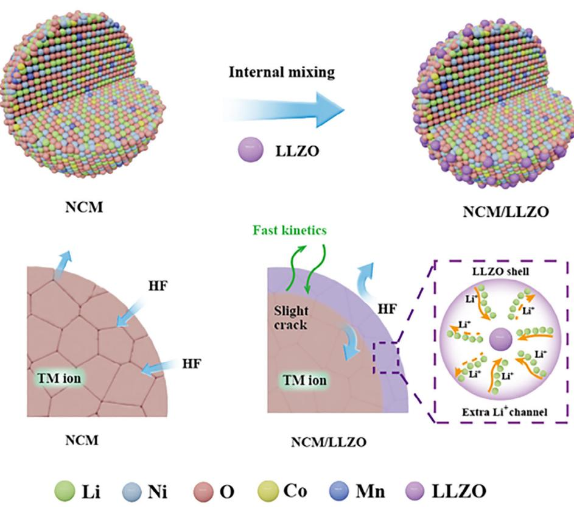
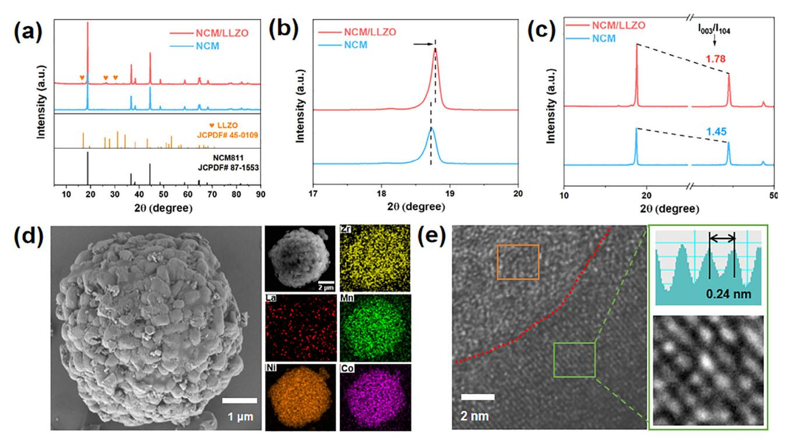
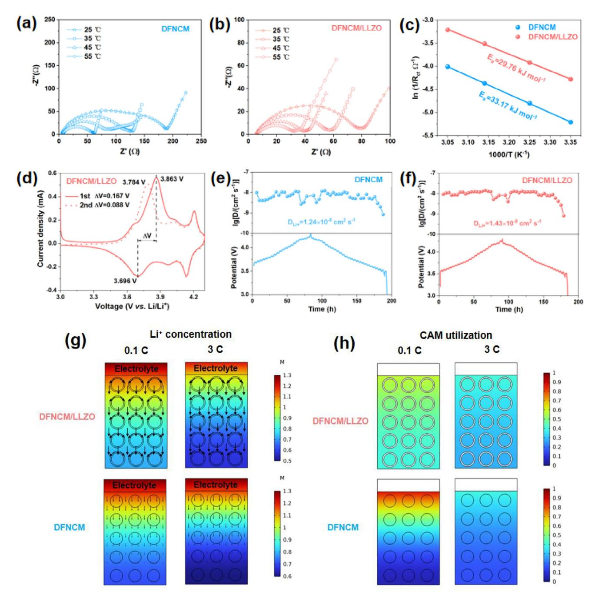
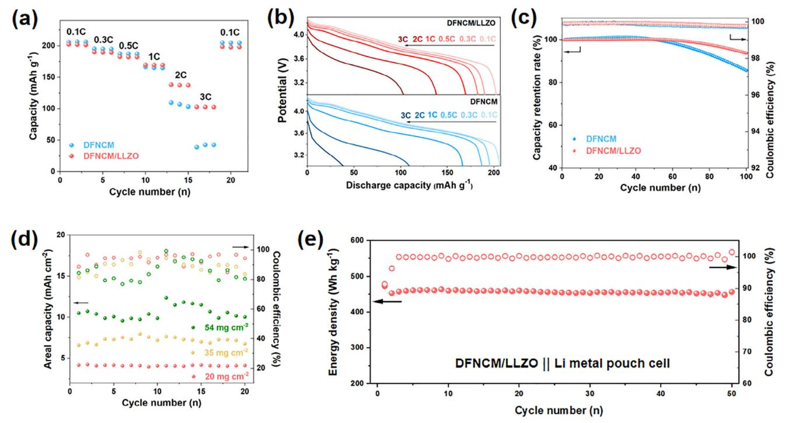
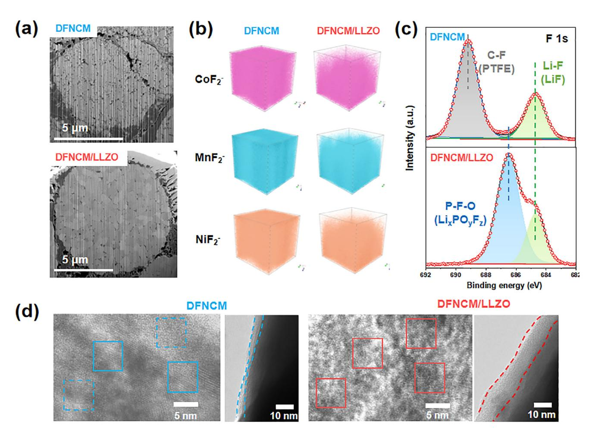

# **Interfacial Engineering of Solvent-Free Cathodes with High Loading for High-Energy-Density Lithium Metal Batteries**

*Yunnan Gao, Yi Yang, Shufeng Jia, Dan Luo,\* and Zhongwei Chen\**

**Solvent−free dry−film technology has garnered significant attention owing to its capability to enable high mass loading of the electrodes and circumvent pollution and waste resulting from toxic organic solvents. Nevertheless, thick electrodes inherently pose large ion diffusion resistance, thereby hindering the efficient utilization of the active materials. In this study, Li7La3Zr2O12 (LLZO) solid-state electrolyte particles are incorporated onto the surface of LiNi0.8Co0.1Mn0.1O2 (NCM811) cathodes, which lowers the activation energy (***Ea***) for interfacial lithium ions (Li+) transfer and enhances the diffusion kinetics of Li+. As a result, ultrahigh loading (54 mg cm−2) cathodes are fabricated, demonstrating a remarkable areal capacity of up to 10.4 mAh cm−2 and a high energy density of 473 Wh kg−1 when applied in a lithium metal battery. The interphase properties analysis indicates that the application of LLZO at the solid/liquid interface facilitates the formation of a comprehensive and stable electrode interface layer to fully cover the surface of cathode material, which effectively suppresses side reactions and prevents the particle crack and structure degradation over cycling. These results suggest that the incorporation of LLZO as an additive in dry-film cathodes holds great promise for sustainable and cost−effective manufacturing of high-energy-density lithium metal batteries.**

#### **1. Introduction**

Lithium metal batteries (LMBs) are essential for energy storage technology and act as the main propulsion for electric vehicles (EVs), leading to a substantial decrease in carbon dioxide emissions in contrast to those vehicles powered by traditional fossil fuels.[\[1,2\]](#page-6-0) Nevertheless, conventional cathodes are produced using the wet-film method, wherein toxic N-methyl pyrrolidone (NMP) serves as a solvent and the recycling of NMP presents high energy consumption and associated costs. Furthermore, the

Y. Gao, Z. Chen

| Yulin Innovation Institute of Clean Energy                       |
|------------------------------------------------------------------|
| Clean Energy Innovation Institute of Chinese Academy of Sciences |
| Yulin 719053, China                                              |
| E-mail: zwchen@dicp.ac.cn                                        |
| Y. Gao, Y. Yang, S. Jia, D. Luo, Z. Chen                         |
| Power Battery & System Research Center                           |
|                                                                  |

Dalian Institute of Chemical Physics Chinese Academy of Sciences Dalian 116023, China E-mail: [luodan@dicp.ac.cn](mailto:luodan@dicp.ac.cn)

The ORCID identification number(s) for the author(s) of this article can be found under <https://doi.org/10.1002/adfm.202511636>

**DOI: 10.1002/adfm.202511636**

wet-film technique has certain inherent limitations, including the issue of binder migration and the risk of cracking in thick electrodes.[\[3\]](#page-7-0) Consequently, the dryfilm technique, which is characterized by its minimal energy usage, precise thickness control, and optimal areal capacity, has gained worldwide recognition since Tesla's acquisition of Maxwell Technologies in 2019.[\[4\]](#page-7-0) Moreover, the dry process is better suited for producing thick electrode sheets with ultrahigh loading, effectively decreasing the specific weight of inactive substances like current collector, electrode tabs, battery shells, etc. This, in turn, enhances the energy density of the battery. However, as electrode thickness increases, there is a notable impediment to ionic transport within the electrodes, limiting the diffusion kinetics of lithium ions and reducing the utilization rate of electrode active substances. The performance of batteries, such as average voltage and specific capacity, encounter significant challenges with the escalating electrode thickness.[\[5\]](#page-7-0) Our group reported Li-X zeolite as a multifunctional

additive for thick cathodes, which showed superior performance.[\[6\]](#page-7-0) Hence, the design and optimization of thick electrodes with high loading, have emerged as crucial technical approaches to enhance the overall performance of high-specificenergy LMBs.

Several surface design strategies, such as coating,[\[7\]](#page-7-0) doping,[\[8\]](#page-7-0) and morphology regulation,[\[9\]](#page-7-0) have been employed to enhance the electrochemical properties, thermal stability, and structural integrity of cathodes. Solid-state electrolytes, such as LiAlO2, Li3ZrO2, and Li3PO4, have recently found applications as active coating materials for nickel-rich cathode materials,[\[10–12\]](#page-7-0) due to their high ionic conductivity, broad electrochemical window, excellent thermal stability in air, and superior chemical stability toward lithium.[\[13\]](#page-7-0) Despite the numerous reports, the performance of precursor materials and the synthesis conditions, such as calcination temperature, can significantly impact the final product, due to the sensitivity to humidity and air exposure.[\[14\]](#page-7-0) Moreover, challenges such as structural instability and interface degradation still persist.[\[15\]](#page-7-0) From an industrial application standpoint, it is essential to develop new large-scale methods for fabricating NCM cathodes for LMBs with superior performance.

In this research, we employed the solvent-free process to produce LiNi0.8Co0.1Mn0.1O2 (NCM811) electrode with ultrahigh

**Figure 1.** Synthesis strategy and structural engineering of NCM/LLZO.

loading (*>*50 mg cm−2). To address the aforementioned challenges, we incorporated Li7La3Zr2O12 (LLZO) onto the surface of the cathode. Among the various solid electrolytes, LLZO outstands with a high lithium-ion conductivity, coupled with its exceptional resistance to thermal and chemical degradation when in contact with electrode materials.[\[16,17\]](#page-7-0) The optimally composed dry-film NCM811 with LLZO (DFNCM/LLZO) is compared with dry-film NCM811 (DFNCM) across various parameters, including morphology, electrochemical properties, and battery performance. The results indicate that the introduction of LLZO not only enhances Li+ transport by reducing the activation energy (*E*a) but also promotes homogeneous ion regulation, leading to significantly improved interface stability. Furthermore, utilizing LLZO as a buffer layer at the solid/liquid interface, pouch cells with Li metal are fabricated, demonstrating a high energy density of 473 Wh kg−1 based on the weight of the pouch cell package. This strategy of interfacial engineering could be vital for solventfree cathodes to enhance the electrochemical performance and cycling stability of high-capacity cathodes for high-energy-density batteries.

#### **2. Results & Discussion**

As illustrated in **Figure 1**, LLZO and NCM811 are uniformly mixed via an internal high-energy mechanical mixing strategy, contributing to the coating of LLZO on the surface of NCM particles. **Figure 2**[a](#page-2-0) presents the X-ray diffraction (XRD) patterns of NCM and NCM/LLZO, indicating the good crystallinity of NCM811 (PDF#87-1553). The characteristic peaks of LLZO were observed in NCM/LLZO, implying that the addition of LLZO was compatible with the NMC811 structure without disrupting its crystalline arrangement. Upon detailed examination of the magnified (003) and (104) diffraction peaks presented in Figure [2b,c,](#page-2-0) a distinct peak shift toward higher diffraction angles is evident for the NCM/LLZO compared to NCM, suggesting a reduction in interlayer spacing in the NCM/LLZO crystalline structure. The observed structural modification is further corroborated by the enhanced intensity ratio of I003/I104 in the NCM/LLZO composite (Figure [2c\)](#page-2-0), which implies improved crystallographic ordering and structural stability.[\[18\]](#page-7-0)

The morphology of NCM and NCM/LLZO samples was confirmed via scanning electron microscopy (SEM). The surfaces of the pristine spherical NCM811 particles are smooth, ranging from 8 to 12 µm in diameter, with slight extensions resulting from primary particles (Figure S1, Supporting Information). SEM image of NCM/LLZO (Figure [2d\)](#page-2-0) exhibits several nanoscale LLZO particles attached on the surface of NCM811 and EDS results demonstrate that Mn, Co, Ni, La, and Zr are distributed uniformly, indicating an excellent coating effect of LLZO on the surface of NCM811. Figure [2e](#page-2-0) presents a representative transmission electron microscopy (TEM) image of the NCM/LLZO composite. The core region exhibits well-defined lattice fringes with an interplanar spacing of 0.24 nm, corresponding to the (101) crystallographic plane of the layered NCM structure. In contrast, the peripheral region displays an amorphous phase attributed to www.advancedsciencenews.com

CIENCE NEWS

Figure 2. a) XRD patterns, b, c) Partially enlarged images (003), and (104) of NCM and NCM/LLZO. d) SEM and EDS images of NCM/LLZO. e) TEM images of NCM/LLZO and the lattice spacing profiles along the selected areas.

the LLZO coating layer, confirming the successful formation of a uniform LLZO coating on the NCM surface.

The cathodes were prepared via a dry-film process, with the binder of PTFE fibers anchoring the active materials and conductive carbon into the electrode matrix, resulting in the formation of a fine network that permeates throughout the electrode structure, as evidenced by the SEM image (Figure S2, Supporting Information). Furthermore, the film is layered onto a current collector, and the cathodes are formed. For high-loading thick electrodes, mechanical properties are critical performance parameters. The dry film showed great flexibility and the electrodes with mass loading of 50 mg cm-2 after folding exhibited no delamination or active material shedding (Figure S3, Supporting Information), together with the stable resistance after folding, further confirming the structural integrity and transfer pathways of the electrode. As the electrode loading increases, the peel strength gradually diminishes (from 2.7 N  $\text{cm}^{-1}$  at 15 mg  $cm^{-2}$  to 2.4 N cm-1 at 50 mg cm-2), as shown in Figure S4 (Supporting Information), due to localized regions with insufficient interfacial adhesion in thick electrodes. Despite this reduction, the peel strength remains well above the wet-film electrode, ensuring reliable adhesion between the electrode and substrate during manufacturing. The results conclusively demonstrate that the high-loading dry-film electrodes exhibit excellent delamination resistance and flexibility, addressing critical concerns for their industrial adoption. The electrochemical performance of DFNCM and DFNCM/LLZO is evaluated. Notably, the incorporation of LLZO resulted in higher conductivity compared to DFNCM (Figure **S5**, Supporting Information). The results of electrochemical impedance spectroscopy (EIS) (Figure S6, Supporting Information) demonstrate the lower impedance  $(R_{ct})$  of DFNCM/LLZO compared to DFNCM. The reduction of  $R_{ct}$  decreases the transport resistance of electrons and ions, thereby enhancing the ion/electron transport rate at the electrode surface. The activation energy is crucial for discerning Li+ transport resistances and interfacial Li+ transfer resistance.[19] To investigate the influence of LLZO on the charge transfer process, coin cells were assembled with anodes of lithium metal and cathodes of DFNCM or DFNCM/LLZO. Subsequently, EIS was employed to monitor the impedance of the cells at different temperatures, as depicted in **Figure 3a,b**. By applying the Arrhenius relationship (Equation S1, Supporting Information) governing the  $R_{\text{ct}}$ , the activation energy  $(E_2)$  of the charge transfer process was determined by analyzing the slope of a  $log(1/R_{ct})$  versus the inverse of temperature  $(1/T)$  plot, as illustrated in Figure 3c. The obtained  $E_a$  values for interfacial Li+ transfer were 29.76 and 33.17 kJ mol-1 for DFNCM/LLZO and DFNCM, respectively. This suggests that DFNCM/LLZO exhibits lower activation barriers during interfacial Li+ transfer. Figure 3d and Figure S7 (Supporting Information) show the cyclic voltammetry (CV) curves of the cathodes at a scan rate of 0.1 mV s-1. DFNCM/LLZO composite exhibits a substantially reduced polarization voltage than that of DFNCM, suggesting improved electrochemical reversibility and accelerated lithium-ion diffusion kinetics in the DFNCM/LLZO composite. Moreover, the galvanostatic intermittent titration technique (GITT) was employed to gain a deeper understanding of the ion transportation behavior of DFNCM/LLZO and DFNCM (Figure 3e,f). The ionic diffusion coefficient results derived from GITT demonstrate DFNCM/LLZO with a higher diffusion coefficient (1.43  $\times$  10-8 cm2 s-1) compared to

**Figure 3.** EIS study of (a) DFNCM and b) DFNCM/LLZO at varied temperatures. c) Arrhenius plot for *E*a values of DFNCM and DFNCM/LLZO. d) CV plots of DFNCM/LLZO. GITT plots of (e) DFNCM and f) DFNCM/LLZO, respectively. g) COMSOL simulation of Li+ concentration of and h) the utilization of CAM at 0.1C and 3C of DFNCM/LLZO and DFNCM.

DFNCM (1.24 × 10−8 cm2 s−1), indicating that DFNCM/LLZO has faster ionic transportation,[\[20\]](#page-7-0) consistent with the results above.

COMSOL Multiphysics simulations were performed to analyze the lithium-ion concentration and cathode active material (CAM) utilization for both DFNCM/LLZO and DFNCM cathodes (Figure 3g,h). At 0.1C current density, both systems exhibited comparable ion concentration gradients. However, with increasing current density at 3C, the DFNCM/LLZO composite demonstrated superior ion transport kinetics, enabling more direct lithium-ion migration pathways. Under varied C-rates, DFNCM/LLZO achieved uniform CAM utilization, while the DFNCM showed uneven activation with major unreacted CAM at the bottom, exhibited in Figure 3h. Compared with incomplete CAM utilization of DFNCM, DFNCM/LLZO with homogeneous lithium-ion flux distribution effectively mitigates interfacial

**Figure 4.** a) Rate performance of DFNCM and DFNCM/LLZO and b) corresponding charge–discharge curves. c) Cycling performance at 0.5C of DFNCM and DFNCM/LLZO. d) Cycling performance of DFNCM/LLZO with various mass loading at 0.1C. e) Cycling performance of the Li-metal DFNCM/LLZO pouch cell with an areal capacity of 7.1 mAh cm−2.

polarization at the cathode/electrolyte interface (CEI), thereby ensuring sufficient ionic supply for full CAM activation.[\[21\]](#page-7-0)

The electrochemical performance of the coin cell was evaluated at a voltage of 3–4.3 V vs Li+/Li. The *R*ct, rate, and cycling performance between dry-film and wet-film cathodes at about 15 mg cm−2 was conducted (Figure S8, Supporting Information). The dry-film cathode exhibits lower internal resistance and superior rate capability compared to the wet-film cathode. At 1C cycling, the dry-film cathode retained 75% capacity after 100 cycles, outperforming the wet-film cathode (64%). This aligns with the prior report,[\[22\]](#page-7-0) where solvent-free methods reduced side reactions at the electrode/electrolyte interface.

As shown in **Figure 4**a,b, the rate performance comparison of DFNCM/LLZO and DFNCM reveals no significant difference up to 0.5C. At high rates of 1C, 2C, and 3C, the DFNCM/LLZO coin cell shows a higher discharge capacity of 169.6, 138.3, and 103.1 mAh g−1, respectively, which is higher than that of DFNCM. The individual charge-discharge profiles demonstrate that the DFNCM/LLZO composite exhibits both lower polarization voltage and a remarkably stable charge-discharge plateau than DFNCM. To explain the behavior, we conducted a comparative analysis of the first-cycle Coulombic efficiency (CE) under different C-rate conditions (Figure S9, Supporting Information). The results reveal that both samples demonstrate similar CE (92.25% vs 90.47%) at the lower 0.1C rate, whereas under the higher 1C condition, a significant divergence in CE values becomes apparent (96.02% vs 99.53%). PTFE, when used as a binder in the electrodes, can react with lithium ions during the initial charging process, which not only affects the initial CE but can also lead to a decline in the electrode's performance over time.[\[23\]](#page-7-0) The LLZO with extra Li+ can replenish the consumption of Li+ during the side reactions with PTFE, resulting in a higher CE% than DFNCM. Furthermore, the low electrical conductivity of NCM811 requires additional conducting additives for the high-rate capability. The challenge of achieving high-rate performance in thick electrodes is due to the extended diffusion pathways for both e− and Li+. [\[24\]](#page-7-0) Under high-rate conditions (*>*1C), NCM materials with inferior conductivity obstruct the migration of Li+ ions at the interface, impeding the rate performance.[\[25\]](#page-7-0) The incorporation of LLZO particles significantly enhances rate capability through two synergistic mechanisms, interfacial resistance reduction (Figure S6, Supporting Information) and diffusion pathway optimization (Figure [3e,f\)](#page-3-0). COMSOL simulation (Figure [3g,h\)](#page-3-0) further demonstrated more direct Li+ migration pathways for DFNCM/LLZO than DFNCM under high current density. At a higher rate (3C), the ion transport path of the thick electrode is significantly prolonged, resulting in the obstruction of lithium-ion diffusion, leading to poor capacity at a high rate. When tested at the rate of 0.5C (Figure 4c), the DFNCM/LLZO cell achieved higher capacity retention of 93.7% after 100 cycles while the DFNCM cell only delivered 85.7%. LLZO with high ionic conductivity is anticipated to offer additional Li+ diffusion channels or pathways within the electrode,[\[26\]](#page-7-0) lower the activation barriers during interfacial Li+ transfer, and accelerate e− and Li+ transport. Therefore, DFNCM/LLZO shows outstanding rate and cycling performance. The dry electrode fabrication process demonstrates superior compatibility with high-loading thick electrode manufacturing, presenting a promising approach for enhancing the energy density of batteries. The areal capacities of the electrodes increase with higher areal mass loading, as shown

**Figure 5.** a) FIB-SEM images of cross-sectioned, b) TOF-SIMS depth profiles for CoF2 −, MnF2 − and NiF2 −, c) XPS F 1 s spectra, d) TEM images of the surface of the cycled DFNCM and DFNCM/LLZO.

in Figure [4d.](#page-4-0) Even with mass loading as high as 54 mg cm−2, the DFNCM/LLZO electrode still delivered a high capacity of 198 mAh g−1, enabling high areal capacity loading up to 10.6 mAh cm−2 and a stable cycling performance with a capacity retention of 95% after 20 cycles. At an elevated mass loading of 54 mg cm−2, the increased electrode thickness imposes severe constraints on ionic/electronic transport pathways, resulting in compromised reaction kinetics, elevated charge-transfer resistance, and consequent capacity degradation.[\[27\]](#page-7-0)

The fabrication and evaluation of a Li-metal pouch cell, utilizing DFNCM/LLZO as the cathode material coupled with a Limetal anode, serves as a significant step toward assessing the viability of ultrahigh loading dry-film cathodes for practical applications. Impressively, the energy density calculated based on the entire cell weight was up to 473 Wh kg−1 with a mass loading of 32.8 mg cm−2 (Table S1, Supporting Information). Additionally, the DFNCM/LLZO cathodes exhibited potential for practical applications with a capacity retention of 96% after 50 cycles during their long-term cycle at high areal capacity (7.1 mAh cm−2), (Figure [4e\)](#page-4-0), indicating the integration of LLZO is crucial for maintaining high capacities over cycles. Compared with previously reported studies (Table S2, Supporting Information), our design demonstrates competitive advantages in both areal capacity and energy density. This performance substantiates the practicality of DFNCM/LLZO as cathode materials and highlights the significant potential of the dry-film approach proposed.

To better understand the impact of interphase properties, the structural stability of electrodes after 100 cycles was investigated by SEM. The surface of DFNCM shows uneven particles while DFNCM/LLZO shows even-distributed particles (Figure S10, Supporting Information). The cross-sectional characterization by focused ion beam/scanning electron microscopy (FIB-SEM) was illustrated in **Figure 5**a. DFNCM exhibits extensive microcrack propagation, which may facilitate the penetration of the electrolyte, leading to increased parasitic reactions.[\[28\]](#page-7-0) In contrast, the DFNCM/LLZO composite maintains structural integrity with minimal microcrack formation. This phenomenon can be attributed to the protective layer of LLZO, which significantly suppresses changes in lattice volume and is beneficial to long-term cycling stability. XRD of cycled electrodes (Figure S11, Supporting Information) reveals that the DFNCM/LLZO composite maintains well-preserved NCM crystallinity with sharp characteristic diffraction peaks, while the DFNCM exhibited compromised phase purity and broadened diffraction features, suggesting the critical protective role of the LLZO interfacial

layer in maintaining integrity. EIS (Figure S12, Supporting Information) reveals that the DFNCM/LLZO exhibits a lower charge-transfer resistance compared to DFNCM after cycling, attributing to the accelerated lithium-ion diffusion kinetics of DFNCM/LLZO.

The 3D time-of-flight secondary ion mass spectrometry (ToF-SIMS) analysis (Figure [5b\)](#page-5-0) reveals a notable reduction in chemical species concentration within the DFNCM/LLZO composite. To evaluate transition metal dissolution during cycling, we conducted inductively coupled plasma optical emission spectroscopy (ICP-OES) analyses on cycled coin cells (Figure S13, Supporting Information). The DFNCM/LLZO electrode demonstrated lower metallic concentration compared to the DFNCM sample. This observation indicates that the engineered LLZO layer effectively mitigates parasitic reactions at the electrolyte-electrode interface while facilitating the formation of a homogeneous and electrochemically stable CEI.[\[29\]](#page-7-0) The DFNCM/LLZO electrode exhibits a higher LiF− signal intensity compared to the DFNCM (Figure S14, Supporting Information), confirming LLZO-driven LiF-dominated CEI formation. These synergistic effects collectively enhance the interfacial compatibility and structural integrity of the NCM cathodes. X-ray photoelectron spectroscopy (XPS) synthesis provides insights into the chemical composition on the surface of the cathodes. It is noted that the organic species from P-compounds, primarily originating from the decomposition of electrolyte solvents and salts, is a well-documented aspect of CEI formation and evolution.[\[30\]](#page-7-0) From the F 1s spectra (Figure [5c;](#page-5-0) Figure S15, Supporting Information), only two peaks of P-F-O peak (686.7 eV) and Li-F peak (684.8 eV) are observed in the cycled DFNCM/LLZO. Compared with pristine DFNCM/LLZO, the C-F peak of PTFE disappeared, indicating the CEI completely covered the surface of the cathode. While in the F 1s spectra of DFNCM, except for the Li-F peak, the C-F peak of PTFE still exited, indicating the partial cover of CEI on the electrode. XPS O 1s analysis for the cycled electrodes (Figure S16, Supporting Information) revealed that the DFNCM/LLZO composite exhibits a complete absence of lattice oxygen, whereas the DFNCM retains prominent lattice oxygen peaks. The absence of detectable lattice oxygen signals in DFNCM/LLZO suggests that the CEI layer exceeds the detection depth of XPS (typically 5–10 nm), which aligns with TEM images showing a uniform 12–15 nm CEI layer on DFNCM/LLZO versus a 3–5 nm layer on DFNCM, as depicted in Figure [5d.](#page-5-0) Furthermore, the TEM image of DFNCM/LLZO shows excellent structural integrity with clear lattice fringes and a well-preserved layered structure throughout the bulk material. While, DFNCM undergoes severe structural degradation, characterized by the disappearance of characteristic layered features, accompanied by the formation of a disordered rock-salt phase. This comparison underscores the protective effect of the LLZO layer in the DFNCM/LLZO cathode, which contributes to its enhanced robustness against structural degradation, as demonstrated by FIB-SEM images.

As a result, LLZO distributing on the surface of NCM811 served as a buffer layer between the active materials and electrolyte, contributing to the robust CEI and the suppression of structural degradation, leading to the stable cycling of the batteries, in accordance with the performance above.

### **3. Conclusion**

In this study, we incorporated solid electrolyte LLZO onto the surface of NMC811 electrodes using a solvent-free process. LLZO, known for its exceptional ionic conductivity, is anticipated to provide additional pathways for lithium-ion diffusion, which can help to evenly distribute lithium-ion fluxes during the lithiation process, lower the activation barriers during interfacial Li+ transfer, and accelerate e− and Li+ transport. Benefiting from LLZO, the DFNCM/LLZO cathodes boost the rate capability and cycling performance impressively. Even with ultrahigh-loading as high as 54 mg cm−2, the DFNCM/LLZO still delivered high areal loading up to 10.4 mAh cm−2. The pouch cell with Li metal as anode demonstrated a remarkable energy density of 473 Wh kg−1. Moreover, the characterization of the interface showed that the addition of LLZO as the buffer layer, facilitated the formation of a comprehensive CEI layer that fully covered the NMC811 surface, thus protecting NMC811 from crack and destruction. This breakthrough opens up promising avenues for large-scale dry-film manufacturing of cathodes with high loading, further improving the performance of lithium metal batteries. In the next phase, the critical challenges for dry-process technology lie in achieving rapid and efficient uniformity in powder mixing, as well as attaining micrometer-level thickness homogeneity in high-loading electrodes through optimized calendaring protocols.

#### **Supporting Information**

Supporting Information is available from the Wiley Online Library or from the author.

#### **Acknowledgements**

The authors would like to acknowledge the financial support from the Strategic Priority Research Program of the Chinese Academy of Sciences (Grant No. XDB0600400), Dalian Revitalization Talents Program (No. 2022RG01), Liaoning Binhai Laboratory (Grant No. LBLG-2024-09), the Vacuum Interconnected Nanotech Workstation (Nano-X), Suzhou Institute of Nano-Tech and Nano-Bionics, Chinese Academy of Sciences, Chinese Academy of Sciences and the Energy Revolution S&T Program of Yulin Innovation Institute of Clean Energy, Grant No. E411130705. The Science and Technology Major Project of Liaoning Province (Grant No. 2024JH1/11700013).

#### **Conflict of Interest**

The authors declare no conflict of interest.

## **Data Availability Statement**

The data that support the findings of this study are available on request from the corresponding author. The data are not publicly available due to privacy or ethical restrictions.

### **Keywords**

high loading, interfacial engineering, lithium metal battery, solvent-free cathodes

> Received: May 9, 2025 Published online:

- [1] X. Sun, C. Qin, B. Zhao, S. Jia, Z. Wang, T. Yang, X. Liu, L. Pan, L. Zheng, D. Luo, Y. Zhang, *Energy Storage Mater.* **2024**, *70*, 103559.
- [2] W. Liu, D. Li, Y. Liu, D. Luo, R. Xu, *Renewables* **2024**, *2*, 25.
- [3] A. Kraytsberg, Y. Ein-Eli, *Adv. Energy Mater.* **2016**, *6*, 1600655.
- [4] Y. Li, Y. Wu, Z. Wang, J. Xu, T. Ma, L. Chen, H. Li, F. Wu, *Mater. Today* **2022**, *55*, 92.
- [5] Y. Sun, N. Liu, Y. Cui, *Nat. Energy* **2016**, *1*, 16071.
- [6] Y. Gao, Y. Yang, T. Yang, Z. Zhang, L. Tang, Z. Mao, Y. Zhang, D. Luo, Z. Chen, *Adv. Energy Mater.* **2024**, *15*, 2403063.
- [7] B. Zhao, X. Sun, H. Bi, T. Yang, H. Li, D. Luo, Y. Zhang, Z. Chen, *Adv. Funct. Mater.* **2025**, 2423717.
- [8] D. Luo, C. Ma, J. Hou, Z. Zhang, R. Feng, L. Yang, X. Zhang, H. Lu, J. Liu, Y. Li, Y. Zhang, X. Wang, Z. Chen, *Adv. Energy Mater.* **2022**, *12*, 2103716.
- [9] T. Liu, J. Ma, T. He, R. Meng, L. Chen, S. Meng, K. Liao, H. Lu, J. Ma, C. Zhang, J. Yang, *Energy Storage Mater.* **2024**, *71*, 103577.
- [10] H.-S. Kim, Y. Kim, S.-I. Kim, S. W. Martin, *J. Power Sources* **2006**, *161*, 623.
- [11] J. Cho, Y. Kim, T.-J. Kim, B. Park, *Angew. Chem., Int. Ed.* **2001**, *40*, 3367.
- [12] Y. Kim, J. Cho, T.-J. Kim, B. Park, *J. Electrochem. Soc.* **2003**, *150*, A1723.
- [13] Y. Zheng, Y. Yao, J. Ou, M. Li, D. Luo, H. Dou, Z. Li, K. Amine, A. Yu, Z. Chen, *Chem. Soc. Rev.* **2020**, *49*, 8790.
- [14] H. Sheng, X. Meng, D. Xiao, M. Fan, W. Chen, J. Wan, J. Tang, Y. Zou, F. Wang, R. Wen, J. Shi, Y. Guo, *Adv. Mater.* **2022**, *34*, 2108947.
- [15] X. Zhu, X. Xie, J. Lin, Y. Liu, G. Gao, Y. Yang, Y. Zhang, W. Xiong, Y. Jiang, Q. Li, D.-L. Peng, *Nano Energy* **2025**, *134*, 110588.
- [16] R. Murugan, V. Thangadurai, W. Weppner, *Angew. Chem., Int. Ed.* **2007**, *46*, 7778.

- [17] C. Geiger, E. Alekseev, B. Lazic, M. Fisch, T. Armbruster, R. Langner, M. Fechtelkord, N. Kim, T. Pettke, W. Weppner, *Inorg. Chem.* **2011**, *50*, 1089.
- [18] S. B. Lee, N. Y. Park, G. T. Park, U. H. Kim, S. J. Sohn, M. S. Kang, Y. K. Sun, *ACS Energy Lett.* **2024**, *9*, 740.
- [19] N. Ogihara, S. Kawauchi, C. Okuda, Y. Itou, Y. Takeuchi, Y. Ukyo, *J. Electrochem. Soc.* **2012**, *159*, A1034.
- [20] Y. Ji, Z. Wang, C. Zhao, Z. Fang, Y. Gong, Q. Jing, Y. Xia, T. Luan, Y. Jiang, X. Li, M. Zhao, X. Zhai, X. Bie, T. Jiang, D. Geng, X. Sun, *Renewables* **2024**, *2*, 194.
- [21] G. Cheng, H. Sun, H. Wang, Z. Ju, Y. Zhu, W. Tian, J. Chen, H. Wang, J. Wu, G. Yu, *Adv. Mater.* **2024**, *36*, 2312927.
- [22] R. Tao, B. Steinhoff, X. Sun, K. Sardo, B. Skelly, H. Meyer III, J. Li, *Chem. Eng. J.* **2023**, *471*, 144300.
- [23] W. Liu, X. Huang, L. Guobao, Z. Wang, H. Huang, L. Zhonghua, R. Xue, L. Chen, *J. Power Sources* **1997**, *68*, 344.
- [24] D. Lee, H. Lee, T. Song, U. Paik, *Adv. Energy Mater.* **2022**, *12*, 2200948
- [25] Y. Tian, Y. Li, H. Shen, X. Cheng, Y. Cheng, W. Zhang, P. Yu, Z. Yang, L. Xue, Y. Fan, L. Zhao, J. Peng, J. Wang, Z. Li, M. Xie, H. Liu, S. Dou, *Adv. Sci.* **2024**, *11*, 2402380.
- [26] X. Li, J. Liu, M. Banis, A. Lushington, R. Li, M. Cai, X. Sun, *Energy Environ. Sci.* **2014**, *7*, 768.
- [27] H. Li, Z. Wu, X. Liu, H. Lu, W. Zhang, F. Li, Q. Yang, *Natl. Sci. Rev.* **2024**, *11*, nwae207.
- [28] H.-H. Ryu, K.-J. Park, C. Yoon, Y.-K. Sun, *Chem. Mater.* **2018**, *30*, 1155.
- [29] L. Di, C. Yufang, S. Weiwei, X. Wei, Y. Shuaiyu, L. Shiqiang, Z. Lanlan, Z. Yanshuang, Y. Tianyan, X. Peitao, Z. Chunman, *Adv. Energy Mater.* **2023**, *13*, 2301765.
- [30] Y. Chen, W. Zhao, Q. Zhang, G. Yang, J. Zheng, W. Tang, Q. Xu, C. Lai, J. Yang, C. Peng, *Adv. Funct. Mater.* **2020**, *30*, 2000396.