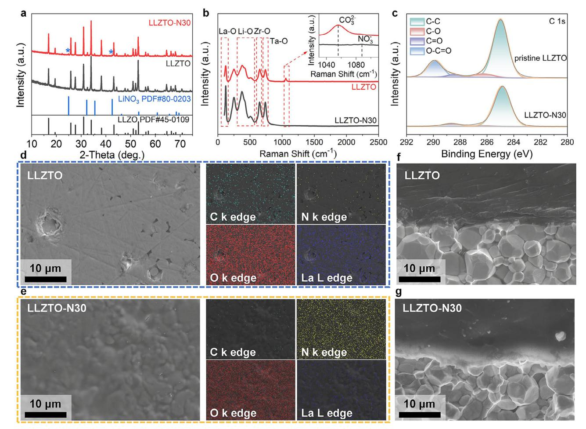
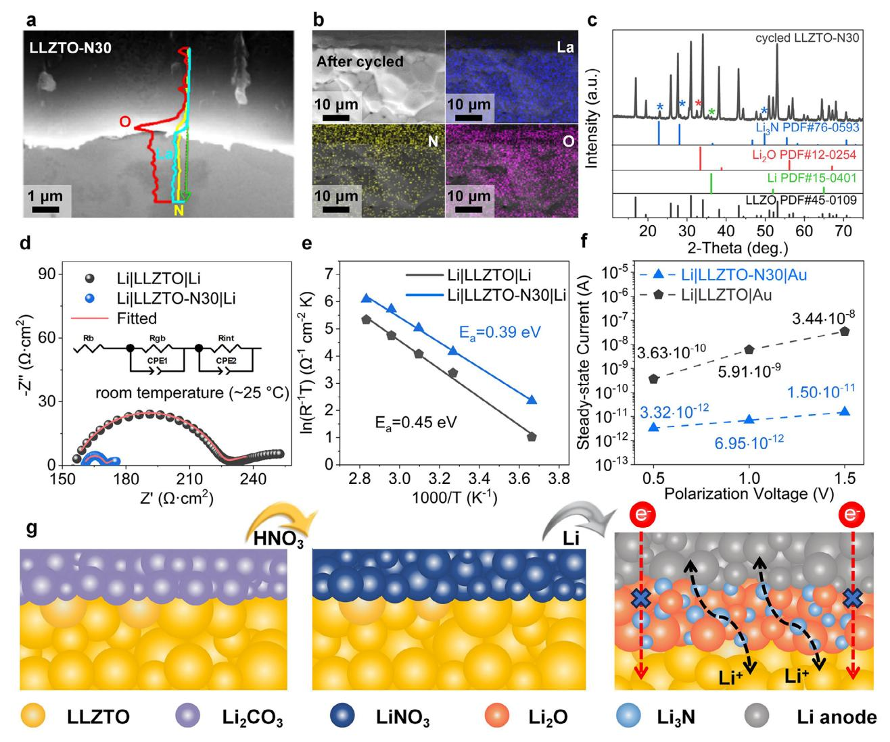
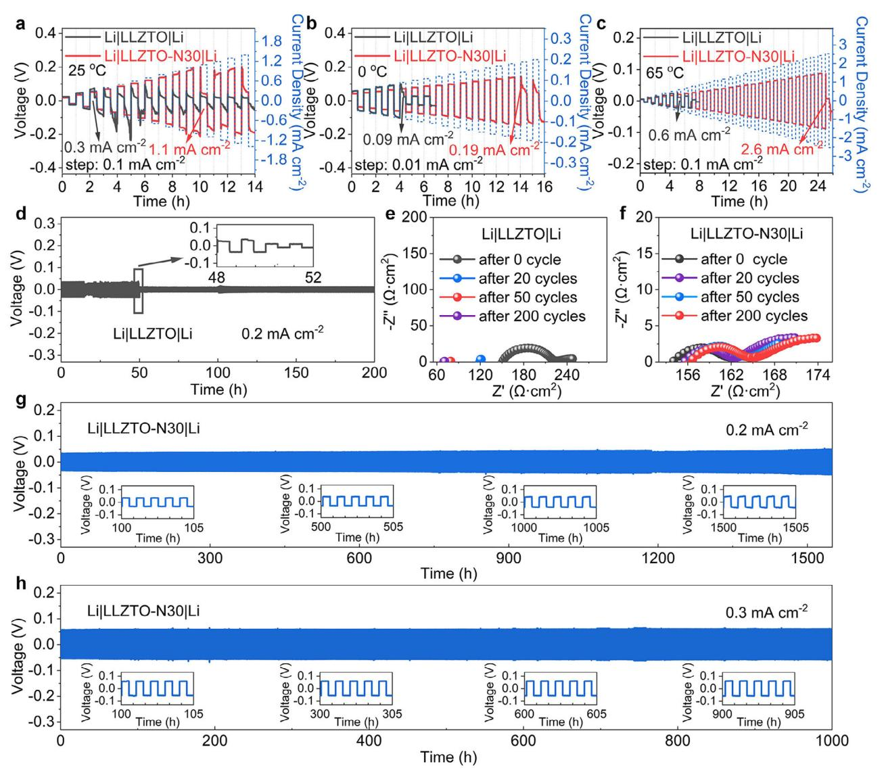
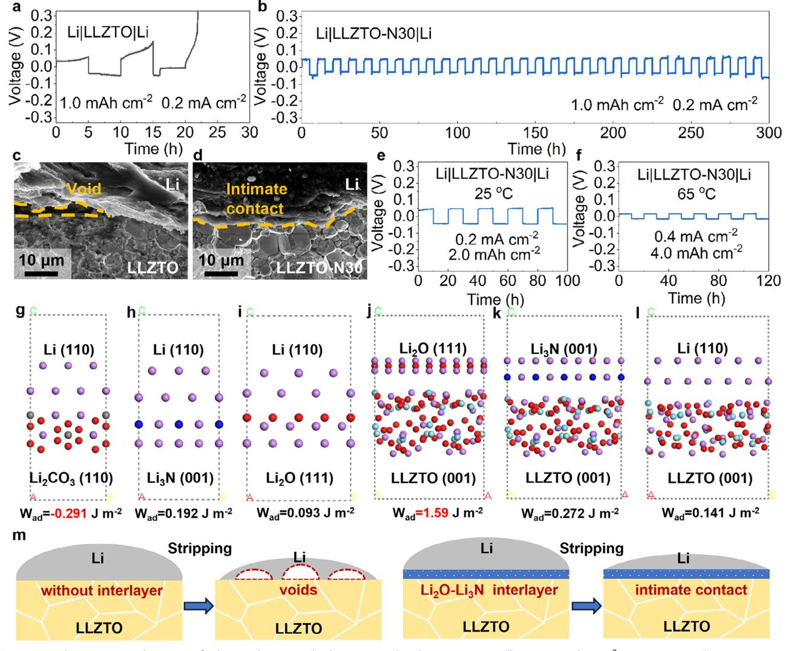

# **Dynamically Stable and Intimately Bonded Li/Garnet Interface for High-Areal-Capacity Solid-State Lithium-Metal Batteries**

*Jintao Liu, Xiayueyang Mei, Jie Wang, Sisir Pokhrel, and Hailei Zhao\**

**A multifunctional Li3N-Li2O hybrid interlayer is elaborately designed and constructed by a facile one-step surface etching method to address the issues of lithium dendrite penetration and the interfacial Kirkendall voids formation in solid-state lithium metal batteries based on garnet-type electrolyte Li6.4La3Zr1.4Ta0.6O12. The constructed Li3N-Li2O hybrid interlayer greatly promotes interfacial lithium-ion conduction while dramatically reducing leakage of electronic current from the lithium anode to garnet by three orders of magnitude. Most importantly, the introduced Li3N-Li2O interlayer shows a high interfacial work of adhesion with both garnet and Li, preventing detachment between the lithium metal and electrolytes during the lithium stripping process, even at high areal capacity cycling. Benefiting from such a synergistic effect, the assembled lithium symmetric cell exhibits a high critical current density of 2.6 mA cm−2 and achieves a stable cycling for over 100 h for an ultrahigh areal capacity of 4.0 mAh cm−2 at a current density of 0.4 mA cm−2.**

#### **1. Introduction**

Lithium metal anode, possessing an exceptional theoretical specific capacity of 3860 mAh g−1 and the most negative redox potential of −3.04 V versus the standard hydrogen electrode, has long been recognized as the ultimate anode material.[\[1–3\]](#page-7-0) Solidstate lithium metal batteries (SSLMBs), employing mechanically rigid solid-state electrolyte (SSEs), are promising in enabling the safe utilization of lithium metal anode, thereby achieving next-generation electric vehicle batteries with both high energy density and excellent safety performance.[\[4,5\]](#page-7-0) Among various SSEs, cubic garnet-type LLZTO (Li6.4La3Zr1.4Ta0.6O12), as a representative oxide electrolyte, has attracted extensive attention

J. Wang, H. Zhao

Beijing Municipal Key Laboratory of New Energy Materials and Technologies

Beijing 100083, P. R. China

The ORCID identification number(s) for the author(s) of this article can be found under <https://doi.org/10.1002/adfm.202512943>

**DOI: 10.1002/adfm.202512943**

due to its relatively high ionic conductivity (10−4–10−3 S cm−1), wide electrochemical window (0–5 V), high mechanical strength (≈60 GPa of shear modulus), and excellent chemical stability against lithium metal.[\[6,7\]](#page-7-0) However, garnet-based SSLMBs still suffer from the inevitable lithium dendrite penetration under a high-rate cycling condition and severe Kirkendall voids formation between the Li anode and SSEs after highareal-capacity cycling, which collectively hinder their commercial applications.[\[8–15\]](#page-7-0)

The lithium dendrite propagation issue, which is primarily attributed to the poor SSEs-LMA contact and the undesirable electron leakage from lithium metal to LLZTO electrolyte, will result in internal shortcircuiting and pose safety concerns for battery operation.[\[9,10\]](#page-7-0) Conquering the dendrite issue in garnet-based SSLMBs necessitates simultaneous optimization of Li/LLZTO

interfacial contact and suppression of electron leakage from the lithium anode to SSEs.[\[16–23\]](#page-7-0) Several strategies have been proposed to achieve intimate Li/LLZTO contact. One effective strategy is removing the spontaneously generated lithiophobic Li2CO3 passivation layer on the surface of LLZTO by scratching the electrolyte with sandpapers in argon atmosphere, and subsequently coating the LLZTO surface with certain metals (Au, Ag, Al, W, Bi, etc.), which can in situ alloy with melting lithium metal to form a tightly bonded Li/SSEs connection, by magnetron sputtering or atomic layer deposition.[\[3,11,24–29\]](#page-7-0) Although these introduced metallic interlayers can promote uniform and rapid lithium-ion conduction, thereby inhibiting interfacial lithium dendrite propagation, they are typically electron conductors, fail to block the electron injection from the lithium bulk, allowing lithium dendrites to still potentially nucleate inside the LLZTO electrolyte during cycling.

Recent studies have increasingly focused on using metal halides (ZnF2, AlF3, BiCl3, etc.), to improve interfacial adhesion through reactive wetting between lithium metal and metal compounds, while forming an electronically insulating layer (LiF, LiCl, etc.).[\[30–32\]](#page-7-0) These constructed bifunctional interlayers can reduce the interfacial resistance to some extent while maintaining exceptionally high electronic insulation (*<*10−10 S cm−1), which collectively leads to the fundamental suppression of lithium dendrite growth in SSLMBs. Nevertheless, the formation of interfacial voids, driven by the kinetically-limited mass transport

J. Liu, X. Mei, J. Wang, S. Pokhrel, H. Zhao School of Material Science and Engineering University of Science and Technology Beijing Beijing 100083, P. R. China E-mail: [hlzhao@ustb.edu.cn](mailto:hlzhao@ustb.edu.cn)

of Li atoms necessary to compensate for Li dissolution into LLZTO, remains unresolved during high-areal-capacity cycling, leading to contact loss and irreversibly enhancing polarization voltage, eventually triggering premature battery failure.[\[11,13–15\]](#page-7-0) Applying an external stack pressure exceeding 2 MPa to the battery can mitigate the interfacial voids formation issue, thereby enabling stable long-term cycling with an areal capacity above 1.0 mAh cm−2. [\[15,33,34](#page-7-0)] However, the utilization of significant load pressure increases the complexity and operational cost of the battery, which is unfavorable for its practical application. Therefore, it is imperative to develop an effective interlayer between lithium metal and garnet electrolyte, which should simultaneously promote the interfacial lithium-ion conduction, inhibit the leakage of electrons from the lithium anode to electrolytes, and most importantly, achieve a dynamically stable and intimate Li/SSEs contact without void formation even after high-areal-capacity cycling.

Herein, a multifunctional hybrid interlayer was established between Li and LLZTO through a facile one-step surface etching method. In the design process of etching-acid selection, two critical limitations must be considered: 1) the lithiophilic/lithiophobic nature of reaction products derived from the selected acid and the Li2CO3 coating layer, which would affect the intimate contact with Li metal anode; 2) the lithium-ion conductivity of the intermediate layer, which is essential to ensure a fast lithium-ion transport across the interface between Li and LLZTO. Based on above two considerations and thermodynamic feasibility calculations (as show in Note S1, Supporting Information), nitric acid was selected to convert the Li2CO3 lithiophobic layer on LLZTO surface into a LiNO3 layer, which can spontaneously in situ react with molten Li to form a Li3N-Li2O hybrid interlayer, resulting in a tightly-bonded Li/SSEs connection. The generated high-bandgap Li2O serves as an electron insulator, effectively blocking electron leakage from Li into LLZTO, while the highly lithium-ion conductive Li3N nanoparticles uniformly dispersed in Li2O matrix facilitate homogeneous Li ion diffusion across the interface. Such a strategy reduces the interfacial impedance from 35 to 6 Ω cm2 at room temperature while substantially reduces the leakage electron current from 5.91 × 10−9 to 6.95 × 10−12 A cm−2 when tested at an applied external voltage of 1.0 V. Most importantly, the composite interfacial interlayer shows a high work of adhesion with both garnet and Li as demonstrated by density functional theory calculations, so that the detachment will not occur during lithium stripping process even after a high-areal-capacity cycling. As a result, the assembled lithium symmetric cell exhibits a high critical current density of 2.6 mA cm−2 and achieves a stable cycling for over 100 h for an ultra-high areal capacity of 4.0 mAh cm−2 at current density of 0.4 mA cm−2. Besides, the fabricated full cells using LiFePO4 as cathode show an excellent long-term stability and deliver a reversible discharge capacity of 150.1 mAh g−1 after 250 charge– discharge cycles at 0.5C.

#### **2. Results and Discussion**

Solid state electrolyte Li6.4La3Zr1.4Ta0.6O12 (LLZTO) with a relative density of ≈95% and an ionic conductivity of 4.8 ± 0.1 × 10−4 S cm−1 (25 °C) was prepared by the conventional solid-state method (Figure S1, Supporting Information). After storing in air for 2 h, the LLZTO pellet was etched with nitric acid for 30 s (LLZTO-N30), which results in a coating layer on the surface of the LLZTO-N30 sample (Figure S2, Supporting Information). The X-ray diffraction (XRD) pattern of pristine LLZTO sample shows sharp and well-defined peaks corresponding to cubic garnet type LLZTO (PDF#45-0109, **Figure 1**[a\)](#page-2-0), while besides the main cubic garnet structure, additional peaks at 24.8° and 42.4° are detected from LLZTO-N30 sample, which demonstrates the formation of LiNO3 (PDF#80-0203). Raman spectra were used to identify the surface components of the LLZTO and LLZTO-N30 samples (Figure [1b\)](#page-2-0). For the pristine LLZTO sample, peaks at 1053 cm−1 corresponding to Li2CO3 are observed. After treating with HNO3, the peak due to Li2CO3 disappears, and the characteristic peak of LiNO3 (1083 cm−1) is identified. X-ray Photoelectron Spectroscopy (XPS) characterization was conducted to further investigate surface compositions of the pristine LLZTO and LLZTO-N30 pellets. As shown in Figure [1c,](#page-2-0) the C 1s spectrum of LLZTO contains peaks corresponding to the O─C═O (289.9 eV), C═O (288.5 eV), and C─O bonds (286.1 eV), suggesting the presence of a Li2CO3 layer on the LLZTO surface.[\[18\]](#page-7-0) Differently, the LLZTO-N30 sample shows a dramatic reduction in intensity of all Li2CO3-related peaks in C 1s spectrum, and displays a prominent peak corresponding to LiNO3 at 407.6 eV in N 1s spectrum (Figure S3, Supporting Information), demonstrating that LiNO3 is formed in situ on the LLZTO surface via the spontaneous reaction between Li2CO3 and HNO3 (Table S1, Supporting Information).[\[35,36\]](#page-8-0)

The existence and distribution of LiNO3 are further revealed by scanning electron microscope (SEM) and energy-dispersive spectroscopy (EDS). The EDS mapping clearly shows an abundance of C elements present on the surface of the pristine LLZTO sample, revealing the existence of a Li2CO3 coating layer (Figure [1d\)](#page-2-0). The cross-sectional SEM image and the corresponding EDS linescanning results of the LLZTO clearly reveal the existence of a Li2CO3 layer, with a thickness of ≈200 nm, uniformly coating on the surface of LLZTO (Figure S4, Supporting Information). After acid treatment, the surface of LLZTO is uniformly composed of the N element, with negligible C element, demonstrating the transformation of surface Li2CO3 to LiNO3 (Figure [1e\)](#page-2-0). LLZTO samples with nitric acid treatment for different times (10, 30, 120 s) demonstrate significant time-dependent surface morphology (Figure S5, Supporting Information). Specifically, after 10 s of HNO3 treatment, the coated Li2CO3 gradually disappears and LiNO3 begins to appear. With 30 s of acid etching, the surface Li2CO3 is completely transformed into a uniformly distributed LiNO3 layer. However, after etching the electrolyte with HNO3 for 120 s, the surface of LLZTO grains reveals an irregular mesh-like morphology, which is attributed to the acid-induced structural degradation. The distribution and the thickness of the generated LiNO3 interlayers were investigated. For the LLZTO-N30 pellet, no obvious surface morphology deterioration is observed, and the LiNO3 interlayer with a thickness of ≈5 μm is tightly adhered to the surface of LLZTO (Figure S6, Supporting Information).

The modified electrolyte demonstrates substantially enhanced wettability with lithium metal, characterized by a reduction in the wetting angle from 128° to 43°, which can be attributed to the spontaneous reaction between Li and LiNO3, as supported by the thermodynamic calculation (Figure S7 and Table S1, Supporting Information). Benefiting from the enhanced wettability, molten

**Figure 1.** XRD patterns (a) and Raman spectra (b) of LLZTO and LLZTO-N30 pellets. XPS spectra of C 1s of LLZTO and LLZTO-N30 pellets (c). Surface SEM images and corresponding EDS elemental mapping images of LLZTO (d) and LLZTO-N30 (e). Cross-sectional SEM images of Li/LLZTO interface (a) and Li/LLZTO-N30 interface (b).

lithium can spread completely and uniformly on the surface of the LLZTO-N30 pellet, whereas the unmodified electrolyte shows poor adhesion with molten lithium at 250 °C, rendering it unable for lithium symmetric cells assembly (Figure S8, Supporting Information). To address this limitation, intimate Li/SSEs contacts were achieved in all the prepared symmetric cells by immersing the electrolytes in molten lithium metal at a raised temperature of 350 °C (Figure 1f,g; Figure S9, Supporting Information).

EDS line-scanning results clearly reveal the presence of a thin interlayer (*<*1 μm), rich in O and N, between the Li and LLZTO-N30 interface (**Figure 2**[a\)](#page-3-0). To precisely identify the specific composition of this intermediate interlayer, the coating of lithium metal on the LLZTO surface was removed by an electrochemical stripping procedure. Specifically, the Li|LLZTO-N30|Li symmetric cell was charged persistently at a current density of 0.1 mA cm−2 for 80 h (8 mAh cm−2) to completely strip the lithium. After that, an electrolyte with a purplish-red surface layer was obtained (Figure S10, Supporting Information). The crosssectional SEM image and EDS mapping clearly show the presence of an O-rich and N-rich coating layer on the LLZTO-N30 surface, which corresponds to the generated Li2O and Li3N, as demonstrated by the XRD results (Figure [2b,c\)](#page-3-0). These results confirm that molten lithium can react spontaneously with LiNO3 to form a Li3N-Li2O hybrid intermediate layer, which is consistent with the thermodynamic calculation results (Table S1, Supporting Information).

To investigate the impact of the constructed Li3N-Li2O hybrid layer on interfacial lithium-ion conduction, electrochemical impedance spectroscopy (EIS) of the constructed Li symmetric cells was collected at room temperature (≈25 °C), and a significantly reduced interfacial resistance from ≈35 to ≈6 Ω cm2 was observed for the assembled Li|LLZTO-N30|Li symmetric cell (Figure [2d\)](#page-3-0). The interfacial impedance of lithium symmetric cells was further tested at different temperatures (0, 35, 50, 65, and 80 °C) to calculate the activation energy (Ea) of lithiumion transportation across the Li/Garnet interface according to the Arrhenius equation (Figure S11 and Table S2, Supporting Information). Notably, the Ea of lithium-ion transportation across Li/LLZTO-N30 interface reduces from 0.45 to 0.39 eV, indicating a facilitated interfacial lithium-ion conduction, which is attributed to the transformation of the lithium-ion insulating Li2CO3 (Li+: 10−15 S cm−1 at 25 °C)[\[37\]](#page-8-0) passivation layer to

**Figure 2.** Cross-sectional SEM images with corresponding EDS line scanning profile/mapping images of Li/LLZTO-N30 interface before cycling (a), and after electrochemical stripping procedure (b). XRD pattern of the surface of LLZTO-N30 after electrochemical stripping (c). EIS data with fitting results of Li|LLZTO|Li and Li|LLZTO-N30|Li symmetric cells at room temperature (d). Comparison of interfacial lithium-ion transportation activation energy of Li/Garnet interfaces (e). Steady-state current values of Hebb–Wagner cells under different applied external voltages (f). Schematic illustration of in situ conversion reaction constructed multifunctional hybrid interlayer (g).

Li3N-Li2O (Li+: 10−3 and 10−12 S cm−1 at 25 °C, respectively)[\[38,39\]](#page-8-0) hybrid lithium-ion conducting layer (Figure 2e). The wellimproved interfacial lithium-ion conduction is beneficial for enabling homogeneous Li plating/stripping.

To investigate the electron-blocking effect of the Li2O-Li3N layer, Hebb-Wagner cells with gold coated on one side and lithium coated on the opposite side of the SSEs (Li|SSEs|Au cell) were constructed and subsequently tested by the chronoamperometry method. The obtained steady-state currents can be nearly considered as the leakage electron current of the Hebb– Wagner cells under different biases. Notably, the Li|LLZTO-N30|Au cell displays an obviously reduced steady-state current compared with the Li|LLZTO|Au cell under all the applied external voltages (Figure 2f). Specifically, the leakage current of the Li|LLZTO-N30|Au cell significantly decreases from 5.91 × 10−9 to 6.95 × 10−12 A cm−2 when tested at a bias of 1.0 V, demonstrating that the injection of electrons from lithium bulk to the electrolyte is effectively impeded by the constructed Li2O-Li3N interlayer (Note S2 and Figure S12, Supporting Information). To elucidate the mechanism by which the introduced Li2O-Li3N interlayer impedes electron tunneling from Li metal into LLZTO bulk, density functional theory (DFT) calculations were carried out to determine the bandgaps of the Li2O and Li3N. Although Li3N exhibits a bandgap of merely 1.06 eV, Li2O, which is three times the amount of Li3N (Table S1, Supporting Information), features a wide bandgap of 4.94 eV (Figure S13, Supporting Information), substantially wider than that of LLZTO (≈4.0 eV).[\[40\]](#page-8-0) The wide bandgap Li2O serves as an electron insulator, preventing electron leakage from Li into LLZTO, while the highly lithium-ion conductive Li3N nanoparticles, well-dispersed in Li2O matrix, enable uniform Li ion diffusion through the interface, which is believed to be beneficial

**Figure 3.** CCD of Li|LLZTO|Li and Li|LLZTO-N30|Li symmetric cells at 25 °C (a), 0 °C (b), and 65 °C (c). Prolonged galvanostatic cycling performance of Li|LLZTO|Li (d) under 0.2 mA cm−2 at 25 °C. Comparison of EIS plots of Li|LLZTO|Li (e) and Li|LLZTO-N30|Li (f) symmetric cells after cycling at 0.2 mA cm−2 for 0, 20, 50, 200 cycles. Prolonged galvanostatic cycling performance of Li|LLZTO-N30|Li cells under 0.2 mA cm−2 (g), and 0.3 mA cm−2 at 25 °C (h).

for suppressing lithium dendrite growth during battery cycling (Figure [2g\)](#page-3-0).

To demonstrate the beneficial effect of Li2O-Li3N interlayer in suppressing lithium dendrites penetration, the critical current density (CCD) of the assembled lithium symmetric cells (Li|LLZTO|Li, Li|LLZTO-N10|Li, and Li|LLZTO-N30|Li) was tested. For the Li|LLZTO|Li cell, a CCD of merely 0.3 mA cm−2 is observed when tested at 25 °C (**Figure 3**a). Notably, the Li|LLZTO-N10|Li cell shows a CCD of 0.9 mA cm−2, slightly lower than that of the Li|LLZTO-N30|Li cell (1.1 mA cm−2) (Figure 3a; Figure S14, Supporting Information). This is related to the still-existing lithium carbonate layer on the LLZTO-N10 surface, which impedes lithium-ion conduction, as indicated by the interfacial impedance results (Figure S15, Supporting Information). The significant improvement in CCD of Li|LLZTO-N30|Li cell is attributed to the complete transformation from the surface Li2CO3 layer to a Li2O-Li3N hybrid layer, which substantially promotes interfacial lithium-ion conduction, while simultaneously serving as an electron insulation layer, blocking the potential electron leakage from lithium metal, and eventually inhibiting the growth of lithium dendrites. Thanks to such a synergetic effect, the Li|LLZTO-N30|Li cell delivers an increased CCD from 0.09 to 0.19 mA cm−2, and an increased CCD from 0.6 to 2.6 mA cm−2 at 0 and 65 °C, respectively, which further confirms the advantages of the hybrid layer in suppressing dendrite growth in a wide temperature range. (Figure 3b,c).

The benefits of the established interlayer are further evaluated by comparing the long-term stability of lithium symmetric cells. At a current density of 0.2 mA cm−2 (0.1 mAh cm−2), the Li|LLZTO|Li shows a large overpotential of ≈40 mV, which drops

**Figure 4.** Galvanostatic cycling test of Li|LLZTO|Li (a) and Li|LLZTO-N30|Li (b) symmetric cells at 1.0 mAh cm−2. Cross-sectional SEM images of Li/LLZTO (c) and Li/LLZTO-N30 (d) interfaces after cycling at 1.0 mAh cm−2. Galvanostatic cycling test of Li|LLZTO-N30|Li symmetric cells at 2.0 mAh cm−2 (e), and 4.0 mAh cm−2 (f). Atomic structures and corresponding Wad of Li/Li2CO3 (g), Li/Li3N (h), Li/Li2O (i), Li2O/LLZTO (j), Li3N/LLZTO (k), and Li/LLZTO interfaces (l). Schematic illustration of the evolution of the Li/Garnet interfaces during the lithium anode stripping process (m).

sharply after merely 50 cycles and is accompanied by a persistent decrease in both ohmic and interfacial resistances during cycling, indicating a severe short circuit happening (Figure [3d,e\)](#page-4-0). After dissembling the short-circuited Li|LLZTO|Li cells, a severe lithium dendrite penetration was clearly observed by SEM (Figure S16, Supporting Information). In comparison, due to the partial removal of Li2CO3 and generation of Li3N-Li2O, a stable cycling of 1000 h is achieved in Li|LLZTO-N10|Li cell (Figure S17, Supporting Information). Notably, Li|LLZTO-N30|Li cell can be cycled stably with a low overpotential of ≈30 mV for more than 1500 h at a current density of 0.2 mA cm−2 (Figure [3g\)](#page-4-0). The nearly unchanged ohmic and interfacial impedance, and the non-detection of lithium dendrite, indicate the excellent stability of the Li|LLZTO-N30|Li cells (Figure [3f;](#page-4-0) Figure S16, Supporting Information). In addition, the Li|LLZTO-N30|Li cells achieve stable cycling for over 1000 h even at a higher current density of 0.3 mA cm−2 (Figure [3h\)](#page-4-0). The ultra-long cycling stability confirms that the established hybrid interlayer significantly enhances the resistance of the battery to lithium dendrite formation, enabling dendrite-free SSLMBs.

To evaluate the impact of the constructed interlayer on maintaining a dynamically stable intimate Li/SSEs contact, galvanostatic cycling experiments were carried out for an increased areal capacity of 1.0 at 0.2 mA cm−2. A large voltage polarization occurs when the Li|LLZTO|Li cell is cycled for only 15 h, whereas the Li|LLZTO-N30|Li cell is cycled stably for over 300 h with stable polarization voltage (**Figure 4**a,b). For the Li|LLZTO|Li cell, the Li/LLZTO interface severely detaches after the deep lithium stripping process (Figure 4c), resulting in the large voltage polarization. In sharp contrast, a dynamically stable intimate-contact Li/LLZTO-N30 interface is observed after cycling at 1 mAh cm−2 for

 $\mathbf{S}$ CIENCE NEWS www.advancedsciencenews.com

Figure 5. Rate performance (a), and corresponding charge/discharge specific capacity-voltage profiles (b) of Li|LLZTO-N30|LiFePO4 full cells at different charge/discharge rates from 0.1C to 1C. Cycling performance of Li|LLZTO-N30|LiFePO4 full cells at 0.5C (c).

300 h (Figure 4d). Under higher areal capacity cycling conditions (2.0 mAh  $cm^{-2}$  at 25 °C and 4.0 mAh  $cm^{-2}$  at 65 °C), the Li|LLZTO-N30|Li cell still displays a stable and low overpotential for over 100 h, demonstrating successfully establishment of a tightly bonded Li-SSEs interface (Figure 4e,f).

To explore the origin of the robust interfacial bonding between lithium and LLZTO-N30 electrolyte, DFT calculation was performed to calculate the variation in interfacial work of adhesion ( $W_{ad}$ ) when a Li2O-Li3N hybrid interlayer is introduced (Figure  $4g-l$ ).  $W_{ad}$ , which is defined as the work required to separate two phases from each other, is used for assessing the interface bonding strength, and a higher Wad typically indicates greater stability and tighter bonding of the interface.[41] Notably, Li2CO3 shows a negative  $W_{ad}$  of -0.291 J m-2, which makes it prone to detaching with lithium metal during cycling. Since  $Li_2O$  and  $Li_3N$  possess a high  $W_{ad}$  with both garnet (Wad = 1.590 and 0.272 J m-2) and Li (Wad = 0.093 and 0.192 J m-2), the constructed  $\text{Li}_2\text{O-Li}_3\text{N}$  interlayer functions as an effective adhesive to tightly bond the lithium anode and LLZTO. The good adhesion between the hybrid interlayer and both the lithium and LLZTO ensures a robust Li/SSEs interface, which is dynamically stable without

void formation even during a deep lithium stripping process (Figure  $4m$ ).

LLZTO with  $HNO3$  etching on one side for 30 s was assembled into full cells using LiFePO4 as the cathode and Li metal as the anode to assess the practicality of  $HNO3$  treatment. An acceptable total interfacial impedance of  $\approx$ 330  $\Omega$  cm2 is observed for the assembled Li|LLZTO-N30|LiFePO4 full cell at room temperature (Figure S18, Supporting Information). The assembled full cell delivers a high capacity of 158.3, 156.6, 154.9, 151.3, and 142.9 mAh  $g^{-1}$ , with acceptable electrode polarization at 0.1C, 0.2C, 0.3C, 0.5C, and 1.0C (1.0C  $\approx$  0.57 mA cm-2), respectively, indicating facilitated electrode reaction kinetics, which is attributed to the fast interfacial charge transfer (**Figure 5a,b**). When the current density was restored to 0.1C, the full cell delivers a reversible discharge capacity of 158.2 mAh  $g^{-1}$ , demonstrating the outstanding stability of the electrode structure and the interfacial connection. In addition, the Li|LLZTO-N30|LiFe $PO_4$  cell shows excellent long-term stability and delivers a discharge capacity of 150.1 mAh  $g^{-1}$  with a coulombic efficiency close to 100% after 250 charge–discharge cycles at 0.5C (0.5C $\approx$ 0.28 mA cm-2, Figure 5c). The outstanding long-term stability of the full cell indicates that the Li2O-Li3N hybrid interlayer realizes a stable and

www.afm-journal.de

fast interfacial lithium-ion conduction, which is consistent with the electrochemical behaviors of the lithium symmetric cells.

#### **3. Conclusion**

In summary, a multifunctional hybrid intermediate interlayer was constructed at the Li/Garnet interface by a facile and efficient one-step surface etching method. Nitric acid was used to convert the Li2CO3 passivation layer on the LLZTO surface into a LiNO3 lithiophilic layer. The spontaneous reaction between the LiNO3 layer and Li not only promotes the interfacial contact through reactive wetting, but also in situ forms a Li2O-Li3N hybrid Li+ conductive, while an electron-insulative interlayer less than 1 μm. In addition, the introduction of Li2O-Li3N interlayer significantly improves the interfacial adhesion between LLZTO and Li anode, thus suppressing lithium-dendrite propagation and interfacial voids formation during the deep lithium stripping process. As a result, the fabricated Li|LLZTO-N30|Li symmetric cell delivers a high critical current density of 2.6 mA cm−2 and a stable cycling performance for over 1000 h at 0.3 mA cm−2. More impressively, benefitting from the strengthened interfacial adhesion, stable galvanostatic cycling of a symmetric cell for over 100 h without interfacial cavity formation at an ultra-high area-specific capacity of 4.0 mAh cm−2 is achieved. The Li|LLZTO-N30|LiFePO4 full cell exhibits excellent rate performances (142.9 mAh g−1 at 1C) and outstanding long-term cycling stability (over 250 cycles at 0.5C). This facile and applicable strategy holds great promise for promoting the practical implementation of dendrite-free SSLMBs with high areal capacity.

#### **Supporting Information**

Supporting Information is available from the Wiley Online Library or from the author.

#### **Acknowledgements**

J.L. and X.M. contributed equally to this work. This work was supported by the National Natural Science Foundation of China (U23B20171) and the National Key R&D Program of China (2023YFE0119500).

#### **Conflict of Interest**

The authors declare no conflict of interest.

## **Data Availability Statement**

Research data are not shared.

### **Keywords**

dendrite suppressing, garnet-type solid-state electrolyte, high areal capacity cycling, multifunctional hybrid interlayer, work of adhesion

> Received: May 22, 2025 Revised: July 13, 2025 Published online:

- [1] T. M. Gür, *Energy Environ. Sci.* **2018**, *11*, 2696.
- [2] P. Bonnick, J. Muldoon, *Energy Environ. Sci.* **2022**, *15*, 1840.
- [3] J. Li, H. Su, Y. Liu, Y. Zhong, X. Wang, J. Tu, *Electrochem. Energy Rev.* **2024**, *7*, 18.
- [4] J. Huang, C. Li, D. Jiang, J. Gao, L. Cheng, G. Li, H. Luo, Z. L. Xu, D. M. Shin, Y. Wang, Y. Lu, Y. Kim, *Adv. Funct. Mater.* **2024**, *35*, 241173.
- [5] J. Janek, W. G. Zeier, *Nat. Energy* **2023**, *8*, 230.
- [6] C. Wang, K. Fu, S. P. Kammampata, D. W. McOwen, A. J. Samson, L. Zhang, G. T. Hitz, A. M. Nolan, E. D. Wachsman, Y. Mo, V. Thangadurai, L. Hu, *Chem. Rev.* **2020**, *120*, 4257.
- [7] E. J. Cheng, H. Duan, M. J. Wang, E. Kazyak, H. Munakata, R. Garcia-Mendez, B. Gao, H. Huo, T. Zhang, F. Chen, R. Inada, K. Miyazaki, S. Ohno, H. Kato, S.-i. Orimo, V. Thangadurai, T. Abe, K. Kanamura, *Energy Storage Mater.* **2025**, *75*, 103970.
- [8] W. Feng, Y. Zhao, Y. Xia, *Adv. Mater.* **2024**, *36*, 2306111.
- [9] K. Yoon, S. Lee, K. Oh, K. Kang, *Adv. Mater.* **2021**, *34*, 2104666.
- [10] S. Kalnaus, N. J. Dudney, A. S. Westover, E. Herbert, S. Hackney, *Science* **2023**, *381*, abg5998.
- [11] V. Raj, V. Venturi, V. R. Kankanallu, B. Kuiri, V. Viswanathan, N. P. B. Aetukuri, *Nat. Mater.* **2022**, *21*, 1050.
- [12] C. D. Fincher, C. E. Athanasiou, C. Gilgenbach, M. Wang, B. W. Sheldon, W. C. Carter, Y.-M. Chiang, *Joule* **2022**, *6*, 2794.
- [13] J. Kasemchainan, S. Zekoll, D. Spencer Jolly, Z. Ning, G. O. Hartley, J. Marrow, P. G. Bruce, *Nat. Mater.* **2019**, *18*, 1105.
- [14] M. J. Wang, R. Choudhury, J. Sakamoto, *Joule* **2019**, *3*, 2165.
- [15] K. Lee, E. Kazyak, M. J. Wang, N. P. Dasgupta, J. Sakamoto, *Joule* **2022**, *6*, 2547.
- [16] C. Zhu, T. Fuchs, S. A. L. Weber, F. H. Richter, G. Glasser, F. Weber, H.-J. Butt, J. Janek, R. Berger, *Nat. Commun.* **2023**, *14*, 1300.
- [17] J.-S. Kim, G. Yoon, S. Kim, S. Sugata, N. Yashiro, S. Suzuki, M.-J. Lee, R. Kim, M. Badding, Z. Song, J. Chang, D. Im, *Nat. Commun.* **2023**, *14*, 782.
- [18] J. Biao, B. Han, Y. Cao, Q. Li, G. Zhong, J. Ma, L. Chen, K. Yang, J. Mi, Y. Deng, M. Liu, W. Lv, F. Kang, Y. B. He, *Adv. Mater.* **2023**, *35*, 2208951.
- [19] G. Lu, M. Li, P. Chen, W. Zheng, Z. Yang, R. Wang, C. Xu, *Energy Environ. Sci.* **2023**, *16*, 1049.
- [20] B.-Q. Xiong, Q. Nian, X. Zhao, Y. Chen, Y. Li, J. Jiang, S. Jiao, X. Zhan, X. Ren, *ACS Energy Lett.* **2022**, *8*, 537.
- [21] T. Wang, J. Duan, B. Zhang, W. Luo, X. Ji, H. Xu, Y. Huang, L. Huang, Z. Song, J. Wen, C. Wang, Y. Huang, J. B. Goodenough, *Energy Environ. Sci.* **2022**, *15*, 1325.
- [22] F. Han, A. S. Westover, J. Yue, X. Fan, F. Wang, M. Chi, D. N. Leonard, N. J. Dudney, H. Wang, C. Wang, *Nat. Energy* **2019**, *4*, 187.
- [23] X. Liu, R. Garcia-Mendez, A. R. Lupini, Y. Cheng, Z. D. Hood, F. Han, A. Sharafi, J. C. Idrobo, N. J. Dudney, C. Wang, C. Ma, J. Sakamoto, M. Chi, *Nat. Mater.* **2021**, *20*, 1485.
- [24] C.-L. Tsai, V. Roddatis, C. V. Chandran, Q. Ma, S. Uhlenbruck, M. Bram, P. Heitjans, O. Guillon, *ACS Appl. Mater. Interfaces* **2016**, *8*, 10617.
- [25] H. Huo, Y. Chen, N. Zhao, X. Lin, J. Luo, X. Yang, Y. Liu, X. Guo, X. Sun, *Nano Energy* **2019**, *61*, 119.
- [26] W. Feng, X. Dong, P. Li, Y. Wang, Y. Xia, *J. Power Sources* **2019**, *419*, 91.
- [27] M. He, Z. Cui, C. Chen, Y. Li, X. Guo, *J. Mater. Chem. A* **2018**, *6*, 11463.
- [28] A. C. Thenuwara, S. Narayan, E. L. Thompson, M. A. Quesada, T. F. Malkowski, K. D. Parrotte, K. E. Lostracco, L. A. Seeley, M. R.
- Borges, Z. Song, A. Rezikyan, M. Labant, X. Wu, M. E. Badding, K. G. Gallagher, *ACS Energy Lett.* **2024**, *9*, 2401.
- [29] S. Zhang, G. Yang, Z. Liu, S. Weng, X. Li, X. Wang, Y. Gao, Z. Wang, L. Chen, *ACS Energy Lett.* **2021**, *6*, 4118.
- [30] Z. Bi, R. Shi, X. Liu, K. Liu, M. Jia, X. Guo, *Adv. Funct. Mater.* **2023**, *33*, 202307701.

- [31] X. Bai, G. Zhao, G. Yang, M. Wang, J. Zhang, N. Zhang, *Energy Storage Mater.* **2023**, *63*, 103041.
- [32] G. Zhao, C. Luo, Q. Hua, *J. Mater. Chem. A* **2023**, *11*, 20174.
- [33] S. G. Yoon, B. S. Vishnugopi, D. L. Nelson, A. X. B. Yong, Y. Wang, S. E. Sandoval, T. A. Thomas, K. A. Cavallaro, P. Shevchenko, E. P. Alsaç, *Science* **2025**, *388*, 1062.
- [34] S. G. Yoon, B. S. Vishnugopi, E. P. Alsaç, W. J. Jeong, S. E. Sandoval, D. L. Nelson, A. Ayyaswamy, P. P. Mukherjee, M. T. McDowell, *ACS Nano* **2024**, *18*, 20792.
- [35] Y. Wang, C.-F. Lin, J. Rao, K. Gaskell, G. Rubloff, S. B. Lee, *ACS Appl. Mater. Interfaces* **2018**, *10*, 24554.
- [36] W. Qi, L. Ben, H. Yu, W. Zhao, G. Zhao, X. Huang, *Prog. Nat. Sci.:Mater. Int.* **2020**, *30*, 321.
- [37] J. Mizusaki, H. Tagawa, K. Saito, K. Uchida, M. Tezuka, *Solid State Ionics* **1992**, *53*, 791.
- [38] S. Lorger, R. Usiskin, J. Maier, *J. Electrochem. Soc.* **2019**, *166*, A2215.
- [39] W. Li, G. Wu, C. M. Araújo, R. H. Scheicher, A. Blomqvist, R. Ahuja, Z. Xiong, Y. Feng, P. Chen, *Energy Environ. Sci.* **2010**, *3*, 1524.
- [40] H.-K. Tian, Z. Liu, Y. Ji, L.-Q. Chen, Y. Qi, *Chem. Mater.* **2019**, *31*, 7351.
- [41] N. Jin, Y. Yang, X. Luo, J. Li, B. Huang, S. Liu, Z. Xiao, *Appl. Surf. Sci.* **2014**, *314*, 896.