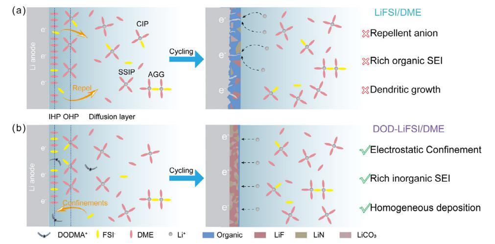
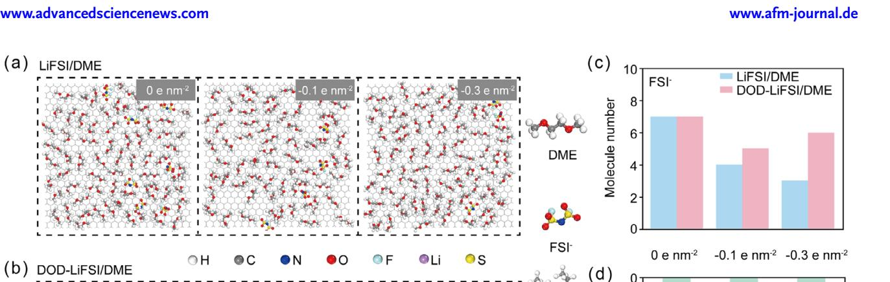
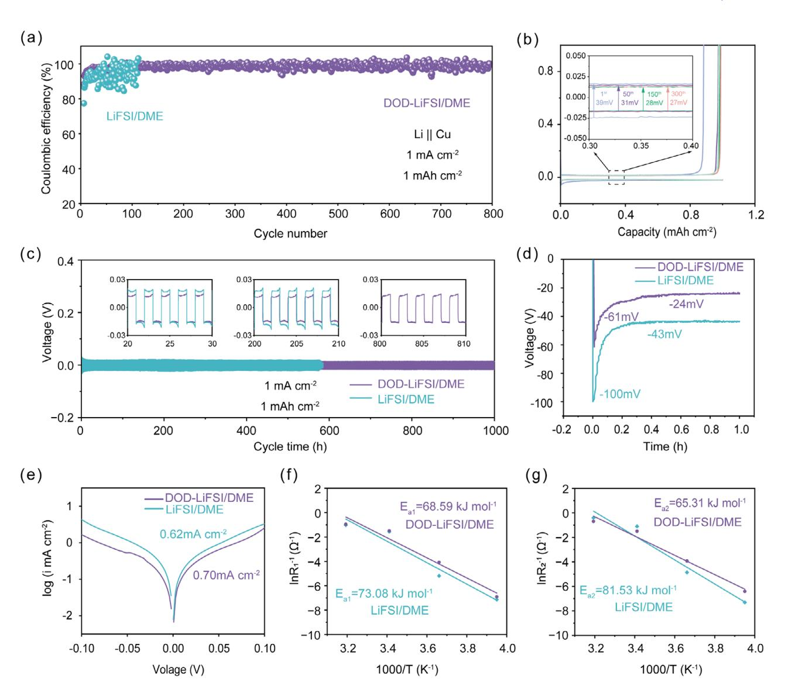
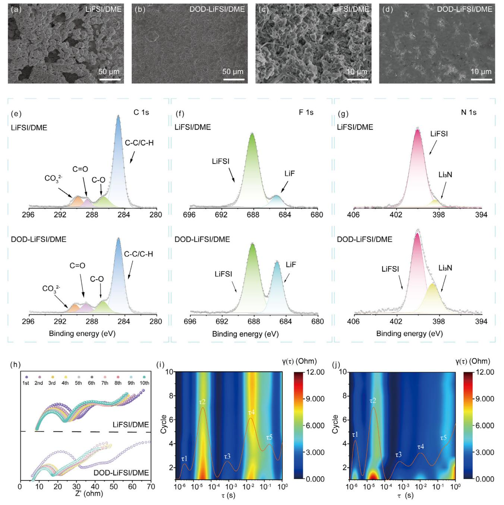
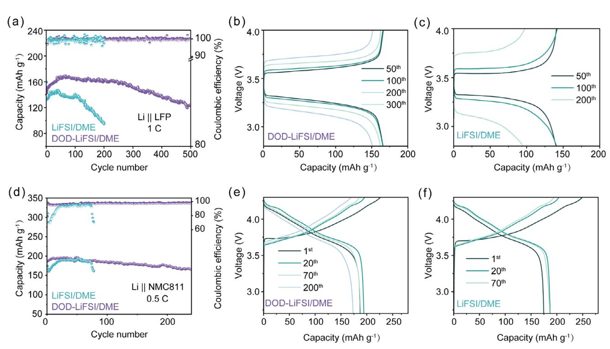
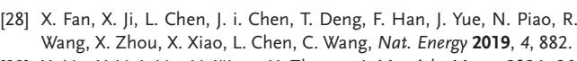

# **Localized Anion-Enriched Environment Via In Situ Electrostatic Confinement Effect for Stable Lithium Metal Batteries**

*Pin Yi, Qian Li, Yu Chen, Dedong Shan, Ximei Lv, Yang Zhang, Dengji Xiao,\* Yuhui Chen, and Yuping Wu*

**An anion-rich electric double layer (EDL) is crucial for promoting the formation of an anion-derived solid electrolyte interphase (SEI), which significantly enhances the stability of lithium metal anodes. However, during lithium metal deposition, the accumulation of negative charge at the anode surface generates a repulsive electric field, which actively drives anions away from the interface and thereby limits their participation in SEI formation. In this work, a novel strategy is demonstrated to construct an anion-enriched EDL on the lithium anode under dynamic electrochemical conditions through the "electrostatic confinement effect." This approach involves introducing dioctadecyl dimethyl ammonium chloride (DODMAC) into the electrolyte system. Upon dissociation, DODMAC yields DODMA+ ions that selectively adsorb onto the lithium surface, functioning as molecular anchors to electrostatically attract FSI− anions into the EDL. This mechanism effectively overcomes the anion exclusion caused by the electrode's negative surface charge, enabling the formation of a structurally robust anion-derived SEI. This phenomenon is termed the "electrostatic confinement effect." Implementation of this strategy demonstrates significantly enhanced performance in both Li||Cu half-cell and full-cell configurations, establishing a direct approach for manipulating EDL composition to optimize SEI architecture in lithium metal batteries.**

P. Yi, Q. Li, Y. Chen, D. Shan, X. Lv, D. Xiao, Y. Chen State Key Laboratory of Materials-Oriented Chemical Engineering School of Energy Science and Engineering College of Materials Science and Engineering Nanjing Tech University Nanjing 211816, P. R. China E-mail: [dengjixiao0311@njtech.edu.cn](mailto:dengjixiao0311@njtech.edu.cn) Y. Zhang School of Aeronautics and Astronautics Zhejiang University Hangzhou 310027, P. R. China Y. Wu Key Laboratory of Energy Thermal Conversion and Control of the Ministry of Education School of Energy and Environment Southeast University Nanjing 210096, P. R. China

The ORCID identification number(s) for the author(s) of this article can be found under <https://doi.org/10.1002/adfm.202516498>

**DOI: 10.1002/adfm.202516498**

## **1. Introduction**

Lithium-ion batteries (LIBs) approach their performance limits due to the constrained capacity of graphite anodes, hindering the growing demand for high-energy-density applications in advanced electronics and electric vehicles.[\[1–5\]](#page-9-0) Consequently, advancing energy density has become an urgent technological priority.[\[6–8\]](#page-9-0) Lithium metal is an ideal anode candidate, offering an exceptionally high theoretical specific capacity (3860 mAh g−1) and a low electrochemical potential (−3.04 V vs SHE),[\[9–11\]](#page-9-0) making it a key material for next-generation energy storage. However, its intrinsic reactivity poses critical challenges.[[12–14\]](#page-9-0) A non-uniform, mechanically fragile solid electrolyte interphase (SEI) layer often forms on its surface, leading to lithium dendrite growth.[\[15–18\]](#page-9-0) This not only compromises cycle stability but also introduces safety risks.[\[19,20\]](#page-9-0) Thus, developing a stable SEI architecture is essential for long-term cycling stability in lithium metal batteries (LMBs).[\[21\]](#page-9-0)

The stability of lithium metal anodes can be enhanced via strategies such as interface engineering, artificial SEI design, and electrolyte engineering.[\[22,23\]](#page-9-0) Among these, electrolyte engineering is particularly effective in regulating SEI structure and properties by directly optimizing electrolyte composition to form a robust SEI layer.[\[24,25\]](#page-9-0) A widely adopted approach involves incorporating fluorine-containing molecules into the Li+ solvation structure. These fluorine-rich species preferentially deposit at the anode interface during electrochemical reduction, enriching the SEI with stable fluorinated components.[\[26–30\]](#page-9-0) This strategy significantly suppresses dendrite growth and improves interfacial stability. Another critical method is the use of high-concentration electrolytes (HCEs), which reduce free solvent content by elevating salt concentrations. In HCEs, Li+ ions are primarily solvated by anions, leading to anion-dominated SEI formation.[\[31\]](#page-9-0) Such SEIs exhibit enhanced mechanical strength and chemical stability compared to conventional ones.[\[32\]](#page-9-0) Crucially, before SEI formation, a nanoscale EDL forms at the anode-electrolyte interface.[\[33\]](#page-9-0) The inner Helmholtz plane (IHP) of this EDL—comprising

**Scheme 1.** Schematic illustration of the SEI composition and Li deposition behaviors in LiFSI/DME and DOD-LiFSI/DME electrolytes. a) A typical mosaic organic-rich SEI formed in pristine LiFSI/DME electrolyte, inducing uneven Li deposition and dendrite growth. b) DOD-LiFSI/DME electrolyte developed an anion-regulated SEI promoted by electrostatic confinement effect.

specifically adsorbed ions or solvents—directly determines subsequent SEI characteristics.[\[34,35\]](#page-9-0) Thus, rationally tailoring the EDL structure is essential for SEI stabilization.[\[36,37\]](#page-9-0)

Researchers have explored strategies to stabilize SEI formation by modulating the EDL's structures and properties. For example, Zhang Qiang et al. prioritized NO3 − adsorption at the EDL interface via competitive adsorption, enabling stable SEI formation on lithium metal anodes.[\[33\]](#page-9-0) Similarly, Suo's group developed a weakly solvating electrolyte to enrich the IHP with anions, promoting anion-derived SEI formation.[\[38\]](#page-9-0) Current EDL regulation focuses on introducing effective anions into the IHP to create anion-rich SEIs, thereby stabilizing the lithium-metal-electrolyte interface. However, most studies examine EDL-SEI relationships under static electric fields, neglecting dynamic conditions during battery operation. During constant-current lithium deposition, the anode accumulates electrons, becoming negatively charged and generating a strong local electric field. This polarization repels anions from the lithium surface, limiting their role in SEI formation. Consequently, static EDL regulation strategies may fail to address challenges in dynamic electrochemical environments. A critical research gap lies in the lack of active EDL regulation methods under dynamic electric fields to enable stable SEI formation.

In this study, we introduce a trace amount of dioctadecyl dimethyl ammonium chloride (DODMAC) into the electrolyte while maintaining the Li+ solvation sheath structure largely unaltered in the bulk. Upon application of an external electric field, this method facilitates the formation of an anion-enriched EDL on the lithium metal anode surface, leading to the development of an anion-derived SEI. DODMAC, a cationic surfactant, dissociates into DODMA+ ions that selectively adsorb onto the lithium surface, acting as anchors to attract FSI− anions into the EDL. This mechanism counteracts anion repulsion from the electrode's negative charge during dynamic operation. We term this phenomenon the "electrostatic confinement effect." Experimental results confirm the SEI formed via this effect exhibits a significantly higher inorganic LiF content compared to conventional SEIs, improving the battery stability. This work demonstrates the feasibility of directly adjusting the EDL composition to regulate the SEI structure through theoretical and experimental approaches, offering new insights for SEI design.

## **2. Results and Discussion**

#### **2.1. Interfacial Structure and Bulk Properties**

The cationic surfactant DODMAC was introduced as an additive to create a cationic electrostatic field on lithium metal anode surfaces. This configuration promoted targeted adsorption and decomposition of lithium salt anions, facilitating anion-derived SEI formation. As shown in **Scheme 1**, the electrode interface comprises the bulk electrolyte and the EDL, which includes the IHP and outer Helmholtz plane (OHP). The IHP directly influences subsequent SEI development. During Li deposition under an applied electric field, FSI− anions in the interfacial region were repelled from the IHP due to electrostatic repulsion, hindering their direct involvement in SEI formation. To address this, DODMA+ cations are selectively adsorbed onto the negatively charged Li surface to confine FSI− anions electrostatically. Under these interactions, FSI− anions are immobilized at the interface, driving the formation of an anion-rich SEI.

The adsorption behavior of FSI− anions on electrode surfaces was investigated via classical molecular dynamics (MD) simulations. MD simulations focused on FSI− adsorption, as it directly influences the SEI composition. A graphene electrode model was used to represent unprotected electrodes prior to interphase formation, as established in prior studies.[\[39\]](#page-9-0) Surface charge densities ( = 0.0, ±0.1, ±0.3, ±0.6, and ±1.2 e nm−2) were applied to simulate EDL behavior under varying overpotentials. Charges were uniformly distributed across all graphene atoms using a standard constant-charge method, representing a 1D EDL model.[\[40–42\]](#page-9-0) MD results in **Figure 1**[a–d](#page-2-0) showed increasing negative surface charge density ( = 0, −0.1, −0.3 e nm−2) caused progressive electrostatic repulsion of FSI− anions from the electrode interface in pristine LiFSI/DME electrolytes, reducing interfacial anion adsorption. While the DOD-LiFSI/DME

**Figure 1.** EDL structure in LiFSI/DME and DOD-LiFSI/DME electrolytes. Molecular dynamics (MD) visualization of solvent and ion adsorption profiles within the EDL in a) LiFSI/DME and b) DOD-LiFSI/DME electrolytes. c) The molecule number of the absorbed FSI− in the EDL. d) The molecular number of the absorbed DODMA+ in the EDL. Normalized density profiles of different ingredients on Li anode surfaces in LiFSI/DME and DOD-LiFSI/DME electrolytes at e) 0.0 e nm−2, f) −0.1 e nm−2 and g) −0.3 e nm−2.

system exhibited a similar decline in FSI− adsorption with rising charge density, its interfacial anion concentration remained higher than that in LiFSI/DME across all tested charge ranges. Normalized density profiles in Figure 1e–g and confirmed this trend: FSI− anions in DOD-LiFSI/DME showed shorter adsorption distances and significantly higher interfacial concentrations under both neutral and negatively charged conditions. This robust electrostatic confinement effect contrasted sharply with the charge-dependent desorption observed in LiFSI/DME. Notably, at extreme polarization ( = −1.2 e nm−2), FSI− depletion occurred entirely at the electrode interface in LiFSI/DME (Figure S1, Supporting Information), whereas residual anion adsorption persisted in DOD-LiFSI/DME (Figure S2, Supporting Information). To further visualize the molecular distribution near positively charged surfaces, MD snapshots were obtained for the EDL structures of LiFSI/DME and DOD-LiFSI/DME electrolytes under various surface charge densities (Figure S3, Supporting Information). DODMA+ cations were progressively repelled from the positively charged surface, indicating that the DODMAC additive primarily exerts its regulatory effect at negatively polarized electrodes. This demonstrated how DODMAC enhanced FSI− penetration into the IHP, overcoming the strong electrostatic repulsion inherent in conventional electrolyte systems.

To further elucidate the interfacial dynamics of anions, MD simulations were employed to calculate the mean square displacement (MSD) of FSI− anions (Figure S4a,b, Supporting Information). In the pristine LiFSI/DME electrolyte, FSI− exhibited higher mobility, suggesting weaker confinement. In contrast, the DOD-LiFSI/DME system significantly suppressed the motion of FSI− anions, indicating enhanced electrostatic binding within the EDL due to the presence of DODMA+ cations. This tighter anion confinement contributes to the formation of a more stable, anion-derived SEI. Additionally, the Li+ transference number (tLi +), derived from the MSD data, was slightly increased in DOD-LiFSI/DME electrolyte compared to LiFSI/DME electrolyte (Figure S4c, Supporting Information).

Density functional theory (DFT) calculations were performed to investigate the possible adsorption mechanism of the

**Figure 2.** Interfacial of LiFSI/DME and DOD-LiFSI/DME electrolytes under varying conditions. a) Schematic illustration of the experimental setup for Raman spectroscopy. The interfacial solvation structure was investigated using an in situ Raman cell designed to mimic the anode environment. In situ Raman mapping of FSI− and DME in b) LiFSI/DME electrolyte and c) DOD-LiFSI/DME electrolyte. Deconvoluted Raman spectra for FSI− and DME in d) LiFSI/DME electrolyte and e) DOD-LiFSI/DME electrolyte across voltages from 0.0 to −1.0 V. Each peak is labeled to distinguish free and coordinated states.

electrostatic confinement effect. The electrostatic potential mapping (Figure S5, Supporting Information) revealed that the DODMA+ cation possessed a strongly positively charged head group coupled with an extended hydrocarbon tail exhibiting moderate positive charge distribution. Such structural features enabled dual functionality: 1) effective shielding of negative charges on the lithium interface through charge compensation, while 2) simultaneously attracting FSI− anions via electrostatic interactions. As shown in Figure S6 (Supporting Information), DODMA+ exhibits a significantly stronger adsorption energy (−1.116 eV) compared to DME (−0.266 eV), indicating that DODMA+ will preferentially adsorb at the negative electrode interface. In the presence of DODMA+ at the lithium interface, the adsorption energy of FSI− (−5.774 eV) was greater than that in systems without DODMA+ (−5.222 eV), suggesting that DODMA+ enhances FSI− retention by modifying the local electrostatic environment. These results provide additional theoretical evidence that DODMAC can promote anion adsorption at the Li surface.

To determine the adsorption behavior of FSI− at the interface, we investigated the interfacial distribution of FSI− and DME under various voltage conditions using in situ electrochemical surface-enhanced Raman spectroscopy (EC-SERS) (**Figure 2**a). In situ EC-SERS measurements revealed that in the absence of DODMAC, the Raman intensity of FSI− at the interface was significantly lower than that of DME and decreased markedly with increasing voltage (Figure 2b). This was attributed to the electrostatic repulsion of the negatively charged FSI− anion by the increasingly negatively charged electrode interface. However, the introduction of DODMAC significantly mitigated this repulsion, as evidenced by the pronounced enhancement of the characteristic FSI− peaks in the DOD-LiFSI/DME electrolyte (Figure 2c). The dashed-line boxes in Figure 2b,c highlight specific Raman shift regions corresponding to the characteristic signals of FSI- anion and DME solvent, respectively, clearly differentiating their voltage-dependent intensity changes. Deconvolution of the Raman spectra provided further insights into the solvation dynamics (Figure 2d,e). In the base electrolyte, the spectra exhibited distinct peaks corresponding to free and coordinated FSIand DME (Figure 2d). Specifically, the peaks at  $\approx$ 717, 730, and 745 cm $-1$  corresponded to the S–N–S bending modes of free  $FSI^-$ , contact ion pairs (CIPs, coordinated  $FSI^-$ ), and aggregates (AGGs, strongly coordinated FSI-), respectively.[43,44] For the solvent DME, peaks at 822 and 847 cm-1 corresponded to the symmetric and asymmetric C-O stretching vibrations of free DME molecules, while peaks at 865 and 877  $\text{cm}^{-1}$  represented coordinated DME molecules interacting with Li+. Following the introduction of DODMAC, a significant enhancement in the intensity of the free FSI- peak was observed (Figure S7, Supporting Information). This indicated that a greater number of free FSI- anions overcame the electrostatic screening effect and adsorbed onto the electrode interface. This trend suggested that DODMAC improved interfacial adsorption kinetics, facilitating the entry of  $FSI^-$  anions into the EDL.

To further characterize the adsorption behavior, alternating current (AC) voltammetry was employed to monitor the interfacial adsorption processes. The the capacitance of the adsorption was then calculated using data obtained from the AC voltammetry measurements.[45,46] As illustrated in Figure S8 (Supporting Information), the potential of zero charge (PZC) of the lithium electrode was approximately identified based on the minimum capacitance value. Even at a low additive concentration of 2 mm DODMAC, a significant negative shift in the PZC was observed. In the LiFSI/DME electrolyte, the PZC was located  $\approx$ 1.68 V (vs Li/Li+), while in the DOD-LiFSI/DME system, it shifted to  $\approx$ 1.56 V (vs Li/Li+), suggesting enhanced adsorption of FSI- anions onto the electrode surface. This observation indicated that within the negative polarization regime of the electrode interface, the site-specific adsorption of DODMA+ cations at the lithium surface generated sufficient charge compensation to overcome the electrostatic repulsion between FSI- anions and the negatively charged electrode, thus enabling anion stabilization within the IHP.

The solvation structures of the LiFSI/DME and DOD-LiFSI/DME were investigated through MD simulations (Figures S9 and S10, Supporting Information). Analysis of the radial distribution function data revealed that the addition of DOD-MAC hardly affected the inner Li+ solvation sheath. In DOD-LiFSI/DME, the coordination number (CN) of Li+ with DME was  $\approx$ 2.26, similar to the CN in LiFSI/DME (2.29). In the DOD- $\text{LiFSI}/\text{DME}$  electrolyte, the CN of  $\text{Li}^+$ -O(FSI-) decreased to 1.45, compared to 1.65 in the pristine LiFSI/DME system. This observation revealed that in the DOD-LiFSI/DME electrolyte, the electrostatic confinement effect immobilized a greater proportion of  $FSI^-$  anions within the IHP, thereby limiting their involvement in coordinating  $Li^+$  ions within the bulk solvation structures.

Raman and FTIR spectroscopy were employed on individual components and mixed electrolytes to further investigate potential perturbations of the bulk solvation structure by DODMAC. As shown in Figure S11 (Supporting Information) the characteristic peak of FSI- appears at 772.8 cm-1 in the pure LiFSI, corresponding to the  $S-N-S$  asymmetric stretching vibration. This band shifts to 715.6  $\text{cm}^{-1}$  in both LiFSI/DME and DOD-LiFSI/DME solutions, indicating strong solvation and coordination effects with Li+. To explore the spectral contribution of the DODMAC additive, we measured DME solutions containing DODMAC at different concentrations (2, 5, and 20 mm). Interestingly, no distinct Raman peaks corresponding to DODMAC were observed at low concentrations; even at 20 mm, the spectrum was dominated by DME features, likely due to the strong scattering intensity of the solvent and the low Raman activity of DODMAC. Furthermore, the Raman spectra of LiFSI/DME and DOD-LiFSI/DME electrolytes showed minimal differences, possibly because the DODMAC concentration  $(2 \text{ mm})$  was too low to yield detectable spectral shifts in the bulk phase. These results suggested that DODMAC exerts its functional influence primarily through interfacial adsorption rather than altering bulk solvation structures, consistent with MD simulations.

Fourier-transform infrared spectroscopy (FTIR) spectroscopy was conducted on the same systems (Figure S12, Supporting Information). Specifically, peaks in the 1425–1325  $\text{cm}^{-1}$  region exhibited a slight redshift, and features in the 900–800 cm-1 range showed shape distortion upon DODMAC addition, indicating molecular interactions between DODMA+ and FSI-.[47,48] The FTIR and Raman results suggested that DODMAC primarily functions via interfacial adsorption, with DODMA+-FSI- interactions contributing to the electrostatic confinement effect.

To further evaluate the impact of the introduction of DODMAC on the electrochemical behavior of the electrolyte solution, linear sweep voltammetry tests were conducted using Cu and Al as working electrode electrodes (Figure S13, Supporting Information). Both LiFSI/DME and DOD-LiFSI/DME electrolytes exhibited comparable electrochemical stability windows, with no additional reduction currents detected on Cu and oxidation onset potentials exceeding 4.3 V versus Li/Li+ on Al. These results confirmed that the addition of 2 mm DODMAC did not reduce the oxidation or reduction stability of the system, further demonstrating its compatibility with lithium metal anodes and high-voltage cathodes.

## 2.2. Plating and Stripping of Li

To further validate the benefits of the anion-based SEI, galvanostatic Li plating on Cu substrates was conducted to assess the deposition behavior under different electrolytes. As shown in **Figure 3a,** with a current density of 1 mA  $\text{cm}^{-2}$  and a deposition capacity of 1 mAh cm $-2$ , the Li||Cu half-cell exhibited significantly improved Coulombic efficiency (CE) and cycling stability in the DOD-LiFSI/DME electrolyte compared to LiFSI/DME. Specifically, the half-cell in DOD-LiFSI/DME maintained stable cycling for 800 cycles with an average CE of 98.79%, whereas in LiFSI/DME, cycling stability was limited to  $\approx$ 100 cycles. As illustrated in the capacity-voltage curves (Figure  $3b$ ), the polarization of the lithium deposition processed gradually decreased with the formation of a well-developed SEI in DOD-LiFSI/DME, reducing from 39 mV in the first cycle to 27 mV in the 300th cycle. In contrast, the higher initial polarization observed in LiFSI/DME suggested the absence of an effective SEI at the electrode-electrolyte interface (Figure S14, Supporting Information). Similar trends

**Figure 3.** Electrochemical performance of lithium metal anodes in LiFSI/DME and DOD-LiFSI/DME electrolytes. a) Cycle plot of CE for Li||Cu cells in LiFSI/DME and DOD-LiFSI/DME electrolytes. Cycling conditions: under 1 mA cm−2 current density and 1 mAh cm−2 areal capacity. b) Representative voltage-capacity profiles of DOD-LiFSI/DME electrolyte during lithium plating/stripping cycles (1 mA cm−2, 1 mAh cm−2). c) Stability of symmetric Li||Li cells under galvanostatic cycling conditions (1 mA cm−2, 1 mAh cm−2). d) Comparative analysis of lithium nucleation overpotential and growth overpotential during deposition at a current density of 1 mA cm−2. e) Tafel polarization curves quantifying lithium deposition kinetics. f,g) Examination of Arrhenius characteristics and activation energy variations (R1 and R2) in different electrolytes based on Nyquist plot analysis of Li||Li symmetric cells.

were observed at a lower current density of 0.5 mA cm−2 and a deposition capacity of 0.5 mAh cm−2, where the Li||Cu half-cell also demonstrated superior performance in DOD-LiFSI/DME (Figure S15, Supporting Information). These results suggest that trace amounts of DODMAC facilitated the formation of a more stable SEI, thereby enhancing the stability of the electrode-electrolyte interface.

To gain a deeper understanding of the multifaceted impact of the DODMAC additive on lithium deposition, Li||Li symmetric battery systems were performed. As depicted in Figure 3c, the cycling tests for lithium plating and stripping of two electrolytes were conducted at a current density of 1 mA cm−2 and a capacity of 1 mAh cm−2 in symmetric Li||Li cells. Remarkably, the addition of DODMAC extended the lifespan from 560 to over 1000 h. As shown in Figure S16 (Supporting Information), the proposed electrolyte system outperforms many previously reported additive strategies in terms of electrochemical stability. The lower overpotential and smoother voltage curves (Figure 3d) indicated Li+ transport was significantly faster in the DOD-LiFSI/DME electrolyte.[\[49,50\]](#page-9-0)

To further evaluate the reversibility and kinetics of lithium deposition, the exchange current density (I0) was calculated using the corresponding Tafel plots. As shown in Figure 3e, the exchange current densities for LiFSI/DME and DOD-LiFSI/DME were 0.62 and 0.70 mA cm−2, respectively.[\[51\]](#page-9-0) The increase in I0 indicated enhanced nucleation kinetics and faster lithium-ion diffusion in DOD-LiFSI/DME. Ionic conductivity measurements (Figure S17, Supporting Information) showed only a slight increase (from 7.35 to 7.60 mS cm $-1$ ) upon addition of 2 mM DOD-MAC to the LiFSI/DME electrolyte, indicating minimal impact to the overall bulk ion mobility. This suggests that the differences in electrochemical kinetics can be primarily ascribed to the modified interfacial structure and SEI properties.

Furthermore, the activation energies (Ea) associated with Li+ ion migration were determined by fitting the distinct semicircular features ( $R_1$  and  $R_2$ ) observed in Li||Li symmetric cells (Figure S18, Supporting Information). Both  $Ea_1$  and  $Ea_2$  followed the Arrhenius relationship. Ea1 corresponded to the Li+ transport through the solid-electrolyte interphase (SEI), and was measured at 68.59 kJ mol-1 in the DOD-LiFSI/DME electrolyte, slightly lower than that in LiFSI/DME (73.08 kJ mol $-1$ ), indicating a more stable SEI layer with reduced energy barrier for ion conduction in the former system (Figure 3f).  $E_{2}$ , representing the charge transfer activation energy, was generally to be considered the primary kinetic barrier in electrochemical reactions. Notably, a significant decreased in Ea, was observed in the DOD-LiFSI/DME formulation (Figure 3g),  $\sqrt{52,53}$  even though the bulk solvation structures of  $Li^+$  remained unaltered. This variation in Ea2 implied that the initial configuration of the EDL at the lithium surface—comprising both the IHP and OHP—played a pivotal role in SEI formation and evolution.

#### 2.3. Electrode and SEI Analysis

To further verify that the DODMAC additive was beneficial for the uniform deposition of Li+, we investigated the morphology of Li ion deposition in different electrolytes. As observed in the scanning electron microscopy (SEM) images (**Figure 4a–d**), lithium deposited from the DOD-LiFSI/DME electrolyte exhibited a significantly denser morphology. As shown in Figure 4a,c, after 30 cycles at 1 mA  $\text{cm}^{-2}$  with a deposition capacity of 1 mAh  $\text{cm}^{-2}$ , the Li surface deposited from the LiFSI/DME electrolyte displayed an irregular morphology characterized by abundant porosity. This could be attributed to repeated SEI rupture and reformation during continuous lithium plating/stripping, leading to an extremely uneven surface. The excessive porosity further increased the electrode-electrolyte contact area, exacerbating side reactions and negatively impacting the long-term cycling stability of the battery. Under the same deposition conditions, Figure 4b.d shows that lithium deposited from the DOD-LiFSI/DME electrolyte appeared significantly smoother and more uniform, with only a few small gaps in certain areas. This noticeably improved lithium morphology was crucial for achieving high CE and extended cycling stability.

To elucidate the chemical compositions of the SEI layer formed in the DOD-LiFSI/DME electrolyte, X-ray photoelectron spectroscopy (XPS) analysis was conducted on lithium metal sheets after undergoing 30 cycles. As shown in Figure 4e–g and Figure S19 (Supporting Information), the primary components of the SEI in both LiFSI/DME and DOD-LiFSI/DME electrolytes were largely similar. However, the SEI formed in DOD-LiFSI/DME contained a higher proportion of inorganic LiF (F 1s,  $\approx$ 685 eV)[54] and Li3N (N 1s,  $\approx$ 398.2 eV).[55,56] This LiF-rich SEI may exhibit superior mechanical strength and ionic conductivity, facilitating faster Li+ migration and more uniform deposition. Consequently, it effectively suppressed lithium dendrite formation, reduced SEI rupture, and prevented excessive electrolyte-induced corrosion of the Li electrode. Since the fluorine element in the electrolyte originated from FSI- anions, the increased LiF content suggested that a greater proportion of FSI- decomposes at the electrode interface to form the SEI in the DOD-LiFSI/DME electrolyte. This observation aligned well with our previous MD simulation results.

The in situ electrochemical impedance spectroscopy (EIS) and distribution of relaxation times (DRT) allowed us to track the changes and evolution of SEI during charging. EIS was conducted on Li||Li symmetric cells following a 10 min rest period after each charge/discharge cycle.[57] After the first charging step, the high-frequency semicircle in Nyquist plots (attributed to Li+ migration through the SEI) exhibited comparable dimensions for both LiFSI/DME and DOD-LiFSI/DME electrolytes (Figure 4h). However, upon the second charge, a clear divergence was observed: the high-frequency resistance in the DOD-LiFSI/DME system decreased substantially and continued to decline slightly over subsequent cycles, suggesting the rapid formation of a stable, ion-conductive SEI that enabled efficient Li+ transport. In contrast, the baseline LiFSI/DME electrolyte showed only a gradual reduction in resistance, indicating a slower and less effective development of continuous Li+-percolation pathways. This trend was further corroborated by DRT analysis. Generally, the  $\tau$ 1 peak at 10-6–10-5 s can be assigned to the contact resistance. The  $\tau$ 2 peak(corresponding to Li+ diffusion across the SEI) was significantly attenuated over ten cycles in the DOD-LiFSI/DME system (Figure 4i), confirming improved ionic mobility through the modified interfacial layer. Additionally, the  $\tau$ 3 and  $\tau$ 4 peaks, which are associated with charge transfer processes,[58] consistently exhibited lower intensities in DOD-LiFSI/DME compared to the control (Figure 4i). The  $\tau$ 5 peak in the low-frequency region corresponds to slower reaction processes, such as the diffusion of ions in the bulk. These results collectively demonstrated that DOD-LiFSI/DME enhanced interfacial kinetics by simultaneously improving SEI ionic conductivity and charge transfer efficiency.

To further delineate the structural details and phase distribution of organic and inorganic species, high-resolution transmission electron microscopy (HRTEM) characterization was performed. Figure S20a (Supporting Information) exhibited the high-resolution images of the SEI formed in LiFSI/DME, where the components in most regions were amorphous with only sparse crystalline domains. According to the lattice fringe that was observed in the crystalline region, the lattice spacing was 0.20 nm, corresponding to the {200} planes of LiF.[59,60] Comparatively, Figure S20b (Supporting Information) indicated that the SEI in DOD-LiFSI/DME electrolyte was rich in LiF. This observation is consistent with the XPS results, which revealed a higher fluorine content in the SEI formed in the DOD-LiFSI/DME electrolyte, further supporting that the presence of DODMA+ promotes the formation of a denser, more crystalline, and inorganicrich interphase.

**Figure 4.** Analysis of SEI composition and lithium metal structural stability. a–d) Assemble Li||Li in different electrolytes SEM of the surface of the Li metal anode after 30 cycles of a Li symmetrical battery. XPS spectra of SEI in different electrolytes e) C 1s, f) F 1s, and g) N 1s spectra. h) Nyquist Plots of EIS During Charging (Cycles 1–10). DRT results during the charging phase for i) LiFSI/DME and j) DOD-LiFSI/DME electrolytes.

#### **2.4. Full Battery Performance**

To evaluate the role of anion-rich SEIs in stabilizing lithium metal anodes (LMAs), LMBs were constructed to assess their electrochemical behavior. As shown in **Figure 5**[a,](#page-8-0) the cycling performance of Li||LFP cells was significantly improved in the DOD-LiFSI/DME electrolyte. The cell delivered an initial discharge capacity of 142.3 mAh g−1 at a 1 C rate and retained 123.4 mAh g−1 after 500 cycles, corresponding to a high capacity retention of 86.7%. In contrast, the capacity of the cell using the LiFSI/DME electrolyte exhibited capacity fading to 59.5% retention after only 200 cycles. The capacity-voltage profiles in Figure [5b,c](#page-8-0) indicated that after long-term cycling, the battery with the DOD-LiFSI/DME electrolyte exhibited lower polarization. This suggests that the addition of DODMAC improved the electrode–electrolyte interface by forming a more effective SEI

**Figure 5.** Electrochemical performances of full cells. a) Long-term cycling performances and b,c) corresponding voltage profiles of Li||LFP cells with DOD-LiFSI/DME and LiFSI/DME electrolytes at 1 C. d) Long-term cycling performances and e,f) corresponding voltage profiles of Li||NMC811 cells with DOD-LiFSI/DME and LiFSI/DME electrolytes at 0.5 C.

on the anode, thereby providing stable interfacial conditions for repeated lithium deposition and long-term cycling stability.

We further assembled Li||NMC811 cells to evaluate the highvoltage performance of the electrolyte. As shown in Figure 5d, when cycled between 2.7 and 4.3 V, the discharge capacity and CE of the LiFSI/DME-based cell began to decline rapidly after ≈75 cycles, indicating irreversible capacity loss at the Li anode. In contrast, the DOD-LiFSI/DME electrolyte significantly enhanced the long-term cycling stability of the Li||NMC811 cell, delivering an initial discharge capacity of 187.21 mAh g−1 and maintaining a high capacity retention of 88.7% after 240 cycles. The reliable oxidative stability of DOD-LiFSI/DME further highlights its potential for practical applications.

## **3. Conclusion**

In summary, we successfully optimize the SEI on the lithium metal anode by introducing a trace amount of DODMAC as an electrolyte additive through electrostatic confinement effect. The cationic surfactant DODMAC preferentially adsorbs at the electrode interface and acts as a targeted ion, attracting FSI− to enrich the EDL and creating a locally anion-rich environment. This promotes the preferential decomposition of anions, increasing the LiF content in the SEI. In the modified SEI, the Li+ solvation structure exhibits a lower migration energy barrier (Ea1) and desolvation energy (Ea2), enabling more uniform lithium deposition/stripping. Benefiting from the improved SEI, both Li||Cu half-cell and full-cell configurations achieves stable cycling. This work provides new insights into manipulating EDL composition for anion-derived SEI in LMBs.

# **Supporting Information**

Supporting Information is available from the Wiley Online Library or from the author.

## **Acknowledgements**

P.Y. and Q.L. contributed equally to this work. This research was financially supported by the National Natural Science Foundation of China (22209071, 22309081), the Natural Science Foundation of Jiangsu Province (BK20220339, BK20230320), the Open Research Fund from Guangdong Advanced Carbon Materials Company (Kargen-2024B0907), and the Open Research Fund from Longdu Laboratory for New Chemical Materials (LDL2024IN06). The authors also acknowledge the computing support by the Synfuels China Co Ltd, Natl Energy R&D Ctr Coal Liquid Fuels, Beijing 101400, China. The authors are grateful to the High Performance Computing Center of Nanjing Tech University for supporting the computational resources.

## **Conflict of Interest**

The authors declare no conflict of interest.

# **Data Availability Statement**

The data that support the findings of this study are available from the corresponding author upon reasonable request.

## **Keywords**

electrostatic confinement, lithium metal anode, solid electrolyte interphase

> Received: June 27, 2025 Revised: July 28, 2025 Published online:

- [1] Y. Cao, M. Li, J. Lu, J. Liu, K. Amine, *Nat. Nanotechnol.* **2019**, *14*, 200.
- [2] J. B. Goodenough, K.-S. Park, *J. Am. Chem. Soc.* **2013**, *135*, 1167.
- [3] A. Manthiram, X. Yu, S. Wang, *Nat. Rev. Mater.* **2017**, *2*, 16103.
- [4] M. Winter, B. Barnett, K. Xu, *Chem. Rev.* **2018**, *118*, 11433.
- [5] K. Xu, *Chem. Rev.* **2014**, *114*, 11503.
- [6] M. He, L. G. Hector, F. Dai, F. Xu, S. Kolluri, N. Hardin, M. Cai, *Nat. Energy* **2024**, *9*, 1199.
- [7] P. R. Shearing, L. R. Johnson, *Joule* **2020**, *4*, 1359.
- [8] P. Zhao, Y. Li, S. Chen, H. Fan, Y. Feng, L. Hu, Y. Zhang, Q. Nie, H. Pei, C. Yang, J. Deng, C. Bao, J. Song, *Adv. Energy Mater.* **2022**, *12*, 2200568.
- [9] N. Li, X. Han, X. Cui, C. Xu, C. Mao, X. Dai, W. Xue, *Adv. Funct. Mater.* **2025**, *35*, 2409431.
- [10] D. Lin, Y. Liu, Y. Cui, *Nat. Nanotechnol.* **2017**, *12*, 194.
- [11] G. Zheng, S. W. Lee, Z. Liang, H. W. Lee, K. Yan, H. Yao, H. Wang, W. Li, S. Chu, Y. i. Cui, *Nat. Nanotechnol.* **2014**, *9*, 618.
- [12] B. Jagger, M. Pasta, *Joule* **2023**, *7*, 2228.
- [13] Q. Pang, X. Liang, I. R. Kochetkov, P. Hartmann, L. F. Nazar, *Angew. Chem., Int. Ed.* **2018**, *57*, 9795.
- [14] H. Wan, J. Xu, C. Wang, *Nat. Rev. Chem.* **2024**, *8*, 30.
- [15] Y. Chu, Y. Shen, F. Guo, X. Zhao, Q. Dong, Q. Zhang, W. Li, H. Chen, Z. Luo, L. Chen, *Electrochem. Energ. Rev.* **2020**, *3*, 187.
- [16] Y. Li, Y. Li, A. Pei, K. Yan, Y. Sun, C. L. Wu, L. M. Joubert, R. Chin, A. i. L. Koh, Y. i. Yu, J. Perrino, B. Butz, S. Chu, Y. i. Cui, *Science* **2017**, *358*, 506.
- [17] K. Xu, *Chem. Rev.* **2004**, *104*, 4303.
- [18] S. Zhang, B. Hu, Z. Geng, X. Gao, D. Spencer-Jolly, D. L. R. Melvin, Z. Ning, G. Li, M. Jenkins, L. Wang, H. Gao, S. D. Pu, T. J. Marrow, C. W. Monroe, P. G. Bruce, *Energy Environ. Sci.* **2024**, *17*, 1448.
- [19] X. B. Cheng, R. Zhang, C.-Z. Zhao, Q. Zhang, *Chem. Rev.* **2017**, *117*, 10403.
- [20] S. a. Li, M. Jiang, Y. Xie, H. Xu, J. Jia, J. Li, *Adv. Mater* **2018**, *30*, 1706375.
- [21] A.-M. Li, O. Borodin, T. P. Pollard, W. Zhang, N. Zhang, S. Tan, F. Chen, C. Jayawardana, B. L. Lucht, E. Hu, X. Q. Yang, C. Wang, *Nat. Chem.* **2024**, *16*, 922.
- [22] G. Lu, J. Nai, D. Luan, X. Tao, X. W. Lou, *Sci. Adv.* **2023**, *9*, adf1550.
- [23] Q. Zhao, S. Stalin, L. A. Archer, *Joule* **2021**, *5*, 1119.
- [24] B. Sun, P. Xiong, U. Maitra, D. Langsdorf, K. Yan, C. Wang, J. Janek, D. Schröder, G. Wang, *Adv. Mater.* **2020**, *32*, 1903891.
- [25] Y.-H. Tan, G. X. Lu, J. H. Zheng, F. Zhou, M. Chen, T. Ma, L. L. Lu, Y. H. Song, Y. Guan, J. Wang, Z. Liang, W. S. Xu, Y. Zhang, X. Tao, H. B. Yao, *Adv. Mater.* **2021**, *33*, 2102134.
- [26] P. Bai, X. Ji, J. Zhang, W. Zhang, S. Hou, H. Su, M. Li, T. Deng, L. Cao, S. Liu, X. He, Y. Xu, C. Wang, *Angew. Chem., Int. Ed.* **2022**, *61*, 202202731.
- [27] I. l. R. Choi, Y. Chen, A. Shah, J. Florian, C. Serrao, J. Holoubek, H. Lyu, E. Zhang, J. H. Lee, Y. Lin, S. C. Kim, H. Park, P. Zhang, J. Lee, J. Qin, Y. Cui, Z. Bao, *Nat. Energy* **2025**, *10*, 365.

- [29] X. Liu, Y. Li, J. Liu, H. Wang, X. Zhuang, J. Ma, *Adv. Mater.* **2024**, *36*, 2401505.
- [30] N. von Aspern, G.-V. Röschenthaler, M. Winter, I. Cekic-Laskovic, *Angew. Chem., Int. Ed.* **2019**, *58*, 15978.
- [31] Y. Yamada, *Bull. Chem. Soc. Jpn.* **2019**, *93*, 109.
- [32] O. Borodin, J. Self, K. A. Persson, C. Wang, K. Xu, *Joule* **2020**, *4*, 69.
- [33] C. Yan, H. R. Li, X. Chen, X. Q. Zhang, X. B. Cheng, R. Xu, J.-Q. Huang, Q. Zhang, *J. Am. Chem. Soc.* **2019**, *141*, 9422.
- [34] Y. Wang, B. Liang, J. Zhu, G. Li, Q. Li, R. Ye, J. Fan, C. Zhi, *Angew. Chem., Int. Ed.* **2023**, *62*, 202302583.
- [35] W. Zhang, Y. Lu, L. Wan, P. Zhou, Y. Xia, S. Yan, X. Chen, H. Zhou, H. Dong, K. Liu, *Nat. Commun.* **2022**, *13*, 2029.
- [36] Q. Wu, M. T. McDowell, Y. Qi, *J. Am. Chem. Soc.* **2023**, *145*, 2473.
- [37] R. Xu, X. Shen, X. X. Ma, C. Yan, X. Q. Zhang, X. Chen, J. F. Ding, J.-Q. Huang, *Angew. Chem., Int. Ed.* **2021**, *60*, 4215.
- [38] M. Mao, X. Ji, Q. Wang, Z. Lin, M. Li, T. Liu, C. Wang, Y. S. Hu, H. Li, X. Huang, L. Chen, L. Suo, *Nat. Commun.* **2023**, *14*, 1082.
- [39] L. Ma, T. P. Pollard, Y. Zhang, M. A. Schroeder, M. S. Ding, A. V. Cresce, R. Sun, D. R. Baker, B. A. Helms, E. J. Maginn, C. Wang, O. Borodin, K. Xu, *Angew. Chem., Int. Ed.* **2021**, *60*, 12438.
- [40] J. Holoubek, A. Baskin, J. W. Lawson, H. Khemchandani, T. A. Pascal, P. Liu, Z. Chen, *J. Phys. Chem. Lett.* **2022**, *13*, 4426.
- [41] S. K. Reed, O. J. Lanning, P. A. Madden, *J. Chem. Phys.* **2007**, *126*, 084704.
- [42] L. Zeng, T. Wu, T. Ye, T. Mo, R. Qiao, G. Feng, *Nat Comput Sci* **2021**, *1*, 725.
- [43] Q. Sun, Z. Cao, Z. Ma, J. Zhang, H. Cheng, X. Guo, G. T. Park, Q. Li, E. Xie, L. Cavallo, Y. K. Sun, J. Ming, *ACS Energy Lett.* **2022**, *7*, 3545.
- [44] Y. Ou, D. Zhu, P. Zhou, C. Li, Y. Lu, Q. Cao, X. Song, W. Hou, S. Yan, Y. Xia, H. Zhou, W. Zhang, Q. Feng, H. Xu, K. Liu, *Angew. Chem., Int. Ed.* **2025**, *64*, 202504632.
- [45] G. Herzog, W. Moujahid, J. Strutwolf, D. W. M. Arrigan, *Analyst* **2009**, *134*, 1608.
- [46] D. Xiao, Q. Li, D. Luo, R. Gao, Z. Li, M. Feng, T. Or, L. Shui, G. Zhou, X. Wang, Z. Chen, *Adv. Funct. Mater.* **2021**, *31*, 2011109.
- [47] C. Shi, S. Takeuchi, G. V. Alexander, T. Hamann, J. O'Neill, J. A. Dura, E. D. Wachsman, *Adv. Energy Mater.* **2023**, *13*, 2301656.
- [48] J. Wang, L. Xie, W. Wu, Y. Liang, M. Cao, C. Gao, Y. Bo, J. Zhang, J. Zhang, *Energy Environ. Sci.* **2024**, *17*, 9100.
- [49] X. Gao, Y.-N. Zhou, D. Han, J. Zhou, D. Zhou, W. Tang, J. B. Goodenough, *Joule* **2020**, *4*, 1864.
- [50] Y. Yan, C. Shu, R. Zheng, M. Li, Z. Ran, M. He, A. Hu, T. Zeng, H. Xu, Y. Zeng, *Nano Res.* **2022**, *15*, 3150.
- [51] Q. Zhao, Z. Tu, S. Wei, K. Zhang, S. Choudhury, X. Liu, L. A. Archer, *Angew. Chem., Int. Ed.* **2018**, *57*, 992.
- [52] T. Abe, H. Fukuda, Y. Iriyama, Z. Ogumi, *J. Electrochem. Soc.* **2004**, *151*, A1120.
- [53] K. Xu, A. von Cresce, U. Lee, *Langmuir* **2010**, *26*, 11538.
- [54] W. Yu, Z. Yu, Y. i. Cui, Z. Bao, *ACS Energy Lett.* **2022**, *7*, 3270.
- [55] X.-L. Wang, Y. Li, J. Liu, S. J. Yang, J. K. Hu, W.-Q. Mai, R. Wen, H. Yuan, J.-Q. Huang, *Angew. Chem., Int. Ed.* **2025**, *64*, 202421101.
- [56] Y. Peng, J. Chen, G. Liu, Y. Yin, X. Fang, Y. Wang, X. Dong, Y. Xia, *Adv. Funct. Mater.* **2025**, *35*, 2501489.
- [57] J. Chen, E. Quattrocchi, F. Ciucci, Y. Chen, *Chem* **2023**, *9*, 2267.
- [58] Y. Lu, C.-Z. Zhao, J.-Q. Huang, Q. Zhang, *Joule* **2022**, *6*, 1172.
- [59] D. Chai, H. Yan, X. Wang, X. Li, Y. Fu, *Adv. Funct. Mater.* **2024**, *34*, 2310516.
- [60] J. Sun, S. Zhang, J. Li, B. Xie, J. Ma, S. Dong, G. Cui, *Adv. Mater.* **2023**, *35*, 2209404.

