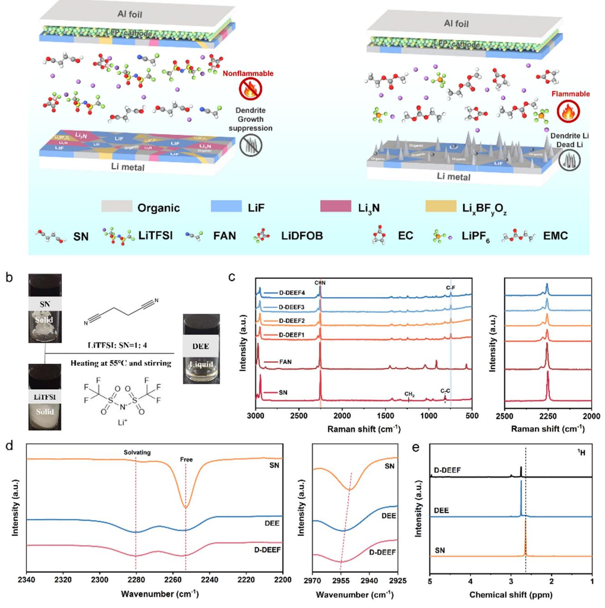
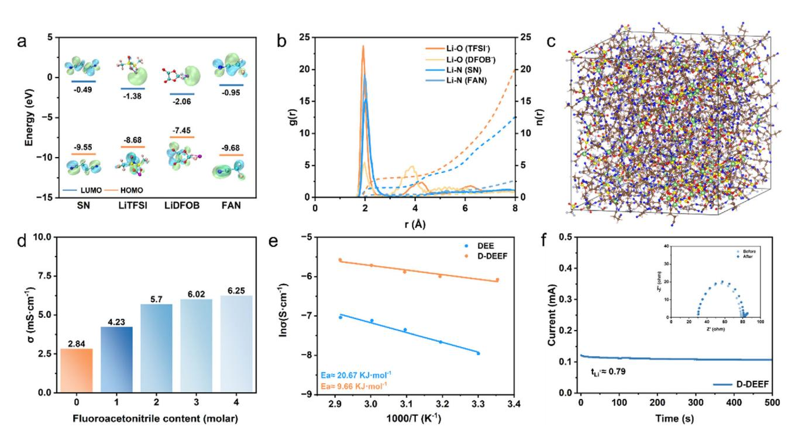
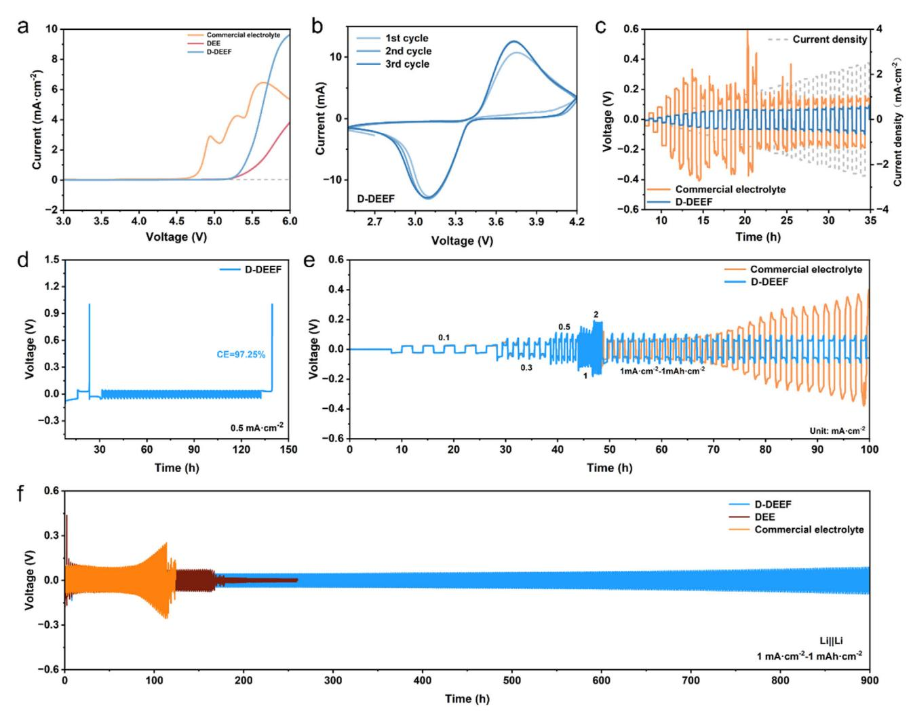
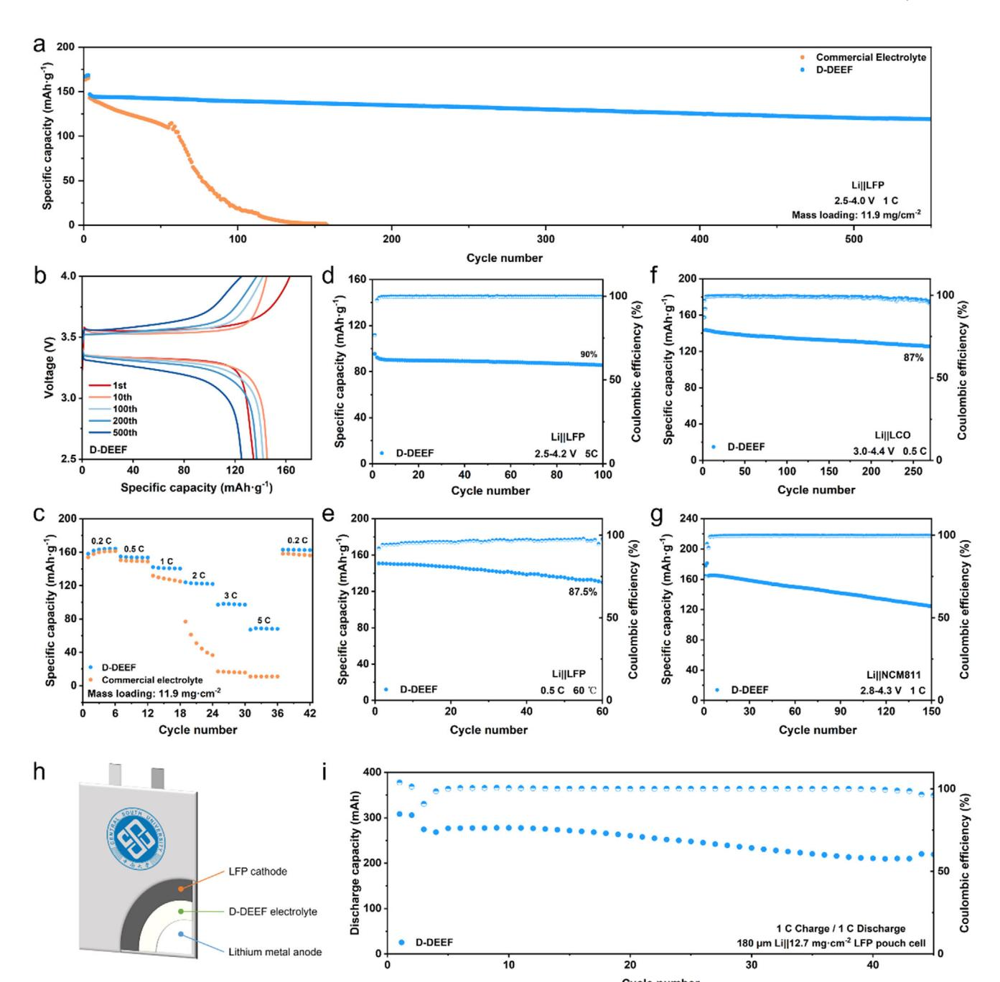
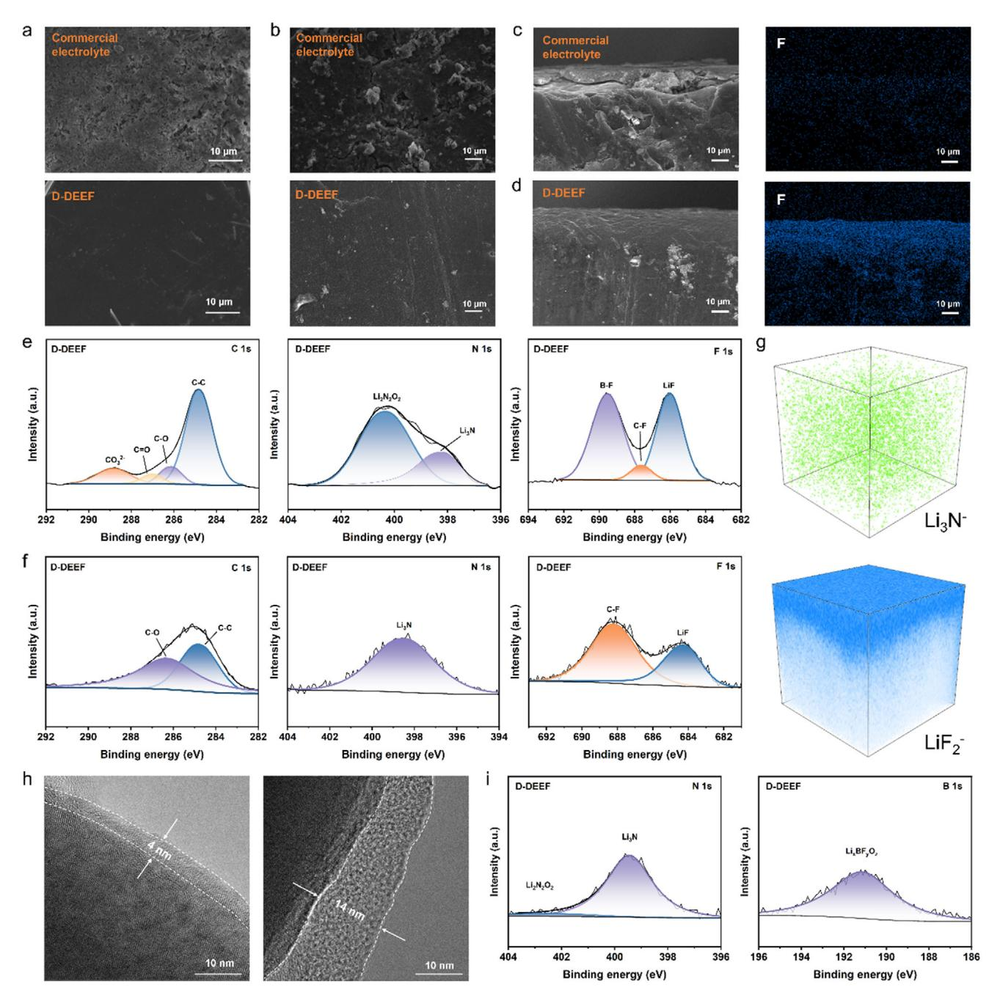

# **Double Anion Deep Eutectic Electrolyte with Fluoroacetonitrile Cosolvent for High Performance Lithium Metal Battery**

*Qianying Song, Tuoya Naren, Zhongsheng Wang, Antai Zhu, Shaozhen Huang, Jutang Hu, Yifan Tang, Bowei Ju, Lin Mei,\* Gui-Chao Kuang,\* and Libao Chen*

**Deep eutectic electrolytes (DEE) are considered as highly safe electrolytes for developing high-energy density lithium metal batteries (LMBs). However, these electrolytes are limited by their high reactivity with lithium metal and low ionic conductivity. Herein, a novel and structurally simple DEE-based double anion deep eutectic electrolyte (D-DEEF) by using lithium difluoro(oxalato)borate (LiDFOB) as an additive and fluoroacetonitrile (FAN) as cosolvent is developed. The additive can form a stable interphase in situ to inhibit electrolyte decomposition, while the FAN can reduce viscosity and improve ionic conductivity. Li||LiFePO4 full cells have a capacity retention rate of over 85% after 500 cycles at 1C, while Li||LiCoO2 full cells have a capacity retention rate of 87% after 260 cycles at 4.4 V. This study might provide a new technological pathway for developing high-safety LMBs.**

#### **1. Introduction**

Under the background of sustainable development, lithium-ion batteries (LIBs), as a green and efficient new alternative energy source, play a crucial role in solving the energy crisis and environmental pollution problems.[\[1–3\]](#page-8-0) In the past few decades, the energy density of lithium-ion batteries has been continuously increasing, but this growth trend has approached the maximum energy density of intercalation electrode materials.[\[4\]](#page-8-0) At present, LIBs with metal oxide as the cathode and graphite as the anode cannot meet the growing demand for energy storage. Therefore,

Q. Song, T. Naren, Z. Wang, A. Zhu, S. Huang, J. Hu, Y. Tang, L. Mei, G.-C. Kuang, L. Chen State Key Laboratory of Powder Metallurgy Central South University Changsha 410083, P. R. China E-mail: [meilin@csu.edu.cn;](mailto:meilin@csu.edu.cn) [gckuang@csu.edu.cn](mailto:gckuang@csu.edu.cn) B. Ju Changsha Research Institute of Mining and Metallurgy Co. Ltd. Changsha 410012, P. R. China L. Chen National Energy Metal Resources and New Materials Key Laboratory Central South University Changsha 410083, P. R. China

The ORCID identification number(s) for the author(s) of this article can be found under <https://doi.org/10.1002/adfm.202516729>

**DOI: 10.1002/adfm.202516729**

there is an urgent need to develop nextgeneration batteries with high energy density, long cycle life, and high safety.[\[5–7\]](#page-8-0) Lithium metal with a high theoretical specific capacity of 3860 mAh · g−1, a low redox potential (−3.04 V vs SHE), and a low mass density (0.534 g · cm−3) behaves as an ideal negative electrode material for high-energy density batteries.[\[8–10\]](#page-8-0)

On the other side, traditional lithium batteries mainly rely on organic carbonate electrolytes such as ethylene carbonate/dimethyl carbonate (EC/DMC) or ether electrolytes such as 1,3-dioxolane/ethylene glycol dimethyl ether (DOL/DME).[\[11,12\]](#page-8-0) Although EC/DMC electrolytes display high ionic conductivity, the interface stability between these electrolytes and lithium metal

is poor, and the reaction activity is high. Due to side reactions and the phenomenon of transition metal dissolution, the interface instability with positive electrode materials such as lithium iron phosphate (LiFePO4) and high nickel ternary material (NCM) accelerates capacity decay, which becomes more pronounced under high area capacity and current density utilization.[\[13\]](#page-8-0) Although ether electrolytes have better compatibility with lithium metal anodes, their poor oxidation stability (*<*4 V) limits their application in high-energy density lithium metal batteries (LMBs).[\[14\]](#page-8-0) In addition, commercial electrolytes suffer from poor thermal stability and susceptibility to combustion.[\[15\]](#page-8-0) To address these issues, deep eutectic solvents (DESs), including nitriles, sulfones, amides, and imidazoles, have become a research hotspot as a green and controllable electrolyte system due to their nonflammability, wide electrochemical stability window, and low cost.[\[16–19\]](#page-8-0) Unlike ionic liquids with similar properties, DES can be synthesized from abundant raw materials through intermolecular non-covalent interactions, which conforms to the principles of sustainable chemistry.[\[17,20,21\]](#page-8-0)

Among various DESs systems, the succinitrile (SN) based DES has shown some advantages due to its highly polar and electrochemically stable properties.[\[22–24\]](#page-8-0) However, it also suffers from its high reactivity with lithium negative electrodes because the -hydrogens in the SN can be easily activated due to the strong electron-withdrawing effect of the nitrogen atom.[\[25–27\]](#page-8-0) The SN can easily form a Li+(R-CN) complex with lithium metal. Furthermore, the dinitrile and subsequently electrochemically obtained polynitrile molecules are more prone to undergo

cross-linking reactions, which greatly increase the solvent viscosity and thus decrease the ionic conductivity. In addition, this reaction may also lead to excessive steric hindrance, reduce the coverage of molecules on the positive electrode surface, limit the adsorption of nitrile groups, and depress the protective film formation, thereby affecting the electrochemical performance.[\[28,29\]](#page-8-0) Therefore, researchers have developed several strategies to solve the above problems. The Lee group proposed a polymerizationinduced microphase separation strategy to form an elastic network and a highly polar phase, in which SN is used as a component in a homogeneous solution to promote the transport of lithium ions.[\[30\]](#page-8-0) Although this polymer electrolyte with DES showed good interface compatibility, it is still limited by its low ionic conductivity. Changing the solvation structure of deep eutectic electrolytes has become a more promising strategy. Fluorinated additives, such as fluorinated vinyl carbonate (FEC), are easily decomposed on the surface of lithium to form a protective film before the reduction and decomposition of carbonatebased electrolytes.[\[31,32\]](#page-8-0) Zhang et al. added different contents of FEC as co-solvents to SN solution to afford electrolytes that effectively improved interfacial compatibility and thermal stability. Its performance at high temperatures was superior to commercial electrolytes.[\[33\]](#page-8-0) At present, the lithium salt in commercial electrolytes is mainly based on lithium hexafluorophosphate (LiPF6), but its stability is not high, and it may be decomposed into lithium fluoride (LiF) and phosphorus pentafluoride (PF5). The generated PF5 will react with trace amounts of water to generate highly reactive hydrogen fluoride (HF), which will not only corrode the solid electrolyte interface (SEI) layer but also corrode cathode materials such as lithium transition metal oxides, resulting in a rapid decline in battery capacity.[\[34\]](#page-8-0) Lithium bis(trifluoromethanesulphonyl)imide (LiTFSI) is a promising electrolyte lithium salt with high stability to water and heat. However, at a voltage higher than 3.7 V versus Li /Li+, the LiTFSIbased electrolyte will corrode the aluminum current collector to a certain extent, and the addition of a small amount of LiD-FOB can effectively suppress this phenomenon. It shows that the electrolyte containing both LiTFSI and LiDFOB can improve the electrochemical window of the electrolyte and inhibit aluminum corrosion.[\[8\]](#page-8-0) In addition, lithium difluorooxalate borate (LiDFOB) as an additive to form a double anion deep eutectic solution (D-DES) was demonstrated as an efficient strategy. This additive might form a stable interphase in situ to inhibit electrolyte decomposition.[\[35\]](#page-8-0) However, the D-DES still demonstrated low ionic conductivity (2.86 mS·cm−1).[\[36\]](#page-8-0) Therefore, it still poses a great challenge to develop SN-based deep eutectic electrolytes with good interphase compatibility and high ionic conductivity at the same time.

In this study, we propose a novel and structurally simple SNbased double anion deep eutectic electrolyte (D-DEEF) by using D-DES and fluoroacetonitrile (FAN) as co-solvents. Fuoroacetonitrile as a small-sized solvent that can form a continuous lithium ion transport channel in the inner and outer solvation shell.[\[37\]](#page-9-0) The introduction of FAN aims to reduce viscosity and improve ionic conductivity. In addition, it can promote the formation of a lithium fluoride (LiF) rich SEI layer. Meanwhile, LiDFOB, as a functional lithium salt additive, can preferentially decompose and form a stable interface at the positive and negative electrodes, thereby inhibiting the decomposition of the electrolyte.[\[38,39\]](#page-9-0) Research results have revealed that this optimized electrolyte exhibits high performance in lithium metal batteries (LMB) at both room temperature and high temperature. D-DEEF electrolyte exhibits excellent cycling performance in both LFP and highvoltage cathode systems while ensuring high flame retardancy and safety. The LFP and LCO full cells assembled with D-DEEF electrolyte still have a capacity retention rate of over 80% after cycling. This study provides a new technological pathway for developing deep eutectic electrolyte (DEE) with high safety and applicability to various electrode materials.

#### **2. Results and Discussion**

D-DEEF electrolyte has good flame retardancy, and its inhibitory effect on lithium dendrite growth is confirmed by further characterization of the SEI at the anode interface. DEE was prepared by mixing LiTFSI and SN with different molar ratios. To accelerate the formation of the eutectic system, the solution was stirred and heated to 55 °C for 1 h. The transparent liquid DEE was obtained (**Figure 1**[b\)](#page-2-0). The nitrile group with unbound electron pairs can act as an electron donor and coordinate with the lithium ion (Li+) to promote the dissociation of LiTFSI. The -hydrogen forms hydrogen bonds with the fluorine atoms in TFSI− anions.[\[40\]](#page-9-0) The above two kinds of weak non-covalent interactions work in concert to induce the formation of DEE. As the concentration of lithium salt further increased, the corresponding peak intensity of free nitrile further weakened, and the coordination peak intensity increased (Figure S1, Supporting Information). We use different concentrations of electrolytes to assemble SS||SS cells to determine the conductivity changes of deep eutectic electrolytes, as shown in Figure S2 (Supporting Information). According to the experimental results, the optimized molar ratio of SN to LiTFSI is 4:1. When the concentration is further increased, the conductivity will be limited by the increase of viscosity.

To further optimize DEE, LiDFOB as lithium salt was added (2 wt.% to DEE) to improve the interface between the cathode and anode electrodes, while FAN was introduced to reduce electrolyte viscosity and increase ionic conductivity. Raman results show that the characteristic peak of nitrile centered at 2251 cm−1 splits and appear a new peak at 2262 cm−1 after lithium salt addition (Figure [1c;](#page-2-0) Figure S1, Supporting Information), indicating the existence of intermolecular interactions.[\[41\]](#page-9-0) Pure FAN shows a characteristic nitrile peak at 2260 cm−1, which overlaps with SN's peak in D-DEEF, confirming FAN's integration into the solvation structure. FTIR spectroscopy results demonstrated that the nitrile characteristic peak did not show significant changes, which indicated the addition of functional lithium salts and co-solvents did not affect the lithium ion (Li+) solvation structure. However, due to the introduction of anions in LiDFOB and fluorine atoms in FAN, the hydrogen bonding interactions (C─H─M, M═N, O or F) in D-DEEF undergo changes, corresponding to a shift in the C─H stretching vibration peak (Figure [1d\)](#page-2-0).[\[42\]](#page-9-0) In addition, too much FAN addition will contribute little to the ionic conductivity and lead to excess free nitrile groups in the system, affecting the cycling performance of the battery. Therefore, in the following research, we chose the composition ratio of D-DEEF1 (x = 1) as the basic eutectic electrolyte system, which will be referred to as D-DEEF for convenience in the following text. Proton nuclear magnetic resonance (1H NMR) results demonstrated that the  $\mathbf{S}$ CF NFWS

www.advancedsciencenews.com

 $\overline{a}$ 

Figure 1. a) Structure and interface schematic diagram of batteries using D-DEEF and commercial electrolyte. b) Schematic diagram of DEE formation. c) Raman spectra of D-DEEF solutions with different SN: FAN: LiTFSI molar ratios (4:1:1 to 4:4:1). d) FTIR e) 1H NMR spectra of SN, DEE, and D-DEEF.

chemical environment around the SN changed after coordinating with LiTFSI. The corresponding hydrogen peak shifted from 2.60 to o 2.76 ppm for D-DEEF (Figure 1e). Differential scanning calorimetry (DSC) results show a significant decrease in the melting point of the deep eutectic electrolyte (Figure S3, Supporting Information). The intermolecular interactions present in deep eutectic systems endow DEE with many advantages as a noncarbonate electrolyte for lithium metal batteries. First, SN completely lost its plastic crystalline properties in this mixture, as the two peaks in the DSC curve, namely the transition points from crystalline state to plastic crystalline state at  $-40$  °C and from plastic crystalline state to liquid state at 60 °C, disappeared. On the contrary, only one amorphous glass transition point was detected near  $-80$  °C, indicating that the two lithium salts have a strong liquid-liquid effect on SN molecules and promote rapid ion transport.

IENCE NEWS

Figure 2. a) Theoretical calculation of HOMO-LUMO energy of SN, LiTFSI, LiDFOB, and FAN. b) RDF of different ion pairs in D-DEEF calculated by MD simulation. c) D-DEEF snapshot obtained by MD simulation (Green balls represent Li+). d) Ionic conductivity of D-DEEF with different molar ratios of FAN. e) Temperature-dependent Arrhenius plots of ionic conductivity for DEE and D-DEEF. f) Lithium-ion transference number of D-DEEF electrolyte.

Deep eutectic solutions have good thermal stability, so the weight change of the electrolyte is analyzed through thermogravimetric testing. It can be observed that, unlike the sustained weight loss of commercial electrolytes, the thermal decomposition temperature corresponding to a 5% weight loss of DEE is  $\approx$ 181 °C (Figure S4, Supporting Information). Considering the inherent risks associated with lithium dendrite growth, the non-flammability of the electrolyte becomes an important consideration in lithium metal batteries. Ignition test to verify the flame-retardant effect of the D-DEEF system. Weigh 1 g of electrolyte and ignite it with a laboratory igniter, recording its combustion and extinguishing time. The experimental results indicate that D-DEEF is completely noncombustible. In contrast, commercial carbonate-based electrolytes (LB-005) are easy to ignite, with a self-extinguishing time of up to 70 seconds (Figure S5, Supporting Information). Moreover, the stability of the lithium metal foil was observed by immersing it in the electrolyte (Figure S6, Supporting Information). It can be seen that after one month of storage, the D-DEEF electrolyte does not change color, and the soaked lithium foil still maintains a bright surface.

In order to gain a deeper understanding of each component role and formation mechanism of D-DEEF between SN, LiTFSI, LiDFOB and FAN as well as the coordination environment of  $Li^+$ . using Gaussian 16 software at the B3LYP/6-311+G (d, p) theoretical level, we conducted density functional theory (DFT) theoretical calculation to analyze the highest occupied molecular orbital (HOMO) and lowest unoccupied molecular orbital (LUMO), which could reflect the chemical activity of each component. The LUMO of LiDFOB is  $-2.06$  eV, which is much lower than the other three components (Figure 2a). Calculation results demonstrated that LiDFOB additive would be first reduced and participate in the formation of solid electrolyte interphase (SEI).[43] Then, we performed molecular dynamics (MD) simulations, including simulated radial distribution function (RDF) and snapshots for further analyses. Among them, the solid line represents the radial distribution function of Li+, and the dashed line represents the coordination number. The radial distribution function reflects the detailed coordination structure. Strong peaks at 2 Å are ascribed to the radius of Li+-O and Li+-N, indicating that SN, FAN and TFSI- dominate the initial solvation structure of Li+. The coordination numbers of Li+-  $O_{TFSL}$  and  $N_{SN}$  are 3.0 and 1.5, respectively, indicating the formation of a solvation structure rich in anions (Figure  $2b$ ,c). The electron density of D-DEEF was determined by electrostatic potential (ESP) analysis (Figure S7, Supporting Information). The negative charge region around the oxygen atom in the SN molecule and the positive charge region around Li+ exhibit strong mutual attraction, inducing the formation of stable structures in D-DEEF. When the molar ratio (FAN: DEE) increased from 1:4 to 4:4, the viscosity of D-DEEFx (x = 1, 2, 3, 4) decreased from 62.09 to 6.51 mPa·s-1 (Figure S8, Supporting Information), and the corresponding ionic conductivity increased from 2.84 to 6.25 mS cm $-1$  (Figure 2d). Describe the temperature-dependent conductivity of electrolytes using the Arrhenius equation (Figure 2e). The slope in the Arrhenius plot indicates that the activation energy of D-DEEF is 9.66 kJ·mol-1, higher than that of DEE (20.67 kJ·mol $-1$ , Figure 2e). The lower energy barrier of Li+ transport leads to faster ion transport kinetics. The lithium-ion transference number measured by chronoamperometry (Figure 2f; Figure S9, Supporting Information) and

www.afm-journal.de

Figure 3. a) LSV curves of commercial electrolyte, DEE, and D-DEEF, using stainless steel as the working electrode, Li as the counter electrode, and reference electrode. b) CV curves of the cell with D-DEEF electrolyte. c) Critical current density (CCD) of commercial electrolyte and D-DEEF. d) Average CE measurement LillCu half cell assembled with D-DEEF at 0.5 mA·cm-2. e) Rate performance of lithium symmetric battery, with current density increasing from 0.1 to 2 mA·cm-2 and then decreasing to 1 mA·cm-2; f) Cycling performance of symmetric Li||Li cells with commercial electrolyte, DEE and D-DEEF electrolyte, separately.

EIS measurements on LillLFP cells (Figure S10, Supporting Information) confirms this result.

Some fundamental electrochemical properties of the electrolytes were investigated.

Figure 3a shows the decomposition voltage of several electrolytes. The D-DEEF eutectic electrolyte has an electrochemical window up to 5.2 V, which can act as a buffer in case of overcharging or discharging, thereby reducing the risk of thermal runaway and battery failure, and helping to improve safety and stability. The cyclic voltammetry curves (CV) of Li|LFP cells using different electrolytes were measured (Figure  $3b$ ; Figure S11, Supporting Information). CV testing shows that the cathodic/anodic redox reactions of the LFP cathode (i.e., Li+ intercalation/deintercalation) in different electrolytes. The improved symmetry of the CV curves for D-DEEF indicates more reversible Li+ transport at the electrode-electrolyte interface. The verification of cycling performance under extreme current shows that

D-DEEF can still cycle normally at a current of 2.5 mA $\cdot$ cm-2, significantly improving battery safety compared to commercial electrolytes that can only withstand a current of 1.1 mA·cm-2 (Figure 3c). D-DEEF achieved a CE of  $97.25\%$  after 50 cycles at 0.5 mA cm-2, while half cells assembled with commercial electrolytes were unable to stably deposit and strip (Figure 3d; Figure S12, Supporting Information). High CE typically indicates that lithium deposition occurs at the previous lithium active sites, producing the least amount of dead lithium during cycling. Due to the increase in the number of active lithium deposition sites on the anode surface, this efficiency is related to good rate performance.

The DEE electrolyte formed by SN and LiTFSI can also cycle stably for the first 100 h, but due to side reactions with lithium metal, the battery experiences short circuits during subsequent constant current charging and discharging processes (Figure S13, Supporting Information). Similarly, a comparison group containing only FAN or LiDFOB was assembled to further confirm the advantages of the synergistic effect of cosolvents and lithium salt additives. In order to demonstrate the advantage of the D-DEEF electrolyte, the symmetrical Li||Li cells with different electrolytes were assembled. The cell with D-DEEF electrolyte can maintain stable cycling during the process of increasing the current density from 0.1 to 2 mA·cm-2, and then decreasing to 1 mA·cm $-2$ , while the polarization voltage varied with the current density (Figure 3e). This result indicates enhanced compatibility between D-DEEF and lithium metal, which may be due to the formation of a robust SEI during cycling. However, commercial electrolytes short-circuit when the current density increases, making it difficult to stably carry out lithium deposition and stripping (Figure S14, Supporting Information). The long-term cycling performance of Li||Li cells demonstrated that the electrolyte using D-DEEF can stably cycle for over 600 h at 1 mA·cm-2-1  $mAh·cm^{-2}$ , after which the polarization gradually increases. After cycling for 300 h, electrolytes with other FAN molar ratios showed a soft short circuit, thus confirming that the electrolyte system with a composition of SN:  $FAN = 4:1$  is the optimum (Figure S15, Supporting Information). In contrast, commercial electrolyte exhibits a sudden increase in polarization potential after 100 h, followed by a short circuit phenomenon. The DEE electrolyte formed by SN and LiTFSI can also cycle stably for the initial 140 h, but the battery experiences soft short circuits during subsequent constant current charging and discharging processes due to side reactions with lithium metal (Figure 3e).

To evaluate the electrochemical performance of D-DEEF, we assembled a full cell using an LFP cathode and a lithium anode. In the case of high load on the cathode (11.9 mg·cm-2), D-DEEF has a capacity retention rate of over 85% after 500 cycles, while the capacity of commercial electrolytes begins to decline after several tens of cycles (Figure 4a). It is worth noting that the specific capacity voltage curve in Figure 4b shows that the polarization potential of the D-DEEF electrolyte is also relatively small during charge and discharge processes. The rate performance of D-DEEF electrolyte is also significantly better than that of commercial electrolyte (Figure 4c). At high currents of 2, 3, and 5C, it has discharge specific capacities of 123.88, 97.06, and 67.18  $mAh \cdot g^{-1}$ , respectively, and remains stable during constant current charging and discharging processes. Given the appropriate ionic conductivity of D-DEEF, cycling tests were conducted on  $\text{Li}$ ||D-DEEF||LFP cells under high current conditions (Figure 4d). Due to the decrease in cathode load, the first discharge at 5C has a discharge specific capacity of 95.28 mAh·g-1, and the capacity retention rate is 90% after 100 cycles. The excellent thermal stability of deep eutectic gives it high-temperature cycling performance, with a capacity retention rate of over 87% after 60 cycles at 60  $\degree$ C (Figure 4e). This may be attributed to the decrease in electrolyte viscosity caused by the increase in temperature, resulting in a corresponding decrease in bulk resistance and charge transfer impedance.

In order to further investigate the high-voltage resistance performance of D-DEEF electrolyte, the full battery using lithium cobalt oxide (LCO) or nickel cobalt manganese ternary oxide (NCM811) as high-voltage cathodes, lithium metal as the anode, was assembled for cycling performance testing (Figure  $4f.g$ ). Li||D-DEEF||LCO cells can cycle stably under the voltage range between 3.0 and 4.4 V at currents of 0.5 C, with an initial discharge specific capacity of 157.42 mAh· $g^{-1}$ , the capacity retention remains 87% after 260 cycles. The full cells using LCO cathode can cycle for a certain number even at higher cut-off voltages. such as 4.45 and 4.6 V (Figure S16, Supporting Information). Under the voltage range of  $2.8-4.3$  V, the Li||D-DEEF||NCM811 cells displayed initial discharge specific capacities of 164.74 mAh·g-1 and kept its capacity retention greater than 70% after 150 cycles at 1 C current. Further testing under higher voltage cycling, at a cut-off voltage of 4.4 V. Although the CE of Li||NCM811 cells has slightly decreased and fluctuated, stable cycling can still be achieved (Figure S17, Supporting Information). Figure 4h is the schematic diagram of the structure of a pouch cell. The pouch cell assembled with D-DEEF electrolyte can stably cycle and has a normal charge-discharge curve (Figure 4i; Figure S18, Supporting Information).

Scanning electron microscopy (SEM) images of the surface and cross-section of the lithium metal negative electrode after different cycles at a current of 1 C (**Figure 5a,b**; Figure  $S19$ , Supporting Information). It is worth noting that when using commercial electrolyte, the surface of the lithium metal anode appears rough due to the accumulated by-products after 20 and 100 cycles, resulting in the production of "dead lithium". As the number of cycles increases, the SEI layer becomes rough and appeared some cracks. On the contrary, when using D-DEEF, the lithium metal electrode maintains a flat and smooth surface, confirming that D-DEEF can promote uniform lithium deposition, suppress side reactions between the electrode and electrolyte, thereby improving CE and cycling performance. According to the SEM cross-sectional image, it can be seen that the cell assembled with D-DEEF electrolyte has a more uniform distribution of fluorine element on the surface of the lithium anode after cycling (Figure  $5c,d$ ).

To investigate the composition of the interface layer, the cycled lithium metal anode was disassembled and operated under X-ray photoelectron spectroscopy (XPS) and time of flight secondary ion mass apectrometry (TOF-SIMS) testing. After 20 cycles in D-DEEF, the SEI layer formed on the lithium anode is mainly composed of inorganic components such as  $\text{Li}_vBF_vO_z$ , LiF, Li3N,  $Li_2N_2O_2$ , and sulfides, which is mainly attributed to the decomposition of functional additives (Figure 5e; Figure S20a, Supporting Information). The XPS spectrum after 100 cycles demonstrated the integrity and stability of the formed SEI layer, without the formation of unfavorable compounds (Figure 5f; Figure S20b, Supporting Information). This multi-component interface layer provides excellent ionic conductivity, electronic insulation, and good mechanical properties, enhancing the suppression of side reactions and the performance of lithium plating/stripping. The TOF-SIMS test further confirmed the formation of inorganic SEI and revealed the distribution of various substances (Figure 5g; Figure S21, Supporting Information). The D-DEEF can effectively regulate the SEI composition, and inorganic components such as LiF and  $Li_3N$  to improve the mechanical strength of SEI. Meanwhile, the battery can achieve stable cycling at both room temperature and high temperature due to its excellent thermal stability and flame retardancy. At the beginning of SEI formation, molecules in the electrolyte will be reduced on the lithium metal surface, and the reduction products will form SEI. In order to control the composition of SEI, the preferred molecule for constructing SEI should have the highest reduction potential in the

**[www.advancedsciencenews.com](http://www.advancedsciencenews.com) [www.afm-journal.de](http://www.afm-journal.de)**

**Figure 4.** a) Cycle performance of high load cathode Li||LFP cells assembled with commercial electrolyte and D-DEEF at 1C. b) Voltage curve of D-DEEF electrolyte. c) Rate performance of high load cathode electrode LFP||Li battery assembled with commercial electrolyte and D-DEEF. d) Cycle performance of Li||LFP cells assembled with D-DEEF at 5C. e) Cycle performance of Li||LFP cells assembled with D-DEEF at 60 °C. Electrochemical performances of full cells f) Li||D-DEEF||LCO and g) Li||D-DEEF||NCM811. h) Schematic diagram of Li||D-DEEF||LFP pouch cell. i) Cycle performance of Li||D-DEEF||LFP pouch cell.

electrolyte, equivalent to the lowest LUMO energy level. Among these molecules, LiDFOB has a relatively low LUMO energy level, so it is preferentially reduced during the formation of SEI, constructing an interface layer rich in B and F components.

Transmission electron microscopy (TEM) images capturing the cathode electrolyte interface (CEI) on the LFP particles after cycling (Figure [5h\)](#page-7-0) correlate with the SEM results. The CEI layer thickness often signifies electrolyte degradation, with a thicker CEI layer potentially fostering more side reactions within the battery. Notably, an obvious discrepancy in CEI layer thickness on the surface of the LFP cathode is observed. D-DEEF results in a thinner CEI layer, measuring only≈4 nm, thinner than the 14 nm thickness observed with the commercial electrolyte. In addition, the composition of CEI was analyzed by XPS testing of the LFP

**[www.advancedsciencenews.com](http://www.advancedsciencenews.com) [www.afm-journal.de](http://www.afm-journal.de)**

**Figure 5.** Surface morphology of lithium metal anode of Li||LFP cells assembled with commercial electrolyte and D-DEEF after a) 20 cycles and b) 100 cycles. SEM cross-sectional image and EDS-mapping for the cycled lithium anode assembled with c) commercial electrolytes and d) D-DEEF. XPS spectra of C 1s, N 1s, and F 1s in the SEI of Li||D-DEEF||LFP cells after e) 20 cycles f) 100 cycles. g) Three-dimensional image and corresponding depth distribution of TOF-SIMS etched ions on the surface of lithium anode after cycling of Li||LFP cells. h) TEM images of LFP cathodes after 60 cycles in LPES2.5 and carbonate electrolytes. i) XPS spectra of N 1s and B 1s of LFP cathode after 10 cycles assembled with D-DEEF.

cathode after cycling (Figure 5i; Figures S22 and S23, Supporting Information). The electrode surface using D-DEEF cycle is rich in inorganic components generated by the decomposition of cosolvents and lithium salt additives. Consequently, D-DEEF facilitates the formation of a thinner and more uniform CEI layer during cycling, ultimately reducing charge transfer impedance. In turn, increasing the transference speed of lithium ions will improve the cycling performance of the battery at high current densities.

## **3. Conclusion**

In summary, a novel kind D-DEEF based electrolyte using LiD-FOB as an additive and FAN as a cosolvent was developed. This

electrolyte shows non-flammability, good ionic conductivity, and good interphase stability. Detailed analysis results demonstrated that the LiDFOB with low LUMO could first be reduced to facilitate the SEI formation and thus decrease the electrolyte decomposition. The D-DEEF electrolyte has an electrochemical window up to 5.2 V and can act as a buffer in case of overcharging or discharging to reduce the risk of thermal runaway and battery failure. Therefore, the assembled Li||LFP full cells maintain a capacity retention rate of over 85% after 500 cycles at a 1C rate. Meanwhile, for Li||LCO full cells under the condition of 4.4 V charging cut-off voltage, the capacity retention rate reaches 87% after 260 cycles, highlighting the electrolyte's adaptability and stability across different cathode materials. This work not only introduced novel concepts for designing high-performance LMB electrolytes but also conceived a new concept for developing practical nitrile electrolytes.

### **Supporting Information**

Supporting Information is available from the Wiley Online Library or from the author.

#### **Acknowledgements**

This research was financially supported by the National Natural Science Foundation of China (Grant Nos. 52473204, 92372117), the Natural Science Foundation of Hunan Province, China (Grant No. 2023JJ50012), and Open bidding for selecting the best candidates in the Department of Industry and Information Technology of Hunan Province (Grant No. 2024GXGG001). The authors thank Yaqin Wu, Canglong Li, and Wenhao Li for providing invaluable assistance with the TOF-SIMS.

# **Conflict of Interest**

The authors declare no conflict of interest.

### **Author Contributions**

Q.S. conceptualized and designed the experiments, performed formal data analysis, processed data, drafted the thesis, and replied to reviewers' comments. T.N. drafted the thesis and processed the data. Z.W., A.Z., Y.T., and J.H. conducted data processing, with Z.W. and A.Z. also performing formal data analysis. S.H. and B.J. carried out formal data analysis. L.M., G.-C.K., and L.C. contributed to formal data analysis, provided funding acquisition, and responded to reviewers' comments.

# **Data Availability Statement**

The data that support the findings of this study are available from the corresponding author upon reasonable request.

## **Keywords**

cosolvent, deep eutectic electrolyte, lithium metal battery, nonflammable

Received: June 30, 2025 Revised: July 24, 2025 Published online:

- [1] J. M. Tarascon, M. Armand, *Nature* **2001**, *414*, 359.
- [2] M. Armand, J. M. Tarascon, *Nature* **2008**, *451*, 652.
- [3] Y. Wang, Z. Cao, Z. Ma, G. Liu, H. Cheng, Y. Zou, L. Cavallo, Q. Li, J. Ming, *ACS Energy Lett.* **2023**, *8*, 1477.
- [4] J. Liu, Z. Bao, Y. Cui, E. J. Dufek, J. B. Goodenough, P. Khalifah, Q. Li, B. Y. Liaw, P. Liu, A. Manthiram, Y. S. Meng, V. R. Subramanian, M. F. Toney, V. V. Viswanathan, M. S. Whittingham, J. Xiao, W. Xu, J. Yang, X.-Q. Yang, J.-G. Zhang, *Nat. Energy* **2019**, *4*, 180.
- [5] D. C. Lin, Y. Y. Liu, Y. Cui, *Nat. Nanotechnol.* **2017**, *12*, 194.
- [6] M. Winter, B. Barnett, K. Xu, *Chem. Rev.* **2018**, *118*, 11433.
- [7] L. Bi, L. He, Y. Song, Y. Wang, Q. Xie, P. Dong, Y. Zhang, Y. Yao, J. Liao, S. Wang, *Adv. Funct. Mater.* **2024**, *34*, 2311848.
- [8] S. Jiao, J. Zheng, Q. Li, X. Li, M. H. Engelhard, R. Cao, J.-G. Zhang, W. Xu, *Joule* **2018**, *2*, 110.
- [9] X. Q. Zhang, X. B. Cheng, Q. Zhang, *Adv. Mater. Interfaces* **2018**, *5*, 1701097.
- [10] R. Wang, W. Cui, F. Chu, F. Wu, *J. Energy Chem.* **2020**, *48*, 145.
- [11] K. Xu, *Chem. Rev.* **2004**, *104*, 4303.
- [12] F. Ding, W. Xu, X. Chen, J. Zhang, M. H. Engelhard, Y. Zhang, B. R. Johnson, J. V. Crum, T. A. Blake, X. Liu, J.-G. Zhang, *J. Electrochem. Soc.* **2013**, *160*, A1894.
- [13] X.-B. Cheng, R. Zhang, C.-Z. Zhao, Q. Zhang, *Chem. Rev.* **2017**, *117*, 10403.
- [14] X. Peng, T. Wang, B. Liu, Y. Li, T. Zhao, *Energy Environ. Sci.* **2022**, *15*, 5350.
- [15] X. Fan, L. Chen, O. Borodin, X. Ji, J. Chen, S. Hou, T. Deng, J. Zheng, C. Yang, S.-C. Liou, K. Amine, K. Xu, C. Wang, *Nat. Nanotechnol.* **2018**, *13*, 715.
- [16] X. Huang, X. Y. Qi, F. Boey, H. Zhang, *Chem. Soc. Rev.* **2012**, *41*, 666.
- [17] Q. Zhang, K. De Oliveira Vigier, S. Royer, F. Jérôme, *Chem. Soc. Rev.* **2012**, *41*, 7108.
- [18] S. C. Zhang, S. Y. Li, Y. Y. Lu, *eScience* **2021**, *1*, 163.
- [19] Y. Chen, S. Liu, Z. Bi, Z. Li, F. Zhou, R. Shi, T. Mu, *Green Energy Environ.* **2024**, *9*, 966.
- [20] D. V. Wagle, H. Zhao, G. A. Baker, *Acc. Chem. Res.* **2014**, *47*, 2299.
- [21] J. Wu, Q. Liang, X. Yu, Q.-F. Lü, L. Ma, X. Qin, G. Chen, B. Li, *Adv. Funct. Mater.* **2021**, *31*, 2011102.
- [22] P.-J. Alarco, Y. Abu-Lebdeh, A. Abouimrane, M. Armand, *Nat. Mater.* **2004**, *3*, 476.
- [23] L.-Z. Fan, Y.-S. Hu, A. J. Bhattacharyya, J. Maier, *Adv. Funct. Mater.* **2007**, *17*, 2800.
- [24] F. Yu, Y. Mu, M. Han, J. Liu, K. Zheng, Z. Zou, H. Hu, Q. Man, W. Li, L. Wei, L. Zeng, T. Zhao, *Mater. Futures* **2025**, *4*, 015101.
- [25] Y. Abu-Lebdeh, I. Davidson, *J. Power Sources* **2009**, *189*, 576.
- [26] Y. Yamada, K. Furukawa, K. Sodeyama, K. Kikuchi, M. Yaegashi, Y. Tateyama, A. Yamada, *J. Am. Chem. Soc.* **2014**, *136*, 5039.
- [27] D. Zhou, Y.-B. He, R. Liu, M. Liu, H. Du, B. Li, Q. Cai, Q.-H. Yang, F. Kang, *Adv. Energy Mater.* **2015**, *5*, 1500353.
- [28] Y.-S. Kim, T.-H. Kim, H. Lee, H.-K. Song, *Energy Environ. Sci.* **2011**, *4*, 4038.
- [29] X. Ye, H. Fu, Y. Zhang, D. Wu, Y. Zhong, X. Wang, X. Ouyang, J. Tu, *Adv. Funct. Mater.* **2025**, *35*, 2413205.
- [30] M. J. Lee, J. Han, K. Lee, Y. J. Lee, B. G. Kim, K.-N. Jung, B. J. Kim, S. W. Lee, *Nature* **2022**, *601*, 217.
- [31] X.-Q. Zhang, X.-B. Cheng, X. Chen, C. Yan, Q. Zhang, *Adv. Funct. Mater.* **2017**, *27*, 1605989.
- [32] W. Li, W. Liu, Z. Cai, B. Huang, H. Zhong, Y. Mai, *J. Energy Storage* **2023**, *68*, 107766.
- [33] Q. Zhang, K. Liu, F. Ding, W. Li, X. Liu, J. Zhang, *ACS Appl. Mater. Interfaces* **2017**, *9*, 29820.
- [34] B. S. Parimalam, B. L. Lucht, *J. Electrochem. Soc.* **2018**, *165*, A251.
- [35] J. Cha, J.-G. Han, J. Hwang, J. Cho, N.-S. Choi, *J. Power Sources* **2017**, *357*, 97.

**[www.advancedsciencenews.com](http://www.advancedsciencenews.com) [www.afm-journal.de](http://www.afm-journal.de)**

- [36] Z. Hu, F. Xian, Z. Guo, C. Lu, X. Du, X. Cheng, S. Zhang, S. Dong, G. Cui, L. Chen, *Chem. Mater.* **2020**, *32*, 3405.
- [37] D. Lu, R. Li, M. M. Rahman, P. Yu, L. Lv, S. Yang, Y. Huang, C. Sun, S. Zhang, H. Zhang, J. Zhang, X. Xiao, T. Deng, L. Fan, L. Chen, J. Wang, E. Hu, C. Wang, X. Fan, *Nature* **2024**, *627*, 101.
- [38] X. Yang, Y. Huang, J. Li, W. Huang, W. Yang, C. Wu, S. Tang, F. Ren, Z. Gong, N. Zhou, Y. Yang, *Energy Mater* **2023**, *3*, 300029.
- [39] S. Dai, Z. Qin, Y. Gao, T. Zhang, R. Zhao, Y. Li, G. Chen, X. Zhou, *J. Energy Chem.* **2025**, *108*, 173.
- [40] W. Li, P. Wen, Y. Ren, W. Xie, J. Lin, M. Chen, Y. Yang, X. Lin, *ACS Energy Lett.* **2023**, *8*, 5128.
- [41] T. C. Wen, H. H. Kuo, A. Gopalan, *Solid State Ion* **2002**, *147*, 171.
- [42] K. Müller-Dethlefs, P. Hobza, *Chem. Rev.* **2000**, *100*, 143.
- [43] S. J. Lee, J.-G. Han, Y. Lee, M.-H. Jeong, W. C. Shin, M. Ue, N.-S. Choi, *Electrochim. Acta* **2014**, *137*, 1.