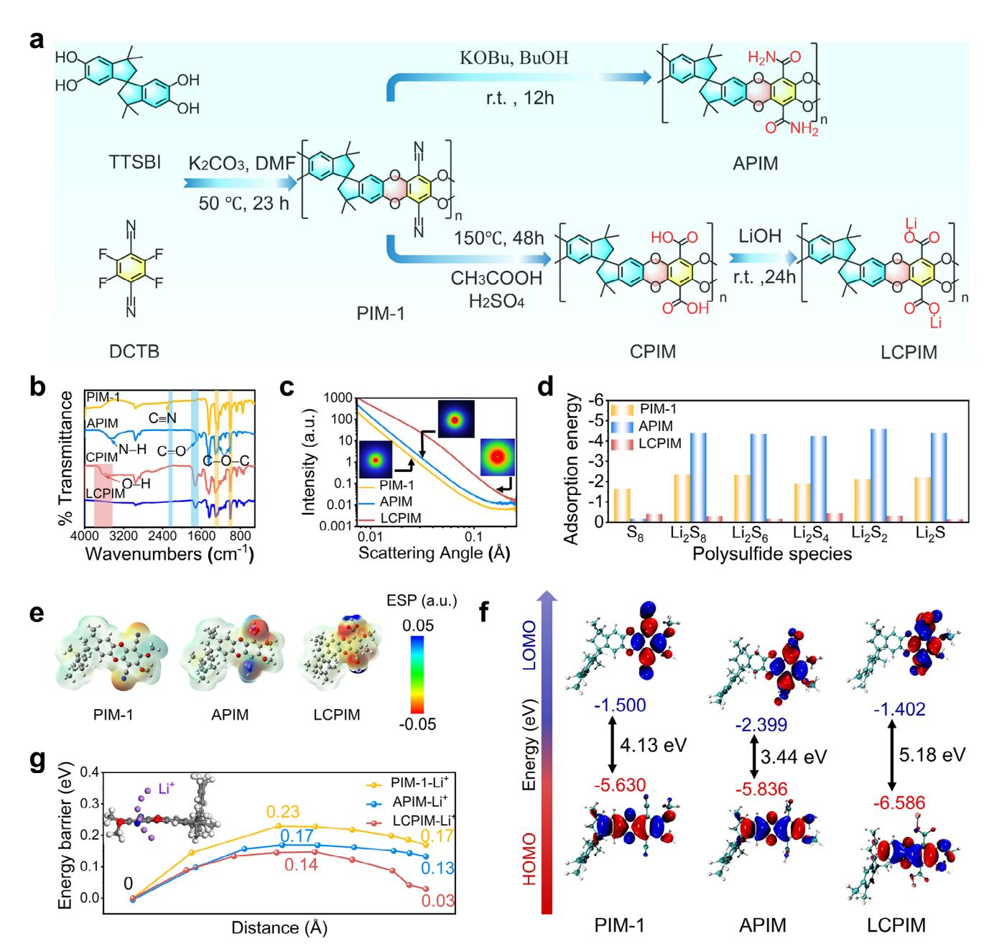
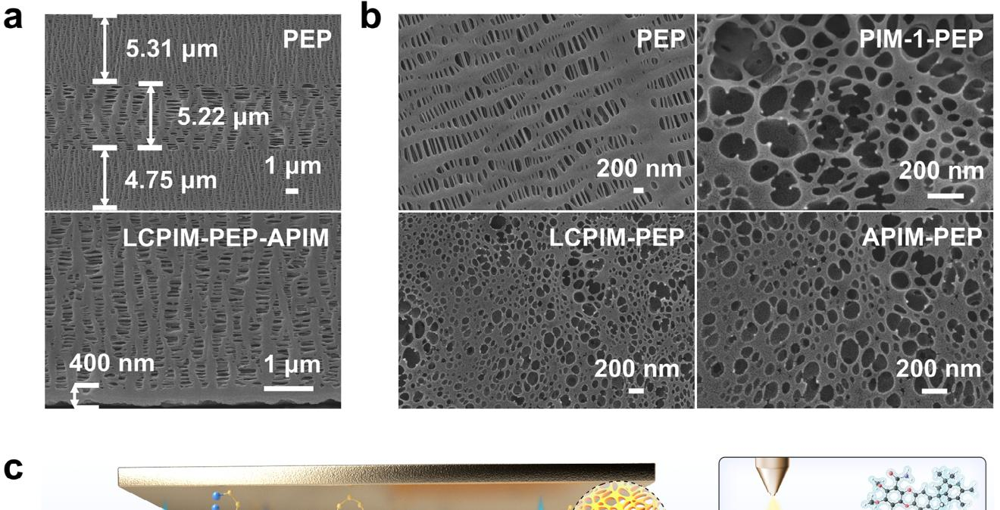
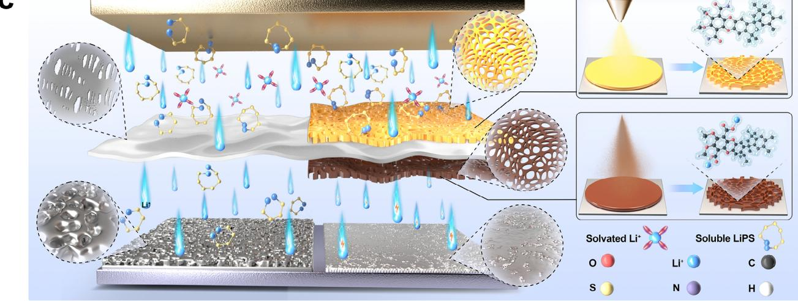
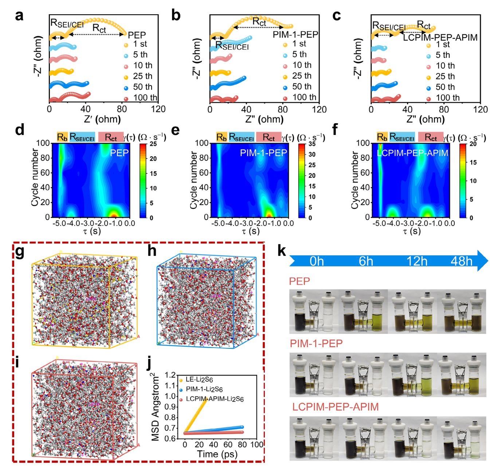
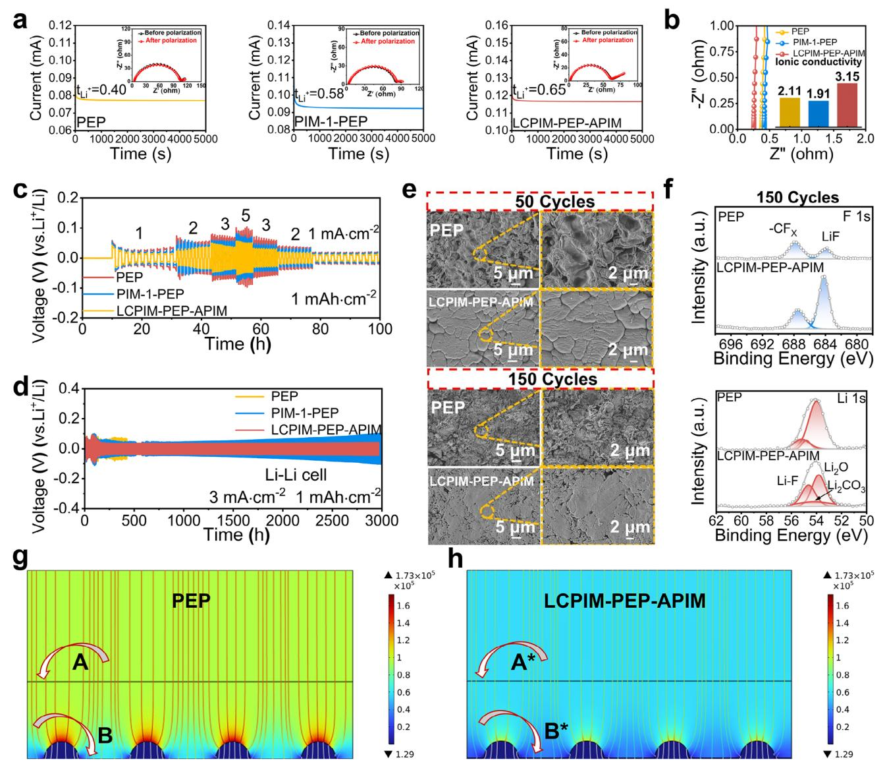
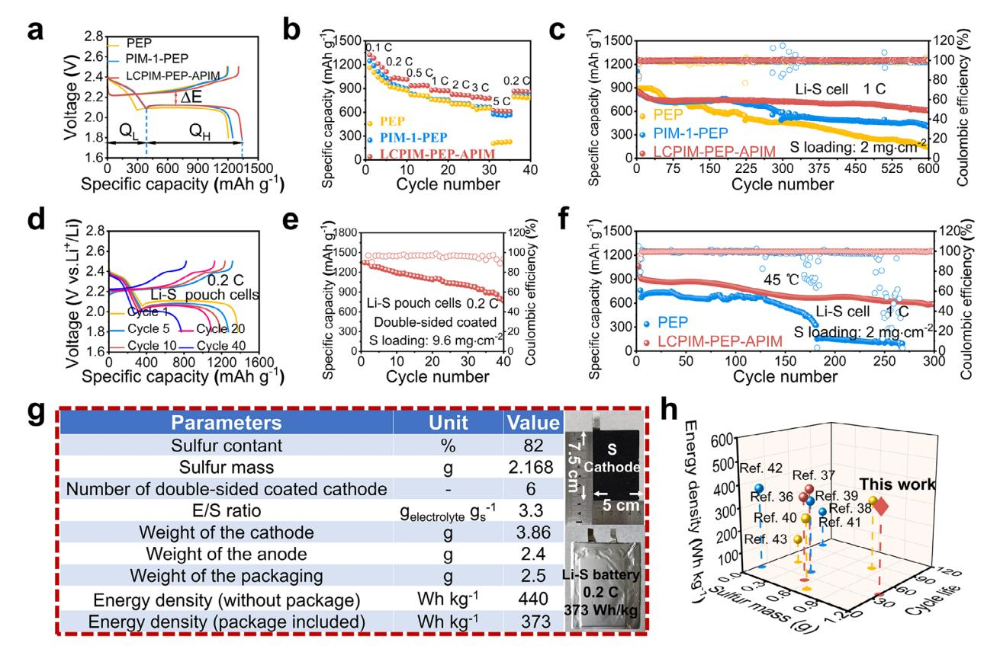

# **Spatially Engineered Janus Separator Enables Bidirectional Regulation of Sulfur Electrochemistry and Lithium Deposition in High-Energy-Density Lithium–Sulfur Pouch Cells**

*Qingchen Wei, Luetao Wu, Yunzhen Ye, Xueying Xiao, Mengxian Pei, Jianhao Lu,\* Huilan Sun, Weikun Wang,\* and Bo Wang\**

**Lithium–sulfur (Li–S) batteries are promising candidates for energy storage applications. However, their practical implementation is impeded by significant challenges, including the polysulfide shuttle and the pulverization of the lithium anode. Herein, this study presents an interfacial engineering through the development of a bifunctional separator based on polymer of intrinsic microporosity (PIM-1). On the cathode side, the aminated PIM-1 framework (APIM) establishes a dual physical–chemical regulation mechanism. Its rigid nanoporous structure facilitates the sieving of polysulfides through size exclusion, while the functionalized surface induces electrostatic repulsion and chemisorption to suppress polysulfide shuttling.This configuration simultaneously ensures unobstructed Li+ transport. At the anode interface, the lithium hydroxycarboxylate PIM-1 (LCPIM) optimizes the Li+ flux by refining the microporous architecture, enhancing Li+ binding-desorption, and homogenizing ion migration pathways. This dual-functional architecture addresses the challenges of active material shuttling and interfacial degradation of anodes by simultaneously regulating ion flux and stabilizing dual electrodes. This approach achieves a Coulombic efficiency exceeding 99.7% and maintains capacity retention over 600 cycles. Janus separators demonstrate viability in 3 Ah pouch cells (9.6 mg cm−2 sulfur loading, double-sided, Electrolyte/Sulfur = 3.3), achieving 373 Wh kg−1 energy density at 0.2 C and demonstrating stable operation over 40 cycles.**

Q. Wei, M. Pei, H. Sun, B. Wang Hebei Key Laboratory of Flexible Functional Materials School of Materials Science and Engineering Hebei University of Science and Technology Hebei 050018, China E-mail: [wangbo1996@gmail.com](mailto:wangbo1996@gmail.com) Q. Wei, L. Wu, Y. Ye, X. Xiao, M. Pei, J. Lu, W. Wang Chemical Defense Institute Beijing 100191, P. R. China E-mail: [hahalujianhao@163.com;](mailto:hahalujianhao@163.com)[wangweikun2002@163.com](mailto:wangweikun2002@163.com)

The ORCID identification number(s) for the author(s) of this article can be found under <https://doi.org/10.1002/adfm.202521571>

**DOI: 10.1002/adfm.202521571**

### **1. Introduction**

Lithium–sulfur (Li–S) batteries have attracted considerable interest as prospective next-generation energy storage systems, primarily due to their remarkable theoretical energy density (≈2600 Wh kg−1) and cost-effectiveness, which is attributed to the natural abundance of sulfur.[\[1,2\]](#page-8-0) Nonetheless, several challenges persist, including the dissolution and migrationinduced shuttle effects of lithium polysulfides (LiPSs), insufficient lithium ion (Li+) transport kinetics and spatially heterogeneous Li+ flux at electrode interfaces, which collectively compromise cycle stability, Coulombic efficiency, and safety.[\[3–5\]](#page-8-0) These limitations manifest through lithium dendrite growth exacerbated by polarization phenomena, and rapid capacity fading.[\[6\]](#page-8-0) Although significant efforts have been directed towards optimizing sulfur host matrices and electrolyte compositions, the critical role of separators in addressing these interconnected challenges remains insufficiently explored, despite increasing recognition of their importance.[\[7–10\]](#page-8-0) Conventional polyolefin separators exhibit fundamental shortcomings, their micrometersized pores allow unrestricted diffusion of

LiPSs due to inadequate chemical anchoring capability, while their terrible Li+ transport leads to concentration polarization and uneven lithium deposition.[\[11–13\]](#page-8-0) This dual challenge underscores the necessity for advanced separator engineering that effectively combines molecular-scale confinement of LiPSs with controlled modulation of Li+ flux.[\[14,15\]](#page-8-0)

The rapid advancement in the functionalization of porous materials has revealed transformative opportunities for the development of battery separators through precise control over pore topology, surface functionality, and ionic transport pathways.[\[16,17\]](#page-8-0) While MOF/COF-based membranes effectively regulate polysulfide shuttling, their long-term cycling stability in Li–S batteries is critically limited by chemical degradation (MOF ligand displacement, COF imine hydrolysis) and

mechanical fragility under electrode swelling, leading to structural collapse, sieving failure, and interfacial resistance.[\[18–21\]](#page-8-0) In contrast, alternative graphene oxide derivatives offer enhanced chemical robustness and scalability in manufacturing. However, their stochastic pore architecture and polydisperse channels result in unpredictable Li+ flux gradients and suboptimal polysulfide sieving efficiency.[\[22–24\]](#page-8-0) This structural ambiguity not only obscures fundamental correlations between structure and properties correlations but also introduces performance variations across different batches of assembled batteries, thereby impeding practical implementation. The emerging paradigm of processable intrinsically microporous polymers (PIMs) offers a compelling solution to these challenges by combining solution-processability with precisely tunable ultramicroporous architectures.[\[25,26\]](#page-8-0) The molecular-level design flexibility of PIMs enables the simultaneous optimization of polysulfide-blocking efficacy and lithium-ion conduction while maintaining exceptional mechanical compliance.[\[27–33\]](#page-8-0) This unique combination positions PIM-based functional coatings as a transformative platform for next-generation separators in high-energy-density Li–S batteries. It offers unprecedented opportunities for rational ionregulation and durable battery operation through the molecular engineering of pore chemistry and transport pathways.

Porous intrinsic microporous (PIMs) materials exhibit significant potential as functional coatings for lithium–sulfur battery separators by effectively mitigating polysulfide shuttling through a combination of mechanisms. The precisely defined microporous structure (*<*2 nm) of these materials facilitate the selective physical sieving of soluble polysulfides while ensuring adequate Li+ ion flux, thereby effectively reducing capacity degradation associated with shuttle effects.[\[34,35\]](#page-8-0) Moreover, the incorporation of polar functional groups within the rigid polymer frameworks of PIM-1 further enhances their chemisorption capabilities through robust Lewis acid–base interactions with polysulfide intermediates. The interconnected ion-conducting channels within these materials notably enhance the kinetics of Li+ transport, thereby enabling stable operation even at elevated current densities.

In this study, we introduce a Janus-structured functional separator developed through the spatially differentiated modification of PIM-1. This novel design employs a comprehensive mass-transport regulation strategy throughout the entire battery system. On the cathode side, the amide-functionalized PIM-1 (APIM) layer effectively reconstructs the interfacial reaction microenvironment. It achieves robust dual-mechanism polysulfide confinement by integrating intrinsic ultramicropores (*<*2 nm) within the rigid polymer framework for physical size exclusion with electrostatic repulsion and chemisorption provided by its polarized amide groups (─CONH2), thereby significantly mitigating the shuttle effect. In contrast, the anode-facing lithiated carboxylate-modified PIM-1 (LCPIM, ─COOLi) layer functions as a lithiophilic ion-transport relay. It enhances the uniformity and kinetics of Li+ flux through highly uniform lithiophilic nanochannels and actively modulates the Li+ coordination environment via a Li+-enriching coordination effect, promoting highly reversible Li plating and stripping. This dual-interface engineering enables a high Li+ transference number (*t*Li+ = 0.65) and exceptional cyclability, evidenced by a Coulombic efficiency exceeding 99.7% and capacity retention over 600 cycles. Practical validation using industrial-relevant pouch cell configuration under demanding conditions (high S loading: 9.6 mg cm−2, double-sided coated, lean electrolyte: E/S = 3.3 g g−1) delivers a remarkable energy density of 373 Wh kg−1 at 0.2 C and demonstrates stable operation over 40 cycles.

# **2. Results and Discussion**

PIM-1 synthesis involves solvent-mediated TTSBI/DCTB polycondensation under N2; its amidation (APIM) employs KOtBu in tert-butanol, while lithium carboxylate-functionalized (LCPIM) fabrication utilizes acid hydrolysis followed by Li+ exchange. These scalable processes yield functional microporous polymers with preserved porosity and tailored ion-conductivity for membrane applications. **Figure 1**[a](#page-2-0) illustrates the synthesized PIMs, specifically PIM-1, APIM, and LCPIM. Fourier transform infrared (FT-IR) spectroscopy is utilized to investigate the structural variations within the polymer series, shown in Figure [1b.](#page-2-0) PIM-1 exhibits a characteristic nitrile stretch (2240 cm−1). APIM confirms amidation via new carbonyl stretch (1698 cm−1) and N─H vibrations (3000–3700 cm−1). Complete cyanide-to-carboxyl conversion in carboxylate-functionalized (CPIM) is evidenced by C≡N disappearance concomitant with broad O─H stretching (2500–3300 cm−1) and enhanced C═O signal. Lithiation eliminates O─H modes while generating carboxylate asymmetric/symmetric stretches (1600 cm−1/1450 cm−1), verifying COO-Li+ complex formation in LCPIM. Simultaneously, the X-ray photoelectron spectroscopy (XPS) survey spectra (Figure S1, Supporting Information) elucidates the progressive structural evolution among the modified PIM-1 derivatives. In addition, revealed by comparative 1H NMR spectroscopy (Figure S2, Supporting Information), APIM's distinct downfield shift and line broadening (7.5–8.5 ppm) confirms intrachain H-bond formation versus PIM-1, enhancing polysulfide sieving precision through rigidified pore architecture. Concurrently, CPIM's diagnostic carboxylic acid singlet (13.79 ppm) and its quantitative disappearance in LCPIM verify complete conversion to COO-Li+ moieties, establishing continuous lithium-ion conduction highways.

To further characterize the porous structure of as-prepared APIM and LCPIM, Brunauer-Emmett-Teller (BET) analysis (Figure S3, Supporting Information) is conducted. The results indicate that, due to swelling of the polymer matrix, the desorption branches of these three polymers don't close to the adsorption branch, resulting in hysteresis loops. The results also show that the BET surface area of APIM and LCPIM decrease to approximately 542 and 479 m2 g−1, respectively, compared to 758 m2 g−1 for pristine PIM-1. Despite this reduction, the modified materials retain sufficient pore structure, characterized by an average pore size in the mesoporous range (2–5 nm), to maintain interconnected mesopores, which are crucial for mass transport. The liquid crystal-like diffraction signatures observed in the smallangle X-ray scattering (SAXS) (centered in the *q* range of 0.1–1 nm−1) (Figure [1c\)](#page-2-0) reveal nanoscale ordered structures induced by intermolecular – stacking and potential coordination interactions within the material, providing complementary verification to the micro-mesoporous hierarchical architectures characterized by BET. The power-law decay of scattering intensity I(q) versus scattering vector q in the LCPIM confirms the existence of larger structural motifs constructed through coordinated nodes. In contrast, the pronounced decay profile of APIM is indicative of

**Figure 1.** a) Schematic illustration for the preparation of PIM-1, APIM, and LCPIM. b) FTIR spectra of PIM-1, APIM, CPIM, and LCPIM. c) SAXS patterns of PIM-1, APIM and LCPIM. The insert images represent the 2D-SAXS patterns. d) Adsorption energy of PIM-1, APIM, and LCPIM with S8 and LiPSs. e) Electrostatic potential distributions of PIM-1, APIM, and LCPIM. f) The lowest unoccupied molecular orbital (LUMO) and the highest occupied molecular orbital (HOMO) of PIM-1, APIM, and LCPIM. g) Li+ migration barriers on PIM-1, APIM, and LCPIM (inset shows the Li+ transport pathways).

a more homogeneous microporous-dominated structure, which is directly associated with the steric hindrance effects of amino groups and the hydrogen bond-mediated rearrangement of chain within its molecular framework. This is dynamic chemisorption with polysulfide S─S \* orbitals within intrinsic ultramicropores (*<*2 nm) of the rigid polymer framework, which synergistically suppressing shuttle effects while preserving Li+ mobility.

Density functional theory (DFT) calculations analyze the electrostatic potential (ESP) and electronic structures of PIM-1, APIM, and LCPIM, respectively (Figure 1e). The amide group (─CONH2) in APIM generates localized regions of significantly enhanced negative electrostatic potential. This electronic feature synergistically integrates with its intrinsic ultramicropores to comprehensively establish the physical-electrostatic confinement mechanism. Specifically, this pronounced negative potential exerts a strong electrostatic repulsion towards the negatively charged polysulfide anions (Sx 2−), effectively suppressing the shuttle effect. This negative potential originates from the lone pair electrons on the amide nitrogen atom, establishing Lewis basic sites. These Lewis basic sites also form strong

**Figure 2.** a) The cross-section and b) surface SEM images of PEP and LCPIM-PEP-APIM separators. c) Preparation of the LCPIM-PEP-APIM separator, and the function of LCPIM-PEP-APIM in Li–S cells.

coordination interactions with the Lewis acidic Li+ centers within polysulfides (e.g., Li2S8, Li2S6), facilitating chemisorption. APIM's significantly higher absolute adsorption energy for polysulfides compared to PIM-1 (Figure [1d\)](#page-2-0) directly confirms this enhanced chemisorption, explaining its superior shuttle suppression and the observed improvements in Coulombic efficiency and self-discharge inhibition.

Regarding electronic structures, APIM exhibits the narrowest HOMO–LUMO gap among the polymers, compared to PIM-1 and LCPIM (Figure [1f\)](#page-2-0). This reduced gap for APIM suggests a potentially lower energy barrier for electron transfer processes relevant to the electrochemical conversion of trapped polysulfides within its pores. Conversely, LCPIM's wider gap indicates enhanced electronic stability relative to PIM-1. Meanwhile, the lithium hydroxycarboxylate group (COO-Li+) in LCPIM generates localized positive electrostatic potential around the Li+. The sp2-hybridized oxygen atoms in the carboxylate provide an optimal geometric and electronic environment for Li+ coordination. Crucially, DFT calculations reveal that LCPIM possesses a significantly lower Li+ migration energy barrier (0.14 eV) compared to PIM-1 (0.23 eV) (Figure [1g\)](#page-2-0). This reduced barrier facilitates faster Li+ transport, critically enhancing the Li+ transference number and promoting more uniform lithium deposition. The strong Li+ coordination in LCPIM also helps modulate the Li+ solvation sheath at the anode interface, contributing to a more reversible lithium metal electrode.

Scanning electron microscopy (SEM) (Figure S4, Supporting Information) shows the morphology of the APIM and LCPIM. Additionally, SEM images (**Figure 2**a) reveal that the LCPIM-PEP-APIM and PIM-1-PEP separators exhibit a significantly refined microporous architecture with reduced average pore size, in stark contrast to the relatively porous framework observed in the PEP separator. The thicknesses of the LCPIM-PEP-APIM and PIM-1-PEP composite separators are precisely controlled to 400 nm (Figure [2b\)](#page-3-0). Concurrently, the areal loadings of both separators are optimized to 0.11 mg cm−2 and 0.05 mg cm−2, respectively. (Table S1, Supporting Information).

Universal testing machine (UTM) measurements demonstrate the moderate flexibility of LCPIM-PEP-APIM separator (20% lower elastic modulus vs PEP) and folding endurance (Figure S5, Supporting Information). Simultaneously, its elevated thermal decomposition onset (thermogravimetric analysis (TGA), Figure S6, Supporting Information) safeguards against thermal failure. Specifically, TGA profile indicates that both separators begin decomposition at 300 °C, with PEP retaining 85% mass at 415 °C versus nearly intact mass retention for LCPIM-PEP-APIM. The subsequent accelerated mass loss beyond 415 °C, attributed to backbone scission of PIM derivatives, occurs at a slower rate in the Janus separator. These synergistic mechanical and thermal properties enhance structural stability to preserve the critical pore structure necessary for sustained ion transport. Furthermore, The wettability of different separators with the electrolyte is verified by using Contact angle (CA) measurements (Figure S7, Supporting Information). The CA of the separatorpositive side and separator-negative side for the LCPIM-PEP-APIM with the electrolyte are 2.73° and 4.88° respectively, significantly lower than those of the PIM-1-PEP (8.59°) and PEP (11.67°) separators. This indicates that the LCPIM and APIM coatings enhance electrolyte adsorption on the modified separator, thereby facilitating ion transport conveniently and ensuring the stable operation of the Li–S batteries.

Dynamic resistance transfer (DRT) analysis quantitatively tracks impedance evolution in PEP, PIM-1-PEP, and LCPIM-PEP-APIM separators over 1–100 cycles (**Figure 3**[a–f\)](#page-5-0). PEP separators exhibit progressively increasing impedance due to continuous accumulation of insulative Li2Sx deposits and unstable electrode–electrolyte interfaces, indicating severe interfacial degradation. PIM-1-PEP demonstrates stabilized impedance profiles, confirming effective polysulfide blocking by the microporous coating. Significantly, LCPIM-PEP-APIM maintains ultralow impedance throughout cycling, attributable to its dual-functional design. APIM combines rigid sub-2 nm ultramicropores with polarized amide groups (─CONH2) for dynamically suppressing polysulfide shuttling. This immobilization facilitates in situ re-oxidation of confined polysulfides during charging instead of irreversible Li2S/Li2S2 precipitation at the cathode, sustaining electrochemical activity with minimal charge-transfer resistance. Concurrently, carboxylate-functionalized LCPIM (─COOLi+) establishes lithiophilic nanochannels that reduce Li+ migration barriers while homogenizing ion flux and electric fields distribution at the anode. This synergistic design ensures exceptional interfacial stability and rapid charge-transfer kinetics, enhancing cycling performance.

Cyclic voltammetry (CV) curves of Li–S batteries modified by different separators are compared at a scan rate of 0.1 mV s−1 (Figure S8, Supporting Information). The peak intensity of the battery using the LCPIM-PEP-APIM separator is enhanced, which further indicates that the kinetics and reversibility of the sulfur redox reactions have been improved. Specifically, the cathodic peak near 2.3 V corresponds to the reduction of S8 to soluble long-chain lithium polysulfides (Li2Sx, 4 ≤ *x* ≤ 8), while the subsequent cathodic peak around 1.9 V represents further reduction to insoluble Li2S2/Li2S. The anodic peak at approximately 2.5 V signifies the oxidation of Li2S2/Li2S back to polysulfides and S8. The APIM layer's dual sieving mechanism confines polysulfides, minimizing shuttle-induced losses and sharpening reduction peaks. Simultaneously, the LCPIM layer optimizes Li+ flux uniformity and kinetics, reducing anode polarization and facilitating efficient delithiation, as evidenced by the increased peak currents and well-defined oxidation peak.

Molecular dynamics (MD) simulations are performed on three systems: liquid electrolyte, PIM-1+liquid electrolyte, and LCPIM-APIM+liquid electrolyte, shown in Figure [3g–i.](#page-5-0) Mean squared displacements (MSDs) of Li2S6 (Figure [3j\)](#page-5-0) confirm Fickian diffusion in all systems through time-linear MSD evolution, with slopes quantitatively defining ionic diffusivity coefficients. LCPIM-APIM exhibits the lowest polysulfide diffusivity versus neat electrolyte and PIM-1 systems. This selective retardation of large polysulfide anions while maintaining Li+ mobility directly suppresses shuttle effects. Polysulfide permeation experiments (Figure [3k\)](#page-5-0) further confirm these results: While the bare PEP separator shows severe polysulfide leakage within 6 h, the LCPIM-PEP-APIM separator maintains electrolyte transparency, demonstrating effective suppression of polysulfide shuttle. Additionally, Ultraviolet–visible spectroscopy (UV–Vis) adsorption analysis (Figure S9, Supporting Information) directly quantifies polysulfide uptake capacity, wherein APIM powder nearly abolishes the characteristic S6 2− peak at 425 nm in Li2S6 solution, confirming superior chemisorption via Lewis acid–base interactions compared to pristine PIM-1.

The dual-functional LCPIM-PEP-APIM exhibits a high transference number for lithium ions (*t*Li+ = 0.65), surpassing those of PEP (0.40) and PIM-1-PEP (0.58) (**Figure 4**[a\)](#page-6-0). This enhancement is facilitated by the anode-facing ─COOLi+ nanochannels, which create efficient ion-conduction pathways, achieving a conductivity of 3.15 mS cm−1, representing a significant increase compared to PEP (Figure [4b;](#page-6-0) Figure S10, Supporting Information). Concurrently, the cathode-facing APIM component sustains lithium ion permeability while effectively blocking anions. Ion transport behavior directly translates to exceptional electrode stability. Li||Li symmetric cells equipped with the Janus separator demonstrate consistently low polarization voltages of 30 mV over a duration of 3000 h at a current density of 3 mA cm−2 (Figure [4c\)](#page-6-0). This performance surpasses that of both PIM-1-PEP and PEP, which exhibit polarization voltages of 43 and 65 mV, respectively. Furthermore, even at an elevated current density of 5 mA cm−2, the Janus separator maintains stable lithium plating/stripping profiles (Figure [4d\)](#page-6-0), indicating its robustness against localized variations in Li+ flux. In addition, Li||Cu cells with the Janus separator achieve an average Coulombic efficiency (CE) of 99.89% over 200 cycles (Figure S11, Supporting Information), attributable to homogenized Li+ flux that effectively suppressed dendritic nucleation.

The analysis of Li||Li symmetric cells demonstrates that LCPIM-PEP-APIM facilitates dense, block-like lithium deposition, in contrast to the dendritic growth observed with PEP (Figure [4e\)](#page-6-0). This is attributed to the uniform lithium ion flux through lithiophilic ─COOLi+ nanochannels. XPS analysis confirms a LiF-dominated SEI for LCPIM-PEP-APIM (Figure [4f\)](#page-6-0), contrasting with the CFx-dominant interface in PEP. Critically, comparative XPS of cycled anodes reveals that protonated

**Figure 3.** Impedance spectra of Li–S cells with a) PEP, c) PIM-1-PEP, and e) LCPIM-PEP-APIM at different cycles, respectively. b,d,f) DRT data calculated from EIS. The molecular dynamics (MD) boxes at equilibrated configurations of g) liquid, h) PIM-1+liquid, and i) LCPIM-APIM+liquid electrolyte. j) Calculated mean square displacements (MSDs) of Li2S6 carriers in liquid, PIM-1+liquid, and LCPIM-APIM+liquid electrolyte. k) Dynamically visual discrimination using an H-type glass cell with PEP, PIM-1-PEP, and LCPIM-PEP-APIM separators.

precursor (CPIM-PEP-APIM) exhibits CFx-rich species (Figure S12, Supporting Information). These contrasts arise from the catalytic function of lithiated carboxylate groups (─COO─Li+) in LCPIM. Nucleophilic oxygen atoms attack electrophilic C─F bonds in LiTFSI, selectively cleaving C─F bonds over S─N bonds to release F− for LiF formation. Protonated carboxylic groups (─COOH) in CPIM and PEP lack this catalytic capability. Consequently, the LiF-rich SEI enables low Li+ diffusion barriers and dendrite growth. Additionally, simulations and calculations reveal LCPIM-PEP-APIM enables homogeneous electric field distribution at Li anodes (*t* = 0.5 h quasi-steady state, Figure [4g,h;](#page-6-0) Figure S13, Supporting Information), achieving more uniform Li+ flux versus PEP.

The galvanostatic charge–discharge curves of Li–S cell with different separators at 0.1 C is shown in **Figure 5**[a.](#page-7-0) The battery with LCPIM-PEP-APIM exhibits the lowest polarization potential (132 mV) and the highest initial discharge capacity (1337 mA h g−1) compared to PIM-1-PEP (1247 mA h g−1) and PEP (1204 mA h g−1). At the same time, the battery with LCPIM-PEP-APIM exhibits a higher *Q*L/*Q*H ratio (0.41 vs 0.25 for PEP). The rate

**Figure 4.** Performance comparison of different separators: a) lithium-ion transference number, b) ion conductivity, c) rate performance of the symmetric cells at a capacity of 1 mA h cm−2, and d) voltage profiles in Li||Li symmetric cells at 3 mA cm−2 with a capacity of 1 mA h cm−2. e) SEM images of lithium deposition after 50 and 150 cycles of Li||Li symmetric cells with two separators. f) F 1 s and Li 1 s XPS spectra of lithium surfaces using PEP and LCPIM-PEP-APIM separator after cycling treatment. Simulations of electric field distribution on Li anode assembled with g) PEP and h) LCPIM-PEP-APIM separators.

capabilities of the batteries based on different separators are further evaluated at various current densities (Figure [5b\)](#page-7-0). Under the protection of the LCPIM and APIM layers, the Li–S cell delivers specific capacities of 1323, 1020, 936, 878, 826, 787 and 623 mA h g−1 at current densities of 0.1, 0.2, 0.5, 1, 2, 3 and 5 C, respectively. Furthermore, when the current density is stepped back to 0.2 C, a high specific capacity of 865 mA h g−1 is recovered.

As shown in Figure S14 (Supporting Information), the Li─S cell with the LCPIM-PEP-APIM separator delivers an initial capacity of 1337 mA h g−1 at 0.1 C and exhibits an average capacity decay rate of 0.15% per cycle over 320 cycles. In contrast, the bare PEP cell exhibits an initial capacity of 1204 mA h g−1, which decreases to only 430 mA h g−1 under the same working conditions. The initial Coulombic efficiency (CE) at 1.0 C is low due to SEI formation and incomplete sulfur cathode activation, but it quickly stabilizes above 99.7% within 2–5 cycles due to the Janus separator's regulation. As a result, the cell with the LCPIM-PEP-APIM separator retains 58% capacity after 600 cycles at 1.0 C (Figure [5c\)](#page-7-0).

Furthermore, After 100 cycles at 1.0 C, the LCPIM-PEP-APIM separator maintains its structural integrity. SEM images (Figure S15a,b, Supporting Information) reveal that the microporous structure remains intact, showing resilience to electrode volume changes. While partial polysulfide accumulation is observed on the separator surface (Figure S15c, Supporting Information), FT-IR analysis (Figure S16, Supporting Information) shows no functional group degradation. These findings confirm the separator's

**Figure 5.** a) Charge–discharge curves of Li–S cells with three separators at 0.1 C for 1 cycle. b) Rate performance of Li–S cells. c) Cycle performance of Li–S cells at 1 C. d) Charge–discharge curves for pouch cells with 1, 5, 10, 30 and 60 cycles. e) Cycle performance of Li–S pouch cell at 0.2 C. f) Cycle performance of Li–S cells at 1 C and 45 °C. g) Relevant parameters and assembly drawing of pouch cells. h) Comparison of recently reported electrochemical performance of Li–S pouch cells.

chemical and structural stability, ensuring effective interfacial regulation. Additionally, S 2p XPS analysis (Figure S17, Supporting Information) verifies the Janus separator's dual functionality, with the APIM layer retaining Li2S2/Li2S and long-chain polysulfides through exclusion and chemisorption. The LCPIM anode layer shows minimal polysulfide signals, indicating reduced shuttling, while PEP separators display notable sulfur accumulation on both sides, highlighting the Janus architecture's effectiveness in preventing interfacial degradation.

To further demonstrate the potential of LCPIM-PEP-APIM separator for practical application, the corresponding pouch Li–S batteries are assembled for electrochemical performance tests. The details of the pouch cell are shown in Figure 5g. Figure 5d shows the charge/discharge curves of the Li|LCPIM-PEP-APIM|S battery, which exhibits a consistently stable charge/discharging platform with minimal polarization despite the increased sulfur loading. At 0.2 C, 3 Ah pouch cell with a higher sulfur loads of 9.6 mg cm−2 and E/S = 3.3 g g−1 exhibits initial specific capacities of 1343 mA h g−1, maintaining 57% capacity retention after 40 charge/discharge cycles (Figure 5e). Moreover, the Li|LCPIM-PEP-APIM|S battery demonstrates superior high-temperature (45 °C) cycling stability, retaining 587 mA h g−1 after 300 cycles at 1 C (Figure 5f). A comparison with previously reported studies demonstrates exceptional electrochemical performance, characterized by high sulfur loading and extended cycle stability, as illustrated in Figure 5h. [\[36–43\]](#page-8-0)

This study demonstrates the establishment of bidirectional ion management in lithium–sulfur (Li–S) batteries through the strategic design of a Janus separator, which incorporates pore engineering and targeted functionalization. The interface facing the cathode is designed with size-sieving ultramicropores, electrostatic repulsion and chemisorption to effectively mitigate polysulfide shuttling. In contrast, the interface facing the anode is engineered with lithiophilic ion pathways and solvation sheath modulation to suppress dendrite growth. This spatially resolved and synergistic architecture addresses the fundamental interfacial challenges at both electrodes within a single, scalable platform. The Janus separator's performance is supported by comprehensive multiscale characterization and is based on polymer modification techniques that are readily scalable. It exhibits exceptional performance metrics, including cyclability exceeding 600 cycles, high-rate capability, and validated practical viability with an energy density of 373 Wh kg−1 in lean-electrolyte pouch cells.

#### **3. Conclusion**

In summary, we demonstrate a Janus separator with spatially resolved functionalities that fundamentally reconciles SCIENCE NEWS

polysulfide shuttling and lithium dendrite growth in Li-S batteries. The cathode-facing amide-functionalized PIM-1 layer achieves selective ion sieving through size-exclusion ultramicropores coupled with chemical surface, enabling highly efficient polysulfide retention while ensuring exceptional Li+ transport ( $t_{1,i+}$  = 0.65). Simultaneously, the lithium carboxylate-modified PIM-1 coating homogenizes Li+ flux via lithium-philic nanochannels and conduction behavior restructuring, yielding uniform dendrite plating over 3000 h. Practical pouch cells deliver 373 Wh  $kg^{-1}$  energy density under industrial-relevant parameters (9.6 mg  $\text{cm}^{-2}$  sulfur, double-sided, lean electrolyte), demonstrating stable operation over 40 cycles at 0.2 C. Thus, these findings underscore the significant potential of molecularly tailored, spatially differentiated separator design as a foundational strategy for advancing next-generation, high-energy-density battery systems.

#### **Supporting Information**

Supporting Information is available from the Wiley Online Library or from the author

#### **Acknowledgements**

This work was supported by the National Natural Science Foundation of China (52002111, 22008053 and U21A2083), the Natural Science Foundation of Hebei Province (E2024208087), Science Foundation of University of Hebei Province (JZX2024025).

#### **Conflict of Interest**

The authors declare no conflict of interest.

#### **Data Availability Statement**

The data that support the findings of this study are available from the corresponding author upon reasonable request.

## **Keywords**

bifunctional separator coatings, lithium-sulfur batteries, mass transport regulation, polymers of intrinsic microporosity (PIMs)

> Received: August 19, 2025 Published online:

- [1] X. Liang, C. Hart, Q. Pang, A. Garsuch, T. Weiss, L. F. Nazar, Nat. Commun. 2015, 6, 5682.
- [2] Z. W. Seh, Y. Sun, Q. Zhang, Y. Cui, Chem. Soc. Rev. 2016, 45, 5605.
- [3] H. J. Peng, J. Q. Huang, X. B. Cheng, Q. Zhang, Adv. Energy Mater.
- 2017, 7, 1700260. [4] W. Yao, K. Liao, T. Lai, H. Sul, A. Manthiram, Chem. Rev. 2024, 124, 4935.
- [5] Y. X. Yin, S. Xin, Y. G. Guo, L. J. Wan, Angew. Chem., Int. Ed. 2013, 52, 13186.
- [6] G. Li, S. Wang, Y. Zhang, M. Li, Z. Chen, J. Lu, Adv. Mater. 2018, 30, 1705590.

- [7] Y. Liu, Y. An, C. Fang, Y. Ye, Y. An, M. He, Y. Jia, X. Hong, Y. Liu, S. Gao, Nat. Chem. 2025, 17, 614.
- [8] H. Pan, Z. Cheng, Z. Zhou, S. Xie, W. Zhang, N. Han, W. Guo, J. Fransaer, J. Luo, A. Cabot, Nano-Micro Lett. 2023, 15, 165.
- [9] L.-L. Su, M.-X. Wu, S.-Y. Sun, C.-X. Bi, Z. Zheng, M. Zhao, B.-Q. Li, X.-Q. Zhang, J.-Q. Huang, ACS Energy Lett. 2024, 10, 313.
- [10] Y. Zhou, D. Chen, X. Ren, Y. Hu, W. Chen, C. Yan, T. Lei, Adv. Energy Mater. 2025, 15, 2500061.
- [11] Y. Cao, H. Wu, G. Li, C. Liu, L. Cao, Y. Zhang, W. Bao, H. Wang, Y. Yao, S. Liu, Nano Lett. 2021, 21, 2997.
- [12] M. Chen, M. Shao, J. Jin, L. Cui, H. Tu, X. Fu, Energy Storage Mater. 2022. 47. 629.
- [13] M. Waqas, Y. Niu, M. Tang, Y. Pang, S. Ali, Y. Dong, W. Lv, W. He, Energy Storage Mater. 2024, 72, 103682.
- B. Liu, H. Gu, J. F. Torres, Z. Yin, A. Tricoli, Energy Environ. Sci. 2024,  $[14]$ 17, 1073.
- B. Liu, J. F. Torres, M. Taheri, P. Xiong, T. Lu, J. Zhu, Y. Liu, G. Yu, A.  $[15]$ Tricoli, Adv. Energy Mater. 2022, 12, 2103444.
- [16] L. Xiang, Q. Li, C. Li, Q. Yang, F. Xu, Y. Mai, Adv. Mater. 2023, 35, 2207684.
- [17] J. Yang, B. Wang, X. Feng, Acc. Chem. Res. 2025, 58, 5145.
- [18] S. Bai, X. Liu, K. Zhu, S. Wu, H. Zhou, Nat. Energy 2016, 1, 16094.
- [19] B. Liu, M. Taheri, J. F. Torres, Z. Fusco, T. Lu, Y. Liu, T. Tsuzuki, G. Yu, A. Tricoli, ACS Nano 2020, 14, 13852.
- [20] C.-L. Song, Z.-H. Li, L.-Y. Ma, M.-Z. Li, S. Huang, X.-J. Hong, Y.-P. Cai, Y.-Q. Lan, ACS Nano 2021, 15, 13436.
- [21] K. Zhang, X. Li, L. Ma, F. Chen, Z. Chen, Y. Yuan, Y. Zhao, J. Yang, J. Liu, K. Xie, K. P. Loh, ACS Nano 2023, 17, 2901.
- [22] F. Ma, K. Srinivas, X. Zhang, Z. Zhang, Y. Wu, D. Liu, W. Zhang, Q. Wu, Y. Chen, Adv. Funct. Mater. 2022, 32, 2206113.
- [23] Y. Qiu, W. Li, W. Zhao, G. Li, Y. Hou, M. Liu, L. Zhou, F. Ye, H. Li, Z. Wei, Nano Lett. 2014, 14, 4821.
- [24] J. Song, Z. Yu, M. L. Gordin, D. Wang, Nano Lett. 2016, 16, 864.
- [25] M. J. Baran, M. E. Carrington, S. Sahu, A. Baskin, J. Song, M. A. Baird, K. S. Han, K. T. Mueller, S. J. Teat, S. M. Meckler, Nature 2021, 592,  $225$
- [26] S. Gao, Z. Li, N. Liu, G. Liu, H. Yang, P. F. Cao, *Adv. Funct. Mater.* **2022**, 32, 2202013.
- [27] S. E. Doris, A. L. Ward, P. D. Frischmann, L. Li, B. A. Helms, J. Mater. Chem. A 2016, 4, 16946.
- [28] Y. Ji, K. Yang, M. Liu, S. Chen, X. Liu, B. Yang, Z. Wang, W. Huang, Z. Song, S. Xue, Adv. Funct. Mater. 2021, 31, 2104830.
- [29] C. Li, A. L. Ward, S. E. Doris, T. A. Pascal, D. Prendergast, B. A. Helms, Nano Lett. 2015, 15, 5724.
- [30] M. Mahato, S. Nam, M. J. Lee, N. Koratkar, I. K. Oh, Small 2023, 19, 2301847.
- [31] S. Sun, C. Li, M. Li, G. Gu, Y. Yang, Z. Zhang, *Polymer* **2022**, *239*, 124439.
- [32] Y. Yang, Y. Song, G. Xu, A. Wang, H. Liang, L. Wang, C. Wang, J. Wang, X. He, ACS Appl. Mater. Interfaces **2024**, 16, 38531.
- [33] X. Yu, S. Feng, M. J. Boyer, M. Lee, R. C. Ferrier Jr, N. A. Lynd, G. S. Hwang, G. Wang, S. Swinnea, A. Manthiram, *Mater. Today Energy* 2018. 7. 98.
- [34] J. Guan, J. Du, Q. Sun, W. He, J. Ma, S. U. Hassan, J. Wu, H. Zhang, S. Zhang, J. Liu, Sci. Adv. 2025, 11, eads0583.
- [35] B. Qiu, Y. Gao, P. Gorgojo, X. Fan, Nano-Micro Lett. 2025, 17, 114.
- [36] Y. Fu, *Molecules* **2024**, *29*, 4968.
- [37] Y. Huang, M. Shaibani, M. J. Abedin, D. J. Mendoza, Z. Xu, T. D. Gamot, M. C. D. Cooray, M. Lin, G. Garnier, M. R. Hill, Adv. Energy Mater. 2022, 12, 2202474.
- [38] W. G. Lim, C. Y. Park, H. Jung, S. Kim, S. H. Kang, Y. G. Lee, Y. C. Jeong, S. B. Yang, K. Sohn, J. W. Han, *Adv. Mater.* **2022**, *35*, 2208999.
- $[39]$ L. Luo, J. Li, H. Yaghoobnejad Asl, A. Manthiram, ACS Energy Lett. 2020. 5. 1177.

- [40] L. Ni, J. Gu, X. Jiang, H. Xu, Z. Wu, Y. Wu, Y. Liu, J. Xie, Y. Wei, G. Diao, *Angew. Chem., Int. Ed.* **2023**, *62*, 202306528.
- [41] T. Shi, Y. Liao, J. Kong, H. Ji, T. Hou, Z. Huang, Y. Han, H. Xu, L. Yuan, Y. Huang, *Energy Storage Mater.* **2024**, *72*, 103744.
- [42] W. Sun, S. Liu, Y. Li, D. Wang, Q. Guo, X. Hong, K. Xie, Z. Ma, C. Zheng, S. Xiong, *Adv. Funct. Mater.* **2022**, *32*, 2205471.
- [43] L. Wang, S. Liu, J. Hu, X. Zhang, X. Li, G. Zhang, Y. Li, C. Zheng, X. Hong, H. Duan, *Nano Res.* **2021**, *14*, 1355.