# **Emerging Surface Engineering Methods for Lithium Metal Anodes: Critical Review Beyond Conventional SEI and Surface Coatings**

*Jaehyeong Bae,\* Keonwoo Choi, Jun Young Cheong, Seongcheol Ahn, Suha Cho, Sung Gap Im,\* and Il-Doo Kim\**

**For rechargeable lithium batteries with high energy density, lithium metal anode is an ideal candidate due to its high theoretical capacity (3860 mAh g−1) and low electrode potential (−3.04 V versus standard hydrogen electrode). Despite its promising characteristics, it faces formidable obstacles such as dendritic growth and poor formation of solid electrolyte interphase (SEI) layers. To overcome such obstacles, multifaceted unconventional surface engineering approaches are hypothesized, tested, and examined. In this review, in addition to the conventional SEI and surface coatings, the principles and recent progress of the unconventional surface engineering methods are summarized and assessed, based on the interfacial thermodynamics and factors governing the interface between the electrode and the electrolyte. It connects and provides the newest insight on material science, design methodologies, and fabrication techniques, which require significant attention. This review reveals the significance of unconventional methods in enhancing both electrochemical performance and safety of the next-generation lithium metal batteries, providing a comprehensive understanding of the current research landscape and roadmaps for future technological breakthroughs.**

Department of Chemical Engineering (Integrated Engineering Program) Kyung Hee University Yongin, Gyeonggi 17104, Republic of Korea E-mail: [jbae@khu.ac.kr](mailto:jbae@khu.ac.kr) K. Choi, S. G. Im Department of Chemical and Biomolecular Engineering Korea Advanced Institute of Science and Technology (KAIST) 291 Daehak-ro, Yuseong-gu, Daejeon 34141, Republic of Korea E-mail: [sgim@kaist.ac.kr](mailto:sgim@kaist.ac.kr) J. Y. Cheong James Watt School of Engineering University of Glasgow Glasgow G12 8QQ, UK S. Ahn, I.-D. Kim Department of Materials Science and Engineering Korea Advanced Institute of Science and Technology (KAIST) 291 Daehak-ro, Yuseong-gu, Daejeon 34141, Republic of Korea E-mail: [idkim@kaist.ac.kr](mailto:idkim@kaist.ac.kr) I.-D. Kim KAIST Institute for NanoCentury KAIST, 291 Daehak-ro, Yuseong-gu, Daejeon 34141, Republic of Korea

The ORCID identification number(s) for the author(s) of this article can be found under <https://doi.org/10.1002/adma.202501959>

#### **DOI: 10.1002/adma.202501959**

# **1. Introduction**

The global transition toward net-zero carbon neutrality, aiming to reduce dependence on the conventional petroleum industry and carbon dioxide emissions, has catalyzed the pursuit of advanced energy storage solutions.[\[1,2\]](#page-25-0) This transition is critical for replacing fossil fuel-powered vehicles with low carbon footprint technologies, necessitating the development of rechargeable batteries with high energy and power densities.[\[3\]](#page-25-0) Previously, lithium-ion batteries with a graphite anode, which have a theoretical capacity of 372 mAh g−1, dominated the market for electric cars and electronic devices.[\[4,5\]](#page-25-0) However, with the increasing demand for higher energy density in lithium-ion batteries, alternative anode candidates have been pursued and investigated (e.g., Li, Si).

With major advantages in theoretical specific capacity (3860 mAh g−1) ten times

larger than that of graphite and a low reduction potential (−3.04 V versus standard hydrogen electrode), lithium metal anodes are promising for advancing next-generation energy storage technologies.[\[6–8\]](#page-25-0) The concept of utilizing metallic lithium in rechargeable batteries dates back to the early 20th century, proposed by Gilbert N. Lewis.[\[9,10](#page-25-0)] Despite its potential, the commercial application of the lithium metal anode has been hindered by significant challenges and disadvantages that still remain unresolved.[\[10,11\]](#page-25-0) One major disadvantage is the formation of lithium dendrites during charging, which poses a risk of short circuits and safety hazards. Another disadvantage is lithium's high reactivity with electrolytes that leads to the continuous formation of an unstable solid-electrolyte interphase (SEI) layer,[\[12\]](#page-25-0) depleting both lithium and electrolyte, ultimately diminishing coulombic efficiency and reducing cycle life. Beyond dendrite suppression, it is crucial to develop protective layers that prevent direct contact between lithium metal and electrolytes to mitigate lithium's high reactivity and corrosion. Building upon the promise and challenges of lithium metal anodes, it is important to contextualize their performance by comparing them with other emerging metal anode systems. Alternative metal anodes, such as sodium (Na), potassium (K), zinc (Zn), aluminum (Al), magnesium (Mg), and calcium (Ca), have been proposed to

J. Bae, S. Cho

address issues related to resource scarcity, cost, and sustainability. These metals offer certain advantages including abundant reserves, lower material costs, and in some cases, improved safety due to less aggressive reactivity with electrolytes. For instance, Zn and Mg are particularly appealing for their inherent stability in aqueous systems and the absence of dendrite-related short-circuit risks under specific conditions. However, these alternative systems generally suffer from lower energy densities, limited cycling life, and unstable electrode–electrolyte interfaces. While research into other metal anodes is of great importance and ongoing, Li metal remains the most viable candidate for high-energy-density applications due to its unique combination of low electrochemical potential and high specific capacity. Thus, efforts to enable the practical implementation of Li metal anodes through effective passivation and interfacial engineering remain a top priority in next-generation battery development. Significant challenges also include addressing inhomogeneous Li plating/stripping and suppressing Li corrosion.

Addressing lithium dendrite growth has been a focal point of research, with efforts to stabilize the SEI layer through various approaches. The intrinsic reactivity and thermodynamic instability of lithium result in an inhomogeneous, multi-component SEI layer prone to mechanical failure.[\[13,14\]](#page-25-0) This layer, comprising of organic and inorganic components, is susceptible to disruption by lithium dendrite penetration and the volumetric expansion of its organic constituents. To mitigate these issues, surface engineering techniques, including the application of extrinsic materials or additives to form an "artificial" SEI, have been extensively explored.[\[15,16\]](#page-25-0) These strategies aim to enhance the chemical stability of the SEI layer, providing a protective barrier against the challenges.

This review delves into both the conventional surface coating and artificial SEI methodologies, providing a thorough examination of the latest advancements in the field. Our analysis not only highlights the critical aspects necessary for developing stable lithium metal anodes but also ventures into the realm of unconventional surface engineering techniques. Conventional surface engineering typically includes employing chemical and/or physical methods to directly form a new surficial layer, while unconventional surface engineering introduces a unique material and/or combines multiple approaches to rationally design a new surficial layer and/or its properties.[\[17\]](#page-25-0) This review is distinct from the previous review papers because it first identifies the thermodynamics and factors governing the interface between the electrode and the electrolyte, followed by the stabilization process of Li metal and unconventional approaches that have been adopted for improving the interfacial characteristics of Li metal. By exploring emerging strategies, this article seeks to integrate isolated endeavors including electrolyte modification, artificial SEI layer formation, and lithium alloying for achieving practical Li metal anode into a comprehensive solution. It also reveals underestimated critical parameters for Li metal anode design, providing crucial insights to pave the way for the realization of highperformance lithium metal rechargeable batteries. In doing so, we contribute to the broader goal of achieving a sustainable energy future, with a safer, more efficient energy storage system (**Figure 1**[\)](#page-2-0). To design a stable Li metal anode, a comprehensive understanding of interfacial thermodynamics is indispensable, which requires further knowledge and insight.

# **2. Interfacial Thermodynamics of Lithium Metal/Electrolyte and Lithium Metal/Sei/Electrolyte Systems**

At the core of lithium metal battery technology lie the critical interfaces of lithium metal/electrolyte and lithium metal/SEI/electrolyte.[\[12,18\]](#page-25-0) Initially, a singular interface exists between the lithium metal and the electrolyte within the battery system. The surface energy of lithium is theoretically estimated to be in the range of 0.465–0.472 J m−2, much higher than that of common organic electrolytes such as ethylene carbonate (EC) (with a surface energy of 0.043–0.055 J m−2) and diethylene carbonate (DEC) (with a surface energy of 0.0254–0.029 J m−2).[\[19–21\]](#page-25-0) This discrepancy in surface energies drives the system toward reducing its overall surface energy through the wetting of the lithium surface by the electrolyte, a process governed by the principles of interfacial thermodynamics.[\[22\]](#page-25-0)

In the case of mixed organic electrolytes, like the EC/DEC blend, the component with the lower surface tension, DEC in this case, predominantly interfaces with lithium. The presence of additives, such as LiPF6, further complicates this interaction, as their concentration at the interface layer varies in accordance with their surface tensions.[\[23,24\]](#page-25-0) Upon voltage application, the highly reactive lithium partially reacts with electrolyte components at the surface, forming the SEI layer. Therefore, the composition and location of the SEI layer are greatly influenced by the surface tension of each compound involved.[\[25–27\]](#page-25-0) However, precisely regulating the SEI composition through surface tension manipulation remains a largely unexplored avenue, hindered by the challenges of accurately measuring the surface tension of lithium metal and electrolyte solutions, which is easily affected by temperature, pressure, the concentration of each component, and oxidizing agents such as oxygen and water.[\[28–31\]](#page-25-0)

The formation of the SEI layer marks a pivotal transition, effectively passivating the active lithium surface from further reactions with the electrolyte.[\[32\]](#page-25-0) The system evolves into a lithium metal/SEI/electrolyte configuration, with the SEI layer now dictating the composition and concentration of electrolytes near the lithium anode. Detailed analyses reveal that the SEI layer's composition varies across its thickness; inorganic components like LiF, Li2O, and Li2CO3 dominate near the lithium interface, while organic components such as polyphenol and bicarbonates are prevalent closer to the electrolyte.[\[33–36\]](#page-25-0) This layered structure emerges from the initial reactions of active organic solvents with lithium, forming an organically dominant SEI layer that significantly lowers the anode's surface energy initially, subsequently allowing less surface-active components to form the inorganic-rich inner SEI layer.[\[37\]](#page-25-0) The thermodynamic favorability, coupled with the immiscibility of SEI components, results in an inhomogeneous layer with multiple grain boundaries, each characterized by specific surface tensions that tend to expand according to the "like dissolves like" principle and electrochemical Ostwald ripening behavior.[\[38\]](#page-25-0) On the other hand, the understanding of the specific surface tension and designing layered structure of SEI layer holds great potential for a stable SEI layer.[\[30–40\]](#page-25-0)

Understanding the interfacial interactions between lithium ions, electrolyte chemicals, the SEI layer, and the lithium anode

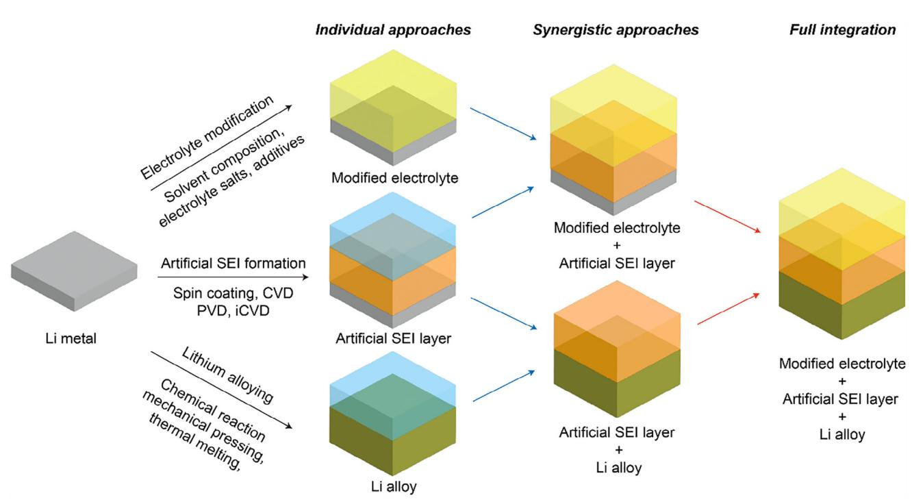

**Figure 1.** Schematic illustration of the technical development roadmap for practical Li metal anode.

is crucial for pursuing and enhancing the long-term cycling performance and electrochemical stability of lithium metal. These interactions influence key processes such as lithium nucleation, dendrite formation, ion desolvation, and the formation of the SEI layer in terms of its composition and thickness. The compatibility of these interfaces can be dissected into three primary aspects: electrolyte's interfacial affinity, electrochemical stability, and the solvation structure of lithium ions. These factors are intricately linked to the SEI layer's formation and characteristics, with profound implications for the performance and cycle life of lithium metal batteries. Therefore, further investigation into each of these factors is needed, as it will provide valuable insight into the interface and ways for stabilizing Li metal.

# 3. Factors Governing Li/Electrolyte Li/SEI/Electrolyte Interfaces

In this section, five independent factors governing the Li/electrolyte and Li/SEI/electrolyte interfaces are identified and discussed. These five factors are chosen because they critically affect the thermodynamic and interfacial properties of Li metal, including its SEI composition and thickness, which in turn influence electrochemical properties and performance when assembled in an electrochemical cell. Both conventional and recent approaches to stabilize the Li/electrolyte and Li/SEI/electrolyte interfaces aim to address, either directly or indirectly, all five factors, all of which are crucial to the interfacial properties of Li metal. To start with, electrolyte affinity and wettability with lithium are discussed as the first factors to consider.

### 3.1. Electrolyte Affinity and Wettability with Lithium Metal Anode

Electrolyte affinity (electrolyte-philic/electrolyte-phobic) and wettability of the electrolyte on the surface of the electrode are crucial parameters in building a stable SEI layer. Both electrolyte affinity and wettability are closely related, as they are governed by the same thermodynamic driving force-minimization of interfacial energy between the electrolyte and lithium metal surface. Electrolyte affinity refers to how compatible or favorable the interaction is between the electrolyte and the lithium metal anode, while wettability describes the liquid's ability to spread and maintain contact with the solid surface. Wettability is often considered a prerequisite for electrolyte affinity, and strong wettability generally indicates good interfacial compatibility. Generally, when  $\text{LiPF}_6$  dissolved in carbonates (such as DEC and/or EC) is used as an electrolyte, ion pairs and larger agglomerates are observed because they are prone to be bound into neutral clusters.[41-43] The solvent with specific ion affinity can help form a more stable SEI layer, leading to enhanced anode reversibility. For instance, Huang et al. reported that anion receptor (tris(trimethylsilyl)borate(TMSB)) can be used together with other carbonate electrolytes to improve the Li metal cyclability and electrochemical performance when assembled with  $(LiNi0.8Co0.1Mn0.1O2)$  NCM811 cathode.[44] When TMSB is introduced as an anion receptor, the coupling of  $Li^+$  and  $PF_6^-$  is weakened, enhancing the Li+ transference number. A robust F/Brich inorganic SEI layer is formed, allowing faster Li-ion transport and lower charge resistance. Huang et al. also suggested an ionic liquid additive (1-ethoxymethyl-3-vinyl imidazolium bis-(trifluoromethylsulfonyl) imide) in the electrolyte, which has dual affinity for both the anode and cathode.[45] It can be adsorbed well on the Li-rich cathode and anode, leading to the formation of

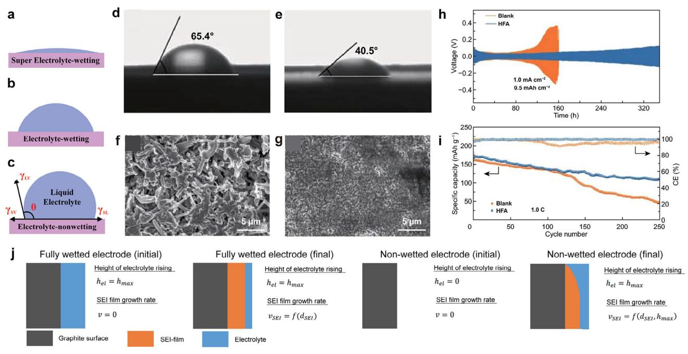

**Figure 2.** Simple illustration on the degree of wetting: in the case of a) super electrolyte-wetting on electrode, b) good electrolyte-wetting on electrode, and c) non-electrolyte-wetting on electrode. a–c) Reproduced under the terms of the CC-BY Creative Commons Attribution 4.0 International License [\(https:](https://creativecommons.org/licenses/by/4.0) [//creativecommons.org/licenses/by/4.0\)](https://creativecommons.org/licenses/by/4.0).[\[49\]](#page-25-0) Copyright 2023, L. Zhao et al., published by Wiley-VCH. Contact angle comparison of separator based on the d) control electrolyte and e) electrolyte with 1.0 wt.% heptafluorobutyric anhydride contained. f) Li symmetric cell tests in two different electrolytes. SEM images of the Li metal anode after 50 cycles in g) control electrolyte and h) electrolyte with 1.0 wt.% heptafluorobutyric anhydride contained. i) Full cell tests with NCM622 cathode in two different electrolytes. d–i) Reproduced under the terms of the CC-BY Creative Commons Attribution 4.0 International License [\(https://creativecommons.org/licenses/by/4.0\)](https://creativecommons.org/licenses/by/4.0).[\[57\]](#page-26-0) Copyright 2021, Y. Wang, published by Springer Nature. j) Schematic observation on the electrolyte rising and SEI layer growth for fully wetted and non-wetted electrode. Reproduced with permission.[\[59\]](#page-26-0) Copyright 2020, Springer Nature.

stable cathode electrolyte interphase and SEI layer. In a more advanced concept, multiple solvents are added together to achieve affinity for both the anode and cathode. Dong et al. devised a "bi-electrode affinity" concept, wherein tetramethylene sulfone (TMS) stabilizes NCM811 cathode while fluoroethylene carbonate stabilizes Li metal anode.[\[46\]](#page-25-0) The added TMS results in a thin F/S-rich interphase layer, which contributes to high cycle retention characteristics. Electrolyte affinity can also be tuned by changing the physicochemical properties of the current collector. Yin et al. introduced the bicomponent-bidirectional gradient current collector, displaying a contact angle close to 0°. [\[47\]](#page-25-0) Such high electrolyte affinity is attributed to the presence of highly polar functional groups (such as Si─O) on the glass fiber, which is expected to facilitate Li+ transport.[\[48\]](#page-25-0) Based on the X-ray photoelectron spectroscopy analysis, the proportion of LiF, Li3N, and Li2CO3 varied across the top, middle, and bottom layers of the SEI layer, making it a position-responsive SEI layer. This results in uniform deposition of Li metal as well as sustained cycling stability.

As stated above, electrolyte affinity is crucial for the formation of a stable and robust SEI layer, and good wettability is also required. Generally, the wettability of electrolytes on the electrode can be classified into three different categories: i) super electrolyte-wetting (**Figure 2**a), ii) good electrolyte-wetting (Figure 2b), and non-electrolyte-wetting (Figure 2c).[\[49\]](#page-25-0) Wettability is important because it promotes the uniform deposition of Li, which leads to the formation of stable and mechanically robust SEI layer. Experimentally, a reduced interfacial resistance (resistance of SEI layer) has been observed when enhanced wettability between the electrode and electrolyte is present.[\[50\]](#page-25-0) Numerous case studies have shown that uneven wetting between the electrode and electrolyte leads to unstable SEI layer as well as an increased resistance of the SEI layer.[\[51\]](#page-25-0) Therefore, it is crucial to improve the wettability between the electrode and electrolyte. Additionally, carbon-based materials have been studied as host materials for Li,[\[52–55\]](#page-25-0) improving the wettability between the carbon and Li has also been previously investigated to enhance SEI layer formation. When the wettability between the carbon and Li improved,[\[56\]](#page-26-0) more stable SEI layers were formed, uniform Li deposition was achieved, and dendrite formation was effectively suppressed. Not only the wettability between the electrode and electrolyte and/or between components within the electrode, but the wettability between the electrolyte and separator also needs to be carefully investigated. Ma's group discovered that electrolyte additives improve the wettability of the separator.[\[57,58\]](#page-26-0) Based on contact angle analysis, the conventional carbonate electrolyte showed a contact angle of 65.4° (Figure 2d) but it was decreased to 40.5° (Figure 2e) when heptafluorobutyric anhydride was introduced as an additive. In the Li symmetric cell test (Figure 2f), enhanced life performance was observed for electrolytes containing heptafluorobutyric anhydride additive without severe polarization. The surface of Li metal after 50 cycles in a conventional electrolyte (Figure 2g) and an electrolyte with heptafluorobutyric anhydride (Figure 2h) showed a stark contrast: the former exhibited a needle-like dendrite, while the latter displayed a rather uniform Li deposition. This improvement was attributed to the formation of a stable SEI layer with a more uniform morphology. As a result, enhanced cycling stability was observed even in full-cell performance tests (Figure [2i\)](#page-3-0). Based on case examples, both electrolyte affinity and wettability with lithium play crucial roles in governing the Li/electrolyte and Li/SEI/electrolyte interfaces. Additionally, the morphology of the SEI layer, including features such as swelling, is also important as it can significantly affect the interfacial properties. Schematic illustration on the correlation between the evolution of electrolyte rising and SEI layer growth was presented for both fully wetted and non-wetted electrodes based on the electrochemical in situ approach from the chronoamperometry (Figure [2j\)](#page-3-0).[\[59\]](#page-26-0) Though it is a simplistic approach, it highlights the effect of wetting in SEI layer growth.

#### **3.2. Swelling of SEI Layer**

Swelling is another important factor that greatly affects the quality of the SEI layer. When the native SEI layer formed on Li metal comes into contact with the electrolyte, SEI layer swells and forms a thicker SEI layer. A restricted degree of swelling in the SEI layer helps mitigate the parasitic reactions, facilitate Liion transport, and maintain stable morphology.[\[60\]](#page-26-0) For instance, Liang et al. alleviated the swelling of the SEI layer by introducing a unique anion switch into the primary solvation sheath.[\[60\]](#page-26-0) In the pristine electrolyte, rapid uptake of the electrolyte leads to the swelling of the SEI layer (**Figure 3**[a\)](#page-5-0). However, in a modified electrolyte (Figure [3b\)](#page-5-0), the low swelling Li3PO4 SEI layer is made, where the swelling of SEI layer is later found to have a profound effect on the overall electrochemical performance. Recently, the monitoring of swelling in the SEI layer was visualized and investigated further in detail. In 2022, Zhang et al. modified the thin-film vitrification method to visualize the swelling of the SEI layer, which can influence the Li-ion transport properties.[\[61\]](#page-26-0) Li metal dendrites were observed in both the vitrified electrolyte (Figure [3c\)](#page-5-0) and the dry state (Figure [3d\)](#page-5-0). The yellow box in Figure [3c](#page-5-0) and the blue box in Figure [3d](#page-5-0) were further magnified to observe the SEI layer characteristics in the vitrified electrolyte (Figure [3e\)](#page-5-0) and the dry state (Figure [3f\)](#page-5-0). Based on these observations in Figure [3e](#page-5-0) and Figure [3f,](#page-5-0) swelling of the SEI layer occurred in the vitrified electrolyte (Figure [3e\)](#page-5-0), resulting in a larger thickness (20 nm) compared to the dry state (10 nm) (Figure [3g\)](#page-5-0). Additionally, the distribution of thickness was also different for SEI layers in vitrified electrolyte and the dry state (Figure [3h\)](#page-5-0), with swelling contributing to the increased thickness of the SEI layer. It is discovered in the same work that coulombic efficiency (%) decreases with the swelling ratio of the SEI layer, indicating that excessive swelling of the SEI layer and/or electrode materials may not be ideal for the long-term operation of Li metal batteries.

Swelling also becomes a real critical issue once the cycle proceeds. This is because of the consumption of electrolytes and increased SEI layer thickness that happens during the battery operation as the cycle proceeds.[\[62–64\]](#page-26-0) Therefore, it is important to investigate and understand how the SEI layer swells, not only in the initial cycles but with respect to different numbers of cycles. Swelling of the SEI layer also leads to the formation of more side reactions and reversible Li+ intercalation.[\[60\]](#page-26-0) Therefore, a rational strategy should be employed to address the swelling property of the SEI layer and the ways to mitigate it. The swelling property of the SEI layer is also dependent on the kind of electrolyte used because different electrochemical stability exists for each electrolyte. Therefore, the electrochemical stability of the electrolyte needs to be examined for its influence on the Li/electrolyte and Li/SEI/electrolyte interfaces.

#### **3.3. Electrochemical Stability of Electrolyte Solution**

The cycling stability of the SEI layer also depends on the electrolyte's stability in electrochemical/chemical and mechanical aspects, as well as its durability over time and under various temperatures. The electrolyte usually consists of a salt and a solvent, both of which contribute to the build-up of the SEI layer.[\[65\]](#page-26-0) For instance, LiPF6 is one of the most widely used Li salts in the electrolyte but undergoes step-by-step cascade reactions, leading to undesired decomposition and side reactants. Alternatively, salts such as LiFSI and LiTFSI have been explored, as they can promote the formation of a more electrochemically stable SEI interface compared to LiPF6. [\[66\]](#page-26-0) However, it intrinsically reacts with water, and dry room manufacturing is therefore suggested, although some water content still exists during the production of lithium-ion batteries.[\[67,68\]](#page-26-0) The schematic of the decomposition process of the LiPF6-containing electrolyte is illustrated in **Figure 4**[a,](#page-6-0) [\[69\]](#page-26-0) where the ion-paired LiPF6 serves as the initiating point of severe catalytic decomposition. It is autocatalytically decomposed into PF5 and LiF, and PF5 can further react with minute amounts of water to produce HF and other reactive compounds (POF3, HPO2F2, H2PO3F, H3PO4), rendering the interface of both anode and cathode electrochemically and chemically unstable. As a result, the first principles studies have been used to investigate the electrochemical and chemical stability of the electrolyte,[\[70\]](#page-26-0) while the introduction of additives and modulation on the concentration of electrolyte salts have been suggested as potential solutions to improve the quality of SEI layer.[\[71–74\]](#page-26-0)

Furthermore, the mechanical properties of the decomposed electrolyte, as well as formed SEI layer, can greatly determine the quality of SEI layer, which is also closely dependent on the time and temperature of operation. The schematic illustration (Figure [4b–d\)](#page-6-0) depicts the initial stage, SEI layer formation, and potential mechanical issues that arise from the formation of unstable SEI layer, which mainly include excessive growth of the SEI layer and Li dendritic growth.[\[75\]](#page-26-0) It is important to note that while the electrolyte might be electrochemically and chemically stable, this does not always guarantee the mechanical stability of the SEI layer. Therefore, in addition to ensuring the electrochemical/chemical stability of the electrolyte, many researchers are tackling the challenges related to the mechanical instability of the SEI layer by designing bilayer or multilayer SEI, various SEI composites, and other SEI layers with complex structures.[\[76\]](#page-26-0)

Additionally, temperature and aging time greatly affect the properties of the SEI layer as they determine the solvation state and activation energy levels in electrochemical reactions. An indepth study on the effect of temperature on the formation of SEI layer was carried out by Yan et al.,[[77\]](#page-26-0) which revealed that different SEI layer properties exist when the temperature for the

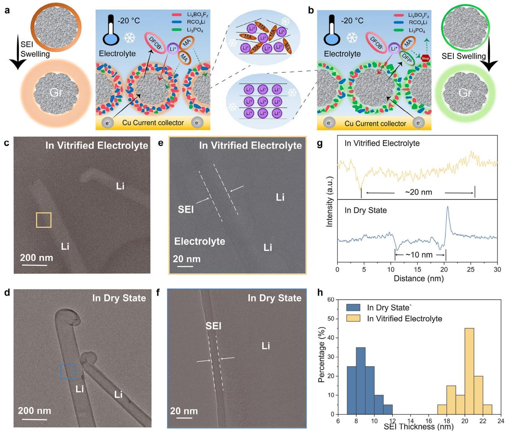

**Figure 3.** Schematic illustration on the degree of SEI layer swelling for a) pristine and b) modified electrolyte with an anion switch. a,b) Reproduced with permission.[\[60\]](#page-26-0) Copyright 2023, Wiley-VCH. The comparison on the imaging of Li metal in c) vitrified electrolyte and d) dry state. HRTEM of SEI on Li metal dendrite in e) vitrified electrolyte and f) dry state, showing different thicknesses of the SEI layer. g) Representative line profiles of intensity across the interfaces on Li metal in the electrolyte. h) The histogram of SEI layer thickness values in vitrified electrolyte and dry state across multiple parts of Li metal with sufficient measurements. c–h) Reproduced with permission.[\[61\]](#page-26-0) Copyright 2022, The American Association for the Advancement of Science.

formation cycle varies. Based on the schematic illustration (Figure [4e\)](#page-6-0), at low formation cycle temperature, a dense SEI layer with low ionic conductivity is formed, while at high formation cycle temperature, an SEI layer with many side reactants is formed. Therefore, it is important to consider the effect of temperature in investigating and understanding the SEI layer property. Additionally, the operation time/duration also significantly contributes to the overall SEI layer morphology, in particular the thickness of the SEI layer. A previous investigation on the SEI layer growth on TiO2 anodes using the EC/DEC exhibited that the SEI layer thickness increased significantly from 2 cycles (Figure [4f\)](#page-6-0) to 100 cycles (Figure [4g\)](#page-6-0),[\[78\]](#page-26-0) clearly suggesting that time greatly affects the morphological evolution of the SEI layer. Not only the electrolyte itself but also the dynamics of Li ions in the electrolyte (particularly solvation and de-solvation of Li ions) also greatly affect the interfacial properties, which need to be probed in a greater depth.

#### **3.4. Solvation and Desolvation of Li Ions**

Solvation structure, in particular for the solvated and desolvated Li ions, is critical for the development of a stable SEI layer.[\[79,80\]](#page-26-0) There are two main contributors to the transport of Li ions from the bulk electrolyte to the host electrode material (graphite in this scheme), which are i) desolvation of Li ions and ii) the migration of Li ions through the SEI layer.[\[79\]](#page-26-0) For the desolvation of Li ions to occur, it undergoes a step-wise process involving

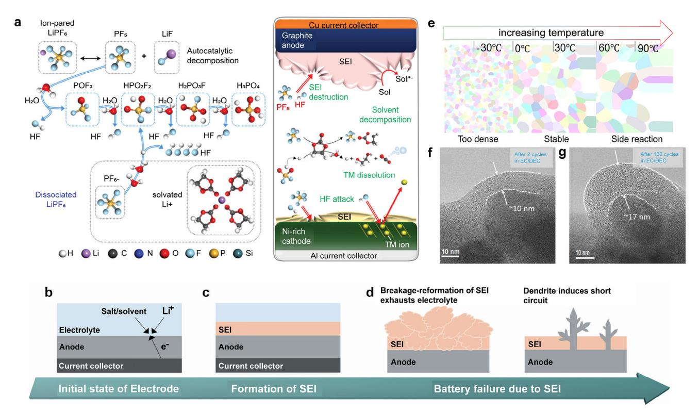

**Figure 4.** a) The overall schematic illustration on the chemical and electrochemical instability of the LiPF6-containing electrolyte and its implication on the interface of anode and cathode. Reproduced with permission.[\[69\]](#page-26-0) Copyright 2020, Wiley-VCH. Impacts on the mechanical properties of SEI layer on the electrode–b) in the initial state, c) SEI layer formation, d) two different cases of mechanical failure issues related to the SEI layer. b–d) Reproduced with permission.[\[75\]](#page-26-0) Copyright 2023, Wiley-VCH. e) The schematic illustration on the morphology of SEI layer depending on the formation temperature. Reproduced with permission.[\[77\]](#page-26-0) Copyright 2020, Elsevier. SEI layer thickness after f) 2 cycles and g) 100 cycles in carbonate-based electrolytes. f,g) Reproduced with permission.[\[78\]](#page-26-0) Copyright 2018, Wiley-VCH.

the diffusion of solvated Li ions and the breaking of Li-ion solvation sheath. Therefore, it is important to understand and possibly tune the solvation structure of Li ions in order to facilitate in the formation of a stable interface between the electrode and the electrolyte. Recent research progress can be found in the recent work done by Liang et al., where 1,3-dimethoxypropane (DMP) was employed to regulate the solvation structure.[\[79\]](#page-26-0) Compared with (1,2-dimethoxyethane) (DME), DMP possesses weaker solvating power while maintaining the high Li salt solubility, thus leading to the formation of LiF-rich SEI layer (**Figure 5**[a\)](#page-7-0). This leads to more uniform Li deposition, which leads to higher reversibility and longer cycle life.

The solvation structure of Li ions is important not only because it affects the transport properties of Li ions through the SEI layer, but also because the components in the Li solvation sheath serve as precursors for the formation of the SEI layer as the cycle proceeds.[\[81,82\]](#page-26-0) Therefore, the choice of solvent used for the electrolyte greatly affects the solvation structure of Li ions, which are critical to the build-up of the SEI layer. For instance, in a solvent mixture of 1.2 M LiPF6 in ethylene carbonate and ethyl methyl carbonate, and 1.2 m LiPF6 in ethylene carbonate electrolyte,[\[83\]](#page-26-0) at least three different solvation structures exist, namely solvation separated ion pairs (SSIP) (Figure [5b\)](#page-7-0), contact ion pairs (CIP) (Figure [5c\)](#page-7-0), and aggregate (AGG) pairs (Figure [5d\)](#page-7-0). Interestingly, the introduction of ethyl methyl carbonate greatly alters the overall proportion for SSIP, CIP, and AGG in a solvent with ethyl methyl carbonate (Figure [5e\)](#page-7-0) compared to one without ethyl methyl carbonate (Figure [5f\)](#page-7-0), which will further impact the composition and characteristics of the SEI layer. When the solvation structure of Li ions differs significantly, as shown in Figure [5e,f,](#page-7-0) the composition of the SEI layer changes greatly, thereby influencing the transport of Li ions through the SEI layer.

Additionally, it has been observed in previous studies that preferential solvation of Li ions occurs experimentally.[\[84,85\]](#page-26-0) Ethylene carbonate is the most predominant solvent within the Li solvation sheath, even though the electrolyte contains not only ethylene carbonate but also many other carbonate species. This leads to a preferential build-up of the SEI layer, with most of the components derived from ethylene carbonate, which might impede the transport characteristics of Li ions, as breaking the Li solvation sheath is required, but EC is known to bind Li ions. Therefore, not only the formation chemistry of the SEI layer but also the transport of Li ions through the SEI layer are greatly governed and influenced by the Li solvation structure. This needs to be investigated in greater detail, and a feasible strategy should be suggested to tune and modify the solvation structure of Li ions if applicable. Along with the solvation structure of Li ions, Li-ion flux and distribution can significantly alter the interfacial properties of Li metal, which is the last factor to be considered carefully.

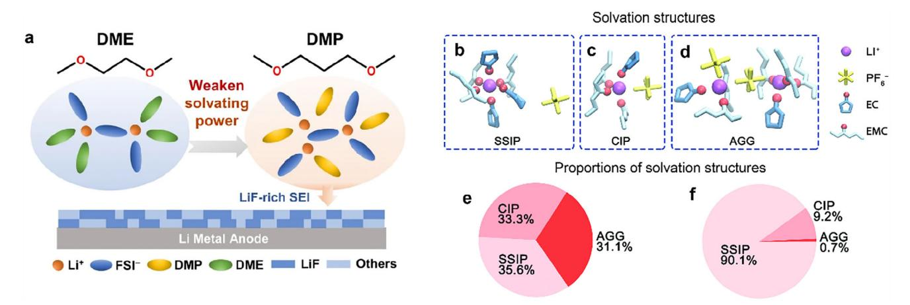

**Figure 5.** a) The effect of regulation in solvation structure on the formation of LiF-rich SEI layer by introducing DMP with weak solvating power. Reproduced with permission.[\[80\]](#page-26-0) Copyright 2023, Springer Nature. Different solvation structures of Li ions – b) solvation separated ion pairs (SSIP), c) contact ion pairs (CIP), and d) aggregate pairs (AGG). The proportion of SSIP, CIP, and AGG in the electrolyte system e) without ethyl methyl carbonate and (f) with ethyl methyl carbonate. b–f) Reproduced with permission.[\[83\]](#page-26-0) Copyright 2023, Springer Nature.

#### **3.5. Li-Ion Flux and Distribution**

Another factor to consider is an ion flux and distribution, socalled concentration gradient. Especially, if the concentration gradient is non-uniform, this can lead to the non-uniform deposition of Li, which can further accelerate the breakage of the SEI layer and/or unstable interface between the electrode and electrolyte. A more detailed illustration is shown in **Figure 6**[a,](#page-8-0) [\[86\]](#page-26-0) where the breakage of the SEI layer eventually occurs after nonuniform plating/stripping cycles due to repetitive nucleation and non-uniform deposition of Li. It is difficult to achieve the uniform deposition of Li, as it is thermodynamically more favorable for preferential nucleation rather than the uniform nucleation of Li. Non-uniform Li-ion flux and distribution often lead to the formation of side products, an unstable SEI layer, and breakage of SEI layer.[\[87,88\]](#page-26-0) Therefore, many research attempts have been made to ensure that more uniform and even Li-ion flux and distribution can help form a stable SEI layer between the electrode and the electrolyte.

The initial approach was to design the electrode in such a way that it is mechanically preferable to have a uniform Li-ion flux and distribution. An example can be found in Figure [6b,](#page-8-0) where uniform nucleation and deposition take place via a nanochannel layer. Another example is to introduce a gradient in the current collector, where using an artificial gradient, a stable interface between the electrode and electrolyte (Figure [6c–e\)](#page-8-0). Compared with the bare current collector (Figure [6c\)](#page-8-0), the inhomogeneity of the Li-ion flux and distribution is significantly improved when the lithiophilic/conductive (LC) gradient is introduced (Figure [6d\)](#page-8-0). Furthermore, more homogeneous Li-ion flux and distribution occur when both LC gradient and slow-release additive gradient are introduced in the current collector (Figure [6e\)](#page-8-0). Recently, a computational study revealed that the Li-ion mobility of the SEI components is closely related to the Li-ion flux, so the consideration of both the Li-ion mobility and Li-ion flux/distribution should take place simultaneously.[\[89\]](#page-26-0) To summarize, various factors govern the interfacial stability of Li metals, and stable interfacial properties of Li metals can be achieved when they are addressed fully.

# **4. Stabilization of Li Metal with Extrinsic Layers**

As previously discussed, native SEI layers form through electrochemical reactions between the electrolyte and lithium. These native SEI layers are inherently difficult to control because their composition is dynamically generated during battery operation. Consequently, achieving significant improvements in SEI performance by incorporating small amounts of additives is challenging; additives can be easily depleted, and the multi-component nature of the SEI layer persists, limiting its effectiveness in preventing dendrite formation.[\[90,91\]](#page-26-0) A high salt-to-solvent ratio is one of the promising approaches to extend the cycle life of the Li-ion and Li-metal batteries,[\[91,92\]](#page-26-0) which is beyond the scope of this review.

To address these limitations, researchers have explored the use of extrinsic layers, so-called artificial SEI layers, that are not inherently part of the battery system.[\[93,94\]](#page-26-0) These extrinsic layers serve as mechanical barriers designed to suppress the growth of lithium dendrites as well as prevent side reactions between the lithium metal anode and the electrolytes. Unlike native SEI layers, artificial SEI layers are engineered to provide a more robust and flexible barrier that can withstand the mechanical stresses associated with lithium plating and stripping while still allowing efficient lithium-ion transport. Several materials have been investigated for constructing these artificial SEI layers, including polymer coatings (e.g., polyethylene oxide, polyurethane elastomer, polyvinylidene fluoride, and their copolymers),[\[95–99\]](#page-26-0) inorganic materials (e.g., lithium fluoride, lithium phosphate),[\[100–103\]](#page-26-0) and composite structures that combine both organic and inorganic components.[\[104–107\]](#page-26-0) These materials are selected for their mechanical strength, electrochemical stability, and ionic conductivity.

#### **4.1. Selection of Fabrication Methods and Materials**

When preparing artificial SEI or surface coatings on lithium metal, the foremost priority for stabilizing the lithium metal is the selection of fabrication methods and materials. Due

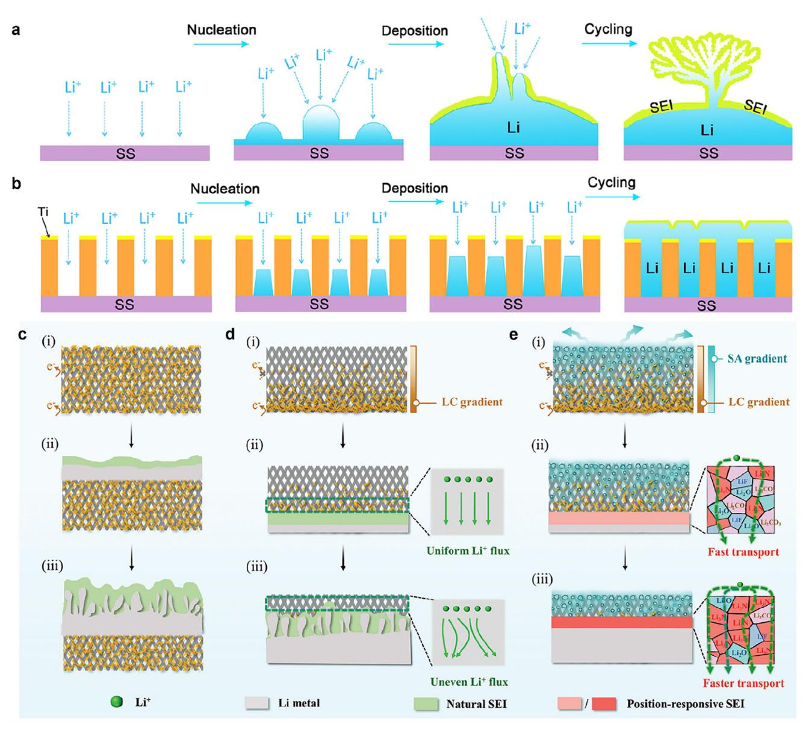

**Figure 6.** Schematic illustration of the nucleation, deposition, and SEI layer after cycling in a) a bare electrode and b) an electrode with a nanochannel layer. a,b) Reproduced with permission.[\[86\]](#page-26-0) Copyright 2016, American Chemical Society. The morphological evolution of c) bare current collector, d) single gradient current collector, and e) double gradient current collector, where the formation of the most stable SEI layer is achieved in the presence of both lithiophilic/conductive (LC) gradients and slow-releasing (SA) additive gradients. c–e) Reproduced with permission.[\[47\]](#page-25-0) Copyright 2016, American Chemical Society.

to advancements in various research and technological breakthroughs, numerous process techniques have been developed to fabricate an external layer on the lithium metal anode, and process technology classification can be structured according to how lithium metal is dealt with during the process. Three process categories are defined: top-down, bottom-up, and transfer. Top-down processes utilize the high reactivity and lowest reduction potential of lithium metal to form an SEI layer from the lithium metal surface downward, and this approach encompasses alloying[\[108–111\]](#page-26-0) and pre-treatment.[\[112–117\]](#page-26-0) Bottom-up processes aim to formulate an SEI layer monolithically on the lithium metal with minimal or no damage to the lithium metal, including spin coating,[\[118–122\]](#page-26-0) together with the formation of monolayers by self-assembled monolayer (SAM) process,[\[123,124\]](#page-27-0) and thin film fabrication techniques of chemical vapor deposition (CVD),[\[125,126\]](#page-27-0) atomic layer deposition (ALD),[\[127–129\]](#page-27-0) molecular layer deposition (MLD),[\[130–134\]](#page-27-0) initiated chemical vapor deposition (iCVD),[\[135,136\]](#page-27-0) sputtering,[\[137–141\]](#page-27-0) and evaporation.[\[142–145\]](#page-27-0) On the other hand, as the externally prepared SEI layer is conveyed to the lithium metal anode, the transfer process allows for the complete exclusion of damaging lithium metal during the process.[\[146–148\]](#page-27-0) The schematic illustration of different preparation methods for the artificial SEI layer is presented in **Figure 7**[.](#page-9-0)

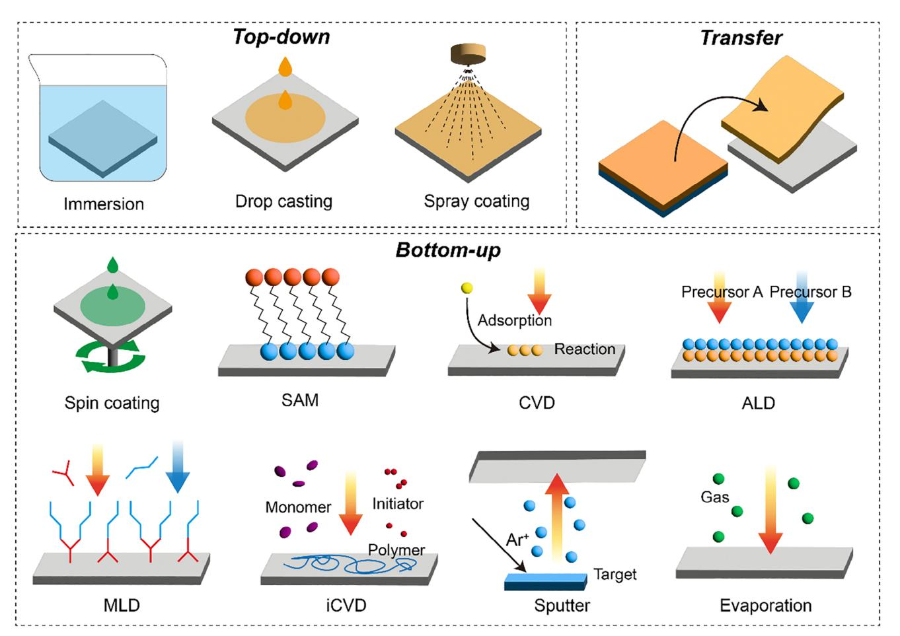

**Figure 7.** Schematic illustration of artificial SEI layer fabrication methods. Top-down: chemical immersion, drop casting, spray coating. Bottom-up: Spin coating, self-assembled monolayer (SAM), chemical vapor deposition (CVD), atomic layer deposition (ALD), molecular layer deposition (MLD), initiated chemical vapor deposition (iCVD), sputter, and evaporation.

Since the subsequent material selection depends on the chosen process, one of the organic, inorganic, or composite materials would be favored based on the desired properties, and the whole content is summarized with selected examples in **Table 1**[.](#page-10-0) Furthermore, to harness the inherent potential of lithium metal, it is advantageous to opt for bottom-up and transfer processes to ensure its minimal damage and prevent changes in its capacity and kinetics. In the transfer process, careful attention should be given to ensuring supplemental adhesion between the lithium metal anode and artificial SEI layers through binding or bonding, which can differentiate the innate function of transferred layers from that of separators. Owing to the considerable deformation involved during many cycles, organics or composite materials are more encouraging compared to brittle inorganic materials. Recently, emerging 2D materials, such as graphene,[\[149\]](#page-27-0) hexagonal boron nitride (h-BN),[\[150\]](#page-27-0) molybdenum disulfide (MoS2),[\[138\]](#page-27-0) MXene,[\[151\]](#page-27-0) perovskite,[\[152\]](#page-27-0) and layered double hydroxide (LDH)[\[153\]](#page-27-0) display abundant lithiophilic sites and sufficient ion channels for the intercalation, which could also be considered for the prolonged stability of lithium metal anode.

#### **4.2. Lithiophilicity/Lithiophobicity of Artificial SEI Layer**

In an artificial SEI layer, lithiophilicity and lithiophobicity are critical governing factors in regulating Li-ion transport from the electrolyte and electrodeposition onto the lithium metal surface. A lithiophilic surface can help guide planar Li deposition and adjust Li growth direction by lowering Li diffusion barrier. There have been many research endeavors for imparting lithiophilicity onto the lithium metal anode (**Figure 8**[a\)](#page-12-0).[\[154–157\]](#page-27-0) Especially for 3D current collectors designed to manage the loose and disordered Li deposits and inhibit Li dendrites, it becomes crucial to enhance lithiophilicity on their surfaces (Figure [8b\)](#page-12-0).[\[158–160\]](#page-27-0) Typical current collectors consisting of Ni or Cu show the lithiophobic surface with a high Li nucleation barrier, and the lithiophobicity could induce sparse Li nucleation sites upon Li plating. Improving lithiophilicity on the electrode contributes to facilitating dense Li nucleation and growth within their structures, thereby promoting stable lithium electrodeposition (Figure [8c\)](#page-12-0).[\[158\]](#page-27-0) However, it is not imperative for all surfaces within the 3D skeletal structure to display lithiophilicity. In cases where every surface therein is lithiophilic, while electrons move freely along the

| $\begin{bmatrix} 106 \\ 100 \end{bmatrix}$ $[112]$ $\mathsf{L}\mathsf{U}$ $\begin{bmatrix} 6 & 1 \\ 6 & 1 \end{bmatrix}$ $[121]$ @ 0.5C, 1.57 mA 400 cycles @ 0.5 C Cycle life (Capacity 0.43 mA h cm <math>-2</math> 200 cycles (87.8%) 200 cycles (87.7%) $1.25 \text{ mA cm}^{-2}$ 60 cycles (91.5%) (88.2%) @ 1C, $h \text{ cm}^{-2}$ (30 °C) @ $0.2C/0.33C$ , $2.5$ mAh cm -2 $cm^{-2}$ (-15 °C) (equivalent to 400 cycles (80%) @ 2.0 mAh 1600 cycles $(30~^\circ\text{C}),$ retention) $(25 \, ^{\circ}C)$ Li full cell sulfur loading $\approx$ 6 mg $cm^{-2}$ , low E/S ratio 3 (0.4 Ah-level pouch cell, 1.5 mg cm -2 , 25 $\mu$ m (50 $\mu$ m Li, E/C $\approx$ 16 g $325.28\;\text{Wh}\;\text{kg}^{-1}$ $\text{(Sulfur loading} \approx$ $(11.2\,\,\mathrm{mg}\,\mathrm{cm}^{-2})$ $\mu\text{L}~\text{mg}^{-1}$ of $(2.7\; mg\; cm^{-2})$ 100 µm Li) LINMC811 Li, 20 $\mu$ L) $\quad \text{Cell type} \quad$ $Ah^{-1}$ ) <b>LillEP</b> <b>LilLCO</b> <b>LilLCO</b> $\mathsf{L}\mathsf{i-S}$ $\sqsubsetneqq \sqsubsetneq S$ $cm^{-2}$ /2mAh cm -2 mAh cm -2 (40 $\mu$ L) mAh cm -2 (60 $\mu$ L) $\approx 100 \text{ mV}$ (1000 h, $\approx$ 100 mV (160 h) @ 1 mA cm -2 /1 @ 1 mA cm -2 /1 $\approx 100 \text{ mV}$ (1360) Overpotential 500 cycles) $(40\;\mu\text{L})$ @ 20 mA cycles) Li-Li cell $\quad \  \  I$ $\quad \  \  I$ (Carbonated- Liquid (Fluori- Liquid (Ether- Liquid (Ether- Liquid (Ether- Electrolyte based) based) based) based) based) nated ether- $\mathsf{Liquid}$ type Nanodiamond: nanometers Outer layer: top layer: PVDF-HFP Inner layer: 150 nm 700 nm (mono- $2.5 \mu m$ $2 \mu m$ layer) $0.2\;\mu\textrm{m}$ $\mathsf{F}\mathsf{e}\mathsf{w}$ $5\,\mu\text{m}$ fluorinated ether exhibits high Li carbonate and exterior and lithiophilic corrosion tolerance $\quad \  \  \, \text{cm}^{-1}$ layer $\mathsf{SE}$ |                                                                                                                                                                                         | Type of materials | Employed examples | Detailed characteristics                                                                                                                                                                    | thickness Layer |  | Electrochemical performance | Refs. |
|----------------------------------------------------------------------------------------------------------------------------------------------------------------------------------------------------------------------------------------------------------------------------------------------------------------------------------------------------------------------------------------------------------------------------------------------------------------------------------------------------------------------------------------------------------------------------------------------------------------------------------------------------------------------------------------------------------------------------------------------------------------------------------------------------------------------------------------------------------------------------------------------------------------------------------------------------------------------------------------------------------------------------------------------------------------------------------------------------------------------------------------------------------------------------------------------------------------------------------------------------------------------------------------------------------------------------------------------------------------------------------------------------------------------------------------------------------------------------------------------------------------------------------------------------------------------------------------------------------------------------------------------------------------------------------------------------------------------------------------------------------------------------------------------------------------------------------------------------------------------------------------------------------------------------------------------------------------------------------------------------------------------------------------------------------------------------------------------------------------------------------------------------------------------------------------------------------------------------------------------------------------------|-----------------------------------------------------------------------------------------------------------------------------------------------------------------------------------------|-------------------|-------------------|---------------------------------------------------------------------------------------------------------------------------------------------------------------------------------------------|--------------------|--|-----------------------------|-------|
|                                                                                                                                                                                                                                                                                                                                                                                                                                                                                                                                                                                                                                                                                                                                                                                                                                                                                                                                                                                                                                                                                                                                                                                                                                                                                                                                                                                                                                                                                                                                                                                                                                                                                                                                                                                                                                                                                                                                                                                                                                                                                                                                                                                                                                                                      |                                                                                                                                                                                         |                   |                   |                                                                                                                                                                                             |                    |  |                             |       |
|                                                                                                                                                                                                                                                                                                                                                                                                                                                                                                                                                                                                                                                                                                                                                                                                                                                                                                                                                                                                                                                                                                                                                                                                                                                                                                                                                                                                                                                                                                                                                                                                                                                                                                                                                                                                                                                                                                                                                                                                                                                                                                                                                                                                                                                                      |                                                                                                                                                                                         |                   |                   |                                                                                                                                                                                             |                    |  |                             |       |
|                                                                                                                                                                                                                                                                                                                                                                                                                                                                                                                                                                                                                                                                                                                                                                                                                                                                                                                                                                                                                                                                                                                                                                                                                                                                                                                                                                                                                                                                                                                                                                                                                                                                                                                                                                                                                                                                                                                                                                                                                                                                                                                                                                                                                                                                      | (SbF 3 /DME solution $Li3Sb$ alloy and LiF hybrid layer immersion) Inorganic                                                                                     |                   |                   | $2.0 \times 10^{-4}$ cm 2 s -1 , lonic conductivity: $1.01 \times 10^{-5}$ diffusivity. Li + diffusivity: Li 3 Sb superionic conductor |                    |  |                             |       |
|                                                                                                                                                                                                                                                                                                                                                                                                                                                                                                                                                                                                                                                                                                                                                                                                                                                                                                                                                                                                                                                                                                                                                                                                                                                                                                                                                                                                                                                                                                                                                                                                                                                                                                                                                                                                                                                                                                                                                                                                                                                                                                                                                                                                                                                                      | Fe valence gradient pretreatment) (FeF 3 solution nanolayer Inorganic                                                                                            |                   |                   | Fe 0 -containing interior layer prevent Li metal $Fe^{3+}/Fe^{2+}$ -abundant                                                                                               |                    |  |                             |       |
|                                                                                                                                                                                                                                                                                                                                                                                                                                                                                                                                                                                                                                                                                                                                                                                                                                                                                                                                                                                                                                                                                                                                                                                                                                                                                                                                                                                                                                                                                                                                                                                                                                                                                                                                                                                                                                                                                                                                                                                                                                                                                                                                                                                                                                                                      | polymer solution) (Spin coating of perfluorinated polymers with Siloxane-based PyTFSI and side chains composite inorganic, Organic,                          |                   |                   | solvents for salt-derived lithium salts over ether, Selective transport of                                                                                                            |                    |  |                             |       |
|                                                                                                                                                                                                                                                                                                                                                                                                                                                                                                                                                                                                                                                                                                                                                                                                                                                                                                                                                                                                                                                                                                                                                                                                                                                                                                                                                                                                                                                                                                                                                                                                                                                                                                                                                                                                                                                                                                                                                                                                                                                                                                                                                                                                                                                                      | benzenedisulfonyl thiol-Cu reaction) active monolayer $\circ^{\mathsf{f}}$ Electrochemically self-assembly fluoride by (Molecular 1, 3 composite Organic, |                   |                   | and LiF SEI components with LiF-rich inner phase benzenesulfinate anions and amorphous outer In-situ formation of                                                               |                    |  |                             |       |
|                                                                                                                                                                                                                                                                                                                                                                                                                                                                                                                                                                                                                                                                                                                                                                                                                                                                                                                                                                                                                                                                                                                                                                                                                                                                                                                                                                                                                                                                                                                                                                                                                                                                                                                                                                                                                                                                                                                                                                                                                                                                                                                                                                                                                                                                      | (Micro-wave-plasma chemical vapor poly-crystalline $\quad \text{nanodiamond}$ Double-layered deposition; MPCVD) composite Organic,                              |                   |                   | High-quality nanodiamond and average hardness (> $modulus (> 200 \text{ CPa})$ coating for native SEI layers. High storage 20 GPa) with defect                               |                    |  |                             |       |

<table>

 Table 1. The representative selection of fabrication methods and materials.

**ADVANCED** SCIENCE NEWS

 $\textcolor{blue}{\textbf{www. advanced scienceness.com}}$ 

| Refs.                       |                     |                                    | $[123]$                                                                                                      | $[129]$                                                                                                                                                                    | $[132]$                                                                                                                          | $[137]$                                                                                                                                                                                                                    | $[141]$                                                                                                                                                             | $[144]$                                                                                                          |
|-----------------------------|---------------------|------------------------------------|--------------------------------------------------------------------------------------------------------------|----------------------------------------------------------------------------------------------------------------------------------------------------------------------------|----------------------------------------------------------------------------------------------------------------------------------|----------------------------------------------------------------------------------------------------------------------------------------------------------------------------------------------------------------------------|---------------------------------------------------------------------------------------------------------------------------------------------------------------------|------------------------------------------------------------------------------------------------------------------|
| Electrochemical performance |                     | Cycle life (Capacity retention) |                                                                                                              | @ 0.5C, 3.2 mAh 1000 cycles (90%) $\rm cm^{-2}$                                                                                                                      | @ 3 mAh cm -2 50 cycles (≈90%)                                                                                     | first cycle, 0.1C $^{b)}$ efficiency: 99.6% for $S_8$   Au@Li & $\mathsf{S}_8  \mathsf{Zn@Li}\ \textcircled{\raisebox{0.7pt}{\textcircled{\raisebox{0.7pt}{\tiny{\bf{0}}}}}}\mathsf{S}$ 99.9% for Coulombic | mAh $g^{-1}$ , 87.1%) 500 cycles (672.1 at $2C$                                                                                                               | $1000\,\,{\rm MAh}\,\,{\rm g}^{-1}$ 230 cycles @ $200 \text{ mA g}^{-1}$ (fixed)                        |
|                             | Li full cell        | Cell type                          |                                                                                                              | CuNW@ZnHQ NCM523                                                                                                                                                           | microporous Cu NCM 622 lithiated 3D                                                                                        | $2.5$ mg cm -2 , 150 µm (Sulfur loading $\approx$ $\widehat{\Xi}$ $\sqsubset \overline{\sqcup}$                                                                                                        | (Sulfur loading ≈ 1.5 mg cm <math>-2</math> ) $\vdash_{\neg}$                                                                                      | (gLi-100 Ru@CNT) $\mathsf{L}\mathsf{i}\text{-}\mathsf{A}\mathsf{i}\mathsf{r}$                                 |
|                             | Li-Li cell          | Overpotential                      | mAh cm -2 (20 $\mu$ L) $\approx 100 \text{ mV} (240 \text{ h})$ @ 1 mA cm -2 , 1 | mAh cm -2 (30 $\mu$ L) 15-20 mV (7000 h) @ 1 mA cm -2 , 1                                                                                      |                                                                                                                                  | mAh cm -2 (60 $\mu$ L) @ 1 mA cm -2 , 1 $100 \text{ mV } (\approx 250 \text{ h})$                                                                                                              | mAh cm -2 (60 $\mu$ L) $\approx$ 30 mV ( $\approx$ 1000 h) $\circled{D}$ 1 mA cm -2 , 1                                                 | $\approx$ 10 mV (600 cycles) @ 1 mA cm <math>-2</math> , 1 mAh cm <math>-2</math> a) |
|                             | Electrolyte type |                                    | (Carbonated based) $\mathsf{Liquid}$                                                                   | Liquid (Ether- based)                                                                                                                                                   | (Carbonated- based) Liquid                                                                                                 | Liquid (Ether- based)                                                                                                                                                                                                   | Liquid (Ether- based)                                                                                                                                            | atmosphere $\mathsf{A}_{\mathsf{I}}$                                                                          |
| thickness Layer          |                     |                                    | 4 mm                                                                                              | nanometers A few                                                                                                                                                        | 10 nm                                                                                                                            | 100 nm                                                                                                                                                                                                                     | 250 nm                                                                                                                                                              | 100 nm                                                                                                           |
| Detailed characteristics    |                     |                                    | suppressed depletion of electrolytes onto $Al_2O_3$ Enhanced wettability and                           | Terminal oxygen of strong decomposition and LiF formation. Lithiophilic nucleophilic agent for uniform Li deposition Zn atom enabling facile TFSI- anion | strong interaction with Li current for large Li nuclei solvation sheath and Zwitterion polymer for lowering exchange | through Li-intermetallic Li-intermetallic phase of $Li_{15}Au_4$ and LiZn. electrodeposition Uniform Li layer                                                                                               | kinetics by lowered Li-ion migration energy barrier Conformal Sn layer on interfacial transfer Li-Sn alloy (LiSn, $Li_5Sn_2$ ). Fast Li + | superb air and moisture metal anode showing graphene-coated Li Water-repelling stability             |
| Employed examples           |                     |                                    | (Non-self-limiting $Al_2O_3$ thin layer ALD fashion)                                                   | (Zincone (ZnHQ) ZnHQ-modified $\mathsf{C}\mathsf{u}\mathsf{N}\mathsf{W}$ $\mathsf{MLD}\big)$                                                                      | (Post derivatization Ammonium-based zwitterionic $after\; i{\sf CVD}$ process) polymer                            | Lithiophilic intermetallic nanolayer (Sputtering)                                                                                                                                                                 | evaporation) Sn nanolayer (Thermal                                                                                                                            | transfer protocol) CVD-grown 2D (Wax-assisted graphene                                                  |
| Type of materials           |                     |                                    | Inorganic                                                                                                    | Composite                                                                                                                                                                  | composite Organic,                                                                                                            | composite Inorganic,                                                                                                                                                                                                    | composite Inorganic, Organic                                                                                                                                  | Organic, inorganic, composite                                                                                    |
| Fabrication method          |                     |                                    | ALD                                                                                                          | $\mathsf{M}\mathsf{L}\mathsf{D}$                                                                                                                                           | iCVD                                                                                                                             | Sputter                                                                                                                                                                                                                    | Evaporation                                                                                                                                                         | Transfer                                                                                                         |

**ADVANCED** SCIENCE NEWS www.advancedsciencenews.com

© 2025 Wiley-VCH GmbH

<table>

 Table 1. (Continued)

 $\mathbf{1}$ 

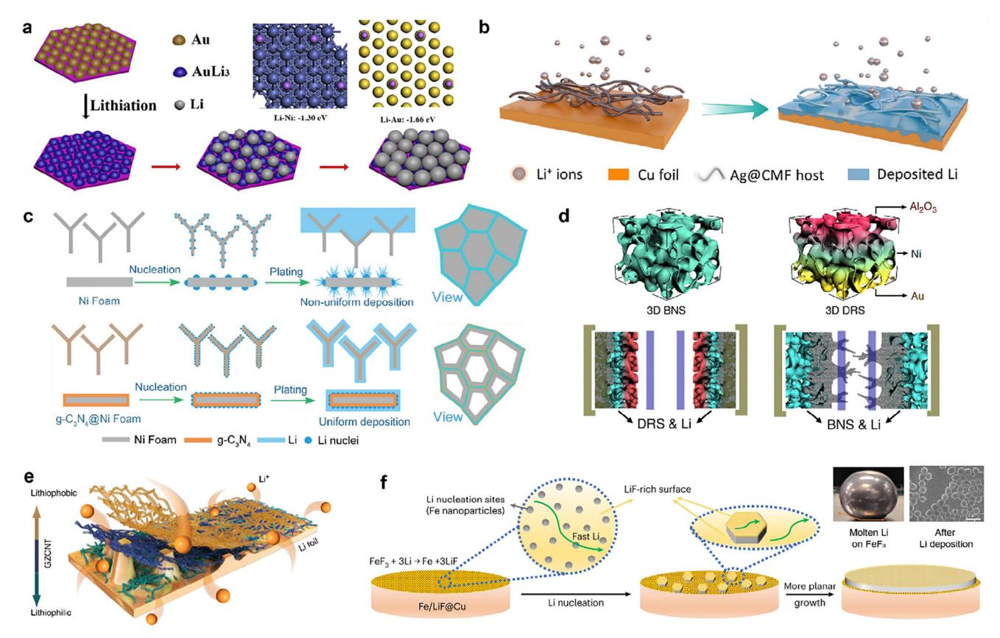

**Figure 8.** a) Li electrodeposition on the pristine Ni foam and AuLi3-coated Ni foam substrates. Inset: calculated adsorption energies of Li–Ni and Li–Au. Reproduced with permission.[\[154\]](#page-27-0) Copyright 2019, Elsevier. b) Planar Li deposition on an Ag nanoparticle–embedded nitrogen-doped carbon macroporous fiber (Ag@CMF) host. a,b) Reproduced with permission.[\[157\]](#page-27-0) Copyright 2021, The American Association for the Advancement of Science. c) Li nucleation and plating processes on bare Ni foam and Ni foam coupled with graphitic carbon nitride (g-C3N4) and the corresponding top-view diagrams. Reproduced with permission.[\[158\]](#page-27-0) Copyright 2019, Wiley-VCH. d) Schematic depiction of different Li deposition in cells using bare Ni scaffold (BNS) and deposition-regulating scaffold (DRS) with Al2O3 (top) and Au (bottom). Reproduced under the terms of the CC-BY Creative Commons Attribution 4.0 International License [\(https://creativecommons.org/licenses/by/4.0\)](https://creativecommons.org/licenses/by/4.0).[\[161\]](#page-27-0) Copyright 2019, J. Pu et al., published by Springer Nature. e) Suppression of Li dendrites and effective Li-ion transport by lithiophilic-lithiophobic gradient ZnO-coated CNT (GZCNT) onto Li foil. Reproduced under the terms of the CC-BY Creative Commons Attribution 4.0 International License [\(https://creativecommons.org/licenses/by/4.0\)](https://creativecommons.org/licenses/by/4.0).[\[50\]](#page-25-0) Copyright 2018, H. Zhang et al., published by Springer Nature. f) Lithiophobic FeF3 coating and its electrochemical reaction to Fe/LiF nanocomposite with regulating Li nucleation and growth. Reproduced with permission.[\[165\]](#page-27-0) Copyright 2023, Springer Nature.

metallic framework and tend to accumulate and be depleted on its outermost part near the positive cathode during Li deposition, anisotropic overgrowth of Li deposits would predominantly occur at the top mouth region of the 3D current collector. Introducing a lithiophilicity gradient or endowing a lithiophilic layer with a top lithiophobic region could be one of the effective strategies to aid Li-ion conveyance and plating inside the framework (Figure 8d).[\[161,162\]](#page-27-0) Additionally, controlling lithiophilicity and lithiophobicity remains a formidable challenge, especially in the case of 2D SEI systems. This is because, unlike the 3D skeletal system having additional accommodations for controlling lithium ions, the host-less planar configuration should be manipulated with both lithiophilicity and lithiophobicity for smooth Li-ion transport and regular Li plating/stripping at the interface between lithium metal anode and SEI layer, not between artificial SEI layer and electrolyte or within the SEI. For instance, a lithiophilic bottom layer and a lithiophobic top layer of an artificial SEI layer enabled the uniform Li electrodeposition and suppression of lithium metal dendrites, respectively (Figure 8e).[\[50,163,164\]](#page-25-0) Through the harmonious interplay of lithiophilic and lithiophobic sites during the initial cycles, well-regulated Li-ion transport at the Li–SEI interface can be achieved, fostering a more uniform planar Li plating process (Figure 8f).[\[165\]](#page-27-0) The eventual findings underscore that the pivotal solution lies not solely in boosting lithiophilicity, but in architecting film constitution and configuration with consideration for both lithiophilicity and lithiophobicity.

#### **4.3. Interfacial Adhesion of the SEI Layer**

Establishing a favorable native SEI layer or artificial SEI layer onto the lithium metal anode has been preventing unexpected side reactions and stabilizing the Li–SEI interface, contributing to the reduction of capacity decay over cycles and the enhancement of coulombic efficiency. The steady SEI interface can withstand harsh electrochemical discharging/charging cycles along with demonstrating high integrity with the lithium metal anode.

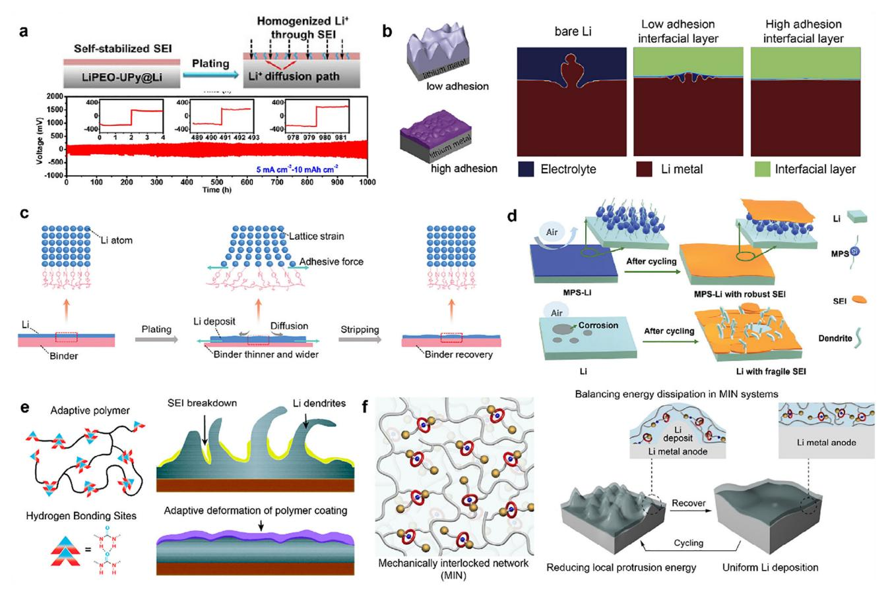

**Figure 9.** a) Self-stabilized SEI layers by supramolecular polymeric adhesives on the lithium metal anode (top) and its stable Li plating/stripping behavior (bottom). Reproduced with permission.[\[166\]](#page-27-0) Copyright 2019, Wiley-VCH. b) 2D phase-field simulation results of different adhesion interfacial layers. Reproduced with permission.[\[168\]](#page-27-0) Copyright 2020, Elsevier. c) Mechano-electrochemically stimuli-responsive coatings with strong ionic bonding with releasing stress for uniform Li plating. Reproduced with permission.[\[174\]](#page-27-0) Copyright 2023, Wiley-VCH. d) Silane coupling agents onto the lithium metal anode in ensuring robust SEI layers. Reproduced with permission.[\[178\]](#page-28-0) Copyright 2021, Wiley-VCH. e) Self-adaptive polymeric materials with high viscoelasticity. Reproduced with permission.[\[182\]](#page-28-0) Copyright 2021, Wiley-VCH. f) Molecular machines of mechanically interlocked network (MIN) with facilitating energy dissipation during Li deposition. Reproduced with permission.[\[119\]](#page-27-0) Copyright 2022, Wiley-VCH.

Particularly, ensuring good contact, strong adhesion strength, and mechanical compatibility is of paramount importance. First, the well-established contact between the lithium metal anode and artificial SEI or surface coatings can aid in lowering interfacial resistance by preventing improper interaction and empty spacing (**Figure 9**a).[\[166\]](#page-27-0) These artifacts may occur at the interfacial contact, and the poor contact points could serve as springs of undesired by-products, potentially accelerating the failure of the lithium metal anode and SEI. Strong adhesion strength is therefore indispensable in preparing a Li–SEI interface that is beneficial in inhibiting its collapse and maintaining uniform Li-ion flux and stable Li electrodeposition (Figure 9b).[\[167,168\]](#page-27-0) The adhesion strength is attributed to SEI components, the degree of homogeneity, and binding interactions. The typical native SEI indicates a multicomponent heterogeneous system. In the complex mixture, different organic and inorganic SEI components exhibit varying levels of adhesion to lithium metal, potentially leading to uneven adhesion strength of the Li–SEI interface and resulting in the formation of new hotspots contributing to electrode degradation and poor electrochemical performance.[\[37,169\]](#page-25-0) Since inorganic SEI components display stronger lithium adhesion than organic SEI components, SEI layers composed entirely of inorganics may seem the most promising, but they can be prone to easy destruction due to their inherent brittleness.[\[170,171\]](#page-27-0) That is why the robust Li–SEI interface should entail a homogeneous presence of both organic and inorganic SEI components for interfacial flexibility and structural uniformity, which is an instrumental factor in securing coherent adhesion strength. And, since lithium ions migrate through grain boundaries rather than through grains, efficient Li-ion transport presupposes welltailored grain boundaries favorable to the space charge effect, as well as moderate, occasionally microcrystalline, size and distribution of the various grains in the complex SEI system.[\[172,173\]](#page-27-0) In addition to the native SEI, artificial SEI and surface coatings can adhere to the lithium metal anode through covalent and ionic bonds, Van der Waals forces, and electrostatic forces. The metallic nature of Li induces unsystematic adhesion with the external layer, lacking directionality and specific coordination. When the lithium metal electrode is electrically negatively or positively polarized for electrochemical cell operation, the interfacial adhesion of the Li–SEI could be further electrostatically fortified by the induced dipoles of organic SEI components such as

oxalates, semicarbonates, and alkoxides, or polymeric SEI components such as –(CH2-CH2-O-)n, and the permanent dipoles of inorganic SEI components such as LiF, Li2O, and Li2CO3. However, the eventual coulombic and ionic interactions are relatively weak non-contact forces, which need to be fortified for a more stable Li–SEI. For enhancing the interfacial adhesion, the introduction of lithiophilic materials with high Li binding energy or various polar functional groups containing highly electronegative or polarizable atoms into the foreign layer can effectively increase the specific Li–SEI interfacial affinity, including strong electrostatic attraction or ionic bonding (Figure [9c\)](#page-13-0).[\[174–177\]](#page-27-0) In cases of poor contact, the utilization of adhesives or coupling agents can allow for promoting adhesion strength between the foreign layer and the lithium metal anode (Figure [9d\)](#page-13-0).[\[178\]](#page-28-0) If the lithium metal anode needs to grow prior to the cycling operation, weak binding or bonding between the artificial SEI layer and the current collector may be required for the formation of a new lithium metal interface. In addition to strong affinity with lithium, it is significant for the artificial SEI layers themselves to withstand harsh discharging/charging cycles. The foreign coatings necessitate not only electrochemical stability but also superior mechanical strength to maintain their integrity even under repetitive strain conditions. Typically, when considering their mechanical properties, it is preferable to indicate a strong elastic modulus more than an order of magnitude higher than that of lithium metal anode,[\[179\]](#page-28-0) which is especially important when the structural uniformity is not given. In other cases where this is not applicable, it has been proposed that self-adaptive materials that can readily accommodate cyclical deformations (Figure [9e\)](#page-13-0) [\[180–182\]](#page-28-0) or molecular mechanics that exhibit energy-dissipating properties through a mechanically interlocked network could be viable options (Figure [9f\)](#page-13-0).[\[119\]](#page-27-0) Although there have been some attempts to elucidate the Li–SEI interface by understanding different mechanical properties, particularly resilience and types of deformation,[\[32\]](#page-25-0) precise guidelines for mechanical strength and conditions have not been provided. This is because monitoring the mechanical properties of inhomogeneous SEI layers on the delicate lithium metal substrate still has its limitations in analytical methods and experiments. However, there is no doubt that interfacial contact, adhesion strength, and mechanical compatibility must be taken into consideration as key elements when fabricating artificial SEI layers onto the lithium metal anode, and these factors need to be improved.

### **4.4. Optimal Thickness of Artificial SEI Layer**

For designing artificial SEI and surface coatings on the lithium metal anode, determining thickness is important. As Li ions must pass through the layer to reach the lithium metal surface, reducing the layer thickness, which corresponds to interfacial resistance, can considerably aid smooth Li-ion transport. Concomitantly, in the complex Li–SEI interface system, involving repetitive charging/discharging cycles, merely thinning the foreign layer, would deteriorate its mechanical strength, making it challenging to withstand the harsh operating conditions. Therefore, to satisfy facilitated Li-ion transport while effectively protecting the lithium metal anode, an appropriate layer thickness needs to be established depending on the materials used. Unfortunately, there is no unanimous criterion for determining thickness, aside from the consensus that thinner layers are generally preferable. In some instances, films with micrometer thicknesses can provide ion-conductive channels, ensuring facilitated Li-ion transport.[\[183\]](#page-28-0) In other cases, films with exceptionally thin nanometer-scale thickness may exhibit brittle characteristics, rendering them unsuitable as a safeguard for the lithium metal anode.[\[134\]](#page-27-0) Furthermore, since the use of thin Li foil is crucial for achieving high-energy-density batteries, it is desirable to minimize the thickness of the layer applied to it. That is why the interplay of thickness, ion conductivity, and mechanical strength are essential prerequisites for stable SEI formation, which calls for unconventional approaches to incur stable interfacial properties of Li metal.

## **5. Unconventional Emerging Approaches: Beyond Traditional Artificial SEI and Surface Coatings with New Design Parameters**

In the previous sections, we reviewed various traditional strategies for forming protective layers on lithium metal anodes. While these methods have contributed to mitigating the key challenges at the Li metal interface, they usually tend to target specific, isolated issues, such as dendrite suppression or SEI stabilization, without addressing the broader, system-level complexity of lithium metal batteries. Consequently, the performance improvements achieved through conventional strategies often remain limited and insufficient for practical, long-term applications.

To overcome these limitations, a new class of unconventional surface engineering approaches has recently emerged, aiming to tackle multiple fundamental challenges simultaneously. Unlike traditional artificial SEIs that passively facilitate lithium-ion transport under external electric fields, unconventional strategies seek to engage more actively with the Li/SEI/electrolyte interface. Crucially, the SEI is now understood as a dynamic, multi-component interphase, where mass transport and electrochemical reactions occur concurrently. Traditional artificial SEI designs often focus on mechanical robustness and chemical passivation but overlook key interfacial processes such as solvation/desolvation dynamics and compatibility thereof with electrolyte solvents or additives. This oversight limits their capacity to fully stabilize lithium metal under aggressive cycling conditions.

Unconventional approaches, by contrast, integrate novel fabrication methods and interfacial chemistry to exert broader control over these dynamics. They regulate not only lithium-ion conduction but also the movement of solvents, co-solvents, and additives, enabling enhanced electrolyte affinity and tailored interfacial interactions. As a result, they facilitate the formation of ultrathin, uniform, and ionically conductive SEI layers that better support the complex electrochemical environment. These advancements offer several distinct advantages: improved lithiumion transference numbers, increased interfacial and cycling stability, greater flexibility in SEI design, and synergistic enhancement of both SEI and electrolyte performance. Nevertheless, several challenges still remain. The strong coupling between Li, SEI, and electrolyte phases makes experimental validation of such systems difficult, and their performance often shows high

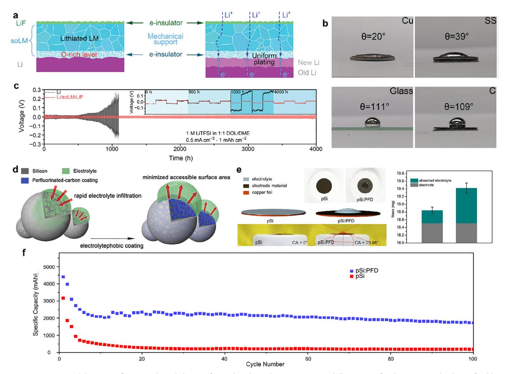

**Figure 10.** a–c) Wettability-tuning for Li metal anode by transferring liquid metal. a) Cross-sectional illustration of Li deposition under the artificial hybrid solid electrolyte layer (Li/soLM/LiF). b) Wettability characterization and contact angle measurements of LM on Cu, SS, glass, and carbon & MD simulation of LM on SS. c) Cycling performance of bare Li and Li/soLM/LiF symmetric cells using ether electrolytes at 0.5 mA cm−2 and 1 mAh cm−2. a–c) Reproduced with permission.[\[184\]](#page-28-0) Copyright 2022, Wiley-VCH. d–f) Electrolyte-phobic coating strategy of the electrode. d) Schematic illustration of electrolyte-phobic pSi:PFD. e) Wetting behavior and a comparison between the mass of absorbed electrolytes on of pSi:PFD and pristine pSi-based electrodes f) Cycling performance for 100 cycles of cell with pSi:PFD and the pristine pSi based cathode and LM anode. d–f) Reproduced with permission.[\[185\]](#page-28-0) Copyright 2020, American Chemical Society.

sensitivity to electrolyte composition. Moreover, while ultrathin SEIs are beneficial for ion transport, their limited mechanical strength may necessitate additional structural support or hybrid layer designs. The absence of a universally accepted SEI model further highlights the need for continued fundamental exploration.

In the following subsections, we categorize and discuss representative examples of these emerging approaches, with a focus on their design principles, interfacial functions, and potential to advance lithium metal battery technologies beyond current limitations.

#### **5.1. New Material Design by Improving Compatibility with Electrolyte or Native SEI**

The impact of wetting and intimate contact with the electrolyte, lithium cathode, or current collector on the movement of lithium ions and the formation of SEI has been previously discussed. Lithium metal batteries are affected by artificial SEI layers or electrode wetting and surface properties. Specifically, the lithium anode (Li/superficially oxidized liquid metal (soLM)/LiF) protected by an artificial hybrid SEI layer consisting of two liquid metal (Ga0.685In0.215Sn0.1) and sputtered LiF layers exhibits enhanced ion transport, electron shut-off capabilities, and mechanical strength (**Figure 10**a).[\[184\]](#page-28-0) Of particular importance is understanding the spreading and de-wetting characteristics of the artificial SEI layer for the manufacturing process of Li/soLM/LiF anode-based cell, which also demonstrates that the artificial SEI layer can easily detach when liquid metal (LM) is coated onto a stainless steel substrate. On carbon and glass substrates, LM exhibits a high contact angle, preventing uniform wetting and coating. To achieve a uniformly coated artificial SEI layer, it should be transferred to an SS substrate with appropriate wetting and spreading properties, as depicted in Figure 10b. The uniform coating of LM and LiF on lithium leads to the rapid diffusion of lithium ions and the homogeneous suppression of lithium dendrite formation. Consequently, the Li/soLM/LiF-based symmetric cell demonstrates extended cycling performance with low average overpotentials (≈15 mV) over 4000 h when operated in a 1 m lithium bis (trifluoromethanesulphonyl)imide (LiTFSI) electrolyte with 1,3-dioxolane (DOL) and DME at current densities of 1 mAh cm−2 and 0.5 mA cm−2 (Figure [10c\)](#page-15-0). Another illustrative example pertains to the influence of electrolyte affinity on battery performance. Specifically, pSi:PFD, synthesized through a hydrosilylation process that grafts 1H,1H,2H-perfluoro-1-decene (PFD) chains onto the surface of porous silicon (pSi), exhibits pronounced electrolyte-phobic properties (Figure [10d\)](#page-15-0).[\[185\]](#page-28-0) On the electrode surface of pSi:PFD, the electrolyte droplet exhibits distinctive curvature, yielding a measured contact angle of 23.98°, in stark contrast to the complete wetting observed on pSi. Additionally, the pSi:PFD electrode exhibits significantly reduced electrolyte absorption, quantified at 0.36 ± 0.11 mg, as opposed to the 0.92 ± 0.13 mg observed for the pSi electrode (Figure [10e\)](#page-15-0). Cycling test also reveals a rapid capacity decline for pSi, reaching ≈200 mAh g−1 after ≈30 cycles (Figure [10f\)](#page-15-0). In contrast, pSi:PFD based cathode paired with LM anode maintains a consistent capacity, retaining 2000 mAh g−1 after 60 cycles and 1750 mAh g−1 after 100 cycles (1 C = 4.2 A g−1).

In addition to the new material design to improve the compatibility with electrolytes, some research approaches were also proposed to improve the interfacial properties of SEI layer (native SEI layer). The native SEI layer has inherent limitations in inhomogeneous distribution and thickness, which hamper facile Li-ion transport and dendritic growth of Li metal. As a result, novel materials have been adopted to improve the native SEI layer. The single ion conducting layer composed of lithium bis(allylmalonato) borate (LiBAMB) and pentaerythritol tetrakis(2-mercaptoacetate) was devised and employed for Li metal, which led to improved interfacial characteristics and performance.[\[186\]](#page-28-0) In a cross-linked network, BAMB anions are covalently bonded, which leads to single ion conduction. It resolved the inherent issues of the native SEI layer by providing high Liion conductivity and Li-ion transference number as well as preventing the growth of Li dendrites. Han et al. adopted a composite SEI layer composed of 1-(6-bromohexanoyl)-3-butylurea (denoted as LiBr-HBU SEI layer), which exhibited outstanding electrolyte wettability and air stability.[\[187\]](#page-28-0) The Li-ion conductivity was measured as 2.75 × 10−4 S cm−1, which is 50 times higher than the value measured for the native SEI layer. With the addition of the bisamido groups, the composition and structure of the SEI layer were changed, leading to significantly improved rate capabilities and cycling stability.

#### **5.2. Weak-Solvation and Desolvation-Boosted Surface Coating**

The interaction between lithium and the anions present in the solvent and salt constituting the electrolyte plays a pivotal role in governing desolvation and solvation energies. Furthermore, it significantly influences the composition and physical characteristics of SEI layer. Rapid desolvation induces alterations in SEI constituents and, thus, has a profound impact on the mobility of lithium ions, thereby causing discernible variations in the performance of lithium metal batteries. There are two prominent strategies for harnessing weak solvation effects: one involves the adoption of novel solvents with mixing ratio,[\[188,189\]](#page-28-0) while the other employs catalysts.[\[190,191\]](#page-28-0) In the case of fluorinated weakly-solvating electrolytes (FWSE), comprising of 1.0 M LiFSI dissolved in fluorinated carbonate and ether solvents, the presence of multiple fluorine (-F) groups confers a potent electron-withdrawing influence that attenuates interactions with charge carriers. Furthermore, owing to the diminished binding energy between Na+ cations and fluorinated solvents, this electrolyte exhibits rapid desolvation, leading to accelerated reduction relative to lithium. Consequently, a hybrid SEI layer is formed, comprising both lithium and sodium constituents, including NaF, LiF, Li2CO3, and Na2CO3. These components synergistically facilitate the swift transport of lithium ions (**Figure 11**[a\)](#page-17-0).[\[192\]](#page-28-0) The resultant enhancement in capacity retention is notable, achieving an impressive 80.6%, accompanied by an average coulombic efficiency of 99.88%, as opposed to a mere 46.4% capacity retention observed after 500 cycles in a Graphite/NMC 523 full cell cycled with a LiPF6-EC/EMC electrolyte (Figure [11b\)](#page-17-0). An alternative approach to induce rapid desolvation involves the creation of a single-atom catalytic layer on Li metal anode to serve as a kinetic enhancer. This is exemplified by the development of a cation vacancy-rich cobalt sulfide (CVRCS) structure incorporated within a 3D porous carbon matrix (SAFe/CVRCS@3DPC).[\[190\]](#page-28-0) This catalytic layer is established through a hydrothermal reaction, wherein an individual iron atom is firmly anchored to the defect sites of cobalt sulfide nanoparticles embedded within a 3D carbon scaffold. As depicted in Figure [11c,](#page-17-0) both the DME and DOL molecules, coordinated to the central Li+ ions within the Li(DME)4 + or Li(DOL)4 + complexes, exhibit a marked tendency to migrate toward the surface of SAFe/CVRCS. Such behavior suggests that these desolvation processes transpire spontaneously (ΔG *<* 0), resulting in the release of Li ions without incurring additional energy costs. Consequently, a profusion of free Li+ ions is catalytically liberated from the Li+ solvation complexes, thereby diminishing desolvation and diffusion barriers (Figure [11d\)](#page-17-0). The modified full cell demonstrates commendable reversible rate capabilities, affording rate-specific capacities of 140 mAh g−1 and 123 mAh g−1 at 2 C and 5 C, respectively. Furthermore, when paired with a LiFePO4 cathode, the SAFe/CVRCS@3DPC-modulated full cell sustains stable performance over 1000 cycles, exhibiting a minimal fading rate of merely 0.030% per cycle at 1 C (Figure [11e\)](#page-17-0).

The generation of locally high-concentration electrolytes (LHCEs), denoted as H1 and H2, can be realized by employing tetrahydrofuran (THF) solvent, LiFSI salt, and tetrafluoropropyl ether (TTE) diluent.[\[191\]](#page-28-0) LHCE formulations serve to induce the formation of a uniform SEI layer and facilitate lithium ion diffusion within the cell. Through the incorporation of TTE, partial coordination and separation of lithium ions within the electrolyte milieu are achieved. LHCE systems manifest two distinct coordination environments, characterized by the presence of Li─O interactions originating from THF and Li─O interactions originating from the FSI− anion. Notably, in the case of LHCE formulation H1, the coordination number between TTE and Li ions is observed to be zero, indicating no noticeable influence on the solvation structure (Figure [11f\)](#page-17-0). The introduction of an ultra-low concentration electrolyte that preserves the unaltered Li+ solvation structure effectively mitigates the occurrence of

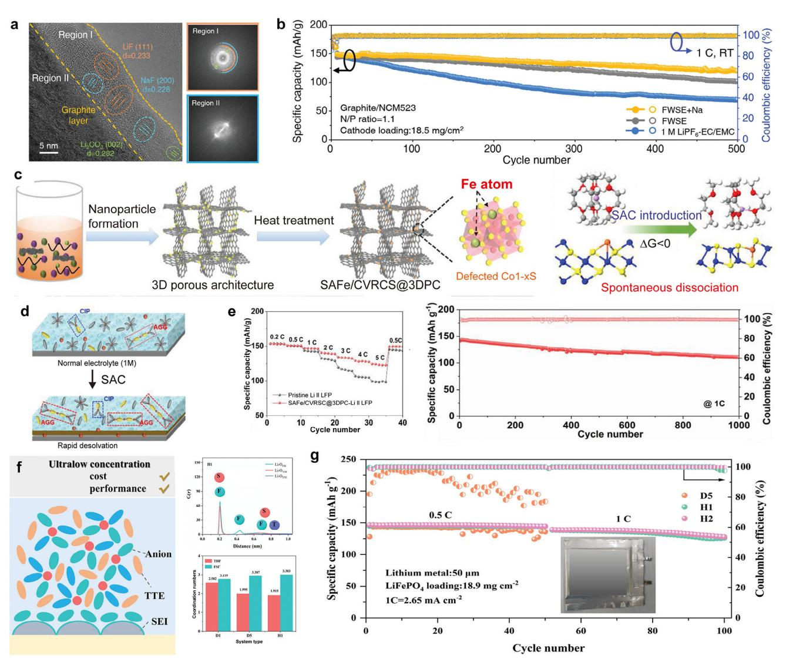

**Figure 11.** a,b) Lowering desolvation energy using the adoption of sodium cations (Na+). a) Cryo-TEM analysis on the SEI structure using FWSE+Na electrolytes with the corresponding FFT images on the right side. b) Long-term cycling stability of graphite/NCM523 full cells at RT under 1 C rate. a,b) Reproduced with permission.[\[192\]](#page-28-0) Copyright 2023, Wiley-VCH. c–e) Single-atom catalytic layer for fast desolvation on LM anode. c) Schematic synthesis of the SAFe/CVRCS@3DPC & desolvation barrier of Li(DME)4+ into Li(DME)3+ and DME on SAFe/CVRCS calculated by DFT. d) Schematic illustration of further depleting solvent molecules on the catalytic surface. e) Cycling performance of SAFe/CVRCS@3DPC-Li||LFP cell at 1 C for 1000 cycles. c–e) Reproduced under the terms of the CC-BY Creative Commons Attribution 4.0 International License [\(https://creativecommons.org/licenses/by/4.0\)](https://creativecommons.org/licenses/by/4.0).[\[190\]](#page-28-0) Copyright 2023, J. Wang et al., published by Wiley-VCH. f,g) Locally concentrated electrolytes for unchanged solvation structure in LMB. f) Design models of different electrolytic liquid systems and radial distribution functions of locally high-concentration electrolytes (LHCE, with tetrafluoropropyl ether(TTE; H1)). g) Cycling performance of Li||LiFePO4 pouch cells cycled in D5(without TTE), H1 (with TTE), and H2 (with high concentration of TTE). f,g) Reproduced under the terms of the CC-BY Creative Commons Attribution 4.0 International License [\(https://creativecommons.org/licenses/by/4.0\)](https://creativecommons.org/licenses/by/4.0).[\[191\]](#page-28-0) Copyright 2022, T. Chen et al., published by Wiley-VCH.

inhomogeneous Li+ diffusion flux. Consequently, this promotes uniform lithium deposition and stripping processes while simultaneously fostering the development of a LiF-enriched SEI layer. As shown in Figure 11g, an assembled pouch cell conFigure d with LFP cathode and Li metal anode demonstrates remarkable cycling stability, marked by a capacity retention of 91.4% at a current density of 1 C (= 2.65 mA cm−2). Based on these examples, it can be suggested that barriers of solvation and desolvation can be altered or lowered by adopting tailored electrolyte system, which cannot be overlooked.

#### **5.3. State-Of-The-Art Fabrication Technique for Uniform Thin Layer Coatings**

Functional protective coatings for the stable lithium metal anode should ideally be present as a uniform thin layer onto the surface of lithium metal. To enable this, the feasible processes are as instrumental in outperforming the lifetime and capability of reported lithium metal batteries as discovering intriguing materials and proposing novel concepts. With recent technological advances, there are growing commitments to the effective modification of lithium metal anode, envisioning highperformance and prolonged lithium metal batteries using inventive manufacturing techniques that surpass conventional solventbased approaches. Given the potential concerns and damages to lithium metal, i.e., local surface tension effects and dewetting during solvent evaporation, in traditional solution processes,[\[193\]](#page-28-0) vapor-phase processes are gaining considerable attention as a cutting-edge technology due to the absence of interfacial effects in the fabrication process. Some advanced solvent-free vacuum processes are being spotlighted and need to be discussed with respect to the process itself and the resulting film characteristics, focusing on the improvement of artificial SEI layers or surface coatings.

MLD is an attractive method for affording organic/hybrid surface coating using small, bifunctional organic molecules.[\[194\]](#page-28-0) Similar to ALD, MLD presents a viable vapor-phase approach for producing ultrathin, conformal films at the atomic level and involves self-limiting adsorption between precursors and sequential layer-by-layer growth. Through these methods, a few nanometer-thick uniform nanolayers can be deposited monolithically onto the lithium metal anodes, offering the advantage of reducing interfacial resistance to facilitate Li-ion transport. Particularly, the film achieved through MLD differs significantly from the inorganic films fabricated by ALD technique in that the synthetic ultrathin layers exhibit mechanical flexibility. For instance, the combination of ALD-Al2O3 and MLD-alucone can readily mimic native SEI layers with organic/inorganic dual protective layers (**Figure 12**[a\)](#page-19-0), providing high-precision control over thickness and composition.[\[134\]](#page-27-0) The natural SEI-inspired layers, consisting of organic materials as the outer layer and inorganic materials as the inner layer, demonstrated noticeable mechanical strength on the lithium metal anode compared with those using inorganics as the outer layer and organics as the inner layer (Figure [12b\)](#page-19-0). Additionally, the flexible layer composition adjustment enabled by the MLD process allows for the formation of out-of-plane gradient coatings. By gradually diminishing the lithiophilic Zn concentration (Figure [12c\)](#page-19-0), the sophisticated interphase exhibited upward electrical insulation and downward lithium ion affinity, leading to selective Li nucleation and electrodeposition.[\[130\]](#page-27-0) Notably, as a practical application for lithium metal anodes, Li-O2 batteries demonstrated safe cycling performance for over 1500 h (Figure [12d\)](#page-19-0).

This MLD process is a highly desirable choice for building surface coatings and interfaces for the ideal SEI layer, but several significant considerations still remain overlooked. The adsorption and surface reaction of the gaseous precursors are very sensitive to the substrate temperature, which affects the usable reactant library and its combination. In most cases, the aforementioned processes require a substrate temperature near or above the melting point (180.5 °C) of lithium metal, making it difficult to fully utilize the secured process conditions and thin film thickness due to excessive adsorption of precursors and its non-self-limiting reaction on the substrate at lower temperatures.[\[195\]](#page-28-0) Given redox reactions involved in this approach, it is critical that oxidizing agents be introduced only after introducing reducing agents. However, there is a concern that lithium metal, with its lowest reduction potential, would be easily exposed to various oxidants. The resulting undesired layers might compromise interfacial integrity, failing to guarantee their intact contact with the pristine lithium metal, which could lead to reduced capacity and varied kinetic due to transformation. Given that MLD hybrid composite layers exhibit weak and unstable interactions between metal ions and organic ligands in the layer-by-layer assembly, they might be susceptible to dissolution in a liquid environment.[\[196\]](#page-28-0) To establish them as highly reliable surface coatings for lithium metal anodes, further progress is needed in low-temperature processing and stable, strong coordination chemistry.

iCVD can serve as a potent tool for the rational design of ultrathin, conformal, and multi-functional polymer nanolayers.[\[197\]](#page-28-0) This vacuum process entails the formation of high-purity, highquality polymeric films through surface growth based on free radical polymerization, providing a fine-tuned thickness in the range of tens of nanometers. Notably, at room temperature (20– 50 °C), the entire pinhole-free film fabrication can be carried out without damaging the surface of solvent- and heat-sensitive substrates, along with no surface tension effect commonly observed in the liquid-phase process. In the vapor phase, it offers flexibility for a wide range of functional polymer candidates, including amine, amide, ether, organosiloxane, fluorine, and even combination of hydrophilicity and hydrophobity without compatibility or miscibility issues. The iCVD process allows for the constitutional differences of polymeric films through precise control of monomer flow rate and ratio, ensuring not only control of mechanical and chemical properties but also the design of layer-by-layer and gradient composition perpendicular to the plane. Interestingly, owing to its versatility, the iCVD process presents a streamlined approach for the fabrication of ionconductive polymer films. Ion-conductive nanolayers could provide an impetus for ionic conduction and ion-selective transport, including Nafion-like ion channels with phase separation, thin film polymer electrolytes, and solidification of ionic liquids for an ion-conducting membrane.[\[198–200\]](#page-28-0) Stalin et al. suggested an ultrathin zwitterionic polymer interphase using a vapor-phase derivatization step after deposition (Figure [12e\)](#page-19-0).[\[136\]](#page-27-0) Following post-treatment to quaternary ammonium species, the zwitterionic moieties rendered planar Li nucleation and growth with modulation of the redox reaction for electrochemical stability (Figure [12f\)](#page-19-0). Bae et al. demonstrated a novel approach for reinforcing native SEI layers through the electrolyte solvogel polymer nanolayer (Figure [12g\)](#page-19-0).[\[135\]](#page-27-0) The electrolyte-swollen scaffold of poly(dimethylaminomethyl styrene) (pDMAMS) facilitated selective Li-ion transport, achieving record-high Li-ion transference number (0.95) and high ionic conductivity (6.54 mS cm−1). Furthermore, unlike the heterogeneous SEI layers observed in the pristine lithium metal anode, the solvogel polymer film induced homogeneous inorganic-rich and Li2O-free SEI layers. Even after sufficient battery cycles, the pDMAMS layer remained both electrochemically and mechanically durable, effectively suppressing the formation of Li dendrites (Figure [12h\)](#page-19-0). At the optimal thickness of 100 nm, enabling sufficient electrolyte swelling, This new strategy was found to extend the battery cycling lifetime by 600% in Li full cells using LiNi0.6Mn0.2Co0.2O2 (NMC622) as the intercalation cathode (Figure [12i\)](#page-19-0).

However, there is one additional aspect to be scrutinized, which is the limited chemistry of polymer synthesis in the iCVD process. Unlike conventional solution-based polymerization processes, there are few approaches for regulating and extending the lifetime of initiators such as radicals or ions dissociated in

**Figure 12.** a) Dual-protective artificial SEI composite designs by ALD-inorganic and MLD-organic layers. b) Force-deflection curves of protective films made by MLD and ALD cross-deposition. Inset: AFM topography images of the dual-layer films obtained after failure. a,b) Reproduced with permission.[\[134\]](#page-27-0) Copyright 2019, Elsevier. c) Graphical image of MLD coating on the lithium metal graded by Zn concentration (left) and TOF-SIMS depth-profiling graphs of Zn fractional ions in Zn-gradient coating (right). d) Discharging/charging characteristics of bare Li and Li@Gr10 (gradient MLD 10 cycles) Li─O2 batteries (at areal capacity of 0.2 mAh cm−2). c,d) Reproduced with permission.[\[130\]](#page-27-0) Copyright 2021, Royal Society of Chemistry. e) Process diagram of iCVD film deposition and the subsequent derivatization for zwitterionic polymer nanolayers. f) (left) Morphology of lithium electrodeposits on the stainless-steel substrates coated with 10-nm-thick zwitterionic polymer coating in the nucleation stage. Scale bar: 2 μm. (right) Surface morphology on the current collector substrates after the growth stage with the capacity of 3 mAh cm−2. Scale bar: 5 μm. e,f) Reproduced with permission.[\[136\]](#page-27-0) Copyright 2021, Elsevier. g) Schematic illustration of electrolyte-swollen-soft scaffold nanolayer referred to as an electrolyte solvogel. h) SEM image of suppressed propagation of Li dendrites by pDMAMS layer. Scale bar: 50 μm. i) Cycle performance and coulombic efficiency of Li||NCM622 coin cells using pDMAMS-Li with different layer thickness. g–i) Reproduced with permission.[\[135\]](#page-27-0) Copyright 2023, Wiley-VCH.

the vapor phase, leading to a restricted influence on fundamental polymer characteristics, including molecular weight, molecular weight distribution, and polymer backbone. Accordingly, most of film properties could be contingent upon the mere selection of monomers. To expand undiscovered chemistry in iCVD, although it is effective within a finite pool of monomers, the Yeo and Yang research group suggested a novel concept of vapor phase solvation, offering the ability to adjust the molecular weight and molecular weight distribution of iCVD polymers.[\[201\]](#page-28-0) Nevertheless, this method is anticipated to facilitate the verification of elusive interfacial phenomena of Li–SEI and suggest its improvement that enables the reliable use of lithium metal anode while introducing the various functional protective coatings without causing surface damage to the lithium metal. Furthermore, the process compatibility (plasma, ultraviolet, and thermal post-processing) and industrial scalability (roll-to-roll and multibatch chamber) of the iCVD process make it more compelling than other process techniques.

#### **5.4. Advanced Electrolyte Additive with Coatings for Enhanced SEI Layer Control**

Advanced electrolyte additives are increasingly in demand as a comprehensive approach that can synergize the formation of favorable SEI layers and the control of specific SEI components. On the anode side, conventional electrolyte additives are consumable supplements that induce a single SEI component due to their relatively lower lowest unoccupied molecular orbital (LUMO) level compared to bulk electrolyte solvent components, contributing to the native SEI layers rich in that component. While it is an effective practice to build the SEI layers with prominent components such as LiF and Li3N, it is questionable whether simply assisting in the formation of a beneficial SEI component will unconditionally improve electrochemical performance and operating stability, or how much it will contribute to quantitative improvement in electrochemical performance from the perspective of the insitu or ex-situ (rather than operando) observation of the resultant SEI layers after cycles and interpretation of the cell results. It is difficult to determine a clear improvement in comparison with alternative strategies, including 3D current collectors or nanostructured membranes, that do not seem heavily dependent on controlling the native SEI layers. Furthermore, the established SEI layers still display configurational heterogeneity of many SEI components, where the role of individual components that make up SEI layers needs to be refocused. This is also related to the understanding of the interaction between SEI constituents, which is fundamental to formulating more effective SEI layers.[\[179,202–206\]](#page-28-0) Therefore, to unlock the potential in the complex SEI layers, advanced electrolyte additives aim to provide advantageous multicomponent effects through multiple electrolyte additives, or combine electrolyte additives with other approaches, rather than concentrating on a single SEI component. There is a lot of ongoing research, especially on multiple electrolyte additives,[\[172,207–215\]](#page-27-0) but this review will specifically focus on advanced electrolyte additives with tailored coating in the context of artificial SEI layers and surface coating on the electrode. If the native SEI layer constructed by electrolyte additives is not intertwined with the foreign layer, as if they are independent, the two layers will compete with each other within the intermingled interphase, which makes it challenging to achieve the cooperative effect. To achieve the synergistic effect of native and artificial SEI layers, electrolyte additives, and coatings must interact altogether or allow one to support the other. Additionally, if the electrolyte additives or coatings can take part in regulating the electrolyte solvation sheath or modifying the surface properties of built SEI layers, it is expected that they can also influence the Li electrodeposition behavior or the formation of SEI layers, resulting in even more interactive effects. For instance, Li et al. reported a high donor number anion additive for lithium trifluoroacetate, which led to the formation of anion-rich solvation structure.[\[216\]](#page-28-0) Such structure also regulated the solvation sheath with reduced solvent coordination number. A similar example can also be found in magnesium (Mg)-ion batteries and aqueous batteries, which shows the effectiveness of introducing electrolyte additives to regulate the electrolyte solvation sheath and enhance the SEI layer.[\[217,218\]](#page-28-0) The following potential approaches have been suggested: ionic liquids, electrolyte additive reservoir systems, and polymerizable organic electrolyte additives.

The ionic liquid is a compelling choice due to its ability in spreading as a thin film covering the lithium metal anode, serving the dual roles of an electrolyte additive and a surface coating. Ionic liquid exists as an organic salt in a liquid state bound by strong electrostatic interactions rather than in a crystalline phase at room temperature due to the size asymmetry between cations and anions. When added as electrolyte additives, they become electrostatically debonded and play different roles on the surface of the lithium metal anode. Choi et al. formulated an ionic liquid additive of 1-dodecyl-1-methylpyrrolidinium (Pyr1(12)+) bis(fluorosulfonyl)imide (FSI−) to utilize synergistic effects of cations and anions.[\[219\]](#page-28-0) The Pyr1(12)+ cation regulates Li-ion distribution uniformly over the lithium metal anode through an electrostatic shielding effect and controls the growth of lithium dendrites, along with the lithiophobicity of nonpolar long alkyl chain (**Figure 13**[a\)](#page-21-0). The FSI− anion contributes to constructing rigid LiF-rich SEI layers with wide electrochemical stability window. As its follow-up study, Kang et al. scrutinized the electrostatic shielding effect of cations with varying alkyl chain length and symmetry.[\[220\]](#page-28-0) Importantly, the Pyr6(6)+ cation with sufficient alkyl chain length symmetry effectively shielded the Li tip without heavy agglomeration (Pyr1(12)+) and incomplete covering (Pyr3(3)+) (Figure [13b\)](#page-21-0). In addition to the stable, high-performance operation of Li-LiFePO4 (LFP) and Li-Li– LiNi0.6Co0.2Mn0.2O2 (NCM622) cells, they successfully demonstrated a high energy density of≈658 Wh kg−1 in coin cell with a limited ultrathin Li anode coupled with a high-loading NCM622 (≈12 mg cm−2) cathode. Despite these advantageous characteristics, the progress of ionic liquids as electrolyte additives is still in the early stages, and their expected properties and phenomena are not fully understood. This is because complex kinetics are involved in their competition with lithium salts, solvents, and even co-solvents present in the electrolyte, which impact the solvation shell sheath and lead to unstable SEI layers and lithium metal anode. These considerations need to be addressed.

The electrolyte additive reservoir concept continuously releases targeted electrolyte additives from surface coatings on the lithium metal anode throughout prolonged battery operation, preventing the sudden depletion of the electrolyte additive and aiding in the sustained formation of stable SEI layers. Inspired by the concept of sustained-release medications and some sort of drug delivery systems in the human body, these promising methods have been proposed by embedding additives in various types of frameworks. Liu et al. proposed a microporous polymer structure for the steady release of low-solubility electrolyte additives.[\[221\]](#page-28-0) The addition of nitrate anions (NO3 −) has a beneficial impact on the morphology and reversibility of Li-ion electrodeposition, but LiNO3 electrolyte additives show poor solubility in stable, commercial carbonate electrolytes, which has limited their applications in ether electrolytes. For LiNO3 additives to exhibit dissolution into the electrolytes and continued participation in on-electrode reactions, porous poly(vinylidene fluoride*co*-hexafluoropropylene) (PVDF-HFP) immersed in LiNO3 was coated onto the Cu foil by blade coating (Figure [13c\)](#page-21-0). The LiNO3 incorporated PVDF-HFP film was peeled off from the Cu substrate, and the obtained freestanding polymer membrane was covered onto the anode. While subsequently released after operation, it led to uniform, chunk-like Li deposition, in contrast to the filamentous shape typically observed in carbonate

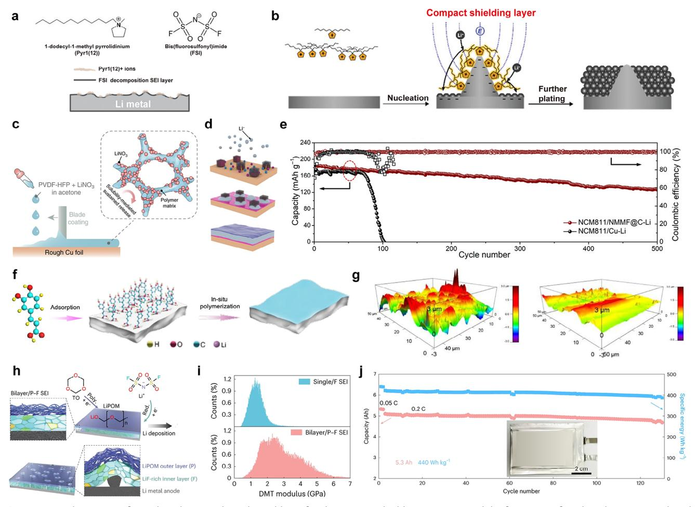

**Figure 13.** a) The impact of ionic liquids as an electrolyte additive for electrostatic shielding on Li tips and the formation of rigid SEI layers. Reproduced with permission.[\[219\]](#page-28-0) Copyright 2018, Wiley-VCH. b) The lithiophobic protective layers on Li tips by ionic liquid cations, Pyr6(6)+, with identical alkyl chain length and symmetry. Reproduced with permission.[\[220\]](#page-28-0) Copyright 2022, Wiley-VCH. c) The preparation process and operational mechanism of a LiNO3 sustained-release film (LNO-SRF). Reproduced under the terms of the CC-BY Creative Commons Attribution 4.0 International License [\(https:](https://creativecommons.org/licenses/by/4.0) [//creativecommons.org/licenses/by/4.0\)](https://creativecommons.org/licenses/by/4.0).[\[221\]](#page-28-0) Copyright 2018, Y. Liu et al., published by Springer Nature. d) In situ formation of native SEI layers from dissolved metal and fluoride ions in the microspansule system. e) Cycle performance and coulombic efficiency of Li||NCM811 coin cells using NMMF@C-Li and Cu-Li at the current density of 1 C. NMMF@C indicates NaMg(Mn)F3 core@shell. d,e) Reproduced with permission.[\[222\]](#page-28-0) Copyright 2020, The American Association for the Advancement of Science. f) The working principle and effect of a caffeic acid (CA) additive for stable multifunctional SEI layers on the lithium metal anode. g) AFM topographic imaging of lithium metal surface without CA (left) and with CA (right) after cycling. f,g) Reproduced under the terms of the CC-BY Creative Commons Attribution 4.0 International License [\(https://creativecommons.org/licenses/by/4.0\)](https://creativecommons.org/licenses/by/4.0).[\[223\]](#page-28-0) Copyright 2021, D. Luo et al., published by Springer Nature. h) Different structural construction of LiF-rich inner layer and bilayer LiPOM outer layer (Bilayer/P-F SEI) upon Li plaiting. i) Calculated Young's modulus distribution of single/F SEI and bilayer/P-F SEI by Derjaguin–Müller–Toporov (DMT) model. j) Cycling performance and specific capacity of a Li||NCM811 pouch cell in the bilayer/P-F SEI design. h–j) Reproduced with permission.[\[224\]](#page-28-0) Copyright 2023, Springer Nature.

electrolytes. Yuan et al. designed a carbon shell micro structure containing metal and fluoride ions inside for an ultra-stable lithium metal anode.[\[222\]](#page-28-0) Resembling a sustainable functional coating, the metal ions and fluoride ions contributed to providing the growth points for uniform Li deposition and inducing LiF formation for long-term electrochemical stability, respectively (Figure 13d). Over a set period, the capsule-like scaffold consistently released material content very slowly, maintaining and fortifying the formed SEI layers. When paired with the NCM811 cathode, it exhibited long-lasting cycling performance over 500 cycles, thanks to the favorably-decorated SEI layers (Figure 13e). However, there is still a persistent impediment of utilizing this advanced system. Owing to the agnostic nature of electrolytes, it is difficult to ensure that the electrolyte additive releases well and steadily over a long period, as its intended loss rate and half-life may only be effective under limited conditions and could suddenly deplete. Since the released substance is passive rather than active in the electrochemical environment and functions differently depending on the operating threshold, its efficacy may be deficient and needs to be verified.

Organic electrolyte additives are designed to construct a polymeric SEI layer on the lithium metal anode, which is characterized by mechanical flexibility and good compatibility with inorganic SEI components, allowing coexistent SEI layers to remain

persistent. Since traditional SEI layers are heterogeneous multicomponent systems, they are susceptible to aggressive mechanical deformation due to the large volumetric change/fluctuation of lithium metal anode underneath throughout numerous cycles. There have been numerous endeavors to prevent the formation of a weak solvent-derived layer by organic solvents and instead aim for a robust interface fortified with anion salts and inorganic electrolyte additives. However, the corresponding inorganic-rich SEI layer may still have fragile and vulnerable properties, leading to its complete destruction even with slight deformation. Hence, polymerizable organic electrolyte additives capable of inducing polymerization are garnering considerable attention for imparting structural flexibility and compatibility to SEI layers, along with synergistic effects. Luo et al. reported a caffeic acid as a polymerizable electrolyte additive containing catechol and acryl groups for stable multifunctional SEI layer formation.[\[223\]](#page-28-0) The acryl group can be initiated by highly reducible metallic Li, and the connected unsaturated carbon-carbon double bond is remarkably receptive to anionic polymerization due to the electron-withdrawing nature of carboxylic group (Figure [13f\)](#page-21-0). The catechol, with multiple hydrogen bonding sites, exhibits a strong interaction with electrolytes, preventing their decomposition and side reactions. Additionally, the highly reactive Li ad-**6. Summary and Future Perspectives** Numerous studies on surface coatings for Li metal anode have demonstrated their substantial potential for achieving high energy density and long cycle life in various next-generation secondary battery systems. However, much of the existing research has focused on individual challenges related to lithium metal anodes, limiting comprehensive improvements. This highlights the need for unconventional approaches that simultaneously address multiple issues associated with lithium metal surfaces. These unconventional strategies are not exclusive to lithium metal anodes but are also compatible with other metal anodes, particularly sodium[\[225–232\]](#page-28-0) and zinc,[\[233–239\]](#page-28-0) which have recently attracted increasing economic and environmental interest, demonstrating their potential for expansion into broader battery development. Ultimately, developing advanced materials and fabrication methods that integrate solutions for all these challenges is essential. In this context, we introduce key concepts involving new classes of materials, innovative structural designs, and novel fabrication techniques. These approaches not only effectively mitigate dendrite formation, enhance chemical stability, and improve mechanical properties but also maximize the inherent potential to surpass theoretical limits.

#### **6.1. Integration of Individual Approaches for Synergistic Effect**

Despite extensive research on stabilizing lithium metal anodes, practical implementation remains a significant challenge. As discussed above, three main approaches have been employed to address the stability of lithium metal anodes (Figure [1\)](#page-2-0). First, alloying lithium metal to modulate its intrinsic high reactivity, which aims to improve stability and reduce dendrite formation by altering the electrochemical properties of the lithium metal.[\[109,240–242\]](#page-26-0) Second, creating artificial SEI layers that is an engineered protective layer to prevent undesirable reactions at the interface between lithium and electrolytes.[\[95,98,122,135,149,243–245\]](#page-26-0) Lastly, electrolyte modification focuses on designing electrolytes that promote stable and reversible electrochemical reactions with lithium metal.[\[49,91,210,214,246,247\]](#page-25-0) While each strategy has shown promising results, their isolated application may not sufficiently address all the challenges associated with lithium metal anodes. The complex interplay of mechanical, chemical, and electrochemical factors necessitates a synergistic combination of these strategies to achieve practical viability. Recent studies have integrated two of these strategies—such as combining alloying with artificial SEI layers or pairing artificial SEI layers with modified electrolytes—resulting in improved cell performance over singular approaches.[\[248–255\]](#page-29-0) However, the comprehensive integration of all three strategies remains largely unexplored.

#### **6.2. Homogeneous Solid-State SEI Materials**

Inorganic SEI Layers offer strong adhesion to lithium and provide mechanical robustness. However, they are prone to cracking due to the volume changes of lithium during cycling, which can lead to loss of contact and increased resistance.[\[14,60,107\]](#page-25-0) Additionally, they may not fully suppress the formation of the native SEI layer, leading to compatibility issues. Organic SEI layers

mogeneity. However, poor inter-particle connections and the incompactness of inorganic SEI components, along with the insufficient mechanical strength of organic SEI components, led to an inhomogeneous mosaic SEI layer structure. Here, trioxane has a relatively higher LUMO level than that of FSI− anion, and it can be decomposed for in-situ construction of a POM polymeric layer with high mechanical strength onto the underlying LiF-abundant layer. The corresponding bilayer was uniform for each layer, with improved mechanical strength that alleviated considerable SEI cracking and reconstruction (Figure [13i\)](#page-21-0). Thanks to the reversible Li plating/stripping and mitigated SEI fluctuation, the LiF/LiPOM bilayer-designed Li metal pouch cell (5.3 Ah) achieved a high energy density of 440 Wh kg−1 and demonstrated extended cycling performance of 130 cycles under a low negative/positive capacity ratio of 1.8 and lean electrolytes of 2.1 g Ah−1 (Figure [13j\)](#page-21-0). However, despite the wide range of polymeric material libraries and their functionalities, achieving a high-performance lithium metal anode solely through polymeric SEI layers may pose a challenge due to their less favorable lithium-ion transport and conduction compared to inorganic SEI components. Given countless combinations of organic and inorganic components, along with the resulting different structural configurations, a well-balanced SEI combination requires in-depth analysis and understanding to achieve the ideal SEI layer. *Adv. Mater.* **2025**, *37*, 2501959 **2501959 (23 of 31)** © 2025 Wiley-VCH GmbH

sorption sites inside could allow for the generation of nanosized Li domains. Since the native SEI components and nonpreferred Li polycrystalline grains are formed within the polymeric layer, the regulated SEI layers exhibit a smooth surface morphology, ensuring even distribution of lithium ions and uniform fluxes. This results in a dendrite-free lithium metal surface (Figure [13g\)](#page-21-0). Zhang et al. demonstrated a progressive bilayer SEI design of an inner LiF-rich layer and an outer lithium polyoxymethylene (LiPOM) layer using trioxane-modulated electrolytes (Figure [13h\)](#page-21-0).[\[224\]](#page-28-0) It was expected that traditional anionderived SEI layers would display mechanical stability and ho-

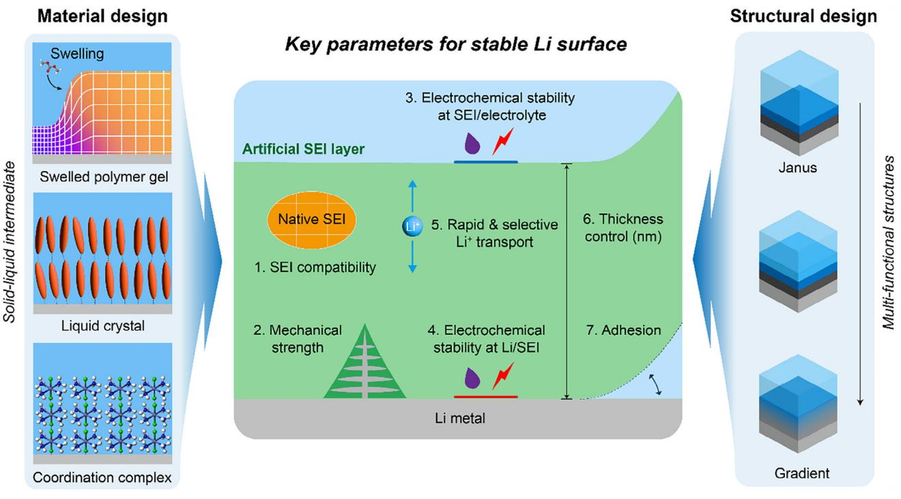

**Figure 14.** Seven key parameters for achieving a high-performance SEI layer with potential class of materials and structures; SEI compatibility, mechanical strength, electrochemical stability at SEI/electrolyte and at Li/SEI, rapid and selective Li+ transport, thickness control, and adhesion. Three material designs with swelled polymer gel, liquid crystal, and coordination complex and two structural designs with Yanus and gradient were proposed.

provide a vast selection of molecular structures for functionalization but often lack sufficient mechanical strength and strong adhesion to the lithium surface.[\[39,40,105,124,183,220,256\]](#page-25-0) This can result in inadequate protection against dendrite growth and limited control over the SEI configuration. Polymeric SEI layers present an opportunity to enhance mechanical properties and structural stability.[\[94,97,135,182,223,257\]](#page-26-0) Techniques like layer-by-layer assembly can create multilayered structures with tailored properties. However, designing polymers that simultaneously offer ionic conductivity, mechanical robustness, and chemical stability with lithium is challenging. Composite SEI layer consists of organic or polymeric matrix incorporated with inorganic nanostructures, such as nanorods, nanowires, or nanosheets still pose great potential due to flexibility in designing specific configurations with tunable contents.[\[104–107\]](#page-26-0) Adding these nanomaterials can enhance ionic and electronic conductivity by providing continuous pathways for ion and electron transport, improving overall cell performance. They also offer mechanical reinforcement to withstand the stress from lithium plating and stripping, preventing crack formation and dendrite penetration, and promote homogeneous current distribution at the interface.

### **6.3. Solid–Liquid Intermediate Materials**

Given the solid nature of lithium metal and the liquid state of conventional electrolytes, materials that exhibit both solid-like and liquid-like properties could bridge the interface more effectively (**Figure 14**). These intermediate materials include swollen polymer gels, liquid crystals, and coordination complexes. Swollen polymer gels are polymers that are swollen with electrolyte solvents that can maintain intimate contact with lithium metal while accommodating volume changes.[\[258–261\]](#page-29-0) By adjusting parameters such as crosslinking density, monomer selection, and molecular weight, the mechanical and electrochemical properties can be fine-tuned. These gels provide pathways for ion transport while offering mechanical stability to suppress dendrite formation. Liquid crystals exhibit anisotropic properties that can be leveraged for directed ion transport.[\[262–266\]](#page-29-0) Designing liquid crystals with lithiophilic groups on one end and electrolytecompatible groups on the other can create aligned channels facilitating rapid lithium-ion diffusion. This structural organization enhances ionic conductivity and reduces concentration polarization at the interface. Coordination complexes incorporate both metallic centers and organic ligands, offering compatibility with lithium metal and the electrolyte.[\[267–271\]](#page-29-0) These complexes can form stable interfacial layers that promote selective lithiumion transport, potentially increasing the lithium-ion transference number and reducing side reactions.

#### **6.4. Gradient or Janus Layers**

Another potential approach to mitigate the differences in chemical potential, surface tension, and molecular affinity between lithium metal and liquid electrolytes is the design of artificial layers that possess a specific gradient in properties such as lithiumphilicity, electrolyte-philicity, additive content, porosity, and surface tension.[\[50,116\]](#page-25-0) These gradient materials facilitate a smoother transition between the lithium metal and the electrolyte, enhancing interfacial stability and suppressing undesirable reactions. There are several methods to construct these designed gradients, but they often fall short because the properties at each boundary of the gradient layer still differ significantly from those of the lithium metal and the liquid electrolyte. When the gradient is focused within a narrow layer, it can function as a Janustype membrane, with one side stable against the lithium surface and the other compatible with the liquid electrolyte.[\[272,273\]](#page-29-0) This duality allows the material to effectively interface with both environments. For the Janus layer to endure the differences on each side while maintaining its structural integrity, it must have strong intermolecular bonding such as covalent bonds found in block copolymers. Block copolymers can be engineered to have distinct segments that are lithiophilic and electrolyte-philic or functional groups that preferentially interact with specific anion, cations, and solvents, creating a built-in gradient at the molecular level within broad engineering parameters. By carefully controlling the composition and architecture of these copolymers, it is possible to achieve the desired gradation of properties across the layer.

### **6.5. Fabrication Methods**

In addition to the material discovery that identifies suitable intermediate materials with optimal interfacial properties, interfacial engineering techniques must be developed to create stable, compatible SEI layers that can adapt to the dynamic conditions within a battery cell. Fabricating above gradient and Janus materials at micro- or nano-scale thicknesses presents significant challenges. There are limited methods available that can produce these ultrathin layers without exposure to air and moisture, which can adversely affect the material properties and lead to defects. Techniques such as layer-by-layer assembly, self-assembly of block copolymers, or gradient deposition methods need to be refined and adapted for this purpose. Developing fabrication processes that operate under controlled environmentssuch as inert atmospheres or vacuum conditionsis essential to prevent contamination and ensure the quality of the gradient layers. Advancements in nanofabrication and coating technologies could provide solutions to these challenges. For instance, initiated chemical vapor deposition and molecular layer deposition offer precise control over film thickness and composition at the atomic or molecular level, which could be leveraged to create well-defined gradient or Janus layers. Additionally, in situ polymerization techniques might enable the formation of these layers directly on the lithium surface, minimizing exposure to detrimental conditions.

Developing scalable and tunable solutions is crucial for engineering materials that offer optimal performance while being compatible with large-scale production techniques. Besides, the high-capacity fabrication methods involve adapting and innovating manufacturing processes, such as roll-to-roll techniques, to accommodate new materials without compromising their beneficial properties. These efforts will significantly contribute to meeting the global energy demands sustainably and efficiently, ultimately supporting the broader goals of environmental stewardship and economic development. Moreover, tailoring SEI layers to match specific electrolyte systems used in next-generation

Amongst various interfacial modification strategies, the electrolyte additive concept is considered as one of the most feasible routes because it is simple, easy, and does not necessitate the production of additional manufacturing lines or changes to the currently existing production line. Electrolyte additives have already been extensively researched with sustained track record[\[274\]](#page-29-0) introduced in commercial batteries,[\[275–277\]](#page-29-0) which significantly highlights its merit in terms of the practical application. The scalability in the production of the specific electrolyte additive is confirmed in advance. Then, pilot-scale testing of fabricating the commercial cells with the electrolyte additive is followed. Once the electrochemical cell performance tests and cell qualify are examined with the newly adopted electrolyte additive, then it can be scaled up and applied for mass production line. Already, Li metal pouch batteries are coming out in the market, as Cuberg has recently published a validation report of a first-generation Li metal battery module,[\[278\]](#page-29-0) which is composed of 60 Li metal pouch cells with the capacity of 20 Ah. Previously, with the pouch cell with the capacity of 5 Ah, it has achieved an energy density of 380 Wh kg−1.

Last, the emerging artificial intelligence (AI) technology can greatly accelerate the research and development of long-lasting Li metal battery technology by reducing the unnecessary amount of research for screening different materials and processes. SES AI is one example of such a company, which is now publicly available on the New York Stock Exchange. It employs an AI algorithm to control and assess the electrochemical operation of Li metal batteries and the production of large-format Li metal batteries is also viable. Hermes, one of its company's core platforms, enables the researcher to screen out the new materials efficiently with the assistance of AI, which sheds light on the future direction that Li metal battery technology should be pursued.

Significant progress has been made through strategies like lithium alloying, the creation of artificial SEI layers, and electrolyte modifications. However, the path to practical and widespread implementation lies in the strategic integration of these approaches, where the artificial SEI layer poses a significant role in combining each element. Innovative materials that merge solid-like and liquid-like properties present a promising frontier for the surface engineering of lithium metal anodes. By focusing on the rational design of such intermediate materials and deepening our understanding of their interfacial behaviors, we can effectively address existing challenges.

# **Acknowledgements**

J.B., K.C., and J.Y.C. contributed equally to this work. This work was supported by the National Research Foundation of Korea (NRF) grant funded by the Korean government (MSIT) (Nos. 2021R1C1C2006535 and 2021R1A2B5B03001416). This research was further supported by the Korea Basic Science Institute (National Research Facilities and Equipment Center) grant funded by the Korean government (MSIT) (No. RS-2024- 00403164). This research was further supported by the Basic Science Research Capacity Enhancement Project through the Korea Basic Science Institute (National Research Facilities and Equipment Center) grant funded by the Ministry of Education (No. 2019R1A6C1010052). This work was supported by the Korea Institute for Advancement of Technology (KIAT) and the Ministry of Trade, Industry & Energy (MOTIE) of the Republic

of Korea (No. P0017363). This work was further supported by LG Energy Solution-KAIST Frontier Research Laboratory and the University of Glasgow startup funding. This work was supported by a grant from Kyung Hee University in 2023 (KHU-20230884).

# **Conflict of Interest**

There are no conflicts of interest to declare.

# **Keywords**

artificial SEI, electrolyte solvogel, initiated chemical vapor deposition, lithium dendrites, lithium metal battery anodes, solid-electrolyte interphase layer, surface coating, transference number

> Received: January 27, 2025 Revised: May 26, 2025 Published online: June 13, 2025

- [1] S. J. Davis, N. S. Lewis, M. Shaner, S. Aggarwal, D. Arent, I. L. Azevedo, S. M. Benson, T. Bradley, J. Brouwer, Y.-M. Chiang, C. T. M. Clack, A. Cohen, S. Doig, J. Edmonds, P. Fennell, C. B. Field, B. Hannegan, B.-M. Hodge, M. I. Hoffert, E. Ingersoll, P. Jaramillo, K. S. Lackner, K. J. Mach, M. Mastrandrea, J. Ogden, P. F. Peterson, D. L. Sanchez, D. Sperling, J. Stagner, J. E. Trancik, et al., *Science* **2018**, *360*, aas9793.
- [2] S. Tiwari, S. Bashir, T. Sarker, U. Shahzad, *Humanit. Soc. Sci. Commun.* **2024**, *11*, 93.
- [3] N. O. Bonsu, *J. Cleaner Prod.* **2020**, *256*, 120659.
- [4] D. Aurbach, E. Zinigrad, Y. Cohen, H. Teller, *Solid State Ionics* **2002**, *148*, 405.
- [5] H. Zhang, Y. Yang, D. Ren, L. Wang, X. He, *Energy Storage Mater.* **2021**, *36*, 147.
- [6] L. Chen, X. Fan, X. Ji, J. Chen, S. Hou, C. Wang, *Joule* **2019**, *3*, 732.
- [7] Y. Zhang, T.-T. Zuo, J. Popovic, K. Lim, Y.-X. Yin, J. Maier, Y.-G. Guo, *Mater. Today* **2020**, *33*, 56.
- [8] B. Liu, J.-G. Zhang, W. Xu, *Joule* **2018**, *2*, 833.
- [9] G. N. Lewis, F. G. Keyes, *J. Am. Chem. Soc.* **1913**, *35*, 340.
- [10] M. V. Reddy, A. Mauger, C. M. Julien, A. Paolella, K. Zaghib, *Materials* **2020**, *13*, 1884.
- [11] C. A. Vincent, *Solid State Ionics* **2000**, *134*, 159.
- [12] X. Gao, Y.-N. Zhou, D. Han, J. Zhou, D. Zhou, W. Tang, J. B. Goodenough, *Joule* **2020**, *4*, 1864.
- [13] Q. Wu, M. T. McDowell, Y. Qi, *J. Am. Chem. Soc.* **2023**, *145*, 2473.
- [14] H.-H. Sun, A. Dolocan, J. A. Weeks, R. Rodriguez, A. Heller, C. B. Mullins, *J. Mater. Chem. A* **2019**, *7*, 17782.
- [15] H. Song, J. Lee, M. Sagong, J. Jeon, Y. Han, J. Kim, H.-G. Jung, J.-S. Yu, J. Lee, I.-D. Kim, *Adv. Mater. 36*, 2407381.
- [16] N.-W. Li, Y.-X. Yin, C.-P. Yang, Y.-G. Guo, *Adv. Mater.* **2016**, *28*, 1853.
- [17] Y. Peng, R. Tamate, K. Nishikawa, *ChemElectroChem* **2024**, *11*, 202400278.
- [18] J. S. Yoon, D. W. Liao, S. M. Greene, T. H. Cho, N. P. Dasgupta, D. J. Siegel, *ACS Appl. Mater. Interfaces* **2024**, *16*, 18790.
- [19] H. M. Lu, Q. Jiang, *J. Phys. Chem. B* **2005**, *109*, 15463.
- [20] W. R. Tyson, W. A. Miller, *Surf. Sci.* **1977**, *62*, 267.
- [21] N. Salami, *Theses and Dissertation*, University of Wisconsin Milwaukee, Milwaukee, **2014**.
- [22] J. Luo, *Energy Storage Mater.* **2019**, *21*, 50.
- [23] K. Kanamura, H. Takezawa, S. Shiraishi, Z. Takehara, *J. Electrochem. Soc.* **1997**, *144*, 1900.

- [24] F. Ospina-Acevedo, N. Guo, P. B. Balbuena, *J. Mater. Chem. A* **2020**, *8*, 17036.
- [25] L. Li, F. Abild-Pedersen, J. Greeley, J. K. Nørskov, *J. Phys. Chem. Lett.* **2015**, *6*, 3797.
- [26] C. Wang, R. Lin, Y. He, P. Zou, K. Kisslinger, Q. He, J. Li, H. L. Xin, *Adv. Mater.* **2023**, *35*, 2209091.
- [27] S.-H. Wang, J. Yue, W. Dong, T.-T. Zuo, J.-Y. Li, X. Liu, X.-D. Zhang, L. Liu, J.-L. Shi, Y.-X. Yin, Y.-G. Guo, *Nat. Commun.* **2019**, *10*, 4930.
- [28] Y. Anzai, S. Kimura, T. Sawada, T. Rudolph, K. Shigematsu, *J. Cryst. Growth* **1993**, *134*, 227.
- [29] J. Xing, T. Chen, L. Yi, Z. Wang, Z. Song, X. Chen, C. Wei, A. Zhou, H. Li, J. Li, *Energy Storage Mater.* **2023**, *63*, 103067.
- [30] X. Shen, Y. Li, T. Qian, J. Liu, J. Zhou, C. Yan, J. B. Goodenough, *Nat. Commun.* **2019**, *10*, 900.
- [31] M. Roberts, P. Johns, J. Owen, D. Brandell, K. Edstrom, G. El Enany, C. Guery, D. Golodnitsky, M. Lacey, C. Lecoeur, H. Mazor, E. Peled, E. Perre, M. M. Shaijumon, P. Simon, P.-L. Taberna, *J. Mater. Chem.* **2011**, *21*, 9876.
- [32] Y. Gao, X. Du, Z. Hou, X. Shen, Y.-W. Mai, J.-M. Tarascon, B. Zhang, *Joule* **2021**, *5*, 1860.
- [33] H. Adenusi, G. A. Chass, S. Passerini, K. V. Tian, G. Chen, *Adv. Energy Mater.* **2023**, *13*, 2203307.
- [34] S. K. Heiskanen, J. Kim, B. L. Lucht, *Joule* **2019**, *3*, 2322.
- [35] P. Saha, T. R. Mohanta, A. Kumar, in *Silicon Anode Systems for Lithium-Ion Batteries*, (Eds: P. N. Kumta, A. F. Hepp, M. K. Datta, O. I. Velikokhatnyi), Elsevier, Amsterdam, **2022**.
- [36] B. S. Parimalam, A. D. MacIntosh, R. Kadam, B. L. Lucht, *J. Phys. Chem. C* **2017**, *121*, 22733.
- [37] Z. Liu, Y. Qi, Y. X. Lin, L. Chen, P. Lu, L. Q. Chen, *J. Electrochem. Soc.* **2016**, *163*, A592.
- [38] M. Y. Yang, S. V. Zybin, T. Das, B. V. Merinov, W. A. Goddard, E. K. Mok, H. J. Hah, H. E. Han, Y. C. Choi, S. H. Kim, *Adv. Energy Mater.* **2023**, *13*, 2202949.
- [39] S. Ha, H. J. Yoon, J. I. Jung, H. Kim, S. Won, J. H. Kwak, H.-D. Lim, H.-J. Jin, J. J. Wie, Y. S. Yun, *Energy Storage Mater.* **2021**, *37*, 567.
- [40] D. Han, Z. Wang, S. Chen, J. Zhou, S. Chen, M. Wang, D. Wu, X. Meng, C. W. Bielawski, J. Geng, *Small* **2024**, *20*, 2405453.
- [41] M. McEldrew, Z. A. H. Goodwin, S. Bi, M. Z. Bazant, A. A. Kornyshev, *J. Chem. Phys.* **2020**, *152*, 23406.
- [42] K. Xu, *Chem. Rev.* **2014**, *114*, 11503.
- [43] P. Yan, J. Zheng, M. Gu, J. Xiao, J.-G. Zhang, C.-M. Wang, *Nat. Commun.* **2017**, *8*, 14101.
- [44] K. Huang, S. Bi, B. Kurt, C. Xu, L. Wu, Z. Li, G. Feng, X. Zhang, *Angew. Chem., Int. Ed.* **2021**, *60*, 19232.
- [45] J. Huang, H. Zhang, X. Yuan, Y. Sha, J. Li, T. Dong, Y. Song, S. Zhang, *Chem. Eng. J.* **2023**, *464*, 142578.
- [46] L. Dong, Y. Liu, D. Chen, Y. Han, Y. Ji, J. Liu, B. Yuan, Y. Dong, Q. Li, S. Zhou, S. Zhong, Y. Liang, M. Yang, C. Yang, W. He, *Energy Storage Mater.* **2022**, *44*, 527.
- [47] X. Yin, R. Zhu, X. Hu, H. Zhao, X. Li, L. Liu, S. Niu, J. Wang, Y. Meng, Y. Su, S. Ding, W. Yu, *Adv. Funct. Mater.* **2024**, *34*, 2310358.
- [48] X.-B. Cheng, T.-Z. Hou, R. Zhang, H.-J. Peng, C.-Z. Zhao, J.-Q. Huang, Q. Zhang, *Adv. Mater.* **2016**, *28*, 2888.
- [49] L. Zhao, Y. Li, M. Yu, Y. Peng, F. Ran, *Adv. Sci.* **2023**, *10*, 2300283.
- [50] H. Zhang, X. Liao, Y. Guan, Y. Xiang, M. Li, W. Zhang, X. Zhu, H. Ming, L. Lu, J. Qiu, Y. Huang, G. Cao, Y. Yang, L. Mai, Y. Zhao, H. Zhang, *Nat. Commun.* **2018**, *9*, 3729.
- [51] D. H. Jeon, *Energy Storage Mater.* **2019**, *18*, 139.
- [52] H. Liu, J. Di, P. Wang, R. Gao, H. Tian, P. Ren, Q. Yuan, W. Huang, R. Liu, Q. Liu, M. Feng, *Carbon Energy* **2022**, *4*, 654.
- [53] P. Shi, T. Li, R. Zhang, X. Shen, X.-B. Cheng, R. Xu, J.-Q. Huang, X.-R. Chen, H. Liu, Q. Zhang, *Adv. Mater.* **2019**, *31*, 1807131.
- [54] R. Pathak, K. Chen, F. Wu, A. U. Mane, R. V. Bugga, J. W. Elam, Q. Qiao, Y. Zhou, *Energy Storage Mater.* **2021**, *41*, 448.

- [55] X. Yan, L. Lin, Q. Chen, Q. Xie, B. Qu, L. Wang, D.-L. Peng, *Carbon Energy* **2021**, *3*, 303.
- [56] L. Tao, A. Hu, Z. Yang, Z. Xu, C. E. Wall, A. R. Esker, Z. Zheng, F. Lin, *Adv. Funct. Mater.* **2020**, *30*, 2000585.
- [57] Y. Wang, *Nano-Micro Lett.* **2021**, *13*, 210.
- [58] J. Huang, J. Liu, J. He, M. Wu, S. Qi, H. Wang, F. Li, J. Ma, *Angew. Chem., Int. Ed.* **2021**, *60*, 20717.
- [59] C. Peter, K. Nikolowski, S. Reuber, M. Wolter, A. Michaelis, *J. Appl. Electrochem.* **2020**, *50*, 295.
- [60] J.-Y. Liang, Y. Zhang, S. Xin, S.-J. Tan, X.-H. Meng, W.-P. Wang, J.-L. Shi, Z.-B. Wang, F. Wang, L.-J. Wan, Y.-G. Guo, *Angew. Chem., Int. Ed.* **2023**, *62*, 202300384.
- [61] Z. Zhang, Y. Li, R. Xu, W. Zhou, Y. Li, S. T. Oyakhire, Y. Wu, J. Xu, H. Wang, Z. Yu, D. T. Boyle, W. Huang, Y. Ye, H. Chen, J. Wan, Z. Bao, W. Chiu, Y. Cui, *Science* **2022**, *375*, 66.
- [62] S. Ko, T. Obukata, T. Shimada, N. Takenaka, M. Nakayama, A. Yamada, Y. Yamada, *Nat. Energy* **2022**, *7*, 1217.
- [63] B. Aktekin, L. M. Riegger, S.-K. Otto, T. Fuchs, A. Henss, J. Janek, *Nat. Commun.* **2023**, *14*, 6946.
- [64] Q. Wang, C. Zhao, J. Wang, Z. Yao, S. Wang, S. G. H. Kumar, S. Ganapathy, S. Eustace, X. Bai, B. Li, M. Wagemaker, *Nat. Commun.* **2023**, *14*, 440.
- [65] F. Schomburg, B. Heidrich, S. Wennemar, R. Drees, T. Roth, M. Kurrat, H. Heimes, A. Jossen, M. Winter, J. Y. Cheong, F. Röder, *Energy Environ. Sci.* **2024**, *17*, 2686.
- [66] H. Zhang, C. Shen, Y. Huang, Z. Liu, *Appl. Surf. Sci.* **2021**, *537*, 147983.
- [67] S. Solchenbach, M. Metzger, M. Egawa, H. Beyer, H. A. Gasteiger, *J. Electrochem. Soc.* **2018**, *165*, A3022.
- [68] F. Huttner, W. Haselrieder, A. Kwade, *Energy Technol.* **2020**, *8*, 1900245.
- [69] K. Kim, D. Hwang, S. Kim, S. O. Park, H. Cha, Y.-S. Lee, J. Cho, S. K. Kwak, N.-S. Choi, *Adv. Energy Mater.* **2020**, *10*, 2000012.
- [70] Y. Zhu, X. He, Y. Mo, *J. Mater. Chem. A* **2016**, *4*, 3253.
- [71] B. Ravikumar, M. Mynam, B. Rai, *J. Phys. Chem. C* **2018**, *122*, 8173.
- [72] L. E. Camacho-Forero, T. W. Smith, P. B. Balbuena, *J. Phys. Chem. C* **2017**, *121*, 182.
- [73] X. Lan, S. Yang, T. Meng, C. Zhang, X. Hu, *Adv. Energy Mater.* **2023**, *13*, 2203449.
- [74] S. Moharana, G. West, M. Walker, X. S. Yan, M. Loveridge, *ACS Appl. Mater. Interfaces* **2022**, *14*, 42078.
- [75] Y. Gao, B. Zhang, *Adv. Mater.* **2023**, *35*, 2205421.
- [76] J. Lee, J. Kim, S. Kim, C. Jo, J. Lee, *Mater. Adv.* **2020**, *1*, 3143.
- [77] C. Yan, Y.-X. Yao, W.-L. Cai, L. Xu, S. Kaskel, H. S. Park, J.-Q. Huang, *J. Energy Chem.* **2020**, *49*, 335.
- [78] Z.-L. Xu, K. Lim, K.-Y. Park, G. Yoon, W. M. Seong, K. Kang, *Adv. Funct. Mater.* **2018**, *28*, 1802099.
- [79] J.-L. Liang, S.-Y. Sun, N. Yao, Z. Zheng, Q.-K. Zhang, B.-Q. Li, X.-Q. Zhang, J.-Q. Huang, *Sci. China: Chem.* **2023**, *66*, 3620.
- [80] K. Xu, A. von Wald Cresce, *J. Mater. Res.* **2012**, *27*, 2327.
- [81] K. Xu, *J. Electrochem. Soc.* **2007**, *154*, A162.
- [82] K. Xu, Y. Lam, S. S. Zhang, T. R. Jow, T. B. Curtis, *J. Phys. Chem. C* **2007**, *111*, 7411.
- [83] T. Hou, K. D. Fong, J. Wang, K. A. Persson, *Chem. Sci.* **2021**, *12*, 14740.
- [84] L. Yang, A. Xiao, B. L. Lucht, *J. Mol. Liq.* **2010**, *154*, 131.
- [85] Y.-X. Yao, X. Chen, C. Yan, X.-Q. Zhang, W.-L. Cai, J.-Q. Huang, Q. Zhang, *Angew. Chem., Int. Ed.* **2021**, *60*, 4090.
- [86] W. Liu, D. Lin, A. Pei, Y. Cui, *J. Am. Chem. Soc.* **2016**, *138*, 15443.
- [87] P. J. Kim, K. Kim, V. G. Pol, *Electrochim. Acta* **2018**, *283*, 517.
- [88] X. Sun, S. Yang, T. Zhang, Y. Shi, L. Dong, G. Ai, D. Li, W. Mao, *Nanoscale* **2022**, *14*, 5033.

- [89] S. Zhang, R. Li, N. Hu, T. Deng, S. Weng, Z. Wu, D. Lu, H. Zhang, J. Zhang, X. Wang, L. Chen, L. Fan, X. Fan, *Nat. Commun.* **2022**, *13*, 5431.
- [90] Z. Yu, H. Wang, X. Kong, W. Huang, Y. Tsao, D. G. Mackanic, K. Wang, X. Wang, W. Huang, S. Choudhury, Y. Zheng, C. V. Amanchukwu, S. T. Hung, Y. Ma, E. G. Lomeli, J. Qin, Y. Cui, Z. Bao, *Nat. Energy* **2020**, *5*, 526.
- [91] Z. Zeng, V. Murugesan, K. S. Han, X. Jiang, Y. Cao, L. Xiao, X. Ai, H. Yang, J.-G. Zhang, M. L. Sushko, J. Liu, *Nat. Energy* **2018**, *3*, 674.
- [92] X.-Q. Zhang, X.-B. Cheng, X. Chen, C. Yan, Q. Zhang, *Adv. Funct. Mater.* **2017**, *27*, 1605989.
- [93] W. Liu, P. Liu, D. Mitlin, *Adv. Energy Mater.* **2020**, *10*, 2002297.
- [94] S. Gao, F. Sun, N. Liu, H. Yang, P.-F. Cao, *Mater. Today* **2020**, *40*, 140.
- [95] B. Zhao, C. Xing, Y. Shi, Q. Duan, C. Shen, W. Li, Y. Jiang, J. Zhang, *J. Colloid Interface Sci.* **2023**, *642*, 193.
- [96] E. E. Ushakova, A. Frolov, A. A. Reveguk, D. Y. Usachov, D. M. Itkis, L. V. Yashina, *Appl. Surf. Sci.* **2022**, *589*, 153014.
- [97] R. Subramani, M.-N. Pham, Y.-H. Lin, C.-T. Hsieh, Y.-L. Lee, J.-S. Jan, C.-C. Chiu, H. Teng, *Chem. Eng. J.* **2022**, *431*, 133442.
- [98] R. Xu, X.-Q. Zhang, X.-B. Cheng, H.-J. Peng, C.-Z. Zhao, C. Yan, J.-Q. Huang, *Adv. Funct. Mater.* **2018**, *28*, 1705838.
- [99] T. Yu, T. Zhao, N. Zhang, T. Xue, Y. Chen, Y. Ye, F. Wu, R. Chen, *Nano Lett.* **2023**, *23*, 276.
- [100] L. Fan, H. L. Zhuang, L. Gao, Y. Lu, L. A. Archer, *J. Mater. Chem. A* **2017**, *5*, 3483.
- [101] Y.-H. Tan, G.-X. Lu, J.-H. Zheng, F. Zhou, M. Chen, T. Ma, L.-L. Lu, Y.-H. Song, Y. Guan, J. Wang, Z. Liang, W.-S. Xu, Y. Zhang, X. Tao, H.-B. Yao, *Adv. Mater.* **2021**, *33*, 2102134.
- [102] D. Kang, M. Xiao, J. P. Lemmon, *Batteries Supercaps* **2021**, *4*, 445.
- [103] X. Zhang, H. Zhao, X. Pei, Y. Shen, X. Huang, Y. Ren, J. Li, *Journal of Industrial and Engineering Chemistry* **2024**, *140*, 513.
- [104] Y. Liu, R. Hu, D. Zhang, J. Liu, F. Liu, J. Cui, Z. Lin, J. Wu, M. Zhu, *Adv. Mater.* **2021**, *33*, 2004711.
- [105] S. Ye, L. Wang, F. Liu, P. Shi, H. Wang, X. Wu, Y. Yu, *Adv. Energy Mater.* **2020**, *10*, 2002647.
- [106] S. Sun, S. Myung, G. Kim, D. Lee, H. Son, M. Jang, E. Park, B. Son, Y.-G. Jung, U. Paik, T. Song, *J. Mater. Chem. A* **2020**, *8*, 17229.
- [107] H. Tian, J. Zhang, B. He, Y. Liu, W. Li, F. Zhang, Z. Wang, X. Lu, Y. Xin, S. Wang, *Nanoscale* **2024**, *16*, 18066.
- [108] X. Liang, Q. Pang, I. R. Kochetkov, M. S. Sempere, H. Huang, X. Sun, L. F. Nazar, *Nat. Energy* **2017**, *2*, 17119.
- [109] S. Jin, Y. Ye, Y. Niu, Y. Xu, H. Jin, J. Wang, Z. Sun, A. Cao, X. Wu, Y. Luo, H. Ji, L.-J. Wan, *J. Am. Chem. Soc.* **2020**, *142*, 8818.
- [110] A. Hu, W. Chen, X. Du, Y. Hu, T. Lei, H. Wang, L. Xue, Y. Li, H. Sun, Y. Yan, J. Long, C. Shu, J. Zhu, B. Li, X. Wang, J. Xiong, *Energy Environ. Sci.* **2021**, *14*, 4115.
- [111] R. Pathak, K. Chen, A. Gurung, K. M. Reza, B. Bahrami, J. Pokharel, A. Baniya, W. He, F. Wu, Y. Zhou, K. Xu, Q. Qiao, *Nat. Commun.* **2020**, *11*, 93.
- [112] D. Lin, Y. Liu, W. Chen, G. Zhou, K. Liu, B. Dunn, Y. Cui, *Nano Lett.* **2017**, *17*, 3731.
- [113] K. Chen, R. Pathak, A. Gurung, E. A. Adhamash, B. Bahrami, Q. He, H. Qiao, A. L. Smirnova, J. J. Wu, Q. Qiao, Y. Zhou, *Energy Storage Mater.* **2019**, *18*, 389.
- [114] H. Chen, A. Pei, D. Lin, J. Xie, A. Yang, J. Xu, K. Lin, J. Wang, H. Wang, F. Shi, D. Boyle, Y. Cui, *Adv. Energy Mater.* **2019**, *9*, 1900858.
- [115] J. Zhao, L. Liao, F. Shi, T. Lei, G. Chen, A. Pei, J. Sun, K. Yan, G. Zhou, J. Xie, C. Liu, Y. Li, Z. Liang, Z. Bao, Y. Cui, *J. Am. Chem. Soc.* **2017**, *139*, 11550.
- [116] Z. Zhang, S. Guan, S. Liu, B. Hu, C. Xue, X. Wu, K. Wen, C.-W. Nan, L. Li, *Adv. Energy Mater.* **2022**, *12*, 2103332.
- [117] F. Liu, L. Wang, Z. Zhang, P. Shi, Y. Feng, Y. Yao, S. Ye, H. Wang, X. Wu, Y. Yu, *Adv. Funct. Mater.* **2020**, *30*, 2001607.

- [118] H. Wang, L. Wu, B. Xue, F. Wang, Z. Luo, X. Zhang, L. Calvez, P. Fan, B. Fan, *ACS Appl. Mater. Interfaces* **2022**, *14*, 15214.
- [119] J. Zhao, M. Hong, Z. Ju, X. Yan, Y. Gai, Z. Liang, *Angew. Chem., Int. Ed.* **2022**, *61*, 202214386.
- [120] H. Dong, X. Xiao, C. Jin, X. Wang, P. Tang, C. Wang, Y. Yin, D. Wang, S. Yang, C. Wu, *J. Power Sources* **2019**, *423*, 72.
- [121] Z. Huang, J.-C. Lai, S.-L. Liao, Z. Yu, Y. Chen, W. Yu, H. Gong, X. Gao, Y. Yang, J. Qin, Y. Cui, Z. Bao, *Nat. Energy* **2023**, *8*, 577.
- [122] D. Zhuang, X. Huang, Z. Chen, H. Wu, L. Sheng, M. Zhao, Y. Bai, G. Liu, H. Xue, T. Wang, Y. Chen, J. He, *Electrochim. Acta* **2022**, *403*, 139668.
- [123] Y. Gao, T. Rojas, K. Wang, S. Liu, D. Wang, T. Chen, H. Wang, A. T. Ngo, D. Wang, *Nat. Energy* **2020**, *5*, 534.
- [124] T. Kang, Y. Wang, F. Guo, C. Liu, J. Zhao, J. Yang, H. Lin, Y. Qiu, Y. Shen, W. Lu, L. Chen, *ACS Cent. Sci.* **2019**, *5*, 468.
- [125] Y. Liu, Y.-K. Tzeng, D. Lin, A. Pei, H. Lu, N. A. Melosh, Z.-X. Shen, S. Chu, Y. Cui, *Joule* **2021**, *2*, 1595.
- [126] J. Y. Kim, A. Y. Kim, G. Liu, J.-Y. Woo, H. Kim, J. K. Lee, *ACS Appl. Mater. Interfaces* **2018**, *10*, 8692.
- [127] L. Chen, J. G. Connell, A. Nie, Z. Huang, K. R. Zavadil, K. C. Klavetter, Y. Yuan, S. Sharifi-Asl, R. Shahbazian-Yassar, J. A. Libera, A. U. Mane, J. W. Elam, *J. Mater. Chem. A* **2017**, *5*, 12297.
- [128] P. K. Alaboina, S. Rodrigues, M. Rottmayer, S.-J. Cho, *ACS Appl. Mater. Interfaces* **2018**, *10*, 32801.
- [129] A. C. Kozen, C.-F. Lin, A. J. Pearse, M. A. Schroeder, X. Han, L. Hu, S.-B. Lee, G. W. Rubloff, M. Noked, *ACS Nano* **2015**, *9*, 5884.
- [130] Y. Sun, C. Zhao, K. R. Adair, Y. Zhao, L. V. Goncharova, J. Liang, C. Wang, J. Li, R. Li, M. Cai, T.-K. Sham, X. Sun, *Energy Environ. Sci.* **2021**, *14*, 4085.
- [131] K. R. Adair, C. Zhao, M. N. Banis, Y. Zhao, R. Li, M. Cai, X. Sun, *Angew. Chem., Int. Ed.* **2019**, *58*, 15797.
- [132] Y. Sun, Y. Zhao, J. Wang, J. Liang, C. Wang, Q. Sun, X. Lin, K. R. Adair, J. Luo, D. Wang, R. Li, M. Cai, T.-K. Sham, X. Sun, *Adv. Mater.* **2019**, *31*, 1806541.
- [133] S. Chang, J. Fang, K. Liu, Z. Shen, L. Zhu, X. Jin, X. Zhang, C. Hu, H. Zhang, A.-d. Li, *Adv. Energy Mater.* **2023**, *13*, 2204002.
- [134] Y. Zhao, M. Amirmaleki, Q. Sun, C. Zhao, A. Codirenzi, L. V. Goncharova, C. Wang, K. Adair, X. Li, X. Yang, F. Zhao, R. Li, T. Filleter, M. Cai, X. Sun, *Matter* **2019**, *1*, 1215.
- [135] J. Bae, K. Choi, H. Song, D. H. Kim, D. Y. Youn, S.-H. Cho, D. Jeon, J. Lee, J. Lee, W. Jang, C. Lee, Y. Kim, C. Kim, J.-W. Jung, S. G. Im, I.-D. Kim, *Adv. Energy Mater.* **2023**, *13*, 2203818.
- [136] S. Stalin, P. Chen, G. Li, Y. Deng, Z. Rouse, Y. Cheng, Z. Zhang, P. Biswal, S. Jin, S. P. Baker, R. Yang, L. A. Archer, *Matter* **2021**, *4*, 3753.
- [137] Y. Chen, X. Xu, L. Gao, G. Yu, O. O. Kapitanova, S. Xiong, V. S. Volkov, Z. Song, Y. Liu, *Small Methods* **2022**, *6*, 2200113.
- [138] E. Cha, M. D. Patel, J. Park, J. Hwang, V. Prasad, K. Cho, W. Choi, *Nat. Nanotechnol.* **2018**, *13*, 337.
- [139] R. Pathak, K. Chen, A. Gurung, K. M. Reza, B. Bahrami, F. Wu, A. Chaudhary, N. Ghimire, B. Zhou, W.-H. Zhang, Y. Zhou, Q. Qiao, *Adv. Energy Mater.* **2019**, *9*, 1901486.
- [140] L. Wang, Q. Wang, W. Jia, S. Chen, P. Gao, J. Li, *J. Power Sources* **2017**, *342*, 175.
- [141] M. C. Stan, J. Becking, A. Kolesnikov, B. Wankmiller, J. E. Frerichs, M. R. Hansen, P. Bieker, M. Kolek, M. Winter, *Mater. Today* **2020**, *39*, 137.
- [142] R. E. A. Ardhi, G. Liu, J. K. Lee, *ACS Energy Lett.* **2021**, *6*, 1432.
- [143] S. Liu, Y. Ma, J. Wang, P. Zuo, C. Du, G. Yin, Y. Gao, *Chem. Eng. J.* **2022**, *427*, 131625.
- [144] W. Wang, X. Yue, J. Meng, J. Wang, X. Wang, H. Chen, D. Shi, J. Fu, Y. Zhou, J. Chen, Z. Fu, *Energy Storage Mater.* **2019**, *18*, 414.
- [145] S. Xia, X. Zhang, C. Liang, Y. Yu, W. Liu, *Energy Storage Mater.* **2020**, *24*, 329.

- [146] S. Huang, L. Tang, H. S. Najafabadi, S. Chen, Z. Ren, *Nano Energy* **2017**, *38*, 504.
- [147] Z. Hu, F. Liu, J. Gao, W. Zhou, H. Huo, J. Zhou, L. Li, *Adv. Funct. Mater.* **2020**, *30*, 1907020.
- [148] Y. Ma, P. Qi, J. Ma, L. Wei, L. Zhao, J. Cheng, Y. Su, Y. Gu, Y. Lian, Y. Peng, Y. Shen, L. Chen, Z. Deng, Z. Liu, *Adv. Sci.* **2021**, *8*, 2100488.
- [149] P. Zhai, T. Wang, H. Jiang, J. Wan, Y. Wei, L. Wang, W. Liu, Q. Chen, W. Yang, Y. Cui, *Adv. Mater.* **2021**, *33*, 2006247.
- [150] J. Xie, L. Liao, Y. Gong, Y. Li, F. Shi, A. Pei, J. Sun, R. Zhang, B. Kong, R. Subbaraman, J. Christensen, Y. Cui, *Sci. Adv.* **2017**, *3*, aao3170.
- [151] H. Shi, M. Yue, C. J. Zhang, Y. Dong, P. Lu, S. Zheng, H. Huang, J. Chen, P. Wen, Z. Xu, Q. Zheng, X. Li, Y. Yu, Z.-S. Wu, *ACS Nano* **2020**, *14*, 8678.
- [152] Y.-C. Yin, Q. Wang, J.-T. Yang, F. Li, G. Zhang, C.-H. Jiang, H.-S. Mo, J.-S. Yao, K.-H. Wang, F. Zhou, H.-X. Ju, H.-B. Yao, *Nat. Commun.* **2020**, *11*, 1761.
- [153] F. Wang, Z. Wen, Z. Zheng, W. Fang, L. Chen, F. Chen, N. Zhang, X. Liu, R. Ma, G. Chen, *Adv. Energy Mater.* **2023**, *13*, 2203830.
- [154] X. Ke, Y. Liang, L. Ou, H. Liu, Y. Chen, W. Wu, Y. Cheng, Z. Guo, Y. Lai, P. Liu, Z. Shi, *Energy Storage Mater.* **2019**, *23*, 547.
- [155] R. Zhang, X.-R. Chen, X. Chen, X.-B. Cheng, X.-Q. Zhang, C. Yan, Q. Zhang, *Angew. Chem., Int. Ed.* **2017**, *56*, 7764.
- [156] J. Xiao, P. Zhai, Y. Wei, X. Zhang, W. Yang, S. Cui, C. Jin, W. Liu, X. Wang, H. Jiang, Z. Luo, X. Zhang, Y. Gong, *Nano Lett.* **2020**, *20*, 3911.
- [157] Y. Fang, S. L. Zhang, Z.-P. Wu, D. Luan, X. W. Lou, *Sci. Adv.* **2021**, *7*, abg3626.
- [158] Z. Lu, Q. Liang, B. Wang, Y. Tao, Y. Zhao, W. Lv, D. Liu, C. Zhang, Z. Weng, J. Liang, H. Li, Q.-H. Yang, *Adv. Energy Mater.* **2019**, *9*, 1803186.
- [159] W. Cheng, T. Wang, X. Wang, G. Li, S. Liu, X. Gao, *Surf. Interfaces* **2025**, *56*, 105540.
- [160] Z. Liang, D. Lin, J. Zhao, Z. Lu, Y. Liu, C. Liu, Y. Lu, H. Wang, K. Yan, X. Tao, Y. Cui, *Proc. Natl. Acad. Sci. USA* **2016**, *113*, 2862.
- [161] J. Pu, J. Li, K. Zhang, T. Zhang, C. Li, H. Ma, J. Zhu, P. V. Braun, J. Lu, H. Zhang, *Nat. Commun.* **2019**, *10*, 1896.
- [162] X. Yan, Q. Zhang, W. Xu, Q. Xie, P. Liu, Q. Chen, H. Zheng, L. Wang, Z.-Z. Zhu, D.-L. Peng, *J. Mater. Chem. A* **2020**, *8*, 1678.
- [163] J. Chen, Q. Li, T. P. Pollard, X. Fan, O. Borodin, C. Wang, *Mater. Today* **2020**, *39*, 118.
- [164] S. Niu, S.-W. Zhang, D. Li, X. Wang, X. Chen, R. Shi, N. Shen, M. Jin, X. Zhang, Q. Lian, R. Huang, A. Amini, Y. Zhao, C. Cheng, *Chem. Eng. J.* **2022**, *429*, 132156.
- [165] Z. Wu, C. Wang, Z. Hui, H. Liu, S. Wang, S. Yu, X. Xing, J. Holoubek, Q. Miao, H. L. Xin, P. Liu, *Nat. Energy* **2023**, *8*, 340.
- [166] G. Wang, C. Chen, Y. Chen, X. Kang, C. Yang, F. Wang, Y. Liu, X. Xiong, *Angew. Chem., Int. Ed.* **2020**, *59*, 2055.
- [167] S. A. Abbas, H.-A. Chen, A. Mohapatra, A. Singh, S. Li, C.-W. Pao, C. W. Chu, *Small* **2022**, *18*, 2201349.
- [168] B. Xu, Z. Liu, J. Li, X. Huang, B. Qie, T. Gong, L. Tan, X. Yang, D. Paley, M. Dontigny, K. Zaghib, X. Liao, Q. Cheng, H. Zhai, X. Chen, L.-Q. Chen, C.-W. Nan, Y.-H. Lin, Y. Yang, *Nano Energy* **2020**, *67*, 104242.
- [169] C.-T. Yang, Y. Qi, *Chem. Mater.* **2021**, *33*, 2814.
- [170] T.-U. Wi, S. O. Park, S. J. Yeom, M.-H. Kim, I. Kristanto, H. Wang, S. K. Kwak, H.-W. Lee, *ACS Energy Lett.* **2023**, *8*, 2193.
- [171] H. Wu, X. Chen, C. Zhao, Y. Tian, X. Yang, R. Sun, X. Gao, *Energy Mater. Adv.* **2024**, *5*, 0130.
- [172] H. Kwon, H. Kim, J. Hwang, W. Oh, Y. Roh, D. Shin, H.-T. Kim, *Nat. Energy* **2024**, *9*, 57.
- [173] Q. Zhang, J. Pan, P. Lu, Z. Liu, M. W. Verbrugge, B. W. Sheldon, Y.-T. Cheng, Y. Qi, X. Xiao, *Nano Lett.* **2011**, *2016*, 16.
- [174] D. Xu, N. Zhou, A. Wang, Y. Xu, X. Liu, S. Tang, J. Luo, *Adv. Mater.* **2023**, *35*, 2302872.
- [175] Y. Gao, Y. Zhao, Y. C. Li, Q. Huang, T. E. Mallouk, D. Wang, *J. Am. Chem. Soc.* **2017**, *139*, 15288.

- [176] S. Li, Y. Huang, C. Luo, W. Ren, J. Yang, X. Li, M. Wang, H. Cao, *Chem. Eng. J.* **2020**, *399*, 125687.
- [177] C.-T. Yang, Y.-X. Lin, B. Li, X. Xiao, Y. Qi, *ACS Appl. Mater. Interfaces* **2020**, *12*, 51007.
- [178] Y. Wang, Z. Wang, L. Zhao, Q. Fan, X. Zeng, S. Liu, W. K. Pang, Y.-B. He, Z. Guo, *Adv. Mater.* **2021**, *33*, 2008133.
- [179] X. Shen, R. Zhang, X. Chen, X.-B. Cheng, X. Li, Q. Zhang, *Adv. Energy Mater.* **2020**, *10*, 1903645.
- [180] N.-W. Li, Y. Shi, Y.-X. Yin, X.-X. Zeng, J.-Y. Li, C.-J. Li, L.-J. Wan, R. Wen, Y.-G. Guo, *Angew. Chem., Int. Ed.* **2018**, *57*, 1505.
- [181] K. Liu, A. Pei, H. R. Lee, B. Kong, N. Liu, D. Lin, Y. Liu, C. Liu, P.-c. Hsu, Z. Bao, Y. Cui, *J. Am. Chem. Soc.* **2017**, *139*, 4815.
- [182] G. Zheng, C. Wang, A. Pei, J. Lopez, F. Shi, Z. Chen, A. D. Sendek, H.-W. Lee, Z. Lu, H. Schneider, M. M. Safont-Sempere, S. Chu, Z. Bao, Y. Cui, *ACS Energy Lett.* **2016**, *1*, 1247.
- [183] S. Li, J. Huang, Y. Cui, S. Liu, Z. Chen, W. Huang, C. Li, R. Liu, R. Fu, D. Wu, *Nat. Nanotechnol.* **2022**, *17*, 613.
- [184] X. Jin, Z. Cai, X. Zhang, J. Yu, Q. He, Z. Lu, M. Dahbi, J. Alami, J. Lu, K. Amine, H. Zhang, *Adv. Mater.* **2022**, *34*, 2200181.
- [185] C. Qian, J. Zhao, Y. Sun, H. R. Lee, L. Luo, M. Makaremi, S. Mukherjee, J. Wang, C. Zu, M. Xia, C. Wang, C. V. Singh, Y. Cui, G. A. Ozin, *Nano Lett.* **2020**, *20*, 7455.
- [186] K. Deng, D. Han, S. Ren, S. Wang, M. Xiao, Y. Meng, *J. Mater. Chem. A* **2019**, *7*, 13113.
- [187] D. Han, Z. Wang, S. Chen, J. Zhou, S. Chen, M. Wang, D. Wu, X. Meng, C. W. Bielawski, J. Geng, *Small* **2024**, *20*, 2405453.
- [188] S. C. Kim, J. Wang, R. Xu, P. Zhang, Y. Chen, Z. Huang, Y. Yang, Z. Yu, S. T. Oyakhire, W. Zhang, L. C. Greenburg, M. S. Kim, D. T. Boyle, P. Sayavong, Y. Ye, J. Qin, Z. Bao, Y. Cui, *Nat. Energy* **2023**, *8*, 814.
- [189] J. Yu, X. Ma, X. Zou, Y. Hu, M. Yang, J. Yang, S. Sun, F. Yan, *Energy Environ. Sci.* **2024**, *17*, 4519.
- [190] J. Wang, J. Zhang, J. Wu, M. Huang, L. Jia, L. Li, Y. Zhang, H. Hu, F. Liu, Q. Guan, M. Liu, H. Adenusi, H. Lin, S. Passerini, *Adv. Mater.* **2023**, *35*, 2302828.
- [191] T. Chen, J. You, R. Li, H. Li, Y. Wang, C. Wu, Y. Sun, L. Yang, Z. Ye, B. Zhong, Z. Wu, X. Guo, *Adv. Sci.* **2022**, *9*, 2203216.
- [192] X. Zheng, Z. Cao, W. Luo, S. Weng, X. Zhang, D. Wang, Z. Zhu, H. Du, X. Wang, L. Qie, H. Zheng, Y. Huang, *Adv. Mater.* **2023**, *35*, 2210115.
- [193] D. P. Birnie, *Langmuir* **2013**, *29*, 9072.
- [194] Y. Zhao, X. Sun, *ACS Energy Lett.* **2018**, *3*, 899.
- [195] A. A. Dameron, D. Seghete, B. B. Burton, S. D. Davidson, A. S. Cavanagh, J. A. Bertrand, S. M. George, *Chem. Mater.* **2008**, *20*, 3315.
- [196] D.-w. Choi, M. Yoo, H. M. Lee, J. Park, H. Y. Kim, J.-S. Park, *ACS Appl. Mater. Interfaces* **2016**, *8*, 12263.
- [197] S. J. Yu, K. Pak, M. J. Kwak, M. Joo, B. J. Kim, M. S. Oh, J. Baek, H. Park, G. Choi, D. H. Kim, J. Choi, Y. Choi, J. Shin, H. Moon, E. Lee, S. G. Im, *Adv. Eng. Mater.* **2018**, *20*, 1700622.
- [198] M. Kräuter, M. Tazreiter, A. Perrotta, A. M. Coclite, *Macromolecules* **2020**, *53*, 7962.
- [199] N. Chen, B. Reeja-Jayan, J. Lau, P. Moni, A. Liu, B. Dunn, K. K. Gleason, *Mater. Horiz.* **2015**, *2*, 309.
- [200] C. Rancher, R. Resel, P. Moni, B. Cermenek, V. Hacker, A. M. Coclite, *Macromolecules* **2015**, *48*, 6177.
- [201] P. Chen, Z. Zhang, Z. Rouse, S. P. Baker, J. Yeo, R. Yang, *Nat. Synth.* **2023**, *2*, 373.
- [202] Y. C. Chen, C. Y. Ouyang, L. J. Song, Z. L. Sun, *J. Phys. Chem. C* **2011**, *115*, 7044.
- [203] A. Ramasubramanian, V. Yurkiv, T. Foroozan, M. Ragone, R. Shahbazian-Yassar, F. Mashayek, *ACS Appl. Energy Mater.* **2020**, *3*, 10560.
- [204] A. Ramasubramanian, V. Yurkiv, T. Foroozan, M. Ragone, R. Shahbazian-Yassar, F. Mashayek, *J. Phys. Chem. C* **2019**, *123*, 10237.
- [205] M. Smeu, K. Leung, *Phys. Chem. Chem. Phys.* **2021**, *23*, 3214.

- [206] F. Hao, A. Verma, P. P. Mukherjee, *J. Mater. Chem. A* **2018**, *6*, 19664.
- [207] J. Zheng, M. H. Engelhard, D. Mei, S. Jiao, B. J. Polzin, J.-G. Zhang, W. Xu, *Nat. Energy* **2017**, *2*, 17012.
- [208] S. Zhang, G. Yang, Z. Liu, X. Li, X. Wang, R. Chen, F. Wu, Z. Wang, L. Chen, *Nano Lett.* **2021**, *21*, 3310.
- [209] S. Lin, H. Hua, P. Lai, J. Zhao, *Adv. Energy Mater.* **2021**, *11*, 2101775.
- [210] Y. Zhu, X. Luo, H. Zhi, Y. Liao, L. Xing, M. Xu, X. Liu, K. Xu, W. Li, *J. Mater. Chem. A* **2018**, *6*, 10990.
- [211] O. B. Chae, V. A. K. Adiraju, B. L. Lucht, *ACS Energy Lett.* **2021**, *6*, 3851.
- [212] S. H. Lee, J.-Y. Hwang, J. Ming, Z. Cao, H. A. Nguyen, H.-G. Jung, J. Kim, Y.-K. Sun, *Adv. Energy Mater.* **2020**, *10*, 2000567.
- [213] S. Kim, S. O. Park, M.-Y. Lee, J.-A. Lee, I. Kristanto, T. K. Lee, D. Hwang, J. Kim, T.-U. Wi, H.-W. Lee, S. K. Kwak, N.-S. Choi, *Energy Storage Mater.* **2022**, *45*, 1.
- [214] Y. Zhang, Y. Wu, H. Li, J. Chen, D. Lei, C. Wang, *Nat. Commun.* **2022**, *13*, 1297.
- [215] N. Piao, S. Liu, B. Zhang, X. Ji, X. Fan, L. Wang, P.-F. Wang, T. Jin, S.-C. Liou, H. Yang, J. Jiang, K. Xu, M. A. Schroeder, X. He, C. Wang, *ACS Energy Lett.* **2021**, *6*, 1839.
- [216] J. Li, J. Zhang, H. Yu, Z. Xi, Z. Fan, S. Ren, X. Liu, K. Li, Q. Zhao, *Small* **2024**, *20*, 2408164.
- [217] Y. Mou, Y. Jiang, X. He, L. Zhang, J. Yang, *J. Phys. Chem. B* **2025**, *129*, 423.
- [218] G. Li, Z. Yao, C. Li, *J. Energy Chem.* **2025**, *105*, 44.
- [219] D.-J. Yoo, K. J. Kim, J. W. Choi, *Adv. Energy Mater.* **2018**, *8*, 1702744.
- [220] J. Jang, J.-S. Shin, S. Ko, H. Park, W.-J. Song, C. B. Park, J. Kang, *Adv. Energy Mater.* **2022**, *12*, 2103955.
- [221] Y. Liu, D. Lin, Y. Li, G. Chen, A. Pei, O. Nix, Y. Li, Y. Cui, *Nat. Commun.* **2018**, *9*, 3656.
- [222] H. Yuan, J. Nai, H. Tian, Z. Ju, W. Zhang, Y. Liu, X. Tao, X. W. Lou, *Sci. Adv.* **2020**, aaz3112.
- [223] D. Luo, L. Zheng, Z. Zhang, M. Li, Z. Chen, R. Cui, Y. Shen, G. Li, R. Feng, S. Zhang, G. Jiang, L. Chen, A. Yu, X. Wang, *Nat. Commun.* **2021**, *12*, 186.
- [224] Q.-K. Zhang, X.-Q. Zhang, J. Wan, N. Yao, T.-L. Song, J. Xie, L.-P. Hou, M.-Y. Zhou, X. Chen, B.-Q. Li, R. Wen, H.-J. Peng, Q. Zhang, J.-Q. Huang, *Nat. Energy* **2023**, *8*, 725.
- [225] R. R. Vaidyula, M. H. Nguyen, J. A. Weeks, Y. Wang, Z. Wang, K. Kawashima, A. G. Paul-Orecchio, H. Celio, A. Dolocan, G. Henkelman, C. B. Mullins, *Adv. Mater.* **2024**, *36*, 2312508.
- [226] P. Pirayesh, K. Tantratian, M. Amirmaleki, F. Yang, E. Jin, Y. Wang, L. V. Goncharova, J. Guo, T. Filleter, L. Chen, Y. Zhao, *Adv. Mater.* **2023**, *35*, 2301414.
- [227] Y. Zhao, L. V. Goncharova, A. Lushington, Q. Sun, H. Yadegari, B. Wang, W. Xiao, R. Li, X. Sun, *Adv. Mater.* **2017**, *29*, 1606663.
- [228] Q. Yue, Z. Shen, R. Shi, Q. Zhang, L. Liu, D. Shi, S. Jiao, Y. Zhao, *ACS Energy Lett.* **2024**, *9*, 2265.
- [229] Y. Zhao, L. V. Goncharova, Q. Zhang, P. Kaghazchi, Q. Sun, A. Lushington, B. Wang, R. Li, X. Sun, *Nano Lett.* **2017**, *17*, 5653.
- [230] D. A. Rakov, F. Chen, S. A. Ferdousi, H. Li, T. Pathirana, A. N. Simonov, P. C. Howlett, R. Atkin, M. Forsyth, *Nat. Mater.* **2020**, *19*, 1096.
- [231] Y. Jin, P. M. L. Le, P. Gao, Y. Xu, B. Xiao, M. H. Engelhard, X. Cao, T. D. Vo, J. Hu, L. Zhong, B. E. Matthews, R. Yi, C. Wang, X. Li, J. Liu, J.-G. Zhang, *Nat. Energy* **2022**, *7*, 718.
- [232] H. Sun, G. Zhu, X. Xu, M. Liao, Y.-Y. Li, M. Angell, M. Gu, Y. Zhu, W. H. Hung, J. Li, Y. Kuang, Y. Meng, M.-C. Lin, H. Peng, H. Dai, *Nat. Commun.* **2019**, *10*, 3302.
- [233] S. H. Gong, H. J. Lim, J. H. Lee, Y. Yoo, S. Yu, H.-D. Lim, H. W. Jung, J. S. Ko, I. S. Kim, H.-S. Kim, *Appl. Surf. Sci.* **2023**, *611*, 155633.
- [234] J. Weng, W. Zhu, K. Yu, J. Luo, M. Chen, L. Li, Y. Zhuang, K. Xia, Z. Lu, Y. Hu, C. Yang, M. Wu, Z. Zou, *Adv. Funct. Mater.* **2024**, *34*, 2314347.

- [235] X. Zeng, J. Mao, J. Hao, J. Liu, S. Liu, Z. Wang, Y. Wang, S. Zhang, T. Zheng, J. Liu, P. Rao, Z. Guo, *Adv. Mater.* **2021**, *33*, 2007416.
- [236] Y. Zhang, S. Shen, K. Xi, P. Li, Z. Kang, J. Zhao, D. Yin, Y. Su, H. Zhao, G. He, S. Ding, *Angew. Chem., Int. Ed.* **2024**, *63*, 202407067.
- [237] P. Chen, S. Jin, S. Hong, Y. Qiu, Z. Zhang, Y. Xu, Y. L. Joo, L. A. Archer, R. Yang, *J. Am. Chem. Soc.* **2024**, *146*, 3136.
- [238] L. Fu, S. Chang, X. Sun, H. Bian, L. Zhu, F. Teng, A.-D. Li, *ACS Appl. Mater. Interfaces* **2025**, *17*, 4925.
- [239] Z. Wu, M. Li, Y. Tian, H. Chen, S.-J. Zhang, C. Sun, C. Li, M. Kiefel, C. Lai, Z. Lin, S. Zhang, *Nano-Micro Lett.* **2022**, *14*, 110.
- [240] H. Qiu, T. Tang, M. Asif, W. Li, T. Zhang, Y. Hou, *Nano Energy* **2019**, *65*, 103989.
- [241] L. Wang, S. Fu, T. Zhao, J. Qian, N. Chen, L. Li, F. Wu, R. Chen, *J. Mater. Chem. A* **2020**, *8*, 1247.
- [242] J. Zhao, G. Zhou, K. Yan, J. Xie, Y. Li, L. Liao, Y. Jin, K. Liu, P.-C. Hsu, J. Wang, H.-M. Cheng, Y. Cui, *Nat. Nanotechnol.* **2017**, *12*, 993.
- [243] Z. Tu, S. Choudhury, M. J. Zachman, S. Wei, K. Zhang, L. F. Kourkoutis, L. A. Archer, *Joule* **2017**, *1*, 394.
- [244] Z. Yu, D. G. Mackanic, W. Michaels, M. Lee, A. Pei, D. Feng, Q. Zhang, Y. Tsao, C. V. Amanchukwu, X. Yan, H. Wang, S. Chen, K. Liu, J. Kang, J. Qin, Y. Cui, Z. Bao, *Joule* **2019**, *3*, 2761.
- [245] C. Deng, B. Yang, Y. Liang, Y. Zhao, B. Gui, C. Hou, Y. Shang, J. Zhang, T. Song, X. Gong, N. Chen, F. Wu, R. Chen, *Angew. Chem., Int. Ed.* **2024**, *63*, 202400619.
- [246] J. Zheng, M. H. Engelhard, D. Mei, S. Jiao, B. J. Polzin, J.-G. Zhang, W. Xu, *Nat. Energy* **2017**, *2*.
- [247] X. Zhou, X. Li, Z. Li, H. Xie, J. Fu, L. Wei, H. Yang, X. Guo, *J. Mater. Chem. A* **2021**, *9*, 18239.
- [248] A. C. Kozen, C.-F. Lin, O. Zhao, S. B. Lee, G. W. Rubloff, M. Noked, *Chem. Mater.* **2017**, *29*, 6298.
- [249] D. Lee, S. Sun, H. Park, J. Kim, K. Park, I. Hwang, Y. Jung, T. Song, U. Paik, *J. Power Sources* **2021**, *506*, 230158.
- [250] Q. Ran, C. Han, A. Tang, H. Chen, Z. Tang, K. Jiang, Y. Mai, J. Wang, *Solid State Ionics* **2020**, *344*, 115095.
- [251] Z. Wang, Y. Wang, Z. Zhang, X. Chen, W. Lie, Y.-B. He, Z. Zhou, G. Xia, Z. Guo, *Adv. Funct. Mater.* **2020**, *30*, 2002414.
- [252] Y. Zhao, D. Wang, Y. Gao, T. Chen, Q. Huang, D. Wang, *Nano Energy* **2019**, *64*, 103893.
- [253] X. Zhang, X. Sui, S. Zhou, C. Tang, R. Wang, *Solid State Ionics* **2020**, *354*, 115408.
- [254] D. Li, Y. Sun, M. Li, X. Cheng, Y. Yao, F. Huang, S. Jiao, M. Gu, X. Rui, Z. Ali, C. Ma, Z.-S. Wu, Y. Yu, *ACS Nano* **2022**, *16*, 16966.
- [255] J. Zhu, P. Li, X. Chen, D. Legut, Y. Fan, R. Zhang, Y. Lu, X. Cheng, Q. Zhang, *Energy Storage Mater.* **2019**, *16*, 426.

- [256] H. Dai, X. Gu, J. Dong, C. Wang, C. Lai, S. Sun, *Nat. Commun.* **2020**, *11*, 643.
- [257] Q. Wang, J. Yang, X. Huang, Z. Zhai, J. Tang, J. You, C. Shi, W. Li, P. Dai, W. Zheng, L. Huang, S. Sun, *Adv. Energy Mater.* **2022**, *12*, 2103972.
- [258] J. Ugelstad, P. C. Mórk, K. H. Kaggerud, T. Ellingsen, A. Berge, *Adv. Colloid Interface Sci.* **1980**, *13*, 101.
- [259] Y. Zhan, W. Fu, Y. Xing, X. Ma, C. Chen, *Mater. Sci. Eng., C* **2021**, *127*, 112208.
- [260] K. V. Ranga Rao, K. Padmalatha Devi, *Int. J. Pharm.* **1988**, *48*, 1.
- [261] M. S. Dimitriyev, Y.-W. Chang, P. M. Goldbart, A. Fernández-Nieves, *Nano Futures* **2019**, *3*, 042001.
- [262] M. J. Stephen, J. P. Straley, *Rev. Mod. Phys.* **1974**, *46*, 617.
- [263] J. Sakuda, E. Hosono, M. Yoshio, T. Ichikawa, T. Matsumoto, H. Ohno, H. Zhou, T. Kato, *Adv. Funct. Mater.* **2015**, *25*, 1206.
- [264] X. Wang, R. Yan, H. Niu, Z. He, W. He, Z. Miao, *J. Energy Storage* **2024**, *100*, 113687.
- [265] H. Peng, X. Fang, W. Huang, W. Liu, Y. Yang, Q. Zhou, Y. Li, *ACS Appl. Mater. Interfaces* **2024**, *16*, 44350.
- [266] T. J. White, D. J. Broer, *Nat. Mater.* **2015**, *14*, 1087.
- [267] D. Lu, R. Li, M. M. Rahman, P. Yu, L. Lv, S. Yang, Y. Huang, C. Sun, S. Zhang, H. Zhang, J. Zhang, X. Xiao, T. Deng, L. Fan, L. Chen, J. Wang, E. Hu, C. Wang, X. Fan, *Nature* **2024**, *627*, 101.
- [268] M. G. B. Drew, *Coord. Chem. Rev.* **1977**, *24*, 179.
- [269] P. Dastidar, S. Ganguly, K. Sarkar, *Chem–Asian J.* **2016**, *11*, 2484.
- [270] S. Datta, M. L. Saha, P. J. Stang, *Acc. Chem. Res.* **2018**, *51*, 2047.
- [271] R. J. Kuppler, D. J. Timmons, Q.-R. Fang, J.-R. Li, T. A. Makal, M. D. Young, D. Yuan, D. Zhao, W. Zhuang, H.-C. Zhou, *Coord. Chem. Rev.* **2009**, *253*, 3042.
- [272] J.-Y. Liang, X.-X. Zeng, X.-D. Zhang, T.-T. Zuo, M. Yan, Y.-X. Yin, J.- L. Shi, X.-W. Wu, Y.-G. Guo, L.-J. Wan, *J. Am. Chem. Soc.* **2019**, *141*, 9165.
- [273] M. S. Gonzalez, Q. Yan, J. Holoubek, Z. Wu, H. Zhou, N. Patterson, V. Petrova, H. Liu, P. Liu, *Adv. Mater.* **2020**, *32*, 1906836.
- [274] S. Bolloju, N. Vangapally, Y. Elias, S. Luski, N.-L. Wu, D. Aurbach, *Prog. Mater. Sci.* **2025**, *147*, 101349.
- [275] J. Cheong, S. Kim, J. Kim, Negative electrode for rechargeable lithium battery and rechargeable lithium battery including same US Patent US20220352543A1, **2021**.
- [276] J. R. Dahn, X. Ma, US Patent US20240072305A1, **2018**.
- [277] S. Kim, T. J. Lee, M. Kim, M. Woo, H. Park, S. Kim, D. Kim, B. Ryu, US Patent US20240047746A1, **2022**.
- [278] Cuberg, Cuberg aviation battery module, Northvolt **2024**, [https://](https://northvolt.com/articles/cuberg-may2024) [northvolt.com/articles/cuberg-may2024](https://northvolt.com/articles/cuberg-may2024) (accessed: March 2025).

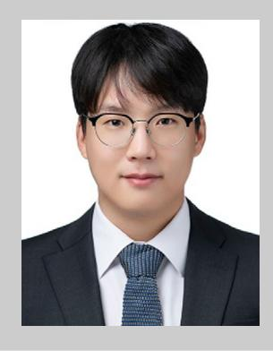

**Jaehyeong Bae** is an assistant professor in the Department of Chemical Engineering at Kyung Hee University, Korea. He received his B.S. degree in the Department of Chemical Engineering from Tsinghua University, China, in 2013, and completed his M.S. in the Department of Chemical and Biomolecular Engineering at the Korea Advanced Institute of Science and Technology (KAIST) in 2016. He received his Ph.D. in the Department of Materials Science and Engineering at KAIST in 2020 and conducted postdoctoral research at Harvard University from 2021 to 2022. His research focuses on developing 3D-printable multifunctional inks for energy-harvesting and energy-storage systems, CO2 sequestration, and cultured meat.

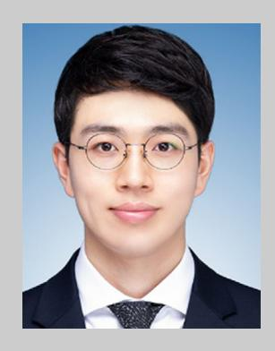

**Keonwoo Choi** is currently engaged in research on advancing vapor-phase synthesis techniques and developing associated process equipment. He received his Ph.D. in Chemical and Biomolecular Engineering from the Korea Advanced Institute of Science and Technology (KAIST) in 2025. His research interests include the design and synthesis of functional thin films using vapor-phase deposition processes and their applications in next-generation energy storage systems and sustainable porous membranes.

**Jun Young Cheong** is currently a reader (associate professor) at the James Watt School of Engineering, University of Glasgow, United Kingdom, since May 2024. He was previously a group leader at University of Bayreuth (Baybatt). Prior to joining the University of Bayreuth, he was a staff engineer at Samsung SDI, specializing on electrode processing. He received his BS degree, MS degree, and Ph.D. degree in materials science and engineering from KAIST in Korea. His current research topic includes the synthesis of functional materials, energy storage, and conversion, and in situ characterizations.

**Sung Gap Im** is a professor in the Department of Chemical and Biomolecular Engineering at the Korea Advanced Institute of Science and Technology (KAIST). He received his B.S. and M.S. Chemical Engineering degrees from Seoul National University in 1997 and 1999, respectively, and his Ph.D. in Chemical Engineering degree from the Massachusetts Institute of Technology (MIT) in 2009. After working as a postdoctoral research fellow at MIT, he joined KAIST in 2010. His research interest is the chemical vapor deposition of functional polymer films and their applications in batteries, flexible electronics, and surface modification.

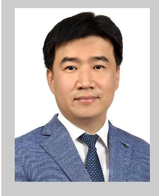

**Il-Doo Kim** is a chair professor in the Department of Materials Science and Engineering (MSE) at the Korea Advanced Institute of Science and Technology (KAIST). He received his Ph.D. in MSE from KAIST and conducted postdoctoral research at the Massachusetts Institute of Technology (MIT) from 2003 to 2005. His research focuses on functional organic and inorganic nanomaterials for membranes, energy-harvesting and energy-storage systems, and chemical sensors. Prof. Kim serves as an Executive Editor of ACS Nano. He is a fellow of the Korean Academy of Science and Technology and a general member of the National Academy of Engineering of Korea.