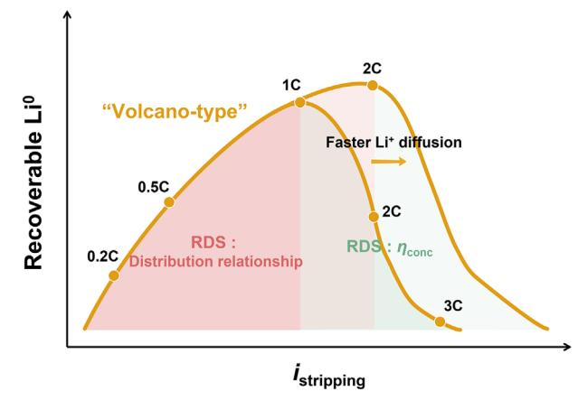
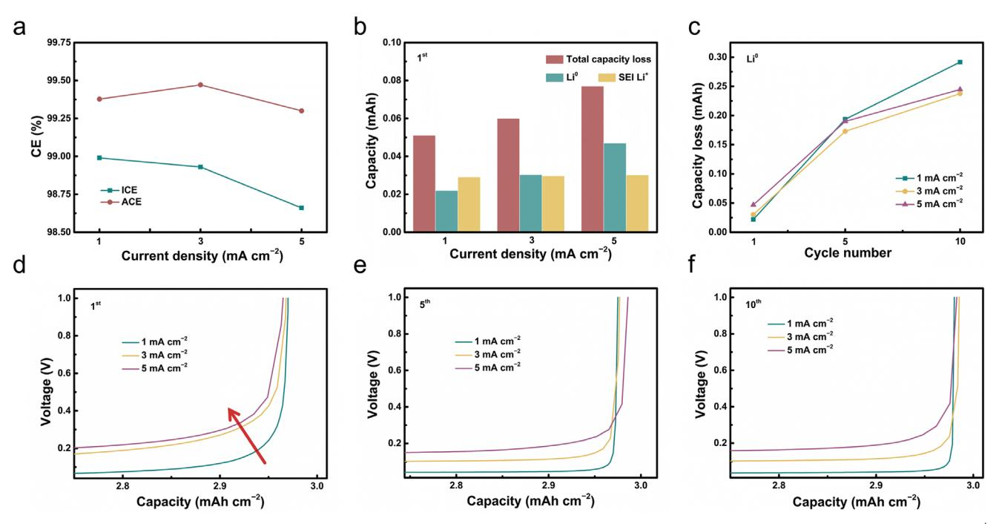
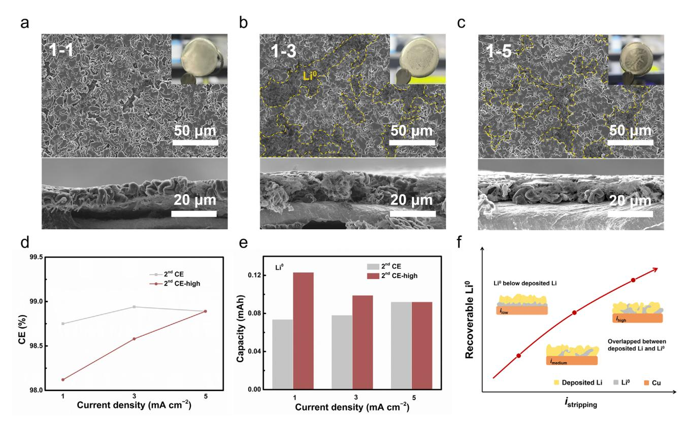
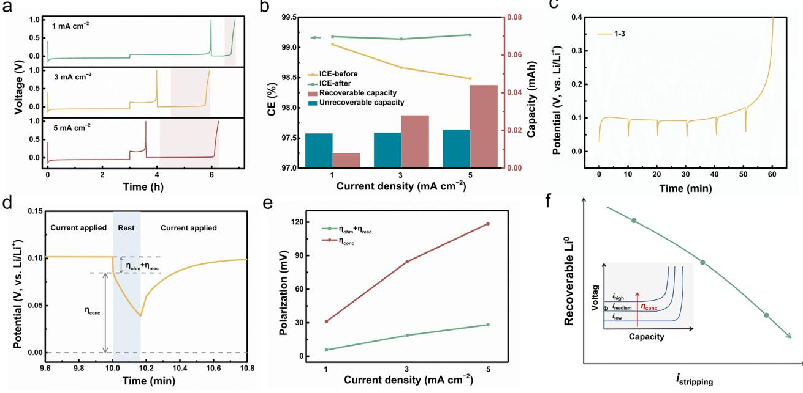
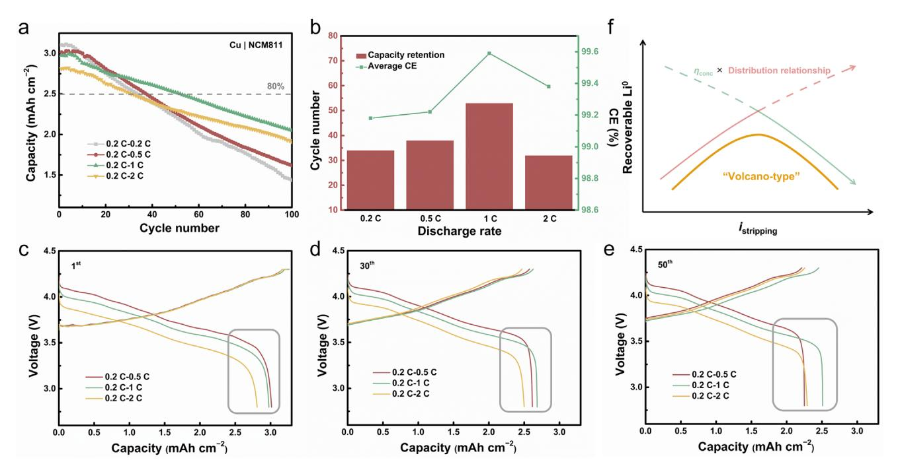
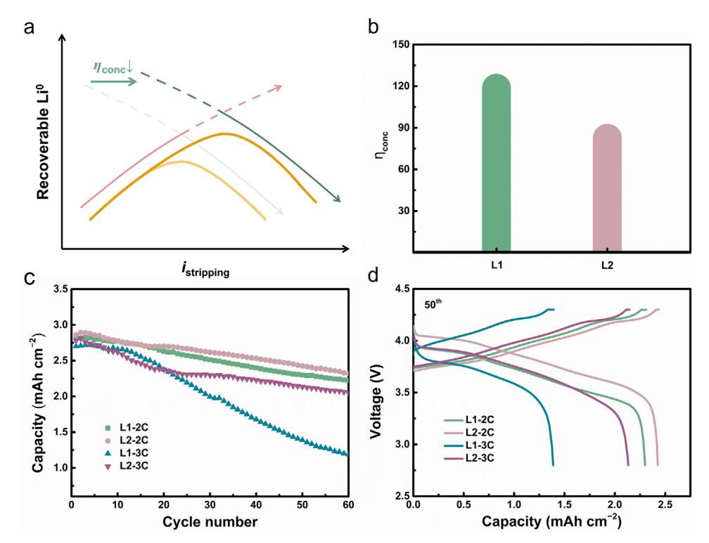

# **Decoupling Lithium Reutilization Behavior under Different Discharge Rates for Anode-Free Lithium Metal Batteries**

*Shuo Zhang, Chong Yan,\* Ye Xiao, Yi-Hui Wu, and Jia-Qi Huang\**

**Anode-free lithium metal battery (AFLMB) has become an excellent candidate for long endurance electric vehicles and electric low altitude aircraft, profiting from its high energy density as well as outstanding manufacturing safety. However, the limitation at high discharge rates of AFLMBs is shrouded in mystery, yet to achieve more attention. Herein, the limitation of fast discharge for AFLMBs is dissected exhaustively, and a symptomatic strategy to break the limit is put forward, in order to eliminate the inevitable mismatch that lies in the inferior performance of AFLMBs. A "volcano-type" curve of capacity retention of AFLMBs is discovered with the discharge rate increased. Systematic investigation revealed that the overlapped spatial relationship between fresh deposited Li and residue Li0 facilitated the utilization of "recoverable Li0" (Li0) at the prophase of discharge rate increase. However, further enhanced discharge rate induced large concentration polarization (conc), reflecting limited Li+ diffusion. Enabling the electrolyte to rapidly transport Li+ by lowering conc increased the optimal discharge rate as well as the cycling stability of AFLMBs. This work reveals the rate-determining step for high-rate discharge and expands the employment boundary of AFLMBs under harsh conditions, providing a significant complement of present knowledge with respect to the power performance of AFLMBs.**

#### **1. Introduction**

The successive progress beyond conventional lithium-ion battery (LIB) over the past several years has been unquestionable successful.[\[1\]](#page-6-0) As a representative, lithium metal battery (LMB) has realized ultra-high energy density over 500 Wh kg−1 step by step because of the high theoretical capacity (3860 mAh g−1)

S. Zhang, C. Yan, Y. Xiao, Y.-H. Wu, J.-Q. Huang School of Materials Science and Engineering Beijing Institute of Technology Beijing100081, China E-mail: [yanc@bit.edu.cn;](mailto:yanc@bit.edu.cn) [jqhuang@bit.edu.cn](mailto:jqhuang@bit.edu.cn) S. Zhang, C. Yan, Y. Xiao, Y.-H. Wu, J.-Q. Huang Advanced Research Institute of Multidisciplinary Science Beijing Institute of Technology Beijing100081, China J.-Q. Huang Department of Chemical and Biomolecular Engineering Yonsei University Seoul03722, Republic of Korea

The ORCID identification number(s) for the author(s) of this article can be found under <https://doi.org/10.1002/adma.202503582>

**DOI: 10.1002/adma.202503582**

as well as the most negative equilibrium potential (−3.040 V versus standard hydrogen electrode) of lithium (Li), which breaks the energy density ceiling of LIB.[\[2\]](#page-6-0) However, the production environment of LMBs is rigorous since the high reactivity of Li (extremely sensitive to the water and oxygen content).[\[3\]](#page-6-0) Employing current collector (such as copper, Cu) as anode directly, anode-free lithium metal battery (AFLMB) arises at the historic moment, whose Li supplement all comes from cathode.[\[4\]](#page-6-0) Ulteriorly, thanks to the high stability of Cu, AFLMBs reduce the requirements for battery production while maintain the high theoretical capacity of Li, making them to be one of the best choices for promoting the practical application of LMBs.[\[5\]](#page-6-0) Cycling protocol, electrolyte optimization and current collector regulation are all considered as effective strategies to improve the cycling stability of AFLMBs.[\[6\]](#page-6-0) Besides, expanding the application scenarios of AFLMBs in depth is conducive to stimulating their further development from the demand side.

Drones and electric vertical takeoff and landing (eVTOL), as a representative symbol of low-altitude economy, are receiving increasing attention.[\[7\]](#page-6-0) Taking eVTOL as an example, electric power is utilized to execute takeoff, climb, cruise, and landing commons.[\[8\]](#page-6-0) Besides, eVTOL, which prevails profit by its convenient, environmentally friendly, as well as swift and agile characteristics, usually applies to urban air mobility (UAM), including air taxi, airport shuttle, intercity transportation, and so on.[\[9\]](#page-6-0) The design of the electric power storage system impacts the range and payload sizes of eVTOL, which correspond to specific energy density and power density, respectively. As many reports indicate, more than 5C is required when eVTOL is in the takeoff and landing process. AFLMB is a cutting-edge energy storage system because of its high energy density, as mentioned before. Based on this, the key to realizing the application of AFLMBs in eVTOL lies in the comprehensive understanding of its power density and lifespan.

Recently, a series of research works have exhibited that a cycling protocol with low charge rate and high discharge rate is beneficial for improving the lifespan of AFLMBs.[\[10\]](#page-6-0) Meng and co-workers manifested that charge rate determines the amount of Li that diffuses from the cathode while the discharge rate impacts the utilization of the Li reservoir, which describes explicitly that the maximal utilization of Li happens at a low charge

**Figure 1.** Li reutilization behavior under different discharge rates.

rate and a high discharge rate scenario.[\[10f\]](#page-6-0) However, there is no clear exhibition in the present report on the improvement limitation of the discharge rate for AFLMBs. One of the potential factors that determines the performance of AFLMBs is the capacity loss caused by the accumulation of inactive Li, which includes SEI Li+ and Li0. [\[11\]](#page-6-0) Recent works from Cui and co-workers stated the reutilization mechanism of isolated Li that both calendar aging after discharging and a high interfacial electric field promote the reuse of Li0, which detaches from the current collector.[\[10b,h\]](#page-6-0) However, the different influence among various discharge rates on the reutilization of Li0 is still unknown. In short, the interplay among multi-factors makes the influence of discharge rates on the AFLMBs performance intricate.

In this contribution, the utilization behavior of Li0 at the anode side of AFLMBs was meticulously studied. Meanwhile, the rate-determining step (RDS) for gradient discharge rate and the mechanism behind it was uncovered (**Figure 1**). Specifically, the utilization of Li emerged as "volcano-type" with the increase of discharge rates in AFLMBs. The distribution relationship between residue Li0 and deposited Li, as well as concentration polarization (conc) played a critical role in Li0 utilization among different discharge rates. Sufficient spatial contact between deposited Li and Li0 promoted the full utilization of metallic Li, while concentration polarization during high-rate discharge limited the available capacity. By optimizing the electrolyte, we further improved the discharge rate limitation of the AFLMBs by reducing concentration polarization. A thorough understanding of the Li utilization behavior under high discharge rate promotes the further expansion of the application scenarios of AFLMBs and advances the practical process of LMBs.

#### **2. Results and Discussion**

Enhancing Li utilization efficiency is the key to the cycling stability for AFLMBs under high discharge rates. For keeping consistency with practical AFLMBs, the same charging protocol was set in Li | Cu half-cell. We firstly pre-cycled the cells ten times between 0–1 V with a current density of 0.01 mA cm−2 to eliminate the influence of Cu current collector (Figure S1, Supporting Information). After that, a plating current density of 1 mA cm−2 would be applied until 3 mAh cm−2 capacity was acquired.

Then different current densities of 1, 3, and 5 mA cm−2 were used to strip Li from the Cu current collector, respectively. Obvious distinctions emerged under different cycling conditions. In **Figure 2**[a,](#page-2-0) Coulombic efficiency (CE), which reflects the utilization efficiency of Li, decreased with stripping current density rising during the first cycle. However, average CE (ACE) exhibited a "volcano-type" tendency which increased first and then reduced as the cycle proceeded. The cycled cells were disassembled so as to thoroughly decouple the specific existence state of Li with the help of the titration gas chromatograph (TGC).[\[12\]](#page-6-0) The same variation tendency was presented between ICE and total capacity loss. As shown in Figure [2b,](#page-2-0) the content of SEI Li+ maintained consistency among these three-stripping current densities. In comparison, Li0 content remarkably influenced the total capacity loss. Lowest Li0 content and thinnest cross-sectional thickness were acquired in the medium current density (3 mA cm−2) after cycling, which was in accordance with the CE tendency (Figure [2c;](#page-2-0) Figure S2, Supporting Information). It was evident that the evolution of Li0 primarily guided the Li loss behavior under various current densities. However, the reason behind the evolution of Li0 under different current densities and cycling conditions was still waiting for exploration.

The charging curve reflected the specific electrode process during Li stripping in Li | Cu half-cells. In detail, the platform corresponded to the removal of freshly deposited Li, while the increase of the voltage reflected the reduction of available Li as well as the exposure of Cu current collector.[\[13\]](#page-7-0) Figure [2d](#page-2-0) and Figure S3 (Supporting Information) showed that the voltage rose first until the end of the stripping process (reaching the cut-off voltage of 1 V) under the high discharge current density (5 mA cm−2). Most Li0 was left behind in this situation. It is worth mentioning that Li0 contained both active Li left behind after stripping due to reaching the cut-off voltage in advance, and isolated Li which lost electrochemical activity. However, things turned to be quite different as the cycle number increased. When the voltage began to lift, more Li was stripped under the high discharge current density instead (Figure [2e,f\)](#page-2-0). As previous work presented, isolated Li could be reactivated to release capacity again through promoting the dissolution of SEI, which covers isolated Li, or stimulating isolated Li to move toward the Cu current collector. Intuitively, only SEI existed on Cu current collector because of the precycling before the first cycle. On the contrary, there was Li0 reserved on the electrode from previous cycles during the long cycle process. The difference in electrode surface is the key factor affecting the utilization of Li.

In order to figure out Li0 evolution under different stripping current densities, electrode interfaces were thoroughly analyzed. The choice of proper deposition current density as well as localized high-concentration electrolytes (LHCEs) realized homogenous and dense deposition morphology of Li (Figure S4, Supporting Information). Sharp contrast was acquired when different stripping currents worked (Figure S5, Supporting Information). Residue SEI shell and Li0 covered the whole electrode surface uniformly when 1 mA cm−2 was employed to strip Li. Conversely, 5 mA cm−2 stripping current caused significant exposure of the Cu surface with residue SEI shell and Li0 gathering in piles. The exposed Cu surface was smaller under 3 mA cm−2, and the distribution of SEI shell and Li0 was relatively uniform. Besides, interface capacitance was calculated to evaluate the conductive **[www.advancedsciencenews.com](http://www.advancedsciencenews.com) [www.advmat.de](http://www.advmat.de)**

**Figure 2.** Utilization behavior of Li under different stripping current densities. a) Coulombic efficiency of Li | Cu cells measured after 1st cycle and 10th cycle. b) Total capacity loss, Li0, and SEI Li+ in the first cycle calculated via TGC measurement. c) Capacity loss caused by Li0 after different cycles. d–f) Discharge profiles of Li | Cu half-cell under different stripping current densities at 1st, 5th, and 10th, respectively.

interface under different stripping current densities.[\[14\]](#page-7-0) The positive correlation between stripping current density and Cd indicated that a larger conductive interface was obtained at 5 mA cm−2 (Figure S6, Supporting Information). After that, 1 mAh cm−2 Li was deposited subsequently. Distinct deposition morphology appeared due to the difference in electrode surfaces. As shown in **Figure 3**[a,](#page-3-0) fresh Li deposited above the residue SEI shell and Li0 when the stripping current was 1 mA cm−2, corresponding to the metallic luster in the optical image (Figure [3a,](#page-3-0) inset). The lift of stripping current resulted in the overlapping between fresh deposited Li and residue Li0, which could be identified from the surface morphology as well as the optical images (Figure [3b,c\)](#page-3-0). Similar phenomena were also observed at a lower deposited capacity (Figure S7, Supporting Information). The connection between the reuse of Li0 and different distribution relationships needs to be further explored. For this reason, the same cycling process was applied after the cells stripping with different current densities to obtain different distribution relationships and exclude the influence of stripping currents. Then the utilization of Li0 was marked. Cells cycled with the same stripping current were employed as a control, and a "volcano-type" variation of CE was presented in this case (light grey line in Figure [3d\)](#page-3-0). In contrast, CE increased linearly as the previous stripping current lifted (red line in Figure [3d\)](#page-3-0). And the amount of Li0 declined compared with the increase in the control group (Figure [3e;](#page-3-0) Figures S8, S9, Supporting Information). It illustrates that Li0 contributes more capacity when the previous stripping current density is higher, corresponding to a more noticeable overlapping relationship of fresh deposited Li and Li0. In specific, this overlapping relationship strengthened the contact between Li0 and conductive interface, which is enlarged due to the deposited Li (Figure [3f\)](#page-3-0). Thereupon, the reuse efficiency via rest and a large interface electric field was enhanced. Once SEI dissolved during rest, the exposed Li0 connected to the conductive part more effectively thanks to the overlapping relationship.[\[10h\]](#page-6-0) Besides, Li0 redistribution caused by a large interface electric field was restricted to the electrode surface with the more conductive interface.[\[10b\]](#page-6-0) In another word, more residual Li0 had the ability to release more capacity. However, when Li0 was below the fresh deposited Li, the conductive interface was only a limited area of the electrode, which restricted the Li0 utilization. In this case, the Li reversibility increases as the rise of stripping current, however, the successive increasement of the stripping current density triggered a decline of CE as the cycle number increased, corresponding to the decline portion of "volcano-type" curve. It indicated that high discharge current isn't conducive to Li0 utilization, proving that there are other factors dominating the utilization of Li.

Besides, the same phenomenon was also observed by extending the cycle number. Figures S10–S12 (Supporting Information) illustrated the deposition morphology of Li after five cycles at different current densities. In Figure S10a (Supporting Information), fresh deposited Li was observed on the surface morphology after low current density stripping. It can also be proved from the cross-sectional image that Li0 exists below fresh Li (Figure S10b, Supporting Information). Meanwhile, the increasement in deposition capacity did not alter the cross-sectional morphology (Figure S10c, Supporting Information). On the contrary, a large stripping current converted the spatial relationship between deposited Li and Li0. In Figures S11a, S12a (Supporting Information), a large amount of Li0 exists between the deposited lithium, which was consistent with the cross-sectional morphology observed in Figures S11b,c, S12b,c (Supporting Information). It was

**Figure 3.** The surface and cross-sectional morphology of Li deposition after 1st cycle with a) 1 mA cm−2, b) 3 mA cm−2, and c) 5 mA cm−2 as stripping current density. Insets are the optical images of the Cu surface. d) Coulombic efficiency of Li | Cu cells upon cycling under different (light grey profile) and same (red profile, 5 mA cm−2) discharge current density at the 2nd cycle. e) The accumulation of Li0 after the 2nd cycle. f) A schematic illustration about the evolution of the deposition relationship between fresh deposited Li and Li0 with gradient stripping current density.

sufficient to confirm the profound influence of the deposition relationship between fresh Li and Li0 on Li0 utilization.

Despite the enhanced utilization of Li0, CE declined as the stripping current density increased as shown in Figure [1a.](#page-1-0) The amount of Li0 that could be reused was quantified first in order to unveil the "volcano-type" variation of CE. A 30 min rest was applied to cells with different stripping current densities, which was proved to be sufficient for SEI dissolution as well as polarization recovery.[\[10h\]](#page-6-0) Subsequently, the recoverable capacity was fully released at the current density of 0.01 mA cm−2 (**Figure 4**[a\)](#page-4-0). High charge current density corresponded to more capacity recovery (Figure [4b\)](#page-4-0). The unrecoverable capacity was basically the same, proving the adequacy of Li0 removal at this current density. It also showed that initial CE (ICE) maintained roughly the same among different discharge current densities after small current stripping, which was different from the initial decreasing trend. Further clarification is needed to explore the limiting factors of Li stripping at high current density, which has the potential to release more capacity.

Back to Figure [1d–f,](#page-1-0) the influence of polarization was noticed. Polarization during discharge includes conc, electrochemical polarization (reac), and Ohmic polarization (ohm). Threeelectrode configuration combined with time-resolved transient relaxation measurement is used to decouple the source of polarization (Figure [4c;](#page-4-0) Figures S13 and S14, Supporting Information). After depositing 3 mAh cm−2 on Cu electrode, gradient Li stripping current density was applied with 10 s intervals equally distributed in this process. The difference between the dropped potential and thermodynamic potential of Li stripping (0 V vs Li | Li+) was counted. The 10 s relaxation is sufficient to distinguish the conc from ohm and reac (Figure [4d\)](#page-4-0). The last two were considered as a whole on account of the shorter recovery time (within 10 s) compared with conc. [\[15\]](#page-7-0) Polarization from different points during discharging was averaged, and the value was exhibited in Figure [4e](#page-4-0) and Figure S15 (Supporting Information). conc obviously dominates the electrode polarization on the stripping side compared to ohm and reac. This phenomenon was more pronounced at a high discharge current density. Therefore, a smaller capacity was recoverable because of the larger conc as the discharge current increased (Figure [4f\)](#page-4-0). Despite the limited conductive area caused by the up-down spatial relationship between Li0 and freshly deposited Li, low conc under low discharge current density facilitates capacity release. Regarding high discharge current density, large conc leads to the early reach on the cut-off voltage, which offsets the advantage of the overlapped relationship between Li0 and fresh Li, resulting in reduced Li0 utilization. Thus, moderate discharge current density exerts most capacity thanks to a lower conc as well as the prominent deposition morphology.

"Volcano-type" variation of CE and discharge capacity retention was also observed in full cells with 3mAh cm−2 NCM811 as cathode (Figure S16, Supporting Information). After

**Figure 4.** a) Cycling profiles with low stripping current density to distinguish the recoverable capacity (red shadow area). b) Coulombic efficiency before and after discharge (left) and statistically recoverable capacity (right). c) Three-electrode time-resolved transient relaxation measurement to deconvolve polarization under 3 mA cm−2 with 10 min interval. d) The specific process to decouple concentration polarization, Ohmic polarization, and electrochemical polarization. The value was concluded in (e). f) A schematic illustration to demonstrate the effect of concentration polarization on recoverable Li0.

formation at 0.1C for two times, the same charge rate (0.2C) and different discharge rates were employed. Furthermore, 80% of the first discharge capacity at a discharge rate of 0.2C was used to mark the lifespan, referring to Li0 utilization. As shown in **Figure 5**[a,](#page-5-0) increasing discharge rate (1C) efficiently improved the lifespan of AFLMBs, compared with the cells with the same charge and discharge rate. However, further increase of discharge rate (2C) resulted in the reducing of lifespan. In specific, AFLMBs cycled 53 times before reaching 80% capacity retention at a 1C discharge rate. The stable cycle numbers for 0.5C and 2C were merely 38 and 32 times, respectively. After 100 cycles, the capacity retention was respectively 53.7%, 68.8%, and 67.9% for 0.5C, 1C, and 2C (Figure S17a, Supporting Information). At the same time, the average CE was 99.22%, 99.59%, and 99.38% for 0.5C, 1C, and 2C, respectively, following the "volcano-type" variation trend (Figure [5b;](#page-5-0) Figure S17b, Supporting Information). Increasing the discharge rate to 5C step by step resulted in severe capacity decay (Figures S18 and S19, Supporting Information). Figure [5c–e](#page-5-0) displays the charge and discharge curves in different cycle numbers. Keeping pace with the results in half-cells, polarization increased rapidly at higher discharge rate in the first cycle. A time-resolved transient relaxation measurement was conducted to decouple the polarization (Figure S20, Supporting Information). Not surprisingly, conc contributed to the major part. More capacity was released at 1C on 30th and 50th cycle, benefiting from the high utilization of Li0 at the optimal discharge rate. Same results were acquired when 0.1C was employed to strip Li0 from anode after cycling 40 times at different discharge rate (Figure S21, Supporting Information). This verified that Li0 left behind on the anode was recoverable. The increasement in conc led to capacity loss

at high discharge rate, while the overlapped spatial relationship promoted Li0 reuse. Under the joint effect of the two, the capacity retention in AFLMBs exhibited a "volcano-type" variation (Figure [5f\)](#page-5-0). A large amount of Li+ was produced rapidly in a short period of time at high discharge rate, which was hard to diffuse away in time. And large conc appeared in turns. Optimizing the Li+ transport capability of electrolyte can lower the conc, which facilitates the decline stage of the "volcano-type" curve moving to higher discharge rate. Based on LHCE, lowering the concentration of electrolyte improved Li+ conductivity (L2, Figure S22, Supporting Information) and the optimal discharge rate was increased (**Figure 6**[a\)](#page-5-0). As expected, conc in L2 was only 70% of that in L1, which was sufficient to optimize the stable discharge rate of AFLMBs (Figure [6b;](#page-5-0) Figure S23, Supporting Information). The improvement of capacity retention with cycle numbers at 2C and 3C was demonstrated in Figure [6c](#page-5-0) and Figures S24 and S25 (Supporting Information). After 60 cycles at 2C in the L2 system, the discharge capacity retention was 81.0%, which was 79.1% in the L1 system. The difference in lifespan under 3C was more significant, 44.0% for L1 and 71.5% for L2 during the first 60 cycles, respectively (Figure [6c\)](#page-5-0). 27.7% and 67.0% of capacity was retained after 100 cycles for L1 and L2 (Figure S25, Supporting Information). What's more, "volcano-type" variation was also acquired with L2 electrolyte, where 2C was the optimal discharge rate (Figure S26, Supporting Information). The voltage curve of the 50th cycle showed that the discharge capacity of the L2 system was superior to that of the L1 system among different discharge rates (Figure [6d\)](#page-5-0). It demonstrated that improving the transport capability of Li+ is beneficial for the increase of the optimal discharge rates

**[www.advancedsciencenews.com](http://www.advancedsciencenews.com) [www.advmat.de](http://www.advmat.de)**

**Figure 5.** a) Electrochemical performance demonstration of AFLMBs under different discharge rates. b) Capacity retention (left) and average CE (right) after 100 cycles. Specific voltage curves at c) 1st, d) 30th, e) 50th. f) A schematic description the competition between deposition relationship and concentration polarization under different discharge rates.

**Figure 6.** Improved electrochemical performance via electrolyte optimization. a) A schematic illustration to elaborate the improving mechanism. b) Concentration polarization comparation between L1 and L2. L2 contained 1 M LiFSI and trace LiPF6 dissolved in DME and HFE, with a volume ratio of 1:2. c) Electrochemical performance and d) voltage curves under 2C and 3C.

**[www.advancedsciencenews.com](http://www.advancedsciencenews.com) [www.advmat.de](http://www.advmat.de)**

### **3. Conclusion**

In conclusion, this work elucidated the significant importance of discharge rate in the cycling stability of AFLMBs, unraveling the evolution behavior of Li0 under different Li stripping current densities. The priority of the distribution of fresh Li in residue Li0 and conc determines the utilization of Li0, which results in the "volcano-type" cycling stability of AFLMBs. In relatively high discharge rate scenario, an overlapped relationship was discovered between fresh deposited Li and residue Li0, which promoted the reuse of Li0. Besides, small conc was guaranteed in this situation. However, strengthened conc terminated the stripping process in advance as the discharge rate was increased further, which gave rise to the optimal discharge rate. Improving the Li+ transport capacity of the electrolyte was verified as an efficient approach to enhance the optimal discharge rate. This work undoubtedly amplifies the potential for the deployment of AFLMBs, which paves a new way for the development of high-power density energy storage systems.

#### **Supporting Information**

Supporting Information is available from the Wiley Online Library or from the author.

#### **Acknowledgements**

This work was supported by Beijing Natural Science Foundation (L233004, L247018), and National Natural Science Foundation of China (22425901, 22379014).

## **Conflict of Interest**

The authors declare no conflict of interest.

### **Data Availability Statement**

The data that support the findings of this study are available from the corresponding author upon reasonable request.

#### **Keywords**

anode-free, concentration polarization, fast discharge, lithium metal batteries, recoverable Li0

> Received: February 21, 2025 Revised: April 17, 2025 Published online: April 29, 2025

[1] a) K. Xu, *Chem. Rev.* **2014**, *114*, 11503; b) X. B. Cheng, R. Zhang, C. Z. Zhao, Q. Zhang, *Chem. Rev.* **2017**, *117*, 10403; c) K. H. Han, J. Y. Seok, I. H. Kim, K. Woo, J. H. Kim, G. G. Yang, H. J. Choi, S. Kwon, E. I. Jung, S. O. Kim, *Adv. Mater.* **2022**, *34*, 2203992; d) J. Balamurugan, P. M. Austeria, J. B. Kim, E. S. Jeong, H. H. Huang, D. H. Kim, N. Koratkar, S. O. Kim, *Adv. Mater.* **2023**, *35*, 2302625.

- [2] a) R. Xu, J. F. Ding, X. X. Ma, C. Yan, Y. X. Yao, J. Q. Huang, *Adv. Mater.* **2021**, *33*, 2105962; b) Y. Jie, S. Wang, S. Weng, Y. Liu, M. Yang, C. Tang, X. Li, Z. Zhang, Y. Zhang, Y. Chen, F. Huang, Y. Xu, W. Li, Y. Guo, Z. He, X. Ren, Y. Lu, K. Yang, S. Cao, H. Lin, R. Cao, P. Yan, T. Cheng, X. Wang, S. Jiao, D. Xu, *Nat. Energy* **2024**, *9*, 987; c) C. X. Bi, L. P. Hou, Z. Li, M. Zhao, X. Q. Zhang, B. Q. Li, Q. Zhang, J. Q. Huang, *Energy Mater. Adv.* **2023**, *4*, 0010;
- [3] a) S. Y. Sun, X. Q. Zhang, Y. N. Wang, J. L. Li, Z. Zheng, J. Q. Huang, *Mater. Today* **2024**, *77*, 39; b) C. Yan, R. Xu, Y. Xiao, J. F. Ding, L. Xu, B. Q. Li, J. Q. Huang, *Adv. Funct. Mater.* **2020**, *30*, 1909887; c) S. J. Yang, H. Yuan, N. Yao, J. K. Hu, X. L. Wang, R. Wen, J. Liu, J. Q. Huang, *Adv. Mater.* **2024**, *36*, 2405086.
- [4] a) B. J. Neudecker, N. J. Dudney, J. B. Bates, *J. Electrochem. Soc.* **2000**, *147*, 517; b) J. Qian, B. D. Adams, J. Zheng, W. Xu, W. A. Henderson, J. Wang, M. E. Bowden, S. Xu, J. Hu, J. G. Zhang, *Adv. Funct. Mater.* **2016**, *26*, 7094; c) S. Nanda, A. Gupta, A. Manthiram, *Adv. Energy Mater.* **2020**, *11*, 2000804.
- [5] a) J. Liu, Z. Bao, Y. Cui, E. J. Dufek, J. B. Goodenough, P. Khalifah, Q. Li, B. Y. Liaw, P. Liu, A. Manthiram, Y. S. Meng, V. R. Subramanian, M. F. Toney, V. V. Viswanathan, M. S. Whittingham, J. Xiao, W. Xu, J. Yang, X. Q. Yang, J. G. Zhang, *Nat. Energy* **2019**, *4*, 180; b) A. J. Louli, A. Eldesoky, J. deGooyer, M. Coon, C. P. Aiken, Z. Simunovic, M. Metzger, J. R. Dahn, *J. Electrochem. Soc.* **2022**, *169*, 040517.
- [6] a) M. Mao, X. Ji, Q. Wang, Z. Lin, M. Li, T. Liu, C. Wang, Y. S. Hu, H. Li, X. Huang, L. Chen, L. Suo, *Nat. Commun.* **2023**, *14*, 1082; b) P. Molaiyan, M. Abdollahifar, B. Boz, A. Beutl, M. Krammer, N. Zhang, A. Tron, M. Romio, M. Ricci, R. Adelung, A. Kwade, U. Lassi, A. Paolella, *Adv. Funct. Mater.* **2023**, *34*, 2311301.
- [7] a) S. Sripad, D. Korff, S. C. DeCaluwe, V. Viswanathan, *J. Chem. Phys.* **2020**, *153*, 194701; b) A. Goshtasbi, R. Zhao, R. Wang, S. Han, W. Ma, J. Neubauer, *J. Power Sources* **2024**, *620*, 235188; c) F. Mazzeo, E. L. de Angelis, F. Giulietti, A. Talamelli, F. Leali, *Drones* **2024**, *8*, 507.
- [8] M. Dixit, A. Bisht, B. Witherspoon, R. Essehli, R. Amin, A. Duncan, J. Hines, C. B. M. Kweon, I. Belharouak, *Adv. Energy Mater.* **2024**, *14*, 2400772.
- [9] A. Bisht, M. Dixit, R. Amin, R. Essehli, A. Abouimrane, C.- B. M. Kweon, I. Belharouak, *J. Power Sources* **2024**, *623*, 235464.
- [10] a) J. Zheng, P. Yan, D. Mei, M. H. Engelhard, S. S. Cartmell, B. J. Polzin, C. Wang, J. G. Zhang, W. Xu, *Adv. Energy Mater.* **2016**, *6*, 1502151; b) F. Liu, R. Xu, Y. Wu, D. T. Boyle, A. Yang, J. Xu, Y. Zhu, Y. Ye, Z. Yu, Z. Zhang, X. Xiao, W. Huang, H. Wang, H. Chen, Y. Cui, *Nature* **2021**, *600*, 659; c) A. J. Louli, M. Coon, M. Genovese, J. deGooyer, A. Eldesoky, J. R. Dahn, *J. Electrochem. Soc.* **2021**, *168*, 020515; d) A. Dutta, E. Mizuki, S. Matsuda, *Batteries Supercaps* **2023**, *6*, 202300309; e) H. Wang, Z. Xie, C. Liu, B. Hu, S. Liao, X. Yan, F. Ye, S. Huang, Y. Guo, C. Ouyang, *ACS Appl. Mater. Interfaces* **2023**, *15*, 12967; f) C. Gervillié-Mouravieff, L. Ah, A. Liu, C. J. Huang, Y. S. Meng, *ACS Energy Lett.* **2024**, *9*, 1693; g) S. Oh, A. R. Jeon, G. Lim, M. K. Cho, K. H. Chae, S. S. Sohn, M. Lee, S. K. Jung, J. Hong, *Energy Stor. Mater.* **2024**, *65*, 103169; h) W. Zhang, P. Sayavong, X. Xiao, S. T. Oyakhire, S. B. Shuchi, R. A. Vilá, D. T. Boyle, S. C. Kim, M. S. Kim, S. E. Holmes, Y. Ye, D. Li, S. F. Bent, Y. Cui, *Nature* **2024**, *626*, 306.
- [11] a) A. B. Gunnarsdottir, C. V. Amanchukwu, S. Menkin, C. P. Grey, *J. Am. Chem. Soc.* **2020**, *142*, 20814; b) M. Tao, Y. Xiang, D. Zhao, P. Shan, Y. Sun, Y. Yang, *Nano Lett.* **2022**, *22*, 6775; c) M. Tao, Y. Xiang, D. Zhao, P. Shan, Y. Yang, *Commun. Mater.* **2022**, *3*, 50.
- [12] a) C. C. Fang, J. X. Li, M. H. Zhang, Y. H. Zhang, F. Yang, J. Z. Lee, M. H. Lee, J. Alvarado, M. A. Schroeder, Y. Yang, B. Y. Lu, N. Williams, M. Ceja, L. Yang, M. Cai, J. Gu, K. Xu, X. F. Wang, Y. S. Meng, *Nature*

**2019**, *572*, 511; b) J. F. Ding, R. Xu, X. X. Ma, Y. Xiao, Y. X. Yao, C. Yan, J. Q. Huang, *Angew. Chem., Int. Ed.* **2021**, *61*, 202115602.

- [13] R. Zhang, X. Shen, Y. T. Zhang, X. L. Zhong, H. T. Ju, T. X. Huang, X. Chen, J. D. Zhang, J. Q. Huang, *J. Energy Chem.* **2021**, *71*, 29.
- [14] L. Xu, Y. Xiao, Y. Yang, S. J. Yang, X. R. Chen, R. Xu, Y. X. Yao, W. L. Cai, C. Yan, J. Q. Huang, Q. Zhang, *Angew. Chem., Int. Ed.* **2022**, *61*, 202210365.
- [15] R. Xu, S. Zhang, X. Shen, N. Yao, J. F. Ding, Y. Xiao, L. Xu, C. Yan, J. Q. Huang, *Small Struct.* **2023**, *4*, 2200400.