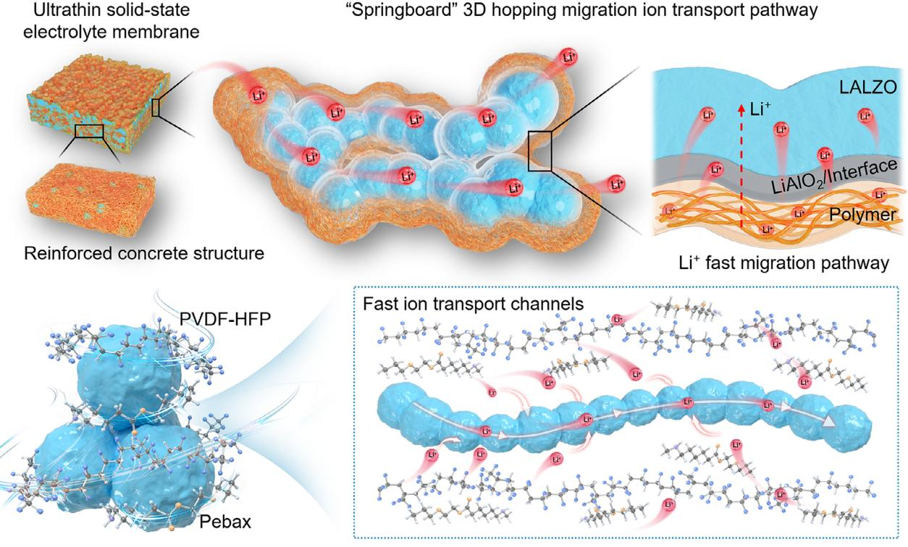
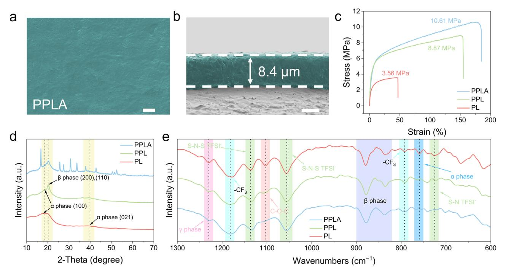
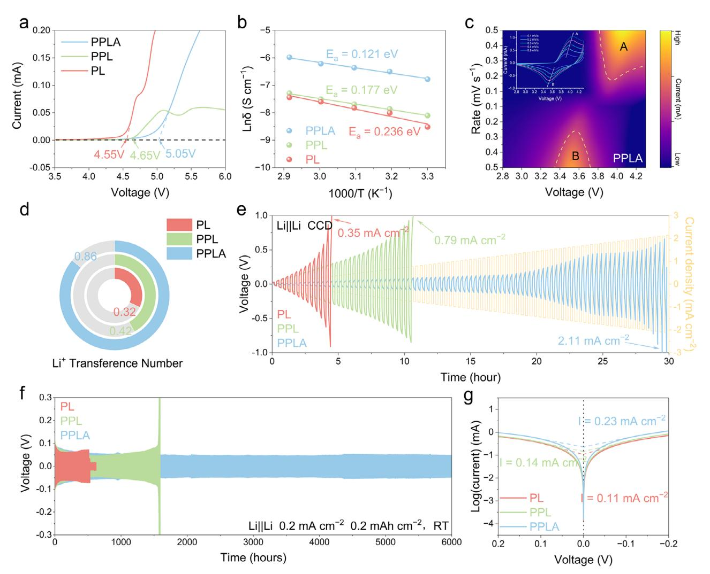
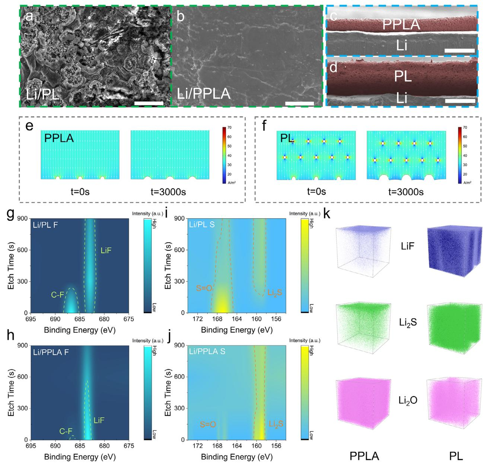
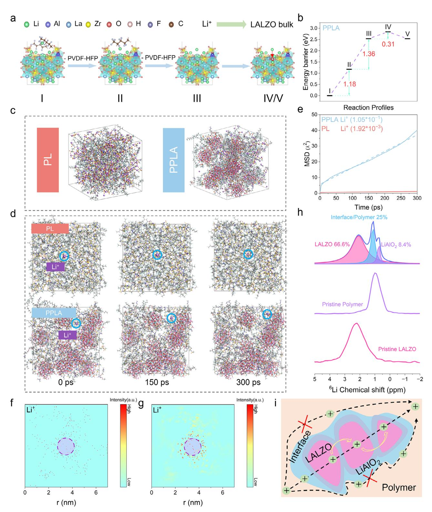
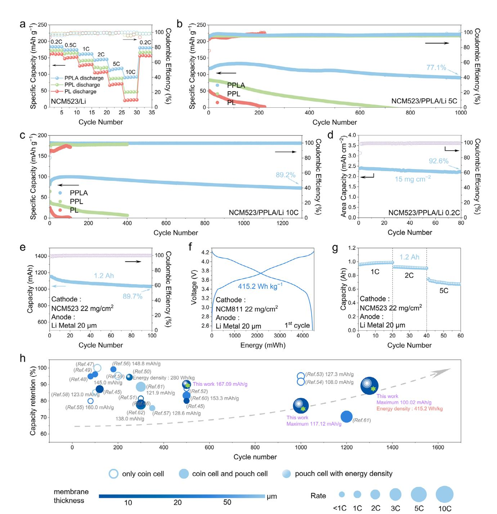

# **Ultrathin Electrolyte Membranes With Reinforced Concrete Structure for Fast-Charging Solid-State Lithium Metal Batteries**

*Yihang Nie, Dan Luo,\* Tingzhou Yang,\* Xiaoen Wang, Shibin Li, Guo Feng, Longjie He, Yiting Shao, Jiayi Wang, Mingliang Jin, Xin Wang,\* and Zhongwei Chen\**

**Realizing solid-state lithium (Li) metal batteries with fast charging capability and desirable energy density remains a key challenge for emerging applications for drones and consumer electronics, which require solid electrolytes to maintain good ionic conductivity and mechanical integrity with fast reaction kinetics. Herein, an 8.4 µm ultrathin solid electrolyte membrane is manifested with a reinforced concrete structure and expedited ion hopping migration capability, enabling the solid-state battery with fast charging capability. The rapid multi-dimensional Li-ion transportation network is well-constructed based on nanosized ceramic conductor aggregation and polymer chain induction, which allows homogenized Li+ distribution on the interface with a continuous uniform and steady plating/stripping process, thereby enhancing interfacial stability and inhibiting dendrite growth. Attributed to its structural superiorities, the assembled solid-state lithium metal battery maintains an excellent capacity retention rate of 89.2% after 1300 cycles at 10 C. A 1.2 Ah pouch cell is fabricated with a high energy density of 415.2 Wh kg−1 and also capable of cycling at 5 C, showing great potential for the practical application of solid-state batteries for next-generation energy storage devices.**

charging technology relies on multiple considerations including vehicle engineering and charging infrastructure, battery design and chemistry are core elements that determine its successful deployment. Charging at high current rates has been shown to accelerate battery degradation, leading to severe capacity fade, deleterious side reactions, and unexpected safety issues.[\[4–6\]](#page-9-0) Liquid electrolytes with non-unity Li-ion transference numbers will inevitably form ionic concentration gradients at high currents, and Li ions will aggregate around the interface, resulting in uneven deposition that can pierce the separator and cause an internal short circuit. Furthermore, more heat generated at high charging rates cannot be dissipated promptly and homogeneously, triggering safety issues by accelerating the side reactions.

To date, solid-state batteries based on inorganic or polymer solid-state electrolytes (SSEs) have been widely developed as potential follow-up technologies with enhanced safety and higher energy density,

# **1. Introduction**

Enabling extreme fast charging (XFC) capabilities of rechargeable lithium (Li) metal batteries (LMB) is the most important feature for electric vehicles to enable faster and farther travel.[\[1–3\]](#page-9-0) The United States Department of Energy has proposed the target of refilling 80% state of charge within 15 min with an energy density of over 180 Wh kg−1 for more than 500 XFC cycles. While fast

Y. Nie, J. Wang, X. Wang Institute of Carbon Neutrality Zhejiang Wanli University Ningbo 315100, China E-mail: [wangx@zwu.edu.cn](mailto:wangx@zwu.edu.cn) Y. Nie, S. Li, G. Feng, L. He, Y. Shao, M. Jin, X. Wang South China Academy of Advanced Optoelectronics South China Normal University Guangzhou 510006, China

The ORCID identification number(s) for the author(s) of this article can be found under <https://doi.org/10.1002/adma.202504092>

**DOI: 10.1002/adma.202504092**

which can solve overheating and thermal runaway problems, further preventing side reactions under high current rates.[\[7–10\]](#page-9-0) Compared to inorganic electrolytes with excellent thermal stability and high ionic conductivity at room temperature, polymer electrolytes possess high environmental stability, improved flexibility, and easy processing at low cost. The composite SSEs constructed by the inorganic fillers and polymer electrolytes inherit the advantages of both, and the empowered high Li-ion

D. Luo, T. Yang, X. Wang, Z. Chen State Key Laboratory of Catalysis, Dalian Institute of Chemical Physics Chinese Academy of Sciences Dalian 116023, China E-mail: [luodan@dicp.ac.cn;](mailto:luodan@dicp.ac.cn)[tzyang@dicp.ac.cn;](mailto:tzyang@dicp.ac.cn) [zwchen@dicp.ac.cn](mailto:zwchen@dicp.ac.cn) T. Yang School of Chemistry and Chemical Engineering Nantong University Nantong 226019, China X. Wang Yuyao Innovation Institute Zhejiang Wanli University Ningbo 315100, China

**Figure 1.** Internal structure and transport mechanism of ultrathin electrolyte membranes. Schematic illustration of ion hopping migration in solid electrolyte within ultrathin reinforced concrete structure.

transference numbers enable very fast charging capabilities without any electrolyte polarization.[\[11–13\]](#page-9-0) However, typical SSEs with poor mechanical properties require to be fabricated very thick to ensure their integrity under the inevitable stresses during battery assembly, which greatly sacrifices the battery energy density.[\[14,15\]](#page-9-0) The limited wettability between SSEs and electrodes results in high interface resistance and low utilization of active materials due to poor interface contact.[\[16–18\]](#page-9-0) These limitations of SSE fabrication have greatly compromised the achievable energy density and cyclability of solid-state batteries, especially under XFC conditions.

To design ultrathin SSEs, a feasible and scalable strategy is to combine SSEs with porous thin scaffolds to fabricate selfsupporting membranes.[\[19,20\]](#page-10-0) However, introducing conventional inert scaffolds significantly reduces the transport medium and increases the tortuosity of Li-ion transport, resulting in ionic concentration gradients forming at high currents.[\[21–23\]](#page-10-0) Li ions will aggregate around the interface, resulting in an uneven deposition that stimulates the growth of the dendrite structure.[\[24–26\]](#page-10-0) To further alleviate these issues, it is necessary to endow abundant ion migration sites in the matrix to fully interact with the ion conductor, thereby constructing the effective ion transport network with a cooperative ion transport mode toward ultrafast ionic conduction under extremely fast charging conditions.[\[27–30\]](#page-10-0) Therefore, understanding the origin of Li-ion transport in SSEs can further guide the rational design of high-performance SSLMBs.

Herein, we validate a fabrication method for designing 8.4 μm flexible ultrathin SSEs based on reinforced concrete structure, where the polymer matrix with high mechanical strength can induce ion migration to ceramic conductors and nano-sized ceramic conductors serve as to concentrate Li ions and construct additional ionic pathways, further facilitating ion transport and significantly eliminating concentration polarization at the interface. As such, unique Li-ion hopping migration strategy along the reinforced concrete structure is established (**Figure 1**), which exhibits a reversible and durable plating/stripping behavior over 6000 hours of cycling in symmetric cells. The superior fast-charging capability is further confirmed by charging solid-state LMBs at 10 C for 1300 cycles, the assembled pouch cell delivers a high energy density of 415.2 Wh kg−1, and is capable of cycling at 5 C.

### **2. Results and Discussion**

An ultrathin self-supporting SSE membrane with approximately 8.4 μm thickness (Figure S1, Supporting Information) was designed using an improved manufacturing process combining electrospinning and casting methods, which can be directly employed for large-scale fabrication. Initially, Li6.25Al0.25La3Zr2O12 (LALZO) nanospheres with a 3D petallike structure are fabricated as the inorganic matrix, which constructs additional ionic pathways and directly participates in Li-ion transportation (Figures S2–S7, Supporting Information). A multi-nozzle electrospinning technique is further employed to fabricate the 3D flexible ultrathin conductive skeleton based on LALZO and poly(ether-block-amide) (Pebax) block

**Figure 2.** a) SEM images showing the surface morphology of the PPLA electrolyte membranes, with a scale bar of 20 μm. b) SEM image illustrating the cross-sectional morphology of the PPLA electrolyte. Scale bar 5 μm. c) Fracture elongation curve. d) XRD patterns of the different electrolyte membranes. e) FT-IR spectra of the different electrolyte membranes.

copolymer (Figures S8–S10, Supporting Information), endowing the ultrathin electrolyte membranes with excellent mechanical properties. The mixture of PVDF-HFP/LiTFSI/LALZO slurry is cast inside the framework, forming ultrathin PVDF-HFP/Pebax/LiTFSI/LALZO (PPLA) solid electrolyte membranes with smooth and dense surfaces. The polymer slurry can effectively infiltrate and fill any residual voids within the reinforced concrete structure, thereby eliminating potential sites for bubble formation (**Figure 2**a). In contrast, the bare PVDF-HFP/LiTFSI (PL) and PVDF-HFP/Pebax/LiTFSI (PPL) membranes are prepared, where noticeable through-pores on the surface can be observed (Figures S11 and S12, Supporting Information). From the scanning electron microscope (SEM) image, the PPLA solid electrolyte membrane shows a dense internal structure with a thickness of only 8.4 μm (Figure 2b), where the polymer chains and ceramic conductors are well-embedded within the electrospinning fibers. The uniform distribution of characteristic elements further confirms highly dispersed LALZO nanospheres, which are beneficial for fabricating continuous Li-ion pathways in ultrathin membranes without sacrificing mechanical strength (Figures S13–S16, Supporting Information).

Since Li-ion migration is mainly promoted by the movement of polymer segments for polymer-based electrolytes, a lower glass transition temperature (Tg) can promote faster ion migration.[\[31\]](#page-10-0) Integrating the polymer into the electrospinning substrate and incorporating LALZO exhibit the Tg of PPLA to −40.4 °C, which is lower than that of PPL (−37.8 °C) and PL (−36.3 °C) (Figure S17, Supporting Information). The reduced crystallinity can enhance the polymer chain mobility, further promoting Li+ migration to LALZO springboard. Thermogravimetric analysis was performed to assess the thermal stability of PPLA (Figure S18, Supporting Information), where PPLA showed a 4.8% mass loss below 100 °C corresponding to residual N,N-dimethylformamide (DMF) solvents, much lower than that of PPL (6.4%) and PL (7.6%). The slope of the temperature curve shows a faster decomposition rate for PL and PPL membranes (Figure S19, Supporting Information), further indicating the thermal stability improvement of PPLA. The excellent flexibility and mechanical properties of the reinforced concrete structure were confirmed by the tensile test, among which PPLA showed a fracture toughness of about 10.61 MPa, higher than that of PPL (8.87 MPa) and PL (3.56 MPa, Figure 2c). From the XRD patterns (Figure 2d), PPLA membranes maintain the LALZO crystal structure and -phase peaks (200) and (110) at 20°, whereas PPL and PL show -phase peaks (100) and (021) at 18° and 39°. According to space charge theory, charged defects at the ceramic-polymer interface generate a potential gradient that significantly influences ion transport. The pronounced reduction in the -phase intensity observed in PPLA indicates that, due to the intrinsic ionic conductivity of LALZO nanospheres and the presence of surface charges arising from oxides and oxygen vacancies, a localized space charge layer is formed, which generates an electric field that aligns the polar groups (C─H and C─F bonds) in the PVDF-HFP polymer. Such alignment stabilizes the interfacial structure and induces a phase transformation from the nonpolar -phase to the highly polar -phase, thereby providing additional coordination sites and lowering the energy barrier for Li+ hopping. The improved interfacial contact further facilitates the formation of continuous Li+ conduction pathways, collectively enhancing ionic conductivity and electrochemical performance of the system.[\[32–34\]](#page-10-0) A similar behavior can be observed from Fouriertransform infrared (FT-IR) spectroscopy (Figure 2e), where the

**Figure 3.** a) Linear sweep voltammetry curves of stainless steel/Li cells utilizing PPLA, PPL, and PL electrolytes. b) Ionic conductivity and Arrhenius plots for PPLA, PPL, and PL. c) CV curves of PPLA. d) Li-ion tLi+ for PPLA, PPL, and PL. e) CCD curves for PPLA, PPL, and PL. f) Long-term cycling performance under constant current for symmetric cells using PPLA, PPL, and PL electrolytes. g) Tafel plots for symmetric cells with PPLA, PPL, and PL electrolytes.

-phase peak located at 762 cm−1 is absent in PPLA. The disappearance of the peak at 725 cm−1 and the decrease in the peak intensities at 1055.5 cm−1 and 1136.53 cm−1 are attributed to the reduced presence of free TFSI−, indicating that more TFSI− is attracted and immobilized within the membrane. The disappearance of the peak at 1102.5 cm−1 in PPLA corresponds to the weakening of DMF–polymer interaction, further confirming the low probability of [Li(DMF)x] + complex formation.[\[35\]](#page-10-0) The polymer chains orient Li-ion migration and highly dispersed LALZO concentrates Li ions to accelerate ion transport, thus promoting uniform Li+ deposition with a stable electric field and uniform Li flux.

The oxidation potential of various solid electrolytes was tested using linear sweep voltammetry. PPLA membrane shows a potential window up to 5.05 V versus Li+/Li (**Figure 3**a), which is much higher than that of PPL (4.65 V) and PL (4.55 V). From the Arrhenius plots (Figure 3b; Figure S20, Supporting Information), the ionic conductivity of PPLA at room temperature (1.13 × 10−3 S cm−1) is significantly higher than that of PPL (3.1 × 10−4 S cm−1) and PL (2 × 10−4 S cm−1). The ionic migration activation energy (Ea) of PPLA with the lowest DMF content decreases from 0.236 eV (in PL) to 0.121 eV, confirming that the enhanced ionic conductivity for PPLA is not caused by residual DMF solvent. Cyclic voltammetry (CV) cycling tests were conducted on PPLA electrolytes paired with LiNi0.5Co0.2Mn0.3O2 (NCM523) cathode and Li anode at different scan rates (Figure 3c), where regions A and B represent the changes in voltage and current during the scan rate transition from 0.1 mV s−1 to 0.5 mV s−1. Compared to PPL and PL (Figures S21 and S22, Supporting Information), PPLA exhibits the highest ion diffusion coefficient, attributing the hopping migration mechanism of our reinforced concrete structure and shortened Li-ion diffusion distance of the ultrathin membrane.[\[36\]](#page-10-0) A high Li+ transference number (tLi+) of about 0.86 is achieved for PPLA (Figure 3d; Figure S23, Supporting Information) due to the improved charge transfer efficiency, which is 2.7 times higher than PL membranes.

The Li metal compatibility of our ultrathin SSEs was investigated by symmetric cell measurement. As shown in Figure 3e, the critical current density of a symmetric cell using PPLA is 2.11 mA cm−2, much higher than that of the PPL- (0.79 mA cm−2) and PL- (0.35 mA cm−2) based symmetric cells, indicating the excellent Li stripping/plating kinetics in SSLMBs.[\[37\]](#page-10-0) A stable and low overpotential with no short-circuit phenomenon can be observed for PPLA after robust cycling over 6000 h, whereas the cells with PPL and PL show short-circuit after 1800 and 500 hours, respectively (Figure [3f\)](#page-3-0). The PPLA-based symmetric cell also exhibits superior rate performance at different current rates compared to PPL and PL cells (Figure S24, Supporting Information), and a stable cycling life for 200 h without overpotential increase is achieved as total capacity piles up to 0.5 mAh cm−2 at 0.5 mA cm−2 (Figure S25, Supporting Information). Tafel plots show that the exchange current density of PPLA (0.23 mA cm−2) is significantly higher than that of PPL (0.14 mA cm−2) and PL (0.11 mA cm−2, Figure [3g\)](#page-3-0), which indicates that the embedded electrospinning structure combined with the addition of LALZO effectively disperses the interfacial surface potential,[\[38\]](#page-10-0) leading to a more uniform electrolyte-Li metal interfacial potential and

enhanced Li+ transport kinetics for fast-charging SSLMBs. SEM images were used to investigate the dendrite growth and deposition behavior of various SSEs during cycles, where dendrite structure and dead Li were observed on the surface of Li metal for PL electrolyte (**Figure 4**[a\)](#page-5-0). A rough and loose surface can be observed for the cell with PPL electrolyte (Figure S26, Supporting Information). In contrast, cells with ultrathin PPLA electrolyte exhibits a smooth surface without any dendrite formation (Figure [4b\)](#page-5-0). Cross-sectional SEM images of the interface reveal that the ultra-thin PPLA electrolyte forms a tight, gap-free contact with Li metal. This intimate interfacial contact is expected to enhance interfacial compatibility, thereby facilitating continuous and rapid ion migration during fast Li-ion plating/stripping processes (Figure [4c\)](#page-5-0). However, a clear separation between electrolyte and Li metal at the interfaces can be observed in cells with the other two electrolytes (Figure [4d;](#page-5-0) Figure S27, Supporting Information). The measurements of Coulombic efficiency using Li||Cu cells show that the PPLA electrolyte maintains a consistently high Coulombic efficiency of 95.19%, which significantly outperform the PPL (87.84%) and PL (79.16%) systems, further demonstrating the superior reversibility of the PPLA electrolyte in Li-ion plating/stripping processes (Figure S28, Supporting Information). To further explore the mechanism of successful dendrite suppression, finite element method (FEM) simulations were performed to simulate the changes in current density near the Li metal surface. Li dendrites are usually formed in areas with large potential differences and high current density polarization.[\[39\]](#page-10-0) The simulation results show that the current density distribution remains uniform on the Li metal surface with ultrathin PPLA electrolyte. Even after 3000 s of Li deposition process, the current density distribution remains uniform, and no obvious dendrite formation can be observed, further demonstrating that our hopping migration can result in a uniform Li deposition behavior (Figure [4e\)](#page-5-0). The ultrathin characteristic significantly shortens the Li-ion diffusion distance, preventing excessive Li+ accumulation on the anode surface.[\[40\]](#page-10-0) Moreover, its inherent high mechanical strength with highly interconnected and uniform reinforced concrete structure can effectively stabilize the electrolyte-Li metal anode interface by self-redistributing Li+ flux, thus achieving uniform Li deposition. However, uneven current distribution and polarization is exhibited using PPL and PL electrolytes (Figure S29, Supporting Information). After 3000 seconds of simulation, during the fabrication process, the evaporation of the DMF solvent leads to the formation of pores in the electrolyte, significantly affected the Li+ migration pathway. the uneven distribution of current density influenced the growth of lithium dendrites (Figure [4f\)](#page-5-0).

XPS analysis was carried out to thoroughly investigate the SEI and evaluate its significant influence on Li deposition behavior. In the F 1s region (Figure [4g,h;](#page-5-0) Figure S30, Supporting Information), the peak at 686.7 eV, corresponding to C-F bonds, confirms the presence of LiTFSI in the electrolyte. Compared with PPL and PL, the SEI of PPLA shows lower residual LiTFSI, which is consistent with the earlier observation that more LiTFSI is involved in ion migration and dissociation.[\[41\]](#page-10-0) A large amount of inorganic LiF is detected at 683.1 eV, which gradually weakens with the increase of etching time, corresponding to the dissociation of LiTFSI. Detailed XPS spectral analysis (Figure S31, Supporting Information) reveals that the PPLA/Li interface exhibits a strong LiF signal and a weaker C-F signal, with signal intensity decreasing with etching time, indicating that a beneficial SEI component is concentrated near the surface. In the S 2p region (Figures [4i,j;](#page-5-0) Figures S32 and S33, Supporting Information), peaks located at 166.9 eV and 159.3 eV corresponding to TFSI− and Li2S can be observed, respectively, further indicating that the surface layer of the PPLA/Li mainly contains inorganic Li2S. In the O 1s region, three peaks located at 527.3 eV, 529.3 eV, and 529.9 eV are attributed to Li2O, Li-organic ROLi, and TFSI− (Figures S34 and S35, Supporting Information).[\[42\]](#page-10-0) The inorganic Li2O component is only present on the surface of the PPLA/Li interface, while the interfaces of the other two electrolytes are composed of organic components and residual TFSI−. This difference is attributed to the oxide layer on the surface of LALZO, which is more prone to the formation of Li2O at the interface, resulting in the growth of the favorable SEI layer with high concentrations of inorganic components. To further verify the chemical composition of the SEI layer, time-of-flight secondary ion mass spectrometry (TOF-SIMS) was utilized, along with the reconstructed distribution of significant components, such as LiF (LiF2−), Li2S (LiS−), and Li2O (LiO−) at the interfaces (Figure [4k;](#page-5-0) Figures S36–S38, Supporting Information). Compared to PL and PPL, the interface for PPLA exhibits a higher surface concentration of LiF and Li2S, along with a significantly greater abundance of Li2O. These components collectively form a thinner and more uniform SEI layer, which is more effective in enhancing interfacial stability.

To further validate the ion transport mechanism in PPLA, density functional theory (DFT) calculations were first conducted to determine the ion migration barriers within our ultrathin SSE membrane. Compared with the energy required for Li+ detachment process from I to II for PPL (1.276 eV, from Pebax to PVDF-HFP chains, Figure S39, Supporting Information), lower energies of 0.937 eV for PL membranes are required for Li+ in two different PVDF-HFP chains (Figure S40, Supporting Information), suggesting that Li+ preferentially migrates between PVDF-HFP rather than Pebax.[\[43\]](#page-10-0) For PPLA, the energy required for Li+ to detach from the PVDF-HFP chains and diffuse into the LALZO active filler is evaluated in **Figure 5**[a,](#page-6-0) where Li+ initially detaches from the two PVDF-HFP chains (processes I to II and II to III, 1.180 eV and 1.360 eV) and then migrates into

**Figure 4.** a,b) SEM images of the Li metal anode surface with PL (a) and PPLA (b) electrolytes. Scale bar, 10 μm. c,d) Cross-sectional SEM image of the electrolyte/anode interface with PPLA and PL. Scale bar, 20 μm. e,f) FEM simulations of dendrite growth and current density variations on the Li metal anode surface. g,h) 2D XPS analysis of the F 1s region on the surface and depth profile of Li/PL (g) and Li/PPLA (h) as a function of etching time. i, j) 2D XPS analysis of the S 2p region on the surface and depth profile of Li/PL (i) and Li/PPLA (j) as a function of etching time. k) TOF-SIMS 3D reconstruction of representative species forming the SEI layer on Li/PPLA and Li/PL.

the springboard-like LALZO bulk (processes III to V, 0.31 eV). Briefly, the highly interconnected and uniform reinforced concrete structure provides continuous Li+ pathways, and the highly dispersed LALZO directly participates in the ion transport as the additional fast ionic transport channels. The various PVDF-HFP chains will induce Li-ion migration into LALZO nanospheres, and then LALZO aggregates Li ions to promote the following rapid transport of ions, further resulting in a fast and efficient Li-ion hopping migration. Notably, the total energy required for four Li+ quick hopping migration processes in PPLA is only 2.85 eV (Figure [5b\)](#page-6-0), which is much lower than that of the total three steps for PPL (3.34 eV) and PL (3.31 eV). The required energy for the pathway of PPLA is the lowest among the three Li+ transport routes, where Li+ will preferentially migrate through the path with the lowest energy barrier, reflecting the superiority of our ultrathin electrolyte membranes with increased transport efficiency.

Molecular dynamics (MD) simulations were further conducted to validate the Li+ diffusion mechanism within various electrolyte membranes (Figure [5c,d;](#page-6-0) Figure S41, and Video S1–S3,

**Figure 5.** a) Schematic representation of the migration of Li+ from the polymer chain to the active filler matrix in PPLA. b) Energy barriers associated with Li+ migration in PPLA. c) Molecular models of the PPLA and PL systems. d) MD simulation snapshots showing the rapid movement of Li+ in PPLA and PL. e) MSD curves for Li+ in the electrolytes. f) density distribution maps of Li+ in PPLA before simulation. g) density distribution maps of Li+ in PPLA after simulation. h) 6Li solid-state NMR spectra of LALZO and its composite with the polymer. i) Schematic illustrating the novel Li+ migration mode within the PPLA electrolyte.

Supporting Information). After 300 ps of simulation, Li+ in PPLA is observed to migrate from the polymer matrix toward the LALZO bulk, hopping a greater distance within the same timeframe compared to those in PPL and PL, which is in agreement with the DFT-simulated ion migration pathway in PPLA. The calculated mean square displacement (MSD) of Li+ for all three strategies reveals that the MSD slope for PPLA (1.05 × 10−1 Å2 ps−1) is significantly higher than that of PPL (3.50 × 10−3 Å2 ps−1) and PL (1.92 × 10−3 Å2 ps−1, Figure [5e;](#page-6-0) Figure S42, Supporting Information), further indicating faster Li+ migration in PPLA, especially in a shorter distance of ultrathin electrolyte membrane. To further understand the Li+ migration environment in the ultrathin SSEs, we analyzed the radial distribution function (RDF) and coordination number of Li+ in various electrolyte membranes. For PPL and PL, the coordination number of Li+ with the oxygen atoms in DMF solvent molecules is approximately 0.5 (Figures S43 and S44, Supporting Information), attributing to the complexation of Li+ with PVDF-HFP chains and free Li+. For PPLA, the coordination number significantly decreases to around 0.1 (Figure S45, Supporting Information), and the corresponding peak intensity also weakens. This suggests that the presence of LALZO in PPLA reduces the formation of [Li(DMF)x] + complexes, facilitating more efficient Li+ hopping migration within the ultrathin electrolyte. In addition, the coordination number and peak intensity of Li+ with TFSI− oxygen in PPLA are also reduced compared with those in PPL and PL, indicating that more Li ions are involved in the migration process and facilitating the Li salt dissociation, thereby inhibiting TFSI−

migration and enhancing ionic conductivity. To better illustrate the role of our reinforced concrete structures within the electrolyte, two-dimensional density calculations were performed via MD simulation results. A LALZO molecule is introduced into the environment, marked by the positions of Li atoms within the purple dashed circle, where the components are randomly distributed in the simulation space before migration (Figure [5f;](#page-6-0) Figures S46 and S47, Supporting Information). After 300 ps, Li ions in PPLA are found to be concentrated near LALZO (Figure [5g\)](#page-6-0), where the highly dispersed LALZO in PPLA can concentrate Li ions to accelerate ion transport. TFSI− also tends to migrate toward LALZO, other components, such as PVDF-HFP, DMF, and Pebax, do not show a clear tendency to migrate toward LALZO but accumulate as expected from thermal motion (Figure S48, Supporting Information). In contrast, without adding LALZO, all components exhibit a uniform aggregation tendency (Figure S49, Supporting Information), confirming that Li+ transport occurs primarily through polymer chains and [Li(DMF)x] + complexes in PPL and PL membranes. From Raman spectroscopy, the peak at 738 cm−1 corresponding to free TFSI− is more prominent in PPLA than in PPL and PL (Figure S50, Supporting Information), while the peak at 742 cm−1 associated with bound TFSI− and undissociated LiTFSI is not obvious in PPLA, further verifying that the addition of LALZO can facilitate the Li salt dissociation and then boost the number of free ions.[\[44\]](#page-10-0)

Incorporating active fillers into polymers often produces an interfacial layer of low conductivity at the filler-polymer boundary, which may hinder Li+ migration and reduce ionic conductivity. According to the 6Li solid-state nuclear magnetic resonance (ssNMR) spectroscopy, a single 6Li resonance at 2.25 ppm for pure cubic LALZO can be observed (Figure [5h\)](#page-6-0), where the extra

resonances located at 1.15 ppm and 0.76 ppm are corresponding to the LALZO-PVDF-HFP interface and LiAlO2 secondary phase formed on the LALZO surface. Quantitative analysis of the 6Li spectrum indicates that 66.6% of Li is within the LALZO phase, 25.0% at the LALZO-PVDF-HFP interface, and 8.4% in the LiAlO2 secondary phase.[\[45\]](#page-10-0) All these confirm that LALZO services as a springboard to actively participate in Li+ hopping migration, while the LiAlO2 second phase at the interface aids in reducing interfacial resistance and improving ionic conductivity, while also preventing Li-ion accumulation on the anode surface.[\[46\]](#page-10-0) 7Li NMR experiments revealed a significant decrease in peak area corresponding to polymer-based Li+ (from 54.29% to 34.49%) and a concurrent increase in peak area corresponding to ceramic-based Li+ within LALZO (from 45.71% to 65.51%) in the PPLA electrolyte after cycling, which indicate a preferential Li-ion diffusion toward the LALZO phase during cycling. Furthermore, the observed downfield chemical shift and narrower halfpeak width in the cycled PPLA electrolyte reflect a more uniform Li+ distribution and the formation of more concentrated diffusion pathways, confirming the preferential Li-ion migration from the polymer matrix to the ceramic phase (Figure S51, Supporting Information). Unlike traditional polymer electrolytes, where migration occurs within the polymer chains or at the polymer-filler interface, our ultrathin electrolyte membranes with reinforced concrete structure involve a unique hopping migration through induction of polymer chains and accumulation and rapid transmission of ceramic conductors (Figure [5i\)](#page-6-0).

The high Li metal anodic stability of ultrathin PPLA SSEs and its superior capacity reversibility enable us to evaluate its fastcharging capability pairing with NCM523 cathode. The rate performance was experimented with increasing current rates ranging from 0.2 C to 10.0 C (1.0 C = 200 mAh g−1) at room temperature. LMBs based on PPLA deliver high reversible discharging capacities of 183.4, 174.0, 161.5, 144.8, 116.4, and 91.2 mAh g−1 over 5 h (**Figure 6**[a\)](#page-8-0), 2h, 1h, 30 min, 12 min, and 6 min, respectively. Due to the excellent kinetics and hopping migration mechanism, the capacity nearly recovers to its original value when abruptly switching back to 0.2 C. In contrast, the lower capacities of 46.8 mAh g−1 and 22.2 mAh g−1 at a current rate of 10.0 C are obtained using PL and PPL electrolytes. The corresponding charge-discharge curves at various charging rates are shown in Figure S52 (Supporting Information), where the ultrathin PPLA SSE maintains stable voltage profiles with low overpotential. The cycling performance further confirms that the cell using PPLA still retains 90% of its capacity after 500 cycles at 1.0 C (Figures S53 and S54, Supporting Information), while the cell using PPL only retains 53.2% under the same conditions. In sharp contrast, the cell with PL fails after only 110 cycles. At a higher current density of 5.0 C, the cell with PPLA still delivers a capacity of 90.3 mAh g−1 after 1000 cycles, with a capacity retention rate of 77.1% (Figure [6b;](#page-8-0) Figure S55, Supporting Information). Due to its efficient ion migration, high ionic conductivity, and stable electrolyte/anode interface, the excellent fast-charging performance of PPLA is further validated by its long-term cycling stability at a current density of 10.0 C (Figure [6c;](#page-8-0) Figure S56, Supporting Information), which delivers a reversible capacity of 72.4 mAh g−1 with a retention rate of 89.2% after 1300 cycles. With the NCM523 mass loading of 15.0 mg cm−2, the cell with PPLA still achieves a discharging capacity of 159.3 mAh g−1 with an area

**Figure 6.** a) Rate performance of NCM523/Li batteries across varying charge-discharge rates. b, c) Cycling stability of NCM523/PPLA/Li, NCM523/PPL/Li, NCM523/PL/Li solid-state batteries at 5 C (b) and 10 C (c) at room temperature (RT). d) Cycling stability of NCM523/PPLA/Li solidstate batteries with an active material loading of 15.0 mg cm−2. e) Cycling stability of NCM523/PPLA/Li solid-state pouch cell at 0.2 C. f) Initial energy density of NCM811/PPLA/Li solid-state pouch cell. g) Cycling performance of NCM523/PPLA/Li solid-state pouch cells under high-rate conditions. h) Comparison of the performance for PVDF-based solid electrolytes,[\[47–64\]](#page-10-0) where the blue hollow, solid, and gradient spheres represent coin cells, pouch cells, and pouch cells with calculated energy density. The color intensity represents the thickness of electrolytes, and the marker size represents the charging/discharging rate.

capacity of 2.39 mAh cm−2 (Figure [6d;](#page-8-0) Figure S57, Supporting Information).

Additionally, a Li-rich manganese-based cathode was used to validate the high oxidative stability of PPLA SSE within a high voltage window between 2.0 V to 4.8 V (Figures S58 and S59, Supporting Information), which enabled stable operation for over 120 cycles at 0.5 C with a capacity retention rate of 88.6%. Guided by the design principles, we designed a 1.2 Ah solid-state pouch cell based on PPLA using the NCM523 cathode with a mass loading of 22 mg cm−2 and a 20 μm thick Li foil (Figure [6e\)](#page-8-0). The pouch cell successfully achieves a high energy density of 401.5 Wh kg−1 (Figure S60, Supporting Information), with a capacity retention of 89.7% over 100 cycles. To demonstrate the potential practical use of the ultrathin electrolyte membrane, the pouch cell successfully powered a series of LED lights and a light bulb. In addition, after puncture and shear tests, the solid-state Li metal pouch cell can continue to power the LED light, fully confirming its reliable safety. (Figure S61, Supporting Information). Further compatibility testing of the 1.2 Ah pouch cell with LiNi0.8Co0.1Mn0.1O2 (NCM811) cathodes also showed the same excellent cycling performance (Figure S62, Supporting Information), which delivered a higher energy density of 415.2 Wh kg−1 (Figure [6f\)](#page-8-0). Corresponding pouch cell further exhibits excellent rate performance under a high current density of 5 C (Figure [6g\)](#page-8-0), much better than previous results (Figure [6h](#page-8-0) and Table S1, Supporting Information).[\[47–64\]](#page-10-0)

#### **3. Conclusion**

In summary, an ultrathin SSE membrane with a highly interconnected and uniform reinforced concrete structure was constructed to enable stable SSLMBs with superior fast-charging capability. Combined with ion-conductive springboards and the unique hopping migration mechanism, our ultrathin SSEs can promote efficient Li-ion hopping migration in shortened diffusion distance and prevent excessive Li+ accumulation at the anode surface under a high current rate, further resulting in a high room temperature ionic conductivity and superior cycling stability over 6000 hours. As prepared SSLMBs deliver a capacity retention of 89.2% after 1300 cycles when charging to 100% state of charge in 6 minutes, and corresponding Ah-level pouch cells enable an energy density of 415.2 Wh kg−1. The integration of a reinforced concrete-like architecture with a novel ion transport mechanism shed light on the rational design of ultrathin SSEs for next-generation energy storage systems.

#### **Supporting Information**

Supporting Information is available from the Wiley Online Library or from the author.

### **Acknowledgements**

The authors gratefully acknowledge the financial support from the Strategic Priority Research Program of the Chinese Academy of Sciences (Grant No. XDB0600400), Natural Science Foundation of China (Grant No. 22309179 and No. 22379047), Science and Technology Major Project of Liaoning Province (Grant No.2024JH1/11700013), GuangDong Basic and Applied Basic Research Foundation (No. 2023B1515120095), and Ningbo Yongjiang Talent Programme (2023A395G), Entrepreneurial and innovative team project of Ningbo Yinzhou District (X. W.). The author acknowledge the support from the Vacuum Interconnected Nanotech Workstation (Nano-X), Suzhou Institute of Nano-Tech and Nano-Bionics, Chinese Academy of Sciences and the Energy Revolution S&T Program of Yulin Innovation Institute of Clean Energy, Grant No. E411130705, and supported by the Scientific Research Innovation Project of Graduate School of South China Normal University.

# **Conflict of Interest**

The authors declare no conflict of interest.

# **Data Availability Statement**

Research data are not shared.

## **Keywords**

hopping migration, lithium metal battery, reinforced concrete structure, solid-state electrolyte, ultrathin membrane

> Received: February 28, 2025 Revised: April 23, 2025 Published online: May 2, 2025

- [1] M. J. Lee, J. Han, K. Lee, Y. J. Lee, B. G. Kim, K.-N. Jung, B. J. Kim, S. W. Lee, *Nature* **2022**, *601*, 217.
- [2] R. Chen, A. M. Nolan, J. Lu, J. Wang, X. Yu, Y. Mo, L. Chen, X. Huang, H. Li, *Joule* **2020**, *4*, 812.
- [3] L. Qian, T. Or, Y. Zheng, M. Li, D. Karim, A. Cui, M. Ahmed, H. W. Park, Z. Zhang, Y. Deng, A. Yu, Z. Chen, K. Amine, *Renewables* **2023**, *1*, 114.
- [4] J. Han, M. J. Lee, K. Lee, Y. J. Lee, S. Ho Kwon, J. Hong Min, E. Lee, W. Lee, S. Woo Lee, B. J. Kim, *Adv. Mater.* **2022**, *35*, 2205194.
- [5] L.-Z. Fan, H. He, C.-W. Nan, *Nat. Rev. Mater.* **2021**, *6*, 1003.
- [6] X. Yang, M. Jiang, X. Gao, D. Bao, Q. Sun, N. Holmes, H. Duan, S. Mukherjee, K. Adair, C. Zhao, J. Liang, W. Li, J. Li, Y. Liu, H. Huang, L. Zhang, S. Lu, Q. Lu, R. Li, C. V. Singh, *Energy Environ. Sci.* **2020**, *13*, 1318.
- [7] P. Albertus, V. Anandan, C. Ban, N. Balsara, I. Belharouak, J. Buettner-Garrett, Z. Chen, C. Daniel, M. Doeff, N. J. Dudney, B. Dunn, S. J. Harris, S. Herle, E. Herbert, S. Kalnaus, J. A. Libera, D. Lu, S. Martin, B. D. McCloskey, M. T. McDowell, *ACS Energy Lett.* **2021**, *6*, 1399.
- [8] J. A. Lewis, J. Tippens, F. J. Q. Cortes, M. T. McDowell, *Trends Chem* **2019**, *1*, 845.
- [9] J. Janek, W. G. Zeier, *Nat. Energy* **2016**, *1*, 16141.
- [10] Q. Zhao, S. Stalin, C.-Z. Zhao, L. A. Archer, *Nat. Rev. Mater.* **2020**, *5*, 229.
- [11] C.-Y. Wang, T. Liu, X.-G. Yang, S. Ge, N. V. Stanley, E. S. Rountree, Y. Leng, B. D. McCarthy, *Nature* **2022**, *611*, 485.
- [12] *Nat. Energy* **2024**, *9*, 639.
- [13] J. Zheng, M. H. Engelhard, D. Mei, S. Jiao, B. J. Polzin, J.-G. Zhang, W. Xu, *Nat. Energy* **2017**, *2*, 17012.
- [14] C. Liao, C. Yu, S. Chen, C. Wei, Z. Wu, S. Chen, Z. Jiang, S. Cheng, J. Xie, *Renewables* **2023**, *1*, 266.
- [15] Z. Luo, X. Qiu, C. Liu, S. Li, C. Wang, G. Zou, H. Hou, X. Ji, *Nano Energy* **2021**, *79*, 105507.
- [16] M. Fang, X. Yue, Y. Dong, Y. Chen, Z. Liang, *Joule* **2024**, *8*, 91.
- [17] B. Peng, Z. Liu, Q. Zhou, X. Xiong, S. Xia, X. Yuan, F. Wang, K. I. Ozoemena, L. Liu, L. Fu, Y. Wu, *Adv. Mater.* **2023**, *36*, 2307142.

- [18] A. Banerjee, X. Wang, C. Fang, E. A. Wu, Y. S. Meng, *Chem. Rev.* **2020**, *120*, 6878.
- [19] Y. Zhai, W. Hou, M. Tao, Z. Wang, Z. Chen, Z. Zeng, X. Liang, P. Paoprasert, Y. Yang, N. Hu, S. Song, *Adv. Mater.* **2022**, *34*, 2205560.
- [20] C. Xie, M. Rong, Q. Guo, Z. Wei, Z. Chen, Q. Huang, Z. Zheng, *Adv. Mater.* **2024**, *36*, 2406368.
- [21] Q. Zhao, X. Liu, S. Stalin, K. Khan, L. A. Archer, *Nat. Energy* **2019**, *4*, 365.
- [22] P. Shi, J. Ma, M. Liu, S. Guo, Y. Huang, S. Wang, L. Zhang, L. Chen, K. Yang, X. Liu, Y. Li, X. An, D. Zhang, X. Cheng, Q. Li, W. Lv, G. Zhong, Y.-B. He, F. Kang, *Nat. Nanotech.* **2023**, *18*, 602.
- [23] C. Bao, C. Zheng, M. Wu, Y. Zhang, J. Jin, H. Chen, Z. Wen, *Adv. Energy Mater.* **2023**, *13*, 2204028.
- [24] Z. Wang, S. Lin, S. Deng, P. Cui, X. Yao, *Adv. Mater.* **2021**, *33*, 2100353.
- [25] Z. Zhang, J. Gou, K. Cui, X. Zhang, Y. Yao, S. Wang, H. Wang, *Nano-Micro Lett.* **2024**, *16*, 181.
- [26] Y. Liu, S. Wang, W. Chen, W. Kong, S. Wang, H. Liu, L. Ding, L. Ding, H. Wang, *Adv. Mater.* **2024**, *36*, 2401837.
- [27] P. He, Y. Tang, Z. Tan, C. Lei, Z. Qin, Y. Li, Y. Li, Y. Cheng, F. Wu, Z. He, J. Zhao, *Nano Energy* **2024**, *124*, 109502.
- [28] M. Yang, Y. Wu, K. Yang, Z. Wang, T. Ma, D. Wu, F. Xu, L. Yang, P. Lu, J. Peng, Q. Gao, X. Zhu, Z. Jiang, L. Chen, H. Li, F. Wu, *Adv. Energy Mater.* **2024**, *14*, 2303229.
- [29] Z. Zhang, W. Han, *Nano-Micro Lett.* **2023**, *16*, 24.
- [30] S. H. Kwon, S. Kim, J. Park, M. J. Lee, Y. Byun, H. J. Kim, Y. M. Baek, J. Kim, E. Lee, S. W. Lee, B. J. Kim, *EcoMat* **2024**, *6*, 12503.
- [31] S. Xia, B. Yang, H. Zhang, J. Yang, W. Liu, S. Zheng, *Adv. Funct. Mater.* **2021**, *31*, 2101168.
- [32] J.-H. Kim, D.-H. Park, J.-S. Jang, J.-H. Shin, M.-C. Kim, S.-B. Kim, S.-H. Moon, S.-N. Lee, K.-W. Park, *Chem. Eng. J.* **2022**, *446*, 137035.
- [33] Y. Mao, S. Yu, P. Li, G. Liu, S. Ouyang, Z. Zhu, P. Zhang, *Environ. Res.* **2021**, *195*, 110719.
- [34] K. Zhang, T. Xu, H. Zhao, S. Zhang, Z. Zhang, Y. Zhang, Z. Du, Z. Li, *Int. J. Energy Res.* **2020**, *44*, 9177.
- [35] D. Yuan, Z. Li, W. Thitsartarn, X. Fan, J. Sun, H. Li, C. He, *J. Mater. Chem. C* **2015**, *3*, 3708.
- [36] J. Feng, J. Wang, Q. Gu, P. Li, H. Xu, Y. Deng, P. Gao, *Adv. Funct. Mater.* **2025**, *35*, 2412287.
- [37] S. Zhang, B. Hu, Z. Geng, X. Gao, D. Spencer-Jolly, D. L. R. Melvin, Z. Ning, G. Li, M. Jenkins, L. Wang, H. Gao, S. D. Pu, T. James Marrow, C. W. Monroe, P. G. Bruce, *Energy Environ. Sci.* **2024**, *17*, 1448.
- [38] K. Wu, A. Li, J. Tan, F. Zhou, H. Yan, P. Wang, T. Xie, Q. Zeng, C. Han, Q. Liu, B. Li, *Angew. Chem., Int. Ed.* **2024**, *136*, 202410347.
- [39] S. Xiong, X. Xu, X. Jiao, Y. Wang, O. O. Kapitanova, Z. Song, Y. Liu, *Adv. Energy Mater.* **2023**, *13*, 2203614.
- [40] J. Chen, Y. Wang, Y. Lin, J. Xu, Y. Li, T. Zhao, *Next Energy* **2024**, *4*, 100120.
- [41] L. Yang, D. Luo, Y. Zheng, T. Yang, Q. Ma, Y. Nie, H. Dou, Y. Zhang, R. Huang, A. Yu, L. Shui, X. Wang, Z. Chen, *Adv. Funct. Mater.* **2022**, *32*, 2204778.

- [42] D. Luo, L. Zheng, Z. Zhang, M. Li, Z. Chen, R. Cui, Y. Shen, G. Li, R. Feng, S. Zhang, G. Jiang, L. Chen, A. Yu, X. Wang, *Nat. Commun.* **2021**, *12*, 186.
- [43] S. Xue, S. Chen, Y. Fu, H. Zhu, Y. Ji, Y. Song, F. Pan, L. Yang, *Small* **2023**, *19*, 2305326.
- [44] K. Liu, H. Cheng, Z. Wang, Y. Zhao, Y. Lv, L. Shi, X. Cai, Z. Cheng, H. Zhang, S. Yuan, *Adv. Energy Mater.* **2024**, *14*, 2303940.
- [45] J. Zheng, M. Tang, Y. Hu, *Angew. Chem., Int. Ed.* **2016**, *55*, 12538.
- [46] J. Biao, B. Han, Y. Cao, Q. Li, G. Zhong, J. Ma, L. Chen, K. Yang, J. Mi, Y. Deng, M. Liu, W. Lv, F. Kang, Y. He, *Adv. Mater.* **2023**, *35*, 2208951.
- [47] K. Zhang, F. Wu, X. Wang, S. Weng, X. Yang, H. Zhao, R. Guo, Y. Sun, W. Zhao, T. Song, X. Wang, Y. Bai, C. Wu, *Adv. Energy Mater.* **2022**, *12*, 2200368.
- [48] S. Pazhaniswamy, S. A. Joshi, H. Hou, A. K. Parameswaran, S. Agarwal, *Adv. Energy Mater.* **2022**, *13*, 2202981.
- [49] G. Yu, Y. Wang, K. Li, S. Sun, S. Sun, J. Chen, L. Pan, Z. Sun, *Chem. Eng. J.* **2022**, *430*, 132874.
- [50] J. Hu, P. He, B. Zhang, B. Wang, L.-Z. Fan, *Energy Storage Mater.* **2020**, *26*, 283.
- [51] Y. Hu, L. Li, H. Tu, X. Yi, J. Wang, J. Xu, W. Gong, H. Lin, X. Wu, M. Liu, *Adv. Funct. Mater.* **2022**, *32*, 2203336.
- [52] C. Wang, R. Yu, H. Duan, Q. Lu, Q. Li, K. R. Adair, D. Bao, Y. Liu, R. Yang, J. Wang, S. Zhao, H. Huang, X. Sun, *ACS Energy Lett.* **2021**, *7*, 410.
- [53] P. Zhai, Z. Yang, Y. Wei, X. Guo, Y. Gong, *Adv. Energy Mater.* **2022**, *12*, 2200967.
- [54] D. Chen, Y. Liu, C. Xia, Y. Han, Q. Sun, X. Wang, A. B. Djuriši´c, X. Jian, W. Lv, J. Ma, W. He, *InfoMat* **2021**, *4*, 12247.
- [55] T. Huang, W. Xiong, X. Ye, Z. Huang, Y. Feng, J. Liang, S. Ye, J. Piao, X. Wang, Y. Li, X. Ren, C. Chen, S. Huang, X. Ouyang, Q. Zhang, J. Liu, *J. Energy Chem.* **2022**, *73*, 311.
- [56] B. Li, Q. Su, L. Yu, S. Dong, M. Zhang, S. Ding, G. Du, B. Xu, *J. Membr. Sci.* **2021**, *618*, 118734.
- [57] P. Xu, H. Chen, X. Zhou, H. Xiang, *J. Membr. Sci.* **2021**, *617*, 118660.
- [58] M. Zhang, P. Pan, Z. Cheng, J. Mao, L. Jiang, C. Ni, S. Park, K. Deng, Y. Hu, K. K. Fu, *Nano Lett.* **2021**, *21*, 7070.
- [59] D. Xu, J. Su, J. Jin, C. Sun, Y. Ruan, C. Chen, W. Zhang, *Adv. Energy Mater.* **2019**, *9*, 1900611.
- [60] Z. Yao, K. Zhu, X. Li, J. Zhang, J. Li, J. Wang, K. Yan, J. Liu, *ACS Appl. Mater. Interfaces* **2021**, *13*, 11958.
- [61] M. Wu, D. Liú, D. Qu, Z. Xie, J. Li, J. Lei, H. Tang, *ACS Appl. Mater. Interfaces* **2020**, *12*, 52652.
- [62] Z. Fang, M. Zhao, Y. Peng, S. Guan, *ACS Appl. Mater. Interfaces* **2022**, *14*, 18922.
- [63] Y. Liu, X. An, K. Yang, J. Ma, J. Mi, D. Zhang, X. Cheng, Y. Li, Y. Ma, M. Liu, F. Kang, Y.-B. He, *Energy Environ. Sci.* **2023**, *17*, 344.
- [64] Y. Chai, D. Ning, D. Zhou, J. Gao, J. Ni, G. Zhang, R. Gao, W. Wu, J. Wang, Y. Li, *Nano Energy* **2024**, *130*, 110160.