# **Causal Relationships for the Electrolyte and Interphase Designs During Lithium Metal Plating/Stripping Processes**

Yuanming Liu, Kai Wu,\* Baohua Li,\* and Guohua Chen\*

High-energy lithium (Li) metal battery (LMB) is widely recognized as the game-changer for the currently commercialized lithium-ion batteries, because of their high energy density when paired with many cathodes such as layered oxide cathode (500 Wh kg $-1$ ), sulfur cathode (600 Wh kg $-1$ ), and oxygen cathode (700 Wh kg $^{-1}$ ). In addition to the energy-related application, the electrochemical Li metal plating/stripping process is also the core for Li-mediated ammonia synthesis, Li plasmon-based low-powered dynamic color display, and so on. However, the insufficient understanding of the electrochemical process of the Li metal plating/stripping process is still restraining the development of these research directions. Herein, key advances for the key properties of solid electrolyte interphase, electrolyte engineering, and the artificial solid electrode interphase of lithium metal anode are reviewed. Based on these contents, several key points for the practical application of LMBs, including electrolyte design, energy density, and safety, are outlooked.

#### 1. Introduction

The intercalation chemistry initiated the design of high-energydensity reversible battery with a lithium (Li) metal anode (LMA) and a TiS2 cathode[1] The cycle life of this battery can be as long as 1100 times (with 4% depth of discharge (DOD)), and with more than 70% of its theoretical capacity maintained after cycling. Even

Y. Liu, B. Li

Institute of Materials Research Tsinghua Shenzhen International Graduate School Tsinghua University Shenzhen518055, China E-mail: libh@sz.tsinghua.edu.cn Y. Liu. G. Chen School of Energy and Environment City University of Hong Kong Tat Chee Avenue, Kowloon Tong, Hong Kong SAR, China E-mail: kechengh@ust.hk  $K. W_{IJ}$ Contemporary Amperex Technology Co. Limited Ningde352100, China E-mail: wuk@catlbattery.com G. Chen

Department of Chemical and Biological Engineering The Hong Kong University of Science and Technology Clear Water Bay, Kowloon, Hong Kong SAR, China

The ORCID identification number(s) for the author(s) of this article can be found under https://doi.org/10.1002/adma.202507474

DOI: 10.1002/adma.202507474

after 35 years of storage, this cell can still maintain half of the initial rated capacity, showing its high stability.[2] Although the intrinsic potential of chalcogenides is low ( $\approx$ 2.0 V vs Li/Li+), the intercalation chemistry still inspired numerous efforts exploring sulfide-based cathode materials.[3] For its easy synthesis, isostructural  $MoS_2$ was recognized as a superior choice to TiS2. Then the lithium metal battery with  $MoS2$  cathode experienced a short success. However, in 1989, for the reason of safety issues, the sudden recall of Li-metal cells by Moli Energy evoked researchers' perception of dual-intercalation batteries.[4]

Almost all the early intercalation materials were focused on the Li-free cathode. Most of them need to be coupled with Li metal anode (LMA) to provide Li source, thus these cells inherit the safety concerns of Li metal batteries (LMBs). The first

meaningful dual-intercalation cells were assembled by Auborn and Barberio by using Goodenough's cathode (LiCoO2) and Scrosati's anode (MoO2 and WO2).[5] The assembled 2.0 V cells with all the needed Li+ ions stored at the cathode instead of the anode side. And therefore, the problem came to the anode side, among all the candidates, carbonaceous hosts, especially the graphite, were the most suitable choice because of their low potential, high capacity, abundance in nature, and easy fabrication from natural precursors. With better safety, reversibility, and efficiency, the graphite anode (372 mAh  $g^{-1}$  or 756 mAh mL-1), once considered mediocre when compared with LMA (3861 mAh  $g^{-1}$ ) or 2062 mAh mL-1), has finally become the dominant anode material of currently commercialized LIBs.[6] However, with the ever-increasing requirement for batteries with higher energy density, scientists worldwide are pursuing high-energy lithium metal batteries again.

The high reactivity of Li metal with aprotic liquid electrolytes will form a porous, ion-conducting interphase on its surface. A uniform and stable interphase can passivate the Li metal surface, restraining further reactions, while the as-formed interphases are always inhomogeneous and mechanically fragile.[7] Generally, the chemical window of the electrolyte used in LMBs is smaller than the voltage window of the electrode (Figure 1a). The voltage window extension results in the formation of solid-electrolyte interphase (SEI) on both the anode and cathode (also denoted as cathode electrolyte interphase (CEI), and the electrochemical redox reactions can provide SEI with new properties and structures. The chemical window of the electrolyte in LIBs is also smaller

www.advancedsciencenews.com

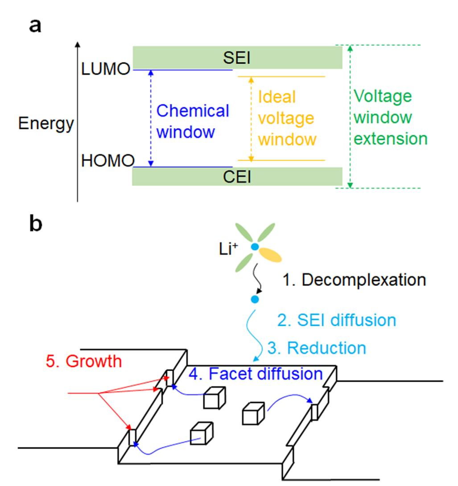

**Figure 1.** a), Energy levels in practical lithium batteries. b), Schematic illustration of the key steps during electrodeposition.

than the voltage window of the electrodes. The door to the commercialization of LIBs was opened by the incorporation of ethylene carbonate (EC) as a solvent.[6a] This history lets us realize the importance of SEI on LMA, because the transportation of  $Li^+$ ions is always the rate-determining step of the whole electrodeposition process (Figure 1b).

The metal electrodeposition process can be schematically shown as a chain of elementary reactions (Figure 1b):[8]

$$A \xrightarrow{1} B \xrightarrow{2} C \xrightarrow{3} D \xleftrightarrow{4} E \xleftrightarrow{5} M \tag{1}$$

where  $A$  represents the pristine state of the electrochemical system,  $M$  is the metal state. B, C, D, and E are intermediate states of the system. As schematic representation shown in Figure 1b, the first step of electrodeposition should be the mass transfer of electroactive species to the electrode, which is followed by its decomplexation reaction and charge transfer (step 1 in Equation  $(1)$ ). Then the bare Li+ ions will diffuse through solid electrolyte interphase (SEI, step 2 in Equation  $(1)$ ) and get reduced, and adsorbed at the growing surface of substrate (step 3 in Equation  $(1)$ ). After the reduction process, the as-formed metal atom will diffuse across the surface to the active growth sites (step 4 in Equation (1)), where they are crystallized and forming the final deposits (step 5). The most important two steps during the reduction of Li+ ion from electrolyte are the first 2 steps, which correspond to the mass transfer and decomplexation reaction of solvated Li+ ions and the diffusion of Li+ ions through the SEI, respectively, both are highly correlated with the composition and structure of SEI. The mechanical integrity of SEI is also important for the uniform Li metal deposition during the following steps. The speeds of these two steps and the mechanical integrity of SEI have been much improved by many novel electrolyte systems,[9] while the currently achieved performances cannot exceed TRL  $6$ .[10]

The main barriers for the development of LMBs include the low Coulombic efficiency (CE) of LMA, the repeated rupture and generation of the surface solid electrolyte interphase (SEI), the dendritic Li metal deposition, and the extensive volume change during long-term cycling process. A high CE of LMA represents

minimal side reactions that happened in LMBs, which means a stable SEI has been formed on LMA so as to parasitic reactions have been minimized. The ideal SEI should possess the following merits: 1) high Li+ ion conductivity, 2) high strength, 3) low electrical conductivity, and 4) low reactivity. Currently, it remains a challenge and a hot research topic to enhance the cycle life of LMBs with high energy density and high safety. Therefore, in this review, we will first discuss three core-issues on the electrolyte and solid electrode interphase design of high-energy LMBs, including the electrode process, the electrolyte engineering, and the artificial solid electrode interphase. Specifically, we will analyze the current status of electrode process (including Li+ ion transportation process and SEI on LMA), electrolyte engineering (including salt, solvent, additive, and ionic liquids), and artificial solid electrode interphase (inorganic, organic, and hybrid). Based on these contents, we will overlook several key points for the future development of electrochemical Li metal plating/stripping process, which include electrolyte design, energy density, and safety.

# **2. Key Properties of Solid-Electrolyte Interphase**

The SEI on LMA is a solid film, thus, it needs to possess high mechanical strength, low reactivity, and low solubility simultaneously. Up to date, the detailed information about the evolution of SEI structure and composition still remains vague, especially during the charge/discharge process of electrodes. Both the chemical and electrochemical reactions between Li metal and electrolyte will pose a great influence on SEI composition and structure. In 1979, Peled and coworkers[\[11\]](#page-27-0) thought that SEI was a kind of Li+ ion conductor with a single crystalline structure (**Figure 2**[a\)](#page-3-0). Later on, in 2000, based on the test results from Raman spectra, Fourier transform infrared (FTIR) spectroscopy, and X-ray photoelectric spectroscopy (XPS), Aurbach et al.[\[12\]](#page-27-0) proposed that SEI was a kind of composite with many kinds of organic and inorganic components and possesses an outer organic and inner inorganic hybrid structure (Figure [2b\)](#page-3-0). Their result is partially following the polyhetero microphase SEI proposed by Peled et al. (Figure [2c\)](#page-3-0).[\[13\]](#page-27-0) With the fast-growing availability of cryo-electron microscopy (EM) technique, the understanding toward SEI becomes clearer. Xu's group recently proposed the plum-pudding model of SEI (Figure [2d\)](#page-3-0), where the amorphous phase resembles the pudding and the embedded crystalline inorganic phases resemble plums.[\[14\]](#page-27-0)

#### **2.1. Li+ Ion Conductivity**

The ionic conductivity of SEI is closely related to its components and Li+ ion migration mechanism. Liu et al. introduced the parameter Γ, which is the ratio of the SEI ionic conductivity to that of liquid electrolyte (fixed to 1.5 × 10−2 S cm−1), to disclose the role of SEI ionic conductivity on Li plating.[\[18\]](#page-27-0) The results showed that when the SEI ionic conductivity is low (Γ = 0.001 and 0.01), the electrodeposited Li delivers a teeth-like morphology and low electrodeposition probability during the whole process. Whereas at higher conductivities (Γ ≥ 0.1), a bulb-like morphology and higher electrodeposition probability are found.

Actually, SEI is composed of organic compounds inlayed with many inorganic microphases such as lithium oxide (Li2O), lithium carbonate (Li2CO3), lithium nitride (Li3N), lithium fluoride (LiF), and so on. Among them, as an excellent Li+ ion conductor,[\[19\]](#page-27-0) Li3N has long been recognized as a symbolic component of SEI, which can boost uniform Li metal plating. In recent years, due to its large energy gap (13.6 eV), high chemical stability, low solubility, and low diffusion barriers for Li+ ions, LiFrich SEI was reported to be effective in enhancing the cycling stability of LMB.[\[20\]](#page-27-0) In addition, various methods have also been proposed to fabricate LiF-rich artificial SEI on Cu or Li, for example, the hydrolysis of LiPF6, [\[21\]](#page-27-0) the interaction between Li and fluorinated precursors,[\[22\]](#page-27-0) and the atomic layer deposition (ALD)[\[23\]](#page-27-0) or physical vapor deposition (PVD)[\[24\]](#page-27-0) techniques. Although these researchers have achieved an excellent cycle life of Li metal anode, the intrinsic role of LiF component for its performance enhancement remains to be further disclosed. In 2020, Guo et al. fabricated a Li2O or LiF coating layer on Li metal through the reaction between Li metal and O2 or NF3, respectively.[\[25\]](#page-27-0) According to the EIS results, the conductivity of Li|Li2O was significantly higher than real SEI, which should result from the dramatically different environment in real SEI. However, the conductivity of Li|Li2O is moderately higher than that of Li|LiF, suggesting the fact that the existence of LiF in SEI may limit the transport of Li+ ions.

To discover the intrinsic behavior of LiF in SEI, He et al. fabricated a LiF coating layer on Li metal (Figure [2e,f\)](#page-3-0).[\[15\]](#page-27-0) Compared with the LiF-rich SEI formed in the fluoroethylene carbonate (FEC) added electrolyte, the mechanical integrity of LiF in artificial SEI is easily compromised during Li metal plating. They also found that the FEC-added fluorinated electrolyte can quickly passivate the newly deposited Li metal, minimizing the side reactions between Li metal and electrolyte.[[26\]](#page-27-0) The fluorinated solvents have relatively lower lowest unoccupied molecular orbitals (LUMO) energy levels than conventional carbonate solvents; thus they will experience a fast reaction with Li metal and form a compact SEI eventually. Yang et al. further reported the lithiophilic series for LMA: Li/Li2O *>* Li/LiPON *>* Li/Li2CO3 *>* Li/LiF.[[16\]](#page-27-0) The more lithiophilic the interface is, the smoother the Li surface can be maintained during the stripping process of Li (Figure [2g,h\)](#page-3-0). In addition, the wetting behavior for Li/Li2O can be termed as "lithiophilic", while it is "lithiophobic" for Li/LiF. This can explain the facts that the removal of the superficial Li2CO3 layer on the LLZO surface[\[27\]](#page-27-0) or lower the current density (lower than *JC*) [\[28\]](#page-27-0) can impede the dendrite formation.

In fact, except for Li3N (≈10−3 S cm−1), the Li+ ion conductivity of these microphases is very low, for example, LiF (≈10−31 S cm−1), Li2CO3 (10−11–10−8 S cm−1), Li2O (10−9– 10−6 S cm−1).[\[14\]](#page-27-0) The Li+ ion conductivity within these minerals is highly correlated with their operation voltage. In 2013, Shi et al.[\[17\]](#page-27-0) found that the diffusion carriers in Li2CO3 below 0.98 V are mainly interstitials, while it will be vacancies above 3.8 V (Figure [2i\)](#page-3-0). This results in the faster (≈5 orders of magnitude) ionic conductivity of Li2CO3 at the anode side than that of the cathode side. In 2016, Xiao's group[\[29\]](#page-27-0) found that although the Li2CO3 and LiF possess low Li+ ion conductivities, there is significantly higher content of space charge at their contact surface, which can boost the transport of Li+ ions and inhibit the tunnelling of electrons effectively (Figure [2j\)](#page-3-0). It has also been

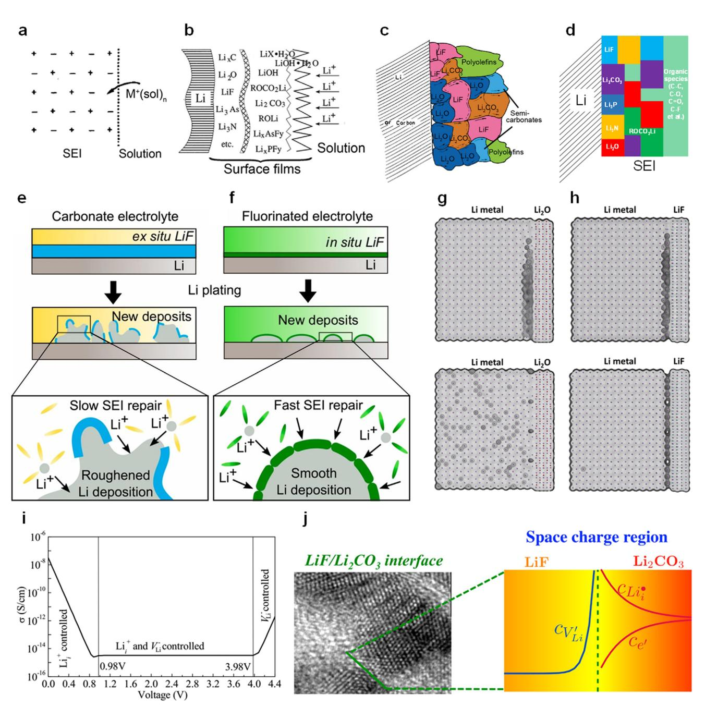

**Figure 2.** a) The single crystal model of SEI. Reproduced with permission.[\[11\]](#page-27-0) Copyright 1979, IOP Publishing. b), The multilayer model of SEI. Reproduced with permission.[\[12\]](#page-27-0) Copyright 2000, Elsevier. c), The mosaic model of SEI. Reproduced with permission.[\[13\]](#page-27-0) Copyright 1997, IOP Publishing. d) The reproduced plum pudding model of SEI. Reproduced with permission.[\[14\]](#page-27-0) Copyright 2021, Wiley VCH. (e, f), Li deposition mechanisms with *ex situ* LiF-SEI in carbonate electrolyte, and in situ LiF-SEI in fluorinated electrolyte, respectively. Reproduced with permission.[\[15\]](#page-27-0) Copyright 2021, American Chemical Society. g,h), Kinetic Monto Carlo (KMC) simulation results for the initially interfacial vacancies (upper panel) and the vacancy distribution in the Li slab after 105 KMC steps (lower panel) of Li/Li2O, and Li/LiF interfaces, respectively. Reproduced under the terms of the CC-BY Creative Commons Attribution 4.0 International License [\(https://creativecommons.org/licenses/by/4.0\)](https://creativecommons.org/licenses/by/4.0).[\[16\]](#page-27-0) Copyright 2020, M. He et al., PNAS. i), Transportation map of Li+ ions in Li2CO3 as a function of its nearby electrode voltage (referenced to Li metal (0 V)). Reproduced with permission.[\[17\]](#page-27-0) Copyright 2013, American Chemical Society. j), Captured LiF/Li2CO3 interface (left) and schematic showing the defect distribution near the LiF/Li2CO3 interface (right). Reproduced with permission.[\[17\]](#page-27-0) Copyright 2016, American Chemical Society.

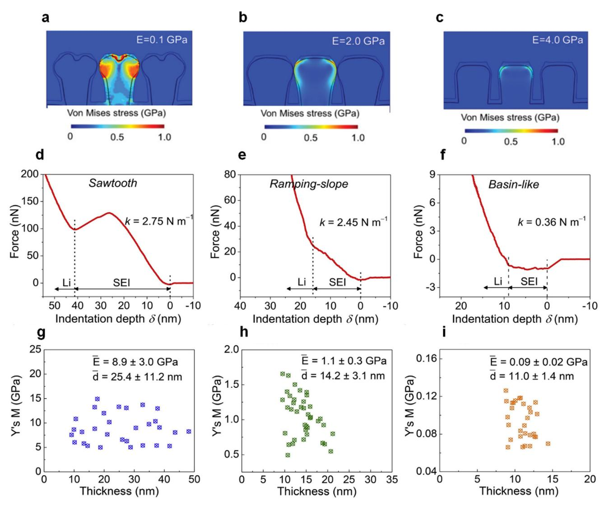

**Figure 3.** a,b,c), Distribution of stress field on electrodeposited Li metal with the Young's modulus for SEI of 0.1, 2, and 4 GPa, respectively. Reproduced with permission.[\[18\]](#page-27-0) Copyright 2022, Wiley VCH. d,e,f), Typical force-indentation curves of stiff, moderate-stiff, and soft SEI, respectively. g,h,i), The thickness and Young's modulus of stiff, moderate-stiff, and soft SEI, respectively. d-i) Reproduced with permission.[\[31\]](#page-27-0) Copyright 2020, Elsevier.

reported that the Li+ ion diffusion through the grain boundaries (GBs) between Li2O and LiF compounds is generally faster than in the neighboring crystalline interiors.[\[30\]](#page-27-0) This originates from the existence of large amounts of open channels for Li+ ion diffusion at the GBs.

#### **2.2. Mechanical Strength**

During the Li metal plating/stripping process, the volume expansion/contraction is significant, which will pose a great stress on SEI. When the accumulated stress within SEI beyond its yield stress, it will be cracked and resulting in the exposure of fresh Li toward the electrolyte. For its chemical instability, the exposed Li will react with the liquid electrolyte, deteriorating the performance of batteries significantly. Therefore, the SEI with high shear modulus is highly favorable for practical LMBs.

An electro-chem-mechanical model can explain the relation between the physical properties of SEI and Li plating behaviors.[\[18\]](#page-27-0) Upon simulation, it showed that the distribution of interfacial stress and the local deposition rate were determined by both the ionic conductivity and mechanical strength of SEI. By increasing SEI strength, the deposited Li will change from a teeth-like morphology to a bulb-like morphology, and the stress accumulation will move to the top corners of the deposited Li (**Figure 3**a–c). In addition, the high SEI modulus can also alleviate the stress accumulation resulting from the electrodeposition of Li metal underneath nonuniform SEI.[\[32\]](#page-27-0)

Atomic force microscopy (AFM) can provide both shear modulus and morphology detail of SEI. Wang et al.[\[31\]](#page-27-0) reported the typical force-indentation curves of stiff, moderate-stiff, and soft SEI. For the inorganic-rich stiff SEI, the force exerted on the probe will increase continuously and then leave a "sawtooth" feature of force transition after the stress release of the bent cantilever

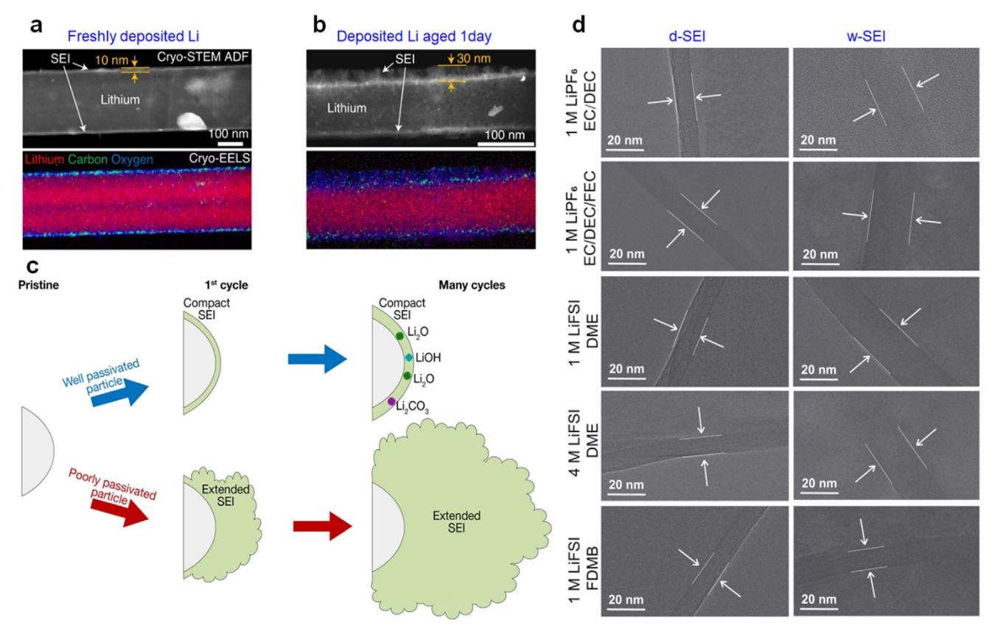

**Figure 4.** a,b), Cryo-STEM ADF image and EELS map of freshly deposited Li and electrodeposited Li aged for 1 day, respectively. Reproduced with permission.[\[34\]](#page-27-0) Copyright 2021, Springer Nature. c), Schematic showing the cycling-induced compact SEI and extended SEI on carbon particles. Reproduced with permission.[\[35\]](#page-27-0) Copyright 2019, American Chemical Society. d), Thickness comparison of the dry-SEI (d-SEI) and wet-SEI (w-SEI) in various electrolytes. Reproduced with permission.[\[36\]](#page-27-0) Copyright 2022, The American Association for the Advancement of Science.

(Figure [3d\)](#page-4-0). While for the organic-rich SEI, the cantilever will bend downward initially and be followed by a slight force increase until it reaches the Li metal surface, where a significant force increase will be induced by the downward movement of the cantilever (Figure [3f,](#page-4-0) "basin-like" feature). The indentation curve of real SEI, i.e., the outer-organic and inner inorganic SEI, shows a "ramping-slope" feature with the force slope increasing gradually (Figure [3e\)](#page-4-0). In addition, as shown in Figure [3g–i,](#page-4-0) the average modulus of the outer-organic and inner inorganic SEI and organic-rich SEI are 1.1 GPa and 90 MPa, respectively. They are much smaller than the inorganic-rich SEI (8.9 GPa). Their thickness follows the sequence of inorganic-rich SEI *>* outer-organic and inner inorganic SEI *>* organic-rich SEI.

#### **2.3. Electrical Conductivity**

The initially formed SEI is thin enough (*<*10 Å), thus the electron tunneling may happen, which will result in further electrochemical reduction of electrolyte and thickening of SEI. When the SEI thickness is beyond the tunneling threshold, the electron transfer between Li metal and electrolyte is negligible. During the electro-deposition or electro-dissolution process of LMA, due to the significant volume expansion and contraction, the SEI on Li metal will experience repetitive fracture/regeneration processes. Therefore, the electron tunneling is not the only reason for the growth of SEI on Li metal. It is reasonable to decrease the electrical conductivity of SEI as far as possible.

#### **2.4. Anti-Corrosion Capability**

During the long-term operation of batteries, the SEI is always in contact with liquid electrolyte and Li metal, thus it needs to be less reactive to ensure its long-term stability. In addition, SEI needs to be insoluble to sequester the side reactions between Li metal and the liquid electrolyte. Xu et al. found that the commonly SEI components for LIBs, such as lithium methyl carbonate (LMC), ethyl carbonate (LEC), lithium ethylenedicarbonate (LEDC), and lithium propylene dicarbonate (LPDC) are insoluble in dialkyl and alkene carbonates, carboxylic esters, alcohols, and ethers.[\[33\]](#page-27-0) These molecules are also inert with anions such as PF6 - and BF4 - , but unstable with hydrofluoric acid (HF) and Lewis acids such as PF5 and BF3.

According to results obtained by Boyle et al.,[\[34\]](#page-27-0) during the calendar storage, the thickness of the SEI on LMA increased from 10 nm (0 h) to 30 nm (24 h, **Figure 4**a,b). They thought that the chemical corrosion of Li and the continuous growth of SEI cause the capacity loss of LMBs. While Lim et al.[\[37\]](#page-27-0) found the opposite results, where the SEI thickness decreased from 300 nm (2 h) to 150 nm after 600 h of storage. They termed this kind of morphology transition into the densification of SEI, and the initially porous SEI appears to possess low initial SEI resistance. Although the SEI on carbonaceous anode is different from that on LMA, its structure evolution process is referable for LMA. Huang et al.[\[35\]](#page-27-0) also found that the initial SEI formed on the carbonaceous anode at the first cycle is a thin and amorphous layer, and its thickness is at the scale of electron tunneling (10 Å). After prolonged cycling, the Li2O-rich compact amorphous SEI will be formed on some particles, while the inorganiclacking extended SEI will also be found on some other particles (Figure [4c\)](#page-5-0). This effect mainly originates from the inhomogeneity of SEI, and maybe more serious for LMA. Zhang et al.[\[36\]](#page-27-0) further reported the swelling of SEI on LMA. They proposed that the solvent diffusion-induced SEI growth is more significant than that caused by electron tunneling, because of the presence of solvent within SEI. Therefore, the swelling rate between the dry-SEI (d-SEI) and wet-SEI (w-SEI) can reflect the electrochemical stability of LMA in different electrolytes. For example, the swelling rate in LiPF6-EC/DEC electrolyte is higher than that of LiPF6-EC/DEC/FEC, LiFSI-DME, and LiFSI-FDMB electrolytes, thus it delivers the lowest Coulombic efficiency for Li metal plating/stripping (Figure [4d\)](#page-5-0).

The calendar aging of LIBs is highly correlated with the SoC of graphite, where the higher SoC of the graphite anode will lead to more seriously capacity decay.[\[38\]](#page-27-0) Both the chemical and electrochemical reactivities of LMA are stronger than those of lithiated graphite anode, thus, the corrosion phenomena in LMBs will be more serious than those in LIBs. Currently, most of the published researches are focused on how to increase the energy density and cycling life of LMBs both theoretically and practically, and the corrosion phenomena of LMBs seems have been overlooked. Although after 35 years of storage, the Li-TiS2 cell can still retain over 50% of its original capacity,[\[2\]](#page-27-0) it is still inadequate for practical application. Because the Li foil used here may be very thick, and the energy density of TiS2 cathode is very low.

The galvanic corrosion of LMA can form plenty of voids on Li metal and incur the formation of dead Li.[\[39\]](#page-28-0) It was also reported that the galvanic corrosion of LMA, which has a high surface area, is more serious than that has dense and uniform structure.[\[40\]](#page-28-0) Actually, apart from the galvanic corrosion, the chemical corrosion of LMA through the side reactions between Li metal and liquid electrolyte is also serious for LMBs, especially for the LMBs with LiPF6-based carbonate electrolyte.[\[34\]](#page-27-0) The salt of the liquid electrolyte will influence the corrosion phenomena within LMBs, where the LiFSI salt is stable against chemical corrosion but vulnerable against galvanic corrosion, while the LiPF6 salt is stable against galvanic corrosion but vulnerable against chemical corrosion.[\[41\]](#page-28-0) Apart from the side reactions between Li metal and liquid electrolyte, the dissolution of transition metal (TM) ions in layered oxide cathode materials is also harmful to the calendar aging performance of LMBs. Because these dissolved TM ions will adsorb or even deposit at the anode surface, incurring capacity decay[\[42\]](#page-28-0) and crossover effect,[\[43\]](#page-28-0) which is bad for the long-term operation of LMBs. More recently, it has been reported that the calendar aging performance of LMBs is highly correlated with the SoC of LMBs before storage.[\[44\]](#page-28-0) Even for the LMBs with Li foil of 50 μm and paired with ether-based electrolyte, which has high fluorine content, its self-discharge is still severe. Therefore, apart from the energy density and cycling life, the good calendar aging performance of LMBs is also a key index that could influence its practicality.

Many methods have also been proposed to mitigate the corrosion problems of LMBs. Weber et al. found that the use vinylene carbonate (VC) can stabilize lithium metal from chemical corrosion in the carbonate electrolyte.[\[45\]](#page-28-0) Increasing the surface coverage of lithium metal anode and the formation of compact SEI can also minimize the side-effect of galvanic corrosion of lithium metal anode.[\[46\]](#page-28-0) Coating Cu foil with artificial SEI can also alleviate the corrosion phenomena of LMBs to some extent.[\[47\]](#page-28-0) More recently, it was reported that the application of pressure can extend the calendar life of LMBs significantly. For example, the single-layer Li (50 μm) | NMC811 pouch cell with 70% SoC and under 69 kPa of pressure can maintain over 99% of its charged capacity even after 18 months.[\[48\]](#page-28-0)

#### **2.5. Stabilities of SEI During Repeated Cycling**

The voltage drop is a common phenomenon during Li plating in the electrolyte, which is less stable with Li metal. Zhang et al.[\[49\]](#page-28-0) found that the decomposition of electrolyte will cause the repeated formation of organic species such as ROCO2Li and ROLi, resulting in the voltage drop (≈20 mV) of Li plating after a certain amount of Li deposition and the following cycles. The LMA with a higher specific surface area will also lead to the decomposition of electrolyte, causing a larger voltage drop. Increasing the current density will result a more severe concentration polarization, thus, more obvious voltage drops will be captured.[\[50\]](#page-28-0) After several cycles, a large polarization will be induced by a stable but thick SEI. In light of this, the charge transfer resistance for Li plating is very sensitive to the variation of SEI components in carbonate electrolyte, which is in accordance with the results by Huang et al.[\[51\]](#page-28-0) In future research, careful consideration for the effectiveness of SEI in continuous cycling of LMA should be carried out for the electrolyte engineering of LMBs.

# **3. Electrolyte Design**

#### **3.1. Interactions in Liquid Electrolyte**

Conventional low concentration electrolyte (LCE, **Figure 5**[a\)](#page-7-0) has empowered LIBs a great success for its balanced chemical and electrochemical properties. However, for the high content of solvent in the Li+ ions solvation sheath, the as-formed SEI on LMA is unstable and heterogeneous, which will lead to continuous capacity loss and dendrite growth. Increasing the salt concentration to form a high-concentration electrolyte (HCE, Figure [5b\)](#page-7-0) will significantly increase the content of solvated anions around Li+ ions, which will boost the formation of anion-derived inorganic-rich SEI and reduce the parasitic reactions of free solvent molecules. However, the sluggish ion transport of HCE limits the fast-charge performance of LMBs significantly. Adding a low viscosity diluent that cannot dissolve salt into HCE can form a localized highconcentration electrolyte (LHCE, Figure [5c\)](#page-7-0), which is effective in improving the cycling performance of LMBs.

According to the results by Efaw et al.,[\[53\]](#page-28-0) in a typical LHCE system, the salt is insoluble in the diluent, whereas the diluent is miscible with the solvent. The role of the solvent is more

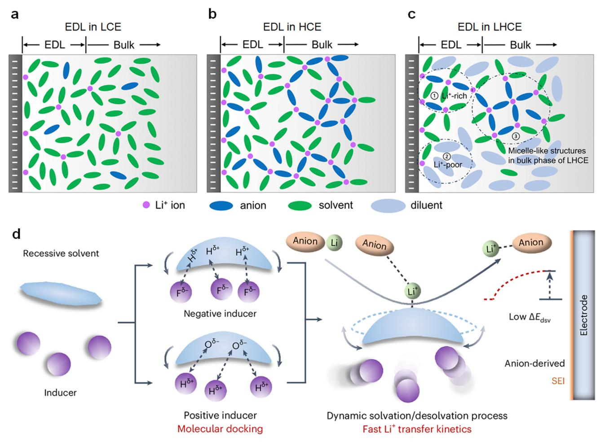

**Figure 5.** a,b,c), Schematic showing the electric double layer (EDL) and bulk structures of low concentration electrolyte (LCE), high concentration electrolyte (HCE), and localized high concentration electrolyte (LHCE), respectively. Reproduced with permission.[\[52\]](#page-28-0) Copyright 2025, RSC Publishing. d), Schematic showing the solvation mechanism of the molecular docking mechanism. Reproduced with permission.[\[9e\]](#page-27-0) Copyright 2024, Springer Nature.

likely a surfactant, which can bind the immiscible salt and diluent phases, reducing the interfacial energy and stabilizing the dispersed structure. Therefore, LHCE was referred to as "micellelike" electrolyte, where a network of salt-solvent clusters is mostly separated from the diluent matrix by a solvent-rich surfactant region. There are also significant differences in the electric double layers (EDLs) of LCE, HCE, and LHCE electrolytes.[\[52\]](#page-28-0) As shown in Figure 5a, for LCE, the charged Li+ ions mainly coordinate with solvent molecules, and the anions are mostly repelled away from the anode surface. For the HCE (Figure 5b), due to the strong ion pairing effect and the formation of aggregates, the charged Li+ ions not only coordinate with solvent molecules but also coordinate with a significant amount of salt anions. The EDL structure of LHCE is different from the structures of both LCE and HCE electrolytes. As shown in Figure 5c, the EDL of LHCE is divided into the Li+ ions-rich salt-solvent cluster region and the Li+ ionspoor diluent region. Such a unique EDL structure with an adsorbed cation layer and a more diffused layer with ions, solvents, and diluents cannot be described by the Stern model.

Although LHCE can alleviate the sluggish kinetics of HCE to some extent, the incorporation of highly polar solvent molecules into LHCE will still restrain the fastcharging performance of LMBs. Ma et al.[\[9e\]](#page-27-0) designed a molecular-docking electrolyte which surpasses the Li salt dissolution limit in inducers-assisted non-solvating solvents. For example, the 1,2-bis(trimethylsilyloxy)ethane (BTE) and 1,3 bis(trimethylsilyloxy)propane (BTP) exhibit no capability to dissociate Li salts, which were denoted as recessive solvents. When they are blended with specific non-solvating inducers such as fluorinated benzene or halide alkane compounds, the hydrogen bond effect between the recessive solvents and inducers will cause the configurational change of recessive solvents, thus lowering their electrostatic potential to enable Li+ ion solvation (Figure 5d). The as-formed electrolyte exhibits a dynamic inducer-recessive solvent docking/undocking process, which enables a low Li+ ions de-solvation energy.

#### **3.2. Salt of Electrolyte**

When charging LMBs, the solvated anions or solvent molecules around Li+ ions will move to the anode surface, and then be

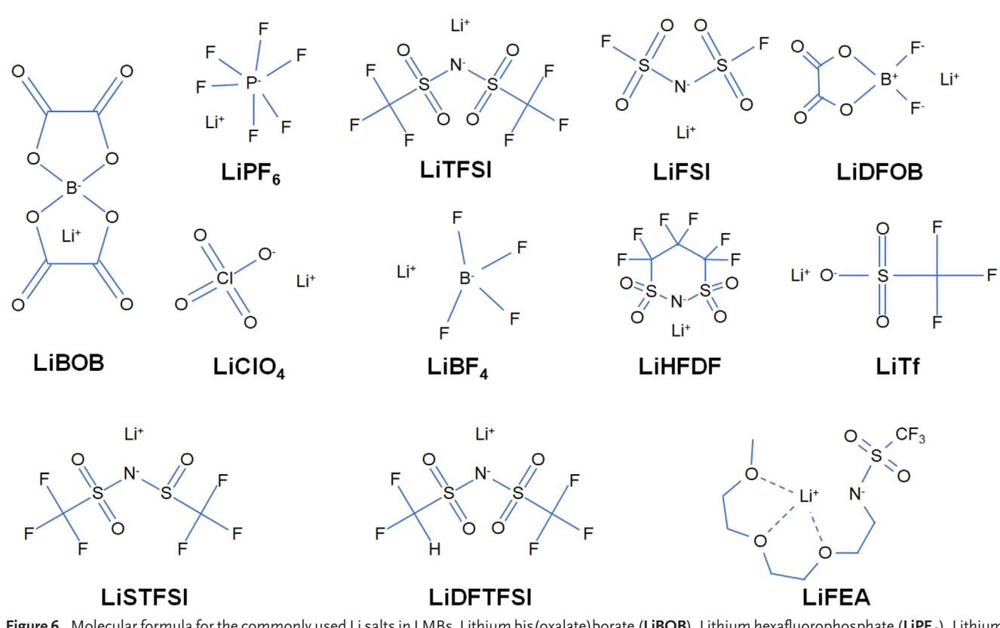

**Figure 6.** Molecular formula for the commonly used Li salts in LMBs. Lithium bis(oxalate)borate (LiBOB). Lithium hexafluorophosphate (LiP $F_c$ ). Lithium bis-trifluoromethanesulfonimide (LiTFSI). Lithium bis(fluorosulfonyl)imide (LiFSI). Lithium difluoro(oxalato) borate (LiDFOB). Lithium perchlorate (LiClO4). Lithium tetrafluoroborate (LiBF4). Lithium 1, 1, 2, 2, 3, 3-hexafluoropropane-1, 3-disulfonimide (LiHFDF). Reproduced with permission.[54] Copyright 2020, Wiley VCH. Lithium trifluoromethanesulfonate (LiTf)[55] Lithium (trifluoromethanesulfinyl) (trifluoromethanesulfonyl)imide (LiSTFSI). Reproduced with permission.[56] Copyright 2025, Springer Nature. Lithium (difluoromethanesulfonyl) (trifluoromethanesulfonyl) imide (LIDFTFSI). Réproduced with permission.[57] Copyright 2022, Springer Nature. Lithium 1,1,1-trifluoro-N-[2-[2-(2-methoxyethoxy)]ethoxy)]ethyl] methanesulfonamide (**LiFEA**). Reproduced with permission.[57] Copyright 2023, Springer Nat

reduced to produce SEI. Generally, the reduction potential of anions is higher than that of solvent molecules. Therefore, the component of SEI is highly correlated with the salt recipes. The decomposition reaction of various salts such as LiPF6, LiBF4, LiTFSI, and so on (Figure 6), will produce LiF.[14] LiPF6 possesses the most balanced properties, thus it is the main salt in commercialized LIBs.[58] However, LiPF6 is readily decomposed into LiF and phosphorus pentafluoride ( $PF_5$ ).[58] Even a trace amount of moisture will result in the decomposition of PF5, forming hydrofluoric acid (HF). The large amount of HF will result in many toxic reactions and eventually invalid batteries. The imide salt, such as LiTFSI and LiFSI (Figure 6) is stable against  $H2O$ , while it will corrode the Al current collector at high potential.[59] The  $LiClO4$  (Figure 6) possesses many merits such as high ionic conductivity, high solubility, high thermal/electrochemical stability, and favorable SEI-forming properties, while the oxidation state of the Cl atom will pose a great safety concern for battery.[58] The  $LiAsF6$  (Figure 6) is also excellent in improving the cycling efficiency of LMA, while the potentially toxic properties of the arsenic (As) element preclude its practical application.[58]

The single salt with relatively low concentration cannot realize high-performance LMBs. Therefore, the dual-salt, the highconcentration salt, and many novel salts have been proposed to improve the electrochemical performance of LMBs.

#### 3.2.1. Dual-Salt Electrolyte

In 2016, Xiang et al.[60] used LiTFSI and LiBOB (Figure 6) as dualsalt for LMBs. They found that the LiTFSI can help form highly ion-conductive components in SEI, whereas the LiBOB can passivate the Al current collector. With the addition of  $0.05M$  LiPF6 as an additive, the same electrolyte can let Li | NMC442 full cell  $(2.7-4.3 \text{ V}, \text{N/P ratio} > 50)$  be cycled over 800 cycles.[61] The addition of  $\text{LiPF}_6$  can not only further stabilize Al current collector, but also alter the SEI component. Typically, the decomposition of LiPF6 will form species such as PF5, HF, and POF3, catalyzing the ring-opening polymerization of the solvent and forming SEI with a flexible polycarbonate component, stabilizing LMA. Replacing LiBOB with LiDFOB (Figure 6), the newly dual-salt LiTFSI-LiDFOB in EMC/FEC (3/1, v/v) with  $0.05\textsc{m}$  LiPF $_{\textsc{6}}$  electrolyte can also let the Li | NMC622 full cell (2.7-4.3 V, N/P ratio  $>50$ ) be stably cycled over 500 times.[62] Weber et al.[63] proposed the LiDFOB-LiBF4 dual salt for practical Li metal pouch cells. With the optimization of solvent and high-pressure test of Li metal pouch cells, the anode-free LMBs (AFLMBs, Cu | NMC532 (3.6–4.5 V, N/P ratio = 0)) can maintain over 80% of their normalized capacity after 90 cycles. However, the added salt will be consumed during cycling. Further increasing the concentration of the dual-salt LiDFOB-LiBF4 ( $2M-1.4M$ ), the lifetime of the AFLMBs (Cu | NMC532 (3.6–4.5 V, N/P ratio = 0)) with 80% capacity retention can be extended to 200 cycles.[64] It is worth noting that the dual-salt LiDFOB-LiBF, electrolyte can effectively enhance the thermal stability of LMBs. In 2020, Xiao et al.[54] reported a new Li salt-lithium 1, 1, 2, 2, 3, 3-hexafluoropropane-1, 3-disulfonimide (LiHFDF, Figure 6) which maintains the structure of imide skeleton and fluoroalkyl moiety to suppress the dendrite formation in Li-sulfur (S) batteries. The dual-salt LiTFSI-LiHFDF can form a LiF-rich interphase at the anode side and a LiF- and Li3N-containing durable physical barrier at the cathode to sequester the shuttling of soluble lithium polysulfides, thus the Li | S battery with a low  $N/P$  ratio of 1.3 can be cycled over 100 times. Lithium difluorophosphate ( $LiPO_2F_2$ ,  $LiDFP$  (Figure 6)) is a widely used additive to increase the anodic oxidation ability of LIBs. Zheng et al.[65] reported a low concentration dualsalt 0.4 M LiBOB-0.1M LiDFP to boost the practical application of LMBs. The LiDFP is helpful in forming LiF-rich and phosphatecontaining SEI. In addition, the decomposition of LiBOB will produce  $Li_2BO_x$ , which is helpful to increase the SEI flexibility.

The dual-salt strategy can also be applied in solid-state lithium metal batteries to enhance the cycling efficiency as well as increase their electrochemical voltage window. For example, Lin et al. proposed to use LiTFSI and LiBOB as dual-salt in the poly(vinylidene fluoride-co-hexafluoropropylene) (PVDF-HFP) based polymer electrolyte to stabilize the interface on both the positive and negative electrodes and, concomitantly, avert the corrosion of the Al current collector.[66] The same dual-salt can also be used to enhance the interphasial stability of a solidstate lithium metal battery with polyvinylidene fluoride (PVDF) based polymer electrolyte.[67] The combination of LiTFSI and LiPF6 in PVDF-HFP-based polymer electrolyte[68] and poly(1,3- $\frac{1}{2}$ ) dioxolane(DOL)) based polymer electrolyte,[69] LiClO4 and Li-BOB in polyethylene oxide (PEO) based polymer electrolyte,[70] and LiDFOB and LiPF6 in poly(tetrahydrofuran (THF)) based polymer electrolyte[71] have also been reported to be effective in smoothing the interface contact of solid-state LMBs.

#### 3.2.2. High Concentration Electrolyte (HCE)

The ionic conductivity, (electro)chemical window, flammability, etc. are important for the practical electrolyte of batteries. Apart from these, the wetting ability of the electrolyte to the separator is also the key for the practical application of the battery. Therefore, the concentration of the electrolyte for LIBs is around  $\approx 1$ M (1) mol  $L^{-1}$ ). Generally, for the high concentration electrolyte (HCE), its high viscosity will impede the application of LIBs. When the salt concentration is high enough, limited solvent molecules will bond to cation (Li+ ions), resulting in the dominance of anions in the solvation sheath of Li+ ions and forming anion-derived SEI on the anode surface, suppressing the harmful side-reactions between solvents and electrodes.[72]

In 2013, Suo et al.[73] reported a kind of solvent-in-salt electrolyte with 7M LiTFSI in 1,3-dioxolane (DOL)/dimethyl ether (DME) ( $v/v$ , 1/1) for Li-S battery. This electrolyte can inhibit the dissolution of soluble lithium polysulfides and protect LMA against dendrite formation effectively. Following, Qian et al.[74] reported a 4M LiFSI electrolyte, which could restrain the side reactions between the solvent and Li metal, realizing high-rate Li|Cu half cells. This electrolyte can also let the AFLMBs (Cu | LiFePO4 (LFP), 3–3.8 V, N/P ratio = 0) retain 80% of their capacity after  $\approx$ 20 cycles.[75] Fan et al.[20a] further increased the concentration of LiFSI to 10M in carbonate dual-solvent, the as-obtained electrolyte can let the Li|NMC622 full cell be charged to 4.6 V. The  $4M$  LiFSI in PC/FEC (v/v, 93/7) electrolyte can also elongate the cycling life of the 4.6 V Li|NMC6222 cells.[76] With FEC as the single solvent, Suo et al.[20b] developed a fluorine-donating electrolyte. This electrolyte can let the Cu@Li|LNMO (3.4-5 V) full cells with N/P ratio of  $\approx$ 1.4 be cycled over 140 times.

In 2018, the LiTFSI-LiDFOB dual-salt HCE was reported to suppress the high-voltage (HV) degradation of the NMC cathode effectively.[77] Through systematic characterizations and simulations, it was reported that the existence of TFSI- anions and the ratio between FSI'/TFSI' anions are very important for the LiFSI-LiTFSI dual-salt HCE.[78] The incorporation of TFSI- can control the decomposition kinetics of FSI, which prevents the aggregation of LiF and other reduction products of LiFSI, forming a uniform and robust SEI film to inhibit the dendrite formation. The combination of LiFSI-LiTFSI dual-salt and LiNO3 additive in ether electrolyte can form a Li2O- and LiF-rich SEI on LMA, which allows the Cu@Li | LFP full cell (3-3.8 V) with a low N/P ratio of 0.44 to be cycled over 80 times.[79] Like the low concentration dual salt system with 0.4M LiBOB and 0.1M LiDFP salts[65] the dual-salt HCE with 2.2M LiDFP and 1.23M LiTFSI dual-salt was also effective to enhance the cycling performance of LMBs.[80] Moreover, the traditional problems of HCE, such as low ionic conductivity and high viscosity, can be overcome by using this system. This mainly comes from the preferential interactions between Li+ cations and DFP- anions, which increases the amount of free solvent and TFSI anions, resulting in the relatively higher ionic conductivity and lower viscosity.

#### 3.2.3. Novel Salts

For the highly conjugated anionic center of  $-SO_2$ -N-SO2-, the sulfonimide salts are generally easy to dissociate and present adequate ionic conductivities and thermal stabilities when dissolved in carbonate solvents. For the most popular sulfonimide salts, for example, LiTFSI and LiFSI, they are thermally stable over 200 °C and resistant to hydrolysis. However, they are corrosive toward the cathode Al current collector at a potential just above 3.8 V versus Li/Li+, while the normal charge cut-off voltage of LMBs with layered oxide cathode is over 4.3 V versus Li/Li+. Replacing the  $CF_3$ - moiety of LiTFSI salt with longer perfluorinated alkyl chains can enhance its compatibility with the cathode Al current collector, but this will decrease the ionic conductivity of electrolyte.[81] Qiao et al.[57] designed a non-corrosive sulfonimide salt for LMBs, which is lithium (difluoromethanesulfonyl)(trifluoromethanesulfonyl)imide (LiDFTFSI, Figure 6), and it can realize 4 V-class LMBs. This is mainly attributed to the formation of unstable Al(DFTFSI)3, which can passivate the cathode Al current collector effectively. Replacing one trifluoromethanesulfonyl unit  $(CF_3SO_2)$  of LiTFSI with an ethylene glycol-based chain, the newly formed salt lithium 1,1,1-trifluoro-N-[2-[2-(2-methoxyethoxy)]ethyl] methanesulfonamide (LiFEA, Figure 6) can enable fast charge/discharge of practical LMBs.[9b] Just like the structure of zwitterions, LiFEA

contains both positively charged ether moieties and negatively charged  $CF_3SO_2N$  domains, which gives it a large dipole moment and high donor number; thus the electrolyte with this salt possesses a high transference number of Li+ ions. Such merits can lead to the formation of dense and uniform inorganic-rich SEI. Replacing varying numbers of sulfonyls of LiTFSI salt with sulfinyls, a new sulfoximide lithium salt, which is lithium (trifluoromethanesulfinyl)(trifluoromethanesulfonyl)imide (LiSTFSI, Figure 6), can be produced.[56] The asymmetric structure of LiSTFSI will incur anionic electro-polymerization on the cathode surface, which will form a CEI with inner inorganic (mainly LiF) and outer N-S main-chained and negatively charged inorganic polymer. Such CEI is capable of accelerating the Li+ ion desolvation process to improve the interfacial kinetics under fast-charge conditions.

#### 3.3. Solvent of Electrolyte

#### 3.3.1. Diluted Solvent

The ionic conductivity of the liquid electrolyte is highly correlated with the dielectric constant and viscosity of the solvent. Therefore, a mixed solvent system, where one component has a high dielectric while the other has a low viscosity, has always been used. HCE is effective in enhancing the interphase stability of LMA, while their high viscosity, low ionic conductivity, and expensive price will inhibit their practical application. In 2013, Azimi et al.[97] suggested a newly fluorinated ether-1,1,2,2tetrafluoroethyl-2,2,3,3-tetrafluoropropyl ether (TTE, **Figure 7**) as a cosolvent for Li-S batteries. With such a fluorinated electrolyte, the electrochemical performance of Li–S battery was largely improved. On top of this, they further found that the combination of TTE and LiNO3 can suppress the self-discharge of Li-S batteries effectively, while the ordinary electrolyte with DOL/DME solvent showed severe capacity fade after only 10 h of aging at the charged state.[82c] In 2019, the same research group further reported that, to increase the electrochemical performance of Li-S battery, the proximity of the fluorine atom to the oxygen of the fluorinated ether matters more than the number of fluorine atom.[115] Through using pulsed-field gradient spin-echo (PGSE) NMR and Raman spectroscopy, Moon et al. conducted a systematic research on the solvent activity of fluorinated ether in diluted electrolyte.[116] The diluent TTE scarcely takes part in the solvation of Li+ ions, which will decrease the amount of free solvent molecules and increase the oxidative stability of the electrolyte. And therefore, such diluted electrolyte has also been widely recognized as a localized high-concentration electrolyte. It is worth noting that the co-intercalation of Li+ ions and G3 molecules into graphite can also be restrained through the addition of TTE diluent, realizing a high capacity of graphite anode ( $>300$  mAh g-1).

TTE is the most commonly used diluent and has been used in many diluted systems, for example, sulfolane (TMS, Figure  $\mathbf{8}$ )[82b] and dimethyl ether (DME),[82a,117] where the addition of TTE addressed the high viscosity and poor wettability of sulfonebased HCE successfully. As a result, the sulfone-based LHCE enabled stable cycling of Li | LNMO batteries at 4.9 V. In addition, the incorporation of TTE effectively enhanced the cycling stabilities of Li | NMC811 batteries (2.8–4.4 V), which paved the way for the application of ether-based electrolyte at HV conditions. When trimethyl phosphate (TMP, Figure  $9$ )[109] was used as the solvent in LHCE, the Raman spectra revealed that all the TMP solvents have been solvated, which endowed the LHCE with flame-retardant properties and the Li | sulfurized pyrolyzed poly(acrylonitrile) (SPAN) full cell with the areal capacity of 3.4 mAh cm $-2$  delivered benign reversibility. The TTE can also be used as a diluent of HCE based on 2-methyl-tetrahydrofuran (MeTHF, Figure 9)[101] solvent, where the low-polarity of MeTHF will boost the formation of strong anion-cation coordination structures and thus improve the average CE of LMA to be 99.7%. However, even with the existence of TTE, the high voltage application of this electrolyte is still restrained by the poor oxidation tolerance of MeTHF. The carbonate solvent, for example, dimethyl carbonate (DMC, Figure 9),[118] and FEC (Figure 8)-DEC (Figure 9) dual-solvent,[107] can also be diluted by TTE and form LHCE. It is worth noting that the FEC-DEC dual-solvent is better than the FEC single solvent, and this may originate from the unique interaction between the FEC-DEC-TTE ternary solvents and which effectively suppresses the side-reactions between Li metal and electrolyte. When diethyl (2-cyanethyl) phosphonate (DCEP, Figure 9)[110] was used as solvent in TTE diluted LHCE, the  $-P=0$  and  $-C=N$  groups of DCEP can facilitate the formation of a seven-numbered chelating solvation structure, because their coordination abilities with Li+ ions are almost the same. Such a unique solvation structure can effectively suppress the continuous decomposition of solvents and enhancing the cycling stability of Li | NMC811 at an upper charge cut-off voltage of 4.6 V. The ether modification of phosphate can form the diethyl (2-methoxy ethoxy) methylphosphonate (DMEP, Figure 9),[114] which can form the aggregate-dominated solvation sheath when used as the solvent in TTE diluted LHCE, facilitating the cycling performance of 4.7 V Li | NMC811 pouch cells under practical conditions.

Apart from TTE, the bis(2,2,2-trifluoroethyl) ether (BTFE, Figure  $7^{[83]}$  can also be used diluent in LHCE, because of its inert properties. The resulting LHCE possesses the original saltsolvent coordination in HCE, whereas its salt concentration is significantly lower than that in HCE. The HCE based on LiPF6 dissolved in fluorinated solvents such as FEC and FEMC can be diluted by 1,1,2,2-tetrafluoroethyl 2,2,2-trifluoroethyl ether (HFE, D2 (Figure 7)),[84] and the resulting all-fluorinated electrolyte enabled a Li plating/stripping CE of 99.2%. Replacing the  $\text{LiPF}_6$  of the above electrolyte with  $\text{LiFSI}$  can facilitate the cycling performance of LMBs at ultralow temperature, for example, the Li | LiNi0.8Co0.15Al0.05O2 battery can still deliver 56% of its room-temperature capacity even at  $-85$  °C.[84b] Diluting the HCE with lithium bis(pentafluoroethanesulfonyl)imide (Li-BETI) dissolved in DEC/FEC with methoxyperfluorobutane (M3, Figure  $7$ [84b] can also facilitate the temperature window of LMBs. The tris(2,2,2-trifluoroethyl)orthoformate (TFEO, Figure 7) $[86,119]$ has a high boiling point of 145 °C and does not contain any unstable functional groups such as cyano, carbonyl, and sulfonic, both features make it suitable to be a diluent in LHCE. The resulting 1M LiFSI/DME-TFEO electrolyte can form a highly homogeneous, amorphous, and monolithic SEI layer on LMA, facilitating the cycling of LMBs. Like the above-mentioned fluorinated solvents, the methyl 3,3,3-trifluoropropionate (MTFP, Figure  $7$ )[85] diluted LHCE can form fluorine-rich SEI at both the anode and

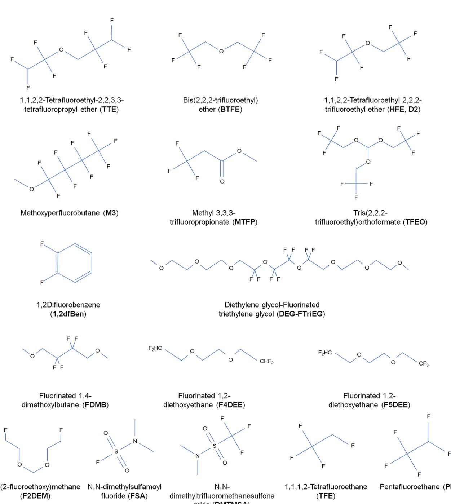

**Figure 7.** Molecular formula for the commonly used fluorinated solvents in LMBs. 1,1,2,2-Tetrafluoroethyl-2,2,3,3-tetrafluoropropyl ether (**TTE**).[\[82\]](#page-28-0) Bis(2,2,2-trifluoroethyl) ether (**BTFE**).[\[83\]](#page-28-0) 1,1,2,2-Tetrafluoroethyl 2,2,2-trifluoroethyl ether (**HFE**, **D2**).[\[84\]](#page-28-0) Methoxyperfluorobutane (**M3**).[\[84b\]](#page-28-0) Methyl 3,3,3 trifluoropropionate (**MTFP**).[\[85\]](#page-28-0) Tris(2,2,2-trifluoroethyl)orthoformate (**TFEO**).Reproduced with permission. [\[86\]](#page-28-0) Copyright 2019, Springer Nature. 1,2Difluorobenzene (**1,2dfBen**).[\[87\]](#page-28-0) Diethylene glycol-Fluorinated triethylene glycol (**DEG-FTriEG**). Reproduced with permission.[\[88\]](#page-28-0) Copyright 2020, American Chemical Society. Fluorinated 1,4-dimethoxylbutane (**FDMB**). Reproduced with permission.[\[89\]](#page-28-0) Copyright 2020, Springer Nature. Fluorinated 1,2 diethoxyethane (**F4DEE**) and Fluorinated 1,2-diethoxyethane (**F5DEE**). Reproduced with permission.[\[90\]](#page-28-0) Copyright 2022, Springer Nature. Bis(2- fluoroethoxy)methane (**F2DEM**).[\[91\]](#page-29-0) N,N-dimethylsulfamoyl fluoride (**FSA**).[\[92\]](#page-29-0) N,N-dimethyltrifluoromethanesulfonamide (**DMTMSA**). Reproduced with permission.[\[93\]](#page-29-0) Copyright 2021, Springer Nature. 1,1,1,2-Tetrafluoroethane (**TFE**) and Pentafluoroethane (**PFE**). Reproduced with permission.[\[94\]](#page-29-0) Copyright 2022, Springer Nature.

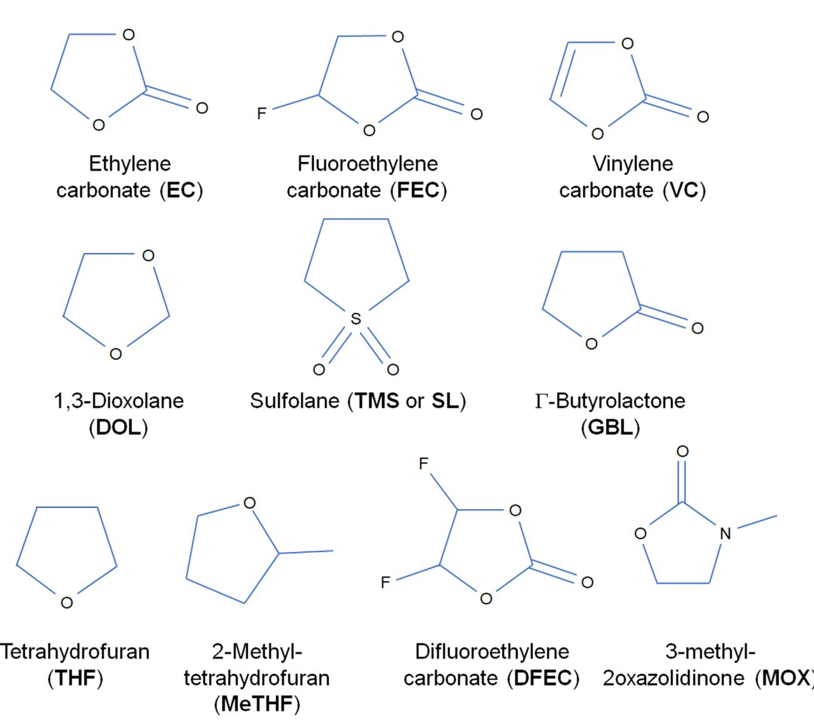

**Figure 8.** Molecular formula for the commonly used carbonate solvents in LMBs. Ethylene carbonate (**EC**). Fluoroethylene carbonate (**FEC**).[\[95\]](#page-29-0) Vinylene carbonate (**VC**).[\[96\]](#page-29-0) 1,3-Dioxolane (**DOL**).[\[97\]](#page-29-0) Sulfolane (**TMS** or **SL**).[\[83b,99\]](#page-28-0) Γ-Butyrolactone (**GBL**).[\[99\]](#page-29-0) Tetrahydrofuran (**THF**).[\[100\]](#page-29-0) 2-Methyltetrahydrofuran (**MeTHF**).[\[101\]](#page-29-0) Difluoroethylene carbonate (**DFEC**). Reproduced with permission.[\[102\]](#page-29-0) Copyright 2019, Elsevier. 3-Methyl-2-oxazolidinone (**MOX**). Reproduced with permission.[\[103\]](#page-29-0) Copyright 2025, Wiley VCH.

cathode, supporting the high voltage cycling of Ni-rich oxide cathode and high efficiency of LMA. The 1,2difluorobenzene (1,2df-Ben, Figure [7\)](#page-11-0) [\[87\]](#page-28-0) with a low energy level of the lowest unoccupied molecular orbital (LUMO) can also be utilized to dilute the single solvent HCE, enhancing the electrochemical performance of LMBs.

#### *3.3.2. Fluorinated Carbonate Solvent*

Fluoroethylene carbonate (FEC) was first reported to be effective in enabling the high-performance silicon (Si) thin film anode.[\[120\]](#page-29-0) The success of FEC on Si anode mainly comes from its decomposition reaction produces highly cross-linked polymer on the surface of SEI, which is capable of withstanding the stresses induced by the alloying/dealloying reaction of Si anode.[\[121\]](#page-29-0) In 2017, Zhang et al.[\[95b\]](#page-29-0) also incorporated FEC as an electrolyte additive of LMBs, and they thought that the LiF-rich SEI induced by FEC is the main reason for its performance enhancement. In the same year, Aurbach's research group[\[95a\]](#page-29-0) used FEC as the cosolvent of dimethyl carbonate (DMC) to be the electrolyte of LMBs. The FEC can also be used as cosolvent for ethyl methyl carbonate (EMC, Figure [9\)](#page-13-0),[\[108,122\]](#page-29-0) diethyl carbonate (DEC),[\[63,64\]](#page-28-0) and EC (Figure 8)-DEC dual-solvent.[\[123\]](#page-29-0) In addition to FEC, the difluoroethylene carbonate (DFEC, Figure 8) is also an effective cosolvent. Su et al.[\[102\]](#page-29-0) compared the differences between different fluorine-containing cyclic carbonates for LMBs. Their results showed that the fluorine-free ethylene carbonate (EC) molecule cannot form an effective SEI on Li metal, and the as-formed fluoroalkyl- and alkoxy-containing carbonates are detrimental for

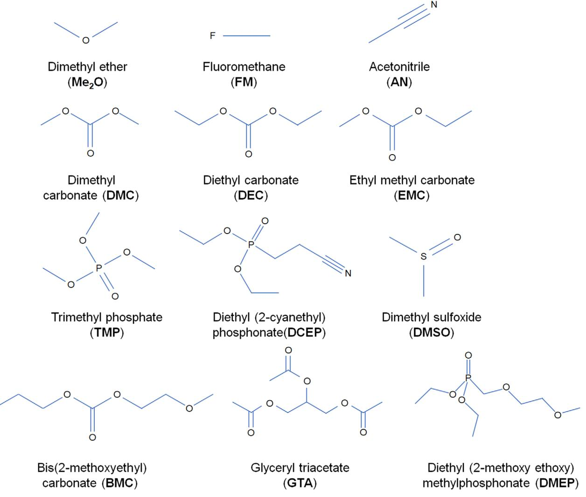

**Figure 9.** Molecular formula for the other commonly used solvents in LMBs. Dimethyl ether (**Me2O**).[\[104\]](#page-29-0) Fluoromethane (**FM**).[\[105\]](#page-29-0) Acetonitrile (**AN**).[\[106\]](#page-29-0) Dimethyl carbonate (**DMC**).[\[95a\]](#page-29-0) Diethyl carbonate (**DEC**).[[107\]](#page-29-0) Ethyl methyl carbonate (**EMC**).[\[108\]](#page-29-0) Trimethyl phosphate (**TMP**).[\[109\]](#page-29-0) Diethyl (2-cyanethyl) phosphonate (**DCEP**). Reproduced with permission.[\[110\]](#page-29-0) Copyright 2024, American Chemical Society. Dimethyl sulfoxide (**DMSO**).[\[111\]](#page-29-0) Bis(2-methoxyethyl) carbonate (**BMC**).[\[112\]](#page-29-0) Glyceryl triacetate (**GTA**).[\[113\]](#page-29-0) Diethyl (2-methoxy ethoxy) methylphosphonate (**DMEP**). Reproduced with permission.[\[114\]](#page-29-0) Copyright 2024, Wiley VCH.

both the Li metal anode and HV cathode. The fluoro-alkyl and alkoxy substituents are also detrimental for battery performance, while the substitution of fluorine atoms in the cyclic carbonate can effectively enhance the cycling stability of LMBs.

#### *3.3.3. Weakly Solvated Solvent*

In 2020, Amanchukwu et al.[\[88\]](#page-28-0) synthesized a new class of fluorinated ether solvent-diethylene glycol-fluorinated triethylene glycol (DEG-FTriEG, Figure [7\)](#page-11-0) which possesses high oxidative stability. Different from the crystallization phenomenon of ordinary ether, the as-formed fluorine ether possesses glass transitions around −21 °C. The final electrolyte with 1m LiFSA in DEG-FTriEG does not corrode the Al current collector even at 5.6 V, which is significantly higher than that of G3 solvent (≈4 V). In the meantime, the ionic conductivity of this electrolyte is 2.7 × 10−4 S cm−1 at 30 °C. The ether segment of fluorinated ether will coordinate with Li+ cations, while its fluorinated segment will coordinate with FSA− anions, which contributes to the high transference numbers of this electrolyte. Yu et al.[\[89\]](#page-28-0) also selectively functionalizing the lengthened ether backbones with -F groups. To increase the robustness of the solvent, the alkyl chain in the middle of 1,2-dimethoxylethane was lengthened to obtain 1,4-dimethoxylbutane (DMB). Then -F groups are introduced to further increase the oxidative stability of DMB, forming the fluorinated 1,4-dimethoxylbutane (FDMB, Figure [7\)](#page-11-0) solvent. The resulting 1M LiFSI in FDMB electrolyte shows *>*6 V oxidative stability and high Coulombic efficiency of Li metal plating/stripping process. Then, the same research group selectively functionalized the 1,2-diethoxyethane (1,2-DEE) molecule with various numbers of fluorine atoms to reach a balance between ionic conductivity, oxidative stability, and coulombic efficiency of LMBs.[90] The as-obtained electrolyte (1.2M LiFSI in F4DEE or F5DEE, Figure 7) possesses a relatively high ionic conductivity of  $5 \times 10^{-3}$  S cm-1 and low Li metal plating/stripping overpotential ( $\approx$ 25 mV). To alleviate the high fluorination degree induced environmental concerns, Zhang et al.[91] designed bis(2-fluoroethoxy) methane (F2DEM, Figure 7) with only two fluorine atoms on its molecular backbone. The acetal backbone of F2DEM will boost the formation of a weakly solvation structure, whereas the fluorine decoration will form a fluorine-rich interphase on LMA. Both of them can enhance the cycling performance of LMBs. The size effect of the weakly solvated sheath will also pose a significant impact on battery performance, especially for the battery that was cycled under fast-charge or low-temperature conditions.[124]

Xue et al.[92] reported a "full fluorosulfonyl" solvent for LMBs. They found that the fluorine atoms of the sulfonyl fluorides (N,Ndimethylsulfamoyl fluoride (FSA, Figure 7)) can be readily released, which is helpful in producing the LiF-rich SEI on LMA. One of the major drawbacks of FSA solvent is its low oxidative stability (<4.2 V vs Li+/Li), thus 0.2 m LiPF6 was added to enhance the electrochemical performance of LMBs with highvoltage oxide cathodes. To increase the oxidative stability of electrolyte, the same group further reported the liquid aprotic N,Ndimethyltrifluoromethanesulfonamide (DMTMSA, Figure 7) to be the single solvent of 1m LiFSI salt, achieving excellent electrochemical performance of 4.7 V Li|NMC811 full cells.[93] The DMTMSA solvent possesses a weak solvation ability for salts, which is good to weaken Li+ ions-solvent interactions and create the anion-derived SEI on Li metal.

#### 3.3.4. Liquified Gas Solvent

In 2017, Rustomji et al.[105] reported the use of liquified gas molecules as solvent for LMBs. The fluoromethane (FM, Figure 9)-based liquified gas electrolyte can form a dense, uniform, and rigid SEI on Li metal anode, enabling a highly efficient Li metal plating/stripping process. The LMBs using this electrolyte can be operated at even  $-60$  °C. However, the low salt solubility and high cell polarization restrained their further application. Then, tetrahydrofuran  $(THF)^{[125]}$  was further used as a cosolvent of FM to increase the ionic conductivity and decrease the cell polarization simultaneously. In addition, to increase the oxidative stability of liquified gas electrolyte, acetonitrile (AN, Figure 9) was further introduced as a cosolvent to realize stable cycling performance of 4.5 V Li|NMC622 full cells.[106] The addition of fluorinated liquified gas solvent with low solvation ability for Li+ ions can also increase the electrochemical performance of liquified electrolyte. Typically, the addition of 1,1,1,2-tetrafluoroethane (TFE, Figure 7) and pentafluoroethane (PFE, Figure 7) as cosolvent for dimethyl ether (Me2O, Figure 9) could boost the coordination of Me2O molecules with Li+ ions, increasing its oxidative stability.[94] In the meantime, the fireextinguishing properties of TFE and PFE molecules can also help increase the flame-retardant properties of electrolyte, decreasing the safety concerns of LMBs. Moreover, due to the unique relationship between the vapor pressure and temperature of liquified gas molecules, the liquified gas electrolyte can be recycled by using two connected containers with different temperatures. This provides an opportunity for the sustainable energy industry.

### 3.4. Additive of Electrolyte

#### 3.4.1. Lithium Nitrate ( $LiNO_3$ )

For its strong-reductive ability at the anode surface, LiNO3 (**Figure 10**) has long been used as an additive in ether-based electrolytes to enhance the performance of LMBs. Aurbach et al.[151] reported that the addition of LiNO3 in electrolyte can change the surface chemistry of LMA through a directly reduction reaction to produce  $LiN_vO_v$ , species, which increased the discharge capacity of Li–S battery from  $\approx$ 650 to 1150 mAh g-1. In 2012, Zhang[104] disclosed the exact role of LiNO3 for Li–S battery when it was used as an additive in ether-based electrolyte. He found that through continuous consumption of  $LiNO3$ , the passivation film on LMA will grow continuously until it reaches a stable state. The as-formed passivation film can suppress the notorious shuttling effect of soluble lithium polysulfides. Rodriguez et al.[152] reported that concentrated LiNO3-based electrolyte ( $>1$ M) is capable of inhibiting 3D non-uniform Li growth in linear ether(DME)based electrolyte. They also found that the addition of LiNO3 in ether electrolyte can decrease the organic component, whereas increase the inorganic component in SEI layer, which is effective in smoothing Li+ ions flux and yielding uniform Li electrodeposits. Replacing the DME with DOL, Zhao et al.[153] reported that the addition of  $0.5M$  LiNO3 into  $2M$  LiFSI in DOL electrolyte can drive this electrolyte into a glassy thermal state, which possesses both the bulk and interfacial transport properties of liquid electrolyte and the glassy thermal and rheological properties of polymer-like electrolyte.

In 2015, Li et al.[154] reported the synergetic effect of  $\text{Li}_2S_8$  and  $LiNO3$  in ether electrolyte. Their results showed that the SEI layer formed in electrolyte with bare  $Li_2S_8$  or  $LiNO_3$  additive is rich in  $-CF2$  species, while the coupling of these additives will form a stable and uniform SEI on LMA, minimizing electrolyte decomposition and eliminating dendrite growth. They thought that LiNO3 would react with Li metal first, which is helpful to passivate its surface, while the reduced species of  $\text{Li}_2S_8$  such as  $\text{Li}_2S_2$  or  $\text{Li}_2S_2$ will constitute the upper SEI layer on LMA. This is consistent with the results reported by Adams et al.,[126] where the addition of  $LiNO_3$  into  $Li_2S_n$  catholyte is helpful to increase the initial capacity and cycling life of Li-S battery. The combination of LiNO3 with poly(sulfur-random-1,3-diisopropenylbenzene),[155] FEC[156] and 3.5-bis(trifluoromethyl)thiophenol (BTB, **Figure 11**)[144] can also improve the SEI diffusivity, toughness, and flexibility, facilitating the cycling of LMBs. For the thiourea (Figure 10) and LiNO3 dual additive, the thiourea molecule shall be adsorbed on the concave surface rather than the convex surface of Li metal, directing the selective deposition of Li metal at the concave regions.[128]

LiNO3 has long been regarded as a favorable additive in ether electrolyte to protect LMA. This originates from the fact that  $LiNO3$  delivers a high solubility in ether electrolyte (>5wt.%). However, the solubility of LiNO3 in commercially-used carbonate electrolyte is very low ( $\approx 10^{-5}$  g mL-1), which is approximately insoluble. In view of this, Shi et al.[157] used glass www.advancedsciencenews.com

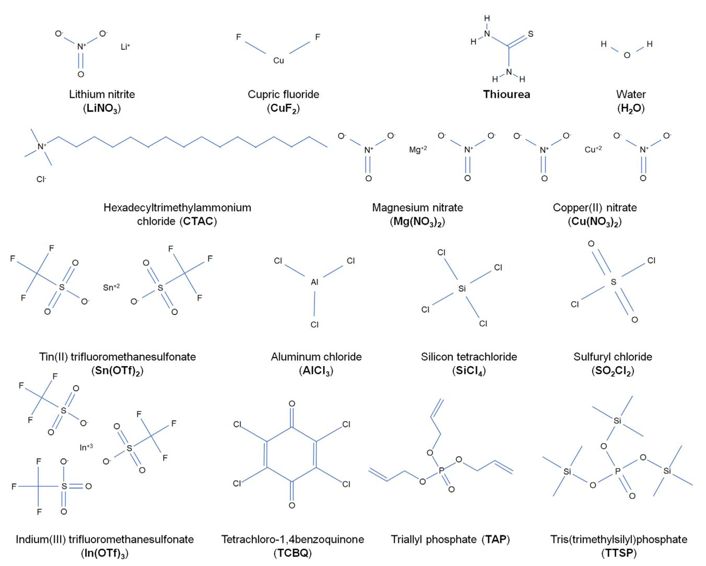

**Figure 10.** Molecular formula for electrolyte additive of LMBs (I). Lithium nitrite (LiNO3).[126] Cupric fluoride (CuF2).[127] Thiourea.[128] Water (H2O).[129] Hexadecyltrimethylammonium chloride (CTAC).[130] Magnesium nitrate ( $Mg(NO_3)_2$ ).[131] Copper(II) nitrate ( $Cu(NO_3)_2$ ).[132] Tin(II) trifluoromethane- sulfonate ( $Sn(OTf)_2$ ).[133] Aluminum chloride (AlCl3).[134] Sil sulfonate (In(OTf)3).[137] Tetrachloro-1,4benzoquinone (TCBQ).[138] Triallyl phosphate (TAP).[139] Tris(trimethylsilyl)phosphate (TTSP).[140]

fiber as the skeleton for insoluble LiNO2 particles and realized high-capacity LMBs in carbonate electrolyte. Liu et al.[158] also used poly(vinylidene fluoride)-co-hexafluoropropylene (PVDF-HFP) as substrate for  $LiNO3$  particles in carbonated electrolyte. The addition of LiNO3 into the anode[159] or cathode[160] electrode structure can also improve the cycling efficiency and alleviate the gaseous problems of LMBs effectively.

Direct attaching of non-conducting LiNO3 particles with electron-conductive electrode will increase battery polarization and invalidate the battery operation. Although the dissolving capacity of  $LiNO3$  in carbonate electrolyte can be increased by using a dissolution promoter, the long-term stability of LMBs is still of concern. Because LiNO3 would be continuously decomposed and even exhausted, which is unfavorable for sustainable LMBs. Therefore, Liu et al.[161] designed a biscuit-like separator with superfluous LiNO3 particles intercalated between bi-layer polypropylene (PP) separators (PP/LiNO3/PP) to realize high-

performance LMBs in carbonate electrolyte. On the one hand, the excess LiNO3 particles are fixed within two PP membranes, which are insulated from active materials. On the other hand, the porous PP membranes can enable a continuous release of  $NO3$  into the carbonate electrolyte, enhancing the cycling performance of LMBs. This  $PP/LiNO_3/PP$  separator is also capable of enhancing the capacity retention of silicon-graphite (Si-G) |  $\text{LiNi}_{0.8}\text{Co}_{0.1}\text{Al}_{0.1}\text{O}_2$  full cells.

#### 3.4.2. Enhanced LiNO3 Solubility in Carbonate Electrolyte

As early as 2015, Guo et al.[96] reported the synergetic effect of VC (Figure 8)-LiNO3 dual-additive in carbonate electrolyte. They found that the addition of VC can restrain the formation of LiF in SEI, while the addition of  $LiNO_3$  will form  $Li_3N$  in SEI, increasing the cycling efficiency of LMA. However, it is still uncertain

IFNCF NFWS www.advancedsciencenews.com unung advmat de

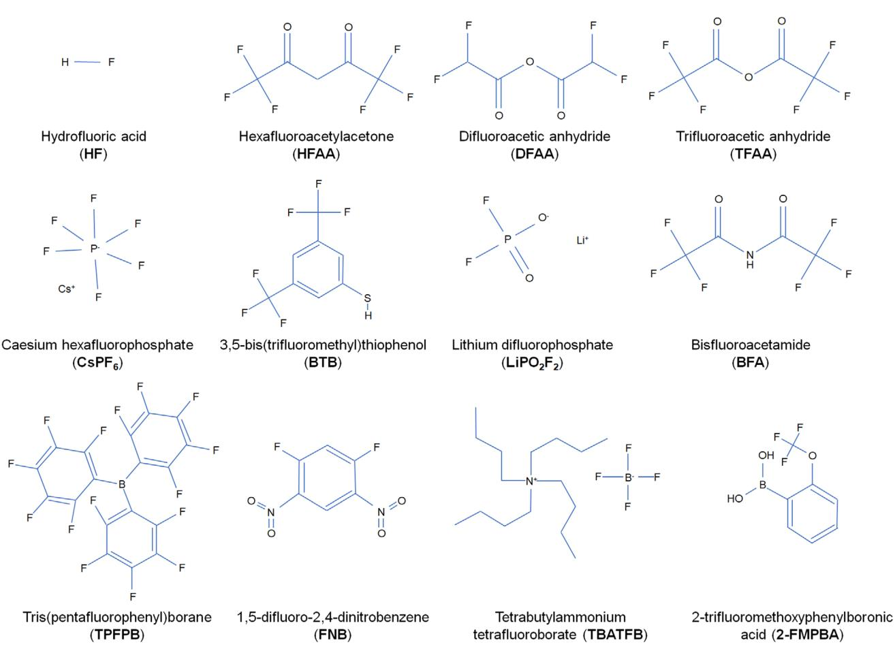

Figure 11. Molecular formula for electrolyte additive of LMBs (II). Hydrofluoric acid (HF).[129] Hexafluoroacetylacetone (HFAA).[141] Difluoroacetic anhydride (DFAA).[142] Trifluoroacetic anhydride (TFAA).[142] Caesium hexafluorophosphate (CsPF6).[143] 3,5-Bis(trifluoromethyl)thiophenol (BTB).[144] Lithium difluorophosphate (LiPO2F2).[145] Bisfluoroacetamide (BFA). Reproduced with permission.[146] Copyright 2021, Wiley VCH. Tris (pentafluorophenyl) borane (TPFPB). [147] 1,5-Difluoro-2,4-dinitrobenzene (FNB). Reproduced with permission. [148] Copyright 2024, Wiley VCH. Tetrabutylammonium tetrafluoroborate (TBATFB).[149] 2-Trifluoromethoxyphenylboronic acid (2-FMPBA).[150]

whether the addition of VC will increase the solubility of LiNO3 in carbonate electrolyte. In 2018, Yan et al.[127] reported that the addition of CuF2 (Figure 10) as a dissolution promoter can increase the solubility of LiNO3 in carbonate electrolyte to  $\approx$ 1 wt.%. In which the Cu2+ tends to coordinate with  $NO_3^-$  rather than F-, leading to the break of the Li– $NO_3$ - bond. In addition, the Cu2+- $NO_3^-$  complexes will be preferentially adsorbed on the Li metal surface, reducing the energy barrier for Li+ ions diffusion within SEI.[9a] Like the circumstance of  $CuF2$ , other metal salt such as  $In(OTf)_3$  (Figure 10)[137] and  $Sn(OTf)_2$  (Figure 10)[133] can also increase the solubility of LiNO3 in carbonate electrolyte. Apart from this, the addition of 1wt.% tris(pentafluorophenyl)borane (TPFPB (Figure 11), 1wt.%), where the electron-deficient atom appears to break the  $Li-NO_3^-$  bond, can also increase the solubility of  $LiNO_3$  in carbonate electrolyte to 3 wt.%.[162]

Due to its high solubility in ether solvent,  $LiNO3$  can be added into a mixed solvent with FEC/DMC/DME to increase its utility for LMBs.[163] Although the authors reported that the combination of FEC and  $NO_3^-$  will produce a LiF- and LiNvOv-rich SEI on LMA and enhance the cycling stability of LMBs, the addition of DME as cosolvent can impair the HV stability of LMBs significantly. In 2019, Brown et al.[164] reported that the addition of flame retarding cosolvent-triethyl phosphate (TEP) can increase the solubility of  $LiNO2$  in carbonate electrolyte. The synergy of  $LiNO3$  and TEP can alleviate the adverse effect of TEP for LMA and generate a LiPON-like SEI layer on Li metal anode, facilitating the ion transport and deposition process of Li+ ions. Other solvents such as sulfolane (SL, Figure 8),[165]  $\Gamma$ -butyrolactone (GBL, Figure 8),[99] dimethyl sulfoxide (DMSO, Figure 9),[111] bis(2-methoxyethyl) carbonate (BMC, Figure 9),[112] glyceryl triacetate (GTA, Figure 9)[113] and 3-methyl-2oxazolidinone (MOX, Figure 8)[103] can also increase the solubility of  $LiNO_3$  in carbonate electrolyte. Zhao et al.[166] reported that the strong interaction between Li+ and NO3- can only be dissociated with high dielectric constant carbonate solvents such as EC or PC. The dissociated  $Li^+$  ions from Li salts will occupy EC molecules, whereas the addition of linear carbonate solvent might disturb the dissociation of  $LiNO_3$ , preventing the dissolution of  $LiNO_3$ . They thought that the addition of Lewis acid with high charge density, such as Al3+, Sn2+, In3+, Cu2+ can have strong interactions with complex anions, liberating the EC molecule to dissolve  $LiNO_2$ .

www.advancedsciencenews.com

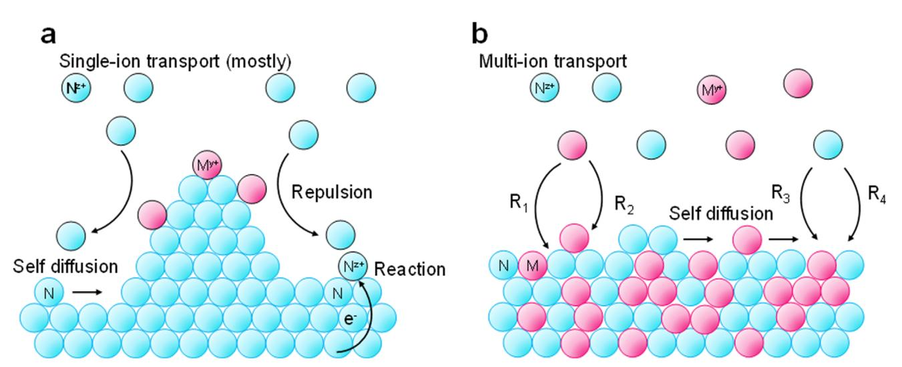

**Figure 12.** a), Schematic showing the cation shielded electrochemical process for electrodeposition of metal N, the  $M^{\gamma+}$  ions are the cationic shields for  $N^{2+}$  ions. b), Schematic showing the co-electrodeposition mechanism of metals N and M, Reproduced from ref.[168] Copyright 2021, American Chemical Society.

#### 3.4.3. Derivatives of $LiNO_3$

Jiang et al.[167] introduced nitrofullerene (nitro- $C_{60}$ ) as an electrolyte additive for LMBs. During the reduction process, the  $C_{60}$ will be anchored on the uneven groove of the Li surface, homogenizing the ion distribution. In addition, the  $NO2-$  can help to produce a compact and stable SEI on LMA simultaneously. Lee et al.[131] also reported that the addition of  $Mg(NO_3)_2$  (Figure 10) into the carbonate electrolyte can stabilize LMBs. Besides stabilizing the SEI, the addition of  $NO_3$  – and  $Mg^{2+}$  can decrease the solvent number surrounding Li+ ions, facilitating the plating kinetics. Moreover, the  $Mg^{2+}$  can be partially reduced on the anode surface, forming a lithiophilic Li-Mg alloy layer to suppress dendrite formation. Zhao et al.[132] further reported that the addition of Cu(NO3)2·3H2O (Figure 10) is also effective to boost uniform Li plating, and the Cu2+ will help form a CEI film on  $LiMn_2O_4$ cathode and suppress the adverse dissolution of Mn simultaneously.

#### 3.4.4. Fluorine-Containing Additive

As early as 1999, Shiraishi et al.[129] reported that the addition of aqueous hydrofluoric acid (HF) solution as an electrolyte additive can produce smooth hemispherical Li electrodeposits. The added HF and  $H_2O$  are helpful in forming a thin and compact LiF- and  $Li2O$ -rich SEI layer. They reported that a residual film will remain on the Li metal substrate once the deposited Li metal is fully dissolved, while this film will grow continuously during the cycling process, boosting the formation of Li dendrite. In 2013, Ding. et al.[143] proposed a self-healing electrostatic shield mechanism for uniform Li metal deposition. During the Li plating process, the Li ions and the added cations (Cs+, Figure 11) will be adsorbed on the current collector simultaneously. If the applied voltage is lower than Li plating potential but higher than the reduction potential of cations, Li metal will be formed whereas forming protuberant tips. At this time, the stronger electrical field at the protrusions will adsorb the added cations preferentially, thus the incoming Li+ ions will deposit at the surrounding place of protrusions until a smooth deposition layer is formed. The added hexadecyl trimethylammonium chloride (CTAC, Figure 10) can also be aggregated around the pre-formed protuberances, driving the Li+ ions to deposit at the adjacent regions and producing a uniform Li metal layer.[130]

For the cationic shielding process (Figure 12a), the electrolyte additive ( $M^{y+}$ , for example,  $Cs^+$  and CTAC) can be adsorbed on the as-formed Li metal protuberances, driving the incoming  $N^{z+}$ ions (here is  $Li^+$  ions) to deposit at the adjacent regions. With this cationic shielding effect, the dendrite formation can be largely alleviated in the reaction-kinetics-limited regime, assisting uniform Li metal growth in the transport-limited regime.[169] With the same preparation process of electrolyte, when the electrolyte additive can be reduced at the electrode surface, this process can be termed as co-electrodeposition effect. As shown in Figure 12b, during this process, two (or more) distinct metal ions (denoted as  $N^{z+}$  and  $M^{y+}$ ) are transported and consumed simultaneously (multi-ion transport); the reduced atoms can then diffuse across their reaction sites and rearrange to form the metal film. However, for the cationic shielding process (single-ion transport), the  $M^{y+}$  can be transported to the electrode surface during the initial stage, while never being consumed. Generally, two metals that can be co-electrodeposited show the possibility of being alloyed together. Due to the better interactions of additive cations  $(M^{y+})$  with the substrate, the poor reaction kinetics of the targeted cations ( $N^{z+}$ ) can be alleviated.[168] Even tiny amounts of additive cations can result in the suppression of dendrites and the formation of homogeneous film-like electrodeposits. Typical examples for the co-electrochemical deposition of LMA include the electrolyte additive, which could adjust the LiNO3 solubility in carbonate electrolyte, for example, the  $In(OTf)_3$  (Figure 10)[137] and Sn(OTf), (Figure 10).[133] During the Li metal plating process, the  $In^{3+}$  and  $Sn^{2+}$  will be reduced simultaneously; their alloy reaction with Li metal can increase the cycling performance of LMBs.

Apart from forming LiF-based SEI on LMA, the fluorinecontaining additive can also form complexes with Li+ ions, increase the cell polarization, and prevent the individual Li metal growth. In 2019, Dong et al.[141] reported that the addition of hexafluoroacetylacetone (HFAA, Figure 11) can generate nucleation sites for Li+ ions, facilitating smooth Li metal deposition. Heiskanen et al.[142] reported that the addition of difluoroacetic anhydride (DFAA, Figure 11) and trifluoroacetic anhydride (TFAA, Figure 11) can enhance the cycling stability of LMA significantly. They showed that these additives are capable of producing LiF within the SEI layer, lowering Li2CO3 concentration and increasing Li carboxylates concentrations in the SEI, improving the reversibility of LMA.

#### 3.4.5. Chlorine (Cl)-, Bromine (Br)-, and Iodine (I)-Containing **Additive**

Apart from fluorine-containing additives, other halide additives such as chlorine (Cl)-, bromine (Br)-, and iodine (I)-containing additives can also boost the uniform deposition of LMA. Ye et al.[134] reported that the addition of AlCl2 (Figure 10) can capture the trace water in electrolyte, forming a stable  $Al_2O_3$ -rich SEI on Li metal and Al-based positively charged colloidal particles (PCCPs) in the electrolyte. Like the functions of  $CsPF_6$ [143] and CATC,[130] the PCCPs can also form an electrostatic shield on the pre-formed Li protrusions and boost uniform Li metal deposition. Zhao et al.[135] further utilized the cross-linking chemistry of SiCl4 (Figure 10) to create a hybrid SEI composed of Siinterlinked OOCOR molecules inlayed with LiCl salt, which enhanced the mechanical resilience and the exchange current density of SEI significantly.

Generally, the exchange current density  $(j_0)$  can be obtained as follows. During the reduction of Li+ ions, the Butler-Volmer equation gives its current density at a certain potential:[170]

$$j = j^{0} \left[ \frac{C_{Li^{+}}^{s}}{C_{Li^{+}}^{b}} \exp\left(\frac{\alpha F}{RT}\eta\right) - \frac{C_{Li}^{s}}{C_{Li}^{b}} \exp\left(-\frac{\beta F}{RT}\eta\right) \right]$$
 (2)

here  $C_{Li^+}^b$  and  $C_{Li^+}^s$  are Li+ ion concentrations in the bulk electrolyte and on the Li electrode surface, respectively.  $\alpha$  and  $\beta$  are the transfer coefficients of anodic and cathodic reactions ( $\alpha + \beta$ )  $= 1$  for single electron transfer), respectively. *F* is the Faraday's constant, and  $R$  is the ideal gas constant.  $T$  is the absolute temperature, and  $\eta$  is the overpotential. Due to the large surface polarization ( $\eta$ ) on electrode in LMBs, the second term in Equation (2) can be neglected, thus:

$$j \approx j^{0} \frac{C_{Li^{+}}^{s}}{C_{Li^{+}}^{b}} \exp\left(\frac{\alpha F}{RT}\eta\right)$$
 (3)

which can be further transformed into logarithmic form:

$$\eta = -\frac{2.3RT}{\alpha F} \lg \left( j^0 \frac{C_{Li^+}^s}{C_{Li^+}^b} \right) + \frac{2.3RT}{\alpha F} \lg j \tag{4}$$

This is the Tafel equation, and the extrapolation of the Tafel curve to  $\eta = 0$ , the  $j_0$  can be obtained (**Figure 13**).

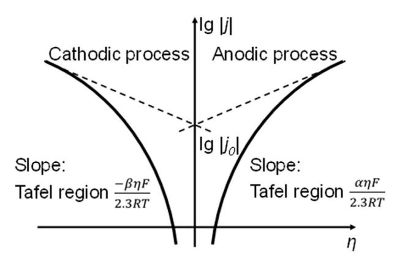

**Figure 13.** Tafel curve to calculate exchange current density  $(j_0)$  and other coefficients such as  $\alpha$  and  $\beta$ . Reproduced under the terms of the CC-BY Creative Commons Attribution 3.0 International License (https: //creativecommons.org/licenses/by/3.0).[170] Copyright 2021, Y. Liu et al., Wiley VCH.

For the electrochemical plating process, the critical nucleation radius  $r = r_c = 2\sigma V_m/\Delta \mu$ , where  $\Delta \mu = zF\eta$ ,  $\sigma$  is the surface energy,  $V_m$  is the volume of the Li embryo. The increase of current density (*j*) or the decrease of exchange current density ( $j_0$ ) will result in the increase of polarization  $(\eta)$ , causing the smaller nucleation embryos of LMA. Therefore, a higher exchange current density on the Li electrode can increase the critical radius for the electrochemical deposition of Li metal, which has been reported by many researchers.  $[135,171]$ 

Sulfuryl chloride (SO2Cl2, Figure 10) can also be used as an electrolyte additive for LMBs, because it can spontaneously react with Li metal to produce LiCl and SO2[136] Apart from the low surface diffusion barrier for Li+ ions of LiCl, the asformed  $SO_2$  can react with Li metal to produce LivSOv species, improving the mechanical strength of SEI. The addition of tetrachloro-1,4benzoquinone (TCBQ, Figure 10) can form lithiophilic Li2TCBQ in SEI, regulating the Li metal plating process and restraining the adverse decomposition of electrolyte at the same time. $[138]$ 

The LiBr additive in carbonate electrolyte can facilitate fast interphasial ion diffusion, improving the uniformity of LMA. Biswal et al.[172] proposed that it is more likely the polymerized oligomeric species initiated by LiBr, which account for the fast interphase transport and high uniformity of LMA. Jin et al.[173] reported that the  $I_3$ -/I- redox can rejuvenate dead Li to extend the cycling life of LMBs. Where the dead Li or  $Li_2O$  will react with  $I_3^-$ , producing soluble Li+ ions and I-. Then, the as-formed Li+ ions and I $\cdot$  would react with the Li-deficient cathode (FePO4) to produce LiFePO4 and  $I_3$ , compensating for the Li loss at the cathode side.

#### 3.4.6. Metal-organic framework (MOF)

Metal-organic framework (MOF) is comprised of metal ions and organic ligands, and is a subclass of coordination compounds. The 3D structure of MOF can be seen as well-ordered hollow cavities interconnected by narrow pathways, which is helpful in sequestering ions or transporting solvent. In 2018, Bai et al.[174] reported that the addition of MOF (HKUST-1) into the liquid electrolyte could provide a bottleneck for the free migration of TFSI- anions. The angstrom-level pores of MOF can effectively cage the anions and facilitate a homogeneous Li+-ion flux, providing a high Li+ transference number during the Li metal plating process, suppressing the formation of Li dendrites effectively. In the same year, Jiang et al.[175] also reported that the high specific surface area and polar functional groups in MOF nanosheets are helpful to homogenize Li+ ions flux, resulting in uniform Li metal plating. Chang et al.[176] further reported that regulating the MOF pore size can partially deplete the solvent molecules within Li+ ions solvation sheath, forming the aggregated contact ionic pairs (CIPs). This kind of electrolyte configuration can eliminate the detrimental solvent decomposition, thus expanding the electrochemical stability windows of the electrolyte. The results obtained by Bai et al. and Chang et al. agree well with the conclusions obtained by Shen et al., where the addition of Al-based MOF (MIL-100) into the liquid electrolyte can increase the  $Li^+$  transference number and extend the electrochemical stability window of the liquid electrolyte.[177] Through further characterizations and analyses, Chu et al.[178] found that the Zr-based MOF additive (UiO-66) is superior to Cu-based (HKUST-1) or Al-based (MIL- $101-NH2$ ) MOF. They thought that the thermally and chemically more stable UiO-66 is more resistant to the electrochemical reduction or decomposition.

#### 3.4.7. Additive for High Voltage (HV) LMBs

Ethylene carbonate (EC) has been widely used in LIBs, while it is prone to be oxidized on the surface of HV cathode, which makes it inappropriate for the practical application of HVLMBs. FEC can be used as an electrolyte additive for HVLMBs, and the combination of FEC and VC can boost the cycling stability of LMBs significantly.[179] The Si- and P-base function groups of tris(trimethylsilyl)phosphate (TTSP, Figure 10) can passivate the Li metal surface and suppress the catalytic decomposition of carbonate solvent at high voltages, enabling the 4.5 V Li|NMC811 full cells.[140] The boron (B) element and pentafluorobenzene in tris(pentafluorophenyl)borane (TPFPB, Figure 11) can also help form a stable and smooth interfacial layer on both LMA and  $LiNi_{0.5}Mn_{1.5}O_4$  (LNMO) cathode, boosting the cycling stability of 4.95 V Li|LNMO full cells.[147] Adding bisfluoroacetamide (BFA, Figure 11) as an electrolyte additive can reduce the free solvents and improve the antioxidant property of the electrolyte.[146] The as-formed SEI with LiF-rich bottom layer and C-F bonds-rich surface layer could boost the homogeneous deposition of Li+ ions.

Derived from the hydrolysis of LiPF6, the lithium difluorophosphate (LiDFP) has been used to improve the performance of LIBs. In 2019, Zheng et al.[145a] reported the coupled effects of VC and LiDFP additive for LMBs. The addition of VC can promote the breaking of P–F bonds in LiDFP, forming LiF-, Li3PO4-, and P-O-C-rich SEI. Moreover, the existence of VC can also suppress the excessive consumption of LiDFP. The resulting SEI is flexible and delivers high ionic conductivity, which promises the excellent cycling performance of LFP-based LMBs. Tan et al.[145b] further testified that the formation of LiF-, Li3PO4-rich CEI at the cathode surface can suppress the transition metal dissolution and surface reconstruction, stabilizing the high nickel layered oxide cathode at 4.8 V. However, the amount of LiDFP should be small, otherwise, excess HF will form, impairing battery stability. Deng et al.[180] further added fluorinated ether solvent as diluent into the LiDFP-added carbonate electrolyte to change the solvation sheath of Li+ ions, inducing the precipitation of solid LiDFP at both the anode and cathode surface. Their results showed that the existence of LiDFP precipitates at the electrode surface can alleviate the consumption of  $\text{LiPF}_6$  and prevent the oxidation of carbonate electrolyte until 4.6

Ryu et al.[149] proposed to use tetrabutylammonium tetrafluoroborate (TBATFB, Figure 11) to enhance the cycling stability of HVLMBs. In this molecule, the bulky TBA+ cation is capable of regulating  $Li^+$  flux, whereas the TFB- anion can minimize the corrosion of LMA. For the nitrogen- and fluorinecontaining additive, the 1,5-difluoro-2,4-dinitrobenzene (FNB, Figure 11) can also be used as an additive for 4.6 V Li | NMC811 cells, where the C-N and C-F bonds are weak and can be broken down easily to form LiF-rich and LiNvOv-rich interphases.[148] The 2-trifluoromethoxyphenylboronic acid (2-FMPBA, Figure 11) additive is also effective in forming  $B_xO_y$  and  $\text{Li}_{v}$ POvFz species on the cathode electrolyte interphase, which is effective in capturing dissolved transition metal ions and reactive oxygen species, and enhances the structural stability of NMC622 cathode at an ultrahigh cutoff voltage of 4.8 V.[150] The dual descriptors, Mulliken charge and Laplacian bond order (LBO) can also be used to screen electrolyte solvent which can strongly react with cathode dangling bonds, for example, the acetonitrile (AN), which can boost the HV performance of oxide cathode.[181]

### 3.5. High Entropy Electrolyte

Basically, the liquid electrolyte of LMBs is a mixture of salt and solvent, where the salt and solvent may be one or more types. When we increase the types of salt[9d] or solvent,[9c] or both of them,  $[182]$  can form a new electrolyte system named as high entropy electrolyte (HEE). Increasing the solvation entropy of electrolytes can effectively decrease the solvation energy while without changing the solvation enthalpy, which can improve the ion dissociation and formation of smaller solvated clusters (Figure **14a,b).** For the high entropy solvent enabled  $HEE$ , [9c] its high solvation entropies will drive the thermodynamic equilibrium of solvation sheath to favor Li+ ion-solvent interactions and suppress clustering (Figure 14c), which can improve the high-rate cycling performance of LMBs. However, for the high entropy salt enabled HEE,[9c] the anion-dominated solvation sheath will be formed compared with the single salt electrolyte, which will assist in the construction of inorganic-rich SEI/CEI and improve the cycling performance of LMBs (Figure  $14d.e$ ). When compared with conventional dilute electrolytes and high concentration electrolytes, the HEE possesses advantages for its low cost and high conductivity. Further studies showed that the high entropy salt enabled HEE possesses a greater variety of solvation structures and a more prominent conductive spatial network, while the high entropy solvent enabled HEE delivers a more uniform solvation structure, which has smaller solvation clusters

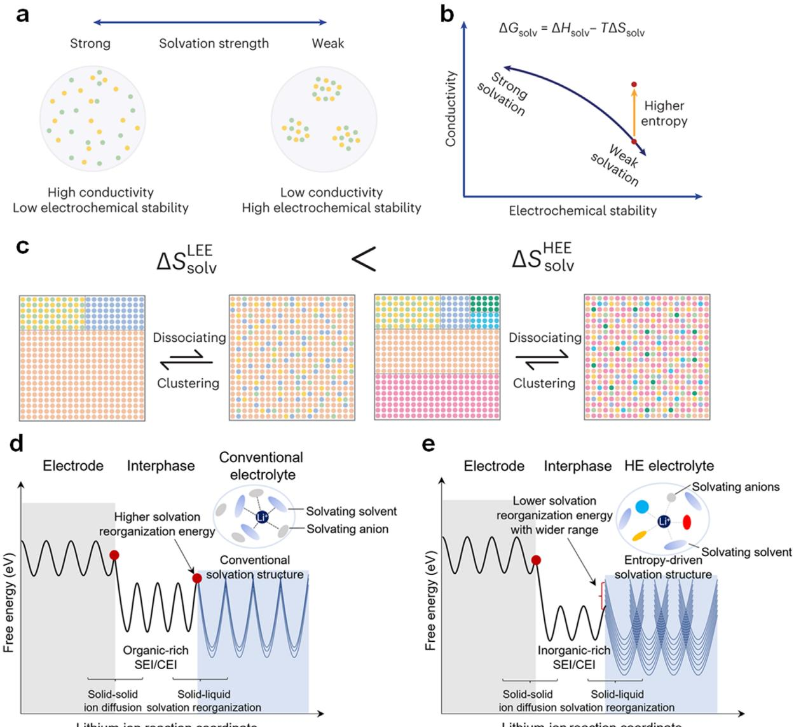

**Figure 14.** a), Schematic showing the trade-off between the ionic conductivity and electrochemical stability induced by tuning solvation strength. b), Schematic showing the improved ionic conductivity and electrochemical stability of high entropy electrolyte. c), Schematic showing the high entropy electrolyte enabled solvation entropy, which will promote the ion dissociation and suppress clustering. a-c) Reproduced with permission.[\[9c\]](#page-27-0) Copyright 2023, Springer Nature. d), Schematic showing the ion transportation in conventional electrolyte. e), Schematic showing the ion transportation in high entropy electrolyte. f), Performance comparison for the high entropy electrolyte, concentrated electrolyte and conventional dilute electrolyte. d, e) Reproduced under the terms of the CC-BY Creative Commons Attribution 4.0 International License [\(https://creativecommons.org/licenses/by/4.0\)](https://creativecommons.org/licenses/by/4.0).[\[9d\]](#page-27-0) Copyright 2023, Q. Wang et al., Springer Nature.

and is more beneficial for the cycling performance of pouch-type LMBs.[\[182\]](#page-30-0)

#### **3.6. Ionic Liquids (ILs)**

Composed entirely of ions, ionic liquids (ILs) are usually colorless fluids.[\[183\]](#page-30-0) It can also be termed as room temperature, low-temperature- and ambient-temperature-molten salt, liquid organic salt, or simply ionic liquid. Mostly, ILs are thermally stable, non-flammable, non-volatile, and less-reactive than other solvents. The most important points for the successful application of ILs in LIBs or LMBs are their compatibility with Li+ ions and high Li+ transference number. Generally, the anions of ILs decide the reductive stability at the anode side, whereas the cations of ILs decide the oxidative stability at the cathode side. However, if some positively charged groups are included in the anions of ILs, it can also influence the oxidative stability at the cathode side. Many kinds of ILs have been reported to be effective in increasing the electrochemical performance of LMBs, while we take four of them into discussion here.

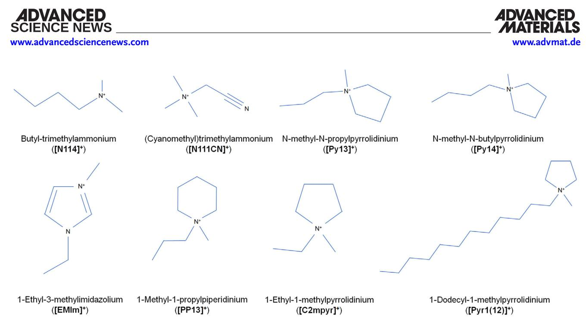

**Figure 15.** Molecular formula for the cation of ILs in LMBs. Butyl-trimethylammonium (**[N114]+**).[\[184\]](#page-30-0) (Cyanomethyl)trimethylammonium (**[N111CN]+**).[\[185\]](#page-30-0) N-methyl-N-propylpyrrolidinium (**[Py13]+**).[\[186\]](#page-30-0) N-methyl-N-butylpyrrolidinium (**[Py14]+**).[\[187\]](#page-30-0) 1-Ethyl-3-methylimidazolium (**[EMIm]+**).[\[188\]](#page-30-0) 1-Methyl-1-propylpiperidinium (**[PP13]+**).[\[189\]](#page-30-0) 1-Ethyl-1-methylpyrrolidinium (**[C2mpyr]+**).[\[190\]](#page-30-0) 1-Dodecyl-1-methylpyrrolidinium (**[Pyr1(12)]+**).[\[191\]](#page-30-0)

#### *3.6.1. Ammonium- and Imidazolium-Based ILs*

In 2009, Vega et al.[\[192\]](#page-30-0) reported that the ammonium-based ILs are effective in enhancing the deposition/dissolution efficiency of Li metal, potassium (K) metal, and their alloy. The same group further showed that the addition of sodium salt (NaTFSI) into the ILs with butyl-trimethylammonium ([N114]+, **Figure 15**) and 1-ethyl-3-methylimidazolium ([EMIm]+, Figure 15) cations can eliminate the dendrite formation problems of LMA effectively.[\[184\]](#page-30-0) However, their results also showed that the phosphonium-based ILs, which have higher ionic conductivity (0.43 mS cm−1) than ammonium-based ILs (0.28 mS cm−1), was more stable for LMA.[\[192\]](#page-30-0) This mainly comes from its slower reactivity with Li metal. In 2020, Yunis et al.[\[185\]](#page-30-0) reported the properties of (Cyanomethyl)trimethylammonium ([N111CN]+, Figure 15)-based ILs with many anions such as FSI−, BF4 −, and PF6 −. They found that the electrolyte with 50 mol% LiFSI in [N111CN]FSI showed an ionic conductivity of 3 mS cm−1 at 50 °C, while it is only 0.78 mS cm−1 for the quasi-solid electrolyte (50 mol% LiBF4 in [N111CN]BF4) even at 90 °C. The linear sweep voltammetry (LSV) tests showed the high oxidative stability (≈5.6V vs Li/Li+) of the 50 mol% LiFSI in [N111CN]FSI electrolyte at 50 °C. However, the cycling efficiency of LMA in this electrolyte is only ≈91%, which is insufficient for practical LMBs. To ameliorate this problem, Sun et al.[\[188](#page-30-0)] developed an IL-based high concentration electrolyte with 5m LiFSI and 0.16m NaTFSI dissolved in [EMIm]FSI. Due to the delocalized positive charge around the imidazolium ring, which can increase the distance between cation and anion of ILs and reduce the electrostatic interaction between ion pairs, the ionic conductivity of this electrolyte is as high as 2.6 mS cm−1 at 22 °C and 10.2 mS cm−1 at 80 °C, respectively. The high concentration of LiFSI salt can lead to the preferential decomposition of FSI− anions, suppressing the decomposition of EMIm cations at low potential and forming a F-rich SEI and CEI at the surface of the anode and cathode, respectively. For this reason, the electrochemical window of this electrolyte is high (≈4.6V vs Li/Li+), and the 4.4 V NMC811-based LMBs with an N/P ratio of ≈1.8 could maintain 80% of their capacity after 120 cycles.

#### *3.6.2. Piperidinium-Based ILs*

The structure of piperidinium-based cations is similar to that of ammonium- and imidazolium-based cations; thus it can also be used as a co-solvent for carbonate solvent. Yuan et al.[\[189\]](#page-30-0) reported an electrolyte containing 0.5m LiPF6-0.5m LiTFSI-0.2m LiBOB-0.15m NaPF6 in PC/[PP13][TFSI]/TEP/FEC (v/v/v/v, 1.5/1/1/0.5), where the LiBOB, LiTFSI, LiPF6, NaPF6 and [PP13][TFSI] will be preferentially reduced and form a F-, B-, and P-rich SEI on LMA, and the [PP13][TFSI], TEP and LiBOB will be preferentially oxidized to form a P-, and B-rich CEI at the cathode surface, all of them is helpful to facilitate the cycling process of AFLMBs with NMC811 cathode.

#### *3.6.3. Pyrrolidinium-Based ILs*

These ILs can be used as a single solvent for LMBs. In 2018, Zhang et al.[\[186\]](#page-30-0) reported a concentrated electrolyte for LMA, where the molar ratio between the salt (LiTFSI) and ILs ([Py13][FSI]) is 1:1. They thought that the synergy between TFSIand FSI- anions would form a stable SEI layer on Li metal, improving the reversibility of LMA. With the changing of cations from [Py13]+ to [Py14]+ (Figure 15), the combination of DCA− and TCM− anions can reduce the amount of sp2 carbon in SEI, blocking the electron transfer, whereas restraining the parasitic reactions between Li metal and electrolyte.[\[187\]](#page-30-0) It is worth noting that both the DCA− and TCM− anions are fluorine-free, which helps produce a more sustainable world. Actually, the addition of high-concentration salt in IL-based electrolyte is mainly to increase the oxidative stability of the electrolyte. The LiTFSI into LiFSI-based HCE shows superior oxidative stability than the same electrolyte with low salt concentration. The anode SEI stability with electrolyte is also important for LMBs. In this regard, the amount of FSI− anions should be as high as possible. Therefore, the electrolyte with 4.5m LiFSI and 1wt.% LiTFSI in [Py13][FSI] can let the AFLMBs be charged over 4.7 V and maintain 80% of their capacity after 120 cycles.[\[193\]](#page-30-0)

Apart from single solvents, the pyrrolidinium-based ILs can also be used as cosolvents for the electrolyte of LMBs. In 2017, Li et al.[\[194\]](#page-30-0) reported that electrolyte with 2m LiTFSI-2m [Py13][TFSI] in DOL/DME (v/v, 1/1) can increase the cycling stability of LMA significantly. It is worth noting that the viscosity of 2m LiTFSI-2m [Py13][TFSI] in DOL/DME (v/v, 1/1) electrolyte is over a hundred times higher than that of 2m LiTFSI in DOL/DME (v/v, 1/1) electrolyte. In addition to this, the [Pyr1(12)][FSI][\[191\]](#page-30-0) and [C2mpyr][FSI][\[190\]](#page-30-0) can also be used as cosolvent for DOL/DME (v/v, 1/1) solvent and DMC solvent, respectively, where the FSI− anion can help form a rigid SEI on LMA. The concentrated DMCbased electrolyte can be stabilized to 5.2 V versus Li/Li+ and is nonflammable. Due to the low oxidative stability of ether solvent, the LMBs in reference[\[191,194\]](#page-30-0) are based on LFP cathode. The coexistence of pyrrolidinium-based ILs and LiNO3 can protect LMA through the formation of LiF- and LiNxOy-rich SEI, facilitating the charge transfer process of LMA.[\[195\]](#page-30-0) The co-existence of lithium bis(fluorosulfonyl)amide (LiFSA) and LiTf salts in pyrrolidinium-based ILs possesses enhanced Li+ ion transference number and improved anodic stability, which leads to the formation of inorganic-rich SEI, improving the cycling performance of Li | NMC811 cell.[\[196\]](#page-30-0)

# **4. Artificial SEI (ASEI)**

The degradation of electrolyte at the anode surface through both chemical and electrochemical methods will form a solidelectrolyte interphase (SEI), which is responsible for providing Li ion transportation and inhibiting electron tunneling. Generally, the chemically or electrochemically formed SEI by the reaction between Li metal and electrolyte during the cycling or aging process of LMA is not good enough for battery operation. For example, the direct reaction between Li metal and 1m LiBF4 in tetrahydrofuran (THF) electrolyte would produce a surface film that is rich in organic compounds and LiF.[\[197\]](#page-30-0) Although the 1m LiPF6 in DEC electrolyte can better passivate Li metal than 1m LiClO4 in DEC electrolyte,[\[198\]](#page-30-0) such a kind of SEI film is still inadequate to provide LMA with a sufficient and sustainable protection. It has been reported that the electrochemically produced SEI exhibits double-layer structure, which is different from the inorganic– organic hybrid SEI formed through a chemically method.[\[199\]](#page-30-0) In addition, the coexistence of different kinds of SEI may result in its breakage and generate Li dendrite. Actually, when taking the elasticity of the SEI with immobilized anions into consideration, the surface perturbations of the electrode induced by the transport limitation can be effectively suppressed.[\[200\]](#page-30-0) At these conditions, a common polymeric material with moduli of tens to hundreds of megapascals can help achieve smooth Li metal plating, once it is immobilized with anions.

Artificial SEI (ASEI), as what its name shown, is a kind of membrane that is coated on the surface of Li metal to protect it. Many researches have been carried out to produce ASEI on LMA to elongate the cycling life of LMBs. The main directions for the construction of artificial SEI on Li metal include the inorganic coated ASEI, the organic coated ASEI, and the hybrid coated ASEI.

# **4.1. Inorganic ASEI**

As early as 1993, an amorphous lithium phosphorus oxynitride (LiPON) electrolyte was constructed on the surface of Li metal through sputtering LiPO4 in N2 atmosphere.[\[201\]](#page-30-0) The as-formed electrolyte exhibited excellent long-term stability when connected with LMA. Such kind of inorganic coating on the surface of Li metal can enhance the safety of LMB, and this is also the reason why we want to develop solid-state LMBs. The inorganic coated ASEI on Li metal can also enhance the cycling stability and safety of liquid LMBs eventually. The difference between the solid-state electrolyte and the inorganic coating ASEI is the requirement of Li ion conductivity. In solid-state LMBs, the solid-state electrolyte needs to possess high Li ion conductivity, because it is the only source of Li ion conductor. However, in liquid LMBs, a polymer separator and liquid electrolyte are always incorporated to separate the cathode and anode, and conduct the Li ions. Therefore, the inorganic ASEI is not always a Li ion conductor, and it may possess different functions at different cycling conditions.

# *4.1.1. LiF-Based ASEI*

We have discussed that the Li ion conductivity of LiF is almost the lowest among all the inorganic lithium compounds. Such kind of property makes it ideal to inhibit the electron tunneling when it is located at a suitable place of SEI. Therefore, LiF is present in nearly all functional SEIs (**Figure 16**[a\)](#page-23-0). Bulk LiF possesses high mechanical strength, low solubility, a wide electrochemical stability window, and low diffusion barriers for Li ions. Therefore, many researches have been proposed to build a LiF-rich ASEI on Li metal to protect it (Figure [16b\)](#page-23-0). For example, the conformal LiF layer on Li metal produced by using Freon R134a as gaseous reagent (Figure [16d\)](#page-23-0),[\[22\]](#page-27-0) the surface fluorination of Li metal by fluorine gas which was produced by a fluoropolymer precursor of poly(perfluorobutenylvinylether) (CYTOP, Figure [16e\)](#page-23-0),[\[202\]](#page-30-0) the atomic layer deposition (ALD) of LiF on Li metal at 150 °C,[\[23\]](#page-27-0) the LiF ASEI produced by the direct reaction of Li metal and nitrogen trifluoride (NF3) gas (Figure [16f\)](#page-23-0).[\[15\]](#page-27-0) Actually, coating of LiF-based ASEI on Cu foil can also help smooth Li metal deposition (Figure [16g\)](#page-23-0).[\[21\]](#page-27-0) During the acid treatment of the surface oxidation layer of Cu foil, water can be adsorbed on the Cu surface. With further reaction between the water adsorbed on Cu foil and the LiPF6-based carbonate electrolyte (1m LiPF6 in DMC), a LiF layer with a thickness range from 5 to 8 nm will form. The as-deposited Li metal exhibited a uniform structure with homogeneous, close-packed Li columns.

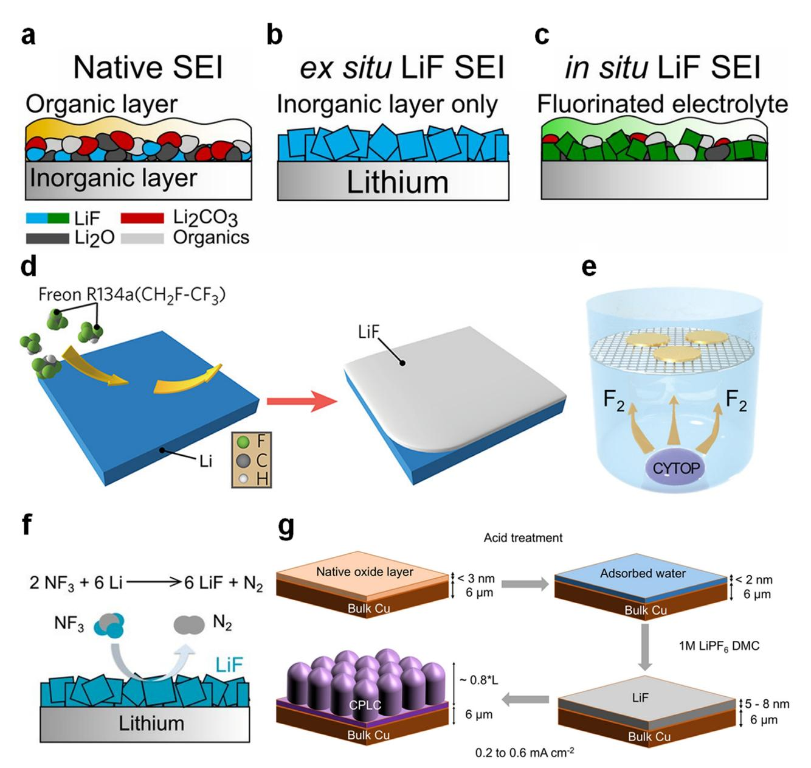

**Figure 16.** a,b,c), Schematic showing the native SEI formed in conventional carbonate electrolyte on Li metal, the *ex situ* formed LiF-rich ASEI from non-electrolyte fluorine sources, and the in situ formed LiF-rich SEI from fluorine-rich electrolyte, respectively. Reproduced under the terms of the CC-BY Creative Commons Attribution 4.0 International License [\(https://creativecommons.org/licenses/by/4.0\)](https://creativecommons.org/licenses/by/4.0).[\[15\]](#page-27-0) Copyright 2020, M. He et al., PNAS. d), Schematic showing the formation mechanism of LiF-rich ASEI on Li metal through the surface treatment of Li metal with 1,1,1,2-tetrafluoroethane (Freon R134a). Reproduced with permission.[\[22\]](#page-27-0) Copyright 2017, American Chemical Society. e), Schematic showing the formation mechanism of LiFrich ASEI on Li metal by using a fluoropolymer, poly(perfluorobutenylvinylether) (CYTOP), as the precursor. Reproduced with permission.[\[202\]](#page-30-0) Copyright 2017, American Chemical Society. f), Schematic showing the Li-NF3 reaction to form LiF-rich ASEI on Li metal. Reproduced under the terms of the CC-BY Creative Commons Attribution 4.0 International License [\(https://creativecommons.org/licenses/by/4.0\)](https://creativecommons.org/licenses/by/4.0).[\[15\]](#page-27-0) Copyright 2020, M. He et al., PNAS. g), Schematic showing the formation mechanism of LiF-rich ASEI on Cu foil through the acid treatment and further reaction with LiPF6-based electrolyte (1M LiPF6 in DMC) of Cu foil. Reproduced with permission.[\[21\]](#page-27-0) Copyright 2018, American Chemical Society.

Although many researches have reported the success of LiFbased ASEI in protecting LMA, the *ex situ* formed LiF layer exhibits breakdown behavior once the cycling starts and fails to protect the exposed Li (Figure 16b). This is different from the LMA cycled in fluorine-rich liquid electrolyte, which could repair the SEI and protect LMA sustainably (Figure 16c).[\[15\]](#page-27-0)

#### *4.1.2. Li2O- and Li2S-Based ASEI*

The direct reaction between Li metal and oxygen (O2) can produce a layer of Li2O ASEI on Li metal with a nanoscale thickness (20–100 nm).[\[25\]](#page-27-0) The ionic conductivity and diffusivity of Li2Obased ASEI were several orders of magnitude higher than the reported values of the bulk pellet. In addition, the ionic conductivity of Li2O-based ASEI is moderately higher than LiF-based ASEI, while both of them were very close to that of native SEI.

The sulfide-based ASEI can be produced on the surface of Li or Na metal through the direct reaction between the two metals with vaporized sulfur.[203] However, the as-formed  $Li_xS_v$ -based ASEI is denser than the  $Na_vS_v$ -based ASEI, which explains why the  $Na_vS_v$ based ASEI cannot protect the Na metal anode sufficiently. In this regard, the nano-porosity of ASEI is an important index for the performance of inorganic ASEI in protecting the metallic anode.

Another important point for the inorganic ASEI is that the initial discrete and nonplanar deposition of Li metal will induce the breakage of inorganic ASEI, leading to the preferential growth of Li metal on existing Li nodules and forming Li dendrites eventually. The incorporation of an Au layer beneath the inorganic ASEI, which can form the lithiophilic LixAu alloying interlayer, is helpful to alleviate such kind of problem and boost the mirror-like electrodeposition of Li metal.  $[204]$  Because the seeded nucleation of Li metal on the LivAu alloying interlayer can reduce the accumulated stress during the Li metal plating process and maintain the integrity of the surficial inorganic ASEI.

#### 4.2. Organic ASEI

The SEI on LMA is composed of both inorganic and organic components. In general, a bare inorganic component is brittle, which may incur dendrite formation. Most of the organic components within SEI are flexible, which can help maintain the SEI integrity during the repeated cycling of LMA. However, the composition and structure of organic components in SEI are highly correlated with the solvent of the electrolyte. By suitably choosing the solvent group, the cycling efficiency of LMA can be largely improved. However, the cost of such a kind of industry-unavailable solvent group is always expensive, which sacrifices the practicability of LMBs. Therefore, building an organic-based ASEI on LMA before the cycling test is the most promising way to enhance the cycling stability of LMBs commercially.

### 4.2.1. Polycation ASEI

We have discussed that the cationic shielding effect of  $Cs^{+[143]}$  and CTAC[130] surfactant-based electrolyte additives has been proved to be effective in boosting uniform Li metal deposition. If these cations were tethered on the backbone of organic ASEI, they would also adapt the morphological perturbation of LMA and modulate the Li ion migration pathway. For the pure electrode, the locally concentrated electric field at the surface protrusion will further amplify the surface roughness of LMA. While for the LMA protected by the cation ASEI, its surficial electric field will be neutralized efficiently, thus achieving a uniform Li metal deposition.

The physicochemical requirements for the cation ASEI should be: i, the reduction potential of the cations in the backbone is lower than that of  $Li^+$  ions; ii, the mobility of the polymer chains is sufficiently high to enable fast electric field-based response of the cations. Organic salts which have the anion (bis(trifluoromethane) sulfonimide, TFSI) and various cations

such as Piperdinium ( $Pp^+$ ), Pyrrolidinium ( $Py^+$ ), Ammonium (Am+), Imidazolium (Im+), Pyridinium (Pi+) (Figure 17a) have been used to form the polymerized ionic liquid polymer on LMA.[205] The fluorinated alkyl side chains with low  $T_a$  can also be incorporated into the polymer to improve the flowability of the polymer on the surface of the electrode. When these polymers were used as ASEI on LMA, the polymer based on Py+TFSI- delivered the best performance. This may originate from its low reduction potential  $(-3.17 \text{ V} \text{ vs standard hydrogen})$ electrode (SHE)) and the incorporation of fluorinated side chains. As shown in Figure 17b, the direct anion exchange reaction between poly(diallyl dimethyl ammonium) (PDDA)-Cl and LiTFSI will form a polymerized ionic liquid polymer containing a polymeric cation of PDDA and TFSI anion.[206] The polymeric cations can provide an electrostatic shielding effect, which can homogenize  $Li^+$  ion flux and smooth Li plating. The cation of the poly(1benzyl-3-vinylimidazolium) (PBM) polymer (Figure 17c) is as low as  $-3.7$  V (vs SHE).[207] Therefore, the well-protected Li metal pouch cells with their capacity of 5.13 Ah and energy density of 418.7 Wh kg $-1$  could be stably cycled over 70 times.

### 4.2.2. MOF-Based ASEI

Due to the Lewis acid-base interactions between the Lewis acidic inner metal ions of MOF and other Lewis basic species, many MOFs have been adopted to sequester the shuttling effect of soluble lithium polysulfides of sulfur cathode.[208] Actually, such kind of Lewis acid-base interaction is also effective when an MOF is in a liquid electrolyte, where its inner Lewis acidic metal ions will complex with the anions of the electrolyte (for example,  $PF_6^-$ ), increasing both the Li+ ion conductivity and transference number.[209] For this reason, many MOF-based films have been used as ASEI on the surface of LMA to protect it during the long-term cycling process, such as the UiO-66 MOF made from  $\text{ZrO}_x$  clusters and 1,4-benzeneedicarrboxylic acid (H2BDC),[209] the ClO4--decorated UiO-66 MOF which was supported by flexible lithiated Nafion binder,[210] the vertically grown  $Cu_2(BDC)$ , nanosheets on Cu foil,[211] the polypyrrole (PPy) filled HKUST-1  $MOF$ [212] and so on.

In addition to increase the Li+ ion conductivity and transference number, the MOF ASEI also possesses following merits:[175] 1), the superior wettability of MOF toward liquid electrolyte makes it suitable to decrease the surface Li-ion concentration gradient; 2), the relatively high surface area of MOF could help lower the localized current density.

### 4.2.3. COF-Based ASEI

Constructed by the covalent bonding of organic units, covalent organic framework (COF) is a crystalline polymer that is composed of a 2D polygon framework with a layered  $\pi$ -stacking structure. Like what MOF possesses, COF also delivers high surface area, tunable porosity, and structural stability. When used as ASEI on LMA, the micropores of the COF film will remain its ionic conduction be the same level for that of liquid electrolyte. Meanwhile, the anion-blocking effect of COF can also increase the transference number of Li+ ions, thus homogenizing the Li metal deposition. Many kinds of COF film, such as

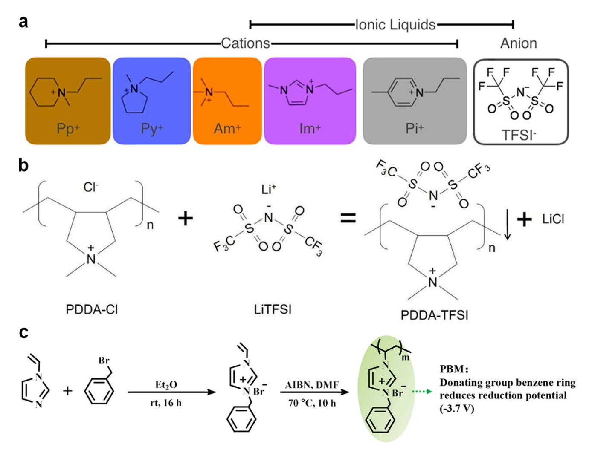

**Figure 17.** a), Chemical structure of various organic salts to fabricate polyionic liquid coating on Li metal surface. They are composed of TFSI- anion and various cations (Piperdinium (Pp+), Pyrrolidinium (Py+), Ammonium (Am+), Imidazolium (Im+), Pyridinium (Pi+)). Reproduced with permission.[\[205\]](#page-31-0) Copyright 2020, American Chemical Society. b), Schematic showing the anion exchange reaction between PDDA-Cl and LiTFSI to form the PDDA-TFSI. Reproduced with permission.[\[206\]](#page-31-0) Copyright 2021, Wiley VCH. c), Schematic showing the synthetic route of the poly(1-benzyl-3-vinylimidazolium) (PBM) ASEI. Reproduced with permission.[\[207\]](#page-31-0) Copyright 2022, Wiley VCH.

the 1,3,5-tris(4-aminophenyl)benzene (TAPB)- and terephthaldehyde (PDA)-based COF,[\[213\]](#page-31-0) the amino and aldehyde groupsbased COF (COF-LZU1),[\[214\]](#page-31-0) the hexacoordinate silicon- and anthracene-based COF,[\[215\]](#page-31-0) the Ni-bis(dithiolene)-based extended COF,[\[216\]](#page-31-0) and so on, have been used as ASEI to increase the Coulombic efficiency of Li metal plating/stripping processes. Apart from these, the preferential decomposition of the strongly bound Li-salts within COF can form the uniformly distributed LiF domains inside the COF film during the first cycle.[\[217\]](#page-31-0) Such kind of COF-LiF film can passivate the Li metal surface and provide a strong mechanical support for LMA, enhancing the cycling performance of LMBs effectively.

#### *4.2.4. Novel Methods to Produce Organic ASEI*

Molecular-layer deposition (MLD)[\[218\]](#page-31-0) and the initiated chemical vapor deposition (iCVD)[\[219\]](#page-31-0) are promising methods to fabricate high-performance organic ASEI on LMA. By using surfacelimited reactions to fabricate polymeric films, the molecularlayer deposition (MLD) technique has several advantages, such as design flexibility, adjustable electrical properties, and mild operation conditions. For example, an ultrathin polyurea film can be deposited on the surface of Li metal through the MLD method.[\[218\]](#page-31-0) Such kind of electrical insulating film can guide Li metal deposited beneath it. In addition, the nitrogen-containing lithiophilic groups in polyurea can also help homogenize the Li ion flux and lead to uniform Li metal deposition.

The initiated chemical vapor deposition (iCVD) technology, which has a rich library of functional monomers, is a solventfree polymerization method that can produce functional polymer nanolayers with precisely controlled thickness and well-retained chemical functionalities. Due to the solvent- and tension-free properties, the iCVD technology can form a uniform and defectfree film on a specific substrate. And further, the undesired side reactions and the accumulation of their decomposition products

will also be prevented. The ultrathin conformal zwitterionic polymeric interphases based on pyridine, imidazole, and ammonium monomers, which contain a vinyl or acrylate functional group, are effective in tuning the solvation environment of Li cation, boosting uniform Li metal deposition.[\[219\]](#page-31-0) In addition to the wellcontrolled thickness of the interphase, the high concentration of cationic and anionic groups in the zwitterionic polymer backbone can also assist the salt dissociation and ion conduction at the electrode/electrolyte interface.

#### **4.3. Free Standing Hybrid ASEI**

Resembling the natural SEI formed on LMA, many kinds of hybrid ASEI have been fabricated to enhance the cycling performance of LMA. For example, the poly(vinylidene-cohexafluoropropylene) (PVDF-HFP) polymer scaffold inlayed with Al2O3 particles,[\[220\]](#page-31-0) LiF particles,[\[221\]](#page-31-0) zirconia (ZrO2) particles;[\[222\]](#page-31-0) the LiCl-decorated lithiated Nafion film,[\[223\]](#page-31-0) the poly(vinylidene difluoride) (PVDF) reinforced by SiO2 particles[\[224\]](#page-31-0) and the LiIdecorated covalent triazine frameworks[\[225\]](#page-31-0) have demonstrated their success in enhancing the cycling performance of LMBs. Within these structures, the chemically and mechanically stable organic polymer acts as a stable buffer to relieve the accumulated stress during Li metal deposition. In the meantime, the insertion of inorganic components can increase the modulus of the composite polymer as well as increase the Li+ ion conductivity.

Although the SEI on LMA is composed of both inorganic components and organic components, the most inner part of SEI is still rich in inorganic components such as LiF, Li2O, Li2CO3, Li3N, and so on. As aforementioned, the ALD technology is capable of fabricating metal oxide films, while most of them are stiff and brittle. In the meantime, the MLD technology is capable of fabricating polymer coating, while its structure is always porous. Therefore, fabricating a bilayer of ASEI with a dense ALD inner layer (Al2O3) and a porous MLD outer layer (alucone) can fabricate an ASEI that mimic the natural SEI most.[\[226\]](#page-31-0) In addition, the roll-pressing of Li metal and polytetrafluoroethylene (PTFE) can also produce an ASEI with an inner LiF-rich and outer organic polymer (polyene and unsaturated fluoropolymer composite polymeric) structure.[\[227\]](#page-31-0)

# **5. Outlook**

If a battery is recognized as a person, the function of electrolyte for the battery is just like the function of blood for the human body. The transport property, interface reaction and stability, consumption rate of electrolyte is very important for the normal operation of battery, especially for LMBs, where the side reactions between Li metal and electrolyte is serious and the safety problems of dendritic Li plating is always the tiger in the road which restrain the practical application of LMBs. Although the combination of advanced electrolyte, porous current collector, high stress, and optimized temperature can extend the cycling life of LMBs to be *>*600 times,[\[228\]](#page-31-0) its safety is still of concern. Therefore, the development of nonflammable electrolytes, such as fundamentally nonflammable solvent, ILs-based electrolyte, and solid-state electrolyte (SSE) is the key to realize the safe operation of LMBs. Various techniques have been proven to be effective in enhancing the cycling and aging performance of high-energy LMBs. However, even today, achieving a commercially ready performance of LMBs, for example, with 80% capacity retention after 1000 cycles, has seldom been achieved in pouch- or cylindrical-type Li metal cells. In addition, the calendar aging performance of high-energy LMBs is also very important while is less explored. The corrosion and side reactions of lithium metal anode are highly correlated with the composition and structure of SEI, which will influence the aging performance of LMBs significantly. For commercialized LIBs, it can retain over 90% of its capacity under pressurefree conditions even after 10 months of OCV aging.[\[38\]](#page-27-0) For LMBs, although imposing high pressure can increase their capacity retention effectively, the calendar aging performance of LMBs under high SoC and practical scenes of applications (for example, with limited Li capacity at the anode and with low cell pressure) remains to be challenged. The traditional method of exploring high-performance liquid electrolyte for LMBs by simply picking up and then doing test may not be appropriate to shorten the time needed to achieve the commercialization of high-energy LMBs. Therefore, other methods should be incorporated to speed up the upcoming of high-energy LMBs. Currently, the most effective and promising method should be the use of artificial intelligence (AI) to accelerate the electrolyte design of LMBs, and this has also been widely recognized as AI for Science (AI4Science).[\[229\]](#page-31-0)

# **5.2. Energy Density**

The mass of electrolyte weighs 19 wt.% of the mass of the Li metal pouch cell. Generally, the amount of electrolyte in LIBs ranges from 2 to 3 g Ah−1. In practical LMBs, the side reactions between Li metal and liquid electrolyte are severe; thus the content of electrolyte should be slightly higher than that of LIBs. However, the high content of electrolyte will lower the energy density of LMBs, because it is inactive for the capacity supply of the battery. In addition to this, the wettability of liquid electrolyte toward the separator and both the anode and cathode electrodes, is also very important to maintain the normal operation of LMBs. Constructing ASEI on the surface of LMA can enhance the cycling performance of LMBs effectively, while it is also inactive for the capacity supply of the battery. In this regard, developing ASEI with a lightweight and thin structure is highly demanded for LMBs with high gravimetric energy density and volumetric energy density.

# **5.3. Safety**

The failures of the first generation of rechargeable LMBs due to safety issues make us alert to the practicability of LMBs before they are finally sent to consumers. Replacing liquid electrolyte with solid-state electrolyte is helpful to increase the safety of LMBs, while it is hard to fabricate a robust and thin solid-state electrolyte film, and this will significantly decrease the energy density of LMBs. Although the present review is focused on the electrolyte and interphase designs of high-energy LMBs based on liquid electrolyte, its content will also provide important guidance

for the design of a smooth interface between electrodes and electrolyte in solid-state LMBs. Most of the researchers thought that the formation of Li dendrite would pierce through the polymer separator of LMBs directly, thus incurring the safety hazard. Such kind of thought may be simple and cannot be utilized to forecast the safety of LMBs. Because in most circumstances, the formation of Li dendrites will not incur the sudden short-circuiting of LMBs. In fact, the formation of Li dendrites will incur more pronounced side reactions in LMBs, including the formation of dead Li and the thick byproduct layer, such reactions should be the reason for the short-circuit of LMBs. Therefore, the core to mitigate the safety issue of LMBs is to form a uniform and dense Li metal deposition layer, reducing the side reaction between Li metal and liquid electrolyte, and using a non-flammable liquid electrolyte. The utilization of an advanced electrolyte system and ASEI can boost the formation of uniform and dense Li metal deposition. Generally, the fluorine-rich electrolyte has low reaction activity toward Li metal, which is helpful to increase the safety of LMBs. The phosphorus-containing solvent can capture the active protons coming from the thermal decomposition of the carbonate solvent, which might increase the thermal limit to initiate the safety hazard of LMBs effectively.

# **Acknowledgements**

B.H.L would like to acknowledge the support from the National Natural Science Foundation of China (No. 52261160384, 51872157, and 52072208), and G.H. Chen acknowledges the financial support from the National Natural Science Foundation of China and Research Grants Council of Hong Kong joint research program (N\_CityU549/22).

# **Conflict of Interest**

The authors declare no conflict of interest.

# **Keywords**

causal relationship, electrochemical, electrolyte, interphase, Li plating /stripping

> Received: April 20, 2025 Revised: June 16, 2025 Published online: July 29, 2025

- [1] M. S. Whittingham, *Science* **1976**, *192*, 1126.
- [2] N. Pereira, G. G. Amatucci, M. S. Whittingham, R. Hamlen, *J. Power Sources* **2015**, *280*, 18.
- [3] M. S. Whittingham, *Prog. Solid State Chem.* **1978**, *12*, 41.
- [4] M. Winter, B. Barnett, K. Xu, *Chem. Rev.* **2018**, *118*, 11433.
- [5] J. J. Auborn, Y. L. Barberio, *J. Electrochem. Soc.* **1987**, *134*, 638.
- [6] a) R. Fong, U. von Sacken, J. R. Dahn, *J. Electrochem. Soc.* **1990**, *137*, 2009; b) J. R. Dahn, U. von Sacken, M. W. Juzkow, H. Al-Janaby, *J. Electrochem. Soc.* **1991**, *138*, 2207.
- [7] M. D. Tikekar, S. Choudhury, Z. Tu, L. A. Archer, *Nat. Energy* **2016**, *1*, 1.
- [8] G. Z. Yuliy, D. Gamburg, *Theory and Practice of Metal Electrodeposition*, Springer, Berlin **2011**.

- [9] a) C. Yan, H. R. Li, X. Chen, X. Q. Zhang, X. B. Cheng, R. Xu, J. Q. Huang, Q. Zhang, *J. Am. Chem. Soc.* **2019**, *141*, 9422; b) Y. Xia, P. Zhou, X. Kong, J. Tian, W. Zhang, S. Yan, W.-h. Hou, H.-Y. Zhou, H. Dong, X. Chen, P. Wang, Z. Xu, L. Wan, B. Wang, K. Liu, *Nat. Energy* **2023**, *8*, 934; c) S. C. Kim, J. Wang, R. Xu, P. Zhang, Y. Chen, Z. Huang, Y. Yang, Z. Yu, S. T. Oyakhire, W. Zhang, L. C. Greenburg, M. S. Kim, D. T. Boyle, P. Sayavong, Y. Ye, J. Qin, Z. Bao, Y. Cui, *Nat. Energy* **2023**, *8*, 814; d) Q. Wang, C. Zhao, J. Wang, Z. Yao, S. Wang, S. G. H. Kumar, S. Ganapathy, S. Eustace, X. Bai, B. Li, M. Wagemaker, *Nat. Commun.* **2023**, *14*, 440; e) B. Ma, H. Zhang, R. Li, S. Zhang, L. Chen, T. Zhou, J. Wang, R. Zhang, S. Ding, X. Xiao, T. Deng, L. Chen, X. Fan, *Nat. Chem.* **2024**, *16*, 1427.
- [10] J. T. Frith, M. J. Lacey, U. Ulissi, *Nat. Commun.* **2023**, *14*, 420.
- [11] E. Peled, *J. Electrochem. Soc.* **1979**, *126*, 2047.
- [12] D. Aurbach, *J. Power Sources* **2000**, *89*, 206.
- [13] E. Peled, D. Golodnitsky, G. Ardel, *J. Electrochem. Soc.* **1997**, *144*, L208.
- [14] H. Wu, H. Jia, C. Wang, J.-G. Zhang, W. Xu, *Adv. Energy Mater.* **2021**, *11*, 2003092.
- [15] M. He, R. Guo, G. M. Hobold, H. Gao, B. M. Gallant, *Proc. Natl. Acad. Sci* **2020**, *117*, 73.
- [16] C.-T. Yang, Y. Qi, *Chem. Mater.* **2021**, *33*, 2814.
- [17] S. Shi, Y. Qi, H. Li, L. G. Hector, *J. Phys. Chem. C* **2013**, *117*, 8579.
- [18] Y. Liu, X. Xu, O. O. Kapitanova, P. V. Evdokimov, Z. Song, A. Matic, S. Xiong, *Adv. Energy Mater.* **2022**, *12*, 2103589.
- [19] U. v. Alpen, A. Rabenau, G. H. Talat, *Appl. Phys. Lett.* **1977**, *30*, 621.
- [20] a) X. Fan, L. Chen, X. Ji, T. Deng, S. Hou, J. Chen, J. Zheng, F. Wang, J. Jiang, K. Xu, C. Wang, *Chem* **2018**, *4*, 174; b) L. Suo, W. Xue, M. Gobet, G. Greenbaum Steve, C. Wang, Y. Chen, W. Yang, Y. Li, J. Li, *Proc. Natl. Acad. Sci.* **2018**, *115*, 1156.
- [21] W. Chang, J. H. Park, D. A. Steingart, *Nano Lett.* **2018**, *18*, 7066.
- [22] D. Lin, Y. Liu, W. Chen, G. Zhou, K. Liu, B. Dunn, Y. Cui, *Nano Lett.* **2017**, *17*, 3731.
- [23] L. Chen, K.-S. Chen, X. Chen, G. Ramirez, Z. Huang, N. R. Geise, H.-G. Steinrück, B. L. Fisher, R. Shahbazian-Yassar, M. F. Toney, M. C. Hersam, J. W. Elam, *ACS Appl. Mater. Interfaces* **2018**, *10*, 26972.
- [24] L. Fan, H. L. Zhuang, L. Gao, Y. Lu, L. A. Archer, *J. Mater. Chem. A* **2017**, *5*, 3483.
- [25] R. Guo, B. M. Gallant, *Chem. Mater.* **2020**, *32*, 5525.
- [26] W. Huang, H. Wang, D. T. Boyle, Y. Li, Y. Cui, *ACS Energy Lett.* **2020**, *5*, 1128.
- [27] A. Sharafi, E. Kazyak, A. L. Davis, S. Yu, T. Thompson, D. J. Siegel, N. P. Dasgupta, J. Sakamoto, *Chem. Mater.* **2017**, *29*, 7961.
- [28] F. Shi, A. Pei, D. T. Boyle, J. Xie, X. Yu, X. Zhang, Y. Cui, *Proc. Natl. Acad. Sci* **2018**, *115*, 8529.
- [29] Q. Zhang, J. Pan, P. Lu, Z. Liu, M. W. Verbrugge, B. W. Sheldon, Y.-T. Cheng, Y. Qi, X. Xiao, *Nano Lett.* **2016**, *16*.
- [30] A. Ramasubramanian, V. Yurkiv, T. Foroozan, M. Ragone, R. Shahbazian-Yassar, F. Mashayek, *J. Phys. Chem. C* **2019**, *123*, 10237.
- [31] W.-W. Wang, Y. Gu, H. Yan, S. Li, J.-W. He, H.-Y. Xu, Q.-H. Wu, J.-W. Yan, B.-W. Mao, *Chem* **2020**, *6*, 2728.
- [32] X. Shen, R. Zhang, X. Chen, X.-B. Cheng, X. Li, Q. Zhang, *Adv. Energy Mater.* **2020**, *10*, 1903645.
- [33] K. Xu, G. V. Zhuang, J. L. Allen, U. Lee, S. S. Zhang, P. N. Ross, T. R. Jow, *J. Phys. Chem. B* **2006**, *110*, 7708.
- [34] D. T. Boyle, W. Huang, H. Wang, Y. Li, H. Chen, Z. Yu, W. Zhang, Z. Bao, Y. Cui, *Nat. Energy* **2021**, *6*, 487.
- [35] W. Huang, P. M. Attia, H. Wang, S. E. Renfrew, N. Jin, S. Das, Z. Zhang, D. T. Boyle, Y. Li, M. Z. Bazant, B. D. McCloskey, W. C. Chueh, Y. Cui, *Nano Lett.* **2019**, *19*, 5140.
- [36] Z. Zhang, Y. Li, R. Xu, W. Zhou, Y. Li, S. T. Oyakhire, Y. Wu, J. Xu, H. Wang, Z. Yu, D. T. Boyle, W. Huang, Y. Ye, H. Chen, J. Wan, Z. Bao, W. Chiu, Y. Cui, *Science* **2022**, *375*, 66.
- [37] K. Lim, B. Fenk, J. Popovic, J. Maier, *ACS Appl. Mater. Interfaces* **2021**, *13*, 51767.

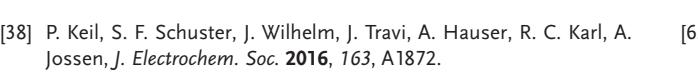

- [39] D. Lin, Y. Liu, Y. Li, Y. Li, A. Pei, J. Xie, W. Huang, Y. Cui, *Nat. Chem.* **2019**, *11*, 382.
- [40] A. Kolesnikov, M. Kolek, J. F. Dohmann, F. Horsthemke, M. Börner, P. Bieker, M. Winter, M. C. Stan, *Adv. Energy Mater.* **2020**, *10*, 2000017.
- [41] B. Kwon, J. Lee, H. Kim, D.-M. Kim, K. Park, S. Jo, K. T. Lee, *J. Mater. Chem. A* **2021**, *9*, 24993.
- [42] a) J. Betz, J.-P. Brinkmann, R. Nölle, C. Lürenbaum, M. Kolek, M. C. Stan, M. Winter, T. Placke, *Adv. Energy Mater.* **2019**, *9*, 1900574; b) A. J. Louli, A. Eldesoky, J. deGooyer, M. Coon, C. P. Aiken, Z. Simunovic, M. Metzger, J. R. Dahn, *J. Electrochem. Soc.* **2022**, *169*, 040517.
- [43] J. Langdon, A. Manthiram, *Adv. Funct. Mater.* **2021**, *31*, 2010267.
- [44] X. Cao, Y. Xu, L. Zou, J. Bao, Y. Chen, B. E. Matthews, J. Hu, X. He, M. H. Engelhard, C. Niu, B. W. Arey, C. Wang, J. Xiao, J. Liu, C. Wang, W. Xu, J.-G. Zhang, *Energy Environ. Sci.* **2023**, *15*, 1548.
- [45] F. M. Weber, I. Kohlhaas, E. Figgemeier, *J. Electrochem. Soc.* **2020**, *167*, 140523.
- [46] L. C. Merrill, S. G. Rosenberg, K. L. Jungjohann, K. L. Harrison, *ACS Appl. Energy Mater.* **2021**, *4*, 7589.
- [47] a) Y. Gao, T. Rojas, K. Wang, S. Liu, D. Wang, T. Chen, H. Wang, A. T. Ngo, D. Wang, *Nat. Energy* **2020**, *5*, 534; b) Z. Wen, W. Fang, L. Chen, Z. Guo, N. Zhang, X. Liu, G. Chen, *Adv. Funct. Mater.* **2021**, *31*, 2104930.
- [48] S. Kim, P. Barnes, H. Zhang, C. Efaw, Y. Wang, B. Park, B. Li, B.- R. Chen, M. C. Evans, B. Liaw, D. Olds, P. G. Khalifah, E. J. Dufek, *Energy Storage Mater.* **2024**, *65*, 103147.
- [49] S. Zhang, G. Yang, S. Liu, X. Li, X. Wang, Z. Wang, L. Chen, *Nano Energy* **2020**, *70*, 104486.
- [50] D. Lu, Y. Shao, T. Lozano, W. D. Bennett, G. L. Graff, B. Polzin, J. Zhang, M. H. Engelhard, N. T. Saenz, W. A. Henderson, P. Bhattacharya, J. Liu, J. Xiao, *Adv. Energy Mater.* **2015**, *5*, 1400993.
- [51] C.-J. Huang, B. Thirumalraj, H.-C. Tao, K. N. Shitaw, H. Sutiono, T. T. Hagos, T. T. Beyene, L.-M. Kuo, C.-C. Wang, S.-H. Wu, W.-N. Su, B. J. Hwang, *Nat. Commun.* **2021**, *12*, 1452.
- [52] Y. Q. Qisheng Wu, *Energy Environ. Sci.* **2025**, *18*, 3036.
- [53] C. M. Efaw, Q. Wu, N. Gao, Y. Zhang, H. Zhu, K. Gering, M. F. Hurley, H. Xiong, E. Hu, X. Cao, W. Xu, J.-G. Zhang, E. J. Dufek, J. Xiao, X.-Q. Yang, J. Liu, Y. Qi, B. Li, *Nat. Mater.* **2023**, *22*, 1531.
- [54] Y. Xiao, B. Han, Y. Zeng, S.-S. Chi, X. Zeng, Z. Zheng, K. Xu, Y. Deng, *Adv. Energy Mater.* **2020**, *10*, 1903937.
- [55] *Electrolytes for Lithium and Lithium-Ion Batteries*, Vol. *58*, (Eds.: T. R. Jow, K. Xu, O. Borodin, M. Ue) Springer, Berlin **2014**.
- [56] Y. Lu, Q. Cao, W. Zhang, T. Zeng, Y. Ou, S. Yan, H. Liu, X. Song, H. Zhou, W. Hou, P. Zhou, N. Hu, Q. Feng, Y. Li, K. Liu, *Nat. Energy* **2025**, *10*, 427.
- [57] L. Qiao, U. Oteo, M. Martinez-IbaClez, A. Santiago, R.-a. Cid, E. Sanchez-Diez, E. Lobato, L. Meabe, M. Armand, H. Zhang, *Nat. Mater.* **2022**, *21*, 455.
- [58] K. Xu, *Chem. Rev.* **2004**, *104*, 4303.
- [59] K. Kanamura, T. Umegaki, S. Shiraishi, M. Ohashi, Z.-i. Takehara, *J. Electrochem. Soc.* **2002**, *149*, A185.
- [60] H. Xiang, P. Shi, P. Bhattacharya, X. Chen, D. Mei, M. E. Bowden, J. Zheng, J.-G. Zhang, W. Xu, *J. Power Sources* **2016**, *318*, 170.
- [61] J. Zheng, M. H. Engelhard, D. Mei, S. Jiao, B. J. Polzin, J.-G. Zhang, W. Xu, *Nat. Energy* **2017**, *2*, 17012.
- [62] H.-H. Sun, A. Dolocan, J. A. Weeks, R. Rodriguez, A. Heller, C. B. Mullins, *J. Mater. Chem. A* **2019**, *7*, 17782.
- [63] R. Weber, M. Genovese, A. J. Louli, S. Hames, C. Martin, I. G. Hill, J. R. Dahn, *Nat. Energy* **2019**, *4*, 683.
- [64] A. J. Louli, A. Eldesoky, R. Weber, M. Genovese, M. Coon, J. deGooyer, Z. Deng, R. T. White, J. Lee, T. Rodgers, R. Petibon, S. Hy, S. J. H. Cheng, J. R. Dahn, *Nat. Energy* **2020**, *5*, 693.

- [65] H. Zheng, H. Xiang, F. Jiang, Y. Liu, Y. Sun, X. Liang, Y. Feng, Y. Yu, *Adv. Energy Mater.* **2020**, *10*, 2001440.
- [66] X. Lin, J. Yu, M. B. Effat, G. Zhou, M. J. Robson, S. C. T. Kwok, H. Li, S. Zhan, Y. Shang, F. Ciucci, *Adv. Funct. Mater.* **2021**, *31*, 2010261.
- [67] J. Yu, J. Liu, X. Lin, H. M. Law, G. Zhou, S. C. T. Kwok, M. J. Robson, J. Wu, F. Ciucci, *Energy Storage Mater.* **2021**, *37*, 609.
- [68] Y.-H. Lin, R. Subramani, Y.-T. Huang, Y.-L. Lee, J.-S. Jan, C.-C. Chiu, S.-S. Hou, H. Teng, *J. Mater. Chem. A* **2021**, *9*, 5675.
- [69] Y.-S. Kuo, J.-Y. Hong, W.-L. Chou, Y.-H. Liu, *J. Mater. Chem. A* **2025**, *13*, 7302.
- [70] Z. An, W. Li, Q. Pei, Y. Tong, C. Liu, Q. Zhang, S. Xie, J. Chen, *Adv. Mater. Technol.* **2024**, *9*, 2302168.
- [71] Z. Li, Z. Li, R. Yu, X. Guo, *J. Energy Chem.* **2024**, *96*, 456.
- [72] O. Borodin, J. Self, K. A. Persson, C. Wang, K. Xu, *Joule* **2020**, *4*, 69.
- [73] L. Suo, Y.-S. Hu, H. Li, M. Armand, L. Chen, *Nat. Commun.* **2013**, *4*, 1481.
- [74] J. Qian, W. A. Henderson, W. Xu, P. Bhattacharya, M. Engelhard, O. Borodin, J. G. Zhang, *Nat. Commun.* **2015**, *6*, 6362.
- [75] J. Qian, B. D. Adams, J. Zheng, W. Xu, W. A. Henderson, J. Wang, M. E. Bowden, S. Xu, J. Hu, J.-G. Zhang, *Adv. Funct. Mater.* **2016**, *26*, 7094.
- [76] S.-J. Cho, D.-E. Yu, T. P. Pollard, H. Moon, M. Jang, O. Borodin, S.-Y. Lee, *iScience* **2020**, *23*, 100844.
- [77] S. Jiao, X. Ren, R. Cao, M. H. Engelhard, Y. Liu, D. Hu, D. Mei, J. Zheng, W. Zhao, Q. Li, N. Liu, B. D. Adams, C. Ma, J. Liu, J.-G. Zhang, W. Xu, *Nat. Energy* **2018**, *3*, 739.
- [78] J. Alvarado, M. A. Schroeder, T. P. Pollard, X. Wang, J. Z. Lee, M. Zhang, T. Wynn, M. Ding, O. Borodin, Y. S. Meng, K. Xu, *Energy Environ. Sci.* **2019**, *12*, 780.
- [79] F. Qiu, X. Li, H. Deng, D. Wang, X. Mu, P. He, H. Zhou, *Adv. Energy Mater.* **2019**, *9*, 1803372.
- [80] T. D. Pham, A. Bin Faheem, S. Y. Chun, J.-R. Rho, K. Kwak, K.-K. Lee, *Adv. Energy Mater.* **2021**, *11*, 2003520.
- [81] H. Han, J. Guo, D. Zhang, S. Feng, W. Feng, J. Nie, Z. Zhou, *Electrochem. Commun.* **2011**, *13*, 265.
- [82] a) X. Ren, L. Zou, X. Cao, M. H. Engelhard, W. Liu, S. D. Burton, H. Lee, C. Niu, B. E. Matthews, Z. Zhu, C. Wang, B. W. Arey, J. Xiao, J. Liu, J.-G. Zhang, W. Xu, *Joule* **2019**, *3*, 1662; b) X. Ren, S. Chen, H. Lee, D. Mei, M. H. Engelhard, S. D. Burton, W. Zhao, J. Zheng, Q. Li, M. S. Ding, M. Schroeder, J. Alvarado, K. Xu, Y. S. Meng, J. Liu, J.-G. Zhang, W. Xu, *Chem* **2018**, *4*, 1877; c) N. Azimi, Z. Xue, N. D. Rago, C. Takoudis, M. L. Gordin, J. Song, D. Wang, Z. Zhang, *J. Electrochem. Soc.* **2014**, *162*, A64.
- [83] S. Chen, J. Zheng, D. Mei, K. S. Han, M. H. Engelhard, W. Zhao, W. Xu, J. Liu, J.-G. Zhang, *Adv. Mater.* **2018**, *30*, 1706102.
- [84] a) X. Fan, L. Chen, O. Borodin, X. Ji, J. Chen, S. Hou, T. Deng, J. Zheng, C. Yang, S.-C. Liou, K. Amine, K. Xu, C. Wang, *Nat. Nanotechnol.* **2018**, *13*, 715; b) X. Fan, X. Ji, L. Chen, J. Chen, T. Deng, F. Han, J. Yue, N. Piao, R. Wang, X. Zhou, X. Xiao, L. Chen, C. Wang, *Nat. Energy* **2019**, *4*, 882.
- [85] J. Holoubek, M. Yu, S. Yu, M. Li, Z. Wu, D. Xia, P. Bhaladhare, M. S. Gonzalez, T. A. Pascal, P. Liu, Z. Chen, *ACS Energy Lett.* **2020**, *5*, 1438.
- [86] X. Cao, X. Ren, L. Zou, M. H. Engelhard, W. Huang, H. Wang, B. E. Matthews, H. Lee, C. Niu, B. W. Arey, Y. Cui, C. Wang, J. Xiao, J. Liu, W. Xu, J.-G. Zhang, *Nat. Energy* **2019**, *4*, 796.
- [87] D.-J. Yoo, S. Yang, K. J. Kim, J. W. Choi, *Angew. Chem., Int. Ed.* **2020**, *59*, 14869.
- [88] C. V. Amanchukwu, Z. Yu, X. Kong, J. Qin, Y. Cui, Z. Bao, *J. Am. Chem. Soc.* **2020**, *142*, 7393.
- [89] Z. Yu, H. Wang, X. Kong, W. Huang, Y. Tsao, D. G. Mackanic, K. Wang, X. Wang, W. Huang, S. Choudhury, Y. Zheng, C. V. Amanchukwu, S. T. Hung, Y. Ma, E. G. Lomeli, J. Qin, Y. Cui, Z. Bao, *Nat. Energy* **2020**, *5*, 526.

- [90] Z. Yu, P. E. Rudnicki, Z. Zhang, Z. Huang, H. Celik, S. T. Oyakhire, Y. Chen, X. Kong, S. C. Kim, X. Xiao, H. Wang, Y. Zheng, G. A. Kamat, M. S. Kim, S. F. Bent, J. Qin, Y. Cui, Z. Bao, *Nat. Energy* **2022**, *7*, 94.
- [91] E. Zhang, Y. Chen, J. Holoubek, Z. Yu, W. Zhang, H. Lyu, I. R. Choi, S. C. Kim, C. Serrao, Y. Cui, Z. Bao, *Proc. Natl. Acad. Sci* **2025**, *122*, 2418623122.
- [92] W. Xue, Z. Shi, M. Huang, S. Feng, C. Wang, F. Wang, J. Lopez, B. Qiao, G. Xu, W. Zhang, Y. Dong, R. Gao, Y. Shao-Horn, J. A. Johnson, J. Li, *Energy Environ. Sci.* **2020**, *13*, 212.
- [93] W. Xue, M. Huang, Y. Li, Y. G. Zhu, R. Gao, X. Xiao, W. Zhang, S. Li, G. Xu, Y. Yu, P. Li, J. Lopez, D. Yu, Y. Dong, W. Fan, Z. Shi, R. Xiong, C.-J. Sun, I. Hwang, W.-K. Lee, Y. Shao-Horn, J. A. Johnson, J. Li, *Nat. Energy* **2021**, *6*, 495.
- [94] Y. Yin, Y. Yang, D. Cheng, M. Mayer, J. Holoubek, W. Li, G. Raghavendran, A. Liu, B. Lu, D. M. Davies, Z. Chen, O. Borodin, Y. S. Meng, *Nat. Energy* **2022**, *7*, 548.
- [95] a) E. Markevich, G. Salitra, F. Chesneau, M. Schmidt, D. Aurbach, *ACS Energy Lett.* **2017**, *2*, 1321; b) X.-Q. Zhang, X.-B. Cheng, X. Chen, C. Yan, Q. Zhang, *Adv. Funct. Mater.* **2017**, *27*, 1605989.
- [96] J. Guo, Z. Wen, M. Wu, J. Jin, Y. Liu, *Electrochem. Commun.* **2015**, *51*, 59.
- [97] N. Azimi, W. Weng, C. Takoudis, Z. Zhang, *Electrochem. Commun.* **2013**, *37*, 96.
- [98] K. Hirata, T. Kawase, Y. Sumida, *J. Electrochem. Soc.* **2020**, *167*, 140534.
- [99] Y. Jie, X. Liu, Z. Lei, S. Wang, Y. Chen, F. Huang, R. Cao, G. Zhang, S. Jiao, *Angew. Chem., Int. Ed.* **2020**, *59*, 3505.
- [100] S. A. Campbell, C. Bowes, R. S. McMillan, *J. Electroanal. Chem.& Interfacial Electrochem.* **1990**, *284*, 195.
- [101] R. Xu, J.-F. Ding, X.-X. Ma, C. Yan, Y.-X. Yao, J.-Q. Huang, *Adv. Mater.* **2021**, *33*, 2105962.
- [102] C.-C. Su, M. He, R. Amine, Z. Chen, R. Sahore, N. Dietz Rago, K. Amine, *Energy Storage Mater.* **2019**, *17*, 284.
- [103] S. Gu, Y. Zhang, M. Li, Q. Lin, G. Xu, N. Zhang, *Angew. Chem., Int. Ed.* **2025**, *64*, 202410020.
- [104] S. S. Zhang, *Electrochim. Acta* **2012**, *70*, 344.
- [105] S. Rustomji Cyrus, Y. Yang, K. Kim Tae, J. Mac, J. K. Young, E. Caldwell, H. Chung, Y. S. Meng, *Science* **2017**, *356*, aal4263.
- [106] Y. Yang, Y. Yin, D. M. Davies, M. Zhang, M. Mayer, Y. Zhang, E. S. Sablina, S. Wang, J. Z. Lee, O. Borodin, C. S. Rustomji, Y. S. Meng, *Energy Environ. Sci.* **2020**, *13*, 2209.
- [107] B. A. Jote, T. T. Beyene, N. A. Sahalie, M. A. Weret, B. W. Olbassa, Z. T. Wondimkun, G. B. Berhe, C.-J. Huang, W.-N. Su, B. J. Hwang, *J.Power Sources* **2020**, *461*, 228102.
- [108] S.-J. Park, J.-Y. Hwang, C. S. Yoon, H.-G. Jung, Y.-K. Sun, *ACS Appl. Mater. Interfaces* **2018**, *10*, 17985.
- [109] J. Chen, H. Yang, X. Zhang, J. Lei, H. Zhang, H. Yuan, J. Yang, Y. Nuli, J. Wang, *ACS Appl. Mater. Interfaces* **2019**, *11*, 33419.
- [110] S. Wu, X. Liu, Z. Hao, X. Sun, J. Hou, L. Shang, L. Wang, K. Zhang, H. Li, Z. Yan, J. Chen, *J. Am. Chem. Soc.* **2024**, *146*, 28770.
- [111] S. Liu, X. Ji, N. Piao, J. Chen, N. Eidson, J. Xu, P. Wang, L. Chen, J. Zhang, T. Deng, S. Hou, T. Jin, H. Wan, J. Li, J. Tu, C. Wang, *Angew. Chem., Int. Ed.* **2021**, *60*, 3661.
- [112] J. Chen, D. Zhang, L. Zhu, M. Liu, T. Zheng, J. Xu, J. Li, F. Wang, Y. Wang, X. Dong, Y. Xia, *Nat. Commun.* **2024**, *15*, 3217.
- [113] Z. Jin, Y. Liu, H. Xu, T. Chen, C. Wang, *Angew. Chem., Int. Ed.* **2024**, *63*, 202318197.
- [114] Y. Wang, C. Zheng, W. Xie, X. Liu, Y. Lu, Y. Hou, T. Ma, Z. Yan, J. Chen, *Adv. Mater.* **2024**, *36*, 2312302.
- [115] Q. J. Meisner, T. Rojas, N. L. Dietz Rago, J. Cao, J. Bareño, T. Glossmann, A. Hintennach, P. C. Redfern, D. Pahls, L. Zhang, I. D. Bloom, A. T. Ngo, L. A. Curtiss, Z. Zhang, *J. Power Sources* **2019**, *438*, 226939.
- [116] H. Moon, T. Mandai, R. Tatara, K. Ueno, A. Yamazaki, K. Yoshida, S. Seki, K. Dokko, M. Watanabe, *J. Phys. Chem. C* **2015**, *119*, 3957.

- [117] X. Ren, X. Zhang, Z. Shadike, L. Zou, H. Jia, X. Cao, M. H. Engelhard, B. E. Matthews, C. Wang, B. W. Arey, X.-Q. Yang, J. Liu, J.-G. Zhang, W. Xu, *Adv. Mater.* **2020**, *32*, 2004898.
- [118] N. Piao, X. Ji, H. Xu, X. Fan, L. Chen, S. Liu, M. N. Garaga, S. G. Greenbaum, L. Wang, C. Wang, X. He, *Adv. Energy Mater.* **2020**, *10*, 1903568.
- [119] X. Cao, L. Zou, B. E. Matthews, L. Zhang, X. He, X. Ren, M. H. Engelhard, S. D. Burton, P. Z. El-Khoury, H.-S. Lim, C. Niu, H. Lee, C. Wang, B. W. Arey, C. Wang, J. Xiao, J. Liu, W. Xu, J.-G. Zhang, *Energy Storage Mater.* **2021**, *34*, 76.
- [120] N.-S. Choi, K. H. Yew, K. Y. Lee, M. Sung, H. Kim, S.-S. Kim, *J. Power Sources* **2006**, *161*, 1254.
- [121] I. A. Shkrob, J. F. Wishart, D. P. Abraham, *J. Phys. Chem. C* **2015**, *119*, 14954.
- [122] C.-C. Su, M. He, J. Shi, R. Amine, J. Zhang, K. Amine, *Angew. Chem., Int. Ed.* **2020**, *59*, 18229.
- [123] T. T. Hagos, B. Thirumalraj, C.-J. Huang, L. H. Abrha, T. M. Hagos, G. B. Berhe, H. K. Bezabh, J. Cherng, S.-F. Chiu, W.-N. Su, B.-J. Hwang, *ACS Appl. Mater. Interfaces* **2019**, *11*, 9955.
- [124] H. Guo, Y. Tian, Y. Liu, Y. Bai, J. Wu, F. Kang, B. Li, *ACS Appl. Mater. Interfaces* **2023**, *15*, 1201.
- [125] Y. Yang, D. M. Davies, Y. Yin, O. Borodin, J. Z. Lee, C. Fang, M. Olguin, Y. Zhang, E. S. Sablina, X. Wang, C. S. Rustomji, Y. S. Meng, *Joule* **2019**, *3*, 1986.
- [126] B. D. Adams, E. V. Carino, J. G. Connell, K. S. Han, R. Cao, J. Chen, J. Zheng, Q. Li, K. T. Mueller, W. A. Henderson, J.-G. Zhang, *Nano Energy* **2017**, *40*, 607.
- [127] C. Yan, Y. X. Yao, X. Chen, X. B. Cheng, X. Q. Zhang, J. Q. Huang, Q. Zhang, *Angew. Chem. Int. Ed. Engl.* **2018**, *57*, 14055.
- [128] Q. Wang, C. Yang, J. Yang, K. Wu, C. Hu, J. Lu, W. Liu, X. Sun, J. Qiu, H. Zhou, *Adv. Mater.* **2019**, *31*, 1903248.
- [129] S. Shiraishi, K. Kanamura, Z. i. Takehara, *J. Electrochem. Soc.* **1999**, *146*, 1633.
- [130] H. Dai, K. Xi, X. Liu, C. Lai, S. Zhang, *J. Am. Chem. Soc.* **2018**, *140*, 17515.
- [131] S. H. Lee, J.-Y. Hwang, J. Ming, Z. Cao, H. A. Nguyen, H.-G. Jung, J. Kim, Y.-K. Sun, *Adv. Energy Mater.* **2020**, *10*, 2000567.
- [132] R. Zhao, X. Li, Y. Si, S. Tang, W. Guo, Y. Fu, *Energy Storage Mater.* **2021**, *37*, 1.
- [133] W. Zhang, Q. Wu, J. Huang, L. Fan, Z. Shen, Y. He, Q. Feng, G. Zhu, Y. Lu, *Adv. Mater.* **2020**, *32*, 2001740.
- [134] H. Ye, Y.-X. Yin, S.-F. Zhang, Y. Shi, L. Liu, X.-X. Zeng, R. Wen, Y.-G. Guo, L.-J. Wan, *Nano Energy* **2017**, *36*, 411.
- [135] Q. Zhao, Z. Tu, S. Wei, K. Zhang, S. Choudhury, X. Liu, L. A. Archer, *Angew. Chem., Int. Ed.* **2018**, *57*, 992.
- [136] X. Fu, G. Wang, D. Dang, Q. Liu, X. Xiong, C. Wu, *J. Mater. Chem. A* **2019**, *7*, 25003.
- [137] W. Zhang, Z. Shen, S. Li, L. Fan, X. Wang, F. Chen, X. Zang, T. Wu, F. Ma, Y. Lu, *Adv. Funct. Mater.* **2020**, *30*, 2003800.
- [138] X. Shen, H. Ji, J. Liu, J. Zhou, C. Yan, T. Qian, *Energy Storage Mater.* **2020**, *24*, 426.
- [139] Y. Leng, S. Ge, R. S. Longchamps, X.-G. Yang, T. Liu, C.-Y. Wang, *J. Electrochem. Soc.* **2020**, *167*, 110543.
- [140] Q. Ma, X. Zhang, A. Wang, Y. Xia, X. Liu, J. Luo, *Adv. Funct. Mater.* **2020**, *30*, 2002824.
- [141] J. Dong, H. Dai, Q. Fan, C. Lai, S. Zhang, *Nano Energy* **2019**, *66*, 104128.
- [142] S. K. Heiskanen, B. L. Lucht, *J. Electrochem. Soc.* **2020**, *167*, 110506.
- [143] F. Ding, W. Xu, G. L. Graff, J. Zhang, M. L. Sushko, X. Chen, Y. Shao, M. H. Engelhard, Z. Nie, J. Xiao, X. Liu, P. V. Sushko, J. Liu, J. G. Zhang, *J. Am. Chem. Soc.* **2013**, *135*, 4450.
- [144] J.-Y. Wei, X.-Q. Zhang, L.-P. Hou, P. Shi, B.-Q. Li, Y. Xiao, C. Yan, H. Yuan, J.-Q. Huang, *Adv. Mater.* **2020**, *32*, 2003012.
- [145] a) G. Zheng, Y. Xiang, S. Chen, S. Ganapathy, T. W. Verhallen, M. Liu, G. Zhong, J. Zhu, X. Han, W. Wang, W. Zhao, M. Wagemaker, Y.

Yang, *Energy Storage Mater.* **2020**, *29*, 377; b) S. Tan, Z. Shadike, J. Li, X. Wang, Y. Yang, R. Lin, A. Cresce, J. Hu, A. Hunt, I. Waluyo, L. Ma, F. Monaco, P. Cloetens, J. Xiao, Y. Liu, X.-Q. Yang, K. Xu, E. Hu, *Nat. Energy* **2022**, *7*, 484.

- [146] F. Li, J. He, J. Liu, M. Wu, Y. Hou, H. Wang, S. Qi, Q. Liu, J. Hu, J. Ma, *Angew. Chem., Int. Ed.* **2021**, *60*, 6600.
- [147] H. Yue, Y. Yang, Y. Xiao, Z. Dong, S. Cheng, Y. Yin, C. Ling, W. Yang, Y. Yu, S. Yang, *J. Mater. Chem. A* **2019**, *7*, 594.
- [148] J. Huang, Y. Li, J. Liu, Q. Liu, A. N. Alodhayb, J. Ma, *Adv. Funct. Mater.* **2024**, *34*, 2406215.
- [149] K. Ryu, K. Lee, J. Lim, M. J. Lee, K.-H. Kim, U. H. Lee, B. L. D. Rinkel, K. Kim, S. Kim, D. Kim, D. Shin, B. McCloskey, J. Kang, S. W. Lee, *Energy Environ. Sci.* **2024**, *17*, 7772.
- [150] F. Li, J. Liu, H. Wang, Y. Ren, X. Tang, G. Li, *ACS Energy Lett.* **2025**, *10*, 779.
- [151] D. Aurbach, E. Pollak, R. Elazari, G. Salitra, C. S. Kelley, J. Affinito, *J. Electrochem. Soc.* **2009**, *156*, A694.
- [152] R. Rodriguez, R. A. Edison, R. M. Stephens, H.-H. Sun, A. Heller, C. B. Mullins, *J. Mater. Chem. A* **2020**, *8*, 3999.
- [153] Q. Zhao, X. Liu, J. Zheng, Y. Deng, A. Warren, Q. Zhang, L. Archer, *Proc. Natl. Acad. Sci* **2020**, *117*, 26053.
- [154] W. Li, H. Yao, K. Yan, G. Zheng, Z. Liang, Y. M. Chiang, Y. Cui, *Nat. Commun.* **2015**, *6*, 7436.
- [155] G. Li, Q. Huang, X. He, Y. Gao, D. Wang, S. H. Kim, D. Wang, *ACS Nano* **2018**, *12*, 1500.
- [156] A. C. Thenuwara, P. P. Shetty, N. Kondekar, S. E. Sandoval, K. Cavallaro, R. May, C.-T. Yang, L. E. Marbella, Y. Qi, M. T. McDowell, *ACS Energy Lett.* **2020**, *5*, 2411.
- [157] Q. Shi, Y. Zhong, M. Wu, H. Wang, H. Wang, *Proc. Natl. Acad. Sci* **2018**, *115*, 5676.
- [158] Y. Liu, D. Lin, Y. Li, G. Chen, A. Pei, O. Nix, Y. Li, Y. Cui, *Nat. Commun.* **2018**, *9*, 3656.
- [159] H. Liu, X. Yue, X. Xing, Q. Yan, J. Huang, V. Petrova, H. Zhou, P. Liu, *Energy Storage Mater.* **2019**, *16*, 505.
- [160] B. A. Jote, K. N. Shitaw, M. A. Weret, S.-C. Yang, C.-J. Huang, C.-H. Wang, Y.-T. Weng, S.-H. Wu, W.-N. Su, B. J. Hwang, *J. Power Sources* **2022**, *532*, 231303.
- [161] Y. Liu, X. Qin, D. Zhou, H. Xia, S. Zhang, G. Chen, F. Kang, B. Li, *Energy Storage Mater.* **2020**, *24*, 229.
- [162] S. Li, W. Zhang, Q. Wu, L. Fan, X. Wang, X. Wang, Z. Shen, Y. He, Y. Lu, *Angew. Chem., Int. Ed.* **2020**, *59*, 14935.
- [163] X.-Q. Zhang, X. Chen, X.-B. Cheng, B.-Q. Li, X. Shen, C. Yan, J.-Q. Huang, Q. Zhang, *Angew. Chem., Int. Ed.* **2018**, *57*, 5301.
- [164] Z. L. Brown, S. Heiskanen, B. L. Lucht, *J. Electrochem. Soc.* **2019**, *166*, A2523.
- [165] J. Fu, X. Ji, J. Chen, L. Chen, X. Fan, D. Mu, C. Wang, *Angew. Chem., Int. Ed.* **2020**, *59*, 22194.
- [166] Q. Zhao, N. W. Utomo, A. L. Kocen, S. Jin, Y. Deng, V. X. Zhu, S. Moganty, G. W. Coates, L. A. Archer, *Angew. Chem., Int. Ed.* **2022**, *61*, 202116214.
- [167] Z. Jiang, Z. Zeng, C. Yang, Z. Han, W. Hu, J. Lu, J. Xie, *Nano Lett.* **2019**, *19*, 8780.
- [168] B. S. Vishnugopi, F. Hao, A. Verma, L. E. Marbella, V. Viswanathan, P. P. Mukherjee, *ACS Energy Lett.* **2021**, *6*, 2190.
- [169] F. Hao, A. Verma, P. P. Mukherjee, *J. Mater. Chem. A* **2019**, *7*, 18442.
- [170] Y. Liu, X. Xu, M. Sadd, O. O. Kapitanova, V. A. Krivchenko, J. Ban, J. Wang, X. Jiao, Z. Song, J. Song, S. Xiong, A. Matic, *Adv. Sci.* **2021**, *8*, 2003301.
- [171] a) X.-R. Chen, Y.-X. Yao, C. Yan, R. Zhang, X.-B. Cheng, Q. Zhang, *Angew. Chem., Int. Ed.* **2020**, *59*, 7743; b) J. Lopez, A. Pei, J. Y. Oh, G.-J. N. Wang, Y. Cui, Z. Bao, *J. Am. Chem. Soc.* **2018**, *140*, 11735.
- [172] P. Biswal, A. Kludze, J. Rodrigues, Y. Deng, T. Moon, S. Stalin, Q. Zhao, J. Yin, F. Kourkoutis Lena, A. Archer Lynden, *Proc. Natl. Acad. Sci.* **2021**, *118*, 2012071118.

- [173] C. Jin, T. Liu, O. Sheng, M. Li, T. Liu, Y. Yuan, J. Nai, Z. Ju, W. Zhang, Y. Liu, Y. Wang, Z. Lin, J. Lu, X. Tao, *Nat. Energy* **2021**, *6*, 378.
- [174] S. Bai, Y. Sun, J. Yi, Y. He, Y. Qiao, H. Zhou, *Joule* **2018**, *2*, 2117.
- [175] Z. Jiang, T. Liu, L. Yan, J. Liu, F. Dong, M. Ling, C. Liang, Z. Lin, *Energy Storage Mater.* **2018**, *11*, 267.
- [176] Z. Chang, Y. Qiao, H. Yang, H. Deng, X. Zhu, P. He, H. Zhou, *Energy Environ. Sci.* **2020**, *13*, 4122.
- [177] L. Shen, H. B. Wu, F. Liu, J. Shen, R. Mo, G. Chen, G. Tan, J. Chen, X. Kong, X. Lu, Y. Peng, J. Zhu, G. Wang, Y. Lu, *Adv. Funct. Mater.* **2020**, *30*, 2003055.
- [178] F. Chu, J. Hu, C. Wu, Z. Yao, J. Tian, Z. Li, C. Li, *ACS Appl. Mater. Interfaces* **2019**, *11*, 3869.
- [179] X. Li, J. Zheng, X. Ren, M. H. Engelhard, W. Zhao, Q. Li, J.-G. Zhang, W. Xu, *Adv. Energy Mater.* **2018**, *8*, 1703022.
- [180] W. Deng, W. Dai, X. Zhou, Q. Han, W. Fang, N. Dong, B. He, Z. Liu, *ACS Energy Lett.* **2021**, *6*, 115.
- [181] X. He, Y. Zhang, H. Li, M. Xu, Q. Li, Z. Zhang, J. Luo, Y. Liu, Q. Wang, S. Li, M. Zhou, W. Wang, K. Jiang, K. Wang, *Adv. Mater.* **2025**, *37*, 2417076.
- [182] F. Hu, J. Chen, H. Cao, H. Wang, H. Guo, X. Ouyang, *Adv. Funct. Mater.* **2025**, *35*, 2413004.
- [183] R. D. Rogers, K. R. Seddon, *Science* **2003**, *302*, 792.
- [184] J. K. Stark, Y. Ding, P. A. Kohl, *J. Electrochem. Soc.* **2011**, *158*, A1100.
- [185] R. Yunis, J. M. Pringle, X. Wang, G. M. A. Girard, R. Kerr, H. Zhu, P. C. Howlett, D. R. MacFarlane, M. Forsyth, *J. Mater. Chem. A* **2020**, *8*, 14721.
- [186] H. Zhang, W. Qu, N. Chen, Y. Huang, L. Li, F. Wu, R. Chen, *Electrochim. Acta* **2018**, *285*, 78.
- [187] N. Karimi, M. Zarrabeitia, A. Mariani, D. Gatti, A. Varzi, S. Passerini, *Adv. Energy Mater.* **2021**, *11*, 2003521.
- [188] H. Sun, G. Zhu, Y. Zhu, M.-C. Lin, H. Chen, Y.-Y. Li, W. H. Hung, B. Zhou, X. Wang, Y. Bai, M. Gu, C.-L. Huang, H.-C. Tai, X. Xu, M. Angell, J.-J. Shyue, H. Dai, *Adv. Mater.* **2020**, *32*, 2001741.
- [189] S. Yuan, J. L. Bao, N. Wang, X. Zhang, Y. Wang, D. G. Truhlar, Y. Xia, *Chem. Commun.* **2020**, *56*, 8257.
- [190] Z. Wang, Y. Sun, Y. Mao, F. Zhang, L. Zheng, D. Fu, Y. Shen, J. Hu, H. Dong, J. Xu, X. Wu, *Energy Storage Mater.* **2020**, *30*, 228.
- [191] D.-J. Yoo, K. J. Kim, J. W. Choi, *Adv. Energy Mater.* **2018**, *8*, 1702744.
- [192] J. A. Vega, J. Zhou, P. A. Kohl, *J. Electrochem. Soc.* **2009**, *156*, A253.
- [193] P. Liang, H. Sun, C.-L. Huang, G. Zhu, H.-C. Tai, J. Li, F. Wang, Y. Wang, C.-J. Huang, S.-K. Jiang, M.-C. Lin, Y.-Y. Li, B.-J. Hwang, C.-A. Wang, H. Dai, *Adv. Mater.* **2022**, *34*, 2207361.
- [194] N.-W. Li, Y.-X. Yin, J.-Y. Li, C.-H. Zhang, Y.-G. Guo, *Adv. Sci.* **2017**, *4*, 1600400.
- [195] a) P. Dong, X. Zhang, Y. Cha, J.-I. Lee, M.-K. Song, *Nano Energy* **2020**, *69*, 104434; b) S. Yan, Y. Wang, T. Chen, Z. Gan, S. Chen, Y. Liu, S. Zhang, *J. Power Sources* **2021**, *491*, 229603.
- [196] S. Wu, Y. Nishigaki, R. Hagiwara, J. Hwang, K. Matsumoto, *Small* **2024**, *20*, 2405007.
- [197] K. Kanamura, H. Tamura, S. Shiraishi, Z. i. Takehara, *J. Electrochem. Soc.* **1995**, *142*, 340.
- [198] K. Kanamura, H. Takezawa, S. Shiraishi, Z. i. Takehara, *J. Electrochem. Soc.* **1997**, *144*, 1900.
- [199] W.-W. Wang, Y. Gu, J.-H. Wang, Z.-B. Chen, X.-T. Yin, Q.-H. Wu, J.-W. Yan, B.-W. Mao, *J. Electrochem. Soc.* **2022**, *169*, 020563.
- [200] D. Tikekar Mukul, A. Archer Lynden, L. K. Donald, *Sci. Adv.* **2016**, *2*, 1600320.
- [201] J. B. Bates, N. J. Dudney, G. R. Gruzalski, R. A. Zuhr, A. Choudhury, C. F. Luck, J. D. Robertson, *J. Power Sources* **1993**, *43*, 103.
- [202] J. Zhao, L. Liao, F. Shi, T. Lei, G. Chen, A. Pei, J. Sun, K. Yan, G. Zhou, J. Xie, C. Liu, Y. Li, Z. Liang, Z. Bao, Y. Cui, *J. Am. Chem. Soc.* **2017**, *139*, 11550.
- [203] K. Lim, B. Fenk, K. Küster, T. Acartürk, J. Weiss, U. Starke, J. Popovic, J. Maier, *ACS Appl. Mater. Interfaces* **2022**, *14*, 16147.

- [204] F. Hu, Z. Li, S. Wang, W. E. Tenhaeff, *ACS Appl. Mater. Interfaces* **2020**, *12*, 39674.
- [205] Z. Huang, S. Choudhury, H. Gong, Y. Cui, Z. Bao, *J. Am. Chem. Soc.* **2020**, *142*, 21393.
- [206] J. Wu, Z. Rao, X. Liu, Y. Shen, C. Fang, L. Yuan, Z. Li, W. Zhang, X. Xie, Y. Huang, *Adv. Mater.* **2021**, *33*, 2007428.
- [207] P. Zhao, Y. Li, S. Chen, H. Fan, Y. Feng, L. Hu, Y. Zhang, Q. Nie, H. Pei, C. Yang, J. Deng, C. Bao, J. Song, *Adv. Energy Mater.* **2022**,*12*, 2200568.
- [208] B. Li, Y. Liu, in *Advances in Rechargeable Lithium–Sulfur Batteries*, (Eds: A. Manthiram, Y. Fu), Springer International Publishing, Berlin **2022**.
- [209] Y. Xu, L. Gao, L. Shen, Q. Liu, Y. Zhu, Q. Liu, L. Li, X. Kong, Y. Lu, H. B. Wu, *Matter* **2020**, *3*, 1685.
- [210] G. Jiang, K. Li, F. Yu, X. Li, J. Mao, W. Jiang, F. Sun, B. Dai, Y. Li, *Adv. Energy Mater.* **2021**, *11*, 2003496.
- [211] Q. Wu, Y. Zheng, X. Guan, J. Xu, F. Cao, C. Li, *Adv. Funct. Mater.* **2021**, *31*, 2101034.
- [212] Y. Ma, L. Wei, Y. He, X. Yuan, Y. Su, Y. Gu, X. Li, X. Zhao, Y. Qin, Q. Mu, Y. Peng, Y. Sun, Z. Deng, *Angew. Chem., Int. Ed.* **2022**, *61*, 202116291.
- [213] D. Chen, S. Huang, L. Zhong, S. Wang, M. Xiao, D. Han, Y. Meng, *Adv. Funct. Mater.* **2019**, *30*, 1907717.
- [214] Y. Xu, Y. Zhou, T. Li, S. Jiang, X. Qian, Q. Yue, Y. Kang, *Energy Storage Mater.* **2020**, *25*, 334.
- [215] X. Li, Y. Tian, L. Shen, Z. Qu, T. Ma, F. Sun, X. Liu, C. Zhang, J. Shen, X. Li, L. Gao, S. Xiao, T. Liu, Y. Liu, Y. Lu, *Adv. Funct. Mater.* **2021**, *31*, 2009718.
- [216] S.-W. Ke, Y. Wang, J. Su, K. Liao, S. Lv, X. Song, T. Ma, S. Yuan, Z. Jin, J.-L. Zuo, *J. Am. Chem. Soc.* **2022**, *144*, 8267.
- [217] Z. Zhao, W. Chen, S. Impeng, M. Li, R. Wang, Y. Liu, L. Zhang, L. Dong, J. Unruangsri, C. Peng, C. Wang, S. Namuangruk, S.-

Y. Lee, Y. Wang, H. Lu, J. Guo, *J. Mater. Chem. A* **2020**, *8*, 3459.

- [218] Y. Sun, Y. Zhao, J. Wang, J. Liang, C. Wang, Q. Sun, X. Lin, K. R. Adair, J. Luo, D. Wang, R. Li, M. Cai, T.-K. Sham, X. Sun, *Adv. Mater.* **2019**, *31*, 1806541.
- [219] S. Stalin, P. Chen, G. Li, Y. Deng, Z. Rouse, Y. Cheng, Z. Zhang, P. Biswal, S. Jin, S. P. Baker, R. Yang, L. A. Archer, *Matter* **2021**, *4*, 3753.
- [220] H. Lee, D. J. Lee, Y.-J. Kim, J.-K. Park, H.-T. Kim, *J. Power Sources* **2015**, *284*, 103.
- [221] R. Xu, X.-Q. Zhang, X.-B. Cheng, H.-J. Peng, C.-Z. Zhao, C. Yan, J.-Q. Huang, *Adv. Funct. Mater.* **2018**, *28*, 1705838.
- [222] E. K. Jang, J. Ahn, S. Yoon, K. Y. Cho, *Adv. Funct. Mater.* **2019**, *29*, 1905078.
- [223] S. Li, L. Fan, Y. Lu, *Energy Storage Mater.* **2019**, *18*, 205.
- [224] C. Wu, F. Guo, L. Zhuang, X. Ai, F. Zhong, H. Yang, J. Qian, *ACS Energy Lett.* **2020**, *5*, 1644.
- [225] Y. Zheng, S. Xia, F. Dong, H. Sun, Y. Pang, J. Yang, Y. Huang, S. Zheng, *Adv. Funct. Mater.* **2021**, *31*, 2006159.
- [226] Y. Zhao, M. Amirmaleki, Q. Sun, C. Zhao, A. Codirenzi, L. V. Goncharova, C. Wang, K. Adair, X. Li, X. Yang, F. Zhao, R. Li, T. Filleter, M. Cai, X. Sun, *Matter* **2019**, *1*, 1215.
- [227] S. Sun, S. Myung, G. Kim, D. Lee, H. Son, M. Jang, E. Park, B. Son, Y.-G. Jung, U. Paik, T. Song, *J. Mater. Chem. A* **2020**, *8*, 17229.
- [228] a) C. Niu, D. Liu, J. A. Lochala, C. S. Anderson, X. Cao, M. E. Gross, W. Xu, J.-G. Zhang, M. S. Whittingham, J. Xiao, J. Liu, *Nat. Energy* **2021**, *6*, 723; b) Y. Zhang, W. Bao, E. Jeffs, B. Liu, B. Han, W. Mai, X. Li, W. Li, Y. Xu, B. Bhamwala, A. Liu, L. Ah, K. Ryu, Y. S. Meng, H. Gan, *ACS Energy Lett.* **2025**, *10*, 872.
- [229] S. Gong, Y. Zhang, Z. Mu, Z. Pu, H. Wang, X. Han, Z. Yu, M. Chen, T. Zheng, Z. Wang, L. Chen, Z. Yang, X. Wu, S. Shi, W. Gao, W. Yan, L. Xiang, *Nat. Mach. Intell.* **2025**, *7*, 543.

**Yuanming Liu** received his Ph.D. degree from Tsinghua University. He is currently a research fellow collaborating with Professor Guohua Chen at the School of Energy and Environment of City University of Hong Kong. His research interest focuses on the sustainability and safety of high-energy lithium batteries.

**Kai Wu** received his Ph.D. degree from Shanghai Jiaotong University, and now he is the Chief Scientist (Since 2011) and Director (Since 2022) of Contemporary Amperex Technology Co. Limited. His research focuses on key materials for power battery, product design and integration of lithium battery, manufacturing technology and equipment of lithium battery, and lithium metal battery.

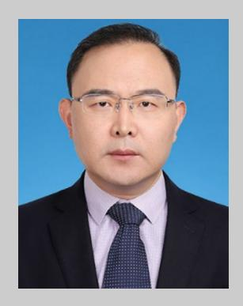

**Baohua Li** is a professor at Tsinghua University. His research interests focus on high-energy lithium batteries, advanced electrolyte engineering for high-energy batteries, high-energy layered oxide cathodes for lithium batteries, design of solid electrolytes, interfacial stability of solid-state lithium batteries, and recycling of lithium batteries. He completed his Ph.D. at the Chinese Academy of Science in 2002, and then worked at Tsinghua University until today.

**Guohua Chen** is a chair professor at The Hong Kong University of Science and Technology. His research interests focus on industrial application of lithium sulfur battery, polymer coating for highly stable layered oxide cathode, electrolyte design of high energy lithium battery, interfacial stability of solid-state battery, and safety of high energy lithium battery. He completed his Ph.D. at McGill University, and is a Fellow of HKIE, AIChE, Global Academy of Chinese Chemical Engineers, the Canadian Academy of Engineering, and the Hong Kong Academy of Engineering.