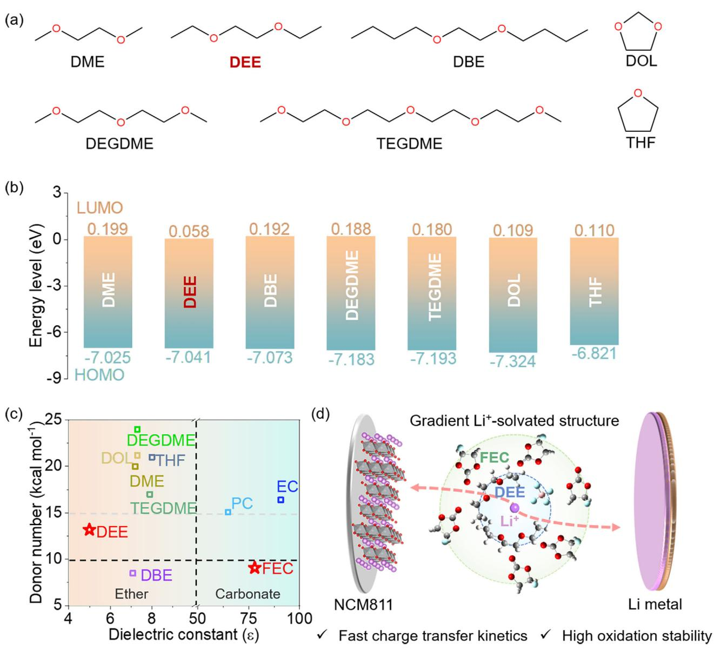
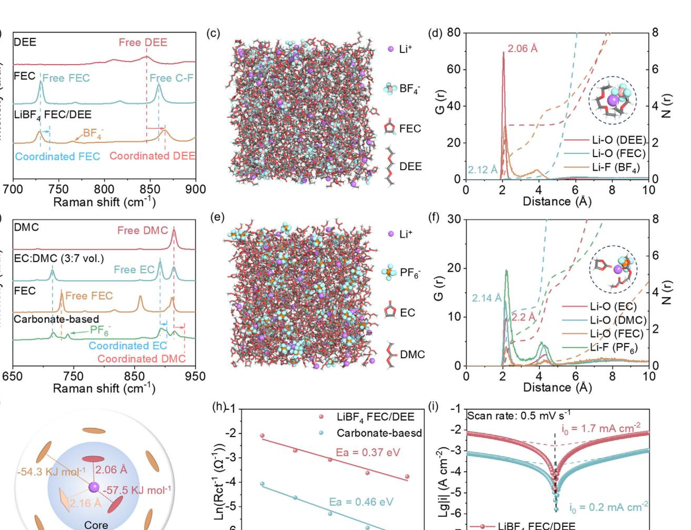
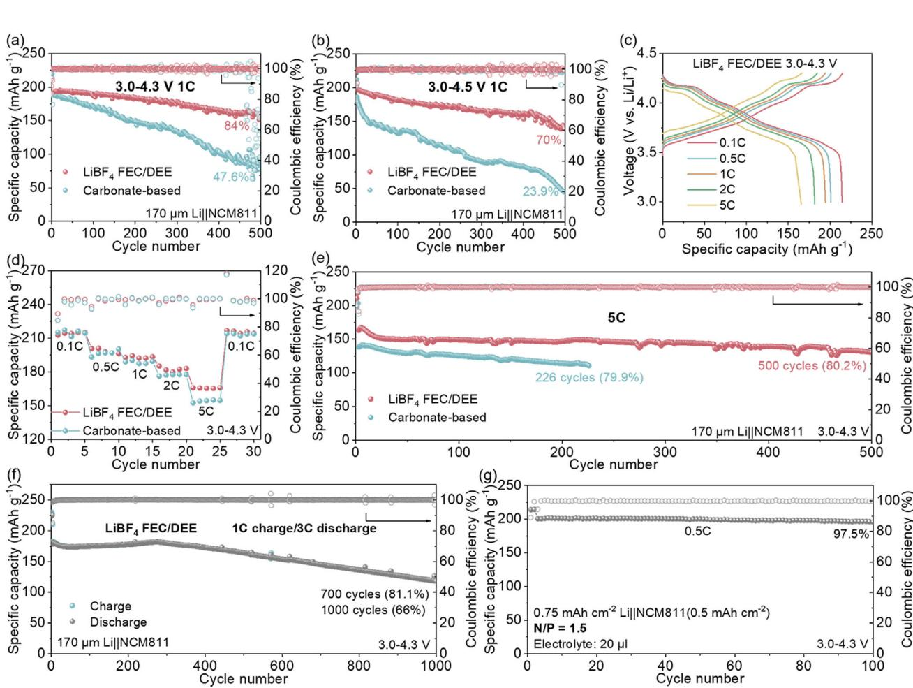
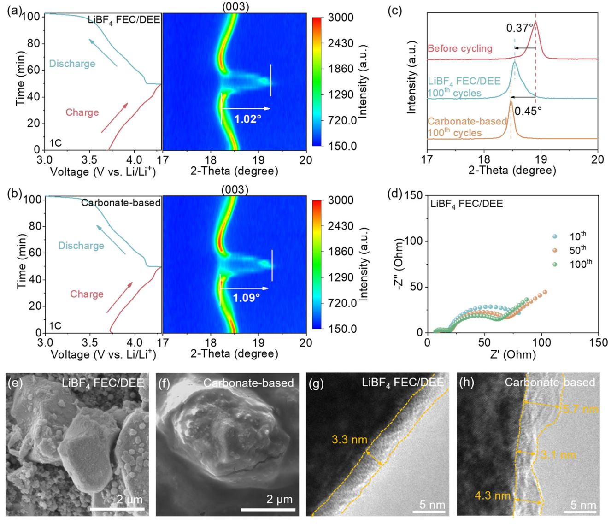
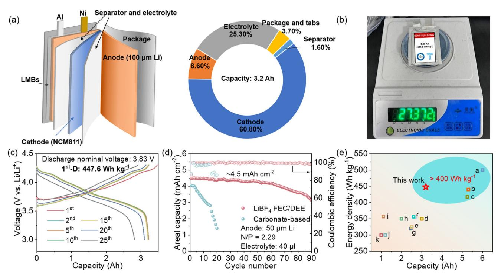

# **A Non-Concentrated Gradient-Solvation Electrolyte Enables a High-Voltage Lithium Metal Battery with 447.6 Wh Kg−1**

*Hao Wang, Dong Yan, Hongyu Liu, Shuai Li, Xiaobin Niu, Chuying Ouyang,\* Hong Li,\* and Liping Wang\**

**High-voltage lithium (Li) metal batteries (LMBs) emerge as a pivotal strategy for achieving high energy density applications. However, the electrolyte instability leading to inferior rate performance and short lifespan remains to be addressed. In this study, a new non-concentrated gradient-solvation electrolyte by solvent polarity discrepancy is developed. A highly donor-capable ether forms the Li+-solvated core through strong ion-dipole interactions, while a weakly donating carbonate creates the shell structure. Such a gradient-solvation structure enables the electrolyte with a high oxidation voltage (4.6 V vs. Li/Li+) and rapid Li+-desolvated kinetic. Consequently, the electrolyte facilitates the LiNi0.8Co0.1Mn0.1O2 (NCM811)||Li cells to attain a specific capacity of 165.8 mAh g−1 at 5C, alongside 1000 stable cycles at 1C charge/3C discharge with 66% capacity retention. Even under lean conditions (N/P = 1.5, electrolyte: 20 µL), NCM811||Li cell still maintains 97.5% capacity retention over 100 cycles. Furthermore, a 3.2 Ah pouch cell achieves a specific energy density of 447.6 Wh kg−1 with stable cycling. These findings highlight the promise of gradient-solvation electrolytes for high-voltage LMBs applications.**

H. Wang, D. Yan, H. Liu, S. Li, X. Niu, L. Wang School of Materials and Energy University of Electronic Science and Technology of China Chengdu 610054, China E-mail: [lipingwang@uestc.edu.cn](mailto:lipingwang@uestc.edu.cn) H. Wang, H. Li Tianmu Lake Institute of Advanced Energy Storage Technologies Institution Changzhou 213300, China E-mail: [hli@iphy.ac.cn](mailto:hli@iphy.ac.cn) C. Ouyang 21C Innovation Laboratory Contemporary Amperex Technology Ltd. (21C LAB) Ningde, Fujian 352100, China E-mail: [cyouyang@jxnu.edu.cn](mailto:cyouyang@jxnu.edu.cn) C. Ouyang Department of Physics Laboratory of Computational Materials Physics Jiangxi Normal University Nanchang 330022, China H. Li Key Laboratory for Renewable Energy Institute of Physics Chinese Academy of Sciences Beijing 100190, China

The ORCID identification number(s) for the author(s) of this article can be found under <https://doi.org/10.1002/adma.202509760>

**DOI: 10.1002/adma.202509760**

#### **1. Introduction**

Lithium (Li) metal batteries (LMBs) have emerged as a prospective technology for high energy density applications in recent years.[\[1\]](#page-9-0) Li metal anodes (LMA), with ultrahigh specific capacity of 3860 mAh g−1 and ultra-low electrochemical redox potential (−3.040 V vs. the standard hydrogen electrode) combined with highvoltage, high-capacity cathodes such as LiNi0.8Co0.1Mn0.1O2 (NCM811), can theoretically achieve high energy densities exceeding 400 Wh kg−1. [\[2\]](#page-9-0) Such high-energydensity systems hold great potential for revolutionizing energy storage in consumer electronics and electric vehicles by significantly extending operational endurance.[\[3\]](#page-9-0) Nevertheless, their high-rate performance and long-term cycle stability are constrained by the challenge in concurrently achieving stability for high-voltage cathodes and LMA in the current battery framework.[\[4\]](#page-9-0)

Electrolyte engineering represents a highly effective and expedient strategy to enhance oxidative stability, optimize electrode/electrolyte interphase formation, improve ionic conductivity, and broaden the electrochemical stability window of high-voltage LMBs.[\[5\]](#page-9-0) Recent advances in electrolyte design, particularly high concentration electrolytes (HCE) and localized high concentration electrolytes (LHCE), demonstrate exceptional high-rate capability and prolonged cycling stability in high-voltage LMBs.[\[6\]](#page-9-0) However, the issues of excessive costs and environmental contamination posed by highconcentration Li salts and diluents (typically highly fluorinated anti-solvents) hinder their large-scale implementation. Therefore, the development of cost-effective, non-concentrated stable electrolytes proves critical for advancing high-voltage LMBs.[\[7\]](#page-9-0)

In designing non-concentrated electrolytes for high-voltage LMBs, the precise engineering of Li+-solvated structures is as critical as solvent/salt selection to ensure compatibility with both high-voltage cathodes and LMA. The enhanced stability of HCE and LHCE in high-voltage LMBs stems from their ability to form anion-dominated solvation structures (contact ion pairs (CIPs) and aggregates (AGGs)).[\[8\]](#page-9-0) These configurations stabilize the electrolyte by enabling anions to rearrange the redox order within Li+-solvated structure, thereby effectively suppressing solvent decomposition.[\[9\]](#page-9-0) Weakly solvated electrolyte (WSE) is a non-concentrated electrolyte strategy for high-voltage LMBs, which consists of solvents with weak donor capacity and Li salt with high dissociation energy.[\[10\]](#page-9-0) The Li+-anion species demonstrate superior binding competitiveness over Li+-solvent coordination, facilitating spontaneous formation of anion-dominated solvation structures even in dilute electrolytes.[\[11\]](#page-9-0) Taking the advantages of cost-effectiveness and fast Li+ transport kinetic induced by low viscosity, WSE is considered an excellent candidate for high-voltage LMBs electrolyte. Nevertheless, this simplistic anion-dominated solvation structure design fails to address interfacial compatibility challenges stemming from the unregulated redox activity of free solvent molecules at electrode surfaces.[\[9a,12\]](#page-9-0) Therefore, within the anion-dominated solvation structure framework, precise modulation of solvent intermolecular equilibrium proves critical for achieving concurrent high-rate performance and long lifespan in high-voltage LMBs.[\[13\]](#page-9-0)

Here, we employ ethylene glycol diethyl ether (DEE) and fluoroethylene carbonate (FEC) with discrepantly solvated ability to design a non-concentrated electrolyte (1 M LiBF4 FEC/DEE (1:1 vol.) namely LiBF4 FEC/DEE) with a gradient Li+-solvated structure (a DEE-rich core and a FEC-rich shell), establishing hierarchical coordination environments. This gradient-solvation electrolyte exhibits superior ionic conductivity (7.7 mS cm−1), rapid desolvation kinetic, and high oxidation voltage (4.6 V vs. Li/Li+). Consequently, LiBF4 FEC/DEE enables NCM811||Li cells to achieve stable cycling at high voltage (4.5 V vs. Li/Li+), high rate (5C, 165.8 mAh g−1), and high mass loading (4.5 mAh cm−2). Under 1C charge/3C discharge, NCM811||Li cells remain stable over 1000 cycles. Even with a low N/P (1.5) and a poor electrolyte (20 μL) conditions, NCM811||Li cells are still stable for 100 cycles with 97.5% capacity retention. Moreover, a 3.2 Ah pouch cell delivers a high energy density of 447.6 Wh kg−1 while maintaining stable cycling performance.

# **2. Results and Discussion**

### **2.1. Electrolyte Design Criteria**

Ethers are considered ideal solvents in LMBs due to their high compatibility with LMA.[\[14\]](#page-9-0) Additionally, the reduction of "C─O─C" bonds in ethers promotes the build of Li2O-rich solid electrolyte interphase (SEI), enhancing lateral diffusion of Li along the SEI and inhibiting dendrite growth.[\[15\]](#page-9-0) However, the conventional ethers (**Figure 1**[a\)](#page-2-0) generally exhibit elevated lowest unoccupied molecular orbitals (LUMO) and highest occupied molecular orbitals (HOMO), which fundamentally limit their oxidative stability (Figure [1b;](#page-2-0) Table S1, Supporting Information). Therefore, the excessive presence of free ether molecules imposes intrinsic constraints on the design of high-voltage nonconcentrated ether-based electrolyte.[6a]

The effective constraint of ether molecules within Li+-solvated structure, analogous to the free-ether-depleted configuration (also known as gradient-solvation structure) characteristic of HCE and LHCE, emerges as a critical design imperative for developing non-concentrated electrolyte compatible with high-voltage LMBs.[\[12,13\]](#page-9-0) Due to the inevitable presence of free ether species in monoether-based electrolytes at 1 M concentration, the incorporation of high-voltage-tolerant co-solvents becomes essential to partially replace ether components as free solvent media. Extensive researches show that carbonates, due to their distinct properties from ethers (especially donor number (DN) and dielectric constant (ɛ)), can impact Li+-ether coordination, influencing the Li+-solvated structure.[\[11,16\]](#page-9-0) Specially, FEC, with a low DN value of 9.1 and a high ɛ (78) (Figure [1c;](#page-2-0) Table S1, Supporting Information),[\[17\]](#page-9-0) combined with ethers, can spontaneously act as free solvents while offering high solubility for Li salt with high dissociation energy.[\[12\]](#page-9-0) These properties address the oxidative instability of ether-based electrolytes, which arises from their reliance on LiFSI and LiTFSI salts.[\[16\]](#page-9-0) Additionally, the LiF derived from FEC decomposition serves as a high-quality electrode/electrolyte interphase component, enabling stable cycling in both LMA and high-voltage cathodes, which establishes FEC as the optimal co-solvent for the ether-based electrolyte.[\[18\]](#page-9-0)

DN value, a critical parameter quantifying solvent polarity, governs ion-dipole interactions with Li+. [\[19\]](#page-9-0) Ethers with DN values exceeding FEC create polarity discrepancy that preferentially populates Li+-solvated structure, forming ether-rich Li+ solvated core. However, excessive ion-dipole interactions impede Li+ desolvation kinetics, severely compromising electrolyte rate capability.[\[20\]](#page-9-0) This mechanistic trade-off establishes DEE with moderate DN (13.2) as the optimal choice. Moreover, compared to typical dmethoxyethane (DME), DEE's elongated alkyl chains confer enhanced oxidative stability, accentuating its superiority as an ether solvent for high-voltage electrolytes.[\[21\]](#page-9-0)

FEC/DEE combination theoretically enables a gradient arrangement in Li+-solvated structure, characterized by a DEE-rich core and an FEC-rich shell (Figure [1d\)](#page-2-0). Such gradient solvent distribution confines most DEE within Li+-solvated structure to suppress its oxidative decomposition under elevated voltage, while abundant free FEC maintains compatibility with both LMA and high-voltage cathodes, collectively enabling optimal performance in high-voltage LMBs. As evidence, although DBE possess higher intrinsic oxidative stability than DEE due to its deeper HOMO, the LiBF4 FEC/DBE exhibits a lower oxidation limit than LiBF4 FEC/DEE (Figure S1a, Supporting Information) due to DBE's lower polarity relative to FEC (Figure [1c\)](#page-2-0). This finding demonstrates that the ether-dominated Li+-solvated core with gradient solvation configuration is the critical factor determining electrolyte oxidative stability. Moreover, LiBF4, with a high dissociation energy between anions and cations (6.61 eV), is selected to facilitate the formation of contact ion pairs (CIPs) and aggregates (AGGs) (Figure S2, Supporting Information).[9a] Thus, LiBF4, FEC, and DEE are combined to design a non-concentrated highvoltage electrolyte (LiBF4 FEC/DEE) with enhanced oxidative stability and fast charge transfer kinetics. The oxidative voltage and ionic conductivity of various 1 M LiBF4 FEC:ether (1:1 vol.) are evaluated (Figures S1–S3, Supporting Information). LiBF4 FEC/DEE exhibits a high oxidative voltage (*>*4.6 V vs. Li/Li+) and ionic conductivity (7.7 mS cm−1), making it the best combination among all tested electrolytes.

#### **2.2. Solvation Structure and Electrochemical Property of Electrolytes**

Raman spectroscopy is employed to study Li+-solvated structure within the electrolytes. In LiBF4 FEC/DEE, C-O-C

IENCE NEWS www.advancedsciencenews.com

Figure 1. Design of non-concentrated ether-based electrolytes. a) Schematic diagrams of molecular structures for different ethers. b) HOMO and LUMO energy levels of different ethers. c) Dielectric constant and DN information for ethers and carbonates. d) Design of non-concentrated gradient structure high-voltage electrolyte.

characteristic peak of free DEE, initially located at 846  $\text{cm}^{-1}$ , blue-shift to 866  $\text{cm}^{-1}$  (Figure 2a), indicating that most DEE molecules are coordinated with Li+.[17c,21] This is further supported by the blue-shift of C-H characteristic peaks (Figure S4, Supporting Information).[21] However, the characteristic peaks of O-C-O and C-F, located at 729 and 859 cm-1, respectively, attributed to free FEC, do not undergo significant blue-shifts, suggesting that most of FEC molecules remain free.[13,22] This unique gradient coordination characterization stems from the higher electron-donating capacity of DEE compared to FEC. Additionally, the weak solvating ability of DEE and FEC promotes the formation of Li+-BF4- species (95.9% in LiBF4 FEC/DEE), including CIPs (763 cm $-1$ ) and AGGs (767 cm $-1$ ) (Figure S4, Supporting Information).[23] To systematically assess the oxidation

stability and high-rate capability of LiBF, FEC/DEE electrolyte at elevated voltage, a conventional commercial carbonate-based electrolyte (1 M  $\text{LiPF}_6$  EC:DMC (3:7 vol.)) renowned for its superior comprehensive performance is selected as a contrast. Additionally, 5 wt.% FEC is employed as an additive to enhance the electrolyte's compatibility with Li metal, thereby optimizing the overall electrochemical performance. This comparative approach ensures a rigorous evaluation of the modified electrolyte's properties relative to a well-established benchmark. Here, changes in FEC Raman peaks are not taken into account due to their low content. In carbonate-based electrolyte, the characteristic peaks at 892 and 914 cm-1 are assigned to free EC and DMC, respectively, while the Raman peaks at 903 and 932  $\text{cm}^{-1}$ correspond to coordinated EC and DMC (Figure 2b).[24] Raman www.advancedsciencenews.com

CIENCE NEWS

 $(a)$ 

ntensity (a.u.)

 $(b)$ 

ntensity (a.u.)

 $(g)$ 

Li+  $BF_4$ DEE **FEC** Potential (mV vs. Li/Li+) 1000/T ( $K^{-1}$ ) **Figure 2.** Characterization of electrolytes. Raman spectra of a) LiBF4 FEC/DEE, b) carbonate-based electrolyte. MD simulation snapshot of c) LiBF4 FEC/DEE, e) carbonate-based electrolyte. Li+ RDF (illustrations are the representative solvation structures of Li+-solvated core.) of d) LiBF4 FEC/DEE, f) carbonate-based electrolyte. g) Gradient Li+-solvated structure of LiBF4 FEC/DEE. h) Activation energies, i) Exchange current densities of the two electrolytes.

 $3.1$ 

 $3.2$ 

 $3.3$ 

-6

-7

 $2.9$ 

 $3.0$ 

peak of  $PF_6^-$ , located at 741 cm-1, exhibits a 25.3% contribution from solvent-separated ion pairs (SSIPs) after deconvolution, which is significantly higher than in  $\text{LiBF}_4$  FEC/DEE (Figure S4, Supporting Information).[25] The coexistence of free and coordinated EC and DMC indicates the absence of a hierarchically gradient arrangement of solvent species within the Li+-solvated structure, even if the difference in DN values of EC and DMC.

Core

Shel

Molecular dynamics (MD) simulations and radial distribution function (RDF) are performed further to elucidate solvation structures and concrete coordination number of the electrolytes, respectively (Figure 2c-f). For LiBF4 FEC/DEE (molar ratio of  $\text{LiBF}_4:\text{FEC:DEE} = 1:6.86:3.56$ ), the average coordination numbers of DEE and  $BF_4$ - are 2.984 and 1.628, respectively, while that of FEC is a mere 0.097. As the illustration in Figure  $2d$  shows, the representative solvation structure is one

BF4- and two DEE coordinating with Li+, indicating that DEE and  $BF_4^-$  dominate the Li+-solvated core and FEC dominate the Li+-solvated shell (free-solvent environment). Meanwhile, the shorter Li+-O(DEE) distance (2.06 Å) compared to Li+-O(FEC)  $(2.12 \text{ Å})$  verifies stronger ion-dipole interactions between DEE and Li+, which drives the formation of DEE-dominated solvation structures. In carbonate-based electrolyte (molar ratio of  $\text{LiPF}_{6}$ :EC:DMC = 1:4.5:8.32), Li+ is coordinated with each component and forms a  $\text{Li}^+(PF_6^-)_{2.003}$  (EC)1.386 (DMC)3.111 structure and the representative solvation structure is one  $PF_6^-$ , one EC, and two DMC coordinating with  $Li^+$  (Figure 2e,f). The higher DN value of DMC compared to EC results in a shorter Li+-O(DMC)  $(2.14 \text{ Å})$  distance relative to Li+-O(EC)  $(2.2 \text{ Å})$ , yet fails to induce gradient solvent arrangement in Li+-solvated structure, suggesting this unique coordination configuration may be specifically enabled by ether-carbonate hybrid strategies.[12,13]

LIBF4 FEC/DEE

 $-50$ 

Carbonate-based

 $\dot{0}$ 

50

100

 $-7$ 

-8

 $-100$ 

 $3.4$ 

www.advmat.de

To validate the compatibility of gradient-solvation electrolytes with high-voltage LMBs, comprehensive evaluations are conducted on LiBF, FEC/DEE, focusing on its high-voltage stability, Li+ desolvation kinetic, and interfacial compatibility with LMA. The LUMO–HOMO energy levels of several components and the representative solvation structure in both electrolytes are calculated (Figure S5, Supporting Information). Compared to other solvents, DEE generates the highest LUMO of 0.058 eV, while FEC exhibits the Lowest HOMO of  $-8.971$  eV, which may result in a wide electrochemical window for  $\text{LiBF}_4$  FEC/DEE. As a verification, the representative solvation structure in  $\text{LiBF}_4$ FEC/DEE delivers higher LUMO and lower HOMO energy levels than in carbonate-based electrolytes (Figure S5c, Supporting Information). Furthermore, abundant free FEC molecules enable the simultaneous formation of stable electrode/electrolyte interface on both LMA and high-voltage cathodes, collectively ensuring redox stability of  $\text{LiBF}_4$  FEC/DEE.

Desolvation kinetic is an important indicator for evaluating rate capacity of electrolytes. Binding energies of Li+-solvent and  $\text{Li}^+$  desolvation energies in  $\text{LiBF}_4$  FEC/DEE and carbonate-based electrolyte are calculated (Figure S6, Supporting Information). The gradient-solvation structure in the  $\text{LiBF}_4$  FEC/DEE results in a Li+-solvated core predominantly composed of DEE and  $BF_4^-$ . The low coordination number of DEE and the weak binding energy of the Li+-DEE species ( $-57.5$  KJ mol-1) collectively facilitate rapid desolvation kinetics (Figure  $2g$ ; Figure S6, Supporting Information). However, the higher binding energy of Li+-EC  $(-60.5 \text{ KJ mol}^{-1})$  and Li+-DMC  $(-67.9 \text{ KJ mol}^{-1})$  species leads to higher Li+ desolvation energy for carbonate-based electrolyte compared to LiBF4 FEC/DEE (Figure S6, Supporting Information). This  $Li^+$  desolvation kinetic is also reflected in the activation energy of the electrolyte, where  $\text{LiBF}_{4}$  FEC/DEE delivers an activation energy of 0.37 eV, which is lower than that of carbonatebased electrolyte at 0.46 eV (Figure 2h; Figure S7, Supporting Information). Additionally, LiBF, FEC/DEE demonstrates higher exchange current density (1.7 mA  $\text{cm}^{-2}$  vs. 0.2 mA  $\text{cm}^{-2}$  for carbonate-based) and a greater  $Li^+$  mobility number (0.44 vs. 0.33 for carbonate-based), indicating superior Li+ transport capability (Figure 2i; Figure S8, Supporting Information).

The dual advantages of DEE's excellent LMA compatibility and FEC-induced robust SEI effectively mitigate dendrite formation on LMA through 100 cycles in  $\text{LiBF}_{4}$  FEC/DEE, demonstrating exceptional Li interfacial compatibility (Figure S9, Supporting Information). Meanwhile, Li||Cu cell in LiBF4 FEC/DEE exhibits a much lower nucleation overpotential of 21.2 mV, compared to 198.4 mV for carbonate-based electrolyte (Figure S10a, Supporting Information). Li||Cu cell cycled at 0.5 mA  $\text{cm}^{-2}$  and 1 mAh cm $-2$  maintains stable over 280 cycles in LiBF4 FEC/DEE, with an average Coulombic efficiency of 97.6%, whereas only 60 cycles in carbonate-based electrolyte (Figure S10b, Supporting Information). In Li||Li cell, LiBF4 FEC/DEE exhibits smaller overpotentials and a larger critical current density (CCD, 4.8 mA cm $-2$  vs. 1.4 mA cm $-2$  for carbonate-based) (Figure S10c, Supporting Information). At 0.5 mA cm-2 and 1 mAh cm-2, Li||Li cell cycled in LiBF4 FEC/DEE remain stable for 600 h, much longer than the 100 h achieved with carbonate-based electrolyte (Figure S10d, Supporting Information). In conclusion, LiBF4 FEC/DEE with gradient-solvation structure demonstrates an extended electrochemical stability window and accelerated Li+

transport kinetics, positioning it as an optimal electrolyte system for high-voltage LMBs.

#### 2.3. Electrochemical Performance of NCM811||Li Cells

NCM811|Li cells are selected to evaluate the high voltage stability and rate performance of  $\text{LiBF}_4$  FEC/DEE (Figure 3). Previously, gradient-solvation electrolyte formulations have been optimized by modulating ether type, ether/carbonate ratio and Li salt type (Figure S11, Supporting Information). To comprehensively elucidate the superior performance of  $\text{LiBF}_{4}$  FEC/DEE in NCM811||Li cells, ether-based LHCEs (DME-based, DEE-based, and DBE-based LHCEs) are also employed as contrasts (Figure S12, Supporting Information). Different from the outstanding properties reported in the literature,[6a,21] LHCEs exhibited poor oxidative stability in our battery system. Therefore, the subsequent discussion will focus on the electrochemical performance differences between LiBF4 FEC/DEE and carbonate-based electrolytes in NCM811||Li cells. Experiments show that NCM811||Li cell can stably charge to 4.5 V in both LiBF4 FEC/DEE and carbonate-based electrolyte (Figure S13, Supporting Information) and exhibits higher initial Coulombic efficiency (88.6% for 3.0–4.3 V, 89% for 3.0–4.5 V) in  $\text{LiBF}_4$  FEC/DEE compared to carbonate-based electrolyte, suggesting that LiBF4 FEC/DEE accelerates to form a stable electrode/electrolyte interface during the first charge. Under 1C (1C = 200 mA  $g^{-1}$ ), cell in LiBF4 FEC/DEE maintains a specific capacity of 160 mAh  $g^{-1}$  (84% retention) at 4.3 V and 138.2 mAh  $g^{-1}$  (70% retention) at 4.5 V after 500 cycles, while lower capacities and retention (89.4 mAh  $g^{-1}$ , 47.6% retention at 4.3 V, 44.3 mAh  $g^{-1}$ , 23.9% retention at 4.5 V) for 500 cycles in carbonate-based electrolyte (**Figure 3a,b**; Figure S14, Supporting Information). At 0.5C, NCM811||Li also shows better cycling performance in  $\text{LiBF}_4$  FEC/DEE (Figure S15, Supporting Information), indicating more stability of  $\text{LiBF}_4$ FEC/DEE at elevated voltage. Additionally, the accelerated kinetic of LiBF, FEC/DEE enables NCM811|Li with impressive rate capability, achieving a specific capacity of 165.8 mAh  $g^{-1}$ at 5C, compared to 154.2 mAh g-1 for carbonate-based electrolyte (Figure 3c,d; Figure S16, Supporting Information). With excellent cycling stability and high-rate capability, NCM811 cathode in  $\text{LiBF}_4$  FEC/DEE keeps a capacity retention of over 80% after 500 cycles at 5C, while the specific capacity of NCM811 drops sharply below 80% after just 226 cycles in carbonate-based electrolyte (Figure 3e). In addition, NCM811 cathode in LiBF4 FEC/DEE exhibits a specific capacity of 178.2 mAh  $g^{-1}$  at 1C charge/3C discharge, with stable performance over 1000 cycles (66% retention@1000 cycles) (Figure 3f). Meanwhile, in LiBF4 FEC/DEE, NCM811||Li cell still demonstrates exceptional cycling stability under extreme conditions of limited Li  $(N/P = 1.5)$  and lean electrolyte (20  $\mu$ L), maintaining a high specific capacity of 195.6 mAh  $g^{-1}$  after 100 cycles at 0.5C with 97.5% capacity retention (Figure 3g). In summary,  $\text{LiBF}_4$  FEC/DEE demonstrates excellent high-voltage stability, high-rate ability, and long-cycle capability.

 $dQ/dV$  and voltage-time curves are employed to probe the failure mechanisms of NCM811||Li cells during high-voltage, high-rate cycling. Figure **S17** (Supporting Information) presents the dQ/dV evolution during 1000 cycles at 1C charge/3C

Coulombic efficiency

Coulombic efficiency

**Figure 3.** Cycling performance of NCM811 cathodes in LiBF4 FEC/DEE and carbonate-based electrolyte. Cycling curves of NCM811 cathodes at 1C at the voltage range of a) 3.0–4.3 V and b) 3.0–4.5 V. c) Galvanostatic charge/discharge curves of NCM811 cathodes in LiBF, FEC/DEE at different current rates. d) Rate curves of NCM811 cathodes at the window of 3.0–4.3 V. e) Cycling curves of NCM811 cathodes at a high rate of 5C. f) Cycling curve of NCM811 cathode at 1C charge/3C discharge in LiBF4 FEC/DEE. g) Cycling curve of NCM811||Li cell under lean conditions (N/P = 1.5, electrolyte: 20  $\mu$ l) at 0.5C.

discharge, revealing sequential phase transitions from rhombohedral  $(H_1)$ -monoclinic (M)-rhombohedral  $(H_2)$ -rhombohedral  $(H_3)$  during charging. Notably, the  $H_3$ - $H_3$  phase transition exhibits the most pronounced redox peak attenuation and polarization during cycling, suggesting detrimental lattice contraction stresses that ultimately drive capacity degradation in NCM811.[26] Furthermore, the voltage stability during chargedstate resting provides critical insights into electrolyte highvoltage resilience and LMA compatibility. As demonstrated in LiBF4 FEC/DEE (Figure S18a, Supporting Information), NCM811||Li resting at 4.3 V during the 11th cycle exhibited minimal voltage decay ( $\Delta V$  < 0.1 V after 24 h) with sustained stability through 72 h. This exceptional interfacial preservation enables stable NCM811||Li cycling performance (Figure S18b, Supporting Information), confirming the dual advantages of LiBF4 FEC/DEE in maintaining high-voltage structural integrity and mitigating LMA degradation. Therefore, in LiBF4 FEC/DEE, the capacity fade of NCM811||Li during extended highvoltage cycling predominantly stems from cathode structural collapse.

Cycle number

#### 2.4. Characterization of NCM811 Cathode Bulk and Surface

During high-rate cycling, the structural degradation of NCM811 constitutes the dominant factor driving capacity fade in NCM811||Li cells, so we employ in-situ X-ray diffraction (XRD) to track phase structural evolution during 1C cycling of NCM811, establishing mechanistic connections between the fast chargetransfer kinetic and long-term cyclability in LiBF, FEC/DEE (Figure 4a,b). The XRD pattern (Figure S19, Supporting Information) confirms that NCM811 has a typical layered transition metal oxide crystal structure (LiMO2, JCPDS#85-1966). Diffraction peaks corresponding to the (003) and (104) reflections are employed to characterize the lattice parameters along the  $c$ -axis and *a*-axis directions, respectively.[26] During charging, the (003) diffraction peak initially shifts to a lower angle, followed by a shift to a higher angle. In this process, increased delithiation of the Li layer enhances electrostatic repulsion between the oxygen layers, causing an expansion of the crystal spacing along the caxis, while with further delithiation, the Li layer eventually disappears, leading to a reduction in the c-axis crystal spacing.[27]

**[www.advancedsciencenews.com](http://www.advancedsciencenews.com) [www.advmat.de](http://www.advmat.de)**

**Figure 4.** Characterization of NCM811 cathodes. In-situ XRD patterns of the NCM811 cathodes during the 5th cycle at 1C in a) LiBF4 FEC/DEE and b) carbonate-based electrolyte (3.0–4.3 V). c) XRD patterns for (003) diffraction peak after 100 cycles in different electrolytes. d) Nyquist plots of NCM811||Li cells during cycling in LiBF4 FEC/DEE. SEM images of NCM811 cathodes after 100 cycles in e) LiBF4 FEC/DEE and f) carbonate-based electrolyte. HR-TEM images of NCM811 cathodes after 100 cycles in g) LiBF4 FEC/DEE and h) carbonate-based electrolyte.

In a highly delithiated state, excessive variations in the c-axis lattice parameter can easily cause the collapse of the layer structure, which is the primary reason NCM811 cathodes fail rapidly under high voltage up 4.3 V.[\[28\]](#page-9-0) In-situ XRD records the variation for the (003) diffraction peak of NCM811 during the 5th cycle under 1C in LiBF4 FEC/DEE (Figure 4a) and carbonate-based electrolyte (Figure 4b). The span of (003) diffraction peak during charging to 4.3 V is 1.02° in LiBF4 FEC/DEE and 1.09° in carbonatebased electrolyte. The smaller change in the (003) diffraction peak for NCM811 cycled in LiBF4 FEC/DEE indicates a smaller variation in *c*-axis lattice parameter, suggesting a more stable cathode phase structure. Similarly, during charging, the (104) diffraction peak of NCM811 cycled in LiBF4 FEC/DEE shifts to the right by 1.16°, smaller than the 1.24° shift observed in carbonatebased electrolyte (Figure S20, Supporting Information). Therefore, the fast charge-transfer kinetic of LiBF4 FEC/DEE at the electrode/electrolyte interface establishes a high-speed Li+ transport channel on the NCM811 interface. This channel reduces the excessive lattice changes caused by the adverse stacking of Li+ at the cathode interface, which effectively releases the innerlattice stress in the layered structure, enabling stable cycling at high-rate.[\[26\]](#page-9-0)

The minor interlattice stress significantly enhances the cycling performance of NCM811 cathodes. Therefore, deviation of (003) diffraction peak after cycling is used to evaluate the integrity of NCM811 crystal structure.[\[29\]](#page-9-0) After 100 cycles, the (003) diffraction peak shifts to left by 0.37° in LiBF4 FEC/DEE compared to 0.45° in carbonate-based electrolyte (Figure 4c). The smaller shift in the lattice parameter in LiBF4 FEC/DEE indicates a more stable cathode structure during cycling. Moreover,

in LiBF, FEC/DEE, NCM811||Li exhibits reduced electrochemical impedance during 100 cycles, indicating a stable interfacial structure and  $Li^+$  diffusion channels (Figure 4d). In contrast, in carbonate-based electrolyte, the electrochemical impedance increases during cycling, with a significant rise between the 50th and 100th cycles, indicating an unstable electrode interfacial structure (Figure S21, Supporting Information). As further proof, SEM images visually characterize changes in the NCM811 cathode particles after 100 cycles in both electrolytes. Before cycling, NCM811 particles exhibit irregular granularity with sizes ranging from 2 to 5  $\mu$ m (Figure S22, Supporting Information). After 100 cycles, the particles in  $\text{LiBF}_4$  FEC/DEE remain intact, while those in carbonate-based electrolyte show numerous cracks, suggesting that their internal structure has been severely damaged (Figure 4e,f). These cracks likely arise from unreleased internal stress caused by large lattice distortion of NCM811 during cycling, providing further evidence that  $\text{LiBF}_4$  FEC/DEE effectively stabilizes the cathode structure under high voltage cycling.

A stable and homogeneous electrode/electrolyte interface is also crucial for a stable bulk phase. To elucidate the stabilization mechanism of LiBF4 FEC/DEE on NCM811 phase structure, high resolution-transmission electron microscope (HR-TEM) and X-ray photoelectron spectroscopy (XPS) are utilized to analyze the cathode interface structure and composition. HR-TEM images reveal the formation of a cathode/electrolyte interphase (CEI) on NCM811 in both electrolytes. The CEI derived in LiBF4 FEC/DEE adheres uniformly to the NCM811 surface and exhibits an ultrathin thickness of 3.3 nm (Figure 4g), whereas the CEI formed in the carbonate-based electrolyte is inhomogeneous, with a thickness ranging from 3.1 to 5.7 nm (Figure 4h). The uniform and thinner CEI derived in  $\text{LiBF}_4$ FEC/DEE facilitates Li+ transport at the interface, providing evidence that  $\text{LiBF}_4$  FEC/DEE offers superior interfacial kinetics. XPS is further employed to analyze the specific composition of the CEI (Figure S23, Supporting Information). The CEI on NCM811 in LiBF4 FEC/DEE contains more F and less O than the CEI in the carbonate-based electrolyte, suggesting that more Li+-anion species and the FEC-rich free-solvent in LiBF, FEC/DEE contribute to the formation of inorganicdominated CEI (Figure S23a, Supporting Information).[9a,12] From the F 1s spectra (Figure S23b,d, Supporting Information), the CEI in  $\text{LiBF}_{4}$  FEC/DEE shows significant inorganic signals from LiF and  $Li_xBF_y$ , mainly derived from the decomposition of free FEC and LiBF4. In contrast, the CEI in carbonate-based electrolyte only trace of LiF, indicating that the carbonate-based electrolyte primarily forms organic interface components due to a high content of  $Li^+$ -solvent species.[30] Additionally, the B-O signal in B 1s spectra further confirms primary components of the CEI in LiBF4 FEC/DEE are inorganic (Figure S23c, Supporting Information).[31] These findings reveal that the CEI derived in LiBF, FEC/DEE is homogeneous and enriched with robust inorganic constituents. This robust and uniform cathode/electrolyte interface mitigates the bulk distortion of NCM811 during lithiation/delithiation, laying a reliable foundation for prolonged battery cycling.

#### 2.5. Electrochemical Performance of High-voltage Full Cells

An Ah-grade pouch cell is assembled to further evaluate the excellent stability of  $\text{LiBF}_4$  FEC/DEE in high-voltage LMBs (**Figure 5a**). The pouch cell uses 100 µm LMA and high mass loading NCM811 cathodes (4.66 mAh cm-2). Therefore, the mass ratio of cathode, anode, electrolyte, package and tabs, and separator is 60.8%, 8.6%, 25.3%, 3.7%, and 1.6%, respectively. The total mass of the pouch cell is 27.372 g (N/P = 2.21,  $E/C = 2.2$ ) (Figure 5b; Table **S2**, Supporting Information). During the first discharge cycle, the pouch cell generates a nominal voltage of 3.83 V and delivers an initial capacity of 3.2 Ah (an ultrahigh initial energy density of 447.6 Wh kg $-1$  based on the total mass), and can stable for 30 cycles at 0.1C (Figure 5c; Figure S24 and Table S2, Supporting Information). The cycled pouch cell exhibits an expansion rate of 34.99% (Figure S25, Supporting Information), which may contribute to electrolyte drying out, resulting in cell failure. Additionally, 4.5 mAh cm $-2$  NCM811||50 µm Li cell with a low electrolyte content (40  $\mu$ L) can stably cycle for 90 cycles in LiBF4 FEC/DEE, but only for less than 20 cycles in carbonate-based electrolyte (Figure 5d). For cathode with a loading of  $\approx$ 2.0 mAh cm-2 (50 µm Li, electrolyte: 20  $\mu$ L) cycles for 200 cycles at 0.2C charge/0.5C discharge with a capacity retention of 79.9% and 100 cycles at 1C with a capacity retention of 80.6% in  $\text{LiBF}_{4}$  FEC/DEE (Figure S26, Supporting Information). This suggests a stable electrochemical interface of electrodes cycled in  ${\rm LiBF}_4$  FEC/DEE that prevents depletion of LMA and electrolyte. Interestingly, due to the low desolvation energy of LiBF4 FEC/DEE, graphite can be charged and discharged normally (Figure S27a, Supporting Information), which contrasts with the typical co-intercalation behavior of ethers.[32] At 0.5C, graphite can stably cycle with a specific capacity over 300 mAh  $g^{-1}$  (Figure S27b, Supporting Information). Consequently, NCM811||graphite full cells with a cathode loading of  $\approx$ 2.0 mAh cm-2 and an N/P of 1.2 achieve 200 stable cycles in LiBF4 FEC/DEE at 0.5C (Figure S27c,d, Supporting Information), demonstrating the potential of  $\text{LiBF}_4$  FEC/DEE for commercial applications. Finally, by comparison with LMBs in the literature, the pouch cell yields a fairly high energy density, surpassing most of the current 3 Ah pouch cells (Figure 5e; Table **S3**, Supporting Information).[33]

## 3. Conclusion

In brief, we design a non-concentrated gradient-solvation electrolyte (LiBF $\sqrt{ECDEE}$ ) to enhance the high-rate performance and long-term cycling stability of high-voltage LMBs. The electrolyte forms a DEE and BF4--dominated Li+-solvated core, i.e.,  $\text{Li}^+(BF_4^-)_{1.628}(\text{DEE})_{2.984}(\text{FEC})_{0.097}$ , and a FEC-rich Li+-solvated shell (free-solvent environment). The fact DEE riched in solvation core provides a low activation energy (0.37 eV) (due to the low binding energy of Li+-DEE species ( $-57.5$  KJ mol-1)) and enhances the redox stability of the whole electrolyte; FEC with high oxidation stability riched in solvation shell benefits the formation of robust and stable LiF-rich inorganic electrode/electrolyte interfaces. The rapid Li+ desolvation kinetic and the stable interface effectively suppress lattice distortion in the NCM811 cathode during high-voltage lithiation/delithiation, www.advancedsciencenews.com

IFNCF NFWS

Figure 5. NCM811||Li full cells. a) Design schematic of 3.2 Ah pouch cell. b) The total mass of the 3.2 Ah pouch cell. c) Galvanostatic charge/discharge curves of the 3.2 Ah pouch cell at 0.1C. d) Cycling curves of 4.5 mAh cm-2 NCM811||Li full cells at 0.2C in different electrolytes. e) Comparison with literature on energy density of pouch cells (from Ref.[33]).

thereby significantly enhancing the cycle life of NCM811||Li. Consequently, the NCM811||Li cells exhibit outstanding cycling stability, demonstrating high capacity retentions of  $84\%$  (3.0-4.3 V) and 70% (3.0–4.5 V) over 500 cycles. The cells deliver a high specific capacity of 165.8 mAh  $g^{-1}$  at 5C and maintain stable operation for 1000 cycles under 1C charge/3C discharge conditions. Remarkably, even under extreme conditions with an ultra-low N/P ratio of 1.5 and lean electrolyte (20  $\mu$ L), LiBFA FEC/DEE enables the NCM811|Li to retain 97.5% capacity after 100 cycles. Furthermore, a 3.2 Ah NCM811||Li pouch cell generates a high energy density of 447.6 Wh  $kg^{-1}$  and is capable of stable cycling (30 cycles). This study elucidates the crucial role of the Li+-solvated structure in determining the oxidation voltage and interfacial transport kinetics and offers valuable guidance in designing superior electrolytes for high-voltage LMBs.

#### 4. Experimental Section

*Materials*: LiNi0.8Co0.1Mn0.1O2 (NCM811) was purchased from Nantong Rui Xiang New Materials Co., Ltd. Lithium metal anode (diameter: 14 mm, thickness: 170 µm) and graphite was purchased from Dongguan Canrd New Energy Technology Co., Ltd. 1,2-Dimethoxyethane (DME,  $\geq$ 99.9%), ethylene glycol diethyl ether (DEE,  $\geq$ 99.9%), ethylene glycol dibutyl ether (DBE,  $\geq$ 99.9%), diethylene glycol dimethyl ether (DEGDME, ≥99.9%), tetraethylene glycol dimethyl ether (TEGDME, ≥99.9%), 1,3dioxolane (DOL,  $\geq$ 99.9%), tetrahydrofuran (THF,  $\geq$ 99.9%), fluoride ethylene carbonate (FEC,  $\geq$ 99.9%), ethylene carbonate (EC,  $\geq$ 99.9%), dimethyl carbonate (DMC,  $\geq$ 99.9%), 1,1,2,2-Tetrafluoroethyl-2,2,3,3tetrafluoropropylether (TTE,  $\geq$ 99%), LiBF4 ( $\geq$ 99.9%), LiPF6 ( $\geq$ 99.9%), LiFSI ( $\geq$ 99.9%), and LiTFSI ( $\geq$ 99.9%) were purchased from Suzhou DoDo Chemical Technology Co., Ltd. All the solvents used have a water content  $\leq$ 5 ppm. The electrolytes of 1 M LiBF4 FEC:ether (1:1 vol.) (LiBF4 (93.7 mg, 1 mmol) in 0.5 mL FEC and 0.5 mL ether mixed solution, the following electrolyte preparations were the same), 1 M LiBF4 FEC:DEE (1:1 vol.), and 1 M LiPF6 EC:DMC (3:7 vol.)  $+$  5 wt.% FEC preparations were carried out in an argon-filled glove box (H2O  $\leq$  0.1 ppm, O2  $\leq$  0.1 ppm).

Electrochemical Measurements: The galvanostatic charge/discharge tests were performed on Neware CT-3008 W battery testing systems. The linear sweep voltammetry (LSV) was tested on CHI660E electrochemical workstation with a scan rate of 0.1 mV s-1 under the voltage range of 3–6 V. The electrochemical impedance spectroscopy (EIS) tests were performed on CHI660E electrochemical workstation with a perturbation of 5 mV in the frequency range of 100 kHz-10 mHz. The exchange current density was tested by CHI660E electrochemical workstation with a voltage range  $-0.3$  to 0.3 V. Ion mobility numbers ( $t_{+}$ ) were tested by CHI660E electrochemical workstation (calculation details in Supporting Information). Ionic conductivities of the electrolytes were measured by an ionic conductivity meter (Model DDS-307 A, Shanghai INESA Scientific Instrument Co., Ltd.).

Characterizations: Raman spectra were acquired by Renishaw in Via Reflex with a 532 nm laser. X-ray powder diffraction (XRD, Bruker D2 Advance) with a Cu K $\alpha$  ( $\lambda = 1.5406$  Å) radiation source was used to characterize the phase structure. In suit XRD tests at the angle range of 15–55°, 12° min-1. The electrode surface morphology was collected by field-emission scanning electron microscope (FESEM, JSM-7900F). Fieldemission transmission electron microscope (FETEM, JEM-F200) was employed to characterize electrode interfaces. X-ray photoelectron spectroscopy (XPS, Thermo Scientific K-Alpha) with the Al K $\alpha$  radiation source was used to analyze elemental information on electrode surfaces.

Battery assembly and computer calculation details in Supporting Information.

unung advmat de

**[www.advancedsciencenews.com](http://www.advancedsciencenews.com) [www.advmat.de](http://www.advmat.de)**

# **Supporting Information**

Supporting Information is available from the Wiley Online Library or from the author.

## **Acknowledgements**

This work was supported by the Natural Science Foundation of Sichuan, China (No. 2023NSFSC1914), the National Natural Science Foundation of China (No. 22322903), and Beijing National Laboratory for Condensed Matter Physics (No. 2023BNLCMPKF015).

## **Conflict of Interest**

The authors declare no conflict of interest.

# **Data Availability Statement**

The data that support the findings of this study are available from the corresponding author upon reasonable request.

## **Keywords**

fast kinetics, gradient-solvation, high-voltage lithium metal batteries, long lifespan, non-concentrated

> Received: May 22, 2025 Published online: June 26, 2025

- [1] W. Wu, W. Luo, Y. Huang, *Chem. Soc. Rev.* **2023**, *52*, 2553.
- [2] a) L. Wang, Z. Wu, J. Zou, P. Gao, X. Niu, H. Li, L. Chen, *Joule* **2019**, *3*, 2086; b) J. Tan, L. Ma, P. Yi, Y. Wang, Z. Li, Z. Fang, X. Li, S. He, X. Wang, M. Ye, J. Shen, *Adv. Mater.* **2024**, *36*, 2403570.
- [3] D. Liu, B. Wu, Y. Xu, J. Ellis, A. Baranovskiy, D. Lu, J. Lochala, C. Anderson, K. Baar, D. Qu, J. Yang, D. Galvez-Aranda, K.-J. Lopez, P. B. Balbuena, J. M. Seminario, J. Liu, J. Xiao, *Nat. Energy* **2024**, *9*, 559.
- [4] I. R. Choi, Y. Chen, A. Shah, J. Florian, C. Serrao, J. Holoubek, H. Lyu, E. Zhang, J. H. Lee, Y. Lin, S. C. Kim, H. Park, P. Zhang, J. Lee, J. Qin, Y. Cui, Z. Bao, *Nat. Energy* **2025**, *10*, 365.
- [5] W. Zou, J. Zhang, M. Liu, J. Li, Z. Ren, W. Zhao, Y. Zhang, Y. Shen, Y. Tang, *Adv. Mater.* **2024**, *36*, 2400537.
- [6] a) X. Ren, L. Zou, X. Cao, M. H. Engelhard, W. Liu, S. D. Burton, H. Lee, C. Niu, B. E. Matthews, Z. Zhu, C. Wang, B. W. Arey, J. Xiao, J. Liu, J.-G. Zhang, W. Xu, *Joule* **2019**, *3*, 1662; b) Z. Lu, H. Yang, J. Sun, J. Okagaki, Y. Choe, E. Yoo, *Nat. Commun.* **2024**, *15*, 9108.
- [7] L. Liu, Z.-J. Chen, G.-Y. Zhu, B.-H. Huang, B. Wang, Y. Yao, D.-S. Bin, X. Rui, Y. Yu, *Energy Environ. Sci.* **2025**, *18*, 2668.
- [8] a) A. M. Li, O. Borodin, T. P. Pollard, W. Zhang, N. Zhang, S. Tan, F. Chen, C. Jayawardana, B. L. Lucht, E. Hu, X. Q. Yang, C. Wang, *Nat. Chem.* **2024**, *16*, 922; b) Z. Li, G. Zhou, S. Li, H. Liu, L. Wang, H. Li, *Joule* **2023**, *7*, 2609.
- [9] a) F. Cheng, P. Liang, J. Li, Y. Dong, Z. Wang, G. Ding, K. Liu, L. Xue, *Angew. Chem., Int. Ed.* **2024**, *64*, 202415853; b) X. Liu, X. Shen, H. Li, P. Li, L. Luo, H. Fan, X. Feng, W. Chen, X. Ai, H. Yang, Y. Cao, *Adv. Energy Mater.* **2021**, *11*, 2003905.
- [10] Y. Huang, R. Li, S. Weng, H. Zhang, C. Zhu, D. Lu, C. Sun, X. Huang, T. Deng, L. Fan, L. Chen, X. Wang, X. Fan, *Energy Environ. Sci.* **2022**, *15*, 4349.

- [11] Z. Jiang, J. Mo, C. Li, H. Li, Q. Zhang, Z. Zeng, J. Xie, Y. Li, *Energy Environ. Mater.* **2023**, *6*, 12440.
- [12] G. Park, K. Lee, D.-J. Yoo, J. W. Choi, *ACS Energy Lett.* **2022**, *7*, 4274.
- [13] Y. Zhang, F. Li, Y. Cao, M. Yang, X. Han, Y. Ji, K. Chen, L. Liang, J. Sun, G. Hou, *Adv. Funct. Mater.* **2024**, *34*, 2315527.
- [14] S. Wang, J. Shi, Z. Liu, Y. Xia, *Adv. Energy Mater.* **2024**, *14*, 2401526.
- [15] M. Mao, L. Gong, X. Wang, Q. Wang, G. Zhang, H. Wang, W. Xie, L. Suo, C. Wang, *Proc. Natl. Acad. Sci. USA* **2024**, *121*, 2316212121.
- [16] Y. Chen, Z. Ma, Y. Wang, P. Kumar, F. Zhao, T. Cai, Z. Cao, L. Cavallo, H. Cheng, Q. Li, J. Ming, *Energy Environ. Sci.* **2024**, *17*, 5613.
- [17] a) J. Chen, H. Zhang, M. Fang, C. Ke, S. Liu, J. Wang, *ACS Energy Lett.* **2023**, *8*, 1723; b) V. S. Dilimon, C. Hwang, Y. G. Cho, J. Yang, H. D. Lim, K. Kang, S. J. Kang, H. K. Song, *Sci. Rep.* **2017**, *7*, 17635; c) S. Li, H. Liu, L. Zheng, C. Ma, H. Yu, X. Wu, X. Niu, L. Wang, *Nano Energy* **2024**, *131*, 110234.
- [18] H. Ren, G. Zheng, Y. Li, S. Chen, X. Wang, M. Zhang, W. Zhao, H. Yi, W. Huang, J. Fang, T. Liu, L. Yang, M. Liu, Q. Zhao, F. Pan, *Energy Environ. Sci.* **2024**, *17*, 7944.
- [19] Y. Wu, Q. Hu, H. Liang, A. Wang, H. Xu, L. Wang, X. He, *Adv. Energy Mater.* **2023**, *13*, 2300259.
- [20] K. Chen, X. Shen, L. Luo, H. Chen, R. Cao, X. Feng, W. Chen, Y. Fang, Y. Cao, *Angew. Chem., Int. Ed.* **2023**, *62*, 202312373.
- [21] Z. Wang, C. Chen, D. Wang, Y. Zhu, B. Zhang, *Angew. Chem., Int. Ed.* **2023**, *62*, 202303950.
- [22] X. Wang, S. Wang, H. Wang, W. Tu, Y. Zhao, S. Li, Q. Liu, J. Wu, Y. Fu, C. Han, F. Kang, B. Li, *Adv. Mater.* **2021**, *33*, 2007945.
- [23] B. Koo, H. Lee, S. Hwang, H. Lee, *J. Phys. Chem. C* **2023**, *127*, 5676.
- [24] S. Uchida, T. Kiyobayashi, *Phys. Chem. Chem. Phys.* **2021**, *23*, 10875.
- [25] B. Ge, J. Deng, Z. Wang, Q. Liang, L. Hu, X. Ren, R. Li, Y. Lin, Y. Li, Q. Wang, B. Han, Y. Deng, X. Fan, B. Li, G. Chen, X. Yu, *Adv. Mater.* **2024**, *36*, 2408161.
- [26] Y. Chu, Y. Mu, H. Gu, Y. Hu, X. Wei, L. Zou, C. Yu, X. Xu, S. Kang, K. Li, M. Han, Q. Zhang, L. Zeng, *Adv. Mater.* **2024**, *36*, 2405628.
- [27] C. Xu, P. J. Reeves, Q. Jacquet, C. P. Grey, *Adv. Energy Mater.* **2020**, *11*, 2003404.
- [28] T. Lin, T. U. Schulli, Y. Hu, X. Zhu, Q. Gu, B. Luo, B. Cowie, L. Wang, *Adv. Funct. Mater.* **2020**, *30*, 1909192.
- [29] F. Guo, Z. Hu, Y. Xie, F. Wang, *ACS Appl. Nano Mater* **2024**, *7*, 15215.
- [30] a) H. Liu, Z. Wu, H. Wang, X. Niu, H. Li, L. Wang, *ACS Energy Lett.* **2024**, *9*, 4666; b) K. Steinberg, X. Yuan, C. K. Klein, N. Lazouski, M. Mecklenburg, K. Manthiram, Y. Li, *Nat. Energy* **2022**, *8*, 138.
- [31] Z. Cao, X. Zheng, Y. Wang, W. Huang, Y. Li, Y. Huang, H. Zheng, *Nano Energy* **2022**, *93*, 106811.
- [32] Y. Yang, Y. Chen, L. Tan, J. Zhang, N. Li, X. Ji, Y. Zhu, *Angew. Chem., Int. Ed.* **2022**, *61*, 202209619.
- [33] a) S. Zhang, R. Li, T. Deng, Q. Ma, X. Hong, H. Zhang, R. Zhang, S. Ding, Y. Wu, H. Zhu, M. Li, H. Zhang, D. Lu, B. Ma, L. Lv, Y. Li, L. Chen, Y. Shen, R. Guo, X. Fan, *Nat. Energy* **2024**, *9*, 1285; b) Q.- K. Zhang, X.-Q. Zhang, J. Wan, N. Yao, T.-L. Song, J. Xie, L.-P. Hou, M.-Y. Zhou, X. Chen, B.-Q. Li, R. Wen, H.-J. Peng, Q. Zhang, J.-Q. Huang, *Nat. Energy* **2023**, *8*, 725; c) Z. Wang, L.-P. Hou, Q.-K. Zhang, N. Yao, A. Chen, J.-Q. Huang, X.-Q. Zhang, *Chinese Chem. Lett.* **2024**, *35*, 108570; d) L. Zhang, F. Min, Y. Luo, G. Dang, H. Gu, Q. Dong, M. Zhang, L. Sheng, Y. Shen, L. Chen, J. Xie, *Nano Energy* **2022**, *96*, 107122; e) Y. Gao, F. Qiao, J. You, Z. Ren, N. Li, K. Zhang, C. Shen, T. Jin, K. Xie, *Nat. Commun.* **2022**, *13*, 5; f) B. He, W. Deng, Q. Han, W.

Zhu, Z. Hu, W. Fang, X. Zhou, Z. Liu, *J. Mater. Chem. A* **2021**, *9*, 25558; g) Y. Qiao, H. Yang, Z. Chang, H. Deng, X. Li, H. Zhou, *Nat. Energy* **2021**, *6*, 653; h) C. Niu, D. Liu, J. A. Lochala, C. S. Anderson, X. Cao, M. E. Gross, W. Xu, J.-G. Zhang, M. S. Whittingham, J. Xiao, J. Liu, *Nat. Energy* **2021**, *6*, 723; i) Y. Tang, T. Li, W. Zhao, C. Ming, F. Huang, *J. Power Sources* **2022**, *536*, 231479; j) C. Niu, H. Lee, S. Chen, Q. Li, J. Du, W. Xu, J.-G. Zhang, M. S. Whittingham, J. Xiao, J. Liu, *Nat. Energy* **2019**, *4*, 551; k) Q. Zhao, N. W. Utomo, A. L. Kocen, S. Jin, Y. Deng, V. X. Zhu, S. Moganty, G. W. Coates, L. A. Archer, *Angew. Chem., Int. Ed.* **2022**, *61*, 202116214.