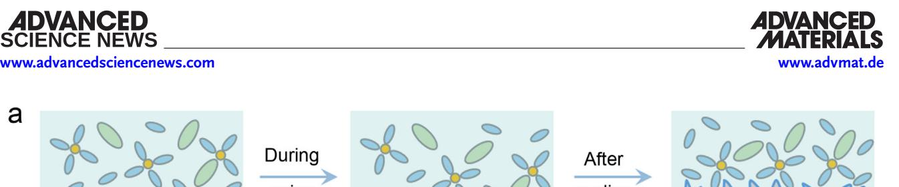
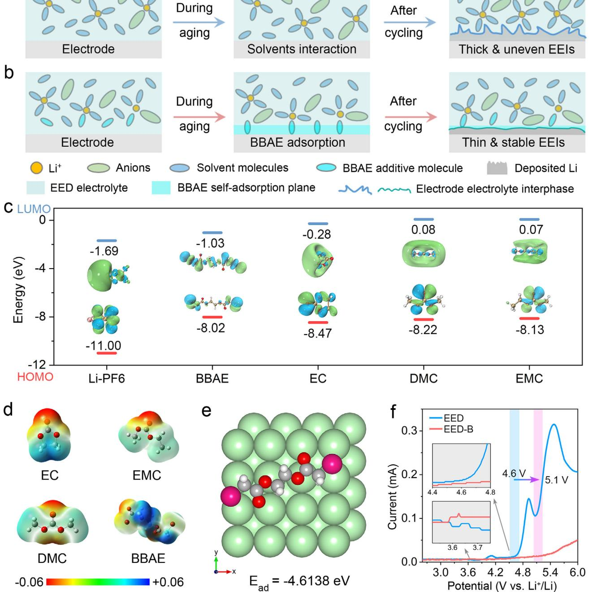
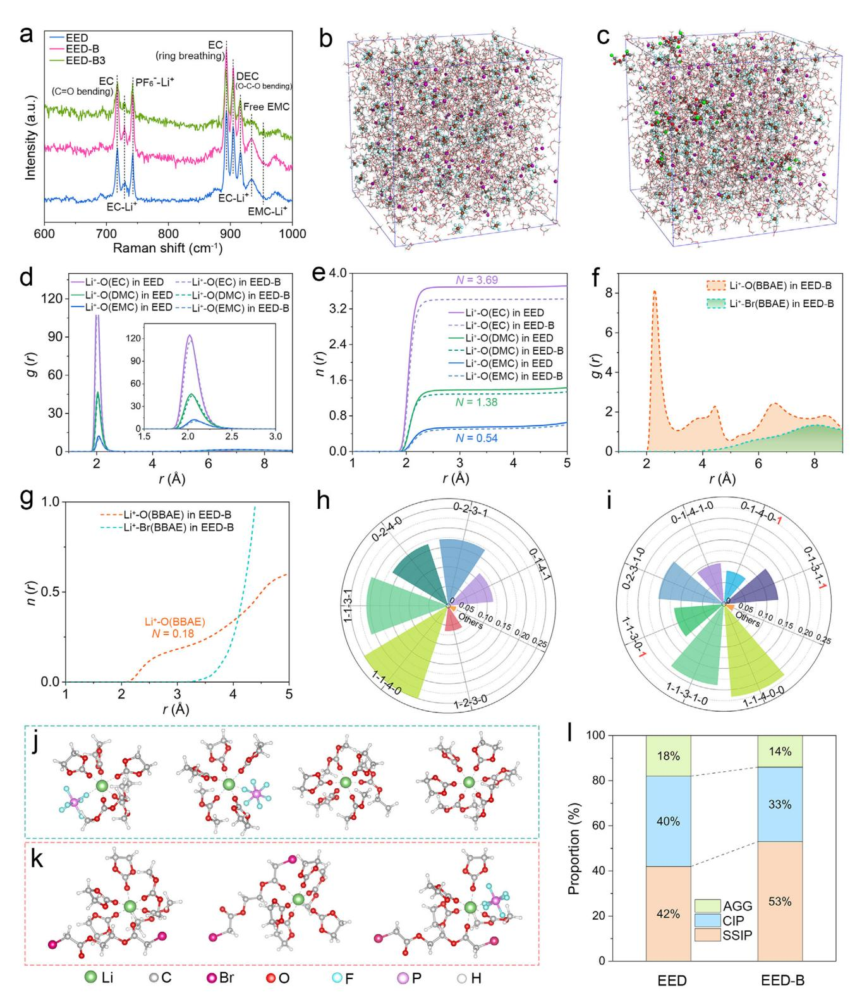
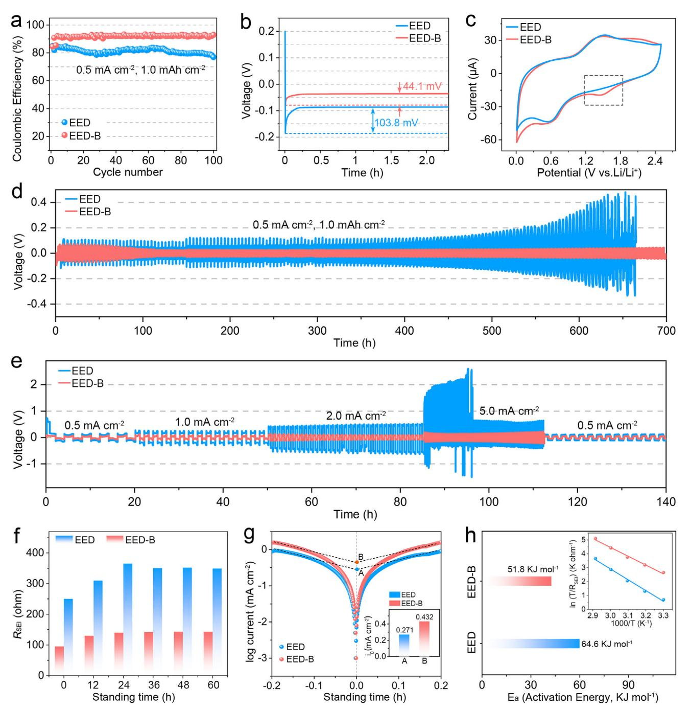
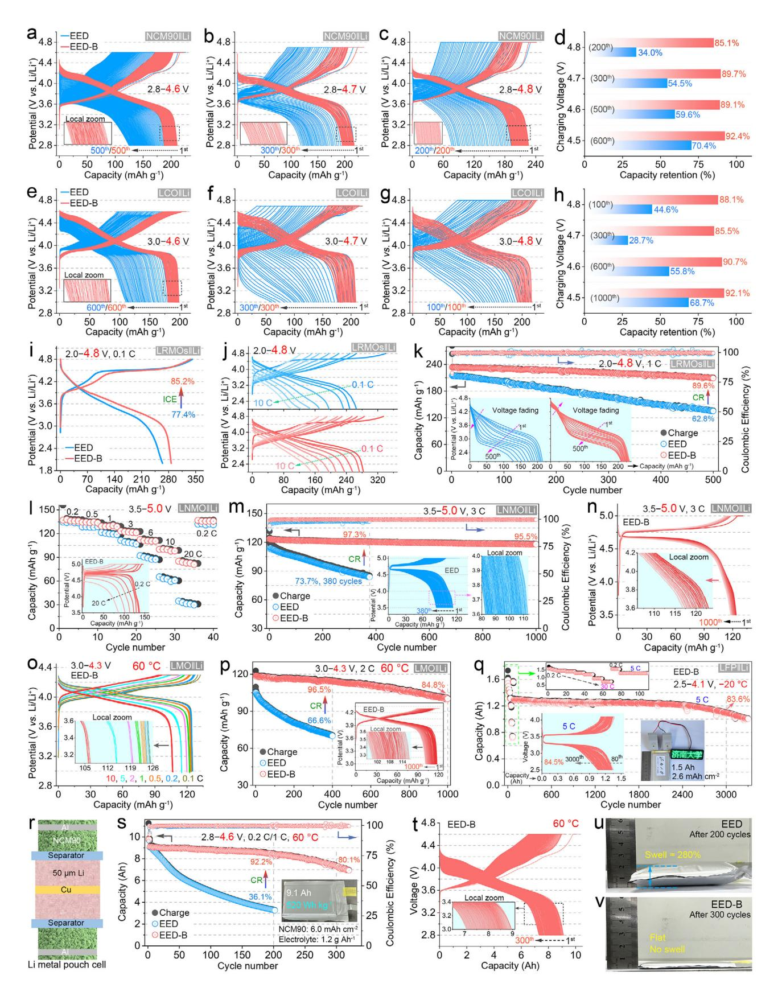
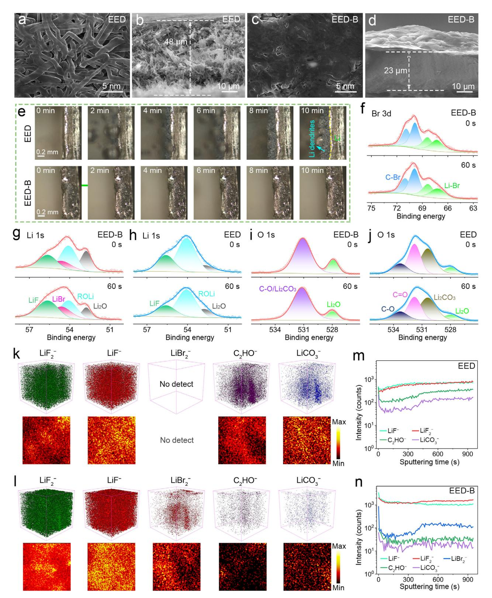
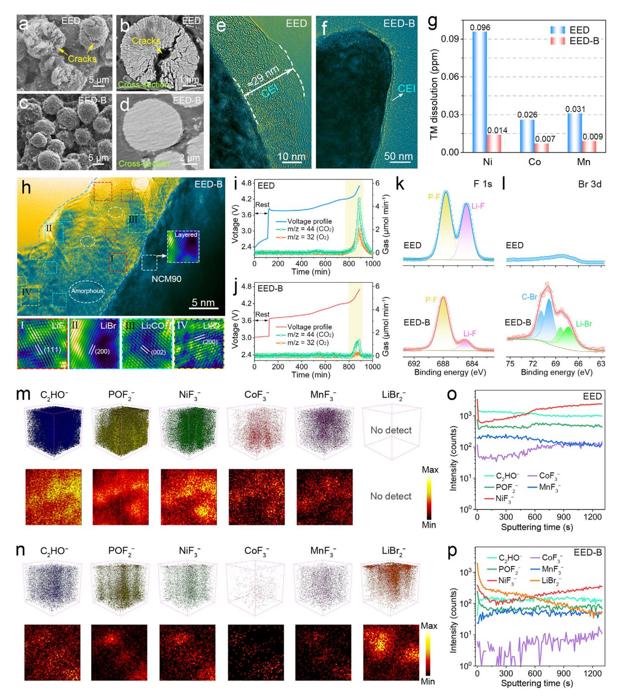
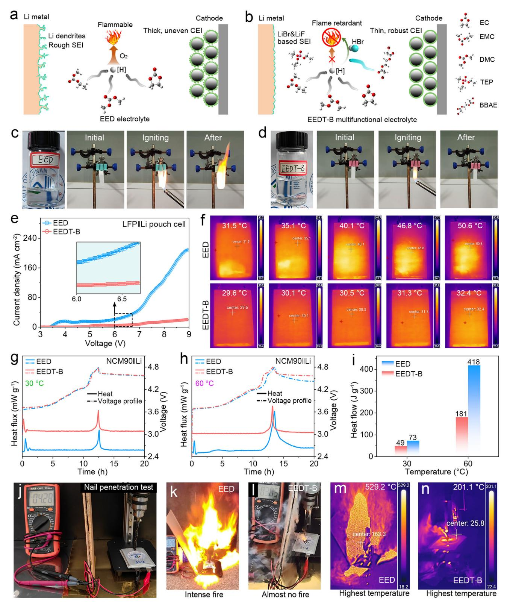

# **Tailoring Electrode-Electrolyte Interfaces via Electrolyte Additive Engineering for Reliable 5 V-Class 500 Wh Kg−1 Lithium Metal Batteries**

*Longwei Liang, Lixian Wang, Fulu Chu,\* Linrui Hou,\* and Changzhou Yuan\**

**The inherent incompatibility of nonaqueous electrolytes with highly reactive cathodes, along with their high flammability, severely impedes the development of high-voltage lithium metal batteries (LMBs). Herein, functional carbonate-based electrolytes are designed by incorporating 1,2-bis(bromoacetoxy)ethane (BBAE) additive, demonstrating the intrinsic nonflammability and remarkable operation of 5.0 V cells. Experimental results and theoretical simulations uncover that the addition of BBAE induces a self-absorption plane and modifies the solvation structure, leading to the in situ formation of reinforced hybrid halide electrode-electrolyte interphases (EEIs), which suppress surface parasitic reactions under high-voltage conditions above 4.5 V while inhibiting lithium dendrite growth on the lithium metal anode. Moreover, the optimized electrolytes exhibit enhanced fire retardancy thanks to the contribution from the bromine functionality within BBAE and the effective combination with nonflammable triethyl phosphate. Consequently, LMBs equipped with typical cathodes including LiNi0.9Co0.05Mn0.05O2 (NCM90), high-voltage LiCoO2, etc., exhibit exceptional deep cycling stability and wide-temperature-tolerant capability over a broad voltage window of 4.1 − 5.0 V. Additionally, 520 Wh kg−1 NCM90||Li pouch cells surprisingly pass the nail penetration tests, highlighting the prominent safety. This straightforward and cost-effective approach provides an inspirational strategy for the safe application of LMBs by reinforcing the interface stability and reconciling the electrolyte flame retardancy.**

### **1. Introduction**

Lithium-ion batteries (LIBs) favored by the Nobel Prize are widely used in daily life especially for the portable devices and electric vehicles (EVs).[\[1,2\]](#page-20-0) However, current energy densities powered by typical LIBs with a combination of graphite anode (372 mAh g−1) and LiCoO2 cathode (LCO, 274 mAh g−1) are encountering a limited and unsatisfactory predicament.[\[3\]](#page-20-0) When facing

L. Liang, L. Wang, F. Chu, L. Hou, C. Yuan School of Materials Science & Engineering University of Jinan Jinan 250022, P. R. China E-mail: [mse\\_chufl@ujn.edu.cn;](mailto:mse_chufl@ujn.edu.cn) [mse\\_houlr@ujn.edu.cn;](mailto:mse_houlr@ujn.edu.cn) [mse\\_yuancz@ujn.edu.cn](mailto:mse_yuancz@ujn.edu.cn)

The ORCID identification number(s) for the author(s) of this article can be found under <https://doi.org/10.1002/adma.202516153>

**DOI: 10.1002/adma.202516153**

a new wave of energy storage requirements such as future application scenarios of long-driving-range EVs and even unmanned aerial vehicles, the need for next-generation energy storage devices with high-energy-density (HED) battery chemistries has become more pressing than ever before.[\[4–6\]](#page-20-0) Considering manifold advantages of lithium metal anode (LMA) including the high theoretical capacity (3860 mAh g−1) exceeding ten times that of graphite, the lowest redox potential (−3.04 V versus standard hydrogen electrode), and excellent compatibility with various high-specific-capacity cathodes, lithium metal batteries (LMBs) hold great promise and are theoretically considered a pivotal solution to overcome the energy density bottleneck.[\[7–10\]](#page-20-0) When paired with practical high-voltage cathodes, such as high-voltage LCO, LiNi0.9Co0.05Mn0.05O2 (NCM90), or Li[Li0.2Mn0.54Ni0.13Co0.13]O2 (LRMOs), high-voltage LMBs can potentially deliver an overwhelming energy density exceeding 500 Wh kg−1. [\[3\]](#page-20-0) This would bring us one step closer to the goal of developing HED storage devices, which the aim to double the energy density of existing LIBs.

However, the HED LMBs have encountered numerous challenges since their inception.[\[11–13\]](#page-20-0) The primary issue stems from the high chemical reactivity of LMA, which gives rise to a series of problems. Thermodynamically unstable Li reacts with traditional nonaqueous carbonate electrolyte of 1 M LiPF6 in ethylene carbonate/ethyl methyl carbonate/dimethyl carbonate (EC/EMC/DMC, 1:1:1 in volume, denoted as EED), triggering continuous side reactions and spontaneously forming a solid electrolyte interphase (SEI) on the surface of LMA (**Figure 1**[a\)](#page-1-0). The decreased cycling reversibility consequently occurs as well as the consumption of active lithium and finite electrolyte resources. Given the heterogeneous and fragile SEI, nonuniform Li+ transport and mechanical damage always lead to notorious lithium dendrites.[\[14–16\]](#page-20-0) This poses a significant safety risk due to the greatly increased likelihood of internal short-circuit. Another crucial challenge for the HED LMBs lies in their inability to operate stably under high-voltage conditions.[\[17\]](#page-20-0) For high-Ni cathodes of LiNixCoyMn1−x−yO2 (NCM, *x* ≥ 0.8), various issues emerge at high charged states

**Figure 1.** Physicochemical features of electrolytes. Schematic illustration of the solvation chemistries and interfacial behaviors of a) conventional EED and b) EED-B electrolytes. c) HOMO/LUMO energy level and d) ESP of various components in EED-B electrolytes. e) Adsorption energy of BBAE molecule on the (001) plane of Li metal. f) LSV curves of the Li-stainless steel (SS) cells with the two electrolytes from open circuit voltage (OCV) up to 6.0 V versus Li/Li+.

including electrolyte decomposition catalyzed by Ni4+ redox, thick cathode electrolyte interphase (CEI) layer, disordered phase structures, microcracks in cathodes, and combustible oxygen gas originating from the escaping lattice oxygen.[\[18\]](#page-20-0) These thorny problems collectively cause poor cycling performance and significant safety concerns with inherent thermodynamic instability. Consequently, fully capitalizing on the advantages of HED LMBs remains a daunting task. The most critical safety risks in LMBs arise from their high operating voltage, strong oxidizing capability, ultralow electrochemical potential, and the use of organic, flammable, and volatile electrolytes. Simultaneously achieving a trifecta of high voltage, superb performance, and high safety in LMBs is an arduous challenge that requires sustained and collaborative efforts.

Among the numerous modification strategies explored currently, electrolyte engineering emerges as the most versatile and widely applicable strategy.[\[19–21\]](#page-20-0) Electrolytes are categorized into distinct types, including ethers, esters, sulfones, nitriles, and phosphate esters, and each one has its own unique advantages and limitations.[\[22,23\]](#page-20-0) For instance, ether-based compounds often lack stability under high voltages. High-concentration electrolytes (HCEs) and localized HCEs (LHCEs) are hindered by their elevated costs and high toxicity concerns. Free solvent molecules with rational molecular designs pose challenges not only in chemical synthesis but also entail significant chemical expenses. Moreover, carbonate-based electrolytes exhibit poor compatibility with LMAs, while ionic liquids and flame retardants such as phosphoric esters often compromise battery performance with limited universal applicability and high costs. Notwithstanding these challenges, several recent studies have made remarkable headway in the development of high-voltage LED LMBs. In fact, effective electrolyte components can be scientifically categorized based on their characteristic functional groups, namely boron (B)-, nitrogen (N)-, fluorine (F)-, and bromine (Br)-functionalized systems. Specifically for the fluorine functionality of electrolyte research, a compact ion-pair aggregate electrolyte was proposed to realize a 505.9 Wh kg−1 Li metal pouch cells, but is faces the challenge of low fluidity, low ion conductivity, and high cost.[\[24\]](#page-20-0) A dicarbonate solvent electrolyte of 1 M LiPF6 in dimethyl 2, 5-dioxahexanedioate (DMDOHD) successfully achieved 5 Vclass LMBs, delivering an impressive 97% capacity retention in Li||LiNi0.5Mn1.5O4 cells.[\[25\]](#page-20-0) Nevertheless, the chemical synthesis of DMDOHD and its relatively low ion conductivity raise doubts about the practicality of this electrolyte for large-scale applications. By manipulating the conformational isomerism of the DMC solvent, a lithium difluorosulfonylimide (LiFSI)-DMC electrolyte was developed, breaking the solubility limit to create a super-concentrated 17 M LiFSI electrolyte.[\[26\]](#page-20-0) This anionmediated solution enabled a 4.9 V-class Li||LiNi0.8Co0.1Mn0.1O2 cell, but concerns regarding cost-effectiveness and conductivity persist. Notably, the above-mentioned electrolyte systems have not adequately addressed the crucial safety performance. When lacking flame retardancy, the risk of battery thermal runaway becomes extremely high. An intrinsically nonflammable electrolyte of 1 M lithium difluoro(oxalato)borate in co-solvents of triethyl phosphate (TEP) and N-methyl-N-propyl-pyrrolidinium bis(trifluoromethylsulfonyl)imide [Pyr13][TFSI] was designed to construct the F, B-rich CEI/SEI layers based on the boron and fluorine functionality, and demonstrate high safety LMBs with an energy density of 470 Wh kg−1. [\[4\]](#page-20-0) However, the use of the phosphoric ester flame retardant and high viscosity of electrolytes result in certain sacrifices in cycling performances, along with the inevitable high costs.

Despite extensive research dedicated to high-voltage HED LMBs, the electrolyte systems investigated in prior studies have invariably fallen short of simultaneously delivering satisfactory performance and ensuring robust safety. As a consequence, there is an urgent imperative to design a multifunctional composite electrolyte system that can concurrently attain high ionic conductivity, superior interface stability, low cost, and elevated safety.[\[12,19\]](#page-20-0) These attributes are indispensable for constructing high-performance and prominent-safety LMBs that can boast an energy density exceeding 500 Wh kg−1 and enable reliably function under harsh working conditions.[\[11,25\]](#page-20-0) The additive strategy has been a cornerstone of battery technology.[\[22\]](#page-20-0) Commonly, electrolyte additives are utilized to enhance energy density of LMBs. Nevertheless, the quest to safeguard safety while optimizing performance has remained a persistent and daunting challenge in this field. Moreover, the most of valuable cases studies in electrolyte research have focused on B-, N-, and F-functionalized systems, whereas relatively little attention has been paid to electrolyte components with Br functionality. Just some studies have already demonstrated the unique advantages of Br-containing species within the CEI and SEI, such as enhanced surface ion diffusion and higher surface energy.[\[27\]](#page-20-0) Archer et al. previously investigated the positive effects of LiBr as an electrolyte additive, proposing Br-based (Brrich) electrolytes as a feasible strategy to stabilize active metal electrodeposition.[\[28\]](#page-20-0) Additionally, triphenyl-phosphonium bromides with different alkyl chains were employed as electrolyte additives to inhibit lithium dendrite growth by regulating electrolyte solvation structure and SEI.[\[29\]](#page-20-0) Moreover, LiBr-enriched SEI was shown to enhance electrolyte stability toward metallic lithium in solid-state polymer batteries, and Br-containing substances also exhibited flame-retardant properties.[\[30\]](#page-20-0) On the whole, researches on Br-functionalized electrolyte composition and design remain relatively limited, and these ever-achieved findings have motivated us to expand research on Br-based additives.

Against this backdrop, the contribution innovatively presented an electrolyte additive strategy with 1, 2-bis(bromoacetoxy)ethane (BBAE) molecule with the Br functionality, and designed a modified electrolyte of EED with BBAE (denoted as EED-B, Figure [1b\)](#page-1-0) that enabled a 5 V high-voltage and 500 Wh kg−1 long-life lithium metal pouch cell, effectively balancing universality and safety. Comprehensive results revealed that the additive featuring Br functionality triggered the self-adsorption plane to prevent the oxidative decomposition of solvents and updated the solvation structures to create thin yet robust electrode-electrolyte interphase (EEI) films composed of hybrid inorganic species on both the cathode and anode surfaces. The exceptional compatibility of designed electrolytes was further substantiated by a series of LMBs employing various types of cathodes under highvoltage operation. NCM90||Li coin cells delivered an impressive capacity retention (CR) of 85.1% at 1 C after 200 cycles with a charging cutoff voltage of 4.8 V at 25 °C. Meanwhile, NCM90||Li pouch cells, featuring high-loading cathodes of 6 mAh cm−2 and a lean electrolyte of 1.2 g Ah−1, achieved a remarkable energy density of 520 Wh kg−1 and exhibited a high CR of 92.1% at 1 C after 200 cycles at 4.6 V and 60 °C. Moreover, LiNi0.5Mn1.5O2 (LNMO)||Li coin cells operated stably for 1000 cycles at 3 C, showing an outstanding CR of 95.5% under a higher voltage of 5 V. Furthermore, NCM90-based lithium metal pouch cells could even successfully pass the nail penetration test, highlighting their enhanced safety features when the modified electrolytes were used. The proposed approach demonstrated a highly promising avenue for harmonizing superior performance with reliable operational safety in advanced energy storage systems.

## **2. Results and Discussion**

### **2.1. Physicochemical Properties and Solvation Structures of Designed Electrolytes**

The molecular structure of additives is essential to regulate interfacial behavior and dictates the priority decomposition mechanism.[\[21,31,32\]](#page-20-0) Considering the self-adsorption capacity on electrode surface, the ability to construct stable EEIs, and thermal stability of electrolyte additives, BBAE emerges as the optimal choice (Figures S1 and S2, Supporting Information). The BBAE molecule is featured with distinctive functional groups, including double carboxyl groups, C─O─C─C─O, O═C─OCH3, O─C─CH3, and Br atoms within its long-chain alkyl structure (Figure S1, Supporting Information). These structural characteristics endow BBAE with a multitude of anticipated advantages. They enable parallel adsorption of BBAE molecules, enhance the formation of high-quality interfacial layers, improve anodic stability, and promote efficient desolvation.[\[21,25,31,32\]](#page-20-0) As a result, BBAE is expected to deliver outstanding electrochemical performance and reinforced safety of the electrolyte system.

In order to preliminarily understand the potential electrochemical redox stability of electrolyte components, the frontier molecular orbitals are calculated based on density functional theory (DFT) calculation to determine their feasibility in highvoltage LMBs, including the highest occupied molecular orbital (HOMO) for reduction behaviors and the lowest unoccupied molecular orbital (LUMO) for the oxidation reactions (Figure [1c;](#page-1-0) and Table S1, Supporting Information). As widely reported, the substance with a more negative (lower) HOMO energy level will be more difficult to lose electrons, thus presenting better antioxidant properties.[\[4,23,25\]](#page-20-0) While for the LUMO energy level, a more negative value indicates more readily to acquire electrons, thereby facilitating an easier reduction reaction. According to the DFT results (Figure [1c\)](#page-1-0), BBAE has a preference toward reduction due to the low LUMO energy (−1.03 eV) next to those of carbonate solvents. This is expected to promote the stable formation of SEI films enriched with lithium halides (LiF and LiBr). In addition, the highest HOMO energy (−8.02 eV) of BBAE indicates its relatively strong tendency to undergo oxidation, compared with other electrolyte components. This should be a promising phenomenon for building high-voltage LMBs, since the preferred oxidation decomposition of BBAE can generate sturdy CEI layers on various aggressive cathodes.[\[17\]](#page-20-0)

Electrostatic potential (ESP) results (Figure [1d\)](#page-1-0) reveal that the carboxyl functional exhibits a higher ESP for nucleophilicity, as indicated by the prominent red area in BBAE, suggesting that carboxyl groups are well known for their strong interaction of interfacial adsorption and their ability to renovate Li+ solvation structure.[\[21,31,32\]](#page-20-0) The induced self-adsorption monolayer can relieve the interfacial side reactions between free solvent molecules and highly active electrodes. Moreover, the updated solvation structure derived from the BBAE can enhance Li+ transport kinetics and induce stable EEI films with more inorganics. While the Br atoms terminated in alkyl chain can easily leverage from the alkane chain.[\[33\]](#page-20-0) Resultant LiBr, as the most easily formed species, can be interwoven with the existing LiF to produce a hybrid SEI rich in binary halide (LiF-LiBr) on LMA and a hybrid CEI on high-voltage cathodes meanwhile.[\[33\]](#page-20-0) DFT calculations further corroborate that the introduced BBAE molecule with a higher adsorption energy (*Ead*) of −4.61 eV can spontaneously adsorb on the LMA surface and various cathodes (Figure [1e\)](#page-1-0). Full body flat adsorption on the Li (001) surface suggests a strong surface adsorption capability to well-distributed occupy reactive sites (Figure S3, Supporting Information). This is similar to the electroplating effect, which passivates electrode surfaces and guides the homogenous electrodeposition of Li+ flux.[\[31,34\]](#page-20-0)

The linear sweep voltammetry (LSV) was conducted to further validate the higher oxidation activity of the BBAE additive at 3.6 V (vs Li/Li+) (Figure [1f\)](#page-1-0). A moderately higher current can be observed, indicating a pre-oxidation behavior for the BBAEenhanced electrolyte (the inset in Figure [1f\)](#page-1-0). Consequently, the self-sacrifice oxidation of BBAE, coupled with the strong surface adsorption behavior, would form a protective layer to prevent the further excessive oxidation of solvent carbonate molecules. This leads to an anti-oxidation armor to safeguard the cells stably operated over 5 V with a minor oxidation leakage current. While EED encounters electrochemical oxidative instability above 4.1 V, especially with the sharp rise in oxidation current beyond 4.6 V warning threshold, which is also consistent with the widely recognized knowledge.[\[22,23\]](#page-20-0) The significant variability of oxidation current signals demonstrates that the pre-oxidation of BBAE is effective in improving the interfacial stability for 5 V-class highvoltage LMB scenarios.

The influence of BBAE on ionic conductivity is also investigated for the EED-B electrolyte (Figure S4, Supporting Information). The satisfactory ionic conductivity value of ≈10 mS cm−1 highlights that the additive BBAE exerts virtually no substantial influence on the inherent ionic conductivity of the electrolyte system, thereby ensuring that the modified electrolyte is capable of fulfilling the requirements for battery applications across a wide range of C-rates.[\[25\]](#page-20-0) Therefore, BBAE can indeed serve as a multifunctional electrolyte additive to guide the solvation structure of the modified electrolyte and stabilize the EEIs on both Li anodes and different cathodes.

Solution microenvironments of EED and EED-B electrolytes are revealed by Raman spectroscopy and theoretical calculations (**Figure 2**[;](#page-4-0) Figures S5–S10 and Tables S2–S5, Supporting Information). Raman spectrum of BBAE liquid phase lacks welldefined sharp peaks, likely attributed to its low polarizability and high structural symmetry (Figure S5a, Supporting Information). Faint peaks corresponding to the -Br and C-Br functional groups are discernible at 300 and 540 cm−1, respectively, and the C-Br signal becomes more pronounced with increasing BBAE concentration (Figure S5a,b, Supporting Information).[\[35\]](#page-20-0) With the addition of BBAE molecule, the solvation structure undergoes the noticeable changes, as slight spectral differences are observed at 716, 730, 743, and 893 ‒ 920 cm‒1 (Figure [2a\)](#page-4-0). These signals result from changes in the interactions among free solvent molecules, coordinated PF6 − anions, and solvents engaged in Li+ solvation.[\[26,36,37\]](#page-20-0) The peak intensities of coordinated solvents and coordinated PF6 − increase from EED-B (1 wt.% BBAE additive) to EED-B (3 wt.% BBAE additive), accompanied by attenuated signals from free solvent molecules. Such unique spectral behavior is rationally attributed to the preferential solvation of Li+ ions by BBAE, which updates the original solvation sheath. This suggests that the strong coordination ability of BBAE can alter the core species in the Li+ first solvation sheath due to the carboxyl

**Figure 2.** Solvation structures of EED and EED-B electrolytes. a) Raman spectra of the three electrolytes as indicated. MD simulation snapshots of b) EED and c) EED-B. d) The radial distribution function (RDF) and e coordination number of Li+-solvents interactions. f) RDF and g) coordination number of Li+-BBAE interactions. Li+ coordination environments of h) EED and i) EED-B. Representative solvation structures in electrolytes j) without or k) with the BBAE additive. l) Comparison of SSIP, CIP, and AGG ratios of the two electrolytes.

IDVANC CIENCE NEWS www.advancedsciencenews.com

functional group, stabilizing the solvation structure by strengthening the solvation interaction between the BBAE molecule and  $Li^+$ .

The microenvironment of electrolytes significantly affects their interfacial redox activity.[12,38] Hence, the detailed solution microstructures are further investigated in depth with theoretical proof based on molecular dynamics (MD) simulations from a solvation point of view. As shown by the visualized snapshots of the simulated electrolytes (Figure  $2b$ ,c), the radial distribution function (RDF) and coordination number of central Li+, as well as distinctive solvation clusters, are obtained through reasonable modeling and rigorous simulation. The snapshots of simulation boxes for each electrolyte component are provided for a better understanding of the specific configuration information (Figures S6 and S7, Supporting Information). Free configuration of each molecule/ion or Li+ clusters disperse in a confined simulation box, showing scarcely any fluctuations or irregular void space, featuring the high accuracy and reliability of the simulation results above. According to the RDF curves, the high RDF peaks of Li+-O (solvents) and the small peak of Li+-F ( $PF_6^-$ ) are evidenced at 2 – 2.4 Å for both systems (Figure 2d; Figure S8, Supporting Information). While the intensities of all the same peaks in EED-B are slightly lower than those in EED (Figure  $2d_e$ ), this is mainly due to the involvement of BBAE, which weakens the coordination of other components with Li+. In addition, the distinct peak of  $Li^+$ -O (BBAE) is clearly observed in the modified electrolyte at 2.3  $\AA$ , accompanied by a gradually rising peak of Li+-Br (BBAE) at  $\approx$ 4 Å (Figure 2f). And the coordination number results are determined to be 3.69, 1.38, 0.54, 0.48, and 0.18, corresponding to the  $Li^+$ -O (EC),  $Li^+$ -O (DMC),  $\text{Li}^+$ -O (EMC),  $\text{Li}^+$ -F (PF6-), and  $\text{Li}^+$ -O (BBAE) coordination structures, respectively (Figure 2e,g; and Table S3, Supporting Information). It indicates that solvent molecules like EC and DMC are heavily involved in the solvation of Li+, forming a solventdominant solvation structure.[37] While for the EED-B, the majority of BBAE molecule highly participates in the first solvation shell of  $Li^+$  to innovate the original primary solvation sheath. Since the carboxyl group with lone pair electrons is the main functional group to solvate Li+, the Br atoms at chain terminated region should be not primarily involved in the coordination with  $Li^+$  as the farther RDF peak of  $Li^+$ -Br (BBAE) is further away from  $Li^+$  (Figure 2f,g). The configuration is similar to that of a P atom in the Li+-F ( $PF_6^-$ ) cluster (Figure S8, Supporting Information). Furthermore, the various principal solvation species in the two systems lead to extensive solvation environments around  $Li^+$ , as evidenced by the most typical and predominant  $Li^+$  solvation clusters of EED (Figure 2h) and EED-B (Figure  $2i$ ).

For better identification of these solvation, we have performed labeling, where 1-1-1-1-1 represents the presence of one  $PF_6^-$ , one EC, one DMC, one EMC, and one BBAE in each cluster structure, i.e.,  $\text{Li}^+[(PF_6^-)_1 (DMC)_1 (EC)_1 (EMC)_1 (BBAE)_1]$ . Form the Li+ coordination results, the main solvation structures in EED solution are discovered to be  $\text{Li}^+[(\text{PF}_6^-)_1(\text{DMC})_1(\text{EC})_4(\text{EMC})_0]$  $(1-1-4-0-0)$ for  $25.12\%$ ) (Figure 2j),  $\text{Li}^+[(PF_6^-)_1(DMC)_1(EC)_3(EMC)_1]$  (1-1-3-1-0 for 20.95%) (Figure 2j),  $\text{Li}^+[(\text{PF}_6^-)_0(\text{DMC})_2(\text{EC})_3(\text{EMC})_1]$  (0-2-3-1-0 for 17.13%) (Figure 2j),  $\text{Li}^+[(PF_6^-)_0(DMC)_2(EC)_4(EMC)_0]$  (0-2-4-0-0 for 16.65%) (Figure 2j),  $\text{Li}^+[(PF_6^-)_0(DMC)_1(EC)_4(EMC)_1]$ 

(0-1-4-1-0 for 11.58%) (Figure S9, Supporting Information),  $\text{Li}^+[(PF_6^-)_1(DMC)_2(EC)_3(EMC)_0]$  (1-2-3-0-0 for 6.50%) (Figure **S9**, Supporting Information), and other clusters (2.07%), respectively. While for the EED-B system, the solution environment certainly makes a difference due to the strong coordination ability of BBAE with Li+. Although the main component in EED-B is still the solvation structure involving the original carbonate solvent molecules, appreciable BBAE-induced solvation clusters have emerged in the solution. These characteristic BBAE-containing species, as demonstrated in Figure  $2k$ , are determined as  $\text{Li}^+[(PF_6^-)_0(DMC)_1(EC)_3(EMC)_1(BBAE)_1]$  (0-1-3-1-1, 12.71%),  $\text{Li}^+[(PF_6^-)_1(DMC)_1(EC)_3(EMC)_0(BBAE)_1]$  (1-1-3-0-1, 11.63%),  $\text{Li}^+[(PF_6^-)_0(DMC)_1(EC)_4(EMC)_0(BBAE)_1]$  (0-1-4-0-1, 7.79%), while the other main components are solvent/anion-dominated Li+ clusters including Li+[ $(PF_6^-)_1(DMC)_1(EC)_4(EMC)_0$ ] (1-1-4-0-0 for 21.67%) (Figure 2j), Li+[(PF6-)1(DMC)1(EC)3(EMC)1] (1-1-3-1-0 for 18.92%) (Figure 2j),  $\text{Li}^+[(PF_6^-)_0(DMC)_2(EC)_3(EMC)_1]$  (0-2-3-1-0 for 15.31%) (Figure 2j),  $\text{Li}^+[(PF_6^-)_0(DMC)_1(EC)_4(EMC)_1]$ (0-1-4-1-0 for 9.56%) (Figure S9, Supporting Information), and other clusters  $(2.41\%)$ , respectively.

As a statistical result, the proportion of different solvent/anioncation ( $Li^+$ ) association species is also consequently calculated (Figure 21; and Table S5, Supporting Information). The ratios of solvent-separated ion pairs (SSIPs), contact ion pairs (CIPs), ion-pair aggregates (AGG) are estimated as 42%, 40%, and 18% for EED, while 53%, 33%, and 14%, respectively, for the case of EED-B. Since the BBAE is the long chain alkanes in molecular state with a strong coordination, BBAE will replace the solvent molecules or even PF6- anions to exhibit larger Li+ clusters. But these featured clusters are still generally defined as SSIPs. Therefore, it is reasonable that the EED-B system displays a relatively high proportion of SSIPs, while these SSIPs can facilitate the Li+ transport and still functionalize the stable interface with the active BBAE compared to the traditional SSIPs. The aforementioned representative solvation structures are further extracted from the two simulated systems to directly perceive their microstructural differences (Figure  $2i_k$ ). Although the two carboxyl oxygens  $(C=0)$  in BBAE can serve as two coordination sites, allowing for the formation of large clusters with Li+ as  $\text{Li}^+_2[(\text{PF}_6^-)_1(\text{DMC})_2(\text{EC})_7(\text{EMC})_0(\text{BBAE})_1]$ - (1-2-7-0-1) (Figure **S10**, Supporting Information), the proportion of such structures is indeed small. Typically, one oxygen coordination site of BBAE interacts with  $Li^+$ , while the other vacant carbonyl oxygen can engage with the electrode surface via adsorption behavior. Consequently, a bridging mechanism is emerged that BBAE can function as a bridge to induce the diffusion of  $Li^+$  toward the electrode surface.

The desolvation activation energies for Li+ clusters in the two systems are nearly identical (Table S5, Supporting Information), and the Li+ desolvation process in EED-B is expected to be more facile when interface adsorption is coupled with the bridging behavior of BBAE. In addition, C-Br bond cleavage originating from Br atoms attached to the terminal site of long-chain alkanes is more likely to occur, leading to the formation of lithium halides that strengthen the EEIs.[33] Hence, fundamental differences in the electrolyte solvation will have a profound impact on Li+ transport behavior, interface construction, and battery performance as the later results will be strongly validated.

**Figure 3.** Compatibility and electrochemical kinetics of EED and EED-B electrolytes with LMA. a) CE curves and b) galvanostatic profiles of Li||Cu cells during Li plating/stripping. c) CV analysis of Li||Cu cells. d) Long-term cycling performance and e) rate capability of Li||Li cells. f) Evolution of electrochemical impedance of Li||Li cells. g) Tafel tests from −0.2 to 0.2 V. h) Calculated activation energy of charge transfer process across Li/electrolyte interface (the inset for Arrhenius plots for the fitted charge transfer resistance of Li||Li cells).

#### **2.2. Cycling Performance and Kinetics of LMA**

The enhanced compatibility of the BBAE electrolyte on LMA is examined using Li||Li and Li||Cu configurations.[\[24,25,39\]](#page-20-0) For the EED electrolyte (**Figure 3**a), the Coulombic efficiency (CE) is ≈80% with a shortened lifespan of 80 cycles under the condition of 1.0 mAh cm−2 at 0.5 mA cm−2, while the BBAE-based cell shows a stable 100 cycles with a higher CE over 90%, which should be ascribed to the enhanced interphase by the functional BBAE. The resultant SEI with more halides exhibits the improved lithiophilicity with a smaller nucleation overpotential (*n*) of 44.1 mV (Figure 3b).[\[31,40\]](#page-20-0) But the conventional one shows difficulty in nucleation with a large *n* over 103.8 mV. Such a difference indicates that the regenerated SEIs with BBAE can regulate the initial nucleation of Li seed, leading to more favorable Li deposition and the expected flat Li growth. Cyclic volumetry (CV) curves also verify the nature of interfacial stability that BBAE is preferred to be electrochemical reduced at 1.45 V (vs Li/Li+) (Figure 3c). The preferential reduction can form a stable SEI enriched in hybrid halides and other Li inorganics, which inhibits the serious side reactions between Li metal with strong reducibility and the highly active carbonate solvent molecules.

The effectiveness of BBAE is also corroborated by the properties of Li|Li cell, which exhibits the long-term cycle stability over 700 h at 0.5 mA cm $-2$  (Figure 3d). Apparently, corresponding overpotential is stable, but the cell with EED experiences a growing overpotential with intermittent short circuits. With the current density further increasing to 1 and 2 mA cm-2, the serious cell degradation or even cell failure is evident since the overpotential in pristine cells increases sharply ( $>1000$  mV after 260 h at 1 mA cm-2 and  $>1500$  mV after 60 h at 2 mA cm-2) (Figure **S11**, Supporting Information). While Li||Li cells with EED-B still maintain a stable overpotential of  $\approx$ 50 mV. The interface overvoltage increases slightly only after 240 h at 2 mA cm-2. To further assess the robustness of halide-rich SEI, the rate capability of Li||Li is evaluated, as plotted in Figure 3e. The BBAE cells can stably operate at various current densities from 0.5 to 5 mA  $cm^{-2}$ , delivering the decent voltage curves with small overpotential of 70 mV. In stark contrast, the blank cells suffer from an incremental overpotential beyond the runway threshold of 2 mA  $\text{cm}^{-2}$ , and completely fail at 5 mA  $\text{cm}^{-2}$  with asymmetrical curve shape and incontrollable overvoltage up to 2000 mV. This further demonstrates that BBAE guarantees the better interfacial stability of LMA, which contributes to a markedly improved cycling stability with expected flat Li growth.

As the interfacial information revealed, the BBAE-induced SEI presents the distinct feature of rich LiF and LiBr species. Since LiBr shows the lower Li+ diffusion barrier (0.025 eV) and surface energy (0.32 J  $\text{m}^{-2}$ ) than those of LiF (14.6 eV and 0.96  $\int$  m-2), the hybrid SEI film composed of these inorganic components (LiF, LiBr, Li2CO3, Li2O, etc.) will also produce more grain boundaries.[27] Consequently, the Li+ transport capability with homogeneous Li+ flux across liquid/solid interfaces will be greatly enhanced to promote the interfacial reaction kinetics.[12,27] Moreover, the fast surface diffusion of Li+ and low surface tension will facilitate the uniform Li nucleation, and further enable flat and even deposition on Li anodes, effectively suppressing the undesirable lithium dendrites (Figure S12, Supporting Information). The evolution of interface impedance is monitored via electrochemical impedance spectroscopy (EIS) of Li-Li symmetric cells to prove the enhancement effect induced by EED-B electrolyte (Figure 3f; Figure S13, Supporting Information). The SEI impedance ( $R_{SFI}$ ) of EED system increases slowly with the standing time, just displaying 143  $\Omega$  after 60 h, even smaller than that of EED (349  $\Omega$ ). Since the BBAE molecule tends to parallel adsorption on the Li surface, a relatively large  $R_{SEI}$  value emerges, but with a small fluctuation range. It indicates that a dense and stable absorption monolayer is presumably generated before cycling, which effectively reduces unwanted interface side reactions in subsequent cycles.[31,32]

The favorable interfacial kinetics are further evidenced by Tafel plots (Figure 3g).[41] The exchange current density of cells with

EED-B is calculated as  $0.432$  mA cm-2, significantly higher than that of cells with EED (0.271 mA  $\text{cm}^{-2}$ ), which proves that the incorporation of LiBr components into the SEI contributes to better kinetics. Since the transference number of Li+ ( $t_{Li+}$ ) is an important indicator as the endurance to mediate Li+ concentration gradients and avoid Li dendrites at high currents,  $t_{i+}$  is further evaluated using the Bruce-Vincent approach to examine the effeteness of BBAE.[40,42] The calculated result (Figure S14, Supporting Information) shows that the cell with EED-B exhibits a high steady-state  $t_{i+}$  of 0.46, even higher than that with EED ( $t_{i+}$  $= 0.31$ ). This authenticates that the modified SEI with LiBr can regulate the ion concentration and change the Li+ transport behavior to suppress Li dendrite growth.

The Li+ transport kinetics across SEI is also investigated by EIS test at different temperatures from 303 to 343 K (Figure S15, Supporting Information).[40,43] According to the fitting results based on the Arrhenius equation of  $1/R_{SEI} = A \exp(-E_a/RT)$ , where A,  $E_a$ , and R are the pre-exponential constant, the activation energy, and gas constant, respectively, the activation energies of charge transfer across SEI in different systems are obtained to be 51.8 kJ mol-1 for EED and 64.6 kJ mol-1 for EED-B (Figure 3h). The  $E_a$ results evidence the SEI formed in EED-B possesses favorable Li+ transport kinetics with a low diffusion barrier, thus supporting stable cycle performance for LMBs without the dendric Li troubles.

#### 2.3. Electrochemical Performance of High-Voltage LMBs

To demonstrate the compatibility and universality of designed EED-B electrolyte for practical LMBs, various cathode materials (Figure S16, Supporting Information) are adopted to fabricate full-cell LMBs and comprehensively evaluated under various testing conditions. Ultrahigh-Ni cathode NCM90 is first employed to investigate the compatibility of EED-B at room temperature (RT). The optimal amount of BBAE additives in the designed electrolytes is initially evaluated using NCM90||Li coin cells cycled within  $2.8 - 4.3$  V, revealing that the integration of EED-B yields the most superior performance (Figure S17, Supporting Information). Typical charge-discharge profiles of NCM90||Li cells over cycling  $(1 \text{ C})$  with ascending upper cut-off charge voltage from 4.5 to 4.8 V and a constant end-off discharge voltage of 2.8 V (Figure 4a–c; Figure S18, Supporting Information) are comparatively exhibited to understand the high-voltage tolerant capability of EED-B. Notably, the NCM90-based cells with EED-B are endowed with markedly improved long-span cycling stability across each applied voltage window (Figures S19–S22, Supporting Information), and meanwhile hold the well-preserved voltage plateaus owing to the relatively weakened electrochemical polarization (Figure S23, Supporting Information). Specifically, the NCM90|Li cells with EED-B show much higher CR especially at higher charging cut-off voltages, exhibiting as 92.4% after 600 cycles at 4.5 V, 89.1% after 500 cycles at 4.6 V, 89.7% after 300 cycles at 4.7 V, and 85.1% after 200 cycles at 4.8 V, respectively (Figure 4d). While for those with EED, corresponding CR values are calculated as 70.4% after 600 cycles at 4.5 V, 59.6% after 500 cycles at 4.6 V, 54.5% after 300 cycles at 4.7 V, and 34.0% after 200 cycles at 4.8 V, respectively. The results explicitly feature that BBAE can protect the electrochemical interface against

electrolyte decomposition and structure damage of NCM90 cathodes even at the high charged states.

More encouragingly, the better oxidation stability and cycling performance of EED-B can still be maintained from 4.6 to 4.8 V for the LCO||Li coin cells where the classic LCO cathode is used instead (Figure [4e–h;](#page-8-0) Figure S24–S29, Supporting Information). In particular, the high CR values are observed for the LCO||Li cells with EED-B under all the test conditions with different cutoff voltage limits: 4.5 V (92.1% after 1000 cycles at 1 C), 4.6 V (90.7% after 600 cycles at 1 C), 4.7 V (85.5% after 300 cycles at 1 C) and 4.8 V (88.1% after 100 cycles at 1 C) (Figure [4h\)](#page-8-0). But the cells with EED encounter severe capacity fade, along with the markedly lowered CR values of 68.7% after 1000 cycles (4.5 V) and 44.6% after 100 cycles (4.8 V). It further implies that the BBAE can form a more stable interphase to sustain the normal operation of LCO||Li cells under a series of elevated voltage conditions.

To further evaluate the anti-oxidation ability and desirable universality of EED-B for the potential construction of HED LMBs, the two most representative high-voltage cathodes of LR-MOs and spinel LNMO are selected to assemble LRMOs||Li cells (Figure [4i–k;](#page-8-0) Figures S30–S32, Supporting Information) and LNMO||Li cells (Figure [4l–n;](#page-8-0) Figure S33, Supporting Information). During the initial cycle (Figure [4i\)](#page-8-0), the LRMO||Li cells with EED-B present a high specific capacity of 286.8 mAh g−1 at 0.1 C under a high upper cut-off voltage of 4.8 V. However, the cell with EED only achieves a low reversible capacity of 264.2 mAh g−1 coupled with a higher overpotential. Accordingly, there is a significant difference in the initial CE of the two cells, i.e., a value of 85.2% for EED-B and 77.4% for EED. The rate capabilities also evidence their essential differences, as the modified LRMOs||Li cells demonstrate enhanced reversible capacities and suppressed voltage hysteresis (Figure [4j,](#page-8-0) Figure S30, Supporting Information). While the cells with EED undergo severe capacity decay, dropping from 265.7 (0.1 C) to 101.6 (10 C) mAh g‒1, the curves also show abnormal shape distortion. The robust long-term cycling performance of LRMOs||Li cells across various C rates (0.2 ‒ 2 C) further testifies the high-voltage compatibility of EED-B (Figure [4k;](#page-8-0) Figures S31 and S32, Supporting Information). Typically, the EED-B-based cells show exceptional cycling stability with a high CR of 89.6% after 500 cycles at 1 C and 4.8 V, much higher than that of EED (62.8%), as shown in Figure [4k.](#page-8-0) The insets in Figure [4k](#page-8-0) clearly evidence the significant differences in voltage attenuation between the two cells. The rate performance is further assessed through LNMO||Li cells, with the upper cutoff voltage elevated to 5.0 V. The cell with EED-B exhibits capacity advantages at various rates, especially from 3 to 20 C, resulting in specific capacities of 137.1, 134.5, 129.4, 123.3, 112.4, 100.1, and 85.1 mAh g−1 at 0.2, 0.5, 1, 3, 6, 10, and 20 C, respectively, even larger than those of the cell with EED (134.7 ‒ 34.7 mAh g−1 over a C rate range from 0.2 – 20 C) (Figure [4l\)](#page-8-0). The related voltage plots also prove the excellent rate capability of EED-B (the insets in Figure [4l\)](#page-8-0), compared to that of EED (Figure S33, Supporting Information). Moreover, the LNMO||Li cell with EED-B achieves superior long-term cycle stability at 3 C, delivering ultrahigh CR values of 97.3% after 380 cycles and 95.5% after 1000 total cycles (Figure [4m\)](#page-8-0). In sharp contrast, the cells with EED experience serious capacity decay along with a low CR of 73.7% after just 380 cycles, which in turn corroborates the powerful efficacy of BBAE. The charge-discharge profiles intuitively illustrate the difference between the two systems, as the capacity with EED decays from 113.7 to 83.8 mAh g−1 (the insets in Figure [4m\)](#page-8-0), whereas the case with EED-B shows a modest capacity fade from 123.6 to 118.0 mAh g−1 (Figure [4n\)](#page-8-0).

The remarkable cycling durability of EED-B at RT can be further expressed by the LMO||Li cells (Figure S34, Supporting Information). Beyond this, electrochemical properties of cells with EED-B are next investigated under multiple rigorous operating conditions covering high upper cut-off voltages and wide temperature range. At a high temperature of 60 °C, the reactivity of carbonate electrolytes increases, making the formation of a stable electrode/electrolyte interface, which is highly crucial for enhancing cell performance.[\[44\]](#page-21-0) Apparently, the LMO||Li device with EED-B showcases markedly boosted capacity retention within 3.0 − 4.3 V at 60 °C compared to that with EED, especially at high rates of 5 and 10 C (Figure [4o;](#page-8-0) Figure S35, Supporting Information). Long-term cycling performance also proves the superiority of BBAE, as the LMO||Li cell with BBAE exhibits an admirable CR of 84.8% after 1000 cycles between 3.0 and 4.3 V at 2 C (Figure [4p;](#page-8-0) Figure S36, Supporting Information), even under elevated cutoff voltages of both 4.4 and 4.5 V (Figure S37, Supporting Information). On the contrary, the cell with EED is confronted with the visible capacity fading, as the capacity only maintains 66.6% of the initial capacity after 400 cycles. The markedly improved cycling and high-rate properties at wide-operating temperatures are further reflected from the LiFePO4 (LFP) cathode in both coin cells (Figures S38–S40, Supporting Information) and pouch cells (Figure [4q;](#page-8-0) Figures S41–S44, Supporting Information). In particular, the 1.5 Ah LFP||Li pouch cell (Table S6, Supporting Information) with EED-B demonstrates outstanding long-term cycling stability at 10 C (CR = 91.4% for 4000 cycles, Figure S41, Supporting Information) and 60 °C (CR = 97.3% for 500 cycles, Figure S42, Supporting Information), along with excellent rate capability from 0.2 to 30 C (Figure S43, Supporting Information). The subsequent long-term cycling at 5 C delivers a high stability over 3000 cycles at −20 °C, as the voltage profiles maintain stable voltage plateau to achieve a CR as high as 83.6% (Figure [4q\)](#page-8-0), which is notably superior to that of the cells with EED (Figure S44, Supporting Information).

To unearth the commercial practicability of EED-B, the NCM90||Li coin and pouch cells (Figure [4r\)](#page-8-0) are fabricated with a designed total capacity of 9.1 Ah, which employs the thin Li

**Figure 4.** Compatibility of EED-B with various cathodes. Voltage-capacity profiles of a–d) NCM90||Li and e–h) LCO||Li cells at 1 C with different upper cut-off charge voltages (a,e) 4.6 V; (b,f) 4.7 V, and (c,g) 4.8 V, along with d), h) corresponding capacity retentions. Voltage-capacity profiles of i) the first cycle (0.1 C) and j) different rates from 0.1 to 10 C, and k) long-term cycling (1 C) for LRMOs||Li within 2.0−4.8 V. l) Rate capability, m) Long-term cycling (3 C), and n) corresponding charge/discharge curves of LNMO||Li within 3.5−5.0 V. o) Voltage-capacity profiles at various rates and p) cycling stability (2 C) of LMO||Li cells within 3.0−4.3 V at 60 °C. q) Rate behaviors of LFP||Li pouch cells within 2.5−4.1 V at −20 °C. r) Schematic illustration, s) cycling performance (1 C), and t) matching charge/discharge curves of NCM90||Li pouch cells with EED-B. Optical photographs of the cycled NCM90||Li pouch cells with u) EED and v) EED-B.

foil (50  $\mu$ m) anode, lean electrolyte of 1.2 g Ah-1, and highareal-capacity cathode of 6 mAh cm-2 (Table S7, Supporting Information).[11,24] Consequently, a state-of-the-art energy density of as high as 520 Wh kg-1 can be achieved when considering the total mass of the pouch cell (Figure S45, Supporting Information). Additionally, the impressive cycling sustainability under a high cut-off voltage of 4.6 V is demonstrated in pouch full cells, yielding 82.4% CR over 400 cycles at 25 °C (Figure S46, Supporting Information) and 92.2% CR over 200 cycles at 60 °C (Figure 4s), as well in the coin full cells (89.2% CR after 500 cycles at 25 °C, Figure S47, Supporting Information), which far surpass those with EED under identical conditions. Associated with the outstanding cycle endurance in EED-B is the tightly centralized voltage plots (Figure 4t), whereas the voltage plateaus rapidly disappear in EED (Figure S48, Supporting Information). In addition, cell swelling will be more serious during high-temperature cycles, posing a major hazard by causing rapid capacity degradation, battery failure, and high safety risks.[4,45] For the pouch cell with EED, it suffers from severe electrolyte decomposition without effective antioxidant, exhibiting a significant cell swelling ratio of approximal 280% only after 200 cycles (Figure 4u; Figure S49, Supporting Information). By contrast, the protected cell can maintain the original shape of the flat battery casing even after 400 cycles, as the Al-plastic film does not experience the pressure of gas expansion (Figure 4v; Figure S49, Supporting Information). Hence, such outstanding electrochemical performance confirms the tremendous contribution of BBAE to the essential interfacial stability and superior antioxidant capability, which ensures the cycling stability under high-rate testing, high-temperature conditions, and long-term cycling. Moreover, the exceptional compatibility and superior universality of EED-B with various high-voltage cathodes demonstrate its enormous potential to construct HED (>500 Wh kg-1) LMBs for practical scenarios. Particularly noteworthy is that both the cycling persistence and energy density achieved in Li metal pouch devices, especially when subjected to high charging cut-off voltages beyond 4.5 V, to our knowledge, represent a cutting-edge achievement at the commercial device level. (Figure S50 and Table S8, Supporting Information)

#### 2.4. Interfacial Chemistry of the EEI layers

To elucidate the underlying origin of the remarkable enhancement in interfacial stability imparted by the presence of EED-B, the interfacial chemistry including deposition morphology and SEI components was comprehensively examined using fieldemission scanning electron microscopy (FESEM), operando optical microscopy, X-ray photoelectron spectroscopy (XPS), and Time-of-flight secondary ion mass spectrometry (TOF-SIMS).

The obvious dendritic Li with loose morphology is observed in the EED system (**Figure 5a**; Figure **S51a**, Supporting Information), as these Li dendrites with high specific area will undergo excessive side reactions with electrolyte. This results in a heterogeneous and mossy deposition morphology with excessive expansion of interface thickness to  $\approx$ 48 µm (Figure 5b). However, a flat and homogeneous Li deposit is obtained in EED-B (Figure 5c; Figure S51b, Supporting Information). The compact lithium deposits show a uniform morphology with a thin thickness of 23  $\mu$ m

(Figure 5d), indicating the interfacial side reactions are significantly inhibited by adding BBAE. Furthermore, the ordered regularity of Li interfacial deposition is visually evidenced by *operando* optical microscopy. Notably, EED gives rise to the serious corrosion of Li surface, and more mossy dendrites with uneven Li deposition are clearly observed by the optical visualization as the deposition time increases (Figure 5e; and Video S1, Supporting Information). But EED-B can sustain a smooth and uniform Li deposit over extended time, resulting in a dense layer with bright metallic luster on the Li anode. Moreover, the reduced bubble release further suggests the enhanced interface stability without redundant solvent decomposition (Figure 5e; Figure S52 and Video **S2**, Supporting Information).

The interfacial information of Li anodes with the two electrolytes after 10 cycles is further examined by XPS surface detection and depth profiles via etching (Figure 5f,j; Figure S53 and S54, Supporting Information). For Br, the Br 3d spectrum in the SEI with EED-B reveals distinct peaks corresponding to C-Br and Li–Br bonds (Figure 5f),[33] which indisputably originate from the decomposition of BBAE. After etching for 60 s, these species remain strongly present, as evidenced by the nearly unchanged peak intensity. It implies that the homogeneous distribution of BBAE decomposition products across the entire interface layer is essential for maintaining structural integrity and stability. In both Li 1s and F 1s spectra, higher contents of ROLi ( $R = alkyl$ ) and obvious LiF resulting from the carbonate and  $PF_6$ - decomposition are observed in the SEI of EED system (Figure 5h; Figure S53, Supporting Information).[4,46] While in the case of EED-B (Figure 5g), a relatively lower content of ROLi is recorded, accompanied by a considerable amount of LiBr and pronounced lithium oxides ( $Li_2O$ ). Moreover, the composition ratios of ROLi and LiF in the two SEI layers show an opposite trend after etching. The lower ROLi and higher LiF in the cycled LMA with EED-B indicate suppressed solvent decomposition. While the more LiBr and  $Li_2O$  act as the guest inorganic components in the SEI to strengthen the interface with multi-functionality.[27] The SEI formed in EED-B is further evidenced by the significant  $C-O/Li2CO3$  and Li2O species in O 1s spectra (Figure 5i). These species should derive from the BBAE-dominated solvation clusters with several carbonate molecules and/or  $PF_6^-$  anions, which facilitates the formation of more Li2CO3 and associated alkyl compounds.[4,46] By comparison, the EED-induced SEI presents characteristic peaks of  $ROCO_2Li$ , and  $Li_2CO_3$  with high intensity (Figure 5j; Figure S54, Supporting Information), which is in accord with the severe decomposition of carbonate solvents, causing a less protective SEI on Li anodes. These interfacial chemistry findings reveal that the BBAE additive can be decomposed to generate LiBr and other Br-containing species. When further coupled with inorganic LiF decomposition from  $PF_6^-$  anion and moderated organic species derived from solvents, the mechanical stability of a robust SEI will lead to a perfect structure integration and enable fast Li+ migration across the thin layer.

The detailed interface component information is also supported by the TOF-SIMS results with a ultrahigh surface sensitivity and super chemical discrimination of interfacial species.[4,24,32,39] The EED electrolyte reveals a SEI enriched with  $LiF$ ,  $Li2CO3$ , and alkyl lithium carbonate constituents, showing obvious signal of  $LiF_2^-$ ,  $LiF^-$ ,  $C_2HO^-$ , and  $LiCO_3^-$  (Figure 5k). These species pervade the entire depth of the SEI, which mainly

**Figure 5.** Micro-morphology and interfacial chemistry of SEI on LMAs. Top and cross sectional views of Li plating morphology in a,b) EED and c,d) EED-B at 1 mA cm−2. e) In situ optical microscopy of morphology revolution of Li deposition at 5 mA cm−2, and in-depth XPS spectra of f) Br 3d, g,h) Li 1s, and i,j) O 1s for SEI in two electrolytes as indicated. TOF-SIMS 3D views and chemical mappings of various species distribution in SEI cycled in k) EED and l) EED-B electrolytes. Corresponding TOF-SIMS depth profiles of typical species in SEI formed in m) EED and n) EED-B.

originate from the severe decomposition of PF6 − anion and carbonate solvents.[\[4,32,39\]](#page-20-0) In comparison, the SEI induced by EED-B shows a higher content of LiF constituents, as evidenced by the stronger intensity signals of LiF2 − and LiF− products (Figure [5l\)](#page-11-0). While the solvent-dominated decomposition products, such as C2HO− and LiCO3 −, are identified in much smaller quantities. Moreover, a considerable amount of LiBr2 − species is clearly identified, which undeniably stems from the decomposition of BBAE. TOF-SIMS depth profiles (Figure [5m\)](#page-11-0) further demonstrate that the entire SEI in EED is glutted with the decomposition products of anion and solvents, which coincides well with the irrefutable fact that the main solvation structure consists of the solventdominated Li+ clusters with adequate PF6 −. Consequently, the surrounding components, which are closely bound to Li+, are first decomposed to construct the interface layer. As for the SEI generated by EED-B (Figure [5n\)](#page-11-0), the general trend of the gradient distribution is basically the same, but anion decomposition products show a higher content and solvent decomposition is relatively kept down. While for the gradient of Br-based products, the content is always higher than that of those solvent decomposition products. LiBr2 − species are interspersed in the entire SEI layer, and higher contents are observed in the inner layer of Li anodes. This is most likely ascribed to the preferential interfacial adsorption of BBAE and subsequent decomposition. Hence, the BBAE-dominated solvation structures can preferentially trigger interfacial adsorption, thereby promoting earlier and more favorable decomposition. The SEI enriched with LiF, LiBr, and other inorganic components exhibits thermodynamically stable and a tightly arranged structure, which can effectively relieve interfacial parasitic reactions, thereby deserving better battery performance.

To unravel the underlying mechanism responsible for the remarkable performance when paired with high-voltage cathodes, the microstructural evolution and interfacial chemistry of the CEI are thoroughly investigated as well. To visualize the structural impairments, the post-cycle cathodes retrieved from NCM90||Li coin cells are checked across multiple dimensions. Typical particle-viewed FESEM examination illustrates that the secondary particle of the cycled NCM90 in EED is damaged with catastrophic disintegration (**Figure 6**[a\)](#page-13-0), as further observed from the intraparticle perspective showing an extensive network of intergranular cracks (Figure [6b\)](#page-13-0). By stark contrast, the NCM90 cycled in EED-B holds well-preserved particle morphology and physical integrity (Figure [6c\)](#page-13-0). Typically, a well-preserved, unimpaired morphology free from any trace of minuscule fractures within each particle stands out in the cross sectional views (Figure [6d\)](#page-13-0), highlighting the robust mechanical stability. The remarkable advantage of preserving mechanical integrity, credited to BBAE, remains evident in the deep-cycled LNMO after 1000 cycles at a 5.0 V cut-off voltage (Figure S55, Supporting Information). The results above indicate the BBAE can form a stable CEI on both NCM90 and LNMO, preventing interfacial side reactions and resultant microcracks.

The mechanical breakages often exacerbate the risk of surface side reactions, leading to uncontrolled expansion of CEI layer and subsequent degradation in cell properties.[\[4\]](#page-20-0) The irregular and densely packed CEI layer with a thickness of ≈29 nm explicitly covers the cycled NCM90 surface in EED (Figure [6e\)](#page-13-0), accompanied by concurrently formed phase distortions within the host matrix, wherein a distinct rock-salt phase characteristic is observable (Figure S56a, Supporting Information). By contrast, a well-defined and super-thin CEI film (≈6 nm) is evenly coated upon the cycled NCM90 surface in EED-B (Figure [6f\)](#page-13-0), along with the well-preserved layered bulk structure (Figure S56b, Supporting Information). This phenomenon can also be strikingly exemplified by comparing post-cycled LNMO within 3.0 ‒ 5.0 V in EED and EED-B (Figure S57, Supporting Information). On this account, the concentrations of transition metal ions (TMs) dissolved from cycled NCM90 in EED-B are precisely quantified using inductively coupled plasma optical emission spectrometry (ICP-OES),[\[32,47\]](#page-20-0) revealing extremely low dissolution levels of Ni (0.014 ppm), Co (0.007 ppm), and Mn (0.009 ppm) (Figure [6g\)](#page-13-0). However, the sample subjected to EED demonstrates markedly elevated dissolution levels (Ni: 0.096 ppm; Co: 0.026 ppm; Mn: 0.031 ppm). The pronounced disparity in TMs dissolution underscores the robust CEI driven by BBAE, thereby significantly mitigating the occurrence of side-reactions. To unveil the detailed characteristics and provide the deeper insights into the CEI formed with EED-B, high-resolution TEM (HRTEM) characterization is implemented. Clearly, the CEI layer formed in EED-B exhibits a mosaic-structured architecture, where various nanocrystalline domains including LiF, LiBr, Li2CO3, and Li2O are distinctly observable, embedded within an amorphous organic-inorganic hybrid matrix (regions I ‒ IV) (Figure [6h\)](#page-13-0).[\[32,39\]](#page-20-0) Moreover, the crystal structure of the cycled NCM90 retains its characteristic layered phase. These inorganic nanocrystalline domains with a homogeneous distribution and uniform size are critical to guide the diffusion of Li+ and promoting efficient Li+ transfer across the CEI, which thus significantly enhance the cycling reversibility and effectively mitigate the dendritic growth on LMAs.

Furthermore, in situ differential electrochemical mass spectrometry (DEMS) results corroborate the obvious oxidation resistance of EED-B and subsequent interface stability.[\[48\]](#page-21-0) Obviously, the cell with EED encounters severe oxidative decomposition of electrolyte solvents and significant release of lattice oxygen from Ni-rich cathodes at the end stage of the charging process. Significant increase in gas production is clearly observed, with CO2 production reaching ≈5.0 μmol min−1 and O2 production exceeding 2.0 μmol min−1 (Figure [6i\)](#page-13-0). While EED-B demonstrates superior oxidative stability, as proved by the relatively low and controllable production of CO2 (less than1.5 μmol min−1), even when charged to 4.8 V (Figure [6j\)](#page-13-0). The compositional information of CEI layers is determined by XPS analysis. For the CEI layer formed in EED, the intensities of overall peaks in C 1s spectra are significantly higher than those of EED-B, signifying more excessive solvent decomposition (Figure S58a, Supporting Information). The peaks with higher intensity in the O 1s spectra are evident for EED (Figure S58b, Supporting Information), similar to the C 1s spectra, when compared to the case of EED-B. As regards F 1s spectra (Figure [6k\)](#page-13-0), the inevitable decomposition of PF6 − anions, along with solvent molecules, induces obvious signals of P-F and LiF species for the CEI in EED. While for the CEI in EED-B, a weaker intensity of LiF indicates the limited decomposition of PF6 − and the relatively high P-F signals might be derived from the interfacial absorption of dissociated PF6 −. For the characteristic element of Br, remarkable signals assigned to C-Br and LiBr species are clearly observed in Br 3d spectra, which proves the preferential absorption and electrochemical

**Figure 6.** Micro-morphology and interfacial chemistry of CEI on NCM90. FESEM morphology of cycled NCM90 cathode in a,b) EED and c,d) EED-B. TEM images of CEI on the cycled cathodes in e) EED and f) EED-B. g) Comparison of free dissolved TMs in different electrolytes. h) HRTEM images of the formed CEI after cycled in EED-B. In situ DEMS results of cells cycled in i) EED and j) EED-B. XPS spectra of k) F 1s, and l) Br 3d for CEI layers in EED and EED-B. TOF-SIMS 3D views and chemical mappings of various species distribution in CEIs cycled in m) EED and n) EED-B. TOF-SIMS depth profiles of typical species in CEI formed in o) EED and p) EED-B.

decomposition of BBAE additives (Figure 61). Moreover, in-depth XPS profiles of the post-cycled 5 V spinel LNMO in different electrolvtes also authenticate the distinctive CEI with hybrid halides and flexible organics (Figure S59, Supporting Information). The results above demonstrate that EED-B is preferentially decomposed to construct a dense and robust CEI enriched with lithium halides on the cathode surface. This can effectively isolate the free solvents or anions from highly reactive cathodes, thereby inhibiting undesired parasitic reactions.

TOF-SIMS analysis with high precision is further employed to investigate the CEI composition of cycled cathodes in different electrolytes with greater accuracy.[4,49] TOF-SIMS 3D mapping results disclose that the CEI formed in EED exhibits noticeable C-, P-, Ni- signals, together with a significant presence of Co- and Mn- species, which permeate the entire CEI layer (Figure 6m).[49] In contrast, the CEI derived from EED-B presents a sparse distribution of C- and P-signals with negligible amounts of TMs, while  $\text{LiBr}_2^-$  species are clearly detected on the outer surface with a uniform distribution (Figure 6n). Corresponding depth profiles of TOF-SIMS also reveal a higher abundance of organic species and more noticeable TMs signals at the CEI in EED electrolyte, as indicated by  $C_2HO^-$  and NiF3- signals with high total counts (TC) exceeding  $10^3$  throughout the whole sputtering process (Figure 60). While for the EED-B system (Figure 6p), the CEI shows the about ten times lower intensity (TC of  $\approx 10^2$ ) of  $C_2HO^-$  species, and the anion decomposition and TMs signals including  $POF_2^-$ ,  $NiF_3^-$ ,  $CoF_3^-$ , and  $MnF_3^-$  are stable with low intensity. The  $LiBr_2^-$  signals display a relatively high intensity (TC >  $10^3$ ) in the outer region of CEI, which gradually decreases with increasing etching time, resulting in a moderate intensity within the inner CEI structure. This is consistent with the TOF-SIMS 3D mapping and XPS results above, as the BBAE decomposition products contribute to a stable and dense CEI composed of essential fluorinated inorganics and a reduced presence of labile organic species. These favorable CEI components contribute to the formation of stable interfaces, which effectively suppresses Li dendrite growth and active TMs dissolution, thereby enabling excellent electrochemical performance across various conditions.

### 2.5. Thermal Runaway and Safety Tests of LMBs

For high-voltage HED LMBs, the co-existence of aggressive cathodes and highly reactive LMA in highly flammable organic electrolytes poses significant challenges to the thermal stability and safety of batteries.[4,46] As illustrated in Figure 7a, the cell with EED encounters serious electrolyte decomposition, leading to instable EEIs, uncontrollable Li dendrites, and a thick CEI layer. More concerning are the safety hazards associated with the combustion of flammable electrolytes. Since the Br radical scavenger shows high effectiveness on chain termination and low bonding energy of C-Br, the Br-based molecule of BBAE is expected to act as effective flame retardant with scavenger ability (Figure S60, Supporting Information).[33] The proposed flame-retardant mechanism (Figure S61, Supporting Information) and related combustion tests (Figure S62, Supporting Information) further validate the intrinsic nonflammability and excellent safety performance of pure BBAE liquid.

Nevertheless, we acknowledge that a minute quantity of BBAE alone is insufficient to endow organic electrolytes with comprehensive flame retardancy, while an excessive amount of BBAE may adversely compromise battery performance. In light of these limitations, we integrate triethyl phosphate (TEP), one of the most widely used flame-retardant additives, [50] to develop a novel multifunctional electrolyte with enhanced flame-retardant properties. Analogously, an overabundance of TEP can also detrimentally affect interfacial stability and cycling performance. Hence, we carry out a series of rigorous validations to optimize and finalize the composition of the new electrolyte solution. Specifically, a novel electrolyte system, designated as EEDT-B (Figure 7b; Figure S63, Supporting Information), is developed by incorporating TEP at a volume ratio of 30% into EED-B. For comparison, the EEDT electrolyte (i.e., 30% TEP by volume in the EED) is prepared as well. Electrochemical evaluations of such optimized electrolyte reveal that its application in LMBs with NCM90, LCO, and LMO cathodes results in slightly inferior electrochemical performance compared to EED-B (Figure S64, Supporting Information). However, it is evident that the EEDT-B-based cells exhibit improved cycling stability and a well-sustained voltage platform when compared to their EEDT counterparts, further highlighting the distinctive role of BBAE in optimizing overall battery performance. Undoubtedly, the formation of a stable and thin EEIs, enriched with beneficial LiBr and LiF components derived from the preferential decomposition of BBAE, in conjunction with the inherent flame-retardant properties of TEP, can synergistically enhance battery safety (Figure 7b).

The flammability of the two electrolytes (i.e., EED and EEDT-B) is compared first, featuring a difference in the time of ignition (Figure 7c,d; and Videos S3 and S4, Supporting Information). After igniting for  $0.5$  s, the EED electrolyte burns vigorously with obvious flame length (Figure 7c). However, EEDT-B cannot be ignited without any flame rising throughout the whole igniting process (Figure 7d). This preliminarily confirms the nonflammability of EEDT-B, which has a high radical scavenging ability due to Br functionality. In addition, the ability of functional EEDT-B electrolytes to resist battery overcharge is also crucial for improving system safety. As shown in Figure 7e, the LFP||Li pouch cells are adopted to experience the overcharge test. The cell with EED undergoes compulsory anodic oxidation, showing an obvious oxidation current after 3.5 V and exhibits a sharp increase in current over  $6.0 \text{ V}$  (Figure  $7e$ ). However, the EEDT-B-based cell can achieve the smooth running in a wide range of high-voltage condition, since the oxidation current remains barely measurable below 6.6 V. To further identify the thermal safety property of different pouch cells, the surface average temperature (SAT) distributions of cells under various depth of discharge (DOD) states are recorded in detail using the infrared thermal imaging technology (Figure 7f).[39] The SAT values of cells with EED start from 31.5 °C at the DOD-0% and rapidly grow to 50.6 °C at the DOD-100%. In contrast, the cell with EEDT-B exhibits SAT values, which show minimal variation across different DOD states, starting from 29.6 °C at the DOD-0% and gradually increasing to 32.4 °C at the DOD-100%. What is more, the dynamic heat flow signals throughout the entire charging process of the NCM90||Li pouch cells are precisely monitored by the isothermal microcalorimeter.[39,51] Both cells exhibit obvious exothermic peaks with the highest intensity of 49 (EED) and 73

**Figure 7.** Battery safety performance with EEDT-B. Schematics for thermal runaway in a) EED and fire-retardant mechanism in b) EEDT-B. Digital images of combustion tests for c) EED and d) EEDT-B. e) LSV test of LFP||Li pouch cells from OCV to 9.0 V, and f) corresponding infrared thermal imaging photographs. Isothermal microcalorimetry of NCM90||Li cells cycled at g) 30 and h) 60 °C, and i) corresponding integrated heat release. j) Digital photo of NCM90||Li pouch cells for nail penetration test. Digital photos of pierced NCM90||Li pouch cells at fully charged state of 4.3 V using k) EED and l) EEDT-B, and m,n) corresponding temperature real-time infrared thermal imaging after nail penetration.

(EEDT-B) J g−1 at *t* ≈ 12.5 h when the cells are charged to 4.8 V at 30 °C (Figure [7g\)](#page-15-0). Nevertheless, when exposed to a raised temperature of 60 °C (Figure [7h\)](#page-15-0), strikingly disparate heat flux values become evident, revealing a notable divergence in thermal behavior. The cell with EEDT-B illustrates an earlier exothermic peak at *t* ≈ 13 h with a relatively low intensity of 181 J g−1, while the one with EED experiences a delayed exothermic peak with much higher intensity of 418 J g‒1 (Figure [7i\)](#page-15-0). The pronounced disparities observed in the thermal analysis results further validate the excellent thermal compatibility of EED-B in high-voltage LMBs.

As a more extreme testing method for battery safety, nail penetration test is adopted to evaluate the safety performance of NCM90||Li pouch cells when facing the extreme condition of serious internal short circuits.[\[4\]](#page-20-0) The cells are subjected to a puncture experiment under electrical rotation at an OCV of 4.3 V (Figure [7j\)](#page-15-0). An intense fire with strong flames and a violent explosion occurs in the EED-based cell when the electric rotor penetrates the pouch cell (Figure [7k;](#page-15-0) Figure S65a and Video S5, Supporting Information). While the cell with EEDT-B demonstrates a substantial improvement in battery safety, as evidenced by the generation of only minimal smoke accompanied by small flames (Figure [7l;](#page-15-0) Figure S65b and Video S6, Supporting Information). The temperature changes of these cells during the entire nail penetration process are recorded in detail (Figure S66, Supporting Information). In particular, the high-intensity combustion of the cell containing EED results in a peak temperature of 529.2 °C (Figure [7m;](#page-15-0) and Video S7, Supporting Information), whereas the modified pouch cell integrated with EEDT-B exhibits a markedly lower peak temperature of 201.1 °C (Figure [7n;](#page-15-0) and Video S8, Supporting Information). The safety tests fully demonstrate that the EEDT-B electrolyte possesses intrinsic nonflammability and superior inherent flame retardancy, which not only facilitates the formation of stable EEIs but enhances the thermal stability of the battery system.

### **2.6. Interfacial Reaction Mechanism of the EED-B Electrolyte**

For BBAE additive molecule, the moderate HOMO energy level promotes the formation of the SEI film through easier reduction, while the relatively low LUMO contributes to high antioxidant stability according to the orbital energy level theory. To further figure out the origin of high stability of EED-B under highvoltage scenarios, operando Raman measurements and DFT calculations are conducted to systematically investigate both the electrolyte decomposition and the unimolecular decomposition of BBAE (**Figure [8](#page-17-0)**; Figure S67, Supporting Information).

As for the EED, the characteristic signals relevant to EC O─C─O band (ring bending mode, 716 cm−1), PF6 − anion (symmetric stretch mode, 740 cm−1), EC molecule (skeletal breathing mode, 893 cm−1), and EMC molecule (skeleton mode, 903 cm−1) are clearly distinguishable, while the peak associated with DMC molecule (skeleton mode, 515 cm−1) appears relatively weak (Figure [8a\)](#page-17-0).[\[26,36,37\]](#page-20-0) As the voltage increases from OCV to charging cut-off voltage of 5.0 V, all peaks shift toward higher values, especially for the cases of EC O─C─O band, PF6 − anion, and EC skeleton. It reveals that the solvation environment and ion/molecule orientation of the EED electrolyte are indeed changed under the influence of a high-voltage electric field. In the Raman spectrum region of 710 – 750 cm−1, distinct shifts in the bands corresponding to the EC O─C─O stretching vibrations and the PF6 − anion are observed during charging, with notable changes in both peak positions (from 716 to 724 cm−1, and from 740 to 748 cm−1) and intensities (Figure [8b\)](#page-17-0).[\[26,36,37\]](#page-20-0) This irrefutable evidence proves that the severe decomposition of EED involves the EC solvent and sole LiPF6 salt. The peak shift of EC skeleton from 892.3 to 898.9 cm−1 further verifies the preferential decomposition of EC compared to other linear carbonates such as DMC or EMC. One notes that the response behavior of the EED-B system during charging to high voltage is distinctly different and readily observable when compared to that of the EED system. Typical Raman signals of carbonate solvents and anions aforementioned can be clearly observed, but these signals manifest minimal variation as the charging voltage increases (Figure [8c\)](#page-17-0). The peaks corresponding to the O─C─O ring bending of EC are consistently observed ≈716.4 cm−1 with only slight variations in peak intensity, while the peaks related to symmetric stretching of PF6 − anion are centered at 741 cm−1 with minimal intensity change (Figure [8d\)](#page-17-0). When the testing mode is switched to a high voltage of 5.0 V and maintained for a certain duration of 30 min, a comparable trend persists. The peaks associated with EC O─C─O band and PF6 − anion show pronounced deviation, accompanied by an obvious change in peak intensity (Figure [8e\)](#page-17-0). Although the changes in EC and EMC skeleton modes are not as significant as those in previous two, they are still visible. The observation further validates that in conventional EED system, the electrolyte experiences significant decomposition, particularly under highvoltage conditions, resulting in the formation of thicker CEI layers with a higher organic solvent content. For the EED-B scenario, the peak position and intensity of their typical Raman peaks remain virtually unchanged after a 30 min constant voltage test at 5.0 V (Figure [8f\)](#page-17-0). These results reveal that EED-B substantially reduces the oxidative decomposition of electrolytes, thereby enabling a stable solvation microenvironment.

To gain a more in-depth understanding of the actual reaction pathway of BBAE, we employ DFT to comprehensively elucidate its interfacial decomposition behavior at the molecular level. DFT analysis reveals two plausible pathways for the unimolecular decomposition of BBAE (Figure [8g\)](#page-17-0). Notably, one reaction pathway involves an initial absorption energy of 127.07 kcal mol−1 to initiate the cleavage of the Br-containing bonds. This process preserves the structural integrity of the molecular framework, including the carbon skeleton of C─O─C─C─O and the O═C─OCH3 functional group. And the other commences with the absorption of a higher initial amount of energy (98.48 kcal mol−1), leading to the rupture of internal bonds within the chainlike molecular structure of BBAE. This subsequently generates various small-molecule fragments, each bearing characteristic functional groups, such as Br-containing species, C═O groups, and O─C─C─O units.

Previous studies have reported that functional groups such as C─O─C─C─O, O═C─OCH3, O─C─CH3, and the unique Br atoms endow molecules with desirable properties, such as the SEI film forming ability, the good desolvation ability, and the high anodic stability.[\[25,32,33\]](#page-20-0) Regardless of the decomposition pathway, the unimolecular decomposition of BBAE is expected to yield components that contribute to establish a stable electrode-electrolyte interface. These decomposition products

**Figure 8.** Interfacial reaction mechanisms of EED-B. *Operando* Raman spectrum evolution during the first charge cycle from OCV to 5.0 V, and corresponding peak shifts and intensity changes for the NCM90||Li cells using a,b) EED and c,d) EED-B. Raman spectra of e) EED and f) EED-B before and after 5.0 V high-voltage test for 60 min. g) Two potential decomposition pathways of BBAE molecule based on theoretical calculations.

have an equal propensity to co-exist, and will engage in further interactions with electrode and electrolyte components, collectively facilitating the formation of more favorable inorganic-organic hybrid species, including LiBr, LiF, Li2O, Li2CO3, and alkyl lithium carbonates, regardless of the decomposition path.[\[27\]](#page-20-0) The outcome is highly consistent with the XPS and TOF-SIMS findings above, validating the proposed decomposition mechanism and the essential role of BBAE in enhancing interfacial stability.

Hence, there exist striking differences in the EEI structures and relevant interfacial chemistries between the EED and EED-B systems. This mainly comes from the unique BBAE additive, which provides multiple crucial functions. First, the selfadsorption mechanism: similar to electroplating agents, BBAE adsorbs onto the electrode surface and forms a protective layer. This layer effectively isolates the electrolyte solvents from the electrode, thereby preventing their secondary decomposition and subsequent detrimental side reactions. Second, the energy level orbital decomposition mechanism: BBAE, which shows a low LUMO and a high HOMO, possesses a relatively low energy barrier for both oxidation and reduction reactions. This leads to a more readily pre-oxidization or reduction during cycling, facilitating the formation of favorable CEI and SEI components to sustain long-term stability and excellent cell performance. Third, the bridge-action mechanism involving two key aspects: one is the coordination of BBAE with Li+ ions, and another is the interaction of its unoccupied carbonyl oxygen with the adsorption sites on the electrode surface. In this way, BBAE acts as a molecular bridge that facilitates the directed diffusion of Li+ ions toward the electrode surface. This promotes more uniform Li+ deposition, suppresses the growth of lithium dendrites, and consequently contributes to the improved cycling stability and safety of LMBs. Last but not least: the presence of Br groups in BBAE can cooperate with PF6 − anions to construct stable and halide-rich EEIs with enhanced ion diffusion. Moreover, the Br radical scavenger originated from BBAE shows its intrinsic nonflammability and improved system reliability and safety. Eventually, a very different fate shows that EED encounters severe electrolyte decomposition, which induces more organic solvent-derived species. This leads to the formation of thicker and inhomogeneous EEIs, causing Li dendrite growth, low Li plating/stripping reversibility, and inferior cycling performance in LMBs. In contrast, EED-B induces the self-absorption layer and more inorganic-organic mixed species to endow facile ion diffusion, excellent mechanical properties both rigidity and flexibility, contributing stable and thin EEIs to substantially enhance the electrochemical performance of LMBs.

# **3. Conclusion**

In summary, we, in the contribution, proposed BBAE as the electrolyte additive to design the EED-B electrolyte, enabling 4.8 Vclass 500 Wh kg−1 NCM90||Li pouch cells with stable cycling performance and high thermal safety. The solvation structure of EED-B was thoroughly understood that BBAE molecule spontaneous untried into the solvation sheath to alter the solution microenvironment with completely different decomposition products during electrochemical cycling. Higher amount inorganics like LiF coupled with the inevitably formation of moderate amount of LiBr to safeguard the electrolyte-electrode interface without further undesired side reactions. Moreover, these favorable interfacial species led to faster electrode reaction kinetics, achieving homogenous Li deposition and excellent reversible capacity without electrode structural damage. More significantly, this nonflammable electrolyte promised high safety even with the nail penetration abuse of NCM90||Li pouch cells. The simultaneous stabilization of every battery component effectively realized the stable operation of a 520 Wh kg−1 Li metal pouch cell with 9.1 Ah over 4.6 V at 1 C and 60 °C, delivering an excellent capacity retention of 92.2% after 200 cycles. This work showcased the effectiveness of the multifactional electrolyte additives to breach the dilemmas of high safety and HED LMBs, bringing the great promise to promote the practical application of HED LMBs for safe energy storage.

# **4. Experimental Section**

*Materials*: 1, 2-bis(bromoacetoxy)ethane (BBAE, C6H8Br2O4, 97%) and triethyl phosphate (TEP, C6H15O4P, *>*99.7%) were purchased from Shanghai Macklin Biochemical Co., Ltd. BBAE and TEP were dried with molecular sieves before use. Battery-grade LiPF6, ethylene carbonate (EC), ethyl methyl carbonate (EMC), and dimethyl carbonate (DMC) were purchased from Dodo Chem Co., Ltd. Battery-grade cathodes including layered LiNi0.9Co0.05Mn0.05O2 (NCM90), layered LiCoO2 (LCO), layered Li[Li0.2Mn0.54Ni0.13Co0.13]O2 (LMROs), spinel LiNi0.5Mn1.5O2 (LNMO), spinel LiMn2O4 (LMO), and olivine LiFePO4 (LFP) was purchased from BTR New Material Group Co., Ltd. and Guizhou Zhenhua E-Chem Co., Ltd., respectively.

*Electrolyte Preparation*: Four electrolytes were prepared here. The commercial carbonate electrolyte consisting of 1.0 mol L−1 LiPF6 in a mixture of EC, EMC and DMC (1:1:1 by volume) was prepared, denoted as EED. The electrolyte containing BBAE additive was prepared by adding 0.5, 1.0, 1.5, and 3.0 wt.% BBAE into the EED electrolyte, denoted as EED-B0.5, EED-B, EED-B1.5, and EED-B3, respectively. The EEDT electrolyte consisted of 1.0 mol L−1 LiPF6 dissolved in a mixed solvent, where the EC/EMC/DMC (1:1:1 by volume) mixture accounted for 70 vol.% and TEP constituted 30 vol.%. The EEDT-B electrolyte was made by adding 1.0 wt% BBAE additive into EEDT. The electrolyte preparation process was carried out in the glove box filled with argon (H2O and O2 *<* 0.1 ppm).

*Assembly of Coin-Type Cells*: Electrochemical performance of asobtained cathodes was initially assessed using 2032-type coin cells. Typically, the lithium metal foil (13 mm in diameter, 450 μm in thickness) served as counter electrode, and the microporous polypropylene membrane (Celgard 2400) functioned as the separator. The EED, EED-B, EEDT and EEDT-B were employed as the electrolytes. The working cathode electrodes, supported by a 12-μm-thick Al foil, consisted of a homogeneous mixture of electroactive materials (NCM90, LCO, LMROs, LNMO, LMO, and LFP), acetylene black, and polyvinylidene fluoride (PVDF) in an 8: 1: 1 weight ratio, dispersed using the N-methyl-2-pyrrolidone (NMP) as the solvent. The electrodes were punched into ϕ12-mm diameter discs with a mass loading of 7.0 mg cm−2. All the cells were assembled in an Ar-filled glove box (both O2 and H2O contents *<* 0.01 ppm).

*Assembly of the 9.1 Ah NCM90*∣∣*Li Pouch Cells*: The fabrication of Li metal pouch cells using NCM90 cathode was performed in Frontier New Material Technology Co., Ltd. The cathode electrodes were prepared by mixing the NCM90, PVDF, Super-P and carbon nanotubes in NMP, with the active materials accounting for 98.1% of the total weight. The detailed specification for the 9.1 Ah Li metal pouch cells was listed in Table S6 (Supporting Information).

*Assembly of the 1.5 Ah LFP*∣∣*Li Pouch Cells*: The Li metal pouch cells with LFP cathode were provided by Frontier New Material Technology Co., Ltd. The cathode electrodes were fabricated by mixing LFP, PVDF, Super-P, and carbon nanotubes in NMP, with the active materials comprising 96.0% of the total weight. The detailed specification for the 1.5 Ah Li metal pouch cells was provided in Table S7 (Supporting Information).

*Electrochemical Measurements*: Galvanostatic charging/discharging evaluation of all cells were carried out using the Landt (CT2001A galvanostat) and Neware (BTS4000 galvanostat) battery test systems. The detailed cycling conditions for each cathode evaluation, and the symmetric Li||Li and Li||Cu cells are provided in the Discussion section or corresponding figure captions. Electrochemical performance of cells was evaluated at temperatures of −20 and 25 °C, or an elevated temperature of 60 °C achieved in a temperature-controlled test chamber (temperature accuracy: ±2 °C). An IVIUM electrochemical workstation (Netherlands) was utilized to collect the cyclic volumetry (CV, 0.1 mV s−1), electrochemical impedance spectroscopy (EIS, 5 mHz to 100 kHz and a signal amplitude of 5 mV) and linear sweep voltammetry (LSV) results. Tafel curves were derived based on the LSV results of symmetric Li||Li cells, measured in the potential range from −0.2 to 0.2 V at a scan rate of 1 mV s−1.

*Material Characterization*: Powder XRD was detected by a RigakuTTRIII-type X-ray diffractometer (Cu K, 40 kV, 300 mA, Japan) at a scanning rate of 1° min−1 between 10 and 80° with a step size of 0.01°. Morphological and microstructural characterizations were performed through FESEM (Gemini300), selected-area electron diffraction (SAED), transmission electron microscopy (TEM) and high-resolution TEM (HRTEM) (JEOL JEM-2100a and JEOL ARM-200F). The Ar-ion etching X-ray photoelectron spectroscopy (XPS) spectra were gathered by an ESCALAB Xi+ spectrometer, and the matching peak de-convolution was analyzed by Thermo Avantage software. The etching rate was set as 0.2 nm s−1. Time-of-flight secondary ion mass spectrometry (TOF-SIMS) data was acquired using ION TOF TOF-SIMS 5–100 instrument with a sputtering rate of 0.03 nm s−1, mass resolution of 12 000, and depth resolution below 1 nm. In situ differential electrochemical mass spectrometry (DEMS) was monitored by the DEMS-QAS 100 instrument using a Swagelok-type cell that was assembled in a glove box. To provide the electrodes for DEMS gas production monitoring, the mass loading in NCM90 cathodes was set to 15 mg cm‒2 around, while Li foil served as the counter electrode for coin cell fabrication. The detailed procedures for DEMS were described elsewhere.[\[48\]](#page-21-0) For the TMs dissolution measurement, coin cells were first fabricated using NCM90 as the cathode and Li foil as the anode in different electrolytes. Subsequently, following the established method described elsewhere,[\[47\]](#page-21-0) inductively coupled plasma-optical emission spectrometry (ICP-OES) (SPECTRO BLUE SOP) was employed to quantify the metal concentration. The in situ dynamic lithium deposition behaviors (with a thickness of 0.5 mm) in a Li||Li symmetrical cell, operated at 5 mA cm−2 for 60 min, were investigated using a custom-designed cell integrated with operando optical microscopy. In infrared thermal imaging experiments, the infrared thermography of the pouch cells from OCV to 9.0 V were collected by handheld thermal imaging device (T630, Yantai Airui Optoelectronic Technology Co., LTD). To examine the morphology and evolution of cross sectional cracks, all the cycled cathodes were pretreated by wide beam argon ion polishing using a Gatan 697 Ilion II instrument. The isothermal microcalorimetry measurements were conducted using the coin cell module of the Multiple Module Calorimeter MMC 274 Nexus (Netzsch). The heat flow was determined by measuring the difference between the sample coin cell and the reference coin cell, which contained only inert components. When quantifying the heat flow, the sample coin cells were charged to 4.8 V at 0.1 C within the calorimeter maintained at 30 or 60 °C, then the cells were rested until the heat flow reached a stable baseline. In situ Raman measurements were conducted using a Raman spectrometer (inVia, Renishaw) equipped with a laser wavelength of 532 nm. Lithium was employed as the reference electrode. Raman spectroscopy scanning was performed within a voltage range from the open-circuit voltage (OCV) to 5.0 V, and the voltage was maintained at 5.0 V for 60 min. The Raman spectra were collected with an acquisition time of 300 s. Two locations were selected to ensure the accuracy and repeatability of the Raman spectra. After determining the peak positions of each solvation structure, the relative ratios of various solvation structures were acquired via curve fitting analysis. Note that, for post-mortem investigations, all the cycled Li and cathodes were harvested from the disassembled half coin cells in the lithiated or delithiated state, which were performed in Ar-filled glovebox. The cycled cathodes were soaked in DMC for 12 h, followed by multiple washes with fresh DMC to remove salt impurities, and then dried under an inert atmosphere in a glovebox for 12 h prior to all tests.

*Combustion and Nail Penetration Tests*: The long glass fiber sheets after being soaked in electrolyte were suspended and fixed on the iron frame equipment, and the combustion behaviors of the electrolytes (EED and EEDT-B) were then evaluated using the direct ignition method. The NCM90||Li pouch full cells were fully charged to 4.3 V for nail penetration test, in which a steel nail with a diameter of 8.0 mm was completely penetrate the entire pouch cells.

*Computational Details*: Quantum chemistry calculations were first performed to optimize molecular geometry of DMC, EC, EMC, and BBAE molecules using the Gaussian 16 package[\[52\]](#page-21-0) at B3LYP/6-311+G(d, p) level of theory. The atomic partial charges on these molecules were calculated using the ChelpG method at the same level of theory (the B3LYP hybrid functional and the 6–311+G(d, p) basis set). The atomistic force field parameters for all ions and solvent molecules were described by the AM-BER format and were taken from a previous work.[\[53\]](#page-21-0) The cross-interaction parameters between different atom types were obtained from the Lorentz-Berthelot combination rule.

Two modelling systems with and without the addition of BBAE molecules were constructed along with the detailed system compositions (Table S2, Supporting Information). All atomistic simulations were performed using GROMACS package with cubic periodic boundary conditions.[\[54\]](#page-21-0) The equations for the motion of all atoms were integrated using a classic Verlet leapfrog integration algorithm with a time step of 1.0 fs. A cutoff radius of 1.6 nm was set for short-range van der Waals interactions and real-space electrostatic interactions. The particle-mesh Ewald (PME) summation method with an interpolation order of 5 and a Fourier grid spacing of 0.12 nm was employed to handle long range electrostatic interactions in reciprocal space. All simulation systems were first energetically minimized using a steepest descent algorithm, and thereafter annealed gradually from 600 to 300 K within 10 ns. All annealed simulation systems were equilibrated in an isothermal-isobaric (NPT) ensemble for 20 ns of physical time maintained using a Nosé-Hoover thermostat and a Parrinello-Rahman barostat with time coupling constants of 0.4 and 0.2 ps, respectively, to control temperature at 300 K and the pressure at 1 atm. Atomistic simulations were further performed in a canonical ensemble (NVT) for 50 ns, and simulation trajectories were recorded at an interval of 100 fs for further structural and dynamical analysis.

Representative solvation structures were extracted from extensive atomistic simulations, and these solvation structures were adopted as starting configurations for additional density functional theory (DFT) calculations. DFT calculations were performed using the Gaussian 16 software[\[52\]](#page-21-0) at the same level of theory (B3LYP/6-311+G(d, p)) and with Grimme's-D3 (gd3bj) dispersion correction to obtain the corresponding optimized coordination structures and thereafter binding energies, and HOMO-LUMO properties.

The study of the unimolecular decomposition of BBAE was carried out with DFT calculations using the Gaussian 16 package with aug-ccpVDZ basis set. The B3LYP DFT formulations were employed to predict the thermochemistry of dissociation reaction. The structures obtained by the aforementioned level of theories were utilized for further energy refinement by using the higher-order *ab* initio method, i.e., quadratic configuration interaction method, including single, double and triple substitutions [QCISD(T)]. Furthermore, the electrostatic potential was calculated by using the Merz-SinghKollman (MK charge analysis) scheme. Thermal decomposition of the molecule resulted in the formation of rigid and loose activated complex reaction, and the obtained elimination pathways and energy barriers were obtained from DFT calculation.

*Statistical Analysis*: Data of the cycling test of all the cells were extracted by LANHE software (Wuhan Land) before being plotted. Data of electrochemical tests (CV, LSV, and EIS) of cells were obtained by IVIUM electrochemical workstation (Netherlands). Data used for the calculation of activation energy of charge transfer process were normalized by Excel software and then plotted by Origin software with line fitting.

# **Supporting Information**

Supporting Information is available from the Wiley Online Library or from the author.

### **Acknowledgements**

This work was supported by the National Natural Science Foundation of China (Grant nos. 52171211, U22A20145, 52271218, 52374303, 52402257, and 52572228), Jinan Independent Innovative Team (2020GXRC015), Major Program of Shandong Province Natural Science Foundation (ZR2023ZD43), the Natural Science Foundation of Shandong Province (Grant nos. ZR2024QE142, ZR2025MS796, and ZR2025MS717), the China Postdoctoral Science Foundation under Grant Number 2024M751105, Young Talent of Lifting Engineering for Science and Technology in Shandong, China (SDAST2025QTA095), and the Youth Innovation Team Project of Shandong Province (2024KJH108).

# **Conflict of Interest**

The authors declare no conflict of interest.

# **Author Contributions**

F.C. and C.Y. conceived the idea and designed the experiments. L.L. and L.W. prepared materials, performed measurements, and analyzed the data. F.C., L.H., and C.Y. helped with part of the experiment and data analysis. All authors discussed the results and commented on the manuscript. F.C. and L.L. wrote the draft, F.C. and C.Y. revised and finalized the manuscript.

## **Data Availability Statement**

The data that support the findings of this study are available from the corresponding author upon reasonable request.

### **Keywords**

Br-based electrolyte additive, electrode-electrolyte interphases, highvoltage operation, lithium metal batteries, thermal safety

> Received: August 19, 2025 Revised: September 17, 2025 Published online:

- [1] M. Li, J. Lu, Z. Chen, K. Amine, *Adv. Mater.* **2018**, *30*, 1800561.
- [2] H. Zhang, C. Li, G. G. Eshetu, S. Laruelle, S. Grugeon, K. Zaghib, C. Julien, A. Mauger, D. Guyomard, T. Rojo, N. Gisbert-Trejo, S. Passerini, X. Huang, Z. Zhou, P. Johansson, M. Forsyth, *Angew. Chem., Int. Ed.* **2020**, *59*, 534.
- [3] F. Wu, J. Maier, Y. Yu, *Chem. Soc. Rev.* **2020**, *49*, 1569.
- [4] Z. Wang, R. Han, H. Zhang, D. Huang, F. Zhang, D. Fu, Y. Liu, Y. Wei, H. Song, Y. Shen, J. Xu, J. Zheng, X. Wu, H. Li, *Adv. Funct. Mater.* **2023**, *33*, 2215065.
- [5] M. He, L. G. Hector, F. Dai, F. Xu, S. Kolluri, N. Hardin, M. Cai, *Nat. Energy* **2024**, *9*, 1199.
- [6] Y. He, W. Shang, P. Tan, *Carbon Neutralization* **2024**, *3*, 773.
- [7] X.-B. Cheng, R. Zhang, C.-Z. Zhao, Q. Zhang, *Chem. Rev.* **2017**, *117*, 10403.

- [8] D. Lin, Y. Liu, Y. Cui, *Nat. Nanotechnol.* **2017**, *12*, 194.
- [9] H. Su, Z. Chen, M. Li, P. Bai, Y. Li, X. Ji, Z. Liu, J. Sun, J. Ding, M. Yang, X. Yao, C. Mao, Y. Xu, *Adv. Mater.* **2023**, *35*, 2301171.
- [10] W. Zhang, Y. Lu, Q. Feng, H. Wang, G. Cheng, H. Liu, Q. Cao, Z. luo, P. Zhou, Y. Xia, W. Hou, K. Zhao, C. Du, K. Liu, *Nat. Commun.* **2025**, *16*, 3344.
- [11] J. Liu, Z. Bao, Y. Cui, E. J. Dufek, J. B. Goodenough, P. Khalifah, Q. Li, B. Y. Liaw, P. Liu, A. Manthiram, Y. S. Meng, V. R. Subramanian, M. F. Toney, V. V. Viswanathan, M. S. Whittingham, J. Xiao, W. Xu, J. Yang, X.-Q. Yang, J.-G. Zhang, *Nat. Energy* **2019**, *4*, 180.
- [12] Z. Wang, Z. Sun, J. Li, Y. Shi, C. Sun, B. An, H.-M. Cheng, F. Li, *Chem. Soc. Rev.* **2021**, *50*, 3178.
- [13] P. Bai, X. Ji, J. Zhang, W. Zhang, S. Hou, H. Su, M. Li, T. Deng, L. Cao, S. Liu, X. He, Y. Xu, C. Wang, *Angew. Chem., Int. Ed.* **2022**, *61*, 202202731.
- [14] J. Xiao, *Science* **2019**, *366*, 426.
- [15] S.-Y. Sun, X.-Q. Zhang, Y.-N. Wang, J.-L. Li, Z. Zheng, J.-Q. Huang, *Mater. Today* **2024**, *77*, 39;
- [16] Z. Luo, Y. Cao, G. Xu, W. Sun, X. Xiao, H. Liu, S. Wang, *Carbon Neutralization* **2024**, *3*, 647.
- [17] X. Fan, C. Wang, *Chem. Soc. Rev.* **2021**, *50*, 10486.
- [18] N.-Y. Park, G.-T. Park, S.-B. Kim, W. Jung, B.-C. Park, Y.-K. Sun, *ACS Energy Lett.* **2022**, *7*, 2362.
- [19] K. Xu, *Electrolytes, Interfaces and Interphases*, The Royal Society of Chemistry, London **2023**.
- [20] X. Chen, N. Yao, Z. Zheng, Y.-C. Gao, Q. Zhang, *Natl. Sci. Rev.* **2025**, *12*, nwae394.
- [21] Y. Ou, W. Hou, D. Zhu, C. Li, P. Zhou, X. Song, Y. Xia, Y. Lu, S. Yan, H. Zhou, Q. Cao, H. Zhou, H. Liu, X. Ma, Z. Liu, H. Xu, K. Liu, *Energy Environ. Sci.* **2025**, *18*, 1464.
- [22] K. Xu, *Chem. Rev.* **2004**, *104*, 4303.
- [23] K. Xu, *Chem. Rev.* **2014**, *114*, 11503.
- [24] Y. Jie, S. Wang, S. Weng, Y. Liu, M. Yang, C. Tang, X. Li, Z. Zhang, Y. Zhang, Y. Chen, F. Huang, Y. Xu, W. Li, Y. Guo, Z. He, X. Ren, Y. Lu, K. Yang, S. Cao, H. Lin, R. Cao, P. Yan, T. Cheng, X. Wang, S. Jiao, D. Xu, *Nat. Energy* **2024**, *9*, 987.
- [25] X. Zhang, P. Xu, J. Duan, X. Lin, J. Sun, W. Shi, H. Xu, W. Dou, Q. Zheng, R. Yuan, J. Wang, Y. Zhang, S. Yu, Z. Chen, M. Zheng, J.-F. Gohy, Q. Dong, A. Vlad, *Nat. Commun.* **2024**, *15*, 536.
- [26] Z. Lu, H. Yang, J. Sun, J. Okagaki, Y. Choe, E. Yoo, *Nat. Commun.* **2024**, *15*, 9108.
- [27] Q. Zhao, S. Stalin, L. A. Archer, *Joule* **2021**, *5*, 1119.
- [28] P. Biswal, A. Kludze, J. Rodrigues, Y. Deng, T. Moon, S. Stalin, Q. Zhao, J. Yin, L. F. Kourkoutis, L. A. Archer, *Proc. Natl. Acad. Sci. USA* **2021**, *118*, 2012071118.
- [29] S. Qi, J. He, J. Liu, H. Wang, M. Wu, F. Li, D. Wu, X. Li, J. Ma, *Adv. Funct. Mater.* **2021**, *31*, 2009013.
- [30] L. Wu, F. Pei, D. Cheng, Y. Zhang, H. Cheng, K. Huang, L. Yuan, Z. Li, H. Xu, Y. Huang, *Adv. Funct. Mater.* **2024**, *34*, 2310084.
- [31] F. Chu, J. Liu, Z. Guan, R. Deng, L. Mei, F. Wu, *Adv. Mater.* **2023**, *35*, 2305470.
- [32] G. Lu, X. Wu, M. Huang, M. Zhang, Z. Piao, X. Zhong, C. Li, Y. Song, C. Chang, K. Yu, G. Zhou, *Energy Environ. Sci.* **2024**, *17*, 9555.
- [33] C. Zuo, D. Dong, H. Wang, Y. Sun, Y.-C. Lu, *Energy Environ. Sci.* **2024**, *17*, 791.
- [34] Q. Wang, C. Yang, J. Yang, K. Wu, C. Hu, J. Lu, W. Liu, X. Sun, J. Qiu, H. Zhou, *Adv. Mater.* **2019**, *31*, 1903248.
- [35] M. Küttinger, J. K. Wlodarczyk, D. Daubner, P. Fischer, J. Tübke, *RSC Adv.* **2021**, *11*, 5218.
- [36] E. Miele, W. M. Dose, I. Manyakin, M. H. Frosz, Z. Ruff, M. F. L. De Volder, C. P. Grey, J. J. Baumberg, T. G. Euser, *Nat. Commun.* **2022**, *13*, 1651.
- [37] Y.-X. Yao, N. Yao, X.-R. Zhou, Z.-H. Li, X.-Y. Yue, C. Yan, Q. Zhang, *Adv. Mater.* **2022**, *34*, 2206448.

- [38] P. Xiao, X. Yun, Y. Chen, X. Guo, P. Gao, G. Zhou, C. Zheng, *Chem. Soc. Rev.* **2023**, *52*, 5255.
- [39] Y. Wang, S. Dong, Y. Gao, P.-K. Lee, Y. Tian, Y. Meng, X. Hu, X. Zhao, B. Li, D. Zhou, F. Kang, *Nat. Commun.* **2024**, *15*, 5408.
- [40] Y. Gao, G. Wu, W. Fang, Z. Qin, T. Zhang, J. Yan, Y. Zhong, N. Zhang, G. Chen, *Angew. Chem., Int. Ed.* **2024**, *63*, 202403668.
- [41] Q. Zhao, Y. Deng, N. W. Utomo, J. Zheng, P. Biswal, J. Yin, L. A. Archer, *Nat. Commun.* **2021**, *12*, 6034.
- [42] K. Xu, *Commun. Mater.* **2022**, *3*, 31.
- [43] F. Chu, R. Deng, F. Wu, *Energy Storage Mater.* **2023**, *56*, 141.
- [44] Y. Feng, L. Zhou, H. Ma, Z. Wu, Q. Zhao, H. Li, K. Zhang, J. Chen, *Energy Environ. Sci.* **2022**, *15*, 1711.
- [45] D. Liu, B. Wu, Y. Xu, J. Ellis, A. Baranovskiy, D. Lu, J. Lochala, C. Anderson, K. Baar, D. Qu, J. Yang, D. Galvez-Aranda, K.-J. Lopez, P. B. Balbuena, J. M. Seminario, J. Liu, J. Xiao, *Nat. Energy* **2024**, *9*, 559.
- [46] Q. Peng, Z. Liu, L. Jiang, Q. Wang, *Adv. Energy Mater.* **2022**, *12*, 2104021.
- [47] G.-L. Xu, Q. Liu, K. K. S. Lau, Y. Liu, X. Liu, H. Gao, X. Zhou, M. Zhuang, Y. Ren, J. Li, M. Shao, M. Ouyang, F. Pan, Z. Chen, K. Amine, G. Chen, *Nat. Energy* **2019**, *4*, 484.

- [48] S. J. Kang, T. Mori, S. Narizuka, W. Wilcke, H.-C. Kim, *Nat. Commun.* **2014**, *5*, 3937.
- [49] R. Sim, L. Su, A. Dolocan, A. Manthiram, *Adv. Mater.* **2024**, *36*, 2311573.
- [50] J.-H. Kim, J.-H. Hyun, S. Kim, W. H. Park, S.-H. Yu, *Adv. Energy Mater.* **2025**, *15*, 2500587.
- [51] T.-N. Tran, X. Cao, Y. Xu, P. Gao, H. Zhou, F. Guo, K. S. Han, D. Liu, P. M. Le, J. M. Weller, M. H. Engelhard, C. Wang, M. S. Whittingham, W. Xu, J.-G. Zhang, *Adv. Funct. Mater.* **2024**, *34*, 2407012.
- [52] M. J. Frisch, G. W. Trucks, H. B. Schlegel, G. E. Scuseria, M. A. Robb, J. R. Cheeseman, G. Scalmani, V. Barone, G. A. Petersson, H. Nakatsuji, X. Li, M. Caricato, A. V. Marenich, J. Bloino, B. G. Janesko, R. Gomperts, B. Mennucci, H. P. Hratchian, J. V. Ortiz, A. F. Izmaylov, J. L. Sonnenberg, F. D. Williams, F. Lipparini, F. Egidi, J. Goings, B. Peng, A. Petrone, T. Henderson, D. Ranasinghe, V. G. Zakrzewski, et al., Gaussian 16, Revision C.01 Gaussian, Inc., Wallingford CT **2016**.
- [53] Y.-L. Wang, F. U. Shah, S. Glavatskih, O. N. Antzutkin, A. Laaksonen, *J. Phys. Chem. B* **2014**, *118*, 8711.
- [54] M. J. Abraham, T. Murtola, R. Schulz, S. Páll, J. C. Smith, B. Hess, E. Lindahl, *SoftwareX* **2015**, *1–2*, 19.