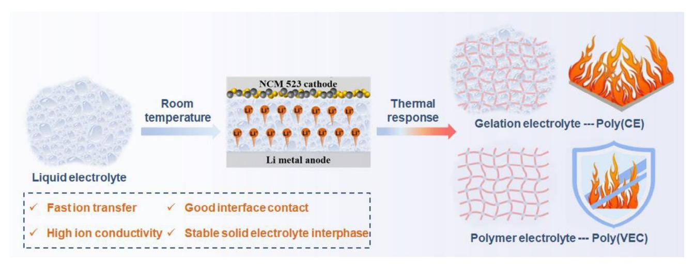
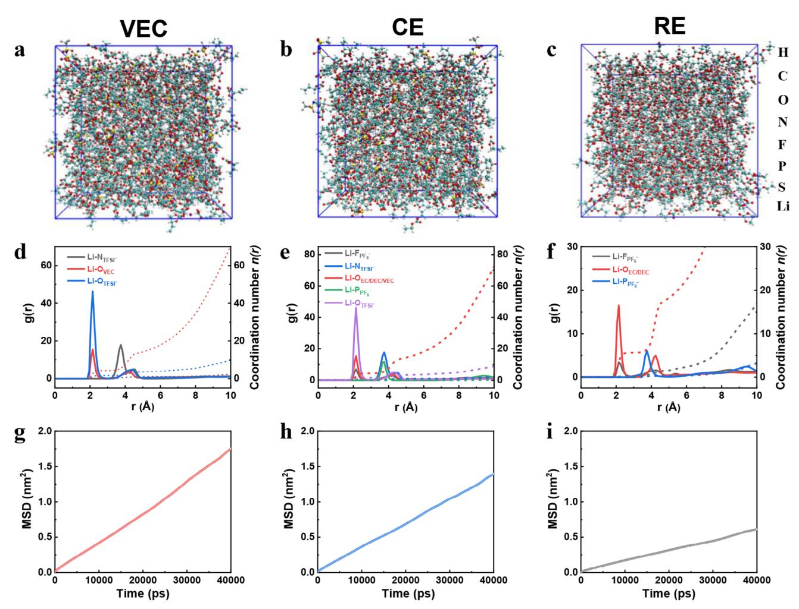
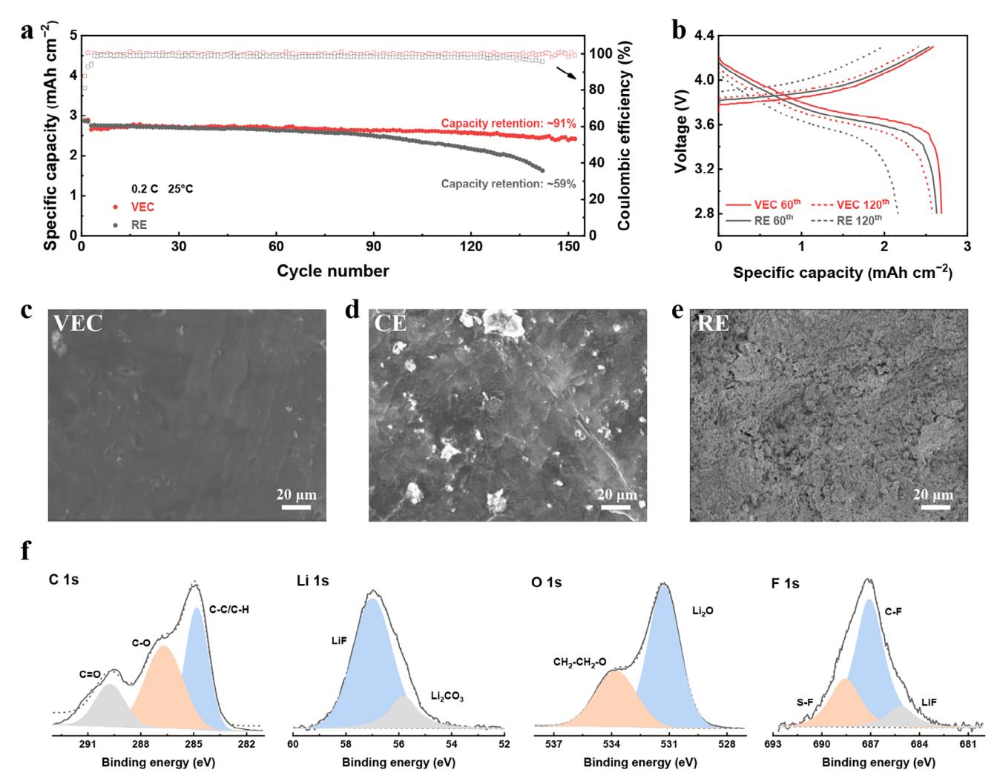
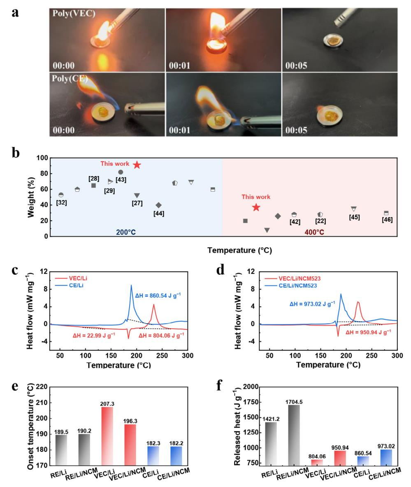
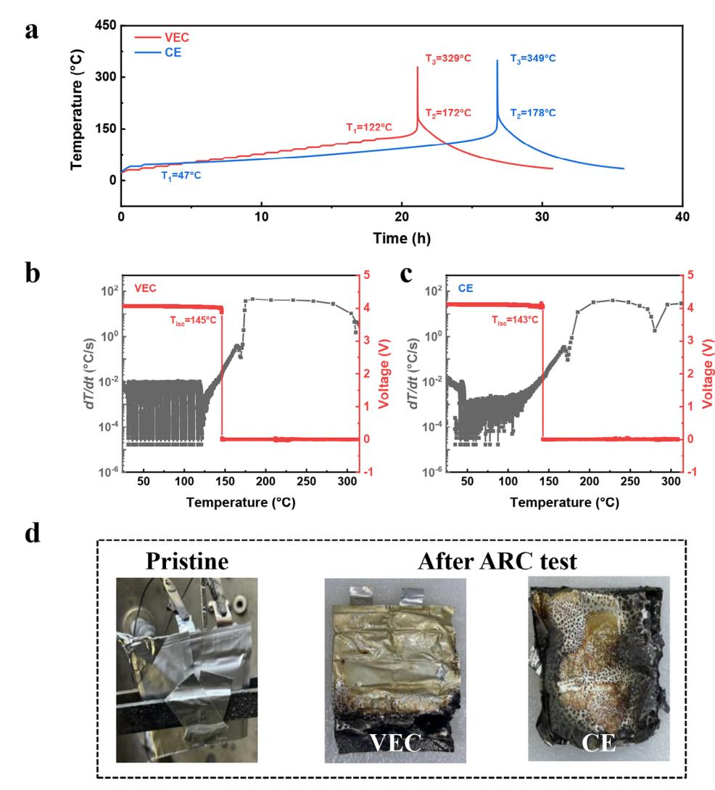

# **Thermoresponsive Mono-Solvent Electrolyte Inhibiting Parasitic Reactions for Safe Lithium Metal Batteries**

*Jia-Xin Guo, Chang Gao, Yun-Fei Du, Feng Jiang, Nai-Lu Shen, Wen-Bo Tang, Xin Shen,\* Xin-Bing Cheng,\* and Yuping Wu*

**Solvents in liquid and gel polymer electrolytes are recognized for contributing to high ionic conductivity in high-energy-density lithium metal batteries. However, parasitic reactions involving solvents and lithium metal induce safety risks under thermal abuse conditions and poor lifespan during room-temperature cycles, which are rarely investigated. This study introduces a thermoresponsive mono-solvent electrolyte as a built-in safety switch. The mono-solvent electrolyte polymerizes at elevated temperatures, creating a passivate polymer network without residue solvents. The polymer exhibits high thermal stability with 91% mass retention at 200 °C and significantly suppresses side reactions between lithium metal and the electrolyte, reducing thermal runaway risks. Ah-level Li||LiNi0.8Co0.1Mn0.1O2 pouch batteries employing this electrolyte can efficiently improve the critical temperature of thermal runaway by 75 °C compared to the thermoresponsive gel polymer electrolyte. At ambient temperatures, the electrolyte promotes the formation of a stable solid electrolyte interphase (SEI) rich in LiF and Li2O, effectively reducing side reactions and dendrite growth on the lithium anode. Consequently, Li||LiNi0.5Co0.2Mn0.3O2 cells retain 91% capacity after 152 cycles, even under high-loading cathodes (19.7 mg cm−2, 3 mAh cm−2). This research offers valuable insights into inhibiting parasitic reactions during the electrochemical cycle and thermal runaway, enhancing the lifespan and safety of high-energy-density batteries.**

# **1. Introduction**

Lithium metal stands out as the optimal anode material for the next-generation high-energy-density batteries owing to its exceptionally high theoretical capacity of 3860 mAh g−1 and a low

Key Laboratory of Energy Thermal Conversion and Control of Ministry of Education School of Energy and Environment Southeast University Nanjing 211189, China E-mail: [shenx25@seu.edu.cn;](mailto:shenx25@seu.edu.cn) [chengxb@seu.edu.cn](mailto:chengxb@seu.edu.cn) W.-B. Tang, X. Shen, X.-B. Cheng Tianmu Lake Institute of Advanced Energy Storage Technologies Liyang, Jiangsu 213300, China

The ORCID identification number(s) for the author(s) of this article can be found under <https://doi.org/10.1002/aenm.202500703>

**DOI: 10.1002/aenm.202500703**

electrode potential of −3.040 V relative to the standard hydrogen electrode.[\[1\]](#page-8-0) Pairing with high-capacity and highvoltage lithium nickel manganese cobalt oxide cathodes, potentially high energy density can be achieved for lithium metal batteries (LMBs).[\[2\]](#page-8-0) Despite the theoretical advantages, implementing LMBs with liquid carbonate electrolytes faces several challenges,[\[3\]](#page-8-0) including the uncontrolled growth of lithium dendrites[\[4\]](#page-8-0) and the intrinsic safety hazards of flammable and volatile liquid electrolytes, which pose a risk of fire and explosion.[\[5\]](#page-8-0) A viable strategy is to replace liquid electrolytes with advanced solid-state electrolytes and circumvent the safety issues associated with LMBs.[\[6\]](#page-8-0)

Among the solid-state electrolytes, polymer electrolytes are extensively considered due to the tight interfacial contact between lithium metal anodes and the electrolyte, which are typically divided into gel polymer electrolytes and solid polymer electrolytes.[\[7\]](#page-8-0) Gel polymer electrolytes, referred to as quasi-solid-state electrolytes consist of polymer matrices with embedded liquid electrolytes.

Incorporating liquid electrolytes can enhance the ionic conductivity of these polymer-based systems. However, it is essential to recognize the safety concerns associated with the residual liquid electrolytes. As a solvent-free electrolyte system, solid polymer electrolytes have garnered considerable interest due to their superior chemical and thermal stability, effectively solving leakage and combustion issues of liquid electrolytes.[\[8\]](#page-8-0) Yet, the relatively low ion conductivity, inadequate wettability, and poor electrode contact in solid polymer electrolytes lead to high interfacial impedance, limiting their wide application.[\[9\]](#page-8-0) Consequently, it is imperative to develop advanced electrolytes that can surmount the obstacles presented by both liquid and solid-state electrolytes.

Several alternative strategies for optimizing electrolytes have been put forward to address these issues,[\[10\]](#page-8-0) among which smart thermoresponsive electrolytes hold great promise for LMBs. These electrolytes are adept at regulating the lithium deposition/stripping behavior effectively, while also preventing the leakage of liquid electrolytes to ensure safety.[\[11\]](#page-8-0) During normal cycling, the thermoresponsive electrolyte maintains its liquid characteristics, with high ionic conductivity and good interfacial

J.-X. Guo, C. Gao, Y.-F. Du, F. Jiang, N.-L. Shen, W.-B. Tang, X. Shen,

X.-B. Cheng, Y. Wu

Z Energy Storage Center

**Figure 1.** Schematic illustration for the safety differences of the thermoresponsive gel and polymer electrolytes.

wettability, thereby enhancing the battery's cycle life. When thermal abuse occurs, the electrolyte can rapidly solidify to form a solid electrolyte, thus constructing a thermally stable interface.[\[12\]](#page-8-0) Currently, the thermoresponsive electrolytes for safe LMBs are generally based on gel polymer electrolytes (Table S1, Supporting Information), owing to their favorable interfacial compatibility and elevated ionic conductivity.[\[13\]](#page-8-0) Yet, the parasitic reactions triggered by residual solvents in thermoresponsive gel polymer electrolytes may pose safety hazards in harsh environments, due to those liquid solvents. Therefore, developing thermoresponsive solid polymer electrolytes that boost superior interfacial chemistry and enhanced safety is crucial for LMBs, particularly in harsh conditions.

This study presents a thermoresponsive mono-solvent (vinylethylene carbonate (VEC)) electrolyte with exceptional lithium compatibility and thermal resilience. When integrated into Li||LiNi0.5Co0.2Mn0.3O2 (Li||NCM523) battery systems, this electrolyte delivers remarkable cycling stability, retaining 91% capacity retention over 152 cycles at 0.2 C, utilizing high cathode loading (19.7 mg cm−2, 3 mAh cm−2). Leveraging its unique physicochemical properties of VEC, the electrolyte transforms into a solid polymer electrolyte under high-temperature abuse, significantly reducing residual solvent content (**Figure 1**). Simultaneously, the exothermic reaction between the reactive lithium metal and the electrolyte is effectively mitigated, enhancing the safety of LMBs at high temperatures. This study proposes a facile strategy for developing high-performance electrolytes with superior security and electrochemical performance.

# **2. Results and Discussion**

#### **2.1. Electrolyte Component**

Developing thermally stable electrolytes is a highly effective strategy for mitigating safety concerns in rechargeable LMBs.[\[14\]](#page-8-0) This research delves into the comparative thermal and electrochemical stability of a mono-solvent polymer electrolyte, gel electrolyte, and liquid electrolyte in LMBs. The mono-solvent electrolyte, formulated from lithium bis(trifluoromethanesulphonyl)imide (LiTFSI) and sustained-release lithium nitrate[\[15\]](#page-8-0) in VEC solvent with azodiisobutyronitrile as an initiator (abbreviated as VEC), exhibits an extensive electrochemical window of up to 4.6 V (Figure S1, Supporting Information). VEC has been positioned as a competitive solvent for LMBs due to its temperature sensitivity and reliable interfacial stability.[\[16\]](#page-8-0) Additionally, due to the limited solubility of LiNO3 in VEC solvent, the LiNO3 sustained-release membrane was chosen for the VEC system.[\[17\]](#page-8-0) As comparisons, 1 M lithium hexafluorophosphate in ethylene carbonate/diethyl carbonate (1:1 by vol %) (routine electrolyte, abbreviated as RE) is assessed. Besides, a mixture of VEC with 10 vol % RE (control electrolyte, abbreviated as CE) is also conducted to thermally form the gel polymer electrolyte. After the polymerization, thermoresponsive VEC and CE are denoted as poly(VEC) and poly(CE) electrolytes, respectively.

### **2.2. Solvation Structure**

Molecular dynamics simulations were conducted to clarify the solvation structures of the above electrolytes (**Figure 2**[a–c\)](#page-2-0). The associated radical distribution functions indicate that in the VEC, lithium ions (Li+) preferentially coordinate with oxygen atoms of the VEC solvent, with an average distance of 2.12 Å. Subsequently, they coordinate with the oxygen atoms of the TFSI− at an average distance of 2.15 Å (Figure [2d\)](#page-2-0). These findings imply that LiTFSI is situated within the inner solvation shell of the VEC. Conversely, the coordination number of Li+ with oxygen atoms of the solvents increases from 4.24 in the VEC to 4.40 in the CE and 5.67 in the RE, respectively (Figure [2e,f\)](#page-2-0), indicating a more rapid desolvation process in the VEC. Considering the anion-dominated solvation structure, the VEC is selected for further performance evaluations.

### **2.3. Cycle Life of Li||NCM523 LMBs**

A comparative analysis of the electrochemical performance of Li||NCM523 cells with different electrolytes was conducted.

**Figure 2.** Characterizations of solvation structures in various electrolytes. Molecular dynamics simulations of a) VEC, b) CE, and c) RE. d–f) Analysis of radial distribution functions and coordination numbers for the corresponding electrolytes. g–i) Examination of mean square displacement for the corresponding electrolytes.

A ceramic-coated separator was selected for its compatibility with the VEC, which shows superior infiltration than polypropylene and polyethylene separators (Figure S2, Supporting Information).[\[18\]](#page-8-0) With the VEC, Li||NCM523 cell exhibits improved cycling stability at 4.3 V, achieving 91% capacity retention after 152 cycles at 25 °C (**Figure 3**[a\)](#page-3-0). The voltage profile curves, ranging from 2.8 to 4.3 V, indicate a modest capacity reduction after 120 cycles (Figure [3b\)](#page-3-0). Furthermore, Li||Li symmetric cells demonstrate stable cycling performance exceeding 400 h at 1.0 mA cm−2 and 1.0 mAh cm−2, with a minimal polarization voltage of 0.09 V (Figure S3, Supporting Information). In contrast, Li||NCM523 cell with the RE suffers a significant capacity loss, retaining only 59% of its initial capacity after 142 cycles. Although some improvements are observed in CE over the RE, Li||NCM523 cell retains 89% of its capacity after 138 cycles (Figure S4a, Supporting Information). The voltage profile of RE after 60 and 120 cycles indicate greater polarization increases and capacity fade compared with the corresponding values of VEC (Figure S4b, Supporting Information). The mean square displacement and energy barrier of Li+ hopping in the electrolytes further support these dynamic characteristics. A higher mean square displacement value of 7.369 × 10−8 cm2 s−1 (Figure 2g) is exhibited by the VEC compared to both the CE (5.719 × 10−8 cm2 s−1, Figure 2h) and RE (2.428 × 10−8 cm2 s−1, Figure 2i). Additionally, a lower activation energy of −1.61 eV is observed in the VEC (Figure S5, Supporting Information). This suggests that the weaker interaction between oxygen atoms and the solvent in the VEC aids in desolvation. As a result, the modified VEC significantly enhances cyclic stability, outperforming both the RE and CE.

Through scanning electron microscope (SEM), a granular and bulk structure is observed in the VEC, maintaining a smooth and sleek lithium morphology (Figure [3c\)](#page-3-0). In contrast, uneven lithium metal deposition is observed in the CE relative to the VEC (Figure [3d\)](#page-3-0). The deposition of lithium metal in the RE shows a loose and porous structure (Figure [3e\)](#page-3-0). Lithium dendrites with larger surface areas, are highly reactive with electrolytes, leading to the formation of inactive components or dead lithium, which degrades battery reversibility. Moreover, the NCM523 cathode exhibits improved structural stability after extensive cycling when

**Figure 3.** Electrochemical performance of LMBs with different electrolytes. a) Long-term stability of the Li||NCM523 cells using the VEC and RE at 25 °C. b) Corresponding voltage profile curve of the VEC and RE. SEM images of lithium anodes after 90 cycles in the c) VEC, d) CE, and e) RE. f) XPS spectra of cycled lithium anode after 20 cycles were obtained from the VEC.

using the VEC instead of the RE (Figure S6, Supporting Information). These findings confirm the compatibility of VEC with lithium metal anodes and NCM cathodes, underscoring its role in reducing dendrite formation and extending the cycle life of LMBs. X-ray Photoelectron Spectroscopy (XPS) was further employed to probe the interfacial properties of lithium deposited from different electrolytes (Figure 3f and Figure S7, Supporting Information). The XPS results indicate that the lithium metal surface using the VEC is enriched with Li2O and LiF inorganic components.[\[19\]](#page-8-0) This enhancement directly affects the safety and longevity of LMBs.[\[20\]](#page-8-0)

#### **2.4. Thermal Stability of Mono-Solvent Electrolyte**

Non-flammable organic carbonate electrolytes are pivotal in bolstering the safety of LMBs.[\[21\]](#page-8-0) Combustion tests were conducted to assess the thermal performance of the VEC, CE, and RE by directly igniting them. The VEC, known for its temperature sensitivity, undergoes a phase change from liquid to solid state at elevated temperatures, specifically above the critical threshold of 80 °C (Figure S8, Supporting Information). The resulting poly(VEC) exhibits an ion conductivity of 1.65 × 10−3 mS cm−1 (Figure S9, Supporting Information). The corresponding changes of impedance indicate that as the abuse temperature increases, the bulk impedance of the Li||NCM523 cells with poly(VEC) shows a greater value. Additionally, the ion transport barriers in the porous electrode channels and the SEI increase significantly after thermal treatment.[\[22\]](#page-8-0) The substantial increase in interfacial impedance is mainly attributed to the much thicker SEI layer, which contained substantial amounts of rigid poly(VEC) (Figure S10, Supporting Information).[\[23\]](#page-8-0) Structural alterations of the VEC were examined before and after thermal treatment at 80 °C using 13C nuclear magnetic resonance (NMR) spectroscopy and Fourier transform infrared (FTIR) spectroscopy (Figure S11, Supporting Information). The 13C NMR spectra reveal peaks at 121 ppm and 134 ppm, corresponding to the C═C bonds of the VEC monomer (Figure S11a, Supporting

**Figure 4.** Inherent thermal characteristics of different electrolytes. a) Flammability test of the poly(VEC) and poly(CE). b) Comparisons of the weight loss between the poly(VEC) reported by this work and gel polymer electrolytes reported in the literature. Heat generation from the exothermic reactions between different electrolytes, deposited lithium, and charged cathode. The DSC curves of c) cycled lithium anodes and d) cycled lithium anodes/charged NCM 523 cathodes with different electrolytes. e) The onset temperature of the reaction between lithium anodes/NCM 523 cathodes and electrolytes from (c) and (d). f) The released heat of the reactions from (c) and (d).

Information). Upon completion of the polymerization process, the VEC monomer converts to poly(VEC), which shows a distinct C−C peak at 35 ppm (Figure S11b, Supporting Information). Simultaneously, the FTIR spectra exhibit peaks at 1650 cm−1 and 1781 cm−1, characteristic of C═C and C═O stretching vibrations for VEC (Figure S11c, Supporting Information). After thermal treatment, the reduction in the intensity of the C═C stretching peak indicated the formation of C−C peak, thereby confirming the successful in situ polymerization.

It has been demonstrated that poly(VEC) resists ignition even when exposed to a sustained external ignition source (**Figure 4**a, Videos S1 and S2, Supporting Information). No combustion can be observed even in the VEC, attributed to the highly thermally stable lithium salt, as well as high flash point (97 °C) and boiling point (237 °C) VEC solvent. Only a minimal amount of smoke is emitted upon lid removal (Figure S12 and Video S3, Supporting Information). Remarkably, unsaturated C═C bond of the VEC monomer can capture H· or OH· free radicals, effectively retarding flame spread.[16b] Additionally, the VEC is prone to polymerize upon exposure to high temperatures, shifting from colorless to yellowish hue. In contrast, the CE, which contains just 10 vol % liquid electrolytes, ignites immediately upon contact with a flame and does not extinguish rapidly once the ignition source is removed (Figure S12 and Video S4, Supporting Information). A similar phenomenon is observed in RE, where combustion spreads rapidly and the intensity of combustion increases

(Figure S12 and Video S5, Supporting Information). These observations indicate that the type of solvents and the presence of residual solvents significantly influence the rate and intensity of the combustion reaction.[\[24\]](#page-8-0)

The propensity for electrolyte volatilization or leakage within confined spaces presents a significant safety hazard and can trigger catastrophic accidents. This may result in substantial internal pressure, jeopardizing the structural integrity of the battery. It is crucial to highlight that the VEC exhibits significantly lower flammability compared to RE and CE. Consequently, this specific electrolyte demonstrates superior resistance to evaporation and reduced flammability at elevated temperatures.

After evaluating the flammability of electrolytes, their thermal stability was further assessed using thermogravimetric analysis. This method examines the relationship between mass and temperature to determine the thermal characteristics of materials.[\[25\]](#page-8-0) The VEC demonstrates remarkable flame-retardant capabilities, reducing the risk of fire hazards. Nevertheless, a thorough safety assessment is required to understand its thermal behavior. During the heating process, the mass of the RE steadily decreases, eventually evaporating entirely at approximately 200 °C (Figure S13a, Supporting Information). In comparison, the VEC exhibits minimal mass loss, only 30 wt% when heated to 200 °C, indicating improved thermal stability, while the CE exhibits moderate thermal stability. After thermal response, poly(VEC) demonstrates greater thermal stability than poly(CE), especially above 125 °C (Figure S13b, Supporting Information). As detailed in Table S1 (Supporting Information) and illustrated in Figure [4b,](#page-4-0) poly(VEC) maintains its thermal stability at temperatures exceeding 200 °C, surpassing that of all previously reported thermoresponsive gel polymer electrolytes and gel polymer electrolytes.[\[26\]](#page-8-0) Therefore, the thermoresponsive VEC electrolyte demonstrates greater thermal stability than RE, CE, and poly(CE). These results, agreeing with the flammability test, offer valuable insights into the electrolyte's safety performance under extreme conditions.

In addition to the thermal stability of pure electrolytes, the exothermic reaction between high-reactivity lithium anodes/charged cathodes and electrolytes at elevated temperatures significantly affects the safety of LMBs. Differential scanning calorimetry (DSC) test is commonly employed to quantitatively evaluate the thermal stability of electrode materials, providing precise data on initial exothermic temperatures and heat release quantities. When evaluating the reactions between electrolyte and lithium metal, the VEC undergoes an initial exothermic reaction at 94–137 °C, with an exothermic heat of 22.99 J g−1, due to the VEC monomer polymerization (Figure S14a, Supporting Information) and the decomposition of SEI (Figure [4c\)](#page-4-0). After the melting of lithium metal at 180 °C, there is a sustained exothermic reaction at 207–266 °C, with an exothermic heat of 804.06 J g−1. The reaction of cycled lithium with the electrolyte mainly causes an exothermic reaction. In contrast, the CE exhibits a rapid rate of thermal release and a larger heat release. Though the RE itself shows only endothermic peaks as temperature rises (Figure S14b, Supporting Information), upon contact with the lithium anode, it exhibits a sharp exothermic peak, releasing 187.78 J g−1 and 1233.44 J g−1 at 189–214 °C and 214–257 °C, respectively (Figure S15a, Supporting Information).

Three components of lithium anodes/charged cathodes and electrolytes exhibit a similar trend (Figure [4d;](#page-4-0) Figure S15b, Supporting Information). The onset temperatures of lithium anodes and electrolytes reactions shift from 189.5 °C for RE and 182.3 °C for CE to 207.3 °C for VEC (Figure [4e\)](#page-4-0). The heat release by lithium deposited in the VEC, CE, and RE is 804.6, 860.54, and 1421.2 J g−1, respectively (Figure [4f\)](#page-4-0). The total heat release from RE with deposited lithium anode is about 1.7 times that of the VEC. The reactivity between the cycled lithium anodes and the electrolytes results in a higher initiation temperature for the VEC compared to the CE and RE. This elevation is likely due to the higher residual liquid electrolyte content in the CE, leading to greater heat release compared to the VEC.[\[27\]](#page-8-0) Moreover, both the RE and CE exhibit a more pronounced rate of heat release. When paired with the charged nickel-rich layered oxides cathode, the heat release further increases. As a result, the reactivity of lithium anodes in both RE and CE is markedly higher than that in the VEC. Therefore, the VEC provides non-flammability, enhanced thermal stability, and reduced heat generation compared to the RE and CE, highlighting its superior safety performance.

### **2.5. Thermal Safety of Li||NCM811**

Accelerating rate calorimeter (ARC) test was performed to provide a more comprehensive assessment of the thermal hazards under realistic conditions for the full cells.[\[28\]](#page-8-0) Thermal runaway in lithium batteries poses a severe risk, as it can lead to uncontrolled and self-sustaining heat generation, triggering a series of exothermic reactions that can rapidly elevate the battery's internal temperature.[\[29\]](#page-8-0) This process is characterized by three pivotal temperatures: T1, the onset temperature for thermal safety; T2, the temperature of thermal runaway; T3, the maximum temperature during thermal runaway.[\[8a,30\]](#page-8-0) Enhancing the safety of LMBs is realized by delaying T1 and T2, while also reducing T3. [\[31\]](#page-8-0)

2.0 Ah Li||LiNi0.8Co0.1Mn0.1O2 (Li||NCM811) pouch batteries after 9 cycles were utilized for the ARC tests (Table S2, Supporting Information). The thermoresponsive VEC electrolyte was employed as an efficient thermal safety electrolyte to mitigate reactions among cell components. Surprisingly, the results show higher T1, equivalent T2, and lower T3 temperatures of 122 °C, 172 °C, and 329 °C, respectively (**Figure 5**[a\)](#page-6-0). The internal-shortcircuit temperature (Tisc) is located at 145 °C (Figure [5b\)](#page-6-0). For comparison, the Tisc of the CE is 143 °C (Figure [5c\)](#page-6-0). Digital images illustrate the thermal runaway in pouch cells with all the above electrolytes (Figure [5d\)](#page-6-0). The results indicate that under adiabatic conditions, the thermal runaway onset temperature of the battery is lower than the decomposition temperature from the DSC test. This discrepancy may be due to the heat inside the battery not being dissipated promptly. This suggests that the chemical reactions inside the battery during thermal runaway are exceedingly rapid, potentially causing the battery to heat up quickly and possibly lead to ignition. Notably, Ah-level Li||NCM811 pouch batteries employing the thermoresponsive VEC can efficiently improve the onset temperature T1 by 75 °C and decrease the thermal runaway maximum temperature T3 by 20 °C compared to CE. Attributed to the mono-solvent, thermoresponsive electrolyte weakened electrode/electrolyte parasitic reaction, the intrinsic safety

**Figure 5.** Thermal runaway features of Li||NCM811 pouch-type cells. a) The fluctuations in temperature over time for cycled Li||NCM811 pouch batteries with the VEC and CE during ARC tests. The temperature dependence of temperature rising rate and voltage during ARC tests with the b) VEC and c) CE. d) Optical images of Li||NCM811 pouch batteries using different electrolytes before and after ARC tests.

of practical Li||NCM811 pouch batteries utilizing the VEC can be significantly improved.

# **3. Conclusion**

In summary, this research offers a thorough benchmark analysis of solvent-induced parasitic reactions concerning the safety of LMBs. Multiple dimensions are examined, including the inherent flammability of electrolytes with different liquid contents, their interactions with cycled electrodes in coin cell configurations, and the thermal stability of practical pouch batteries. Specifically, a thermoresponsive VEC electrolyte is introduced as a mono-solvent system for LMBs. At elevated temperatures, the VEC undergoes in-situ polymerization, forming passivating polymer networks that significantly reduce side reactions between lithium metal and the electrolyte. The polymer demonstrates exceptional thermal stability, maintaining 91% mass retention at 200 °C. Furthermore, in Ah-level Li||NCM811 pouch batteries, this electrolyte can efficiently improve the onset temperature of thermal runaway by 75 °C compared to the control electrolyte, providing superior safety performance. Importantly, this research achieves a balance between thermal and electrochemical stability, enhancing interfacial kinetics and facilitating the formation of a stable SEI. Consequently, side reactions and dendrite growth on the lithium anode at ambient temperatures are significantly inhibited. As a result, Li||NCM523 cells exhibit a 91% capacity retention after 152 cycles, even under high-loading cathode conditions. This study offers critical insights into the residual solvent in electrolytes regarding the safety and durability of LMBs.

# **4. Experimental Section**

*Materials and Electrolyte Preparations*: Lithium bis(trifluoromethanesulfonyl)imide (LiTFSI), vinyl ethylene carbonate (VEC), and routine electrolyte of 1.0 M lithium hexafluorophosphate in 1:1 v/v ethylene carbonate and diethylene carbonate with battery-grade purity were purchased from Suzhou DoDo Chem Technology Co., Ltd. Lithium nitrate (LiNO3) was purchased from Aladdin. Azodiisobutyronitrile was purchased from Admas-beta. LiNi0.5Co0.2Mn0.3O2 (NCM523) cathodes with an areal capacity of 3.0 mAh cm−2 and active material loading of 19.7 mg cm−2, lithium metal foils with 450 μm thick were obtained from Guangdong Canrd New Energy Technology Co., Ltd. Ceramic coated separator was purchased from Suzhou DoDo Chem Technology Co., Ltd. LiTFSI and LiNO3 were used directly without any treatment. The VEC was prepared by dissolving 1 M LiTFSI and sustained-release LiNO3 in the VEC solvent with 1.0 wt % AIBN as the initiator inside a glove box. Because the VEC solvent contains unsaturated C═C bonds and the AIBN initiator can be decomposed by light at a lower temperature and over a long period, the VEC can be stability stored for approximately two weeks in a transparent glass bottle at room temperature. The poly(VEC) was obtained by heating the VEC at 80 °C for 12 h. The control electrolyte was prepared by dissolving 1 M LiTFSI and sustained-release LiNO3 in the VEC solvent with 1.0 wt.% AIBN as the initiator then added 10 vol % routine electrolyte inside a glove box. The poly(CE) was obtained by heating the control electrolyte at 80 °C for 12 h.

LiNO3 sustained−release membrane was fabricated by dissolving 5.0 wt.% LiNO3 and 5.0 wt.% polyvinylidene fluoride–hexafluoropropylene (PVDF-HFP) (Sigma-Aldrich) in acetone (Reagent) by vigorous magnetic stirring on a hotplate at room temperature. The content of PVDF-HFP used here was very small and it has a high porosity only to accommodate LiNO3 and other electrolyte components. Therefore, it has little effect on the battery cycling performance. A 400 μm blade was used to blade-coat the solution on an aluminum-plastic film. The LiNO3 sustained−release membrane can be peeled off from the substrate after the solvent's evaporation. All materials were kept in the glove box with oxygen and water contents below 1.0 ppm.

*Cells Assembly*: The diameter of the lithium anode was 15.6 mm, while the NCM523 cathode was 10 mm in coin cells. Ceramic-coated separator (≈17 um, thickness) was used to separate the cathode and anode in coin cells. The LiNO3 sustained−release membrane was cut into Φ19 mm circles for coin cells and attached to the surface of the lithium anode when assembling the cells. The size of the lithium anode and NCM811 cathode in pouch cells were 4.5 cm × 5.8 cm and 4.3 cm × 5.6 cm, respectively. The NCM811 electrodes were stacked layer-by-layer with a ceramic-coated separator (≈17 um, thickness) in a glove box with argon. The amount of electrolyte was 4.5 g for 2 Ah pouch batteries. Detailed parameters of the Li-NCM811 pouch batteries were shown in Table S2 (Supporting Information).

*Material Characterizations*: Linear sweep voltammetry (LSV) was performed on the IviumSoft electrochemical workstation. Lithium||Stainless coin cells were utilized for the LSV test from the open-circuit voltage to 6.0 V at the scan rate of 0.1 mV s−1. The as-investigated electrolyte was placed between two stainless steel electrodes to measure the EIS value using IviumSoft electrochemical workstation. The ionic conductivity () of poly(VEC) was calculated according to the following formula:

$$\sigma = \frac{L}{R_b \times S} \tag{1}$$

where *L* represents the electrolyte membrane thickness, *Rb* was the bulk electrolyte resistance, and *S* was the surface area of the electrode. 13C nuclear magnetic resonance (13C NMR) spectrum of VEC monomer was recorded at Bruker AVANCE III 600 MHz with dimethyl sulfoxide as its solvent. A solid-state NMR experiment of poly(VEC) was carried out on JEOL-600M. X-ray photoelectron spectroscopy was obtained to evaluate the surface composition of cycled lithium (Thermo Scientific ESCALAB Xi+). Fourier transform infrared spectrometer was measured at Thermo Fisher Scientific. Scanning electron microscopy was conducted at Crossbeam350 to analyze the morphologies of the cycled lithium anode.

*Electrochemical Cycling Characterizations*: The galvanostatic charge/discharge performance and rate performance were collected by using NEWARE Battery Test System (CT-4008Tn-5V20mA-HWX, Shenzhen, China). The electrochemical tests were performed using a coin cell with a ceramic-coated separator. Li||Li symmetrical cells were cycled at 1.0 mA cm−2 for 1.0 h in each half cycle. For Li-NCM523 coin cells with electrolytes up to 100 μL were tested at 0.2 C between a voltage range of 2.8–4.3 V. The 2.0 Ah pouch batteries were cycled at 0.1 C between 2.8–4.3 V, consisting of 9 pieces of cathode, 10 pieces of anode, and 4.5 g electrolyte.

*Safety Characterization*: The flammability tests were conducted by directly igniting the electrolyte (0.5 mL) in battery-positive cases. Differential scanning calorimeter (METTLER TOLEDO) was used to evaluate the thermal stability of different battery materials and their mixtures. Aluminum crucibles (40 μL) were strictly sealed to avoid the pollution of instruments by reaction products. The electrode materials were soaked in the solvent corresponding to the electrolyte for 30 min to remove residual lithium salts on the surface before the test and evaporated overnight in a glove box. The heat fluxes were calculated as the total mass in the crucible. The lithium anode in contact with the cathode was cut into small pieces and placed in sealed aluminum crucibles, and the mass ratio of lithium anode: electrolyte was controlled to be 2:4, lithium anode: electrolyte: NCM523 cathode was controlled to be 2.6:5.6:1. The test was carried out between 30 and 300 °C at a temperature rate of 5 °C min−1 in an argon atmosphere. Thermogravimetric analysis was carried out in a simultaneous thermal analyzer (TGA) from 30 °C to 600 °C at 10 °C min−1 under argon atmosphere. TGA was performed to detect the thermal stability of different electrolytes.

The thermal safety performance of 2.0 Ah pouch batteries was tested by an accelerating rate calorimeter (ARC, Thermal Hazard Technology). The heat-wait-seek (HWS) procedure was applied and the self-heat rate of pouch batteries was detected to identify the situation of the batteries. The heating increment during the ARC test was 5 °C, accompanied by a waiting time of 40 min to ensure the chamber temperature equilibrium. Then the temperature-increasing rate of the cell was acquired until it reached 0.02 °C min−1. The temperature at the time was defined as an onset temperature for thermal safety (T1). T2 was defined as the "ignition point" of cells. To detail, the temperature-increasing rate of batteries at that temperature must reach 1 °C s−1. Otherwise, the ARC will repeat the HWS procedure until the thermal runaway of batteries enters the cooling mode at the preset temperature of 300 °C. In addition, the real-time OCV of batteries was also recorded as an essential indicator to figure out the battery status.

# **Supporting Information**

Supporting Information is available from the Wiley Online Library or from the author.

# **Acknowledgements**

This work was supported by the National Natural Science Foundation of China (Grant No. 92372111 and 22179070), the Fundamental Research Funds for the Central Universities (Grant No. RF1028623157), the SEU Innovation Capability Enhancement Plan for Doctoral Students (CXJH\_SEU 24063).

# **Conflict of Interest**

The authors declare no conflict of interest.

# **Data Availability Statement**

The data that support the findings of this study are available in the supplementary material of this article.

# **Keywords**

lithium metal battery, safe, solid electrolyte interphase, thermal runaway, thermoresponsive electrolyte

Received: February 3, 2025 Revised: March 14, 2025 Published online: April 10, 2025

- [1] a) J. M. Tarascon, M. Armand, *Nature* **2001**, *414*, 359; b) C. Niu, D. Liu, J. A. Lochala, C. S. Anderson, X. Cao, M. E. Gross, W. Xu, J.-G. Zhang, M. S. Whittingham, J. Xiao, J. Liu, *Nat. Energy* **2021**, *6*, 723.
- [2] a) X.-H. Meng, D. Xiao, Z.-Y. Zhou, W.-Z. Liu, J.-L. Shi, L.-J. Wan, Y.-G. Guo, *J. Am. Chem. Soc.* **2024**, *146*, 14889; b) H. Zhang, Z. Zeng, S. Cheng, J. Xie, *eScience* **2024**, *4*, 100265.
- [3] a) K.-F. Ren, H. Liu, J.-X. Guo, X. Sun, F. Jiang, C. Guo, W. Bao, F. Yu, G. Kalimuldina, L. Kong, X.-B. Cheng, J. Li, *ACS Energy Lett.* **2024**, *9*, 2960; b) M. Ding, X. Feng, Y. Peng, J. Tong, B. Hou, Y. Xing, W. Zhang, L. Wang, Y. Wu, J. Lv, C. Luo, D. Xiong, S. Zhang, M. Ouyang, *J. Energy Chem.* **2023**, *87*, 207.
- [4] J. Wang, L. Chen, H. Li, F. Wu, *Energy Environ. Mater.* **2023**, *6*, 12613.
- [5] a) H. Lu, A. Du, X. Lin, Z. Zhang, S. Liu, Y. Xie, W. Li, J. Song, Y. Lu, W. Chen, C. Yang, Q. Yang, *Energy Environ. Sci.* **2024**, *17*, 7860; b) Q. Wang, B. Mao, S. I. Stoliarov, J. Sun, *Prog. Energy Combust. Sci.* **2019**, *73*, 95; c) J. Zhao, X. Feng, Q. Pang, M. Fowler, Y. Lian, M. Ouyang, A. F. Burke, *Prog. Energy Combust. Sci.* **2024**, *102*, 101142.
- [6] a) P. Xu, Y.-C. Gao, Y.-X. Huang, Z.-Y. Shuang, W.-J. Kong, X.-Y. Huang, W.-Z. Huang, N. Yao, X. Chen, H. Yuan, C.-Z. Zhao, J.-Q. Huang, Q. Zhang, *Adv. Mater.* **2024**, *36*, 2409489; b) H. Wan, Z. Wang, W. Zhang, X. He, C. Wang, *Nature* **2023**, *623*, 739.
- [7] X. Fan, C. Zhong, J. Liu, J. Ding, Y. Deng, X. Han, L. Zhang, W. Hu, D. P. Wilkinson, J. Zhang, *Chem. Rev.* **2022**, *122*, 17155.
- [8] a) S. Zhang, F. Sun, X. Du, X. Zhang, L. Huang, J. Ma, S. Dong, A. Hilger, I. Manke, L. Li, B. Xie, J. Li, Z. Hu, A. C. Komarek, H.-J. Lin, C.-Y. Kuo, C.-T. Chen, P. Han, G. Xu, Z. Cui, G. Cui, *Energy Environ. Sci.* **2023**, *16*, 2591; b) S.-J. Tan, J. Yue, Z. Chen, X.-X. Feng, J. Zhang, Y.-X. Yin, L. Zhang, J.-C. Zheng, Y. Luo, S. Xin, Y.-G. Guo, *Adv. Energy Mater.* **2024**, *5*, 0076; c) Q. Gao, D. Wu, X. Zhu, P. Lu, T. Ma, M. Yang, L. Chen, H. Li, F. Wu, *Nano Energy* **2023**, *117*, 108922; d) Y. Guo, S. Wu, Y.-B. He, F. Kang, L. Chen, H. Li, Q.-H. Yang, *eScience* **2022**, *2*, 138.
- [9] a) K. Su, P. Luo, Y. Wu, X. Song, L. Huang, S. Zhang, H. Song, L. Du, Z. Cui, *Adv. Funct. Mater. 34*, 2409492; b) Q. Lv, C. Li, Y. Liu, Y. Jing, J. Sun, H. Wang, L. Wang, H. Ren, B. Wu, T. Cheng, D. Wang, H.-K. Liu, S.-X. Dou, B. Wang, J. Wang, *ACS Nano* **2024**, *18*, 23253.
- [10] a) J. Wang, X. Feng, Y. Yu, H. Huang, M. Zheng, Y. Xu, J. Wu, Y. Yang, J. Lu, *Nat. Energy* **2024**, *9*, 939; b) Y. Wu, Z. Zeng, M. Liu, C. Cai, S. Lei, H. Zhang, S. Cheng, J. Xie, *Adv. Energy Mater.* **2024**, *14*, 2401037; c) G. Yang, W. Hou, Y. Zhai, Z. Chen, C. Liu, C. Ouyang, X. Liang, P. Paoprasert, N. Hu, S. Song, *EcoMat* **2023**, *5*, 12325.
- [11] a) J.-X. Guo, C. Gao, H. Liu, F. Jiang, Z. Liu, T. Wang, Y. Ma, Y. Zhong, J. He, Z. Zhu, Y. Wu, X.-B. Cheng, *J. Energy Chem.* **2024**, *89*, 519; b) J.-X. Guo, F. Jiang, N.-L. Shen, W.-B. Tang, T. Wang, Y. Ma, Y. Zhong, J. He, Z. Zhu, F. Wang, X.-B. Cheng, Y. Wu, *ACS Energy Lett.* **2024**, *9*, 4800; c) Y. Lan, L. Xiang, J. Zhou, S. Jiang, Y. Ge, C. Wang, S. Tan, Y. Wu, *Adv. Sci.* **2024**, *11*, 2400953; d) J. Zhou, T. Qian, J. Liu, M. Wang, L. Zhang, C. Yan, *Nano Lett.* **2019**, *19*, 3066.
- [12] J. Zhou, Y. Huan, L. Zhang, Z. Wang, X. Zhou, J. Liu, X. Shen, L. Hu, T. Qian, C. Yan, *Mater. Today* **2022**, *60*, 271.
- [13] a) F.-N. Jiang, X.-B. Cheng, S.-J. Yang, J. Xie, H. Yuan, L. Liu, J.-Q. Huang, Q. Zhang, *Adv. Mater.* **2023**, *35*, 2209114; b) T. Dong, H.

Zhang, L. Huang, J. Ma, P. Mu, X. Du, X. Zhang, X. Wang, C. Lu, S. Dong, Q. Zhou, G. Xu, W. Liu, G. Cui, *Energy Storage Mater.* **2023**, *58*, 123; c) Q. Zhang, Z. Liu, X. Song, T. Bian, Z. Guo, D. Wu, J. Wei, S. Wu, Y. Zhao, *Angew. Chem., Int. Ed.* **2023**, *62*, 202302559.

- [14] S.-J. Tan, Y.-F. Tian, Y. Zhao, X.-X. Feng, J. Zhang, C.-H. Zhang, M. Fan, J.-C. Guo, Y.-X. Yin, F. Wang, S. Xin, Y.-G. Guo, *J. Am. Chem. Soc.* **2022**, *144*, 18240.
- [15] a) J.-X. Chen, J.-H. Zhang, X.-Z. Fan, F.-F. Wang, W. Tang, W. Xia, Y. Zhao, L. Kong, *Energy Environ. Sci.* **2024**, *17*, 4036; b) G. Zhou, J. Yu, J. Liu, X. Lin, Y. Wang, H. M. Law, F. Ciucci, *Cell Rep. Phys. Sci.* **2022**, *3*, 100722.
- [16] a) Y. Yang, J. Xiong, S. Lai, R. Zhou, M. Zhao, H. Geng, Y. Zhang, Y. Fang, C. Li, J. Zhao, *ACS Appl. Mater. Interfaces* **2019**, *11*, 6118; b) Z. Wen, W. Fang, F. Wang, H. Kang, S. Zhao, S. Guo, G. Chen, *Angew. Chem., Int. Ed.* **2024**, *63*, 202314876; c) L. Ma, J. Xia, X. Xia, J. R. Dahn, *J. Electrochem. Soc.* **2014**, *161*, A1495.
- [17] S. Gu, Y. Zhang, M. Li, Q. Lin, G. Xu, N. Zhang, *Angew. Chem., Int. Ed.* **2025**, *64*, 202410020.
- [18] H. Jia, C. Zeng, H.-S. Lim, A. Simmons, Y. Zhang, M. H. Weber, M. H. Engelhard, P. Gao, C. Niu, Z. Xu, J.-G. Zhang, W. Xu, *Adv. Mater.* **2024**, *36*, 2311312.
- [19] H. Zeng, K. Yu, J. Li, M. Yuan, J. Wang, Q. Wang, A. Lai, Y. Jiang, X. Yan, G. Zhang, H. Xu, J. Wang, W. Huang, C. Wang, Y. Deng, S.-S. Chi, *ACS Nano* **2024**, *18*, 1969.
- [20] X.-B. Cheng, S.-J. Yang, Z. Liu, J.-X. Guo, F.-N. Jiang, F. Jiang, X. Xiong, W.-B. Tang, H. Yuan, J.-Q. Huang, Y. Wu, Q. Zhang, *Adv. Mater.* **2024**, *36*, 2307370.
- [21] C. Liao, L. Han, W. Wang, W. Li, X. Mu, Y. Kan, J. Zhu, Z. Gui, X. He, L. Song, Y. Hu, *Adv. Funct. Mater.* **2023**, *33*, 2212605.
- [22] L. Xu, Y. Xiao, Z.-X. Yu, Y. Yang, C. Yan, J.-Q. Huang, *Angew. Chem., Int. Ed.* **2024**, *63*, 202406054.
- [23] H. Zhang, L. Huang, H. Xu, X. Zhang, Z. Chen, C. Gao, C. Lu, Z. Liu, M. Jiang, G. Cui, *eScience* **2022**, *2*, 201.
- [24] A. Yang, C. Yang, K. Xie, S. Xin, Z. Xiong, K. Li, Y.-G. Guo, Y. You, *ACS Energy Lett.* **2023**, *8*, 836.
- [25] a) D. Zhang, Y. Liu, S. Yang, J. Zhu, H. Hong, S. Li, Q. Xiong, Z. Huang, S. Wang, J. Liu, C. Zhi, *Adv. Mater.* **2024**, *36*, 2401549; b) Y. Liu, Y. Xu, J. Wang, Y. Niu, X. Ding, *J. Mater. Chem. A* **2023**, *11*, 8308; c) Z. Zhang, G. Li, X. Du, L. Huang, G. Kang, J. Zhang, Z. Cui, T. Liu, L. Ni, Y. Jin, G. Cui, *Adv. Sci.* **2024**, *11*, 2409628; d) D. Chen, M. Zhu, P. Kang, T. Zhu, H. Yuan, J. Lan, X. Yang, G. Sui, *Adv. Sci.* **2022**, *9*, 2103663.
- [26] a) Y. Chen, C. Ling, K. Long, X. Liu, P. Xiao, Y.-Z. Yu, W. Wei, X. Ji, W. Tang, G.-C. Kuang, L. Chen, *Chem. Eng. J.* **2024**, *488*, 150888; b) T. Li, K. Chen, B. Yang, K. Li, B. Li, M. He, L. Yang, A. Hu, J. Long, *Chem. Sci.* **2024**, *15*, 12108.
- [27] Z. Cui, Z. Jia, D. Ruan, Q. Nian, J. Fan, S. Chen, Z. He, D. Wang, J. Jiang, J. Ma, X. Ou, S. Jiao, Q. Wang, X. Ren, *Nat. Commun.* **2024**, *15*, 2033.
- [28] Y. Wu, Z. Zeng, H. Zhang, M. Liu, S. Lei, W. Zhong, S. Cheng, J. Xie, *Energy Storage Mater.* **2024**, *70*, 103499.
- [29] N. Mao, S. Gadkari, Z. Wang, T. Zhang, J. Bai, Q. Cai, *Energy* **2023**, *278*, 128027.
- [30] F.-N. Jiang, S.-J. Yang, X.-B. Cheng, P. Shi, J.-F. Ding, X. Chen, H. Yuan, L. Liu, J.-Q. Huang, Q. Zhang, *J. Energy Chem.* **2022**, *72*, 158.
- [31] a) Y. Wu, W. Zhang, Y. Li, X. Feng, Z. Ma, D. Ren, L. Lu, G.-L. Xu, K. Amine, M. Ouyang, *Energy Storage Mater.* **2024**, *65*, 103165; b) F.-N. Jiang, S.-J. Yang, Z.-X. Chen, H. Liu, H. Yuan, L. Liu, J.-Q. Huang, X.-B. Cheng, Q. Zhang, *Particuology* **2023**, *79*, 10.