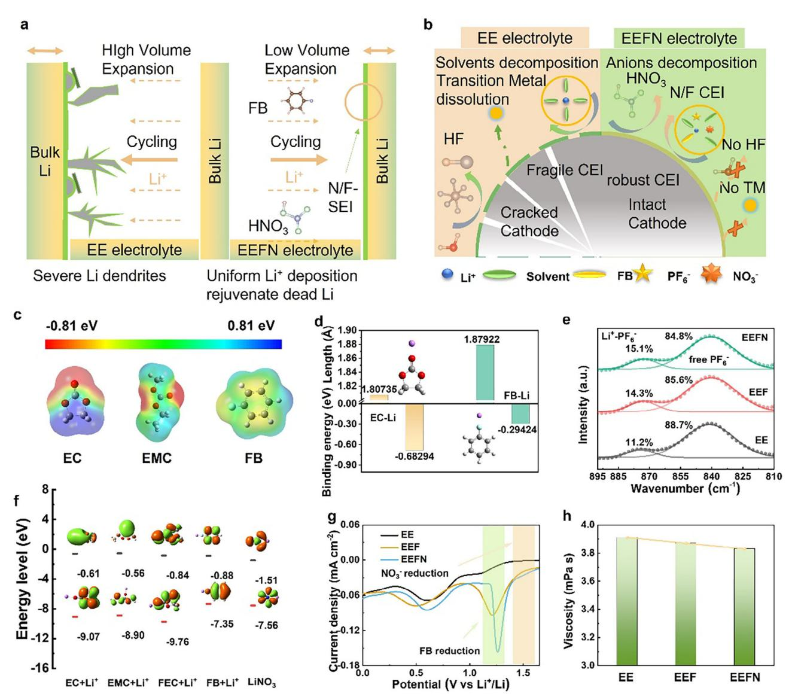
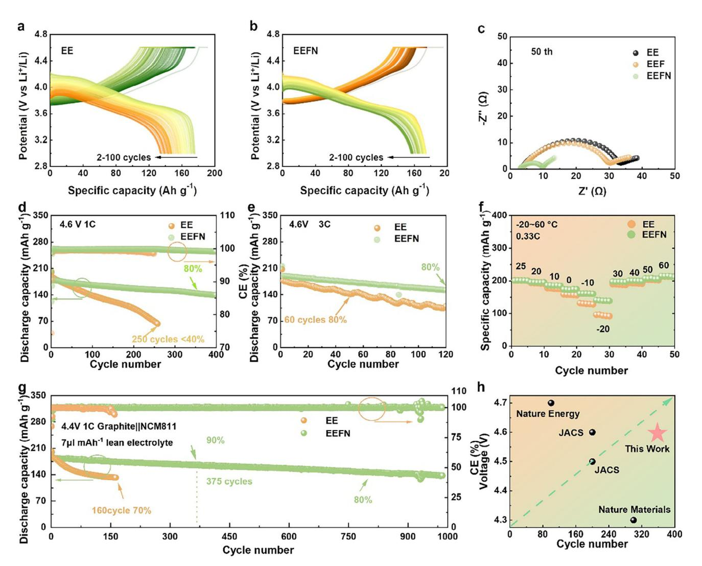
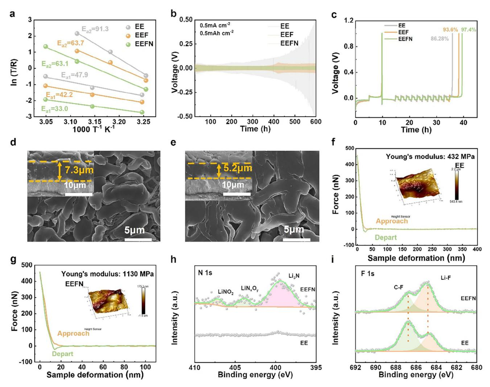
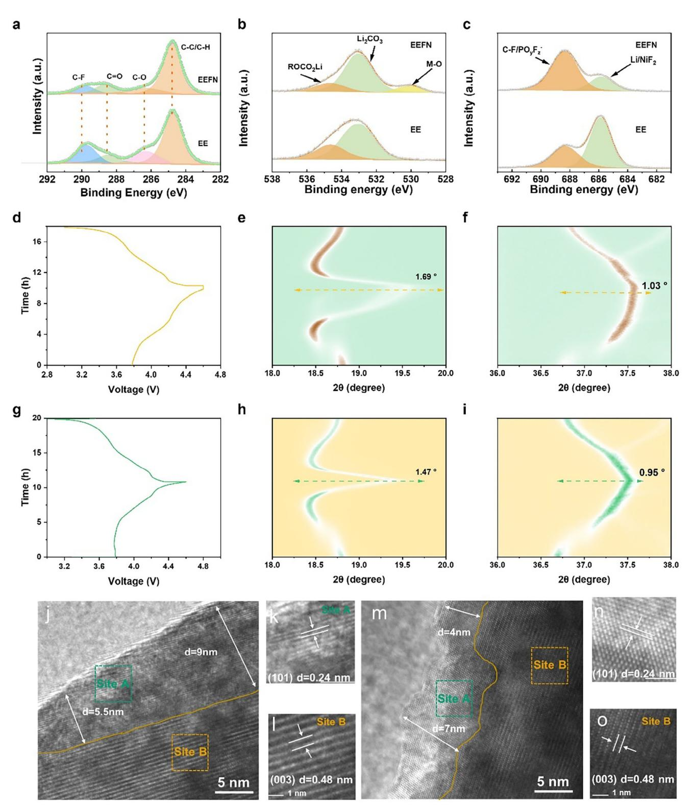
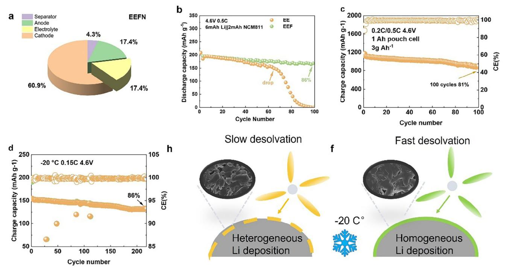

# **In Situ Generation of HNO3 via Lithium Nitrate and Fluorobenzene to Boost Lithium Battery Performance**

*Guohuang Kang, Jiabin Ma, Geng Zhong, Yue Cao, Jie Biao, Kangning Cai, Feiyu Kang, and Yidan Cao\**

**It is crucial to improve the stability of the electrolyte with the lithium metal anode as well as the nickel-rich cathode, which is a key to suppressing side reactions and extending the lifetime of high-voltage lithium battery. In this work, a synergistic approach by combining fluorobenzene diluents and lithium nitrate is employed to in situ generate trace amount of nitric acid as well as enable weakly solvation structure of lithium ions, which effectively promoted the formation of inorganic-rich solid electrolyte interphase (SEI) and cathode electrolyte interphase (CEI). The HF generation and transition metal dissolution are successfully suppressed. The stability of the LiNi0.8Co0.1Mn0.1O2 (NCM811) cathode and lithium plating/stripping efficiency at the anode are greatly enhanced. As a result, the Li||NCM811 battery demonstrated remarkable capacity retention of 80% after 360 cycles at 4.6 V. Similarly, the Graphite||NCM811 battery exhibited impressive capacity retention up to 80% even after 800 cycles at 4.4 V with lean electrolyte. This study provides new insights into the electrolyte development for high-voltage lithium batteries and highlights the synergistic mechanism of fluorobenzene and lithium nitrate additives, which shows great potential for developing efficient, reliable, and environmentally friendly energy storage electrolytes.**

# **1. Introduction**

Enhancing the energy density of lithium batteries is a critical objective for the future of energy storage considering the wide application of rechargeable lithium batteries. Incorporating lithium metal anodes and nickel-rich cathodes, such as LiNi0.8Co0.1Mn0.1O2 (NCM811), is one of the most promising approaches to achieve lithium batteries with energy density over 400 Wh kg−1. [\[1\]](#page-13-0) However, the practical implementation of lithium metal anode faces challenges such as uncontrolled growth of Li dendrites, poor reversibility of lithium plating/stripping, and incompatibility at the lithium-electrolyte interface.[\[2\]](#page-13-0) Moreover, severe cathode structural degradation, transition metal dissolution,

G. Kang, J. Ma, G. Zhong, Y. Cao, J. Biao, K. Cai, F. Kang, Y. Cao Shenzhen Geim Graphene Center Institute of Materials Research Tsinghua Shenzhen International Graduate School Tsinghua University Shenzhen 518055, China E-mail: [yidancao@sz.tsinghua.edu.cn](mailto:yidancao@sz.tsinghua.edu.cn)

The ORCID identification number(s) for the author(s) of this article can be found under <https://doi.org/10.1002/aenm.202501089>

**DOI: 10.1002/aenm.202501089**

gas generation, cathode-electrolyte parasitic reactions, and so on are also fatal for the Ni-rich cathode, especially at high voltages above 4.3 V.[\[3\]](#page-13-0) To overcome these issues and enhance the battery performance, it is crucial to improve the stability of the electrolyte with both the lithium metal anode and the nickel-rich cathode.[\[4\]](#page-13-0)

Electrolyte modification is a straightforward and efficient method for practical application in manipulating the electrode-electrolyte interface. Various electrolyte modification methods have been extensively explored, including molecular design of the solvents,[\[2\]](#page-13-0) highconcentration or local high-concentration electrolytes,[\[5\]](#page-13-0) electrolyte additives, etc. Among these methods, electrolyte additives have attracted much attention due to their efficiency in manipulating the battery performance through a small amount of addition (*<*10%).[\[6\]](#page-13-0) Construction of a stable solid electrolyte

interphase (SEI) at the electrodes to enhance the cycle stability is one of the important purposes of the electrolyte additive.[\[7\]](#page-13-0) Various electrolyte additives, such as FEC (fluroethylene carbonate), LiNO3 (lithium nitrate), VC (vinylene carbonate), DMS (dimethyl sulfide), etc., have been reported to promote beneficial SEI and prolong the cyclability.[\[3,8\]](#page-13-0) However, despite the numerous benefits additives bring, they cannot completely resolve the issues of electrolyte stability and battery longevity. On the other hand, the acidity of the electrolyte also plays a crucial role in determining electrolyte performance. Some acids can contribute to enhancing the cycling performance of lithium–ion batteries by promoting the formation of a stable electrode-electrolyte interphase and improving overall battery efficiency. For instance, organic acids with carboxyl functional groups can react with lithium compounds on nickel-rich cathode surfaces, forming an organolithium layer that improves the cycle stability of the cathode in conventional electrolytes.[\[9\]](#page-13-0) The introduction of AlF3, a lewis acid fluoride, into a polymer electrolyte has been shown to enable ultra-stable long-term cycling of lithium metal batteries.[\[10\]](#page-13-0) Acid additives, such as non-fluorobutane-1-sulfonic acid and heptafluorobutyric acid, have also been reported to facilitate stable SEI formation and create lithophilic interfaces on lithium metal anodes, further enhancing battery performance.[\[11\]](#page-13-0) However, excessive acidity would increase the corrosivity of the electrolyte, inducing

**Figure 1.** Mechanism and (Electro)chemical properties of the LiNO3 additive and fluorobenzene (FB). a, b) Schematic of the working mechanism of FB and LiNO3 additives. The left image is the EE electrolyte (control sample), and the right image is the EEFN electrolyte (experimental sample). c) Electrostatic potential (ESP) of ethylene carbonate (EC), ethyl methyl carbonate (EMC), and FB solvent. d) Binding energy and bond distance of Li+-EC and Li+-FB. e) Fourier transform infrared spectroscopy (FTIR) of EE, EEF, and EEFN electrolytes. f) HOMO and LUMO energy levels of the components in the electrolytes. g) CV results for the EE, EEF, and EEFN electrolytes. (h) Viscosity of EE, EEF, and EEFN electrolytes.

interfacial side reactions and shortening the battery's lifespan. These studies collectively underscore the importance of optimizing electrolyte acidity to get improved battery performance, presenting a critical area for further research.

Here in this work, we introduced fluorobenzene (FB) and LiNO3 into a conventional ester-based electrolyte to successfully improve the electrode-electrolyte interfacial stability by in situ generation of nitric acid. As shown in **Figure 1**a, the formation of lithium dendrites and uneven lithium deposition at the anode is avoided. The weakly solvated structure of lithium ions in the electrolyte leads to increased salt anion dissociation, promoting the generation of inorganic-rich SEI. At the cathode side (Figure 1b), the formation of HF and transition metals dissolution is suppressed due to the generation of trace amounts of nitric acid in the electrolyte, which effectively removes the excessive passivation layer and ensures the structural stability of the cathode. Additionally, the fluoride- and nitrogen-containing inorganic-rich CEI components also enhance the integrity of the cathode. As a result, the Li||NCM811 battery demonstrates remarkable capacity retention up to 80% after 360 cycles at 4.6 V. Similarly, the Graphite||NCM811 battery also exhibits impressive capacity retention up to 80% even after 800 cycles at 4.4 V with lean electrolyte. This pioneering study provides new insights into the electrolyte development for high-voltage lithium batteries and highlights the synergistic mechanism of fluorobenzene and lithium nitrate additives, which shows great potential for developing

CIENCE NEWS www.advancedsciencenews.com

efficient, reliable, and environmentally friendly energy storage electrolytes.

#### 2. Results and Discussion

#### 2.1. Physicochemical Properties of the Electrolytes

In this work, a commercial electrolyte containing 1 M  $\text{LiPF}_6$  dissolved in EC/EMC (3:7 by volume) with 2 vol % FEC was selected as the baseline and denoted as EE. 1 M LiPF6 dissolved in EC/EMC+FB  $(8/2)$  by volume) with 2 vol % FEC was denoted as EEF. 1 wt.% LiNO3 dissolved in EEF electrolyte was denoted as EEFN. The optical images of LiNO2 before and after being dissolved in the EEF electrolyte are shown in Figure S1 (Supporting Information). By incorporating electron-withdrawing groups (specifically, the fluorine atoms in fluorobenzene-derived moieties) around the solvent molecules (EC), the local negative charge density surrounding the carbonyl oxygen atoms is elevated. This facilitates easier coordination of these oxygen atoms with Li+, thereby attenuating the robust electrostatic interaction between  $\text{Li}^+$  and  $\text{NO}_3^-$  in solid  $\text{LiNO}_3$ .[12] Consequently,  $\text{LiNO}_3$ can dissolve more readily into the electrolyte.

ESP distribution of the solvents, which is closely related to their interactions with lithium ions in the electrolyte, was analyzed by density functional theory (DFT) calculation. Figure 1c illustrates the ESP on the surfaces of EC and EMC molecules, exhibiting similar trends with concentrated negative regions around the oxygen (O) atom. In contrast, the electrostatic potential of the FB molecule is more evenly distributed, with only slightly concentrated negative potential around the fluorine. It indicates that FB possesses relatively weaker adsorption capability for Li+ ions compared to the carbonates. The binding energy and bond length results (Figure 1d) further demonstrate the weaker association between FB and Li+ compared to EC and EMC molecules. The binding energy of  $Li^+$ -EC (-0.68 eV) is less than Li+-FB ( $-0.29$  eV), while the bond distance in Li+-FB (1.879 Å) is larger than  $Li^+$ -EC (1.807 Å), indicating a lower coordination tendency of FB with Li+.[13]

Figure 1e presents the FTIR absorption spectra of the electrolytes. The peaks in the range of 810–900  $\text{cm}^{-1}$  correspond to the P-F stretching vibrations, specifically attributed to the  $PF_6$ - ions coordinated with Li+.[8a] Notably, the EEF and EEFN solutions exhibit a higher proportion ( $\approx$ 14.3%–15.1%) of Li+-PF6- ion pairs compared to the EE electrolyte ( $\approx$ 11.2%), indicating the formation of a solvation structure rich in anions. It suggests that relatively weak solvation of  $Li^+$  ions with the solvents is formed in the EEF-based solution. Raman spectroscopy also confirmed similar results. Figure S2a (Supporting Information) demonstrates that the percentage of  $Li^+$  coordinated  $PF_6^-$  in the EEFN electrolyte increases from 57% to 60% compared to the EE electrolyte. This suggests the presence of more contact ion pairs (CIP, where one PF6- anion interacts with one Li+) and aggregates (AGG, where one  $PF_6^-$  anion interacts with two or more Li+) in the EEF-based electrolytes. The formation of CIPs and AGGs occurs when the electrostatic interaction between anions and cations outweighs that between cations and solvent molecules. These complexes, having greater thermodynamic stability than free solvent molecules, enable wider operating temperature and voltage ranges.[14] The higher concentration of  $PF_6^-$  anions within the

solvated sheath of Li+ in the EEF electrolyte indicates weaker solvation of Li+ by the solvents. This characteristic contributes to improved electrochemical stability of the electrolyte. Furthermore, the peaks  $\approx$ 840 cm-1 corresponding to free PF6- anions show reduced contribution in the EEF-based electrolyte compared to EE, indicating decreased presence of free uncoordinated PF6- ions.[8a] This observation is consistent with the  $^{19}$ F nuclear magnetic resonance (NMR) results, which show a downward shift in the peak value of  $PF_6^-$  in the EEFN electrolyte (Figure S2b, Supporting Information). This shift indicates  $PF_6^-$  is surrounded by fewer solvent molecules, indicating a weak solvation structure.[15]

The energy levels of the highest occupied molecular orbital (HOMO) and lowest unoccupied molecular orbital (LUMO) for the electrolyte components were determined using DFT calculations. Figure 1f illustrates the HOMO and LUMO energy levels for  $Li^+$  solvated FB ( $Li^+$ ) and other solvents ( $Li^+$ ) molecules. FB (Li+) exhibits the highest HOMO energy level ( $-7.35$  eV) and a comparatively lower LUMO energy level  $(-0.87 \text{ eV})$  compared to other components. This suggests that FB ( $Li^+$ ) is more prone to oxidation and contributes to the formation of the cathodeelectrolyte interphase (CEI) compared to other solvent  $(Li^+)$ molecules. On the other hand, LiNO3 displays the lowest LUMO energy level  $(-1.57 \text{ eV})$  among all the components, indicating its preferential reduction and involvement in the formation of SEI compared to other electrolyte components.[16]

To assess the electrochemical stability and redox behavior of the electrolytes, CullLi asymmetric cells were assembled using EE, EEF, and EEFN electrolytes. Figure 1g displays the cyclic voltammetry (CV) curves, revealing a peak  $\approx$ 1.5 V. This peak indicates the preferential reduction of  $LiNO3$  before other electrolyte components. Subsequently, FB undergoes reduction  $\approx$ 1.25 V, which aligns with the theoretical calculations (The LUMO energy is the second lowest).[8a,17] As previously mentioned, FB exhibits lower viscosity compared to traditional electrolyte molecules.[17] Figure 1h shows that incorporating FB into EE electrolytes, the viscosity of the EEF-based electrolyte decreases by 1.5% compared to EE. This viscosity reduction holds promising potential for low-temperature applications.[18] The liquid contact angle is a critical parameter that characterizes the electrolyte's wettability on the separator.[19] As depicted in Figure S3 (Supporting Information), EEFN exhibits a reduced liquid contact angle, which holds significant importance in facilitating the wetting of battery components. Moreover, it could enable the utilization of lean electrolytes to a certain extent, enhancing the electrolyte's effectiveness within the battery system.

#### 2.2. Electrochemical Performance of Li||NCM811 and Graphite||NCM811 Batteries

The voltage profiles of Li||NCM811 cells employing EE and EEFN electrolytes are compared in **Figure 2a,b**. These figures illustrate the voltage curves from the second to the 100th cycle. After 100 cycles, the EE electrolyte demonstrates less than 60% capacity retention, while the EEFN electrolyte exhibits a much higher stability with a capacity retention of 92%. The significant capacity fade in EE could be attributed to the unstable lattice structure of the cathode, increased cell impedance, and the instability of the CEI.[21] Furthermore, structural degradation and dissolution of

**Figure 2.** Electrochemical performance of the Li||NCM811 and Graphite||NCM811 cells. a, b) Voltage curves of cells with EE (a) and EEFN (b) electrolytes cycled in 3–4.6 V at 25 °C. c) Electrochemical impedance spectroscopy of cells with EE, EEF, and EEFN before and after 50 cycles. d) Cycling performances of cells cycled in 3–4.6 V at 25 °C. e) Cycling performances of cells cycled in 3–4.6 V at 3 C. f) Charge/discharge capacities of Li||NCM811 half cells with EE and EEFN electrolyte in the temperature range of −20–60 °C. g) Cycling performance of the Graphite||NCM811 half cells during a high-voltage range of 2.8–4.4 V with a lean electrolyte (7 μL mAh−1) at 25 °C. h) Battery performance comparison with various advanced electrolytes.[\[20\]](#page-13-0)

transition metals from the cathode may also contribute to these effects.

To gain further insights into the evolution of cathodes during cycling, the resistance of the cells was evaluated using electrochemical impedance spectroscopy (EIS).[\[22\]](#page-13-0) Figure 2c presents the Nyquist plots of the cells after 50 cycles. The bulk resistance of the cells (RS) is comparable in all the electrolytes (3.8 Ω in EE, 3.2 Ω in EEF, and 3.0 Ω in EEFN). However, the larger semicircle observed in the EE electrolyte indicates higher SEI resistance (RSEI) and charge transfer resistance (RCT) compared to the EEF-based electrolyte.[\[23\]](#page-13-0) Specifically, the EE electrolyte exhibits an RSEI+RCT value of 30.2 Ω, while the EEF and EEFN electrolytes display values of 26.8 and 7.1 Ω, respectively.[\[24\]](#page-13-0) The higher R value in the EE electrolyte is attributed to the less compact and intact CEI formed at the cathode interface. Consequently, it can be concluded that the EEFN electrolyte facilitates the formation of a more favorable CEI at the cathode interface.[\[25\]](#page-13-0) The EIS of the fresh battery was also conducted. Figure S4a (Supporting Information) clearly demonstrates that the EEF-based electrolyte exhibits a lower total resistance compared to other electrolytes. A lower impedance also suggests that the EEF-based electrolyte may exhibit faster lithiation and delithiation kinetics.[\[26\]](#page-13-0) This is supported by Figure S4b (Supporting Information), which illustrates the enhanced rate performance of the EEF-based electrolyte. EEF exhibits poor stability despite having a similar rate performance to EEFN. This is because the lithium nitrate-derived product, Li3N, can form a robust solid electrolyte interphase (SEI) layer that effectively mitigates interfacial side reactions and suppresses dendrite growth, and maintains the cycling stability of the cells in EEFN electrolyte. Specifically, at a 5 C discharge rate, the EEF electrolyte demonstrates a capacity of 157 mAh g−1, while the EEFN electrolyte achieves a capacity of 164 mAh g−1. In contrast, the EE electrolyte only reaches a capacity of 134 mAh  $g^{-1}$ and experiences rapid capacity decay under 5 C discharge conditions. In contrast, the EEF-based electrolyte maintains stability even at high discharge rates.

Li||NCM811 cells were assembled to investigate the potential utilization of EEFN electrolytes in high-voltage cathodes. Figure 2d depicts the cycling performance of cells employing EE and EEFN electrolytes, utilizing a rate of 1 C for charge/discharge with a cut-off voltage of 4.6 V. The initial specific capacity achieved in the EEFN electrolyte is 201.7 mAh  $g^{-1}$ , slightly higher than the 200.0 mAh  $g^{-1}$  in the EE electrolyte. Remarkably, the cell utilizing EEFN electrolyte exhibits a remarkable capacity retention of 80% after 350 cycles, significantly outperforming the 40% retention observed in the EE cell after 250 cycles. Moreover, it is crucial to note that commonly available diluents on the market, such as bis(2,2,2-trifluoroethyl) ether (TTE) and hydrocarbon-based diluents, exhibit poor high-voltage stability. In our study, the operating voltage exceeds 4.6 V, a condition under which these conventional diluents fail to maintain stable battery performance. As demonstrated in Figure **S5** (Supporting Information), batteries employing TTE or hydrocarbon-based diluents are unable to operate stably at 4.6 V, highlighting the necessity of selecting a diluent like FB that can withstand high-voltage conditions. At the same time, as observed in Figure **S6** (Supporting Information), the initial Coulombic efficiency of the cell with EEFN electrolyte is 83%, while that with EE electrolyte is 74%. This further indicates that the EEFN electrolyte leads to fewer side reactions at both the anode and cathode during the first cycle.

In addition to capacity retention, high-rate performance is crucial for practical applications of lithium batteries.[27] The development of fast-charging capabilities is an essential direction for further advancement. Figure 2e showcases a cell cycled at a 3C rate, enabling charge/discharge within 20 min. Notably, when the capacity retention decreases to 80%, the cells cycled with EEFN electrolytes demonstrate twice the lifespan compared to those with EE electrolytes. In addition to EIS, the rate performance is closely linked to the migration number of lithium ions within the electrolyte. Figure S7 (Supporting Information) displays the lithium ion transference number in both EE and EEFN electrolytes. It reveals that the migration number of the EEFN electrolyte, 0.4, is higher than that of the EE electrolyte, which is 0.3. These outstanding performances observed in the EEFN electrolytes can be attributed to the previously mentioned weaker Li+ solvation structure and lower interfacial resistance.

To evaluate the performance under different temperature conditions, Li||NCM811 half cells were cycled across a temperature range of  $-20-60$  °C. Figure 2f illustrates the comparison between cells utilizing EEFN and EE electrolytes. The Li||NCM811 cell with EEFN electrolyte exhibits higher capacities compared to the cell with EE electrolyte. Stable cycling is achieved even at low temperatures. Remarkably, the cell employing EEFN electrolyte delivers a high specific discharge capacity of 140 mAh  $g^{-1}$  at -20 °C, significantly surpassing the capacity of 95 mAh  $g^{-1}$  observed in the cell with EE electrolyte.

The batteries discussed above were all lithium metal batteries (with lithium as the anode). To demonstrate that our electrolyte is also beneficial for practical application with graphite anodes, we assembled a graphite||NCM811 full-cell with lean electrolyte (7  $\mu$ L mAh-1). Figure 2g showcases the notable capacity decay observed in the EE electrolyte after 160 cycles, resulting in a retention of only 70% of the initial capacity. In contrast, the cells utilizing the EEFN electrolyte exhibit exceptional stability, maintaining 80% capacity retention even after 800 cycles. Though a slight short-circuiting event is observed  $\approx$ 920th cycle, the battery is still able to maintain stable cycling performance and continue operating until the  $\approx$ 1000th cycle. These findings highlight the effectiveness of EEFN electrolytes in both lithium metal and lithium-ion battery systems. Meanwhile, as can be seen from Figure S8 (Supporting Information), the EEFN cell shows comparable ICE to the EE cell. Contrary to the high reactivity of Li, graphite exhibits lower reactivity toward electrolytes due to a well-defined intercalation mechanism. As highlighted in prior studies. graphite's layered structure and stable solid-electrolyte interphase (SEI) minimize parasitic reactions.[28] Therefore, the benefits of FB and LiNO3 in EEFN (e.g., solvation modulation, SEI stabilization) are less pronounced for graphite, as its native SEI is already robust, leading to a similar ICE. In order to assess the suitability of the electrolyte for large-format battery applications, we fabricated a 1 Ah graphite (Gr)||NCM811 pouch cell featuring an  $N/P$  ratio in the range of 1.1–1.2 shown in Figure S9a (Supporting Information). The cell was subjected to electrochemical testing under high-rate conditions, specifically 1C charging and 2C discharging. The results clearly indicate that the battery exhibits stable cycling performance over 200 cycles, retaining an impressive 91.5% of its initial capacity. This outcome underscores the excellent compatibility of the EEFN electrolyte with large-format battery systems. Furthermore, upon visual inspection of the pouch cells after testing shown in Figure S9b,c (Supporting Information), we observed no signs of swelling or bulging, which would typically indicate gas accumulation. This further demonstrates the excellent compatibility of the EEFN electrolyte system with other cell components, including binders and separators, even in large-format pouch cell tests. Moreover, Figure 2h presents a comprehensive comparative analysis of the electrochemical properties of lithium batteries with various electrolytes, complemented by Table **S1** (Supporting Information).

#### 2.3. Anode/Electrolyte Interface Characterization

The EEFN electrolyte exhibits improved electrochemical performance, which may be attributed to the formation of a better anode/electrolyte interface. To further evaluate this, temperaturedependent EIS measurements were performed on Li||Li cells to obtain the activation energy of the Li deposition/stripping process (Figure 3a).[29] The energy barriers for the diffusion of Li+ through the SEI layer and desolvation of Li+ at the interface, which originated from  $R_{SEI}$  and  $R_{CT}$ , are denoted as  $E_{a1}$ and  $E_{a2}$ , respectively.[18] The  $E_{a1}$  value for the EEFN electrolyte  $(33.0 \text{ kJ mol}^{-1})$  is lower than that for the baseline electrolyte (47.9 kJ mol-1) and the EEF electrolyte (42.2 kJ mol-1), indicating that the anion-derived SEI layer formed in EEFN electrolyte can facilitate fast Li+ transport kinetics. Meanwhile, the  $E_{a2}$  values for the baseline, EEF, and EEFN electrolytes are 91.3, 63.7, and 63.1 kJ mol $-1$ , respectively. The reduced desolvation energy barrier indicates that the FB solvent and anions in the Li+ solvation sheath synergistically promote fast dissociation of solvated  $\text{Li}^{+}[30]$ 

**Figure 3.** a) Li+ desolvation activation energy of EE, EEF, and EEFN electrolyte. b) Cycling performance of Li||Li symmetry cell using EE, EEF, and EEFN electrolytes. c) Cycling performance of Li||Cu cells using EE, EEF, and EEFN electrolytes. d, e) scanning electron microscopy (SEM) images of the Li deposition obtained by plating 1 mAh cm−2 Li on Cu substrate at 0.2 mA cm−2 in Li||Cu cells using (d) EE and (e) EEFN electrolytes. f, g) The force curve in Atomic Force Microscopy (AFM) of anode-derived SEI cycled in EE and g EEFN electrolytes. Corresponding 3D atomic force microscope (3D-AFM) scanning images of SEI layers are shown in insets. h, i) X-ray photoelectron spectroscopy (XPS) profiles of N 1s h) and F (1s) of SEI layers in EE and EEFN.

To examine the stability of Li metal anodes in different electrolytes, the voltage evolution of symmetric Li||Li cells was recorded at a current density of 0.5 mA cm−2. Figure 3b shows that the symmetric Li||Li cell using conventional ester-based electrolyte exhibits a significantly increasing overpotential with cycling time due to the continuous thickening of the non-uniform SEI layer, which exceeds 100 mV after 400 h of cycling. In the case of the EEF electrolyte, the overpotential of the Li||Li cells remains stable until 400 h, then increases significantly to 50 mV, and finally fails due to dendrite-induced short circuit after 600 h of cycling. In contrast, the EEFN electrolyte enables the symmetric cell to maintain a stable voltage hysteresis of 20 mV throughout the entire 600 h of cycling.

Apart from enhancing the high-voltage performance of NCM811, the EEF-based electrolyte also improves the performance of Li||Cu cells. Figure S10a (Supporting Information), depicting a CV curve, shows that both EEF and EEFN exhibit larger reduction peaks, indicating more active electrochemical dynamics.[\[15\]](#page-13-0) This observation is consistent with the Tafel plot depicted in Figure S10b (Supporting Information), where the cells with EE, EEF, and EEFN electrolytes exhibit exchange current densities of 0.66, 0.93, and 1.41 mA cm−2, respectively. Such improved electrochemical behavior is particularly advantageous in Li||Cu batteries.

The reversibility of Li plating/stripping plays a crucial role in representing the properties of the anode/electrolyte interface. This behavior can be further quantified in Li||Cu cells, as evaluated by the average Coulombic efficiency (CEavg) (Figure 3c). Cells using EEFN electrolyte display a high CEavg of 97.6%, which is significantly higher than that of reference electrolytes (86.28% for the EE electrolyte and 93.6% for the EEF electrolyte). Simultaneously, the long cycle test of Li||Cu batteries depicted in Figure S11

(Supporting Information) demonstrates that the Li‖Cu cell using the EEFN electrolyte exhibits a higher coulombic efficiency (CE) value. The CE remains stable above 95% for 30 cycles. In contrast, the average efficiency of the Li‖Cu cell using the EE electrolyte is lower than 90% and experiences a sharp decline after 15 cycles.

Additionally, the morphology of Li plating on Cu substrates in various electrolytes is characterized using SEM. Cells using the baseline electrolyte show Li plating with a dendritic structure and have an irregular distribution on the electrode surface, which leads to continuous electrolyte depletion and an increase in the thickness of the Li layer (≈7.3 μm; Figure [3d\)](#page-5-0). In comparison, when EEFN electrolyte is employed, the deposited Li exhibits a dense morphology (Figure [3d\)](#page-5-0). Furthermore, the thickness of the Li deposition is reduced to 5.2 μm (inset of Figure [3e\)](#page-5-0), which is very close to the theoretical value of 4.82 μm.[\[31\]](#page-14-0) The round-shaped and uniform Li deposition morphology effectively minimizes the surface area to control parasitic reactions at the Li/electrolyte interface, achieving highly reversible Li plating/stripping behavior.

AFM and XPS techniques were employed to investigate the characteristics of the SEI layer formed in different electrolytes for lithium batteries. In Figure [3f,g,](#page-5-0) the SEI layer generated in the baseline electrolyte exhibits a low Young's modulus of 432 MPa, accompanied by a surface roughness of 2.2 μm. In contrast, when using the EEFN electrolyte, the mechanical strength of the SEI layer is significantly improved to 1130 MPa (Figure [3g\)](#page-5-0). This enhancement can be attributed to the reduced presence of organic species and the incorporation of nitrogen-rich species such as LiNO2, LiNxOy, and Li3N (as shown in Figure [3h\)](#page-5-0), along with LiF (observed at 684.0 eV in the F 1s spectrum, Figure [3i\)](#page-5-0).[\[32\]](#page-14-0) Moreover, the surface roughness decreases from 315 to 266 nm due to the formation of a denser lithium deposition morphology (Figure [3e\)](#page-5-0). The EEFN-based electrolyte, characterized by an anion-rich solvation layer, facilitated the formation of the SEI layer with a higher proportion of inorganic species possessing a higher Young's modulus.[\[29\]](#page-14-0)

#### **2.4. Cathode/Electrolyte Interface Characterization**

XPS measurements were conducted to gain deeper insights into the composition of the CEI and the synergistic effects of FB and LiNO3. From the XPS analysis of the C1s peak shown in **Figure 4**[a,](#page-7-0) it is evident that the reference peak of C-C/C-H is at 248.8 eV.[\[33\]](#page-14-0) The EE electrolyte, however, exhibits additional electrolyte decomposition products, namely C-O (286.3 eV) and C = O (288.6 eV).[\[33\]](#page-14-0) In Figure [4b,](#page-7-0) the XPS spectra of O1s revealed a distinctive lattice-O peak at 529.8 eV for the NCM811 cathode after cycling in the EEFN electrolyte. This peak indicates a thinner CEI layer and confirms the detection of the NCM811 crystal structure.[\[34\]](#page-14-0) On the other hand, the ratio of ROCO2Li to Li2CO3 signals in the cathode was higher after cycling in the EE electrolyte, suggesting the decomposition of EC and other molecules, leading to the formation of an unstable CEI.[\[33\]](#page-14-0)

Figure [4c](#page-7-0) illustrates the F 1s spectra, where the peaks at 685 eV and 687.5 eV correspond to LiF/NiF2 and C-F/PxOyFz, respectively.[\[34\]](#page-14-0) The presence of LiF/NiF2 species can be attributed to the decomposition of LiPF6 salts in the electrolyte and the dissolution of transition metal (TM) cations from the cathode due to attack by acidic species.[\[33\]](#page-14-0) In the EEFN electrolyte, the peak intensity of LiF/NiF2 is reduced compared to the EE electrolyte, indicating effective suppression of acidic corrosion and TM dissolution. Furthermore, a stronger peak of C-F/PxOyFz is observed in the EEFN electrolyte, which is attributed to LiPF6 salts and PVDF, confirming the mitigation of electrolyte and electrode side reactions.

The addition of LiNO3 in the EEFN electrolyte can be detected in the N 1s XPS spectra presented in Figure S12 (Supporting Information). The N 1s XPS spectra show a higher ratio of Li3N (399.8 eV) and LiNxOy species, indicating the presence of a nitrogen-rich CEI. This nitrogen-rich CEI effectively suppresses side reactions between the cathode and electrolyte, leading to improved cycling performance in the EEFN electrolyte.[\[35\]](#page-14-0)

The morphology of the cathode materials, including the uncycled cathode, as well as the cathode cycled for 100 cycles in base and EEFN electrolyte, was evaluated using SEM. Figure S13a (Supporting Information) illustrates that the pristine NCM811 particles maintain their integrity, with an average particle size of ≈2 μm. However, cycled NCM811 particles in the EE electrolyte display noticeable cracks (Figure S13b, Supporting Information), indicating their susceptibility to damage. In contrast, NCM811 particles cycled in the EEFN electrolyte retain their pristine structure without observable particle fractures (Figure S13c, Supporting Information). This suggests that the EEFN electrolyte effectively inhibits structural changes in the NCM811 cathode.

To further investigate the structural changes of the NCM811 cathode during the charge-discharge process under different electrolytes, XRD analysis was performed. As depicted in Figure S14 (Supporting Information), the intensity ratio of the (003/104) peaks, which reflects the degree of order in the layered structure of the NCM811 cathode, is significantly reduced from 1.44 to 1.26 after cycling in the EE electrolyte. However, the cathode cycled in the EEFN electrolyte maintains a high degree of order with a larger value of 1.33, indicating improved structural stability and the well-preserved layered structure of the NCM811.[\[34\]](#page-14-0) The changes in the representative (003) peaks (Figure [4e,h\)](#page-7-0) and (012) peaks (Figure [4f,i\)](#page-7-0) during cathode charging and discharging in EE electrolyte and EEFN electrolyte were analyzed by in situ XRD (Figure [4d,g\)](#page-7-0). During the delithiation process, the (003) H1 peak gradually shifts toward lower 2 angles and eventually evolves into the (003) H2 peak, indicating an initial expansion of the lattice along the c-axis. Upon further delithiation, when the H2–H3 phase transition occurs, the (003) H2 peak rapidly shifts backward to higher 2 angles, accompanied by lattice contraction. In the EEFN electrolyte, the cathode exhibits a peak shift of 1.47°, whereas a larger peak shift of 1.69° is observed in the case of EE electrolyte. The (012) peak moves toward higher angles during delithiation, indicating lattice contraction along the a-axis and b-axis. Similarly, in the EE electrolyte, the peak shift decreases from 1.03° to 0.95°. This suggests that the EEFN electrolyte effectively regulates the structural stability of the NCM811 cathode.

At the same time, a strong CEI layer can also inhibit the dissolution of transition metals (TMs) from NCM811 particles.[\[36\]](#page-14-0) The contents of TMs dissolved in the electrolyte were further validated

**Figure 4.** a–c) XPS Spectra of C1s, O1s, F1s, and N1s in NCM811 Cathode Cycled in EE and EEFN Electrolytes. d–i) In situ X-ray diffraction (XRD) characterization for NCM811 cathode and the evolution of (003) peaks (e, h) and (012) peaks (f, i) during the initial charge–discharge using EE electrolyte (d-f) and EEFN (g-i) electrolyte. (j-o) Transmission Electron Microscopy (TEM) image depicting the NCM811 cathode after undergoing 50 cycles in the EE j–l) and EEFN m–o) electrolyte.

using inductively coupled plasma optical emission spectrometry (ICP-OES).[37] As shown in Figure S15 (Supporting Information), the levels of dissolved Ni. Co. and Mn in the electrolyte from the NCM811 cathode are significantly reduced after 100 cycles with the EEFN electrolyte. In particular, the Ni content from the Li||NCM811 cell cycled in EEFN electrolyte is less than 250  $\mu$ g L-1, which is much lower than that from the Li||NCM811 cell cycled in EE electrolyte (more than 800  $\mu$ g L-1). The suppressed TM ion dissolution can be attributed to the formation of a strong CEI on the NCM811 cathode induced by the FB solvent and LiNO3 additive, which can also effectively maintain the lattice structure and alleviate the irreversible phase transformation of NCM811 cathodes.

To further investigate the structural changes of the NCM811 cathode after cycling, TEM tests were conducted on the cycled NCM811 cathode. TEM analysis of the NCM811 cathode after 50 cycles revealed the presence of a uniform surface layer with a thickness up to 5 nm when the EEFN electrolyte was employed, in contrast to the CEI thickness of 8.5 nm in the EE electrolyte (Figure S16a, Supporting Information). Furthermore, in an effort to bolster the data's credibility, Figure S16b (Supporting Information) presents a CEI thickness distribution for the NCM811 cathode after 50 cycles in the EE and EEFN electrolytes. These clearly reveal that the cathode electrolyte interphase (CEI) on the cathode subjected to 50 cycles in the EE electrolyte exhibits a thickness distribution spanning  $3-14$  nm, whereas the CEI in the EEFN electrolyte shows a thickness distribution within the range of  $0-5$  nm. This uniform layer corresponds to the CEI, which serves as a protective barrier shielding the NCM811 particles from potential side reactions with the electrolyte. The formation of this CEI layer effectively prevents the undesired reduction of valuable Ni4+ species within the delithiated NCM811 and ensures high reversibility of the cathode phase transition, and effectively suppresses transition metal dissolution.[38]

The microstructure of the electrode materials was further characterized by high-resolution transmission electron microscopy (HRTEM). Figure  $4j-l$  show clear lattice structures at the edge of the cycled cathode in the EE electrolyte, with lattice fringes of 0.24 nm (Site A in Figure  $4j,k$ ), corresponding to the (111) crystal plane of the rock-salt (NiO) phase, adjacent to the layered structure phase with lattice fringes of  $0.48$  nm, belonging to the (003) plane (Site B in Figure  $4j,l$ ). The thickness of the rock-salt phase layer is between 5.5 and 9 nm, indicating a severe irreversible phase transition on the surface of NCM811 cycled in the EE electrolyte. In contrast, the NCM811 particles cycled in the EEFN electrolyte exhibit a well-preserved structure (Figure  $4m-o$ ). The surface structure of the NCM811 particles shows the same 0.24 nm lattice fringes (Site A in Figure 4m,n), corresponding to the (111) crystal plane of the NiO rock-salt phase. However, the rock-salt layer in the EEFN electrolyte is significantly reduced to  $4-7$  nm, which is about half of that observed in the EE electrolyte. Additionally, near the rock-salt region (Site B in Figure 40), clear (003) lattice fringes of the layered NCM811 oxide are detected. This indicates that the irreversible phase transition occurring on the cathode surface in the EEFN electrolyte is effectively suppressed, and the structure of the cathode remains more intact. $[3,38a]$ 

#### 2.5. The Synergy of FB and $LiNO3$ in the EEFN Electrolyte

To gain further insight into the synergistic effects of FB and  $LiNO3$  on the electrolyte/electrode interface, TOF-SIMS was employed to characterize the cycled cathode. Figure 5a presents the 3D distribution of inorganic species  $\text{LiF}_2^-$ , organic species  $C_2H^-$ , and  $HF_2^-$  (representing hydrofluoric acid).[39] The left plot in Figure 5a reveals that the CEI formed in the EE electrolyte after cycling exhibits a lower LiF content compared to the CEI formed in the EEFN electrolyte. A higher LiF content inhibits side reactions between the electrolyte and the cathode, thereby enhancing the cycle life of the battery. The right plot in Figure 5a demonstrates that the cathode cycled in the EEFN electrolyte displays a more uniform distribution of LiF across all 3D, with a lower ratio of HF and organic species in the CEI. In contrast, the cathode cycled in the EE electrolyte exhibits a larger distribution of organic components and minimal LiF composition, along with a higher HF ratio. HF can corrode the cathode and promote the dissolution of transition metals, resulting in inferior cycling performance compared to the EEFN electrolyte.[40]

Furthermore, Figure 5b illustrates that the electrolyte exhibits minimal acidity after a resting period of 3 days. The EEF electrolyte displays the lowest pH value, which may be attributed to the prolonged resting of FB, leading to the production of a certain amount of HF. The acidity of the EEFN electrolyte is weaker than that of the EEF electrolyte, indicating that LiNO3 can help stabilize FB and reduce the occurrence of HF production. In order to determine whether the acidity originates from HF or HNO3, the electrolyte was subjected to infrared spectroscopic testing. Figure 5c reveals the presence of  $NO2$  peaks in the EEFN electrolyte, which can be attributed to the presence of  $HNO3$ . As shown in Figure S17 (Supporting Information) it is clear that a distinct HF peak  $\approx$ -150 ppm shows up in EE and EEF, while it disappears in the electrolyte EEFN with LiNO3.[20a] This indicates that the addition of  $LiNO3$  suppresses the formation of HF, and the acidity in EEFN likely comes from the HNO3 mentioned earlier.[38a] To investigate the effect of trace nitric acid, different amounts of nitric acid were added as additives during cycling. Figure 5d demonstrates that the addition of trace amounts of nitric acid improves the cycling performance of the battery, which may be attributed to the removal of the inactive passivating layer by nitric acid. To further substantiate the in-situ changes of acidity within the battery, we conducted in situ pH measurements of the electrolyte during charging. The setup for the in-situ pH measurement is illustrated in Figure S18 (Supporting Information). During the charging process, it is evident that the color of the  $pH$ indicator paper placed inside the battery first darkened and then lightened. This phenomenon suggests that acid was initially produced, and subsequently, the in-situ acid was consumed by both the anode and cathode, resulting in an elevation of the pH value.

To demonstrate the synergistic effect of FB and lithium nitrate and its correlation with the formation of nitric acid, we assembled an in situ Raman cell, as shown in Figure S19a,b (Supporting Information). The cell was sealed using polyurethane adhesive with a perforated battery casing and a quartz glass window for observation. After charging the battery to 4.0 V, we tested the electrolyte and detected a new peak  $\approx$ 1300–1400 cm-1, corresponding to  $HNO3$ , which was not present in the fresh EEFN electrolyte. This

**Figure 5.** a) TOF-SIMS (Time of Flight Secondary Ion Mass Spectrometry) analysis by negative mode: 2D/3D variation of the TOF-SIMS intensity related to the corresponding charged fragments. b) Changes in PH Values of EE, EEF, and EEFN electrolytes over a three-day period. c) FTIR Spectra of EE and EEFN Electrolytes. d) The cycling performance of the electrolyte with varying amounts of trace nitric acid. e) Mechanistic analysis of the interaction between FB and lithium nitrate. f) Radial distribution function (g(r), solid line) and cumulative number (dashed line) EEFN electrolytes. g) Proportion of solvation structures in EE, EEF, and EEFN.

indicates that under electrochemical conditions, FB and LiNO3 synergistically generate HNO3.

DFT calculations were used to analyze the working mechanism of the EEFN electrolyte. As shown in Figure 5e, during the reduction process, FB and LiNO3 work together to generate LiF, NO2, and Li2O on the surface of the lithium metal. The reaction can be represented as:

$$C_6H_5F + 3Li + NO_3^- + H^+ \rightarrow LiF + C_6H_6 + NO_2 + Li_2O$$
 (1)

This reaction has a ∆G of −455.68 kcal mol−1, suggesting that it is thermodynamically favorable. This reaction can produce benzene (C6H6), and Figure S20 (Supporting Information) shows the mass spectra of EE and EEFN electrolytes after standing for 3 days. The spectra show a noticeable peak around m/z = 78 in the EEFN electrolyte, significantly higher than the peaks around m/z = 78 in the EE electrolyte, indicating that more benzene was produced. This further confirms the feasibility of this reaction. The H2O in the electrolyte will prompt the reaction between PF6 − to form HF, which actively erodes both the cathode and anode, leading to performance deterioration. The  $NO2$  can absorb a trace amount of water present in the electrolyte by:

$$3NO2 + H2O \rightarrow 2HNO3 + NO$$
 (2)

with a  $\Delta G$  of -254.46 kcal mol-1, this reaction is also highly favorable. The absorption of water by  $NO2$  results in the formation of HNO3 and NO, as confirmed by the NO3 signals shown in Figure 5c. Meanwhile, in-situ differential electrochemical mass spectrometry (DEMS) measurements (Figure S21, Supporting Information) demonstrate the generation of nitric oxide (NO) during the charging process, offering further compelling evidence for the proposed reaction mechanism. DEMS results also indicate that the amount of CO2 evolved during cycling is extremely minimal. These findings suggest that the EEFN electrolyte system exhibits minimal gas evolution under cycling conditions. As a result, EEFN electrolyte not only effectively removes water from the electrolyte, but also generates a trace amount of nitric acid, etching organic components within the CEI/SEI and promoting the formation of inorganic-rich solid electrolyte interphases.

In this study, molecular dynamics (MD) simulations were utilized to explore the solvation structure of different electrolytes used in lithium batteries. Figure 5f and Figure S22 (Supporting Information) illustrate the solvation structure around lithium ions in EE, EEF, and EEFN electrolytes, as determined through radial distribution function (RDF) calculations. In EE electrolytes, the first solvation shell primarily comprises solvent molecules such as EC and EMC. In the EEF-based electrolyte, EC and EMC molecules still dominate the first solvated shell of Li+, but there is an increased presence of  $PF_6$ - anions in the neighboring region. This observation can be attributed to the role of fluorobenzene as a diluent in the electrolyte.

As shown in Figure  $5f$ , it can be seen that the oxygen atoms in  $NO_3^-$  exhibit a very high peak near the Li+, indicating that  $NO_3^$ tends to coordinate with Li+. Meanwhile, the addition of the FB diluent can further reduce the coordination number of EC/EMC, thereby forming an electrolyte with a weakly solvated structure. As shown in Figure 5g, the EEF-based electrolyte contains more CIP and AGGs. It has been reported that weakly coordinated solvents facilitate the inclusion of  $PF_6^-$  anions within the solvated sheath of Li+, thereby improving the electrolyte's resistance to reduction and reducing side reactions that consume solvent, ultimately enhancing cycling stability.[41]

In EEF-based electrolytes, due to the relatively weak solvation between Li+ and linear chain carbonate alkyl solvents, PF6- anions enter the solvation structure and form CIP and AGGs. These findings are consistent with the analysis of infrared/Raman spectroscopy, which indicates the promotion of inorganic components in the CEI and SEI, leading to improved interfacial structural stability. Additionally, the addition of  $LiNO3$  to the EEF electrolyte during anode desolvation results in the preferential reduction of  $NO_3^-$  in the solvation shell. This promotes the formation of a stable SEI rich in  $Li_3N$  and  $LiN_xO_y$  species, contributing to enhanced cycling performance of the battery.[42]

# www.advenergymat.de

#### 2.6. Application of EEFN in Rechargeable Lithium Metal Battery

In order to validate the practicality of EEFN electrolyte, various batteries with lean electrolyte, low N/P ratio were tested at harsh conditions. Figures 6a and S23 (Supporting Information) illustrate that the mass proportion of the electrolyte decreases from 36.7% to 17.4% after the adoption of the EEFN electrolyte. The mass used in the calculation is based on the parameters for 50 µm Li|| NCM811 provided in Table S2 (Supporting Information).[43] This reduction provides a rationale for the significant improvement in battery energy density achieved by EEFN. The practicality of the electrolyte was evaluated using a low N/P ratio in the battery. Table **S2** and Figure**S24** (Supporting Information) present the calculated improvement in energy density achievable with the EEFN electrolyte. It demonstrates that all types of batteries can experience a 20% increase in energy density, with 50 μm Li||NCM811 and anode-free cells reaching a level of  $\approx$ 367 and 380 Wh kg-1, respectively, showcasing promising practical prospects. Figure 6b demonstrates that in the 6 mAh Li  $\parallel$  2 mAh NCM811 battery, the EEFN electrolyte exhibits stable cycling for 100 cycles, retaining 86% of its initial capacity. On the other hand, the battery cycled with EE electrolyte experiences rapid capacity decay and reaches almost no capacity after 60 cycles. Additionally, anode-free batteries shown in Figure S25a (Supporting Information) were also assembled, and it is evident that the EEFN electrolyte outperforms in cycle performance. After 40 cycles, it retains 40.8% capacity, and after 60 cycles, it retains 25% capacity. In comparison, the EE electrolyte only maintains 29% capacity after 40 cycles and 11% capacity after 60 cycles. To simulate the harsh operating conditions of the battery, we conducted cycling tests using a 1 Ah lithium metal pouch cell with an  $N/P$ ratio of 2.7 and EEFN electrolyte of 3 g Ah $-1$  (Figure 6c). Cycling was performed at  $0.2 \text{ C}/0.5 \text{ C}$  under a 4.6 V high voltage. The battery maintains stable cycling over 100 cycles, retaining 81% of its initial capacity, further demonstrating the excellent practicality of the EEFN electrolyte. Meanwhile, the EEFN electrolyte is also perfectly compatible with commercially available graphite||NCM622 batteries. As shown in Figure S25b (Supporting Information), the  $1.5$  Ah pouch cell with  $3$  g  $\rm Ah^{-1}$  electrolyte and  $\rm N/P$  ratio of  $1.1$  can operate stably for 200 cycles, retaining 81% of its capacity, further demonstrating the commercial value of the EEFN electrolyte.

Low-temperature performance of batteries is another important consideration, particularly for the widespread adoption of new energy vehicles, as batteries with a wide temperature range can better adapt to cold weather conditions.[44] As demonstrated above, the EEFN electrolyte shows an advantage at low temperatures. Its practical potential was further evaluated by using different cells. In Figure S26 (Supporting Information), we assessed the initial charge-discharge capacity of the Li||NCM811 battery with EEFN electrolyte charged at 25 °C, and discharged at 25, -20, and -30 °C. At -20 °C, it retains  $\approx$ 80% of the room temperature capacity, and even maintains  $\approx$ 60% of the room temperature capacity at  $-30$  °C. We also conducted long-cycle performance tests of the EEFN electrolyte at  $-20$  °C in Figure 6d and observed that the cell using the EEFN electrolyte maintained stability at 150 mAh  $g^{-1}$ , which corresponds to 80% of the capacity achieved at room temperature (190 mAh  $g^{-1}$ ). This significant improvement in the applicability of the electrolyte enhances its suitability for low-temperature operations. To elucidate the

**Figure 6.** a) Mass proportion of different battery components in EEFN electrolyte. b) Cycling performance of 6 mAh Li || 2 mAh NCM811 with EE and EEFN electrolyte c) The cycling performance of an EEFN-based 50 μm lithium pouch cell with a lean electrolyte. d) NCM811||Li cell using EEFN electrolyte cycled at −20 °C. e, f) Schematic of electrolyte-anode interfaces cycling at low temperature in EE and EEFN electrolytes.

excellent low-temperature performance of the EEFN electrolyte, we also conducted a cycling test of the Li||Cu battery at −20 °C (Figure S27a, Supporting Information) and performed EIS testing on the battery after the cycle (Figure S27b, Supporting Information). The results clearly indicate that the EE electrolyte cells exhibit the highest impedance, exceeding 35 Ω, whereas the EEF and EEFN electrolytes exhibit significantly lower values of 27 and 25 Ω, respectively. This observation indicates that the batteryelectrolyte interface formed by the EEFN electrolyte exhibits superior electrochemical dynamics at low temperatures, resulting in improved low-temperature performance.[\[45\]](#page-14-0) Figure 6e,f illustrates the behavior of EE and EEFN electrolytes at low temperatures. The results demonstrate that the EEFN electrolyte, characterized by weak solvated Li ions, exhibits a faster desolvation process (lower desolvation energy as mentioned earlier) and more homogeneous lithium deposition morphology (as shown in the previous scanning electron microscope images). In comparison, the EE electrolyte undergoes a slower desolvation process and results in loose, heterogeneous lithium deposition. These observations further demonstrate the advantages of the EEFN electrolyte at low temperatures and emphasize its superiority and practical potential.

## **3. Conclusion**

In this study, we successfully incorporated FB and LiNO3 as cosolvent additives into the conventional ester-based electrolyte for high-voltage lithium-ion batteries. This innovation stabilized the SEI on the anode and the CEI on the cathode, enabling stable cycling of Li||NCM811 and graphite||NCM811 batteries at high voltages (≥4.4 V). The FB and LiNO3 additives promoted the formation of thin, uniform, and durable SEI/CEI layers, mitigating side reactions and preventing the structural degradation of NCM811 from the lamellar to rock salt phase. Notably, LiNO3 and FB effectively removed trace moisture, reduced HF generation, decreased transition metal dissolution, and formed trace nitric acid, which etched organic components and increased the inorganic content in the CEI/SEI. Consequently, the cycle stability of Li||NCM811 and graphite||NCM811 batteries under high voltage was significantly enhanced. The Li||NCM811 battery with the EEFN electrolyte formulation retained an impressive 80% capacity after 360 cycles between 3.0 and 4.6 V. Moreover, this electrolyte formulation facilitated beneficial SEI formation on the anode, enabling the NCM811 graphite full battery to maintain 80% capacity after over 800 ultra-stable cycles at 4.4 V. The acidic electrolyte created by FB and LiNO3 offers a promising and practical approach to achieving durable high-voltage lithium batteries with nickel-rich cathodes and ester-based electrolytes.

### **4. Experimental Section**

*Materials*: The battery-grade EC, EMC, FEC, LiPF6, and LiNO3 were sourced from Suzhou Dodo Chemical Technology Co., Ltd (China) and were used without any further modification. FB was acquired from Guangdong Canrd New Energy Technology Co. Ltd. All electrolyte preparations were carried out in an argon-filled glove box, with oxygen and moisture levels maintained below 0.1 ppm.

Lithium metal chips (diameter = 1.55 cm, thickness = 450 μm) were purchased from Guangdong Canrd New Energy Technology Co. Ltd. The Ni-rich cathode was fabricated by applying a slurry consisting of 80 wt.%  $LiNi_{n-8}Co_{n-1}Mn_{n-1}O_2$  (NCM811, sourced from Guangdong Canrd New Energy Technology Co. Ltd), 10 wt.% super-P (also from Guangdong Canrd New Energy Technology Co. Ltd), and 10 wt.% PVDF binder (also supplied by Guangdong Canrd New Energy Technology Co. Ltd) onto aluminum foil. The slurry was coated uniformly with a loading of 4.5  $\pm$  0.5 mg cm-2, with a higher loading mass of  $9 \pm 0.5$  mg cm-2. The graphite electrode was also obtained from Guangdong Canrd New Energy Technology Co., Ltd, with a loading of 5.8 mg cm-2. The 50  $\mu$ m Li||NCM811 was sourced from Guangdong Canrd New Energy Technology Co. Ltd.

*Characterizations*: The molecular structure of the electrolytes was analyzed using an infrared spectrometer (PerkinElmer Frontier, Waltham, Massachusetts, USA). Raman spectroscopy was performed with a highresolution confocal microscopic laser Raman instrument (WITec alpha300R, Germany), utilizing a 532 nm laser. The measurement parameters included a laser energy of 25 mW, a 300 g mm-1 grating, and an Olympus 20x/0.25 objective lens. Each spectrum was integrated for 20 s, and the accumulation process was repeated five times. The chemical structure of the electrolytes was further characterized by recording 19F nuclear magnetic resonance (NMR) spectra on a Bruker Avance NEO 400 MHz. The viscosity of the electrolyte was determined using an Anton Paar MCR302 rheometer (Shanghai, China). Data processing involved cosmic ray subtraction and spectral smoothing performed with an averageweight method. The water contact angle of the samples was measured using an MDTC-EQ-M07-01 instrument.

The crystalline structure of the materials was analyzed using an X-ray diffractometer (Bruker D8 Advance) with Cu-K $\alpha$  radiation ( $\lambda = 1.5406$  Å). Measurements were conducted in the 2 $\theta$  range of 10°–80° with a scanning step of 10°/min. The surface morphology of cathodes and anodes was observed under a field-emission scanning electron microscope (SEM, HITACHI SU8010) at 5 kV. The SEM provided magnification ranging from 20–2000 times in low magnification mode and 100–800000 times in high magnification mode. Surface chemical composition was analyzed via X-ray photoelectron spectroscopy (XPS) using PHI 5000 VersaProbe II equipment with an Al radiation source. Calibration was performed with the C Is binding energy at 284.8 eV. XPS spectra were processed by subtracting a Shirley-type background and fitting the data with Gaussian-Lorentzian functions.

Atomic force microscopy (AFM) was employed to study Cu foils after 10 plating/stripping cycles with 1 mAh cm $-2$  Li at 0.2 mA cm $-2$ . The cathode electrolyte interface (CEI) was characterized using time-of-flight secondary ion mass spectrometry (TOF-SIMS) on a PHI nanoTOF II system with  $\text{Bi}^{3+}$  ion species at 30 keV and 2 nA. The raster size was  $100\times100\,\mu\text{m},$ and the mass range measured was 2-1850 u. High-resolution transmission electron microscopy (HRTEM, FEI Talos F200S) was used to observe the structure of the cathode electrolyte interface. The presence of transition metal ions in samples was determined via inductively coupled plasma (ICP) analysis on the Arcos II MV instrument.

For ex-situ analysis of cycled cells, coin cells were disassembled in an argon-filled glove box. The electrodes were cleaned three times with highpurity anhydrous ethyl methyl carbonate (EMC) to remove residual LiPF6 salt and solvent residues.

*Cell Assembly:* CR2032 and CR2025 coin-cell kits were obtained from Guangdong Canrd New Energy Technology Co. Ltd. The assembly of all coin cells was conducted in an argon-filled glove box (MIKROUNA, with  $H_2O$  and  $O_2$  levels maintained below 0.1 ppm). For the preparation of Li||Cu CR2032 cells, a lithium chip, a polyethylene (PE) separator (diameter: 1.6 cm), and a copper foil (diameter: 1.2 cm) were stacked in sequence. Similarly, Li||NCM811 CR2032 cells were assembled with a lithium chip, a PE separator, and a punched disk of the NCM811 cathode. For Graphite||NCM811 (N/P = 1.1) CR2025 full cells, a punched disk of a graphite anode (diameter: 1.2 cm), a PE separator, and an NCM811 cathode (diameter: 1.2 cm) were used. Unless otherwise stated, 40  $\mu$ L of electrolyte was added to each coin cell. For lean coin cells in the Graphite||NCM811 (N/P = 1.1) CR2025 full cells, the electrolyte volume was adjusted to  $7 \mu L$  mAh-1.

*Electrochemical Measurements:* Galvanostatic cycling tests were performed using Land battery testers (Wuhan Land, China) at a temperature of 25  $\degree$ C. The voltage window was set to 3–4.6 V for Li||NCM811 cells and 2.8–4.4 V for Graphite||NCM811 cells. Initially, a formation cycle was conducted at C/10 (1C = 200 mAh  $g^{-1}$ ). Afterward, the Li||NCM811 cells were charged to 4.6 V at 0.5C, held at 4.6 V until the anodic current dropped below C/20, and then discharged to 3 V at 1C. Each charge/discharge process included a 5-min rest step. For low-temperature cycling, LillNCM811 cells were tested at -20  $^{\circ}$ C with a rate of 0.15C. Additionally, the cells were cycled at 0.33C for five cycles at each temperature (-20, -10, 0, 10, and 20  $^{\circ}$ C) to analyze low-temperature rate performance.

Electrochemical impedance spectroscopy (EIS) for LillCu batteries was carried out after cycling at  $-20$  °C, followed by testing at room temperature. Rate performance for Li||NCM811 cells was evaluated by cycling at different currents. In the case of Li||Cu cells, a fixed lithium areal capacity of 1.0 mAh  $\text{cm}^{-2}$  was deposited onto a copper substrate at a current density of 1 mA cm $-2$  after two formation cycles. The deposited lithium was then completely stripped to a cutoff voltage of 1 V during each cycle using Neware battery testers.

Linear sweep voltammetry (LSV) was carried out at a scan rate of 1 mV  $s^{-1}$ , while cyclic voltammetry (CV) and Tafel curve measurements were performed at scan rates of 1 and 0.1 mV  $s^{-1}$ , respectively. EIS measurements were conducted over a frequency range of 10 MHz to 0.1 Hz with an AC signal amplitude of 10 mV. Both LSV and EIS data were collected on a Biologic electrochemical workstation (France).

For activation energy (Ea) measurements, symmetric Li|Li cells with different electrolytes underwent 10 cycles at a current density of 0.5 mA cm $-2$ . These cells were subsequently tested at temperatures of 283, 293, 303, 313, and 323 K to collect temperature-dependent EIS data. The EIS tests were performed with an alternating potential amplitude of 10 mV, recording six data points per decade over a frequency range from 106 to 1 Hz. The activation energy was calculated using the Arrhenius equation based on the obtained data.

$$k = \frac{T}{Rres} = A \exp\left(-\frac{Ea}{R}\right)$$
 (3)

where  $k$  represents the rate constant, T is the absolute temperature, Rres represents Rct or Rsei, A is the preexponential constant, Ea is the activation energy, and R is the standard gas constant.

The Li-ion transference number  $(t_{\rm Li}{}^{\!+})$  of the electrolyte samples was measured using the method described by Abraham et al.[46] The procedures were as follows: a symmetric Li||Li cell was assembled, and then the polarization currents, including the initial (I°) and steady-state (Iss) current values, were recorded under a small polarization potential ( $\Delta V$ ) of 10 mV. Meanwhile, the initial and steady-state values of the bulk resistances ( $R_h^{\circ}$  and  $R_h^{ss}$ ) and electrode/electrolyte interfacial resistances  $(R_i^{\circ}$  and  $R_i^{ss})$  were examined by EISs before and after the potentiostatic polarization. The  $t_{Li}^+$  was calculated based on the following equation:

$$t_{Li}^{+} = \frac{I^{ss} \left(\Delta V - I^{o} R_{i}^{o}\right)}{I^{o} \left(\Delta V - I^{ss} R_{i}^{ss}\right)}$$
(4)

Theoretical and Computational Methodology: Quantum chemical calculations were performed to determine the frontier molecular orbital (HOMO/LUMO) energies and Li+ binding affinities of the target compounds (EC, EMC, FEC, LiNO3, LiPF6, and FB) using density functional theory (DFT) at the B3LYP/6-311G( $d,p$ ) level. Geometric optimizations and vibrational frequency analyses were conducted with the B3LYP/6-311G+(d,p) basis set. The Gibbs free energy change ( $\Delta$ G) for Li+ binding was computed via Gaussian 16 (6-311G+(d,p) using the equation  $\Delta G$  =  $G_{(AB)} - [G_{(A)} + G_{(B)}]$ , where  $G_{(AB)}$ ,  $G_{(A)}$ , and  $G_{(B)}$  represent the Gibbs free energies of the complex and isolated components, respectively.

Molecular dynamics (MD) simulations were implemented in Gromacs 2019.5 to model three electrolyte systems: EE (358 EC, 540 EMC, 22 FEC, 80 LiPF6), EEF (290 EC, 437 EMC, 171 FB, 22 FEC, 80 LiPF6), and EEFN (286 EC, 432 EMC, 169 FB, 2 FEC, 79 LiPF6, 12 LiNO3), each within an 8 nm3 cubic box. The OPLS-AA force field governed inter-/intra-molecular interactions, with solvent parameters generated by the LigParGen Server and incorporated via. itp files. Simulation protocols included: 1) 2 ns NPT equilibration at 500 K; 2) 3 ns annealing from 330 K to 298 K; 3) 5 ns NPT

and 10 ns NVT equilibration; and 4) 5 ns production runs for radial distribution function (RDF) and mean squared displacement (MSD) analyses. Temperature and pressure were regulated using the Nose-Hoover thermostat and Berendsen barostat, respectively, with a 1 fs integration timestep. Trajectory visualization and analysis were performed using VMD.

This integrated approach combines DFT-derived electronic properties with MD-based dynamical insights to elucidate structure-property relationships in complex electrolyte systems.

# **Supporting Information**

Supporting Information is available from the Wiley Online Library or from the author.

# **Acknowledgements**

G.K. and J.M. contributed equally to this work. This work was supported by the National Natural Science Foundation of China (22379084), the Department of Science and Technology of Guangdong Province (211233812024), and the Shenzhen Science and Technology Program (JCYJ20220818101007016, KJZD20240903101303005).

# **Conflict of Interest**

The authors declare no conflict of interest.

# **Data Availability Statement**

The data that support the findings of this study are available from the corresponding author upon reasonable request.

# **Keywords**

in situ generation of HNO3 , fluorobenzene, lithium nitrate, solvation structure, high-voltage lithium battery

> Received: February 25, 2025 Revised: July 25, 2025 Published online: August 8, 2025

- [1] H. Wan, J. Xu, C. Wang, *Nat. Rev. Chem.* **2023**, *8*, 30.
- [2] Z. Yu, P. E. Rudnicki, Z. Zhang, Z. Huang, H. Celik, S. T. Oyakhire, Y. Chen, X. Kong, S. C. Kim, X. Xiao, H. Wang, Y. Zheng, G. A. Kamat, M. S. Kim, S. F. Bent, J. Qin, Y. Cui, Z. Bao, *Nat. Energy* **2022**, *7*, 94.
- [3] G. Kang, G. Zhong, K. Cai, J. Ma, J. Biao, Y. Cao, S. Lu, K. Yu, F. Kang, Y. Cao, *ACS Energy Lett.* **2024**, *9*, 2572.
- [4] I. S. Buyuker, B. Pei, H. Zhou, X. Cao, Z. Yu, S. Liu, W. Zhang, W. Xu, J.-G. Zhang, Z. Bao, Y. Cui, C. Wang, M. S. Whittingham, *ACS Energy Lett.* **2023**, *8*, 1735.
- [5] X. Cao, H. Jia, W. Xu, J.-G. Zhang, *J. Electrochem. Soc.* **2021**, *168*, 010522.
- [6] J. Ming, Z. Cao, Y. Wu, W. Wahyudi, W. Wang, X. Guo, L. Cavallo, J.-Y. Hwang, A. Shamim, L.-J. Li, Y.-K. Sun, H. N. Alshareef, *ACS Energy Lett.* **2019**, *4*, 2613.
- [7] S. Kim, S. O. Park, M.-Y. Lee, J.-A. Lee, I. Kristanto, T. K. Lee, D. Hwang, J. Kim, T.-U. Wi, H.-W. Lee, S. K. Kwak, N.-S. Choi, *Energy Storage Mater.* **2022**, *45*, 1.

- [8] a) G. Kang, G. Zhong, J. Ma, R. Yin, K. Cai, T. Jia, X. Ren, K. Yu, P. Qin, Z. Chen, F. Kang, Y. Cao, *iScience* **2022**, *25*, 105710; b) T. Jaumann, J. Balach, U. Langklotz, V. Sauchuk, M. Fritsch, A. Michaelis, V. Teltevskij, D. Mikhailova, S. Oswald, M. Klose, G. Stephani, R. Hauser, J. Eckert, L. Giebeler, *Energy Storage Mater.* **2017**, *6*, 26.
- [9] Y. Huang, L. Zhou, C. Li, Z. Yu, L. F. Nazar, *ACS Energy Lett.* **2023**, *8*, 4949.
- [10] X. Zhang, M. Zhang, J. Wu, X. Hu, B. Fu, Z. Zhang, B. Luo, K. Khan, Z. Fang, Z. Xu, M. Wu, *Nano Energy* **2023**, *115*, 108700.
- [11] a) J. Zhou, B. Hao, M. Peng, L. Zhang, H. Ji, J. Liu, W. Ling, C. Yan, T. Qian, *Adv. Energy Mater.* **2023**, *13*, 2204174; b) Y. Xie, Y. Huang, Y. Zhang, T. Wu, S. Liu, M. Sun, B. Lee, Z. Lin, H. Chen, P. Dai, Z. Huang, J. Yang, C. Shi, D. Wu, L. Huang, Y. Hua, C. Wang, S. Sun, *Nat. Commun.* **2023**, *14*, 2883.
- [12] S. Gu, Y. Zhang, M. Li, Q. Lin, G. Xu, N. Zhang, *Angew. Chem., Int. Ed.* **2025**, *64*, 202410020.
- [13] Y. Wu, Q. Hu, H. Liang, A. Wang, H. Xu, L. Wang, X. He, *Adv. Energy Mater.* **2023**, *13*, 2300259.
- [14] H. Cheng, Z. Ma, P. Kumar, H. Liang, Z. Cao, H. Xie, L. Cavallo, H. Kim, Q. Li, Y.-K. Sun, J. Ming, *Adv. Energy Mater.* **2024**, *14*, 2304321.
- [15] Z. Piao, P. Xiao, R. Luo, J. Ma, R. Gao, C. Li, J. Tan, K. Yu, G. Zhou, H.-M. Cheng, *Adv. Mater.* **2022**, *34*, 2108400.
- [16] Z. Tian, Y. Zou, G. Liu, Y. Wang, J. Yin, J. Ming, H. N. Alshareef, *Adv. Sci.* **2022**, *9*, 2201207.
- [17] M. Liu, X. Li, B. Zhai, Z. Zeng, W. Hu, S. Lei, H. Zhang, S. Cheng, J. Xie, *Batteries Supercaps* **2022**, *5*, 202100407.
- [18] J. Xu, J. Zhang, T. P. Pollard, Q. Li, S. Tan, S. Hou, H. Wan, F. Chen, H. He, E. Hu, K. Xu, X.-Q. Yang, O. Borodin, C. Wang, *Nature* **2023**, *614*, 694.
- [19] F. Ming, Y. Zhu, G. Huang, A.-H. Emwas, H. Liang, Y. Cui, N. H., *J. Am. Chem. Soc.* **2022**, *144*, 7160.
- [20] a) X. Wu, Z. Piao, M. Zhang, G. Lu, C. Li, K. Jia, Z. Zhuang, R. Gao, G. Zhou, *J. Am. Chem. Soc.* **2024**, *146*, 14036; b) Z. Piao, X. Wu, H.-R. Ren, G. Lu, R. Gao, G. Zhou, H.-M. Cheng, *J. Am. Chem. Soc.* **2023**, *145*, 24260; c) J. Shi, T. Koketsu, Z. Zhu, M. Yang, L. Sui, J. Liu, M. Tang, Z. Deng, M. Liao, J. Xiang, Y. Shen, L. Qie, Y. Huang, P. Strasser, J. Ma, *Nat. Mater.* **2024**, *23*, 1686; d) S. Tan, Z. Shadike, J. Li, X. Wang, Y. Yang, R. Lin, A. Cresce, J. Hu, A. Hunt, I. Waluyo, L. Ma, F. Monaco, P. Cloetens, J. Xiao, Y. Liu, X.-Q. Yang, K. Xu, E. Hu, *Nat. Energy* **2022**, *7*, 484; e) W. Xue, M. Huang, Y. Li, Y. G. Zhu, R. Gao, X. Xiao, W. Zhang, S. Li, G. Xu, Y. Yu, P. Li, J. Lopez, D. Yu, Y. Dong, W. Fan, Z. Shi, R. Xiong, C.-J. Sun, I. Hwang, W.-K. Lee, Y. Shao-Horn, J. A. Johnson, J. Li, *Nat. Energy* **2021**, *6*, 495; f) W. Xue, R. Gao, Z. Shi, X. Xiao, W. Zhang, Y. Zhang, Y. G. Zhu, I. Waluyo, Y. Li, M. R. Hill, Z. Zhu, S. Li, O. Kuznetsov, Y. Zhang, W.-K. Lee, A. Hunt, A. Harutyunyan, Y. Shao-Horn, J. A. Johnson, J. Li, *Energy Environ. Sci.* **2021**, *14*, 6030.
- [21] Y. Lv, S. Huang, S. Lu, T. Jia, Y. Liu, W. Ding, X. Yu, F. Kang, J. Zhang, Y. Cao, *Chem. Eng. J.* **2023**, *455*, 140652.
- [22] C. Zhou, P. Wang, B. Zhang, L. Tang, H. Tong, Z. He, J. Zheng, *ACS Appl. Mater. Interfaces* **2019**, *11*, 11518.
- [23] E. Teliz, C. F. Zinola, V. Díaz, *Electrochim. Acta* **2022**, *426*, 140801.
- [24] S. H. Lee, J.-Y. Hwang, J. Ming, H. Kim, H.-G. Jung, Y.-K. Sun, *ACS Energy Lett.* **2021**, *6*, 2153.
- [25] X. Qu, H. Huang, T. Wan, L. Hu, Z. Yu, Y. Liu, A. Dou, Y. Zhou, M. Su, X. Peng, H.-H. Wu, T. Wu, D. Chu, *Nano Energy* **2022**, *91*, 106665.
- [26] C. Li, Z. Liang, L. Wang, D. Cao, Y.-C. Yin, D. Zuo, J. Chang, J. Wang, K. Liu, X. Li, G. Luo, Y. Deng, J. Wan, *ACS Energy Lett.* **2024**, *9*, 1295.
- [27] T. He, X. Kang, F. Wang, J. Zhang, T. Zhang, F. Ran, *Mater. Sci. Engineer.: R: Rep.* **2023**, *154*, 100737.
- [28] a) H. Wang, X. Yan, R. Zhang, J. Sun, F. Feng, H. Li, J. Liang, Y. Wang, G. Ye, X. Luo, S. Huang, P. Wan, S. T. Hung, F. Ye, F. Chen, E. Wu, J. Zhou, U. Ulissi, X. Ge, C. Liu, B. Xu, N. Liu, C. Ouyang, *Nat. Nanotechnol.* **2025**, [https://doi.org/10.1038/s41565–025–01935–y;](https://doi.org/10.1038/s41565-025-01935-y) b) V.

Etacheri, R. Marom, R. Elazari, G. Salitra, D. Aurbach, *Energy Environ. Sci.* **2011**, *4*, 3243.

- [29] J. Wu, Z. Gao, Y. Wang, X. Yang, Q. Liu, D. Zhou, X. Wang, F. Kang, B. Li, *Nano-Micro Lett.* **2022**, *14*, 147.
- [30] Z. Wang, B. Zhang, *Energy Mater. Dev.* **2023**, *1*, 9370003.
- [31] S. Xia, F. Li, X. Zhang, L. Luo, Y. Zhang, T. Yuan, Y. Pang, J. Yang, W. Liu, Z. Guo, S. Zheng, *ACS Nano* **2023**, *17*, 20689.
- [32] a) X.-Q. Zhang, X. Chen, X.-B. Cheng, B.-Q. Li, X. Shen, C. Yan, J.- Q. Huang, Q. Zhang, *Angew. Chem., Int. Ed.* **2018**, *57*, 5301; b) G. Zhang, J. Li, S.-S. Chi, J. Wang, Q. Wang, R. Ke, Z. Liu, H. Wang, C. Wang, J. Chang, Y. Deng, J. Lu, *Adv. Funct. Mater.* **2023**, *34*, 2312413.
- [33] X. Zhang, L. Zou, Y. Xu, X. Cao, M. H. Engelhard, B. E. Matthews, L. Zhong, H. Wu, H. Jia, X. Ren, P. Gao, Z. Chen, Y. Qin, C. Kompella, B. W. Arey, J. Li, D. Wang, C. Wang, J.-G. Zhang, W. Xu, *Adv. Energy Mater.* **2020**, *10*, 2000368.
- [34] Y. Lv, S. Huang, S. Lu, W. Ding, X. Yu, G. Liang, J. Zou, F. Kang, J. Zhang, Y. Cao, *J. Power Sources* **2022**, *536*, 231510.
- [35] Q. Zhang, L. Xu, X. Yue, J. Liu, X. Wang, X. He, Z. Shi, S. Niu, W. Gao, C. Cheng, Z. Liang, *Adv. Energy Mater.* **2023**, *13*, 2302620.
- [36] W. Liu, J. Li, W. Li, H. Xu, C. Zhang, X. Qiu, *Nat. Commun.* **2020**, *11*, 3629.
- [37] M. Zhang, K. Liu, Y. Gan, H. Wang, F. Liu, M. Bai, X. Tang, Z. Wang,

S. Li, A. Shao, K. Zhou, T. Wang, Z. Wang, S. Yuan, Y. Ma, *Adv. Energy Mater.* **2022**, *12*, 2201390.

- [38] a) D. Zhang, M. Liu, J. Ma, K. Yang, Z. Chen, K. Li, C. Zhang, Y. Wei, M. Zhou, P. Wang, Y. He, W. Lv, Q.-H. Yang, F. Kang, Y.-B. He, *Nat. Commun.* **2022**, *13*, 6966; b) Y. Jin, P. M. L. Le, P. Gao, Y. Xu, B. Xiao, M. H. Engelhard, X. Cao, T. D. Vo, J. Hu, L. Zhong, B. E. Matthews, R. Yi, C. Wang, X. Li, J. Liu, J.-G. Zhang, *Nat. Energy* **2022**, *7*, 718.
- [39] Y. Zou, G. Liu, Y. Wang, Q. Li, Z. Ma, D. Yin, Y. Liang, Z. Cao, L. Cavallo, H. Kim, L. Wang, H. N. Alshareef, Y.-K. Sun, J. Ming, *Adv. Energy Mater.* **2023**, *13*, 2300443.
- [40] Y. Qiao, H. Yang, Z. Chang, H. Deng, X. Li, H. Zhou, *Nat. Energy* **2021**, *6*, 653.
- [41] Z. Wang, H. Wang, S. Qi, D. Wu, J. Huang, X. Li, C. Wang, J. Ma, *EcoMat* **2022**, *4*, 12200.
- [42] S. Liu, J. Xia, W. Zhang, H. Wan, J. Zhang, J. Xu, J. Rao, T. Deng, S. Hou, B. Nan, C. Wang, *Angew. Chem., Int. Ed.* **2022**, *61*, 202210522.
- [43] Q. Li, Y. Yang, X. Yu, H. Li, *Chin. Phys. Lett.* **2023**, *40*, 048201.
- [44] J. Holoubek, H. Liu, Z. Wu, Y. Yin, X. Xing, G. Cai, S. Yu, H. Zhou, T. A. Pascal, Z. Chen, P. Liu, *Nat. Energy* **2021**, *6*, 303.
- [45] S. Weng, X. Zhang, G. Yang, S. Zhang, B. Ma, Q. Liu, Y. Liu, C. Peng, H. Chen, H. Yu, X. Fan, T. Cheng, L. Chen, Y. Li, Z. Wang, X. Wang, *Nat. Commun.* **2023**, *14*, 4474.
- [46] K. M. Abraham, Z. Jiang, B. Carroll, *Chem. Mater.* **1997**, *9*, 1978.